# [Tansoftware](https://www.tansoftware.com) — Mathématiques pour le Machine Learning

[](#) [](LICENSE) [](#) [](https://www.markdownguide.org) [^1]

---

## Table des matières


### Partie I — Fondations mathématiques

1. [Introduction et motivation](#1-introduction-et-motivation)
   - [Apprendre à partir de données : l'intuition](#apprendre-à-partir-de-données--lintuition)
   - [Données, modèles et paramètres](#données-modèles-et-paramètres)
   - [Les quatre piliers mathématiques](#les-quatre-piliers-mathématiques)
   - [Fil rouge : ajuster une droite, de bout en bout](#fil-rouge--ajuster-une-droite-de-bout-en-bout)
   - [Les notations de base, introduites au fil de l'eau](#les-notations-de-base-introduites-au-fil-de-leau)
2. [Algèbre linéaire](#2-algèbre-linéaire)
   - [Systèmes d'équations linéaires](#systèmes-déquations-linéaires)
   - [Matrices et leurs opérations](#matrices-et-leurs-opérations)
   - [Résolution des systèmes linéaires](#résolution-des-systèmes-linéaires)
   - [Espaces vectoriels](#espaces-vectoriels)
   - [Indépendance linéaire](#indépendance-linéaire)
   - [Base et rang](#base-et-rang)
   - [Applications linéaires](#applications-linéaires)
   - [Espaces affines](#espaces-affines)
   - [L'algèbre linéaire à l'œuvre en machine learning](#lalgèbre-linéaire-à-lœuvre-en-machine-learning)
3. [Géométrie analytique](#3-géométrie-analytique)
   - [Normes](#normes)
   - [Produits scalaires](#produits-scalaires)
   - [Longueurs et distances](#longueurs-et-distances)
   - [Angles et orthogonalité](#angles-et-orthogonalité)
   - [Bases orthonormales](#bases-orthonormales)
   - [Complément orthogonal](#complément-orthogonal)
   - [Produit scalaire de fonctions](#produit-scalaire-de-fonctions)
   - [Projections orthogonales](#projections-orthogonales)
   - [Rotations](#rotations)
4. [Décompositions matricielles](#4-décompositions-matricielles)
   - [Déterminant et trace](#déterminant-et-trace)
   - [Valeurs propres et vecteurs propres](#valeurs-propres-et-vecteurs-propres)
   - [Décomposition de Cholesky](#décomposition-de-cholesky)
   - [Décomposition propre et diagonalisation](#décomposition-propre-et-diagonalisation)
   - [Décomposition en valeurs singulières (SVD)](#décomposition-en-valeurs-singulières-svd)
   - [Approximation de matrices de rang faible](#approximation-de-matrices-de-rang-faible)
   - [Phylogénie des matrices](#phylogénie-des-matrices)
5. [Calcul différentiel vectoriel](#5-calcul-différentiel-vectoriel)
   - [Dérivation des fonctions d'une variable](#dérivation-des-fonctions-dune-variable)
   - [Dérivées partielles et gradients](#dérivées-partielles-et-gradients)
   - [Gradients de fonctions à valeurs vectorielles](#gradients-de-fonctions-à-valeurs-vectorielles)
   - [Gradients de matrices](#gradients-de-matrices)
   - [Identités utiles pour le calcul des gradients](#identités-utiles-pour-le-calcul-des-gradients)
   - [Rétropropagation et différentiation automatique](#rétropropagation-et-différentiation-automatique)
   - [Dérivées d'ordre supérieur](#dérivées-dordre-supérieur)
   - [Linéarisation et séries de Taylor multivariées](#linéarisation-et-séries-de-taylor-multivariées)
6. [Probabilités et distributions](#6-probabilités-et-distributions)
   - [Construction d'un espace probabilisé](#construction-dun-espace-probabilisé)
   - [Probabilités discrètes et continues](#probabilités-discrètes-et-continues)
   - [Règle de la somme, règle du produit et théorème de Bayes](#règle-de-la-somme-règle-du-produit-et-théorème-de-bayes)
   - [Statistiques résumées et indépendance](#statistiques-résumées-et-indépendance)
   - [La loi gaussienne](#la-loi-gaussienne)
   - [Conjugaison et famille exponentielle](#conjugaison-et-famille-exponentielle)
   - [Changement de variables et transformation inverse](#changement-de-variables-et-transformation-inverse)
7. [Optimisation continue](#7-optimisation-continue)
   - [Optimisation par descente de gradient](#optimisation-par-descente-de-gradient)
   - [Optimisation sous contraintes et multiplicateurs de Lagrange](#optimisation-sous-contraintes-et-multiplicateurs-de-lagrange)
   - [Optimisation convexe](#optimisation-convexe)

### Partie II — Problèmes centraux de l'apprentissage automatique

8. [Quand les modèles rencontrent les données](#8-quand-les-modèles-rencontrent-les-données)
   - [Données, modèles et apprentissage](#données-modèles-et-apprentissage)
   - [Minimisation du risque empirique](#minimisation-du-risque-empirique)
   - [Estimation des paramètres : maximum de vraisemblance et MAP](#estimation-des-paramètres--maximum-de-vraisemblance-et-map)
   - [Modélisation probabiliste et inférence](#modélisation-probabiliste-et-inférence)
   - [Modèles graphiques dirigés](#modèles-graphiques-dirigés)
   - [Sélection de modèle et compromis biais-variance](#sélection-de-modèle-et-compromis-biais-variance)
9. [Régression linéaire](#9-régression-linéaire)
   - [Formulation de la régression linéaire](#formulation-de-la-régression-linéaire)
   - [Estimation des paramètres et moindres carrés](#estimation-des-paramètres-et-moindres-carrés)
   - [Régularisation : ridge, lasso et estimation MAP](#régularisation--ridge-lasso-et-estimation-map)
   - [Régression linéaire bayésienne](#régression-linéaire-bayésienne)
   - [Le maximum de vraisemblance comme projection orthogonale](#le-maximum-de-vraisemblance-comme-projection-orthogonale)
   - [Caractéristiques non linéaires et ouverture vers les noyaux](#caractéristiques-non-linéaires-et-ouverture-vers-les-noyaux)
10. [Réduction de dimension par ACP](#10-réduction-de-dimension-par-acp)
    - [Cadre de la réduction de dimension](#cadre-de-la-réduction-de-dimension)
    - [Perspective de la variance maximale](#perspective-de-la-variance-maximale)
    - [Perspective de la projection](#perspective-de-la-projection)
    - [Calcul des vecteurs propres et approximations de rang faible](#calcul-des-vecteurs-propres-et-approximations-de-rang-faible)
    - [L'ACP en grande dimension](#lacp-en-grande-dimension)
    - [Les étapes de l'ACP en pratique](#les-étapes-de-lacp-en-pratique)
    - [Perspective par variable latente (ACP probabiliste)](#perspective-par-variable-latente-acp-probabiliste)
11. [Estimation de densité par mélanges gaussiens](#11-estimation-de-densité-par-mélanges-gaussiens)
    - [Le modèle de mélange gaussien](#le-modèle-de-mélange-gaussien)
    - [Apprentissage par maximum de vraisemblance](#apprentissage-par-maximum-de-vraisemblance)
    - [L'algorithme espérance-maximisation (EM)](#lalgorithme-espérance-maximisation-em)
    - [Perspective par variable latente](#perspective-par-variable-latente)
12. [Classification par machines à vecteurs de support](#12-classification-par-machines-à-vecteurs-de-support)
    - [Hyperplans séparateurs et marge](#hyperplans-séparateurs-et-marge)
    - [SVM primal : marge dure et marge souple](#svm-primal--marge-dure-et-marge-souple)
    - [SVM dual et vecteurs de support](#svm-dual-et-vecteurs-de-support)
    - [Noyaux (kernel trick)](#noyaux-kernel-trick)
    - [Résolution numérique](#résolution-numérique)

---

# Partie I — Fondations mathématiques

## 1. Introduction et motivation

### Apprendre à partir de données : l'intuition

Imaginez un marchand de glaces. Chaque matin, il note la température prévue et, le soir, le nombre de glaces vendues. Au bout d'un été, il possède un carnet rempli de couples (température, ventes). Une question naturelle surgit : **demain, il fera 28 °C ; combien de glaces vais-je vendre ?** Le marchand n'a pas de formule physique reliant la chaleur à l'appétit des passants. Pourtant, en regardant son carnet, il « sent » qu'au-delà d'une certaine température les ventes grimpent. Cette capacité à **extraire une régularité d'un ensemble d'observations, puis à l'utiliser pour prédire une situation nouvelle**, est exactement ce qu'on appelle *apprendre à partir de données* (learning from data).

L'apprentissage automatique (machine learning) ne fait rien d'autre que de formaliser et d'automatiser ce geste. On ne programme pas explicitement la règle « si température > 25 alors ventes élevées » ; on fournit à un algorithme les données du carnet, et **c'est lui qui ajuste tout seul une règle** qui colle aux observations. La différence avec la programmation classique est radicale :

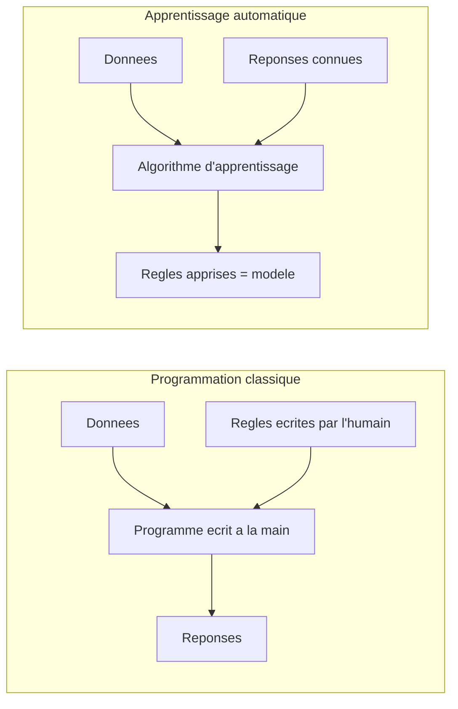

En programmation classique, l'humain fournit les **règles** et les **données**, la machine produit les **réponses**. En apprentissage automatique, on inverse : l'humain fournit les **données** et les **réponses observées**, et la machine produit les **règles** (sous la forme d'un *modèle*). C'est ce renversement qui rend la discipline si puissante : on peut résoudre des problèmes pour lesquels personne ne sait écrire la règle à la main (reconnaître un chat sur une photo, traduire une phrase, prévoir des ventes).

> **L'idée maîtresse, en une phrase.** Apprendre à partir de données, c'est *chercher, dans une grande famille de règles possibles, celle qui explique le mieux ce qu'on a déjà observé, dans l'espoir qu'elle explique aussi ce qu'on n'a pas encore vu.*

Cette phrase contient déjà toute la tension du domaine. « Expliquer le mieux ce qu'on a observé » : c'est l'**ajustement** (fit) aux données passées. « Expliquer aussi ce qu'on n'a pas encore vu » : c'est la **généralisation** (generalization). Un perroquet qui récite par cœur le carnet du marchand ajuste parfaitement le passé mais ne généralise pas : confronté à 28 °C, une valeur absente du carnet, il est muet. Tout l'art consiste à trouver le bon milieu.

#### Les trois grandes familles d'apprentissage

On distingue traditionnellement trois régimes, selon la nature de l'information dont on dispose.

| Régime | Ce qu'on possède | Question typique | Exemple |
|---|---|---|---|
| Supervisé (supervised) | Des entrées **et** les réponses attendues | « Quelle est la sortie pour cette entrée ? » | Prédire le prix d'un logement à partir de sa surface |
| Non supervisé (unsupervised) | Des entrées **sans** réponses | « Quelle structure se cache dans ces données ? » | Regrouper des clients en segments |
| Par renforcement (reinforcement) | Des récompenses suite à des actions | « Quelle action maximise la récompense à long terme ? » | Apprendre à un robot à marcher |

Ce chapitre, et le fil rouge qui le traverse, se concentrent sur l'**apprentissage supervisé**, le plus simple à appréhender et celui où les quatre piliers mathématiques se révèlent le plus clairement. Le marchand de glaces relève précisément de ce cas : chaque température (entrée) est accompagnée d'un nombre de ventes observé (réponse).

> **Remarque.** Cette taxonomie en trois familles est commode mais poreuse. L'auto-apprentissage (self-supervised learning), qui fabrique des étiquettes à partir des données elles-mêmes (par exemple cacher un mot dans une phrase et demander de le prédire), est devenu depuis 2018 le moteur des grands modèles de langage. On peut le voir comme du supervisé dont les réponses sont gratuites. Le socle mathématique, lui, ne change pas.

#### Pourquoi des mathématiques ?

On pourrait croire qu'il suffit de « lancer un algorithme sur les données ». Mais dès qu'on veut répondre précisément à *quel modèle ?*, *le meilleur en quel sens ?*, *avec quelle confiance ?*, *trouvé comment ?*, on bute sur des questions qui sont chacune un pan des mathématiques :

- *Comment représenter une donnée, un modèle, une transformation ?* → **algèbre linéaire** (linear algebra).
- *Comment mesurer ce que signifie « le mieux », et comment l'atteindre ?* → **optimisation** (optimization), via le **calcul différentiel** (calculus).
- *Comment raisonner sur le hasard, le bruit, l'incertitude ?* → **probabilités** (probability).
- *Comment estimer une grandeur inconnue et juger la fiabilité d'une conclusion ?* → **statistique** (statistics).

Ce sont les **quatre piliers**. Le reste du chapitre les présente, puis les fait travailler ensemble sur un unique exemple déroulé de bout en bout. Mais commençons par préciser le vocabulaire : qu'appelle-t-on exactement *donnée*, *modèle*, *paramètre* ?

---

### Données, modèles et paramètres

Reprenons le carnet du marchand et donnons un nom mathématique à chaque ingrédient. C'est ici qu'apparaissent nos premiers symboles : nous allons les introduire **un par un**, en expliquant chacun comme on l'expliquerait à un enfant.

#### Les données : observations chiffrées

Une **donnée** (data point), ou *exemple*, est une situation observée. Le marchand a observé $n$ jours. Pour le jour numéro $i$, il a noté la température, qu'on appelle $x_i$, et les ventes, qu'on appelle $y_i$.

> **Le symbole $\in$ (« appartient à »).** Ce symbole ressemble à un petit « e » arrondi, comme la première lettre du mot « élément ». Il représente l'idée d'**être un membre de**, d'**appartenir à une collection**. Quand on écrit « $x \in A$ », on lit « $x$ appartient à $A$ », et cela veut dire : *l'objet $x$ fait partie de la boîte $A$*. Imagine une trousse $A$ qui contient des crayons : si $x$ est un crayon de cette trousse, alors $x \in A$. À l'inverse, une gomme qui n'est pas dans la trousse n'y appartient pas.

> **Le symbole $\mathbb{R}$ (les nombres réels).** Ce symbole, un « R » à la barre doublée, représente l'ensemble de **tous les nombres de la droite graduée** : les entiers comme $3$, les nombres à virgule comme $2{,}5$ ou $-0{,}7$, et même des nombres infiniment précis comme $\pi \approx 3{,}1415\ldots$. Imagine une règle d'écolier infiniment longue, sans aucun trou : chaque point de cette règle est un nombre réel. Écrire « $x \in \mathbb{R}$ » signifie donc simplement « $x$ est un nombre, repérable quelque part sur cette règle ». Une température comme $28$ ou $19{,}3$ est un réel.

> **Le symbole $\mathbb{N}$ (les nombres entiers naturels).** Toujours un « N » à barre doublée, il représente les **nombres qu'on utilise pour compter** : $0, 1, 2, 3, 4, \ldots$ et ainsi de suite sans fin, mais **sans virgule ni nombre négatif**. Imagine que tu comptes des billes dans un sac : tu ne diras jamais « j'ai $2{,}5$ billes » ni « j'ai $-3$ billes ». Le nombre de jours observés, $n$, ou le numéro d'un jour, $i$, sont des entiers naturels : $n \in \mathbb{N}$, $i \in \mathbb{N}$.

> **Les indices, comme $x_i$.** Le petit nombre écrit en bas à droite, ici le $i$ de $x_i$, est un **indice** (index) : c'est une étiquette qui dit *de quel élément on parle*. Pense à une rangée de casiers numérotés : $x_1$ est ce qu'il y a dans le casier 1, $x_2$ dans le casier 2, et $x_i$ dans le casier numéro $i$, où $i$ est un numéro qu'on peut faire varier. L'indice ne change pas la nature de l'objet (c'est toujours une température), il dit juste *lequel*.

Avec ces symboles, on écrit proprement : pour chaque jour $i \in \{1, 2, \ldots, n\}$, on dispose d'un couple $(x_i, y_i)$ avec $x_i \in \mathbb{R}$ (la température) et $y_i \in \mathbb{R}$ (les ventes). L'**ensemble d'apprentissage** (training set) est la collection de tous ces couples :

```math
\mathcal{D} = \{ (x_1, y_1),\ (x_2, y_2),\ \ldots,\ (x_n, y_n) \}.
```

> **Le symbole $\mathcal{D}$ et les accolades $\{\ \}$.** La lettre $\mathcal{D}$ (un « D » calligraphié) est juste un **nom** qu'on donne à notre paquet de données — comme on appellerait « Médor » son chien. Les accolades $\{\ \}$, elles, signifient « **l'ensemble contenant** » : tout ce qui est écrit entre elles forme une collection, comme les objets posés dans une boîte. Ainsi $\mathcal{D}$ est la boîte qui contient les $n$ couples observés.

En pratique, une donnée a rarement un seul nombre. Pour prédire le prix d'un logement, on dispose de la surface, du nombre de pièces, de l'étage, etc. On regroupe alors ces $d$ nombres dans un **vecteur** (vector), c'est-à-dire une liste ordonnée :

```math
\mathbf{x}_i = \begin{pmatrix} x_{i,1} \\ x_{i,2} \\ \vdots \\ x_{i,d} \end{pmatrix} \in \mathbb{R}^d .
```

> **Le symbole $\mathbb{R}^d$ et le gras $\mathbf{x}$.** Quand on met un petit exposant $d$ sur $\mathbb{R}$, on parle de **listes de $d$ nombres réels** : $\mathbb{R}^2$ ce sont les couples $(a, b)$ (comme les coordonnées d'un point sur une carte, abscisse et ordonnée), $\mathbb{R}^3$ les triplets (longueur, largeur, hauteur d'une boîte), et $\mathbb{R}^d$ des listes de $d$ cases. On écrit le vecteur **en gras**, $\mathbf{x}$, pour le distinguer d'un simple nombre $x$ : le gras prévient « attention, ici il y a plusieurs nombres rangés ensemble, pas un seul ». Les trois points verticaux $\vdots$ veulent dire « et ainsi de suite, on ne réécrit pas toutes les lignes ».

Chaque case $x_{i,j}$ s'appelle une **caractéristique** (feature) : le numéro $j$ dit *quelle* caractéristique (surface, nombre de pièces…), le numéro $i$ dit *quel* exemple. Dans notre fil rouge du marchand, $d = 1$ : une seule caractéristique, la température, et le vecteur se réduit à un simple nombre.

#### Le modèle : une famille de règles candidates

Un **modèle** (model) est une **fonction** qui transforme une entrée en une prédiction. Voici le symbole le plus important du cours.

> **La notation fonctionnelle $f(x)$.** Le symbole $f$ représente une **machine qui transforme** : on lui donne quelque chose à l'entrée, elle recrache quelque chose à la sortie. L'écriture « $f(x)$ » se lit « $f$ de $x$ » et signifie « le résultat que produit la machine $f$ quand on lui donne $x$ ». Imagine un distributeur automatique : tu insères une pièce (l'entrée $x$), tu obtiens une canette (la sortie $f(x)$). Si la machine $f$ est « ajouter 3 », alors $f(2) = 5$ et $f(10) = 13$. La même machine, des entrées différentes, des sorties différentes. Une fonction, c'est donc une **règle de transformation fiable** : à chaque entrée elle associe une et une seule sortie.

Pour le marchand, le modèle prédit les ventes à partir de la température. Le modèle le plus simple imaginable est une **droite** : « les ventes sont, à peu près, un certain coefficient fois la température, plus une constante ». Mathématiquement :

```math
f(x) = a \, x + b .
```

Ici $a$ est la **pente** (de combien de glaces les ventes montent quand la température monte de un degré) et $b$ l'**ordonnée à l'origine** (les ventes prédites à $0$ °C). Le point essentiel : **$a$ et $b$ ne sont pas fixés**. En les faisant varier, on obtient une *infinité de droites différentes* — toute une famille de règles candidates. Apprendre, ce sera choisir le couple $(a, b)$ qui colle le mieux au carnet.

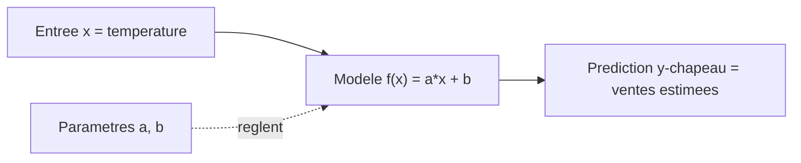

#### Les paramètres : les boutons réglables du modèle

Les nombres qu'on ajuste, ici $a$ et $b$, sont les **paramètres** (parameters) du modèle. On les regroupe souvent dans un vecteur $\boldsymbol{\theta}$ (la lettre grecque « thêta »). Pour la droite, $\boldsymbol{\theta} = (a, b)$, et l'on écrit parfois $f_{\boldsymbol\theta}(x)$ pour rappeler que la prédiction dépend du réglage choisi.

> **Le symbole $\boldsymbol{\theta}$ (thêta).** C'est une lettre de l'alphabet grec, qu'on utilise par tradition pour désigner « **les réglages inconnus qu'on cherche** ». Pense aux boutons d'une vieille radio : tourner le bouton du volume et celui de la fréquence change le son qui sort. Ici $\boldsymbol{\theta}$ regroupe tous les boutons du modèle ; pour la droite, $\boldsymbol{\theta} = (a, b)$, deux boutons. Trouver le bon $\boldsymbol{\theta}$, c'est régler la radio jusqu'à entendre la station clairement.

Il faut distinguer deux espèces de réglages, souvent confondues par les débutants :

> **Paramètres vs hyperparamètres.**
> Un **paramètre** est appris **par** l'algorithme à partir des données ($a$ et $b$ de la droite, les millions de poids d'un réseau de neurones).
> Un **hyperparamètre** (hyperparameter) est choisi **par l'humain avant** l'apprentissage et n'est pas ajusté par la descente sur les données (le degré d'un polynôme, le taux d'apprentissage, la force d'une régularisation). On le règle typiquement par validation. Confondre les deux est une source classique d'erreurs méthodologiques.

#### La fonction de coût : mesurer « le mieux »

Pour choisir entre deux droites, il faut un **juge** chiffré : un nombre qui dit à quel point une prédiction se trompe. C'est la **fonction de coût** (cost function), aussi appelée fonction de perte (loss function). L'idée : comparer, sur chaque jour, la prédiction $f_{\boldsymbol\theta}(x_i)$ à la vraie valeur $y_i$, et cumuler les écarts.

Pour cumuler, on a besoin du symbole de sommation.

> **Le symbole $\sum$ (somme, « sigma »).** Cette grande lettre grecque en forme de « E » anguleux représente une **addition répétée** : c'est une *boucle qui additionne*. L'écriture
> ```math
> \sum_{i=1}^{n} u_i
> ```
> se lit « somme, pour $i$ allant de $1$ jusqu'à $n$, des $u_i$ », et veut simplement dire $u_1 + u_2 + \cdots + u_n$. Décortiquons les étiquettes : le « $i=1$ » sous le sigma dit *où commence le compteur* ; le « $n$ » au-dessus dit *où il s'arrête* ; le $u_i$ à droite dit *ce qu'on additionne à chaque tour*. Imagine que tu fais le tour d'une classe et que tu additionnes les billes de chaque élève : tu commences à l'élève 1, tu t'arrêtes au dernier (le $n$-ième), et à chaque élève tu ajoutes son nombre de billes. Le sigma, c'est exactement cette tournée d'addition.

La fonction de coût la plus courante en régression est l'**erreur quadratique moyenne** (mean squared error, MSE) : on prend l'écart entre prédiction et réalité, on l'élève au carré (pour que les écarts négatifs et positifs comptent tous deux positivement, et pour pénaliser fort les grosses erreurs), puis on fait la moyenne :

```math
J(\boldsymbol{\theta}) = \frac{1}{n} \sum_{i=1}^{n} \big( f_{\boldsymbol{\theta}}(x_i) - y_i \big)^2 = \frac{1}{n} \sum_{i=1}^{n} \big( a\, x_i + b - y_i \big)^2 .
```

> **Lecture de $J(\boldsymbol{\theta})$.** La lettre $J$ est le nom du juge : on lui donne un réglage $\boldsymbol{\theta}$ et il renvoie un nombre, d'autant plus **petit** que le modèle est bon. Le « $\frac{1}{n}$ » devant transforme la somme en **moyenne** (on partage le total entre les $n$ jours, comme on partage une addition de restaurant entre les convives). L'exposant $2$ sur la parenthèse veut dire « **au carré** », c'est-à-dire le nombre multiplié par lui-même : un écart de $3$ compte pour $9$, un écart de $5$ pour $25$ — les grosses erreurs pèsent donc beaucoup plus lourd.

Apprendre se reformule alors en un problème net : **trouver le réglage $\boldsymbol{\theta}$ qui rend $J(\boldsymbol{\theta})$ le plus petit possible.** C'est un problème d'optimisation, deuxième pilier. Mais avant de le résoudre, prenons de la hauteur et regardons les quatre piliers ensemble.

> **Mise a jour 2026.** Le triptyque *données → modèle → paramètres* est resté identique des moindres carrés de Gauss et Legendre (vers 1805–1809) aux modèles de fondation (foundation models) actuels. Ce qui a explosé, c'est l'**échelle** : un grand modèle de langage compte aujourd'hui des dizaines à des centaines de milliards de paramètres, et les « données » sont des corpus de plusieurs milliers de milliards de tokens. La nouveauté conceptuelle n'est pas dans la définition, mais dans les *lois d'échelle* (scaling laws) qui relient empiriquement la performance à la taille du modèle, à la quantité de données et au budget de calcul.

---

### Les quatre piliers mathématiques

Tout l'édifice de l'apprentissage automatique repose sur quatre disciplines mathématiques qui se répondent. On peut les voir comme les quatre pieds d'une table : retirez-en un, et tout penche.

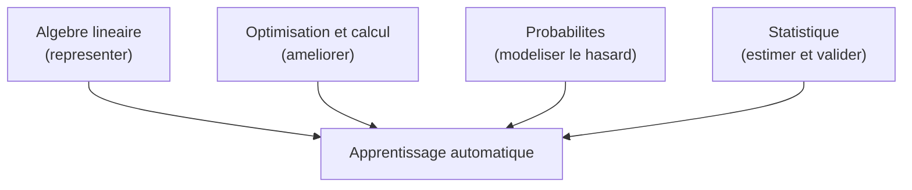

| Pilier | Verbe-clé | Question à laquelle il répond | Objets centraux |
|---|---|---|---|
| Algèbre linéaire | **Représenter** | Comment encoder et transformer données et modèles ? | Vecteurs, matrices, produits, projections, valeurs propres |
| Optimisation & calcul | **Améliorer** | Comment trouver les meilleurs paramètres ? | Dérivée, gradient, descente de gradient, convexité |
| Probabilités | **Modéliser le hasard** | Comment décrire le bruit et l'incertitude ? | Variable aléatoire, loi, espérance, variance |
| Statistique | **Estimer & valider** | Comment inférer des grandeurs et juger la fiabilité ? | Estimateur, biais, variance, vraisemblance, test |

#### Pilier 1 — L'algèbre linéaire : le langage des données

Dès qu'une donnée a plusieurs caractéristiques, c'est un vecteur ; dès qu'on empile plusieurs exemples, c'est une **matrice** (matrix). Empilons les $n$ exemples (un par ligne), chacun ayant $d$ caractéristiques (une par colonne) : on obtient la **matrice de conception** (design matrix) $X \in \mathbb{R}^{n \times d}$.

> **Le symbole $\mathbb{R}^{n \times d}$ (une matrice).** Une matrice est un **tableau rectangulaire de nombres**, comme une grille de classeur ou un échiquier rempli de chiffres. L'écriture $n \times d$ (lue « $n$ par $d$ ») donne ses dimensions : $n$ lignes et $d$ colonnes. Imagine un tableau Excel où chaque **ligne** est un jour observé et chaque **colonne** une caractéristique mesurée : c'est exactement une matrice de conception.

Le modèle linéaire à $d$ caractéristiques s'écrit alors d'un seul coup pour tous les exemples grâce au **produit matrice-vecteur**. En notant $\hat{\mathbf{y}} \in \mathbb{R}^n$ le vecteur des $n$ prédictions et $\boldsymbol\theta \in \mathbb{R}^d$ le vecteur des $d$ paramètres :

```math
\hat{\mathbf{y}} = X \boldsymbol{\theta},
\qquad \text{soit composante par composante} \qquad
\hat{y}_i = \sum_{j=1}^{d} X_{i,j}\, \theta_j .
```

Les dimensions concordent : multiplier une matrice $n \times d$ par un vecteur de taille $d$ produit bien un vecteur de taille $n$, une prédiction par exemple.

> **Le chapeau, comme dans $\hat{y}$.** Le petit accent en forme de toit, $\hat{y}$ (lu « y chapeau »), signifie « **valeur estimée / prédite** », par opposition à $y$ qui est la **vraie** valeur observée. Pense au chapeau comme à une étiquette « ceci est une supposition de la machine, pas la réalité mesurée ». L'écart entre $y$ (réalité) et $\hat{y}$ (prédiction) est précisément ce que la fonction de coût cherche à réduire.

Ce simple produit $X\boldsymbol{\theta}$ encapsule des milliers d'additions et de multiplications. L'algèbre linéaire fournit aussi des outils profonds : la **décomposition en valeurs singulières** (singular value decomposition, SVD) pour comprendre la structure d'une matrice, l'**analyse en composantes principales** (principal component analysis, ACP/PCA) pour réduire la dimension, les **valeurs propres** (eigenvalues) pour analyser la stabilité d'un système. Tout cela sera détaillé dans les chapitres dédiés ; pour l'instant, retenez : *l'algèbre linéaire est l'alphabet dans lequel s'écrivent les données et les modèles.*

> **Mise a jour 2026.** Sur de très grandes matrices, on n'utilise plus les SVD/ACP exactes mais des **méthodes randomisées** (randomized SVD) : on projette d'abord la matrice sur un petit sous-espace aléatoire, ce qui donne une approximation excellente pour un coût bien moindre. C'est devenu un standard dès que $n$ ou $d$ dépasse quelques dizaines de milliers.

#### Pilier 2 — L'optimisation et le calcul : la mécanique de l'amélioration

Une fois le coût $J(\boldsymbol{\theta})$ défini, comment trouver son minimum ? L'outil fondamental est la **dérivée**, qui mesure une pente. En plusieurs dimensions, la pente devient le **gradient**.

> **Le symbole $\nabla$ (nabla, le gradient).** Ce triangle pointant vers le bas, $\nabla$, représente le **gradient** : c'est la collection de toutes les pentes du coût, une dans chaque direction de réglage. Imagine que tu es sur une colline dans le brouillard et que tu veux descendre : en chaque point, le gradient est la flèche qui pointe vers la montée la plus raide. Pour descendre, il suffit donc d'aller **dans le sens opposé** à cette flèche. Le gradient $\nabla J(\boldsymbol{\theta})$ rassemble, pour chaque bouton de réglage, « de combien le coût augmente si je tourne légèrement ce bouton ».

L'algorithme-roi est la **descente de gradient** (gradient descent) : partir d'un réglage quelconque, calculer la pente, faire un petit pas en sens inverse, recommencer.

```math
\boldsymbol{\theta}_{t+1} = \boldsymbol{\theta}_t - \eta \, \nabla J(\boldsymbol{\theta}_t).
```

> **Le symbole $\eta$ (êta, le taux d'apprentissage).** Cette lettre grecque (qui ressemble à un « n » avec une jambe qui descend) est le **taux d'apprentissage** (learning rate) : la **taille du pas** qu'on fait à chaque étape. Trop petit, on descend la colline à pas de fourmi (très lent) ; trop grand, on enjambe le creux et on rebondit d'un versant à l'autre sans jamais atteindre le fond. Le $t$ en indice, lui, est le **numéro de l'étape** : $\boldsymbol{\theta}_0$ est le réglage de départ, $\boldsymbol{\theta}_1$ après un pas, et ainsi de suite.

La **convexité** (convexity) joue un rôle décisif : si la surface du coût a la forme d'un bol unique (cas du MSE linéaire), la descente atteint le fond, le minimum global. Si elle est bosselée (cas des réseaux profonds), on peut rester coincé dans un creux local. Le calcul différentiel (dérivées partielles, règle de la chaîne) est le moteur qui rend tout cela calculable.

> **Mise a jour 2026.** Deux révolutions ont transformé ce pilier. (1) La **différentiation automatique** (automatic differentiation, *autodiff*) des bibliothèques comme PyTorch et JAX calcule le gradient $\nabla J$ exactement et automatiquement, même pour des modèles à des milliards de paramètres : on n'écrit plus jamais les dérivées à la main. (2) Les optimiseurs **Adam** et **AdamW** (vers 2015–2019) adaptent un taux d'apprentissage par paramètre et sont devenus le réglage par défaut du deep learning, là où la descente de gradient « brute » suffisait pour les modèles linéaires.

#### Pilier 3 — Les probabilités : le langage de l'incertitude

Les données réelles sont bruitées. Deux jours à $25$ °C ne donnent pas exactement les mêmes ventes : la pluie, un événement local, le hasard interviennent. Les **probabilités** offrent le vocabulaire pour modéliser ce bruit.

> **Le symbole $\mathbb{P}$ et la variable aléatoire.** $\mathbb{P}(A)$ (un « P » à barre doublée) représente la **probabilité** de l'événement $A$ : un nombre entre $0$ (impossible) et $1$ (certain) qui mesure *à quel point on s'attend à ce que $A$ se produise*. Une **variable aléatoire** (random variable) est, quant à elle, une quantité dont la valeur dépend du hasard — comme le résultat d'un dé pas encore lancé. Imagine un sac de billes de couleurs : tirer une bille au hasard est l'expérience, et $\mathbb{P}(\text{bleue})$ est la part de billes bleues dans le sac.

L'objet central pour résumer une variable aléatoire est l'**espérance** (expectation), notée $\mathbb{E}$ : c'est sa **valeur moyenne à long terme**.

> **Le symbole $\mathbb{E}$ (espérance).** $\mathbb{E}[Z]$ se lit « espérance de $Z$ » et représente la **moyenne qu'on obtiendrait en répétant l'expérience une infinité de fois**. Pense à un jeu de dé équilibré à six faces où tu gagnes le nombre affiché : tu ne sais pas ce que tu gagneras au prochain lancer, mais sur des milliers de lancers, tu gagnes en moyenne $\frac{1+2+3+4+5+6}{6} = 3{,}5$ par lancer — c'est l'espérance. C'est le « centre de gravité » de la variable aléatoire.

Le bruit du marchand se modélise typiquement ainsi : la vraie valeur est la droite plus un aléa $\varepsilon$ (epsilon) de moyenne nulle,

```math
y_i = a\, x_i + b + \varepsilon_i, \qquad \varepsilon_i \sim \mathcal{N}(0, \sigma^2).
```

> **Les symboles $\varepsilon$, $\sim$ et $\mathcal{N}(0,\sigma^2)$.** La lettre $\varepsilon$ (epsilon grec) désigne par tradition une **petite quantité**, ici le **bruit** qui s'ajoute à la prédiction idéale. Le symbole $\sim$ se lit « **suit la loi** » : il dit *de quelle façon le hasard est distribué*. Enfin $\mathcal{N}(0, \sigma^2)$ désigne la célèbre **loi normale** (normal distribution), la fameuse « courbe en cloche » : la plupart des valeurs sont proches du centre ($0$ ici), les valeurs extrêmes sont rares. Le $\sigma^2$ (sigma au carré) est la **variance**, qui mesure *l'étalement* de la cloche : petit $\sigma^2$, cloche étroite et bruit faible ; grand $\sigma^2$, cloche large et bruit fort. Imagine des fléchettes lancées vers un centre : $0$ est la cible visée, $\sigma$ dit à quel point elles se dispersent autour.

Ce point de vue probabiliste est fécond : il transforme « ajuster une droite » en « estimer les paramètres d'un modèle de génération de données ». Et, magie que nous démontrerons, **minimiser l'erreur quadratique revient exactement à maximiser la vraisemblance** sous l'hypothèse d'un bruit gaussien. Les deux premiers piliers (coût, optimisation) et le troisième (probabilités) se rejoignent.

#### Pilier 4 — La statistique : estimer et valider

La statistique se demande : *à partir d'un échantillon fini, que peut-on conclure, et avec quelle confiance ?* Un **estimateur** (estimator) est une recette qui, à partir des données, produit une estimation d'une quantité inconnue (par exemple $\hat{a}$ et $\hat{b}$ estiment les vrais $a, b$). On juge un estimateur par son **biais** (bias, l'erreur systématique) et sa **variance** (variance, l'instabilité d'un échantillon à l'autre).

C'est ici que vit la tension fondamentale de tout l'apprentissage, le **compromis biais-variance** (bias-variance tradeoff) :

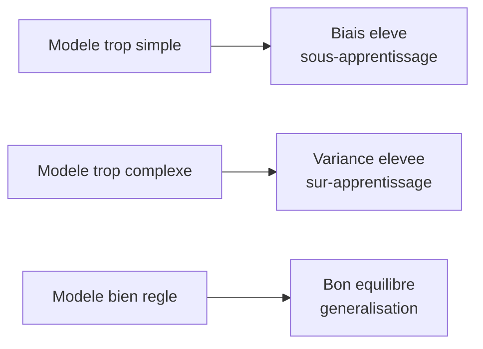

> **Sous-apprentissage et sur-apprentissage.**
> Le **sous-apprentissage** (underfitting) : le modèle est trop pauvre pour capturer la tendance (une droite pour des données en forme de vague). Beaucoup de biais.
> Le **sur-apprentissage** (overfitting) : le modèle est si flexible qu'il épouse le bruit, mémorisant les données d'entraînement sans généraliser (le perroquet du marchand). Beaucoup de variance.
> Le but est l'**équilibre** : un modèle qui capte le signal sans coller au bruit.

C'est la statistique qui fournit les protocoles pour mesurer la vraie performance : séparer les données en jeu d'entraînement / jeu de test, faire de la **validation croisée** (cross-validation), construire des **intervalles de confiance** (confidence intervals), conduire des **tests d'hypothèse** (hypothesis tests). Sans elle, on confond mémorisation et compréhension.

> **Le piège n°1 du débutant.** Évaluer un modèle sur les **données qui ont servi à l'entraîner** donne un score artificiellement flatteur. *On ne juge jamais un élève en lui reposant exactement les questions de ses propres fiches de révision.* La performance qui compte est celle sur des données **jamais vues** pendant l'apprentissage. Ce principe, simple mais constamment oublié, est le cœur de la méthodologie expérimentale en apprentissage.

> **Mise a jour 2026.** Le compromis biais-variance classique prédit qu'un modèle trop complexe sur-apprend toujours. Or les réseaux très surparamétrés (plus de paramètres que de données) généralisent souvent excellemment : le phénomène de **double descente** (double descent), bien documenté depuis 2019, montre que l'erreur de test peut *rediminuer* au-delà du point d'interpolation. Cela n'invalide pas le compromis — il faut le lire à travers des notions de complexité plus fines (régularisation implicite de la descente de gradient, norme des solutions) — mais il a profondément renouvelé la théorie de la généralisation.

Ces quatre piliers ne vivent pas séparément : ils collaborent sur le moindre problème. Pour le montrer concrètement, déroulons maintenant le fil rouge de bout en bout.

---

### Fil rouge : ajuster une droite, de bout en bout

Reprenons le marchand de glaces et résolvons son problème **complètement**, en mobilisant les quatre piliers. C'est l'exemple canonique de la **régression linéaire** (linear regression) : il est assez simple pour être traité à la main, assez riche pour contenir, en germe, presque toute la discipline.

#### Étape 0 — Les données chiffrées

Prenons un petit jeu de $n = 5$ jours (volontairement minuscule pour tout calculer à la main).

| Jour $i$ | Température $x_i$ (°C) | Ventes $y_i$ |
|---|---|---|
| 1 | 15 | 40 |
| 2 | 18 | 50 |
| 3 | 20 | 60 |
| 4 | 23 | 65 |
| 5 | 24 | 70 |

L'œil devine une tendance croissante presque rectiligne. Cherchons la **meilleure droite** $f(x) = a\,x + b$ au sens des moindres carrés.

#### Étape 1 — Poser le problème (pilier optimisation)

On cherche $(a, b)$ minimisant l'erreur quadratique moyenne. Pour la régression linéaire simple, il existe une **solution exacte en forme close** (closed form) : on n'a même pas besoin de descente de gradient. Annulons les dérivées partielles du coût.

Le coût (on travaille avec la somme, car le facteur $\frac1n$ est une constante positive qui ne change pas le minimiseur) :

```math
S(a, b) = \sum_{i=1}^{n} \big( a\, x_i + b - y_i \big)^2 .
```

> **Le symbole $\partial$ (dérivée partielle).** Ce « d » arrondi, $\partial$, signifie « **dérivée partielle** » : on mesure la pente du coût en ne bougeant **qu'un seul** bouton à la fois, les autres restant figés. Imagine une cuisine avec deux robinets, eau chaude et eau froide : $\frac{\partial}{\partial a}$ répond à « si je tourne *seulement* le robinet $a$, comment change la température de l'eau ? », sans toucher au robinet $b$. Au minimum d'un bol, *toutes* ces pentes sont nulles en même temps.

On dérive $S$ par rapport à $a$ puis à $b$ et on annule (règle de la chaîne sur le carré) :

```math
\frac{\partial S}{\partial a} = \sum_{i=1}^{n} 2\,(a x_i + b - y_i)\,x_i = 0,
\qquad
\frac{\partial S}{\partial b} = \sum_{i=1}^{n} 2\,(a x_i + b - y_i) = 0 .
```

En divisant par $2$ et en réarrangeant, on obtient le système dit des **équations normales** (normal equations) :

```math
\begin{cases}
a \displaystyle\sum_i x_i^2 + b \sum_i x_i = \sum_i x_i y_i, \\[2mm]
a \displaystyle\sum_i x_i + b\, n = \sum_i y_i .
\end{cases}
```

#### Étape 2 — Calculer les sommes (le sigma au travail)

Calculons chaque somme nécessaire. C'est littéralement la « tournée d'addition » du sigma.

| $i$ | $x_i$ | $y_i$ | $x_i^2$ | $x_i y_i$ |
|---|---|---|---|---|
| 1 | 15 | 40 | 225 | 600 |
| 2 | 18 | 50 | 324 | 900 |
| 3 | 20 | 60 | 400 | 1200 |
| 4 | 23 | 65 | 529 | 1495 |
| 5 | 24 | 70 | 576 | 1680 |
| **Σ** | **100** | **285** | **2054** | **5875** |

Donc $\sum x_i = 100$, $\sum y_i = 285$, $\sum x_i^2 = 2054$, $\sum x_i y_i = 5875$, et $n = 5$.

Les moyennes valent $\bar{x} = 100/5 = 20$ et $\bar{y} = 285/5 = 57$.

> **Le symbole $\bar{x}$ (barre, la moyenne).** La petite barre horizontale au-dessus, $\bar{x}$ (lu « x barre »), désigne la **moyenne** des valeurs : on additionne tout et on partage équitablement, $\bar{x} = \frac1n \sum_i x_i$. C'est le point d'équilibre, comme le centre d'une balançoire où les enfants assis de part et d'autre se font contrepoids.

#### Étape 3 — Résoudre les équations normales

Il existe une formule fermée très utile. En soustrayant les moyennes (centrage), la pente et l'ordonnée s'écrivent :

```math
\hat{a} = \frac{\displaystyle\sum_i (x_i - \bar{x})(y_i - \bar{y})}{\displaystyle\sum_i (x_i - \bar{x})^2},
\qquad
\hat{b} = \bar{y} - \hat{a}\,\bar{x}.
```

Calculons le numérateur $\sum_i (x_i-\bar x)(y_i - \bar y)$ et le dénominateur $\sum_i (x_i-\bar x)^2$ :

| $i$ | $x_i-\bar x$ | $y_i-\bar y$ | $(x_i-\bar x)(y_i-\bar y)$ | $(x_i-\bar x)^2$ |
|---|---|---|---|---|
| 1 | $-5$ | $-17$ | $85$ | $25$ |
| 2 | $-2$ | $-7$ | $14$ | $4$ |
| 3 | $0$ | $3$ | $0$ | $0$ |
| 4 | $3$ | $8$ | $24$ | $9$ |
| 5 | $4$ | $13$ | $52$ | $16$ |
| **Σ** | | | **175** | **54** |

D'où la pente et l'ordonnée à l'origine :

```math
\hat{a} = \frac{175}{54} \approx 3{,}2407,
\qquad
\hat{b} = \bar{y} - \hat{a}\,\bar{x} = 57 - \frac{175}{54}\times 20 \approx -7{,}8148 .
```

La droite ajustée est donc $\boxed{\,\hat{y} = 3{,}2407\,x - 7{,}8148\,}$. Interprétation concrète : **chaque degré supplémentaire fait vendre environ $3{,}24$ glaces de plus**. Pour demain à $28$ °C : $\hat{y} = \frac{175}{54}\times 28 - 7{,}8148 \approx 82{,}9$, soit environ **83 glaces**.

> **Attention aux arrondis.** Tout au long de cette étape, on garde la valeur exacte $\hat a = 175/54$ dans les calculs et l'on n'arrondit qu'à l'affichage. Reporter une pente déjà arrondie (par exemple $3{,}24$) dans le calcul de $\hat b$ ou de la prévision propagerait l'erreur et fausserait les chiffres suivants. C'est un réflexe à prendre dès maintenant.

#### Étape 4 — Mesurer la qualité (pilier statistique)

Calculons les prédictions sur les données d'entraînement et les **résidus** (residuals) $r_i = y_i - \hat{y}_i$, en utilisant le modèle exact $\hat y = \frac{175}{54}x - \frac{422}{54}$ (les colonnes sont affichées arrondies à trois décimales).

| $i$ | $x_i$ | $y_i$ | $\hat{y}_i$ | résidu $r_i = y_i - \hat y_i$ |
|---|---|---|---|---|
| 1 | 15 | 40 | $40{,}796$ | $-0{,}796$ |
| 2 | 18 | 50 | $50{,}519$ | $-0{,}519$ |
| 3 | 20 | 60 | $57{,}000$ | $+3{,}000$ |
| 4 | 23 | 65 | $66{,}722$ | $-1{,}722$ |
| 5 | 24 | 70 | $69{,}963$ | $+0{,}037$ |

L'erreur quadratique moyenne vaut

```math
J = \frac{1}{5}\big( (-0{,}796)^2 + (-0{,}519)^2 + 3{,}000^2 + (-1{,}722)^2 + 0{,}037^2 \big) \approx \frac{1}{5}(0{,}634 + 0{,}269 + 9{,}000 + 2{,}966 + 0{,}001) \approx 2{,}574.
```

On résume souvent la qualité par le **coefficient de détermination** $R^2$ : la part de la variance des $y$ expliquée par le modèle.

> **Le symbole $R^2$ (coefficient de détermination).** Il représente la **proportion de la variabilité expliquée** par le modèle. Pour un modèle linéaire ajusté par moindres carrés (avec ordonnée à l'origine), il est compris entre $0$ et $1$. À $R^2 = 1$, le modèle passe parfaitement par tous les points ; à $R^2 = 0$, il ne fait pas mieux que prédire bêtement la moyenne $\bar y$ pour tout le monde. Pense à une note sur $1$ : $0{,}98$ veut dire « le modèle explique 98 % de ce qui fait varier les ventes ».

Avec la variance totale (au sens des sommes de carrés) $\sum_i (y_i - \bar y)^2 = 17^2+7^2+3^2+8^2+13^2 = 289+49+9+64+169 = 580$ et la somme des carrés des résidus $\sum_i r_i^2 \approx 12{,}87$ :

```math
R^2 = 1 - \frac{\sum_i r_i^2}{\sum_i (y_i - \bar y)^2} = 1 - \frac{12{,}87}{580} \approx 0{,}978 .
```

Un $R^2 \approx 0{,}978$ : la droite explique près de 98 % de la variabilité des ventes. Excellent ajustement — mais attention, **mesuré sur les données d'entraînement** ; pour une vraie estimation de généralisation, il faudrait un jeu de test (voir le piège plus haut).

#### Étape 5 — Le point de vue probabiliste : moindres carrés = maximum de vraisemblance

Voici le pont entre piliers, et un résultat central qu'on démontre entièrement.

> **Définition — vraisemblance (likelihood).** Étant donné un modèle probabiliste dépendant de paramètres $\boldsymbol\theta$, la **vraisemblance** des données observées est la probabilité (ou densité) que le modèle leur attribue, vue *comme une fonction de $\boldsymbol\theta$*. Estimer par **maximum de vraisemblance** (maximum likelihood estimation, MLE), c'est choisir le $\boldsymbol\theta$ qui rend les données observées les plus plausibles.

Supposons le modèle génératif $y_i = a x_i + b + \varepsilon_i$ avec $\varepsilon_i \sim \mathcal N(0, \sigma^2)$ indépendants. La densité de la loi normale donne, pour une observation $y_i$ :

```math
p(y_i \mid x_i; a, b) = \frac{1}{\sqrt{2\pi\sigma^2}} \exp\!\left( -\frac{(y_i - a x_i - b)^2}{2\sigma^2} \right).
```

> **Les symboles $\exp$, $\pi$ et la barre $\mid$.** $\exp(u)$ est la **fonction exponentielle**, une machine qui fait grandir très vite ; ici, comme l'argument $-\frac{(\cdot)^2}{2\sigma^2}$ est négatif, elle fabrique la forme en cloche (plus on s'éloigne du centre, plus la valeur s'écrase vers zéro). $\pi \approx 3{,}1416$ est la constante du cercle, qui apparaît naturellement dans la cloche gaussienne. La barre verticale $\mid$ se lit « **sachant** » : $p(y_i \mid x_i)$ est « la plausibilité de $y_i$ *sachant* la température $x_i$ ». Le point-virgule sépare les données des paramètres dont dépend la loi.

Comme les observations sont indépendantes, la vraisemblance de tout l'échantillon est le **produit** des densités :

```math
L(a, b) = \prod_{i=1}^{n} p(y_i \mid x_i; a, b).
```

> **Le symbole $\prod$ (produit, « pi majuscule »).** Frère jumeau du sigma, ce grand $\prod$ est une *boucle qui multiplie* au lieu d'additionner : $\prod_{i=1}^{n} u_i = u_1 \times u_2 \times \cdots \times u_n$. On multiplie les densités parce que, pour des observations indépendantes, la plausibilité qu'elles surviennent **toutes ensemble** est le produit de leurs plausibilités (comme tirer deux fois pile de suite : $\frac12 \times \frac12$).

Maximiser un produit de termes minuscules est numériquement périlleux ; on passe au **logarithme** (logarithm), qui transforme produits en sommes et ne déplace pas le maximum (il est strictement croissant).

> **Le symbole $\log$ (logarithme).** Le logarithme est la machine **inverse** de l'exponentielle : il *écrase* les grands nombres et, surtout, transforme une multiplication en addition, $\log(u\cdot v) = \log u + \log v$. C'est l'outil qui change le produit redoutable $\prod$ en somme amicale $\sum$. Comme il conserve l'ordre (si $A > B > 0$ alors $\log A > \log B$), maximiser $L$ ou maximiser $\log L$ donne le **même** vainqueur. Ici $\log$ désigne le logarithme népérien (base $e$), inverse de $\exp$.

La **log-vraisemblance** (log-likelihood) devient :

```math
\ell(a,b) = \log L(a,b) = \sum_{i=1}^{n} \left[ -\tfrac12 \log(2\pi\sigma^2) - \frac{(y_i - a x_i - b)^2}{2\sigma^2} \right].
```

Le premier terme ne dépend pas de $(a,b)$ : c'est une constante pour notre problème (à $\sigma$ fixé). Maximiser $\ell$ revient donc à maximiser $-\frac{1}{2\sigma^2}\sum_i (y_i - a x_i - b)^2$, c'est-à-dire, puisque $\frac{1}{2\sigma^2} > 0$, à **minimiser** $\sum_i (y_i - a x_i - b)^2$. Conclusion, encadrée tant elle est importante :

> **Théorème (moindres carrés ⇔ MLE gaussien).** Sous l'hypothèse d'un bruit gaussien indépendant de variance constante, l'estimateur des **moindres carrés** coïncide exactement avec l'estimateur du **maximum de vraisemblance** des paramètres $(a,b)$. Minimiser l'erreur quadratique, ce n'est pas un choix arbitraire : c'est rendre les données observées les plus probables sous un modèle de bruit en cloche.

Ce résultat soude les piliers optimisation, probabilités et statistique autour de la même solution $(\hat a, \hat b)$. Le pilier algèbre linéaire entre en scène dès qu'on généralise à plusieurs caractéristiques : les équations normales s'écrivent alors d'un trait, $X^\top X\, \boldsymbol\theta = X^\top \mathbf y$, dont la solution, lorsque $X^\top X$ est inversible, est $\hat{\boldsymbol\theta} = (X^\top X)^{-1} X^\top \mathbf y$.

> **Les symboles $X^\top$ et l'inverse $(\cdot)^{-1}$.** Le petit « T » en exposant, $X^\top$, est la **transposée** : on bascule le tableau en échangeant lignes et colonnes (comme coucher sur le côté une feuille de tableur). Si $X$ est $n\times d$, alors $X^\top$ est $d\times n$, donc $X^\top X$ est $d\times d$ (carrée). L'exposant $-1$, lui, désigne l'**inverse** d'une matrice carrée : la matrice qui « annule » l'effet de $X^\top X$, analogue matriciel du $\frac1z$ qui annule la multiplication par $z\neq 0$. Ensemble, ils résolvent le système d'un seul geste — c'est l'algèbre linéaire qui referme la boucle des quatre piliers.

#### Étape 6 — Tout vérifier en code

Vérifions nos calculs à la main avec NumPy, puis comparons à la solution matricielle et à la descente de gradient.

```python
import numpy as np

x = np.array([15, 18, 20, 23, 24], dtype=float)
y = np.array([40, 50, 60, 65, 70], dtype=float)
n = x.size

x_bar, y_bar = x.mean(), y.mean()
a_hat = np.sum((x - x_bar) * (y - y_bar)) / np.sum((x - x_bar) ** 2)
b_hat = y_bar - a_hat * x_bar
print(f"pente a = {a_hat:.4f}, ordonnee b = {b_hat:.4f}")

y_hat = a_hat * x + b_hat
mse = np.mean((y - y_hat) ** 2)
ss_res = np.sum((y - y_hat) ** 2)
ss_tot = np.sum((y - y_bar) ** 2)
r2 = 1 - ss_res / ss_tot
print(f"MSE = {mse:.4f}, R^2 = {r2:.4f}")
print(f"prevision a 28 C = {a_hat * 28 + b_hat:.1f} glaces")
```

Sortie attendue :

```
pente a = 3.2407, ordonnee b = -7.8148
MSE = 2.5741, R^2 = 0.9778
prevision a 28 C = 82.9 glaces
```

La forme matricielle $\hat{\boldsymbol\theta} = (X^\top X)^{-1} X^\top \mathbf y$, en ajoutant une colonne de $1$ pour l'ordonnée à l'origine :

```python
X = np.column_stack([x, np.ones(n)])
theta = np.linalg.inv(X.T @ X) @ X.T @ y
print("solution matricielle (a, b) =", np.round(theta, 4))

theta_lstsq, *_ = np.linalg.lstsq(X, y, rcond=None)
print("via lstsq (a, b) =", np.round(theta_lstsq, 4))
```

> **Mise a jour 2026.** En pratique, **n'inversez jamais $X^\top X$ à la main** : l'inversion explicite est numériquement instable (elle élève au carré le mauvais conditionnement de $X$). Les bibliothèques modernes résolvent les moindres carrés par décomposition QR ou SVD via `numpy.linalg.lstsq` (ou `scipy.linalg.lstsq`), plus stables. Pour de très grands jeux, on préfère la descente de gradient stochastique. L'opérateur `@` de Python (PEP 465, depuis 2015) note le produit matriciel et rend ce code lisible.

Et la même chose en descente de gradient, pour faire le lien avec le pilier optimisation et préfigurer le deep learning. Un piège pratique apparaît ici : les températures (de $15$ à $24$) et les ventes (de $40$ à $70$) vivent à des échelles différentes, ce qui rend le coût très « allongé » dans une direction (son conditionnement vaut ici environ $1{,}6\times 10^4$). Une descente brute sur les données telles quelles convergerait extrêmement lentement. Le remède standard en apprentissage est de **standardiser** la caractéristique (la centrer puis la diviser par son écart-type) ; la descente converge alors en quelques milliers de pas, et l'on retraduit ensuite les coefficients vers l'échelle d'origine.

```python
mu, sd = x.mean(), x.std()
z = (x - mu) / sd

a_z, b_z = 0.0, 0.0
eta = 0.1
for t in range(2000):
    y_hat = a_z * z + b_z
    grad_a = (2 / n) * np.sum((y_hat - y) * z)
    grad_b = (2 / n) * np.sum(y_hat - y)
    a_z -= eta * grad_a
    b_z -= eta * grad_b

a_gd = a_z / sd
b_gd = b_z - a_z * mu / sd
print(f"descente de gradient : a = {a_gd:.4f}, b = {b_gd:.4f}")
```

Sortie attendue :

```
descente de gradient : a = 3.2407, b = -7.8148
```

Les trois méthodes — formule fermée scalaire, formule matricielle, descente de gradient (sur données standardisées) — convergent vers le même $(\hat a, \hat b)$. Le marchand a sa règle ; nous avons, au passage, vu les quatre piliers coopérer sur un même problème.

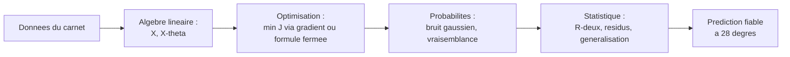

---

### Les notations de base, introduites au fil de l'eau

Cette section ne réintroduit rien : elle **rassemble en contexte** les symboles déjà rencontrés, en les reliant et en comblant les quelques notations transverses utiles pour toute la suite. Chaque symbole a été expliqué « comme à un enfant » à sa première apparition ; on en consolide ici la lecture.

#### Ensembles de nombres et appartenance

On a vu $\mathbb{N}$ (entiers de comptage $0,1,2,\ldots$), $\mathbb{R}$ (tous les nombres de la droite graduée), $\mathbb{R}^d$ (listes de $d$ réels, les vecteurs) et $\mathbb{R}^{n\times d}$ (tableaux $n$ par $d$, les matrices). On complète par deux notations très fréquentes.

> **Les symboles $\mathbb{Z}$ et l'intervalle $[a,b]$.** $\mathbb{Z}$ (de l'allemand *Zahlen*, « nombres ») représente les **entiers relatifs** : les entiers naturels **plus** leurs opposés négatifs, $\ldots, -2, -1, 0, 1, 2, \ldots$. C'est $\mathbb{N}$ auquel on ajoute le côté gauche de la règle (les nombres en dessous de zéro, comme une température hivernale de $-3$ °C). L'écriture $[a, b]$ désigne un **intervalle** : *tous* les réels compris entre $a$ et $b$, bornes incluses (les crochets tournés vers l'intérieur disent « on prend aussi les extrémités »). Par exemple une probabilité vit dans $[0, 1]$ : elle peut valoir $0$, $1$, ou n'importe quelle valeur entre les deux.

Le symbole $\in$ (« appartient à ») relie un objet à son ensemble ; sa négation se note $\notin$ (« n'appartient pas à »). On a aussi l'inclusion entre ensembles :

> **Le symbole $\subseteq$ (inclusion).** $A \subseteq B$ se lit « $A$ est inclus dans $B$ » et signifie *tout élément de $A$ est aussi dans $B$* : la petite boîte $A$ tient entièrement dans la grande boîte $B$. Par exemple $\mathbb{N} \subseteq \mathbb{Z} \subseteq \mathbb{R}$ : chaque ensemble de nombres est contenu dans le suivant, comme des poupées russes.

#### Scalaires, vecteurs, matrices : la convention typographique

Une convention de notation, tenue dans tout le cours, évite bien des confusions :

| Objet | Notation | Exemple | Intuition |
|---|---|---|---|
| Scalaire (un seul nombre) | minuscule normale | $x,\ a,\ \eta,\ \sigma$ | une case |
| Vecteur (liste de nombres) | minuscule **grasse** | $\mathbf{x},\ \boldsymbol{\theta},\ \mathbf{y}$ | une colonne de cases |
| Matrice (tableau de nombres) | MAJUSCULE | $X,\ A,\ \Sigma$ | une grille de cases |
| Ensemble | majuscule calligraphiée ou ajourée | $\mathcal{D},\ \mathbb{R}$ | une boîte |

> **Attention à $\sigma$ vs $\Sigma$.** La minuscule $\sigma$ (sigma) désigne un **écart-type** (un seul nombre, la racine carrée de la variance) ; la majuscule $\Sigma$ peut désigner soit le **symbole de sommation** $\sum$, soit une **matrice de covariance** (un tableau qui décrit comment plusieurs variables varient ensemble). Le contexte tranche : sous des bornes $\sum_{i=1}^n$, c'est la somme ; en gras de matrice, c'est la covariance. Cette collision de notation est universelle en machine learning ; mieux vaut l'avoir vue une fois.

#### Fonctions, indices et opérations résumés

La notation $f(x)$ (« $f$ de $x$ », la machine qui transforme une entrée en sortie) se décline dès qu'on précise les ensembles de départ et d'arrivée :

> **Le symbole $f : A \to B$ (signature d'une fonction).** L'écriture $f : A \to B$ se lit « $f$ va de $A$ vers $B$ » : elle annonce que la machine $f$ **prend ses entrées dans $A$** (l'ensemble de départ, ou domaine) et **rend ses sorties dans $B$** (l'ensemble d'arrivée). La flèche $\to$ figure le trajet entrée → sortie. Notre droite est $f : \mathbb{R} \to \mathbb{R}$ (un nombre entre, un nombre sort) ; un modèle à $d$ caractéristiques renvoyant un score est $f : \mathbb{R}^d \to \mathbb{R}$.

Récapitulons, en une table de lecture, les symboles-clés rencontrés — non comme un glossaire externe, mais comme un index de ce que vous savez déjà déchiffrer :

| Symbole | Se lit | Idée en une image |
|---|---|---|
| $\in$ | appartient à | être dans la boîte |
| $\mathbb{N},\ \mathbb{Z},\ \mathbb{R}$ | entiers naturels, relatifs, réels | billes à compter ; règle des deux côtés ; règle pleine |
| $\mathbb{R}^d,\ \mathbb{R}^{n\times d}$ | $d$-uplets, matrices $n\times d$ | colonne de cases ; grille de cases |
| $f(x)$ | $f$ de $x$ | distributeur : pièce → canette |
| $\sum$ | somme | boucle qui additionne |
| $\prod$ | produit | boucle qui multiplie |
| $\nabla$ | nabla, gradient | flèche de plus forte montée |
| $\partial$ | dérivée partielle | tourner un seul robinet |
| $\mathbb{E}[\cdot]$ | espérance | moyenne sur l'infini |
| $\mathbb{P}(\cdot)$ | probabilité | part dans le sac |
| $\mathcal{N}(\mu,\sigma^2)$ | loi normale | courbe en cloche |
| $\sim$ | suit la loi | « est distribué comme » |
| $\hat{\cdot}$ | chapeau (estimé) | supposition, pas réalité |
| $\bar{\cdot}$ | barre (moyenne) | point d'équilibre |
| $X^\top$ | transposée | tableau couché |
| $\eta$ | êta | taille du pas |
| $\boldsymbol\theta$ | thêta | les boutons réglables |

> **Conseil de lecture pour la suite.** Quand une formule paraît hostile, *décomposez-la en briques connues* : repérez d'abord les sommes ($\sum$) et produits ($\prod$) comme des boucles, identifiez ce qui est scalaire / vecteur / matrice à la typographie, et lisez les chapeaux comme des estimations. Une équation intimidante n'est presque jamais qu'un assemblage de ces gestes élémentaires que vous maîtrisez désormais.

Avec ce socle de notations et l'intuition des quatre piliers, vous disposez de tout le nécessaire pour aborder les chapitres suivants, où chacun de ces piliers sera développé en profondeur — en commençant par l'algèbre linéaire, l'alphabet de tout le reste.

---

### Exercices

Les exercices vont du déchiffrage de notation (échauffement) à la démonstration et au code. Les corrigés sont entièrement détaillés.

#### Exercice 1 — Lire les symboles (échauffement)

Traduisez en français courant, puis dites si chaque énoncé est vrai ou faux.
(a) $3 \in \mathbb{N}$. (b) $-2 \in \mathbb{N}$. (c) $-2 \in \mathbb{Z}$. (d) $2{,}5 \in \mathbb{R}$. (e) $\mathbb{N} \subseteq \mathbb{R}$. (f) $\pi \in \mathbb{Z}$.

> **Corrigé.**
> (a) « $3$ appartient aux entiers naturels » — **vrai** ($3$ sert à compter).
> (b) « $-2$ appartient aux entiers naturels » — **faux** (les naturels n'ont pas de négatifs).
> (c) « $-2$ appartient aux entiers relatifs » — **vrai** ($\mathbb{Z}$ contient les négatifs).
> (d) « $2{,}5$ est un réel » — **vrai** (un point de la règle graduée).
> (e) « les naturels sont inclus dans les réels » — **vrai** (tout entier est un point de la règle).
> (f) « $\pi$ est un entier relatif » — **faux** ($\pi \approx 3{,}14$ n'est pas entier).

#### Exercice 2 — Dérouler un sigma à la main

Soit $u_1=2,\ u_2=5,\ u_3=-1,\ u_4=4$. Calculez (a) $\sum_{i=1}^{4} u_i$, (b) $\sum_{i=1}^{4} u_i^2$, (c) $\frac{1}{4}\sum_{i=1}^{4} u_i$ (la moyenne $\bar u$), (d) $\sum_{i=1}^{4} (u_i - \bar u)$.

> **Corrigé.**
> (a) Tournée d'addition : $2 + 5 + (-1) + 4 = 10$.
> (b) On additionne les carrés : $4 + 25 + 1 + 16 = 46$.
> (c) $\bar u = 10/4 = 2{,}5$.
> (d) $(2-2{,}5)+(5-2{,}5)+(-1-2{,}5)+(4-2{,}5) = -0{,}5+2{,}5-3{,}5+1{,}5 = 0$.
> **Remarque clé** : la somme des écarts à la moyenne est *toujours* nulle. C'est l'une des raisons pour lesquelles on élève au carré dans le MSE — sinon les écarts positifs et négatifs s'annuleraient et ne mesureraient rien.

#### Exercice 3 — Évaluer une fonction et une prédiction

On donne le modèle $f(x) = 2{,}5\,x + 3$. (a) Calculez $f(0)$, $f(4)$, $f(10)$. (b) Si la vraie valeur en $x=4$ est $y=15$, quel est le résidu $r = y - f(4)$ ? (c) Quelle est la contribution de ce point au MSE (c'est-à-dire $r^2$) ?

> **Corrigé.**
> (a) $f(0) = 2{,}5\cdot 0 + 3 = 3$ ; $f(4) = 2{,}5\cdot 4 + 3 = 13$ ; $f(10) = 2{,}5\cdot 10 + 3 = 28$.
> (b) $r = y - f(4) = 15 - 13 = 2$ (le modèle sous-estime de $2$).
> (c) $r^2 = 2^2 = 4$.

#### Exercice 4 — Régression linéaire complète à la main

On observe $(x,y)$ : $(1,2),\ (2,2),\ (3,4),\ (4,5)$. Trouvez la droite des moindres carrés $\hat y = \hat a x + \hat b$, puis prédisez $y$ en $x=5$.

> **Corrigé, étape par étape.**
> Effectif $n = 4$. Sommes : $\sum x = 1+2+3+4 = 10$, $\sum y = 2+2+4+5 = 13$. Moyennes : $\bar x = 2{,}5$, $\bar y = 3{,}25$.
> Tableau des écarts centrés :
>
> | $x_i-\bar x$ | $y_i-\bar y$ | produit | $(x_i-\bar x)^2$ |
> |---|---|---|---|
> | $-1{,}5$ | $-1{,}25$ | $1{,}875$ | $2{,}25$ |
> | $-0{,}5$ | $-1{,}25$ | $0{,}625$ | $0{,}25$ |
> | $0{,}5$ | $0{,}75$ | $0{,}375$ | $0{,}25$ |
> | $1{,}5$ | $1{,}75$ | $2{,}625$ | $2{,}25$ |
> | **Σ** | | **5{,}5** | **5{,}0** |
>
> Pente : $\hat a = 5{,}5 / 5{,}0 = 1{,}1$. Ordonnée : $\hat b = \bar y - \hat a\,\bar x = 3{,}25 - 1{,}1\times 2{,}5 = 3{,}25 - 2{,}75 = 0{,}5$.
> Droite : $\hat y = 1{,}1\,x + 0{,}5$. Prédiction en $x=5$ : $1{,}1\times 5 + 0{,}5 = 6{,}0$.
> Vérification rapide en code :
> ```python
> import numpy as np
> x = np.array([1,2,3,4.]); y = np.array([2,2,4,5.])
> a = np.sum((x-x.mean())*(y-y.mean()))/np.sum((x-x.mean())**2)
> b = y.mean() - a*x.mean()
> print(round(a,3), round(b,3), round(a*5+b,3))  # 1.1 0.5 6.0
> ```

#### Exercice 5 — Le compromis biais-variance par l'exemple

On veut ajuster $11$ points issus d'une parabole bruitée. On hésite entre trois modèles : une constante ($\hat y = c$), une droite, et un polynôme de degré $10$. (a) Lequel sous-apprend ? (b) Lequel sur-apprend ? (c) Lequel a le plus fort biais ? la plus forte variance ? (d) Sur lequel l'erreur d'**entraînement** sera-t-elle la plus faible, et pourquoi est-ce trompeur ?

> **Corrigé.**
> (a) La **constante** sous-apprend : une horizontale ne peut épouser une courbure, elle rate la tendance.
> (b) Le **polynôme de degré $10$** sur-apprend : avec $11$ points et $11$ coefficients (degré $10$ ⇒ $11$ coefficients), il passe *exactement* par tous les points, bruit compris.
> (c) Plus fort **biais** : la constante (modèle le plus rigide, erreur systématique maximale). Plus forte **variance** : le polynôme de degré $10$ (changer un seul point bouge énormément la courbe).
> (d) L'erreur d'entraînement est **minimale (nulle)** pour le degré $10$, qui interpole tous les points. C'est trompeur car cette erreur ne mesure que la **mémorisation** : sur des points nouveaux, ce polynôme oscillera énormément et prédira très mal. *Seule l'erreur sur un jeu de test reflète la généralisation* — c'est le piège n°1 du débutant.

#### Exercice 6 — Pourquoi le carré ? (mini-démonstration)

Montrez que, pour des nombres $y_1,\ldots,y_n$ fixés, la constante $c$ qui minimise $\sum_{i=1}^n (y_i - c)^2$ est la moyenne $\bar y$. (Indice : dérivez par rapport à $c$ et annulez.)

> **Corrigé.**
> Posons $g(c) = \sum_{i=1}^n (y_i - c)^2$. On dérive par rapport à $c$ (règle de la chaîne sur chaque carré : la dérivée de $(y_i - c)^2$ par rapport à $c$ est $-2(y_i-c)$) :
> ```math
> g'(c) = \sum_{i=1}^n -2\,(y_i - c) = -2\left( \sum_{i=1}^n y_i - n c \right).
> ```
> On annule : $g'(c) = 0 \iff \sum_i y_i - n c = 0 \iff c = \frac{1}{n}\sum_i y_i = \bar y$.
> C'est bien un **minimum** car $g''(c) = 2n > 0$ (fonction convexe, en forme de bol).
> **Interprétation** : minimiser une somme de carrés conduit naturellement à la moyenne. C'est la raison profonde pour laquelle le coût quadratique est si naturel en régression — et, via le théorème de l'étape 5, pourquoi il correspond à un bruit gaussien.

#### Exercice 7 — Du produit à la somme par le logarithme

Soit la vraisemblance jouet $L(\theta) = \prod_{i=1}^{3} p_i$ avec $p_1 = 0{,}2,\ p_2 = 0{,}5,\ p_3 = 0{,}1$. (a) Calculez $L$. (b) Calculez $\log L$ (logarithme népérien). (c) Vérifiez que $\log L = \sum_i \log p_i$. (d) Expliquez en une phrase pourquoi on préfère manipuler $\log L$ en pratique.

> **Corrigé.**
> (a) $L = 0{,}2 \times 0{,}5 \times 0{,}1 = 0{,}01$.
> (b) $\log L = \log(0{,}01) \approx -4{,}605$.
> (c) $\log p_1 + \log p_2 + \log p_3 \approx (-1{,}609) + (-0{,}693) + (-2{,}303) = -4{,}605$. Identique. ✓
> (d) Parce que le logarithme transforme un **produit** de nombres minuscules (qui provoque des dépassements numériques vers zéro, *underflow*, dès qu'il y a beaucoup de facteurs) en une **somme** stable et calculable, sans déplacer le maximum.

#### Exercice 8 — Un pas de descente de gradient

Coût à une variable $J(\theta) = (\theta - 3)^2$. On part de $\theta_0 = 0$ avec un taux $\eta = 0{,}1$. (a) Donnez $\nabla J(\theta)$ (ici une simple dérivée). (b) Calculez $\theta_1$ et $\theta_2$. (c) Vers quelle valeur la suite converge-t-elle, et est-ce le minimum attendu ?

> **Corrigé.**
> (a) $J'(\theta) = 2(\theta - 3)$.
> (b) $\theta_1 = \theta_0 - \eta\,J'(\theta_0) = 0 - 0{,}1\times 2(0-3) = 0 - 0{,}1\times(-6) = 0{,}6$.
> $\theta_2 = 0{,}6 - 0{,}1\times 2(0{,}6 - 3) = 0{,}6 - 0{,}1\times(-4{,}8) = 0{,}6 + 0{,}48 = 1{,}08$.
> (c) Le coût $(\theta-3)^2$ est un bol dont le fond est en $\theta = 3$ ($J'(3)=0$). La descente s'en approche pas à pas : $0 \to 0{,}6 \to 1{,}08 \to \cdots \to 3$. Elle **converge vers $3$**, qui est bien le minimum global (fonction convexe). Avec $\eta$ trop grand (ici, dès que $\eta \geq 1$, et a fortiori $\eta = 1{,}5$), les pas dépasseraient le fond et la suite divergerait — illustration du rôle critique du taux d'apprentissage.

[↑ Retour à la table des matières](#table-des-matières)

## 2. Algèbre linéaire

### Systèmes d'équations linéaires

#### L'intuition : croiser des contraintes

Imaginez que vous cherchez deux nombres. On vous dit deux choses a leur sujet : « leur somme vaut 10 » et « leur difference vaut 2 ». Chacune de ces phrases est une **contrainte**. Prise seule, chacune laisse une infinite de possibilites. Mais ensemble, elles se croisent en un point unique : 6 et 4. Resoudre un systeme d'equations lineaires, c'est exactement cela : trouver les valeurs qui satisfont **toutes** les contraintes **en meme temps**.

Le mot « lineaire » signifie que les inconnues n'apparaissent qu'a la puissance 1 : pas de carre, pas de produit entre inconnues, pas de sinus. Geometriquement, en dimension 2, chaque equation est une **droite**, et la solution est leur point d'intersection. En dimension 3, chaque equation est un **plan**, et la solution est l'intersection de ces plans.

> **Le symbole $x$ (et ses amis $x_1, x_2, \dots$).**
> Ce symbole represente une **inconnue** : un nombre qu'on ne connait pas encore et qu'on cherche. C'est comme une boite fermee dont on veut deviner le contenu. Quand il y a plusieurs boites, on les numerote : $x_1$ (« x indice 1 ») est la premiere boite, $x_2$ la deuxieme, etc. Le petit chiffre en bas (l'**indice**) est juste une etiquette, comme un numero de casier ; ce n'est pas une multiplication ni une puissance.

#### Definition rigoureuse

> **Definition (systeme lineaire).** Un **systeme de $m$ equations lineaires a $n$ inconnues** sur le corps des reels $\mathbb{R}$ est une famille de $m$ egalites de la forme
> ```math
> \begin{cases}
> a_{11} x_1 + a_{12} x_2 + \cdots + a_{1n} x_n = b_1 \\
> a_{21} x_1 + a_{22} x_2 + \cdots + a_{2n} x_n = b_2 \\
> \quad\vdots \\
> a_{m1} x_1 + a_{m2} x_2 + \cdots + a_{mn} x_n = b_m
> \end{cases}
> ```
> ou les $a_{ij} \in \mathbb{R}$ sont les **coefficients**, les $b_i \in \mathbb{R}$ les **seconds membres**, et les $x_j$ les **inconnues**. Une **solution** est un $n$-uplet $(x_1, \dots, x_n) \in \mathbb{R}^n$ qui verifie simultanement les $m$ egalites. L'ensemble de toutes les solutions est l'**ensemble solution**.

> **Le double indice $a_{ij}$.**
> Ce symbole represente le coefficient situe a l'**intersection** de la ligne $i$ et de la colonne $j$, exactement comme une case sur une grille de bataille navale reperee par « ligne, colonne ». Le premier indice $i$ dit **dans quelle equation** on est (quelle rangee), le second $j$ dit **devant quelle inconnue** ce nombre est pose. Ainsi $a_{23}$ est le nombre multipliant $x_3$ dans la 2e equation. Retenez l'ordre : **ligne d'abord, colonne ensuite**.

> **L'accolade et les points de suspension structurels.**
> L'**accolade** $\{$ a gauche d'un systeme signifie « toutes ces lignes a la fois » (un grand ET logique) : un $n$-uplet n'est solution que s'il verifie chaque ligne. Les points $\vdots$ ne sont pas un raccourci paresseux : ils disent « la meme chose continue regulierement jusqu'au bout », ici de la ligne 3 a la ligne $m$.

Avec le symbole somme $\sum$ (vu au chapitre 1), qui additionne une liste de termes, la $i$-eme equation s'ecrit de maniere compacte :

```math
\sum_{j=1}^{n} a_{ij}\, x_j = b_i, \qquad \text{pour } i = 1, \dots, m.
```

Ici $\sum_{j=1}^{n} a_{ij} x_j$ veut dire « additionne les produits $a_{ij}x_j$ pour $j$ allant de 1 a $n$ », c'est-a-dire $a_{i1}x_1 + a_{i2}x_2 + \cdots + a_{in}x_n$.

#### Les trois cas possibles (theoreme d'alternative)

Un fait remarquable, qu'on demontrera plus loin, structure toute la theorie : un systeme lineaire ne peut se trouver que dans **exactement trois** situations.

| Cas | Nombre de solutions | Vision geometrique (2D) |
|---|---|---|
| **Compatible determine** | exactement une | deux droites secantes (un seul point) |
| **Compatible indetermine** | une infinite | deux droites confondues |
| **Incompatible** | aucune | deux droites paralleles distinctes |

> **Remarque fondamentale.** Un systeme lineaire reel n'a **jamais** « exactement 2 » ou « exactement 17 » solutions. C'est 0, 1 ou l'infini. Cette rigidite vient de la **linearite** : si $u$ et $v$ sont deux solutions distinctes d'un meme systeme, alors tout point de la droite qui les relie, $u + t(v-u)$ pour $t \in \mathbb{R}$, est encore solution — donc des qu'il y en a deux, il y en a une infinite. Nous prouverons ce point dans la section sur les espaces affines.

Geometriquement, en dimension 2 :

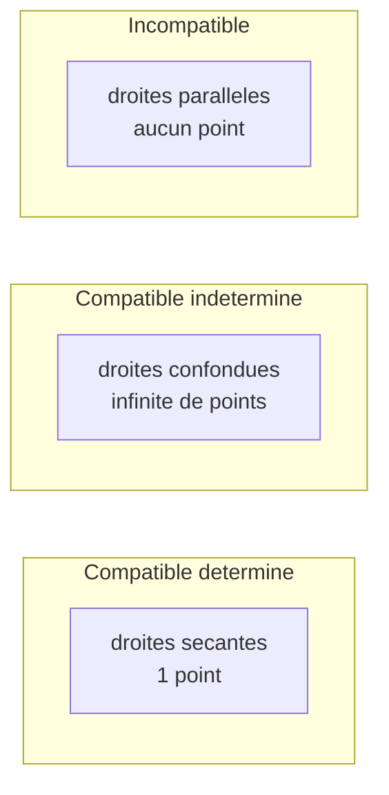

#### Exemple chiffre deroule pas a pas

Reprenons l'enigme de l'introduction, formalisee :

```math
\begin{cases}
x_1 + x_2 = 10 \\
x_1 - x_2 = 2
\end{cases}
```

Ici $m = 2$ equations, $n = 2$ inconnues. Les coefficients sont $a_{11}=1, a_{12}=1, a_{21}=1, a_{22}=-1$ ; les seconds membres $b_1 = 10, b_2 = 2$.

**Etape 1 — additionner les deux equations** pour eliminer $x_2$ :
$(x_1 + x_2) + (x_1 - x_2) = 10 + 2$, soit $2x_1 = 12$, donc $x_1 = 6$.

**Etape 2 — reinjecter** dans la premiere : $6 + x_2 = 10$, donc $x_2 = 4$.

**Etape 3 — verifier** dans la seconde (jamais celle qu'on a utilisee pour conclure) : $6 - 4 = 2$. C'est juste. L'ensemble solution est le singleton $\{(6, 4)\}$ : le systeme est **compatible determine**.

#### Forme matricielle : le grand raccourci

Ecrire toutes ces sommes est fastidieux. On range les coefficients dans un tableau $A$, les inconnues dans une colonne $\mathbf{x}$, les seconds membres dans une colonne $\mathbf{b}$, et le systeme entier se resume a une seule egalite :

```math
A\mathbf{x} = \mathbf{b}.
```

Nous definirons proprement ce produit dans les deux prochaines sections. Retenez deja l'idee : **un systeme = une equation matricielle**. C'est la pierre angulaire de tout le chapitre, et la raison pour laquelle l'algebre lineaire est le langage natif du machine learning : ajuster un modele lineaire a des donnees, c'est resoudre (au sens des moindres carres) un systeme $A\mathbf{x} = \mathbf{b}$ ou $A$ contient les donnees et $\mathbf{x}$ les parametres a apprendre.

#### En Python

```python
import numpy as np

A = np.array([[1.0, 1.0],
              [1.0, -1.0]])
b = np.array([10.0, 2.0])

x = np.linalg.solve(A, b)
print(x)  # [6. 4.]

print(np.allclose(A @ x, b))  # True : on verifie A x = b
```

> **Piege classique.** `np.linalg.solve` exige une matrice **carree** et **inversible**. Si le systeme a plus d'equations que d'inconnues (cas typique en apprentissage, $m \gg n$), il faut passer par les moindres carres `np.linalg.lstsq`, que nous verrons. Lancer `solve` sur une matrice singuliere (droites paralleles) leve une `LinAlgError`.

---

### Matrices et leurs opérations

#### Intuition : un tableau qui agit

Une matrice, avant d'etre un objet abstrait, est d'abord un **tableau rectangulaire de nombres**, comme une feuille de calcul : des lignes, des colonnes, un nombre dans chaque case. Mais sa vraie puissance, c'est qu'une matrice **fait quelque chose** : elle transforme des vecteurs (elle les etire, les tourne, les projette). On peut la voir a la fois comme un **rangement** (un paquet de donnees) et comme une **machine** (une fonction). Cette double nature est le coeur du sujet.

> **Le symbole d'un vecteur en gras, $\mathbf{v}$, et l'ensemble $\mathbb{R}^n$.**
> Le caractere gras $\mathbf{v}$ represente un **vecteur** : une liste **ordonnee** de nombres, c'est-a-dire une colonne de cases empilees. On peut le voir comme une **fleche** partant de l'origine et pointant vers un endroit de l'espace, ou plus simplement comme « les coordonnees d'un point ». L'ensemble $\mathbb{R}^n$ (« R puissance n ») est la collection de **toutes** les listes de $n$ nombres reels : $\mathbb{R}^2$ est le plan (deux coordonnees), $\mathbb{R}^3$ l'espace usuel (trois coordonnees), et $\mathbb{R}^{784}$ l'espace ou vit une image $28\times 28$ pixels mise a plat. On note un vecteur colonne :
> ```math
> \mathbf{v} = \begin{pmatrix} v_1 \\ v_2 \\ \vdots \\ v_n \end{pmatrix} \in \mathbb{R}^n.
> ```

> **Le symbole $\mathbb{R}^{m \times n}$.**
> Ce symbole represente l'ensemble de **toutes les matrices** ayant $m$ lignes et $n$ colonnes a coefficients reels. Lisez « R, m croix n ». Le « croix » ($\times$) n'est pas une multiplication a calculer : c'est la **taille** du tableau, exactement comme on dit « un cadre 13 par 18 ». Ainsi $A \in \mathbb{R}^{3 \times 2}$ est un tableau de 3 lignes et 2 colonnes. Convention immuable : **lignes d'abord, colonnes ensuite**.

#### Definition et vocabulaire

> **Definition (matrice).** Une **matrice** $A$ de taille $m \times n$ sur $\mathbb{R}$ est une application $A : \{1,\dots,m\}\times\{1,\dots,n\} \to \mathbb{R}$, notee par ses coefficients $A = (a_{ij})_{1 \le i \le m,\ 1 \le j \le n}$ et representee par le tableau
> ```math
> A = \begin{pmatrix}
> a_{11} & a_{12} & \cdots & a_{1n} \\
> a_{21} & a_{22} & \cdots & a_{2n} \\
> \vdots & \vdots & \ddots & \vdots \\
> a_{m1} & a_{m2} & \cdots & a_{mn}
> \end{pmatrix} \in \mathbb{R}^{m \times n}.
> ```

Vocabulaire essentiel, rassemble :

| Terme | Definition |
|---|---|
| Matrice **carree** | $m = n$ (autant de lignes que de colonnes) |
| Vecteur **colonne** | matrice $n \times 1$ ; vecteur **ligne** : $1 \times n$ |
| **Diagonale** principale | les coefficients $a_{ii}$ |
| Matrice **diagonale** | $a_{ij} = 0$ des que $i \ne j$ |
| Matrice **identite** $I_n$ | diagonale avec des 1 : $a_{ii}=1$, sinon 0 |
| Matrice **nulle** $0$ | tous les coefficients valent 0 |
| Matrice **triangulaire superieure** | $a_{ij} = 0$ des que $i > j$ |
| Matrice **triangulaire inferieure** | $a_{ij} = 0$ des que $i < j$ |
| Matrice **symetrique** | $A = A^\top$ (definie ci-dessous) |

#### Operations elementaires : addition et multiplication par un scalaire

L'addition se fait **case par case**, et seulement entre matrices de **meme taille** :

```math
(A + B)_{ij} = a_{ij} + b_{ij}.
```

La multiplication par un nombre $\lambda \in \mathbb{R}$ (un **scalaire**) multiplie chaque case :

```math
(\lambda A)_{ij} = \lambda\, a_{ij}.
```

> **Le mot « scalaire ».** Un scalaire, c'est simplement **un nombre seul** (par opposition a un vecteur ou une matrice, qui sont des paquets de nombres). Le mot vient de « echelle » : multiplier par un scalaire $\lambda > 1$, c'est agrandir a l'echelle (zoomer), et par $0 < \lambda < 1$, retrecir.

Muni de ces deux operations, $\mathbb{R}^{m\times n}$ est un **espace vectoriel** (notion centrale, definie plus loin) : addition commutative et associative, element neutre la matrice nulle, distributivite $\lambda(A+B)=\lambda A+\lambda B$, etc.

#### La transposee

> **Le symbole transposee $A^\top$.**
> Ce symbole (un petit T en exposant) represente l'operation de **basculer** la matrice : on echange le role des lignes et des colonnes, comme si on faisait pivoter le tableau autour de sa diagonale, ou comme un reflet dans un miroir pose sur la diagonale. La ligne $i$ devient la colonne $i$. Si $A$ est $m\times n$, alors $A^\top$ est $n \times m$.

> **Definition (transposee).** La **transposee** de $A=(a_{ij}) \in \mathbb{R}^{m\times n}$ est la matrice $A^\top = (a^\top_{ij}) \in \mathbb{R}^{n\times m}$ definie par $a^\top_{ij} = a_{ji}$.

Exemple chiffre :

```math
A = \begin{pmatrix} 1 & 2 & 3 \\ 4 & 5 & 6 \end{pmatrix} \in \mathbb{R}^{2\times 3}
\quad\Longrightarrow\quad
A^\top = \begin{pmatrix} 1 & 4 \\ 2 & 5 \\ 3 & 6 \end{pmatrix} \in \mathbb{R}^{3\times 2}.
```

Proprietes (toutes verifiables coefficient par coefficient) : $(A^\top)^\top = A$, $(A+B)^\top = A^\top + B^\top$, $(\lambda A)^\top = \lambda A^\top$, et la regle qui surprend les debutants, $(AB)^\top = B^\top A^\top$ (l'ordre s'**inverse**), demontree apres le produit.

#### Le produit matriciel : le coeur du reacteur

C'est l'operation la plus importante — et la moins intuitive au premier abord. On ne multiplie **pas** case par case. La regle : pour multiplier $A$ par $B$, le **nombre de colonnes de $A$** doit egaler le **nombre de lignes de $B$**.

> **Le symbole du produit matriciel (la juxtaposition $AB$).**
> Ecrire $AB$ (deux matrices collees) represente leur **produit**, une nouvelle matrice. Chaque case du resultat se calcule comme un **produit scalaire** d'une ligne de $A$ par une colonne de $B$ : on glisse la ligne $i$ de $A$ « par-dessus » la colonne $j$ de $B$, on multiplie terme a terme, et on additionne tout. Le $\sum$ ci-dessous est cette boucle d'addition.

> **Definition (produit matriciel).** Soient $A \in \mathbb{R}^{m \times p}$ et $B \in \mathbb{R}^{p \times n}$. Leur **produit** $C = AB \in \mathbb{R}^{m\times n}$ a pour coefficients
> ```math
> c_{ij} = \sum_{k=1}^{p} a_{ik}\, b_{kj}.
> ```

Schema des dimensions (les « $p$ » du milieu doivent coincider, et disparaissent) :

```math
\underbrace{(m \times p)}_{A} \cdot \underbrace{(p \times n)}_{B} \;=\; \underbrace{(m \times n)}_{C}.
```

> **Le symbole $\cdot$ (produit scalaire de deux vecteurs).** Pour deux vecteurs $\mathbf{u}, \mathbf{v} \in \mathbb{R}^n$, le **produit scalaire** $\mathbf{u}\cdot\mathbf{v} = \sum_{k=1}^{n} u_k v_k$ est un **nombre** (pas un vecteur). Intuitivement, il mesure « a quel point deux fleches pointent dans la meme direction ». En notation matricielle, $\mathbf{u}\cdot\mathbf{v} = \mathbf{u}^\top \mathbf{v}$. Chaque case du produit $AB$ est donc le produit scalaire ligne-colonne.

##### Exemple chiffre deroule case par case

Soient
```math
A = \begin{pmatrix} 1 & 2 \\ 3 & 4 \end{pmatrix}, \qquad
B = \begin{pmatrix} 5 & 6 \\ 7 & 8 \end{pmatrix}.
```
Calculons $C = AB$, case par case :

- $c_{11} = (1)(5) + (2)(7) = 5 + 14 = 19$ (ligne 1 de $A$ × colonne 1 de $B$)
- $c_{12} = (1)(6) + (2)(8) = 6 + 16 = 22$
- $c_{21} = (3)(5) + (4)(7) = 15 + 28 = 43$
- $c_{22} = (3)(6) + (4)(8) = 18 + 32 = 50$

D'ou
```math
AB = \begin{pmatrix} 19 & 22 \\ 43 & 50 \end{pmatrix}.
```

##### Le produit n'est PAS commutatif

Calculons $BA$ avec les memes matrices :
```math
BA = \begin{pmatrix} 5\cdot1+6\cdot3 & 5\cdot2+6\cdot4 \\ 7\cdot1+8\cdot3 & 7\cdot2+8\cdot4 \end{pmatrix}
= \begin{pmatrix} 23 & 34 \\ 31 & 46 \end{pmatrix} \;\ne\; AB.
```

> **Piege majeur.** En general $AB \ne BA$. L'ordre des facteurs **compte**. Mieux : $AB$ peut exister sans que $BA$ ait un sens (dimensions incompatibles). Ne « simplifiez » jamais un produit matriciel comme un produit de nombres.

#### Proprietes algebriques du produit

> **Theoreme (proprietes du produit).** Quand les tailles sont compatibles :
> 1. **Associativite** : $(AB)C = A(BC)$.
> 2. **Distributivite** : $A(B+C) = AB + AC$ et $(A+B)C = AC + BC$.
> 3. **Element neutre** : $I_m A = A I_n = A$ pour $A \in \mathbb{R}^{m\times n}$.
> 4. **Compatibilite scalaire** : $\lambda(AB) = (\lambda A)B = A(\lambda B)$.
> 5. **Transposee d'un produit** : $(AB)^\top = B^\top A^\top$.

**Demonstration de l'associativite (point 1).** Posons $A\in\mathbb{R}^{m\times p}$, $B\in\mathbb{R}^{p\times q}$, $C\in\mathbb{R}^{q\times n}$. Le coefficient $(i,\ell)$ de $(AB)C$ vaut
```math
\big((AB)C\big)_{i\ell} = \sum_{j=1}^{q} (AB)_{ij}\, c_{j\ell} = \sum_{j=1}^{q}\Big(\sum_{k=1}^{p} a_{ik} b_{kj}\Big) c_{j\ell} = \sum_{j=1}^{q}\sum_{k=1}^{p} a_{ik} b_{kj} c_{j\ell}.
```
De meme, le coefficient $(i,\ell)$ de $A(BC)$ vaut
```math
\big(A(BC)\big)_{i\ell} = \sum_{k=1}^{p} a_{ik}\,(BC)_{k\ell} = \sum_{k=1}^{p} a_{ik}\Big(\sum_{j=1}^{q} b_{kj} c_{j\ell}\Big) = \sum_{k=1}^{p}\sum_{j=1}^{q} a_{ik} b_{kj} c_{j\ell}.
```
Les deux doubles sommes portent sur les memes termes $a_{ik}b_{kj}c_{j\ell}$ ; comme l'addition des reels est commutative, on peut intervertir l'ordre de sommation. Les deux coefficients sont egaux pour tout $(i,\ell)$, donc $(AB)C = A(BC)$. $\blacksquare$

**Demonstration de la transposee d'un produit (point 5).** Avec $A\in\mathbb{R}^{m\times p}, B\in\mathbb{R}^{p\times n}$ :
```math
\big((AB)^\top\big)_{ij} = (AB)_{ji} = \sum_{k=1}^{p} a_{jk} b_{ki} = \sum_{k=1}^{p} (B^\top)_{ik}(A^\top)_{kj} = (B^\top A^\top)_{ij}. \qquad \blacksquare
```

#### Inverse d'une matrice carree

> **Le symbole $A^{-1}$.** Ce symbole represente la matrice **inverse** : la matrice qui « defait » ce que $A$ fait, comme une touche annuler. Si $A$ etire et tourne l'espace, $A^{-1}$ retrecit et tourne en sens inverse pour tout remettre en place.

> **Definition (inverse).** Une matrice carree $A \in \mathbb{R}^{n\times n}$ est **inversible** (ou **reguliere**) s'il existe $A^{-1} \in \mathbb{R}^{n\times n}$ telle que $A A^{-1} = A^{-1} A = I_n$. Sinon, $A$ est dite **singuliere**.

Quand l'inverse existe, il est **unique** : si $B$ et $C$ sont deux inverses, alors $B = B I_n = B(AC) = (BA)C = I_n C = C$. Regle pour le produit : si $A$ et $B$ sont inversibles de meme taille, alors $AB$ l'est et $(AB)^{-1} = B^{-1}A^{-1}$ (encore l'inversion d'ordre). Pour le cas $2\times 2$, formule a connaitre :
```math
A = \begin{pmatrix} a & b \\ c & d \end{pmatrix}, \quad \det A = ad - bc, \qquad A^{-1} = \frac{1}{ad - bc}\begin{pmatrix} d & -b \\ -c & a \end{pmatrix} \ \text{ si } ad-bc \ne 0.
```

> **Le symbole $\det A$ (determinant).** Ce symbole represente le **determinant**, un seul nombre qui mesure de combien la matrice **dilate les aires (ou les volumes)**, et avec quel signe (retournement ou non). Point capital : $A$ est inversible **si et seulement si** $\det A \ne 0$. Un determinant nul signifie que la transformation **aplatit** l'espace (elle ecrase un volume a plat), donc on ne peut plus revenir en arriere.

#### Application machine learning

Le produit matriciel **est** le calcul fondamental des reseaux de neurones. Une couche dense (fully connected) qui transforme un vecteur d'entree $\mathbf{x} \in \mathbb{R}^n$ en sortie $\mathbf{y}\in\mathbb{R}^m$ s'ecrit $\mathbf{y} = W\mathbf{x} + \mathbf{b}$, ou $W \in \mathbb{R}^{m\times n}$ est la matrice de **poids** (weights) et $\mathbf{b}$ le **biais** (bias). Empiler $L$ couches, c'est composer des produits matriciels (entrecoupes de non-linearites). Entrainer un reseau, c'est ajuster les coefficients de tous les $W$.

> **Mise a jour 2026.** Sur GPU et TPU, le produit matriciel est l'operation reine : les bibliotheques modernes (cuBLAS, et les noyaux Triton/CUTLASS) y consacrent l'essentiel de leur optimisation, et les unites materielles dediees (Tensor Cores) calculent des produits de blocs en precision mixte (bfloat16/FP8). Cote logiciel, JAX et PyTorch reposent sur `einsum` et l'auto-vectorisation (`vmap`) pour exprimer ces produits ; un modele de langage de plusieurs centaines de milliards de parametres n'est, au fond, qu'une longue chaine de produits matriciels optimises.

```python
import numpy as np

A = np.array([[1, 2], [3, 4]])
B = np.array([[5, 6], [7, 8]])

print(A @ B)        # produit matriciel : [[19 22] [43 50]]
print(A * B)        # ATTENTION : produit case par case (Hadamard), pas matriciel
print(A.T)          # transposee
print(np.linalg.inv(A))           # inverse
print(np.linalg.det(A))           # determinant = -2.0
print(A @ np.linalg.inv(A))       # ~ identite (aux erreurs d'arrondi pres)
```

> **Piege NumPy a graver.** L'operateur `*` fait le produit **element par element** (Hadamard), PAS le produit matriciel. Le produit matriciel, c'est `@` (ou `np.matmul`, ou `np.dot`). Confondre les deux est l'une des erreurs les plus frequentes et les plus silencieuses du debutant.

---

### Résolution des systèmes linéaires

#### L'idee maitresse : simplifier sans changer les solutions

Pour resoudre, on transforme le systeme en un autre **plus simple mais equivalent** (meme ensemble solution), jusqu'a pouvoir lire la reponse. Trois manipulations preservent l'ensemble des solutions — ce sont les **operations elementaires sur les lignes** :

| Operation | Notation | Effet |
|---|---|---|
| Echanger deux lignes | $L_i \leftrightarrow L_j$ | reordonne les equations |
| Multiplier une ligne par $\lambda \ne 0$ | $L_i \leftarrow \lambda L_i$ | change l'echelle d'une equation |
| Ajouter a une ligne un multiple d'une autre | $L_i \leftarrow L_i + \lambda L_j$ | combine deux equations |

Aucune ne cree ni ne detruit de solution : la troisieme, par exemple, remplace une egalite vraie par une combinaison d'egalites vraies, reversible en soustrayant $\lambda L_j$.

> **La matrice augmentee $[A \mid \mathbf{b}]$.** Pour calculer efficacement, on accole la colonne des seconds membres a droite de $A$, separee par une barre : $[A \mid \mathbf{b}]$. On travaille alors sur ce seul tableau, sans recopier les $x_j$ a chaque etape — la barre marque juste « ici commence le second membre ».

#### Le pivot de Gauss (elimination de Gauss)

> **Le mot « pivot ».** Le **pivot** est le premier coefficient non nul d'une ligne, celui autour duquel on « fait tourner » les eliminations : on s'en sert pour annuler tous les coefficients situes en dessous (et, en Gauss-Jordan, au-dessus) dans la meme colonne. Comme un point d'appui qui permet de soulever le reste.

L'**elimination de Gauss** amene la matrice augmentee sous forme **echelonnee** : en escalier, avec sous chaque pivot des zeros. Puis la **remontee** (substitution arriere) lit les inconnues de bas en haut.

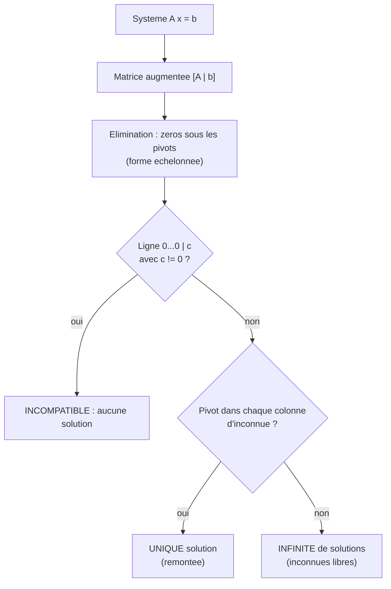

##### Exemple chiffre deroule pas a pas

Resolvons
```math
\begin{cases}
2x_1 + x_2 - x_3 = 8 \\
-3x_1 - x_2 + 2x_3 = -11 \\
-2x_1 + x_2 + 2x_3 = -3
\end{cases}
```

Matrice augmentee :
```math
\left[\begin{array}{ccc|c}
2 & 1 & -1 & 8 \\
-3 & -1 & 2 & -11 \\
-2 & 1 & 2 & -3
\end{array}\right]
```

**Pivot 1 = 2 (ligne 1).** On annule la colonne 1 sous le pivot.
$L_2 \leftarrow L_2 + \tfrac{3}{2}L_1$ et $L_3 \leftarrow L_3 + L_1$ :
```math
\left[\begin{array}{ccc|c}
2 & 1 & -1 & 8 \\
0 & \tfrac{1}{2} & \tfrac{1}{2} & 1 \\
0 & 2 & 1 & 5
\end{array}\right]
```

**Pivot 2 = 1/2 (ligne 2).** On annule la colonne 2 sous le pivot.
$L_3 \leftarrow L_3 - 4 L_2$ :
```math
\left[\begin{array}{ccc|c}
2 & 1 & -1 & 8 \\
0 & \tfrac{1}{2} & \tfrac{1}{2} & 1 \\
0 & 0 & -1 & 1
\end{array}\right]
```

La matrice est **echelonnee**. **Remontee** :
- Ligne 3 : $-x_3 = 1 \Rightarrow x_3 = -1$.
- Ligne 2 : $\tfrac12 x_2 + \tfrac12(-1) = 1 \Rightarrow \tfrac12 x_2 = \tfrac32 \Rightarrow x_2 = 3$.
- Ligne 1 : $2x_1 + 3 - (-1) = 8 \Rightarrow 2x_1 = 4 \Rightarrow x_1 = 2$.

**Solution unique** : $(x_1,x_2,x_3) = (2, 3, -1)$. Verification dans l'equation 2 : $-3(2)-1(3)+2(-1) = -6-3-2 = -11$. Correct.

#### Forme echelonnee reduite (Gauss-Jordan)

En poussant plus loin (pivots ramenes a 1, zeros aussi **au-dessus** des pivots), on obtient la forme **echelonnee reduite par lignes** (RREF), qui est **unique** pour une matrice donnee. La solution s'y lit directement, et c'est l'outil pour calculer un inverse : on reduit $[A \mid I_n]$ ; si l'on aboutit a $[I_n \mid B]$, alors $B = A^{-1}$.

#### Cas non determines : les inconnues libres

Quand une colonne d'inconnue ne porte **pas** de pivot, l'inconnue correspondante est **libre** : on lui donne un parametre, et les autres s'expriment en fonction de lui. Exemple :
```math
\begin{cases}
x_1 + 2x_2 + x_3 = 4 \\
x_2 - x_3 = 1
\end{cases}
```
La colonne de $x_3$ n'a pas de pivot : posons $x_3 = t$, $t\in\mathbb{R}$. Alors $x_2 = 1 + t$, puis $x_1 = 4 - 2(1+t) - t = 2 - 3t$. L'ensemble solution est la **droite affine**
```math
\Big\{ (2 - 3t,\ 1 + t,\ t) : t \in \mathbb{R} \Big\} = \underbrace{(2,1,0)}_{\text{solution particuliere}} + t\,\underbrace{(-3,1,1)}_{\text{direction}}.
```

> **Idee structurante (a retenir).** Toute solution d'un systeme se decompose en **une solution particuliere** plus **une solution du systeme homogene** associe ($A\mathbf{x}=\mathbf{0}$). C'est le squelette de la theorie : « solution generale = solution particuliere + noyau ». Nous y revenons avec les applications lineaires.

#### Theoreme de Rouche-Capelli

> **Le symbole rang, $\mathrm{rg}(A)$.** Le **rang** d'une matrice est le **nombre de pivots** obtenus apres elimination, autrement dit le nombre d'equations vraiment « independantes » (qui apportent une information nouvelle). On le definira rigoureusement plus loin ; ici, comptez les pivots.

> **Theoreme (Rouche-Capelli).** Le systeme $A\mathbf{x}=\mathbf{b}$, avec $A\in\mathbb{R}^{m\times n}$, est :
> - **compatible** (au moins une solution) si et seulement si $\mathrm{rg}(A) = \mathrm{rg}([A\mid \mathbf{b}])$ ;
> - dans ce cas, la solution est **unique** si $\mathrm{rg}(A) = n$, et il y a une **infinite** de solutions a $n - \mathrm{rg}(A)$ parametres libres si $\mathrm{rg}(A) < n$.

**Idee de preuve.** Apres elimination, une incompatibilite se manifeste par une ligne $[0\ \cdots\ 0 \mid c]$ avec $c\ne 0$ (l'equation $0 = c$ est absurde) : cela arrive exactement quand ajouter la colonne $\mathbf{b}$ cree un pivot supplementaire, c'est-a-dire $\mathrm{rg}([A\mid\mathbf{b}]) > \mathrm{rg}(A)$. S'il n'y a pas une telle ligne, le nombre d'inconnues libres est $n - \mathrm{rg}(A)$ : nul (solution unique) ou strictement positif (infinite). $\blacksquare$

#### Complexite et stabilite numerique

L'elimination de Gauss sur un systeme $n\times n$ coute de l'ordre de $\tfrac{2}{3}n^3$ operations. Sur ordinateur, on n'utilise **pas** la matrice inverse pour resoudre (plus couteux et moins stable) : on prefere une **factorisation** $A = LU$ (produit d'une triangulaire inferieure $L$ et superieure $U$), avec **pivotage partiel** pour la stabilite (choisir comme pivot le plus grand coefficient en valeur absolue de la colonne, afin d'eviter de diviser par un nombre minuscule).

> **Mise a jour 2026.** Pour les tres grands systemes creux (sparse) issus du machine learning et de la simulation, on delaisse l'elimination directe au profit de **methodes iteratives** (gradient conjugue, GMRES) et de **preconditionneurs**. Pour les systemes denses gigantesques, des algorithmes **randomises** (esquisse aleatoire, randomized sketching) fournissent des solutions approchees a moindre cout. Et l'on resout de plus en plus en **basse precision** (FP16/BF16) avec **raffinement iteratif** pour recuperer la precision — une technique qui exploite a plein le materiel d'IA recent.

```python
import numpy as np

A = np.array([[2.0, 1.0, -1.0],
              [-3.0, -1.0, 2.0],
              [-2.0, 1.0, 2.0]])
b = np.array([8.0, -11.0, -3.0])

x = np.linalg.solve(A, b)     # methode recommandee (factorisation interne)
print(x)                       # [ 2.  3. -1.]

# Factorisation LU explicite avec pivotage (SciPy) : A = P L U
from scipy.linalg import lu
P, L, U = lu(A)
print(np.allclose(P @ L @ U, A))   # True

# Rang (via valeurs singulieres, robuste numeriquement)
print(np.linalg.matrix_rank(A))    # 3
```

---

### Espaces vectoriels

#### Intuition : un monde ou l'on peut additionner et redimensionner

Jusqu'ici, nos vecteurs etaient des listes de nombres. Mais l'idee profonde de l'algebre lineaire est d'**oublier** la nature des objets et de ne retenir que **ce qu'on peut leur faire** : les **additionner** entre eux, et les **multiplier par un scalaire**. Tout ensemble muni de ces deux operations, se comportant « bien », est un **espace vectoriel**. La magie : des polynomes, des fonctions, des signaux, des images, des matrices — tout cela forme des espaces vectoriels, et **les memes theoremes s'appliquent a tous**. On apprend une fois, on applique partout.

> **Les quantificateurs $\forall$ (« pour tout ») et $\exists$ (« il existe »).**
> Le symbole $\forall$ se lit « **pour tout** » ou « quel que soit » : c'est une promesse qui vaut **sans exception**, comme « tous les eleves de la classe ont un cartable ». Le symbole $\exists$ se lit « **il existe (au moins un)** » : il suffit d'un seul exemple pour le satisfaire, comme « il existe un eleve qui porte des lunettes ». On combine : « $\forall \mathbf{x}\, \exists\, \mathbf{y}$ » veut dire « pour chaque x, on peut trouver un y (qui peut dependre de x) ». L'ordre est crucial et ne se permute pas a la legere.

> **Le symbole $\mathbf{0}$ (vecteur nul).** Le $\mathbf{0}$ en gras est le **vecteur nul** : l'element neutre de l'addition, celui qui ne change rien quand on l'ajoute (« la fleche de longueur zero », ou l'origine). A ne pas confondre avec le scalaire $0$.

#### Definition axiomatique

> **Definition (espace vectoriel reel).** Un **espace vectoriel** sur $\mathbb{R}$ est un ensemble $E$ non vide muni de deux operations : une **addition** $+ : E\times E \to E$ et une **multiplication externe** par un scalaire $\cdot : \mathbb{R}\times E \to E$, telles que, $\forall\, \mathbf{u},\mathbf{v},\mathbf{w}\in E$ et $\forall\, \lambda,\mu\in\mathbb{R}$ :
> 1. $\mathbf{u}+\mathbf{v} = \mathbf{v}+\mathbf{u}$ (commutativite) ;
> 2. $(\mathbf{u}+\mathbf{v})+\mathbf{w} = \mathbf{u}+(\mathbf{v}+\mathbf{w})$ (associativite) ;
> 3. $\exists\, \mathbf{0}\in E$ tel que $\mathbf{u}+\mathbf{0}=\mathbf{u}$ (element neutre) ;
> 4. $\forall \mathbf{u},\ \exists\, (-\mathbf{u})$ tel que $\mathbf{u}+(-\mathbf{u})=\mathbf{0}$ (oppose) ;
> 5. $\lambda(\mu\mathbf{u}) = (\lambda\mu)\mathbf{u}$ (associativite mixte) ;
> 6. $1\cdot\mathbf{u} = \mathbf{u}$ (neutre scalaire) ;
> 7. $\lambda(\mathbf{u}+\mathbf{v}) = \lambda\mathbf{u}+\lambda\mathbf{v}$ (distributivite sur les vecteurs) ;
> 8. $(\lambda+\mu)\mathbf{u} = \lambda\mathbf{u}+\mu\mathbf{u}$ (distributivite sur les scalaires).
>
> Les elements de $E$ sont les **vecteurs**, ceux de $\mathbb{R}$ les **scalaires**.

> **Remarque.** On dit aussi « $\mathbb{R}$-espace vectoriel ». On peut remplacer $\mathbb{R}$ par n'importe quel **corps** $\mathbb{K}$ (par exemple $\mathbb{C}$, les complexes) ; la theorie est identique. Dans ce cours, sauf mention contraire, $\mathbb{K}=\mathbb{R}$.

Premieres consequences (a deduire des axiomes) : le vecteur nul est **unique** ; $0\cdot\mathbf{u}=\mathbf{0}$ ; $(-1)\cdot\mathbf{u} = -\mathbf{u}$ ; $\lambda\cdot\mathbf{0}=\mathbf{0}$.

**Preuve que $0\cdot\mathbf{u}=\mathbf{0}$.** On a $0\cdot\mathbf{u} = (0+0)\cdot\mathbf{u} = 0\cdot\mathbf{u} + 0\cdot\mathbf{u}$ par l'axiome 8. En ajoutant l'oppose de $0\cdot\mathbf{u}$ aux deux membres : $\mathbf{0} = 0\cdot\mathbf{u}$. $\blacksquare$

#### Exemples fondamentaux

| Espace | Vecteurs | Addition / scalaire |
|---|---|---|
| $\mathbb{R}^n$ | $n$-uplets de reels | composante par composante |
| $\mathbb{R}^{m\times n}$ | matrices | case par case |
| $\mathbb{R}[X]$ | polynomes | coefficient par coefficient |
| $\mathbb{R}_d[X]$ | polynomes de degre $\le d$ | idem (dimension $d+1$) |
| $\mathcal{F}(\mathbb{R},\mathbb{R})$ | fonctions $f:\mathbb{R}\to\mathbb{R}$ | $(f+g)(x)=f(x)+g(x)$ |
| $\mathcal{C}([0,1])$ | fonctions continues | idem |

#### Sous-espaces vectoriels

> **Le symbole $\subseteq$ (inclusion) et la notion de sous-espace.** $F \subseteq E$ signifie « $F$ est contenu dans $E$ » (chaque element de $F$ est aussi dans $E$), comme une piece a l'interieur d'une maison. Un **sous-espace** est une partie qui est elle-meme un espace vectoriel **avec les memes operations** — un monde stable a l'interieur du grand monde.

> **Definition (sous-espace vectoriel).** Une partie $F\subseteq E$ est un **sous-espace vectoriel** de $E$ si :
> 1. $\mathbf{0}\in F$ (non vide, contient l'origine) ;
> 2. $\forall \mathbf{u},\mathbf{v}\in F,\ \mathbf{u}+\mathbf{v}\in F$ (stable par addition) ;
> 3. $\forall \lambda\in\mathbb{R},\ \forall \mathbf{u}\in F,\ \lambda\mathbf{u}\in F$ (stable par multiplication scalaire).

Les conditions 2 et 3 se resument : $F$ est stable par **combinaison lineaire**. Critere compact : $F$ non vide et $\forall \lambda,\mu\in\mathbb{R}, \forall \mathbf{u},\mathbf{v}\in F,\ \lambda\mathbf{u}+\mu\mathbf{v}\in F$.

> **Piege geometrique.** En dimension 3, les sous-espaces sont : $\{\mathbf{0}\}$, les **droites passant par l'origine**, les **plans passant par l'origine**, et $\mathbb{R}^3$ tout entier. Une droite qui **ne passe pas** par l'origine n'est **pas** un sous-espace (elle ne contient pas $\mathbf{0}$) — c'est un espace **affine**, vu plus loin.

##### Exemple chiffre

Est-ce que $F = \{(x,y,z)\in\mathbb{R}^3 : x + 2y - z = 0\}$ est un sous-espace ?
- $\mathbf{0}=(0,0,0)$ : $0+0-0=0$, oui $\mathbf{0}\in F$.
- Si $\mathbf{u}=(x,y,z)$ et $\mathbf{v}=(x',y',z')$ sont dans $F$, alors $(x+x')+2(y+y')-(z+z') = (x+2y-z)+(x'+2y'-z') = 0+0=0$ : stable par addition.
- $\lambda\mathbf{u}$ : $\lambda x + 2\lambda y - \lambda z = \lambda(x+2y-z)=0$ : stable. **Oui, $F$ est un sous-espace** (un plan par l'origine).

En revanche $G=\{(x,y,z):x+2y-z = 5\}$ n'en est pas un : $\mathbf{0}\notin G$.

#### Combinaisons lineaires et sous-espace engendre

> **Definition (combinaison lineaire).** Une **combinaison lineaire** des vecteurs $\mathbf{v}_1,\dots,\mathbf{v}_k$ est tout vecteur de la forme $\lambda_1\mathbf{v}_1 + \cdots + \lambda_k\mathbf{v}_k = \sum_{i=1}^{k}\lambda_i\mathbf{v}_i$ avec $\lambda_i\in\mathbb{R}$.

> **Definition (sous-espace engendre).** Le **sous-espace engendre** par $S=\{\mathbf{v}_1,\dots,\mathbf{v}_k\}$, note $\mathrm{Vect}(S)$ ou $\mathrm{span}(S)$, est l'ensemble de **toutes** leurs combinaisons lineaires :
> ```math
> \mathrm{Vect}(\mathbf{v}_1,\dots,\mathbf{v}_k) = \Big\{ \sum_{i=1}^{k}\lambda_i \mathbf{v}_i : \lambda_i\in\mathbb{R} \Big\}.
> ```
> C'est le **plus petit** sous-espace contenant $S$.

Intuition : $\mathrm{Vect}(\mathbf{v})$ est la droite portee par $\mathbf{v}$ (si $\mathbf{v}\ne\mathbf{0}$) ; $\mathrm{Vect}(\mathbf{u},\mathbf{v})$ est le plan qu'ils tendent (si non colineaires). « Engendrer » l'espace, c'est pouvoir l'atteindre **entierement** par combinaisons.

#### Application machine learning

L'espace des **parametres** d'un modele est un espace vectoriel : un reseau a $P$ poids vit dans $\mathbb{R}^P$ ; l'optimisation se promene dans cet espace. L'espace des **caracteristiques** (features) est lui aussi vectoriel — additionner deux plongements (embeddings) de mots, c'est de l'algebre vectorielle, et c'est ce qui rend possibles les fameuses analogies « roi $-$ homme $+$ femme $\approx$ reine ». Enfin, l'ensemble des fonctions representables par une architecture donnee n'est pas toujours un espace vectoriel (a cause des non-linearites), mais beaucoup de raisonnements locaux (autour d'un point, via la differentielle) **le sont** : c'est tout l'interet de la linearisation.

```python
import numpy as np

v1 = np.array([1.0, 0.0, 1.0])
v2 = np.array([0.0, 1.0, 1.0])

def in_span(vectors, target, tol=1e-9):
    M = np.column_stack(vectors)
    coef, *_ = np.linalg.lstsq(M, target, rcond=None)
    return np.linalg.norm(M @ coef - target) < tol

print(in_span([v1, v2], np.array([2.0, 3.0, 5.0])))  # True  (2 v1 + 3 v2)
print(in_span([v1, v2], np.array([1.0, 1.0, 0.0])))  # False (hors du plan)
```

---

### Indépendance linéaire

#### Intuition : de l'information non redondante

Trois personnes donnent leur avis. Si la troisieme ne fait que repeter une combinaison des deux premieres, elle n'apporte **rien de neuf** : elle est « redondante ». Des vecteurs sont **lineairement independants** quand **aucun** n'est combinaison des autres : chacun apporte une direction vraiment nouvelle. C'est la notion qui permet de distinguer « beaucoup de vecteurs » de « beaucoup de **vraie** information ».

#### Definition rigoureuse

> **Definition (independance lineaire).** Une famille $(\mathbf{v}_1,\dots,\mathbf{v}_k)$ de vecteurs de $E$ est **lineairement independante** (ou **libre**) si la seule combinaison lineaire nulle est la triviale :
> ```math
> \sum_{i=1}^{k}\lambda_i \mathbf{v}_i = \mathbf{0} \quad\Longrightarrow\quad \lambda_1 = \lambda_2 = \cdots = \lambda_k = 0.
> ```
> Dans le cas contraire (il existe des $\lambda_i$ non tous nuls donnant $\mathbf{0}$), la famille est **liee** (lineairement dependante).

> **Le symbole $\Longrightarrow$ (implication).** Ce symbole se lit « **alors** » ou « implique » : « $P \Rightarrow Q$ » signifie « si $P$ est vrai, alors $Q$ l'est aussi », comme « s'il pleut, alors le sol est mouille ». Il ne dit rien quand $P$ est faux.

> **Pourquoi cette definition ?** « Aucun vecteur n'est combinaison des autres » equivaut a « la seule facon d'obtenir $\mathbf{0}$ est de prendre tous les coefficients nuls ». En effet, si $\mathbf{v}_k = \sum_{i<k}\mu_i\mathbf{v}_i$, alors $\sum_{i<k}\mu_i\mathbf{v}_i + (-1)\mathbf{v}_k = \mathbf{0}$ est une relation **non triviale** (le coefficient $-1$ n'est pas nul). La definition « par le zero » est juste plus maniable.

#### Exemple chiffre deroule

Les vecteurs $\mathbf{v}_1=(1,2,3)$, $\mathbf{v}_2=(0,1,4)$, $\mathbf{v}_3=(2,5,10)$ sont-ils libres ? On resout $\lambda_1\mathbf{v}_1+\lambda_2\mathbf{v}_2+\lambda_3\mathbf{v}_3 = \mathbf{0}$ :
```math
\begin{cases}
\lambda_1 + 0 + 2\lambda_3 = 0 \\
2\lambda_1 + \lambda_2 + 5\lambda_3 = 0 \\
3\lambda_1 + 4\lambda_2 + 10\lambda_3 = 0
\end{cases}
```
De la 1re : $\lambda_1 = -2\lambda_3$. Dans la 2e : $-4\lambda_3 + \lambda_2 + 5\lambda_3 = 0 \Rightarrow \lambda_2 = -\lambda_3$. Dans la 3e : $3(-2\lambda_3) + 4(-\lambda_3) + 10\lambda_3 = -6\lambda_3 -4\lambda_3 + 10\lambda_3 = 0$, **toujours vraie**. Il existe donc des solutions non nulles : pour $\lambda_3 = 1$, $(\lambda_1,\lambda_2,\lambda_3) = (-2,-1,1)$. Verification : $-2(1,2,3) -1(0,1,4) + 1(2,5,10) = (-2+0+2,\,-4-1+5,\,-6-4+10) = (0,0,0)$. La famille est **liee** : en effet $\mathbf{v}_3 = 2\mathbf{v}_1 + \mathbf{v}_2$.

#### Proprietes utiles

> **Proposition.**
> 1. Toute famille contenant $\mathbf{0}$ est **liee** (prendre coefficient 1 devant $\mathbf{0}$).
> 2. Une famille **a un vecteur** $(\mathbf{v})$ est libre $\iff \mathbf{v}\ne\mathbf{0}$.
> 3. Deux vecteurs sont lies $\iff$ ils sont **colineaires** (l'un multiple de l'autre).
> 4. Toute **sous-famille** d'une famille libre est libre ; toute **sur-famille** d'une famille liee est liee.
> 5. Dans $\mathbb{R}^n$, **toute famille de plus de $n$ vecteurs est liee** (resultat clef, lie a la dimension).

> **Le symbole $\iff$ (equivalence).** Il se lit « **si et seulement si** » : « $P \iff Q$ » veut dire que $P$ et $Q$ sont vrais en meme temps ou faux en meme temps — ils vont toujours de pair, comme « avoir la moyenne » et « ne pas avoir en dessous de 10 ».

#### Lien avec le rang et les systemes

Tester l'independance de $k$ vecteurs de $\mathbb{R}^n$, c'est resoudre un systeme homogene $A\boldsymbol{\lambda} = \mathbf{0}$ ou $A$ a ces vecteurs **en colonnes**. La famille est libre $\iff$ ce systeme n'a **que** la solution nulle $\iff \mathrm{rg}(A) = k$ (un pivot par colonne). C'est le pont direct entre independance et elimination de Gauss.

```python
import numpy as np

V = np.column_stack([[1, 2, 3], [0, 1, 4], [2, 5, 10]]).astype(float)

r = np.linalg.matrix_rank(V)
k = V.shape[1]
print(r, k)                 # 2 3  -> rang < nombre de vecteurs
print("libre" if r == k else "liee")   # liee

# Noyau : une relation de dependance explicite (SVD)
ns = np.linalg.svd(V)[2][r:].T    # base du noyau (a transposer)
print(np.round(ns / ns[np.argmax(np.abs(ns))], 3).ravel())  # ~ (-2,-1,1) a un facteur pres
```

> **Application machine learning : la multicolinearite.** Quand deux caracteristiques (colonnes de la matrice de donnees) sont (presque) lineairement dependantes, on parle de **multicolinearite**. Elle rend les parametres d'une regression instables (la matrice $X^\top X$ devient mal conditionnee, presque singuliere). Detecter et traiter cette dependance — par selection de variables, par **regularisation** (Ridge ajoute $\lambda I$ pour rendre $X^\top X + \lambda I$ inversible), ou par ACP — est une tache quotidienne du praticien.

---

### Base et rang

#### Intuition : le jeu de coordonnees minimal et complet

Pour reperer n'importe quel point d'une ville, deux directions suffisent et sont necessaires : « combien de rues vers l'est, combien vers le nord ». Ces deux directions forment une **base** : un jeu de reperes a la fois **suffisant** (on atteint tout : c'est generateur) et **non redondant** (aucun superflu : c'est libre). Le nombre d'elements d'une base, c'est la **dimension** : le nombre de « boutons de reglage » independants de l'espace.

#### Definitions

> **Definition (famille generatrice).** Une famille $(\mathbf{v}_1,\dots,\mathbf{v}_k)$ **engendre** $E$ (est **generatrice**) si $\mathrm{Vect}(\mathbf{v}_1,\dots,\mathbf{v}_k) = E$ : tout vecteur de $E$ est combinaison lineaire des $\mathbf{v}_i$.

> **Definition (base).** Une **base** de $E$ est une famille a la fois **libre** et **generatrice**.

> **Theoreme (coordonnees).** Si $\mathcal{B}=(\mathbf{e}_1,\dots,\mathbf{e}_n)$ est une base de $E$, alors tout $\mathbf{x}\in E$ s'ecrit de **maniere unique** $\mathbf{x} = \sum_{i=1}^{n} x_i \mathbf{e}_i$. Les scalaires $x_i$ sont les **coordonnees** de $\mathbf{x}$ dans $\mathcal{B}$.

**Preuve de l'unicite.** Si $\mathbf{x} = \sum x_i\mathbf{e}_i = \sum x'_i\mathbf{e}_i$, alors $\sum (x_i - x'_i)\mathbf{e}_i = \mathbf{0}$ ; par **liberte** de la base, $x_i - x'_i = 0$ pour tout $i$. L'existence vient du caractere **generateur**. $\blacksquare$

> **La base canonique de $\mathbb{R}^n$.** C'est la base la plus naturelle : $\mathbf{e}_1=(1,0,\dots,0)$, $\mathbf{e}_2=(0,1,0,\dots,0)$, …, $\mathbf{e}_n=(0,\dots,0,1)$. Le vecteur $\mathbf{e}_i$ a un 1 en position $i$ et des 0 partout ailleurs. Dans cette base, les coordonnees d'un vecteur **sont** ses composantes habituelles.

#### Dimension

> **Theoreme (de la dimension / theoreme de la base).** Dans un espace vectoriel admettant une base finie, **toutes les bases ont le meme nombre d'elements**. Ce nombre commun est la **dimension** de $E$, notee $\dim E$.

**Idee de preuve (lemme d'echange de Steinitz).** On montre d'abord le lemme : dans un espace engendre par $n$ vecteurs, toute famille libre a **au plus** $n$ elements. De la, si $\mathcal{B}$ a $n$ elements et $\mathcal{B}'$ a $n'$ elements, alors (l'une libre, l'autre generatrice) $n' \le n$ et symetriquement $n \le n'$, d'ou $n = n'$. $\blacksquare$

| Espace | Dimension |
|---|---|
| $\mathbb{R}^n$ | $n$ |
| $\mathbb{R}^{m\times n}$ | $m\,n$ |
| $\mathbb{R}_d[X]$ (polynomes de degre $\le d$) | $d+1$ |
| $\mathcal{F}(\mathbb{R},\mathbb{R})$ | infinie |
| $\{\mathbf{0}\}$ | $0$ |

> **Theoreme de la base incomplete.** Dans un espace de dimension finie $n$ : (a) toute famille libre peut etre **completee** en une base ; (b) de toute famille generatrice on peut **extraire** une base ; (c) dans un espace de dimension $n$, une famille de $n$ vecteurs est une base **des qu'elle est libre OU des qu'elle est generatrice** (l'une entraine l'autre).

#### Le rang, proprement

> **Definition (rang).** Le **rang** d'une famille de vecteurs est la dimension du sous-espace qu'ils engendrent : $\mathrm{rg}(\mathbf{v}_1,\dots,\mathbf{v}_k) = \dim \mathrm{Vect}(\mathbf{v}_1,\dots,\mathbf{v}_k)$. Le **rang d'une matrice** $A$ est le rang de la famille de ses **colonnes**.

> **Theoreme (rang lignes = rang colonnes).** Pour toute matrice $A\in\mathbb{R}^{m\times n}$, le rang de la famille des colonnes egale le rang de la famille des lignes. On parle donc simplement du **rang de $A$**, et $\mathrm{rg}(A) \le \min(m,n)$.

C'est un theoreme profond : l'« information » portee par les lignes et par les colonnes est la **meme quantite**. Operationnellement, $\mathrm{rg}(A)$ est le nombre de pivots de la forme echelonnee — invariant par operations elementaires.

> **Le theoreme du rang (rang-nullite).** Pour $A\in\mathbb{R}^{m\times n}$ :
> ```math
> \mathrm{rg}(A) + \dim\big(\ker A\big) = n,
> ```
> ou $\ker A = \{\mathbf{x}\in\mathbb{R}^n : A\mathbf{x}=\mathbf{0}\}$ est le **noyau**. Autrement dit : (dimensions atteintes) + (dimensions ecrasees) = (dimensions de depart).

> **Le symbole $\ker$ (noyau) et $\dim$.** $\ker A$ represente l'ensemble des vecteurs que $A$ **envoie sur zero** — ce que la transformation « efface ». $\dim$ compte les degres de liberte (le nombre de directions independantes). Le theoreme du rang dit, en image : ce que tu gardes (rang) plus ce que tu ecrases (noyau) egale ce avec quoi tu es parti.

#### Exemple chiffre

Pour $A=\begin{pmatrix}1&2&3\\2&4&6\\1&1&1\end{pmatrix}$ : la 2e ligne est le double de la 1re, donc apres elimination il reste 2 pivots, $\mathrm{rg}(A)=2$. Par le theoreme du rang, $\dim\ker A = 3 - 2 = 1$ : le noyau est une droite. Determinons-la : $A\mathbf{x}=\mathbf{0}$ se reduit a $\{\,x+2y+3z=0,\ x+y+z=0\,\}$ (la 2e equation est redondante). En soustrayant, $y + 2z = 0$, soit $y=-2z$ ; puis $x = -y - z = 2z - z = z$. Avec $z=1$, on obtient la direction $(1,-2,1)$. Verification : $A\,(1,-2,1)^\top = (1-4+3,\,2-8+6,\,1-2+1) = (0,0,0)$. Donc $\ker A = \mathrm{Vect}(1,-2,1)$.

```python
import numpy as np

A = np.array([[1, 2, 3],
              [2, 4, 6],
              [1, 1, 1]], dtype=float)

r = np.linalg.matrix_rank(A)
n = A.shape[1]
print("rang =", r, " dim noyau =", n - r)   # rang = 2  dim noyau = 1

# Une base du noyau via SVD
U, s, Vt = np.linalg.svd(A)
null_space = Vt[r:].T
print(np.round(null_space / null_space[0], 3).ravel())  # ~ (1, -2, 1) a un facteur pres
print(np.round(A @ null_space, 6).ravel())              # ~ (0, 0, 0)
```

> **Application machine learning.** La **dimension intrinseque** des donnees (souvent bien plus petite que le nombre de features brutes) est l'idee derriere la **reduction de dimension** : l'ACP cherche la meilleure base de faible dimension qui capture l'essentiel de la variance. Le **rang** d'une matrice de donnees mesure le nombre de directions reellement informatives ; les approximations de **rang faible** (low-rank) compressent modeles et donnees — au coeur des systemes de recommandation (factorisation matricielle) et des adaptateurs **LoRA** des grands modeles.

> **Mise a jour 2026.** Les adaptateurs **LoRA** (Low-Rank Adaptation) et leurs variantes (DoRA, QLoRA) reposent **exactement** sur cette algebre : au lieu de modifier toute une matrice de poids $W\in\mathbb{R}^{m\times n}$, on lui ajoute une correction de **rang faible** $\Delta W = BA$ avec $B\in\mathbb{R}^{m\times r}$, $A\in\mathbb{R}^{r\times n}$ et $r \ll \min(m,n)$ — soit $r(m+n)$ parametres au lieu de $mn$. Affiner un modele geant devient ainsi accessible sur un seul GPU.

---

### Applications linéaires

#### Intuition : les transformations qui respectent la structure

Une **application lineaire** est une fonction entre espaces vectoriels qui **respecte les deux operations** : elle envoie une somme sur la somme des images, et un vecteur agrandi sur l'image agrandie d'autant. Image mentale : une transformation qui **ne courbe pas** l'espace et **fixe l'origine** — rotations, dilatations, projections, cisaillements en font partie ; pas les translations (elles bougent l'origine), ni quoi que ce soit qui plie ou tord.

#### Definition

> **Definition (application lineaire).** Soient $E,F$ deux $\mathbb{R}$-espaces vectoriels. Une application $f:E\to F$ est **lineaire** si :
> ```math
> \forall \mathbf{u},\mathbf{v}\in E,\ \forall \lambda\in\mathbb{R}:\quad f(\mathbf{u}+\mathbf{v}) = f(\mathbf{u})+f(\mathbf{v}) \quad\text{et}\quad f(\lambda\mathbf{u}) = \lambda f(\mathbf{u}).
> ```
> De maniere equivalente, en une seule condition : $f(\lambda\mathbf{u}+\mu\mathbf{v}) = \lambda f(\mathbf{u})+\mu f(\mathbf{v})$. On note $\mathcal{L}(E,F)$ l'ensemble de ces applications. Si $E=F$, $f$ est un **endomorphisme** ; une application lineaire bijective est un **isomorphisme**.

Consequence immediate : $f(\mathbf{0}_E) = \mathbf{0}_F$ (poser $\lambda=0$ dans $f(\lambda\mathbf{u}) = \lambda f(\mathbf{u})$). Une application lineaire **fixe toujours l'origine** — d'ou l'exclusion des translations.

> **Le symbole $f:E\to F$.** La fleche $\to$ dit « va de … vers … » : $E$ est l'espace de **depart** (la source), $F$ l'espace d'**arrivee** (le but). $f(\mathbf{u})$ est l'**image** de $\mathbf{u}$ : la ou $f$ envoie le vecteur $\mathbf{u}$.

#### Le pont fondamental : matrices = applications lineaires (en dimension finie)

> **Theoreme (representation matricielle).** Soit $f:\mathbb{R}^n\to\mathbb{R}^m$ lineaire. Il existe une **unique** matrice $A\in\mathbb{R}^{m\times n}$ telle que $f(\mathbf{x}) = A\mathbf{x}$ pour tout $\mathbf{x}$. Les **colonnes** de $A$ sont les images des vecteurs de la base canonique : la $j$-eme colonne est $f(\mathbf{e}_j)$.

**Preuve.** Tout $\mathbf{x}=\sum_j x_j \mathbf{e}_j$ ; par linearite, $f(\mathbf{x}) = \sum_j x_j f(\mathbf{e}_j)$. En rangeant les $f(\mathbf{e}_j)$ en colonnes d'une matrice $A$, cette somme est exactement $A\mathbf{x}$. L'unicite vient de ce que $A\mathbf{e}_j$ est la $j$-eme colonne de $A$, donc $A$ est entierement determinee par les $f(\mathbf{e}_j)$. $\blacksquare$

Et la pepite : **composer** deux applications lineaires correspond a **multiplier** leurs matrices. Si $f \leftrightarrow A$ et $g \leftrightarrow B$, alors $f\circ g \leftrightarrow AB$. Le produit matriciel, qui semblait arbitraire, est en realite **la traduction de la composition de fonctions** — voila pourquoi il est defini ainsi.

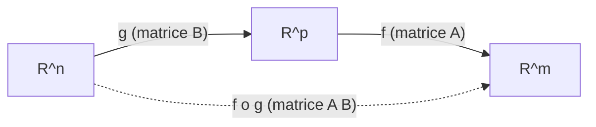

##### Exemple chiffre : la rotation du plan

La rotation d'angle $\theta$ dans $\mathbb{R}^2$ envoie $\mathbf{e}_1=(1,0)$ sur $(\cos\theta,\sin\theta)$ et $\mathbf{e}_2=(0,1)$ sur $(-\sin\theta,\cos\theta)$. Ces images **sont** les colonnes de la matrice :
```math
R_\theta = \begin{pmatrix}\cos\theta & -\sin\theta \\ \sin\theta & \cos\theta\end{pmatrix}.
```
Pour $\theta=90^\circ$ : $R = \begin{pmatrix}0&-1\\1&0\end{pmatrix}$, et $R\begin{pmatrix}1\\0\end{pmatrix}=\begin{pmatrix}0\\1\end{pmatrix}$ — le vecteur pointant a droite se retrouve bien pointant vers le haut.

#### Noyau, image, et le theoreme du rang

> **Definition (noyau et image).** Pour $f:E\to F$ lineaire :
> - le **noyau** $\ker f = \{\mathbf{x}\in E : f(\mathbf{x})=\mathbf{0}_F\}$ (ce que $f$ ecrase sur zero) ;
> - l'**image** $\mathrm{Im} f = \{ f(\mathbf{x}) : \mathbf{x}\in E\}$ (tout ce que $f$ peut produire).
>
> Ce sont des **sous-espaces** (de $E$ et de $F$ respectivement). La dimension de l'image s'appelle le **rang de $f$**.

> **Theoreme du rang (forme generale).** Si $E$ est de dimension finie et $f:E\to F$ lineaire :
> ```math
> \dim E = \dim(\ker f) + \dim(\mathrm{Im} f) = \dim(\ker f) + \mathrm{rg}(f).
> ```

**Preuve.** Soit $(\mathbf{u}_1,\dots,\mathbf{u}_p)$ une base de $\ker f$, completee (base incomplete) en une base $(\mathbf{u}_1,\dots,\mathbf{u}_p,\mathbf{w}_1,\dots,\mathbf{w}_q)$ de $E$, avec $p+q=\dim E$. Montrons que $(f(\mathbf{w}_1),\dots,f(\mathbf{w}_q))$ est une base de $\mathrm{Im} f$.
*Generatrice* : tout $f(\mathbf{x})$ avec $\mathbf{x}=\sum a_i\mathbf{u}_i + \sum b_j\mathbf{w}_j$ vaut $\sum b_j f(\mathbf{w}_j)$ (car $f(\mathbf{u}_i)=\mathbf{0}$).
*Libre* : si $\sum b_j f(\mathbf{w}_j)=\mathbf{0}$, alors $f(\sum b_j\mathbf{w}_j)=\mathbf{0}$, donc $\sum b_j\mathbf{w}_j\in\ker f$, donc $\sum b_j\mathbf{w}_j = \sum a_i\mathbf{u}_i$ pour certains $a_i$ ; mais la base totale est libre, donc tous les $b_j=0$.
Ainsi $\mathrm{rg}(f)=q$ et $\dim\ker f = p$, d'ou $\dim E = p+q$. $\blacksquare$

#### Injectivite, surjectivite, bijectivite

> **Proposition (criteres).** Pour $f:E\to F$ lineaire :
> - $f$ **injective** $\iff \ker f = \{\mathbf{0}\}$ (rien d'autre que zero ne s'ecrase) ;
> - $f$ **surjective** $\iff \mathrm{Im} f = F$ ;
> - en **dimension finie egale** ($\dim E = \dim F$) : injective $\iff$ surjective $\iff$ bijective.

**Preuve du critere d'injectivite.** Si $f$ est injective et $f(\mathbf{x})=\mathbf{0}=f(\mathbf{0})$, alors $\mathbf{x}=\mathbf{0}$ : le noyau est trivial. Reciproquement, si $\ker f=\{\mathbf{0}\}$ et $f(\mathbf{x})=f(\mathbf{y})$, alors $f(\mathbf{x}-\mathbf{y})=\mathbf{0}$, donc $\mathbf{x}-\mathbf{y}\in\ker f=\{\mathbf{0}\}$, donc $\mathbf{x}=\mathbf{y}$. $\blacksquare$

#### Retour sur les systemes : structure de l'ensemble solution

On peut enfin justifier la phrase « solution generale = particuliere + noyau ». Le systeme $A\mathbf{x}=\mathbf{b}$ a une solution $\iff \mathbf{b}\in\mathrm{Im} A$. S'il est compatible, soit $\mathbf{x}_p$ une solution particuliere ; alors $\mathbf{x}$ est solution $\iff A(\mathbf{x}-\mathbf{x}_p)=\mathbf{0} \iff \mathbf{x}-\mathbf{x}_p \in \ker A$. Donc l'ensemble solution est
```math
\mathbf{x}_p + \ker A = \{\mathbf{x}_p + \mathbf{z} : \mathbf{z}\in\ker A\}.
```
C'est **vide** ($\mathbf{b}\notin\mathrm{Im} A$), un **point** ($\ker A=\{\mathbf{0}\}$), ou un **espace affine** de dimension $\dim\ker A > 0$ : on retrouve rigoureusement les trois cas (0, 1, $\infty$).

#### Application machine learning

Un reseau de neurones **sans** fonction d'activation s'effondrerait en une **seule** application affine (composition d'applications affines = application affine), incapable d'apprendre des frontieres courbes : c'est precisement pour briser cette linearite qu'on intercale des non-linearites (ReLU, GELU). A l'inverse, la **retropropagation** (backpropagation) est, a chaque pas, du calcul **lineaire** : le gradient se propage en arriere par des produits avec les **transposees** des matrices de poids (la jacobienne d'une couche lineaire $\mathbf{x}\mapsto W\mathbf{x}$ est la matrice de poids $W$ elle-meme). Comprendre noyau et image eclaire aussi la **capacite** d'un modele et les directions que le reseau ne « voit » pas.

```python
import numpy as np

theta = np.pi / 2
R = np.array([[np.cos(theta), -np.sin(theta)],
              [np.sin(theta),  np.cos(theta)]])

print(np.round(R @ np.array([1.0, 0.0]), 6))   # [0. 1.] : e1 -> haut

# Composition = produit matriciel
def linear_map(M):
    return lambda x: M @ x

A = np.array([[2.0, 0.0], [0.0, 3.0]])   # dilatation
f, g = linear_map(A), linear_map(R)
x = np.array([1.0, 1.0])
print(np.allclose(f(g(x)), (A @ R) @ x))       # True : f o g <-> A R
```

---

### Espaces affines

#### Intuition : un espace vectoriel qui a oublie ou est son origine

Sur une feuille quadrillee, les **points** sont des emplacements ; les **vecteurs** sont des **deplacements** (« avance de 3 a droite, 2 en haut »). Un **espace affine** est le monde des points : on peut soustraire deux points pour obtenir le vecteur qui mene de l'un a l'autre, et translater un point par un vecteur, **mais il n'y a pas de point « zero » privilegie**. C'est exactement la geometrie du quotidien : aucune ville n'est « l'origine du monde », pourtant on sait calculer le deplacement entre deux villes.

> **La fleche entre deux points, $\overrightarrow{AB}$.** Ce symbole represente le **vecteur** qui va du point $A$ au point $B$ : la consigne de deplacement « pour aller de A a B, fais ceci ». On a la relation de Chasles $\overrightarrow{AB} + \overrightarrow{BC} = \overrightarrow{AC}$ (enchainer deux trajets) et $\overrightarrow{AB} = -\overrightarrow{BA}$ (faire demi-tour).

#### Definition

> **Definition (espace affine).** Un **espace affine** $\mathcal{A}$ dirige par un espace vectoriel $E$ (sa **direction**) est un ensemble de **points** muni d'une application $\mathcal{A}\times\mathcal{A}\to E,\ (A,B)\mapsto \overrightarrow{AB}$ telle que :
> 1. **Chasles** : $\forall A,B,C,\ \overrightarrow{AB}+\overrightarrow{BC}=\overrightarrow{AC}$ ;
> 2. pour tout point $A$ et tout vecteur $\mathbf{u}\in E$, il existe un **unique** point $B$ tel que $\overrightarrow{AB}=\mathbf{u}$ (on note $B = A+\mathbf{u}$).
>
> La **dimension** de $\mathcal{A}$ est $\dim E$.

> **Le symbole $A + \mathbf{u}$ (translation d'un point).** Additionner un **point** $A$ et un **vecteur** $\mathbf{u}$ donne un **nouveau point** : celui qu'on atteint en partant de $A$ et en suivant le deplacement $\mathbf{u}$. Attention, on n'additionne **pas** deux points entre eux (cela n'aurait pas de sens : ou serait l'origine ?), mais on peut les **soustraire** pour obtenir un vecteur.

#### Sous-espaces affines : la bonne description des solutions

> **Definition (sous-espace affine).** Un **sous-espace affine** de direction $F$ (sous-espace vectoriel de $E$) est un ensemble de la forme
> ```math
> \mathcal{V} = A + F = \{ A + \mathbf{u} : \mathbf{u}\in F \},
> ```
> ou $A$ est un point quelconque de $\mathcal{V}$. Sa dimension est $\dim F$.

Geometriquement : un **point** (dimension 0), une **droite affine** (dimension 1), un **plan affine** (dimension 2)… qui **n'ont pas besoin** de passer par l'origine. Un sous-espace **vectoriel** est le cas particulier ou $\mathbf{0}\in\mathcal{V}$ (on peut alors prendre $A=\mathbf{0}$).

> **Lien direct avec les systemes.** L'ensemble solution d'un systeme **compatible** $A\mathbf{x}=\mathbf{b}$ est le sous-espace affine $\mathbf{x}_p + \ker A$ : un point translate du noyau. C'est la **vraie nature geometrique** d'un ensemble solution non homogene — il est parallele au noyau (meme direction) mais decale. On comprend alors la rigidite 0/1/$\infty$ : un sous-espace affine est soit vide, soit un singleton (direction $\{\mathbf{0}\}$), soit infini.

##### Demonstration de la rigidite (0, 1 ou l'infini)

Soient $\mathbf{u}\ne\mathbf{v}$ deux solutions de $A\mathbf{x}=\mathbf{b}$. Pour tout $t\in\mathbb{R}$, posons $\mathbf{w}_t = \mathbf{u} + t(\mathbf{v}-\mathbf{u})$. Alors
```math
A\mathbf{w}_t = A\mathbf{u} + t\,A(\mathbf{v}-\mathbf{u}) = \mathbf{b} + t(\mathbf{b}-\mathbf{b}) = \mathbf{b}.
```
Donc **tous** les $\mathbf{w}_t$ sont solutions ; comme $\mathbf{u}\ne\mathbf{v}$, l'application $t\mapsto\mathbf{w}_t$ est injective (si $\mathbf{w}_s=\mathbf{w}_t$ alors $(s-t)(\mathbf{v}-\mathbf{u})=\mathbf{0}$ donc $s=t$), d'ou une **infinite** de solutions deux a deux distinctes. Conclusion : des qu'il y a deux solutions, il y en a une infinite — il ne reste que 0, 1 ou $\infty$. $\blacksquare$

#### Barycentres et combinaisons affines

> **Definition (combinaison affine).** Une **combinaison affine** des points $A_1,\dots,A_k$, affectes de poids $\lambda_1,\dots,\lambda_k$ avec $\sum_i \lambda_i = 1$, est le point $G$ defini, a partir de n'importe quelle origine $O$, par $\overrightarrow{OG} = \sum_{i=1}^{k}\lambda_i \overrightarrow{OA_i}$. C'est le **barycentre** des $A_i$ ponderes par les $\lambda_i$. Si tous les poids sont egaux ($\lambda_i = 1/k$), on obtient l'**isobarycentre** (le centre de gravite).

La contrainte $\sum\lambda_i = 1$ est ce qui rend l'operation **bien definie** sans origine : elle garantit que le point $G$ obtenu ne depend pas du choix de $O$ (changer d'origine ajoute $(1-\sum_i\lambda_i)\overrightarrow{O'O} = \mathbf{0}$). Le segment $[A,B]$ est l'ensemble des barycentres $(1-t)A + tB$ pour $t\in[0,1]$ — un cas de combinaison affine (poids $1-t$ et $t$ sommant a 1).

> **La convexite.** Un ensemble est **convexe** si, pour deux points quelconques qu'il contient, il contient **tout le segment** qui les relie. Le segment est une combinaison affine a poids **positifs** (et de somme 1). Cette notion, batie sur l'affine, est l'ossature de l'optimisation : une fonction strictement convexe sur un convexe a **au plus un** minimum, et tout minimum local d'une fonction convexe est global — ce qui rend l'apprentissage fiable.

#### Application machine learning

La frontiere de decision d'un classifieur lineaire (perceptron, SVM lineaire, regression logistique) est un **hyperplan affine** $\{\mathbf{x} : \mathbf{w}^\top\mathbf{x} + b = 0\}$ : c'est le terme de **biais** $b$ qui le decolle de l'origine, le transformant d'un hyperplan vectoriel en hyperplan **affine**. La couche $\mathbf{x}\mapsto W\mathbf{x}+\mathbf{b}$ est une **transformation affine** (lineaire + translation), brique elementaire de tout reseau. Et l'**interpolation** entre deux modeles ou deux embeddings, $(1-t)\boldsymbol{\theta}_1 + t\boldsymbol{\theta}_2$, est une combinaison affine — au coeur du **model merging** (fusion de modeles).

> **Mise a jour 2026.** La **fusion de modeles** (model merging) par moyennes de poids — moyenne simple, **model soups**, interpolation lineaire le long du chemin d'entrainement — est devenue une technique courante pour combiner les forces de plusieurs modeles sans reentrainement. Sa justification empirique tient a la **connectivite de mode** (mode connectivity) : les minima trouves par descente de gradient sont souvent relies par des chemins de faible perte, parfois quasi **affines**, dans l'espace des parametres.

```python
import numpy as np

# Hyperplan affine de decision : w . x + b = 0
w = np.array([2.0, -1.0])
b = -1.0
def decision(x):
    return np.sign(w @ x + b)

print(decision(np.array([1.0, 0.0])))   # 1.0 (cote positif)
print(decision(np.array([0.0, 2.0])))   # -1.0 (cote negatif)

# Combinaison affine de deux jeux de parametres (model merging)
theta1 = np.array([1.0, 2.0, 3.0])
theta2 = np.array([3.0, 0.0, 1.0])
t = 0.25
theta_merged = (1 - t) * theta1 + t * theta2   # poids 0.75 et 0.25 (somme = 1)
print(theta_merged)                            # [1.5 1.5 2.5]
```

---

### L'algèbre linéaire à l'œuvre en machine learning

Cette section rassemble et approfondit les liens deja semes, pour montrer que **le machine learning est de l'algebre lineaire en action**.

#### Les donnees sont des matrices

Un jeu de donnees de $N$ exemples a $d$ caracteristiques est une matrice $X\in\mathbb{R}^{N\times d}$ : une **ligne par exemple**, une **colonne par caracteristique**. Une image est un vecteur (ou un tenseur) ; un corpus de texte devient une matrice terme-document ou une pile de plongements. Le premier reflexe du praticien est **toujours** : « quelle est la forme (shape) de mon tableau, que representent ses lignes et ses colonnes ? »

#### La regression lineaire et les moindres carres

Le modele lineaire predit $\hat{\mathbf{y}} = X\boldsymbol{\beta}$. Comme il y a en general plus d'equations que d'inconnues ($N > d$), le systeme $X\boldsymbol{\beta}=\mathbf{y}$ n'a pas de solution exacte : on minimise alors l'erreur quadratique $\lVert X\boldsymbol{\beta}-\mathbf{y}\rVert^2$.

> **Le symbole de la norme, $\lVert \cdot \rVert$.** La double barre represente la **norme** d'un vecteur : sa **longueur**, la distance de la fleche a l'origine. Pour $\mathbf{v}\in\mathbb{R}^n$, la norme euclidienne est $\lVert\mathbf{v}\rVert = \sqrt{\sum_i v_i^2}$ (le theoreme de Pythagore en dimension $n$). Minimiser $\lVert X\boldsymbol{\beta}-\mathbf{y}\rVert^2$, c'est rendre le vecteur d'erreurs **le plus court possible**.

> **Les symboles $\boldsymbol{\beta}$, $\hat{\mathbf{y}}$ et $\arg\min$.** $\boldsymbol{\beta}$ (beta) est le vecteur des **parametres** a apprendre (les coefficients du modele). Le **chapeau** sur $\hat{\mathbf{y}}$ signifie « valeur **predite** » (par opposition a la vraie valeur $\mathbf{y}$). L'operateur $\arg\min_{\boldsymbol{\beta}}$ se lit « l'argument qui **minimise** » : il ne renvoie pas la valeur minimale, mais **le $\boldsymbol{\beta}$ qui la realise** — la position du point le plus bas, pas l'altitude.

> **Theoreme (equations normales).** Tout minimiseur de $\lVert X\boldsymbol{\beta}-\mathbf{y}\rVert^2$ verifie
> ```math
> X^\top X\,\boldsymbol{\beta} = X^\top \mathbf{y}, \qquad\text{d'ou}\qquad \boldsymbol{\beta}^\star = (X^\top X)^{-1} X^\top \mathbf{y} \ \text{ si } X^\top X \text{ est inversible.}
> ```

**Idee de preuve (geometrique).** La norme de l'erreur $X\boldsymbol{\beta}-\mathbf{y}$ est minimale quand $X\boldsymbol{\beta}$ est la **projection orthogonale** de $\mathbf{y}$ sur $\mathrm{Im}X$ ; le vecteur d'erreur est alors orthogonal a $\mathrm{Im}X$. L'orthogonalite a toutes les colonnes de $X$ s'ecrit $X^\top(X\boldsymbol{\beta}-\mathbf{y})=\mathbf{0}$, soit les equations normales. $\blacksquare$

> **Mise a jour 2026.** En pratique, on ne calcule **jamais** $(X^\top X)^{-1}$ : former $X^\top X$ **carre** le conditionnement et amplifie les erreurs. On resout via **QR** ou directement par **SVD** (`np.linalg.lstsq`). Pour des $X$ enormes, on prefere la **descente de gradient (stochastique)** — qui est aussi ce qui passe a l'echelle pour les modeles non lineaires.

```python
import numpy as np
rng = np.random.default_rng(0)

N, d = 100, 3
X = rng.normal(size=(N, d))
beta_true = np.array([2.0, -1.0, 0.5])
y = X @ beta_true + 0.1 * rng.normal(size=N)

beta_hat, *_ = np.linalg.lstsq(X, y, rcond=None)   # SVD interne, recommande
print(np.round(beta_hat, 3))                        # ~ [ 2. -1.  0.5]
```

#### Le produit scalaire, les normes et la similarite

Le produit scalaire $\mathbf{u}^\top\mathbf{v}$ mesure l'alignement de deux vecteurs ; normalise, il donne la **similarite cosinus** $\cos(\mathbf{u},\mathbf{v}) = \frac{\mathbf{u}^\top\mathbf{v}}{\lVert\mathbf{u}\rVert\,\lVert\mathbf{v}\rVert}$, omnipresente dans la recherche semantique et les recommandations. C'est exactement le coeur de l'**attention** des Transformers : les scores $\mathbf{q}^\top\mathbf{k}$ entre requetes (queries) et cles (keys) sont des produits scalaires, organises en un grand produit matriciel $QK^\top$.

#### Valeurs propres, decomposition spectrale et SVD

> **Le symbole valeur propre $\lambda$ et vecteur propre $\mathbf{v}$.** Pour une matrice carree $A$, un **vecteur propre** (eigenvector) est une direction **que $A$ ne fait que dilater** sans la devier : $A\mathbf{v} = \lambda\mathbf{v}$ avec $\mathbf{v}\ne\mathbf{0}$, ou le scalaire $\lambda$ (valeur propre, eigenvalue) est le **facteur d'etirement** le long de cette direction. Ce sont les « axes naturels » de la transformation.

> **Definition (valeurs/vecteurs propres).** $\lambda\in\mathbb{R}$ est **valeur propre** de $A\in\mathbb{R}^{n\times n}$ s'il existe $\mathbf{v}\ne\mathbf{0}$ avec $A\mathbf{v}=\lambda\mathbf{v}$. Cela equivaut a $\det(A-\lambda I_n)=0$ (polynome caracteristique). Si $A$ est **symetrique** ($A=A^\top$), le **theoreme spectral** garantit une base orthonormee de vecteurs propres et des valeurs propres reelles : $A = Q\Lambda Q^\top$ avec $Q$ orthogonale ($Q^\top Q = I_n$) et $\Lambda$ diagonale.

La **decomposition en valeurs singulieres** (SVD) generalise cela a **toute** matrice $A\in\mathbb{R}^{m\times n}$ :
```math
A = U\Sigma V^\top,
```
avec $U\in\mathbb{R}^{m\times m}$ et $V\in\mathbb{R}^{n\times n}$ orthogonales, et $\Sigma\in\mathbb{R}^{m\times n}$ « diagonale » des **valeurs singulieres** $\sigma_1\ge\sigma_2\ge\cdots\ge 0$. La SVD est l'outil le plus puissant de tout le chapitre : elle donne le **rang** (nombre de $\sigma_i$ non nuls), la meilleure **approximation de rang faible** (theoreme d'Eckart-Young), le **conditionnement** ($\sigma_{\max}/\sigma_{\min}$ pour une matrice inversible), et fonde l'**ACP**.

#### L'analyse en composantes principales (ACP)

> **Definition (ACP / PCA).** Sur des donnees **centrees** $X$, l'**analyse en composantes principales** cherche les directions orthogonales de **variance maximale**. Ce sont les vecteurs propres de la matrice de covariance $C = \tfrac{1}{N}X^\top X$, ou, de maniere equivalente et numeriquement preferable, les vecteurs singuliers droits ($V$) de $X$. Projeter sur les $k$ premieres composantes **comprime** les donnees en perdant le moins de variance possible.

```python
import numpy as np
rng = np.random.default_rng(1)

X = rng.normal(size=(200, 5))
X[:, 1] = 2 * X[:, 0] + 0.01 * rng.normal(size=200)   # forte correlation

Xc = X - X.mean(axis=0)                 # centrage
U, s, Vt = np.linalg.svd(Xc, full_matrices=False)
explained = s**2 / np.sum(s**2)
print(np.round(explained, 3))           # 1re composante domine (colonnes 0 et 1 liees)
```

> **Mise a jour 2026.** Pour des matrices gigantesques, on calcule la SVD par des **methodes randomisees** (randomized SVD) : une projection aleatoire capture l'essentiel du sous-espace dominant a une fraction du cout. Ces idees irriguent l'apprentissage moderne — du PCA approche aux esquisses (sketching) pour l'attention lineaire, en passant par la compression de modeles par approximation de rang faible (dont **LoRA**).

#### Le gradient, l'optimisation et l'autodiff

Entrainer un modele, c'est minimiser une fonction de perte $\mathcal{L}(\boldsymbol{\theta})$ sur les parametres $\boldsymbol{\theta}$. La descente de gradient met a jour $\boldsymbol{\theta} \leftarrow \boldsymbol{\theta} - \eta\,\nabla\mathcal{L}(\boldsymbol{\theta})$, et **chaque** etape repose sur de l'algebre lineaire : produits matrice-vecteur dans la propagation avant, produits avec les **transposees** dans la retropropagation (la **regle de la chaine** matricielle via les jacobiennes).

> **Le symbole gradient $\nabla$ (nabla).** Ce symbole (un triangle pointe en bas) represente le **gradient** : le vecteur de **toutes les pentes** d'une fonction, une par variable. C'est la direction de **plus forte montee** ; on avance a l'oppose ($-\nabla$) pour descendre vers un minimum, comme une bille qui devale la pente la plus raide. (Le calcul des gradients releve du chapitre d'analyse ; on l'utilise ici comme une operation lineaire de plus.)

> **Mise a jour 2026.** L'**autodifferentiation** (autodiff) de JAX et PyTorch calcule ces gradients automatiquement et exactement, en composant les jacobiennes des operations — c'est-a-dire en **chainant des produits matriciels**. Les optimiseurs modernes **Adam / AdamW** adaptent le pas coordonnee par coordonnee a partir des moments du gradient ; ils restent, sous le capot, des mises a jour vectorielles et matricielles. L'algebre lineaire n'est pas un prerequis lointain du deep learning : elle en est **la substance calculatoire**, du plus petit produit scalaire au plus grand modele.

#### Tableau de synthese : un concept, une application

| Concept d'algebre lineaire | Role en machine learning |
|---|---|
| Produit matriciel | couche dense, attention $QK^\top$, propagation |
| Systeme / moindres carres | regression lineaire, equations normales |
| Transposee | retropropagation, equations normales |
| Rang / approximation de rang faible | compression, recommandation, **LoRA** |
| Noyau / image | capacite et redondance d'un modele |
| Produit scalaire / norme | similarite cosinus, regularisation, attention |
| Valeurs/vecteurs propres, SVD | **ACP**, conditionnement, spectre |
| Espaces affines | frontiere de decision (biais), fusion de modeles |
| Gradient (operation lineaire) | descente de gradient, autodiff, Adam |

---

### Exercices

Les corriges suivent immediatement chaque enonce. Essayez d'abord seul, crayon en main.

#### Exercice 1 — Resolution par Gauss

Resoudre le systeme :
```math
\begin{cases}
x + y + z = 6 \\
2x - y + z = 3 \\
x + 2y - z = 2
\end{cases}
```

> **Corrige.** Matrice augmentee, pivot 1 sur la ligne 1.
> $L_2\leftarrow L_2 - 2L_1$ : $(0,-3,-1\mid -9)$. $L_3\leftarrow L_3 - L_1$ : $(0,1,-2\mid -4)$.
> Echangeons pour un pivot commode, $L_2\leftrightarrow L_3$ : pivot $1$ en ligne 2, colonne 2.
> $L_3\leftarrow L_3 + 3L_2$ : $(0,0,-7\mid -21)$, donc $z = 3$.
> Remontee : $y - 2(3) = -4 \Rightarrow y = 2$ ; puis $x + 2 + 3 = 6 \Rightarrow x = 1$.
> **Solution unique** $(x,y,z) = (1,2,3)$. Verification (eq. 2) : $2(1)-2+3=3$. Correct.

#### Exercice 2 — Produit et transposee

Avec $A=\begin{pmatrix}1&2\\0&1\\3&1\end{pmatrix}$ et $B=\begin{pmatrix}2&0&1\\1&1&0\end{pmatrix}$, calculer $AB$, sa taille, et verifier $(AB)^\top = B^\top A^\top$.

> **Corrige.** $A$ est $3\times2$, $B$ est $2\times3$, donc $AB$ est $3\times3$.
> ```math
> AB = \begin{pmatrix} 1\cdot2+2\cdot1 & 1\cdot0+2\cdot1 & 1\cdot1+2\cdot0 \\ 0\cdot2+1\cdot1 & 0+1 & 0+0 \\ 3\cdot2+1\cdot1 & 0+1 & 3+0 \end{pmatrix} = \begin{pmatrix} 4 & 2 & 1 \\ 1 & 1 & 0 \\ 7 & 1 & 3 \end{pmatrix}.
> ```
> $(AB)^\top = \begin{pmatrix}4&1&7\\2&1&1\\1&0&3\end{pmatrix}$. Par ailleurs $B^\top A^\top$ avec $B^\top=\begin{pmatrix}2&1\\0&1\\1&0\end{pmatrix}$, $A^\top=\begin{pmatrix}1&0&3\\2&1&1\end{pmatrix}$ donne la **meme** matrice. Verifie.

#### Exercice 3 — Sous-espace ou non ?

Les ensembles suivants sont-ils des sous-espaces de $\mathbb{R}^3$ ? (a) $F=\{(x,y,z):x=y\}$ ; (b) $G=\{(x,y,z):xyz=0\}$ ; (c) $H=\{(x,y,z):x+y+z=1\}$.

> **Corrige.**
> (a) **Oui** : contient $\mathbf{0}$, et la condition $x=y$ se preserve par somme et par produit scalaire (c'est un plan par l'origine).
> (b) **Non** : $(1,0,0)$ et $(0,1,1)$ sont dans $G$ (un facteur nul), mais leur somme $(1,1,1)$ a $xyz=1\ne0$ : pas stable par addition.
> (c) **Non** : $\mathbf{0}=(0,0,0)$ donne $0\ne1$, donc $\mathbf{0}\notin H$ (c'est un plan **affine**, pas vectoriel).

#### Exercice 4 — Independance lineaire

Les vecteurs $(1,1,0)$, $(0,1,1)$, $(1,0,1)$ de $\mathbb{R}^3$ sont-ils libres ? Forment-ils une base ?

> **Corrige.** On resout $\lambda_1(1,1,0)+\lambda_2(0,1,1)+\lambda_3(1,0,1)=\mathbf{0}$ :
> $\lambda_1+\lambda_3=0$, $\lambda_1+\lambda_2=0$, $\lambda_2+\lambda_3=0$. De la 1re, $\lambda_3=-\lambda_1$ ; de la 2e, $\lambda_2=-\lambda_1$ ; la 3e : $-\lambda_1-\lambda_1=-2\lambda_1=0\Rightarrow\lambda_1=0$, puis tout est nul. **Famille libre.** Comme on a 3 vecteurs libres dans un espace de dimension 3, c'est une **base** (theoreme de la base incomplete). Le determinant vaut d'ailleurs $2 \ne 0$, confirmation.

#### Exercice 5 — Rang et noyau

Pour $A=\begin{pmatrix}1&2&1\\2&4&2\\3&6&4\end{pmatrix}$, donner $\mathrm{rg}(A)$, $\dim\ker A$, et une base du noyau.

> **Corrige.** $L_2\leftarrow L_2-2L_1 \Rightarrow (0,0,0)$ ; $L_3\leftarrow L_3-3L_1 \Rightarrow (0,0,1)$. Restent **2 pivots** (colonnes 1 et 3) : $\mathrm{rg}(A)=2$. Par le theoreme du rang, $\dim\ker A = 3-2 = 1$. Pour le noyau, la colonne 2 n'a pas de pivot : posons $y=t$. La ligne $(0,0,1)$ donne $z=0$, et la ligne 1 donne $x+2t+z=0\Rightarrow x=-2t$. Base du noyau : $(-2,1,0)$. Verification : $A(-2,1,0)^\top = (-2+2+0,\,-4+4+0,\,-6+6+0)=(0,0,0)$. Correct.

#### Exercice 6 — Application lineaire et matrice

Soit $f:\mathbb{R}^2\to\mathbb{R}^2$ la projection orthogonale sur la droite $y=x$. Donner sa matrice dans la base canonique, puis $\ker f$ et $\mathrm{Im} f$.

> **Corrige.** La projection sur la droite dirigee par le vecteur unitaire $\mathbf{u}=\tfrac{1}{\sqrt2}(1,1)$ est $f(\mathbf{x})=(\mathbf{x}\cdot\mathbf{u})\mathbf{u}$, de matrice $P=\mathbf{u}\mathbf{u}^\top=\tfrac12\begin{pmatrix}1&1\\1&1\end{pmatrix}$.
> Verification : $f(\mathbf{e}_1)=\tfrac12(1,1)$, $f(\mathbf{e}_2)=\tfrac12(1,1)$ — ce sont bien les colonnes de $P$.
> $\mathrm{Im} f$ = la droite $y=x$ (dimension 1). $\ker f$ = la droite **orthogonale** $y=-x$ (les vecteurs envoyes sur $\mathbf{0}$), dimension 1. On verifie le theoreme du rang : $1+1=2$. Idempotence : $P^2=P$ (projeter deux fois = projeter une fois).

#### Exercice 7 — Espace affine et systeme

Decrire geometriquement l'ensemble solution de $\begin{cases} x+y+z=3 \\ x - y + 2z = 4 \end{cases}$.

> **Corrige.** Deux equations, trois inconnues. $L_2\leftarrow L_2 - L_1$ : $-2y + z = 1 \Rightarrow z = 1+2y$. Posons $y=t$. Alors $z=1+2t$, et $x = 3 - t - (1+2t) = 2 - 3t$. Ensemble solution :
> ```math
> (2,0,1) + t\,(-3,1,2),\quad t\in\mathbb{R}.
> ```
> C'est une **droite affine** : le point particulier $(2,0,1)$ translate de la droite vectorielle $\ker A = \mathrm{Vect}(-3,1,2)$. Dimension 1, conforme a $n-\mathrm{rg}(A)=3-2=1$.

#### Exercice 8 — Moindres carres a la main

Ajuster une droite $y = a x + b$ aux points $(0,1), (1,2), (2,2)$ par les equations normales.

> **Corrige.** On pose $X=\begin{pmatrix}0&1\\1&1\\2&1\end{pmatrix}$ (colonnes : $x$ et constante), $\mathbf{y}=(1,2,2)^\top$, parametres $(a,b)$.
> $X^\top X = \begin{pmatrix}0^2+1^2+2^2 & 0+1+2 \\ 0+1+2 & 3\end{pmatrix} = \begin{pmatrix}5&3\\3&3\end{pmatrix}$, $X^\top\mathbf{y}=\begin{pmatrix}0\cdot1+1\cdot2+2\cdot2\\1+2+2\end{pmatrix}=\begin{pmatrix}6\\5\end{pmatrix}$.
> Resolvons $\begin{pmatrix}5&3\\3&3\end{pmatrix}\begin{pmatrix}a\\b\end{pmatrix}=\begin{pmatrix}6\\5\end{pmatrix}$. Determinant $=15-9=6$. Par la formule d'inversion $2\times2$, $a=\tfrac{1}{6}(3\cdot6 - 3\cdot5)=\tfrac{1}{6}(18-15)=\tfrac12$, $b=\tfrac{1}{6}(5\cdot5 - 3\cdot6)=\tfrac{1}{6}(25-18)=\tfrac{7}{6}$.
> **Droite ajustee** : $y = \tfrac12 x + \tfrac76$. Predictions : $\tfrac76\approx1.17,\ \tfrac{10}{6}\approx1.67,\ \tfrac{13}{6}\approx2.17$ — au plus pres des donnees au sens des moindres carres.

#### Exercice 9 — Vrai ou faux (avec justification)

1. Si $AB = 0$ alors $A=0$ ou $B=0$.
2. Toute matrice carree est inversible.
3. $\mathrm{rg}(A) = \mathrm{rg}(A^\top)$.
4. Une famille de 3 vecteurs dans $\mathbb{R}^2$ est toujours liee.

> **Corrige.**
> 1. **Faux.** Contre-exemple : $A=\begin{pmatrix}1&0\\0&0\end{pmatrix}$, $B=\begin{pmatrix}0&0\\0&1\end{pmatrix}$, alors $AB=0$ sans que ni $A$ ni $B$ soit nulle. (Il existe des **diviseurs de zero**.)
> 2. **Faux.** La matrice nulle, ou toute matrice de determinant nul, n'est pas inversible.
> 3. **Vrai.** C'est le theoreme « rang lignes = rang colonnes ».
> 4. **Vrai.** Dans $\mathbb{R}^n$, toute famille de plus de $n$ vecteurs est liee ; ici $3 > 2$.

#### Exercice 10 — Vers la SVD et l'ACP (avec Python)

Generer un nuage de points correle en 2D, calculer sa SVD, et verifier que la premiere direction principale suit l'allongement du nuage.

> **Corrige.**
> ```python
> import numpy as np
> rng = np.random.default_rng(42)
>
> n = 500
> base = rng.normal(size=n)
> X = np.column_stack([base + 0.1*rng.normal(size=n),
>                      2*base + 0.1*rng.normal(size=n)])   # allonge ~ direction (1,2)
> Xc = X - X.mean(axis=0)
>
> U, s, Vt = np.linalg.svd(Xc, full_matrices=False)
> v1 = Vt[0]                       # 1re direction principale
> print(np.round(v1 / v1[0], 3))   # ~ (1, 2) : pente ~ 2
> print(np.round(s**2 / np.sum(s**2), 3))   # la 1re composante capte l'essentiel
> ```
> La premiere ligne de $V^\top$ pointe dans la direction $(1,2)$ (l'axe d'allongement), et la premiere valeur singuliere au carre concentre la quasi-totalite de la variance : c'est l'**ACP** en action, fondee entierement sur la SVD.

[↑ Retour à la table des matières](#table-des-matières)

## 3. Géométrie analytique

### Normes

Avant de parler de géométrie, il faut savoir **mesurer**. En géométrie analytique, tout objet — un point, une direction, une donnée — vit dans un espace vectoriel, et la première question que l'on se pose est : « quelle est la *taille* de ce vecteur ? » C'est exactement ce que formalise la notion de **norme** (norm).

#### Intuition imagée

Imaginez une flèche dessinée sur une feuille, partant de l'origine. Sa norme, c'est tout simplement sa **longueur** : la distance entre la pointe et la queue. Si la flèche est deux fois plus longue, sa norme double. Si la flèche est réduite à un point (le vecteur nul), sa norme vaut zéro. Une norme ne peut jamais être négative : une longueur négative n'a aucun sens.

Mais — et c'est le cœur de l'affaire — il existe **plusieurs façons légitimes** de mesurer une « longueur ». À vol d'oiseau (la distance euclidienne usuelle), ou à la manière d'un taxi qui ne peut rouler que dans des rues perpendiculaires (la distance de Manhattan). Ce sont des normes différentes, toutes valides.

#### Définition rigoureuse

> **Le symbole $\|\cdot\|$ (double barre verticale).**
> Ce symbole représente la **norme**, c'est-à-dire la « longueur » d'un vecteur. Quand on écrit $\|x\|$, lisez « norme de $x$ ». Pourquoi une *double* barre, et non une seule comme la valeur absolue $|a|$ d'un nombre ? Parce qu'un vecteur a *plusieurs coordonnées* : la double barre nous rappelle qu'on combine toutes ces coordonnées en une seule mesure de taille. C'est comme demander la taille d'une personne : on résume plein d'informations (longueur des jambes, du torse, du cou) en un seul nombre, en centimètres.

Soit $V$ un espace vectoriel sur le corps $\mathbb{R}$ (l'ensemble des nombres réels, c'est-à-dire tous les nombres « avec une virgule », positifs ou négatifs). Une **norme** sur $V$ est une application

```math
\|\cdot\| : V \longrightarrow \mathbb{R}_{\geq 0}
```

qui à chaque vecteur associe un nombre réel positif ou nul, et qui vérifie les **trois axiomes** suivants, pour tous vecteurs $x, y \in V$ et tout scalaire $\lambda \in \mathbb{R}$ :

> **Le symbole $\in$ (appartient à).**
> Ce symbole, qui ressemble à un « e » arrondi, représente l'**appartenance**. $x \in V$ se lit « $x$ appartient à $V$ », c'est-à-dire « $x$ est un élément de l'ensemble $V$ ». C'est comme dire « Médor appartient à l'ensemble des chiens ». Le symbole $\mathbb{R}_{\geq 0}$ désigne quant à lui l'ensemble des réels supérieurs ou égaux à zéro (les longueurs possibles).

| Axiome | Formule | Lecture intuitive |
|---|---|---|
| **(N1) Positivité / séparation** | $\|x\| \geq 0$, et $\|x\| = 0 \iff x = 0$ | Une longueur est positive ; seule la flèche nulle a une longueur nulle. |
| **(N2) Homogénéité absolue** | $\|\lambda x\| = |\lambda|\,\|x\|$ | Étirer la flèche d'un facteur $\lambda$ multiplie sa longueur par $|\lambda|$. |
| **(N3) Inégalité triangulaire** | $\|x + y\| \leq \|x\| + \|y\|$ | Un détour est toujours plus long que la ligne directe. |

> **Attention à l'axiome (N2).** On écrit $|\lambda|$ (valeur absolue, **simple** barre) car $\lambda$ est un *nombre*, pas un vecteur. La double barre $\|\cdot\|$ est réservée aux vecteurs. Si l'on étire une flèche par $\lambda = -3$, sa longueur est multipliée par $|-3| = 3$ : le signe disparaît, car une longueur reste positive même quand on retourne la flèche.

> **Le symbole $\iff$ (équivalence).**
> Cette double flèche signifie « **si et seulement si** » : les deux affirmations qu'elle relie sont vraies exactement dans les mêmes situations. Ici, « $\|x\|=0$ » et « $x=0$ » vont toujours ensemble, comme « il pleut » $\iff$ « le sol devient mouillé » dans un monde idéalisé : l'un ne va jamais sans l'autre.

> **Remarque (inégalité triangulaire, l'âme de la géométrie).** L'axiome (N3) tient son nom du triangle de sommets $0$, $x$ et $x+y$ : aller directement de $0$ à $x+y$ (côté de longueur $\|x+y\|$) est plus court que passer par le sommet intermédiaire (chemin de longueur $\|x\|+\|y\|$). C'est la version mathématique du proverbe « le plus court chemin est la ligne droite ».

#### La famille des normes $\ell_p$

Sur $\mathbb{R}^n$ (l'espace des vecteurs à $n$ coordonnées réelles), la classe la plus importante est celle des **normes $\ell_p$** (« normes p »), définies pour un réel $p \geq 1$ par :

```math
\|x\|_p = \left( \sum_{i=1}^{n} |x_i|^p \right)^{1/p}
```

> **Le symbole $\sum$ (sigma majuscule, la somme).**
> Ce grand symbole en forme de « E » anguleux représente une **somme répétée**. Voyez-le comme une **boucle qui additionne** : $\sum_{i=1}^{n}$ veut dire « fais varier le compteur $i$ depuis $1$ jusqu'à $n$, et additionne tout ce qui suit ». Par exemple $\sum_{i=1}^{3} a_i = a_1 + a_2 + a_3$. La lettre $i$ en bas est l'**indice** (le compteur), $1$ est sa valeur de départ, $n$ (en haut) sa valeur d'arrivée. C'est exactement comme empiler des pièces une par une et compter le total. Le symbole $|x_i|$ à l'intérieur est la **valeur absolue** de la $i$-ème coordonnée : la distance de $x_i$ à zéro, toujours positive (par exemple $|{-3}| = 3$).

Trois valeurs de $p$ dominent la pratique :

| Nom | Notation | Formule | Image mentale |
|---|---|---|---|
| Norme de Manhattan / taxi ($\ell_1$) | $\|x\|_1$ | $\sum_{i=1}^n |x_i|$ | Distance parcourue dans un quadrillage de rues. |
| Norme euclidienne ($\ell_2$) | $\|x\|_2$ | $\sqrt{\sum_{i=1}^n x_i^2}$ | Distance « à vol d'oiseau », le théorème de Pythagore. |
| Norme du sup / max ($\ell_\infty$) | $\|x\|_\infty$ | $\max_{1 \leq i \leq n} |x_i|$ | La plus grande coordonnée en valeur absolue. |

La norme euclidienne $\ell_2$ est la « longueur » usuelle, celle de notre intuition géométrique. Elle correspond à $p=2$ et généralise directement Pythagore : dans le plan, $\|x\|_2 = \sqrt{x_1^2 + x_2^2}$ est bien la longueur de l'hypoténuse d'un triangle rectangle de côtés $x_1$ et $x_2$.

> **Le symbole $\sqrt{\ }$ (racine carrée).** Il représente l'opération inverse du carré : $\sqrt{9}=3$ parce que $3^2 = 9$. Intuitivement, si une surface carrée a une aire de $9$, son côté mesure $\sqrt 9 = 3$. La racine carrée d'une somme de carrés « défait » la mise au carré des coordonnées pour revenir à une longueur.

> **Le symbole $\max$ (maximum).** $\max_i |x_i|$ signifie « le plus grand parmi les nombres $|x_i|$ ». Imaginez une rangée d'enfants : le maximum, c'est la taille du plus grand. La norme $\ell_\infty$ est la limite des normes $\ell_p$ quand $p \to \infty$ ; quand $p$ devient gigantesque, le terme le plus grand de la somme écrase tous les autres.

> **Piège fréquent.** Pour $0 < p < 1$, la formule ci-dessus **n'est plus une norme** : l'inégalité triangulaire (N3) est violée. On parle alors de « quasi-norme ». De même, le « comptage de coefficients non nuls » noté abusivement $\|x\|_0$ (la pseudo-norme $\ell_0$, omniprésente en parcimonie) **n'est pas une norme** : elle n'est pas homogène ($\|2x\|_0 = \|x\|_0 \neq 2\|x\|_0$).

#### Boules unité : visualiser une norme

La **boule unité** d'une norme est l'ensemble des vecteurs de norme $\leq 1$ : $B = \{x : \|x\| \leq 1\}$. Sa forme caractérise entièrement la norme.

> **Le symbole $\{\,\cdot \mid \cdot\,\}$ (accolades, définition d'un ensemble).** Les accolades $\{\dots\}$ décrivent un **ensemble**, et la barre verticale $\mid$ (ou deux-points) se lit « tels que ». Ainsi $\{x \mid \|x\|\leq 1\}$ se lit « l'ensemble des $x$ tels que la norme de $x$ est inférieure ou égale à $1$ ». C'est comme dire « l'ensemble des élèves tels que leur note dépasse $10$ » : une accolade qui regroupe, une condition qui filtre.

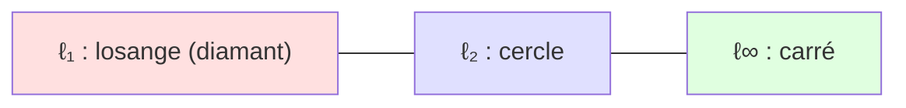

Dans le plan, la boule unité $\ell_1$ est un **losange** (pointes sur les axes), la boule $\ell_2$ est un **cercle** parfait, et la boule $\ell_\infty$ est un **carré** aligné sur les axes. Cette géométrie n'est pas anecdotique : en apprentissage automatique, les **coins** du losange $\ell_1$ (situés sur les axes, donc avec des coordonnées nulles) expliquent pourquoi la régularisation $\ell_1$ (le LASSO) produit des solutions **parcimonieuses** (sparse), c'est-à-dire avec beaucoup de zéros.

#### Inégalités entre normes et équivalence

Sur $\mathbb{R}^n$, toutes ces normes vérifient des relations d'encadrement. On a notamment, pour tout $x \in \mathbb{R}^n$ :

```math
\|x\|_\infty \leq \|x\|_2 \leq \|x\|_1 \leq \sqrt{n}\,\|x\|_2 \leq n\,\|x\|_\infty
```

Plus profondément, un théorème central :

> **Théorème (équivalence des normes en dimension finie).** Sur un espace vectoriel de dimension finie, **toutes les normes sont équivalentes** : pour deux normes $\|\cdot\|_a$ et $\|\cdot\|_b$, il existe des constantes $0 < c \leq C$ telles que
> ```math
> c\,\|x\|_a \leq \|x\|_b \leq C\,\|x\|_a \qquad \forall x.
> ```
> Conséquence : la convergence d'une suite, la continuité, la notion de « petit » ou « grand » ne dépendent **pas** du choix de la norme. C'est un luxe propre à la dimension finie ; en dimension infinie (espaces de fonctions), il disparaît.

> **Le symbole $\forall$ (quantificateur universel).** Ce « A » retourné se lit « **pour tout** » ou « quel que soit ». $\forall x$ veut dire « ceci est vrai pour absolument tous les $x$ », sans exception. C'est comme une affiche « *interdit à tous les véhicules* » : la règle s'applique à chacun.

*Démonstration (esquisse).* Il suffit de montrer que toute norme $\|\cdot\|$ est équivalente à $\|\cdot\|_2$. La fonction $x \mapsto \|x\|$ est continue pour $\|\cdot\|_2$ (par l'inégalité triangulaire et l'homogénéité). La sphère unité $S = \{x : \|x\|_2 = 1\}$ est **compacte** (fermée et bornée en dimension finie, théorème de Heine–Borel). Une fonction continue sur un compact atteint ses bornes : posons $c = \min_{x \in S} \|x\|$ et $C = \max_{x \in S} \|x\|$. Comme $0 \notin S$ et que $\|x\| = 0 \iff x = 0$, on a $c > 0$. Pour $x \neq 0$ quelconque, en appliquant à $x/\|x\|_2 \in S$ et en utilisant l'homogénéité, on obtient $c \leq \|x\|/\|x\|_2 \leq C$, d'où le résultat. $\blacksquare$

> **Le symbole $\mapsto$ (« associe à »).** La flèche à barre $\mapsto$ décrit l'**action** d'une fonction sur un élément : $x \mapsto \|x\|$ se lit « à $x$, on associe $\|x\|$ ». À ne pas confondre avec $\to$ (qui relie des *ensembles* : $f : V \to \mathbb{R}$). Pensez à une machine : $\to$ décrit le type d'entrée et de sortie de la machine, $\mapsto$ décrit ce qu'elle fait à un objet précis.

#### Exemple chiffré déroulé

Prenons $x = (3, -4) \in \mathbb{R}^2$.

- **$\ell_1$ :** $\|x\|_1 = |3| + |{-4}| = 3 + 4 = 7$.
- **$\ell_2$ :** $\|x\|_2 = \sqrt{3^2 + (-4)^2} = \sqrt{9 + 16} = \sqrt{25} = 5$. (Le fameux triangle 3-4-5.)
- **$\ell_\infty$ :** $\|x\|_\infty = \max(|3|, |{-4}|) = \max(3, 4) = 4$.

On vérifie bien l'encadrement : $4 \leq 5 \leq 7$, soit $\|x\|_\infty \leq \|x\|_2 \leq \|x\|_1$.

#### Application en machine learning

Les normes sont **omniprésentes** :

- **Fonctions de perte :** l'erreur quadratique moyenne (mean squared error) est $\frac{1}{n}\|\hat{y} - y\|_2^2$ ; l'erreur absolue moyenne (mean absolute error) est $\frac{1}{n}\|\hat{y} - y\|_1$.
- **Régularisation :** on ajoute $\lambda \|w\|_2^2$ (Ridge, qui rétrécit les poids) ou $\lambda \|w\|_1$ (LASSO, qui en annule) à la fonction de coût pour contrôler la complexité du modèle.
- **Normalisation de données :** mettre chaque échantillon à norme $\ell_2$ unitaire.

```python
import numpy as np

x = np.array([3.0, -4.0])

l1   = np.linalg.norm(x, ord=1)        # 7.0
l2   = np.linalg.norm(x, ord=2)        # 5.0  (= np.linalg.norm(x))
linf = np.linalg.norm(x, ord=np.inf)   # 4.0

print(l1, l2, linf)  # 7.0 5.0 4.0

# Normalisation L2 : ramener un vecteur a une longueur de 1
x_unit = x / np.linalg.norm(x)
print(x_unit, np.linalg.norm(x_unit))  # [ 0.6 -0.8] 1.0

# Norme de Frobenius d'une matrice = norme L2 de ses coefficients "deroules"
A = np.array([[1.0, 2.0], [3.0, 4.0]])
print(np.linalg.norm(A, 'fro'))        # sqrt(1+4+9+16) = sqrt(30) ~ 5.477
```

> **Mise à jour 2026.** Dans les bibliothèques d'autodifférenciation modernes (JAX, PyTorch), la fonction `norm` est entièrement **différentiable** — sauf en $0$ pour $\ell_1$ et $\ell_\infty$, où l'on utilise un **sous-gradient** (subgradient). C'est précisément ce qui permet d'optimiser des pénalités $\ell_1$ par descente de (sous-)gradient. Le *clipping* de gradient par la norme (`torch.nn.utils.clip_grad_norm_`), qui borne $\|g\|_2$ pour stabiliser l'entraînement des grands modèles, et la *normalisation spectrale* (qui contrôle la plus grande valeur singulière d'une matrice de poids) sont devenus des outils standard de l'entraînement à grande échelle.

---

### Produits scalaires

La norme nous dit *combien long* est un vecteur. Le **produit scalaire** (inner product / dot product) va beaucoup plus loin : il nous dit comment **deux** vecteurs sont orientés l'un par rapport à l'autre. C'est l'outil qui transforme l'algèbre linéaire « sèche » en véritable **géométrie**, avec des angles, des projections et de la perpendicularité.

#### Intuition imagée

Le produit scalaire mesure à quel point deux flèches « **pointent dans la même direction** ». Trois situations résument tout :

- Si les deux flèches pointent **dans le même sens**, leur produit scalaire est **grand et positif** (elles « coopèrent »).
- Si elles sont **perpendiculaires**, leur produit scalaire est **nul** (elles s'ignorent totalement).
- Si elles pointent en **sens opposés**, leur produit scalaire est **négatif** (elles « s'opposent »).

Analogie physique : pour pousser un chariot, seule compte la part de votre force qui va dans le sens du mouvement. Le travail d'une force est précisément un produit scalaire $W = \vec{F} \cdot \vec{d}$.

#### Le produit scalaire canonique sur $\mathbb{R}^n$

> **Le symbole $\langle \cdot , \cdot \rangle$ (crochets en chevrons).**
> Ces crochets pointus encadrant deux objets représentent le **produit scalaire**. $\langle x, y \rangle$ se lit « produit scalaire de $x$ et $y$ ». C'est une **machine à deux entrées** (les deux vecteurs $x$ et $y$) qui ressort **un seul nombre** (un scalaire). Pensez à une poignée de main entre deux personnes : il faut être deux pour la faire, et le « résultat » (chaleureuse ou froide) est une seule impression. On note aussi parfois $x \cdot y$ (notation « point »), surtout en physique, ou $x^\top y$ (notation matricielle).

Sur $\mathbb{R}^n$, le produit scalaire **canonique** (ou usuel) de $x = (x_1, \dots, x_n)$ et $y = (y_1, \dots, y_n)$ est :

```math
\langle x, y \rangle = x^\top y = \sum_{i=1}^{n} x_i\, y_i = x_1 y_1 + x_2 y_2 + \cdots + x_n y_n
```

On multiplie les coordonnées **deux à deux** (la première de $x$ avec la première de $y$, etc.) puis on additionne tout. Le lien fondamental avec la norme euclidienne :

```math
\langle x, x \rangle = \sum_{i=1}^n x_i^2 = \|x\|_2^2 \qquad \Longrightarrow \qquad \|x\|_2 = \sqrt{\langle x, x\rangle}
```

Autrement dit, **la norme euclidienne est la racine du produit scalaire d'un vecteur avec lui-même**. La géométrie des longueurs découle de celle des produits scalaires.

> **Le symbole $x^\top$ (transposée), en rappel.** La transposée transforme un vecteur colonne en vecteur ligne (vu au chapitre précédent). L'écriture $x^\top y$ est donc le produit d'une matrice ligne $1\times n$ par une matrice colonne $n\times 1$, qui donne bien une matrice $1\times 1$, identifiée à un nombre. Le symbole $\Longrightarrow$ se lit « **donc** » / « implique » : si la chose de gauche est vraie, alors celle de droite l'est aussi.

#### Définition rigoureuse (produit scalaire abstrait)

La puissance du concept vient de son **axiomatisation** : on peut définir des produits scalaires bien au-delà de la formule canonique (sur des espaces de matrices, de fonctions, etc.).

> **Définition (produit scalaire réel).** Soit $V$ un $\mathbb{R}$-espace vectoriel. Un **produit scalaire** est une application $\langle \cdot, \cdot \rangle : V \times V \to \mathbb{R}$ vérifiant, pour tous $x, y, z \in V$ et $\lambda, \mu \in \mathbb{R}$ :

| Propriété | Formule | Sens |
|---|---|---|
| **Linéarité à gauche** | $\langle \lambda x + \mu z, y\rangle = \lambda\langle x,y\rangle + \mu \langle z, y\rangle$ | Compatible avec additions et étirements. |
| **Symétrie** | $\langle x, y \rangle = \langle y, x \rangle$ | L'ordre des deux vecteurs n'importe pas. |
| **Positivité définie** | $\langle x, x \rangle \geq 0$, et $\langle x, x\rangle = 0 \iff x = 0$ | Le « carré de longueur » est positif, nul seulement pour $0$. |

> **Pourquoi la linéarité d'un seul côté suffit.** On n'impose la linéarité que dans le **premier** argument. Mais combinée à la **symétrie**, elle se transmet automatiquement au second : $\langle x, \lambda y + \mu z\rangle = \langle \lambda y + \mu z, x\rangle = \lambda\langle y,x\rangle + \mu\langle z,x\rangle = \lambda\langle x,y\rangle + \mu\langle x,z\rangle$. Linéaire des deux côtés, on dit que le produit scalaire est **bilinéaire**. Inutile donc de poser quatre axiomes là où deux suffisent.

> **Le symbole $V \times V$ (produit cartésien).** Le $\times$ entre deux ensembles forme l'ensemble des **couples** : $V \times V$ est l'ensemble de toutes les paires $(x, y)$ de vecteurs. C'est exactement comme un jeu de bataille navale : une case est repérée par un *couple* (lettre, chiffre). Ici, le produit scalaire prend en entrée un tel couple.

Un espace vectoriel muni d'un produit scalaire s'appelle un **espace préhilbertien** ; s'il est complet (toute suite de Cauchy y converge), c'est un **espace de Hilbert** (Hilbert space) — la structure reine de l'analyse fonctionnelle et de la théorie de l'apprentissage (noyaux, RKHS).

#### Produits scalaires généraux : la matrice de Gram

Toute matrice **symétrique définie positive** $A$ engendre un produit scalaire valide :

```math
\langle x, y \rangle_A = x^\top A\, y
```

> **Le symbole « définie positive ».** Une matrice symétrique $A$ est dite *définie positive* (notée $A \succ 0$) si $x^\top A x > 0$ pour tout $x \neq 0$. Intuitivement, $A$ « ne renverse jamais » un vecteur au point de rendre son carré de longueur négatif. C'est la condition exacte pour que $\langle \cdot,\cdot\rangle_A$ respecte la positivité définie. La symétrie de $A$ garantit, elle, la symétrie du produit scalaire. Le cas $A = I$ (matrice identité) redonne le produit scalaire canonique.

Ce produit scalaire « pondéré » est au cœur de la **distance de Mahalanobis** en statistique, où $A = \Sigma^{-1}$ est l'inverse de la matrice de covariance : il déforme l'espace pour tenir compte des corrélations entre variables.

#### L'inégalité de Cauchy–Schwarz

C'est sans doute **l'inégalité la plus importante** de toute l'analyse. Elle relie produit scalaire et normes.

> **Théorème (Cauchy–Schwarz).** Pour tous $x, y$ dans un espace préhilbertien,
> ```math
> |\langle x, y \rangle| \;\leq\; \|x\|\,\|y\|,
> ```
> avec **égalité si et seulement si** $x$ et $y$ sont **colinéaires** (l'un est multiple de l'autre).

*Démonstration (élégante, par le discriminant).* Si $y = 0$, l'inégalité est triviale ($0 \leq 0$). Sinon, considérons pour tout $t \in \mathbb{R}$ le polynôme du second degré en $t$ :

```math
P(t) = \langle x - t y,\; x - t y\rangle = \|x\|^2 - 2t\langle x, y\rangle + t^2 \|y\|^2 \;\geq\; 0.
```

Ce trinôme est positif ou nul pour **tout** $t$ réel (c'est un carré de norme). Un trinôme $at^2 + bt + c$ avec $a = \|y\|^2 > 0$ reste $\geq 0$ partout si et seulement si son **discriminant** $\Delta = b^2 - 4ac$ est $\leq 0$. Ici :

```math
\Delta = 4\langle x, y\rangle^2 - 4\|y\|^2\|x\|^2 \leq 0 \;\Longrightarrow\; \langle x, y\rangle^2 \leq \|x\|^2 \|y\|^2.
```

En prenant la racine carrée, on obtient $|\langle x,y\rangle| \leq \|x\|\|y\|$. L'égalité a lieu quand $\Delta = 0$, c'est-à-dire quand $P$ admet une racine $t_0$ : alors $\|x - t_0 y\|^2 = 0$, donc $x = t_0 y$ (colinéarité). $\blacksquare$

> **Conséquence majeure :** Cauchy–Schwarz garantit que la quantité $\dfrac{\langle x,y\rangle}{\|x\|\,\|y\|}$ est toujours comprise entre $-1$ et $+1$. C'est **exactement** ce qu'il faut pour la définir comme un **cosinus d'angle** (section suivante) ! Et elle implique aussi l'inégalité triangulaire de la norme euclidienne :
> ```math
> \|x+y\|^2 = \|x\|^2 + 2\langle x,y\rangle + \|y\|^2 \leq \|x\|^2 + 2\|x\|\|y\| + \|y\|^2 = (\|x\|+\|y\|)^2.
> ```

#### Exemple chiffré

Soit $x = (1, 2, 3)$ et $y = (4, -5, 6)$ dans $\mathbb{R}^3$.

```math
\langle x, y\rangle = (1)(4) + (2)(-5) + (3)(6) = 4 - 10 + 18 = 12.
```

Vérifions Cauchy–Schwarz : $\|x\|_2 = \sqrt{1+4+9} = \sqrt{14} \approx 3{,}742$ et $\|y\|_2 = \sqrt{16+25+36} = \sqrt{77} \approx 8{,}775$. Donc $\|x\|\|y\| = \sqrt{14 \cdot 77} = \sqrt{1078} \approx 32{,}83$. On a bien $|12| = 12 \leq 32{,}83$.

#### Application en machine learning

Le produit scalaire est **le calcul élémentaire du deep learning** :

- Un **neurone** calcule $\langle w, x\rangle + b$ (combinaison pondérée des entrées plus un biais), puis applique une fonction d'activation.
- Une **multiplication matrice-vecteur** $Wx$ n'est qu'une *pile* de produits scalaires (une ligne de $W$ avec $x$).
- La **similarité cosinus** entre deux plongements (embeddings) — mots, images, documents — est un produit scalaire normalisé : c'est le cœur de la recherche sémantique et des systèmes de recommandation.
- L'**attention** des Transformers calcule des scores $\langle q, k\rangle$ entre une requête (query) et des clés (keys).

```python
import numpy as np

x = np.array([1.0, 2.0, 3.0])
y = np.array([4.0, -5.0, 6.0])

# Trois ecritures equivalentes du produit scalaire
print(np.dot(x, y))   # 12.0
print(x @ y)          # 12.0   (operateur @ = produit matriciel/scalaire)
print(np.sum(x * y))  # 12.0

# Produit scalaire pondere <x,y>_A avec A symetrique definie positive
A = np.array([[2.0, 0.5, 0.0],
              [0.5, 3.0, 0.0],
              [0.0, 0.0, 1.0]])
print(x @ A @ y)      # forme bilineaire x^T A y

# Matrice de Gram d'un jeu de vecteurs : G[i,j] = <v_i, v_j>
V = np.array([[1.0, 0.0], [1.0, 1.0], [0.0, 2.0]])  # 3 vecteurs en ligne
G = V @ V.T
print(G)
```

> **Mise à jour 2026.** Les **méthodes à noyaux** (kernel methods) reposent sur l'idée que $k(x, y) = \langle \phi(x), \phi(y)\rangle$ est un produit scalaire dans un espace de caractéristiques de très grande (voire infinie) dimension, *sans jamais calculer $\phi$* (l'« astuce du noyau », kernel trick). Cette idée connaît un net regain : les **noyaux tangents neuronaux** (Neural Tangent Kernels, NTK) décrivent la dynamique des réseaux très larges, et les approximations randomisées (random features) rendent les noyaux applicables à des millions de points. Côté matériel, les accélérateurs (GPU/TPU) sont avant tout des machines à produits scalaires massivement parallèles.

---

### Longueurs et distances

Une fois munis d'un produit scalaire, longueurs et distances ne sont plus des axiomes posés de l'extérieur : elles **découlent** naturellement de $\langle\cdot,\cdot\rangle$. C'est l'élégance de la structure préhilbertienne.

#### De la norme à la distance

La **longueur** d'un vecteur est sa norme. La **distance** entre deux points $x$ et $y$, c'est la longueur du vecteur qui les sépare :

> **Définition (distance induite par une norme).**
> ```math
> d(x, y) = \|x - y\|.
> ```
> Avec la norme euclidienne, cela donne la **distance euclidienne** :
> ```math
> d_2(x, y) = \|x - y\|_2 = \sqrt{\sum_{i=1}^n (x_i - y_i)^2}.
> ```

> **Intuition.** $x - y$ est la « flèche qui va de $y$ vers $x$ ». Sa longueur est l'écart entre les deux points. C'est exactement ce que mesure une règle posée entre deux points sur une carte.

Cette distance vérifie automatiquement les axiomes d'une **distance** (métrique), hérités de ceux de la norme :

| Axiome de distance | Formule | Origine |
|---|---|---|
| Positivité / séparation | $d(x,y) \geq 0$, $\;d(x,y)=0 \iff x=y$ | (N1) |
| Symétrie | $d(x,y) = d(y,x)$ | $\|{-v}\| = \|v\|$ via (N2) |
| Inégalité triangulaire | $d(x,z) \leq d(x,y) + d(y,z)$ | (N3) |

> **Le symbole $d(\cdot,\cdot)$.** La lettre $d$ (pour *distance*) prend **deux** points en entrée et renvoie **un** nombre positif : l'écart entre eux. Comme le compteur kilométrique d'une voiture entre deux villes. Toute norme fabrique une distance, mais toutes les distances ne viennent pas d'une norme (une distance peut exister sur un ensemble sans structure vectorielle, par exemple sur la surface d'une sphère).

#### Le théorème de Pythagore généralisé

Le lien produit scalaire–norme donne une formule centrale, l'**expansion du carré d'une somme** :

```math
\|x \pm y\|^2 = \|x\|^2 \pm 2\langle x, y\rangle + \|y\|^2.
```

Lorsque $\langle x, y\rangle = 0$ (vecteurs perpendiculaires), le terme du milieu disparaît et l'on retrouve **Pythagore** :

```math
\langle x, y\rangle = 0 \;\Longrightarrow\; \|x + y\|^2 = \|x\|^2 + \|y\|^2.
```

C'est littéralement « le carré de l'hypoténuse égale la somme des carrés des deux côtés », valable dans **n'importe quelle dimension**.

> **À ne pas confondre avec l'identité du parallélogramme.** En additionnant les deux versions ($+$ et $-$) ci-dessus, les termes croisés s'annulent et l'on obtient $\|x+y\|^2 + \|x-y\|^2 = 2\|x\|^2 + 2\|y\|^2$ : *cela*, c'est l'identité du parallélogramme (la somme des carrés des diagonales égale la somme des carrés des quatre côtés). Elle caractérise les normes qui proviennent réellement d'un produit scalaire — une propriété que les normes $\ell_1$ et $\ell_\infty$ ne possèdent **pas**.

#### Distances $\ell_p$ et leur usage

Chaque norme engendre sa distance. Voici un récapitulatif comparatif sur deux points $x, y \in \mathbb{R}^n$ :

| Distance | Formule | Cas d'usage typique |
|---|---|---|
| Manhattan ($\ell_1$) | $\sum_i |x_i - y_i|$ | Données sur grille, robustesse aux valeurs aberrantes. |
| Euclidienne ($\ell_2$) | $\sqrt{\sum_i (x_i-y_i)^2}$ | $k$-means, $k$-NN, géométrie usuelle. |
| Tchebychev ($\ell_\infty$) | $\max_i |x_i - y_i|$ | Jeux d'échecs (mouvement du roi), tolérances. |
| Minkowski ($\ell_p$) | $\big(\sum_i |x_i-y_i|^p\big)^{1/p}$ | Famille paramétrée généralisant les précédentes. |

#### Exemple chiffré

Soit $x = (1, 2)$ et $y = (4, 6)$.

- **Euclidienne :** $d_2 = \sqrt{(1-4)^2 + (2-6)^2} = \sqrt{9 + 16} = \sqrt{25} = 5$.
- **Manhattan :** $d_1 = |1-4| + |2-6| = 3 + 4 = 7$.
- **Tchebychev :** $d_\infty = \max(3, 4) = 4$.

#### Le fléau de la dimension

> **Mise en garde (curse of dimensionality).** En très grande dimension, un phénomène contre-intuitif apparaît : les distances euclidiennes entre points tirés au hasard deviennent **toutes presque égales**. Le rapport entre la distance maximale et la distance minimale tend vers $1$. Conséquence pratique : les algorithmes fondés sur la distance ($k$-NN, $k$-means) perdent leur pouvoir discriminant, et l'on préfère parfois les distances $\ell_1$, ou des distances apprises, ou une réduction de dimension préalable (ACP, voir plus loin).

#### Application en machine learning et code

```python
import numpy as np
from scipy.spatial.distance import cdist

x = np.array([1.0, 2.0])
y = np.array([4.0, 6.0])

print(np.linalg.norm(x - y, ord=2))   # 5.0  (euclidienne)
print(np.linalg.norm(x - y, ord=1))   # 7.0  (Manhattan)
print(np.linalg.norm(x - y, ord=np.inf))  # 4.0 (Tchebychev)

# Matrice de toutes les distances entre points d'un nuage (k-NN, clustering)
A = np.array([[0.0, 0.0], [1.0, 1.0], [4.0, 6.0]])
D = cdist(A, A, metric='euclidean')
print(np.round(D, 3))

# Astuce vectorisee : ||x-y||^2 = ||x||^2 + ||y||^2 - 2<x,y>
# tres utilisee pour calculer toutes les distances d'un coup
sq_norms = np.sum(A**2, axis=1)
D2 = sq_norms[:, None] + sq_norms[None, :] - 2 * (A @ A.T)
D2 = np.sqrt(np.maximum(D2, 0))  # max(.,0) corrige les erreurs numeriques
print(np.round(D2, 3))
```

> **Mise à jour 2026.** Le calcul de distances à grande échelle est devenu un domaine d'ingénierie à part entière avec l'essor de la **recherche du plus proche voisin approchée** (Approximate Nearest Neighbours) : des bibliothèques comme FAISS, ScaNN ou HNSW indexent des milliards de vecteurs (plongements de la génération augmentée par récupération, RAG) et trouvent les voisins en quelques millisecondes. L'astuce $\|x-y\|^2 = \|x\|^2 + \|y\|^2 - 2\langle x,y\rangle$ ci-dessus est exactement ce qui permet d'exploiter les multiplications matricielles optimisées du GPU pour ces recherches.

---

### Angles et orthogonalité

Nous avons maintenant tout pour définir la notion la plus géométrique qui soit : l'**angle** entre deux vecteurs, et son cas particulier crucial, l'**orthogonalité** (perpendicularité).

#### Le cosinus d'un angle

L'inégalité de Cauchy–Schwarz nous a offert un cadeau : le rapport $\frac{\langle x,y\rangle}{\|x\|\|y\|}$ est toujours dans $[-1, 1]$. C'est donc le cosinus d'un angle bien défini.

> **Définition (angle non orienté entre deux vecteurs non nuls).**
> ```math
> \cos\theta = \frac{\langle x, y\rangle}{\|x\|\,\|y\|}, \qquad \theta = \arccos\!\left(\frac{\langle x, y\rangle}{\|x\|\,\|y\|}\right) \in [0, \pi].
> ```

> **Le symbole $\cos\theta$ (cosinus).** Le cosinus est une fonction qui, à un angle, associe un nombre entre $-1$ et $1$. Imaginez une grande aiguille d'horloge de longueur $1$ : le cosinus de l'angle, c'est la **position horizontale de sa pointe** (sa projection sur l'axe horizontal). À $0°$ l'aiguille pointe à droite : $\cos 0 = 1$. À $90°$ elle pointe en haut, sa pointe est à l'horizontale $0$ : $\cos 90° = 0$. À $180°$ elle pointe à gauche : $\cos 180° = -1$. La lettre grecque $\theta$ (thêta) est juste le nom traditionnel donné à un angle.

> **Le symbole $\arccos$ (arc cosinus) et $\pi$ (pi).** $\arccos$ fait l'**inverse** du cosinus : on lui donne un nombre entre $-1$ et $1$, il rend l'angle correspondant. Le symbole $\pi \approx 3{,}1416$ est le célèbre nombre « pi » ; en **radians** (l'unité d'angle des mathématiciens), un demi-tour ($180°$) vaut exactement $\pi$, et un tour complet ($360°$) vaut $2\pi$. Pourquoi les radians ? Parce que les formules d'analyse (dérivées de $\sin$, $\cos$) y sont les plus simples.

Le cosinus traduit fidèlement l'intuition :

| Valeur de $\cos\theta$ | Angle $\theta$ | Configuration |
|---|---|---|
| $+1$ | $0$ | Même direction, même sens (colinéaires positifs). |
| $0$ | $\pi/2$ ($90°$) | **Perpendiculaires** (orthogonaux). |
| $-1$ | $\pi$ ($180°$) | Sens opposés (colinéaires négatifs). |

#### Orthogonalité

> **Définition (orthogonalité).** Deux vecteurs $x$ et $y$ sont **orthogonaux**, noté $x \perp y$, lorsque
> ```math
> \langle x, y\rangle = 0.
> ```

> **Le symbole $\perp$ (perpendiculaire / « taquet »).** Ce petit symbole en forme de « T » renversé représente l'**orthogonalité**, c'est-à-dire l'angle droit. $x \perp y$ se lit « $x$ est orthogonal à $y$ ». Pensez à l'angle parfait entre un mur et le sol, ou entre les deux aiguilles d'une montre à $15$h pile. La beauté de la définition abstraite : on n'a même pas besoin de « voir » l'angle, il suffit que le produit scalaire soit nul.

> **Subtilité importante.** Le vecteur nul $0$ est orthogonal à **tous** les vecteurs (car $\langle 0, y\rangle = 0$ toujours). C'est le seul vecteur orthogonal à lui-même. L'orthogonalité dépend du produit scalaire choisi : deux vecteurs orthogonaux pour $\langle\cdot,\cdot\rangle$ ne le sont pas forcément pour $\langle\cdot,\cdot\rangle_A$.

#### Familles orthogonales et indépendance

> **Théorème.** Une famille de vecteurs **non nuls** deux à deux orthogonaux est **linéairement indépendante**.

*Démonstration.* Soit $\{v_1, \dots, v_k\}$ orthogonaux deux à deux, et supposons $\sum_{j=1}^k \lambda_j v_j = 0$. Prenons le produit scalaire des deux côtés avec un $v_i$ fixé :

```math
0 = \Big\langle \sum_j \lambda_j v_j,\; v_i\Big\rangle = \sum_j \lambda_j \langle v_j, v_i\rangle = \lambda_i \langle v_i, v_i\rangle = \lambda_i \|v_i\|^2.
```

Tous les termes $j \neq i$ s'annulent par orthogonalité ; il ne reste que le terme $i$. Comme $v_i \neq 0$, on a $\|v_i\|^2 > 0$, donc $\lambda_i = 0$. Ceci valant pour tout $i$, tous les coefficients sont nuls : la famille est libre. $\blacksquare$

#### Similarité cosinus en pratique

La **similarité cosinus** (cosine similarity) est le cosinus de l'angle, vu comme une mesure de ressemblance directionnelle :

```math
\text{sim}_{\cos}(x, y) = \frac{\langle x, y\rangle}{\|x\|\,\|y\|}.
```

Elle ignore les **magnitudes** et ne compare que les **directions** — idéal lorsque l'amplitude n'est pas pertinente (un document long et un document court traitant du même sujet doivent être jugés proches).

#### Exemple chiffré

Soit $x = (1, 0)$ et $y = (1, 1)$.

```math
\cos\theta = \frac{(1)(1) + (0)(1)}{\sqrt{1}\cdot\sqrt{2}} = \frac{1}{\sqrt 2} \approx 0{,}707 \;\Longrightarrow\; \theta = 45°.
```

Et pour $x = (1, 0)$, $z = (0, 5)$ : $\langle x, z\rangle = 0$, donc $x \perp z$ : ils forment un angle droit, quelle que soit la longueur de $z$.

#### Application en machine learning et code

```python
import numpy as np

def cosine_similarity(x, y):
    return np.dot(x, y) / (np.linalg.norm(x) * np.linalg.norm(y))

x = np.array([1.0, 0.0])
y = np.array([1.0, 1.0])

cos = cosine_similarity(x, y)
angle_deg = np.degrees(np.arccos(np.clip(cos, -1.0, 1.0)))
print(round(cos, 4), round(angle_deg, 2))   # 0.7071 45.0

# Test d'orthogonalite (avec tolerance numerique)
z = np.array([0.0, 5.0])
print(np.isclose(np.dot(x, z), 0.0))        # True  ->  x ⊥ z

# Similarite cosinus entre une requete et une matrice de plongements
embeddings = np.array([[1.0, 0.0, 1.0],
                       [0.0, 1.0, 0.0],
                       [1.0, 1.0, 1.0]])
query = np.array([1.0, 0.0, 0.9])
norms = np.linalg.norm(embeddings, axis=1) * np.linalg.norm(query)
sims = (embeddings @ query) / norms
print(np.round(sims, 3))   # scores de similarite, le plus grand = plus pertinent
```

> **Le `np.clip` est crucial.** Les erreurs d'arrondi peuvent produire un cosinus comme $1{,}0000000002$, hors de $[-1,1]$, ce qui ferait renvoyer `nan` à `arccos`. On **borne** donc systématiquement la valeur avant `arccos`.

> **Mise à jour 2026.** La similarité cosinus est le moteur de la **recherche sémantique** moderne et de la génération augmentée par récupération (RAG) : on encode requête et documents en vecteurs, et l'on retient les plus « alignés ». Subtilité de plus en plus discutée : la similarité cosinus dans l'espace brut des plongements peut être trompeuse (les directions n'ont pas toutes le même sens sémantique) ; on lui adjoint des techniques de *whitening*, de recalibrage de température, ou l'apprentissage contrastif (contrastive learning, type InfoNCE) qui *optimise directement* des produits scalaires normalisés pour rapprocher les paires pertinentes et éloigner les autres.

---

### Bases orthonormales

Parmi toutes les bases possibles d'un espace vectoriel, certaines sont **infiniment plus commodes** que les autres : les bases orthonormales. Elles sont aux espaces vectoriels ce que le quadrillage à angle droit est à une feuille : le système de coordonnées idéal.

#### Définition

> **Le symbole $\delta_{ij}$ (delta de Kronecker).**
> Ce symbole, une petite lettre grecque delta avec deux indices, est un **interrupteur** ultra-simple : il vaut $1$ si les deux indices sont égaux, et $0$ sinon.
> ```math
> \delta_{ij} = \begin{cases} 1 & \text{si } i = j,\\ 0 & \text{si } i \neq j. \end{cases}
> ```
> Pensez à un test « est-ce que c'est le même ? » : oui $\to 1$, non $\to 0$. Il sert de raccourci universel pour dire « la diagonale vaut $1$, le reste vaut $0$ » (c'est-à-dire les coefficients de la matrice identité).

> **Définition (base orthonormale).** Une famille $\{e_1, \dots, e_n\}$ d'un espace préhilbertien est une **base orthonormale** (orthonormal basis) si :
> ```math
> \langle e_i, e_j\rangle = \delta_{ij},
> ```
> c'est-à-dire que les vecteurs sont **deux à deux orthogonaux** ($\langle e_i, e_j\rangle = 0$ si $i \neq j$) **et** chacun de **norme $1$** ($\|e_i\| = 1$). « Ortho » pour les angles droits, « normale » pour la longueur unité.

L'exemple canonique sur $\mathbb{R}^n$ est la **base standard** $e_1 = (1,0,\dots,0)$, $e_2 = (0,1,0,\dots,0)$, etc. Mais il en existe une infinité d'autres (toute rotation de la base standard en fournit une).

#### Pourquoi c'est si pratique : les coordonnées deviennent des produits scalaires

> **Théorème (décomposition dans une base orthonormale).** Si $\{e_1, \dots, e_n\}$ est une base orthonormale, alors tout vecteur $x$ s'écrit
> ```math
> x = \sum_{i=1}^n \langle x, e_i\rangle\, e_i.
> ```
> Les coordonnées de $x$ sont simplement les **produits scalaires** $\langle x, e_i\rangle$ — aucun système d'équations à résoudre !

*Démonstration.* Comme $\{e_i\}$ est une base, $x = \sum_j c_j e_j$ pour certains coefficients $c_j$. Prenons le produit scalaire avec $e_i$ :

```math
\langle x, e_i\rangle = \Big\langle \sum_j c_j e_j, e_i\Big\rangle = \sum_j c_j \langle e_j, e_i\rangle = \sum_j c_j \delta_{ji} = c_i.
```

Donc $c_i = \langle x, e_i\rangle$. $\blacksquare$

> **Pourquoi c'est révolutionnaire.** Dans une base quelconque, trouver les coordonnées exige de résoudre un système linéaire ($Ax = b$). Dans une base orthonormale, on **lit** chaque coordonnée par une simple projection. C'est comme passer d'une carte aux axes obliques et mal gradués à une carte parfaitement quadrillée.

#### L'identité de Parseval

> **Théorème (Parseval).** Dans une base orthonormale, pour tous $x, y$ :
> ```math
> \langle x, y\rangle = \sum_{i=1}^n \langle x, e_i\rangle \langle y, e_i\rangle, \qquad \|x\|^2 = \sum_{i=1}^n \langle x, e_i\rangle^2.
> ```

Autrement dit : **dans une base orthonormale, le produit scalaire abstrait redevient le produit scalaire canonique des coordonnées.** Les longueurs et les angles sont **préservés**. C'est la signature des transformations orthogonales (rotations, symétries).

#### Matrices orthogonales

> **Définition.** Une matrice carrée $Q \in \mathbb{R}^{n\times n}$ est **orthogonale** si ses colonnes forment une base orthonormale de $\mathbb{R}^n$, ce qui équivaut à
> ```math
> Q^\top Q = Q Q^\top = I \qquad \Longleftrightarrow \qquad Q^{-1} = Q^\top.
> ```

> **Le symbole $\Longleftrightarrow$.** C'est la même chose que $\iff$ rencontré plus haut : « si et seulement si ». Ici, les deux conditions ($Q^\top Q = I$ et $Q^{-1} = Q^\top$) sont parfaitement interchangeables : avoir l'une, c'est avoir l'autre.

C'est une propriété **en or** : l'inverse d'une matrice orthogonale est sa simple transposée (gratuite à calculer). De plus, les matrices orthogonales **préservent normes et produits scalaires** :

```math
\langle Qx, Qy\rangle = (Qx)^\top(Qy) = x^\top Q^\top Q\, y = x^\top y = \langle x, y\rangle, \qquad \|Qx\| = \|x\|.
```

Géométriquement, ce sont exactement les **isométries linéaires** : rotations (déterminant $+1$) et réflexions (déterminant $-1$). Elles ne déforment ni ne dilatent l'espace ; elles le font seulement tourner ou se refléter.

#### Le procédé de Gram–Schmidt

Comment **fabriquer** une base orthonormale à partir d'une base quelconque ? Par le procédé de **Gram–Schmidt** : on prend les vecteurs un à un, et à chaque étape on retire de chaque nouveau vecteur tout ce qu'il « contient déjà » des précédents.

> **Algorithme (Gram–Schmidt).** À partir d'une famille libre $\{a_1, \dots, a_k\}$ :
> ```math
> u_1 = a_1, \qquad u_j = a_j - \sum_{i=1}^{j-1} \frac{\langle a_j, u_i\rangle}{\langle u_i, u_i\rangle}\, u_i \quad (j \geq 2),
> ```
> puis on normalise : $e_j = u_j / \|u_j\|$. Les $\{e_j\}$ forment une base orthonormale du même sous-espace.

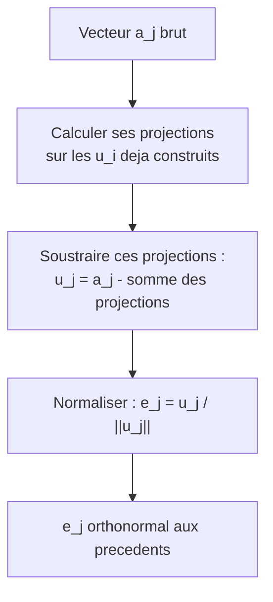

#### Exemple chiffré (Gram–Schmidt)

Orthonormalisons $a_1 = (1, 1)$ et $a_2 = (1, 0)$ dans $\mathbb{R}^2$.

1. $u_1 = a_1 = (1,1)$, donc $e_1 = \frac{1}{\sqrt 2}(1,1)$.
2. Projection de $a_2$ sur $u_1$ : $\frac{\langle a_2, u_1\rangle}{\langle u_1, u_1\rangle} = \frac{(1)(1)+(0)(1)}{1+1} = \frac{1}{2}$. Donc
   ```math
   u_2 = a_2 - \tfrac{1}{2}u_1 = (1, 0) - \tfrac{1}{2}(1, 1) = \big(\tfrac{1}{2}, -\tfrac{1}{2}\big).
   ```
3. $\|u_2\| = \sqrt{\tfrac14 + \tfrac14} = \tfrac{1}{\sqrt 2}$, donc $e_2 = \sqrt 2 \cdot (\tfrac12, -\tfrac12) = \frac{1}{\sqrt 2}(1, -1)$.

Vérification : $\langle e_1, e_2\rangle = \frac{1}{2}\big((1)(1) + (1)(-1)\big) = 0$. Orthonormale !

#### Application en machine learning et code

Les bases orthonormales sont **partout** : la décomposition QR (au cœur de la résolution des moindres carrés), l'**ACP** (analyse en composantes principales, dont les axes principaux forment une base orthonormale), les couches orthogonales en deep learning (qui préservent la norme des activations et combattent l'explosion/disparition du gradient).

```python
import numpy as np

# Decomposition QR : A = Q R, avec Q orthogonale (colonnes orthonormales)
A = np.array([[1.0, 1.0],
              [1.0, 0.0]])
Q, R = np.linalg.qr(A)
print("Q =\n", np.round(Q, 4))
print("Q^T Q =\n", np.round(Q.T @ Q, 10))   # ~ identite -> colonnes orthonormales

# Une matrice orthogonale preserve la norme
x = np.array([3.0, 4.0])
print(np.linalg.norm(x), np.linalg.norm(Q @ x))   # 5.0  5.0  (identiques)

# Decomposition dans une base orthonormale : coordonnees = produits scalaires
e1 = np.array([1.0, 1.0]) / np.sqrt(2)
e2 = np.array([1.0, -1.0]) / np.sqrt(2)
v = np.array([3.0, 1.0])
c1, c2 = v @ e1, v @ e2
print(c1, c2)                       # coordonnees dans la base (e1, e2)
print(c1 * e1 + c2 * e2)            # reconstruit v = [3. 1.]
```

> **Mise à jour 2026.** En pratique, le Gram–Schmidt « classique » est **numériquement instable** (perte d'orthogonalité par accumulation d'erreurs). On lui préfère le **Gram–Schmidt modifié**, ou surtout les factorisations par réflexions de **Householder** / rotations de **Givens**, plus robustes. En deep learning, la **régularisation orthogonale** et les **réseaux à poids orthogonaux** (par paramétrisation de Cayley ou de Householder) sont des techniques actives pour stabiliser l'entraînement des réseaux très profonds et des RNN ; PyTorch fournit même `torch.nn.utils.parametrizations.orthogonal` pour contraindre une matrice de poids à rester orthogonale durant l'optimisation.

---

### Complément orthogonal

Si l'on dispose d'un sous-espace (un plan dans l'espace, une droite dans le plan…), il existe une notion duale fondamentale : tout ce qui lui est **perpendiculaire**. C'est le complément orthogonal, pierre angulaire des projections et des moindres carrés.

#### Définition

> **Définition (complément orthogonal).** Soit $U$ un sous-espace vectoriel d'un espace préhilbertien $V$. Le **complément orthogonal** de $U$, noté $U^\perp$ (« $U$ perp »), est l'ensemble des vecteurs orthogonaux à **tout** $U$ :
> ```math
> U^\perp = \{\, v \in V \;\mid\; \langle v, u\rangle = 0 \ \text{ pour tout } u \in U \,\}.
> ```

> **Le symbole $U^\perp$.** Le petit « taquet » $\perp$ en exposant transforme un sous-espace en l'ensemble de **tout ce qui lui est perpendiculaire**. Si $U$ est le sol (un plan horizontal), $U^\perp$ est la direction verticale (l'axe « haut-bas »). Si $U$ est une droite, $U^\perp$ est le plan perpendiculaire qui la coupe à angle droit. C'est le « monde à $90°$ » du sous-espace.

> **Remarque.** $U^\perp$ est **toujours un sous-espace vectoriel**, même si $U$ n'est défini que par des générateurs : il suffit que $v$ soit orthogonal à une base de $U$ pour l'être à tout $U$ (par bilinéarité). De plus $U \cap U^\perp = \{0\}$ (un vecteur orthogonal à lui-même est nul).

> **Le symbole $\cap$ (intersection).** Ce symbole en forme de « U renversé » représente l'**intersection** de deux ensembles : ce qu'ils ont **en commun**. $U \cap U^\perp = \{0\}$ signifie « le seul vecteur appartenant à la fois à $U$ et à son orthogonal est le vecteur nul ». Comme l'intersection de « ce qui est rouge » et « ce qui est bleu » : seuls les objets des deux couleurs à la fois (ici, presque rien).

#### Le théorème de décomposition orthogonale

C'est le résultat structurant de tout le chapitre.

> **Théorème (décomposition en somme directe orthogonale).** Si $U$ est un sous-espace de **dimension finie** de $V$, alors tout vecteur $v \in V$ se décompose de manière **unique** en
> ```math
> v = u + w, \qquad u \in U, \quad w \in U^\perp.
> ```
> On écrit $V = U \oplus U^\perp$. Le vecteur $u$ est la **projection orthogonale** de $v$ sur $U$ (section suivante).

> **Le symbole $\oplus$ (somme directe).** Le « plus entouré d'un cercle » signifie **somme directe** : tout élément se décompose de façon **unique** comme somme d'un morceau dans chaque sous-espace. C'est comme dire qu'un nombre décimal se sépare de manière unique en « partie entière + partie fractionnaire » : $3{,}7 = 3 + 0{,}7$, sans ambiguïté. Ici, chaque vecteur = (sa part dans $U$) + (sa part perpendiculaire), sans recouvrement.

*Démonstration (existence et unicité).* **Existence :** soit $\{e_1, \dots, e_k\}$ une base orthonormale de $U$ (qui existe par Gram–Schmidt). Posons $u = \sum_{i=1}^k \langle v, e_i\rangle e_i \in U$ et $w = v - u$. Pour tout $j$ :

```math
\langle w, e_j\rangle = \langle v, e_j\rangle - \sum_i \langle v, e_i\rangle\langle e_i, e_j\rangle = \langle v, e_j\rangle - \langle v, e_j\rangle = 0,
```

donc $w$ est orthogonal à toute la base de $U$, donc à $U$ entier : $w \in U^\perp$. **Unicité :** si $v = u_1 + w_1 = u_2 + w_2$ avec $u_i \in U, w_i \in U^\perp$, alors $u_1 - u_2 = w_2 - w_1 \in U \cap U^\perp = \{0\}$, d'où $u_1 = u_2$ et $w_1 = w_2$. $\blacksquare$

#### Propriétés clés et dimensions

| Propriété | Énoncé |
|---|---|
| Dimension | $\dim U + \dim U^\perp = \dim V$ (en dimension finie). |
| Double orthogonal | $(U^\perp)^\perp = U$ (en dimension finie). |
| Inversion d'inclusion | $U \subseteq W \;\Longrightarrow\; W^\perp \subseteq U^\perp$. |
| Somme et intersection | $(U + W)^\perp = U^\perp \cap W^\perp$. |

> **Le symbole $\dim$ (dimension).** $\dim U$ désigne le **nombre de vecteurs d'une base** de $U$ : son « nombre de degrés de liberté ». Une droite a dimension $1$, un plan dimension $2$. La formule $\dim U + \dim U^\perp = \dim V$ dit que les libertés de $U$ et celles de son perpendiculaire se complètent exactement pour remplir tout l'espace. Le symbole $\subseteq$ signifie « **est inclus dans** » : $U \subseteq W$ veut dire « tout élément de $U$ est aussi dans $W$ ».

#### Lien fondamental avec les espaces d'une matrice

Le complément orthogonal éclaire les **quatre sous-espaces fondamentaux** d'une matrice $A \in \mathbb{R}^{m\times n}$ :

```math
\big(\mathrm{Im} A\big)^\perp = \ker A^\top, \qquad \big(\ker A\big)^\perp = \mathrm{Im} A^\top.
```

> **Notations.** $\mathrm{Im} A$ (l'**image**, ou *column space*) est l'ensemble des $Ax$ possibles. $\ker A$ (le **noyau**, ou *null space*) est l'ensemble des $x$ tels que $Ax = 0$. Ces relations, parfois appelées « théorème fondamental de l'algèbre linéaire », disent que l'espace des colonnes et le noyau de la transposée sont des **mondes perpendiculaires** : c'est *exactement* ce qui rend les moindres carrés solubles.

#### Exemple chiffré

Dans $\mathbb{R}^3$, soit $U = \text{Vect}\{(1,0,0),(0,1,0)\}$ (le plan horizontal $z=0$). Un vecteur $(a,b,c)$ est dans $U^\perp$ ssi il est orthogonal à $(1,0,0)$ **et** à $(0,1,0)$ :

```math
\langle (a,b,c),(1,0,0)\rangle = a = 0, \qquad \langle (a,b,c),(0,1,0)\rangle = b = 0.
```

Donc $U^\perp = \{(0,0,c) : c \in \mathbb{R}\} = \text{Vect}\{(0,0,1)\}$ : l'**axe vertical**. On vérifie $\dim U + \dim U^\perp = 2 + 1 = 3 = \dim \mathbb{R}^3$.

#### Application en machine learning et code

```python
import numpy as np
from scipy.linalg import null_space

# U = plan engendre par deux vecteurs dans R^3 ; on cherche U^perp
U = np.array([[1.0, 0.0],
              [0.0, 1.0],
              [0.0, 0.0]])     # colonnes = generateurs de U

# U^perp = noyau de U^T (tout vecteur orthogonal a chaque colonne de U)
U_perp = null_space(U.T)
print("Base de U^perp :\n", np.round(U_perp, 4))   # ~ (0,0,1)

# Verification : chaque vecteur de U^perp est orthogonal a chaque colonne de U
print(np.round(U.T @ U_perp, 10))                  # ~ matrice nulle

# Le residu des moindres carres vit dans (Im A)^perp = ker A^T
A = np.array([[1.0, 0.0], [1.0, 1.0], [1.0, 2.0]])
b = np.array([1.0, 2.0, 2.0])
x_hat, *_ = np.linalg.lstsq(A, b, rcond=None)
residual = b - A @ x_hat
print(np.round(A.T @ residual, 10))   # ~ 0 : le residu est orthogonal aux colonnes de A
```

> **Pourquoi ça compte en ML.** Tout l'édifice des **moindres carrés** (régression linéaire) repose là-dessus : la meilleure approximation $A\hat{x}$ de $b$ est sa projection sur $\mathrm{Im} A$, et le **résidu** $b - A\hat x$ est orthogonal à cet espace, donc dans $\ker A^\top$. C'est ce qui donne les **équations normales** $A^\top A \hat x = A^\top b$, que nous retrouvons dans la section suivante.

---

### Produit scalaire de fonctions

Voici le saut conceptuel le plus puissant du chapitre : et si l'on traitait des **fonctions** comme des **vecteurs** ? Une fonction $f$ a une « valeur en chaque point $t$ », exactement comme un vecteur a une « coordonnée à chaque indice $i$ ». En passant d'une somme à une **intégrale**, tout l'arsenal géométrique (norme, angle, orthogonalité, projection) s'applique aux fonctions. C'est la porte d'entrée vers l'analyse de Fourier et les espaces de Hilbert.

#### De la somme à l'intégrale

Pour des vecteurs, $\langle x, y\rangle = \sum_i x_i y_i$. Pour des fonctions $f, g$ définies sur un intervalle $[a, b]$, on remplace l'indice discret $i$ par une variable continue $t$, et la somme par une **intégrale** :

> **Définition (produit scalaire $L^2$ des fonctions).**
> ```math
> \langle f, g\rangle = \int_a^b f(t)\, g(t)\, dt.
> ```

> **Le symbole $\int$ (intégrale).**
> Ce grand « S » étiré représente une **intégrale** : c'est l'équivalent continu de la somme $\sum$. Là où $\sum$ additionne des valeurs *séparées* (une pièce, puis une autre…), $\int$ additionne une infinité de valeurs *infiniment proches*. Image mentale : pour calculer l'**aire** sous une courbe, on la découpe en une myriade de fines tranches verticales de largeur minuscule $dt$, on calcule l'aire de chaque tranche (hauteur $\times$ largeur), et on les additionne toutes. $\int_a^b$ veut dire « additionne depuis $t=a$ jusqu'à $t=b$ ». Le $dt$ à la fin, c'est la « largeur infinitésimale » de chaque tranche — il indique aussi *par rapport à quelle variable* on intègre.

L'analogie est **parfaite** :

| Vecteurs ($\mathbb{R}^n$) | Fonctions ($L^2[a,b]$) |
|---|---|
| Indice $i \in \{1,\dots,n\}$ | Variable $t \in [a,b]$ |
| Coordonnée $x_i$ | Valeur $f(t)$ |
| $\langle x,y\rangle = \sum_i x_i y_i$ | $\langle f,g\rangle = \int_a^b f(t)g(t)\,dt$ |
| $\|x\|^2 = \sum_i x_i^2$ | $\|f\|^2 = \int_a^b f(t)^2\, dt$ |

#### L'espace $L^2$ et sa norme

> **Définition.** La **norme $L^2$** d'une fonction est
> ```math
> \|f\|_{L^2} = \sqrt{\int_a^b f(t)^2\, dt}.
> ```
> L'espace $L^2[a,b]$ des fonctions de carré intégrable ($\int f^2 < \infty$), muni de ce produit scalaire, est un **espace de Hilbert** (de dimension *infinie*) : la généralisation ultime de $\mathbb{R}^n$.

> **Le symbole $\infty$ (infini).** Ce « huit couché » représente l'**infini** : une quantité plus grande que tout nombre. $\int f^2 < \infty$ se lit « l'intégrale est finie » (elle ne s'envole pas vers l'infini). C'est la condition d'admission dans le club $L^2$ : une fonction y est acceptée si l'aire sous $f^2$ est finie.

Toutes les notions précédentes se transposent **mot pour mot** :

- **Orthogonalité :** $f \perp g \iff \int_a^b f(t)g(t)\,dt = 0$.
- **Angle :** $\cos\theta = \dfrac{\langle f,g\rangle}{\|f\|\,\|g\|}$, et Cauchy–Schwarz $\big|\int fg\big| \leq \|f\|\,\|g\|$ tient toujours.
- **Distance :** $d(f,g) = \|f - g\|_{L^2} = \sqrt{\int_a^b (f(t)-g(t))^2\,dt}$.

#### L'exemple roi : la base de Fourier

Le résultat le plus spectaculaire : sur $[-\pi, \pi]$, les fonctions trigonométriques

```math
1,\quad \cos(t),\ \sin(t),\ \cos(2t),\ \sin(2t),\ \cos(3t),\ \sin(3t),\ \dots
```

sont **deux à deux orthogonales** pour le produit scalaire $L^2$ ! Par exemple, pour $m \neq n$ :

```math
\int_{-\pi}^{\pi} \cos(mt)\cos(nt)\, dt = 0, \qquad \int_{-\pi}^{\pi} \sin(mt)\cos(nt)\, dt = 0.
```

Elles forment une **base orthogonale** (de dimension infinie) de $L^2[-\pi,\pi]$. Décomposer une fonction dans cette base, c'est **exactement** calculer sa **série de Fourier** — et les coefficients de Fourier ne sont rien d'autre que des produits scalaires $\langle f, \cos(nt)\rangle$ et $\langle f, \sin(nt)\rangle$, par la formule de décomposition vue pour les bases orthonormales !

> **Attention : orthogonale, pas encore orthonormale.** Ces fonctions sont orthogonales mais **pas de norme $1$**. Un calcul direct donne $\int_{-\pi}^{\pi}\cos^2(nt)\,dt = \pi$ (pour $n\geq 1$), de même pour $\sin^2$, tandis que $\int_{-\pi}^{\pi} 1^2\,dt = 2\pi$. Pour obtenir une base *orthonormale*, on divise chaque fonction par sa norme : $\tfrac{1}{\sqrt{2\pi}}$, $\tfrac{1}{\sqrt{\pi}}\cos(nt)$, $\tfrac{1}{\sqrt{\pi}}\sin(nt)$. C'est pourquoi les formules usuelles des coefficients de Fourier contiennent un facteur $\tfrac{1}{\pi}$.

> **Le décalage conceptuel.** La série de Fourier, souvent présentée comme une formule magique tombée du ciel, n'est *que* la **décomposition d'un vecteur (la fonction) dans une base orthogonale (les sinus/cosinus)**. Toute la machinerie de la section « Bases orthonormales » s'applique telle quelle. C'est la beauté unificatrice de l'algèbre linéaire.

#### Exemple chiffré

Calculons $\langle f, g\rangle$ pour $f(t) = t$ et $g(t) = t^2$ sur $[-1, 1]$ :

```math
\langle f, g\rangle = \int_{-1}^{1} t \cdot t^2\, dt = \int_{-1}^1 t^3\, dt = \left[\frac{t^4}{4}\right]_{-1}^{1} = \frac{1}{4} - \frac{1}{4} = 0.
```

Les fonctions $t$ et $t^2$ sont **orthogonales** sur $[-1,1]$ ! (Logique : $t^3$ est impaire, son intégrale sur un intervalle symétrique est nulle.) En revanche $\|f\|^2 = \int_{-1}^1 t^2\,dt = [\frac{t^3}{3}]_{-1}^1 = \frac{2}{3}$, donc $\|f\| = \sqrt{2/3}$.

#### Application en machine learning et code

Les produits scalaires de fonctions fondent : les **méthodes à noyaux** (un noyau est un produit scalaire dans un espace de fonctions), les **espaces de Hilbert à noyau reproduisant** (RKHS), les **processus gaussiens**, les bases de fonctions (Fourier, ondelettes, polynômes orthogonaux de Legendre/Hermite) utilisées en régression fonctionnelle et en résolution d'EDP par réseaux de neurones.

```python
import numpy as np
from scipy.integrate import quad

# Produit scalaire L2 de deux fonctions sur [a, b], par integration numerique
def inner_product(f, g, a, b):
    val, _ = quad(lambda t: f(t) * g(t), a, b)
    return val

f = lambda t: t
g = lambda t: t**2
print(round(inner_product(f, g, -1, 1), 12))   # ~ 0.0  -> f ⊥ g

# Orthogonalite des modes de Fourier sur [-pi, pi]
cos2 = lambda t: np.cos(2*t)
cos3 = lambda t: np.cos(3*t)
print(round(inner_product(cos2, cos3, -np.pi, np.pi), 10))  # ~ 0.0 (modes distincts)
print(round(inner_product(cos2, cos2, -np.pi, np.pi), 6))   # ~ pi (norme au carre)

# Premier coefficient de Fourier de f(t)=t : <f, sin(t)> / <sin,sin>
f = lambda t: t
sin1 = lambda t: np.sin(t)
b1 = inner_product(f, sin1, -np.pi, np.pi) / inner_product(sin1, sin1, -np.pi, np.pi)
print(round(b1, 6))   # 2.0  -> t = 2 sin(t) - sin(2t) + (2/3) sin(3t) - ...
```

> **Mise à jour 2026.** Les **opérateurs neuronaux** (Neural Operators, dont les Fourier Neural Operators) apprennent des applications *entre espaces de fonctions* — par exemple résoudre une famille d'équations aux dérivées partielles — en travaillant directement dans des bases de fonctions (souvent de Fourier). Les **processus gaussiens** et les méthodes à noyaux profondes restent des piliers de la quantification d'incertitude. Le fil conducteur de 2026 : penser les données non plus comme des vecteurs de $\mathbb{R}^n$, mais comme des **fonctions** dans un espace de Hilbert, exactement la géométrie de cette section.

---

### Projections orthogonales

Nous arrivons à l'application la plus opérationnelle de tout le chapitre. **Projeter**, c'est trouver, dans un sous-espace donné, le point **le plus proche** d'un vecteur cible. C'est *le* fondement géométrique de la régression linéaire, de la compression et de l'ACP.

#### Intuition imagée

Vous tenez un crayon en l'air au-dessus d'une table, en plein soleil zénithal. Son **ombre** sur la table est sa projection orthogonale sur le plan de la table. L'ombre est « la meilleure représentation » du crayon une fois aplati sur la table : c'est le point de la table le plus proche de la pointe du crayon, et le rayon de soleil (vertical) qui relie le crayon à son ombre est **perpendiculaire** à la table.

#### Projection sur une droite (un vecteur)

Commençons par le cas le plus simple : projeter $v$ sur la droite dirigée par un vecteur $u \neq 0$.

> **Définition / formule.** La **projection orthogonale** de $v$ sur la droite $\text{Vect}\{u\}$ est
> ```math
> \mathrm{proj}_u(v) = \frac{\langle v, u\rangle}{\langle u, u\rangle}\, u = \frac{\langle v, u\rangle}{\|u\|^2}\, u.
> ```

> **Le symbole $\mathrm{proj}_u(v)$.** Cet opérateur « proj » est une **machine à aplatir** : elle prend un vecteur $v$ et l'écrase sur la droite portée par $u$, en gardant uniquement « la part de $v$ qui va dans la direction de $u$ ». Le coefficient $\frac{\langle v,u\rangle}{\|u\|^2}$ mesure *combien* de $u$ il faut prendre. Si $u$ est déjà de norme $1$, la formule se simplifie en $\langle v, u\rangle\, u$ : on l'avait déjà rencontrée dans la décomposition en base orthonormale !

*Pourquoi cette formule ?* On cherche $p = c\,u$ (un multiple de $u$) tel que le résidu $v - p$ soit orthogonal à $u$ :

```math
\langle v - cu, u\rangle = 0 \;\Longrightarrow\; \langle v, u\rangle = c\langle u, u\rangle \;\Longrightarrow\; c = \frac{\langle v, u\rangle}{\langle u, u\rangle}.
```

#### Projection sur un sous-espace : les équations normales

Cas général : projeter $b \in \mathbb{R}^m$ sur le sous-espace $\mathrm{Im} A$ engendré par les colonnes d'une matrice $A \in \mathbb{R}^{m\times n}$ (colonnes supposées indépendantes).

> **Théorème (projection et équations normales).** La projection orthogonale de $b$ sur $\mathrm{Im} A$ est $p = A\hat x$, où $\hat x$ résout les **équations normales** :
> ```math
> A^\top A\, \hat x = A^\top b \qquad\Longrightarrow\qquad \hat x = (A^\top A)^{-1} A^\top b.
> ```
> La projection elle-même s'écrit $p = P b$ avec la **matrice de projection**
> ```math
> P = A(A^\top A)^{-1} A^\top.
> ```

*Démonstration.* On cherche $p = A\hat x \in \mathrm{Im} A$ tel que le résidu $b - A\hat x$ soit orthogonal à **toutes** les colonnes de $A$, c'est-à-dire $A^\top(b - A\hat x) = 0$. Cela donne directement $A^\top A\hat x = A^\top b$. Comme les colonnes de $A$ sont indépendantes, $A^\top A$ est inversible (symétrique définie positive), d'où $\hat x$, puis $p = A\hat x = A(A^\top A)^{-1}A^\top b$. $\blacksquare$

#### Propriétés d'une matrice de projection

> **Théorème.** Une matrice $P$ est une matrice de projection orthogonale si et seulement si elle est **idempotente** et **symétrique** :
> ```math
> P^2 = P \qquad \text{et} \qquad P^\top = P.
> ```

| Propriété | Formule | Sens géométrique |
|---|---|---|
| Idempotence | $P^2 = P$ | Projeter une ombre ne la change plus (elle est déjà sur la table). |
| Symétrie | $P^\top = P$ | La projection est *orthogonale* (et non oblique). |
| Projection complémentaire | $I - P$ projette sur $(\mathrm{Im}A)^\perp$ | $(I-P)b = b - p$ est le résidu. |
| Valeurs propres | $\lambda \in \{0, 1\}$ | $1$ sur le sous-espace, $0$ sur l'orthogonal. |

> **Le symbole $P^2 = P$ (idempotence).** « Idempotent » signifie « qui ne change plus après une première application ». $P^2 = P$ dit : appliquer $P$ une fois ou deux fois donne le même résultat. C'est logique : une fois le crayon aplati en ombre sur la table, ré-aplatir l'ombre ne fait rien — elle est déjà plate sur la table.

#### Le théorème de meilleure approximation

> **Théorème (la projection minimise la distance).** La projection $p$ de $v$ sur un sous-espace $U$ est l'**unique** point de $U$ le plus proche de $v$ :
> ```math
> \|v - p\| \;\leq\; \|v - u\| \qquad \text{pour tout } u \in U,
> ```
> avec égalité seulement si $u = p$.

*Démonstration (Pythagore).* Pour tout $u \in U$, décomposons $v - u = (v - p) + (p - u)$. Or $v - p \in U^\perp$ et $p - u \in U$, donc ces deux vecteurs sont orthogonaux. Par Pythagore :

```math
\|v - u\|^2 = \|v - p\|^2 + \|p - u\|^2 \;\geq\; \|v - p\|^2,
```

avec égalité ssi $\|p - u\|^2 = 0$, c'est-à-dire $u = p$. $\blacksquare$

C'est **précisément** ce qui justifie les moindres carrés : la solution $\hat x$ minimise $\|b - Ax\|^2$, donc $A\hat x$ est la meilleure approximation de $b$ atteignable dans $\mathrm{Im}A$.

#### Exemple chiffré déroulé (régression linéaire)

Ajustons une droite $y = c_0 + c_1 t$ aux points $(0,1), (1,2), (2,2)$. On pose

```math
A = \begin{pmatrix} 1 & 0\\ 1 & 1\\ 1 & 2\end{pmatrix}, \qquad b = \begin{pmatrix}1\\2\\2\end{pmatrix}, \qquad \hat x = \begin{pmatrix}c_0\\c_1\end{pmatrix}.
```

Calcul des équations normales :

```math
A^\top A = \begin{pmatrix} 3 & 3\\ 3 & 5\end{pmatrix}, \qquad A^\top b = \begin{pmatrix}5\\6\end{pmatrix}.
```

Résolvons $\begin{pmatrix}3&3\\3&5\end{pmatrix}\hat x = \begin{pmatrix}5\\6\end{pmatrix}$. Le déterminant vaut $3\cdot5 - 3\cdot3 = 6$, donc

```math
\hat x = \frac{1}{6}\begin{pmatrix}5 & -3\\-3 & 3\end{pmatrix}\begin{pmatrix}5\\6\end{pmatrix} = \frac{1}{6}\begin{pmatrix}25 - 18\\-15 + 18\end{pmatrix} = \frac{1}{6}\begin{pmatrix}7\\3\end{pmatrix} = \begin{pmatrix}7/6\\1/2\end{pmatrix}.
```

La droite des moindres carrés est donc $y = \tfrac{7}{6} + \tfrac{1}{2}t$.

#### Application en machine learning et code

```python
import numpy as np

A = np.array([[1.0, 0.0],
              [1.0, 1.0],
              [1.0, 2.0]])
b = np.array([1.0, 2.0, 2.0])

# Equations normales (pedagogique ; en pratique on prefere lstsq / QR)
x_hat = np.linalg.solve(A.T @ A, A.T @ b)
print(x_hat)                  # [1.16666667 0.5]  ->  7/6 et 1/2

# Matrice de projection P = A (A^T A)^{-1} A^T
P = A @ np.linalg.inv(A.T @ A) @ A.T
p = P @ b                     # projection de b sur Im(A)
print(np.round(p, 4))         # valeurs predites par la droite

# Verifications des proprietes d'une projection
print(np.allclose(P @ P, P))  # True : idempotence  P^2 = P
print(np.allclose(P.T, P))    # True : symetrie
residual = b - p
print(np.round(A.T @ residual, 10))  # ~ 0 : residu orthogonal a Im(A)
```

> **Mise à jour 2026.** Pour les grands systèmes, **on ne forme jamais explicitement** $(A^\top A)^{-1}$ ni la matrice $P$ (coûteux et numériquement instable, surtout si $A$ est mal conditionnée). On utilise la **décomposition QR** ($A = QR \Rightarrow \hat x = R^{-1}Q^\top b$) ou la **SVD** (pseudo-inverse de Moore–Penrose, robuste au rang déficient), c'est ce que fait `np.linalg.lstsq`. Pour des matrices énormes et creuses, les méthodes itératives (gradient conjugué, LSQR) ou le **gradient stochastique** projettent implicitement, sans jamais matérialiser $P$. Les couches de projection apparaissent aussi dans les méthodes d'optimisation sous contraintes (gradient projeté) très utilisées en apprentissage.

---

### Rotations

Pour clore ce chapitre, étudions les transformations qui **font tourner** l'espace sans le déformer : les rotations. Ce sont les matrices orthogonales « propres » (sans réflexion), et elles sont essentielles en vision, robotique, graphisme et au-delà.

#### Intuition imagée

Une rotation fait pivoter tous les points autour d'un centre (en 2D) ou d'un axe (en 3D), comme une plaque tournante. Les distances à l'origine sont **conservées**, les angles entre vecteurs aussi : un carré reste un carré, juste orienté différemment. Rien n'est étiré, comprimé ou retourné comme dans un miroir.

#### Rotations dans le plan

> **Définition (matrice de rotation 2D).** La rotation d'angle $\theta$ (dans le sens trigonométrique, autour de l'origine) est donnée par
> ```math
> R(\theta) = \begin{pmatrix} \cos\theta & -\sin\theta\\ \sin\theta & \phantom{-}\cos\theta\end{pmatrix}.
> ```

> **Le symbole $\sin\theta$ (sinus).** Compagnon du cosinus : si le cosinus est la position **horizontale** de la pointe de l'aiguille d'horloge de longueur $1$, le sinus est sa position **verticale**. À $0°$ : $\sin 0 = 0$ (pointe à l'horizontale). À $90°$ : $\sin 90° = 1$ (pointe tout en haut). Ensemble, $(\cos\theta, \sin\theta)$ donnent les coordonnées exactes d'un point sur le cercle de rayon $1$ après rotation d'un angle $\theta$ depuis l'axe horizontal.

Appliquée à un point $(x,y)$, elle donne le point tourné :

```math
R(\theta)\begin{pmatrix}x\\y\end{pmatrix} = \begin{pmatrix} x\cos\theta - y\sin\theta\\ x\sin\theta + y\cos\theta\end{pmatrix}.
```

> **Vérifions que $R(\theta)$ est orthogonale.** Ses colonnes $(\cos\theta, \sin\theta)$ et $(-\sin\theta, \cos\theta)$ sont de norme $\sqrt{\cos^2\theta + \sin^2\theta} = 1$ (identité de Pythagore trigonométrique !) et orthogonales entre elles (produit scalaire $-\cos\theta\sin\theta + \sin\theta\cos\theta = 0$). Donc $R^\top R = I$. De plus $\det R = \cos^2\theta + \sin^2\theta = +1$ : c'est une rotation *propre*, pas une réflexion.

#### Propriétés algébriques fondamentales

| Propriété | Formule | Interprétation |
|---|---|---|
| Composition | $R(\alpha)R(\beta) = R(\alpha+\beta)$ | Deux rotations successives = une rotation de la somme des angles. |
| Inverse | $R(\theta)^{-1} = R(-\theta) = R(\theta)^\top$ | Annuler une rotation = tourner en sens inverse. |
| Identité | $R(0) = I$ | Ne pas tourner = ne rien faire. |
| Déterminant | $\det R(\theta) = 1$ | Préserve aires **et** orientation. |

> **Le symbole $\det$ (déterminant), en rappel.** Le déterminant d'une matrice $2\times 2$ mesure le **facteur d'agrandissement des aires** sous la transformation, avec un signe pour l'orientation. $\det R = +1$ signifie : les aires sont conservées ($\times 1$) et l'orientation aussi (pas d'effet miroir). Une réflexion aurait $\det = -1$.

La propriété de composition révèle une structure de **groupe** : l'ensemble des rotations du plan, muni de la composition, est le groupe $SO(2)$ (*special orthogonal group*). « Special » = déterminant $+1$, « orthogonal » = préserve la géométrie.

#### Rotations en dimension 3 et au-delà

En 3D, une rotation se fait **autour d'un axe**. Les rotations autour des axes $x, y, z$ d'angle $\theta$ sont :

```math
R_x = \begin{pmatrix}1&0&0\\0&\cos\theta&-\sin\theta\\0&\sin\theta&\cos\theta\end{pmatrix},\
R_y = \begin{pmatrix}\cos\theta&0&\sin\theta\\0&1&0\\-\sin\theta&0&\cos\theta\end{pmatrix},\
R_z = \begin{pmatrix}\cos\theta&-\sin\theta&0\\\sin\theta&\cos\theta&0\\0&0&1\end{pmatrix}.
```

L'ensemble des rotations de $\mathbb{R}^3$ forme le groupe $SO(3)$. Contrairement à $SO(2)$, il est **non commutatif** : tourner d'abord autour de $x$ puis de $y$ ne donne **pas** le même résultat que l'inverse (essayez avec un livre !).

> **Le théorème de rotation d'Euler.** Toute rotation de $\mathbb{R}^3$, aussi compliquée soit-elle, est *équivalente* à une **unique** rotation autour d'un **seul axe** bien choisi. C'est ce qui fonde la représentation « axe-angle » et les **quaternions**.

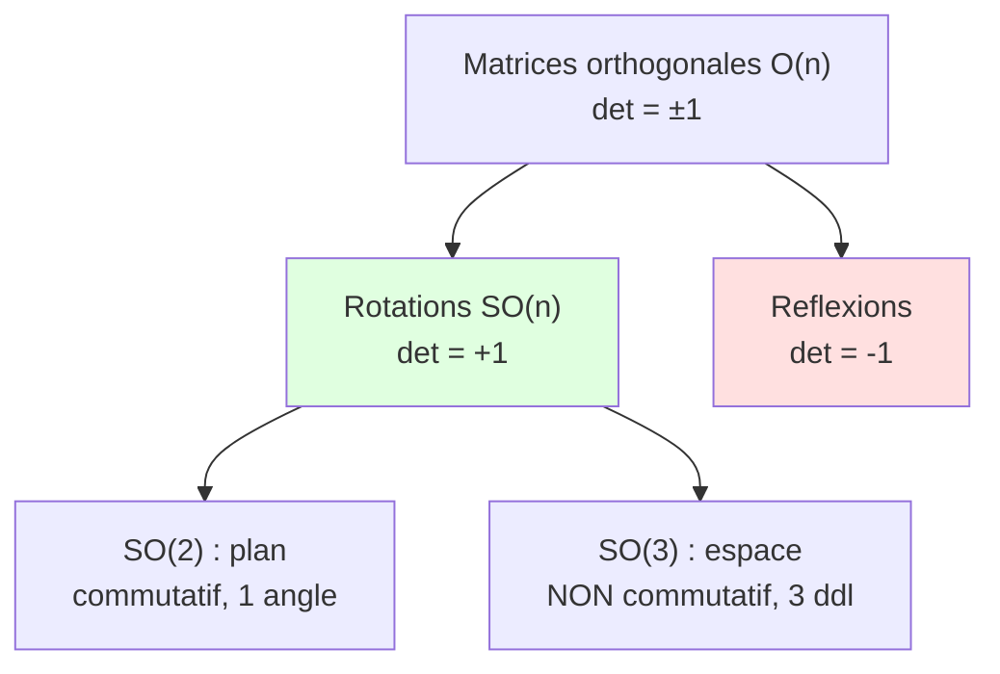

#### Exemple chiffré

Tournons le point $(1, 0)$ de $\theta = 90°$ (soit $\pi/2$). Alors $\cos 90° = 0$, $\sin 90° = 1$ :

```math
R(90°)\begin{pmatrix}1\\0\end{pmatrix} = \begin{pmatrix}0 & -1\\ 1 & 0\end{pmatrix}\begin{pmatrix}1\\0\end{pmatrix} = \begin{pmatrix}0\\1\end{pmatrix}.
```

Le point passe de « à droite » à « en haut ». Vérification de la composition : $R(90°)R(90°) = R(180°)$ doit envoyer $(1,0)$ sur $(-1,0)$ ; en effet $\begin{pmatrix}0&-1\\1&0\end{pmatrix}^2 = \begin{pmatrix}-1&0\\0&-1\end{pmatrix}$.

#### Application en machine learning et code

Les rotations sont **partout** : augmentation de données (data augmentation) en vision, estimation de pose en robotique et réalité augmentée, **alignement de nuages de points** (problème de Procuste orthogonal, résolu par SVD), graphisme 3D, et même certaines architectures de réseaux invariants/équivariants par rotation.

```python
import numpy as np

def rotation_2d(theta):
    c, s = np.cos(theta), np.sin(theta)
    return np.array([[c, -s],
                     [s,  c]])

R = rotation_2d(np.pi / 2)          # rotation de 90 degres
print(np.round(R @ np.array([1.0, 0.0]), 10))   # [0. 1.]

# Une rotation preserve normes et angles (isometrie)
x = np.array([3.0, 4.0])
print(np.linalg.norm(x), np.linalg.norm(R @ x))  # 5.0  5.0

# Composition : R(a) R(b) = R(a+b)
A = rotation_2d(0.3) @ rotation_2d(0.5)
B = rotation_2d(0.8)
print(np.allclose(A, B))            # True

# Probleme de Procuste orthogonal : meilleure rotation alignant X sur Y
#   min_R ||R X - Y||  s.c.  R orthogonale  ->  via SVD de Y X^T
rng = np.random.default_rng(0)
X = rng.standard_normal((2, 30))
theta_true = 0.7
Y = rotation_2d(theta_true) @ X
U, _, Vt = np.linalg.svd(Y @ X.T)
R_est = U @ Vt
print(np.round(R_est, 4))           # ~ rotation_2d(0.7)
print(round(np.arctan2(R_est[1, 0], R_est[0, 0]), 4))  # ~ 0.7
```

> **Mise à jour 2026.** En apprentissage profond, **représenter** une rotation est un sujet subtil : les angles d'Euler souffrent du *blocage de cardan* (gimbal lock) et les quaternions de leur double couverture. Des travaux influents ont montré que les paramétrisations à $5$ ou $6$ dimensions (par exemple deux colonnes orthonormalisées) sont **continues** et donc bien plus faciles à apprendre par un réseau que les quaternions. Côté architectures, les réseaux **équivariants** (qui « tournent » leur sortie quand l'entrée tourne) — réseaux stéerables, $SO(3)$-équivariants — sont devenus centraux en chimie computationnelle et en modélisation de protéines, où la géométrie 3D est reine.

---

### Exercices

Les corrigés détaillés suivent chaque énoncé. Tentez chaque exercice avant de lire la solution.

#### Exercice 1 — Calculs de normes

Soit $x = (2, -3, 6) \in \mathbb{R}^3$. Calculer $\|x\|_1$, $\|x\|_2$, $\|x\|_\infty$ et vérifier l'encadrement $\|x\|_\infty \leq \|x\|_2 \leq \|x\|_1$.

> **Corrigé.**
> - $\|x\|_1 = |2| + |{-3}| + |6| = 2 + 3 + 6 = 11$.
> - $\|x\|_2 = \sqrt{2^2 + (-3)^2 + 6^2} = \sqrt{4 + 9 + 36} = \sqrt{49} = 7$.
> - $\|x\|_\infty = \max(2, 3, 6) = 6$.
> - Encadrement : $6 \leq 7 \leq 11$. ✓

#### Exercice 2 — Produit scalaire et Cauchy–Schwarz

Soit $x = (1, 2, 2)$ et $y = (2, 0, -1)$. Calculer $\langle x, y\rangle$, puis vérifier l'inégalité de Cauchy–Schwarz.

> **Corrigé.**
> $\langle x, y\rangle = (1)(2) + (2)(0) + (2)(-1) = 2 + 0 - 2 = 0$.
> Les vecteurs sont **orthogonaux** ! $\|x\|_2 = \sqrt{1+4+4} = 3$, $\|y\|_2 = \sqrt{4+0+1} = \sqrt 5 \approx 2{,}236$.
> Cauchy–Schwarz : $|0| = 0 \leq 3\sqrt 5 \approx 6{,}7$. ✓ (Inégalité largement vérifiée ; l'orthogonalité réalise le cas le plus éloigné possible de l'égalité.)

#### Exercice 3 — Angle entre deux vecteurs

Calculer l'angle (en degrés) entre $x = (1, 1, 0)$ et $y = (1, 0, 1)$.

> **Corrigé.**
> $\langle x, y\rangle = 1 + 0 + 0 = 1$. $\|x\| = \|y\| = \sqrt 2$.
> $\cos\theta = \dfrac{1}{\sqrt 2 \cdot \sqrt 2} = \dfrac{1}{2}$, donc $\theta = \arccos(1/2) = 60°$.

#### Exercice 4 — Orthogonalité et complément orthogonal

Dans $\mathbb{R}^3$, soit $U = \text{Vect}\{(1, 1, 1)\}$. Déterminer $U^\perp$ et sa dimension.

> **Corrigé.**
> $(a,b,c) \in U^\perp \iff \langle (a,b,c),(1,1,1)\rangle = a + b + c = 0$. C'est l'équation d'un **plan** passant par l'origine. Une base : par exemple $(1,-1,0)$ et $(1,0,-1)$ (tous deux de somme nulle, et indépendants). Donc $\dim U^\perp = 2$, et $\dim U + \dim U^\perp = 1 + 2 = 3 = \dim\mathbb{R}^3$. ✓

#### Exercice 5 — Gram–Schmidt

Orthonormaliser la famille $a_1 = (1, 1, 0)$, $a_2 = (1, 0, 1)$ dans $\mathbb{R}^3$.

> **Corrigé.**
> 1. $u_1 = (1,1,0)$, $\|u_1\| = \sqrt 2$, donc $e_1 = \frac{1}{\sqrt 2}(1,1,0)$.
> 2. $\langle a_2, u_1\rangle = 1\cdot 1 + 0 \cdot 1 + 1 \cdot 0 = 1$ et $\langle u_1,u_1\rangle = 2$, donc
> ```math
> u_2 = a_2 - \tfrac{1}{2}u_1 = (1,0,1) - \tfrac12(1,1,0) = \big(\tfrac12, -\tfrac12, 1\big).
> ```
> 3. $\|u_2\| = \sqrt{\tfrac14 + \tfrac14 + 1} = \sqrt{\tfrac32} = \tfrac{\sqrt 6}{2}$, donc $e_2 = \frac{2}{\sqrt 6}\big(\tfrac12,-\tfrac12,1\big) = \frac{1}{\sqrt 6}(1, -1, 2)$.
> Vérification : $\langle e_1, e_2\rangle = \frac{1}{\sqrt{12}}(1 - 1 + 0) = 0$. ✓

#### Exercice 6 — Projection sur une droite

Projeter $v = (4, 2)$ sur la droite dirigée par $u = (3, 1)$.

> **Corrigé.**
> $\langle v, u\rangle = 12 + 2 = 14$, $\|u\|^2 = 9 + 1 = 10$. Donc
> ```math
> \mathrm{proj}_u(v) = \frac{14}{10}(3, 1) = \frac{7}{5}(3,1) = (4{,}2,\ 1{,}4).
> ```
> Vérification d'orthogonalité du résidu : $v - p = (-0{,}2,\ 0{,}6)$, et $\langle (-0{,}2, 0{,}6), (3,1)\rangle = -0{,}6 + 0{,}6 = 0$. ✓

#### Exercice 7 — Moindres carrés (équations normales)

Ajuster une droite $y = c_0 + c_1 t$ aux points $(1, 1), (2, 2), (3, 2)$ via les équations normales.

> **Corrigé.**
> ```math
> A = \begin{pmatrix}1 & 1\\ 1 & 2\\ 1 & 3\end{pmatrix},\quad b = \begin{pmatrix}1\\2\\2\end{pmatrix},\quad A^\top A = \begin{pmatrix}3 & 6\\ 6 & 14\end{pmatrix},\quad A^\top b = \begin{pmatrix}5\\11\end{pmatrix}.
> ```
> Déterminant de $A^\top A$ : $3\cdot 14 - 6 \cdot 6 = 42 - 36 = 6$. Donc
> ```math
> \hat x = \frac{1}{6}\begin{pmatrix}14 & -6\\ -6 & 3\end{pmatrix}\begin{pmatrix}5\\11\end{pmatrix} = \frac{1}{6}\begin{pmatrix}70 - 66\\ -30 + 33\end{pmatrix} = \frac{1}{6}\begin{pmatrix}4\\3\end{pmatrix} = \begin{pmatrix}2/3\\ 1/2\end{pmatrix}.
> ```
> Droite ajustée : $y = \tfrac{2}{3} + \tfrac{1}{2}t$.

#### Exercice 8 — Produit scalaire de fonctions

Montrer que $f(t) = 1$ et $g(t) = t$ sont orthogonales sur $[-1, 1]$ pour le produit scalaire $L^2$, et calculer $\|g\|_{L^2}$.

> **Corrigé.**
> ```math
> \langle f, g\rangle = \int_{-1}^1 1 \cdot t\, dt = \left[\frac{t^2}{2}\right]_{-1}^1 = \frac12 - \frac12 = 0.
> ```
> Orthogonales. ✓ Et $\|g\|^2 = \int_{-1}^1 t^2\,dt = \left[\frac{t^3}{3}\right]_{-1}^1 = \frac13 - (-\frac13) = \frac23$, donc $\|g\|_{L^2} = \sqrt{2/3} \approx 0{,}816$.

#### Exercice 9 — Rotation

Appliquer une rotation de $60°$ au point $(2, 0)$, puis vérifier que la norme est conservée.

> **Corrigé.**
> $\cos 60° = \tfrac12$, $\sin 60° = \tfrac{\sqrt 3}{2}$. Donc
> ```math
> R(60°)\begin{pmatrix}2\\0\end{pmatrix} = \begin{pmatrix}1/2 & -\sqrt3/2\\ \sqrt3/2 & 1/2\end{pmatrix}\begin{pmatrix}2\\0\end{pmatrix} = \begin{pmatrix}1\\ \sqrt 3\end{pmatrix}.
> ```
> Norme du résultat : $\sqrt{1 + 3} = 2 = \|(2,0)\|$. ✓ La rotation préserve bien la longueur.

#### Exercice 10 — Matrice de projection (synthèse)

Soit $u = (1, 2)$. Construire la matrice $P$ qui projette tout vecteur de $\mathbb{R}^2$ sur la droite $\text{Vect}\{u\}$, vérifier $P^2 = P$ et $P^\top = P$, puis identifier sur quoi projette $I - P$.

> **Corrigé.**
> La matrice de projection sur une droite dirigée par $u$ est $P = \dfrac{u u^\top}{u^\top u}$. Ici $u^\top u = 1 + 4 = 5$ et
> ```math
> u u^\top = \begin{pmatrix}1\\2\end{pmatrix}\begin{pmatrix}1 & 2\end{pmatrix} = \begin{pmatrix}1 & 2\\ 2 & 4\end{pmatrix}, \qquad P = \frac15\begin{pmatrix}1 & 2\\ 2 & 4\end{pmatrix}.
> ```
> **Idempotence :** $P^2 = \frac{1}{25}\begin{pmatrix}1&2\\2&4\end{pmatrix}\begin{pmatrix}1&2\\2&4\end{pmatrix} = \frac{1}{25}\begin{pmatrix}5 & 10\\ 10 & 20\end{pmatrix} = \frac15\begin{pmatrix}1&2\\2&4\end{pmatrix} = P$. ✓
> **Symétrie :** $P^\top = P$ est évident vu la forme. ✓
> **Complément :** $I - P = \frac15\begin{pmatrix}4 & -2\\ -2 & 1\end{pmatrix}$ projette sur $U^\perp = \text{Vect}\{(2,-1)\}$ (la droite perpendiculaire à $u$, car $\langle (1,2),(2,-1)\rangle = 0$).

[↑ Retour à la table des matières](#table-des-matières)

## 4. Décompositions matricielles

### Déterminant et trace

Avant de parler de « décomposition » d'une matrice, il faut deux nombres qui résument, à eux seuls, des informations cruciales sur ce que fait une matrice. Ces deux nombres sont le **déterminant** et la **trace**. Tout le chapitre s'appuiera dessus.

#### Le déterminant : combien une matrice étire l'espace

Imaginons une matrice carrée $A$ de taille $n \times n$ comme une **machine qui transforme l'espace**. On lui donne un vecteur, elle renvoie un autre vecteur. Si on donne tout un cube unité (un petit carré en dimension 2, un cube en dimension 3), la machine le déforme : elle l'étire, l'écrase, le tourne, le retourne. Le déterminant mesure **de combien le volume de ce cube change**, et **s'il se retourne**.

> **Le symbole $\det$.** Ce symbole représente le **déterminant** d'une matrice. Imagine une feuille de pâte à modeler en forme de carré d'aire $1$. La matrice $A$ écrase et étire cette pâte ; $\det(A)$ te dit l'aire du nouveau morceau. Si $\det(A) = 3$, l'aire a triplé. Si $\det(A) = 0$, la pâte a été écrasée en un fil plat (aire nulle) : la matrice « perd » une dimension. Si $\det(A) < 0$, la pâte a été **retournée** comme une crêpe (l'orientation s'inverse). On le note $\det(A)$ ou $|A|$.

> **Le symbole $|A|$.** C'est juste une **autre écriture** de $\det(A)$. Attention : les barres verticales ressemblent à une valeur absolue, mais ici elles encadrent une matrice entière, pas un nombre. $|A|$ peut donc être négatif (contrairement à la valeur absolue d'un nombre réel).

##### Définition rigoureuse

> **Définition (déterminant).** Soit $A = (a_{ij})_{1 \le i,j \le n}$ une matrice carrée à coefficients dans $\mathbb{R}$ (ou $\mathbb{C}$). Le déterminant est l'unique forme $n$-linéaire alternée des colonnes de $A$ valant $1$ sur la matrice identité. Explicitement (formule de Leibniz) :
> ```math
> \det(A) = \sum_{\sigma \in \mathcal{S}_n} \varepsilon(\sigma) \prod_{i=1}^{n} a_{i,\sigma(i)}
> ```
> où $\mathcal{S}_n$ est l'ensemble des permutations de $\{1,\dots,n\}$ et $\varepsilon(\sigma) \in \{-1,+1\}$ est la signature de la permutation $\sigma$.

> **Le symbole $\sum$ (sigma majuscule).** Ce symbole représente une **somme**. C'est comme une boucle qui additionne plein de morceaux. En dessous on écrit où la boucle commence (ici $\sigma \in \mathcal{S}_n$ : « pour chaque permutation $\sigma$ »), et on additionne tout ce qui est écrit à droite. Ici, on parcourt toutes les façons de réordonner les colonnes et on additionne un produit signé pour chacune.

> **Le symbole $\prod$ (pi majuscule).** Ce symbole représente un **produit** : la même idée que $\sum$, mais on **multiplie** au lieu d'additionner. $\prod_{i=1}^{n} a_{i,\sigma(i)}$ veut dire « multiplie ensemble les nombres $a_{1,\sigma(1)} \times a_{2,\sigma(2)} \times \dots \times a_{n,\sigma(n)}$ ».

> **Le symbole $\sigma$ (sigma minuscule) et $\mathcal{S}_n$.** $\sigma$ est ici une **permutation** : une façon de mélanger les nombres $1, 2, \dots, n$, comme rebattre un jeu de cartes. $\mathcal{S}_n$ est le **paquet de toutes ces façons** ($n!$ en tout). La signature $\varepsilon(\sigma)$ vaut $+1$ si on peut revenir à l'ordre initial en un nombre **pair** d'échanges, $-1$ si c'est **impair**.

La formule de Leibniz est théoriquement parfaite mais inutilisable en pratique : elle contient $n!$ termes. Pour $n = 20$, cela fait plus de $2 \times 10^{18}$ termes. On l'utilise pour **prouver des propriétés**, jamais pour **calculer**.

##### Petites tailles : les formules à connaître

En dimension 2 :
```math
\det \begin{pmatrix} a & b \\ c & d \end{pmatrix} = ad - bc
```

En dimension 3 (règle de Sarrus) :
```math
\det \begin{pmatrix} a & b & c \\ d & e & f \\ g & h & i \end{pmatrix} = aei + bfg + cdh - ceg - bdi - afh
```

> **Exemple chiffré (2×2).** Prenons $A = \begin{pmatrix} 2 & 1 \\ 0 & 3 \end{pmatrix}$. Alors $\det(A) = 2 \times 3 - 1 \times 0 = 6$. Géométriquement : le carré unité devient un parallélogramme d'aire $6$. Comme $6 > 0$, l'orientation est préservée.

##### Calcul réel : par les facteurs triangulaires

Pour calculer un déterminant en pratique, on **triangularise** la matrice par élimination de Gauss (opérations sur les lignes), puis on multiplie les coefficients diagonaux. Chaque échange de deux lignes change le signe du déterminant, et l'ajout d'un multiple d'une ligne à une autre le laisse inchangé ; on suit donc ces opérations pour retrouver $\det(A)$. C'est le coût $O(n^3)$, pas $O(n!)$.

> **Propriété clé.** Le déterminant d'une matrice triangulaire (supérieure ou inférieure) est le **produit de sa diagonale** :
> ```math
> \det(T) = \prod_{i=1}^{n} t_{ii}
> ```

##### Propriétés fondamentales du déterminant

| Propriété | Énoncé | Intuition |
|---|---|---|
| Multiplicativité | $\det(AB) = \det(A)\det(B)$ | Étirer deux fois de suite multiplie les facteurs d'étirement |
| Transposée | $\det(A^\top) = \det(A)$ | Lignes et colonnes jouent un rôle symétrique |
| Inverse | $\det(A^{-1}) = 1/\det(A)$ | Défaire l'étirement = facteur inverse |
| Inversibilité | $A$ inversible $\iff \det(A) \neq 0$ | Volume non écrasé = on peut revenir en arrière |
| Échelle | $\det(\lambda A) = \lambda^n \det(A)$ | Multiplier les $n$ colonnes par $\lambda$ |
| Échange de lignes | inverse le signe | Retourner l'orientation |
| Triangulaire/diagonale | produit de la diagonale | Étirements indépendants par axe |

> **Démonstration de $\det(AB) = \det(A)\det(B)$ (esquisse rigoureuse).** Fixons $B$. L'application $A \mapsto \det(AB)$ est une forme $n$-linéaire alternée des lignes de $A$ (car les lignes de $AB$ sont des combinaisons linéaires de celles de $B$, et $\det$ est multilinéaire alternée). Or l'espace des formes $n$-linéaires alternées sur les lignes est de dimension $1$, engendré par $\det$. Donc $A \mapsto \det(AB) = c \cdot \det(A)$ pour une constante $c$ ne dépendant que de $B$. En prenant $A = I$, on obtient $c = \det(B)$. D'où le résultat. $\quad\blacksquare$

> **Piège fréquent.** Le déterminant **n'est pas additif** : en général $\det(A + B) \neq \det(A) + \det(B)$. Par exemple avec $A = B = I_2$ : $\det(I_2 + I_2) = \det(2I_2) = 4 \neq \det(I_2) + \det(I_2) = 2$.

#### La trace : la somme de la diagonale

> **Le symbole $\mathrm{tr}$.** Ce symbole représente la **trace** d'une matrice carrée. C'est très simple : on additionne tous les nombres posés sur la **diagonale** (du coin haut-gauche au coin bas-droit). Imagine une matrice comme un damier de nombres ; la trace, c'est la somme de la « ligne en diagonale » seulement. On note $\mathrm{tr}(A)$.

> **Définition (trace).** Pour $A = (a_{ij}) \in \mathbb{R}^{n \times n}$,
> ```math
> \mathrm{tr}(A) = \sum_{i=1}^{n} a_{ii}.
> ```

> **Exemple chiffré.** Pour $A = \begin{pmatrix} 2 & 1 \\ 0 & 3 \end{pmatrix}$, $\mathrm{tr}(A) = 2 + 3 = 5$.

##### Propriétés fondamentales de la trace

| Propriété | Énoncé |
|---|---|
| Linéarité | $\mathrm{tr}(A + B) = \mathrm{tr}(A) + \mathrm{tr}(B)$ et $\mathrm{tr}(\lambda A) = \lambda \mathrm{tr}(A)$ |
| Transposée | $\mathrm{tr}(A^\top) = \mathrm{tr}(A)$ |
| Invariance cyclique | $\mathrm{tr}(AB) = \mathrm{tr}(BA)$ |
| Similitude | $\mathrm{tr}(P^{-1} A P) = \mathrm{tr}(A)$ |

> **Démonstration de l'invariance cyclique $\mathrm{tr}(AB) = \mathrm{tr}(BA)$.** Soit $A \in \mathbb{R}^{m\times n}$ et $B \in \mathbb{R}^{n\times m}$ (de sorte que $AB$ et $BA$ sont carrées). Par définition,
> ```math
> \mathrm{tr}(AB) = \sum_{i=1}^{m} (AB)_{ii} = \sum_{i=1}^{m} \sum_{k=1}^{n} a_{ik} b_{ki} = \sum_{k=1}^{n} \sum_{i=1}^{m} b_{ki} a_{ik} = \sum_{k=1}^{n} (BA)_{kk} = \mathrm{tr}(BA).
> ```
> On a juste échangé l'ordre des deux sommes finies. $\quad\blacksquare$

La conséquence sur la similitude est centrale : $\mathrm{tr}(P^{-1}AP) = \mathrm{tr}\big((P^{-1}A)P\big) = \mathrm{tr}\big(P(P^{-1}A)\big) = \mathrm{tr}(A)$. **La trace ne dépend pas de la base** dans laquelle on regarde l'application linéaire. Idem pour le déterminant : $\det(P^{-1}AP) = \det(P^{-1})\det(A)\det(P) = \det(A)$. Ce sont des **invariants**.

#### Lien profond avec les valeurs propres (annonce)

Nous le démontrerons dans les sections suivantes, mais retenons dès maintenant le résultat qui irrigue tout le chapitre. Si $\lambda_1, \dots, \lambda_n$ sont les valeurs propres de $A$ (comptées avec multiplicité, dans $\mathbb{C}$) :

```math
\det(A) = \prod_{i=1}^{n} \lambda_i \qquad\text{et}\qquad \mathrm{tr}(A) = \sum_{i=1}^{n} \lambda_i.
```

> **Intuition.** Le déterminant est le **produit** des facteurs d'étirement propres ; la trace en est la **somme**. Si une seule valeur propre est nulle, le produit s'annule : la matrice écrase une direction, elle n'est pas inversible.

#### Application en machine learning

- **Vraisemblance gaussienne (likelihood) :** la densité d'une loi normale multivariée contient le terme $\frac{1}{\sqrt{(2\pi)^n \det(\Sigma)}}$. Le déterminant de la matrice de covariance $\Sigma$ mesure le « volume » de dispersion des données. En pratique on calcule $\log \det(\Sigma)$ (plus stable).
- **Entropie d'une gaussienne :** l'entropie différentielle d'une loi $\mathcal{N}(\mu,\Sigma)$ vaut $\frac12 \log\big((2\pi e)^n \det(\Sigma)\big)$, donc croît comme $\frac12 \log\det(\Sigma)$ — un déterminant élevé signifie une distribution très étalée, donc incertaine.
- **Régularisation et trace :** la pénalité de Ridge s'écrit $\|w\|^2$, et le « nombre de degrés de liberté effectifs » d'un modèle linéaire régularisé est $\mathrm{tr}\big(X(X^\top X + \lambda I)^{-1} X^\top\big)$.
- **Jacobien des flux normalisants (normalizing flows) :** pour transformer une densité, on a besoin de $\log\left|\det \frac{\partial f}{\partial x}\right|$. Toute l'ingénierie des flux modernes consiste à concevoir des transformations dont ce log-déterminant est calculable rapidement.

> **Mise à jour 2026.** Pour de très grandes matrices SPD (symétriques définies positives), on n'évalue plus $\log\det$ par factorisation dense $O(n^3)$ mais par des **estimateurs stochastiques** (Hutchinson) combinés à des approximations de Lanczos : $\log\det(A) = \mathrm{tr}(\log A)$, et on estime cette trace via $\mathrm{tr}(M) \approx \frac1m \sum_{j=1}^m z_j^\top M z_j$ avec $z_j$ des vecteurs aléatoires (Rademacher, donc $\mathbb{E}[z_j z_j^\top] = I$). Ces méthodes sont au cœur des bibliothèques de processus gaussiens à grande échelle (type GPyTorch) et exploitent l'autodifférenciation (JAX/PyTorch) pour propager les gradients à travers l'estimateur.

```python
import numpy as np

A = np.array([[2.0, 1.0],
              [0.0, 3.0]])

print("det(A) =", np.linalg.det(A))          # 6.0
print("tr(A)  =", np.trace(A))               # 5.0

# Stabilite numerique : log-determinant signe
sign, logabsdet = np.linalg.slogdet(A)
print("signe =", sign, " log|det| =", logabsdet)  # 1.0 1.7917...

# Verifions det = produit des valeurs propres, tr = somme
vals = np.linalg.eigvals(A)
print("produit lambda =", np.prod(vals).real)     # 6.0
print("somme   lambda =", np.sum(vals).real)      # 5.0

# Estimateur de Hutchinson pour tr(M) (idee 2026)
M = np.array([[4.0, 1.0], [1.0, 3.0]])
m = 100000
Z = np.random.choice([-1.0, 1.0], size=(2, m))    # vecteurs de Rademacher
est = np.mean(np.sum(Z * (M @ Z), axis=0))
print("tr(M) exact =", np.trace(M), " estime =", round(est, 3))
```

> **Piège numérique.** Ne calculez jamais $\det(\Sigma)$ directement pour une grande covariance : le résultat déborde (overflow) ou s'annule (underflow). Utilisez `slogdet`, qui renvoie le signe et le log de la valeur absolue séparément.

---

### Valeurs propres et vecteurs propres

Voici le cœur battant de l'algèbre linéaire appliquée. L'idée est d'une simplicité désarmante : pour comprendre une transformation compliquée, on cherche les directions qu'elle **ne fait pas tourner**.

#### L'intuition : les directions privilégiées

Une matrice fait généralement deux choses à un vecteur : elle le **tourne** et elle l'**étire**. Mais pour certaines directions très spéciales, la matrice **ne tourne pas du tout** : elle se contente d'allonger ou de raccourcir le vecteur le long de sa propre ligne. Ces directions sont les **vecteurs propres** (eigenvectors), et le facteur d'étirement associé est la **valeur propre** (eigenvalue).

> **Image.** Pose une feuille sur une table et étire-la horizontalement (×2) et verticalement (÷2). Une flèche dessinée horizontalement reste horizontale (juste deux fois plus longue) : c'est un vecteur propre, de valeur propre $2$. Une flèche verticale reste verticale (deux fois plus courte) : vecteur propre de valeur propre $1/2$. Une flèche en diagonale, elle, change de direction : ce n'est pas un vecteur propre.

> **Le symbole $\lambda$ (lambda).** Ce symbole représente une **valeur propre** : le facteur par lequel un vecteur propre est étiré. Si $\lambda = 2$, le vecteur double de longueur sans tourner. Si $\lambda = -1$, il garde sa longueur mais pointe dans le sens opposé. Si $\lambda = 0$, il est écrasé sur le point zéro. C'est juste un nombre, mais un nombre qui raconte le comportement de la matrice dans une direction.

#### Définition rigoureuse

> **Définition (valeur propre, vecteur propre).** Soit $A \in \mathbb{C}^{n \times n}$. Un scalaire $\lambda \in \mathbb{C}$ est une **valeur propre** de $A$ s'il existe un vecteur **non nul** $v \in \mathbb{C}^n$ tel que
> ```math
> A v = \lambda v.
> ```
> Le vecteur $v$ est alors un **vecteur propre** associé à $\lambda$. L'ensemble $E_\lambda = \ker(A - \lambda I) = \{ v \in \mathbb{C}^n : Av = \lambda v \}$ est le **sous-espace propre** associé à $\lambda$ ; sa dimension est la **multiplicité géométrique** de $\lambda$.

> **Le symbole $v$.** $v$ représente le **vecteur propre** : la flèche-direction qui ne tourne pas. On exige $v \neq 0$ car le vecteur nul vérifierait l'équation pour n'importe quel $\lambda$ (ce serait tricher et n'apprendrait rien). Noter que $E_\lambda$, lui, contient bien le vecteur nul : c'est un sous-espace vectoriel, mais seuls ses éléments non nuls sont des vecteurs propres.

> **Le symbole $\ker$ (noyau, kernel).** $\ker(M)$ représente le **noyau** de la matrice $M$ : l'ensemble de tous les vecteurs que $M$ envoie sur zéro. Imagine une machine qui « avale » certains vecteurs et les réduit à néant : le noyau est l'ensemble de ces vecteurs avalés.

> **Le symbole $I$ (matrice identité).** $I$ (parfois noté $I_n$) est la matrice carrée avec des $1$ sur la diagonale et des $0$ ailleurs. C'est l'élément neutre du produit : $AI = IA = A$. Géométriquement, elle ne fait rien (aucun étirement, aucune rotation).

#### L'équation caractéristique

Comment trouver les $\lambda$ ? On réécrit $Av = \lambda v$ comme $(A - \lambda I)v = 0$. Pour qu'il existe un $v \neq 0$ solution, la matrice $A - \lambda I$ doit **écraser une direction**, donc être **non inversible**, donc avoir un déterminant nul.

> **Théorème (polynôme caractéristique).** $\lambda$ est valeur propre de $A$ si et seulement si
> ```math
> \chi_A(\lambda) := \det(A - \lambda I) = 0.
> ```
> $\chi_A$ est un polynôme de degré $n$ en $\lambda$, le **polynôme caractéristique** (characteristic polynomial). Ses racines (dans $\mathbb{C}$) sont exactement les valeurs propres ; l'ordre de multiplicité d'une racine est la **multiplicité algébrique**.

> **Le symbole $\chi$ (chi).** $\chi_A$ est juste le **nom** qu'on donne au polynôme caractéristique de $A$. Comme on nomme une fonction $f$, ici on la nomme $\chi$ (lettre grecque pour « caractéristique »). On lui donne un nombre $\lambda$, il renvoie $\det(A - \lambda I)$.

> **Le symbole $:=$.** Ce symbole signifie « **est défini comme** ». La barre des deux-points indique qu'on **pose une définition** (on baptise le membre de gauche par le membre de droite), pas qu'on constate une égalité déjà connue.

##### Deux multiplicités à ne pas confondre

> **Piège central.** Pour chaque valeur propre :
> - **multiplicité algébrique** $m_a(\lambda)$ = nombre de fois où $\lambda$ est racine de $\chi_A$ ;
> - **multiplicité géométrique** $m_g(\lambda)$ = dimension de $E_\lambda$ = nombre de vecteurs propres indépendants.
>
> On a toujours $1 \le m_g(\lambda) \le m_a(\lambda)$. Quand $m_g < m_a$ pour au moins une valeur propre, la matrice est **défective** (non diagonalisable).

> **Exemple de matrice défective.** $A = \begin{pmatrix} 2 & 1 \\ 0 & 2 \end{pmatrix}$ a $\chi_A(\lambda) = (2-\lambda)^2$, donc $\lambda = 2$ de multiplicité algébrique $2$. Mais $\ker(A - 2I) = \ker\begin{pmatrix} 0 & 1 \\ 0 & 0 \end{pmatrix}$ est de dimension $1$ seulement. Multiplicité géométrique $1 < 2$ : défective.

#### Exemple chiffré déroulé pas à pas

Prenons $A = \begin{pmatrix} 4 & 1 \\ 2 & 3 \end{pmatrix}$.

**Étape 1 — polynôme caractéristique :**
```math
\chi_A(\lambda) = \det\begin{pmatrix} 4-\lambda & 1 \\ 2 & 3-\lambda \end{pmatrix} = (4-\lambda)(3-\lambda) - 2 = \lambda^2 - 7\lambda + 10.
```

**Étape 2 — racines :** $\lambda^2 - 7\lambda + 10 = (\lambda - 5)(\lambda - 2)$, donc $\lambda_1 = 5$ et $\lambda_2 = 2$.

> **Vérification immédiate.** Somme des valeurs propres $5 + 2 = 7 = \mathrm{tr}(A)$. Produit $5 \times 2 = 10 = \det(A) = 4\cdot3 - 1\cdot2$. Cohérent.

**Étape 3 — vecteur propre pour $\lambda_1 = 5$ :** on résout $(A - 5I)v = 0$ :
```math
\begin{pmatrix} -1 & 1 \\ 2 & -2 \end{pmatrix} v = 0 \;\Rightarrow\; -v_1 + v_2 = 0 \;\Rightarrow\; v_1 = v_2.
```
Donc $v^{(1)} = \begin{pmatrix} 1 \\ 1 \end{pmatrix}$ (à un facteur près).

**Étape 4 — vecteur propre pour $\lambda_2 = 2$ :** on résout $(A - 2I)v = 0$ :
```math
\begin{pmatrix} 2 & 1 \\ 2 & 1 \end{pmatrix} v = 0 \;\Rightarrow\; 2v_1 + v_2 = 0 \;\Rightarrow\; v_2 = -2 v_1.
```
Donc $v^{(2)} = \begin{pmatrix} 1 \\ -2 \end{pmatrix}$.

**Vérification :** $A v^{(1)} = \begin{pmatrix} 4+1 \\ 2+3 \end{pmatrix} = \begin{pmatrix} 5 \\ 5 \end{pmatrix} = 5 v^{(1)}$. 

#### Propriétés essentielles

> **Théorème (relations trace–déterminant–coefficients).** Pour $A \in \mathbb{C}^{n\times n}$ de valeurs propres $\lambda_1,\dots,\lambda_n$ (avec multiplicité) :
> ```math
> \mathrm{tr}(A) = \sum_i \lambda_i, \qquad \det(A) = \prod_i \lambda_i.
> ```
> **Démonstration.** Le polynôme caractéristique factorisé vaut $\chi_A(\lambda) = \prod_i(\lambda_i - \lambda)$. Le coefficient de $\lambda^{n-1}$ y est $(-1)^{n-1}\sum_i \lambda_i$ et le terme constant $\chi_A(0) = \prod_i \lambda_i$. En développant directement $\det(A-\lambda I)$, le terme constant est $\det(A)$ et le coefficient de $\lambda^{n-1}$ est $(-1)^{n-1}\mathrm{tr}(A)$. L'identification donne les deux relations (formules de Viète appliquées à $\chi_A$). $\quad\blacksquare$

> **Théorème de Cayley–Hamilton.** Toute matrice annule son propre polynôme caractéristique : $\chi_A(A) = 0$. Autrement dit, en remplaçant $\lambda$ par $A$ (et le terme constant $c$ par $cI$), on obtient la matrice nulle.

> **Spectre et matrices particulières.**
> - Valeurs propres d'une matrice **triangulaire** = ses coefficients diagonaux.
> - Une matrice **symétrique réelle** a toutes ses valeurs propres **réelles** (démontré à la section diagonalisation).
> - Valeurs propres de $A^k$ : ce sont les $\lambda_i^k$ (mêmes vecteurs propres).
> - $A$ inversible $\iff$ $0$ n'est pas valeur propre.

#### Comment on calcule réellement les valeurs propres

> **Mise à jour 2026.** On ne calcule **jamais** les valeurs propres en cherchant les racines de $\chi_A$ : c'est numériquement catastrophique (le passage par les coefficients du polynôme est mal conditionné). L'algorithme de référence reste l'**algorithme QR** (avec décalages de Francis), $O(n^3)$, implémenté dans LAPACK et appelé par `numpy.linalg.eig`. Pour quelques valeurs propres extrêmes de grandes matrices creuses, on utilise les méthodes de **Krylov** (Lanczos pour le symétrique, Arnoldi pour le général), exposées via `scipy.sparse.linalg.eigsh/eigs`. Les méthodes randomisées (esquisse aléatoire, sketching) dominent désormais l'estimation du spectre de très grandes matrices.

#### Application en machine learning

- **PageRank :** le score d'importance des pages web est le **vecteur propre dominant** (associé à $\lambda = 1$) d'une matrice stochastique de transition. On le calcule par la **méthode de la puissance** (power iteration).
- **Stabilité de l'entraînement :** la plus grande valeur propre de la matrice hessienne contrôle le pas maximal admissible d'une descente de gradient. La courbure (les $\lambda$ du hessien) gouverne la vitesse de convergence.
- **Convolutions et théorie spectrale des graphes :** les réseaux de neurones sur graphes (GNN) reposent sur les valeurs/vecteurs propres du **laplacien** du graphe.

> **La méthode de la puissance (power iteration).** Pour trouver le vecteur propre dominant, on multiplie un vecteur aléatoire par $A$ encore et encore, en normalisant. Les composantes selon les autres directions s'amenuisent ; il ne reste que la direction dominante. Elle converge lorsqu'il existe une unique valeur propre de module maximal, à la vitesse gouvernée par le rapport $|\lambda_2|/|\lambda_1|$.

```python
import numpy as np

A = np.array([[4.0, 1.0],
              [2.0, 3.0]])

vals, vecs = np.linalg.eig(A)
print("valeurs propres :", np.sort(vals.real))     # [2. 5.]
print("vecteurs propres (colonnes) :\n", vecs)

# Methode de la puissance : valeur propre dominante
def power_iteration(M, iters=1000):
    v = np.random.randn(M.shape[0])
    v /= np.linalg.norm(v)
    for _ in range(iters):
        w = M @ v
        v = w / np.linalg.norm(w)
    lam = v @ (M @ v)          # quotient de Rayleigh
    return lam, v

lam, v = power_iteration(A)
print("lambda dominant ~", round(lam, 4))           # ~5.0
```

> **Le quotient de Rayleigh.** L'expression $\dfrac{v^\top A v}{v^\top v}$ donne, pour un vecteur $v$, la « valeur propre apparente » dans cette direction. Quand $v$ est exactement un vecteur propre, elle vaut exactement $\lambda$. C'est l'outil de base pour estimer une valeur propre à partir d'un vecteur approché.

---

### Décomposition de Cholesky

Nous abordons la première vraie **factorisation** : écrire une matrice comme produit de matrices plus simples. Cholesky est la plus économique et la plus utilisée pour une classe précise de matrices : les **symétriques définies positives**.

#### Quand peut-on l'utiliser ? Les matrices SPD

> **Définition (symétrique définie positive, SPD).** Une matrice réelle $A \in \mathbb{R}^{n\times n}$ est **symétrique définie positive** si :
> 1. $A = A^\top$ (symétrique) ;
> 2. $x^\top A x > 0$ pour tout vecteur $x \neq 0$.

> **Le symbole $x^\top A x$ (forme quadratique).** Cette expression représente un **nombre** obtenu en « sandwichant » la matrice entre un vecteur ligne $x^\top$ (à gauche) et le même vecteur colonne $x$ (à droite). Imagine que tu mesures une « énergie » associée à la direction $x$. Si cette énergie est toujours strictement positive (sauf en zéro), la matrice est définie positive : c'est une cuvette (bol) parfaitement convexe, qui a un unique point le plus bas.

> **Caractérisation spectrale.** $A$ symétrique est définie positive $\iff$ **toutes ses valeurs propres sont strictement positives**. (Définie positive $\Rightarrow \lambda_i > 0$ ; semi-définie positive, c'est-à-dire $x^\top A x \ge 0$ pour tout $x$, $\iff \lambda_i \ge 0$.)

Les matrices SPD sont omniprésentes : matrices de covariance, matrices de Gram $X^\top X$, hessiennes de fonctions convexes, matrices de noyau (kernels) en SVM et processus gaussiens.

#### Le théorème

> **Théorème (décomposition de Cholesky).** Si $A$ est symétrique définie positive, il existe une **unique** matrice triangulaire inférieure $L$ à coefficients diagonaux strictement positifs telle que
> ```math
> A = L L^\top.
> ```
> $L$ est la « racine carrée triangulaire » de $A$.

> **Le symbole $L$ (triangulaire inférieure).** $L$ (pour *lower*) est une matrice dont tous les coefficients **au-dessus** de la diagonale sont nuls : $\ell_{ij} = 0$ dès que $i < j$. Sa transposée $L^\top$ est alors triangulaire **supérieure**. Résoudre un système avec une telle matrice est immédiat (de proche en proche).

> **Intuition.** Si un nombre positif $a$ s'écrit $a = \ell \cdot \ell$ (racine carrée), alors une matrice SPD $A$ s'écrit $A = L L^\top$. $L$ joue le rôle de $\sqrt{A}$, mais sous forme triangulaire (donc facile à inverser et à résoudre).

#### Les formules de calcul (algorithme)

On identifie les coefficients de $A = LL^\top$ colonne par colonne. Pour $j$ de $1$ à $n$ :
```math
\ell_{jj} = \sqrt{a_{jj} - \sum_{k=1}^{j-1} \ell_{jk}^2}, \qquad
\ell_{ij} = \frac{1}{\ell_{jj}}\left(a_{ij} - \sum_{k=1}^{j-1} \ell_{ik}\ell_{jk}\right) \;\text{ pour } i > j.
```

> **Détection de non-positivité.** Si, en cours de route, l'argument d'une racine carrée devient $\le 0$, c'est que $A$ n'est **pas** définie positive. Cholesky est ainsi le **test pratique le plus rapide** de positivité d'une matrice (plus rapide que calculer les valeurs propres).

#### Exemple chiffré déroulé pas à pas

Soit $A = \begin{pmatrix} 4 & 2 \\ 2 & 5 \end{pmatrix}$ (symétrique ; on va voir qu'elle est SPD).

- $\ell_{11} = \sqrt{a_{11}} = \sqrt 4 = 2$.
- $\ell_{21} = a_{21}/\ell_{11} = 2/2 = 1$.
- $\ell_{22} = \sqrt{a_{22} - \ell_{21}^2} = \sqrt{5 - 1} = 2$.

Donc
```math
L = \begin{pmatrix} 2 & 0 \\ 1 & 2 \end{pmatrix}, \qquad
L L^\top = \begin{pmatrix} 2 & 0 \\ 1 & 2 \end{pmatrix}\begin{pmatrix} 2 & 1 \\ 0 & 2 \end{pmatrix} = \begin{pmatrix} 4 & 2 \\ 2 & 5 \end{pmatrix} = A. \checkmark
```

#### Coût et comparaison

| Factorisation | Coût (flops) | Matrices visées |
|---|---|---|
| Cholesky | $\sim n^3/3$ | SPD |
| LU | $\sim 2n^3/3$ | carrées générales |
| QR | $\sim 2n^3$ (Householder, $n\times n$) | rectangulaires, moindres carrés |

Cholesky coûte **deux fois moins** que LU : c'est la méthode de choix dès que la matrice est SPD.

#### Démonstration de l'existence et de l'unicité

> **Démonstration (existence et unicité).** *Existence* par récurrence sur $n$. Pour $n=1$, $A = (a_{11})$ avec $a_{11} > 0$, on pose $\ell_{11} = \sqrt{a_{11}}$. Supposons le résultat pour $n-1$ et écrivons par blocs
> ```math
> A = \begin{pmatrix} a_{11} & b^\top \\ b & C \end{pmatrix}, \quad a_{11} > 0,
> ```
> où $b \in \mathbb{R}^{n-1}$ et $C \in \mathbb{R}^{(n-1)\times(n-1)}$. Posons $\ell_{11} = \sqrt{a_{11}}$ et $\ell = b/\ell_{11}$. Le **complément de Schur** $S = C - \ell\,\ell^\top = C - bb^\top/a_{11}$ est symétrique défini positif de taille $n-1$ (car $A$ l'est), donc par hypothèse de récurrence $S = L_1 L_1^\top$. Alors
> ```math
> L = \begin{pmatrix} \ell_{11} & 0 \\ \ell & L_1 \end{pmatrix} \quad\text{vérifie}\quad LL^\top = A.
> ```
> *Unicité* : les formules ci-dessus déterminent chaque $\ell_{ij}$ de manière unique sous la contrainte $\ell_{jj} > 0$. $\quad\blacksquare$

#### Applications phares en machine learning

1. **Résolution de systèmes SPD.** Pour résoudre $Ax = b$ avec $A$ SPD, on factorise $A = LL^\top$ puis on résout deux systèmes triangulaires (descente $Ly = b$ puis remontée $L^\top x = y$). C'est le cœur des **moindres carrés** via les équations normales $X^\top X\, w = X^\top y$.

2. **Échantillonnage gaussien.** Pour tirer $x \sim \mathcal{N}(\mu, \Sigma)$, on calcule $\Sigma = LL^\top$, on tire $z \sim \mathcal{N}(0, I)$ (gaussiennes standard indépendantes), et $x = \mu + Lz$ a exactement la covariance voulue. En effet, $\mathrm{Cov}(Lz) = L\,\mathrm{Cov}(z)\,L^\top = L I L^\top = \Sigma$. C'est **la** méthode de simulation gaussienne.

3. **Processus gaussiens (GP).** Toute l'inférence (prédiction, log-vraisemblance) passe par la factorisation de Cholesky de la matrice de noyau $K + \sigma^2 I$. Le terme $\log\det(K+\sigma^2 I) = 2\sum_i \log \ell_{ii}$ se lit gratuitement sur la diagonale de $L$.

> **Mise à jour 2026.** Pour des matrices de noyau gigantesques (GP à $n > 10^5$), on remplace la factorisation exacte par des **approximations creuses** (points inducteurs) ou par le **gradient conjugué préconditionné** sans jamais former $L$ explicitement, avec préconditionnement par Cholesky pivoté partiel. Côté deep learning, des couches imposant la structure $LL^\top$ (paramétrisation de Cholesky) garantissent qu'une matrice apprise reste SPD pendant tout l'entraînement par descente de gradient — technique standard pour apprendre des covariances ou des métriques.

```python
import numpy as np

A = np.array([[4.0, 2.0],
              [2.0, 5.0]])

L = np.linalg.cholesky(A)          # triangulaire inferieure
print("L =\n", L)                  # [[2,0],[1,2]]
print("LL^T == A ?", np.allclose(L @ L.T, A))

# Echantillonnage gaussien N(mu, Sigma) via Cholesky
mu = np.array([1.0, -1.0])
Sigma = np.array([[2.0, 0.5], [0.5, 1.0]])
Lc = np.linalg.cholesky(Sigma)
z = np.random.randn(2, 5000)
samples = mu[:, None] + Lc @ z
print("covariance empirique ~\n", np.cov(samples).round(2))

# log-det gratuit
logdet = 2.0 * np.sum(np.log(np.diag(Lc)))
print("logdet(Sigma) =", round(logdet, 4),
      " (verif)", round(np.linalg.slogdet(Sigma)[1], 4))
```

---

### Décomposition propre et diagonalisation

Nous savons trouver valeurs et vecteurs propres ; assemblons-les. **Diagonaliser**, c'est réécrire une matrice dans la base de ses vecteurs propres, où elle devient d'une simplicité absolue : une simple liste d'étirements.

#### L'idée : changer de lunettes

Dans la base standard, une matrice mélange tout. Mais si on regarde le monde **à travers les vecteurs propres** (on change de base), la transformation se réduit à : « étire l'axe 1 par $\lambda_1$, l'axe 2 par $\lambda_2$, etc. ». Plus aucune rotation, plus aucun mélange : juste des étirements indépendants. C'est exactement ce que fait une matrice **diagonale**.

#### Le théorème de diagonalisation

> **Théorème.** $A \in \mathbb{C}^{n\times n}$ est **diagonalisable** si et seulement si elle possède $n$ vecteurs propres linéairement indépendants. Dans ce cas,
> ```math
> A = P D P^{-1},
> ```
> où $P$ a pour colonnes les vecteurs propres et $D = \mathrm{diag}(\lambda_1, \dots, \lambda_n)$ est la matrice diagonale des valeurs propres correspondantes.

> **Le symbole $P$ (matrice de passage).** $P$ est la matrice dont les **colonnes** sont les $n$ vecteurs propres choisis. Comme ils sont linéairement indépendants, $P$ est inversible. Elle traduit les coordonnées de la base des vecteurs propres vers la base de départ ; $P^{-1}$ fait la traduction inverse.

> **Le symbole $D = \mathrm{diag}(\lambda_1,\dots,\lambda_n)$.** $\mathrm{diag}(\cdots)$ représente une matrice **diagonale** : des nombres sur la diagonale, des zéros partout ailleurs. C'est la forme la plus simple de matrice, celle qui étire chaque axe indépendamment sans rien mélanger.

> **Lecture de $A = PDP^{-1}$ comme un sandwich.** Lis de droite à gauche : $P^{-1}$ **traduit** un vecteur dans le langage des vecteurs propres ; $D$ **étire** chaque coordonnée par sa valeur propre ; $P$ **retraduit** dans le langage d'origine. Trois étapes : traduire, étirer, retraduire.

> **Condition pratique.** $A$ est diagonalisable $\iff$ pour **chaque** valeur propre, multiplicité géométrique = multiplicité algébrique. Cas suffisant commode : si $A$ a $n$ valeurs propres **distinctes**, elle est automatiquement diagonalisable.

#### Pourquoi c'est si utile : les puissances

> **Calcul de puissances.** Si $A = PDP^{-1}$, alors
> ```math
> A^k = P D^k P^{-1}, \qquad D^k = \mathrm{diag}(\lambda_1^k, \dots, \lambda_n^k).
> ```
> **Démonstration.** $A^2 = (PDP^{-1})(PDP^{-1}) = PD(P^{-1}P)DP^{-1} = PD^2P^{-1}$, et par récurrence $A^k = PD^kP^{-1}$. Élever une matrice diagonale à la puissance $k$ revient à élever chaque coefficient diagonal à la puissance $k$ — immédiat. $\quad\blacksquare$

C'est spectaculaire : calculer $A^{1000}$ directement coûterait $999$ produits matriciels ; via la diagonalisation, c'est **une** diagonalisation puis $n$ exponentiations scalaires. Cela permet aussi de définir des **fonctions de matrices** : $\exp(A) = P \exp(D) P^{-1}$ où $\exp(D) = \mathrm{diag}(e^{\lambda_i})$.

#### Exemple chiffré déroulé pas à pas

Reprenons $A = \begin{pmatrix} 4 & 1 \\ 2 & 3 \end{pmatrix}$, dont on a trouvé $\lambda_1 = 5, v^{(1)} = \binom{1}{1}$ et $\lambda_2 = 2, v^{(2)} = \binom{1}{-2}$.

```math
P = \begin{pmatrix} 1 & 1 \\ 1 & -2 \end{pmatrix}, \quad D = \begin{pmatrix} 5 & 0 \\ 0 & 2 \end{pmatrix}, \quad P^{-1} = \frac{1}{-3}\begin{pmatrix} -2 & -1 \\ -1 & 1 \end{pmatrix} = \frac{1}{3}\begin{pmatrix} 2 & 1 \\ 1 & -1 \end{pmatrix}.
```

> **Calcul de $P^{-1}$.** Pour $P = \begin{pmatrix} a & b \\ c & d\end{pmatrix}$, on a $P^{-1} = \frac{1}{ad-bc}\begin{pmatrix} d & -b \\ -c & a\end{pmatrix}$. Ici $ad-bc = (1)(-2) - (1)(1) = -3$, d'où le facteur $\tfrac{1}{-3}$.

**Vérification :**
```math
PDP^{-1} = \begin{pmatrix} 1 & 1 \\ 1 & -2 \end{pmatrix}\begin{pmatrix} 5 & 0 \\ 0 & 2 \end{pmatrix}\frac13\begin{pmatrix} 2 & 1 \\ 1 & -1 \end{pmatrix} = \frac13\begin{pmatrix} 5 & 2 \\ 5 & -4 \end{pmatrix}\begin{pmatrix} 2 & 1 \\ 1 & -1 \end{pmatrix} = \frac13\begin{pmatrix} 12 & 3 \\ 6 & 9 \end{pmatrix} = \begin{pmatrix} 4 & 1 \\ 2 & 3 \end{pmatrix}.\checkmark
```

#### Le cas roi : le théorème spectral (matrices symétriques)

Pour les matrices symétriques réelles, la diagonalisation est encore plus belle : la base de vecteurs propres peut être choisie **orthonormée**.

> **Théorème spectral (réel).** Si $A \in \mathbb{R}^{n\times n}$ est symétrique ($A = A^\top$), alors :
> 1. toutes ses valeurs propres sont **réelles** ;
> 2. il existe une base **orthonormée** de vecteurs propres ;
> 3. $A$ se diagonalise par une matrice **orthogonale** $Q$ (vérifiant $Q^\top Q = I$, donc $Q^{-1} = Q^\top$) :
> ```math
> A = Q \Lambda Q^\top, \qquad \Lambda = \mathrm{diag}(\lambda_1,\dots,\lambda_n).
> ```

> **Le symbole $Q^\top Q = I$ (matrice orthogonale).** Une matrice **orthogonale** $Q$ a des colonnes qui sont des vecteurs unitaires deux à deux perpendiculaires. Sa magie : elle **préserve les longueurs et les angles** (c'est une rotation, éventuellement composée d'une réflexion), et son inverse est simplement sa transposée. Pas de calcul d'inverse coûteux : $Q^{-1} = Q^\top$.

> **Le symbole $\Lambda$ (lambda majuscule).** $\Lambda$ est la matrice **diagonale** des valeurs propres $\lambda_1,\dots,\lambda_n$. On la note avec un lambda majuscule, par cohérence avec le $\lambda$ minuscule d'une valeur propre individuelle ; c'est le même objet que $D$, réservé par tradition au cas symétrique.

> **Le symbole $\bar v$ et $v^*$ (conjugué, transconjugué).** Pour un vecteur complexe $v$, $\bar v$ remplace chaque coordonnée par son nombre complexe conjugué, et $v^* = \bar v^\top$ est le vecteur ligne conjugué. La quantité $v^* v = \sum_i |v_i|^2 = \|v\|^2$ est réelle $\ge 0$.

> **Démonstration de (1), valeurs propres réelles.** Soit $Av = \lambda v$ avec $v \neq 0$, éventuellement complexe. Alors $v^* A v = \lambda\, v^* v = \lambda \|v\|^2$. Prenons le conjugué (transconjugué) du scalaire $v^* A v$ : $(v^* A v)^* = v^* A^* v = v^* A v$ car $A^* = A^\top = A$ ($A$ réelle symétrique). Un scalaire égal à son conjugué est réel, donc $v^* A v \in \mathbb{R}$. Comme $\|v\|^2 > 0$, $\lambda$ est réel. $\quad\blacksquare$

> **Démonstration de (2), orthogonalité des espaces propres.** Soient $Av = \lambda v$, $Aw = \mu w$ avec $\lambda \neq \mu$ (valeurs propres réelles, vecteurs réels). Alors $\lambda\, w^\top v = w^\top A v = (A^\top w)^\top v = (A w)^\top v = \mu\, w^\top v$, d'où $(\lambda - \mu) w^\top v = 0$, donc $w^\top v = 0$ : les vecteurs propres associés à des valeurs propres distinctes sont **orthogonaux**. À l'intérieur d'un même espace propre, on orthonormalise par Gram–Schmidt. $\quad\blacksquare$

> **Intuition du théorème spectral.** Toute transformation symétrique est, dans les bonnes lunettes orthonormées, une simple combinaison d'étirements le long d'axes perpendiculaires. Une matrice de covariance, par exemple, décrit toujours un ellipsoïde dont les axes principaux sont orthogonaux : ce sont ses vecteurs propres.

#### Application reine en machine learning : l'ACP

> **Analyse en composantes principales (Principal Component Analysis, PCA).** On centre les données, on forme la matrice de covariance $C = \frac1n X^\top X$ (symétrique, semi-définie positive), on la diagonalise $C = Q\Lambda Q^\top$. Les vecteurs propres (colonnes de $Q$) sont les **axes principaux** ; les valeurs propres $\lambda_i$ sont les **variances** le long de ces axes. Projeter sur les $k$ plus grandes valeurs propres = compresser en gardant le maximum de variance.

```python
import numpy as np

# ACP par decomposition propre de la covariance
np.random.seed(0)
X = np.random.randn(500, 2) @ np.array([[3.0, 1.0], [0.0, 0.5]])
X = X - X.mean(axis=0)

C = (X.T @ X) / X.shape[0]
lam, Q = np.linalg.eigh(C)              # eigh : matrices symetriques
order = np.argsort(lam)[::-1]
lam, Q = lam[order], Q[:, order]

print("variances (valeurs propres) :", lam.round(3))
print("axes principaux (colonnes) :\n", Q.round(3))

# Reconstruction de C via C = Q Lambda Q^T
C_rec = Q @ np.diag(lam) @ Q.T
print("Q Lambda Q^T == C ?", np.allclose(C_rec, C))
```

> **Mise à jour 2026.** Pour l'ACP en grande dimension on n'effectue plus la décomposition propre de la covariance (qui est $d\times d$ et coûteuse, voire instable) : on passe par la **SVD** de la matrice de données directement (voir section suivante), et pour les très gros volumes par l'**ACP randomisée** (`sklearn.decomposition.PCA(svd_solver="randomized")`), qui obtient les premiers axes en projetant sur un sous-espace aléatoire. Lien deep learning : les méthodes de « whitening » spectral et les analyses de la dynamique d'entraînement (densité spectrale du hessien) reposent directement sur cette décomposition.

> **Piège.** $A = PDP^{-1}$ existe seulement si $A$ est diagonalisable. Pour une matrice quelconque (non diagonalisable, voire non carrée), il faut un outil plus général : la SVD, qui marche **toujours**.

---

### Décomposition en valeurs singulières (SVD)

Voici la décomposition la plus puissante et la plus universelle de toute l'algèbre linéaire. Là où la diagonalisation échoue (matrices non carrées, non diagonalisables), la **SVD** réussit **toujours**. C'est le couteau suisse du machine learning.

#### L'intuition : toute matrice est rotation–étirement–rotation

Une affirmation extraordinaire et pourtant exacte : **n'importe quelle** matrice, même rectangulaire, agit géométriquement comme la succession de trois opérations simples :
1. une **rotation** (ou réflexion) dans l'espace de départ ;
2. un **étirement** le long des axes (les valeurs singulières), avec éventuel changement de dimension ;
3. une **rotation** (ou réflexion) dans l'espace d'arrivée.

> **Image.** Prends la sphère unité (le cercle unité en dimension 2). Applique n'importe quelle matrice : tu obtiens toujours une **ellipse** (un ellipsoïde en dimension supérieure), éventuellement aplati. La SVD identifie les axes de cette ellipse (leurs directions = vecteurs singuliers à gauche, leurs demi-longueurs = valeurs singulières) et les rotations qui amènent de la sphère à l'ellipse.

#### Le théorème

> **Théorème (SVD).** Toute matrice $A \in \mathbb{R}^{m\times n}$ admet une décomposition
> ```math
> A = U \Sigma V^\top,
> ```
> où :
> - $U \in \mathbb{R}^{m\times m}$ est **orthogonale** ($U^\top U = I_m$) ; ses colonnes sont les **vecteurs singuliers à gauche** ;
> - $V \in \mathbb{R}^{n\times n}$ est **orthogonale** ($V^\top V = I_n$) ; ses colonnes sont les **vecteurs singuliers à droite** ;
> - $\Sigma \in \mathbb{R}^{m\times n}$ est « diagonale » (coefficients $\Sigma_{ii} = \sigma_i$, nuls hors diagonale) avec $\sigma_1 \ge \sigma_2 \ge \dots \ge \sigma_r > 0$ et $\sigma_{r+1} = \dots = 0$, les **valeurs singulières**, où $r = \mathrm{rang}(A)$.

> **Le symbole $\Sigma$ (sigma majuscule, ici une matrice).** Attention : ce $\Sigma$ n'est **pas** une somme ! Ici c'est le **nom d'une matrice** quasi-diagonale qui contient les valeurs singulières $\sigma_i$ (sigma minuscule) sur sa diagonale. Chaque $\sigma_i$ est un **facteur d'étirement**, et il est toujours $\ge 0$ (contrairement aux valeurs propres qui peuvent être négatives ou complexes).

> **Le symbole $\sigma_i$ (sigma minuscule, valeur singulière).** $\sigma_i$ représente la **demi-longueur du $i$-ème axe de l'ellipse** image de la sphère unité. C'est de combien la matrice étire dans la $i$-ème direction privilégiée. On les range toujours du plus grand au plus petit.

> **Le symbole $\mathrm{rang}(A)$ (rang, rank).** Le rang représente le **nombre de dimensions réellement utilisées** par la matrice en sortie : le nombre de directions non écrasées. C'est aussi le nombre de valeurs singulières strictement positives.

> **Lecture de $A = U\Sigma V^\top$.** De droite à gauche : $V^\top$ tourne l'espace de départ pour aligner les axes privilégiés ; $\Sigma$ étire chaque axe par $\sigma_i$ (et change éventuellement de dimension) ; $U$ tourne le résultat dans l'espace d'arrivée. Rotation, étirement, rotation.

#### Lien fondamental SVD ↔ décomposition propre

La SVD n'est pas magique : elle **est** la décomposition propre de deux matrices symétriques associées.

> **Théorème (construction de la SVD).**
> - Les colonnes de $V$ sont les vecteurs propres de $A^\top A$ (symétrique semi-définie positive, $n\times n$) ;
> - les colonnes de $U$ sont les vecteurs propres de $A A^\top$ ($m\times m$) ;
> - les valeurs singulières sont $\sigma_i = \sqrt{\lambda_i}$, où $\lambda_i \ge 0$ sont les valeurs propres de $A^\top A$ (et $AA^\top$ partagent les mêmes valeurs propres non nulles).
>
> **Démonstration (esquisse).** $A^\top A$ est symétrique semi-définie positive, donc par le théorème spectral $A^\top A = V \Lambda V^\top$ avec $\Lambda = \mathrm{diag}(\lambda_i)$, $\lambda_i \ge 0$. Pose $\sigma_i = \sqrt{\lambda_i}$ et, pour $\sigma_i > 0$, $u_i = \frac{1}{\sigma_i} A v_i$. On vérifie que les $u_i$ sont orthonormés ($u_i^\top u_j = \frac{1}{\sigma_i\sigma_j} v_i^\top A^\top A v_j = \frac{\lambda_j}{\sigma_i\sigma_j} v_i^\top v_j = \delta_{ij}$) et que $A v_i = \sigma_i u_i$, ce qui équivaut à $A = U\Sigma V^\top$ après complétion des bases (les $v_i$ tels que $\sigma_i = 0$ engendrent $\ker A$, et l'on complète les $u_i$ en base orthonormée de $\mathbb{R}^m$). $\quad\blacksquare$

> **Le symbole $\delta_{ij}$ (delta de Kronecker).** $\delta_{ij}$ vaut $1$ si $i = j$ et $0$ sinon. C'est une façon compacte de dire « les vecteurs sont orthonormés » : leur produit scalaire vaut $1$ avec eux-mêmes, $0$ avec les autres.

#### Valeurs propres vs valeurs singulières

| | Valeurs propres | Valeurs singulières |
|---|---|---|
| Existence | matrices carrées (pas toujours réelles) | **toute** matrice $m\times n$ |
| Signe | réelles ou complexes, tout signe | toujours **réelles $\ge 0$** |
| Vecteurs | une seule base ($P$), pas forcément orthogonale | deux bases **orthonormées** ($U$, $V$) |
| Stabilité numérique | parfois mauvaise | **excellente** |
| Lien | $A = PDP^{-1}$ | $A = U\Sigma V^\top$ |

> **Cas particulier.** Si $A$ est symétrique semi-définie positive, alors valeurs singulières = valeurs propres, et $U = V = Q$. SVD et décomposition spectrale coïncident. (Si $A$ est symétrique mais possède des valeurs propres négatives, on a $\sigma_i = |\lambda_i|$ et les signes sont absorbés dans $U$ ou $V$.)

#### Exemple chiffré déroulé pas à pas

Soit $A = \begin{pmatrix} 1 & 0 \\ 1 & 1 \\ 0 & 1 \end{pmatrix}$ (matrice $3\times 2$, donc non carrée : la diagonalisation est impossible, mais la SVD existe).

**Étape 1 — $A^\top A$ :**
```math
A^\top A = \begin{pmatrix} 1 & 1 & 0 \\ 0 & 1 & 1 \end{pmatrix}\begin{pmatrix} 1 & 0 \\ 1 & 1 \\ 0 & 1 \end{pmatrix} = \begin{pmatrix} 2 & 1 \\ 1 & 2 \end{pmatrix}.
```

**Étape 2 — valeurs propres de $A^\top A$ :** $\chi(\lambda) = (2-\lambda)^2 - 1 = \lambda^2 - 4\lambda + 3 = (\lambda-3)(\lambda-1)$. Donc $\lambda_1 = 3, \lambda_2 = 1$.

**Étape 3 — valeurs singulières :** $\sigma_1 = \sqrt 3,\ \sigma_2 = 1$.

**Étape 4 — vecteurs singuliers à droite (vecteurs propres de $A^\top A$) :**
$\lambda_1 = 3 : v_1 = \frac{1}{\sqrt2}\binom{1}{1}$ ; $\lambda_2 = 1 : v_2 = \frac{1}{\sqrt2}\binom{1}{-1}$.

**Étape 5 — vecteurs singuliers à gauche $u_i = \frac{1}{\sigma_i} A v_i$ :**
```math
u_1 = \frac{1}{\sqrt3}A v_1 = \frac{1}{\sqrt3}\cdot\frac{1}{\sqrt2}\begin{pmatrix} 1 \\ 2 \\ 1 \end{pmatrix} = \frac{1}{\sqrt6}\begin{pmatrix} 1 \\ 2 \\ 1 \end{pmatrix}, \quad
u_2 = \frac{1}{1}A v_2 = \frac{1}{\sqrt2}\begin{pmatrix} 1 \\ 0 \\ -1 \end{pmatrix}.
```

On vérifie $\|u_1\| = \frac{1}{\sqrt6}\sqrt{1+4+1} = 1$ et $\|u_2\| = \frac{1}{\sqrt2}\sqrt{1+0+1} = 1$. Avec $U = [u_1\ u_2]$ (forme réduite, $3\times 2$), $\Sigma = \mathrm{diag}(\sqrt3, 1)$ et $V = [v_1\ v_2]$, on a $A = U\Sigma V^\top$. 

#### Propriétés majeures lisibles sur la SVD

| Quantité | Expression via la SVD |
|---|---|
| Rang | nombre de $\sigma_i > 0$ |
| Norme spectrale | $\|A\|_2 = \sigma_1$ (la plus grande) |
| Norme de Frobenius | $\|A\|_F = \sqrt{\sum_i \sigma_i^2}$ |
| Conditionnement | $\kappa(A) = \sigma_1/\sigma_r$ |
| Pseudo-inverse | $A^+ = V \Sigma^+ U^\top$, $\Sigma^+ = \mathrm{diag}(1/\sigma_i)$ pour $\sigma_i > 0$ |
| Espace image | engendré par les $u_i$ avec $\sigma_i>0$ |
| Noyau | engendré par les $v_i$ avec $\sigma_i=0$ |

> **Le symbole $\|A\|_2$ (norme spectrale).** C'est le facteur d'étirement **maximal** de la matrice : $\|A\|_2 = \max_{x\neq 0}\frac{\|Ax\|}{\|x\|} = \sigma_1$. Elle prolonge aux matrices la notion de « taille » déjà vue pour les vecteurs.

> **Le symbole $\|A\|_F$ (norme de Frobenius).** C'est la racine de la somme des carrés de **tous** les coefficients, $\|A\|_F = \sqrt{\sum_{i,j} a_{ij}^2}$ — exactement la norme euclidienne si l'on déroule la matrice en un long vecteur. On montre qu'elle vaut aussi $\sqrt{\sum_i \sigma_i^2}$.

> **Le symbole $\kappa(A)$ (conditionnement, condition number).** $\kappa$ mesure à quel point un système $Ax=b$ est **sensible aux erreurs**. Un $\kappa$ proche de $1$ : système docile. Un $\kappa$ énorme : une minuscule erreur sur $b$ provoque une catastrophe sur $x$. C'est le rapport entre le plus grand et le plus petit étirement.

> **Le symbole $A^+$ (pseudo-inverse de Moore–Penrose).** $A^+$ est le « meilleur inverse possible » même quand $A$ n'est pas inversible (rectangulaire ou singulière). Il fournit la solution de **norme minimale** au problème des moindres carrés $\min_x \|Ax - b\|$.

#### Applications phares en machine learning

- **ACP, vraiment :** la SVD de la matrice de données centrée $X = U\Sigma V^\top$ donne directement les axes principaux ($V$) et les variances ($\sigma_i^2/n$), sans former la covariance. Plus stable que la décomposition propre.
- **Moindres carrés et pseudo-inverse :** la solution $\min_w \|Xw-y\|$ est $w = X^+ y = V\Sigma^+ U^\top y$, robuste même si $X^\top X$ est mal conditionnée.
- **Systèmes de recommandation :** la factorisation de la matrice utilisateurs×items (Netflix) est une SVD tronquée, qui révèle des « facteurs latents » (genres implicites).
- **Compression et débruitage :** garder les grandes valeurs singulières, jeter les petites (section suivante).
- **Word embeddings :** la SVD de matrices de co-occurrence (LSA) fut l'ancêtre de Word2Vec.

```python
import numpy as np

A = np.array([[1.0, 0.0],
              [1.0, 1.0],
              [0.0, 1.0]])

U, s, Vt = np.linalg.svd(A, full_matrices=False)
print("valeurs singulieres :", s.round(4))      # [1.732, 1.0] = [sqrt3, 1]
print("U =\n", U.round(4))
print("Vt =\n", Vt.round(4))

# Reconstruction
A_rec = U @ np.diag(s) @ Vt
print("U S Vt == A ?", np.allclose(A_rec, A))

# Quantites cles
print("norme spectrale ||A||_2 =", s[0].round(4))
print("norme de Frobenius      =", np.sqrt((s**2).sum()).round(4))
print("conditionnement kappa   =", (s[0]/s[-1]).round(4))

# Pseudo-inverse et moindres carres
b = np.array([1.0, 2.0, 2.0])
x = np.linalg.pinv(A) @ b
print("solution moindres carres :", x.round(4))
```

> **Mise à jour 2026.** Pour les matrices massives, la **SVD randomisée** (Halko–Martinsson–Tropp) est devenue le standard : on projette $A$ sur un petit sous-espace aléatoire $A\Omega$, on orthonormalise, puis on fait une petite SVD exacte. Coût quasi linéaire pour un rang cible $k \ll n$, et précision contrôlable par quelques itérations de puissance. C'est ce qui rend l'ACP et les approximations de rang faible possibles à l'échelle des données actuelles, et c'est intégré à `scikit-learn`, `PyTorch` (`torch.svd_lowrank`) et JAX. La SVD intervient aussi dans l'analyse des grands modèles (compression de poids, adaptateurs de rang faible **LoRA**, qui apprennent une correction $\Delta W = BA$ de rang faible).

---

### Approximation de matrices de rang faible

La SVD ne sert pas qu'à décomposer : elle fournit la **meilleure compression possible** d'une matrice. C'est le principe derrière la compression d'images, le débruitage, les recommandations et les adaptateurs LoRA des grands modèles.

#### L'idée : garder l'essentiel, jeter le détail

Une matrice $A = U\Sigma V^\top$ est une **somme** de couches, classées de la plus importante à la plus négligeable :
```math
A = \sum_{i=1}^{r} \sigma_i\, u_i v_i^\top.
```
Chaque terme $\sigma_i u_i v_i^\top$ est une matrice de **rang 1** (une couche). Comme $\sigma_1 \ge \sigma_2 \ge \dots$, les premières couches portent l'essentiel de l'information. **Garder seulement les $k$ premières** donne une excellente approximation.

> **Le symbole $u_i v_i^\top$ (produit extérieur, outer product).** Un vecteur colonne ($u_i$, de taille $m$) multiplié par un vecteur ligne ($v_i^\top$, de taille $n$) donne une **matrice entière** $m\times n$ de rang 1. Imagine une table de multiplication : à partir de deux listes de nombres, tu remplis tout un tableau dont la case $(j,l)$ vaut $(u_i)_j (v_i)_l$. C'est la « brique élémentaire » de rang 1.

#### Le théorème d'Eckart–Young : l'optimalité

> **Théorème (Eckart–Young–Mirsky).** Soit $A = U\Sigma V^\top$ et $A_k = \sum_{i=1}^{k} \sigma_i u_i v_i^\top$ (la SVD **tronquée** au rang $k$). Alors $A_k$ est la **meilleure approximation de rang $\le k$** de $A$, à la fois pour la norme spectrale et pour la norme de Frobenius :
> ```math
> \min_{\mathrm{rang}(B) \le k} \|A - B\|_2 = \|A - A_k\|_2 = \sigma_{k+1},
> ```
> ```math
> \min_{\mathrm{rang}(B) \le k} \|A - B\|_F = \|A - A_k\|_F = \sqrt{\sum_{i=k+1}^{r} \sigma_i^2}.
> ```

> **Intuition.** L'erreur qu'on commet en tronquant au rang $k$ est exactement gouvernée par les valeurs singulières **qu'on a jetées**. Si elles sont minuscules, l'approximation est quasi parfaite. Aucune autre matrice de rang $k$ ne fait mieux : la SVD tronquée est **optimale**, pas seulement bonne.

> **Démonstration (norme spectrale, esquisse).** $\|A - A_k\|_2 = \sigma_{k+1}$ est immédiat car $A - A_k = \sum_{i>k}\sigma_i u_i v_i^\top$ a pour plus grande valeur singulière $\sigma_{k+1}$. Pour la borne inférieure : soit $B$ de rang $\le k$. Son noyau est de dimension $\ge n-k$. L'espace engendré par $v_1,\dots,v_{k+1}$ est de dimension $k+1$. Ces deux sous-espaces de $\mathbb{R}^n$ se rencontrent ailleurs qu'en zéro (la somme de leurs dimensions $(n-k)+(k+1) = n+1 > n$) : il existe $x$ unitaire dans $\ker(B) \cap \mathrm{vect}(v_1,\dots,v_{k+1})$. Alors $\|(A-B)x\|^2 = \|Ax\|^2 = \sum_{i\le k+1}\sigma_i^2 (v_i^\top x)^2 \ge \sigma_{k+1}^2\sum_{i\le k+1}(v_i^\top x)^2 = \sigma_{k+1}^2$, donc $\|A-B\|_2 \ge \sigma_{k+1}$. $\quad\blacksquare$

#### Exemple chiffré déroulé pas à pas

Soit $A = \begin{pmatrix} 3 & 0 \\ 0 & 1 \end{pmatrix}$ (déjà diagonale, donc $\sigma_1 = 3, \sigma_2 = 1$, $u_i = v_i = e_i$).

Approximation de rang $1$ : on garde la plus grande couche.
```math
A_1 = \sigma_1 u_1 v_1^\top = 3 \begin{pmatrix} 1 \\ 0 \end{pmatrix}\begin{pmatrix} 1 & 0 \end{pmatrix} = \begin{pmatrix} 3 & 0 \\ 0 & 0 \end{pmatrix}.
```
**Erreurs :** $\|A - A_1\|_2 = \sigma_2 = 1$, et $\|A - A_1\|_F = \sqrt{\sigma_2^2} = 1$. La compression a coûté exactement la valeur singulière jetée.

#### Combien de composantes garder ? La variance expliquée

> **Variance expliquée (explained variance).** On choisit $k$ de sorte que le ratio
> ```math
> \frac{\sum_{i=1}^{k}\sigma_i^2}{\sum_{i=1}^{r}\sigma_i^2}
> ```
> dépasse un seuil (par exemple $0{,}95$). Tracer ce ratio (« scree plot » ou courbe du coude) révèle souvent un **coude** où ajouter des composantes ne rapporte presque plus rien.

#### Gain de stockage

Stocker $A$ en plein : $m \times n$ nombres. Stocker $A_k$ via ses facteurs $U_k$ ($m\times k$), $\Sigma_k$ ($k$ valeurs), $V_k$ ($n\times k$) : seulement $k(m + n + 1)$ nombres.

> **Exemple.** Une image $1000\times 1000$ ($10^6$ pixels) approchée au rang $50$ : $50 \times (1000 + 1000 + 1) \approx 10^5$ nombres, soit environ **10× moins** de stockage, souvent sans différence visible.

#### Applications phares en machine learning

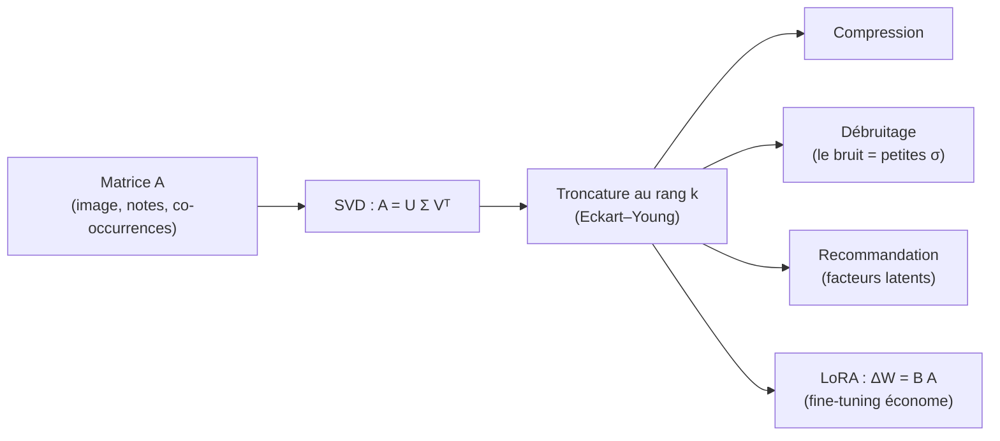

- **Compression d'images** : illustrée ci-dessous.
- **Débruitage** : le signal vit dans un sous-espace de rang faible ; le bruit se répartit sur toutes les petites valeurs singulières. Tronquer = débruiter.
- **Filtrage collaboratif** : la matrice utilisateurs×items est supposée de rang faible (peu de « goûts types »).
- **Indexation sémantique latente (LSA)** : compresser une matrice termes×documents révèle des thèmes.

> **Mise à jour 2026.** L'approximation de rang faible est au cœur de l'efficacité des grands modèles : **LoRA** et ses variantes (**QLoRA**, **DoRA**) gèlent les poids $W$ et n'apprennent qu'une correction de rang faible $\Delta W = BA$ (avec $B \in \mathbb{R}^{d\times k}, A \in \mathbb{R}^{k\times d}$, $k$ de l'ordre de $4$ à $64$), réduisant de plusieurs ordres de grandeur le nombre de paramètres à entraîner. La compression de modèles (élagage spectral des couches, distillation low-rank) et la mise en cache des attentions reposent sur la même idée. Pour calculer ces troncatures à grande échelle, on emploie la **SVD randomisée** plutôt que la SVD complète.

```python
import numpy as np

# Compression d'image en niveaux de gris par SVD tronquee
def compress(img, k):
    U, s, Vt = np.linalg.svd(img, full_matrices=False)
    return U[:, :k] @ np.diag(s[:k]) @ Vt[:k, :], s

# Image synthetique structuree (rang faible + bruit)
rng = np.random.default_rng(0)
base = np.outer(np.linspace(0, 1, 200), np.linspace(1, 0, 200)) * 255
img = np.clip(base + rng.normal(0, 8, base.shape), 0, 255)

for k in [1, 5, 20, 50]:
    approx, s = compress(img, k)
    err = np.linalg.norm(img - approx, 'fro') / np.linalg.norm(img, 'fro')
    var = (s[:k]**2).sum() / (s**2).sum()
    print(f"k={k:3d} | erreur relative={err:.4f} | variance expliquee={var:.4f}")

# Coude : afficher la decroissance des valeurs singulieres
_, s_full, _ = np.linalg.svd(img, full_matrices=False)
print("5 premieres valeurs singulieres :", s_full[:5].round(1))
```

> **Piège.** Le rang faible n'a de sens que si les données **ont effectivement** une structure de rang faible. Sur du bruit pur (toutes les $\sigma_i$ comparables), tronquer détruit l'information sans rien gagner. Toujours regarder la décroissance des valeurs singulières avant de tronquer.

---

### Phylogénie des matrices

Pour terminer, prenons de la hauteur. Toutes ces décompositions ne sont pas indépendantes : elles forment une **famille**, un arbre généalogique où chaque type de matrice débloque des outils plus puissants. Comprendre cet arbre, c'est savoir **quel outil dégainer** devant une matrice donnée.

#### L'arbre des matrices

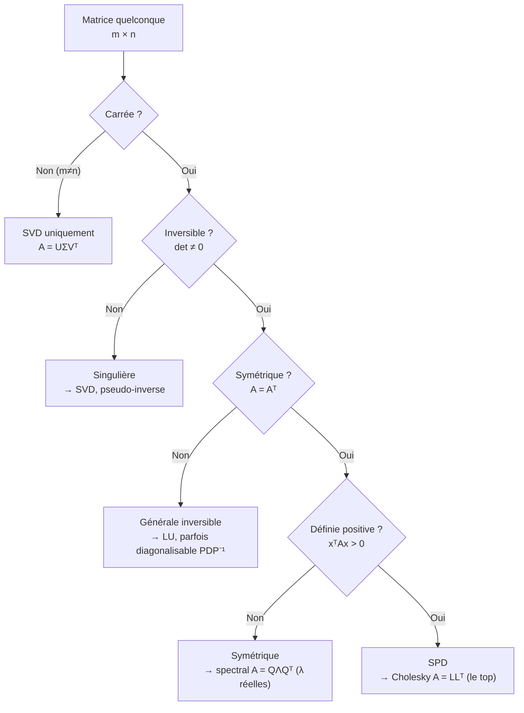

#### Hiérarchie d'inclusion

Voici, des matrices les plus structurées aux plus générales, comment chaque classe s'emboîte dans la suivante en perdant des propriétés :

| Classe | Condition | Décomposition reine | Cadeau bonus |
|---|---|---|---|
| Définie positive (SPD) | $A = A^\top$, $\lambda_i > 0$ | **Cholesky** $LL^\top$ | la plus rapide, $L$ unique |
| Semi-définie positive | $A = A^\top$, $\lambda_i \ge 0$ | $Q\Lambda Q^\top$ | $\sigma_i = \lambda_i$ |
| Symétrique réelle | $A = A^\top$ | **spectral** $Q\Lambda Q^\top$ | $\lambda$ réelles, $Q$ orthogonale |
| Normale | $AA^\top = A^\top A$ | $U D U^*$ (unitaire) | base orthonormée (sur $\mathbb{C}$) |
| Diagonalisable | $n$ vec. propres indép. | $PDP^{-1}$ | puissances faciles |
| Carrée | $m=n$ | LU, déterminant | trace, det définis |
| Quelconque $m\times n$ | aucune | **SVD** $U\Sigma V^\top$ | existe toujours |

> **Note sur l'emboîtement.** Les inclusions strictes vont du haut vers le bas : SPD $\subset$ semi-définie positive $\subset$ symétrique réelle $\subset$ normale $\subset$ diagonalisable $\subset$ carrée $\subset$ quelconque. Attention toutefois : « normale » et « diagonalisable » ne sont pas comparables à « inversible » (une matrice peut être normale et non inversible, ou inversible et non diagonalisable) ; l'arbre de décision ci-dessus trie par questions pratiques, ce tableau par richesse de structure.

> **Le symbole $U D U^*$ (matrices normales).** Une matrice **normale** commute avec sa transposée conjuguée ($AA^* = A^*A$, avec $A^* = \bar A^\top$). Le théorème spectral complexe dit qu'elle se diagonalise dans une base orthonormée (matrice unitaire $U$, vérifiant $U^*U = I$). Les matrices symétriques réelles, antisymétriques, orthogonales et unitaires sont toutes des cas particuliers de matrices normales.

#### Relations entre décompositions

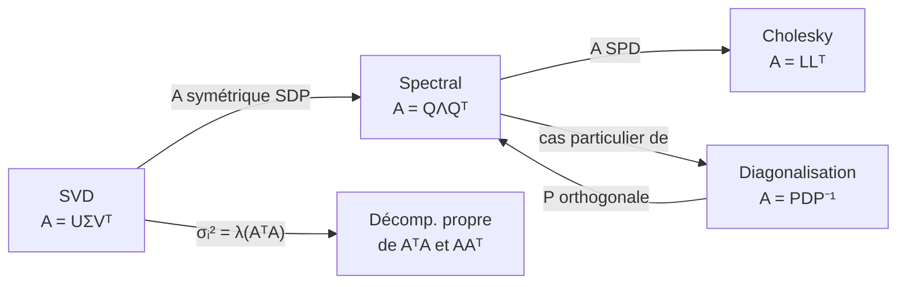

> **Les ponts à retenir.**
> - La **SVD** contient tout : appliquée à une matrice symétrique semi-définie positive, elle **redonne** la décomposition spectrale ($U = V = Q$, $\sigma_i = \lambda_i$).
> - La **décomposition spectrale** est le cas particulier de la diagonalisation $PDP^{-1}$ où $P$ peut être choisie **orthogonale** ($P = Q$, $P^{-1} = Q^\top$).
> - **Cholesky** est l'« arme rapide » réservée aux SPD : ce que la spectrale fait en $O(n^3)$ avec calcul de vecteurs propres, Cholesky le fait pour la résolution de systèmes en $\sim n^3/3$ sans toucher au spectre.
> - Les valeurs singulières de $A$ sont les **racines carrées** des valeurs propres de $A^\top A$.

#### Tableau de décision : quel outil dégainer ?

| Situation rencontrée | Outil recommandé | Pourquoi |
|---|---|---|
| Résoudre $Ax=b$, $A$ SPD | **Cholesky** | 2× plus rapide que LU |
| Résoudre $Ax=b$, $A$ carrée générale | LU | standard, pivot partiel |
| Moindres carrés $\min\|Xw-y\|$ | **QR** ou **SVD** | stable ; SVD si rang déficient |
| ACP / réduction de dimension | **SVD** (de $X$) | stable, donne axes + variances |
| Compression / débruitage | **SVD tronquée** | optimale (Eckart–Young) |
| Calculer $A^k$ ou $\exp(A)$ | **diagonalisation** | puissances triviales sur $D$ |
| Tester si $A$ est SPD | tenter **Cholesky** | échoue ssi non SPD, rapide |
| Matrice non carrée / singulière | **SVD** + pseudo-inverse | seule option universelle |
| Quelques $\lambda$ d'une grande matrice creuse | **Lanczos/Arnoldi** | évite la factorisation dense |

> **Mise à jour 2026.** À grande échelle, l'arbre se double d'une dimension « randomisée » : SVD randomisée, ACP randomisée, estimateurs stochastiques de trace et de log-déterminant, esquisses (sketching) pour les moindres carrés. La règle pratique moderne : **dès que $n$ dépasse quelques milliers, on remplace la factorisation exacte par sa version randomisée ou itérative** (Krylov), en s'appuyant sur l'autodifférenciation (JAX, PyTorch) pour propager les gradients à travers ces opérations dans les pipelines d'apprentissage.

> **Récapitulatif en une phrase.** La **SVD** est la racine universelle de l'arbre (elle existe toujours) ; en descendant vers des matrices plus structurées (carrée → symétrique → SPD), on débloque des décompositions de plus en plus **rapides et spécialisées** (spectrale, puis Cholesky), au prix d'hypothèses de plus en plus fortes.

---

### Exercices

#### Exercice 1 — Déterminant et trace (échauffement)

Soit $A = \begin{pmatrix} 3 & 2 \\ 1 & 4 \end{pmatrix}$.
**(a)** Calculer $\det(A)$ et $\mathrm{tr}(A)$.
**(b)** En déduire la somme et le produit des valeurs propres sans les calculer.
**(c)** Vérifier $\det(2A) = 2^2 \det(A)$.

> **Corrigé.**
> **(a)** $\det(A) = 3\cdot4 - 2\cdot1 = 10$. $\mathrm{tr}(A) = 3+4 = 7$.
> **(b)** $\lambda_1 + \lambda_2 = \mathrm{tr}(A) = 7$ et $\lambda_1\lambda_2 = \det(A) = 10$. (Ce sont $\lambda=5$ et $\lambda=2$, racines de $\lambda^2-7\lambda+10$.)
> **(c)** $2A = \begin{pmatrix} 6 & 4 \\ 2 & 8 \end{pmatrix}$, $\det(2A) = 48 - 8 = 40 = 4\cdot 10 = 2^2\det(A)$. $\checkmark$

#### Exercice 2 — Valeurs et vecteurs propres

Soit $A = \begin{pmatrix} 2 & 0 \\ 1 & 3 \end{pmatrix}$.
**(a)** Trouver les valeurs propres. **(b)** Trouver un vecteur propre pour chacune. **(c)** $A$ est-elle diagonalisable ?

> **Corrigé.**
> **(a)** $A$ est triangulaire, donc les valeurs propres sont les coefficients diagonaux : $\lambda_1 = 2,\ \lambda_2 = 3$. (Vérif : $\chi_A(\lambda) = (2-\lambda)(3-\lambda)$.)
> **(b)** Pour $\lambda=3$ : $(A-3I)v = \begin{pmatrix} -1 & 0 \\ 1 & 0\end{pmatrix}v = 0 \Rightarrow v_1 = 0$, donc $v^{(3)} = \binom{0}{1}$. Pour $\lambda=2$ : $(A-2I)v = \begin{pmatrix} 0 & 0 \\ 1 & 1\end{pmatrix}v=0 \Rightarrow v_1 = -v_2$, donc $v^{(2)} = \binom{1}{-1}$.
> **(c)** Deux valeurs propres distinctes $\Rightarrow$ deux vecteurs propres indépendants $\Rightarrow$ **diagonalisable**.

#### Exercice 3 — Cholesky à la main

Soit $A = \begin{pmatrix} 9 & 3 \\ 3 & 5 \end{pmatrix}$.
**(a)** Vérifier qu'elle est SPD. **(b)** Calculer sa décomposition de Cholesky $L$. **(c)** En déduire $\det(A)$.

> **Corrigé.**
> **(a)** Symétrique. Critère des mineurs principaux (Sylvester) : $9 > 0$ et $\det(A) = 45 - 9 = 36 > 0$, donc **SPD**.
> **(b)** $\ell_{11} = \sqrt 9 = 3$ ; $\ell_{21} = 3/3 = 1$ ; $\ell_{22} = \sqrt{5 - 1^2} = 2$. Donc $L = \begin{pmatrix} 3 & 0 \\ 1 & 2 \end{pmatrix}$. (Vérif : $LL^\top = \begin{pmatrix} 9 & 3 \\ 3 & 5\end{pmatrix}$. $\checkmark$)
> **(c)** $\det(A) = \det(L)\det(L^\top) = (\ell_{11}\ell_{22})^2 = (3\cdot2)^2 = 36$. $\checkmark$

#### Exercice 4 — Diagonalisation et puissances

Soit $A = \begin{pmatrix} 0 & 2 \\ 2 & 0 \end{pmatrix}$.
**(a)** Diagonaliser $A$ (elle est symétrique : utiliser une base orthonormée). **(b)** Calculer $A^{10}$.

> **Corrigé.**
> **(a)** $\chi_A(\lambda) = \lambda^2 - 4 \Rightarrow \lambda = \pm 2$. Pour $\lambda=2$ : $v_1 = \frac1{\sqrt2}\binom{1}{1}$ ; pour $\lambda=-2$ : $v_2 = \frac1{\sqrt2}\binom{1}{-1}$. Ils sont orthonormés, donc $Q = \frac1{\sqrt2}\begin{pmatrix} 1 & 1 \\ 1 & -1\end{pmatrix}$, $\Lambda = \begin{pmatrix} 2 & 0 \\ 0 & -2\end{pmatrix}$, et $A = Q\Lambda Q^\top$.
> **(b)** $A^{10} = Q\Lambda^{10}Q^\top$ avec $\Lambda^{10} = \begin{pmatrix} 2^{10} & 0 \\ 0 & (-2)^{10}\end{pmatrix} = 1024\, I$. Donc $A^{10} = Q(1024\,I)Q^\top = 1024\,QQ^\top = 1024\, I = \begin{pmatrix} 1024 & 0 \\ 0 & 1024\end{pmatrix}$. (Cohérent : $A^2 = 4I$, donc $A^{10} = (A^2)^5 = 4^5 I = 1024\,I$.)

#### Exercice 5 — SVD à la main

Soit $A = \begin{pmatrix} 2 & 0 \\ 0 & -3 \end{pmatrix}$.
**(a)** Donner les valeurs singulières. **(b)** Donner une SVD $A = U\Sigma V^\top$. **(c)** Comparer valeurs propres et valeurs singulières.

> **Corrigé.**
> **(a)** $A^\top A = \begin{pmatrix} 4 & 0 \\ 0 & 9\end{pmatrix}$, valeurs propres $4$ et $9$, donc valeurs singulières $\sigma_1 = 3,\ \sigma_2 = 2$ (rangées décroissant).
> **(b)** On ordonne pour avoir $\sigma_1 = 3$ en premier. $\Sigma = \begin{pmatrix} 3 & 0 \\ 0 & 2\end{pmatrix}$. Le vecteur singulier à droite dominant est $e_2 = \binom{0}{1}$ (associé à la valeur propre $9$ de $A^\top A$). On prend $V = \begin{pmatrix} 0 & 1 \\ 1 & 0\end{pmatrix}$ (colonnes $v_1 = e_2$, $v_2 = e_1$). Puis $u_i = \frac1{\sigma_i}Av_i$ : $u_1 = \frac13 A\binom{0}{1} = \frac13\binom{0}{-3} = \binom{0}{-1}$ ; $u_2 = \frac12 A\binom{1}{0} = \binom{1}{0}$. Donc $U = \begin{pmatrix} 0 & 1 \\ -1 & 0\end{pmatrix}$. On vérifie $U\Sigma V^\top = \begin{pmatrix} 0 & 1 \\ -1 & 0\end{pmatrix}\begin{pmatrix} 3 & 0 \\ 0 & 2\end{pmatrix}\begin{pmatrix} 0 & 1 \\ 1 & 0\end{pmatrix} = \begin{pmatrix} 2 & 0 \\ 0 & -3\end{pmatrix} = A$. $\checkmark$
> **(c)** Valeurs propres : $2$ et $-3$ (signe quelconque). Valeurs singulières : $3$ et $2$ (positives, $= |{-3}|$ et $|2|$). Pour une matrice diagonale, $\sigma_i = |\lambda_i|$.

#### Exercice 6 — Eckart–Young et compression

Une matrice $A$ de taille $4\times 4$ a pour valeurs singulières $\sigma = (10, 6, 0{,}5, 0{,}1)$.
**(a)** Quelle est l'erreur de la meilleure approximation de rang $2$ en norme spectrale ? En norme de Frobenius ? **(b)** Quelle part de variance capture le rang $2$ ? **(c)** Le rang $2$ est-il un bon choix ?

> **Corrigé.**
> **(a)** Norme spectrale : $\|A - A_2\|_2 = \sigma_3 = 0{,}5$. Norme de Frobenius : $\|A - A_2\|_F = \sqrt{\sigma_3^2 + \sigma_4^2} = \sqrt{0{,}25 + 0{,}01} = \sqrt{0{,}26} \approx 0{,}51$.
> **(b)** Variance totale $\propto \sum\sigma_i^2 = 100 + 36 + 0{,}25 + 0{,}01 = 136{,}26$. Capturée par rang 2 : $136/136{,}26 \approx 0{,}9981$, soit **99,8 %**.
> **(c)** Oui, excellent : il y a un **coude** net après $\sigma_2$ (chute de $6$ à $0{,}5$). Les deux dernières composantes sont quasi du bruit ; le rang $2$ est le choix naturel.

#### Exercice 7 — Synthèse (raisonnement)

On donne une matrice $A$ réelle $5\times 3$ de rang $3$. Pour chacune des tâches, dire quelle décomposition utiliser et pourquoi.
**(a)** Résoudre au sens des moindres carrés $A w \approx b$.
**(b)** Calculer le conditionnement de $A$.
**(c)** Compresser $A$ en rang $2$ de façon optimale.
**(d)** $A^\top A$ étant SPD, résoudre $A^\top A\, x = c$ efficacement.

> **Corrigé.**
> **(a)** **SVD** (ou QR). $A$ n'est pas carrée ; la solution est $w = A^+ b = V\Sigma^+U^\top b$. La SVD gère proprement le caractère rectangulaire et donne la solution de norme minimale.
> **(b)** **SVD** : $\kappa(A) = \sigma_1/\sigma_3$ (rang $3$, donc $\sigma_3 > 0$). C'est la définition même via valeurs singulières.
> **(c)** **SVD tronquée** au rang $2$ : $A_2 = \sum_{i=1}^2 \sigma_i u_i v_i^\top$. Optimale par Eckart–Young, en norme spectrale et de Frobenius.
> **(d)** **Cholesky** de $A^\top A$ (matrice $3\times3$ SPD car $A$ de rang plein) : $A^\top A = LL^\top$, puis descente/remontée. Deux fois plus rapide que LU. (En pratique, pour de meilleures propriétés numériques, on préférerait passer par la SVD/QR de $A$, car former $A^\top A$ carre le conditionnement.)

[↑ Retour à la table des matières](#table-des-matières)

## 5. Calcul différentiel vectoriel

### Dérivation des fonctions d'une variable

Avant de parler de gradients, de jacobiennes ou de retropropagation, il faut comprendre un objet d'une simplicite trompeuse : la **derivee** d'une fonction d'une seule variable. C'est la brique elementaire ; tout le reste du chapitre n'est qu'une generalisation de cette idee a plusieurs dimensions.

#### L'intuition : mesurer une pente

Imaginez que vous roulez en voiture. A chaque instant, le compteur de vitesse vous indique a quelle vitesse vous allez **maintenant**, pas votre vitesse moyenne depuis le depart. La derivee, c'est exactement ce compteur de vitesse : elle vous dit, en un point precis, **a quelle vitesse une quantite change**.

Geometriquement, si on trace la courbe d'une fonction $f$, la derivee en un point est la **pente de la tangente** a la courbe en ce point. Une pente positive signifie « ca monte », une pente negative « ca descend », une pente nulle « c'est plat » (sommet, creux ou palier).

> **Le symbole $f(x)$.** Ce symbole represente une **machine a transformer les nombres**. On lui donne un nombre $x$ (l'entree), et elle recrache un autre nombre note $f(x)$ (la sortie). Comme une machine a cafe : tu mets une capsule (le $x$), tu obtiens un cafe (le $f(x)$). La lettre $f$ est juste le nom de la machine ; on pourrait l'appeler $g$, $h$ ou « tartempion ».

> **Le symbole $x$.** Ce symbole represente un **nombre qui peut varier**, une « case vide » qu'on remplit avec la valeur de notre choix. On l'appelle une variable. Pensez a une boite etiquetee « $x$ » dans laquelle on range tantot 2, tantot 3,7, tantot $-10$.

#### La limite : s'approcher sans jamais toucher

Pour transformer l'idee de pente en une definition rigoureuse, il faut d'abord l'outil le plus fondamental de l'analyse : la **limite**.

> **Le symbole $\lim$ (limite).** Ce symbole represente l'idee de **« vers quoi on se dirige quand on s'approche tout pres »**. Imaginez que vous marchez vers un mur en faisant a chaque pas la moitie du chemin restant : vous ne touchez jamais le mur, mais tout le monde voit bien que vous vous dirigez vers lui. La limite, c'est la position du mur : la valeur visee, meme si on ne l'atteint jamais vraiment.

> **Le symbole $h \to 0$.** La fleche $\to$ se lit « tend vers ». Donc $h \to 0$ veut dire « la petite quantite $h$ devient de plus en plus minuscule, se rapprochant de zero, sans jamais valoir exactement zero ». Pensez a $h$ comme a une miette de pain qu'on rend de plus en plus petite : $0,1$ puis $0,001$ puis $0,000001$...

Pour mesurer une pente, on prend deux points sur la courbe, separes horizontalement d'une petite distance $h$, et on calcule la pente de la droite (la « corde ») qui les relie. Cette pente vaut

```math
\frac{f(x+h) - f(x)}{h}.
```

C'est la variation verticale (la sortie a bouge de $f(x+h)-f(x)$) divisee par la variation horizontale ($h$). On appelle cela le **taux d'accroissement**. Puis on fait retrecir $h$ vers zero : les deux points se rapprochent, la corde se confond avec la tangente, et l'on obtient la pente exacte.

> **Definition (derivee).** Soit $f : I \to \mathbb{R}$ definie sur un intervalle ouvert $I \subseteq \mathbb{R}$, et $x \in I$. On dit que $f$ est **derivable** (synonyme : differentiable, pour une fonction d'une variable) en $x$ si la limite suivante existe et est finie :
> ```math
> f'(x) \;=\; \frac{\mathrm{d}f}{\mathrm{d}x}(x) \;=\; \lim_{h \to 0} \frac{f(x+h) - f(x)}{h}.
> ```
> Ce nombre $f'(x)$ est la **derivee** de $f$ en $x$.

> **Le symbole $f'(x)$ et la notation $\frac{\mathrm{d}f}{\mathrm{d}x}$.** Le petit trait $'$ (« prime ») sur le $f$ signifie « la derivee de ». Donc $f'$ se lit « f prime » et designe la fonction-pente. La notation $\frac{\mathrm{d}f}{\mathrm{d}x}$ (notation de Leibniz) se lit « d f sur d x » : le « $\mathrm{d}$ » evoque une **variation infiniment petite**. C'est litteralement « une toute petite variation de $f$ divisee par une toute petite variation de $x$ » — la version « zoomee a l'infini » du taux d'accroissement.

> **Le symbole $\mathbb{R}$.** Ce symbole (un R a double barre) represente l'ensemble de **tous les nombres reels** : tous les points d'une droite continue, des entiers ($-2$, $0$, $5$) aux fractions ($\tfrac{1}{3}$) en passant par les irrationnels ($\sqrt{2}$, $\pi$). Quand on ecrit $f : I \to \mathbb{R}$, cela veut dire « $f$ prend une entree dans l'intervalle $I$ et produit un nombre reel ».

> **Le symbole $\subseteq$ (inclusion).** Ce symbole se lit « est inclus dans » : $I \subseteq \mathbb{R}$ signifie « tout element de $I$ est aussi un element de $\mathbb{R}$ », autrement dit $I$ est un **morceau** de la droite reelle. C'est l'analogue ensembliste de « le tiroir est range dans la commode ».

> **Remarque (derivabilite et continuite).** Si $f$ est derivable en $x$, alors $f$ est continue en $x$ (pas de saut brutal). La reciproque est fausse : la fonction valeur absolue $f(x)=|x|$ est continue en $0$ mais pas derivable (sa courbe forme un coin, et la pente « a gauche » vaut $-1$ tandis que la pente « a droite » vaut $+1$ ; il n'y a pas de tangente unique).

#### Exemple chiffre deroule pas a pas

Calculons la derivee de $f(x) = x^2$ au point $x = 3$, directement avec la definition.

1. Forme le taux d'accroissement :
```math
\frac{f(3+h) - f(3)}{h} = \frac{(3+h)^2 - 3^2}{h}.
```
2. Developpe $(3+h)^2 = 9 + 6h + h^2$ :
```math
= \frac{9 + 6h + h^2 - 9}{h} = \frac{6h + h^2}{h}.
```
3. Simplifie par $h$ (licite car $h \neq 0$ tant qu'on n'a pas pris la limite) :
```math
= 6 + h.
```
4. Fais tendre $h \to 0$ :
```math
f'(3) = \lim_{h\to 0} (6 + h) = 6.
```

La pente de la parabole $x^2$ au point $x=3$ vaut donc $6$. En refaisant le calcul pour un $x$ quelconque on trouve $f'(x) = 2x$, ce qui est le cas particulier $n=2$ de la regle generale ci-dessous.

#### Le formulaire des derivees usuelles

En pratique on ne repasse jamais par la limite : on apprend une fois pour toutes les derivees des fonctions de base et des regles de combinaison. Voici les derivees qu'il faut connaitre par coeur.

| Fonction $f(x)$ | Derivee $f'(x)$ | Condition |
|---|---|---|
| $c$ (constante) | $0$ | — |
| $x^n$ | $n\,x^{n-1}$ | $n$ entier : tout $x$ ; $n$ reel quelconque : $x>0$ |
| $e^x$ | $e^x$ | — |
| $a^x$ | $a^x \ln a$ | $a>0$ |
| $\ln x$ | $1/x$ | $x>0$ |
| $\sin x$ | $\cos x$ | — |
| $\cos x$ | $-\sin x$ | — |
| $\tan x$ | $1 + \tan^2 x = 1/\cos^2 x$ | $x \neq \tfrac{\pi}{2}+k\pi$ |
| $\sqrt{x}$ | $\dfrac{1}{2\sqrt{x}}$ | $x>0$ |
| $1/x$ | $-1/x^2$ | $x \neq 0$ |

> **Attention a la condition sur $x^n$.** Pour un exposant entier ($x^2$, $x^3$, $x^{-1}$…), la regle $n x^{n-1}$ vaut pour tout $x$ admissible, y compris les $x$ negatifs. Mais des que $n$ est un reel non entier (par exemple $x^{1/2}=\sqrt{x}$), la fonction $x^n$ n'est definie sur les reels que pour $x>0$ ; la regle ne s'applique alors que la. C'est pourquoi $\sqrt{x}$ figure separement avec la condition $x>0$.

> **Le symbole $e$.** Ce symbole represente un nombre special, $e \approx 2,71828$, appele **constante d'Euler**. Sa particularite magique : la fonction $e^x$ est sa propre derivee. C'est le nombre « naturel » de la croissance continue (interets composes, populations, decroissance radioactive). On le retrouvera partout en apprentissage automatique, notamment dans l'exponentielle de la fonction softmax.

> **Le symbole $\ln$.** Ce symbole represente le **logarithme naturel**, la fonction reciproque de l'exponentielle : si $e^a = b$, alors $\ln b = a$. Intuitivement, $\ln b$ repond a la question « a quelle puissance faut-il elever $e$ pour obtenir $b$ ? ». Il transforme les produits en sommes ($\ln(ab)=\ln a + \ln b$), ce qui le rend precieux pour manipuler les vraisemblances en probabilites.

#### Les regles de combinaison

| Regle | Formule |
|---|---|
| Linearite | $(\alpha f + \beta g)' = \alpha f' + \beta g'$ |
| Produit | $(fg)' = f'g + f g'$ |
| Quotient | $\left(\dfrac{f}{g}\right)' = \dfrac{f'g - f g'}{g^2}$ |
| Composition (regle de la chaine) | $\big(f(g(x))\big)' = f'\!\big(g(x)\big)\cdot g'(x)$ |

> **Les symboles $\alpha$ et $\beta$ (alpha, beta).** Ces deux premieres lettres grecques designent ici de simples **nombres fixes** (des constantes) qui ponderent $f$ et $g$. On les emploie par convention pour des coefficients, exactement comme on dirait « 3 fois ceci plus 2 fois cela ».

La derniere, la **regle de la chaine** (chain rule), est de loin la plus importante de tout le chapitre : c'est elle qui, generalisee aux vecteurs et aux matrices, deviendra la **retropropagation** (backpropagation) qui entraine les reseaux de neurones. Nous lui consacrons un encadre.

> **Definition (regle de la chaine, une variable).** Soit $g$ derivable en $x$ et $f$ derivable en $g(x)$. Alors la fonction composee $h = f \circ g$, definie par $h(x) = f(g(x))$, est derivable en $x$ et
> ```math
> h'(x) = f'\big(g(x)\big)\cdot g'(x).
> ```
> **Intuition « engrenages ».** Imaginez deux engrenages enchaines. Si le premier ($g$) tourne 3 fois plus vite que sa manivelle, et que le second ($f$) tourne 2 fois plus vite que le premier, alors le second tourne $2 \times 3 = 6$ fois plus vite que la manivelle. Les vitesses de variation se **multiplient** le long de la chaine. C'est tout le secret.

> **Le symbole $\circ$ (composition).** Ce symbole rond represente l'action d'**enchainer deux machines** : $f \circ g$ se lit « f rond g » et signifie « applique d'abord $g$, puis donne le resultat a $f$ ». C'est comme une chaine de montage : la piece passe dans la machine $g$, puis le produit sort et entre directement dans la machine $f$. Attention a l'ordre : on lit de droite a gauche, la machine la plus a droite agit en premier.

**Exemple chiffre (regle de la chaine).** Derivons $h(x) = (3x^2 + 1)^5$.
On pose $g(x) = 3x^2 + 1$ (donc $g'(x) = 6x$) et $f(u) = u^5$ (donc $f'(u) = 5u^4$). Alors
```math
h'(x) = f'(g(x))\cdot g'(x) = 5(3x^2+1)^4 \cdot 6x = 30x\,(3x^2+1)^4.
```

#### Application machine learning : la descente de gradient en dimension 1

Tout l'apprentissage automatique repose sur la **minimisation d'une fonction de cout** (loss function). En une dimension, supposons qu'on cherche le minimum d'une fonction $J(w)$ qui mesure « a quel point notre modele se trompe » en fonction d'un parametre $w$. L'idee de la **descente de gradient** (gradient descent) est limpide : la derivee $J'(w)$ indique la pente ; pour descendre vers le minimum, on fait un pas dans le sens **oppose** a la pente.

```math
w_{t+1} = w_t - \eta\, J'(w_t).
```

> **Le symbole $\eta$ (eta).** Cette lettre grecque represente le **taux d'apprentissage** (learning rate) : la taille du pas qu'on fait a chaque iteration. Trop grand, on saute par-dessus le minimum et on diverge ; trop petit, on avance a pas de fourmi et l'apprentissage est interminable. C'est le « reglage de l'amortisseur » de l'optimisation.

> **Le symbole d'indice $w_t$.** Le petit $t$ en bas de $w$ represente le **numero de l'etape** (l'instant, le « tour de boucle »). Ainsi $w_0$ est la valeur de depart, $w_1$ apres un pas, $w_2$ apres deux pas, etc. Pensez aux numeros de page d'un carnet : chaque page note ou l'on en est.

Illustrons sur $J(w) = (w-4)^2$, dont le minimum evident est en $w=4$. La derivee est $J'(w) = 2(w-4)$.

```python
import numpy as np

def J(w):       return (w - 4.0) ** 2
def grad_J(w):  return 2.0 * (w - 4.0)

w = 0.0          # point de depart
eta = 0.1        # taux d'apprentissage
for t in range(25):
    g = grad_J(w)
    w = w - eta * g
    print(f"t={t:2d}  w={w:.5f}  J={J(w):.5f}  J'={g:+.5f}")

print("Minimum trouve :", round(w, 5))   # -> proche de 4.0
```

A chaque tour, $w$ se rapproche de $4$ et la valeur de cout diminue. On vient d'executer, en miniature, l'algorithme qui entraine la quasi-totalite des modeles modernes — il ne reste qu'a le generaliser a des milliards de parametres, ce qui exige de passer du nombre $w$ a un **vecteur** de parametres. D'ou la suite.

---

### Dérivées partielles et gradients

Une fonction de cout reelle ne depend pas d'un seul parametre mais de milliers, de millions, voire de milliards. Il nous faut donc deriver des fonctions **a plusieurs entrees**. C'est exactement l'objet des derivees partielles et du gradient.

#### L'intuition : la pente dans chaque direction

Considerons une fonction de deux variables, $f(x_1, x_2)$. Sa courbe n'est plus une ligne dans le plan, mais une **surface** dans l'espace : un paysage de collines et de vallees, ou l'altitude au-dessus du point $(x_1, x_2)$ vaut $f(x_1, x_2)$.

Sur un paysage, la question « quelle est la pente ? » n'a pas une seule reponse : tout depend de la **direction** vers laquelle on regarde ! La pente vers l'est n'est pas la meme que vers le nord. L'idee de la **derivee partielle** est de fixer toutes les directions sauf une, et de ne mesurer la pente que dans cette direction-la.

> **Le symbole $\partial$ (« d rond », derivee partielle).** Ce symbole, un « d » arrondi, represente une derivee **partielle** : on derive par rapport a une seule variable en **gelant** toutes les autres comme si c'etaient des constantes. Imaginez que vous etes sur une colline et que vous ne vous autorisez a marcher **que vers l'est** (variable $x_1$), en vous interdisant tout pas vers le nord (variable $x_2$ figee) : la pente que vous ressentez sous vos pieds, c'est $\frac{\partial f}{\partial x_1}$. Le « rond » sert juste a rappeler « attention, il y a d'autres variables qu'on a mises en pause ».

> **Definition (derivee partielle).** Soit $f : \mathbb{R}^n \to \mathbb{R}$ et $\mathbf{x} = (x_1, \dots, x_n)$. La **derivee partielle** de $f$ par rapport a $x_i$ est
> ```math
> \frac{\partial f}{\partial x_i}(\mathbf{x}) = \lim_{h \to 0} \frac{f(x_1,\dots,x_i + h,\dots,x_n) - f(x_1,\dots,x_i,\dots,x_n)}{h},
> ```
> c'est-a-dire la derivee ordinaire de la fonction d'une variable $t \mapsto f(x_1,\dots,t,\dots,x_n)$, les autres coordonnees etant tenues constantes.

> **Le symbole $\mathbb{R}^n$.** Ce symbole represente l'ensemble des **listes ordonnees de $n$ nombres reels**, c'est-a-dire les vecteurs a $n$ coordonnees. $\mathbb{R}^2$ c'est le plan (couples $(x_1,x_2)$), $\mathbb{R}^3$ l'espace, et $\mathbb{R}^{1000}$ un espace a mille dimensions qu'on ne peut pas dessiner mais qu'on manipule avec les memes regles. Le petit $n$ en exposant compte le nombre de cases dans la liste.

> **Le symbole $\mathbf{x}$ en gras.** Quand on ecrit $\mathbf{x}$ en **gras**, ce n'est plus un seul nombre mais un **vecteur** : un paquet de plusieurs nombres ranges en colonne, $\mathbf{x} = (x_1, x_2, \dots, x_n)$. C'est la difference entre un grain de riz ($x$, un scalaire) et le sachet entier ($\mathbf{x}$, le vecteur). Le petit indice $i$ dans $x_i$ designe la $i$-eme case du sachet.

> **Le symbole $\mapsto$ (« applique sur »).** A ne pas confondre avec $\to$. La fleche $\to$ relie des **ensembles** ($f : \mathbb{R}^n \to \mathbb{R}$ : « de tel ensemble vers tel ensemble »), tandis que $\mapsto$ relie un **element a son image** ($t \mapsto t^2$ : « a $t$ on associe $t^2$ »). La premiere decrit la machine en gros, la seconde decrit la regle de calcul precise.

#### Le gradient : empiler toutes les pentes

Si l'on rassemble toutes les derivees partielles dans un vecteur, on obtient le **gradient**. C'est l'objet central de toute l'optimisation.

> **Le symbole $\nabla$ (nabla, le gradient).** Ce symbole en forme de triangle pointe vers le bas se lit « nabla ». $\nabla f$ represente le **vecteur des pentes dans toutes les directions a la fois**. Reprenons la colline : en un point donne, $\nabla f$ est une fleche posee au sol qui **pointe dans la direction de la montee la plus raide**, et dont la **longueur** indique a quel point ca grimpe fort. Si vous laissez tomber une bille, elle roule exactement dans la direction $-\nabla f$ (l'oppose du gradient). C'est la boussole de la descente de gradient.

> **Definition (gradient).** Pour $f : \mathbb{R}^n \to \mathbb{R}$ differentiable, le **gradient** de $f$ en $\mathbf{x}$ est le vecteur des derivees partielles :
> ```math
> \nabla f(\mathbf{x}) = \begin{bmatrix} \dfrac{\partial f}{\partial x_1}(\mathbf{x}) \\[2mm] \dfrac{\partial f}{\partial x_2}(\mathbf{x}) \\[1mm] \vdots \\[1mm] \dfrac{\partial f}{\partial x_n}(\mathbf{x}) \end{bmatrix} \in \mathbb{R}^n.
> ```
> Sa transposee $\nabla f(\mathbf{x})^\top = \big[\tfrac{\partial f}{\partial x_1}, \dots, \tfrac{\partial f}{\partial x_n}\big]$, vecteur ligne, represente la **differentielle** de $f$ au point $\mathbf{x}$ (l'application lineaire qui approche le mieux la variation de $f$). C'est aussi la matrice jacobienne de $f$ vue comme fonction a une seule sortie : une matrice $1\times n$.

> **Convention de disposition (layout).** Il existe deux conventions opposees pour ranger les derivees : le *denominator layout* (gradient en colonne, le notre par defaut) et le *numerator layout* (gradient en ligne). Les deux sont corrects ; ils different par une transposition. Le piege classique consiste a melanger les deux dans un meme calcul. **Choisissez-en une et tenez-vous-y.** Dans ce chapitre, le gradient $\nabla f$ d'une fonction scalaire est un **vecteur colonne**.

#### Derivee directionnelle et differentiabilite

Le gradient encode bien plus que les pentes selon les axes : il donne la pente dans **n'importe quelle** direction.

> **Definition (derivee directionnelle).** Pour un vecteur unitaire $\mathbf{u} \in \mathbb{R}^n$ ($\|\mathbf{u}\| = 1$), la derivee directionnelle de $f$ en $\mathbf{x}$ dans la direction $\mathbf{u}$ est
> ```math
> D_{\mathbf{u}} f(\mathbf{x}) = \lim_{h \to 0} \frac{f(\mathbf{x} + h\mathbf{u}) - f(\mathbf{x})}{h} = \nabla f(\mathbf{x})^\top \mathbf{u} = \langle \nabla f(\mathbf{x}), \mathbf{u}\rangle.
> ```

> **Le symbole $\langle\cdot,\cdot\rangle$ (produit scalaire).** Vu au chapitre 4, c'est l'operation qui mesure « a quel point deux vecteurs pointent dans le meme sens » : $\langle\mathbf a,\mathbf b\rangle = \mathbf a^\top\mathbf b = \sum_i a_i b_i$. On le rappelle ici parce qu'il fait le pont entre le gradient (un vecteur) et la pente (un nombre). Les deux ecritures $\nabla f^\top\mathbf u$ et $\langle\nabla f,\mathbf u\rangle$ designent la meme chose.

Cette egalite a une consequence geometrique fondamentale. Par l'inegalite de Cauchy-Schwarz (vue au chapitre 4),
```math
-\|\nabla f(\mathbf{x})\| \;\le\; D_{\mathbf{u}} f(\mathbf{x}) = \langle \nabla f(\mathbf{x}), \mathbf{u}\rangle \;\le\; \|\nabla f(\mathbf{x})\|\,\|\mathbf{u}\| = \|\nabla f(\mathbf{x})\|,
```
la borne superieure etant atteinte lorsque $\mathbf{u}$ est colineaire et de meme sens que $\nabla f(\mathbf{x})$, et la borne inferieure lorsque $\mathbf{u}$ pointe dans le sens oppose. **Le gradient pointe donc dans la direction de plus forte croissance** (sa norme est la pente maximale), et son oppose $-\nabla f$ dans celle de plus forte decroissance. C'est la justification rigoureuse de la descente de gradient.

> **Definition (differentiabilite).** $f : \mathbb{R}^n \to \mathbb{R}$ est **differentiable** en $\mathbf{x}$ s'il existe un vecteur $\mathbf{g}$ tel que
> ```math
> f(\mathbf{x} + \mathbf{h}) = f(\mathbf{x}) + \mathbf{g}^\top \mathbf{h} + o(\|\mathbf{h}\|), \qquad \text{quand } \mathbf{h} \to \mathbf{0}.
> ```
> Le vecteur $\mathbf{g}$ est alors unique et vaut $\nabla f(\mathbf{x})$. Cela signifie que, **localement, $f$ ressemble a une fonction affine** (un plan tangent).

> **Le symbole $o(\cdot)$ (petit o de Landau).** La notation $o(\|\mathbf{h}\|)$ represente un terme d'erreur **negligeable** devant $\|\mathbf{h}\|$ quand $\mathbf{h}$ devient minuscule, c'est-a-dire $\frac{o(\|\mathbf{h}\|)}{\|\mathbf{h}\|} \to 0$. Imaginez la poussiere a cote d'un grain de sable : quand on zoome assez, la poussiere disparait completement par rapport au grain. C'est le « reste qui s'efface plus vite que la quantite de reference ».

> **Le symbole $O(\cdot)$ (grand O de Landau).** A distinguer du petit o. La notation $O(\|\mathbf{h}\|)$ designe un terme qui reste **du meme ordre de grandeur** que $\|\mathbf{h}\|$ (borne par un multiple de $\|\mathbf{h}\|$), sans forcement devenir negligeable. Image : le petit o, c'est la poussiere qui disparait ; le grand O, c'est un caillou qui reste proportionnel au grain de reference. On s'en sert plus bas dans la preuve de la regle de la chaine.

> **Piege (l'existence des partielles ne suffit pas).** On peut avoir toutes les derivees partielles existantes en un point sans que $f$ y soit differentiable (exemple classique : $f(x,y) = \frac{xy}{x^2+y^2}$ prolongee par $0$ a l'origine). En revanche, si les partielles existent **et sont continues** au voisinage de $\mathbf{x}$, alors $f$ est differentiable en $\mathbf{x}$ (on dit que $f$ est de classe $\mathcal{C}^1$). En pratique, en apprentissage automatique, les fonctions sont presque toujours $\mathcal{C}^1$ par morceaux.

#### Exemple chiffre deroule pas a pas

Soit $f(x_1, x_2) = x_1^2 x_2 + 3x_2$. Calculons son gradient au point $(2, 1)$.

**Derivee partielle par rapport a $x_1$** (on traite $x_2$ comme une constante) :
```math
\frac{\partial f}{\partial x_1} = 2 x_1 x_2 + 0 = 2 x_1 x_2.
```
**Derivee partielle par rapport a $x_2$** (on traite $x_1$ comme une constante) :
```math
\frac{\partial f}{\partial x_2} = x_1^2 + 3.
```
Donc le gradient general et son evaluation :
```math
\nabla f(x_1,x_2) = \begin{bmatrix} 2x_1 x_2 \\ x_1^2 + 3 \end{bmatrix}, \qquad \nabla f(2,1) = \begin{bmatrix} 2\cdot 2 \cdot 1 \\ 2^2 + 3 \end{bmatrix} = \begin{bmatrix} 4 \\ 7 \end{bmatrix}.
```
Au point $(2,1)$, pour grimper le plus vite, il faut avancer dans la direction $\begin{bmatrix}4\\7\end{bmatrix}$ ; la pente y vaut $\|\nabla f(2,1)\| = \sqrt{16+49} = \sqrt{65} \approx 8,06$.

#### Verification numerique : les differences finies

On peut toujours verifier un gradient calcule a la main par une approximation numerique, la **difference finie centree** (central finite difference), qui revient a appliquer la definition avec un $h$ petit mais non nul :
```math
\frac{\partial f}{\partial x_i}(\mathbf{x}) \approx \frac{f(\mathbf{x} + h\,\mathbf{e}_i) - f(\mathbf{x} - h\,\mathbf{e}_i)}{2h}.
```

> **Le symbole $\mathbf{e}_i$.** Ce symbole represente le $i$-eme **vecteur de base canonique** : une liste de zeros partout, sauf un $1$ a la position $i$. Par exemple dans $\mathbb{R}^3$, $\mathbf{e}_2 = (0,1,0)$. Il sert d'« interrupteur » qui n'allume qu'une seule direction : ajouter $h\,\mathbf{e}_i$ a $\mathbf{x}$ ne modifie que la coordonnee $i$.

```python
import numpy as np

def f(x):
    return x[0]**2 * x[1] + 3 * x[1]

def grad_analytique(x):
    return np.array([2 * x[0] * x[1], x[0]**2 + 3.0])

def grad_numerique(f, x, h=1e-5):
    g = np.zeros_like(x, dtype=float)
    for i in range(len(x)):
        e = np.zeros_like(x, dtype=float); e[i] = h
        g[i] = (f(x + e) - f(x - e)) / (2 * h)
    return g

x = np.array([2.0, 1.0])
print("analytique :", grad_analytique(x))   # [4. 7.]
print("numerique  :", grad_numerique(f, x)) # ~[4. 7.]
```

> **La verification par differences finies (`gradcheck`) en pratique.** C'est le reflexe pour valider une implementation de gradient faite a la main. Mais en production on ne calcule presque plus aucun gradient manuellement : les bibliotheques de differentiation automatique (JAX, PyTorch) le font exactement, a la precision machine, et infiniment plus vite que les differences finies — lesquelles souffrent du compromis entre erreur de troncature (si $h$ trop grand) et erreur d'arrondi (si $h$ trop petit). On garde `gradcheck` pour deboguer une couche personnalisee, pas pour la production.

#### Application machine learning : la regression lineaire

Soit le probleme des moindres carres : on veut ajuster $\mathbf{w} \in \mathbb{R}^n$ pour que $X\mathbf{w}$ approche au mieux $\mathbf{y}$, en minimisant
```math
J(\mathbf{w}) = \tfrac{1}{2}\,\|X\mathbf{w} - \mathbf{y}\|^2.
```
Nous montrerons plus loin (section sur les identites) que
```math
\nabla_{\mathbf{w}} J(\mathbf{w}) = X^\top (X\mathbf{w} - \mathbf{y}).
```
La descente de gradient s'ecrit alors $\mathbf{w} \leftarrow \mathbf{w} - \eta\, X^\top(X\mathbf{w}-\mathbf{y})$ : exactement la version vectorielle de l'algorithme en dimension 1 vu plus haut, ou le simple nombre $w$ est devenu le vecteur $\mathbf{w}$.

> **Le symbole $\leftarrow$ (affectation).** Cette fleche vers la gauche ne signifie pas « egal » mais « devient » : $\mathbf{w} \leftarrow \mathbf{w} - \eta\,\nabla J$ se lit « remplace l'ancienne valeur de $\mathbf{w}$ par la nouvelle ». C'est l'equivalent mathematique de la ligne de code `w = w - eta * grad` : on ecrase la case memoire.

---

### Gradients de fonctions à valeurs vectorielles

Jusqu'ici la sortie etait un seul nombre (fonction scalaire). Mais une couche de reseau de neurones transforme un vecteur en un **autre vecteur**. Il faut donc deriver des fonctions $\mathbf{f} : \mathbb{R}^n \to \mathbb{R}^m$. L'objet qui generalise le gradient est alors la **matrice jacobienne**.

#### L'intuition : un tableau de toutes les sensibilites

Une fonction vectorielle $\mathbf{f}$ a $m$ sorties, chacune dependant des $n$ entrees. La question naturelle est : « si je bouge l'entree $j$, de combien bouge la sortie $i$ ? ». Il y a $m \times n$ telles questions, et leurs reponses se rangent naturellement dans un **tableau** (une matrice) : c'est la jacobienne.

> **Le symbole $\mathbf{f}$ (fonction en gras) et $\mathbb{R}^n \to \mathbb{R}^m$.** Le gras sur $\mathbf{f}$ rappelle que la **sortie est un vecteur**, pas un seul nombre. La notation $\mathbb{R}^n \to \mathbb{R}^m$ se lit « prend une entree a $n$ cases, rend une sortie a $m$ cases ». Pensez a une console de mixage : $n$ boutons d'entree, $m$ aiguilles de sortie ; chaque bouton peut influencer plusieurs aiguilles a la fois.

> **Definition (matrice jacobienne).** Soit $\mathbf{f} : \mathbb{R}^n \to \mathbb{R}^m$ differentiable, de composantes $\mathbf{f}(\mathbf{x}) = \big(f_1(\mathbf{x}), \dots, f_m(\mathbf{x})\big)$. La **matrice jacobienne** est la matrice $m \times n$ des derivees partielles :
> ```math
> J_{\mathbf{f}}(\mathbf{x}) = \frac{\partial \mathbf{f}}{\partial \mathbf{x}} = \begin{bmatrix} \dfrac{\partial f_1}{\partial x_1} & \cdots & \dfrac{\partial f_1}{\partial x_n} \\[2mm] \vdots & \ddots & \vdots \\[1mm] \dfrac{\partial f_m}{\partial x_1} & \cdots & \dfrac{\partial f_m}{\partial x_n} \end{bmatrix} \in \mathbb{R}^{m \times n}.
> ```
> La ligne $i$ est la transposee du gradient de la $i$-eme composante : $\big(\nabla f_i\big)^\top$.

> **Le symbole $J_{\mathbf{f}}$ (matrice jacobienne).** Ce symbole represente le **tableau complet des sensibilites** de toutes les sorties par rapport a toutes les entrees. Chaque case $(i,j)$ repond a « de combien varie la sortie $i$ quand on pousse l'entree $j$ ? ». Pensez a un tableau de bord d'avion : en lignes les instruments (sorties), en colonnes les commandes (entrees), et a l'intersection l'effet d'une commande sur un instrument. Quand $m=1$, la jacobienne se reduit a une seule ligne : c'est le gradient transpose.

> **Le symbole $\in \mathbb{R}^{m \times n}$.** Ce symbole indique les **dimensions** d'une matrice : $m$ lignes et $n$ colonnes. Le $\times$ ici ne veut pas dire « multiplier » mais « par » (comme « une feuille 21 par 29,7 »). Retenir l'ordre **(lignes, colonnes)** est vital pour ne pas se tromper dans les produits matriciels.

#### Cas particuliers a memoriser

Beaucoup de fonctions courantes ont des jacobiennes tres simples ; les connaitre evite des calculs.

| Fonction $\mathbf{f}(\mathbf{x})$ | Jacobienne $\dfrac{\partial \mathbf{f}}{\partial \mathbf{x}}$ | Forme |
|---|---|---|
| $A\mathbf{x}$ (application lineaire) | $A$ | $m\times n$ |
| $\mathbf{x}$ (identite) | $I_n$ | $n\times n$ |
| $\mathbf{a} \odot \mathbf{x}$ (produit terme a terme) | $\mathrm{diag}(\mathbf{a})$ | $n\times n$ |
| $\sigma(\mathbf{x})$ (activation appliquee composante par composante) | $\mathrm{diag}\big(\sigma'(x_1),\dots,\sigma'(x_n)\big)$ | $n\times n$ |

> **Le symbole $I_n$ (matrice identite).** Vue au chapitre 2, c'est la matrice carree $n\times n$ avec des $1$ sur la diagonale et des $0$ ailleurs ; elle laisse tout vecteur inchange ($I_n\mathbf{x}=\mathbf{x}$). Rien d'etonnant donc a ce que la jacobienne de la fonction identite ($\mathbf x\mapsto\mathbf x$) soit precisement $I_n$ : bouger une entree d'un cran bouge la sortie correspondante d'exactement un cran, sans melange.

> **Le symbole $\mathrm{diag}(\cdot)$.** Ce symbole construit une **matrice diagonale** : on prend une liste de nombres et on les pose sur la diagonale principale, des zeros partout ailleurs. C'est comme un standard telephonique ou chaque ligne ne parle qu'a elle-meme : l'entree $j$ n'affecte que la sortie $j$. Cela arrive des qu'une fonction agit « composante par composante » sans melanger les coordonnees.

> **Le symbole $\odot$ (produit de Hadamard).** Ce symbole (un point dans un cercle) represente la multiplication **terme a terme** de deux vecteurs de meme taille : $(\mathbf{a}\odot\mathbf{x})_i = a_i x_i$. A ne pas confondre avec le produit scalaire (qui additionne tout en un seul nombre). Ici on garde un vecteur : case par case, on multiplie les vis-a-vis.

#### Exemple chiffre deroule pas a pas

Soit $\mathbf{f} : \mathbb{R}^2 \to \mathbb{R}^2$ definie par
```math
\mathbf{f}(x_1, x_2) = \begin{bmatrix} f_1 \\ f_2 \end{bmatrix} = \begin{bmatrix} x_1^2 + x_2 \\ \sin(x_1)\,x_2 \end{bmatrix}.
```
On calcule les quatre partielles :
```math
\frac{\partial f_1}{\partial x_1} = 2x_1, \quad \frac{\partial f_1}{\partial x_2} = 1, \quad \frac{\partial f_2}{\partial x_1} = \cos(x_1)\,x_2, \quad \frac{\partial f_2}{\partial x_2} = \sin(x_1).
```
D'ou la jacobienne, puis son evaluation en $(0, 3)$ :
```math
J_{\mathbf{f}}(x_1,x_2) = \begin{bmatrix} 2x_1 & 1 \\ \cos(x_1)\,x_2 & \sin(x_1) \end{bmatrix}, \qquad J_{\mathbf{f}}(0,3) = \begin{bmatrix} 0 & 1 \\ 3 & 0 \end{bmatrix}.
```

#### La regle de la chaine multivariee

C'est le coeur du chapitre. Lorsqu'on compose deux fonctions vectorielles, **les jacobiennes se multiplient** (au sens du produit matriciel), generalisant exactement la regle des engrenages.

> **Theoreme (regle de la chaine multivariee).** Soient $\mathbf{g} : \mathbb{R}^n \to \mathbb{R}^p$ differentiable en $\mathbf{x}$ et $\mathbf{f} : \mathbb{R}^p \to \mathbb{R}^m$ differentiable en $\mathbf{g}(\mathbf{x})$. Alors $\mathbf{h} = \mathbf{f} \circ \mathbf{g}$ est differentiable en $\mathbf{x}$ et sa jacobienne est le **produit matriciel** des jacobiennes :
> ```math
> J_{\mathbf{h}}(\mathbf{x}) = J_{\mathbf{f}}\big(\mathbf{g}(\mathbf{x})\big)\, J_{\mathbf{g}}(\mathbf{x}).
> ```
> Verification des dimensions : $(m\times p)\cdot(p\times n) = m\times n$. Tout colle. L'ordre est crucial : la jacobienne de la fonction **externe** ($\mathbf{f}$) est a gauche.

**Demonstration (esquisse rigoureuse).** Par differentiabilite de $\mathbf{g}$ en $\mathbf{x}$ : $\mathbf{g}(\mathbf{x}+\mathbf{h}) = \mathbf{g}(\mathbf{x}) + J_{\mathbf{g}}(\mathbf{x})\mathbf{h} + o(\|\mathbf{h}\|)$. Posons $\mathbf{k} = J_{\mathbf{g}}(\mathbf{x})\mathbf{h} + o(\|\mathbf{h}\|)$, de sorte que $\|\mathbf{k}\| = O(\|\mathbf{h}\|)$. Par differentiabilite de $\mathbf{f}$ en $\mathbf{g}(\mathbf{x})$ :
```math
\mathbf{f}(\mathbf{g}(\mathbf{x})+\mathbf{k}) = \mathbf{f}(\mathbf{g}(\mathbf{x})) + J_{\mathbf{f}}(\mathbf{g}(\mathbf{x}))\mathbf{k} + o(\|\mathbf{k}\|).
```
En substituant $\mathbf{k}$ et en regroupant, les termes en $o$ restent en $o(\|\mathbf{h}\|)$ (puisque $\|\mathbf{k}\|=O(\|\mathbf{h}\|)$), et le terme lineaire en $\mathbf{h}$ est $J_{\mathbf{f}}(\mathbf{g}(\mathbf{x}))\,J_{\mathbf{g}}(\mathbf{x})\,\mathbf{h}$. Par unicite de la differentielle, c'est la jacobienne cherchee. $\blacksquare$

> **Le symbole $\blacksquare$.** Ce petit carre plein marque la **fin d'une demonstration**. C'est l'equivalent ecrit de « CQFD » (ce qu'il fallait demontrer) : il dit « voila, la preuve est terminee ».

**Exemple chiffre (chaine matricielle).** Reprenons $\mathbf{f}$ ci-dessus et posons $\mathbf{g}(t) = (t, t^2)$ avec $\mathbf{g} : \mathbb{R} \to \mathbb{R}^2$, donc $J_{\mathbf{g}}(t) = \begin{bmatrix}1\\2t\end{bmatrix}$. En $t=0$ : $\mathbf{g}(0) = (0,0)$, et
```math
J_{\mathbf{f}}(0,0) = \begin{bmatrix}0 & 1\\ 0 & 0\end{bmatrix}, \qquad J_{\mathbf{h}}(0) = J_{\mathbf{f}}(0,0)\,J_{\mathbf{g}}(0) = \begin{bmatrix}0 & 1\\ 0 & 0\end{bmatrix}\begin{bmatrix}1\\0\end{bmatrix} = \begin{bmatrix}0\\0\end{bmatrix}.
```

#### Application machine learning : la jacobienne de softmax

La fonction **softmax** transforme un vecteur de scores en une distribution de probabilites :
```math
\mathrm{softmax}(\mathbf{z})_i = \frac{e^{z_i}}{\sum_{k=1}^{n} e^{z_k}} =: p_i.
```

> **Le symbole $\sum$ (somme sigma).** Cette grande lettre grecque represente une **boucle qui additionne**. $\sum_{k=1}^{n} a_k$ se lit « somme, pour $k$ allant de 1 a $n$, des $a_k$ » et vaut $a_1 + a_2 + \dots + a_n$. Pensez a une caisse enregistreuse qui scanne les articles un a un et cumule le total. Le « $k=1$ » dessous est le point de depart, le « $n$ » dessus l'arrivee.

> **Le symbole $=:$ (definition).** Les deux points accoles a l'egalite signifient « ceci **definit** le membre du cote des deux points ». Ainsi $\dots =: p_i$ se lit « et l'on appelle desormais cette quantite $p_i$ ». C'est un raccourci pour baptiser un resultat sans ouvrir une phrase « ou l'on pose… ».

Sa jacobienne a une forme remarquable, omnipresente en classification :
```math
\frac{\partial p_i}{\partial z_j} = p_i(\delta_{ij} - p_j), \qquad\text{soit}\qquad J = \mathrm{diag}(\mathbf{p}) - \mathbf{p}\,\mathbf{p}^\top.
```

> **Le symbole $\delta_{ij}$ (delta de Kronecker).** Ce symbole vaut $1$ si $i=j$ et $0$ sinon. C'est un **detecteur d'egalite** : il s'allume (1) quand les deux indices sont identiques, reste eteint (0) sinon. Pratique pour ecrire « le terme diagonal » d'une formule en une seule expression compacte.

```python
import numpy as np

def softmax(z):
    z = z - z.max()
    e = np.exp(z)
    return e / e.sum()

def jacobienne_softmax(z):
    p = softmax(z)
    return np.diag(p) - np.outer(p, p)

z = np.array([1.0, 2.0, 0.5])
print(jacobienne_softmax(z))
```

---

### Gradients de matrices

Nous montons d'un cran. Les parametres d'un reseau ne sont pas seulement des vecteurs : ce sont des **matrices** de poids. Il faut donc savoir deriver par rapport a une matrice, et deriver des objets qui sont eux-memes des matrices. C'est le domaine du **calcul matriciel** (matrix calculus).

#### L'intuition : ranger les derivees comme l'objet d'origine

La regle d'or est simple : **la derivee d'un objet par rapport a un autre se range en suivant la forme des deux objets**. La derivee d'un scalaire $y$ par rapport a une matrice $W \in \mathbb{R}^{p\times q}$ est une matrice **de meme forme** $p \times q$, ou la case $(i,j)$ contient $\partial y / \partial W_{ij}$.

> **Definition (gradient par rapport a une matrice).** Pour $y = f(W)$ scalaire avec $W \in \mathbb{R}^{p\times q}$,
> ```math
> \frac{\partial y}{\partial W} \in \mathbb{R}^{p\times q}, \qquad \left(\frac{\partial y}{\partial W}\right)_{ij} = \frac{\partial y}{\partial W_{ij}}.
> ```
> On note souvent ce gradient $\nabla_W f$.

> **Le symbole $W_{ij}$ (entree d'une matrice).** Les deux indices reperent une **case dans une grille** : $W_{ij}$ est le nombre situe a la ligne $i$ et a la colonne $j$ de la matrice $W$. Comme une bataille navale : la lettre donne la ligne, le chiffre la colonne. Premier indice = ligne, deuxieme = colonne, toujours dans cet ordre.

#### La differentielle, methode reine

Pour les fonctions matricielles, calculer case par case devient vite ingerable. La methode professionnelle consiste a travailler avec la **differentielle** $\mathrm{d}y$ et a la mettre sous une forme canonique pour lire le gradient directement.

> **Principe (identification du gradient).** Pour une fonction scalaire $y = f(W)$, on calcule la differentielle et on l'ecrit sous la forme
> ```math
> \mathrm{d}y = \mathrm{tr}\!\big(G^\top\, \mathrm{d}W\big) \quad\Longrightarrow\quad \frac{\partial y}{\partial W} = G.
> ```
> Le facteur $G$ qui apparait en regard de $\mathrm{d}W$ dans la trace **est** le gradient. Cela marche parce que $\mathrm{tr}(A^\top B) = \sum_{ij} A_{ij}B_{ij}$ est le produit scalaire des matrices.

> **Le symbole $\mathrm{tr}(\cdot)$ (trace).** Ce symbole represente la **somme des elements diagonaux** d'une matrice carree : $\mathrm{tr}(A) = \sum_i A_{ii}$. Imaginez la diagonale d'un damier de haut-gauche a bas-droite : on additionne juste les cases sur cette ligne. La trace possede une propriete reine : $\mathrm{tr}(ABC) = \mathrm{tr}(BCA) = \mathrm{tr}(CAB)$ (invariance par permutation circulaire), qu'on utilise sans cesse.

> **Le symbole $A^\top$ (transposee).** Ce petit T en exposant represente la **matrice retournee** : on echange lignes et colonnes, $(A^\top)_{ij} = A_{ji}$. C'est comme basculer un tableau autour de sa diagonale, ou retourner une carte le long d'un axe. Un vecteur colonne devient une ligne, et inversement.

> **Le symbole $\mathrm{d}W$ (differentielle d'une matrice).** Ce symbole represente une **variation infinitesimale de toute la matrice** $W$ a la fois : chaque case bouge d'un tout petit peu. C'est la version « matrice » du $\mathrm{d}x$ vu au debut. La differentielle $\mathrm{d}y$ exprime comment la sortie $y$ reagit a cette petite perturbation $\mathrm{d}W$.

#### Identites matricielles fondamentales

Le tableau suivant rassemble les derivees matricielles les plus utilisees (convention denominator layout, gradient de meme forme que la variable de derivation).

| Expression scalaire $y$ | Gradient $\partial y / \partial \cdot$ |
|---|---|
| $\mathbf{a}^\top \mathbf{x}$ | $\partial/\partial\mathbf{x} = \mathbf{a}$ |
| $\mathbf{x}^\top A\,\mathbf{x}$ | $\partial/\partial\mathbf{x} = (A + A^\top)\mathbf{x}$ |
| $\mathbf{x}^\top A\,\mathbf{x}$, $A$ symetrique | $\partial/\partial\mathbf{x} = 2A\mathbf{x}$ |
| $\mathrm{tr}(W^\top A)$ | $\partial/\partial W = A$ |
| $\mathrm{tr}(AWB)$ | $\partial/\partial W = A^\top B^\top$ |
| $\mathbf{a}^\top W \mathbf{b}$ | $\partial/\partial W = \mathbf{a}\,\mathbf{b}^\top$ |
| $\mathrm{tr}(W^\top W)=\|W\|_F^2$ | $\partial/\partial W = 2W$ |
| $\ln\det(W)$ | $\partial/\partial W = (W^{-1})^\top = W^{-\top}$ |
| $\det(W)$ | $\partial/\partial W = \det(W)\,W^{-\top}$ |

> **Le symbole $\|W\|_F$ (norme de Frobenius).** Ce symbole represente la **« longueur » d'une matrice** : on prend toutes ses cases, on les met au carre, on additionne et on prend la racine, $\|W\|_F = \sqrt{\sum_{ij}W_{ij}^2}$. C'est exactement la norme euclidienne si on depliait la matrice en un long vecteur. On l'utilise comme penalite de regularisation (weight decay) pour empecher les poids de devenir trop grands.

> **Les symboles $W^{-1}$ et $W^{-\top}$.** $W^{-1}$ est la **matrice inverse** (vue au chapitre 2) : celle qui « annule » $W$, au sens $W W^{-1}=I$. La notation $W^{-\top}$ est un raccourci pour $(W^{-1})^\top$, c'est-a-dire « inverse puis transpose » (l'ordre des deux operations n'a d'ailleurs pas d'importance). Ces gradients n'ont de sens que si $W$ est inversible.

> **Le symbole $\det(W)$ (determinant).** Vu au chapitre 3 : il mesure le **facteur de dilatation des volumes** de la transformation $W$, et s'annule si $W$ ecrase l'espace (matrice non inversible). On le reutilise ici sans le reexpliquer.

#### Exemple chiffre deroule pas a pas (gradient d'une forme quadratique)

Calculons $\nabla_{\mathbf{x}}\,(\mathbf{x}^\top A \mathbf{x})$ par la differentielle, avec $A = \begin{bmatrix}2 & 1\\ 0 & 3\end{bmatrix}$.

Differentielle (regle du produit, $\mathrm{d}A=0$ car $A$ est constante) :
```math
\mathrm{d}(\mathbf{x}^\top A\mathbf{x}) = (\mathrm{d}\mathbf{x})^\top A\mathbf{x} + \mathbf{x}^\top A\,\mathrm{d}\mathbf{x}.
```
Le premier terme est un scalaire, donc egal a sa transposee : $(\mathrm{d}\mathbf{x})^\top A\mathbf{x} = \mathbf{x}^\top A^\top \mathrm{d}\mathbf{x}$. D'ou
```math
\mathrm{d}y = \mathbf{x}^\top(A + A^\top)\,\mathrm{d}\mathbf{x} = \big[(A+A^\top)\mathbf{x}\big]^\top \mathrm{d}\mathbf{x} \;\Longrightarrow\; \nabla_{\mathbf{x}} y = (A + A^\top)\mathbf{x}.
```
Avec $A + A^\top = \begin{bmatrix}4 & 1\\ 1 & 6\end{bmatrix}$, on obtient au point $\mathbf{x}=(1,2)$ :
```math
\nabla_{\mathbf{x}} y = \begin{bmatrix}4 & 1\\ 1 & 6\end{bmatrix}\begin{bmatrix}1\\2\end{bmatrix} = \begin{bmatrix}6\\ 13\end{bmatrix}.
```

```python
import numpy as np
A = np.array([[2.0, 1.0], [0.0, 3.0]])
x = np.array([1.0, 2.0])
grad = (A + A.T) @ x
print(grad)                       # [ 6. 13.]
# Verification numerique
def y(x): return x @ A @ x
h = 1e-6
g_num = np.array([(y(x+h*e)-y(x-h*e))/(2*h) for e in np.eye(2)])
print(g_num)                      # ~[ 6. 13.]
```

#### Application machine learning : gradient d'une couche lineaire

Une couche dense calcule $Y = XW$, et la perte scalaire $L$ remonte un gradient $\dfrac{\partial L}{\partial Y} =: \bar{Y}$ (de meme forme que $Y$). Les regles de la trace donnent les deux gradients essentiels a la retropropagation :
```math
\boxed{\;\frac{\partial L}{\partial W} = X^\top \bar{Y}, \qquad \frac{\partial L}{\partial X} = \bar{Y}\,W^\top.\;}
```
Ces deux formules, derivees une fois pour toutes, sont **le** moteur de l'entrainement des couches lineaires (et donc des transformeurs).

---

### Identités utiles pour le calcul des gradients

Cette section regroupe, demontre et illustre la « boite a outils » du praticien : les regles que l'on applique sans cesse pour deriver vecteurs et matrices, dans une convention coherente (gradient de meme forme que la variable).

#### Les regles structurelles

> **Linearite.** Pour tout scalaire $\alpha, \beta$ et fonctions differentiables : $\nabla(\alpha f + \beta g) = \alpha\,\nabla f + \beta\,\nabla g$.

> **Regle du produit (vecteurs).** Pour $u(\mathbf{x}), v(\mathbf{x})$ scalaires : $\nabla(uv) = v\,\nabla u + u\,\nabla v$. Pour un produit scalaire $\mathbf{a}(\mathbf{x})^\top \mathbf{b}(\mathbf{x})$ : $\nabla\big(\mathbf{a}^\top\mathbf{b}\big) = J_{\mathbf{a}}^\top \mathbf{b} + J_{\mathbf{b}}^\top \mathbf{a}$.

> **Regle de la chaine (rappel central).** Si $y = f(\mathbf{u})$ et $\mathbf{u} = \mathbf{g}(\mathbf{x})$, alors $\nabla_{\mathbf{x}}\,y = J_{\mathbf{g}}(\mathbf{x})^\top\, \nabla_{\mathbf{u}} y$. La transposee de la jacobienne **propage** le gradient de la sortie vers l'entree : c'est la formule-mere de la retropropagation.

#### Tableau de reference complet

| # | Expression | Variable | Resultat |
|---|---|---|---|
| 1 | $\mathbf{a}^\top \mathbf{x}$ | $\mathbf{x}$ | $\mathbf{a}$ |
| 2 | $\mathbf{x}^\top \mathbf{x} = \|\mathbf{x}\|^2$ | $\mathbf{x}$ | $2\mathbf{x}$ |
| 3 | $\mathbf{x}^\top A \mathbf{x}$ | $\mathbf{x}$ | $(A+A^\top)\mathbf{x}$ |
| 4 | $A\mathbf{x}$ | $\mathbf{x}$ | $A$ (jacobienne) |
| 5 | $\|A\mathbf{x}-\mathbf{b}\|^2$ | $\mathbf{x}$ | $2A^\top(A\mathbf{x}-\mathbf{b})$ |
| 6 | $\mathbf{a}^\top W\mathbf{b}$ | $W$ | $\mathbf{a}\mathbf{b}^\top$ |
| 7 | $\mathrm{tr}(AW)$ | $W$ | $A^\top$ |
| 8 | $\|W\|_F^2$ | $W$ | $2W$ |
| 9 | $\ln\det W$ | $W$ | $W^{-\top}$ |
| 10 | $\mathbf{x}^\top W \mathbf{x}$ | $W$ | $\mathbf{x}\mathbf{x}^\top$ |

#### Demonstration de l'identite cle des moindres carres

Demontrons l'identite 5, fondamentale en regression, par la differentielle. Posons $\mathbf{r} = A\mathbf{x}-\mathbf{b}$ (le residu) et $y = \mathbf{r}^\top\mathbf{r}$.
```math
\mathrm{d}y = 2\,\mathbf{r}^\top \mathrm{d}\mathbf{r} = 2\,(A\mathbf{x}-\mathbf{b})^\top A\,\mathrm{d}\mathbf{x} = \big[\,2A^\top(A\mathbf{x}-\mathbf{b})\,\big]^\top \mathrm{d}\mathbf{x}.
```
On lit directement $\nabla_{\mathbf{x}} y = 2A^\top(A\mathbf{x}-\mathbf{b})$. En annulant ce gradient on retrouve les **equations normales** $A^\top A\,\mathbf{x} = A^\top\mathbf{b}$, dont la solution est l'estimateur des moindres carres. $\blacksquare$

#### Exemple chiffre : derivee de la log-vraisemblance gaussienne

En statistique, on maximise souvent la **log-vraisemblance** (log-likelihood). Pour une gaussienne de variance fixee, ajuster la moyenne $\boldsymbol{\mu}$ revient a minimiser $\ell(\boldsymbol{\mu}) = \tfrac{1}{2}\sum_{k=1}^{N}\|\mathbf{x}_k - \boldsymbol{\mu}\|^2$. Par linearite et l'identite 2 :
```math
\nabla_{\boldsymbol{\mu}}\,\ell = \sum_{k=1}^{N} -(\mathbf{x}_k - \boldsymbol{\mu}) = N\boldsymbol{\mu} - \sum_{k=1}^{N}\mathbf{x}_k.
```

> **Le symbole $\boldsymbol{\mu}$ (mu, en gras).** Cette lettre grecque designe traditionnellement une **moyenne** ; en gras, c'est un **vecteur** moyenne (un centre dans $\mathbb{R}^n$). On derive ici par rapport a $\boldsymbol\mu$ comme par rapport a n'importe quel vecteur de parametres. La derivee de $\|\mathbf x_k-\boldsymbol\mu\|^2$ par rapport a $\boldsymbol\mu$ vaut $-2(\mathbf x_k-\boldsymbol\mu)$ par la chaine ; le facteur $\tfrac12$ devant la somme l'absorbe.

En annulant : $\boldsymbol{\mu}^\star = \frac{1}{N}\sum_k \mathbf{x}_k$ — la moyenne empirique. Le calcul differentiel **redemontre** que la meilleure estimation de la moyenne est... la moyenne. Rassurant.

#### Application machine learning : gradient de la regression logistique

Pour la classification binaire, le modele predit $\hat{y} = \sigma(\mathbf{w}^\top\mathbf{x})$ avec $\sigma$ la sigmoide, et la perte d'entropie croisee (cross-entropy) sur un exemple vaut $L = -\big[y\ln\hat{y} + (1-y)\ln(1-\hat{y})\big]$.

> **Le symbole $\hat{y}$ (« y chapeau »).** Le petit accent circonflexe sur une lettre signifie « valeur **predite** par le modele », par opposition a la vraie valeur observee $y$. Convention universelle en statistique et en apprentissage : $y$ est la cible reelle, $\hat y$ est notre estimation. L'ecart entre les deux est l'erreur que l'on cherche a reduire.

> **Le symbole $\sigma$ (sigmoide).** Cette lettre grecque (sigma) designe ici la fonction $\sigma(z) = \frac{1}{1+e^{-z}}$, une courbe en S qui **ecrase** n'importe quel nombre reel entre 0 et 1, le rendant interpretable comme une probabilite. Sa derivee est d'une elegance rare : $\sigma'(z) = \sigma(z)\big(1-\sigma(z)\big)$.

En enchainant les regles de la chaine, une simplification quasi miraculeuse se produit :
```math
\frac{\partial L}{\partial \mathbf{w}} = (\hat{y} - y)\,\mathbf{x}.
```
Le gradient est simplement « l'erreur de prediction $\times$ l'entree ». C'est la meme forme structurelle que pour la regression lineaire — ce n'est pas un hasard : les deux appartiennent a la famille des modeles lineaires generalises.

```python
import numpy as np

def sigmoid(z): return 1.0 / (1.0 + np.exp(-z))

def gradient_logistique(w, X, y):
    p = sigmoid(X @ w)
    return X.T @ (p - y) / len(y)

X = np.array([[1.0, 2.0], [1.0, -1.0], [1.0, 0.5]])
y = np.array([1.0, 0.0, 1.0])
w = np.zeros(2)
for _ in range(2000):
    w -= 0.1 * gradient_logistique(w, X, y)
print("poids appris :", w)
```

---

### Rétropropagation et différentiation automatique

Nous arrivons au sommet du chapitre. La **retropropagation** (backpropagation) n'est rien d'autre que la regle de la chaine, appliquee intelligemment a un graphe de calcul pour obtenir tous les gradients en un seul passage arriere. La **differentiation automatique** (automatic differentiation, autodiff) est la machinerie generale qui automatise ce procede.

#### Le graphe de calcul

Tout calcul, aussi complexe soit-il, se decompose en operations elementaires reliees en un **graphe de calcul** (computational graph) : les noeuds sont des operations, les aretes transportent des valeurs. Considerons l'exemple $f(x,y) = (x+y)\cdot\sin(x)$.

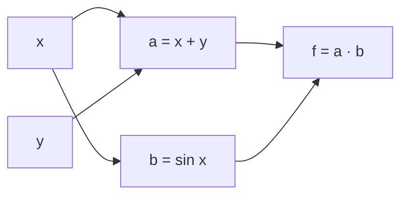

#### Les deux modes de l'autodiff

Il existe deux facons de propager les derivees dans ce graphe, et le choix entre les deux est une affaire de **dimensions** — c'est l'idee la plus rentable de tout le chapitre.

> **Mode direct (forward mode).** On propage les derivees **de l'entree vers la sortie**, dans le sens du calcul. On choisit une direction d'entree et on calcule comment elle se propage. Cout proportionnel au **nombre d'entrees** $n$. Efficace quand $n$ est petit et $m$ grand.

> **Mode inverse (reverse mode = retropropagation).** On fait d'abord le calcul vers l'avant (forward pass) en memorisant les valeurs, puis on propage les derivees **de la sortie vers l'entree** (backward pass). Cout proportionnel au **nombre de sorties** $m$. Efficace quand $m$ est petit et $n$ grand.

> **Pourquoi le deep learning utilise le mode inverse.** En apprentissage, la perte $L$ est **un seul scalaire** ($m=1$) qui depend de **millions de parametres** ($n$ enorme). Le mode inverse calcule alors **tous** les gradients $\partial L/\partial \theta$ en **un seul** passage arriere, pour un cout comparable a celui d'un passage avant. Le mode direct demanderait de l'ordre de $n$ passages : impensable. C'est toute la raison d'etre de la retropropagation.

> **Le symbole $\theta$ (theta).** Cette lettre grecque designe par convention **l'ensemble des parametres** d'un modele (tous les poids et biais empiles). Ecrire $\partial L/\partial\theta$ veut dire « le gradient de la perte par rapport a tous les parametres a la fois » — c'est le vecteur, potentiellement gigantesque, que la retropropagation calcule en un seul passage.

> **Le symbole $\bar{v}$ (« adjoint » ou « cotangente »).** La barre au-dessus d'une variable, $\bar{v} = \frac{\partial L}{\partial v}$, represente la **sensibilite de la perte finale a cette variable intermediaire** : « si je bouge $v$ d'un poil, de combien bouge la perte $L$ ? ». On l'appelle l'adjoint. La retropropagation consiste a calculer tous les adjoints, de la sortie vers l'entree.

#### La regle locale de la retropropagation

Le principe est d'une simplicite remarquable. A chaque noeud, on recoit l'adjoint de la sortie et on le **multiplie par la derivee locale** pour obtenir l'adjoint de l'entree (regle de la chaine, jacobienne transposee) :
```math
\bar{\mathbf{x}} = J^\top\,\bar{\mathbf{y}} \qquad\text{(pour un noeud } \mathbf{y} = \text{op}(\mathbf{x})\text{)}.
```
Lorsqu'une variable alimente plusieurs noeuds, ses contributions **s'additionnent** (regle de la chaine multivariee : toutes les branches comptent).

#### Exemple chiffre deroule pas a pas

Calculons $f(x,y)=(x+y)\sin(x)$ et ses derivees en $(x,y)=(1,2)$ par le mode inverse.

**Passage avant (forward).**
```math
a = x+y = 3,\qquad b = \sin(x) = \sin(1) \approx 0,8415,\qquad f = a\cdot b \approx 2,5244.
```

**Passage arriere (backward).** On part de $\bar{f} = \dfrac{\partial f}{\partial f} = 1$ et on remonte.

| Etape | Regle locale | Calcul | Resultat |
|---|---|---|---|
| Adjoint de $a$ | $\bar a = \bar f\cdot b$ | $1 \times 0,8415$ | $0,8415$ |
| Adjoint de $b$ | $\bar b = \bar f\cdot a$ | $1 \times 3$ | $3$ |
| Via $a=x+y$ | $\bar x \mathrel{+}= \bar a\cdot 1$, $\bar y \mathrel{+}= \bar a\cdot 1$ | — | $\bar y = 0,8415$ |
| Via $b=\sin x$ | $\bar x \mathrel{+}= \bar b\cdot\cos x$ | $0,8415 + 3\cos(1)$ | $\bar x \approx 2,4624$ |

> **Le symbole $\mathrel{+}=$ (accumulation).** Repris de la programmation, $\bar x \mathrel{+}= \delta$ se lit « ajoute $\delta$ a la valeur courante de $\bar x$ ». On l'emploie ici parce que $x$ alimente **deux** branches ($a=x+y$ et $b=\sin x$) : chaque branche apporte sa contribution, et on les **cumule**. C'est la traduction concrete du « toutes les branches comptent ».

Verification analytique : $\frac{\partial f}{\partial x} = \sin x + (x+y)\cos x = 0,8415 + 3\times 0,5403 = 2,4624$ et $\frac{\partial f}{\partial y} = \sin x = 0,8415$. Concordance parfaite.

#### Implementation pedagogique d'un mini-autodiff

Voici un moteur de differentiation automatique en mode inverse, en quelques lignes, dans l'esprit de PyTorch.

```python
import math

class Var:
    def __init__(self, value, parents=(), local_grads=()):
        self.value = value
        self.parents = parents          # variables d'entree
        self.local_grads = local_grads  # derivees locales d/d(parent)
        self.grad = 0.0

    def __add__(self, other):
        return Var(self.value + other.value, (self, other), (1.0, 1.0))

    def __mul__(self, other):
        return Var(self.value * other.value, (self, other),
                   (other.value, self.value))

def vsin(v):
    return Var(math.sin(v.value), (v,), (math.cos(v.value),))

def backward(node):
    node.grad = 1.0
    topo, seen = [], set()
    def build(n):
        if n not in seen:
            seen.add(n)
            for p in n.parents: build(p)
            topo.append(n)
    build(node)
    for n in reversed(topo):
        for parent, local in zip(n.parents, n.local_grads):
            parent.grad += n.grad * local   # accumulation (chaine multivariee)

x = Var(1.0); y = Var(2.0)
f = (x + y) * vsin(x)
backward(f)
print("f  =", f.value)      # 2.5244...
print("df/dx =", x.grad)    # 2.4624...
print("df/dy =", y.grad)    # 0.8415...
```

> **Les cadres modernes d'autodiff.** Ils reposent tous sur le mode inverse : **PyTorch** construit le graphe dynamiquement a l'execution (define-by-run), tandis que **JAX** compose des transformations fonctionnelles (`grad`, `jacfwd`, `jacrev`, `vjp`, `jvp`, `vmap`) et compile via XLA. `jacfwd` implemente le mode direct (produit jacobienne-vecteur, JVP), `jacrev` le mode inverse (produit vecteur-jacobienne, VJP). Pour une fonction $\mathbb{R}^n\to\mathbb{R}^m$, on choisit `jacfwd` si $n<m$, `jacrev` si $n>m$. Les optimiseurs **Adam** et **AdamW** (decouplage de la regularisation $L_2$) sont le standard de fait pour entrainer les grands modeles, mais ils consomment tous, en interne, exactement les gradients fournis par cette retropropagation.

> **Piege (memoire du passage avant).** Le mode inverse doit **memoriser toutes les valeurs intermediaires** du passage avant pour calculer les derivees locales au retour. C'est pourquoi l'entrainement consomme beaucoup de memoire. Les techniques de *gradient checkpointing* (recalculer certaines activations au lieu de les stocker) echangent du temps de calcul contre de la memoire — indispensables pour les tres grands modeles.

---

### Dérivées d'ordre supérieur

On peut deriver une derivee. Ces derivees secondes mesurent la **courbure** et sont indispensables pour comprendre la nature des points critiques et concevoir des methodes d'optimisation rapides.

#### L'intuition : la courbure, c'est la derivee de la pente

La derivee premiere donne la pente. La **derivee seconde** donne la facon dont la pente **change** : c'est la courbure. Sur une route, la derivee premiere c'est votre vitesse, la derivee seconde votre acceleration. Une derivee seconde positive signifie « ca se creuse vers le haut » (convexe, en forme de bol), negative « ca bombe » (concave, en forme de dome).

> **Le symbole $f''(x)$ et $\frac{\partial^2 f}{\partial x_i \partial x_j}$.** Le double prime $''$ signifie « la derivee de la derivee ». De meme $\frac{\partial^2 f}{\partial x_i\partial x_j}$ veut dire : derive d'abord par rapport a $x_j$, puis derive le resultat par rapport a $x_i$. Le petit $2$ indique « deux fois ». C'est la « variation de la variation ».

#### La matrice hessienne

En plusieurs variables, toutes les derivees secondes se rangent dans une matrice : la **hessienne** (Hessian).

> **Definition (matrice hessienne).** Pour $f : \mathbb{R}^n \to \mathbb{R}$ deux fois differentiable, la **hessienne** est la matrice $n\times n$ des derivees partielles secondes :
> ```math
> H_f(\mathbf{x}) = \nabla^2 f(\mathbf{x}) = \begin{bmatrix} \dfrac{\partial^2 f}{\partial x_1^2} & \cdots & \dfrac{\partial^2 f}{\partial x_1 \partial x_n} \\[2mm] \vdots & \ddots & \vdots \\[1mm] \dfrac{\partial^2 f}{\partial x_n \partial x_1} & \cdots & \dfrac{\partial^2 f}{\partial x_n^2} \end{bmatrix}.
> ```
> C'est la jacobienne du champ de gradient $\nabla f : \mathbb{R}^n \to \mathbb{R}^n$.

> **Le symbole $H_f$ (ou $\nabla^2 f$).** Ce symbole represente le **tableau des courbures dans toutes les directions et leurs couplages**. La case $(i,j)$ dit comment la pente selon $x_i$ change quand on bouge selon $x_j$. Imaginez une selle de cheval : ca monte dans un sens, ca descend dans l'autre — la hessienne capture exactement ce melange de courbures. Le $\nabla^2$ (« nabla carre ») rappelle qu'on a derive deux fois.

> **Theoreme de Schwarz (symetrie de la hessienne).** Si $f$ est de classe $\mathcal{C}^2$ (derivees secondes continues) au voisinage de $\mathbf{x}$, alors l'ordre de derivation est indifferent :
> ```math
> \frac{\partial^2 f}{\partial x_i \partial x_j} = \frac{\partial^2 f}{\partial x_j \partial x_i},
> ```
> donc **la hessienne est symetrique** : $H_f = H_f^\top$. En pratique (fonctions $\mathcal{C}^2$ usuelles) on s'appuie toujours sur cette symetrie.

#### Exemple chiffre deroule pas a pas

Soit $f(x,y) = x^3 + 2x y^2 - y^3$. Calculons gradient puis hessienne.

Gradient :
```math
\nabla f = \begin{bmatrix} 3x^2 + 2y^2 \\ 4xy - 3y^2 \end{bmatrix}.
```
Derivees secondes :
```math
f_{xx} = 6x,\quad f_{yy} = 4x - 6y,\quad f_{xy} = f_{yx} = 4y.
```
La symetrie $f_{xy}=f_{yx}=4y$ illustre le theoreme de Schwarz. D'ou la hessienne et son evaluation en $(1,1)$ :
```math
H_f(x,y) = \begin{bmatrix} 6x & 4y \\ 4y & 4x - 6y \end{bmatrix}, \qquad H_f(1,1) = \begin{bmatrix} 6 & 4 \\ 4 & -2 \end{bmatrix}.
```

#### Classification des points critiques

La hessienne sert a determiner la nature d'un **point critique** (ou $\nabla f = \mathbf{0}$), via le signe de ses valeurs propres (vues au chapitre 4).

| Hessienne en un point critique | Valeurs propres | Nature du point |
|---|---|---|
| Definie positive | toutes $>0$ | minimum local (bol) |
| Definie negative | toutes $<0$ | maximum local (dome) |
| Indefinie | signes mixtes | point-selle (saddle point) |
| Semi-definie (degeneree) | une valeur propre $=0$ | indecis (test non concluant) |

> **Rappel (definie positive).** Une matrice symetrique $A$ est definie positive si $\mathbf{v}^\top A \mathbf{v} > 0$ pour tout $\mathbf{v}\neq\mathbf{0}$, ce qui equivaut a « toutes ses valeurs propres sont strictement positives » (chapitre 4). Geometriquement, la fonction se creuse vers le haut dans **toutes** les directions : c'est bien un fond de vallee.

Pour notre exemple en $(1,1)$, le gradient n'y est pas nul, donc $(1,1)$ n'est pas un point critique ; mais le signe du determinant de la hessienne y est instructif : $\det H_f(1,1) = 6\times(-2) - 4\times 4 = -28 < 0$, ce qui signale des valeurs propres de signes opposes (la hessienne y est indefinie). En un point critique presentant cette signature, on aurait affaire a un **point-selle**.

> **Mise a jour de perspective.** En grande dimension, les points critiques d'un reseau profond sont **massivement des points-selles** plutot que des minima locaux (resultat majeur de la theorie de l'optimisation non convexe). C'est rassurant : la descente de gradient stochastique s'echappe des selles, et la plupart des minima atteints ont des valeurs de perte comparables. La hessienne complete ($n\times n$ avec $n$ en milliards) n'est jamais formee ; on accede a ses effets via des **produits hessienne-vecteur** $H\mathbf{v}$ calcules par autodiff (astuce de Pearlmutter : un VJP du gradient), au coeur des methodes de Newton tronquees, de Gauss-Newton et du calcul de courbure (K-FAC).

#### Application machine learning : la methode de Newton

La descente de gradient ignore la courbure. La **methode de Newton** l'exploite pour converger bien plus vite, en resolvant a chaque pas un modele quadratique local :
```math
\mathbf{x}_{t+1} = \mathbf{x}_t - H_f(\mathbf{x}_t)^{-1}\,\nabla f(\mathbf{x}_t).
```
Intuition : au lieu de descendre « a l'aveugle » dans le sens de la pente, on tient compte de la forme du bol pour viser directement son fond. Sur une fonction quadratique a hessienne definie positive, Newton trouve le minimum en **une seule** iteration.

```python
import numpy as np

def f(v):     x, y = v; return (x - 1)**2 + 2*(y + 2)**2
def grad(v):  x, y = v; return np.array([2*(x-1), 4*(y+2)])
def hess(v):  return np.array([[2.0, 0.0], [0.0, 4.0]])

v = np.array([5.0, 5.0])
v = v - np.linalg.solve(hess(v), grad(v))   # un seul pas de Newton
print("minimum :", v)                        # [ 1. -2.]  (exact)
```

---

### Linéarisation et séries de Taylor multivariées

Nous bouclons le chapitre avec l'outil qui relie tout : l'approximation d'une fonction compliquee par des polynomes simples. C'est le fondement de la linearisation, des methodes d'optimisation et de l'analyse de sensibilite.

#### L'intuition : remplacer une courbe par sa tangente

Pres d'un point, toute fonction reguliere « ressemble » a une droite (sa tangente), puis, si l'on veut plus de precision, a une parabole, puis a un polynome de degre croissant. La **serie de Taylor** est la recette systematique pour construire ces approximations polynomiales de mieux en mieux ajustees.

#### Taylor en une variable

> **Theoreme (formule de Taylor, une variable).** Si $f$ est $n+1$ fois derivable autour de $a$, alors pour $x$ proche de $a$ :
> ```math
> f(x) = f(a) + f'(a)(x-a) + \frac{f''(a)}{2!}(x-a)^2 + \dots + \frac{f^{(n)}(a)}{n!}(x-a)^n + R_n(x),
> ```
> ou le reste de Lagrange vaut $R_n(x) = \dfrac{f^{(n+1)}(\xi)}{(n+1)!}(x-a)^{n+1}$ pour un certain $\xi$ entre $a$ et $x$.

> **Le symbole $n!$ (factorielle).** Le point d'exclamation represente la **factorielle** : le produit de tous les entiers de 1 a $n$, soit $n! = 1\times 2\times \dots\times n$. Par exemple $4! = 24$. Pensez au nombre de facons de ranger $n$ livres sur une etagere. Il apparait au denominateur pour « compenser » les derivees repetees. Convention utile ici : $0! = 1$ (et $1!=1$), ce qui fait que le tout premier terme $f(a)$ s'ecrit aussi $\tfrac{f(a)}{0!}(x-a)^0$.

> **Le symbole $f^{(n)}$ et $\xi$.** L'exposant $(n)$ entre parentheses signifie « la derivee $n$-ieme » (on derive $n$ fois de suite) — pratique quand mettre $n$ primes serait illisible. La lettre grecque $\xi$ (« xi ») designe un point **inconnu mais existant** situe quelque part entre $a$ et $x$ : on ne sait pas lequel, mais le theoreme garantit qu'il y en a un.

#### Taylor multivarie

En plusieurs variables, le gradient joue le role de $f'$ et la hessienne celui de $f''$.

> **Theoreme (Taylor a l'ordre 2, multivarie).** Pour $f : \mathbb{R}^n \to \mathbb{R}$ de classe $\mathcal{C}^2$ et un deplacement $\mathbf{h}$ petit :
> ```math
> f(\mathbf{x}+\mathbf{h}) = f(\mathbf{x}) + \nabla f(\mathbf{x})^\top \mathbf{h} + \tfrac{1}{2}\,\mathbf{h}^\top H_f(\mathbf{x})\,\mathbf{h} + o(\|\mathbf{h}\|^2).
> ```

Decortiquons les trois termes, c'est toute l'analyse locale d'une fonction :
- **Ordre 0** : $f(\mathbf{x})$, la valeur au point (la hauteur de depart).
- **Ordre 1** : $\nabla f(\mathbf{x})^\top \mathbf{h}$, le plan tangent (la pente). C'est la **linearisation**, base de tout.
- **Ordre 2** : $\tfrac{1}{2}\mathbf{h}^\top H_f \mathbf{h}$, la correction de courbure (le bol ou la selle).

> **Le terme $\mathbf{h}^\top H \mathbf{h}$ (forme quadratique).** Cette expression « sandwich » (un vecteur, une matrice, le meme vecteur) produit un seul nombre qui mesure la **courbure ressentie dans la direction $\mathbf{h}$**. Si elle est positive quelle que soit $\mathbf{h}$, on est dans un bol (hessienne definie positive) ; si elle change de signe, on est sur une selle. C'est le pont entre la hessienne (objet abstrait) et la forme concrete de la surface.

#### Exemple chiffre deroule pas a pas

Approximons $f(x,y) = e^{x}\cos(y)$ autour de $(0,0)$ a l'ordre 2.

Valeur et gradient en $(0,0)$ :
```math
f(0,0) = 1,\qquad \nabla f = \begin{bmatrix} e^x\cos y \\ -e^x\sin y \end{bmatrix}_{(0,0)} = \begin{bmatrix} 1 \\ 0 \end{bmatrix}.
```
Hessienne en $(0,0)$ :
```math
H_f = \begin{bmatrix} e^x\cos y & -e^x\sin y \\ -e^x\sin y & -e^x\cos y \end{bmatrix}_{(0,0)} = \begin{bmatrix} 1 & 0 \\ 0 & -1 \end{bmatrix}.
```
L'approximation a l'ordre 2 avec $\mathbf{h}=(x,y)$ s'ecrit donc :
```math
f(x,y) \approx 1 + x + \tfrac{1}{2}\big(x^2 - y^2\big).
```
Verifions en $(0,1;\,0,1)$ : approximation $= 1 + 0,1 + \tfrac{1}{2}(0,01-0,01) = 1,1$ ; valeur exacte $e^{0,1}\cos(0,1) \approx 1,1052\times 0,9950 \approx 1,0997$. Erreur de l'ordre de $3\times10^{-4}$, conforme a un reste en $o(\|\mathbf{h}\|^2)$.

```python
import numpy as np

def f(x, y): return np.exp(x) * np.cos(y)
def taylor2(x, y): return 1 + x + 0.5 * (x**2 - y**2)

for (x, y) in [(0.1, 0.1), (0.2, -0.1), (0.05, 0.3)]:
    exact = f(x, y); approx = taylor2(x, y)
    print(f"({x},{y}) exact={exact:.5f} taylor2={approx:.5f} err={abs(exact-approx):.2e}")
```

#### Application machine learning : d'ou viennent les algorithmes

La serie de Taylor **engendre** les algorithmes d'optimisation, selon l'ordre auquel on s'arrete.

| Modele local minimise | Resultat |
|---|---|
| Ordre 1 + pas borne $\|\mathbf{h}\|\le \eta$ | **Descente de gradient** : $\mathbf{h} \propto -\nabla f$ |
| Ordre 2 (modele quadratique complet) | **Methode de Newton** : $\mathbf{h} = -H^{-1}\nabla f$ |
| Ordre 2 approche (Gauss-Newton, L-BFGS) | quasi-Newton, courbure approximee |

> **Le symbole $\propto$ (proportionnel a).** Ce symbole se lit « est proportionnel a » : $\mathbf{h} \propto -\nabla f$ signifie « $\mathbf{h}$ pointe dans la direction de $-\nabla f$, a un facteur d'echelle positif pres » (ici le pas $\eta$). On l'emploie quand seule la **direction** importe, pas la longueur exacte.

Minimiser le modele de Taylor d'ordre 2 $\;q(\mathbf{h}) = f + \nabla f^\top\mathbf{h} + \tfrac12\mathbf{h}^\top H\mathbf{h}\;$ en annulant son gradient $\nabla_{\mathbf{h}} q = \nabla f + H\mathbf{h} = \mathbf{0}$ redonne **exactement** le pas de Newton $\mathbf{h} = -H^{-1}\nabla f$ (lorsque $H$ est inversible). Ainsi, toute l'optimisation differentiable n'est qu'un jeu sur l'ordre de troncature de Taylor.

> **La linearisation comme outil d'analyse.** Elle reste centrale pour comprendre les reseaux profonds : la theorie du **noyau tangent neuronal** (Neural Tangent Kernel, NTK) montre qu'un reseau tres large se comporte, pendant l'entrainement, comme son developpement de Taylor au premier ordre (en ses parametres) autour de l'initialisation — un modele lineaire en ses parametres. Cette idee a debloque une partie de la theorie de la generalisation des grands modeles, en reliant l'apprentissage profond a la regression a noyau (kernel regression), un terrain mathematiquement bien compris.

---

### Exercices

#### Exercice 1 — Derivee par la definition

Calculer, **par la definition** (limite du taux d'accroissement), la derivee de $f(x) = \frac{1}{x}$ en un point $x \neq 0$.

> **Corrige.** Formons le taux d'accroissement :
> ```math
> \frac{f(x+h)-f(x)}{h} = \frac{\frac{1}{x+h}-\frac{1}{x}}{h} = \frac{1}{h}\cdot\frac{x-(x+h)}{x(x+h)} = \frac{1}{h}\cdot\frac{-h}{x(x+h)} = \frac{-1}{x(x+h)}.
> ```
> En faisant $h\to 0$ : $f'(x) = \dfrac{-1}{x\cdot x} = -\dfrac{1}{x^2}$. Conforme au formulaire ($x^{-1} \to -x^{-2}$). $\blacksquare$

#### Exercice 2 — Regle de la chaine

Soit $h(x) = \ln\big(1 + e^{2x}\big)$ (la fonction « softplus » mise a l'echelle, omnipresente en deep learning). Calculer $h'(x)$ et montrer que $h'(x) = 2\,\sigma(2x)$ avec $\sigma$ la sigmoide.

> **Corrige.** Posons $g(x)=1+e^{2x}$, donc $g'(x) = 2e^{2x}$, et $f(u)=\ln u$ avec $f'(u)=1/u$. La chaine donne :
> ```math
> h'(x) = \frac{1}{1+e^{2x}}\cdot 2e^{2x} = \frac{2e^{2x}}{1+e^{2x}}.
> ```
> Divisons haut et bas par $e^{2x}$ : $h'(x) = \dfrac{2}{e^{-2x}+1} = 2\,\sigma(2x)$. La derivee de la softplus est bien un multiple de la sigmoide. $\blacksquare$

#### Exercice 3 — Gradient et hessienne d'une forme quadratique

Soit $f(\mathbf{x}) = \tfrac{1}{2}\mathbf{x}^\top A\mathbf{x} - \mathbf{b}^\top\mathbf{x}$ avec $A$ symetrique definie positive. Calculer $\nabla f$ et $H_f$, puis le minimiseur.

> **Corrige.** Par les identites (3) et (1), et comme $A=A^\top$ :
> ```math
> \nabla f(\mathbf{x}) = \tfrac{1}{2}(A+A^\top)\mathbf{x} - \mathbf{b} = A\mathbf{x} - \mathbf{b}, \qquad H_f = A.
> ```
> Le point critique annule le gradient : $A\mathbf{x}^\star = \mathbf{b}$, soit $\mathbf{x}^\star = A^{-1}\mathbf{b}$. Comme $H_f = A$ est definie positive, c'est bien un **minimum global** (la fonction est strictement convexe). C'est le probleme resolu en une iteration par la methode de Newton. $\blacksquare$

#### Exercice 4 — Jacobienne d'une composition

Soit $\mathbf{g}(x_1,x_2) = (x_1 x_2,\; x_1 + x_2)$ et $\mathbf{f}(u_1,u_2) = (u_1^2,\; u_1 u_2)$. Calculer la jacobienne de $\mathbf{h}=\mathbf{f}\circ\mathbf{g}$ en $(1,2)$ par la regle de la chaine, puis verifier par calcul direct.

> **Corrige.** Jacobiennes :
> ```math
> J_{\mathbf{g}}(x_1,x_2) = \begin{bmatrix} x_2 & x_1 \\ 1 & 1 \end{bmatrix},\qquad J_{\mathbf{f}}(u_1,u_2) = \begin{bmatrix} 2u_1 & 0 \\ u_2 & u_1 \end{bmatrix}.
> ```
> En $(1,2)$ : $\mathbf{g}(1,2) = (2,3)$, donc $J_{\mathbf{g}}(1,2) = \begin{bmatrix}2&1\\1&1\end{bmatrix}$ et $J_{\mathbf{f}}(2,3) = \begin{bmatrix}4&0\\3&2\end{bmatrix}$. Produit :
> ```math
> J_{\mathbf{h}}(1,2) = J_{\mathbf{f}}(2,3)\,J_{\mathbf{g}}(1,2) = \begin{bmatrix}4&0\\3&2\end{bmatrix}\begin{bmatrix}2&1\\1&1\end{bmatrix} = \begin{bmatrix}8&4\\8&5\end{bmatrix}.
> ```
> **Verification directe** : $\mathbf{h}(x_1,x_2) = \big((x_1x_2)^2,\; (x_1x_2)(x_1+x_2)\big)$, soit $h_2 = x_1^2 x_2 + x_1 x_2^2$. On a $\partial h_1/\partial x_1 = 2x_1 x_2^2 = 8$, $\partial h_1/\partial x_2 = 2x_1^2 x_2 = 4$, $\partial h_2/\partial x_1 = 2x_1x_2 + x_2^2 = 4+4 = 8$, $\partial h_2/\partial x_2 = x_1^2 + 2x_1x_2 = 1+4 = 5$. On retrouve $\begin{bmatrix}8&4\\8&5\end{bmatrix}$. $\blacksquare$

#### Exercice 5 — Retropropagation a la main

Pour $f(x,y,z) = (x+y)\cdot z$ en $(x,y,z) = (-2, 5, -4)$, effectuer le passage avant puis le passage arriere, et donner $\bar x, \bar y, \bar z$.

> **Corrige.** **Avant** : $q = x+y = 3$, puis $f = q\cdot z = 3\times(-4) = -12$.
> **Arriere**, depuis $\bar f = 1$ :
> ```math
> \bar q = \bar f\cdot z = 1\times(-4) = -4,\qquad \bar z = \bar f\cdot q = 1\times 3 = 3.
> ```
> Puis via $q = x+y$ (derivee locale $1$ pour chacun) :
> ```math
> \bar x = \bar q\cdot 1 = -4,\qquad \bar y = \bar q\cdot 1 = -4.
> ```
> Donc $\nabla f = (\bar x,\bar y,\bar z) = (-4,-4,3)$. Verification : $\partial f/\partial x = z = -4$, $\partial f/\partial y = z = -4$, $\partial f/\partial z = x+y = 3$. Concordance. $\blacksquare$

#### Exercice 6 — Taylor et nature d'un point critique

Soit $f(x,y) = x^2 + xy + y^2 - 3x$. Trouver le point critique, ecrire le developpement de Taylor a l'ordre 2 autour de ce point, et conclure sur sa nature.

> **Corrige.** Gradient : $\nabla f = \big(2x + y - 3,\; x + 2y\big)$. On l'annule :
> ```math
> \begin{cases} 2x + y = 3 \\ x + 2y = 0 \end{cases} \;\Rightarrow\; x = 2,\; y = -1.
> ```
> Hessienne (constante ici) : $H_f = \begin{bmatrix}2 & 1\\ 1 & 2\end{bmatrix}$. Ses valeurs propres sont $\lambda = 2\pm 1$, soit $1$ et $3$, toutes deux $>0$ : $H_f$ est **definie positive**. Le developpement de Taylor a l'ordre 2 autour de $(2,-1)$, avec $\mathbf{h}=(h_1, h_2)=(x-2, y+1)$ et $f(2,-1) = 4 - 2 + 1 - 6 = -3$, est :
> ```math
> f(2+h_1,-1+h_2) = -3 + \tfrac{1}{2}\big(2h_1^2 + 2h_1 h_2 + 2h_2^2\big) = -3 + h_1^2 + h_1 h_2 + h_2^2.
> ```
> (Le terme d'ordre 1 est nul puisqu'on developpe en un point critique, et le reste est exactement nul car $f$ est un polynome de degre 2.) Comme la hessienne est definie positive, $(2,-1)$ est un **minimum global**, de valeur $-3$. $\blacksquare$

#### Exercice 7 — Gradient matriciel

Demontrer que $\nabla_W\,\mathrm{tr}(AWB) = A^\top B^\top$, puis en deduire $\nabla_W\,\|XW - Y\|_F^2$.

> **Corrige.** **Partie 1.** Par linearite de la trace, $\mathrm{d}\,\mathrm{tr}(AWB) = \mathrm{tr}(A\,\mathrm{d}W\,B) = \mathrm{tr}(BA\,\mathrm{d}W)$ (permutation circulaire). Or la forme canonique est $\mathrm{d}y = \mathrm{tr}(G^\top \mathrm{d}W)$ avec $G = \nabla_W y$ ; ici $G^\top = BA$, donc $G = (BA)^\top = A^\top B^\top$. $\blacksquare$
>
> **Partie 2.** Posons $R = XW - Y$. Alors $\|R\|_F^2 = \mathrm{tr}(R^\top R)$ et
> ```math
> \mathrm{d}\,\|R\|_F^2 = 2\mathrm{tr}(R^\top \mathrm{d}R) = 2\mathrm{tr}(R^\top X\,\mathrm{d}W) = \mathrm{tr}\!\big((2X^\top R)^\top \mathrm{d}W\big).
> ```
> Donc $\nabla_W\,\|XW-Y\|_F^2 = 2X^\top(XW - Y)$. C'est la version matricielle des equations normales, et **exactement** le gradient utilise pour entrainer une couche lineaire par descente de gradient. $\blacksquare$

#### Exercice 8 — Implementation : verifier un gradient par autodiff

Ecrire un test qui compare le gradient analytique de la regression logistique a une approximation par differences finies.

> **Corrige.**
> ```python
> import numpy as np
>
> def sigmoid(z): return 1.0 / (1.0 + np.exp(-z))
> def loss(w, X, y):
>     p = sigmoid(X @ w)
>     eps = 1e-12
>     return -np.mean(y*np.log(p+eps) + (1-y)*np.log(1-p+eps))
> def grad_analytique(w, X, y):
>     return X.T @ (sigmoid(X @ w) - y) / len(y)
>
> rng = np.random.default_rng(0)
> X = rng.normal(size=(20, 4)); y = (rng.random(20) > 0.5).astype(float)
> w = rng.normal(size=4)
>
> g_ana = grad_analytique(w, X, y)
> g_num = np.zeros_like(w)
> h = 1e-6
> for i in range(len(w)):
>     e = np.zeros_like(w); e[i] = h
>     g_num[i] = (loss(w+e, X, y) - loss(w-e, X, y)) / (2*h)
>
> print("ecart max :", np.max(np.abs(g_ana - g_num)))   # ~1e-9, validation OK
> ```
> L'ecart de l'ordre de $10^{-9}$ confirme que la formule $\nabla_{\mathbf{w}}L = \tfrac{1}{N}X^\top(\sigma(X\mathbf{w}) - \mathbf{y})$ est correcte. C'est exactement le principe du `gradcheck` utilise pour valider les couches personnalisees avant de faire confiance a l'autodiff.

[↑ Retour à la table des matières](#table-des-matières)

## 6. Probabilités et distributions

### Construction d'un espace probabilisé

#### L'intuition : mesurer notre ignorance

Avant toute formule, posons l'image fondatrice. Une probabilite, ce n'est pas une propriete mysterieuse cachee dans les objets : c'est une maniere de **mesurer notre ignorance** ou la frequence avec laquelle quelque chose se produit. Quand on dit « cette piece a une chance sur deux de tomber sur pile », on resume en un nombre, $\tfrac{1}{2}$, toute notre incertitude sur le resultat d'un lancer que l'on n'a pas encore vu.

L'analogie la plus utile pour tout le chapitre est celle du **gateau decoupe**. Imaginez un gateau entier qui represente « tout ce qui peut arriver ». On le coupe en parts. Chaque part represente un evenement possible. La taille d'une part — sa fraction du gateau total — c'est sa probabilite. Le gateau entier vaut $1$ (c'est-a-dire $100\%$). Une part ne peut pas etre negative (on ne peut pas avoir « moins que rien » de gateau) et la somme de toutes les parts redonne exactement le gateau entier. Ces trois idees enfantines — total egal a un, jamais negatif, les parts s'additionnent — sont **exactement** les trois axiomes de Kolmogorov que nous allons formaliser.

#### Les trois ingredients : $\Omega$, $\mathcal{F}$, $P$

Un **espace probabilise (probability space)** est un triplet $(\Omega, \mathcal{F}, P)$. Examinons chaque ingredient.

> **Le symbole $\Omega$ (omega majuscule).** Ce symbole represente **l'ensemble de tout ce qui peut arriver**. C'est notre gateau entier avant decoupe. Pense a une grande boite qui contient, ecrits sur des petits papiers, absolument tous les resultats imaginables de l'experience. Pour un lancer de de, $\Omega = \{1,2,3,4,5,6\}$ : la boite contient six papiers. On l'appelle l'**univers** ou l'**espace des resultats**. Un element de cette boite, un resultat individuel, se note souvent $\omega$ (omega minuscule) : c'est **un** papier tire de la boite.

> **Le symbole $\mathcal{F}$ (F calligraphie).** Ce symbole represente **la liste de toutes les questions auxquelles on s'autorise a repondre par une probabilite**. Chaque « question » est en fait un sous-ensemble de $\Omega$, appele **evenement (event)**. Par exemple « le de est pair » correspond au sous-ensemble $\{2,4,6\}$. Pense a $\mathcal{F}$ comme au **menu d'un restaurant** : il ne liste pas des resultats bruts, mais des regroupements (des plats composes) sur lesquels on peut mettre un prix (une probabilite). On exige que ce menu soit « coherent » : si on peut demander la probabilite d'un evenement, on doit pouvoir demander celle de son contraire, et celle de combinaisons.

> **Le symbole $P$.** Ce symbole represente **la regle qui attribue a chaque evenement sa taille de part de gateau**, c'est-a-dire un nombre entre $0$ et $1$. On ecrit $P(A)$ et on lit « probabilite de $A$ ». Pense a $P$ comme a une **balance** : tu lui presentes un evenement (un morceau de gateau), elle te rend son poids, et le poids total de tout le gateau est toujours exactement $1$.

Formalisons. L'objet $\mathcal{F}$ doit etre une **tribu** (ou **sigma-algebre**, en anglais $\sigma$-*algebra*) sur $\Omega$, c'est-a-dire une famille de parties de $\Omega$ verifiant :

1. $\Omega \in \mathcal{F}$ (l'evenement certain « quelque chose arrive » est dans le menu) ;
2. si $A \in \mathcal{F}$, alors son complementaire $A^{c} = \Omega \setminus A \in \mathcal{F}$ (stabilite par passage au contraire) ;
3. si $A_{1}, A_{2}, A_{3}, \dots \in \mathcal{F}$ est une suite **denombrable** d'evenements, alors leur reunion $\bigcup_{n=1}^{\infty} A_{n} \in \mathcal{F}$ (stabilite par reunion denombrable).

> **Le symbole $\bigcup$ (grande reunion).** Ce symbole represente **« on rassemble tout dans un seul sac »**. Comme la somme $\sum$ est une boucle qui additionne des nombres, $\bigcup_{n} A_{n}$ est une boucle qui jette le contenu de chaque ensemble $A_{n}$ dans un grand sac commun : un element y figure des qu'il appartient a **au moins un** des $A_{n}$. Son cousin $\bigcap$ (grande intersection) garde au contraire seulement ce qui est **dans tous** a la fois.

> **Pourquoi « denombrable » (countable) ?** Denombrable veut dire « qu'on peut compter un par un, eventuellement sans fin » : les entiers $1, 2, 3, \dots$ sont denombrables, les points d'un segment ne le sont pas. On se limite a des reunions denombrables car vouloir mesurer **tous** les sous-ensembles d'un ensemble continu mene a des contradictions (ensembles non mesurables de Vitali). La tribu est precisement l'astuce qui dit : « je ne promets de peser que les morceaux raisonnables. »

Enfin, $P : \mathcal{F} \to [0,1]$ est une **mesure de probabilite** : une application qui satisfait les **axiomes de Kolmogorov** (Andrei Kolmogorov, 1933).

> **Definition (axiomes de Kolmogorov).** Une mesure de probabilite sur $(\Omega, \mathcal{F})$ est une application $P : \mathcal{F} \to \mathbb{R}$ telle que :
> - **(A1) Positivite.** $P(A) \ge 0$ pour tout $A \in \mathcal{F}$.
> - **(A2) Normalisation.** $P(\Omega) = 1$.
> - **(A3) Sigma-additivite.** Pour toute suite $(A_{n})_{n \ge 1}$ d'evenements **deux a deux disjoints** (c.-a-d. $A_{i} \cap A_{j} = \varnothing$ si $i \ne j$),
> ```math
> P\!\left( \bigcup_{n=1}^{\infty} A_{n} \right) = \sum_{n=1}^{\infty} P(A_{n}).
> ```

Ces trois axiomes sont la traduction litterale du gateau : (A1) une part n'est jamais negative, (A2) le gateau entier vaut $1$, (A3) si on coupe le gateau en parts qui ne se chevauchent pas, le poids du morceau reconstitue est la somme des poids des parts.

> **Le symbole $\varnothing$ (ensemble vide).** Ce symbole represente **« rien du tout »**, le sac completement vide, l'evenement impossible. C'est l'assiette ou il n'y a aucune part de gateau. On verra a l'instant que $P(\varnothing) = 0$.

#### Premieres consequences (et leurs preuves)

De ces trois axiomes decoulent, par pure logique, toutes les regles de calcul usuelles. Demontrons-les : chaque etape reste elementaire.

> **Proposition (regles elementaires).** Pour tous $A, B \in \mathcal{F}$ :
> 1. $P(\varnothing) = 0$.
> 2. **Additivite finie** : si $A_{1}, \dots, A_{n}$ sont deux a deux disjoints, $P(\bigcup_{k=1}^{n} A_{k}) = \sum_{k=1}^{n} P(A_{k})$.
> 3. **Complementaire** : $P(A^{c}) = 1 - P(A)$.
> 4. **Monotonie** : si $A \subseteq B$, alors $P(A) \le P(B)$.
> 5. **Inclusion-exclusion (2 termes)** : $P(A \cup B) = P(A) + P(B) - P(A \cap B)$.

**Preuve de 1.** Prenons la suite $A_{1} = A_{2} = \dots = \varnothing$. Ces ensembles sont deux a deux disjoints (l'intersection de $\varnothing$ avec lui-meme est $\varnothing$), et leur reunion est $\varnothing$. Par (A3), $P(\varnothing) = \sum_{n=1}^{\infty} P(\varnothing)$. Notons $p = P(\varnothing) \ge 0$. L'egalite $p = \sum_{n=1}^\infty p$ n'est possible pour un reel fini que si $p = 0$ (sinon la somme diverge vers $+\infty$). Donc $P(\varnothing) = 0$. $\blacksquare$

**Preuve de 2.** Completons la liste finie en une suite infinie en posant $A_{n+1} = A_{n+2} = \dots = \varnothing$. Les ensembles restent deux a deux disjoints. Par (A3) puis par $P(\varnothing)=0$ :
```math
P\!\left( \bigcup_{k=1}^{n} A_{k} \right) = \sum_{k=1}^{\infty} P(A_{k}) = \sum_{k=1}^{n} P(A_{k}) + \sum_{k>n} 0 = \sum_{k=1}^{n} P(A_{k}). \quad \blacksquare
```

**Preuve de 3.** Les evenements $A$ et $A^{c}$ sont disjoints et leur reunion est $\Omega$. Par additivite finie (2) et normalisation (A2) : $P(A) + P(A^{c}) = P(\Omega) = 1$, d'ou $P(A^{c}) = 1 - P(A)$. $\blacksquare$

**Preuve de 4.** Si $A \subseteq B$, on decompose $B = A \cup (B \setminus A)$, reunion **disjointe**. Donc $P(B) = P(A) + P(B \setminus A) \ge P(A)$ car $P(B \setminus A) \ge 0$ par (A1). $\blacksquare$

**Preuve de 5.** On ecrit $A \cup B$ comme reunion disjointe $A \cup B = A \cup (B \setminus A)$, donc $P(A\cup B) = P(A) + P(B\setminus A)$. Par ailleurs $B = (A\cap B) \cup (B \setminus A)$, reunion disjointe, donc $P(B) = P(A\cap B) + P(B\setminus A)$, c.-a-d. $P(B\setminus A) = P(B) - P(A\cap B)$. En substituant : $P(A\cup B) = P(A) + P(B) - P(A\cap B)$. $\blacksquare$

> **Remarque (la formule du « ou »).** La regle 5 corrige un piege courant : on ne peut pas additionner betement $P(A)$ et $P(B)$ pour avoir « $A$ ou $B$ », car on compterait deux fois la zone commune $A \cap B$. On la retranche une fois. C'est exactement comme compter les eleves qui font du sport **ou** de la musique : on additionne les deux clubs, puis on enleve une fois ceux qui sont dans les deux.

#### Un exemple chiffre deroule : le de equilibre

Prenons $\Omega = \{1,2,3,4,5,6\}$, $\mathcal{F} = \mathcal{P}(\Omega)$ (toutes les parties — ici $2^{6} = 64$ evenements possibles, car chaque face est soit dedans soit dehors), et $P$ uniforme : $P(\{\omega\}) = \tfrac{1}{6}$ pour chaque face.

- Evenement $A$ = « pair » $= \{2,4,6\}$. Par additivite : $P(A) = \tfrac{1}{6}+\tfrac{1}{6}+\tfrac{1}{6} = \tfrac{3}{6} = \tfrac{1}{2}$.
- Evenement $B$ = « au moins $5$ » $= \{5,6\}$ : $P(B) = \tfrac{2}{6} = \tfrac{1}{3}$.
- $A \cap B = \{6\}$, donc $P(A\cap B) = \tfrac{1}{6}$.
- Par inclusion-exclusion : $P(A \cup B) = \tfrac{1}{2} + \tfrac{1}{3} - \tfrac{1}{6} = \tfrac{3}{6}+\tfrac{2}{6}-\tfrac{1}{6} = \tfrac{4}{6} = \tfrac{2}{3}$. Verification directe : $A \cup B = \{2,4,5,6\}$, soit $4$ faces sur $6$, bien $\tfrac{2}{3}$.

#### Variables aleatoires et loi image

En pratique, on ne s'interesse presque jamais a $\omega$ brut (le « papier tire »), mais a une **mesure numerique** qu'on en extrait : le gain d'un pari, la taille d'une personne, le pixel d'une image. C'est le role de la **variable aleatoire (random variable)**.

> **Definition (variable aleatoire reelle).** Une variable aleatoire est une application $X : \Omega \to \mathbb{R}$ qui est **mesurable**, c'est-a-dire telle que pour tout reel $x$, l'ensemble $\{\omega \in \Omega : X(\omega) \le x\}$ appartient a $\mathcal{F}$. Cette condition garantit qu'on a le droit de demander « quelle est la probabilite que $X$ soit inferieur a $x$ ? ».

> **Comment lire ce symbole $X$.** Ce symbole (en majuscule) represente **une machine a chiffres branchee sur le hasard** : on tourne la manivelle (on tire $\omega$), et la machine affiche un nombre $X(\omega)$. Le hasard est dans la manivelle ; $X$ n'est que la regle de lecture. Convention universelle : la **variable** (la machine, encore inconnue) est en MAJUSCULE $X$ ; la **valeur** observee (le chiffre affiche) est en minuscule $x$.

La probabilite $P$ vivant sur $\Omega$ se **transporte** alors sur les nombres reels via $X$. On definit la **loi (distribution)** de $X$, notee $P_{X}$, par
```math
P_{X}(B) = P\big( X^{-1}(B) \big) = P\big( \{\omega : X(\omega) \in B\} \big),
```
pour tout ensemble $B$ de reels (borelien). On la resume par la **fonction de repartition (cumulative distribution function, CDF)** :
```math
F_{X}(x) = P(X \le x).
```

> **Image mentale.** $X$ est une **moulinette** qui pousse la pate (la probabilite) depuis le moule $\Omega$ vers une assiette graduee (les reels). On oublie d'ou venait chaque gramme de pate ; il ne reste que la facon dont la pate s'etale sur la graduation. Toute la suite du chapitre — distributions discretes, continues, gaussienne — decrit **la forme de cet etalement**.

> **Mise a jour 2026.** Cette construction abstraite (mesurabilite, tribus) reste le socle exact des bibliotheques modernes de programmation probabiliste. Dans des outils comme **NumPyro**, **TensorFlow Probability** ou **Pyro**, un objet `Distribution` n'est rien d'autre qu'une loi $P_{X}$ munie de deux operations cles : `sample` (tirer un $\omega$ et renvoyer $X(\omega)$) et `log_prob` (evaluer la densite, voir section suivante). La theorie de la mesure justifie pourquoi ces deux briques suffisent a tout reconstruire, y compris la differentiation automatique a travers le tirage.

```python
import numpy as np

rng = np.random.default_rng(0)

omega = np.array([1, 2, 3, 4, 5, 6])
P = np.full(6, 1 / 6)

def proba(event_mask):
    return P[event_mask].sum()

A = np.isin(omega, [2, 4, 6])
B = np.isin(omega, [5, 6])

print(proba(A))            # 0.5
print(proba(B))            # 0.333...
print(proba(A & B))        # 0.166...  -> P(A inter B)
print(proba(A | B))        # 0.666...  -> P(A union B)

tirages = rng.choice(omega, size=1_000_000, p=P)
print((tirages % 2 == 0).mean())   # ~0.5, estimation frequentiste de P(A)
```

La derniere ligne illustre l'**interpretation frequentiste** : la probabilite est la limite de la frequence observee quand on repete l'experience un grand nombre de fois. C'est le pont concret entre l'axiomatique abstraite et les donnees reelles que manipule le machine learning.

---

### Probabilités discrètes et continues

Une fois la loi $P_X$ d'une variable aleatoire posee, deux grands mondes s'ouvrent selon la nature des valeurs prises : un monde **discret** (valeurs isolees, qu'on peut compter) et un monde **continu** (valeurs formant un continuum, comme tous les reels d'un intervalle). Ils se decrivent par deux objets jumeaux : la fonction de masse pour l'un, la densite pour l'autre.

#### Le cas discret : la fonction de masse

> **Definition (variable discrete et PMF).** Une variable aleatoire $X$ est **discrete** si elle ne prend qu'un nombre fini ou denombrable de valeurs $x_{1}, x_{2}, \dots$. Sa loi est entierement decrite par sa **fonction de masse (probability mass function, PMF)** :
> ```math
> p_{X}(x) = P(X = x).
> ```
> Elle verifie $p_{X}(x) \ge 0$ et $\sum_{i} p_{X}(x_{i}) = 1$.

> **Le symbole $\sum$ (somme sigma), rappel d'usage.** On l'a vu aux chapitres precedents : c'est **une boucle qui additionne**. Ici $\sum_{i} p_{X}(x_{i})$ veut dire « passe en revue chaque valeur possible $x_{i}$, prends sa probabilite, et fais le total ». Le resultat doit valoir $1$ : c'est notre gateau, redecoupe en parts comptables.

L'image est limpide : la masse de probabilite est posee en **paquets discrets** sur certains points de la droite, comme des piles de jetons de hauteurs differentes posees sur des cases. La hauteur de la pile en $x$ est $p_X(x)$ ; la somme des hauteurs fait $1$.

**Lois discretes de reference.** Voici les briques qu'on rencontre partout en pratique. (On note $\mathrm{Pois}(\lambda)$ la loi de Poisson, pour eviter toute confusion avec l'ensemble des parties $\mathcal{P}(\Omega)$ et la mesure $P$.)

| Loi | Notation | $p_X(k)$ | Support | Esperance | Variance |
|---|---|---|---|---|---|
| Bernoulli | $\mathcal{B}(p)$ | $p^{k}(1-p)^{1-k}$ | $k\in\{0,1\}$ | $p$ | $p(1-p)$ |
| Binomiale | $\mathcal{B}(n,p)$ | $\binom{n}{k}p^{k}(1-p)^{n-k}$ | $k\in\{0,\dots,n\}$ | $np$ | $np(1-p)$ |
| Geometrique | $\mathcal{G}(p)$ | $(1-p)^{k-1}p$ | $k\in\{1,2,\dots\}$ | $1/p$ | $(1-p)/p^{2}$ |
| Poisson | $\mathrm{Pois}(\lambda)$ | $e^{-\lambda}\lambda^{k}/k!$ | $k\in\{0,1,\dots\}$ | $\lambda$ | $\lambda$ |

> **Le symbole $\binom{n}{k}$ (coefficient binomial).** Ce symbole represente **le nombre de facons de choisir $k$ objets parmi $n$ sans tenir compte de l'ordre**. On le lit « $k$ parmi $n$ ». Concretement : combien d'equipes de $k$ joueurs peut-on former dans un groupe de $n$ ? Sa formule est $\binom{n}{k} = \dfrac{n!}{k!\,(n-k)!}$, ou le symbole $!$ (factorielle) signifie « multiplie tous les entiers de $1$ jusqu'a ce nombre » : $4! = 1\times2\times3\times4 = 24$. Pense a $\binom{n}{k}$ comme au nombre de combinaisons possibles d'une serrure ou l'ordre ne compte pas.

> **Exemple chiffre (binomiale).** On lance $n=3$ fois une piece equilibree ($p=\tfrac12$). Probabilite d'obtenir exactement $k=2$ piles ?
> ```math
> p_X(2) = \binom{3}{2}\left(\tfrac12\right)^{2}\left(\tfrac12\right)^{1} = 3 \times \tfrac14 \times \tfrac12 = \tfrac{3}{8} = 0{,}375.
> ```
> On le verifie a la main : les sequences a $2$ piles sont PPF, PFP, FPP, soit $3$ cas sur $2^3 = 8$ egalement probables, bien $\tfrac{3}{8}$.

#### Le cas continu : la densite

Quand $X$ prend ses valeurs dans un continuum (un poids exact en kilogrammes, un temps d'attente), un phenomene contre-intuitif apparait : la probabilite de tomber sur **une** valeur precise est **nulle**. La probabilite qu'une personne mesure exactement $1{,}750000\dots$ m est $0$, car il y a une infinite non denombrable de tailles possibles. On ne peut plus poser des jetons sur des points : la masse est **etalee comme une couche de beurre** sur la droite, et ce qui compte est son **epaisseur locale**.

> **Definition (variable continue et densite).** Une variable $X$ est **continue** (a densite, ou absolument continue) s'il existe une fonction $p_{X} \ge 0$, appelee **densite de probabilite (probability density function, PDF)**, telle que pour tout intervalle $[a,b]$ :
> ```math
> P(a \le X \le b) = \int_{a}^{b} p_{X}(x)\,\mathrm{d}x,
> ```
> avec la condition de normalisation $\displaystyle\int_{-\infty}^{+\infty} p_{X}(x)\,\mathrm{d}x = 1$.

> **Le symbole $\int$ (integrale).** Ce symbole represente **une somme continue, une boucle d'addition pour des quantites infiniment fines**. La somme $\sum$ additionne des jetons separes ; l'integrale $\int_a^b p_X(x)\,\mathrm{d}x$ additionne une infinite de tranches infiniment minces sous la courbe $p_X$, entre $a$ et $b$. Le morceau $\mathrm{d}x$ est la **largeur** d'une tranche (infiniment petite), et $p_X(x)$ sa **hauteur** : leur produit $p_X(x)\,\mathrm{d}x$ est l'aire d'une tranche, c'est-a-dire un petit bout de probabilite. L'integrale fait le total de toutes ces aires. **Retiens cette image : une probabilite continue est une aire sous une courbe.**

> **Le symbole $p(x)$ (densite).** Attention au piege central : $p_X(x)$ **n'est pas** une probabilite ! C'est une **densite**, une probabilite **par unite de longueur** (comme une densite de population : habitants par km², qui peut depasser $1$). Une densite peut tres bien valoir $5$ en un point. Ce qui est toujours entre $0$ et $1$, c'est l'**aire** $p_X(x)\,\mathrm{d}x$ sur un petit morceau, et l'aire totale qui vaut $1$. Pense a la densite comme a la **richesse du beurre** a un endroit de la tartine ; la quantite de beurre reellement mangee est l'aire (densite $\times$ largeur de la bouchee).

> **Piege classique.** En continu, $P(X = a) = \int_a^a p_X(x)\,\mathrm{d}x = 0$ pour tout point $a$. Consequence pratique : les inegalites larges et strictes donnent la meme probabilite, $P(X \le a) = P(X < a)$. C'est faux en discret, ou un point porte une masse non nulle.

#### Le pont unificateur : la fonction de repartition

La **fonction de repartition** $F_X(x) = P(X \le x)$ reconcilie les deux mondes : elle existe **toujours**, discret ou continu. Elle est croissante (au sens large), continue a droite, tend vers $0$ en $-\infty$ et vers $1$ en $+\infty$.

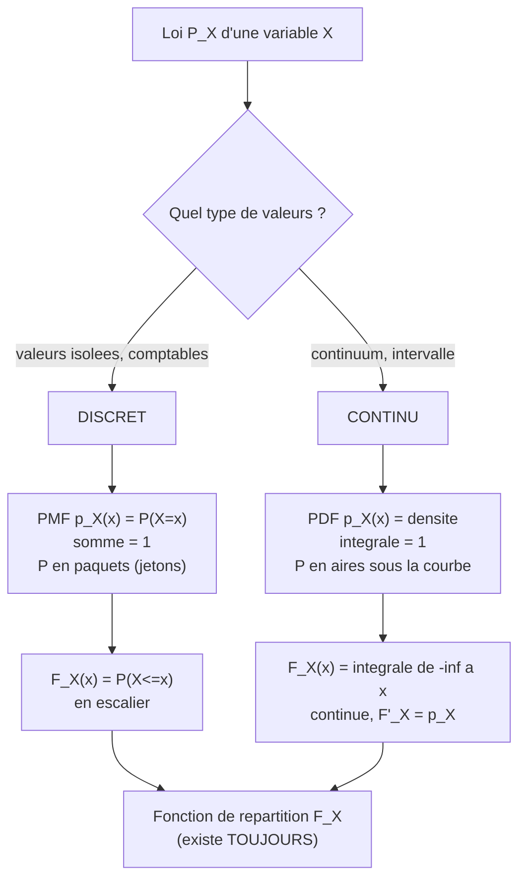

- **Discret** : $F_X$ est une fonction **en escalier**, qui saute de $p_X(x_i)$ a chaque valeur $x_i$.
- **Continu** : $F_X$ est continue et $F_X'(x) = p_X(x)$ (en tout point de continuite de $p_X$) — la densite est la **pente** de la fonction de repartition. Inversement $F_X(x) = \int_{-\infty}^x p_X(t)\,\mathrm{d}t$.

Ce lien $F_X' = p_X$ est l'analogue exact du theoreme fondamental de l'analyse : la densite mesure la vitesse a laquelle la probabilite s'accumule.

> **Application en machine learning.** La distinction discret/continu structure tout le choix de modele. Un classifieur produit une loi **discrete** sur les classes (sortie d'un *softmax*, qui est litteralement une PMF). Un modele generatif d'images ou un debruiteur produit une loi **continue** sur les pixels. La fonction de cout par excellence, la **log-vraisemblance negative (negative log-likelihood)**, s'ecrit $-\log p_X(x)$ : on y met une PMF en classification, une PDF en regression. C'est pourquoi `log_prob` est l'operation centrale des bibliotheques citees.

```python
import numpy as np
from scipy import stats

# --- Discret : binomiale B(3, 1/2) ---
k = np.arange(0, 4)
pmf = stats.binom.pmf(k, n=3, p=0.5)
print(pmf)            # [0.125 0.375 0.375 0.125]
print(pmf.sum())      # 1.0  -> normalisation

# --- Continu : loi normale standard ---
x = np.linspace(-4, 4, 100000)
pdf = stats.norm.pdf(x)            # densite, peut depasser... ici max ~0.399
aire = np.trapezoid(pdf, x)        # integrale numerique (np.trapz est deprecie depuis NumPy 2.0)
print(round(aire, 4))             # ~1.0  -> normalisation

# P(-1 <= X <= 1) comme AIRE sous la courbe
mask = (x >= -1) & (x <= 1)
print(round(np.trapezoid(pdf[mask], x[mask]), 4))   # ~0.6827 (regle des 68%)

# P(X = 0.5) en continu : nul
print(stats.norm.cdf(0.5) - stats.norm.cdf(0.5))  # 0.0
```

---

### Règle de la somme, règle du produit et théorème de Bayes

Tout l'edifice du calcul probabiliste — et, on le verra, de l'apprentissage bayesien — repose sur **deux regles** seulement, dont decoule un theoreme universel. On travaille desormais avec **plusieurs** variables a la fois, ce qui introduit les lois jointes, marginales et conditionnelles.

#### Loi jointe, loi marginale

> **Le symbole virgule dans $p(x,y)$ (loi jointe).** La virgule represente le **« ET » simultane**. La quantite $p(x,y) = P(X=x, Y=y)$ est la probabilite que $X$ vaille $x$ **et en meme temps** $Y$ vaille $y$. Image : une grille (un tableur) ou les lignes sont les valeurs de $X$, les colonnes celles de $Y$ ; $p(x,y)$ est ce qui est ecrit dans la **case** a l'intersection. La somme de toutes les cases vaut $1$.

> **Regle de la somme (sum rule / marginalisation).** Pour recuperer la loi d'une seule variable a partir de la loi jointe, on **somme sur l'autre** (on « marginalise ») :
> ```math
> p(x) = \sum_{y} p(x,y) \quad \text{(discret)}, \qquad p(x) = \int p(x,y)\,\mathrm{d}y \quad \text{(continu)}.
> ```
> $p(x)$ s'appelle la **loi marginale (marginal distribution)** de $X$.

L'image est parlante : dans le tableur, la loi marginale de $X$, c'est la colonne des **totaux de lignes**, ecrite dans la **marge** du tableau (d'ou le nom). On a aplati la dimension $Y$ en additionnant tout le long.

#### Probabilite conditionnelle, regle du produit

> **Le symbole barre $\mid$ dans $p(x \mid y)$ (conditionnement).** Cette barre verticale se lit **« sachant que »**. La quantite $p(x \mid y) = P(X = x \mid Y = y)$ est la probabilite que $X = x$ **une fois qu'on sait deja** que $Y = y$. Image : on a appris une information ($Y=y$), donc on **jette tout le reste du gateau** et on ne regarde plus que la tranche ou $Y=y$ ; on y recalcule les proportions pour que cette tranche fasse a son tour un gateau entier (de masse $1$). Conditionner, c'est **zoomer sur un sous-monde** et y renormaliser.

> **Definition (probabilite conditionnelle).** Pour $P(B) > 0$,
> ```math
> P(A \mid B) = \frac{P(A \cap B)}{P(B)}.
> ```
> Le numerateur est la part commune ; le denominateur renormalise pour que le sous-monde $B$ pese $1$.

> **Regle du produit (product rule).** En reorganisant la definition :
> ```math
> p(x, y) = p(x \mid y)\, p(y) = p(y \mid x)\, p(x).
> ```
> Lecture : la probabilite que **deux** choses arrivent = (proba de la premiere) $\times$ (proba de la seconde **sachant** la premiere).

> **Le symbole $\prod$ (produit pi).** Ce symbole represente **une boucle qui multiplie**, exactement comme $\sum$ est une boucle qui additionne. $\prod_{i=1}^{n} a_i = a_1 \times a_2 \times \dots \times a_n$. Il apparait des qu'on enchaine la regle du produit sur plusieurs variables : la **regle de chainage (chain rule)** generalise
> ```math
> p(x_1, x_2, \dots, x_n) = \prod_{i=1}^{n} p(x_i \mid x_1, \dots, x_{i-1}).
> ```
> Pense a $\prod$ comme a une chaine de probabilites : chaque maillon est conditionne par tous les precedents. C'est **exactement** la formule qu'optimise un modele de langage autoregressif (chaque mot sachant les mots precedents).

#### Le theoreme de Bayes

En combinant les deux ecritures de la regle du produit, $p(x \mid y)\,p(y) = p(y \mid x)\,p(x)$, on isole $p(x \mid y)$ et l'on obtient le resultat le plus important de tout le chapitre.

> **Theoreme (Bayes, 1763).** Pour $p(y) > 0$ :
> ```math
> \underbrace{p(x \mid y)}_{\text{posterior}} = \frac{\overbrace{p(y \mid x)}^{\text{vraisemblance}}\ \overbrace{p(x)}^{\text{prior}}}{\underbrace{p(y)}_{\text{evidence}}}, \qquad \text{avec} \quad p(y) = \sum_{x'} p(y \mid x')\,p(x').
> ```

Le denominateur $p(y)$ (l'**evidence**, ou *marginal likelihood*) se calcule par la regle de la somme appliquee au numerateur : il sert uniquement de **constante de normalisation** pour que $p(\cdot \mid y)$ soit une vraie loi sommant a $1$. D'ou la forme operationnelle qu'on retient :
```math
\text{posterior} \ \propto\ \text{vraisemblance} \times \text{prior}.
```

> **Le symbole $\propto$ (proportionnel a).** Ce symbole represente **« egal a un facteur constant pres »**. Quand on ecrit $a \propto b$, cela veut dire $a = c \cdot b$ pour une constante $c$ qu'on ne precise pas (ici, $1/p(y)$). Image : la **forme** de la distribution est donnee par le produit vraisemblance $\times$ prior ; la constante ne fait que regler l'echelle pour que l'aire totale fasse $1$. Tres pratique : on calcule la forme, on normalise a la fin.

Le vocabulaire bayesien merite d'etre ancre, car c'est la grammaire de l'apprentissage moderne.

| Terme | Notation | Sens intuitif |
|---|---|---|
| **Prior** (a priori) | $p(x)$ | Ce qu'on croit **avant** de voir la donnee |
| **Vraisemblance** (likelihood) | $p(y \mid x)$ | A quel point l'hypothese $x$ explique la donnee $y$ observee |
| **Posterior** (a posteriori) | $p(x \mid y)$ | Ce qu'on croit **apres** avoir vu la donnee |
| **Evidence** (marginal likelihood) | $p(y)$ | Probabilite globale de la donnee, toutes hypotheses confondues |

> **Exemple chiffre deroule : test medical (le piege des faux positifs).** Une maladie touche $1$ personne sur $1000$ : prior $P(M) = 0{,}001$. Le test detecte la maladie dans $99\%$ des cas si elle est presente (**sensibilite** $P(+\mid M) = 0{,}99$) ; chez les personnes saines, il se trompe dans $5\%$ des cas (**taux de faux positifs** $P(+\mid \overline M) = 0{,}05$, c'est-a-dire une **specificite** $P(-\mid\overline M) = 0{,}95$). **Question : une personne testee positive est-elle vraiment malade ?**
>
> Calculons l'evidence par la regle de la somme :
> ```math
> P(+) = P(+\mid M)P(M) + P(+\mid \overline M)P(\overline M) = 0{,}99 \times 0{,}001 + 0{,}05 \times 0{,}999 = 0{,}00099 + 0{,}04995 = 0{,}05094.
> ```
> Puis Bayes :
> ```math
> P(M \mid +) = \frac{P(+\mid M)P(M)}{P(+)} = \frac{0{,}00099}{0{,}05094} \approx 0{,}0194 \approx 1{,}9\%.
> ```
> **Resultat contre-intuitif** : malgre un test « fiable a $99\%$ », un positif n'a qu'environ $2\%$ de chances d'etre reellement malade ! La raison : la maladie est si rare que les faux positifs (sur les $999$ sains) submergent les vrais positifs (sur l'unique malade). C'est l'illustration reine de l'importance du **prior** : negliger la rarete de base (*base rate fallacy*) conduit a des conclusions absurdes.

```python
import numpy as np

P_M = 0.001
P_pos_M = 0.99        # sensibilite
P_pos_notM = 0.05     # taux de faux positifs (= 1 - specificite)

P_notM = 1 - P_M
evidence = P_pos_M * P_M + P_pos_notM * P_notM     # regle de la somme
posterior = (P_pos_M * P_M) / evidence             # Bayes
print(round(evidence, 5))     # 0.05094
print(round(posterior, 4))    # 0.0194  -> ~1.9 %
```

> **Application en machine learning.** Bayes est le moteur de l'**inference**. En apprentissage bayesien, $x$ devient le vecteur de parametres $\theta$ d'un modele et $y$ le jeu de donnees $\mathcal{D}$ : on cherche $p(\theta \mid \mathcal{D}) \propto p(\mathcal{D}\mid\theta)\,p(\theta)$, soit « mes parametres apres avoir vu les donnees ». Le **maximum a posteriori (MAP)** maximise ce posterior ; le **maximum de vraisemblance (MLE)** ignore le prior et maximise seulement $p(\mathcal D\mid\theta)$. Le classifieur **naif de Bayes** applique directement le theoreme en supposant les caracteristiques conditionnellement independantes. Et la regularisation $L_2$ (*weight decay*) n'est rien d'autre qu'un MAP avec prior gaussien sur les poids, comme on le reverra.

> **Mise a jour 2026.** L'evidence $p(y) = \int p(y\mid x)p(x)\,\mathrm{d}x$ est en general une integrale insoluble en grande dimension. Tout un pan de la recherche vise a la contourner : **inference variationnelle** (on approche le posterior par une loi simple en maximisant une borne, l'ELBO), **MCMC** modernes (NUTS, *No-U-Turn Sampler*, au coeur de Stan et NumPyro), et **flots normalisants (normalizing flows)** qui apprennent un changement de variables vers une loi simple (voir derniere section). En 2026, ces methodes, accelerees par autodiff sur GPU, rendent l'inference bayesienne praticable sur des reseaux de neurones entiers.

---

### Statistiques résumées et indépendance

Une distribution complete (PMF ou PDF) contient toute l'information, mais elle est souvent trop riche a manipuler. On la **resume** par quelques nombres cles : ou est-elle centree (esperance), a quel point est-elle etalee (variance), comment deux variables bougent-elles ensemble (covariance) ?

#### L'esperance : le centre de gravite

> **Le symbole $\mathbb{E}$ (esperance).** Ce symbole represente **la moyenne ponderee par les probabilites**, c'est-a-dire la valeur « typique » autour de laquelle la variable se balance. Image physique exacte : si on pose les masses de probabilite le long d'une regle, $\mathbb{E}[X]$ est le **point d'equilibre**, le centre de gravite ou la regle tient en equilibre sur un doigt. On le note aussi $\mu$ (mu). Ce n'est pas la valeur la plus probable, c'est la moyenne « a la longue ».

> **Definition (esperance).** Pour une variable discrete puis continue :
> ```math
> \mathbb{E}[X] = \sum_{i} x_{i}\, p_X(x_{i}) \qquad ; \qquad \mathbb{E}[X] = \int_{-\infty}^{+\infty} x\, p_X(x)\,\mathrm{d}x.
> ```
> Plus generalement, pour une fonction $g$ (**theoreme du statisticien inconscient**, *law of the unconscious statistician*) :
> ```math
> \mathbb{E}[g(X)] = \sum_i g(x_i)\,p_X(x_i) \qquad ; \qquad \mathbb{E}[g(X)] = \int g(x)\,p_X(x)\,\mathrm{d}x.
> ```

> **Propriete cle : la linearite de l'esperance.** Pour toutes variables $X, Y$ et tous reels $a, b$ :
> ```math
> \mathbb{E}[aX + bY] = a\,\mathbb{E}[X] + b\,\mathbb{E}[Y].
> ```
> **Remarquable** : cette egalite est vraie **meme si $X$ et $Y$ ne sont pas independantes**. C'est l'une des proprietes les plus puissantes et les plus utilisees de toutes les probabilites.

**Preuve (cas discret, deux variables).** Par definition et regle de la somme :
```math
\mathbb{E}[aX+bY] = \sum_{x,y}(ax+by)\,p(x,y) = a\sum_{x,y} x\,p(x,y) + b\sum_{x,y} y\,p(x,y) = a\sum_x x\,p(x) + b\sum_y y\,p(y) = a\mathbb{E}[X]+b\mathbb{E}[Y].
```
On a juste utilise la marginalisation $\sum_y p(x,y) = p(x)$. $\blacksquare$

#### La variance : la dispersion

> **Le symbole $\mathrm{Var}$ (variance).** Ce symbole represente **a quel point les valeurs s'eloignent en moyenne du centre**. On mesure l'ecart a la moyenne, on l'eleve au carre (pour que les ecarts positifs et negatifs ne s'annulent pas, et pour penaliser fort les grands ecarts), puis on en prend la moyenne. Image : si l'esperance est le centre d'une cible, la variance dit si les fleches sont **groupees** (petite variance) ou **dispersees** (grande variance). On la note aussi $\sigma^{2}$ (sigma au carre).

> **Definition (variance et ecart-type).**
> ```math
> \mathrm{Var}(X) = \mathbb{E}\big[(X - \mathbb{E}[X])^{2}\big] = \mathbb{E}[X^{2}] - \big(\mathbb{E}[X]\big)^{2}.
> ```
> Sa racine carree $\sigma_X = \sqrt{\mathrm{Var}(X)}$ est l'**ecart-type (standard deviation)**, exprime dans la **meme unite** que $X$ (d'ou son interet pratique).

**Preuve de la formule de Koenig–Huygens** $\mathrm{Var}(X) = \mathbb{E}[X^2] - \mathbb{E}[X]^2$. Posons $\mu = \mathbb{E}[X]$. En developpant le carre et par linearite :
```math
\mathbb{E}[(X-\mu)^2] = \mathbb{E}[X^2 - 2\mu X + \mu^2] = \mathbb{E}[X^2] - 2\mu\,\mathbb{E}[X] + \mu^2 = \mathbb{E}[X^2] - 2\mu^2 + \mu^2 = \mathbb{E}[X^2] - \mu^2. \quad \blacksquare
```

> **Le symbole $\sigma$ (sigma minuscule), ecart-type.** A ne pas confondre avec $\sum$ (sigma majuscule, la somme) ! Le $\sigma$ minuscule represente **la largeur typique de l'etalement** d'une distribution, dans la meme unite que les donnees. Si $X$ est une taille en cm, $\sigma$ est en cm. Image : c'est le « rayon flou » autour du centre dans lequel se trouvent la plupart des valeurs.

**Regle de transformation.** Pour des constantes $a, b$ : $\mathrm{Var}(aX + b) = a^{2}\,\mathrm{Var}(X)$. La translation $b$ ne change rien (deplacer la cible ne change pas la dispersion des fleches) ; le facteur $a$ ressort **au carre**.

> **Exemple chiffre deroule (de equilibre).** $X$ = face d'un de a six faces, $p(k) = \tfrac16$.
> Esperance : $\mathbb{E}[X] = \tfrac{1+2+3+4+5+6}{6} = \tfrac{21}{6} = 3{,}5$.
> Moment d'ordre 2 : $\mathbb{E}[X^2] = \tfrac{1+4+9+16+25+36}{6} = \tfrac{91}{6} \approx 15{,}1\overline{6}$.
> Variance : $\mathrm{Var}(X) = \tfrac{91}{6} - 3{,}5^2 = 15{,}1\overline 6 - 12{,}25 = \tfrac{105}{36} \approx 2{,}9167$.
> Ecart-type : $\sigma_X = \sqrt{2{,}9167} \approx 1{,}708$.

#### Covariance et correlation : bouger ensemble

> **Le symbole $\mathrm{Cov}$ (covariance).** Ce symbole represente **la tendance de deux variables a varier dans le meme sens**. Quand $X$ est au-dessus de sa moyenne, $Y$ l'est-il aussi ? Si oui (covariance positive), elles montent ensemble ; si $Y$ est plutot en dessous quand $X$ est au-dessus (covariance negative), elles vont en sens opposes. Image : deux danseurs ; la covariance dit s'ils bougent en harmonie (positif), a contretemps (negatif) ou independamment (zero).

> **Definition (covariance).**
> ```math
> \mathrm{Cov}(X, Y) = \mathbb{E}\big[(X - \mathbb{E}[X])(Y - \mathbb{E}[Y])\big] = \mathbb{E}[XY] - \mathbb{E}[X]\,\mathbb{E}[Y].
> ```
> Noter que $\mathrm{Cov}(X,X) = \mathrm{Var}(X)$ : la variance est la covariance d'une variable avec elle-meme.

Le defaut de la covariance est de dependre des **unites** (en cm·kg, elle n'est pas interpretable). On la normalise en **coefficient de correlation (correlation)** de Pearson :
```math
\rho(X, Y) = \frac{\mathrm{Cov}(X, Y)}{\sigma_X\,\sigma_Y} \in [-1, 1].
```
La valeur $\rho = +1$ signifie alignement parfait croissant, $\rho = -1$ alignement parfait decroissant, $\rho = 0$ absence de **liaison lineaire**.

> **Piege majeur : correlation n'est pas causalite, et $\rho=0$ n'est pas independance.** La correlation ne capte que le lien **lineaire**. Si $Y = X^2$ avec $X$ symetrique autour de $0$, alors $\rho(X,Y) = 0$ alors que $Y$ est **entierement determinee** par $X$ ! Une correlation nulle n'implique **pas** l'independance ; seule la reciproque est vraie (independance $\Rightarrow$ covariance nulle). Garde cet exemple en tete, il revient sans cesse en pratique.

#### La matrice de covariance

Pour un **vecteur aleatoire** $\mathbf{X} = (X_1, \dots, X_d)^\top$, on rassemble toutes les covariances dans une matrice.

> **Definition (matrice de covariance).**
> ```math
> \boldsymbol{\Sigma} = \mathrm{Cov}(\mathbf{X}) = \mathbb{E}\big[(\mathbf{X} - \boldsymbol{\mu})(\mathbf{X} - \boldsymbol{\mu})^{\top}\big], \qquad \Sigma_{ij} = \mathrm{Cov}(X_i, X_j).
> ```
> Sur la **diagonale** on trouve les variances $\Sigma_{ii} = \mathrm{Var}(X_i)$ ; **hors diagonale**, les covariances croisees. Cette matrice est **symetrique** ($\Sigma_{ij} = \Sigma_{ji}$) et **semi-definie positive** (toutes ses valeurs propres sont $\ge 0$).

> **Pourquoi semi-definie positive ?** Pour tout vecteur $\mathbf{v}$, la combinaison $\mathbf{v}^\top \mathbf{X}$ est une variable aleatoire scalaire, donc sa variance est $\ge 0$. Or $\mathrm{Var}(\mathbf{v}^\top\mathbf{X}) = \mathbf{v}^\top \boldsymbol{\Sigma}\,\mathbf{v} \ge 0$, ce qui est **exactement** la definition d'une matrice semi-definie positive. La structure geometrique (vecteurs/matrices des chapitres precedents) rejoint ici la probabilite.

#### Independance

> **Definition (independance).** Deux variables $X, Y$ sont **independantes (independent)**, note $X \perp\!\!\!\perp Y$, si leur loi jointe se **factorise** :
> ```math
> p(x, y) = p(x)\,p(y) \quad \text{pour tout } (x,y),
> ```
> ce qui equivaut a $p(x\mid y) = p(x)$ (lorsque $p(y) > 0$) : savoir $Y$ n'apprend **rien** sur $X$. Le sous-monde conditionnel a la meme forme que le monde entier.

> **Le symbole $\perp\!\!\!\perp$ (independance).** Ce symbole represente **« n'ont aucune influence l'une sur l'autre »**. Comme deux des lances dans deux pieces differentes : connaitre le resultat de l'un ne donne strictement aucune information sur l'autre. Image : deux histoires sans personnage commun.

**Consequences de l'independance** (faux en general sans elle) :
- $\mathbb{E}[XY] = \mathbb{E}[X]\,\mathbb{E}[Y]$, donc $\mathrm{Cov}(X,Y) = 0$ (la reciproque est fausse, cf. piege ci-dessus) ;
- $\mathrm{Var}(X + Y) = \mathrm{Var}(X) + \mathrm{Var}(Y)$ (les variances s'additionnent).

> **Le cas i.i.d., omnipresent en ML.** On dit que des donnees $X_1, \dots, X_n$ sont **i.i.d.** (*independent and identically distributed* : independantes et de meme loi) si elles sont mutuellement independantes et tirees de la **meme** distribution. C'est l'hypothese fondatrice de presque tout l'apprentissage supervise : on suppose que les exemples d'entrainement sont des tirages i.i.d. d'une loi inconnue. Sous i.i.d., la **vraisemblance** d'un jeu de donnees se factorise en produit, $p(\mathcal D\mid\theta) = \prod_{i=1}^n p(x_i\mid\theta)$, et la **log-vraisemblance** en somme, $\sum_i \log p(x_i\mid\theta)$ — ce qui rend l'optimisation par descente de gradient possible.

> **Exemple chiffre deroule (covariance sur loi jointe).** Soit la loi jointe discrete :
>
> | $p(x,y)$ | $y=0$ | $y=1$ | marginale $p(x)$ |
> |---|---|---|---|
> | $x=0$ | $0{,}4$ | $0{,}2$ | $0{,}6$ |
> | $x=1$ | $0{,}1$ | $0{,}3$ | $0{,}4$ |
> | marginale $p(y)$ | $0{,}5$ | $0{,}5$ | $1$ |
>
> $\mathbb{E}[X] = 0{,}4$, $\mathbb{E}[Y] = 0{,}5$.
> $\mathbb{E}[XY] = \sum xy\,p(x,y) = 1\cdot1\cdot 0{,}3 = 0{,}3$ (seul le terme $x=y=1$ est non nul).
> $\mathrm{Cov}(X,Y) = 0{,}3 - 0{,}4\times 0{,}5 = 0{,}3 - 0{,}2 = 0{,}1 > 0$.
> Test d'independance : $p(0,0) = 0{,}4$ mais $p(0)p(0) = 0{,}6\times 0{,}5 = 0{,}3 \ne 0{,}4$. Donc $X$ et $Y$ ne sont **pas** independantes — coherent avec une covariance non nulle.

```python
import numpy as np

# Echantillon bivarie correle
rng = np.random.default_rng(1)
mean = [0.0, 0.0]
cov_true = [[1.0, 0.8],
            [0.8, 1.0]]
data = rng.multivariate_normal(mean, cov_true, size=100000)

emp_mean = data.mean(axis=0)
emp_cov = np.cov(data, rowvar=False)          # matrice de covariance empirique
emp_corr = np.corrcoef(data, rowvar=False)    # matrice de correlation

print(np.round(emp_mean, 3))   # ~[0. 0.]
print(np.round(emp_cov, 3))    # ~[[1.  0.8],[0.8 1.]]
print(np.round(emp_corr, 3))   # ~[[1.  0.8],[0.8 1.]]

# Linearite de l'esperance (vraie meme correle) : E[X+Y] = E[X]+E[Y]
print(np.round(data.sum(axis=1).mean(), 3))                # ~0
print(np.round(emp_mean.sum(), 3))                         # ~0

# Var(X+Y) = Var(X)+Var(Y)+2Cov(X,Y)  (le 2Cov ne disparait que si independance)
print(np.round(data.sum(axis=1).var(), 3))                 # ~1+1+2*0.8 = 3.6
```

---

### La loi gaussienne

La **loi normale**, ou **gaussienne (Gaussian)**, est la distribution la plus importante de toutes les sciences. Elle est la forme limite vers laquelle tend la somme de nombreux petits effets independants (theoreme central limite), ce qui explique son omnipresence : tailles, erreurs de mesure, bruit, et — crucialement — les hypotheses par defaut d'innombrables modeles de machine learning.

#### La forme en cloche : intuition

Imaginez une planche de Galton : des billes tombent et rebondissent a gauche ou a droite sur des clous, au hasard. En bas, elles s'empilent : beaucoup au centre, de moins en moins sur les cotes, formant une **courbe en cloche** symetrique. Chaque bille subit une **somme** de petits chocs aleatoires independants ; le resultat se concentre autour du centre avec une dispersion reguliere. Cette cloche, c'est la gaussienne, et son apparition systematique des qu'on additionne du hasard n'est pas un accident : c'est une loi mathematique profonde.

#### Definition univariee

> **Le symbole $\mathcal{N}(\mu, \sigma^2)$ (loi normale).** Ce symbole represente **la cloche caracterisee par deux reglages seulement** : $\mu$ (mu), qui dit **ou** est le sommet (le centre), et $\sigma^2$ (sigma au carre), qui dit **a quel point** la cloche est large ou etroite. Image : $\mu$ deplace la cloche horizontalement (translation), $\sigma$ l'etire ou la resserre (zoom horizontal). Deux boutons, et toute la famille des cloches est decrite.

> **Le symbole $\sim$ (tilde, « suit la loi »).** Ce symbole se lit **« suit la loi »** ou **« est distribue selon »**. L'ecriture $X \sim \mathcal{N}(\mu, \sigma^2)$ signifie « la variable aleatoire $X$ est tiree de la loi normale de moyenne $\mu$ et variance $\sigma^2$ ». Image : c'est une **etiquette** collee sur la machine a hasard $X$, indiquant la regle du jeu selon laquelle elle crache ses nombres.

> **Definition (densite gaussienne univariee).** $X \sim \mathcal{N}(\mu, \sigma^2)$ a pour densite, sur tout $\mathbb{R}$ :
> ```math
> p(x) = \frac{1}{\sqrt{2\pi\sigma^2}}\,\exp\!\left( -\frac{(x - \mu)^2}{2\sigma^2} \right).
> ```
> On a alors $\mathbb{E}[X] = \mu$ et $\mathrm{Var}(X) = \sigma^2$.

Decortiquons cette formule, morceau par morceau, car chaque partie a un role precis :

- $\exp\!\big(-\tfrac{(x-\mu)^2}{2\sigma^2}\big)$ est le **coeur** : l'ecart au centre $(x-\mu)$ est mis **au carre** (symetrie : gauche et droite traites pareil), divise par $2\sigma^2$ (plus $\sigma$ est grand, plus on tolere de grands ecarts avant que la densite ne chute), et le **signe moins** fait **decroitre** la densite a mesure qu'on s'eloigne du centre. C'est la cloche.

> **Le symbole $\exp$ (exponentielle) et $e$.** Ce symbole represente **la croissance/decroissance multiplicative**, $\exp(t) = e^{t}$ ou $e \approx 2{,}718$. Ici, avec un argument **negatif** qui devient tres negatif loin du centre, $\exp$ ecrase la valeur vers $0$ tres vite : c'est ce qui donne a la cloche ses queues qui s'amincissent rapidement. Image : un volume sonore qui s'attenue de plus en plus fort a mesure qu'on s'eloigne de la source.

- $\frac{1}{\sqrt{2\pi\sigma^2}}$ est la **constante de normalisation** : elle n'a aucun role de forme, elle ajuste juste la hauteur pour que l'aire totale sous la cloche fasse exactement $1$ (c'est notre gateau). Le $\pi \approx 3{,}1416$ surgit de l'integrale de Gauss $\int_{-\infty}^{+\infty} e^{-t^2/2}\,\mathrm{d}t = \sqrt{2\pi}$, resultat classique d'analyse.

> **La loi normale standard et la standardisation (z-score).** Le cas $\mu=0$, $\sigma=1$ donne la **normale standard** $\mathcal N(0,1)$. Toute gaussienne s'y ramene par **standardisation** : si $X \sim \mathcal N(\mu,\sigma^2)$, alors
> ```math
> Z = \frac{X - \mu}{\sigma} \sim \mathcal N(0, 1).
> ```
> On centre (on retranche la moyenne) puis on reduit (on divise par l'ecart-type). Cette operation, le **z-score**, est exactement le pretraitement de **normalisation des donnees** omnipresent en ML.

> **La regle empirique 68–95–99,7.** Pour une gaussienne, la probabilite de tomber dans un intervalle autour de la moyenne est universelle :
> | Intervalle | Probabilite |
> |---|---|
> | $[\mu - \sigma,\ \mu + \sigma]$ | $\approx 68{,}3\%$ |
> | $[\mu - 2\sigma,\ \mu + 2\sigma]$ | $\approx 95{,}4\%$ |
> | $[\mu - 3\sigma,\ \mu + 3\sigma]$ | $\approx 99{,}7\%$ |
> Autrement dit, il est tres rare (moins de $0{,}3\%$) de s'eloigner de plus de trois ecarts-types. D'ou l'expression « evenement a trois sigmas ».

#### Theoreme central limite

> **Theoreme (central limite, CLT).** Soit $X_1, X_2, \dots$ des variables i.i.d. d'esperance $\mu$ et de variance finie $\sigma^2 > 0$. Alors la moyenne empirique $\bar X_n = \tfrac1n\sum_{i=1}^n X_i$, une fois centree et reduite, converge en loi vers la normale standard :
> ```math
> \frac{\bar X_n - \mu}{\sigma/\sqrt{n}} \ \xrightarrow[n\to\infty]{\text{loi}}\ \mathcal N(0, 1).
> ```

C'est la justification profonde de l'omnipresence gaussienne : **des qu'une grandeur resulte de la somme de nombreux petits effets aleatoires independants, elle est approximativement normale**, quelle que soit la loi de chaque effet. La planche de Galton en est l'incarnation physique. Ce theoreme fonde aussi l'inference statistique (intervalles de confiance, tests).

#### La gaussienne multivariee

En grande dimension, la cloche devient une « colline » dans l'espace, et les deux boutons deviennent un vecteur moyenne et une matrice de covariance.

> **Definition (gaussienne multivariee).** Un vecteur $\mathbf X \sim \mathcal N(\boldsymbol\mu, \boldsymbol\Sigma)$ en dimension $d$ (avec $\boldsymbol\Sigma$ definie positive) a pour densite :
> ```math
> p(\mathbf x) = \frac{1}{(2\pi)^{d/2}\,|\boldsymbol\Sigma|^{1/2}}\,\exp\!\left( -\tfrac{1}{2}(\mathbf x - \boldsymbol\mu)^{\top}\,\boldsymbol\Sigma^{-1}\,(\mathbf x - \boldsymbol\mu) \right).
> ```

La structure est **identique** au cas scalaire, traduite en algebre lineaire (chapitres precedents) :

| Univarie | Multivarie | Role |
|---|---|---|
| $\mu$ | $\boldsymbol\mu$ (vecteur) | centre de la cloche |
| $\sigma^2$ | $\boldsymbol\Sigma$ (matrice) | etalement + orientation |
| $\frac{(x-\mu)^2}{\sigma^2}$ | $(\mathbf x-\boldsymbol\mu)^\top\boldsymbol\Sigma^{-1}(\mathbf x-\boldsymbol\mu)$ | **distance de Mahalanobis** au carre |
| $\frac{1}{\sqrt{2\pi\sigma^2}}$ | $\frac{1}{(2\pi)^{d/2}|\boldsymbol\Sigma|^{1/2}}$ | normalisation |

> **Le symbole $|\boldsymbol\Sigma|$ (determinant).** Ce symbole represente **le « volume » associe a la matrice** (vu au chapitre algebre lineaire). Pour la covariance, $|\boldsymbol\Sigma|$ mesure le volume d'incertitude : plus la cloche est etalee, plus le determinant est grand, et plus la constante de normalisation est petite (on etale la meme masse $1$ sur un plus grand volume). Le terme $\boldsymbol\Sigma^{-1}$ (matrice **inverse**, dite **matrice de precision**) joue le role de $1/\sigma^2$.

> **Distance de Mahalanobis.** La quantite $(\mathbf x-\boldsymbol\mu)^\top\boldsymbol\Sigma^{-1}(\mathbf x-\boldsymbol\mu)$ est une **distance qui tient compte de la forme** du nuage : un point peut etre loin du centre en distance euclidienne ordinaire mais « proche » s'il est dans la direction ou le nuage est etale (grande variance). Les lignes de niveau de la densite sont des **ellipses** (ellipsoides en dimension $d$) dont les axes sont les vecteurs propres de $\boldsymbol\Sigma$. C'est la generalisation naturelle de « combien d'ecarts-types suis-je loin ? ».

> **Application en machine learning (centrale).** La gaussienne est partout :
> - **Hypothese de bruit** : la regression lineaire avec erreur gaussienne $y = \mathbf w^\top\mathbf x + \varepsilon$, $\varepsilon\sim\mathcal N(0,\sigma^2)$, donne par maximum de vraisemblance exactement la **minimisation des moindres carres** (on le demontre en exercice).
> - **Initialisation et regularisation** : un prior gaussien sur les poids $\Rightarrow$ regularisation $L_2$ ; les schemas d'initialisation (Xavier, He) sont gaussiens.
> - **Modeles** : melanges de gaussiennes (GMM), analyse en composantes principales probabiliste, processus gaussiens, et l'espace latent des **autoencodeurs variationnels (VAE)** est gaussien.

> **Mise a jour 2026.** Les **modeles de diffusion (diffusion models)**, etat de l'art en generation d'images et de video en 2026 (lignee de Stable Diffusion, des modeles texte-vers-video), reposent **entierement** sur la gaussienne : on ajoute progressivement du bruit gaussien a une donnee jusqu'a la transformer en $\mathcal N(\mathbf 0, \mathbf I)$ pur, puis on apprend a inverser ce processus pas a pas. Comprendre $\mathcal N(\boldsymbol\mu,\boldsymbol\Sigma)$ et ses proprietes de stabilite par addition et par conditionnement est litteralement le prerequis pour comprendre ces architectures.

```python
import numpy as np
from scipy import stats

# --- Univarie : regle 68-95-99.7 ---
for k in (1, 2, 3):
    p = stats.norm.cdf(k) - stats.norm.cdf(-k)
    print(f"+/-{k} sigma : {p:.4f}")
# +/-1 sigma : 0.6827
# +/-2 sigma : 0.9545
# +/-3 sigma : 0.9973

# --- Theoreme central limite : moyenne de tirages UNIFORMES -> cloche ---
rng = np.random.default_rng(0)
n, reps = 30, 200000
means = rng.uniform(0, 1, size=(reps, n)).mean(axis=1)
# standardisation : uniforme(0,1) a moyenne 1/2 et variance 1/12
z = (means - 0.5) / (np.sqrt(1 / 12) / np.sqrt(n))
print(np.round(z.mean(), 3), np.round(z.std(), 3))   # ~0, ~1 : bien N(0,1)

# --- Multivarie : densite et distance de Mahalanobis ---
mu = np.array([0.0, 0.0])
Sigma = np.array([[2.0, 0.6],
                  [0.6, 1.0]])
mvn = stats.multivariate_normal(mean=mu, cov=Sigma)
x = np.array([1.5, -0.5])
d2 = (x - mu) @ np.linalg.inv(Sigma) @ (x - mu)   # Mahalanobis au carre
print(round(d2, 4))      # 2.2256
print(round(mvn.pdf(x), 6))   # 0.040843
```

---

### Conjugaison et famille exponentielle

Le theoreme de Bayes nous donne le posterior, mais son calcul bute sur l'evidence (l'integrale de normalisation). Il existe une situation benie ou tout se calcule a la main, de facon fermee : la **conjugaison**. Et derriere elle se cache une structure algebrique unificatrice : la **famille exponentielle**.

#### Priors conjugues : rester dans la meme famille

> **Definition (conjugaison).** Une famille de priors est **conjuguee (conjugate)** a une vraisemblance donnee si le posterior appartient a la **meme famille** que le prior. Autrement dit, observer des donnees ne fait que **mettre a jour les parametres** du prior, sans changer sa forme.

L'image est celle d'une **forme stable par apprentissage** : on part d'une croyance en forme de Beta, on voit des donnees, et la croyance reste une Beta — seuls ses reglages bougent. C'est l'equivalent probabiliste d'un format de fichier qui reste identique apres edition. L'enorme avantage : l'inference devient une simple **arithmetique sur les parametres**, sans aucune integrale.

#### L'exemple canonique : Beta–Binomiale

Le couple le plus instructif modelise l'apprentissage d'une probabilite inconnue $\theta$ (ex. le taux de clic d'une publicite, le biais d'une piece).

> **La loi Beta** $\mathrm{Beta}(\alpha, \beta)$ vit sur $[0,1]$ — parfaite pour modeliser une probabilite inconnue. Sa densite est $p(\theta) \propto \theta^{\alpha-1}(1-\theta)^{\beta-1}$. Les parametres $\alpha, \beta$ s'interpretent comme des **pseudo-comptes** : $\alpha-1$ « succes imaginaires » et $\beta-1$ « echecs imaginaires » deja observes avant les vraies donnees. Son esperance est $\frac{\alpha}{\alpha+\beta}$.

**Mise a jour.** Prior $\theta \sim \mathrm{Beta}(\alpha, \beta)$. On observe $n$ essais binomiaux dont $k$ succes, vraisemblance $p(k\mid\theta) \propto \theta^{k}(1-\theta)^{n-k}$. Le posterior :
```math
p(\theta\mid k) \propto \underbrace{\theta^{k}(1-\theta)^{n-k}}_{\text{vraisemblance}}\cdot\underbrace{\theta^{\alpha-1}(1-\theta)^{\beta-1}}_{\text{prior}} = \theta^{(\alpha+k)-1}(1-\theta)^{(\beta+n-k)-1}.
```
On **reconnait** une Beta ! Donc :
```math
\theta \mid k \ \sim\ \mathrm{Beta}(\alpha + k,\ \beta + n - k).
```
La regle de mise a jour est d'une simplicite enfantine : **on ajoute le nombre de succes a $\alpha$, le nombre d'echecs a $\beta$**. C'est cela, l'apprentissage bayesien sous forme close.

> **Exemple chiffre deroule.** On teste une publicite. Prior neutre $\mathrm{Beta}(1,1)$ (loi uniforme : on ne sait rien, toute valeur de $\theta$ entre $0$ et $1$ est a priori egale). On observe $n=10$ affichages, $k=3$ clics. Posterior :
> ```math
> \theta \mid \text{donnees} \sim \mathrm{Beta}(1+3,\ 1+7) = \mathrm{Beta}(4, 8).
> ```
> Estimation ponctuelle (moyenne du posterior) : $\frac{4}{4+8} = \frac{4}{12} = \tfrac13 \approx 0{,}333$. A comparer au maximum de vraisemblance brut $k/n = 3/10 = 0{,}3$. Le prior tire legerement l'estimation vers $0{,}5$ : c'est une **regularisation** naturelle, precieuse quand les donnees sont rares (avec $0$ clic sur $2$ essais, le MLE dirait $0$, le posterior dirait prudemment $\frac{1}{4}=0{,}25$).

Quelques couples conjugues de reference, omnipresents :

| Vraisemblance | Prior conjugue | Posterior (mise a jour) |
|---|---|---|
| Bernoulli / Binomiale | Beta$(\alpha,\beta)$ | Beta$(\alpha + \sum x_i,\ \beta + n - \sum x_i)$ |
| Poisson | Gamma$(\alpha,\beta)$ | Gamma$(\alpha + \sum x_i,\ \beta + n)$ |
| Multinomiale | Dirichlet$(\boldsymbol\alpha)$ | Dirichlet$(\boldsymbol\alpha + \text{comptes})$ |
| Normale (moyenne, $\sigma^2$ connue) | Normale | Normale (moyennes ponderees par precisions) |

#### La famille exponentielle

Pourquoi la conjugaison existe-t-elle ? Parce que toutes ces lois (Bernoulli, Poisson, normale, Beta, Gamma, Dirichlet, exponentielle…) partagent une **forme algebrique commune**.

> **Definition (famille exponentielle).** Une famille de lois appartient a la **famille exponentielle (exponential family)** si sa densite (ou PMF) s'ecrit :
> ```math
> p(x\mid\boldsymbol\eta) = h(x)\,\exp\!\big( \boldsymbol\eta^{\top}\, T(x) - A(\boldsymbol\eta) \big),
> ```
> ou $\boldsymbol\eta$ est le **parametre naturel (natural parameter)**, $T(x)$ la **statistique suffisante (sufficient statistic)**, $h(x)$ la mesure de base, et $A(\boldsymbol\eta)$ la **fonction de partition log (log-partition)** qui assure la normalisation.

Chaque ingredient a un sens fort :

> **La statistique suffisante $T(x)$.** Ce symbole represente **le seul resume des donnees dont on a besoin** : tout ce que les donnees disent sur le parametre passe par $T(x)$, le reste est du bruit jetable. Pour estimer la moyenne d'une gaussienne, $\sum x_i$ suffit ; nul besoin de garder chaque donnee. Image : pour connaitre le poids total de courses, le ticket de caisse (le total) suffit, on peut jeter le detail.

> **La fonction de partition log $A(\boldsymbol\eta)$.** Ce symbole represente **le « comptable » qui equilibre les comptes** pour que la densite somme/integre a $1$. Sa propriete magique : ses derivees engendrent les moments. Precisement,
> ```math
> \nabla_{\boldsymbol\eta} A(\boldsymbol\eta) = \mathbb{E}[T(X)], \qquad \nabla^2_{\boldsymbol\eta} A(\boldsymbol\eta) = \mathrm{Cov}(T(X)).
> ```
> Le gradient (la pente, vue au chapitre precedent) de $A$ donne l'esperance de la statistique suffisante ; sa matrice hessienne donne la covariance. Comme une covariance est semi-definie positive, $A$ est **convexe** — ce qui rend l'estimation par maximum de vraisemblance bien posee.

> **Exemple : la Bernoulli est exponentielle.** Partons de $p(x\mid\theta) = \theta^x(1-\theta)^{1-x}$ pour $x\in\{0,1\}$. En passant par l'exponentielle du logarithme :
> ```math
> p(x\mid\theta) = \exp\!\big( x\log\theta + (1-x)\log(1-\theta) \big) = \exp\!\Big( x\underbrace{\log\tfrac{\theta}{1-\theta}}_{\eta} + \log(1-\theta) \Big).
> ```
> On identifie : $T(x) = x$, parametre naturel $\eta = \log\frac{\theta}{1-\theta}$ (c'est le **logit** !), $h(x)=1$, et $A(\eta) = -\log(1-\theta) = \log(1+e^{\eta})$ (le **softplus**). Verification : $A'(\eta) = \frac{e^\eta}{1+e^\eta} = \theta = \mathbb{E}[X]$. La pente du log-partition redonne bien l'esperance.

> **Application en machine learning.** La famille exponentielle est l'ossature theorique des **modeles lineaires generalises (GLM)** : regression logistique (Bernoulli), regression de Poisson, regression lineaire (normale) ne sont qu'un meme schema avec des membres differents de la famille. Le lien $\eta = \log\frac{\theta}{1-\theta}$ explique pourquoi la **fonction logit** et son inverse la **sigmoide** $\sigma(\eta)=\frac{1}{1+e^{-\eta}}$ sont au coeur de la classification ; et le **softmax** est la fonction de lien inverse de la loi categorielle (il transforme les parametres naturels — les logits — en probabilites). La notion de statistique suffisante eclaire enfin pourquoi certains resumes de donnees suffisent a l'entrainement.

> **Mise a jour 2026.** La structure de la famille exponentielle reste centrale dans l'inference variationnelle moderne (les familles variationnelles exponentielles donnent des mises a jour de gradient naturel elegantes) et dans la comprehension theorique des couches de sortie des reseaux : un softmax suivi d'une entropie croisee **est** l'estimation par maximum de vraisemblance d'une loi categorielle de la famille exponentielle. Cette lecture unifie des dizaines de fonctions de cout apparemment disparates.

```python
import numpy as np
from scipy import stats

# --- Conjugaison Beta-Binomiale : mise a jour = arithmetique ---
alpha, beta = 1.0, 1.0          # prior uniforme Beta(1,1)
k, n = 3, 10                    # 3 clics sur 10 affichages
alpha_post, beta_post = alpha + k, beta + (n - k)
print(alpha_post, beta_post)                       # 4.0 8.0
post_mean = alpha_post / (alpha_post + beta_post)
print(round(post_mean, 4), "vs MLE", k / n)        # 0.3333 vs 0.3

# Apprentissage sequentiel : chaque donnee met a jour les parametres
rng = np.random.default_rng(0)
a, b = 1.0, 1.0
theta_true = 0.7
for x in rng.binomial(1, theta_true, size=200):
    a, b = a + x, b + (1 - x)                       # +1 a alpha si succes, sinon a beta
print(round(a / (a + b), 3))                        # ~0.7 : converge vers la verite

# --- Famille exponentielle : log-partition de la Bernoulli ---
eta = np.linspace(-5, 5, 11)
A = np.log1p(np.exp(eta))            # A(eta) = softplus
theta = 1 / (1 + np.exp(-eta))       # sigmoide = A'(eta) = E[T(X)]
grad_A = np.gradient(A, eta)
print(np.round(np.abs(grad_A - theta).max(), 3))    # ~0 : A'(eta) = E[X]
```

---

### Changement de variables et transformation inverse

Derniere brique : que devient une distribution quand on **transforme** la variable ? Comment passer la densite d'un cote a l'autre d'une fonction ? Cette mecanique fonde la simulation (generer n'importe quelle loi a partir du hasard uniforme) et les architectures generatives les plus expressives de 2026.

#### Formule du changement de variables (univarie)

Le piege a eviter d'emblee : **une densite ne se transforme pas comme une simple valeur de fonction**. Si $Y = g(X)$, on ne peut pas ecrire naivement $p_Y(y) = p_X(g^{-1}(y))$. Il faut corriger par un facteur d'**etirement local**, car transformer l'axe etire ou comprime les tranches d'aire, et l'aire (la probabilite) doit etre preservee.

> **Theoreme (changement de variables, 1D).** Soit $g$ une fonction strictement monotone et derivable (de derivee non nulle), et $Y = g(X)$. Alors la densite de $Y$ est :
> ```math
> p_Y(y) = p_X\big(g^{-1}(y)\big)\,\left| \frac{\mathrm{d}}{\mathrm{d}y}\, g^{-1}(y) \right| = \frac{p_X(x)}{\left| g'(x) \right|}\Bigg|_{x = g^{-1}(y)}.
> ```

> **Pourquoi la valeur absolue et la derivee ?** Image du tapis roulant : la transformation $g$ etire ou compresse l'axe. La probabilite contenue dans une petite tranche doit etre **conservee** : $p_Y(y)\,\mathrm{d}y = p_X(x)\,\mathrm{d}x$ (la meme « quantite de beurre » avant et apres, juste etalee differemment). En reorganisant, $p_Y(y) = p_X(x)\,\big|\mathrm{d}x/\mathrm{d}y\big|$. Le facteur $\big|\mathrm{d}x/\mathrm{d}y\big| = 1/|g'(x)|$ corrige l'etirement : la ou $g$ etire (grande pente), la densite se dilue ; la ou $g$ compresse, elle se concentre. La **valeur absolue** parce qu'une densite reste positive meme si $g$ est decroissante.

> **Exemple chiffre deroule (transformation affine).** Soit $X\sim\mathcal N(0,1)$ et $Y = \sigma X + \mu$ (donc $g(x)=\sigma x+\mu$, $\sigma>0$). Alors $g^{-1}(y) = \frac{y-\mu}{\sigma}$ et $\frac{\mathrm{d}}{\mathrm{d}y}g^{-1}(y) = \frac1\sigma$. D'ou :
> ```math
> p_Y(y) = p_X\!\Big(\tfrac{y-\mu}{\sigma}\Big)\cdot\frac1\sigma = \frac{1}{\sqrt{2\pi}}\exp\!\Big(-\tfrac{(y-\mu)^2/\sigma^2}{2}\Big)\cdot\frac1\sigma = \frac{1}{\sqrt{2\pi\sigma^2}}\exp\!\Big(-\tfrac{(y-\mu)^2}{2\sigma^2}\Big).
> ```
> On **retrouve exactement** la densite de $\mathcal N(\mu,\sigma^2)$ ! Cela demontre au passage la regle de standardisation de la section gaussienne.

#### Cas multivarie : le jacobien

> **Theoreme (changement de variables, multivarie).** Pour $\mathbf Y = g(\mathbf X)$ avec $g$ inversible et differentiable (jacobien inversible) :
> ```math
> p_{\mathbf Y}(\mathbf y) = p_{\mathbf X}\big(g^{-1}(\mathbf y)\big)\,\Big| \det J_{g^{-1}}(\mathbf y) \Big|,
> ```
> ou $J_{g^{-1}}$ est la **matrice jacobienne** de $g^{-1}$ (matrice de toutes les derivees partielles $\partial x_i/\partial y_j$).

> **Le symbole $\det J$ (determinant du jacobien).** Le **jacobien** $J$ rassemble toutes les pentes locales de la transformation dans chaque direction (c'est le gradient generalise a une fonction vectorielle, vu au chapitre precedent). Son **determinant** mesure le **facteur de dilatation du volume** local : de combien un petit cube de volume se gonfle ou se ratatine en passant par $g$. C'est l'exact analogue multidimensionnel du $|g'(x)|$ : il corrige le changement de volume pour preserver la probabilite totale. Image : une grille en caoutchouc deformee ; $|\det J|$ dit de combien chaque petite maille a change de surface.

#### La transformation inverse : fabriquer du hasard sur mesure

Voici l'application la plus spectaculaire : on peut generer une variable de **n'importe quelle** loi a partir d'un simple tirage uniforme sur $[0,1]$.

> **Theoreme (transformation inverse, inverse transform sampling).** Soit $F$ une fonction de repartition continue et strictement croissante, d'inverse $F^{-1}$ (la fonction **quantile**). Si $U \sim \mathcal U(0,1)$ (loi uniforme sur $[0,1]$), alors :
> ```math
> X = F^{-1}(U) \quad\text{suit la loi de fonction de repartition } F.
> ```

**Preuve.** Calculons la fonction de repartition de $X = F^{-1}(U)$. Comme $F$ est continue et strictement croissante,
```math
P(X \le x) = P\big(F^{-1}(U) \le x\big) = P\big(U \le F(x)\big) = F(x),
```
la derniere egalite car $U$ uniforme verifie $P(U \le u) = u$ pour $u\in[0,1]$, et $F(x)\in[0,1]$. Donc $X$ a bien pour fonction de repartition $F$. $\blacksquare$

> **L'intuition geometrique.** La fonction de repartition $F$ « range » la probabilite de $0$ a $1$ sur l'axe vertical. Tirer $U$ uniforme, c'est **choisir une hauteur au hasard** sur cet axe vertical ; appliquer $F^{-1}$, c'est **redescendre** vers l'abscisse $x$ correspondante. Comme $F$ monte vite la ou la densite est forte, on retombe souvent dans les zones denses : le tirage uniforme en hauteur se transforme automatiquement en tirage selon la densite voulue. Image : un toboggan dont la pente reflete la densite ; on lache des billes uniformement en hauteur, elles atterrissent selon la loi cible.

> **Exemple chiffre deroule (loi exponentielle).** La loi exponentielle de parametre $\lambda$ a pour fonction de repartition $F(x) = 1 - e^{-\lambda x}$ (pour $x\ge0$). Inversons : on pose $u = 1 - e^{-\lambda x}$, donc $e^{-\lambda x} = 1-u$, d'ou $x = -\frac1\lambda\ln(1-u)$. Donc :
> ```math
> X = -\frac{1}{\lambda}\ln(1 - U) \ \sim\ \mathrm{Exp}(\lambda).
> ```
> Comme $1-U$ est aussi uniforme sur $[0,1]$, on simplifie souvent en $X = -\frac1\lambda\ln U$. Avec $\lambda=1$ et un tirage $U = 0{,}5$ : $X = -\ln(0{,}5) \approx 0{,}693$.

```python
import numpy as np
from scipy import stats

rng = np.random.default_rng(0)

# --- Transformation inverse : generer Exp(lambda) depuis Uniforme(0,1) ---
lam = 2.0
U = rng.uniform(0, 1, size=1_000_000)
X = -np.log(1 - U) / lam                       # F^{-1}(U)
print(round(X.mean(), 3), "theorie", 1 / lam)  # ~0.5 = 1/lambda
print(round(X.var(), 3),  "theorie", 1 / lam**2)  # ~0.25 = 1/lambda^2

# Verification : la CDF empirique colle a 1-e^{-lambda x}
grid = np.linspace(0, 3, 7)
emp_cdf = np.array([(X <= t).mean() for t in grid])
theo_cdf = 1 - np.exp(-lam * grid)
print(np.round(np.abs(emp_cdf - theo_cdf).max(), 3))   # ~0

# --- Changement de variables verifie numeriquement : Y = sigma X + mu ---
mu, sigma = 1.0, 2.0
Xn = rng.standard_normal(1_000_000)
Yn = sigma * Xn + mu
print(round(Yn.mean(), 3), round(Yn.std(), 3))   # ~1.0, ~2.0 -> N(mu, sigma^2)
```

> **Application en machine learning : les flots normalisants.** Le changement de variables multivarie est le **fondement exact** des **flots normalisants (normalizing flows)**. L'idee : partir d'une loi simple (gaussienne standard $\mathbf Z$), lui appliquer une suite de transformations inversibles apprises $g_\theta$, et obtenir une loi complexe $\mathbf X = g_\theta(\mathbf Z)$. La densite se calcule **exactement** par la formule du jacobien :
> ```math
> \log p_{\mathbf X}(\mathbf x) = \log p_{\mathbf Z}\big(g_\theta^{-1}(\mathbf x)\big) + \log\Big| \det J_{g_\theta^{-1}}(\mathbf x) \Big|.
> ```
> Tout l'art consiste a concevoir des transformations dont le determinant du jacobien soit **facile a calculer** (RealNVP, couches de couplage, transformations autoregressives comme MAF/IAF). On obtient alors un modele generatif a **vraisemblance exacte**, contrairement aux VAE (borne) ou aux GAN (implicite).

> **Mise a jour 2026.** La **technique de reparametrisation (reparameterization trick)**, qui permet de differencier a travers un tirage aleatoire, est un changement de variables deguise : pour $\mathbf X\sim\mathcal N(\boldsymbol\mu,\boldsymbol\Sigma)$, on ecrit $\mathbf X = \boldsymbol\mu + \mathbf L\,\boldsymbol\epsilon$ avec $\boldsymbol\epsilon\sim\mathcal N(\mathbf 0,\mathbf I)$ et $\mathbf L$ le facteur de Cholesky de $\boldsymbol\Sigma$ (donc $\mathbf L\mathbf L^\top = \boldsymbol\Sigma$). Le hasard est ainsi isole dans $\boldsymbol\epsilon$, et le gradient passe a travers $\boldsymbol\mu$ et $\mathbf L$ — pilier de l'entrainement des VAE et de l'inference variationnelle moderne par autodiff (JAX, PyTorch). Les flots continus (**neural ODEs**, FFJORD) generalisent encore l'idee en remplacant la suite de couches par une equation differentielle, avec un cout de jacobien lineaire.

---

### Exercices

Les corriges sont detailles et entierement deroules. Tentez chaque exercice avant de regarder la solution.

#### Exercice 1 — Axiomes et inclusion-exclusion

Dans une population, $60\%$ des gens aiment le cafe ($C$), $50\%$ aiment le the ($T$), et $30\%$ aiment les deux. (a) Quelle proportion aime le cafe **ou** le the ? (b) Quelle proportion n'aime **ni** l'un **ni** l'autre ? (c) Quelle proportion aime le cafe **mais pas** le the ?

> **Corrige.**
> (a) Par inclusion-exclusion : $P(C\cup T) = P(C)+P(T)-P(C\cap T) = 0{,}6+0{,}5-0{,}3 = 0{,}8$, soit $80\%$.
> (b) « Ni l'un ni l'autre » est le complementaire de « au moins un » : $P((C\cup T)^c) = 1 - 0{,}8 = 0{,}2$, soit $20\%$.
> (c) $P(C\setminus T) = P(C) - P(C\cap T) = 0{,}6 - 0{,}3 = 0{,}3$, soit $30\%$.

#### Exercice 2 — Bayes et diagnostic

Un email est un spam avec probabilite $P(S)=0{,}3$. Le mot « gratuit » apparait dans $80\%$ des spams et dans $10\%$ des emails legitimes. Un email contient « gratuit » : quelle est la probabilite qu'il soit un spam ?

> **Corrige.** Notons $G$ l'evenement « contient gratuit ». On veut $P(S\mid G)$.
> Evidence (regle de la somme) : $P(G) = P(G\mid S)P(S) + P(G\mid\overline S)P(\overline S) = 0{,}8\times0{,}3 + 0{,}1\times0{,}7 = 0{,}24 + 0{,}07 = 0{,}31$.
> Bayes : $P(S\mid G) = \dfrac{P(G\mid S)P(S)}{P(G)} = \dfrac{0{,}24}{0{,}31} \approx 0{,}774$, soit environ $77{,}4\%$. L'email est tres probablement un spam.

#### Exercice 3 — Esperance et variance d'une Bernoulli

Soit $X\sim\mathcal B(p)$ (vaut $1$ avec proba $p$, $0$ sinon). Calculez $\mathbb E[X]$ et $\mathrm{Var}(X)$ a partir des definitions.

> **Corrige.**
> Esperance : $\mathbb E[X] = 1\cdot p + 0\cdot(1-p) = p$.
> Moment d'ordre 2 : comme $X\in\{0,1\}$, on a $X^2 = X$, donc $\mathbb E[X^2] = \mathbb E[X] = p$.
> Variance (Koenig) : $\mathrm{Var}(X) = \mathbb E[X^2] - \mathbb E[X]^2 = p - p^2 = p(1-p)$.
> Remarque : la variance est maximale en $p=\tfrac12$ (incertitude maximale) et nulle en $p\in\{0,1\}$ (certitude).

#### Exercice 4 — Linearite et variance d'une somme

Soit $X, Y$ deux variables avec $\mathbb E[X]=2$, $\mathbb E[Y]=3$, $\mathrm{Var}(X)=4$, $\mathrm{Var}(Y)=9$, $\mathrm{Cov}(X,Y)=2$. Calculez $\mathbb E[2X-Y+1]$ et $\mathrm{Var}(2X-Y)$.

> **Corrige.**
> Esperance (linearite, toujours valable) : $\mathbb E[2X-Y+1] = 2\mathbb E[X]-\mathbb E[Y]+1 = 2\times2 - 3 + 1 = 2$.
> Variance : on utilise $\mathrm{Var}(aX+bY) = a^2\mathrm{Var}(X)+b^2\mathrm{Var}(Y)+2ab\,\mathrm{Cov}(X,Y)$ avec $a=2$, $b=-1$ :
> ```math
> \mathrm{Var}(2X-Y) = 4\times4 + 1\times9 + 2\times2\times(-1)\times2 = 16 + 9 - 8 = 17.
> ```
> Noter que la constante $+1$ ne change pas la variance.

#### Exercice 5 — Conjugaison Beta–Binomiale

On part d'un prior $\mathrm{Beta}(2,2)$ sur le biais $\theta$ d'une piece. On lance la piece $20$ fois et on obtient $14$ piles. (a) Donnez le posterior. (b) Donnez l'estimation MAP et la moyenne a posteriori. (c) Comparez au maximum de vraisemblance.

> **Corrige.**
> (a) Mise a jour : $\alpha' = 2 + 14 = 16$, $\beta' = 2 + (20-14) = 8$. Posterior : $\theta\mid\text{donnees}\sim\mathrm{Beta}(16, 8)$.
> (b) Le **mode** d'une $\mathrm{Beta}(\alpha,\beta)$ (avec $\alpha,\beta>1$) est $\frac{\alpha-1}{\alpha+\beta-2}$, donc MAP $= \frac{15}{22}\approx 0{,}682$. La **moyenne** est $\frac{\alpha}{\alpha+\beta} = \frac{16}{24} = \frac{2}{3}\approx 0{,}667$.
> (c) Le MLE est $k/n = 14/20 = 0{,}7$. Le posterior tire l'estimation legerement vers $0{,}5$ (effet regularisant du prior $\mathrm{Beta}(2,2)$, centre sur $0{,}5$). Avec beaucoup de donnees, les trois valeurs convergeraient.

#### Exercice 6 — Transformation inverse

Soit la densite $p_X(x) = 2x$ pour $x\in[0,1]$ (et $0$ ailleurs). (a) Verifiez que c'est bien une densite. (b) Calculez sa fonction de repartition $F$. (c) Donnez la formule de simulation par transformation inverse a partir de $U\sim\mathcal U(0,1)$.

> **Corrige.**
> (a) $\int_0^1 2x\,\mathrm{d}x = [x^2]_0^1 = 1$, et $2x\ge0$ sur $[0,1]$ : c'est bien une densite.
> (b) Pour $x\in[0,1]$ : $F(x) = \int_0^x 2t\,\mathrm{d}t = x^2$ (et $F(x)=0$ avant $0$, $1$ apres $1$).
> (c) On inverse $u = x^2$ sur $[0,1]$, soit $x = \sqrt{u}$. Donc $X = \sqrt{U}$ suit la loi voulue. Verification rapide : $P(\sqrt U\le x) = P(U\le x^2) = x^2 = F(x)$. Correct.

#### Exercice 7 — Changement de variables (loi log-normale)

Soit $X\sim\mathcal N(\mu,\sigma^2)$ et $Y = e^{X}$. Trouvez la densite de $Y$ (c'est la **loi log-normale**).

> **Corrige.** La transformation est $g(x)=e^x$, strictement croissante, d'inverse $g^{-1}(y)=\ln y$ (defini pour $y>0$), de derivee $\frac{\mathrm d}{\mathrm dy}\ln y = \frac1y$. Par la formule du changement de variables :
> ```math
> p_Y(y) = p_X(\ln y)\cdot\Big|\tfrac1y\Big| = \frac{1}{\sqrt{2\pi\sigma^2}}\exp\!\Big(-\frac{(\ln y-\mu)^2}{2\sigma^2}\Big)\cdot\frac1y, \qquad y>0.
> ```
> Le facteur $1/y$ est la correction jacobienne ; sans lui, l'aire ne ferait pas $1$. Cette loi modelise des grandeurs positives multiplicatives (prix, revenus, tailles de fichiers).

#### Exercice 8 — Moindres carres comme maximum de vraisemblance gaussien

Montrez que, sous l'hypothese $y_i = \mathbf w^\top\mathbf x_i + \varepsilon_i$ avec $\varepsilon_i\sim\mathcal N(0,\sigma^2)$ i.i.d., maximiser la vraisemblance des donnees revient a minimiser la somme des carres des residus.

> **Corrige.** Sous ces hypotheses, $y_i\mid\mathbf x_i\sim\mathcal N(\mathbf w^\top\mathbf x_i,\ \sigma^2)$, donc chaque observation a pour densite
> ```math
> p(y_i\mid\mathbf x_i,\mathbf w) = \frac{1}{\sqrt{2\pi\sigma^2}}\exp\!\Big(-\frac{(y_i-\mathbf w^\top\mathbf x_i)^2}{2\sigma^2}\Big).
> ```
> Par independance, la vraisemblance est le **produit** ($\prod$), et la log-vraisemblance la **somme** :
> ```math
> \log p(\mathcal D\mid\mathbf w) = \sum_{i=1}^n\Big[-\tfrac12\log(2\pi\sigma^2) - \frac{(y_i-\mathbf w^\top\mathbf x_i)^2}{2\sigma^2}\Big] = \text{const} - \frac{1}{2\sigma^2}\sum_{i=1}^n (y_i-\mathbf w^\top\mathbf x_i)^2.
> ```
> Le premier terme ne depend pas de $\mathbf w$, et $\frac{1}{2\sigma^2}>0$. **Maximiser** la log-vraisemblance en $\mathbf w$ revient donc exactement a **minimiser** $\sum_{i=1}^n (y_i-\mathbf w^\top\mathbf x_i)^2$, la somme des carres des residus. C'est le pont fondamental entre le point de vue probabiliste (maximum de vraisemblance) et le point de vue geometrique (moindres carres) de la regression lineaire. $\blacksquare$

[↑ Retour à la table des matières](#table-des-matières)

## 7. Optimisation continue

### Optimisation par descente de gradient

Imaginez une randonneuse perdue dans le brouillard sur une montagne. Elle ne voit rien autour d'elle, mais sous ses pieds elle sent la pente. Pour descendre dans la vallée le plus vite possible, elle fait un pas dans la direction où le sol descend le plus fort, puis recommence. Voilà, en une phrase, toute l'idée de la descente de gradient (gradient descent). C'est l'algorithme qui fait tourner aujourd'hui la quasi-totalité de l'apprentissage automatique (machine learning), du plus petit modèle de régression au plus gros réseau de neurones.

#### Le problème : minimiser une fonction

On se donne une fonction $f : \mathbb{R}^n \to \mathbb{R}$ que l'on appelle **fonction objectif** (objective function), ou **fonction de coût** (cost / loss function). Elle prend en entrée un vecteur de paramètres et renvoie un seul nombre : « à quel point c'est mauvais ». Notre but est de trouver le vecteur qui rend ce nombre le plus petit possible.

> **Le symbole $\mathbb{R}^n$.** Ce symbole représente l'ensemble de toutes les listes de $n$ nombres à virgule. Pensez à une fiche avec $n$ cases, et dans chaque case un nombre réel (un nombre comme $3{,}14$, $-2$ ou $0$). Si $n = 2$, un élément de $\mathbb{R}^2$ est un point sur une feuille de papier (deux coordonnées : gauche-droite, haut-bas). Si $n = 1\,000\,000$, c'est une fiche à un million de cases — typiquement les réglages d'un réseau de neurones. La flèche $\to$ veut juste dire « transforme en » : $f$ prend une fiche de $n$ nombres et la transforme en un seul nombre.

On note ce problème ainsi :

```math
\min_{x \in \mathbb{R}^n} f(x)
```

et la solution, c'est-à-dire l'endroit où le minimum est atteint, se note avec un symbole nouveau et central pour tout le chapitre : **argmin**.

> **Le symbole $\arg\min$ (et son jumeau $\arg\max$).** Ce symbole représente « l'endroit où c'est le plus petit », pas « la plus petite valeur ». C'est une distinction cruciale. Imaginez une classe d'élèves et leurs tailles. Le **minimum** des tailles, c'est le plus petit nombre de centimètres (par exemple $120$ cm). L'**argmin**, c'est *l'élève* qui mesure $120$ cm, c'est-à-dire *qui* réalise ce minimum. Donc :
> - $\min_x f(x)$ = la plus petite valeur que $f$ peut prendre (un nombre, sur l'axe vertical) ;
> - $\arg\min_x f(x)$ = le point $x$ (sur l'axe horizontal) où cette plus petite valeur est atteinte.
>
> De même $\arg\max$ donne le point où une fonction est la plus *grande*. Astuce à retenir : maximiser $f$ revient à minimiser $-f$, donc $\arg\max_x f(x) = \arg\min_x \big(\!-f(x)\big)$. On écrit par exemple $x^\star = \arg\min_x f(x)$, où l'étoile $^\star$ signale « la valeur optimale, la solution ».

> **Définition (minimiseur global et local).** Un point $x^\star \in \mathbb{R}^n$ est un **minimiseur global** de $f$ si $f(x^\star) \le f(x)$ pour tout $x \in \mathbb{R}^n$. C'est un **minimiseur local** s'il existe un rayon $\varepsilon > 0$ tel que $f(x^\star) \le f(x)$ pour tout $x$ vérifiant $\|x - x^\star\| \le \varepsilon$. Autrement dit, un minimum local est le plus bas point *de son voisinage immédiat* (le fond d'une cuvette parmi d'autres), tandis que le minimum global est le point le plus bas *de tout le paysage*.

> **Le symbole $\|\cdot\|$ (la norme).** Ce symbole représente la **longueur** d'un vecteur, c'est-à-dire « à quelle distance du zéro on est ». Pour une flèche dessinée du point d'origine jusqu'à un point, $\|x\|$ est la longueur de la flèche, mesurée au mètre ruban. En dimension 2, c'est le théorème de Pythagore : $\|(a,b)\| = \sqrt{a^2+b^2}$. En général, la norme euclidienne d'un vecteur $x = (x_1,\dots,x_n)$ est $\|x\| = \sqrt{x_1^2 + \cdots + x_n^2}$. Donc $\|x - x^\star\|$ est simplement la distance entre les points $x$ et $x^\star$.

#### Pourquoi le gradient indique la direction de plus forte montée

On suppose $f$ différentiable. Son **gradient** au point $x$, noté $\nabla f(x)$, est le vecteur de toutes ses dérivées partielles. On l'a vu aux chapitres précédents, on le réutilise simplement ici.

> **Le symbole $\nabla$ (nabla, le gradient).** Ce symbole (un triangle pointant vers le bas) représente **la pente dans chaque direction à la fois**. Reprenez la randonneuse : à l'endroit où elle est, le sol monte peut-être fortement vers l'est et faiblement vers le nord. Le gradient $\nabla f(x)$ est une flèche qui rassemble toutes ces pentes : sa direction est celle où ça monte le plus raide, et sa longueur dit à quel point c'est raide. Concrètement c'est la liste des dérivées partielles : $\nabla f(x) = \left(\frac{\partial f}{\partial x_1}, \dots, \frac{\partial f}{\partial x_n}\right)$, chaque case mesurant « de combien $f$ change si je bouge un tout petit peu selon cet axe-là, en gardant les autres fixes ».

Le résultat fondamental qui justifie l'algorithme est le suivant. Faisons un petit pas $d$ (un vecteur de déplacement) depuis $x$. Le développement de Taylor au premier ordre donne :

```math
f(x + d) \approx f(x) + \nabla f(x)^\top d .
```

> **Le symbole $^\top$ (transposée) et le produit $\nabla f(x)^\top d$.** Le petit $^\top$ retourne un vecteur-colonne en vecteur-ligne ; écrire $a^\top b$ est la façon standard de noter le **produit scalaire** (vu au chapitre 3) entre deux vecteurs $a$ et $b$, c'est-à-dire $a_1 b_1 + a_2 b_2 + \cdots + a_n b_n$. Intuitivement, le produit scalaire mesure « à quel point deux flèches pointent dans la même direction ». Ici $\nabla f(x)^\top d$ dit donc : « de combien $f$ va monter si je me déplace dans la direction $d$ ».

Pour faire *baisser* $f$ le plus vite possible avec un pas de longueur fixée, on doit choisir la direction $d$ qui rend $\nabla f(x)^\top d$ le plus négatif possible. Or, par l'inégalité de Cauchy–Schwarz, $\nabla f(x)^\top d \ge -\|\nabla f(x)\|\,\|d\|$, avec égalité exactement quand $d$ pointe à l'opposé du gradient. **La direction de plus forte descente est donc $d = -\nabla f(x)$.** C'est là tout le secret : on avance dans le sens inverse de la pente.

#### L'algorithme de descente de gradient

On part d'un point initial $x_0$ et on répète :

```math
x_{k+1} = x_k - \eta\, \nabla f(x_k),
```

où $\eta > 0$ est le **pas d'apprentissage** (learning rate ; aussi appelé taux d'apprentissage ou simplement « le pas »).

> **Le symbole $\eta$ (êta) et l'indice $k$.** La lettre grecque $\eta$ représente la **taille du pas** que fait la randonneuse à chaque itération. Trop petit : elle descend en fourmi, c'est lent. Trop grand : elle enjambe la vallée et se retrouve à remonter de l'autre côté, voire diverge. L'indice $k$ en bas (comme dans $x_k$) est juste un **compteur de pas** : $x_0$ est la position de départ, $x_1$ après un pas, $x_2$ après deux pas, etc. La flèche de mise à jour « $x_{k+1} = x_k - \dots$ » se lit « la prochaine position = la position actuelle moins un pas dans le sens de la pente ».

> **Critère d'arrêt.** En un minimum (local ou global) intérieur, la pente est nulle dans toutes les directions : $\nabla f(x^\star) = 0$. C'est la **condition du premier ordre** (first-order optimality). En pratique on s'arrête quand $\|\nabla f(x_k)\|$ devient minuscule (en dessous d'un seuil), ou quand $f$ ne diminue plus, ou après un nombre maximal d'itérations.

```python
import numpy as np

def gradient_descent(grad_f, x0, lr=0.1, n_iter=1000, tol=1e-8):
    x = np.array(x0, dtype=float)
    trajectory = [x.copy()]
    for _ in range(n_iter):
        g = grad_f(x)
        if np.linalg.norm(g) < tol:
            break
        x = x - lr * g
        trajectory.append(x.copy())
    return x, np.array(trajectory)
```

#### Exemple chiffré déroulé pas à pas

Prenons la fonction la plus simple qui soit instructive : $f(x) = x^2$, en dimension 1. On sait que le minimum est en $x^\star = 0$. Le gradient (ici la dérivée) vaut $f'(x) = 2x$. La mise à jour devient :

```math
x_{k+1} = x_k - \eta \cdot 2 x_k = (1 - 2\eta)\, x_k .
```

Partons de $x_0 = 10$ avec $\eta = 0{,}1$. Le facteur de contraction est $1 - 2\eta = 0{,}8$. On multiplie donc par $0{,}8$ à chaque pas :

| $k$ | $x_k$ | $f(x_k)=x_k^2$ |
|---:|---:|---:|
| 0 | $10{,}000$ | $100{,}000$ |
| 1 | $8{,}000$ | $64{,}000$ |
| 2 | $6{,}400$ | $40{,}960$ |
| 3 | $5{,}120$ | $26{,}214$ |
| 4 | $4{,}096$ | $16{,}777$ |
| 5 | $3{,}277$ | $10{,}737$ |
| 10 | $1{,}074$ | $1{,}153$ |
| 20 | $0{,}115$ | $0{,}013$ |

On voit la convergence géométrique : $x_k = (0{,}8)^k \cdot 10 \to 0$. Chaque pas réduit la distance au minimum de $20\,\%$.

> **Piège : l'effet du pas $\eta$ sur ce même exemple.** Comme $x_{k+1} = (1-2\eta)x_k$, le comportement dépend entièrement de $|1 - 2\eta|$ :
> - $\eta = 0{,}1 \Rightarrow$ facteur $0{,}8$ : descente douce et monotone.
> - $\eta = 0{,}5 \Rightarrow$ facteur $0$ : on atteint $x^\star=0$ en **un seul pas** (cas idéal, propre à cette fonction quadratique).
> - $\eta = 0{,}9 \Rightarrow$ facteur $-0{,}8$ : on **oscille** autour de $0$ en se rapprochant lentement (le signe alterne).
> - $\eta = 1{,}1 \Rightarrow$ facteur $-1{,}2$ : $|{-1{,}2}| > 1$, on **diverge**, $x_k$ explose. La randonneuse enjambe la vallée toujours plus loin.

#### Le rôle de la courbure : conditionnement et hessienne

Pourquoi certaines fonctions sont-elles si pénibles à minimiser ? À cause de leur **courbure**, encodée par la **hessienne** $\nabla^2 f$ (la matrice des dérivées secondes, vue au chapitre précédent). Considérons une « cuvette » très allongée, du genre :

```math
f(x_1, x_2) = \tfrac{1}{2}\left(x_1^2 + \gamma\, x_2^2\right), \qquad \gamma \gg 1 .
```

Sa hessienne est la matrice diagonale $\mathrm{diag}(1, \gamma)$. La direction $x_2$ est $\gamma$ fois plus « raide » que la direction $x_1$ : on a une vallée étroite et profonde. La descente de gradient y **zigzague** lamentablement, car le gradient pointe surtout perpendiculairement à la vallée plutôt que vers le fond.

> **Définition (nombre de conditionnement).** Pour une quadratique de hessienne symétrique définie positive $H$, le **conditionnement** est $\kappa = \lambda_{\max}/\lambda_{\min}$, rapport de la plus grande à la plus petite valeur propre de $H$. Dans l'exemple, $\kappa = \gamma$. Plus $\kappa$ est grand, plus la cuvette est déformée, et plus la descente de gradient est lente.

> **Le symbole $\lambda$ (lambda, valeur propre).** Ici, $\lambda$ représente une **valeur propre** (eigenvalue) de la matrice : un nombre qui dit « de combien la matrice étire l'espace dans une certaine direction privilégiée ». Imaginez un ballon de baudruche que l'on presse : il s'allonge beaucoup dans un sens ($\lambda_{\max}$, grand étirement) et se comprime dans l'autre ($\lambda_{\min}$, petit). Le rapport des deux mesure à quel point le ballon est devenu une saucisse. Pour la courbure d'une fonction, une grande valeur propre = direction très bombée, une petite = direction quasi plate. (Attention : la même lettre $\lambda$ servira plus loin à nommer un *multiplicateur de Lagrange* ; ce sont deux usages distincts, signalés à chaque fois.)

> **Théorème (vitesse de convergence sur une fonction fortement convexe et lisse).** Si $f$ a une hessienne dont les valeurs propres restent dans $[m, L]$ avec $0 < m \le L$ partout (on dit : $f$ est $m$-fortement convexe et $L$-lisse), alors la descente de gradient à pas constant $\eta = 1/L$ vérifie :
>
> ```math
> f(x_k) - f(x^\star) \le \left(1 - \frac{m}{L}\right)^{k}\big(f(x_0) - f(x^\star)\big).
> ```

La convergence est **linéaire** (géométrique), de raison $1 - 1/\kappa$ avec $\kappa = L/m$. Si $\kappa = 1$ (cuvette parfaitement ronde), un seul pas suffit ; si $\kappa = 1000$, il faut de l'ordre de $\kappa = 1000$ itérations pour seulement gagner un facteur $e \approx 2{,}72$ sur l'écart à l'optimum, et bien davantage pour gagner plusieurs ordres de grandeur. **Le conditionnement est l'ennemi numéro un de la descente de gradient.**

> **Démonstration (esquisse rigoureuse).** La $L$-lissité donne l'inégalité de descente, valable au pas $\eta = 1/L$,
> ```math
> f(x_{k+1}) \le f(x_k) - \tfrac{1}{2L}\,\|\nabla f(x_k)\|^2
> ```
> (on majore $f$ le long du pas par sa parabole tangente de courbure $L$, puis on évalue cette parabole au point d'arrivée). La $m$-forte convexité donne l'inégalité de Polyak–Łojasiewicz
> ```math
> \tfrac{1}{2}\,\|\nabla f(x_k)\|^2 \ge m\,\big(f(x_k) - f(x^\star)\big)
> ```
> (en minimisant sur $y$ la borne inférieure $f(y) \ge f(x_k) + \nabla f(x_k)^\top(y-x_k) + \tfrac{m}{2}\|y-x_k\|^2$, on obtient $f(x^\star) \ge f(x_k) - \tfrac{1}{2m}\|\nabla f(x_k)\|^2$). En combinant, $f(x_{k+1}) - f(x^\star) \le \big(1 - m/L\big)\big(f(x_k)-f(x^\star)\big)$, puis on itère. $\blacksquare$

#### Choisir le pas : recherche linéaire et conditions de Wolfe

À pas constant, il faut connaître $L$. En pratique on l'ignore, alors on cherche $\eta$ « à la volée » à chaque itération : c'est la **recherche linéaire** (line search). L'idée : le long de la demi-droite $\eta \mapsto x_k - \eta\,\nabla f(x_k)$, trouver un $\eta$ qui fait suffisamment baisser $f$.

La méthode la plus utilisée est le **rebroussement d'Armijo** (backtracking line search) : partir d'un grand pas et le diviser par deux tant que la baisse n'est pas « assez bonne ». Pour la direction de plus forte descente $d = -\nabla f(x_k)$, la condition d'Armijo (décroissance suffisante) s'écrit :

```math
f\big(x_k - \eta \nabla f(x_k)\big) \le f(x_k) - c_1\, \eta\, \|\nabla f(x_k)\|^2, \qquad c_1 \in (0,1),\ \text{typiquement } c_1 = 10^{-4}.
```

```python
def backtracking_line_search(f, grad_f, x, alpha0=1.0, c1=1e-4, rho=0.5):
    g = grad_f(x)
    fx = f(x)
    alpha = alpha0
    while f(x - alpha * g) > fx - c1 * alpha * (g @ g):
        alpha *= rho
    return alpha
```

> **Remarque (conditions de Wolfe).** Armijo empêche les pas trop grands. Pour éviter aussi des pas trop *petits*, on ajoute la **condition de courbure** $\nabla f(x_{k+1})^\top d \ge c_2\, \nabla f(x_k)^\top d$ avec $0 < c_1 < c_2 < 1$ (ici $d = -\nabla f(x_k)$). Ensemble elles forment les **conditions de Wolfe**, garantes de la convergence des méthodes de quasi-Newton (BFGS, L-BFGS) que l'on retrouve dans `scipy.optimize.minimize`.

#### Au-delà de la première dérivée : Newton et quasi-Newton

La descente de gradient n'utilise que la pente. La **méthode de Newton** utilise aussi la courbure pour faire un pas « intelligent » qui corrige le conditionnement :

```math
x_{k+1} = x_k - \big[\nabla^2 f(x_k)\big]^{-1} \nabla f(x_k).
```

Sur une quadratique, elle atteint le minimum en **un seul pas**, quel que soit le conditionnement ! Géométriquement, multiplier par l'inverse de la hessienne « re-rondit » la cuvette déformée avant de faire le pas. Le prix : calculer et inverser une matrice $n \times n$ coûte $O(n^3)$, prohibitif quand $n$ vaut des millions. D'où les méthodes **quasi-Newton** (BFGS, L-BFGS) qui approchent $[\nabla^2 f]^{-1}$ à partir des seuls gradients, et les méthodes du premier ordre pour le très grand $n$.

| Méthode | Info utilisée | Coût / itération | Convergence (fortement convexe) |
|---|---|---|---|
| Descente de gradient | gradient | $O(n)$ | linéaire, raison $1-1/\kappa$ |
| Gradient + moment (Nesterov) | gradient | $O(n)$ | linéaire, raison $1-1/\sqrt{\kappa}$ |
| L-BFGS | gradient (+ mémoire) | $O(mn)$ | superlinéaire |
| Newton | gradient + hessienne | $O(n^3)$ | quadratique |

#### Accélération : moment (momentum) et Nesterov

Un correctif peu coûteux mais spectaculaire consiste à donner de **l'inertie** à la descente, comme une bille lourde qui dévale et lisse les zigzags. La méthode de la **boule lourde** (heavy ball) de Polyak :

```math
v_{k+1} = \beta\, v_k - \eta\, \nabla f(x_k), \qquad x_{k+1} = x_k + v_{k+1},
```

où $v_k$ est la « vitesse » accumulée et $\beta \in [0,1)$ le coefficient de moment (souvent $0{,}9$). La variante de **Nesterov** (évaluer le gradient *après* avoir avancé selon l'inertie) atteint la vitesse optimale de raison $1 - 1/\sqrt{\kappa}$ : sur un problème de conditionnement $10^4$, on passe d'environ $10^4$ à environ $10^2$ itérations. C'est une amélioration quadratique du nombre d'itérations.

#### Le grand passage à l'échelle : descente de gradient stochastique (SGD)

En apprentissage automatique, la fonction de coût est presque toujours une **moyenne sur les données** :

```math
f(\theta) = \frac{1}{N}\sum_{i=1}^{N} \ell_i(\theta), \qquad \ell_i(\theta) = \text{perte sur l'exemple } i .
```

> **Le symbole $\sum$ (sigma, la somme) et $\theta$ (thêta).** Le grand $\sum$ représente une **boucle qui additionne** : $\sum_{i=1}^{N} a_i$ veut dire « fais varier le compteur $i$ de $1$ jusqu'à $N$, et empile tous les $a_i$ ». C'est exactement un `for i in range(1, N+1): total += a[i]`. Ici on additionne la perte de chaque exemple puis on divise par $N$ pour la moyenne. La lettre $\theta$ (thêta) est le nom traditionnel, en apprentissage automatique, du **vecteur de paramètres** du modèle (les poids à régler) ; c'est juste un autre nom pour notre $x$.

Calculer $\nabla f(\theta)$ exige de parcourir **les $N$ données** à chaque pas. Avec $N = 10^8$, impensable. La **descente de gradient stochastique** (stochastic gradient descent, SGD) remplace le vrai gradient par une **estimation bruitée** calculée sur un seul exemple, ou sur un petit paquet (mini-batch) $B$ tiré au hasard :

```math
\theta_{k+1} = \theta_k - \eta\, \frac{1}{|B|}\sum_{i \in B} \nabla \ell_i(\theta_k).
```

Comme l'exemple est tiré au hasard uniformément, on a $\mathbb{E}\big[\nabla \ell_i(\theta)\big] = \nabla f(\theta)$ : en moyenne, on va dans la bonne direction, même si chaque pas est imprécis.

> **Le symbole $\mathbb{E}[\cdot]$ (espérance).** Ce symbole représente la **moyenne attendue** d'une quantité aléatoire (vu au chapitre des probabilités). Si vous lancez un dé un très grand nombre de fois, la moyenne des résultats tend vers $\mathbb{E} = 3{,}5$. Dire $\mathbb{E}[\nabla \ell_i] = \nabla f$ signifie : « si je faisais la moyenne de tous les gradients-sur-un-exemple possibles, je retomberais sur le vrai gradient complet ». Chaque pas de SGD est donc une **flèche tordue par le hasard mais juste en moyenne**.

Le bruit impose un pas **décroissant** pour converger. Les conditions classiques de Robbins–Monro sont :

```math
\sum_{k} \eta_k = \infty \quad (\text{aller assez loin}), \qquad \sum_{k} \eta_k^2 < \infty \quad (\text{calmer le bruit à la fin}).
```

```python
def sgd(grad_li, theta0, data, lr0=0.1, n_epochs=10, batch_size=32):
    theta = np.array(theta0, dtype=float)
    N = len(data)
    t = 0
    for epoch in range(n_epochs):
        np.random.shuffle(data)
        for start in range(0, N, batch_size):
            batch = data[start:start + batch_size]
            g = np.mean([grad_li(theta, xi) for xi in batch], axis=0)
            lr = lr0 / (1 + 0.01 * t)
            theta = theta - lr * g
            t += 1
    return theta
```

#### Les optimiseurs adaptatifs modernes (Adam et compagnie)

Choisir un seul pas $\eta$ pour des millions de paramètres aux courbures très différentes est illusoire. Les **optimiseurs adaptatifs** donnent à *chaque* coordonnée son propre pas, ajusté automatiquement.

- **AdaGrad** : divise le pas de chaque coordonnée par la racine de la somme des carrés de ses gradients passés. Les directions souvent sollicitées ralentissent ; les rares accélèrent. Défaut : le pas finit par s'éteindre.
- **RMSProp** : remplace la somme par une **moyenne mobile exponentielle** des carrés, ce qui évite l'extinction.
- **Adam** : combine moment (moyenne mobile du gradient, $m_k$) et RMSProp (moyenne mobile du carré, $v_k$) :

```math
m_k = \beta_1 m_{k-1} + (1-\beta_1) g_k, \quad v_k = \beta_2 v_{k-1} + (1-\beta_2) g_k^2,
```
```math
\hat m_k = \frac{m_k}{1-\beta_1^k}, \quad \hat v_k = \frac{v_k}{1-\beta_2^k}, \qquad \theta_{k+1} = \theta_k - \eta\, \frac{\hat m_k}{\sqrt{\hat v_k} + \epsilon}.
```

Les valeurs par défaut $\beta_1 = 0{,}9$, $\beta_2 = 0{,}999$, $\epsilon = 10^{-8}$ marchent étonnamment bien partout. Toutes les opérations sur les vecteurs $g_k$, $m_k$, $v_k$ sont **élément par élément** (le carré $g_k^2$, la racine $\sqrt{\hat v_k}$, la division) ; les corrections $\hat m_k, \hat v_k$ compensent le biais dû au démarrage à zéro de $m_0$ et $v_0$.

> **Optimiseurs récents.** En apprentissage profond, **AdamW** (Adam avec *découplage* de la régularisation $L_2$, dite « weight decay ») est devenu le choix par défaut pour entraîner Transformers et grands modèles : séparer la pénalité de poids du terme adaptatif améliore nettement la généralisation. Des optimiseurs plus récents (Lion, fondé sur le seul signe du moment, ou des méthodes du second ordre approchées de type Shampoo/SOAP) gagnent du terrain sur les très grands entraînements. Mais pour la plupart des usages, SGD-moment et AdamW restent les deux chevaux de bataille. Côté pas, le **planning** (warm-up linéaire puis décroissance en cosinus) est aussi déterminant que l'optimiseur lui-même.

> **Différentiation automatique.** Vous n'écrivez plus jamais les gradients à la main. La **différentiation automatique** (automatic differentiation, autodiff) de **PyTorch** (mode inverse, `loss.backward()`) et de **JAX** (`jax.grad`, composable avec `jit`, `vmap`) calcule $\nabla f$ exactement (aux erreurs d'arrondi près), au coût d'environ deux évaluations de $f$, quelle que soit la dimension. C'est ce qui rend la descente de gradient praticable sur des modèles à des milliards de paramètres.

#### Application complète : régression logistique par descente de gradient

Mettons tout bout à bout sur un classique de l'apprentissage automatique. En **régression logistique** (logistic regression), on prédit une probabilité $\hat y = \sigma(\theta^\top x)$ avec la sigmoïde $\sigma(z) = 1/(1+e^{-z})$, et on minimise l'**entropie croisée** (cross-entropy). Le gradient a une forme remarquablement simple :

```math
\nabla_\theta f(\theta) = \frac{1}{N}\sum_{i=1}^{N} \big(\sigma(\theta^\top x_i) - y_i\big)\, x_i .
```

```python
import numpy as np

def sigmoid(z):
    return 1.0 / (1.0 + np.exp(-z))

def logistic_loss(theta, X, y):
    p = sigmoid(X @ theta)
    eps = 1e-12
    return -np.mean(y * np.log(p + eps) + (1 - y) * np.log(1 - p + eps))

def logistic_grad(theta, X, y):
    p = sigmoid(X @ theta)
    return X.T @ (p - y) / len(y)

rng = np.random.default_rng(0)
N, d = 500, 3
X = np.hstack([np.ones((N, 1)), rng.normal(size=(N, d))])
theta_true = np.array([-0.5, 2.0, -1.0, 0.5])
y = (rng.random(N) < sigmoid(X @ theta_true)).astype(float)

theta = np.zeros(d + 1)
lr = 0.5
for it in range(2000):
    theta -= lr * logistic_grad(theta, X, y)

print("theta estime :", np.round(theta, 2))
print("perte finale :", round(logistic_loss(theta, X, y), 4))
```

Ce squelette — initialiser, calculer le gradient, faire un pas, répéter — est *exactement* celui qui, démultiplié par l'autodiff et les optimiseurs adaptatifs, entraîne les plus grands modèles actuels.

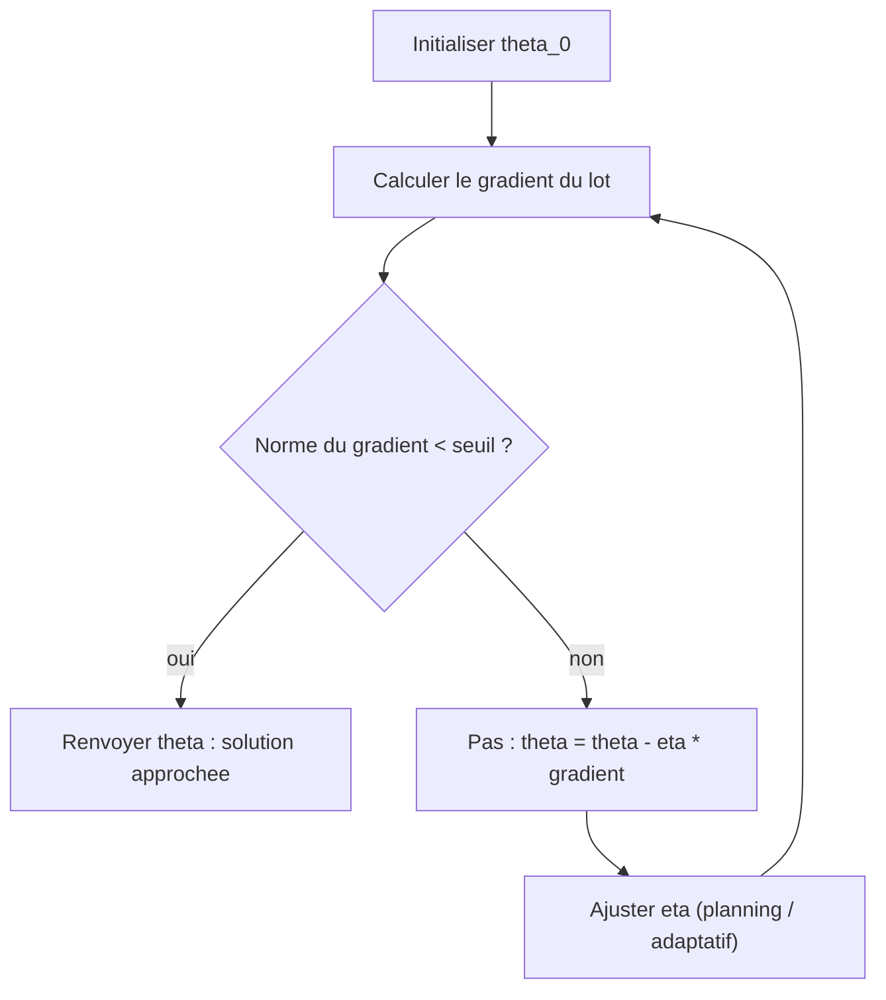

---

### Optimisation sous contraintes et multiplicateurs de Lagrange

Jusqu'ici la randonneuse pouvait aller où elle voulait. Mais la vie réelle impose des **contraintes** : un budget à ne pas dépasser, des probabilités qui doivent sommer à $1$, un poids total limité. On ne cherche plus le point le plus bas de toute la montagne, mais le point le plus bas *en restant sur un sentier autorisé*. C'est l'**optimisation sous contraintes** (constrained optimization), et son outil maître est le **lagrangien**.

#### Poser le problème

Le problème général s'écrit :

```math
\min_{x \in \mathbb{R}^n} f(x) \quad \text{sous} \quad
\begin{cases}
g_i(x) = 0, & i = 1, \dots, p \quad (\text{contraintes d'égalité}),\\
h_j(x) \le 0, & j = 1, \dots, q \quad (\text{contraintes d'inégalité}).
\end{cases}
```

L'ensemble des points qui respectent toutes les contraintes s'appelle le **domaine réalisable** (feasible set) — le « sentier autorisé ». Une contrainte d'égalité $g_i(x)=0$ vous force à rester *exactement sur* une courbe ; une contrainte d'inégalité $h_j(x)\le 0$ vous autorise une *région* (un côté de la frontière).

> **Le symbole « sous » (s.c., « sous contrainte que »).** Tout ce qui suit le mot « sous » (en anglais *subject to*, abrégé *s.t.*) liste les **règles à respecter**. C'est comme un jeu : « marque le plus de points possible (l'objectif) *sous* la règle que tu ne sors pas du terrain (les contraintes) ». Les $g_i$ et $h_j$ sont juste d'autres fonctions de $x$, comme $f$.

#### Cas d'une seule égalité : l'intuition géométrique

Commençons par $\min f(x)$ sous une seule contrainte $g(x) = 0$. Imaginez les **courbes de niveau** de $f$ (comme sur une carte topographique : chaque courbe relie les points de même altitude) et, par-dessus, le sentier $g(x)=0$. En marchant le long du sentier, tant que celui-ci **traverse** les courbes de niveau, on monte ou on descend : on peut faire mieux. On ne peut plus s'améliorer qu'à l'endroit où le sentier est **tangent** à une courbe de niveau.

Or le gradient $\nabla f$ est toujours **perpendiculaire** aux courbes de niveau de $f$, et $\nabla g$ perpendiculaire au sentier. Tangence des courbes $\Leftrightarrow$ gradients **colinéaires**. Il existe donc un nombre $\lambda$ tel que :

```math
\nabla f(x^\star) + \lambda\, \nabla g(x^\star) = 0.
```

Ce nombre $\lambda$ est le **multiplicateur de Lagrange**. (On écrit la colinéarité sous cette forme « avec un $+$ » pour qu'elle coïncide exactement avec la dérivée du lagrangien définie plus bas ; c'est la convention que l'on gardera dans tout le reste de la section.)

> **Le symbole $\lambda$ (le multiplicateur de Lagrange).** Ici, $\lambda$ ne désigne plus une valeur propre mais **un multiplicateur de Lagrange** : un nombre dont la *valeur absolue* mesure « combien la contrainte pousse sur la solution ». Image : vous poussez une bille pour qu'elle descende, mais un rail (la contrainte) l'en empêche. Le rail exerce une force de réaction. $|\lambda|$, c'est l'**intensité de cette force** : grande si la contrainte est très gênante, nulle si la contrainte ne sert à rien (la bille serait tombée là de toute façon). Le *signe* de $\lambda$, lui, dépend de l'orientation choisie pour $g$ (remplacer $g$ par $-g$ change $\lambda$ en $-\lambda$) : pour une égalité, ce signe est conventionnel, c'est pourquoi $\lambda$ peut être positif ou négatif. On verra plus bas que $|\lambda|$ a un sens économique précis : c'est l'amplitude d'un **prix**.

> **Exemple chiffré déroulé.** Minimisons $f(x_1, x_2) = x_1^2 + x_2^2$ (distance² à l'origine) sous $g(x) = x_1 + x_2 - 1 = 0$ (rester sur une droite). On cherche le point de la droite le plus proche de l'origine.
> Les gradients : $\nabla f = (2x_1, 2x_2)$, $\nabla g = (1, 1)$. La condition $\nabla f + \lambda \nabla g = 0$ donne $2x_1 + \lambda = 0$ et $2x_2 + \lambda = 0$, donc $x_1 = x_2 = -\lambda/2$. La contrainte $x_1 + x_2 = 1$ impose alors $-\lambda = 1$, soit $\lambda = -1$ et $x_1 = x_2 = \tfrac12$. Solution : $x^\star = (\tfrac12, \tfrac12)$, valeur optimale $f(x^\star) = \tfrac14$. C'est bien le pied de la perpendiculaire abaissée de l'origine sur la droite ; l'intensité $|\lambda| = 1$ mesure la « poussée » de la contrainte.

#### Le lagrangien : transformer un problème contraint en problème libre

L'astuce géniale de Lagrange : encoder contraintes *et* objectif dans **une seule fonction**, le **lagrangien**, en payant un « péage » pour chaque écart aux contraintes.

> **Définition (lagrangien).** Pour le problème avec égalités $g_i$ et inégalités $h_j$, le lagrangien est la fonction
> ```math
> \mathcal{L}(x, \lambda, \mu) = f(x) + \sum_{i=1}^{p} \lambda_i\, g_i(x) + \sum_{j=1}^{q} \mu_j\, h_j(x),
> ```
> où chaque $\lambda_i \in \mathbb{R}$ et chaque $\mu_j \ge 0$ est un multiplicateur associé à sa contrainte.

> **Le symbole $\mathcal{L}$ (le lagrangien) — expliqué simplement.** Ce symbole (un grand L calligraphié) représente une **fonction de marchandage** entre « je veux minimiser $f$ » et « je dois respecter les règles ». À l'objectif $f(x)$, on ajoute, pour chaque règle, le terme « multiplicateur $\times$ écart à la règle ». Si une contrainte $g_i(x)$ s'écarte de $0$, le terme $\lambda_i g_i(x)$ ajoute un coût (ou un gain). Le multiplicateur $\lambda_i$ est le **prix unitaire de l'écart**. Optimiser ce lagrangien revient à trouver un équilibre où l'on n'a plus intérêt ni à bouger $x$, ni à changer les prix : c'est un **point de selle** (saddle point), un col de montagne, minimum dans la direction $x$ et maximum dans la direction des multiplicateurs.

Pour le cas à égalités seules, annuler les dérivées de $\mathcal{L}$ par rapport à $x$ **et** par rapport à $\lambda$ redonne exactement le système précédent :

```math
\nabla_x \mathcal{L} = \nabla f(x) + \sum_i \lambda_i \nabla g_i(x) = 0, \qquad \nabla_\lambda \mathcal{L} = g(x) = 0 .
```

La seconde équation **restitue la contrainte** : dériver par rapport au multiplicateur, c'est exiger que la règle soit respectée. On a transformé un problème contraint en $\mathbb{R}^n$ en un problème *sans contrainte* en $\mathbb{R}^{n+p}$.

#### Les conditions de Karush–Kuhn–Tucker (KKT)

Avec des inégalités, la situation se raffine : une contrainte $h_j(x) \le 0$ peut être **active** (saturée, $h_j(x^\star) = 0$ : on est collé à la frontière) ou **inactive** (lâche, $h_j(x^\star) < 0$ : on est strictement à l'intérieur, la contrainte ne sert à rien). Les **conditions KKT** généralisent Lagrange à ce cas. Elles sont *la* boîte à outils de l'optimisation sous contraintes.

> **Théorème (conditions KKT, nécessaires au premier ordre).** Sous une condition de qualification des contraintes (par exemple les gradients des contraintes actives sont linéairement indépendants), si $x^\star$ est un minimum local, alors il existe des multiplicateurs $\lambda_i \in \mathbb{R}$ et $\mu_j \ge 0$ tels que :
>
> 1. **Stationnarité** : $\displaystyle \nabla f(x^\star) + \sum_{i} \lambda_i \nabla g_i(x^\star) + \sum_{j} \mu_j \nabla h_j(x^\star) = 0$.
> 2. **Réalisabilité primale** : $g_i(x^\star) = 0$ et $h_j(x^\star) \le 0$.
> 3. **Réalisabilité duale** : $\mu_j \ge 0$ pour tout $j$.
> 4. **Complémentarité** : $\mu_j\, h_j(x^\star) = 0$ pour tout $j$.

> **Lire les KKT comme un enfant.** Chaque condition raconte une histoire simple.
> - **(1) Stationnarité** : au point optimal, l'envie de descendre ($-\nabla f$) est *exactement* compensée par les poussées des contraintes. Plus moyen de bouger sans casser une règle.
> - **(2) Réalisabilité primale** : la solution respecte vraiment les règles (elle est sur le sentier).
> - **(3) Réalisabilité duale** : les prix des inégalités sont **positifs**. Une barrière ne peut que *vous repousser vers l'intérieur*, jamais vous aspirer dehors — d'où $\mu_j \ge 0$.
> - **(4) Complémentarité** : c'est la plus belle. Pour chaque inégalité, **soit** la contrainte est inactive ($h_j < 0$) et alors son prix est nul ($\mu_j = 0$, le mur est loin, il ne pousse pas), **soit** son prix est non nul ($\mu_j > 0$) et alors la contrainte est saturée ($h_j = 0$, on est plaqué contre le mur). On ne paie un péage que pour une barrière contre laquelle on est réellement appuyé.

> **Exemple chiffré avec inégalité active/inactive.** Minimisons $f(x) = (x-3)^2$ sous $h(x) = x - 1 \le 0$ (donc $x \le 1$). Sans contrainte le minimum serait en $x=3$, **interdit**. Le lagrangien est $\mathcal{L} = (x-3)^2 + \mu(x-1)$.
> - Stationnarité : $2(x-3) + \mu = 0$.
> - Si la contrainte est **active** ($x = 1$) : $\mu = -2(1-3) = 4 > 0$. Cohérent avec $\mu \ge 0$. La solution est $x^\star = 1$, $\mu = 4$.
> - Vérifions par l'absurde l'option *inactive* ($\mu = 0$) : on aurait $x=3$, mais alors $h(3) = 2 > 0$, contrainte **violée**. Rejeté.
>
> Conclusion : $x^\star = 1$, la contrainte est saturée, son prix $\mu = 4$ mesure de combien $f$ remonte parce qu'on nous interdit d'aller jusqu'à $3$.

#### Dualité et sens « prix » des multiplicateurs

À partir du lagrangien, on définit la **fonction duale** $\,q(\lambda, \mu) = \min_x \mathcal{L}(x, \lambda, \mu)$. Pour tout point réalisable $x$ (donc $g_i(x)=0$ et $h_j(x)\le 0$) et tout $\mu \ge 0$, on a $\mathcal{L}(x,\lambda,\mu) = f(x) + 0 + \sum_j \mu_j h_j(x) \le f(x)$, car chaque terme $\mu_j h_j(x)$ est $\le 0$. En minimisant le membre de gauche sur *tout* $x$, on obtient une **borne inférieure** sur la valeur optimale $p^\star$ du problème de départ : c'est la **dualité faible** $q(\lambda,\mu) \le p^\star$. Le **problème dual** consiste à remonter cette borne le plus haut possible :

```math
\max_{\lambda,\ \mu \ge 0}\ q(\lambda, \mu) \ \le\ p^\star .
```

> **Théorème (dualité forte).** Si le problème est **convexe** (objectif et inégalités convexes, égalités affines) et qu'il existe un point strictement réalisable (**condition de Slater**), alors il n'y a **aucun écart** : $\max q = p^\star$. Le saut de dualité (duality gap) est nul, et résoudre le dual *équivaut* à résoudre le primal.

> **Interprétation économique (le multiplicateur est un prix).** Théorème de sensibilité : si l'on relâche légèrement la contrainte en $h_j(x) \le b_j$ (on déplace la borne de $b_j$ à partir de $0$), la valeur optimale varie selon $\frac{\partial p^\star}{\partial b_j} = -\mu_j$. Le multiplicateur est donc le **prix marginal** (shadow price) de la contrainte : « combien je gagnerais à m'autoriser une unité de plus ». Dans l'exemple précédent, $\mu = 4$ : desserrer la limite de $x\le1$ vers $x\le1{,}01$ ($b = 0{,}01$) ferait baisser $f$ d'environ $-\mu \cdot b = -4 \times 0{,}01 = -0{,}04$, soit une baisse de $0{,}04$. C'est ce qui donne aux multiplicateurs leur immense portée en économie, en théorie des jeux et en apprentissage automatique.

#### Application phare : la machine à vecteurs de support (SVM)

L'exemple le plus emblématique en apprentissage automatique est le **séparateur à vaste marge** (support vector machine, SVM). On cherche l'hyperplan $\theta^\top x + b = 0$ qui sépare deux classes en **maximisant la marge**, ce qui revient au problème convexe :

```math
\min_{\theta, b}\ \tfrac12 \|\theta\|^2 \quad \text{sous} \quad y_i(\theta^\top x_i + b) \ge 1,\ \ i = 1,\dots,N .
```

En réécrivant chaque contrainte sous la forme standard $h_i(\theta,b) = 1 - y_i(\theta^\top x_i + b) \le 0$, en formant le lagrangien et en appliquant les KKT, la complémentarité fait tout le travail : seuls les points **sur la marge** ($y_i(\theta^\top x_i + b) = 1$) ont un multiplicateur $\alpha_i > 0$. Ce sont les **vecteurs de support** (support vectors) — les seuls qui déterminent la frontière ; tous les autres exemples pourraient disparaître sans rien changer. Le problème dual ne dépend des données qu'à travers des produits scalaires $x_i^\top x_j$, ce qui ouvre la porte à l'**astuce du noyau** (kernel trick) pour séparer des données non linéairement séparables.

> **Contraintes en apprentissage profond.** Les contraintes structurent aussi l'apprentissage profond moderne : projection sur des boules de norme pour la robustesse adversariale, **clipping** de norme de gradient (une contrainte implicite sur le pas), pénalités de Lagrange pour l'**équité** (fairness) ou le respect d'un budget de calcul, et entraînements *sous contraintes* (par exemple borner une métrique secondaire) résolus par des méthodes primal-dual. Les solveurs convexes disciplinés (CVXPY) et les méthodes de point intérieur restent une référence pour les sous-problèmes convexes de taille moyenne.

#### Méthodes numériques : pénalité, barrière, projection

Comment résout-on concrètement ? Trois grandes familles, illustrées sur un même cas.

| Méthode | Principe | Image |
|---|---|---|
| **Pénalité** | ajouter $\rho \sum_i g_i(x)^2$ à $f$ et augmenter $\rho$ | une amende croissante si on sort du sentier |
| **Barrière (point intérieur)** | ajouter $-\mu \sum_j \log(-h_j(x))$ | un mur infranchissable qui repousse de l'intérieur |
| **Projection / lagrangien augmenté** | faire un pas libre puis se reprojeter sur le domaine, ou ajuster les $\lambda$ | revenir sur le sentier après chaque écart |

```python
import numpy as np
from scipy.optimize import minimize

def f(x):
    return x[0]**2 + x[1]**2

constraints = [{'type': 'eq', 'fun': lambda x: x[0] + x[1] - 1}]
res = minimize(f, x0=[0.0, 0.0], constraints=constraints)
print("x* =", np.round(res.x, 4))          # [0.5 0.5]
print("f(x*) =", round(res.fun, 4))         # 0.25
```

```python
def projected_gradient_descent(grad_f, project, x0, lr=0.1, n_iter=500):
    x = np.array(x0, dtype=float)
    for _ in range(n_iter):
        x = project(x - lr * grad_f(x))
    return x

grad = lambda x: 2 * x
project_line = lambda x: x - (x.sum() - 1) / 2.0 * np.ones(2)
print(np.round(projected_gradient_descent(grad, project_line, [3.0, -1.0]), 4))  # [0.5 0.5]
```

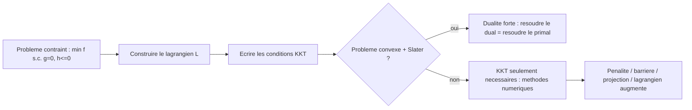

---

### Optimisation convexe

Pourquoi consacrer une section entière à un type de fonctions ? Parce que la **convexité** est la frontière magique entre les problèmes que l'on sait résoudre **à coup sûr** et ceux où l'on tâtonne. Pour une fonction convexe, **tout minimum local est global** : la randonneuse qui descend ne peut pas se faire piéger dans une fausse vallée. C'est la propriété la plus précieuse de toute l'optimisation.

#### Ensembles convexes

> **La convexité — intuition d'abord.** « Convexe » se dit d'une forme **sans creux ni renfoncement**, où l'on peut tendre une ficelle entre deux points sans qu'elle sorte de la forme. Un disque plein, un cube, un segment : convexes. Une étoile, un croissant de lune, un haricot : non convexes (la ficelle sort). Pour une *fonction*, convexe veut dire « en forme de cuvette » (bol) : si vous reliez deux points de la courbe par une corde, la corde passe **au-dessus** de la courbe.

> **Définition (ensemble convexe).** Un ensemble $C \subseteq \mathbb{R}^n$ est **convexe** si, pour tous $x, y \in C$ et tout $t \in [0,1]$, le point $t x + (1-t) y$ appartient encore à $C$. Autrement dit, le segment reliant deux points quelconques de $C$ est entièrement inclus dans $C$.

> **Le symbole $t x + (1-t)y$ (combinaison convexe).** Ce symbole représente **un point situé sur le segment entre $x$ et $y$**. Le curseur $t$ glisse de $0$ à $1$ : à $t=0$ on est en $y$, à $t=1$ on est en $x$, à $t=\tfrac12$ pile au milieu. C'est une **moyenne pondérée** : « un peu de $x$, un peu de $y$, les deux poids faisant $1$ ». Comme une recette qui mélange deux ingrédients dans des proportions qui totalisent $100\,\%$.

Exemples fondamentaux d'ensembles convexes : les hyperplans $\{x : a^\top x = b\}$, les demi-espaces $\{x : a^\top x \le b\}$, les boules $\{x : \|x - c\| \le r\}$, et — crucial — toute **intersection** d'ensembles convexes (donc tout domaine défini par des inégalités linéaires, un **polyèdre**). C'est pourquoi les domaines réalisables « linéaires » sont si commodes.

#### Fonctions convexes

> **Définition (fonction convexe).** Une fonction $f : C \to \mathbb{R}$, définie sur un convexe $C$, est **convexe** si pour tous $x, y \in C$ et $t \in [0,1]$ :
> ```math
> f\big(t x + (1-t) y\big) \le t f(x) + (1-t) f(y).
> ```
> Géométriquement : la corde (membre de droite) est toujours au-dessus de l'arc (membre de gauche). Elle est **strictement convexe** si l'inégalité est stricte pour $x \neq y$ et $t \in (0,1)$ (vraie cuvette, sans portion plate), et **concave** si $-f$ est convexe (une bosse au lieu d'un bol).

> **Lecture imagée de l'inégalité.** À gauche : l'altitude réelle de la fonction au point milieu. À droite : l'altitude de la corde tendue entre les deux extrémités. « Corde au-dessus de l'arc » = la fonction se *creuse* entre deux points. C'est exactement ce qui interdit les bosses, donc les faux minima.

**Caractérisations différentiables.** Si $f$ est dérivable, ces trois énoncés sont équivalents à la convexité :

- **Premier ordre** : $f(y) \ge f(x) + \nabla f(x)^\top (y - x)$ pour tous $x, y$. La fonction est **toujours au-dessus de chacune de ses tangentes**. (C'est l'inégalité reine, utilisée partout dans les preuves.)
- **Monotonie du gradient** : $\big(\nabla f(y) - \nabla f(x)\big)^\top (y - x) \ge 0$. La pente ne fait que croître.
- **Second ordre** : la hessienne $\nabla^2 f(x)$ est **semi-définie positive** en tout point.

Cette dernière caractérisation introduit un nouveau symbole essentiel.

> **La relation $\succeq 0$ (matrice semi-définie positive).** Le symbole $A \succeq 0$ (lire « $A$ est semi-définie positive », positive semidefinite, PSD) représente l'idée qu'une matrice symétrique **courbe l'espace vers le haut dans toutes les directions**, jamais vers le bas. Formellement : $v^\top A v \ge 0$ pour tout vecteur $v$. Image : la matrice est la « forme d'un bol ». Si vous lâchez une bille en n'importe quel point et la poussez dans n'importe quelle direction, le sol remonte (ou reste plat) — jamais il ne descend en creux. Pour une matrice symétrique, c'est équivalent à : **toutes ses valeurs propres sont $\ge 0$**. La version stricte $A \succ 0$ (définie positive, $v^\top A v > 0$ pour $v \neq 0$, valeurs propres $> 0$) correspond à un bol *strictement* incurvé partout — une hessienne $\succ 0$ partout garantit la stricte convexité. Le lien avec la première section est direct : « hessienne PSD partout » = « cuvette partout » = « fonction convexe ».

> **Exemple chiffré (tester la convexité par la hessienne).** Soit $f(x_1, x_2) = x_1^2 + 3 x_1 x_2 + x_2^2$. Sa hessienne (constante) est
> ```math
> H = \begin{pmatrix} 2 & 3 \\ 3 & 2 \end{pmatrix}.
> ```
> Ses valeurs propres sont $2 \pm 3$, soit $5$ et $-1$. Comme $-1 < 0$, $H \not\succeq 0$ : **la fonction n'est pas convexe** (c'est une selle). En revanche $f(x_1,x_2) = x_1^2 + x_1 x_2 + x_2^2$ a pour hessienne $\begin{pmatrix} 2 & 1 \\ 1 & 2\end{pmatrix}$, valeurs propres $3$ et $1$, toutes $> 0$ : **strictement convexe**.

```python
import numpy as np

def is_convex_quadratic(H, tol=1e-9):
    H = np.asarray(H, dtype=float)
    eigvals = np.linalg.eigvalsh(0.5 * (H + H.T))
    return bool(np.all(eigvals >= -tol)), np.round(eigvals, 6)

print(is_convex_quadratic([[2, 3], [3, 2]]))   # (False, [-1.  5.])
print(is_convex_quadratic([[2, 1], [1, 2]]))   # (True,  [1.  3.])
```

#### Le théorème central de l'optimisation convexe

> **Théorème (minimum local = minimum global).** Si $f$ est convexe sur un ensemble convexe $C$, alors tout minimiseur local de $f$ sur $C$ est un minimiseur **global**. Si $f$ est *strictement* convexe, le minimiseur, s'il existe, est **unique**.

> **Démonstration.** Soit $x^\star$ un minimum local et supposons par l'absurde qu'il existe $y \in C$ avec $f(y) < f(x^\star)$. Pour $t \in (0,1)$ petit, le point $z_t = (1-t) x^\star + t y$ est dans $C$ (convexité de $C$) et, par convexité de $f$ :
> ```math
> f(z_t) \le (1-t) f(x^\star) + t f(y) < (1-t) f(x^\star) + t f(x^\star) = f(x^\star).
> ```
> En prenant $t$ assez petit, $z_t$ est aussi proche que l'on veut de $x^\star$, donc dans son voisinage ; on y trouve une valeur strictement plus basse que $f(x^\star)$, ce qui **contredit** la minimalité locale. Donc aucun tel $y$ n'existe : $x^\star$ est global. Pour l'unicité sous stricte convexité, si $x^\star \neq y^\star$ étaient deux minima globaux de même valeur $p^\star$, le milieu $z_{1/2} = \tfrac12 x^\star + \tfrac12 y^\star$ donnerait, par convexité *stricte*, $f(z_{1/2}) < \tfrac12 p^\star + \tfrac12 p^\star = p^\star$, absurde. $\blacksquare$

Une conséquence pratique majeure : pour une fonction convexe **différentiable**, la condition nécessaire $\nabla f(x^\star) = 0$ devient aussi **suffisante** d'optimalité globale. Trouver un point critique, c'est avoir gagné.

> **Pourquoi cela change tout en apprentissage automatique.** Les problèmes convexes (régression linéaire des moindres carrés, régression logistique sans couche cachée, SVM, Lasso, Ridge) se résolvent de façon **fiable et reproductible** : la descente de gradient converge vers *la* solution, indépendamment de l'initialisation. À l'inverse, l'apprentissage profond est **non convexe** : il existe d'innombrables minima locaux et points de selle. On accepte alors un « bon » minimum local au lieu du global — et, fait remarquable confirmé ces dernières années, en très haute dimension ces minima locaux sont le plus souvent presque aussi bons que le global.

#### Opérations qui préservent la convexité (la « boîte à outils »)

Reconnaître la convexité sans calculer de hessienne, en composant des briques connues :

| Opération | Préserve la convexité ? | Exemple |
|---|---|---|
| Somme pondérée positive $\sum_k w_k f_k$, $w_k \ge 0$ | oui | $\|\theta\|^2 + \lambda \|\theta\|_1$ (Ridge + Lasso) |
| Maximum ponctuel $\max_k f_k$ | oui | fonction « hinge » des SVM |
| Composition affine $f(Ax + b)$ | oui | perte sur $\theta^\top x$ |
| Composition $g\circ h$ avec $g$ convexe **croissante**, $h$ convexe | oui | $\exp(\|x\|)$ |
| Minimum, produit, composition quelconque | **non** en général | $f\cdot g$ peut ne pas l'être |

Ces règles, appliquées mécaniquement, sont le cœur de la **programmation convexe disciplinée** (disciplined convex programming, DCP) des solveurs comme CVXPY : si vous assemblez votre objectif uniquement avec des atomes convexes et ces opérations, le solveur **garantit** trouver l'optimum global.

#### Classes canoniques de problèmes convexes

L'optimisation convexe se décline en familles standard, par ordre de généralité croissante, chacune avec ses solveurs dédiés :

- **Programmation linéaire** (linear programming, LP) : $\min c^\top x$ sous $Ax \le b$. Objectif et contraintes affines.
- **Programmation quadratique** (quadratic programming, QP) : $\min \tfrac12 x^\top Q x + c^\top x$ sous $Ax \le b$, avec $Q \succeq 0$. (La SVM en est une.)
- **Cône du second ordre** (second-order cone programming, SOCP) : contraintes du type $\|A x + b\| \le c^\top x + d$.
- **Programmation semi-définie** (semidefinite programming, SDP) : variables = matrices, contrainte $X \succeq 0$. La plus expressive ; cœur de nombreuses relaxations convexes de problèmes NP-difficiles.

```math
\text{LP} \subset \text{QP} \subset \text{SOCP} \subset \text{SDP}.
```

#### Sous-gradient : quand ça n'est pas dérivable

Beaucoup de fonctions convexes utiles ont des **coins** (valeur absolue, norme $\ell_1$, hinge). En un coin, pas de tangente unique, mais tout un éventail de droites support : c'est le **sous-différentiel**.

> **Définition (sous-gradient).** Un vecteur $u$ est un **sous-gradient** de $f$ convexe en $x$ si $f(y) \ge f(x) + u^\top(y - x)$ pour tout $y$. L'ensemble de ces $u$ est le **sous-différentiel** $\partial f(x)$. En un point dérivable, $\partial f(x) = \{\nabla f(x)\}$ (un seul élément). Condition d'optimalité généralisée : $x^\star$ minimise $f$ **si et seulement si** $0 \in \partial f(x^\star)$.

> **Image du sous-gradient.** À un coin du graphe (comme la pointe en bas de $|x|$ en $0$), on peut glisser une règle rigide sous la courbe et la faire **pivoter** dans une plage d'angles sans qu'elle ne traverse jamais la courbe. Chaque position de la règle est un sous-gradient. Pour $|x|$ en $0$, toutes les pentes de $-1$ à $+1$ conviennent : $\partial |x|(0) = [-1, 1]$. Le minimum est là où la règle peut être posée **horizontale** ($0$ est une pente admissible), ce qui redonne $0 \in \partial f$.

C'est le fondement de la **descente de sous-gradient** et des méthodes **proximales** qui rendent le Lasso ($\min \tfrac12\|Ax-b\|^2 + \lambda\|x\|_1$) résoluble efficacement — l'opérateur proximal de $\|\cdot\|_1$ étant le **seuillage doux** (soft-thresholding), qui annule les petits coefficients et réalise la sélection de variables.

> **Exemple chiffré (seuillage doux).** L'opérateur proximal $\mathrm{prox}_{\lambda|\cdot|}(z) = \arg\min_x \big(\tfrac12 (x-z)^2 + \lambda|x|\big)$ vaut $\mathrm{sign}(z)\max(|z|-\lambda, 0)$. Avec $\lambda = 0{,}5$ : $z = 2 \Rightarrow x = 1{,}5$ ; $z = 0{,}3 \Rightarrow x = 0$ (annulé !) ; $z = -1{,}2 \Rightarrow x = -0{,}7$. C'est ce « rabotage vers zéro » qui rend les solutions Lasso **parcimonieuses** (sparse).

```python
import numpy as np

def soft_threshold(z, lam):
    return np.sign(z) * np.maximum(np.abs(z) - lam, 0.0)

def lasso_ista(A, b, lam, lr=None, n_iter=500):
    n = A.shape[1]
    x = np.zeros(n)
    L = np.linalg.norm(A, 2) ** 2
    lr = 1.0 / L if lr is None else lr
    for _ in range(n_iter):
        x = soft_threshold(x - lr * (A.T @ (A @ x - b)), lam * lr)
    return x

rng = np.random.default_rng(0)
A = rng.normal(size=(50, 10))
x_true = np.array([3, 0, 0, -2, 0, 0, 0, 1.5, 0, 0])
b = A @ x_true + 0.1 * rng.normal(size=50)
print(np.round(lasso_ista(A, b, lam=0.3), 2))
```

> **La frontière convexe/non convexe en pratique.** Elle reste le bon prisme de lecture du domaine. Les blocs convexes (couches linéaires + perte convexe, attention vue comme un barycentre convexe, projections) s'insèrent dans des architectures globalement non convexes ; comprendre la partie convexe éclaire la stabilité de l'entraînement. Côté théorie, l'**accélération de Nesterov** et les méthodes **proximales/ADMM** sous-tendent une large part de l'apprentissage structuré et fédéré ; les solveurs convexes différentiables (couches d'optimisation `cvxpylayers`, OptNet) permettent désormais d'**enchâsser un problème convexe comme une couche** d'un réseau et de rétropropager à travers sa solution. Enfin, la **relaxation convexe** (SDP) demeure un outil de référence pour certifier la robustesse de réseaux ou borner des quantités combinatoires.

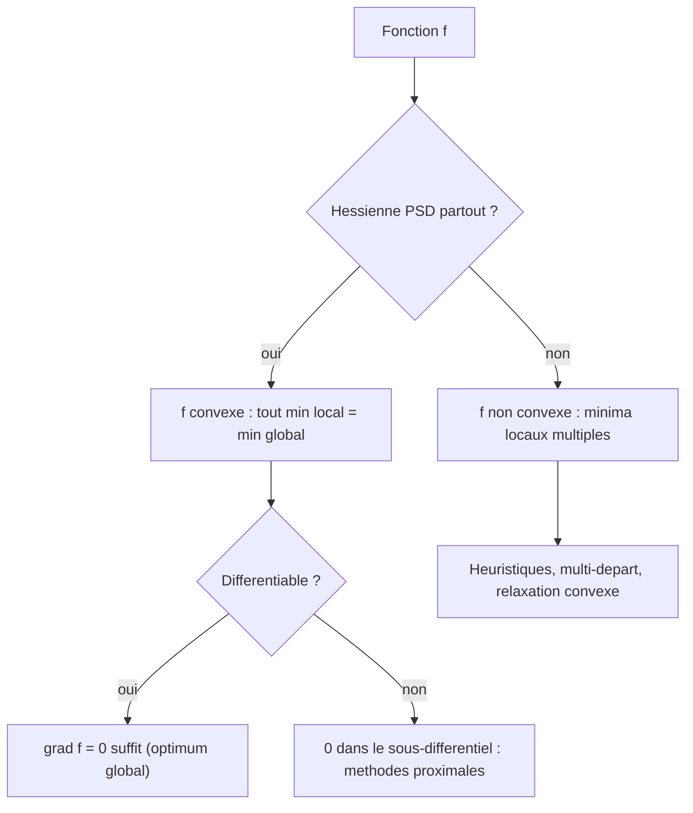

---

### Exercices

Les corrigés suivent immédiatement chaque énoncé.

#### Exercice 1 — Descente de gradient sur une quadratique 1D

On minimise $f(x) = 3x^2 - 12x + 7$.
**(a)** Calculer le minimiseur exact $x^\star$ et la valeur $f(x^\star)$.
**(b)** Écrire la mise à jour de descente de gradient et le facteur de contraction en fonction de $\eta$.
**(c)** Pour quelles valeurs de $\eta$ l'algorithme converge-t-il ? Quel $\eta$ converge en un seul pas ?

> **Corrigé.**
> **(a)** $f'(x) = 6x - 12 = 0 \Rightarrow x^\star = 2$. Alors $f(2) = 12 - 24 + 7 = -5$.
> **(b)** $x_{k+1} = x_k - \eta(6x_k - 12) = (1 - 6\eta)x_k + 12\eta$. En posant $e_k = x_k - 2$ (l'erreur), on obtient $e_{k+1} = (1-6\eta)e_k$ : le facteur de contraction est $1 - 6\eta$.
> **(c)** Convergence $\Leftrightarrow |1 - 6\eta| < 1 \Leftrightarrow 0 < \eta < \tfrac13$. Un seul pas $\Leftrightarrow 1 - 6\eta = 0 \Leftrightarrow \eta = \tfrac16$. (Cohérent avec $\eta = 1/L$ où $L = f'' = 6$.)

#### Exercice 2 — Effet du conditionnement

Soit $f(x_1, x_2) = \tfrac12(x_1^2 + 100\, x_2^2)$.
**(a)** Donner la hessienne et le conditionnement $\kappa$.
**(b)** Quel pas constant maximal garantit la convergence ? En déduire le facteur de convergence par itération.
**(c)** Combien d'itérations (ordre de grandeur) pour réduire l'erreur d'un facteur $10$ ?

> **Corrigé.**
> **(a)** $H = \mathrm{diag}(1, 100)$, valeurs propres $1$ et $100$, donc $\kappa = 100$.
> **(b)** La stabilité sur chaque coordonnée impose $|1 - \eta \lambda| < 1$ pour $\lambda \in \{1, 100\}$ ; la plus contraignante est $\lambda = 100$, d'où $\eta < 2/100 = 0{,}02$. À pas optimal $\eta = 1/L = 0{,}01$, le facteur sur la coordonnée lente ($\lambda=1$) est $1 - 0{,}01 = 0{,}99$ : la convergence est dictée par ce facteur, égal à $1 - m/L = 1 - 1/100 = 0{,}99$.
> **(c)** On veut $0{,}99^k \le 0{,}1$, soit $k \ge \ln(0{,}1)/\ln(0{,}99) \approx -2{,}30 / (-0{,}01005) \approx 229$ itérations. Avec moment de Nesterov, le facteur passe à $1 - 1/\sqrt{\kappa} = 0{,}9$, soit $k \approx \ln(0{,}1)/\ln(0{,}9) \approx 22$ : **dix fois moins**.

#### Exercice 3 — Lagrange avec une égalité

Maximiser $f(x_1, x_2) = x_1 x_2$ (une aire) sous $x_1 + x_2 = 10$ (un périmètre fixé).
**(a)** Poser le lagrangien et les conditions.
**(b)** Résoudre et interpréter le multiplicateur.

> **Corrigé.**
> **(a)** Maximiser $f$ revient à minimiser $-f$. Avec la contrainte $g(x) = x_1 + x_2 - 10 = 0$, le lagrangien est $\mathcal{L} = -x_1 x_2 + \lambda(x_1 + x_2 - 10)$. Stationnarité $\nabla_x \mathcal{L} = 0$ : $-x_2 + \lambda = 0$ et $-x_1 + \lambda = 0$, donc $x_1 = x_2 = \lambda$.
> **(b)** La contrainte donne alors $2\lambda = 10$, soit $\lambda = 5$ et $x_1 = x_2 = 5$. L'aire maximale est $25$ (le carré bat tous les rectangles de même périmètre). Sens du multiplicateur : l'aire optimale, en fonction de la borne $b$ de $x_1 + x_2 = b$, vaut $(b/2)^2$ ; sa dérivée en $b = 10$ vaut $b/2 = 5$. Augmenter le périmètre disponible de $1$ augmente donc l'aire optimale d'environ $5$, ce que retrouve exactement $|\lambda| = 5$. $\checkmark$

#### Exercice 4 — KKT avec une inégalité

Minimiser $f(x_1, x_2) = (x_1 - 2)^2 + (x_2 - 2)^2$ sous $x_1 + x_2 \le 2$.
**(a)** L'optimum sans contrainte est-il réalisable ?
**(b)** Résoudre par les KKT.
**(c)** Donner le multiplicateur et son interprétation.

> **Corrigé.**
> **(a)** Sans contrainte, minimum en $(2,2)$, mais $2+2 = 4 > 2$ : **non réalisable**. La contrainte sera donc **active**.
> **(b)** Lagrangien $\mathcal{L} = (x_1-2)^2 + (x_2-2)^2 + \mu(x_1 + x_2 - 2)$. Stationnarité : $2(x_1-2) + \mu = 0$ et $2(x_2 - 2) + \mu = 0$, d'où $x_1 = x_2 = 2 - \mu/2$. Contrainte active : $x_1 + x_2 = 2 \Rightarrow 2(2 - \mu/2) = 2 \Rightarrow 4 - \mu = 2 \Rightarrow \mu = 2$. Donc $x_1 = x_2 = 1$.
> **(c)** $\mu = 2 \ge 0$ (réalisabilité duale $\checkmark$) et $h(x^\star) = 0$ (complémentarité $\checkmark$). Solution $x^\star = (1,1)$, $f(x^\star) = 2$. Interprétation : relâcher la contrainte vers $x_1 + x_2 \le 2 + \delta$ ferait baisser $f$ d'environ $\mu\,\delta = 2\delta$ — le « prix » de la contrainte vaut $2$.

#### Exercice 5 — Vérifier une convexité

Pour chaque fonction, dire si elle est convexe sur son domaine, en justifiant par la hessienne ou par les règles de composition.
**(a)** $f(x) = e^{ax}$, $a \in \mathbb{R}$. **(b)** $f(x_1,x_2) = x_1^2 - x_2^2$. **(c)** $f(x) = \|Ax - b\|^2$. **(d)** $f(x) = \max(0,\ 1 - x)$ (hinge).

> **Corrigé.**
> **(a)** $f''(x) = a^2 e^{ax} \ge 0$ partout : **convexe** (strictement si $a \neq 0$).
> **(b)** Hessienne $\mathrm{diag}(2, -2)$, valeurs propres $2$ et $-2$ : une négative, donc $H \not\succeq 0$ : **non convexe** (selle).
> **(c)** $f(x) = (Ax-b)^\top(Ax-b)$, hessienne $2 A^\top A$. Or $v^\top A^\top A\, v = \|Av\|^2 \ge 0$ pour tout $v$, donc $A^\top A \succeq 0$ : **convexe** (on le retrouve sans calcul comme composition affine de la norme au carré, qui est convexe).
> **(d)** Maximum de deux fonctions affines ($0$ et $1-x$) ; or le max ponctuel de fonctions convexes est convexe : **convexe** (avec un coin en $x=1$, d'où l'usage des sous-gradients).

#### Exercice 6 — Sous-gradient de la valeur absolue et seuillage

**(a)** Donner $\partial f(x)$ pour $f(x) = |x|$ en tout $x$.
**(b)** Résoudre $\min_x \tfrac12 (x - z)^2 + \lambda |x|$ via la condition $0 \in \partial$ et retrouver le seuillage doux.

> **Corrigé.**
> **(a)** Pour $x > 0$ : $\partial f = \{1\}$ ; pour $x < 0$ : $\{-1\}$ ; en $x = 0$ : $[-1, 1]$ (toutes les pentes admissibles entre les deux demi-droites).
> **(b)** L'objectif est convexe ; la condition d'optimalité est $0 \in (x - z) + \lambda\,\partial|x|$.
> - Si $x > 0$ : $0 = x - z + \lambda \Rightarrow x = z - \lambda$, valable si $z > \lambda$.
> - Si $x < 0$ : $0 = x - z - \lambda \Rightarrow x = z + \lambda$, valable si $z < -\lambda$.
> - Si $x = 0$ : il faut $0 \in (0 - z) + \lambda[-1,1] = [-z-\lambda,\ -z+\lambda]$, soit $|z| \le \lambda$.
>
> En rassemblant : $x^\star = \mathrm{sign}(z)\max(|z| - \lambda, 0)$ — le **seuillage doux**, qui annule toute entrée d'amplitude $\le \lambda$ et rétrécit les autres de $\lambda$ vers zéro.

#### Exercice 7 — Implémentation et observation (au choix, avec ordinateur)

À partir du code `gradient_descent` de la première section, minimiser la fonction de Rosenbrock $f(x,y) = (1-x)^2 + 100(y - x^2)^2$ (minimum en $(1,1)$). Observer la lenteur due à la « banane » (vallée courbe, mal conditionnée), puis comparer avec un optimiseur de `scipy.optimize.minimize` en méthode `'BFGS'`.

> **Corrigé (indications et résultat attendu).** Le gradient est $\nabla f = \big(-2(1-x) - 400x(y - x^2),\ 200(y - x^2)\big)$.
> ```python
> import numpy as np
> from scipy.optimize import minimize
>
> def f(p):
>     x, y = p
>     return (1 - x)**2 + 100 * (y - x**2)**2
>
> def grad(p):
>     x, y = p
>     return np.array([-2*(1 - x) - 400*x*(y - x**2), 200*(y - x**2)])
>
> # Descente de gradient : tres lente, lr doit etre minuscule (~1e-3) pour ne pas diverger
> x = np.array([-1.2, 1.0])
> for _ in range(100000):
>     x = x - 1e-3 * grad(x)
> print("GD :", np.round(x, 3))          # proche de (1,1) mais apres des dizaines de milliers de pas
>
> # BFGS (quasi-Newton) : utilise la courbure approchee, converge en quelques dizaines d'iterations
> res = minimize(f, [-1.2, 1.0], jac=grad, method='BFGS')
> print("BFGS :", np.round(res.x, 6), "en", res.nit, "iterations")
> ```
> **Observation clé.** La descente de gradient zigzague interminablement le long de la vallée courbe (conditionnement effectif énorme) et exige un pas minuscule pour rester stable, donc des dizaines de milliers d'itérations. BFGS, en reconstruisant une approximation de la courbure (la hessienne) à partir des gradients successifs, redresse la géométrie et atteint $(1,1)$ en quelques dizaines d'itérations. C'est l'illustration concrète de tout le chapitre : **première dérivée seule = robuste mais sensible au conditionnement ; exploiter la courbure = bien plus rapide quand on peut se le permettre.**

[↑ Retour à la table des matières](#table-des-matières)

# Partie II — Problèmes centraux de l'apprentissage automatique

## 8. Quand les modèles rencontrent les données

### Données, modèles et apprentissage

Imaginez un apprenti boulanger qui regarde son maitre pendant des mois. Il voit des centaines de fois la meme scene : telle quantite de farine, telle quantite d'eau, tel temps de cuisson, et a la sortie, un pain plus ou moins reussi. Au debut il ne comprend rien. Puis, peu a peu, son cerveau construit une *regle interieure* : « si la pate colle aux doigts, c'est qu'il faut un peu plus de farine ». Personne ne lui a donne la formule ; il l'a *apprise* en confrontant ce qu'il croyait a ce qu'il observait. L'apprentissage automatique (machine learning) fait exactement cela, mais avec des nombres et des fonctions a la place de l'intuition du boulanger.

Ce chapitre raconte cette rencontre : d'un cote des **donnees** (ce que le monde nous montre), de l'autre des **modeles** (les regles candidates), et au milieu un **principe d'apprentissage** qui choisit la meilleure regle. Tout le reste n'est que la mise en equations, de plus en plus precise, de cette idee simple.

#### Le vocabulaire de base : observations, etiquettes, hypotheses

Commencons par poser les objets. On observe des **exemples** (samples). Chaque exemple est decrit par des **caracteristiques** (features) : pour un appartement, ce serait sa surface, son nombre de pieces, son etage. On rassemble ces caracteristiques dans un vecteur.

> **Le symbole $\mathbf{x}$.** Ce symbole represente *un exemple decrit par ses caracteristiques*, range comme une liste de nombres. C'est comme la fiche d'identite d'une chose : pour un appartement, $\mathbf{x} = (72, 3, 4)$ veut dire « 72 metres carres, 3 pieces, 4e etage ». On l'ecrit en **gras** parce que c'est un vecteur (plusieurs nombres d'un coup), et on dit qu'il vit dans $\mathcal{X}$, l'ensemble de toutes les fiches possibles. La lettre calligraphiee $\mathcal{X}$ est juste « le grand sac qui contient toutes les fiches imaginables ».

> **Le symbole $y$.** Ce symbole represente *la reponse* qu'on aimerait predire pour l'exemple $\mathbf{x}$. Pour l'appartement, $y$ serait son prix. On dit que $y$ vit dans $\mathcal{Y}$ (le sac de toutes les reponses possibles). Quand $y$ est un nombre reel (un prix), on parle de **regression** ; quand $y$ est une categorie (chat / chien), on parle de **classification**.

Une **donnee** (datum) est donc un couple $(\mathbf{x}, y)$ : une question et sa reponse. Un **jeu de donnees** (dataset) est une collection de tels couples.

> **Le symbole $\mathcal{D}$.** Ce symbole represente *tout le cahier d'observations* : l'ensemble complet des exemples qu'on a recoltes. On ecrit
> ```math
> \mathcal{D} = \{(\mathbf{x}_1, y_1), (\mathbf{x}_2, y_2), \dots, (\mathbf{x}_n, y_n)\}.
> ```
> Les accolades $\{\;\}$ veulent dire « l'ensemble des choses la-dedans ». Le petit indice en bas (le $i$ dans $\mathbf{x}_i$) est un **numero de ligne** dans le cahier : $\mathbf{x}_1$ est le premier appartement, $\mathbf{x}_2$ le deuxieme, et ainsi de suite.

> **Le symbole $n$.** Ce symbole represente *combien d'exemples on a* : le nombre de lignes du cahier. Si on a observe 500 appartements, alors $n = 500$. Plus $n$ est grand, plus on a de matiere pour apprendre.

Le boulanger ne se contente pas de memoriser ; il veut une **regle** qui, face a une *nouvelle* pate jamais vue, predit le bon geste. Cette regle, c'est une fonction.

> **Le symbole $f$ (et $h$).** Ces symboles representent *la regle qui transforme une question en reponse* : on donne $\mathbf{x}$, la machine rend une prediction $f(\mathbf{x})$. C'est exactement la « recette interieure » du boulanger. On note souvent la regle apprise $h$ (pour **hypothese**, hypothesis), parce que c'est une *proposition* de regle qu'on teste. Predire, c'est calculer $\hat{y} = h(\mathbf{x})$.

> **Le symbole chapeau $\hat{\cdot}$.** Le petit chapeau au-dessus d'une lettre signifie « ceci est une *estimation*, une *devinette eclairee*, pas la verite ». Ainsi $\hat{y}$ se lit « y chapeau » et veut dire « le prix que *je predis* », a distinguer de $y$, « le vrai prix ». C'est la difference entre la meteo qui annonce 25 degres ($\hat{y}$) et la temperature reelle de demain ($y$). On retrouvera ce chapeau partout : des qu'une quantite est *apprise a partir des donnees*, elle porte un chapeau.

#### La classe d'hypotheses : on ne cherche pas n'importe quelle regle

Le boulanger ne teste pas *toutes* les regles imaginables de l'univers : il reste dans le cadre « plus de farine / moins d'eau / temps de cuisson ». De meme, en apprentissage, on se restreint a une **famille de regles candidates**, qu'on appelle la **classe d'hypotheses** (hypothesis class).

> **Le symbole $\mathcal{H}$.** Ce symbole represente *le catalogue des regles autorisees* : l'ensemble de toutes les fonctions $h$ qu'on s'autorise a essayer. C'est comme un magasin de bricolage : on n'a pas tous les outils du monde, seulement ceux des rayons. Choisir $\mathcal{H}$, c'est decider a l'avance la *forme* des regles. Exemple : « toutes les droites » est une classe d'hypotheses simple.

> **Le symbole $\boldsymbol{\theta}$.** Ce symbole (la lettre grecque *theta*) represente *les boutons de reglage* d'une regle : les nombres qu'on peut tourner pour passer d'une regle a une autre dans la meme famille. On parle de **parametres** (parameters). Pour une droite $h(x) = \theta_1 x + \theta_0$, les deux boutons sont la pente $\theta_1$ et la hauteur $\theta_0$. Tourner les boutons = se deplacer dans le catalogue $\mathcal{H}$. On range tous les boutons dans un vecteur $\boldsymbol{\theta}$ qui vit dans $\Theta$ (l'ensemble des reglages possibles).

On ecrit alors une regle parametree $h_{\boldsymbol{\theta}}$ : c'est « la regle obtenue quand les boutons valent $\boldsymbol{\theta}$ ». La classe d'hypotheses devient
```math
\mathcal{H} = \{\, h_{\boldsymbol{\theta}} : \boldsymbol{\theta} \in \Theta \,\}.
```
**Apprendre, c'est choisir $\boldsymbol{\theta}$.** Toute la suite du chapitre repond a la question : *parmi tous les reglages possibles, lequel choisir au vu du cahier $\mathcal{D}$ ?*

> **Definition (probleme d'apprentissage supervise).** On dispose d'un espace des entrees $\mathcal{X}$, d'un espace des sorties $\mathcal{Y}$, d'une classe d'hypotheses $\mathcal{H} \subseteq \mathcal{Y}^{\mathcal{X}}$ et d'un jeu de donnees $\mathcal{D} = \{(\mathbf{x}_i, y_i)\}_{i=1}^n$. Un **algorithme d'apprentissage** (learning algorithm) est une application $\mathcal{A}$ qui, a tout jeu de donnees, associe une hypothese : $\mathcal{A}(\mathcal{D}) = \hat{h} \in \mathcal{H}$. On dit que l'apprentissage est **supervise** (supervised) quand chaque exemple porte sa reponse $y_i$ ; **non supervise** (unsupervised) quand on n'a que les $\mathbf{x}_i$ (pas de reponse) et qu'on cherche une structure cachee.

> **Le symbole $\mathcal{Y}^{\mathcal{X}}$.** Cette notation represente *l'ensemble de toutes les fonctions* qui partent de $\mathcal{X}$ et arrivent dans $\mathcal{Y}$. C'est l'usage habituel de l'exposant pour les ensembles : tout comme $\mathcal{Y}^n$ designe les listes de $n$ elements de $\mathcal{Y}$ (une valeur par indice $1,\dots,n$), $\mathcal{Y}^{\mathcal{X}}$ designe les « listes » indexees par tous les $\mathbf{x} \in \mathcal{X}$, c'est-a-dire les regles. Ecrire $\mathcal{H} \subseteq \mathcal{Y}^{\mathcal{X}}$ dit simplement : notre catalogue $\mathcal{H}$ est un sous-ensemble de toutes les regles concevables.

#### Les trois ingredients de tout apprentissage

Tout au long de ce chapitre, on va voir revenir la meme trilogie. La voici en un schema.

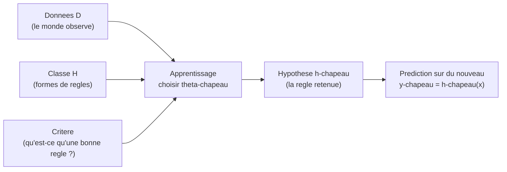

| Ingredient | Question a laquelle il repond | Exemple « droite » |
|---|---|---|
| Classe d'hypotheses $\mathcal{H}$ | *Quelle forme* peut prendre la regle ? | toutes les droites $\theta_1 x + \theta_0$ |
| Critere d'apprentissage | *Comment juger* qu'une regle est bonne ? | erreur quadratique moyenne |
| Algorithme $\mathcal{A}$ | *Comment trouver* la meilleure regle ? | moindres carres / descente de gradient |

> **Remarque (le coeur du chapitre).** Les deux grandes facons de definir le critere d'apprentissage donneront les deux grandes sections suivantes : minimiser une **erreur** mesuree sur les donnees (vision *minimisation du risque empirique*), ou maximiser la **plausibilite** des donnees sous un modele probabiliste (vision *maximum de vraisemblance*). On verra que ces deux visions, apparemment differentes, se rejoignent souvent — c'est l'un des plus beaux ponts du domaine.

#### Generalisation : apprendre n'est pas memoriser

Un piege guette le boulanger : il pourrait apprendre par coeur « le mardi 3 j'ai mis 502 g de farine ». C'est inutile, car le mardi suivant la farine n'est pas la meme. Ce qui compte, c'est de bien faire sur des situations *nouvelles*. En apprentissage, cette capacite porte un nom : la **generalisation** (generalization).

> **Piege (par coeur vs comprehension).** Une regle qui colle *parfaitement* aux donnees observees peut etre *catastrophique* sur des donnees nouvelles : elle a appris le bruit, les details, les accidents du cahier, au lieu de la tendance de fond. C'est le **surapprentissage** (overfitting). A l'oppose, une regle trop rigide rate la tendance : c'est le **sous-apprentissage** (underfitting). Tout l'art consiste a viser juste entre les deux — on y consacrera toute la derniere section, sur le compromis biais-variance.

Pour parler proprement de generalisation, il faut un cadre probabiliste : on suppose que les donnees ne tombent pas au hasard complet, mais sont **tirees** d'une certaine loi du monde.

> **Le symbole $\sim$.** Ce petit signe ondule se lit « suit la loi » ou « est tire selon ». Quand on ecrit $(\mathbf{x}, y) \sim P$, cela veut dire « le couple question-reponse est pioche au hasard dans une grande urne dont les proportions sont decrites par la loi $P$ ». C'est comme dire « cette boule est tiree d'un sac ou il y a 70 pour cent de boules rouges » : le $\sim$ relie l'objet tire au sac d'ou il vient.

> **Hypothese i.i.d.** On suppose tres souvent que les $n$ exemples sont **independants et identiquement distribues** (independent and identically distributed, i.i.d.) : chaque couple $(\mathbf{x}_i, y_i)$ est tire de la *meme* loi $P$, et les tirages ne s'influencent pas. C'est l'equivalent de « je tire $n$ boules du *meme* sac, en remettant la boule a chaque fois ». Cette hypothese, souvent imparfaite dans la vraie vie (les donnees temporelles, par exemple, ne sont pas independantes), est la fondation theorique qui rend l'apprentissage analysable.

Voila le decor plante : des donnees tirees d'une loi $P$, une famille de regles $\mathcal{H}$ parametree par $\boldsymbol{\theta}$, et le projet de choisir $\hat{\boldsymbol{\theta}}$ pour bien predire *au-dela* du cahier. Passons maintenant au premier grand principe pour faire ce choix.

---

### Minimisation du risque empirique

Reprenons le boulanger. Pour savoir si sa regle est bonne, il lui faut une **note de douleur** : a quel point s'est-il trompe ? Un pain brule rapporte une grosse penalite, un pain parfait rapporte zero. Cette note, en apprentissage, s'appelle la **fonction de perte**.

#### La fonction de perte : mesurer une erreur

> **Le symbole $\ell$ (la fonction de perte, loss).** Ce symbole represente *le prix a payer quand on se trompe*. On lui donne deux choses : la prediction $\hat{y}$ et la vraie reponse $y$, et il rend un nombre $\ell(\hat{y}, y) \ge 0$ qui dit « voila a quel point cette prediction est mauvaise ». C'est comme un arbitre severe : si tu predis pile la verite, il dit « 0, parfait » ; plus tu t'eloignes, plus la note monte. La perte vaut toujours zero ou plus (on ne peut pas etre *recompense* pour une erreur), et elle vaut zero quand $\hat{y} = y$.

Quelques pertes classiques, selon le type de probleme :

| Nom | Formule $\ell(\hat{y}, y)$ | Pour quoi ? |
|---|---|---|
| Quadratique (squared / L2) | $(\hat{y} - y)^2$ | regression, penalise fort les grosses erreurs |
| Absolue (absolute / L1) | $\lvert \hat{y} - y \rvert$ | regression robuste aux valeurs aberrantes |
| 0–1 (zero-one) | $\mathbf{1}[\hat{y} \neq y]$ | classification, compte les erreurs |
| Logistique (log-loss) | $-\big(y \ln \hat{p} + (1-y)\ln(1-\hat{p})\big)$ | classification probabiliste |

> **Le symbole $\mathbf{1}[\,\cdot\,]$ (indicatrice).** Ce symbole represente *un interrupteur qui vaut 1 si c'est vrai, 0 si c'est faux*. Ainsi $\mathbf{1}[\hat{y} \neq y]$ vaut 1 quand on s'est trompe de classe, et 0 quand on a vu juste. C'est l'ampoule qui s'allume uniquement quand la condition entre crochets est realisee. La perte 0–1 est donc, litteralement, « compte un point a chaque erreur ».

> **Le symbole $\hat{p}$ (probabilite predite).** Dans la log-loss, $\hat{p}$ represente *la probabilite que le modele attribue a la classe 1* (par exemple « 0,8 de chance que ce soit un chat »). C'est un nombre entre 0 et 1, alors que la vraie etiquette $y$ vaut 0 ou 1. La log-loss recompense un modele *confiant et correct* (predire 0,99 quand $y=1$ coute presque rien) et punit severement un modele *confiant et faux* (predire 0,01 quand $y=1$ coute tres cher).

#### Le risque : la perte moyenne sur tout le monde

La perte note *une* prediction. Mais une bonne regle doit etre bonne *en moyenne*, sur tous les exemples que le monde peut produire. On mesure donc la perte moyenne sous la loi $P$ : c'est le **risque** (risk), ou **erreur de generalisation**.

> **Le symbole $R(h)$ (le risque, ou erreur attendue).** Ce symbole represente *la douleur moyenne d'une regle sur l'ensemble du monde* — pas seulement sur les exemples vus, mais sur tous les exemples possibles, ponderes par leur probabilite d'apparaitre. C'est la « note de vie » de la regle $h$. Formellement, on prend l'**esperance** (la moyenne ponderee par les probabilites) de la perte :
> ```math
> R(h) = \mathbb{E}_{(\mathbf{x}, y) \sim P}\big[\ell(h(\mathbf{x}), y)\big].
> ```
> L'indice « $(\mathbf{x}, y) \sim P$ » sous le $\mathbb{E}$ precise *par rapport a quel hasard* on fait la moyenne : on imagine tirer une infinite de couples du sac $P$, calculer la perte a chaque fois, et faire la moyenne de toutes ces pertes. Plus $R(h)$ est petit, meilleure est la regle.

Le but ideal de l'apprentissage est de trouver la regle de **risque minimal** :
```math
h^\star = \arg\min_{h \in \mathcal{H}} R(h).
```

> **Remarque (le mur infranchissable).** On ne peut **pas** calculer $R(h)$ : il faudrait connaitre la loi $P$ du monde entier, qui est precisement ce qu'on ignore ! On ne dispose que d'un echantillon fini, le cahier $\mathcal{D}$. Toute la suite consiste a *remplacer* cette moyenne ideale, inaccessible, par une moyenne *concrete* calculee sur nos donnees.

#### Le risque empirique : la moyenne sur le cahier

Puisqu'on ne connait pas $P$, on remplace l'esperance theorique par la **moyenne effective sur les exemples observes**. C'est le **risque empirique** (empirical risk), aussi appele perte d'entrainement.

> **Le symbole $\hat{R}(h)$ ou $\hat{R}_n(h)$ (le risque empirique).** Ce symbole represente *la douleur moyenne de la regle, mesuree seulement sur les exemples du cahier*. Le chapeau rappelle que c'est une *estimation* du vrai risque $R(h)$ a partir de nos donnees, et le $n$ rappelle qu'on a moyenne sur $n$ exemples. On additionne la perte sur chaque ligne du cahier, puis on divise par le nombre de lignes :
> ```math
> \hat{R}_n(h) = \frac{1}{n}\sum_{i=1}^{n} \ell\big(h(\mathbf{x}_i), y_i\big).
> ```
> Ici le grand $\Sigma$ (sigma) est la « boucle qui additionne » : on parcourt $i = 1, 2, \dots, n$, on calcule la perte sur l'exemple $i$, et on empile tout. Le $\frac{1}{n}$ devant transforme cette somme en *moyenne* (on partage le total entre les $n$ exemples).

L'idee maitresse, le **principe de minimisation du risque empirique** (empirical risk minimization, ERM), est de choisir la regle qui minimise cette quantite calculable :
```math
\hat{h} = \arg\min_{h \in \mathcal{H}} \hat{R}_n(h)
\qquad\text{soit, en parametres,}\qquad
\hat{\boldsymbol{\theta}} = \arg\min_{\boldsymbol{\theta} \in \Theta} \frac{1}{n}\sum_{i=1}^n \ell\big(h_{\boldsymbol{\theta}}(\mathbf{x}_i), y_i\big).
```

> **Definition (ERM).** Etant donnes une classe $\mathcal{H}$, une perte $\ell$ et des donnees $\mathcal{D}$, l'**estimateur du risque empirique** est tout $\hat{h} \in \arg\min_{h\in\mathcal{H}} \hat{R}_n(h)$. C'est le pari, fondamental et souvent justifie, que *bien faire sur les exemples vus* tend a *bien faire sur les exemples futurs* — a condition de ne pas surapprendre.

> **Le symbole $\arg\min$ (rappel d'usage).** Il ne rend pas la *valeur* minimale de la fonction, mais *l'endroit* (ici le $\boldsymbol{\theta}$) ou ce minimum est atteint. « $\arg$ » = *argument*, c'est-a-dire l'entree qui realise le mieux. On ecrit « $\hat{h} \in \arg\min$ » (appartenance) plutot que « $\hat{h} = \arg\min$ » quand le minimum peut etre atteint en plusieurs endroits : l'$\arg\min$ est alors un *ensemble* de minimiseurs, et on en choisit un.

#### Pourquoi ca marche : la loi des grands nombres

Pourquoi remplacer $R$ par $\hat{R}_n$ serait-il legitime ? Parce que, sous l'hypothese i.i.d., la moyenne empirique converge vers l'esperance.

> **Theoreme (loi des grands nombres, justification de l'ERM).** Soit $h$ fixee. Si les $(\mathbf{x}_i, y_i)$ sont i.i.d. de loi $P$ et si $\mathbb{E}[\lvert \ell(h(\mathbf{x}), y)\rvert] < \infty$, alors
> ```math
> \hat{R}_n(h) \;\xrightarrow[n \to \infty]{} \; R(h) \quad \text{(presque surement).}
> ```
> **Demonstration.** Posons $Z_i = \ell(h(\mathbf{x}_i), y_i)$. Les $Z_i$ sont i.i.d. (image par la meme fonction $\ell(h(\cdot),\cdot)$ de variables i.i.d.), d'esperance $\mathbb{E}[Z_i] = R(h)$ par definition meme du risque. Le risque empirique $\hat{R}_n(h) = \frac{1}{n}\sum_i Z_i$ est exactement la moyenne empirique de ces variables. La loi forte des grands nombres affirme que la moyenne empirique de variables i.i.d. integrables converge presque surement vers leur esperance commune. D'ou la conclusion. $\blacksquare$

> **Le symbole « presque surement ».** Cette expression (notee p.s.) signifie *« avec probabilite 1 »* : l'evenement de convergence est certain, a l'exception eventuelle de cas si rares que leur probabilite totale est nulle. C'est la forme de convergence la plus forte qu'on rencontre ici ; intuitivement, « si l'on accumule assez de donnees, la moyenne observee finit par coller a la vraie moyenne, sans exception qui compte ».

> **Piege subtil (uniformite).** La loi des grands nombres vaut pour une hypothese $h$ *fixee a l'avance*. Or l'ERM *choisit* $\hat{h}$ *en regardant les donnees* : $\hat{h}$ depend de $\mathcal{D}$. La garantie « $\hat{R}_n(\hat{h}) \approx R(\hat{h})$ » exige une convergence **uniforme** sur toute la classe $\mathcal{H}$ ; c'est le role de la theorie de Vapnik–Chervonenkis (dimension VC) et de la complexite de Rademacher. Retenir : *plus $\mathcal{H}$ est riche, plus l'ecart entre risque empirique et risque vrai peut etre grand* — c'est le germe du surapprentissage, et on y reviendra.

#### Exemple chiffre deroule : la regression lineaire par moindres carres

Mettons l'ERM en action sur le cas le plus celebre : une droite, avec la perte quadratique. C'est la **methode des moindres carres** (least squares).

Classe d'hypotheses : les fonctions affines $h_{\boldsymbol{\theta}}(\mathbf{x}) = \boldsymbol{\theta}^\top \mathbf{x}$, ou l'on a glisse un 1 en tete de $\mathbf{x}$ pour absorber le terme constant (le biais).

> **Convention de l'« intercept ».** Pour ne pas trainer separement la hauteur $\theta_0$, on ajoute artificiellement une coordonnee constante egale a 1 a chaque exemple : $\mathbf{x} = (1, x_1, \dots, x_d)$. Alors $\boldsymbol{\theta}^\top \mathbf{x} = \theta_0 \cdot 1 + \theta_1 x_1 + \dots + \theta_d x_d$ contient le terme constant $\theta_0$ « gratuitement ». C'est un truc de comptable pour ecrire tout d'un bloc.

Le risque empirique avec la perte quadratique s'ecrit
```math
\hat{R}_n(\boldsymbol{\theta}) = \frac{1}{n}\sum_{i=1}^n \big(\boldsymbol{\theta}^\top \mathbf{x}_i - y_i\big)^2.
```

Empilons les exemples en une matrice de **design** $X \in \mathbb{R}^{n \times d}$ (une ligne par exemple, $d$ colonnes pour les caracteristiques intercept inclus) et les reponses en un vecteur $\mathbf{y} \in \mathbb{R}^n$. Alors
```math
\hat{R}_n(\boldsymbol{\theta}) = \frac{1}{n}\,\lVert X\boldsymbol{\theta} - \mathbf{y}\rVert^2.
```

> **La matrice de design $X$.** Elle represente *tout le cahier range en tableau* : une ligne par exemple, une colonne par caracteristique. Le produit $X\boldsymbol{\theta}$ calcule d'un seul coup les $n$ predictions (la $i$-e ligne de $X\boldsymbol{\theta}$ est $\boldsymbol{\theta}^\top\mathbf{x}_i$), et $X\boldsymbol{\theta} - \mathbf{y}$ est le vecteur des $n$ ecarts entre predictions et verites. Sa norme au carre est donc la somme des carres des residus.

Pour trouver le minimum, on annule le gradient (la pente est nulle au creux de la vallee).

> **Le symbole $\nabla$ (nabla, le gradient — rappel d'usage).** Ce symbole en triangle pointe vers le bas represente *la pente dans toutes les directions a la fois* : $\nabla_{\boldsymbol{\theta}} g$ est le vecteur dont chaque composante dit « de combien $g$ monte si je pousse ce bouton-la ». Au fond d'une vallee (un minimum d'une fonction convexe lisse), il n'y a plus de pente nulle part : le gradient est le vecteur nul. Resoudre $\nabla_{\boldsymbol{\theta}}\hat{R}_n = \mathbf{0}$, c'est chercher ce fond de vallee.

Developpons $\lVert X\boldsymbol{\theta} - \mathbf{y}\rVert^2 = \boldsymbol{\theta}^\top X^\top X \boldsymbol{\theta} - 2\,\boldsymbol{\theta}^\top X^\top \mathbf{y} + \mathbf{y}^\top \mathbf{y}$, puis derivons :
```math
\nabla_{\boldsymbol{\theta}}\, \hat{R}_n(\boldsymbol{\theta}) = \frac{2}{n}\big(X^\top X \boldsymbol{\theta} - X^\top \mathbf{y}\big).
```
En annulant, on obtient les **equations normales** (normal equations) :
```math
X^\top X\, \hat{\boldsymbol{\theta}} = X^\top \mathbf{y}
\qquad\Longrightarrow\qquad
\hat{\boldsymbol{\theta}} = (X^\top X)^{-1} X^\top \mathbf{y} \quad (\text{si } X^\top X \text{ inversible}).
```

> **Lecture geometrique.** $X\hat{\boldsymbol{\theta}}$ est la **projection orthogonale** de $\mathbf{y}$ sur l'espace engendre par les colonnes de $X$. Les equations normales disent exactement que le residu $\mathbf{y} - X\hat{\boldsymbol{\theta}}$ est orthogonal a toutes les colonnes de $X$ (puisque $X^\top(\mathbf{y} - X\hat{\boldsymbol{\theta}}) = \mathbf{0}$). On choisit le point de l'espace des predictions le plus proche de la verite : l'ombre de $\mathbf{y}$ sur le plan des regles possibles.

Faisons tourner un mini-exemple a la main. Trois points : $(x, y) \in \{(1, 2), (2, 2), (3, 4)\}$. Avec l'intercept, $X = \begin{pmatrix}1&1\\1&2\\1&3\end{pmatrix}$, $\mathbf{y} = (2, 2, 4)^\top$.

Calculons $X^\top X = \begin{pmatrix}3 & 6\\ 6 & 14\end{pmatrix}$ et $X^\top \mathbf{y} = (8, 18)^\top$. Le determinant vaut $3\cdot 14 - 6\cdot 6 = 6$, donc
```math
(X^\top X)^{-1} = \frac{1}{6}\begin{pmatrix}14 & -6\\ -6 & 3\end{pmatrix},
\qquad
\hat{\boldsymbol{\theta}} = \frac{1}{6}\begin{pmatrix}14 & -6\\ -6 & 3\end{pmatrix}\begin{pmatrix}8\\18\end{pmatrix}
= \frac{1}{6}\begin{pmatrix}112 - 108\\ -48 + 54\end{pmatrix}
= \begin{pmatrix}2/3\\ 1\end{pmatrix}.
```
La droite ajustee est donc $\hat{y} = 1\cdot x + \tfrac{2}{3}$ : pente 1, ordonnee a l'origine $2/3$. Les trois residus valent alors $-\tfrac13,\ +\tfrac23,\ -\tfrac13$ (par exemple en $x=2$ : $\hat{y} = 2 + \tfrac23 = \tfrac83 \approx 2{,}67$ contre $y=2$ observe). Leur somme est nulle — signature de l'orthogonalite avec la colonne d'intercept — et le risque empirique vaut $\tfrac13\big(\tfrac19+\tfrac49+\tfrac19\big) = \tfrac{2}{9} \approx 0{,}22$.

#### Application machine learning et code

Les moindres carres sont la brique de base de la regression. En pratique on n'inverse pas $X^\top X$ a la main (instable si les colonnes sont presque colineaires) : on resout les equations normales par decomposition (QR ou SVD).

```python
import numpy as np

def fit_least_squares(X, y):
    n = X.shape[0]
    X1 = np.hstack([np.ones((n, 1)), X])
    theta, *_ = np.linalg.lstsq(X1, y, rcond=None)
    return theta

def empirical_risk(theta, X, y):
    n = X.shape[0]
    X1 = np.hstack([np.ones((n, 1)), X])
    residuals = X1 @ theta - y
    return np.mean(residuals ** 2)

X = np.array([[1.0], [2.0], [3.0]])
y = np.array([2.0, 2.0, 4.0])

theta = fit_least_squares(X, y)
print("theta (intercept, pente) =", theta)        # [0.667 1.   ]
print("risque empirique          =", empirical_risk(theta, X, y))  # 0.222
```

> **Mise a jour 2026.** Pour les tres grands jeux de donnees ($n$ ou $d$ enormes), on ne forme jamais $X^\top X$ (cout $O(nd^2)$ et mauvais conditionnement). On prefere : (i) la **SVD tronquee randomisee** pour une solution stable de rang reduit ; (ii) surtout la **descente de gradient stochastique** (stochastic gradient descent, SGD) et ses variantes adaptatives **Adam / AdamW**, qui minimisent le risque empirique par petits lots sans jamais materialiser la matrice normale. Le gradient $\frac{2}{n} X^\top(X\boldsymbol{\theta} - \mathbf{y})$ se calcule par produits matrice-vecteur, et en apprentissage profond il est obtenu par **differentiation automatique** (autodiff, via PyTorch ou JAX) plutot qu'a la main.

#### Regularisation : empecher le surapprentissage des l'ERM

L'ERM brute peut surapprendre, surtout si $\mathcal{H}$ est riche. Le remede le plus courant est d'ajouter au risque empirique une **penalite** qui decourage les reglages extremes : c'est la **regularisation** (regularization).

> **Le symbole $\lambda$ (lambda, force de regularisation).** Ce symbole represente *le poids du garde-fou* : un curseur qui dit a quel point on penalise les reglages compliques. A $\lambda = 0$, pas de garde-fou (ERM pure) ; plus $\lambda$ grandit, plus on force les boutons $\boldsymbol{\theta}$ a rester petits et sages. C'est le bouton « prudence » du modele. C'est un **hyperparametre** : on ne l'apprend pas par l'ERM, on le regle par validation (derniere section).

L'objectif **regularise** s'ecrit
```math
\hat{\boldsymbol{\theta}}_\lambda = \arg\min_{\boldsymbol{\theta}} \;\underbrace{\frac{1}{n}\sum_{i=1}^n \ell\big(h_{\boldsymbol{\theta}}(\mathbf{x}_i), y_i\big)}_{\text{coller aux donnees}} \;+\; \underbrace{\lambda\, \Omega(\boldsymbol{\theta})}_{\text{rester simple}}.
```

> **Le symbole $\Omega(\boldsymbol{\theta})$ (penalite de complexite).** Ce symbole (la lettre grecque *omega* majuscule) represente *une mesure de « combien le reglage est complique »* : plus les coefficients sont gros, plus $\Omega$ est grand. On la choisit positive et minimale (souvent nulle) au reglage le plus simple. Le produit $\lambda\,\Omega(\boldsymbol{\theta})$ est l'amende ajoutee a la note d'erreur ; minimiser la somme, c'est arbitrer entre coller aux donnees et rester sobre.

| Penalite $\Omega(\boldsymbol{\theta})$ | Nom | Effet |
|---|---|---|
| $\lVert \boldsymbol{\theta}\rVert_2^2 = \sum_j \theta_j^2$ | Ridge (L2, Tikhonov) | retrecit tous les coefficients, solution unique |
| $\lVert \boldsymbol{\theta}\rVert_1 = \sum_j \lvert \theta_j\rvert$ | Lasso (L1) | met des coefficients exactement a zero (selection de variables) |

Pour la regression ridge, la solution reste explicite et *toujours* bien definie (le terme $n\lambda I$ rend la matrice inversible des que $\lambda > 0$) :
```math
\hat{\boldsymbol{\theta}}_\lambda = (X^\top X + n\lambda I)^{-1} X^\top \mathbf{y}.
```
On verra dans la section suivante que cette penalite n'est pas un bricolage : elle correspond *exactement* a une croyance a priori gaussienne sur $\boldsymbol{\theta}$ (estimation MAP). Le pont entre « ajouter une penalite » et « avoir une opinion a priori » est l'un des resultats les plus eclairants du chapitre.

---

### Estimation des paramètres : maximum de vraisemblance et MAP

Changeons de lunettes. Jusqu'ici, on *mesurait une erreur*. Adoptons maintenant un point de vue **probabiliste** : on suppose que les donnees ont ete *engendrees* par un modele de hasard dependant de $\boldsymbol{\theta}$, et on demande : *quel reglage $\boldsymbol{\theta}$ rend ce que j'ai observe le plus plausible ?* C'est l'**estimation par maximum de vraisemblance**.

#### La vraisemblance : « avec quelle probabilite ce modele aurait-il produit mes donnees ? »

Imaginez une machine a fabriquer des donnees, dont le comportement depend de boutons $\boldsymbol{\theta}$. Pour un reglage donne, elle a une certaine probabilite de cracher exactement le cahier $\mathcal{D}$ que vous avez sous les yeux. La **vraisemblance** retourne le point de vue : les donnees sont *fixees* (c'est ce qu'on a vu), et on regarde cette probabilite *comme une fonction des boutons*.

> **Le symbole $p(\cdot \mid \boldsymbol{\theta})$ (loi du modele, ou densite parametree).** Ce symbole represente *la regle de hasard de la machine quand ses boutons valent $\boldsymbol{\theta}$*. La barre verticale « $\mid$ » se lit « sachant » ou « etant donne » : $p(\mathbf{y} \mid \boldsymbol{\theta})$ veut dire « la probabilite (ou densite) de voir les reponses $\mathbf{y}$, *si* la machine est reglee sur $\boldsymbol{\theta}$ ». C'est la fiche technique de la machine : pour chaque reglage, elle dit quelles sorties sont frequentes et lesquelles sont rares.

> **Le symbole $\mathcal{L}(\boldsymbol{\theta})$ (la vraisemblance, likelihood).** Ce symbole represente *la plausibilite d'un reglage au vu des donnees observees*. C'est numeriquement la meme expression que $p(\text{donnees} \mid \boldsymbol{\theta})$, mais on a echange les roles : on bloque les donnees (elles sont connues, c'est notre cahier) et on fait varier $\boldsymbol{\theta}$. Question posee : « quel reglage explique le mieux ce que j'ai vu ? ». Sous l'hypothese i.i.d., la machine fabrique chaque exemple independamment, donc la probabilite du paquet est le **produit** des probabilites :
> ```math
> \mathcal{L}(\boldsymbol{\theta}) = p(\mathcal{D} \mid \boldsymbol{\theta}) = \prod_{i=1}^n p(\mathbf{x}_i, y_i \mid \boldsymbol{\theta}).
> ```

> **Le symbole $\prod$ (produit, « pi » majuscule).** Ce symbole est le cousin multiplicatif du $\Sigma$ : la ou sigma *additionne*, pi *multiplie*. C'est une « boucle qui multiplie » : $\prod_{i=1}^n a_i = a_1 \times a_2 \times \dots \times a_n$. Il apparait ici parce que la probabilite de plusieurs evenements *independants* qui se produisent *tous* est le produit de leurs probabilites (comme « pile ET pile ET pile » a une chance sur deux puissance trois).

#### La log-vraisemblance : transformer les produits en sommes

Multiplier des centaines de petites probabilites donne un nombre minuscule, instable numeriquement, et penible a deriver. L'astuce universelle : prendre le **logarithme**, qui transforme les produits en sommes et ne deplace pas l'emplacement du maximum (le logarithme est strictement croissant).

> **Le symbole $\ln$ (logarithme neperien — rappel d'usage).** Le logarithme transforme la multiplication en addition : $\ln(a\times b) = \ln a + \ln b$. C'est pour cela qu'on l'aime ici : il deplie le produit geant $\prod$ en une somme bien plus douce $\Sigma$. Comme il est strictement croissant, « rendre $\mathcal{L}$ maximal » et « rendre $\ln \mathcal{L}$ maximal » donnent *le meme* $\boldsymbol{\theta}$.

> **Le symbole $\ell(\boldsymbol{\theta})$ (log-vraisemblance, log-likelihood).** Attention, meme lettre que la perte mais role different (la perte prend une prediction et une cible ; ici l'argument est le reglage $\boldsymbol{\theta}$) : $\ell(\boldsymbol{\theta}) = \ln \mathcal{L}(\boldsymbol{\theta})$ represente *la plausibilite d'un reglage, mesuree sur une echelle logarithmique*. On la prefere toujours en pratique :
> ```math
> \ell(\boldsymbol{\theta}) = \ln \mathcal{L}(\boldsymbol{\theta}) = \sum_{i=1}^n \ln p(\mathbf{x}_i, y_i \mid \boldsymbol{\theta}).
> ```

L'**estimateur du maximum de vraisemblance** (maximum likelihood estimator, MLE) est le reglage qui maximise cette plausibilite :
```math
\hat{\boldsymbol{\theta}}_{\text{MV}} = \arg\max_{\boldsymbol{\theta}} \ell(\boldsymbol{\theta}) = \arg\max_{\boldsymbol{\theta}} \sum_{i=1}^n \ln p(\mathbf{x}_i, y_i \mid \boldsymbol{\theta}).
```

> **Le symbole $\arg\max$ (rappel d'usage).** Symetrique de $\arg\min$ : il rend *l'endroit* ou une fonction atteint son maximum, pas la valeur du maximum. Maximiser $\ell$ ou minimiser $-\ell$ donnent le meme $\boldsymbol{\theta}$ — c'est ce changement de signe qui reliera vraisemblance et perte.

> **Definition (maximum de vraisemblance).** Soit un modele statistique $\{p(\cdot \mid \boldsymbol{\theta}) : \boldsymbol{\theta} \in \Theta\}$ et des observations i.i.d. $\mathcal{D}$. L'**estimateur du maximum de vraisemblance** est tout $\hat{\boldsymbol{\theta}}_{\text{MV}} \in \arg\max_{\boldsymbol{\theta}\in\Theta} \mathcal{L}(\boldsymbol{\theta})$. Intuitivement : *parmi toutes les machines candidates, on garde celle qui avait le plus de chances de produire exactement ce qu'on a observe.*

#### Le pont fondamental : minimiser la perte = maximiser la vraisemblance

Voici le resultat qui relie les deux premieres sections. Maximiser une vraisemblance, c'est minimiser une perte bien choisie ($\ell_{\text{perte}}(\hat y, y) = -\ln p$), et inversement. Demontrons-le sur le cas roi.

> **Theoreme (moindres carres = vraisemblance gaussienne).** Supposons le modele $y_i = \boldsymbol{\theta}^\top \mathbf{x}_i + \varepsilon_i$ avec des bruits $\varepsilon_i \sim \mathcal{N}(0, \sigma^2)$ i.i.d. (et $\sigma^2$ fixe connu). Alors l'estimateur du maximum de vraisemblance de $\boldsymbol{\theta}$ coincide avec l'estimateur des moindres carres.

> **Le symbole $\varepsilon$ (epsilon, le bruit).** Ce symbole represente *le grain de hasard* qui fait que la realite ne tombe jamais pile sur la droite : la petite erreur de mesure, l'imprevu, l'alea. On le suppose ici centre (moyenne nulle : il ne tire pas systematiquement vers le haut ou le bas) et de variance $\sigma^2$ (son ampleur typique). C'est le tremblement de la main du monde quand il ecrit les donnees.

> **Le symbole $\sigma^2$ (variance du bruit).** Ce symbole represente *l'ampleur typique du tremblement* : un grand $\sigma^2$ signifie des points tres disperses autour de la droite, un petit $\sigma^2$ des points presque alignes. C'est le carre de l'ecart-type $\sigma$ ; on travaille avec le carre parce que c'est lui qui apparait naturellement dans la densite gaussienne.

**Demonstration.** La densite gaussienne d'un residu donne, pour chaque exemple,
```math
p(y_i \mid \mathbf{x}_i, \boldsymbol{\theta}) = \frac{1}{\sqrt{2\pi\sigma^2}}\exp\!\left(-\frac{(y_i - \boldsymbol{\theta}^\top \mathbf{x}_i)^2}{2\sigma^2}\right).
```
La log-vraisemblance vaut donc
```math
\ell(\boldsymbol{\theta}) = \sum_{i=1}^n \ln p(y_i \mid \mathbf{x}_i, \boldsymbol{\theta})
= -\frac{n}{2}\ln(2\pi\sigma^2) \;-\; \frac{1}{2\sigma^2}\sum_{i=1}^n (y_i - \boldsymbol{\theta}^\top \mathbf{x}_i)^2.
```
Le premier terme ne depend pas de $\boldsymbol{\theta}$ ; le second est, au facteur positif $\frac{1}{2\sigma^2}$ pres, l'oppose de la somme des carres des residus. Maximiser $\ell$ en $\boldsymbol{\theta}$ revient donc a *minimiser* $\sum_i (y_i - \boldsymbol{\theta}^\top \mathbf{x}_i)^2$ : exactement le critere des moindres carres. $\blacksquare$

> **Remarque (la log-vraisemblance negative comme perte).** En general, poser $\ell_{\text{perte}}(\hat y, y) = -\ln p(y \mid \hat y)$ transforme tout MLE en une ERM. Avec un bruit gaussien on retombe sur la perte quadratique ; avec un bruit de Laplace, sur la perte absolue L1 ; en classification binaire avec un modele de Bernoulli, sur la **log-loss**. La fonction de perte n'est donc pas arbitraire : elle encode une *hypothese sur la nature du bruit*.

#### Exemple chiffre : MLE d'une piece truquee (Bernoulli)

Le cas le plus simple pour sentir le mecanisme. On lance $n$ fois une piece qui tombe sur « face » avec une probabilite inconnue $\theta \in [0,1]$. On observe $k$ faces. Quel $\hat\theta$ ?

Chaque lancer suit une loi de **Bernoulli** : $p(y_i \mid \theta) = \theta^{y_i}(1-\theta)^{1-y_i}$ (avec $y_i = 1$ pour face). La log-vraisemblance :
```math
\ell(\theta) = \sum_{i=1}^n \big[y_i \ln\theta + (1-y_i)\ln(1-\theta)\big] = k\ln\theta + (n-k)\ln(1-\theta).
```
On derive et on annule :
```math
\ell'(\theta) = \frac{k}{\theta} - \frac{n-k}{1-\theta} = 0
\;\Longrightarrow\;
k(1-\theta) = (n-k)\theta
\;\Longrightarrow\;
\hat\theta_{\text{MV}} = \frac{k}{n}.
```
Resultat tres intuitif : la meilleure estimation de la probabilite de face est *la frequence observee* de faces. Avec $n=10$ lancers et $k=7$ faces, $\hat\theta_{\text{MV}} = 0{,}7$.

> **Piege (le MLE peut etre extreme).** Si l'on observe $k=0$ face sur $n=3$ lancers, le MLE donne $\hat\theta = 0$ : « cette piece ne tombera *jamais* sur face ». Conclusion absurde tiree de trop peu de donnees. C'est exactement le genre d'exces que l'approche bayesienne (ci-dessous) va temperer en injectant un a priori.

#### Proprietes du MLE (niveau avance)

Le MLE n'est pas qu'une recette : c'est un estimateur aux proprietes remarquables quand $n$ grandit.

> **Theoreme (proprietes asymptotiques du MLE).** Sous des conditions de regularite (identifiabilite, support fixe, derivabilite, vrai parametre $\boldsymbol{\theta}_0$ a l'interieur de $\Theta$), l'estimateur du maximum de vraisemblance est :
> 1. **Consistant** : $\hat{\boldsymbol{\theta}}_{\text{MV}} \xrightarrow{P} \boldsymbol{\theta}_0$ (il converge vers la verite).
> 2. **Asymptotiquement normal** : $\sqrt{n}\,(\hat{\boldsymbol{\theta}}_{\text{MV}} - \boldsymbol{\theta}_0) \xrightarrow{d} \mathcal{N}\big(0, I_1(\boldsymbol{\theta}_0)^{-1}\big)$, ou $I_1$ est l'information de Fisher d'*une seule* observation.
> 3. **Asymptotiquement efficace** : sa variance atteint la borne de Cramér–Rao (le minimum theorique pour un estimateur sans biais).

> **Les symboles $\xrightarrow{P}$ et $\xrightarrow{d}$ (modes de convergence).** La fleche $\xrightarrow{P}$ se lit « converge en probabilite » : la probabilite que l'estimateur s'ecarte de la cible de plus d'un cheveu tend vers 0. La fleche $\xrightarrow{d}$ se lit « converge en loi » : ce n'est plus une valeur qui se fige, mais la *forme de la distribution* (ici, des fluctuations $\sqrt{n}(\hat{\boldsymbol{\theta}} - \boldsymbol{\theta}_0)$) qui se rapproche d'une loi limite — la gaussienne. Intuition : non seulement le MLE vise juste, mais ses erreurs prennent une forme de cloche dont on connait la largeur.

> **Le symbole $I(\boldsymbol{\theta})$ (information de Fisher).** Ce symbole represente *combien les donnees sont instructives sur le parametre* — a quel point la vraisemblance est « pointue » autour de son maximum. Une vraisemblance tres piquee (information grande) signifie qu'on localise tres precisement $\boldsymbol{\theta}$ ; une vraisemblance plate (information faible) signifie que beaucoup de reglages expliquent aussi bien les donnees. Formellement, c'est la courbure moyenne (l'oppose de l'esperance de la hessienne) de la log-vraisemblance d'une observation :
> ```math
> I_1(\boldsymbol{\theta}) = -\,\mathbb{E}\big[\nabla^2_{\boldsymbol{\theta}} \ln p(y\mid\boldsymbol{\theta})\big].
> ```
> Plus la cuvette est creuse, plus l'estimation est sure — et c'est l'inverse de cette information ($I_1^{-1}$) qui donne la variance limite du MLE.

> **Le symbole $\nabla^2$ (hessienne — rappel d'usage).** C'est la matrice des derivees secondes : elle mesure la *courbure* d'une fonction dans toutes les directions. Pour la log-vraisemblance, une hessienne tres negative (forte courbure vers le bas au sommet) signifie un pic etroit, donc une information de Fisher elevee. La hessienne raconte la forme du relief autour du maximum, la ou le gradient ne dit que la pente.

#### De la vraisemblance a l'a posteriori : l'approche bayesienne

Le MLE ne croit qu'aux donnees. Mais souvent on a une **opinion prealable** : avant de lancer la piece, on pense raisonnablement qu'elle est a peu pres equilibree. L'approche **bayesienne** (Bayesian) formalise cela en traitant $\boldsymbol{\theta}$ lui-meme comme une variable aleatoire, dotee d'une loi *avant* de voir les donnees.

> **Le symbole $p(\boldsymbol{\theta})$ (loi a priori, prior).** Ce symbole represente *ce qu'on croit sur les reglages avant d'avoir regarde la moindre donnee*. C'est notre opinion de depart, notre prejuge quantifie : « je pense que la piece est probablement equilibree », « je pense que les coefficients sont probablement petits ». C'est la carte de nos croyances initiales.

Le theoreme de Bayes met a jour cette croyance a la lumiere des donnees :
```math
\underbrace{p(\boldsymbol{\theta} \mid \mathcal{D})}_{\text{a posteriori}} = \frac{\overbrace{p(\mathcal{D} \mid \boldsymbol{\theta})}^{\text{vraisemblance}}\;\overbrace{p(\boldsymbol{\theta})}^{\text{a priori}}}{\underbrace{p(\mathcal{D})}_{\text{evidence}}}.
```

> **Le symbole $p(\boldsymbol{\theta} \mid \mathcal{D})$ (loi a posteriori, posterior).** Ce symbole represente *ce qu'on croit sur les reglages APRES avoir vu les donnees*. C'est la croyance initiale, corrigee par l'experience. La barre « $\mid \mathcal{D}$ » dit « sachant ce que j'ai observe ». Tout l'apprentissage bayesien tient dans une phrase : on part d'un a priori, les donnees parlent via la vraisemblance, et on obtient un a posteriori — la connaissance mise a jour.

> **Le symbole $p(\mathcal{D})$ (evidence, ou vraisemblance marginale).** Ce symbole represente *la probabilite totale d'observer ces donnees, toutes machines confondues* : $p(\mathcal{D}) = \int p(\mathcal{D}\mid\boldsymbol{\theta})\,p(\boldsymbol{\theta})\,d\boldsymbol{\theta}$. C'est une simple constante de normalisation (elle ne depend pas de $\boldsymbol{\theta}$) qui fait que l'a posteriori, integre sur tous les $\boldsymbol{\theta}$, vaut bien 1. Pour *trouver* le $\boldsymbol{\theta}$ le plus probable, on peut souvent l'ignorer.

#### L'estimation MAP : le sommet de l'a posteriori

Plutot que de manipuler toute la distribution a posteriori, on peut se contenter de son point culminant : le reglage le plus probable apres avoir vu les donnees. C'est l'estimation du **maximum a posteriori** (MAP).

> **Definition (maximum a posteriori, MAP).** L'estimateur MAP est le mode de la loi a posteriori :
> ```math
> \hat{\boldsymbol{\theta}}_{\text{MAP}} = \arg\max_{\boldsymbol{\theta}} p(\boldsymbol{\theta}\mid\mathcal{D}) = \arg\max_{\boldsymbol{\theta}} \big[\ln p(\mathcal{D}\mid\boldsymbol{\theta}) + \ln p(\boldsymbol{\theta})\big].
> ```
> On a jete l'evidence $p(\mathcal{D})$ (constante en $\boldsymbol{\theta}$, donc sans effet sur l'$\arg\max$) et pris le log. Lecture : *le MAP, c'est le MLE corrige par une prime/penalite venue de l'a priori.* Si l'a priori est plat (on ne croit rien de particulier), $\ln p(\boldsymbol{\theta})$ est constant et le MAP redevient le MLE.

> **Le symbole « mode ».** Le **mode** d'une distribution est *l'endroit ou elle culmine* : la valeur la plus probable. A distinguer de la moyenne (centre de gravite) et de la mediane (point qui coupe en deux). Le MAP retient le sommet de la cloche a posteriori ; l'esperance a posteriori, elle, en retiendrait le centre de gravite — les deux coincident pour une gaussienne, mais pas en general.

#### Le second pont fondamental : regularisation = a priori

On avait promis que la regularisation ridge n'etait pas un bricolage. Voici la preuve.

> **Theoreme (ridge = a priori gaussien).** Dans le modele lineaire gaussien $y_i = \boldsymbol{\theta}^\top\mathbf{x}_i + \varepsilon_i$, $\varepsilon_i \sim \mathcal{N}(0,\sigma^2)$, muni de l'a priori gaussien $\boldsymbol{\theta} \sim \mathcal{N}(\mathbf{0}, \tau^2 I)$, l'estimateur MAP est exactement l'estimateur ridge avec $\lambda = \dfrac{\sigma^2}{n\,\tau^2}$.

> **Le symbole $\tau^2$ (variance de l'a priori).** Ce symbole represente *l'ampleur de nos croyances sur les coefficients avant les donnees* : un petit $\tau^2$ dit « je suis convaincu que les $\theta_j$ sont proches de zero » (a priori serre), un grand $\tau^2$ dit « je n'ai pas d'idee, ils peuvent etre grands » (a priori vague). C'est le pendant, du cote des croyances, de ce que $\sigma^2$ est du cote du bruit.

**Demonstration.** L'a priori gaussien donne $\ln p(\boldsymbol{\theta}) = -\frac{1}{2\tau^2}\lVert\boldsymbol{\theta}\rVert^2 + \text{cste}$. En reportant dans l'objectif MAP avec la log-vraisemblance gaussienne calculee plus haut :
```math
\hat{\boldsymbol{\theta}}_{\text{MAP}} = \arg\max_{\boldsymbol{\theta}} \left[-\frac{1}{2\sigma^2}\sum_{i=1}^n (y_i - \boldsymbol{\theta}^\top\mathbf{x}_i)^2 - \frac{1}{2\tau^2}\lVert\boldsymbol{\theta}\rVert^2\right].
```
On change de signe (le max devient min) et on multiplie par $\frac{2\sigma^2}{n} > 0$ (sans deplacer l'optimum) :
```math
\hat{\boldsymbol{\theta}}_{\text{MAP}} = \arg\min_{\boldsymbol{\theta}} \left[\frac{1}{n}\sum_{i=1}^n (y_i - \boldsymbol{\theta}^\top\mathbf{x}_i)^2 + \frac{\sigma^2}{n\tau^2}\lVert\boldsymbol{\theta}\rVert^2\right].
```
On reconnait l'objectif ridge avec $\lambda = \sigma^2/(n\tau^2)$. $\blacksquare$

> **Lecture profonde.** Un a priori gaussien serre (petit $\tau$, on croit fort que $\boldsymbol{\theta}$ est proche de zero) donne un grand $\lambda$ (forte regularisation). Un a priori vague (grand $\tau$) donne $\lambda \to 0$ : on laisse parler les donnees. De meme, un a priori de **Laplace** (double exponentielle) sur $\boldsymbol{\theta}$ donne la penalite L1 du **Lasso**. *Toute penalite est une croyance a priori deguisee* — et reciproquement.

| Vision « erreur » (ERM) | Vision « probabilite » (bayesienne) |
|---|---|
| fonction de perte $\ell$ | $-\ln$ vraisemblance |
| perte quadratique | bruit gaussien |
| perte absolue L1 | bruit de Laplace |
| penalite ridge L2 | a priori gaussien sur $\boldsymbol{\theta}$ |
| penalite Lasso L1 | a priori de Laplace sur $\boldsymbol{\theta}$ |
| minimiser le risque regularise | maximiser l'a posteriori (MAP) |

```python
import numpy as np

def fit_map_ridge(X, y, lam):
    n, d = X.shape
    X1 = np.hstack([np.ones((n, 1)), X])
    A = X1.T @ X1 + n * lam * np.eye(d + 1)
    return np.linalg.solve(A, X1.T @ y)

def mle_bernoulli(samples):
    return np.mean(samples)

rng = np.random.default_rng(0)
X = rng.normal(size=(50, 3))
true_theta = np.array([1.0, -2.0, 0.5, 0.0])
y = np.hstack([np.ones((50, 1)), X]) @ true_theta + 0.3 * rng.normal(size=50)

for lam in [0.0, 0.1, 1.0, 10.0]:
    print(f"lambda={lam:5.1f} -> theta_MAP = {np.round(fit_map_ridge(X, y, lam), 3)}")

coins = np.array([1, 1, 0, 1, 1, 1, 0, 1, 1, 0])
print("MLE Bernoulli (frequence de faces) =", mle_bernoulli(coins))   # 0.7
```

On observe ce qu'annonce la theorie : a $\lambda = 0$ les coefficients estimes collent au vrai $\boldsymbol{\theta}$, puis ils sont *retrecis* vers zero a mesure que $\lambda$ croit.

> **Mise a jour 2026.** Quand l'a posteriori n'est pas calculable en forme close (la regle generale des que le modele est un tant soit peu complexe), on l'*approche*. Deux grandes familles dominent : l'**inference variationnelle** (variational inference, qui remplace l'a posteriori par la loi la plus proche dans une famille simple, via optimisation) et les **methodes de Monte-Carlo par chaines de Markov** (MCMC, notamment le **Hamiltonian Monte Carlo / NUTS** des bibliotheques comme Stan, PyMC, NumPyro). Le deep learning bayesien et les **ensembles profonds** (deep ensembles) sont devenus les outils pratiques d'estimation de l'incertitude a grande echelle.

---

### Modélisation probabiliste et inférence

On a vu *estimer un parametre*. Elargissons : la **modelisation probabiliste** consiste a ecrire une histoire complete de hasard reliant *toutes* les quantites — observees et cachees — puis a *interroger* ce modele. Cette interrogation s'appelle l'**inference** (inference).

#### Variables observees, variables latentes

Dans la vraie vie, on ne voit pas tout. Le boulanger observe le pain, mais pas l'humidite exacte de l'air ni la « vraie » qualite de la levure ce jour-la. Ces causes invisibles, on les appelle **variables latentes** (latent variables) ou cachees.

> **Le symbole $\mathbf{z}$ (variable latente).** Ce symbole represente *une cause cachee qu'on ne mesure pas directement* mais qui influence ce qu'on observe. C'est le fil invisible derriere la marionnette : on voit la marionnette bouger ($\mathbf{x}$), on devine qu'il y a une main ($\mathbf{z}$) qui tire les fils. Exemples : le *theme* d'un texte, le *groupe* auquel appartient un client, l'*intention* derriere un clic.

Un modele probabiliste specifie la **loi jointe** de tout ce petit monde, $p(\mathbf{x}, \mathbf{z} \mid \boldsymbol{\theta})$. L'inference repond ensuite a des questions du type : « connaissant ce que j'observe, que puis-je dire des causes cachees ? », c'est-a-dire calculer une loi conditionnelle $p(\mathbf{z}\mid\mathbf{x})$.

> **Le symbole « loi jointe ».** La loi *jointe* de plusieurs variables, notee $p(\mathbf{x}, \mathbf{z})$, represente *la probabilite de toutes leurs valeurs prises ensemble, simultanement* : « quelle chance que la cause cachee soit ceci ET l'observation cela ». A partir d'elle on retrouve tout : la loi d'une variable seule (par marginalisation, ci-dessous) et la loi de l'une sachant l'autre (par conditionnement). C'est le document maitre du modele.

> **Definition (les deux problemes d'inference).**
> - **Inference des latentes** : calculer $p(\mathbf{z}\mid\mathbf{x})$, ce que les observations revelent sur les causes cachees.
> - **Inference des parametres** : calculer $p(\boldsymbol{\theta}\mid\mathcal{D})$ (vu a la section precedente).
> Dans les deux cas, la machinerie est la meme — le theoreme de Bayes — et la difficulte est la meme : la constante de normalisation (une somme ou une integrale) est souvent monstrueuse.

#### Marginalisation et conditionnement : les deux gestes de base

Toute inference se ramene a deux operations sur la loi jointe.

> **Le symbole $\sum_{\mathbf{z}}$ / $\int \cdot\, d\mathbf{z}$ (marginalisation).** Ce geste represente *oublier une variable en la moyennant sur toutes ses valeurs possibles*. Si je connais la loi jointe de « meteo ET humeur » et que je veux la loi de l'humeur seule, je *somme* sur toutes les meteos. C'est passer d'une vue detaillee a une vue d'ensemble en effacant une dimension :
> ```math
> p(\mathbf{x}) = \sum_{\mathbf{z}} p(\mathbf{x}, \mathbf{z}) \quad\text{(variables discretes)}, \qquad p(\mathbf{x}) = \int p(\mathbf{x}, \mathbf{z})\, d\mathbf{z}\quad\text{(continues)}.
> ```
> Cette $p(\mathbf{x})$ est dite **marginale** : on a « marginalise » (mis de cote) la variable $\mathbf{z}$. La somme sert quand $\mathbf{z}$ prend des valeurs discretes (un groupe parmi $K$), l'integrale quand $\mathbf{z}$ est continue.

Le **conditionnement**, lui, c'est l'application de la regle de Bayes : $p(\mathbf{z}\mid\mathbf{x}) = p(\mathbf{x},\mathbf{z})/p(\mathbf{x})$. On *fixe* ce qu'on sait et on renormalise.

#### Exemple complet : le melange gaussien

Illustrons sur un modele star : le **melange de gaussiennes** (Gaussian mixture model, GMM). Histoire generative : pour fabriquer un point, la nature (i) choisit secretement un groupe $z \in \{1,\dots,K\}$ avec probabilites $\pi_k$, puis (ii) tire le point dans la gaussienne de ce groupe.

> **Le symbole $\pi_k$ (poids de melange).** Ce symbole represente *la part de chaque groupe dans la population* : $\pi_k$ est la probabilite qu'un point pris au hasard appartienne au groupe $k$. Ce sont des nombres positifs qui somment a 1 ($\sum_k \pi_k = 1$), comme les tranches d'un camembert. Le symbole $K$ designe simplement *le nombre de groupes* du melange.

> **Le symbole $\mathcal{N}(x\mid\mu_k,\Sigma_k)$ (gaussienne du groupe $k$).** Cette notation represente *la cloche de probabilite du groupe $k$* : $\mu_k$ est son centre (le point typique du groupe) et $\Sigma_k$ sa **matrice de covariance** (la forme et l'orientation du nuage — large ou serre, rond ou allonge). C'est l'usage habituel de la loi normale, simplement decline pour chaque groupe.

```mermaid
flowchart TD
    Z["z : groupe choisi<br/>(latent, P(z=k)=pi_k)"] --> X["x : point observe<br/>x | z=k  ~  N(mu_k, Sigma_k)"]
```

La loi jointe d'un point et de son groupe : $p(x, z=k) = \pi_k\, \mathcal{N}(x\mid\mu_k, \Sigma_k)$. Par marginalisation, la loi observee d'un point est un *melange* :
```math
p(x) = \sum_{k=1}^K \pi_k\, \mathcal{N}(x\mid \mu_k, \Sigma_k).
```
Par conditionnement (Bayes), la probabilite *a posteriori* qu'un point observe appartienne au groupe $k$ — sa **responsabilite** (responsibility) — vaut
```math
\gamma_k(x) = p(z=k\mid x) = \frac{\pi_k\,\mathcal{N}(x\mid\mu_k,\Sigma_k)}{\sum_{j=1}^K \pi_j\,\mathcal{N}(x\mid\mu_j,\Sigma_j)}.
```

> **Le symbole $\gamma_k(x)$ (responsabilite).** Ce symbole represente *a quel point le groupe $k$ « revendique » le point $x$* : un nombre entre 0 et 1 qui dit la probabilite que $x$ soit ne du groupe $k$. Pour un point donne, les responsabilites de tous les groupes somment a 1 (le point appartient forcement a *un* groupe). C'est une appartenance *douce* : au lieu de trancher « ce point est au groupe 2 », on dit « 70 pour cent groupe 2, 30 pour cent groupe 1 ».

#### L'algorithme EM : apprendre avec des variables cachees

Probleme : pour estimer $\boldsymbol{\theta} = \{\pi_k, \mu_k, \Sigma_k\}$ par maximum de vraisemblance, la log-vraisemblance contient un *logarithme d'une somme* ($\ln\sum_k \dots$), qui ne se derive pas joliment. La parade est l'algorithme **EM** (expectation–maximization, esperance–maximisation), qui alterne deux etapes intuitives : « deviner les groupes caches », puis « re-estimer les parametres comme si on les connaissait ».

> **Idee de l'EM (en une image).** C'est un dialogue poule-oeuf. Si je connaissais les groupes, j'estimerais facilement les gaussiennes ; si je connaissais les gaussiennes, je devinerais facilement les groupes. EM brise le cercle en alternant : on devine les groupes au mieux (etape E), on en deduit les meilleures gaussiennes (etape M), on redevine les groupes, etc. — chaque tour ne peut qu'ameliorer (ou laisser stable) la vraisemblance.

> **Theoreme (EM fait monter la vraisemblance).** A chaque iteration, l'algorithme EM ne diminue jamais la log-vraisemblance des donnees observees : $\ell(\boldsymbol{\theta}^{(t+1)}) \ge \ell(\boldsymbol{\theta}^{(t)})$.

**Demonstration (esquisse).** EM maximise a chaque tour une **borne inferieure** (lower bound) de la log-vraisemblance, construite par l'inegalite de Jensen. Pour toute loi $q(\mathbf{z})$ sur les latentes,
```math
\ell(\boldsymbol{\theta}) = \ln\sum_{\mathbf{z}} p(\mathbf{x},\mathbf{z}\mid\boldsymbol{\theta})
= \ln \sum_{\mathbf{z}} q(\mathbf{z})\,\frac{p(\mathbf{x},\mathbf{z}\mid\boldsymbol{\theta})}{q(\mathbf{z})}
\;\ge\; \sum_{\mathbf{z}} q(\mathbf{z})\ln\frac{p(\mathbf{x},\mathbf{z}\mid\boldsymbol{\theta})}{q(\mathbf{z})} =: \mathcal{F}(q,\boldsymbol{\theta}),
```
ou l'inegalite vient de la concavite du logarithme ($\ln \mathbb{E}[\cdot] \ge \mathbb{E}[\ln \cdot]$). Cette borne $\mathcal{F}$ est appelee **borne inferieure de l'evidence** (evidence lower bound, ELBO). L'etape E choisit $q(\mathbf{z}) = p(\mathbf{z}\mid\mathbf{x},\boldsymbol{\theta}^{(t)})$, ce qui *rend la borne exacte* (egalite : l'ecart entre $\ell$ et $\mathcal{F}$ est une divergence de Kullback–Leibler, nulle pour ce choix). L'etape M maximise $\mathcal{F}$ en $\boldsymbol{\theta}$. Comme la borne touche la vraie log-vraisemblance apres l'etape E et qu'on la fait ensuite monter, la log-vraisemblance elle-meme monte. $\blacksquare$

> **Le symbole divergence de Kullback–Leibler $\mathrm{KL}(q\,\|\,p)$.** Cette quantite represente *l'ecart entre deux lois de probabilite* : combien $q$ s'eloigne de $p$. Elle vaut zero quand les deux lois sont identiques et grandit a mesure qu'elles different ; attention, elle n'est pas symetrique (la distance de $q$ a $p$ n'egale pas celle de $p$ a $q$). Dans l'EM, c'est exactement l'ecart entre l'ELBO et la vraie log-vraisemblance, que l'etape E annule en posant $q = p(\mathbf{z}\mid\mathbf{x},\boldsymbol{\theta}^{(t)})$.

Pour le melange gaussien, les deux etapes prennent une forme close limpide :

> **Etape E (esperance).** Avec les parametres courants, calculer les responsabilites $\gamma_{ik} = p(z_i=k\mid x_i)$ par la formule de Bayes ci-dessus.
>
> **Etape M (maximisation).** Re-estimer chaque parametre comme une moyenne *ponderee par les responsabilites* (chaque point « vote » pour chaque groupe a hauteur de sa responsabilite). En posant $N_k = \sum_{i=1}^n \gamma_{ik}$ (la « taille molle » du groupe $k$) :
> ```math
> \pi_k = \frac{N_k}{n}, \qquad
> \mu_k = \frac{1}{N_k}\sum_{i=1}^n \gamma_{ik}\, x_i, \qquad
> \Sigma_k = \frac{1}{N_k}\sum_{i=1}^n \gamma_{ik}\,(x_i-\mu_k)(x_i-\mu_k)^\top.
> ```

```python
import numpy as np

def gaussian_pdf(X, mu, var):
    d = X.shape[1]
    diff = X - mu
    return np.exp(-0.5 * np.sum(diff**2, axis=1) / var) / (2 * np.pi * var) ** (d / 2)

def em_gmm(X, K, n_iter=100, seed=0):
    rng = np.random.default_rng(seed)
    n, d = X.shape
    idx = [rng.integers(n)]
    for _ in range(1, K):
        d2 = np.min([np.sum((X - X[c]) ** 2, axis=1) for c in idx], axis=0)
        idx.append(int(np.argmax(d2)))
    mu = X[idx].astype(float)
    var = np.full(K, X.var() / K)
    pi = np.full(K, 1.0 / K)
    for _ in range(n_iter):
        resp = np.stack([pi[k] * gaussian_pdf(X, mu[k], var[k]) for k in range(K)], axis=1)
        resp /= resp.sum(axis=1, keepdims=True)
        Nk = resp.sum(axis=0)
        pi = Nk / n
        mu = (resp.T @ X) / Nk[:, None]
        for k in range(K):
            diff = X - mu[k]
            var[k] = np.sum(resp[:, k] * np.sum(diff**2, axis=1)) / (Nk[k] * d)
    return pi, mu, var

rng = np.random.default_rng(1)
X = np.vstack([rng.normal(-3, 1, (150, 1)), rng.normal(3, 1, (150, 1))])
pi, mu, var = em_gmm(X, K=2)
print("poids   :", np.round(pi, 3))           # ~ [0.5  0.5]
print("centres :", np.round(mu.ravel(), 3))   # ~ [ 2.87 -3.08]
```

> **Note d'implementation.** L'initialisation des centres est ici faite « a la k-means++ » : on tire un premier centre, puis chaque centre suivant est le point le plus eloigne des centres deja choisis. Cette astuce *evite la degenerescence* (deux centres tombant dans le meme amas) qui ferait converger l'EM vers une solution sans interet ; combinee a une variance initiale moderee ($\text{Var}(X)/K$), elle rend l'exemple stable d'une graine a l'autre.

> **Lien avec k-means.** Quand on durcit les responsabilites (chaque point attribue a 100 pour cent a son groupe le plus probable) et qu'on fige des variances egales, l'EM du melange gaussien degenere exactement en l'algorithme **k-means**. Autrement dit, k-means est un EM « a decisions tranchees ».

> **Mise a jour 2026.** L'EM est l'ancetre direct de l'inference variationnelle moderne : la meme ELBO, maximisee par descente de gradient stochastique et autodiff, motorise les **auto-encodeurs variationnels** (variational autoencoders, VAE), ou l'etape E intraitable est remplacee par un reseau de neurones « encodeur » (inference amortie). C'est le pont direct entre l'EM classique et le deep learning generatif.

---

### Modèles graphiques dirigés

Quand un modele relie beaucoup de variables, les formules deviennent illisibles. Les **modeles graphiques** offrent un langage visuel : on dessine les variables comme des bulles et les dependances comme des fleches. Un dessin remplace une longue equation — et, surtout, il rend les hypotheses d'independance *lisibles d'un coup d'oeil*.

#### Le graphe comme factorisation de la loi jointe

> **Le symbole d'un reseau bayesien (DAG).** Un **modele graphique dirige** (directed graphical model), ou **reseau bayesien** (Bayesian network), est un graphe oriente sans cycle (directed acyclic graph, DAG) ou chaque noeud est une variable aleatoire et chaque fleche $A \to B$ se lit « $A$ influence directement $B$ », ou « $A$ est un *parent* de $B$ ». « Sans cycle » signifie qu'en suivant les fleches on ne revient jamais a son point de depart : c'est un arbre genealogique de causes, les fleches pointant des causes vers leurs effets.

La regle d'or relie le dessin a la formule : la loi jointe se **factorise** en un produit, ou chaque variable ne depend que de ses parents directs.

> **Definition (factorisation d'un reseau bayesien).** Pour des variables $X_1, \dots, X_m$ et un DAG donne, en notant $\mathrm{pa}(X_j)$ l'ensemble des **parents** de $X_j$ (les noeuds d'ou partent les fleches arrivant sur $X_j$),
> ```math
> p(X_1, \dots, X_m) = \prod_{j=1}^m p\big(X_j \mid \mathrm{pa}(X_j)\big).
> ```
> Lecture : la probabilite de *tout* le systeme est le produit, pour chaque variable, de « sa probabilite sachant ses parents ». Une variable sans parent apporte simplement sa loi marginale $p(X_j)$.

> **Pourquoi c'est puissant.** Sans hypothese, decrire la loi jointe de $m$ variables binaires demande $2^m - 1$ nombres — explosif. Le graphe dit *quelles dependances on s'autorise* ; chaque variable ne « coute » que ses parents. Si chaque noeud a au plus $p$ parents, le cout chute a environ $m\cdot 2^p$ : on a troque l'exponentiel en $m$ contre du lineaire en $m$. Le graphe est une *machine a economiser des parametres*.

#### Exemple deroule : un petit reseau de diagnostic

Construisons le reseau classique « pluie / arroseur / pelouse mouillee ».

```mermaid
flowchart TD
    P["P : il a plu"] --> M["M : pelouse mouillee"]
    A["A : arroseur allume"] --> M
    P --> A
```

La factorisation se lit directement sur le dessin :
```math
p(P, A, M) = p(P)\,\cdot\, p(A\mid P)\,\cdot\, p(M\mid P, A).
```
$P$ n'a pas de parent (sa loi marginale) ; $A$ a pour parent $P$ ; $M$ a pour parents $P$ et $A$. Donnons des chiffres : $p(P{=}1)=0{,}2$ ; $p(A{=}1\mid P{=}1)=0{,}1$, $p(A{=}1\mid P{=}0)=0{,}4$ ; et pour la pelouse,

| $P$ | $A$ | $p(M{=}1\mid P,A)$ |
|---|---|---|
| 0 | 0 | 0,0 |
| 0 | 1 | 0,8 |
| 1 | 0 | 0,9 |
| 1 | 1 | 0,99 |

Calculons par exemple la probabilite que tout soit « allume » : pluie, arroseur et pelouse mouillee.
```math
p(P{=}1, A{=}1, M{=}1) = p(P{=}1)\,p(A{=}1\mid P{=}1)\,p(M{=}1\mid P{=}1,A{=}1) = 0{,}2 \times 0{,}1 \times 0{,}99 = 0{,}0198.
```
Et l'**inference diagnostique** (remonter de l'effet a la cause) : sachant la pelouse mouillee, a-t-il plu ? On combine marginalisation et conditionnement. Calculons d'abord $p(M{=}1)$ en sommant sur les quatre scenarios $(P,A)$ :

| $P$ | $A$ | $p(P,A)$ | $p(M{=}1\mid P,A)$ | produit |
|---|---|---|---|---|
| 0 | 0 | $0{,}8\times0{,}6=0{,}48$ | 0,0 | 0 |
| 0 | 1 | $0{,}8\times0{,}4=0{,}32$ | 0,8 | 0,256 |
| 1 | 0 | $0{,}2\times0{,}9=0{,}18$ | 0,9 | 0,162 |
| 1 | 1 | $0{,}2\times0{,}1=0{,}02$ | 0,99 | 0,0198 |

Somme : $p(M{=}1) = 0{,}4378$. Or $p(P{=}1, M{=}1) = 0{,}162 + 0{,}0198 = 0{,}1818$. Donc
```math
p(P{=}1\mid M{=}1) = \frac{p(P{=}1, M{=}1)}{p(M{=}1)} = \frac{0{,}1818}{0{,}4378} \approx 0{,}415.
```
Voir la pelouse mouillee fait passer la probabilite de pluie de 20 pour cent (a priori) a environ 41,5 pour cent (a posteriori). Le modele *raisonne*.

#### Independance conditionnelle et d-separation

La force des graphes est de *lire* les independances sans calcul. La notion clef est l'**independance conditionnelle**.

> **Le symbole $\perp\!\!\!\perp$ (independance).** Ce double symbole perpendiculaire represente *« ces deux choses n'ont rien a se dire »*. $X \perp\!\!\!\perp Y$ veut dire « savoir $X$ ne change rien a ce que je crois sur $Y$ », soit $p(X,Y) = p(X)\,p(Y)$. La version conditionnelle, $X \perp\!\!\!\perp Y \mid Z$, dit « *une fois $Z$ connu*, $X$ et $Y$ deviennent independants » : $Z$ contenait toute l'information partagee. C'est comme deux temoins qui semblent d'accord uniquement parce qu'ils ont lu le meme journal $Z$ : on neutralise $Z$, leur accord disparait.

Trois motifs elementaires structurent toute lecture d'independance dans un DAG :

| Motif | Schema | Lecture |
|---|---|---|
| Chaine | $A \to B \to C$ | $A \perp\!\!\!\perp C \mid B$ : connaitre l'intermediaire $B$ coupe le lien |
| Fourche (cause commune) | $A \leftarrow B \to C$ | $A \perp\!\!\!\perp C \mid B$ : la cause commune $B$ explique la correlation |
| Collision (V-structure) | $A \to B \leftarrow C$ | $A \perp\!\!\!\perp C$ *mais* dependants *sachant* $B$ ! |

> **Piege (le collisionneur, ou « explaining away »).** La collision $A \to B \leftarrow C$ est contre-intuitive. Deux causes independantes $A$ et $C$ d'un meme effet $B$ deviennent *dependantes* des qu'on observe $B$. Exemple : l'herbe est mouillee ($B$) ; cela peut venir de la pluie ($A$) *ou* de l'arroseur ($C$). Si j'apprends qu'il a plu, l'arroseur devient *moins* probable : la pluie « explique deja » la pelouse. Observer l'effet commun cree un lien entre les causes — d'ou le nom « explaining away » (l'une disculpe l'autre).

> **Definition (d-separation).** Deux ensembles de noeuds $\mathbf{A}$ et $\mathbf{B}$ sont **d-separes** par un ensemble $\mathbf{Z}$ si tout chemin (non oriente) de $\mathbf{A}$ vers $\mathbf{B}$ est *bloque*. Un chemin est bloque si (i) il passe par une chaine ou une fourche dont le noeud central est dans $\mathbf{Z}$, ou (ii) il passe par une collision dont le noeud central *et toute sa descendance* sont hors de $\mathbf{Z}$. La d-separation dans le graphe garantit l'independance conditionnelle $\mathbf{A}\perp\!\!\!\perp\mathbf{B}\mid\mathbf{Z}$ dans *toutes* les lois compatibles avec le graphe. C'est le dictionnaire exact entre dessin et probabilites.

#### Apprentissage et inference dans les modeles graphiques

Avec un modele graphique, on retrouve les memes deux taches que precedemment, organisees par le graphe :
- **Apprentissage des parametres** : estimer les tables conditionnelles $p(X_j\mid\mathrm{pa}(X_j))$ (par MLE/MAP, souvent en forme close grace a la factorisation).
- **Inference** : calculer une marginale ou une conditionnelle d'interet. Sur des graphes en arbre, l'algorithme de **propagation de croyances** (belief propagation, ou somme-produit) est exact et efficace ; sur des graphes generaux, l'inference exacte est NP-difficile et on recourt a des approximations (variationnelles, MCMC).

> **Place dans le paysage.** Les reseaux bayesiens sont la branche *dirigee* (causale, generative) des modeles graphiques ; il existe une branche *non dirigee* (champs de Markov, energie). De nombreux modeles connus *sont* des reseaux bayesiens deguises : le **classifieur bayesien naif** (naive Bayes) est l'etoile $Y \to X_1, \dots, Y \to X_d$ (toutes les caracteristiques conditionnellement independantes sachant la classe) ; les **chaines de Markov cachees** (hidden Markov models, HMM) sont une chaine de latentes $z_1 \to z_2 \to \dots$ emettant chacune une observation. Tous se lisent, s'estiment et s'interrogent avec la meme grammaire.

> **Mise a jour 2026.** Les langages de **programmation probabiliste** (probabilistic programming, PyMC, NumPyro, Stan, Pyro) permettent d'ecrire le modele generatif comme un simple programme : le moteur derive automatiquement la loi jointe et lance l'inference (NUTS/HMC ou variationnelle) sans calcul manuel. Cote causalite, les memes DAG, augmentes de l'operateur d'intervention $\mathrm{do}(\cdot)$ de Judea Pearl, fondent l'**inference causale** moderne — distincte de la simple correlation.

---

### Sélection de modèle et compromis biais-variance

Reste la question pratique cruciale : *quelle complexite* donner au modele ? Un polynome de degre 1, 3, ou 15 ? Un $\lambda$ de 0,01 ou de 10 ? Trop simple, on rate la tendance ; trop riche, on epouse le bruit. Ce dilemme porte un nom mathematique precis : le **compromis biais-variance** (bias–variance tradeoff).

#### La decomposition biais-variance

Placons-nous en regression avec perte quadratique. La vraie relation est $y = f(\mathbf{x}) + \varepsilon$ avec un bruit centre de variance $\sigma^2$. On entraine, sur un jeu de donnees aleatoire $\mathcal{D}$, un predicteur $\hat{h}_{\mathcal{D}}$. La question : en un point $\mathbf{x}_0$, quelle est l'erreur *attendue sur tous les jeux d'entrainement possibles* ?

> **Theoreme (decomposition biais-variance).** L'erreur quadratique esperee se decompose en trois termes :
> ```math
> \mathbb{E}_{\mathcal{D},\,\varepsilon}\Big[\big(y_0 - \hat{h}_{\mathcal{D}}(\mathbf{x}_0)\big)^2\Big]
> = \underbrace{\big(f(\mathbf{x}_0) - \bar{h}(\mathbf{x}_0)\big)^2}_{\text{biais}^2}
> \;+\; \underbrace{\mathbb{E}_{\mathcal{D}}\big[(\hat{h}_{\mathcal{D}}(\mathbf{x}_0) - \bar{h}(\mathbf{x}_0))^2\big]}_{\text{variance}}
> \;+\; \underbrace{\sigma^2}_{\text{bruit}},
> ```
> ou $\bar{h}(\mathbf{x}_0) = \mathbb{E}_{\mathcal{D}}[\hat{h}_{\mathcal{D}}(\mathbf{x}_0)]$ est la prediction *moyenne* sur tous les entrainements possibles, et $y_0 = f(\mathbf{x}_0) + \varepsilon$ avec $\varepsilon$ centre, de variance $\sigma^2$, independant de $\mathcal{D}$.

> **Le symbole $\bar{h}$ (la barre, moyenne).** La barre au-dessus represente *la moyenne sur tous les tirages possibles du jeu d'entrainement*. Imaginez qu'on refasse l'experience mille fois, avec mille cahiers differents tires du meme monde, et qu'on entraine mille modeles : $\bar{h}(\mathbf{x}_0)$ est la prediction moyenne de ce comite. C'est le predicteur « typique » de la methode, debarrasse des aleas d'un cahier particulier.

**Demonstration.** Notons $\hat h = \hat h_{\mathcal D}(\mathbf{x}_0)$, $\bar h = \mathbb{E}_{\mathcal D}[\hat h]$, $f = f(\mathbf{x}_0)$. Comme $y_0 = f + \varepsilon$ avec $\varepsilon$ centre et independant de $\mathcal D$ :
```math
\mathbb{E}\big[(y_0 - \hat h)^2\big] = \mathbb{E}\big[(f + \varepsilon - \hat h)^2\big] = \mathbb{E}\big[(f - \hat h)^2\big] + \mathbb{E}[\varepsilon^2] + 2\,\mathbb{E}[\varepsilon]\,\mathbb{E}[f - \hat h].
```
Le dernier terme s'annule ($\mathbb{E}[\varepsilon]=0$ et $\varepsilon \perp \mathcal D$) et $\mathbb{E}[\varepsilon^2] = \sigma^2$. Il reste a decomposer $\mathbb{E}[(f-\hat h)^2]$ en inserant $\bar h$ :
```math
\mathbb{E}\big[(f - \hat h)^2\big] = \mathbb{E}\big[((f - \bar h) + (\bar h - \hat h))^2\big] = (f-\bar h)^2 + \mathbb{E}\big[(\bar h - \hat h)^2\big] + 2(f-\bar h)\,\mathbb{E}[\bar h - \hat h].
```
Le double produit s'annule car $\mathbb{E}[\bar h - \hat h] = \bar h - \bar h = 0$ (et $f - \bar h$ est une constante). On obtient le biais au carre $(f-\bar h)^2$, plus la variance $\mathbb{E}[(\hat h - \bar h)^2]$, plus le bruit $\sigma^2$. $\blacksquare$

> **Les trois termes, en clair.**
> - **Biais** (bias) : l'erreur systematique de la *methode*, meme entrainee parfaitement en moyenne. Un modele trop rigide (droite pour une courbe) vise toujours a cote : grand biais. C'est l'erreur de la fleche moyenne par rapport au centre de la cible.
> - **Variance** (variance) : l'instabilite d'un entrainement a l'autre. Un modele trop souple change radicalement selon le cahier tire : grande variance. C'est la dispersion des fleches entre elles.
> - **Bruit** (noise) : l'alea irreductible $\sigma^2$ du monde, qu'*aucun* modele ne peut effacer. C'est le plancher d'erreur incompressible.

```mermaid
flowchart LR
    subgraph Simple["Modele trop simple"]
        B1["Biais ELEVE"] --- V1["Variance faible"]
    end
    subgraph Juste["Bonne complexite"]
        B2["Biais modere"] --- V2["Variance moderee"]
    end
    subgraph Complexe["Modele trop riche"]
        B3["Biais faible"] --- V3["Variance ELEVEE"]
    end
```

#### Le compromis : la courbe en U de l'erreur de test

Quand on augmente la complexite du modele, le biais baisse (on epouse mieux la vraie forme) mais la variance monte (on devient sensible au bruit). La somme — l'erreur de generalisation — suit donc une **courbe en U** : elle decroit, atteint un minimum, puis remonte. Le bon modele est *au creux du U*.

| Complexite | Biais | Variance | Erreur d'entrainement | Erreur de test | Diagnostic |
|---|---|---|---|---|---|
| Trop faible | eleve | faible | elevee | elevee | sous-apprentissage |
| Bien choisie | modere | modere | basse | **minimale** | bon compromis |
| Trop forte | faible | elevee | tres basse (≈0) | elevee | surapprentissage |

> **Diagnostic pratique.** Un grand ecart « erreur de test ≫ erreur d'entrainement » signe la **variance** (surapprentissage) : remedes = plus de donnees, plus de regularisation, modele plus simple. Une erreur d'entrainement *deja* elevee signe le **biais** (sous-apprentissage) : remedes = modele plus riche, meilleures caracteristiques, moins de regularisation.

#### Estimer l'erreur de generalisation : validation et validation croisee

On ne peut pas mesurer l'erreur de test sur les donnees d'entrainement (elle est trompeusement basse). On *reserve* donc des donnees jamais vues pendant l'apprentissage.

> **Definition (partition train / validation / test).**
> - **Entrainement** (training set) : sert a ajuster les parametres $\boldsymbol{\theta}$.
> - **Validation** (validation set) : sert a choisir les *hyperparametres* (degre, $\lambda$, architecture).
> - **Test** (test set) : touche *une seule fois*, a la toute fin, pour estimer l'erreur de generalisation finale. Le contaminer (l'utiliser pour decider quoi que ce soit) invalide l'estimation.

Quand les donnees sont rares, sacrifier un bloc pour la validation est couteux. La **validation croisee** (cross-validation) recycle intelligemment toutes les donnees.

> **Definition (validation croisee a $K$ blocs, K-fold).** On decoupe le jeu d'entrainement en $K$ blocs (folds) de taille egale. Pour chaque bloc $j$ : on entraine sur les $K-1$ autres blocs et on evalue sur le bloc $j$ laisse de cote. L'erreur estimee est la moyenne des $K$ erreurs :
> ```math
> \mathrm{CV}_K = \frac{1}{K}\sum_{j=1}^K \widehat{\mathrm{Err}}^{(j)},
> ```
> ou $\widehat{\mathrm{Err}}^{(j)}$ est l'erreur mesuree sur le bloc $j$ par le modele entraine sans ce bloc. Chaque exemple sert ainsi exactement une fois a la validation et $K-1$ fois a l'entrainement. Le cas extreme $K=n$ s'appelle **leave-one-out** (on laisse un seul exemple de cote a chaque tour).

```mermaid
flowchart TD
    D["Jeu d'entrainement decoupe en 5 blocs"]
    D --> R1["Tour 1 : test=bloc1, train=2,3,4,5"]
    D --> R2["Tour 2 : test=bloc2, train=1,3,4,5"]
    D --> R3["Tour 3 : test=bloc3, train=1,2,4,5"]
    D --> R4["Tour 4 : test=bloc4, train=1,2,3,5"]
    D --> R5["Tour 5 : test=bloc5, train=1,2,3,4"]
    R1 & R2 & R3 & R4 & R5 --> M["Moyenne des 5 erreurs = CV"]
```

#### Exemple chiffre et code : choisir le degre d'un polynome

Illustrons toute la demarche : on genere des donnees autour d'une vraie fonction, on ajuste des polynomes de degres croissants, et on regarde la courbe en U emerger via la validation croisee.

```python
import numpy as np

def poly_features(x, degree):
    return np.vander(x, degree + 1, increasing=True)

def fit_predict(x_tr, y_tr, x_te, degree, lam=0.0):
    Phi = poly_features(x_tr, degree)
    A = Phi.T @ Phi + lam * np.eye(degree + 1)
    theta = np.linalg.solve(A, Phi.T @ y_tr)
    return poly_features(x_te, degree) @ theta

def cross_val_error(x, y, degree, K=5, seed=0):
    rng = np.random.default_rng(seed)
    idx = rng.permutation(len(x))
    folds = np.array_split(idx, K)
    errors = []
    for j in range(K):
        te = folds[j]
        tr = np.concatenate([folds[m] for m in range(K) if m != j])
        pred = fit_predict(x[tr], y[tr], x[te], degree)
        errors.append(np.mean((pred - y[te]) ** 2))
    return np.mean(errors)

rng = np.random.default_rng(2)
x = np.sort(rng.uniform(-1, 1, 40))
y_true = np.sin(2 * np.pi * x)
y = y_true + 0.25 * rng.normal(size=x.size)

for degree in [1, 3, 5, 9, 15]:
    cv = cross_val_error(x, y, degree)
    print(f"degre {degree:2d} -> erreur de validation croisee = {cv:.4f}")
```

L'execution fait apparaitre une erreur elevee aux petits degres (biais : la droite ne peut pas suivre un sinus), un minimum vers un degre intermediaire (ici autour du degre 5), puis une remontee aux grands degres (variance : le polynome se met a osciller violemment pour passer au plus pres de chaque point bruite). Le creux du U designe le degre a retenir.

#### Au-dela du U classique : regularisation, parcimonie et double descente

Le compromis biais-variance ne se pilote pas qu'en changeant le *nombre* de parametres : la regularisation deplace le curseur **en continu**. Augmenter $\lambda$ (ridge) *augmente le biais* et *reduit la variance* — c'est le meme U, parcouru le long de $\lambda$ plutot que du degre. Choisir $\lambda$ par validation croisee est la pratique standard.

> **Criteres d'information (AIC, BIC).** Quand on tient a la vraisemblance, on peut penaliser la complexite *analytiquement* plutot que par validation. L'**AIC** (Akaike) vaut $-2\,\ell(\hat{\boldsymbol{\theta}}) + 2k$ et le **BIC** (Bayesien) vaut $-2\,\ell(\hat{\boldsymbol{\theta}}) + k\ln n$, ou $k$ est le nombre de parametres et $\ell(\hat{\boldsymbol{\theta}})$ la log-vraisemblance maximisee. Dans les deux cas : recompenser l'ajustement (la log-vraisemblance) *moins* une amende par parametre, et l'on choisit le modele de plus petit critere. Le BIC, qui penalise plus fort ($\ln n > 2$ des $n \ge 8$), tend a choisir des modeles plus parcimonieux et est coherent (il retrouve le vrai modele quand $n\to\infty$).

> **Mise a jour 2026 (la double descente).** Le « U » classique n'est pas toute l'histoire. En regime tres surparametre (modeles dont le nombre de parametres depasse de loin $n$, typiques de l'apprentissage profond), on observe la **double descente** (double descent) : passe le pic d'interpolation (la ou le modele colle exactement aux donnees, $k \approx n$), l'erreur de test *redescend* et peut atteindre un nouveau minimum, parfois meilleur que le creux classique. La regularisation implicite de la descente de gradient stochastique selectionne, parmi l'infinite de solutions qui interpolent, des solutions de faible norme qui generalisent bien. Cela ne contredit pas la decomposition biais-variance (toujours exacte) mais montre que, dans ces regimes, la « variance » se comporte de facon non monotone — un domaine de recherche tres actif.

```mermaid
flowchart LR
    A["Complexite faible<br/>sous-apprentissage"] --> B["Creux classique<br/>(U)"]
    B --> C["Pic d'interpolation<br/>k ~ n"]
    C --> D["Regime surparametre<br/>seconde descente"]
```

---

### Exercices

#### Exercice 1 — Risque empirique a la main (echauffement)

On dispose des predictions $\hat{\mathbf{y}} = (3, 1, 4)$ et des vraies valeurs $\mathbf{y} = (2, 1, 2)$.
(a) Calculer le risque empirique pour la perte quadratique.
(b) Le calculer pour la perte absolue L1.
(c) Que vaut la perte 0–1 si l'on considere les valeurs comme des classes ?

> **Corrige.**
> (a) Erreurs : $3-2=1$, $1-1=0$, $4-2=2$. Carres : $1, 0, 4$. Moyenne : $\hat R = (1+0+4)/3 = 5/3 \approx 1{,}67$.
> (b) Valeurs absolues : $1, 0, 2$. Moyenne : $(1+0+2)/3 = 1$.
> (c) Indicatrices d'erreur : $3\neq2 \Rightarrow 1$ ; $1=1 \Rightarrow 0$ ; $4\neq2 \Rightarrow 1$. Moyenne : $2/3 \approx 0{,}67$. On voit que la perte quadratique punit beaucoup plus la grosse erreur (le 2) que la L1, et que la 0–1 ignore l'amplitude.

#### Exercice 2 — Moindres carres sans intercept

On observe $(x,y) \in \{(1,1),(2,3),(3,4)\}$ et on ajuste $\hat y = \theta x$ (droite passant par l'origine, un seul parametre).
(a) Ecrire le risque empirique $\hat R(\theta)$.
(b) Le minimiser et donner $\hat\theta$.

> **Corrige.**
> (a) $\hat R(\theta) = \frac{1}{3}\big[(\theta-1)^2 + (2\theta-3)^2 + (3\theta-4)^2\big]$.
> (b) Derivee : $\hat R'(\theta) = \frac{2}{3}\big[(\theta-1) + 2(2\theta-3) + 3(3\theta-4)\big] = \frac{2}{3}(14\theta - 19)$. Annulation : $\hat\theta = 19/14 \approx 1{,}357$. On retrouve la formule generale $\hat\theta = \frac{\sum x_i y_i}{\sum x_i^2} = \frac{1+6+12}{1+4+9} = \frac{19}{14}$.

#### Exercice 3 — MLE d'une loi exponentielle

Des durees de vie $t_1, \dots, t_n$ sont supposees i.i.d. de loi exponentielle de densite $p(t\mid\lambda) = \lambda e^{-\lambda t}$ (pour $t \ge 0$, $\lambda > 0$).
(a) Ecrire la log-vraisemblance.
(b) Trouver l'estimateur du maximum de vraisemblance $\hat\lambda$.
(c) Application : pour des durees $\{2, 3, 5\}$ (heures), donner $\hat\lambda$.

> **Corrige.**
> (a) $\ell(\lambda) = \sum_{i=1}^n \ln(\lambda e^{-\lambda t_i}) = n\ln\lambda - \lambda\sum_{i=1}^n t_i$.
> (b) $\ell'(\lambda) = \frac{n}{\lambda} - \sum_i t_i = 0 \Rightarrow \hat\lambda = \frac{n}{\sum_i t_i} = \frac{1}{\bar t}$ (l'inverse de la duree moyenne). La derivee seconde $-n/\lambda^2 < 0$ confirme un maximum.
> (c) $\sum t_i = 10$, $n=3$, donc $\hat\lambda = 3/10 = 0{,}3\ \text{h}^{-1}$ (duree de vie moyenne estimee $\bar t = 10/3 \approx 3{,}33$ h).

#### Exercice 4 — MAP avec a priori beta (le lien regularisation/a priori)

On reprend la piece truquee ($k$ faces sur $n$ lancers, parametre $\theta$), avec cette fois un a priori **beta** $p(\theta) \propto \theta^{\alpha-1}(1-\theta)^{\beta-1}$.
(a) Ecrire la log-densite a posteriori (a une constante pres).
(b) Trouver l'estimateur MAP.
(c) Avec $\alpha=\beta=2$ (a priori « doux » centre sur 1/2), recalculer l'estimation pour $k=0$ face sur $n=3$ lancers, et comparer au MLE.

> **Corrige.**
> (a) $\ln p(\theta\mid\mathcal D) = \underbrace{k\ln\theta + (n-k)\ln(1-\theta)}_{\text{vraisemblance}} + \underbrace{(\alpha-1)\ln\theta + (\beta-1)\ln(1-\theta)}_{\text{a priori}} + \text{cste}$.
> (b) Regroupons : $(k+\alpha-1)\ln\theta + (n-k+\beta-1)\ln(1-\theta)$. Derivee nulle : $\frac{k+\alpha-1}{\theta} = \frac{n-k+\beta-1}{1-\theta}$, d'ou
> ```math
> \hat\theta_{\text{MAP}} = \frac{k+\alpha-1}{n+\alpha+\beta-2}.
> ```
> (c) Avec $\alpha=\beta=2$ : $\hat\theta_{\text{MAP}} = \frac{k+1}{n+2} = \frac{0+1}{3+2} = \frac{1}{5} = 0{,}2$. La, le MLE donnait l'absurde $0$ ; l'a priori a *regularise* l'estimation vers une valeur raisonnable. C'est exactement le mecanisme de « lissage de Laplace » (add-one smoothing), et l'illustration concrete que l'a priori joue le role de la regularisation.

#### Exercice 5 — Inference dans un reseau bayesien

Reprenons le reseau pluie/arroseur/pelouse de la section, avec les memes chiffres.
(a) Calculer $p(A{=}1)$ (probabilite marginale que l'arroseur soit allume).
(b) Sachant que la pelouse est mouillee, l'arroseur est-il plus probablement allume ? Calculer $p(A{=}1\mid M{=}1)$.

> **Corrige.**
> (a) Marginalisation sur $P$ : $p(A{=}1) = p(A{=}1\mid P{=}1)p(P{=}1) + p(A{=}1\mid P{=}0)p(P{=}0) = 0{,}1\times0{,}2 + 0{,}4\times0{,}8 = 0{,}02 + 0{,}32 = 0{,}34$.
> (b) On a besoin de $p(A{=}1, M{=}1)$. D'apres le tableau des produits de la section (lignes ou $A{=}1$) : $(P{=}0,A{=}1) \to 0{,}256$ et $(P{=}1,A{=}1)\to 0{,}0198$, somme $0{,}2758$. Avec $p(M{=}1)=0{,}4378$ :
> ```math
> p(A{=}1\mid M{=}1) = \frac{0{,}2758}{0{,}4378} \approx 0{,}630.
> ```
> Voir la pelouse mouillee fait passer l'arroseur de 34 pour cent a 63 pour cent : l'observation de l'effet renforce la croyance en cette cause.

#### Exercice 6 — Decomposition biais-variance d'un estimateur retreci

Soit $\hat\mu = \frac{1}{n}\sum_{i=1}^n X_i$ la moyenne empirique de $n$ tirages i.i.d. d'esperance $\mu$ et variance $\sigma^2$. On considere l'estimateur *retreci* (shrinkage) $\hat\mu_c = c\,\hat\mu$ avec $c \in [0,1]$.
(a) Calculer le biais et la variance de $\hat\mu_c$.
(b) Ecrire l'erreur quadratique moyenne (MSE) en fonction de $c$.
(c) Trouver le $c^\star$ qui minimise la MSE et commenter.

> **Corrige.**
> (a) On rappelle $\mathbb{E}[\hat\mu] = \mu$ et $\mathrm{Var}(\hat\mu) = \sigma^2/n$. Biais : $\mathbb{E}[\hat\mu_c] - \mu = c\mu - \mu = (c-1)\mu$. Variance : $\mathrm{Var}(c\hat\mu) = c^2\,\mathrm{Var}(\hat\mu) = c^2\sigma^2/n$.
> (b) $\mathrm{MSE}(c) = \text{biais}^2 + \text{variance} = (c-1)^2\mu^2 + c^2\sigma^2/n$.
> (c) Derivee en $c$ : $2(c-1)\mu^2 + 2c\sigma^2/n = 0 \Rightarrow c^\star = \dfrac{\mu^2}{\mu^2 + \sigma^2/n}$. Ce $c^\star$ est strictement *inferieur* a 1 : un peu de retrecissement (donc un peu de biais volontaire) reduit la variance et abaisse la MSE totale sous celle de la moyenne empirique brute ($c=1$). C'est l'idee meme de la regularisation et le coeur du paradoxe de Stein : accepter un brin de biais pour gagner beaucoup en variance. Quand $n\to\infty$, $\sigma^2/n\to0$ et $c^\star\to1$ : avec assez de donnees, le retrecissement devient inutile.

[↑ Retour à la table des matières](#table-des-matières)

## 9. Régression linéaire

### Formulation de la régression linéaire

La regression lineaire est le point de depart de presque tout l'apprentissage statistique. On cherche a predire une grandeur numerique (un prix, une temperature, une concentration) a partir d'une ou plusieurs grandeurs mesurees. L'hypothese centrale, d'une simplicite trompeuse, est que la grandeur a predire s'exprime comme une combinaison ponderee des grandeurs observees, plus un petit ecart inexplicable.

#### Le probleme et son vocabulaire

On dispose de $n$ observations. Pour chaque observation $i$, on connait un vecteur d'entree $\mathbf{x}_i \in \mathbb{R}^d$ (les *caracteristiques*, en anglais *features*) et une sortie scalaire $y_i \in \mathbb{R}$ (la *cible*, en anglais *target* ou *label*). On postule l'existence d'un vecteur de poids $\mathbf{w}$ tel que

```math
y_i \approx \mathbf{w}^\top \mathbf{x}_i .
```

> **Le symbole $n$ (nombre d'observations) et $d$ (nombre de caracteristiques).** $n$ est le nombre de *fiches* dont on dispose pour apprendre : si on etudie 200 appartements, $n = 200$. $d$ est le nombre de *renseignements* portes par chaque fiche : surface, nombre de pieces, etage donnent $d = 3$. Retenir : $n$ compte les lignes (les exemples), $d$ compte les colonnes (les caracteristiques).

> **Le symbole $\mathbf{w}$ (vecteur de poids, en anglais *weight vector*).** Ce symbole represente le *reglage* du modele : une liste de nombres, un par caracteristique. Imagine une console de mixage avec un curseur par instrument. Chaque curseur $w_j$ dit « combien » la caracteristique $j$ compte dans la prediction. Un $w_j$ grand et positif : quand cette caracteristique monte, la prediction monte beaucoup. Un $w_j$ negatif : elle fait baisser la prediction. Un $w_j$ nul : on ignore cette caracteristique. Tout l'apprentissage consiste a tourner ces curseurs jusqu'a ce que la musique (les predictions) ressemble le plus possible a la realite (les vraies cibles $y_i$).

> **Le symbole $\mathbf{x}_i$ (vecteur d'entree de l'exemple $i$).** Ce symbole represente une *fiche signaletique* d'un objet qu'on observe. Si on veut predire le prix d'un appartement, $\mathbf{x}_i$ pourrait etre la liste $(\text{surface}, \text{nombre de pieces}, \text{etage})$. L'indice $i$ en bas dit « de quel appartement on parle » : $\mathbf{x}_1$ est le premier, $\mathbf{x}_2$ le deuxieme, etc. La fleche en gras rappelle que c'est une liste de nombres, pas un seul nombre. On note $x_{ij}$ la $j$-ieme coordonnee de $\mathbf{x}_i$ (la caracteristique $j$ de l'exemple $i$).

> **Le symbole $y_i$ (cible de l'exemple $i$).** C'est *la bonne reponse* qu'on cherche a retrouver : le vrai prix de l'appartement $i$. Pendant l'apprentissage on la connait (on apprend a partir d'exemples corriges) ; en production on ne la connait pas, et c'est elle qu'on veut deviner.

Le produit scalaire $\mathbf{w}^\top \mathbf{x}_i = \sum_{j=1}^d w_j x_{ij}$ realise exactement l'idee de « combinaison ponderee » : on multiplie chaque caracteristique par son curseur et on additionne.

#### Le terme constant (biais)

Une droite passant par l'origine est rarement suffisante : il faut pouvoir decaler la prediction d'une constante. On introduit donc un *biais* (en anglais *bias* ou *intercept*) note $b$ :

```math
y_i \approx \mathbf{w}^\top \mathbf{x}_i + b .
```

> **Le symbole $b$ (biais).** C'est la valeur que predit le modele *quand toutes les caracteristiques sont nulles* : le « point de depart » de la prediction. Geometriquement, en dimension 1, $b$ est l'ordonnee a l'origine de la droite $\hat y = w x + b$ (la hauteur a laquelle elle coupe l'axe vertical). Sans lui, la droite serait forcee de passer par $0$, ce qui colle rarement aux donnees reelles.

> **Astuce de l'absorption du biais.** Plutot que de trainer $b$ separement, on ajoute a chaque $\mathbf{x}_i$ une coordonnee constante egale a $1$. Alors le poids associe a cette coordonnee *est* le biais : $\mathbf{w}^\top \mathbf{x}_i + b = \tilde{\mathbf{w}}^\top \tilde{\mathbf{x}}_i$ avec $\tilde{\mathbf{x}}_i = (1, x_{i1}, \dots, x_{id})$ et $\tilde{\mathbf{w}} = (b, w_1, \dots, w_d)$. Dans toute la suite on supposera, sauf mention contraire, que cette coordonnee constante est deja incluse ; on ecrira simplement $\mathbf{w} \in \mathbb{R}^d$ en gardant a l'esprit qu'une de ses composantes joue le role de biais.

#### Empilement : la matrice de design

Travailler observation par observation est lourd. On empile les $n$ vecteurs d'entree en lignes d'une grande matrice, et les $n$ cibles en un vecteur.

> **Le symbole $\mathbf{X}$ (matrice de design, en anglais *design matrix*).** Ce symbole represente le *grand tableau* de toutes nos donnees d'entree. Pense a un tableur : une ligne par exemple (un appartement par ligne), une colonne par caracteristique (une colonne « surface », une colonne « nb pieces »…). La case a la ligne $i$ et la colonne $j$ vaut $X_{ij} = x_{ij}$, c'est-a-dire la caracteristique $j$ de l'exemple $i$. C'est juste un rangement bien ordonne de nos fiches signaletiques, les unes sous les autres.

Formellement, $\mathbf{X} \in \mathbb{R}^{n \times d}$ et $\mathbf{y} \in \mathbb{R}^n$ :

```math
\mathbf{X} =
\begin{pmatrix}
\text{---} & \mathbf{x}_1^\top & \text{---} \\
\text{---} & \mathbf{x}_2^\top & \text{---} \\
& \vdots & \\
\text{---} & \mathbf{x}_n^\top & \text{---}
\end{pmatrix}
=
\begin{pmatrix}
x_{11} & x_{12} & \cdots & x_{1d} \\
x_{21} & x_{22} & \cdots & x_{2d} \\
\vdots & \vdots & \ddots & \vdots \\
x_{n1} & x_{n2} & \cdots & x_{nd}
\end{pmatrix},
\qquad
\mathbf{y} =
\begin{pmatrix} y_1 \\ y_2 \\ \vdots \\ y_n \end{pmatrix}.
```

Le vecteur des $n$ predictions du modele s'ecrit alors d'un seul coup, par un produit matrice-vecteur :

```math
\hat{\mathbf{y}} = \mathbf{X}\mathbf{w}, \qquad \hat{y}_i = \mathbf{x}_i^\top \mathbf{w} .
```

> **Le symbole $\hat{\mathbf{y}}$ (prediction).** Le petit chapeau « ^ » sur une lettre signifie partout en statistique : « ceci est une *estimation*, une valeur devinee par le modele, pas la verite ». Donc $\hat{y}_i$ est *ce que le modele predit* pour l'exemple $i$, a distinguer de $y_i$ qui est la vraie valeur. La difference $y_i - \hat{y}_i$ est l'erreur de prediction (le *residu*).

> **Verification des dimensions.** $\mathbf{X}$ est $n \times d$, $\mathbf{w}$ est $d \times 1$ : le produit $\mathbf{X}\mathbf{w}$ est donc $n \times 1$, soit bien un vecteur de $n$ predictions, une par observation. Verifier que les tailles « s'emboitent » (la dimension de droite de la premiere matrice egale celle de gauche de la seconde) est le reflexe le plus rentable pour ne jamais se tromper d'ecriture.

#### Le bruit : pourquoi un signe « approximativement »

Aucune relation reelle n'est parfaitement lineaire ni parfaitement mesuree. On modelise explicitement l'ecart entre la vraie cible et la partie lineaire par un terme aleatoire.

> **Le symbole $\varepsilon$ (bruit, en anglais *noise*).** La lettre grecque epsilon represente ici *tout ce qu'on ne controle pas* : erreurs de mesure de l'appareil, facteurs qu'on n'a pas mis dans les caracteristiques, hasard pur. Imagine que tu peses un sac de pommes : la balance affiche presque le bon poids, mais tremblote un peu a cause d'un courant d'air. Ce petit tremblotement, imprevisible, c'est $\varepsilon$. On le suppose en general « centre » (en moyenne nul, il ne triche pas systematiquement dans un sens) et « petit ».

Le *modele generatif* (la fiction probabiliste qui dit comment les donnees naissent) s'ecrit, pour chaque observation :

```math
y_i = \mathbf{w}_\star^\top \mathbf{x}_i + \varepsilon_i, \qquad \varepsilon_i \sim \mathcal{N}(0, \sigma^2),
```

ou $\mathbf{w}_\star$ est le « vrai » vecteur de poids (inconnu, celui de la nature) et les $\varepsilon_i$ sont des tirages independants d'une loi normale centree de variance $\sigma^2$.

> **Le symbole $\mathbf{w}_\star$ (le vrai vecteur de poids).** L'etoile en indice marque la valeur *ideale*, celle qui regit reellement la nature mais qu'on ne connait pas. Tout le travail d'estimation consiste a en produire une approximation $\hat{\mathbf{w}}$ a partir des donnees. On distingue donc trois objets : $\mathbf{w}_\star$ (la verite, inaccessible), $\hat{\mathbf{w}}$ (notre estimation, calculee), et $\mathbf{w}$ (la variable libre sur laquelle on optimise).

> **Le symbole $\sigma^2$ (variance du bruit).** $\sigma^2$ mesure *l'ampleur* du tremblotement : un petit $\sigma^2$ signifie des mesures tres fiables (les points serres autour de la droite), un grand $\sigma^2$ des mesures dispersees. $\sigma$ (sans le carre) est l'ecart-type, exprime dans la meme unite que $y$ ; $\sigma^2$ est son carre. Rappel : la loi normale $\mathcal{N}(0, \sigma^2)$ est la fameuse « courbe en cloche » centree sur $0$ et d'autant plus large que $\sigma^2$ est grand.

En notation vectorielle :

```math
\mathbf{y} = \mathbf{X}\mathbf{w}_\star + \boldsymbol{\varepsilon}, \qquad \boldsymbol{\varepsilon} \sim \mathcal{N}(\mathbf{0}, \sigma^2 \mathbf{I}_n).
```

> **Le symbole $\mathbf{I}_n$ (matrice identite) et la loi normale multivariee.** $\mathbf{I}_n$ est la matrice $n \times n$ avec des $1$ sur la diagonale et des $0$ partout ailleurs ; elle joue, pour la multiplication des matrices, le role du nombre $1$ ($\mathbf{I}_n \mathbf{v} = \mathbf{v}$). Ecrire $\boldsymbol{\varepsilon} \sim \mathcal{N}(\mathbf{0}, \sigma^2 \mathbf{I}_n)$ veut dire : un *vecteur* de $n$ bruits, tous centres, tous de meme variance $\sigma^2$ (les $\sigma^2$ sur la diagonale) et *deux a deux non correles* (les $0$ hors diagonale, qui sont les covariances). C'est la version « en bloc » des $n$ tirages independants $\varepsilon_i \sim \mathcal{N}(0, \sigma^2)$.

> **Definition (modele de regression lineaire gaussien).** On observe $(\mathbf{X}, \mathbf{y})$. On suppose que $\mathbf{y} = \mathbf{X}\mathbf{w}_\star + \boldsymbol{\varepsilon}$ avec $\boldsymbol{\varepsilon}$ un vecteur gaussien de moyenne nulle et de matrice de covariance $\sigma^2 \mathbf{I}_n$ (bruit *homoscedastique* — meme variance partout — et *non correle* — chaque erreur independante des autres). L'inconnue est $\mathbf{w}_\star \in \mathbb{R}^d$ (et eventuellement $\sigma^2$).

> **Remarque — « lineaire » en quoi ?** Le modele est lineaire *en les parametres* $\mathbf{w}$, pas necessairement en les variables physiques. On verra dans la derniere section qu'en remplacant $\mathbf{x}$ par des transformations $\boldsymbol{\phi}(\mathbf{x})$ (carres, produits, sinus…), on capture des relations tres courbes tout en restant dans le cadre « lineaire en $\mathbf{w}$ », donc soluble par les memes formules. C'est la grande force, et la raison pour laquelle ce chapitre infuse tout le reste de l'apprentissage.

#### Schema d'ensemble

```mermaid
flowchart LR
    A["Donnees brutes<br/>(x_i, y_i)"] --> B["Matrice de design X<br/>+ vecteur cible y"]
    B --> C["Modele : y = X w + bruit"]
    C --> D["Estimation de w<br/>(moindres carres / MAP / bayes)"]
    D --> E["Prediction sur du neuf<br/>y_hat = x* . w"]
```

> **Exemple chiffre minimal.** Trois maisons, une seule caracteristique (surface en dizaines de m²) plus le biais. Donnees : $(x, y) = (5, 12), (8, 18), (10, 21)$ (prix en dizaines de milliers d'euros). Avec biais absorbe, $\mathbf{x}_1 = (1,5)$, $\mathbf{x}_2 = (1,8)$, $\mathbf{x}_3 = (1,10)$. Si on devine $\mathbf{w} = (b, a) = (2,\ 1{,}9)$, alors $\hat y_1 = 2 + 1{,}9 \times 5 = 11{,}5$, $\hat y_2 = 2 + 1{,}9 \times 8 = 17{,}2$, $\hat y_3 = 2 + 1{,}9 \times 10 = 21$. Les residus $y_i - \hat y_i$ sont $0{,}5,\ 0{,}8,\ 0$. La section suivante explique comment trouver *le meilleur* $\mathbf{w}$ automatiquement plutot qu'a la main.

```python
import numpy as np

X = np.array([[1.0, 5.0],
              [1.0, 8.0],
              [1.0, 10.0]])
y = np.array([12.0, 18.0, 21.0])

w_guess = np.array([2.0, 1.9])
y_hat = X @ w_guess
residus = y - y_hat
print("predictions :", y_hat)        # [11.5 17.2 21. ]
print("residus     :", residus)      # [ 0.5  0.8  0. ]
```

---

### Estimation des paramètres et moindres carrés

On cherche le $\mathbf{w}$ qui rend les predictions $\mathbf{X}\mathbf{w}$ aussi proches que possible des cibles $\mathbf{y}$. Reste a definir « proche ». Le choix historique, geometriquement et statistiquement justifie, est la somme des carres des erreurs.

#### La fonction de cout des moindres carres

> **Intuition.** Pour chaque exemple, on regarde de combien on se trompe : $r_i = y_i - \mathbf{x}_i^\top \mathbf{w}$. On pourrait additionner les valeurs absolues $|r_i|$, mais elles ont un coin (non derivable en 0) et tolerent mal les grosses erreurs. On prefere additionner les *carres* $r_i^2$ : une erreur deux fois plus grande coute quatre fois plus cher, ce qui pousse fort a corriger les gros ecarts, et le carre est une jolie parabole lisse, derivable partout.

On definit le cout (en anglais *loss* ou *objective*)

```math
J(\mathbf{w}) = \frac{1}{2}\sum_{i=1}^{n} \bigl(y_i - \mathbf{x}_i^\top \mathbf{w}\bigr)^2 = \frac{1}{2}\,\lVert \mathbf{y} - \mathbf{X}\mathbf{w}\rVert_2^2 .
```

> **Le symbole $J(\mathbf{w})$ (fonction de cout).** $J$ est un *score de mecontentement* : un seul nombre qui dit a quel point le reglage $\mathbf{w}$ se trompe sur l'ensemble des donnees. Plus $J$ est petit, meilleur est le modele. C'est une fonction de $\mathbf{w}$ (les donnees $\mathbf{X}, \mathbf{y}$ sont fixees) : on cherchera le creux de cette fonction.

> **Le symbole $\sum$ (somme) — rappel d'usage.** Le grand sigma est une *boucle qui additionne* : $\sum_{i=1}^n a_i = a_1 + a_2 + \dots + a_n$. Ici il fait la somme des carres d'erreur sur tous les exemples, de l'exemple $1$ a l'exemple $n$.

> **Le symbole $\lVert \cdot \rVert_2$ (norme euclidienne) — rappel d'usage.** La norme d'un vecteur, c'est sa *longueur* (theoreme de Pythagore en dimension quelconque) : $\lVert \mathbf{r}\rVert_2 = \sqrt{\sum_i r_i^2}$. Donc $\lVert \mathbf{y} - \mathbf{X}\mathbf{w}\rVert_2^2$ est exactement la somme des carres des erreurs : minimiser le cout, c'est rendre le vecteur d'erreurs *le plus court possible*.

Le facteur $\tfrac12$ ne change pas l'argument du minimum ; il sert juste a simplifier la derivee (le $2$ du carre s'annulera). On appelle *estimateur des moindres carres ordinaires* (en anglais *ordinary least squares*, OLS) tout

```math
\hat{\mathbf{w}} \in \arg\min_{\mathbf{w} \in \mathbb{R}^d} J(\mathbf{w}).
```

> **Le symbole $\arg\min$ — rappel d'usage.** $\min_{\mathbf{w}} J(\mathbf{w})$ est la *plus petite valeur* atteinte par le cout ; $\arg\min_{\mathbf{w}} J(\mathbf{w})$ est *l'endroit* (le $\mathbf{w}$) ou ce minimum est atteint. On veut le point, pas la valeur : d'ou $\arg\min$. Le symbole $\in$ (et non $=$) rappelle que ce point pourrait ne pas etre unique.

#### Les equations normales

Le cout $J$ est une fonction quadratique convexe de $\mathbf{w}$ ; son minimum s'obtient en annulant le gradient.

> **Le symbole $\nabla$ (nabla, le gradient) — rappel d'usage.** Le triangle pointe en bas represente la *pente dans chaque direction* a la fois : $\nabla_{\mathbf{w}} J$ est le vecteur dont la composante $j$ est $\partial J / \partial w_j$, la sensibilite du cout quand on bouge le curseur $j$. Au sommet ou au fond d'une vallee, la pente est nulle dans toutes les directions : c'est pour cela qu'on cherche $\nabla J = \mathbf{0}$.

Developpons. En posant $\mathbf{r} = \mathbf{y} - \mathbf{X}\mathbf{w}$,

```math
J(\mathbf{w}) = \tfrac12 (\mathbf{y} - \mathbf{X}\mathbf{w})^\top (\mathbf{y} - \mathbf{X}\mathbf{w}) = \tfrac12\left( \mathbf{y}^\top\mathbf{y} - 2\,\mathbf{w}^\top \mathbf{X}^\top \mathbf{y} + \mathbf{w}^\top \mathbf{X}^\top \mathbf{X}\, \mathbf{w}\right).
```

> **Detail du developpement.** En distribuant, $(\mathbf{y} - \mathbf{X}\mathbf{w})^\top (\mathbf{y} - \mathbf{X}\mathbf{w}) = \mathbf{y}^\top\mathbf{y} - \mathbf{y}^\top\mathbf{X}\mathbf{w} - \mathbf{w}^\top\mathbf{X}^\top\mathbf{y} + \mathbf{w}^\top\mathbf{X}^\top\mathbf{X}\mathbf{w}$. Les deux termes croises sont des scalaires *egaux* (l'un est la transposee de l'autre, et la transposee d'un scalaire est lui-meme : $\mathbf{y}^\top\mathbf{X}\mathbf{w} = (\mathbf{y}^\top\mathbf{X}\mathbf{w})^\top = \mathbf{w}^\top\mathbf{X}^\top\mathbf{y}$), d'ou le facteur $-2$.

En derivant par rapport a $\mathbf{w}$ (regles : $\nabla_{\mathbf{w}}(\mathbf{a}^\top\mathbf{w}) = \mathbf{a}$ et $\nabla_{\mathbf{w}}(\mathbf{w}^\top \mathbf{A}\mathbf{w}) = (\mathbf{A}+\mathbf{A}^\top)\mathbf{w} = 2\mathbf{A}\mathbf{w}$ pour $\mathbf{A}$ symetrique) :

```math
\nabla_{\mathbf{w}} J(\mathbf{w}) = -\mathbf{X}^\top \mathbf{y} + \mathbf{X}^\top \mathbf{X}\, \mathbf{w} = -\mathbf{X}^\top(\mathbf{y} - \mathbf{X}\mathbf{w}).
```

Annuler ce gradient donne les **equations normales** :

```math
\boxed{\ \mathbf{X}^\top \mathbf{X}\, \hat{\mathbf{w}} = \mathbf{X}^\top \mathbf{y}\ }
```

> **Theoreme (existence, unicite, solution OLS).** Le cout $J$ est convexe (sa hessienne $\mathbf{X}^\top\mathbf{X}$ est semi-definie positive). Tout minimiseur verifie les equations normales. Si $\mathbf{X}$ est de rang plein en colonnes ($\mathrm{rang}\mathbf{X} = d$, ce qui exige $n \ge d$ et des colonnes lineairement independantes), alors $\mathbf{X}^\top\mathbf{X}$ est inversible et le minimiseur est **unique** :
> ```math
> \hat{\mathbf{w}} = (\mathbf{X}^\top \mathbf{X})^{-1}\mathbf{X}^\top \mathbf{y}.
> ```

> **Le symbole $\nabla^2 J$ (hessienne) — rappel d'usage.** La hessienne est la matrice des derivees secondes : sa case $(j,k)$ vaut $\partial^2 J / \partial w_j \partial w_k$. Elle decrit la *courbure* du cout. Pour une fonction d'une variable, le signe de la derivee seconde dit si l'on est dans un creux (positif) ou sur une bosse ; en plusieurs variables, le role est tenu par le caractere defini positif de la hessienne.

> **Le symbole $\mathrm{rang}\mathbf{X}$ (rang) — rappel d'usage.** Le rang est le nombre de colonnes *vraiment independantes* (non redondantes) de $\mathbf{X}$ : le nombre de directions reellement distinctes que portent les caracteristiques. Si deux colonnes sont identiques ou proportionnelles (ex. une surface en m² et la meme en cm²), elles n'apportent qu'une seule direction : le rang chute, et $\mathbf{X}^\top\mathbf{X}$ devient non inversible.

*Demonstration.* La hessienne de $J$ est $\nabla^2 J = \mathbf{X}^\top\mathbf{X}$. Pour tout $\mathbf{v}$, $\mathbf{v}^\top \mathbf{X}^\top\mathbf{X}\mathbf{v} = \lVert \mathbf{X}\mathbf{v}\rVert_2^2 \ge 0$, donc $J$ est convexe et un point critique est un minimum global. Si $\mathrm{rang}\mathbf{X}=d$, alors $\mathbf{X}\mathbf{v}=\mathbf{0} \Rightarrow \mathbf{v}=\mathbf{0}$, donc $\mathbf{v}^\top\mathbf{X}^\top\mathbf{X}\mathbf{v}>0$ pour $\mathbf{v}\neq\mathbf0$ : $\mathbf{X}^\top\mathbf{X}$ est definie positive, donc inversible, d'ou l'unicite et la formule. $\blacksquare$

> **Le symbole $\mathbf{X}^\top \mathbf{X}$ (matrice de Gram / de covariance non normalisee).** Ce produit, de taille $d \times d$, contient *tous les produits scalaires entre colonnes* : sa case $(j,k)$ vaut $\sum_i x_{ij}x_{ik}$, c'est-a-dire « a quel point la caracteristique $j$ et la caracteristique $k$ varient ensemble ». C'est le coeur de calcul de la regression : tout se joue dans cette petite matrice carree, meme si on a des millions de lignes.

#### Exemple chiffre deroule pas a pas

Reprenons les trois maisons : $\mathbf{X}=\begin{pmatrix}1&5\\1&8\\1&10\end{pmatrix}$, $\mathbf{y}=(12,18,21)$.

Etape 1 — Gram :
```math
\mathbf{X}^\top\mathbf{X}=\begin{pmatrix}3 & 23\\ 23 & 189\end{pmatrix},\qquad
\mathbf{X}^\top\mathbf{y}=\begin{pmatrix}51\\ 414\end{pmatrix}.
```
(Verification : $1+1+1=3$ ; $5+8+10=23$ ; $25+64+100=189$ ; $12+18+21=51$ ; $5\cdot12+8\cdot18+10\cdot21=60+144+210=414$.)

Etape 2 — inverse. Determinant $= 3\cdot189 - 23^2 = 567-529 = 38$.

> **Le symbole $\det$ et l'inverse $2 \times 2$ — rappel d'usage.** Le determinant d'une matrice $\begin{psmallmatrix}a&b\\c&d\end{psmallmatrix}$ vaut $ad - bc$ ; il est nul exactement quand la matrice n'est pas inversible (colonnes redondantes). Quand il ne l'est pas, l'inverse se calcule par la recette $\begin{psmallmatrix}a&b\\c&d\end{psmallmatrix}^{-1} = \tfrac{1}{ad-bc}\begin{psmallmatrix}d&-b\\-c&a\end{psmallmatrix}$ (on echange la diagonale, on change le signe de l'antidiagonale, on divise par le determinant).

```math
(\mathbf{X}^\top\mathbf{X})^{-1}=\frac{1}{38}\begin{pmatrix}189 & -23\\ -23 & 3\end{pmatrix}.
```

Etape 3 — solution :
```math
\hat{\mathbf{w}}=\frac{1}{38}\begin{pmatrix}189 & -23\\ -23 & 3\end{pmatrix}\begin{pmatrix}51\\414\end{pmatrix}
=\frac{1}{38}\begin{pmatrix}189\cdot51-23\cdot414\\ -23\cdot51+3\cdot414\end{pmatrix}
=\frac{1}{38}\begin{pmatrix}9639-9522\\ -1173+1242\end{pmatrix}
=\frac{1}{38}\begin{pmatrix}117\\69\end{pmatrix}.
```
Donc $\hat b = 117/38 \approx 3{,}079$ et $\hat a = 69/38 \approx 1{,}816$. La droite ajustee est $\hat y \approx 3{,}08 + 1{,}82\,x$. Predictions : $\hat y_1\approx 12{,}16$, $\hat y_2\approx 17{,}61$, $\hat y_3\approx 21{,}24$ ; residus $\approx -0{,}16,\ 0{,}39,\ -0{,}24$, bien plus petits (et de somme nulle) que notre devinette manuelle.

```python
import numpy as np

X = np.array([[1.,5.],[1.,8.],[1.,10.]])
y = np.array([12.,18.,21.])

XtX = X.T @ X
Xty = X.T @ y
w_hat = np.linalg.solve(XtX, Xty)     # ne jamais inverser explicitement
print(w_hat)                          # [3.07894737 1.81578947]
print("residus :", y - X @ w_hat)     # somme ~ 0
```

> **Piege numerique (important).** N'ecrivez **jamais** `np.linalg.inv(XtX) @ Xty`. Former $\mathbf{X}^\top\mathbf{X}$ *carre* le conditionnement (en anglais *condition number*) : si $\mathbf{X}$ est deja un peu mal conditionnee, $\mathbf{X}^\top\mathbf{X}$ l'est catastrophiquement, et l'inversion explicite amplifie les erreurs d'arrondi. Utilisez un solveur (`np.linalg.solve`), une factorisation de Cholesky de $\mathbf{X}^\top\mathbf{X}$, ou mieux une decomposition QR / SVD de $\mathbf{X}$ directement (voir plus bas).

#### La solution par QR (numeriquement stable)

> **Le symbole de la decomposition QR — rappel d'usage.** Factoriser $\mathbf{X} = \mathbf{Q}\mathbf{R}$, c'est reecrire les colonnes de $\mathbf{X}$ dans une base *orthonormee* (des directions perpendiculaires de longueur 1, rangees dans $\mathbf{Q}$) tout en gardant trace du changement de base (dans la triangulaire $\mathbf{R}$). « Orthonorme » garantit $\mathbf{Q}^\top\mathbf{Q} = \mathbf{I}$, ce qui simplifie radicalement les calculs et evite l'amplification des erreurs d'arrondi.

Si $\mathbf{X}=\mathbf{Q}\mathbf{R}$ avec $\mathbf{Q}\in\mathbb{R}^{n\times d}$ a colonnes orthonormees ($\mathbf{Q}^\top\mathbf{Q}=\mathbf{I}_d$) et $\mathbf{R}\in\mathbb{R}^{d\times d}$ triangulaire superieure inversible, alors $\mathbf{X}^\top\mathbf{X}=\mathbf{R}^\top\mathbf{Q}^\top\mathbf{Q}\mathbf{R}=\mathbf{R}^\top\mathbf{R}$ et les equations normales deviennent $\mathbf{R}^\top\mathbf{R}\hat{\mathbf{w}}=\mathbf{R}^\top\mathbf{Q}^\top\mathbf{y}$, soit, en simplifiant par $\mathbf{R}^\top$ inversible,

```math
\mathbf{R}\,\hat{\mathbf{w}} = \mathbf{Q}^\top \mathbf{y},
```

systeme triangulaire resolu par simple remontee, sans jamais former $\mathbf{X}^\top\mathbf{X}$. C'est ce que fait `np.linalg.lstsq` (via LAPACK).

#### Le cas sous-determine et la pseudo-inverse

Si $\mathrm{rang}\mathbf{X}<d$ (colonnes redondantes, ou plus de caracteristiques que d'exemples, $d>n$), les equations normales ont une *infinite* de solutions : on peut ajouter a $\hat{\mathbf{w}}$ n'importe quel vecteur du noyau de $\mathbf{X}$ sans changer $\mathbf{X}\hat{\mathbf{w}}$. On selectionne alors classiquement la solution de **norme minimale**, donnee par la pseudo-inverse de Moore-Penrose $\mathbf{X}^+$ :

```math
\hat{\mathbf{w}}_{\min} = \mathbf{X}^+ \mathbf{y}.
```

> **Le symbole « noyau de $\mathbf{X}$ » et la pseudo-inverse $\mathbf{X}^+$.** Le *noyau* (en anglais *null space*) de $\mathbf{X}$ est l'ensemble des vecteurs $\mathbf{v}$ tels que $\mathbf{X}\mathbf{v} = \mathbf{0}$ : des directions « invisibles » pour le modele, qu'on peut ajouter aux poids sans rien changer aux predictions. La *pseudo-inverse* $\mathbf{X}^+$ generalise l'inverse aux matrices non carrees ou non inversibles : quand $\mathbf{X}^\top\mathbf{X}$ est inversible elle redonne $(\mathbf{X}^\top\mathbf{X})^{-1}\mathbf{X}^\top$, et sinon elle selectionne, parmi l'infinite de solutions, celle de plus petite norme.

Via la SVD $\mathbf{X}=\mathbf{U}\boldsymbol{\Sigma}\mathbf{V}^\top$, on a $\mathbf{X}^+=\mathbf{V}\boldsymbol{\Sigma}^+\mathbf{U}^\top$ ou $\boldsymbol{\Sigma}^+$ remplace chaque valeur singuliere non nulle $\sigma_k$ par $1/\sigma_k$ (et laisse les zeros). C'est le pont direct vers la regularisation : faire tendre $\lambda \to 0$ dans la ridge redonne precisement cette solution de norme minimale.

> **Le symbole de la SVD — rappel d'usage.** La decomposition en valeurs singulieres $\mathbf{X} = \mathbf{U}\boldsymbol{\Sigma}\mathbf{V}^\top$ ecrit n'importe quelle matrice comme : une rotation ($\mathbf{V}^\top$), un etirement le long des axes (la diagonale $\boldsymbol{\Sigma}$ des *valeurs singulieres* $\sigma_k \ge 0$, qui mesurent « combien la matrice etire » dans chaque direction), puis une autre rotation ($\mathbf{U}$). Les directions de faible $\sigma_k$ sont celles que les donnees explorent peu — exactement celles que le bruit fait deraper.

#### Proprietes statistiques de l'estimateur OLS

Sous le modele gaussien $\mathbf{y}=\mathbf{X}\mathbf{w}_\star+\boldsymbol{\varepsilon}$, $\boldsymbol{\varepsilon}\sim\mathcal N(\mathbf0,\sigma^2\mathbf I_n)$, et $\mathbf{X}$ de rang plein deterministe :

> **Le symbole $\mathbb{E}$ (esperance) et $\mathrm{Cov}$ (covariance) — rappel d'usage.** L'esperance $\mathbb{E}[\cdot]$ est la *moyenne theorique* sur tous les tirages possibles du bruit : ce qu'on obtiendrait en repetant l'experience une infinite de fois. La matrice de covariance $\mathrm{Cov}(\hat{\mathbf{w}})$ decrit la *dispersion* de l'estimateur autour de cette moyenne : sa diagonale donne la variance de chaque coefficient, ses cases hors diagonale disent si deux coefficients varient ensemble d'un tirage a l'autre.

- **Sans biais (en anglais *unbiased*).** $\mathbb{E}[\hat{\mathbf{w}}] = \mathbf{w}_\star$. En effet $\hat{\mathbf{w}}=(\mathbf X^\top\mathbf X)^{-1}\mathbf X^\top\mathbf y=\mathbf w_\star+(\mathbf X^\top\mathbf X)^{-1}\mathbf X^\top\boldsymbol\varepsilon$, et $\mathbb E[\boldsymbol\varepsilon]=\mathbf0$.
- **Covariance.** $\mathrm{Cov}(\hat{\mathbf{w}}) = \sigma^2 (\mathbf{X}^\top\mathbf{X})^{-1}$. Plus les donnees sont nombreuses et « etalees », plus $\mathbf X^\top\mathbf X$ est grande, plus la covariance est petite : l'estimation se resserre.
- **Loi exacte.** $\hat{\mathbf{w}} \sim \mathcal N\bigl(\mathbf{w}_\star,\ \sigma^2(\mathbf{X}^\top\mathbf{X})^{-1}\bigr)$ (combinaison lineaire de gaussiennes).
- **Theoreme de Gauss-Markov.** Parmi *tous* les estimateurs lineaires en $\mathbf{y}$ et sans biais, OLS a la plus petite variance (il est *BLUE*, en anglais *Best Linear Unbiased Estimator*). Remarquable : ce resultat ne suppose meme pas la normalite, seulement bruit centre, non correle, de variance constante.

> **Estimation de $\sigma^2$.** On l'estime sans biais par $\hat\sigma^2=\dfrac{\lVert\mathbf y-\mathbf X\hat{\mathbf w}\rVert_2^2}{n-d}$ (les $d$ parametres ajustes consomment $d$ degres de liberte ; diviser par $n-d$ et non $n$ corrige le biais).

#### Descente de gradient : quand la formule fermee ne passe pas

Pour $d$ tres grand (millions de caracteristiques) ou $n$ enorme, inverser ou factoriser devient impraticable. On minimise alors $J$ iterativement.

> **Intuition.** Imagine une bille lachee sur le flanc d'une vallee. A chaque instant elle roule dans le sens de la plus forte descente, c'est-a-dire l'oppose du gradient. On reproduit cela : on part d'un $\mathbf w$ quelconque et on fait des petits pas $-\eta\,\nabla J$.

> **Le symbole $\eta$ (pas d'apprentissage, en anglais *learning rate*).** $\eta$ (la lettre grecque eta) est la *taille des pas* qu'on fait a chaque iteration. Trop petit : la bille avance a la vitesse d'un escargot, la convergence traine. Trop grand : elle saute par-dessus le fond de la vallee et peut diverger (osciller de plus en plus loin). Bien le regler est le premier reflexe pratique de l'optimisation.

La regle de mise a jour, avec pas $\eta>0$ :

```math
\mathbf{w}^{(t+1)} = \mathbf{w}^{(t)} - \eta\,\nabla_{\mathbf w}J(\mathbf w^{(t)}) = \mathbf{w}^{(t)} + \eta\,\mathbf{X}^\top\bigl(\mathbf y - \mathbf X\mathbf w^{(t)}\bigr).
```

> **Le symbole $\lambda_{\max}(\mathbf{X}^\top\mathbf{X})$ (plus grande valeur propre) — rappel d'usage.** Une *valeur propre* d'une matrice symetrique mesure de combien elle etire l'espace dans une direction privilegiee (le *vecteur propre* associe). $\lambda_{\max}$ est l'etirement maximal ; il fixe la courbure la plus raide du cout, donc la limite au-dela de laquelle un pas $\eta$ trop grand fait diverger la descente.

Comme $J$ est convexe et lisse, la descente de gradient converge vers le minimum global pour $0<\eta<2/\lambda_{\max}(\mathbf X^\top\mathbf X)$. En pratique sur grands jeux de donnees on utilise la version **stochastique** (en anglais *SGD*) : on estime le gradient sur un petit lot (en anglais *mini-batch*) d'exemples tires au hasard, bien moins couteux par pas.

```python
import numpy as np

def descente_gradient(X, y, eta=1e-2, n_iter=2000):
    n, d = X.shape
    w = np.zeros(d)
    for _ in range(n_iter):
        grad = -X.T @ (y - X @ w)      # gradient des moindres carres
        w = w - eta * grad
    return w
```

> **Mise a jour 2026.** Pour la regression lineaire *pure*, la formule fermee (QR/SVD) reste imbattable et doit etre preferee. Mais des que le modele est emboite dans un reseau profond, ce sont les optimiseurs adaptatifs **Adam / AdamW** qui dominent : ils ajustent un pas par coordonnee a partir d'estimees de moment, et **AdamW** decouple proprement la regularisation $\ell_2$ (le *weight decay*) du gradient, ce qui correspond exactement, on le verra, a la ridge. Tout cela s'appuie sur la **differentiation automatique** (autodiff) de JAX / PyTorch : on n'ecrit plus le gradient a la main, le framework le calcule exactement par retropropagation.

---

### Régularisation : ridge, lasso et estimation MAP

L'estimateur OLS souffre de deux maux lies : il **explose** quand $\mathbf X^\top\mathbf X$ est presque singuliere (caracteristiques correlees, *colinearite*) et il **surapprend** (en anglais *overfitting*) quand $d$ est grand devant $n$. Le remede : penaliser les poids trop gros. C'est la regularisation.

> **Intuition generale.** Un modele aux poids enormes est un funambule : il colle parfaitement aux points d'entrainement mais vacille au moindre point nouveau. La regularisation, c'est un filet de securite qui dit « reste raisonnable » : on accepte un peu plus d'erreur sur l'entrainement en echange de poids plus petits, donc d'un modele plus stable et qui generalise mieux.

#### Le parametre de regularisation

> **Le symbole $\lambda$ (parametre de regularisation, en anglais *regularization strength*).** Cette lettre grecque (lambda) represente le *bouton de severite* du filet de securite. A $\lambda=0$, aucun filet : on retombe sur OLS, libre d'utiliser des poids gigantesques. Quand $\lambda$ augmente, on serre la vis : le modele est de plus en plus contraint a garder des poids petits, quitte a moins bien coller aux donnees. A $\lambda\to\infty$, tous les poids sont ecrases vers zero. Choisir $\lambda$, c'est doser le compromis entre « bien coller » et « rester sage » — un compromis biais-variance qu'on regle par validation croisee.

#### Regression ridge ($\ell_2$)

On ajoute au cout une penalite proportionnelle au carre de la norme des poids.

```math
J_{\text{ridge}}(\mathbf w)=\tfrac12\lVert\mathbf y-\mathbf X\mathbf w\rVert_2^2+\tfrac{\lambda}{2}\lVert\mathbf w\rVert_2^2 .
```

Le gradient s'annule en $-\mathbf X^\top(\mathbf y-\mathbf X\mathbf w)+\lambda\mathbf w=\mathbf 0$, d'ou les **equations normales regularisees** :

```math
(\mathbf X^\top\mathbf X+\lambda\mathbf I_d)\,\hat{\mathbf w}_{\text{ridge}}=\mathbf X^\top\mathbf y
\quad\Longrightarrow\quad
\hat{\mathbf w}_{\text{ridge}}=(\mathbf X^\top\mathbf X+\lambda\mathbf I_d)^{-1}\mathbf X^\top\mathbf y .
```

> **Pourquoi ca repare tout.** La matrice $\mathbf X^\top\mathbf X+\lambda\mathbf I_d$ est **toujours inversible** pour $\lambda>0$, meme si $\mathbf X^\top\mathbf X$ est singuliere : on ajoute $\lambda$ a chacune de ses valeurs propres, qui passent toutes strictement au-dessus de zero. La solution existe et est unique *meme quand $d>n$*. Le terme $\lambda\mathbf I_d$ « remonte la diagonale », d'ou le nom historique de *ridge* (la crete).

> **Lecture par la SVD (effet de retrecissement, en anglais *shrinkage*).** Avec $\mathbf X=\mathbf U\boldsymbol\Sigma\mathbf V^\top$, OLS donne des coefficients $\propto 1/\sigma_k$ sur chaque direction propre $\mathbf v_k$, ce qui explose quand $\sigma_k$ est minuscule. La ridge remplace le facteur $1/\sigma_k$ par $\sigma_k/(\sigma_k^2+\lambda)$ : les directions a grande variance ($\sigma_k$ grand) sont quasi intactes, mais les directions a faible variance (les plus bruitees) sont **fortement attenuees**. La ridge degonfle selectivement le bruit. C'est aussi le lien avec l'ACP : on amortit les composantes de petite variance.

```math
\hat{\mathbf w}_{\text{ridge}}=\sum_{k=1}^{d}\frac{\sigma_k}{\sigma_k^2+\lambda}\,(\mathbf u_k^\top\mathbf y)\,\mathbf v_k .
```

> **Exemple chiffre (la colinearite domptee).** Soit deux caracteristiques presque identiques : $\mathbf X=\begin{pmatrix}1&1\\1&1{,}001\\1&0{,}999\end{pmatrix}$, $\mathbf y=(2,2,2)$. Ici $\mathbf X^\top\mathbf X$ est quasi singuliere (determinant $\approx 4\times10^{-6}$) : OLS produit des poids enormes et opposes (par exemple $w_1\approx 10^3, w_2\approx-10^3$) tres sensibles au bruit. Avec $\lambda=0{,}1$, $(\mathbf X^\top\mathbf X+0{,}1\,\mathbf I)$ est bien conditionnee et $\hat{\mathbf w}_{\text{ridge}}\approx(0{,}98,\ 0{,}98)$ : des poids petits, stables, qui se partagent equitablement l'effet des deux colonnes jumelles.

```python
import numpy as np
def ridge(X, y, lam):
    d = X.shape[1]
    return np.linalg.solve(X.T @ X + lam*np.eye(d), X.T @ y)
```

> **Note pratique — ne pas penaliser le biais, standardiser les colonnes.** Le terme constant ne devrait pas etre retreci (sinon les predictions sont decentrees) : on l'exclut de la penalite (matrice $\mathbf I$ avec un $0$ sur la composante du biais). De plus, la penalite $\ell_2$ depend de l'echelle des caracteristiques ; on **standardise** (moyenne 0, variance 1) chaque colonne avant d'appliquer la ridge, pour que $\lambda$ agisse equitablement.

#### Regression lasso ($\ell_1$)

On remplace le carre de la norme par la norme $\ell_1$ (somme des valeurs absolues).

> **Le symbole $\lVert\mathbf w\rVert_1$ (norme $\ell_1$).** C'est la *distance a pied dans une ville en damier* (distance de Manhattan) : $\lVert\mathbf w\rVert_1=\sum_j|w_j|$. Au lieu de la longueur a vol d'oiseau (norme $\ell_2$), on additionne les deplacements le long de chaque rue. Ce detail geometrique a une consequence spectaculaire : la lasso met des poids *exactement* a zero.

```math
J_{\text{lasso}}(\mathbf w)=\tfrac12\lVert\mathbf y-\mathbf X\mathbf w\rVert_2^2+\lambda\lVert\mathbf w\rVert_1 .
```

> **Pourquoi le lasso selectionne des variables (en anglais *sparsity*).** La boule $\ell_1$ $\{\,\lVert\mathbf w\rVert_1\le t\,\}$ est un losange (un *octaedre* en dimension superieure) : elle a des *coins* pointus situes sur les axes. Quand les lignes de niveau elliptiques du cout viennent toucher cette boule, le contact se fait tres souvent *sur un coin*, c'est-a-dire en un point ou certaines coordonnees sont nulles. La boule $\ell_2$, parfaitement ronde, n'a pas de coin : elle retrecit les poids mais ne les annule jamais. Resultat : la lasso fait d'une pierre deux coups — elle regularise *et* selectionne automatiquement un sous-ensemble de caracteristiques.

```mermaid
flowchart LR
    subgraph L1["Boule l1 (losange) : coins sur les axes -> poids nuls"]
      direction TB
      a["contact souvent sur un coin"]
    end
    subgraph L2["Boule l2 (cercle) : lisse -> poids petits mais non nuls"]
      direction TB
      b["contact n'importe ou"]
    end
```

Il n'existe pas de formule fermee generale ($|\cdot|$ n'est pas derivable en 0). On resout par des methodes adaptees : descente par coordonnees (en anglais *coordinate descent*, le standard de scikit-learn), ou gradient proximal (ISTA/FISTA). Le coeur de ces methodes est l'**operateur de seuillage doux** (en anglais *soft-thresholding*), solution du sous-probleme scalaire $\min_w \tfrac12(w-z)^2+\lambda|w|$ :

```math
S_\lambda(z)=\mathrm{sign}(z)\,\max(|z|-\lambda,\ 0)=
\begin{cases} z-\lambda & z>\lambda\\ 0 & |z|\le\lambda\\ z+\lambda & z<-\lambda\end{cases}.
```

> **Lecture imagee du seuillage doux.** On « rabote » chaque coefficient de $\lambda$ vers zero, et tout ce qui etait deja plus petit que $\lambda$ en valeur absolue tombe net a zero. C'est le mecanisme exact qui cree la parcimonie.

| Critere | Ridge ($\ell_2$) | Lasso ($\ell_1$) |
|---|---|---|
| Penalite | $\tfrac\lambda2\sum_j w_j^2$ | $\lambda\sum_j |w_j|$ |
| Solution | fermee, $(\mathbf X^\top\mathbf X+\lambda\mathbf I)^{-1}\mathbf X^\top\mathbf y$ | iterative (coordonnees, proximal) |
| Effet sur les poids | retrecit tous (jamais 0) | annule certains (parcimonie) |
| Selection de variables | non | oui |
| Caracteristiques correlees | les garde toutes, partage le poids | en choisit une, ignore les autres |
| Geometrie de la boule | sphere (lisse) | losange (coins) |

> **Mise a jour 2026.** Entre les deux extremes, l'**elastic net** $\lambda\bigl(\alpha\lVert\mathbf w\rVert_1+\tfrac{1-\alpha}2\lVert\mathbf w\rVert_2^2\bigr)$ combine parcimonie et stabilite, et gere mieux les groupes de variables correlees (la lasso seule en choisit une au hasard). C'est le choix par defaut robuste sur donnees reelles a beaucoup de caracteristiques.

#### Le pont decisif : regularisation = estimation MAP

Voici l'un des resultats les plus eclairants du chapitre. On reprend le modele bayesien : on met une *loi a priori* (en anglais *prior*) sur les poids et on cherche le mode de la loi a posteriori (estimation *maximum a posteriori*, MAP, vue au chapitre 8).

> **Le symbole $p(\mathbf w \mid \mathbf y)$ (loi a posteriori) — rappel d'usage.** La barre verticale $\mid$ se lit « sachant » : $p(\mathbf w \mid \mathbf y)$ est la credibilite des poids $\mathbf w$ *une fois les donnees $\mathbf y$ observees*. Le theoreme de Bayes la relie a la *vraisemblance* $p(\mathbf y \mid \mathbf w)$ (a quel point ces poids expliquent les donnees) et a la *loi a priori* $p(\mathbf w)$ (ce qu'on croyait des poids avant de voir quoi que ce soit). Le *mode* de cette loi a posteriori (son sommet) est l'estimateur MAP.

Le theoreme de Bayes donne $p(\mathbf w\mid\mathbf y)\propto p(\mathbf y\mid\mathbf w)\,p(\mathbf w)$. En prenant le logarithme negatif :

```math
-\log p(\mathbf w\mid\mathbf y)=\underbrace{-\log p(\mathbf y\mid\mathbf w)}_{\text{attache aux donnees}}\ \underbrace{-\log p(\mathbf w)}_{\text{penalite}}+\text{const}.
```

> **Le symbole $\propto$ (proportionnel a) — rappel d'usage.** $a \propto b$ signifie « $a$ egale $b$ a une constante multiplicative pres ». Ici la constante manquante (le denominateur de Bayes, $p(\mathbf y)$) ne depend pas de $\mathbf w$ : elle ne deplace donc ni le sommet ni l'argmin, et on peut l'ignorer pour chercher le mode. Apres passage au $-\log$, cette constante multiplicative devient une constante *additive*, notee « const ».

La vraisemblance gaussienne $p(\mathbf y\mid\mathbf w)=\mathcal N(\mathbf X\mathbf w,\sigma^2\mathbf I)$ donne $-\log p(\mathbf y\mid\mathbf w)=\tfrac{1}{2\sigma^2}\lVert\mathbf y-\mathbf X\mathbf w\rVert_2^2+\text{const}$, exactement le terme des moindres carres (au facteur $1/\sigma^2$ pres). Le prior fixe la penalite :

| Loi a priori sur $\mathbf w$ | Terme $-\log p(\mathbf w)$ | Estimation MAP obtenue |
|---|---|---|
| Gaussienne $\mathcal N(\mathbf 0,\ \tau^2\mathbf I)$ | $\tfrac{1}{2\tau^2}\lVert\mathbf w\rVert_2^2 + \text{const}$ | **ridge** avec $\lambda=\sigma^2/\tau^2$ |
| Laplace $\prod_j \tfrac{1}{2b}e^{-|w_j|/b}$ | $\tfrac1b\lVert\mathbf w\rVert_1 + \text{const}$ | **lasso** avec $\lambda=\sigma^2/b$ |

> **Le symbole $\tau^2$ (variance du prior) et $b$ (echelle de Laplace).** $\tau^2$ est la variance de la gaussienne *a priori* sur chaque poids : elle dit a quel point on autorise les poids a s'eloigner de zero *avant* de voir les donnees. Petit $\tau^2$ = on croit fort que les poids sont petits = forte regularisation. Le parametre $b$ joue le meme role pour la loi de Laplace (la « double exponentielle », plus piquee en zero que la gaussienne, ce qui favorise les poids exactement nuls).

> **Theoreme (ridge = MAP gaussien).** Sous le modele gaussien de bruit et un prior $\mathbf w\sim\mathcal N(\mathbf 0,\tau^2\mathbf I)$, l'estimateur MAP est exactement $\hat{\mathbf w}_{\text{ridge}}$ avec $\lambda=\sigma^2/\tau^2$.

*Demonstration.* $-\log p(\mathbf w\mid\mathbf y)=\tfrac{1}{2\sigma^2}\lVert\mathbf y-\mathbf X\mathbf w\rVert_2^2+\tfrac{1}{2\tau^2}\lVert\mathbf w\rVert_2^2+\text{const}$. Multiplier par $\sigma^2>0$ ne change pas l'argmin et donne $\tfrac12\lVert\mathbf y-\mathbf X\mathbf w\rVert_2^2+\tfrac{\sigma^2}{2\tau^2}\lVert\mathbf w\rVert_2^2$, soit $J_{\text{ridge}}$ avec $\lambda=\sigma^2/\tau^2$. Annuler le gradient redonne les equations normales regularisees. $\blacksquare$

> **L'interpretation profonde.** Un prior etroit (petit $\tau^2$, on *croit fort* que les poids sont petits) donne un grand $\lambda$ (forte regularisation). Un prior large (on ne sait rien a priori, $\tau^2\to\infty$) donne $\lambda\to0$, soit OLS. La regularisation n'est donc pas un bricolage : c'est l'expression mathematique d'une **croyance a priori** sur la simplicite du modele. Choisir $\lambda$ revient a choisir a quel point on est sceptique vis-a-vis des grands poids.

---

### Régression linéaire bayésienne

L'estimation MAP ne renvoie qu'un *point* (le mode du posterior). L'approche bayesienne complete conserve **toute la loi a posteriori** : non seulement la meilleure estimation, mais aussi *l'incertitude* qui l'entoure. On obtient alors des predictions accompagnees de barres d'erreur honnetes — crucial en medecine, finance, ingenierie.

#### Le posterior gaussien (conjugaison)

On pose le modele complet :
- Vraisemblance : $\mathbf y\mid\mathbf w\sim\mathcal N(\mathbf X\mathbf w,\ \sigma^2\mathbf I_n)$, avec $\beta=1/\sigma^2$ la *precision* du bruit.
- Prior : $\mathbf w\sim\mathcal N(\mathbf 0,\ \alpha^{-1}\mathbf I_d)$, avec $\alpha$ la *precision* du prior.

> **Le symbole « precision » $\beta,\alpha$.** En bayesien on aime parler de *precision* plutot que de variance : c'est simplement l'inverse de la variance, $\beta=1/\sigma^2$ et $\alpha = 1/\tau^2$. Image : la variance dit « a quel point ca s'eparpille » ; la precision dit « a quel point c'est pique/concentre ». Grande precision = petite variance = on est sur de soi.

Comme prior gaussien et vraisemblance gaussienne sont *conjugues* (en anglais *conjugate*), le posterior est encore gaussien — c'est le miracle qui rend tout calculable en forme fermee.

> **Le mot « conjugue » — rappel d'usage.** Un prior est dit *conjugue* a une vraisemblance lorsque le posterior appartient a la *meme famille* de lois que le prior. Ici, prior gaussien + vraisemblance gaussienne donnent un posterior gaussien : on reste « en famille », si bien que mettre a jour ses croyances revient juste a recalculer une moyenne et une covariance, sans aucune integrale numerique.

> **Theoreme (posterior de la regression lineaire bayesienne).** Avec les hypotheses ci-dessus,
> ```math
> \mathbf w\mid\mathbf y\ \sim\ \mathcal N(\mathbf m_N,\ \mathbf S_N),\qquad
> \mathbf S_N=\bigl(\alpha\mathbf I_d+\beta\,\mathbf X^\top\mathbf X\bigr)^{-1},\qquad
> \mathbf m_N=\beta\,\mathbf S_N\,\mathbf X^\top\mathbf y .
> ```

> **Les symboles $\mathbf m_N$ et $\mathbf S_N$.** $\mathbf m_N$ est la *moyenne* du posterior (le centre de notre croyance apres avoir vu les $N$ donnees, et aussi l'estimateur MAP), $\mathbf S_N$ sa *matrice de covariance* (la forme et l'ampleur de notre incertitude residuelle). L'indice $N$ rappelle que ces deux objets dependent du nombre de donnees absorbees : plus on en voit, plus $\mathbf S_N$ se resserre.

*Demonstration (par completion du carre).* Le log-posterior est
```math
\log p(\mathbf w\mid\mathbf y)=-\tfrac\beta2\lVert\mathbf y-\mathbf X\mathbf w\rVert^2-\tfrac\alpha2\lVert\mathbf w\rVert^2+\text{const}.
```
Le terme quadratique en $\mathbf w$ est $-\tfrac12\mathbf w^\top(\alpha\mathbf I+\beta\mathbf X^\top\mathbf X)\mathbf w$ : on identifie la matrice de precision du posterior $\mathbf S_N^{-1}=\alpha\mathbf I+\beta\mathbf X^\top\mathbf X$. Le terme lineaire est $+\beta\mathbf w^\top\mathbf X^\top\mathbf y$ ; pour une gaussienne $\mathcal N(\mathbf m_N,\mathbf S_N)$ il vaut $+\mathbf w^\top\mathbf S_N^{-1}\mathbf m_N$, d'ou $\mathbf S_N^{-1}\mathbf m_N=\beta\mathbf X^\top\mathbf y$, soit $\mathbf m_N=\beta\mathbf S_N\mathbf X^\top\mathbf y$. $\blacksquare$

> **Coherence avec ce qu'on sait.** La moyenne du posterior $\mathbf m_N$ *est* l'estimateur MAP ; et c'est exactement la ridge avec $\lambda=\alpha/\beta=\alpha\sigma^2$. Quand $\alpha\to0$ (prior plat), $\mathbf m_N\to(\mathbf X^\top\mathbf X)^{-1}\mathbf X^\top\mathbf y$ : on retrouve OLS. La nouveaute, c'est $\mathbf S_N$ : la *forme de notre ignorance*.

#### La loi predictive a posteriori

Pour un nouveau point $\mathbf x_\star$, on ne veut pas une seule prediction mais une **distribution** de la cible $y_\star$, integrant l'incertitude sur $\mathbf w$ :

```math
p(y_\star\mid\mathbf x_\star,\mathbf y)=\int p(y_\star\mid\mathbf x_\star,\mathbf w)\,p(\mathbf w\mid\mathbf y)\,d\mathbf w
=\mathcal N\!\bigl(\mathbf m_N^\top\mathbf x_\star,\ \sigma_\star^2(\mathbf x_\star)\bigr),
```
```math
\sigma_\star^2(\mathbf x_\star)=\underbrace{\sigma^2}_{\text{bruit irreductible}}+\underbrace{\mathbf x_\star^\top\mathbf S_N\,\mathbf x_\star}_{\text{incertitude sur }\mathbf w}.
```

> **Lecture cruciale.** La variance predictive a **deux sources** : (1) le bruit de mesure $\sigma^2$, qu'on ne pourra jamais supprimer meme avec des donnees infinies ; (2) l'incertitude epistemique $\mathbf x_\star^\top\mathbf S_N\mathbf x_\star$, qui *diminue* a mesure qu'on accumule des donnees. Geometriquement, cette seconde variance **enfle quand $\mathbf x_\star$ s'eloigne** des zones ou l'on a observe des donnees : le modele « avoue » qu'il extrapole. C'est precisement ce qui manque a une prediction OLS nue.

> **Le symbole $\int$ (integrale) — rappel d'usage.** L'integrale ici *additionne sur toutes les valeurs possibles de $\mathbf w$*, chacune ponderee par sa credibilite $p(\mathbf w\mid\mathbf y)$. C'est une « moyenne ponderee continue » : au lieu de parier sur un seul $\mathbf w$, on consulte *tous* les modeles plausibles et on melange leurs avis. On appelle cela la *marginalisation*.

#### Mise a jour sequentielle (en ligne)

Le posterior d'aujourd'hui devient le prior de demain. En recevant les donnees par paquets, on met a jour $\mathbf S_N^{-1}\leftarrow\mathbf S_N^{-1}+\beta\,\mathbf x_{\text{new}}\mathbf x_{\text{new}}^\top$ et le terme $\mathbf S_N^{-1}\mathbf m_N\leftarrow\mathbf S_N^{-1}\mathbf m_N+\beta\,\mathbf x_{\text{new}}y_{\text{new}}$. Cette recursion (parente du filtre de Kalman) est ideale pour l'hebergement contraint : pas de stockage de tout l'historique, mise a jour par requete.

```python
import numpy as np

def bayes_lin_fit(X, y, alpha=1.0, beta=25.0):
    d = X.shape[1]
    SN_inv = alpha*np.eye(d) + beta * X.T @ X
    SN = np.linalg.inv(SN_inv)            # d x d : petit, acceptable ici
    mN = beta * SN @ X.T @ y
    return mN, SN

def bayes_lin_predict(Xstar, mN, SN, beta):
    mean = Xstar @ mN
    var = 1.0/beta + np.einsum('ij,jk,ik->i', Xstar, SN, Xstar)
    return mean, np.sqrt(var)             # moyenne et ecart-type predictifs
```

#### La vraisemblance marginale (selection de modele)

Comment choisir $\alpha,\beta$ (donc $\lambda$), ou le degre d'un polynome, *sans validation croisee* ? On maximise la **vraisemblance marginale** (en anglais *marginal likelihood* ou *evidence*), obtenue en integrant les poids :

```math
p(\mathbf y\mid\alpha,\beta)=\int p(\mathbf y\mid\mathbf w,\beta)\,p(\mathbf w\mid\alpha)\,d\mathbf w=\mathcal N\!\bigl(\mathbf y\ \big|\ \mathbf 0,\ \beta^{-1}\mathbf I_n+\alpha^{-1}\mathbf X\mathbf X^\top\bigr).
```

> **Le rasoir d'Occam automatique.** L'evidence penalise *toute seule* les modeles trop complexes : un modele trop riche etale sa probabilite sur trop de jeux de donnees possibles et attribue donc peu de masse a celui *reellement observe*. Maximiser l'evidence (procedure dite *empirical Bayes* ou *evidence maximization* / *type-II maximum likelihood*) trouve le bon $\lambda$ sans jamais mettre de cote des donnees pour valider. C'est la formalisation mathematique du principe « a explication egale, prefere la plus simple ».

> **Mise a jour 2026.** Sur les modeles modernes, on ne peut plus integrer en forme fermee. On approche le posterior par l'**inference variationnelle** (en anglais *variational inference*) ou par des methodes de Monte-Carlo (HMC/NUTS de Stan, NumPyro). Les **Laplace approximations** sur les derniers poids d'un reseau profond (la « last-layer Laplace ») redonnent precisement la regression lineaire bayesienne sur des *features* apprises : c'est l'une des manieres les plus economiques d'ajouter une incertitude calibree a un reseau de neurones, et un sujet de recherche tres actif.

---

### Le maximum de vraisemblance comme projection orthogonale

Cette section relie trois points de vue qui, etonnamment, coincident : la statistique (maximum de vraisemblance), l'optimisation (moindres carres) et la geometrie (projection orthogonale). Comprendre ce triangle, c'est *comprendre* la regression lineaire.

#### Maximum de vraisemblance = moindres carres

> **Rappel (vu au chapitre 8).** Le *maximum de vraisemblance* (en anglais *maximum likelihood*) choisit les parametres qui rendent les donnees observees les plus probables.

Sous le modele gaussien, la vraisemblance des $n$ observations independantes est
```math
p(\mathbf y\mid\mathbf w)=\prod_{i=1}^n\frac{1}{\sqrt{2\pi\sigma^2}}\exp\!\left(-\frac{(y_i-\mathbf x_i^\top\mathbf w)^2}{2\sigma^2}\right).
```

> **Le symbole $\prod$ (produit) — rappel d'usage.** Le grand pi est une *boucle qui multiplie* (le frere du sigma qui additionne) : $\prod_{i=1}^n a_i=a_1\times a_2\times\dots\times a_n$. Ici on multiplie les probabilites des $n$ observations independantes (la proba de tout = produit des probas, par independance).

La log-vraisemblance (on prend le log car il transforme le produit en somme et est croissant, donc ne deplace pas l'argmax) vaut
```math
\log p(\mathbf y\mid\mathbf w)=-\frac{n}{2}\log(2\pi\sigma^2)-\frac{1}{2\sigma^2}\sum_{i=1}^n(y_i-\mathbf x_i^\top\mathbf w)^2 .
```
Le seul terme dependant de $\mathbf w$ est la somme des carres d'erreur, *avec un signe moins*. Donc :

> **Theoreme (MV = OLS).** Sous bruit gaussien i.i.d. centre de variance constante, l'estimateur du maximum de vraisemblance de $\mathbf w$ coincide *exactement* avec l'estimateur des moindres carres : $\arg\max_{\mathbf w}\log p(\mathbf y\mid\mathbf w)=\arg\min_{\mathbf w}\lVert\mathbf y-\mathbf X\mathbf w\rVert_2^2$. Les moindres carres ne sont donc pas un choix arbitraire : ils *tombent* de l'hypothese de bruit gaussien.

> **Le sigle « i.i.d. » — rappel d'usage.** Il signifie *independantes et identiquement distribuees* : chaque bruit $\varepsilon_i$ est tire de la *meme* loi ($\mathcal N(0,\sigma^2)$) et *sans influence* sur les autres. C'est exactement cette hypothese qui autorise a ecrire la vraisemblance comme un *produit* (independance) de termes *tous identiques* (meme loi).

> **Reciproque eclairante.** Si on changeait la loi du bruit, on changerait la perte : un bruit de Laplace mene a la regression en valeur absolue ($\ell_1$ sur les residus, robuste aux valeurs aberrantes), un bruit de Student a la regression robuste. La perte quadratique *est* l'hypothese gaussienne deguisee.

#### L'interpretation geometrique : projection orthogonale

Placons-nous dans $\mathbb R^n$ (un axe par *observation*, pas par caracteristique). Le vecteur cible $\mathbf y$ est un point de cet espace. Les predictions accessibles $\mathbf X\mathbf w$, quand $\mathbf w$ parcourt $\mathbb R^d$, decrivent exactement le **sous-espace engendre par les colonnes** de $\mathbf X$, note $\mathrm{Col}(\mathbf X)$ — un sous-espace de dimension $\le d$.

> **Le symbole $\mathrm{Col}(\mathbf X)$ (espace des colonnes) — rappel d'usage.** C'est l'ensemble de *toutes* les combinaisons ponderees des colonnes de $\mathbf X$, c'est-a-dire tous les $\mathbf X\mathbf w$ possibles : exactement l'eventail des predictions que le modele peut produire. Si $\mathbf X$ a $d$ colonnes independantes, c'est un « plan » de dimension $d$ plonge dans $\mathbb R^n$.

> **Intuition « ombre au soleil ».** $\mathbf y$ est un oiseau en l'air ; $\mathrm{Col}(\mathbf X)$ est le sol (le plan des predictions atteignables). Minimiser $\lVert\mathbf y-\mathbf X\mathbf w\rVert$, c'est trouver le point du sol *le plus proche* de l'oiseau : son **ombre a midi**, pile a la verticale. Cette ombre, c'est la *projection orthogonale* $\hat{\mathbf y}$. Le rayon de soleil vertical (le residu $\mathbf y-\hat{\mathbf y}$) est *perpendiculaire au sol*.

> **Theoreme (projection orthogonale).** $\hat{\mathbf y}=\mathbf X\hat{\mathbf w}$ est la projection orthogonale de $\mathbf y$ sur $\mathrm{Col}(\mathbf X)$. Le residu $\mathbf y-\hat{\mathbf y}$ est orthogonal a *toutes* les colonnes de $\mathbf X$ : $\mathbf X^\top(\mathbf y-\hat{\mathbf y})=\mathbf 0$ — ce qui *est* exactement l'equation normale.

*Demonstration.* L'equation normale $\mathbf X^\top(\mathbf y-\mathbf X\hat{\mathbf w})=\mathbf0$ dit que le residu est orthogonal a chaque colonne de $\mathbf X$, donc a tout $\mathrm{Col}(\mathbf X)$. Par le theoreme de projection dans un espace de Hilbert (ici $\mathbb R^n$ euclidien), il existe un unique point de $\mathrm{Col}(\mathbf X)$ realisant la distance minimale a $\mathbf y$, caracterise precisement par cette orthogonalite. Donc $\mathbf X\hat{\mathbf w}$ est cette projection. $\blacksquare$

```mermaid
flowchart TB
    Y["y (cible, dans R^n)"]
    Yhat["y_hat = projection sur Col(X)"]
    R["residu y - y_hat<br/>(perpendiculaire au plan)"]
    Plane["Col(X) : plan des predictions atteignables"]
    Y -- "rayon vertical (residu)" --> Yhat
    Yhat --- Plane
    Y -. "distance minimisee" .- Plane
    R -. "orthogonal a toutes les colonnes de X" .- Plane
```

#### La matrice chapeau (hat matrix)

La projection s'ecrit lineairement en $\mathbf y$ :
```math
\hat{\mathbf y}=\mathbf X(\mathbf X^\top\mathbf X)^{-1}\mathbf X^\top\,\mathbf y=\mathbf H\mathbf y,\qquad \mathbf H=\mathbf X(\mathbf X^\top\mathbf X)^{-1}\mathbf X^\top .
```

> **Le symbole $\mathbf H$ (matrice chapeau, en anglais *hat matrix*).** On l'appelle ainsi parce qu'elle « met le chapeau » sur $\mathbf y$ : elle transforme les vraies valeurs $\mathbf y$ en predictions $\hat{\mathbf y}$. C'est la machine a projeter sur le plan des modeles.

Proprietes (caracteristiques d'un *projecteur orthogonal*) :
- **Idempotente** : $\mathbf H^2=\mathbf H$ (projeter l'ombre ne la bouge plus).
- **Symetrique** : $\mathbf H^\top=\mathbf H$ (projection *orthogonale*).
- $\mathrm{trace}(\mathbf H)=\mathrm{rang}(\mathbf X)=d$ : la trace compte les degres de liberte du modele.
- $\mathbf I-\mathbf H$ projette sur l'orthogonal (l'espace des residus), de dimension $n-d$ — d'ou le diviseur $n-d$ de $\hat\sigma^2$.

> **Le symbole $\mathrm{trace}$ (trace) — rappel d'usage.** La trace d'une matrice carree est la *somme de ses coefficients diagonaux*. Pour un projecteur, elle egale la dimension du sous-espace sur lequel on projette : ici $\mathrm{trace}(\mathbf H) = d$ compte donc le nombre de directions reellement ajustees, c'est-a-dire les degres de liberte du modele. Propriete cle utilisee : l'invariance cyclique $\mathrm{trace}(\mathbf A\mathbf B) = \mathrm{trace}(\mathbf B\mathbf A)$.

Via la QR ($\mathbf X=\mathbf Q\mathbf R$), $\mathbf H=\mathbf Q\mathbf Q^\top$ : la projection est immediate dans la base orthonormee $\mathbf Q$. La SVD donne $\mathbf H=\mathbf U_d\mathbf U_d^\top$ (ou $\mathbf U_d$ regroupe les colonnes de $\mathbf U$ associees aux valeurs singulieres non nulles).

> **Application ML — les *leviers* (en anglais *leverage*).** Les coefficients diagonaux $H_{ii}\in[0,1]$ mesurent l'influence du point $i$ sur sa propre prediction. Un $H_{ii}$ proche de 1 est un point *a fort levier* : isole en $\mathbf x$, il « tire » la droite vers lui. C'est un outil de diagnostic classique pour reperer les observations influentes/aberrantes.

```python
import numpy as np
X = np.array([[1.,5.],[1.,8.],[1.,10.]])
y = np.array([12.,18.,21.])
Q, R = np.linalg.qr(X)
y_hat = Q @ (Q.T @ y)                 # projection sans former l'inverse
H = Q @ Q.T
print("y_hat :", y_hat)
print("residu . colonnes de X :", X.T @ (y - y_hat))  # ~ 0 : orthogonalite
print("trace(H) =", np.trace(H), " (= d = 2)")
print("leviers H_ii :", np.diag(H))
```

> **Le triangle a retenir.** *Statistique* (maximum de vraisemblance sous bruit gaussien) = *optimisation* (minimiser la somme des carres) = *geometrie* (projeter orthogonalement $\mathbf y$ sur $\mathrm{Col}\mathbf X$). Trois langages, une seule verite. C'est ce socle qui, etendu, donne le filtrage, le moindre carre recursif, et la couche lineaire finale de tout reseau de neurones.

---

### Caractéristiques non linéaires et ouverture vers les noyaux

La regression « lineaire » semble condamnee aux droites et aux plans. Pas du tout : il suffit de nourrir le modele avec des *transformations* bien choisies des entrees. La linearite se cache dans les parametres, jamais imposee aux donnees.

#### La carte de caracteristiques (feature map)

> **Le symbole $\boldsymbol\phi$ (carte de caracteristiques, en anglais *feature map*).** Cette lettre grecque (phi) represente une *recette de transformation* : elle prend une entree brute $\mathbf x$ et fabrique de nouvelles caracteristiques. Image : tu as un fruit, et $\boldsymbol\phi$ te rend sa fiche enrichie — non seulement son poids, mais aussi son poids au carre, sa couleur, le produit poids x couleur… Le modele reste une simple combinaison ponderee, mais *de ces ingredients enrichis*, ce qui lui permet de dessiner des courbes. On note $\phi_j(\mathbf x)$ la $j$-ieme caracteristique fabriquee, et $p$ leur nombre total.

On remplace $\mathbf x$ par $\boldsymbol\phi(\mathbf x)\in\mathbb R^p$ et le modele devient
```math
f(\mathbf x)=\mathbf w^\top\boldsymbol\phi(\mathbf x)=\sum_{j=1}^p w_j\,\phi_j(\mathbf x).
```
La matrice de design devient la matrice $\boldsymbol\Phi\in\mathbb R^{n\times p}$ de lignes $\boldsymbol\phi(\mathbf x_i)^\top$. **Toutes** les formules precedentes restent valides en remplacant $\mathbf X$ par $\boldsymbol\Phi$ : equations normales $\boldsymbol\Phi^\top\boldsymbol\Phi\hat{\mathbf w}=\boldsymbol\Phi^\top\mathbf y$, ridge $(\boldsymbol\Phi^\top\boldsymbol\Phi+\lambda\mathbf I)^{-1}\boldsymbol\Phi^\top\mathbf y$, posterior bayesien, projection orthogonale. C'est la beaute du procede : **zero mathematique nouvelle**, une puissance expressive demultipliee.

Exemples de cartes usuelles :

| Carte $\boldsymbol\phi$ | Effet | Usage |
|---|---|---|
| $(1,x,x^2,\dots,x^M)$ | regression polynomiale | courbes lisses 1D |
| $(1,x_1,x_2,x_1x_2,x_1^2,x_2^2)$ | termes croises | interactions entre variables |
| $\exp(-\lVert x-c_k\rVert^2/2s^2)$ | fonctions a base radiale (RBF) | bosses locales, interpolation |
| $\cos(k\omega x),\sin(k\omega x)$ | base de Fourier | signaux periodiques |
| $\max(0, x-t_k)$ | splines lineaires | regressions par morceaux |

> **Exemple chiffre — la parabole capturee par une « droite ».** Donnees $(x,y)=(-1,1{,}1),(0,0{,}05),(1,0{,}9),(2,4{,}1)$, manifestement en $y\approx x^2$. Une droite echoue. Avec $\boldsymbol\phi(x)=(1,x,x^2)$, on resout les moindres carres sur $\boldsymbol\Phi$ et l'on retrouve $\hat{\mathbf w}\approx(0{,}03,\ -0{,}03,\ 1{,}01)$, soit $f(x)\approx x^2$. Le modele est lineaire en $\mathbf w$ et pourtant decrit une parabole parfaite.

```python
import numpy as np
x = np.array([-1.,0.,1.,2.])
y = np.array([1.1,0.05,0.9,4.1])
Phi = np.vstack([np.ones_like(x), x, x**2]).T   # carte polynomiale degre 2
w = np.linalg.lstsq(Phi, y, rcond=None)[0]       # QR stable en interne
print(w)                                          # ~ [0.03 -0.03 1.01]
```

> **Piege — l'explosion combinatoire.** En degre $M$ et dimension $d$, le nombre de monomes croit comme $\binom{M+d}{d}$ : pour $d=1000$ et $M=3$, des centaines de millions de termes. Construire et stocker $\boldsymbol\Phi$ devient impossible. Ce mur motive *exactement* l'astuce du noyau.

#### Le passage au dual : tout via les produits scalaires

Observons la solution ridge sous un autre angle. Une identite matricielle (le lemme de Woodbury / *push-through*) donne :

```math
\hat{\mathbf w}=(\boldsymbol\Phi^\top\boldsymbol\Phi+\lambda\mathbf I_p)^{-1}\boldsymbol\Phi^\top\mathbf y
=\boldsymbol\Phi^\top(\boldsymbol\Phi\boldsymbol\Phi^\top+\lambda\mathbf I_n)^{-1}\mathbf y .
```

Cette egalite, anodine en apparence, est un changement de monde. A gauche on inverse une matrice $p\times p$ (taille de l'espace des features, possiblement infinie). A droite, une matrice $n\times n$ (taille du jeu de donnees). Posons le **vecteur dual** $\boldsymbol\alpha=(\boldsymbol\Phi\boldsymbol\Phi^\top+\lambda\mathbf I_n)^{-1}\mathbf y\in\mathbb R^n$, de sorte que $\hat{\mathbf w}=\boldsymbol\Phi^\top\boldsymbol\alpha=\sum_{i=1}^n\alpha_i\,\boldsymbol\phi(\mathbf x_i)$.

> **Le symbole $\boldsymbol\alpha$ (vecteur dual).** Attention : ce $\boldsymbol\alpha$-ci (un *vecteur* de $\mathbb R^n$, un coefficient par exemple d'entrainement) n'a rien a voir avec la precision $\alpha$ de la section bayesienne (un scalaire) — collision de notation classique en apprentissage. Chaque $\alpha_i$ dit « quel poids » l'exemple $i$ recoit dans la reconstruction de la solution : le modele est entierement decrit par l'importance accordee a chaque donnee d'entrainement.

> **Le representant (representer theorem), enonce.** La solution optimale s'ecrit *toujours* comme une combinaison lineaire des donnees d'entrainement transformees. On n'a donc jamais besoin de $\mathbf w$ explicitement.

La prediction sur un nouveau point ne fait plus intervenir que des **produits scalaires** dans l'espace des features :
```math
f(\mathbf x_\star)=\mathbf w^\top\boldsymbol\phi(\mathbf x_\star)=\sum_{i=1}^n\alpha_i\,\underbrace{\boldsymbol\phi(\mathbf x_i)^\top\boldsymbol\phi(\mathbf x_\star)}_{=\,k(\mathbf x_i,\mathbf x_\star)} .
```

#### L'astuce du noyau (kernel trick)

> **L'idee maitresse.** Si la seule chose dont on a besoin est le produit scalaire $\boldsymbol\phi(\mathbf x)^\top\boldsymbol\phi(\mathbf x')$, alors *pourquoi calculer $\boldsymbol\phi$ du tout* ? Pour beaucoup de cartes, il existe une fonction $k(\mathbf x,\mathbf x')$ qui rend ce produit scalaire *directement*, sans jamais construire les features. On l'appelle un **noyau** (en anglais *kernel*). On obtient la puissance d'un espace de features gigantesque (parfois de dimension infinie) au prix d'un simple calcul scalaire.

> **Le symbole $k(\mathbf x,\mathbf x')$ (noyau).** Ce symbole represente une *mesure de ressemblance* entre deux objets : $k$ est grand quand $\mathbf x$ et $\mathbf x'$ se ressemblent, petit sinon. C'est un raccourci magique : il donne le produit scalaire $\boldsymbol\phi(\mathbf x)^\top\boldsymbol\phi(\mathbf x')$ de deux fiches enrichies *sans jamais ecrire les fiches*.

Exemples fondamentaux :

| Noyau | Formule $k(\mathbf x,\mathbf x')$ | Espace de features implicite |
|---|---|---|
| Lineaire | $\mathbf x^\top\mathbf x'$ | les entrees elles-memes |
| Polynomial | $(\mathbf x^\top\mathbf x'+c)^M$ | tous les monomes jusqu'au degre $M$ |
| Gaussien (RBF) | $\exp(-\lVert\mathbf x-\mathbf x'\rVert^2/2s^2)$ | **dimension infinie** |

> **Exemple deroule — le noyau polynomial cache des produits.** Prenons $d=2$, $M=2$, $c=0$ : $k(\mathbf x,\mathbf x')=(x_1x_1'+x_2x_2')^2=x_1^2x_1'^2+2x_1x_2x_1'x_2'+x_2^2x_2'^2$. C'est exactement $\boldsymbol\phi(\mathbf x)^\top\boldsymbol\phi(\mathbf x')$ avec $\boldsymbol\phi(\mathbf x)=(x_1^2,\ \sqrt2\,x_1x_2,\ x_2^2)$. On a calcule un produit scalaire dans l'espace des monomes de degre 2 *sans jamais former ces monomes*, juste en elevant un produit scalaire 2D au carre. Multiplie par mille caracteristiques, l'economie est colossale.

L'apprentissage et la prediction ne manipulent plus que la **matrice de Gram du noyau** $\mathbf K$ avec $K_{ij}=k(\mathbf x_i,\mathbf x_j)$ :

```math
\boldsymbol\alpha=(\mathbf K+\lambda\mathbf I_n)^{-1}\mathbf y,\qquad
f(\mathbf x_\star)=\sum_{i=1}^n\alpha_i\,k(\mathbf x_i,\mathbf x_\star).
```

C'est la **regression ridge a noyau** (en anglais *kernel ridge regression*). Sa cousine probabiliste, ou l'on met le noyau dans le prior bayesien, est le **processus gaussien** (en anglais *Gaussian process*) : la regression lineaire bayesienne de la section precedente, poussee a un espace de features infini, avec incertitude predictive complete.

```python
import numpy as np

def rbf_kernel(A, B, s=1.0):
    A2 = np.sum(A**2, axis=1)[:, None]
    B2 = np.sum(B**2, axis=1)[None, :]
    d2 = A2 + B2 - 2 * A @ B.T
    return np.exp(-d2 / (2*s**2))

def kernel_ridge_fit(X, y, lam=1e-2, s=1.0):
    K = rbf_kernel(X, X, s)
    alpha = np.linalg.solve(K + lam*np.eye(len(y)), y)
    return alpha

def kernel_ridge_predict(Xstar, X, alpha, s=1.0):
    return rbf_kernel(Xstar, X, s) @ alpha
```

> **Condition de validite (theoreme de Mercer).** Une fonction $k$ est un noyau valide si et seulement si elle est *symetrique* et *semi-definie positive* : pour tout choix de points, la matrice de Gram $\mathbf K$ est semi-definie positive. C'est la garantie qu'il existe bien un espace de features (un *espace de Hilbert a noyau reproduisant*, RKHS) ou $k$ est un vrai produit scalaire. On peut combiner des noyaux valides (somme, produit, mise a l'echelle) pour en construire de nouveaux.

```mermaid
flowchart LR
    A["Regression lineaire<br/>w sur x"] --> B["+ features phi(x)<br/>(polynomes, RBF...)"]
    B --> C["Passage au dual<br/>solution = somme alpha_i phi(x_i)"]
    C --> D["Astuce du noyau<br/>k(x,x') au lieu de phi"]
    D --> E["Kernel ridge regression"]
    D --> F["Processus gaussien<br/>(version bayesienne)"]
```

> **Mise a jour 2026.** Le cout du noyau est sa matrice $n\times n$ : l'inversion en $O(n^3)$ et le stockage en $O(n^2)$ bloquent au-dela de quelques dizaines de milliers de points. Les parades modernes : **caracteristiques aleatoires de Fourier** (en anglais *random Fourier features*) qui approchent le noyau RBF par un $\boldsymbol\phi$ explicite de dimension moderee (on revient alors au primal, rapide) ; **methodes de Nystrom** (approximation de rang faible de $\mathbf K$) ; **processus gaussiens parcimonieux** a points inducteurs. Theoriquement, le lien *noyau tangent neuronal* (en anglais *neural tangent kernel*, NTK) montre qu'un reseau de neurones tres large, entraine par descente de gradient, se comporte comme une regression ridge a noyau avec un noyau fixe — bouclant la boucle entre ce chapitre fondateur et l'apprentissage profond contemporain.

---

### Exercices

> **Conseil.** Cherchez d'abord seul, papier-crayon ou NumPy, avant de lire le corrige. Les corriges sont entierement deroules.

#### Exercice 1 — Equations normales a la main

Soit $\mathbf X=\begin{pmatrix}1&0\\1&1\\1&2\\1&3\end{pmatrix}$ et $\mathbf y=(1,3,4,6)^\top$. Calculez $\hat{\mathbf w}$ par les equations normales, puis le vecteur des residus et verifiez l'orthogonalite $\mathbf X^\top(\mathbf y-\hat{\mathbf y})=\mathbf 0$.

> **Corrige.**
> $\mathbf X^\top\mathbf X=\begin{pmatrix}4&6\\6&14\end{pmatrix}$ (la colonne 1 : $4$ uns ; produits croises $0+1+2+3=6$ ; carres $0+1+4+9=14$). $\mathbf X^\top\mathbf y=\begin{pmatrix}1+3+4+6\\0+3+8+18\end{pmatrix}=\begin{pmatrix}14\\29\end{pmatrix}$.
> Determinant $=4\cdot14-36=20$. Inverse $=\tfrac1{20}\begin{pmatrix}14&-6\\-6&4\end{pmatrix}$.
> $\hat{\mathbf w}=\tfrac1{20}\begin{pmatrix}14&-6\\-6&4\end{pmatrix}\begin{pmatrix}14\\29\end{pmatrix}=\tfrac1{20}\begin{pmatrix}196-174\\-84+116\end{pmatrix}=\tfrac1{20}\begin{pmatrix}22\\32\end{pmatrix}=\begin{pmatrix}1{,}1\\1{,}6\end{pmatrix}$.
> Predictions $\hat y=1{,}1+1{,}6x$ : $1{,}1;\,2{,}7;\,4{,}3;\,5{,}9$. Residus : $-0{,}1;\,0{,}3;\,-0{,}3;\,0{,}1$. Somme $=0$ (orthogonal a la colonne de 1) ; $\sum x_i r_i=0\cdot(-0{,}1)+1\cdot0{,}3+2\cdot(-0{,}3)+3\cdot0{,}1=0{,}3-0{,}6+0{,}3=0$ (orthogonal a la colonne $x$). $\checkmark$

#### Exercice 2 — Effet de la ridge sur une direction

On a une seule caracteristique centree, $\mathbf X^\top\mathbf X=s$ (un scalaire $>0$) et $\mathbf X^\top\mathbf y=c$. Donnez $\hat w_{\text{OLS}}$ et $\hat w_{\text{ridge}}(\lambda)$, puis le ratio de retrecissement. Que vaut la limite $\lambda\to\infty$ ?

> **Corrige.** $\hat w_{\text{OLS}}=c/s$. $\hat w_{\text{ridge}}=c/(s+\lambda)$. Ratio $=\dfrac{\hat w_{\text{ridge}}}{\hat w_{\text{OLS}}}=\dfrac{s}{s+\lambda}\in(0,1)$ : la ridge multiplie le coefficient OLS par un facteur $<1$ (retrecissement). Quand $\lambda\to\infty$, le facteur tend vers $0$ : $\hat w_{\text{ridge}}\to0$. Ceci illustre la formule SVD $\sigma_k/(\sigma_k^2+\lambda)$ en dimension 1 : avec une seule colonne, $s=\sigma_1^2$ et $c=\sigma_1\,(\mathbf u_1^\top\mathbf y)$, de sorte que $\hat w_{\text{ridge}}=c/(s+\lambda)=\sigma_1(\mathbf u_1^\top\mathbf y)/(\sigma_1^2+\lambda)$.

#### Exercice 3 — Lasso scalaire et seuillage doux

Minimisez $g(w)=\tfrac12(w-3)^2+\lambda|w|$ pour $\lambda=1$, puis $\lambda=4$. Generalisez.

> **Corrige.** Pour $w>0$ : $g'(w)=(w-3)+\lambda=0\Rightarrow w=3-\lambda$, valable si $3-\lambda>0$. Pour $\lambda=1$ : $w^\star=2>0$ $\checkmark$. Pour $\lambda=4$ : $3-\lambda=-1<0$ donc pas de solution positive ; par symetrie pas de solution negative (le terme $-3$ tire vers le positif) ; le minimum est en $w^\star=0$. C'est exactement $S_\lambda(3)=\mathrm{sign}(3)\max(|3|-\lambda,0)$ : vaut $2$ pour $\lambda=1$, vaut $0$ pour $\lambda=4$. La lasso met le coefficient *a zero* des que la « preuve » $|z|$ ne depasse pas le seuil $\lambda$.

#### Exercice 4 — Ridge = MAP gaussien (redemonstration)

Montrez directement que maximiser $p(\mathbf w\mid\mathbf y)$ avec vraisemblance $\mathcal N(\mathbf X\mathbf w,\sigma^2\mathbf I)$ et prior $\mathcal N(\mathbf 0,\tau^2\mathbf I)$ revient a la ridge, et identifiez $\lambda$.

> **Corrige.** $-\log p(\mathbf w\mid\mathbf y)=\tfrac{1}{2\sigma^2}\lVert\mathbf y-\mathbf X\mathbf w\rVert^2+\tfrac{1}{2\tau^2}\lVert\mathbf w\rVert^2+\text{const}$. Le gradient : $-\tfrac1{\sigma^2}\mathbf X^\top(\mathbf y-\mathbf X\mathbf w)+\tfrac1{\tau^2}\mathbf w$. Annulation : $\mathbf X^\top\mathbf X\mathbf w+\tfrac{\sigma^2}{\tau^2}\mathbf w=\mathbf X^\top\mathbf y$, soit $(\mathbf X^\top\mathbf X+\lambda\mathbf I)\mathbf w=\mathbf X^\top\mathbf y$ avec $\boxed{\lambda=\sigma^2/\tau^2}$. C'est la ridge. Un prior plus serre (petit $\tau^2$) donne un $\lambda$ plus grand. $\checkmark$

#### Exercice 5 — Idempotence de la matrice chapeau

Montrez que $\mathbf H=\mathbf X(\mathbf X^\top\mathbf X)^{-1}\mathbf X^\top$ verifie $\mathbf H^2=\mathbf H$ et $\mathbf H^\top=\mathbf H$, et que $\mathrm{trace}(\mathbf H)=d$.

> **Corrige.** Symetrie : $\mathbf H^\top=\mathbf X\bigl((\mathbf X^\top\mathbf X)^{-1}\bigr)^\top\mathbf X^\top=\mathbf X(\mathbf X^\top\mathbf X)^{-1}\mathbf X^\top=\mathbf H$ (l'inverse d'une symetrique est symetrique). Idempotence : $\mathbf H^2=\mathbf X(\mathbf X^\top\mathbf X)^{-1}\underbrace{\mathbf X^\top\mathbf X(\mathbf X^\top\mathbf X)^{-1}}_{=\mathbf I}\mathbf X^\top=\mathbf X(\mathbf X^\top\mathbf X)^{-1}\mathbf X^\top=\mathbf H$. Trace : $\mathrm{trace}(\mathbf H)=\mathrm{trace}\bigl(\mathbf X(\mathbf X^\top\mathbf X)^{-1}\mathbf X^\top\bigr)=\mathrm{trace}\bigl((\mathbf X^\top\mathbf X)^{-1}\mathbf X^\top\mathbf X\bigr)=\mathrm{trace}(\mathbf I_d)=d$ (invariance cyclique de la trace). $\checkmark$

#### Exercice 6 — Variance predictive bayesienne qui enfle en extrapolation

Modele 1D sans biais, $\boldsymbol\phi(x)=x$, donnees aux abscisses proches de $0$. Expliquez pourquoi $\sigma_\star^2(x_\star)=\sigma^2+x_\star^2 S_N$ grandit avec $|x_\star|$, et ce que cela signifie.

> **Corrige.** Ici $\mathbf S_N$ se reduit a un scalaire positif $S_N>0$. La variance epistemique $x_\star^2 S_N$ est une parabole en $x_\star$ : nulle a l'origine (la ou les donnees sont concentrees, l'incertitude sur la pente importe peu) et croissant comme le carre de la distance. Interpretation : plus on extrapole loin des donnees, plus une petite incertitude sur la pente se traduit par une grande incertitude sur la prediction. Le modele bayesien *signale* honnetement qu'il extrapole — contrairement a OLS qui afficherait la meme confiance partout. C'est un argument cle pour preferer le bayesien en zones a risque.

#### Exercice 7 — Le noyau polynomial comme produit scalaire

Pour $\mathbf x,\mathbf x'\in\mathbb R^2$, montrez que $k(\mathbf x,\mathbf x')=(\mathbf x^\top\mathbf x'+1)^2$ correspond a une carte $\boldsymbol\phi$ explicite. Donnez $\boldsymbol\phi$.

> **Corrige.** Developpons avec $u=\mathbf x^\top\mathbf x'=x_1x_1'+x_2x_2'$ : $(u+1)^2=u^2+2u+1=(x_1x_1'+x_2x_2')^2+2(x_1x_1'+x_2x_2')+1$. En developpant le carre : $x_1^2x_1'^2+2x_1x_2x_1'x_2'+x_2^2x_2'^2+2x_1x_1'+2x_2x_2'+1$. On identifie $k=\boldsymbol\phi(\mathbf x)^\top\boldsymbol\phi(\mathbf x')$ avec
> ```math
> \boldsymbol\phi(\mathbf x)=\bigl(x_1^2,\ \sqrt2\,x_1x_2,\ x_2^2,\ \sqrt2\,x_1,\ \sqrt2\,x_2,\ 1\bigr).
> ```
> Le noyau evalue donc un produit scalaire dans un espace a 6 dimensions (tous les monomes de degre $\le 2$, biais inclus grace au $+1$) au prix d'un seul produit scalaire 2D eleve au carre. $\checkmark$

#### Exercice 8 — Identite primale-duale (Woodbury)

Verifiez l'identite $(\boldsymbol\Phi^\top\boldsymbol\Phi+\lambda\mathbf I_p)^{-1}\boldsymbol\Phi^\top=\boldsymbol\Phi^\top(\boldsymbol\Phi\boldsymbol\Phi^\top+\lambda\mathbf I_n)^{-1}$ et commentez l'interet calculatoire.

> **Corrige.** Partons de l'identite evidente $\boldsymbol\Phi^\top(\boldsymbol\Phi\boldsymbol\Phi^\top+\lambda\mathbf I_n)=(\boldsymbol\Phi^\top\boldsymbol\Phi+\lambda\mathbf I_p)\boldsymbol\Phi^\top$ (les deux membres valent $\boldsymbol\Phi^\top\boldsymbol\Phi\boldsymbol\Phi^\top+\lambda\boldsymbol\Phi^\top$). Multiplions a gauche par $(\boldsymbol\Phi^\top\boldsymbol\Phi+\lambda\mathbf I_p)^{-1}$ et a droite par $(\boldsymbol\Phi\boldsymbol\Phi^\top+\lambda\mathbf I_n)^{-1}$ (toutes deux inversibles pour $\lambda>0$) : $(\boldsymbol\Phi^\top\boldsymbol\Phi+\lambda\mathbf I_p)^{-1}\boldsymbol\Phi^\top=\boldsymbol\Phi^\top(\boldsymbol\Phi\boldsymbol\Phi^\top+\lambda\mathbf I_n)^{-1}$. $\checkmark$ Interet : a gauche on inverse une matrice $p\times p$ (taille de l'espace des features, possiblement infinie), a droite une matrice $n\times n$ (taille des donnees). Quand $p\gg n$ — voire $p=\infty$ via un noyau — on travaille a droite : c'est tout le passage au dual qui rend l'astuce du noyau possible.

#### Exercice 9 — MV avec bruit de Laplace donne la perte $\ell_1$

Supposez $y_i=\mathbf x_i^\top\mathbf w+\varepsilon_i$ avec $\varepsilon_i$ i.i.d. de loi de Laplace $p(\varepsilon)=\tfrac1{2b}e^{-|\varepsilon|/b}$. Quelle perte le maximum de vraisemblance minimise-t-il ?

> **Corrige.** $\log p(\mathbf y\mid\mathbf w)=\sum_i\bigl(-\log(2b)-\tfrac1b|y_i-\mathbf x_i^\top\mathbf w|\bigr)$. Le seul terme dependant de $\mathbf w$ est $-\tfrac1b\sum_i|y_i-\mathbf x_i^\top\mathbf w|$. Maximiser la log-vraisemblance revient donc a **minimiser $\sum_i|y_i-\mathbf x_i^\top\mathbf w|$**, c'est-a-dire la perte $\ell_1$ sur les residus (regression de la mediane, dite *least absolute deviations*). Lecon : la perte quadratique n'a rien d'universel, elle decoule du choix gaussien ; un bruit a queues plus lourdes (Laplace) mene a une perte robuste aux valeurs aberrantes.

#### Exercice 10 — Degres de liberte de la ridge

Pour la ridge, les valeurs ajustees sont $\hat{\mathbf y}=\mathbf H_\lambda\mathbf y$ avec $\mathbf H_\lambda=\mathbf X(\mathbf X^\top\mathbf X+\lambda\mathbf I)^{-1}\mathbf X^\top$. Exprimez $\mathrm{trace}(\mathbf H_\lambda)$ via les valeurs singulieres $\sigma_k$ de $\mathbf X$ et interpretez.

> **Corrige.** Avec $\mathbf X=\mathbf U\boldsymbol\Sigma\mathbf V^\top$, on calcule $\mathbf H_\lambda=\mathbf U\,\mathrm{diag}\!\bigl(\tfrac{\sigma_k^2}{\sigma_k^2+\lambda}\bigr)\,\mathbf U^\top$, donc
> ```math
> \mathrm{df}(\lambda)=\mathrm{trace}(\mathbf H_\lambda)=\sum_{k}\frac{\sigma_k^2}{\sigma_k^2+\lambda}.
> ```
> Interpretation : chaque direction propre contribue par un facteur entre $0$ et $1$. A $\lambda=0$ : tous les facteurs valent $1$, $\mathrm{df}=\mathrm{rang}(\mathbf X)=d$ (modele OLS plein). Quand $\lambda$ croit, chaque facteur decroit vers $0$, donc les *degres de liberte effectifs* diminuent continument de $d$ vers $0$. La ridge realise une complexite *continue*, intermediaire entre le modele complet et le modele nul — c'est pour cela qu'elle generalise souvent mieux qu'une selection brutale de variables.

[↑ Retour à la table des matières](#table-des-matières)

## 10. Réduction de dimension par ACP

### Cadre de la réduction de dimension

Imaginez que vous disposiez d'un immense tableau de chiffres : chaque ligne decrit un objet (une photo, un client, une fleur, une cellule biologique) et chaque colonne mesure une caracteristique de cet objet (le nombre de pixels rouges, l'age du client, la longueur d'un petale, l'expression d'un gene). Quand il y a deux ou trois colonnes, on peut dessiner les points sur une feuille de papier ou dans une maquette en relief, et l'oeil comprend tout de suite la forme du nuage. Mais que faire avec **mille** colonnes ? On ne peut plus dessiner. Pire : avec autant de dimensions, les distances se brouillent, les calculs deviennent lourds, et beaucoup de colonnes racontent en realite **la meme histoire** sous des habits differents.

La **reduction de dimension** (dimensionality reduction) repond a ce probleme. Son idee : remplacer un tableau a beaucoup de colonnes par un tableau a peu de colonnes, **en perdant le moins d'information possible**. C'est exactement ce que fait un bon resume de roman : on passe de cinq cents pages a une page, et pourtant l'essentiel de l'intrigue est conserve. L'**analyse en composantes principales** (Principal Component Analysis, ACP, ou *PCA* en anglais) est la methode la plus celebre et la plus utilisee pour ce resume.

#### Pourquoi tant de dimensions posent probleme

Avant de construire l'ACP, prenons le temps de comprendre **pourquoi** on veut reduire la dimension. Trois grandes raisons reviennent sans cesse.

> **Definition — Donnees, observations, variables.**
> On appelle **donnees** un tableau de nombres. Chaque **ligne** est une *observation* (un individu, un exemple), notee par un vecteur $\mathbf{x}_i$. Chaque **colonne** est une *variable* (une caracteristique mesuree), aussi appelee *feature* en anglais. Le tableau complet, avec $n$ lignes et $d$ colonnes, est rassemble dans une matrice $X \in \mathbb{R}^{n \times d}$.

> **Le symbole $\mathbf{x}_i$.** Ce symbole represente **un objet decrit par plusieurs nombres a la fois**. Imagine une carte d'identite : au lieu d'ecrire « Marie, 28 ans, 1m65 » en toutes lettres, on empile les nombres dans une petite colonne $\mathbf{x}_i = (28, 165, \dots)$. Le gras nous rappelle que ce n'est pas un seul nombre mais **un paquet de nombres**. Le petit $i$ en bas est juste **l'etiquette du tiroir** : $\mathbf{x}_1$ est le premier objet, $\mathbf{x}_2$ le deuxieme, et ainsi de suite. Dans tout ce chapitre, $\mathbf{x}_i \in \mathbb{R}^d$ est un vecteur **colonne** ; quand on l'ecrit en ligne dans le tableau $X$, c'est sa transposee $\mathbf{x}_i^{\top}$ qui forme la $i$-ieme ligne.

> **Les symboles $n$ et $d$.** Le symbole $n$ represente **combien on a d'objets** (le nombre de lignes, comme le nombre de personnes dans une salle). Le symbole $d$ represente **combien de mesures on prend sur chaque objet** (le nombre de colonnes, comme le nombre de questions d'un questionnaire). Si on photographie $n=1000$ visages et que chaque image fait $d=100\times100 = 10\,000$ pixels, alors notre tableau a mille lignes et dix mille colonnes.

**1. Le fleau de la dimension (curse of dimensionality).** En grande dimension, l'espace est tellement vaste que les points deviennent presque tous « loin » les uns des autres, et les notions de proximite, de densite, de plus proche voisin perdent leur sens. Un petit exemple frappant : le volume d'une boule de rayon $1$ rapporte au volume du cube $[-1,1]^d$ qui la contient tend vers $0$ quand $d$ grandit (de $0{,}52$ en dimension 3, il chute a $0{,}0025$ en dimension 10, puis a $2{,}5\cdot10^{-8}$ en dimension 20). Autrement dit, en grande dimension, **presque tout le volume d'un cube est dans ses coins**, loin du centre. Les algorithmes qui s'appuient sur les distances (k plus proches voisins, regroupement / clustering) en souffrent directement.

**2. Le cout de calcul et de stockage.** Beaucoup de colonnes signifient beaucoup de memoire et des calculs plus lents. Reduire $d$ de $10\,000$ a $50$ peut transformer un entrainement de plusieurs heures en quelques secondes.

**3. La redondance et le bruit.** Dans la vraie vie, les colonnes ne sont presque jamais independantes. La taille en centimetres et la taille en pouces seraient parfaitement redondantes ; la taille et le poids le sont partiellement (les grandes personnes pesent souvent plus). Cette redondance veut dire que l'information « vraie » vit dans un espace **plus petit** que le tableau ne le laisse croire. L'ACP cherche precisement cet espace cache.

> **Intuition centrale.** Les donnees reelles, meme decrites par mille colonnes, sont souvent « aplaties » : elles vivent au voisinage d'un sous-espace de petite dimension, comme une feuille de papier froissee flotte dans une piece. Le papier est en relief (dimension 3) mais reste fondamentalement une surface (dimension 2). La reduction de dimension cherche a **deplier** ou au moins a **retrouver** cette feuille.

#### Le sous-espace lineaire : le cadre de l'ACP

L'ACP fait une hypothese simple et puissante : le sous-espace cache est **lineaire**, c'est-a-dire un *sous-espace affine* (une droite, un plan, un hyperplan passant par un point central). Ce n'est pas toujours vrai — une donnee enroulee en spirale ne sera pas bien capturee par un plan — mais cette hypothese rend les calculs exacts, rapides et interpretables. Les methodes non lineaires (t-SNE, UMAP, autoencodeurs) viendront plus tard ; l'ACP est la fondation.

> **Le symbole $k$.** Ce symbole represente **le nombre de colonnes qu'on veut garder a la fin**, la taille du resume. On a toujours $k \le d$ : on resume, on n'invente pas de colonnes. Si on passe de $d=10\,000$ pixels a $k=50$ nombres, alors $k=50$. Pense a $k$ comme au nombre de phrases que tu t'autorises pour resumer un livre.

Formellement, voici le contrat de l'ACP. On dispose de $n$ points $\mathbf{x}_1, \dots, \mathbf{x}_n$ dans $\mathbb{R}^d$. On veut trouver :

- un **point d'ancrage** (en general la moyenne du nuage), autour duquel tout se joue ;
- $k$ directions privilegiees (les futures « composantes principales »), formant une base orthonormee d'un sous-espace de dimension $k$ ;
- pour chaque point, $k$ **coordonnees** dans ce sous-espace (le resume), telles qu'on puisse **reconstruire** au mieux le point d'origine a partir de son resume.

```mermaid
flowchart LR
    A["Donnees brutes<br/>X dans R^(n x d)<br/>(d grand)"] --> B["Centrage<br/>retrait de la moyenne"]
    B --> C["Recherche de k<br/>directions principales"]
    C --> D["Projection<br/>Z dans R^(n x k)<br/>(k petit)"]
    D --> E["Reconstruction<br/>approximation de X"]
    C -.->|"variance expliquee"| F["Choix de k"]
```

Deux grandes lectures menent **exactement au meme calcul** mais eclairent l'ACP differemment :

| Perspective | Question posee | Critere optimise |
|---|---|---|
| **Variance maximale** | Quelle direction « etale » le plus le nuage ? | *Maximiser* la variance des projections |
| **Projection / reconstruction** | Quel sous-espace approche le mieux les points ? | *Minimiser* l'erreur de reconstruction |

C'est l'un des plus beaux resultats du domaine : ces deux objectifs en apparence opposes (maximiser l'un, minimiser l'autre) donnent **la meme reponse**. Nous le demontrerons. Mais d'abord, un objet incontournable : la matrice de covariance.

#### Centrage et matrice de covariance

Toute l'ACP repose sur la **dispersion** du nuage : comment les points s'eloignent de leur centre, et comment les variables varient **ensemble**. L'outil qui encode cela est la matrice de covariance. Avant de la definir, on doit **centrer** les donnees.

> **Le symbole $\bar{\mathbf{x}}$ (la moyenne).** La barre au-dessus signifie « moyenne ». Ce symbole represente **le point situe au milieu du nuage**, son centre de gravite. Pour le calculer, on additionne tous les points et on divise par leur nombre, exactement comme on fait la moyenne des notes d'une classe — sauf qu'ici chaque « note » est un vecteur, donc on fait la moyenne colonne par colonne. Si trois points valent $(0,0)$, $(2,0)$, $(4,3)$, leur moyenne est $\big(\tfrac{0+2+4}{3}, \tfrac{0+0+3}{3}\big) = (2, 1)$.

```math
\bar{\mathbf{x}} = \frac{1}{n} \sum_{i=1}^{n} \mathbf{x}_i \in \mathbb{R}^d
```

> Rappel de lecture : le grand $\sum$ est « la boucle qui additionne » deja vue ; ici elle parcourt les $n$ objets et les empile, puis on divise par $n$.

**Centrer** veut dire deplacer l'origine du repere sur ce centre de gravite, c'est-a-dire soustraire $\bar{\mathbf{x}}$ a chaque point :

```math
\tilde{\mathbf{x}}_i = \mathbf{x}_i - \bar{\mathbf{x}}.
```

> **Pourquoi centrer ?** Sans centrage, la « plus grande direction de variation » se confondrait avec la direction qui pointe vers le nuage depuis l'origine arbitraire du repere — une information sans interet, qui depend de la fois ou on a place le zero. En centrant, on dit : « ce qui m'interesse, ce n'est pas *ou* est le nuage, mais *comment il s'etale* ». La tilde $\tilde{\ }$ signale simplement « version centree ».

On range les points centres en lignes dans une matrice $\tilde{X} \in \mathbb{R}^{n \times d}$ (la $i$-ieme ligne est $\tilde{\mathbf{x}}_i^{\top}$). On peut alors definir l'objet vedette.

> **Le symbole $S$ — la matrice de covariance des donnees.** Ce symbole represente **un tableau carre qui mesure comment les variables bougent ensemble**. Sur sa diagonale, on lit la *variance* de chaque colonne (a quel point cette variable, seule, s'etale). En dehors de la diagonale, on lit la *covariance* entre deux colonnes : un nombre positif si elles montent ensemble (taille et poids), negatif si l'une monte quand l'autre descend (altitude et temperature), proche de zero si elles n'ont rien a voir. Imagine un tableau a double entree « variable contre variable » dont chaque case dit : « quand celle-ci augmente, qu'arrive-t-il a celle-la ? ». C'est le coeur battant de l'ACP : toute la geometrie du nuage y est resumee.

```math
S = \frac{1}{n} \sum_{i=1}^{n} (\mathbf{x}_i - \bar{\mathbf{x}})(\mathbf{x}_i - \bar{\mathbf{x}})^{\top} = \frac{1}{n}\, \tilde{X}^{\top}\tilde{X} \;\in\; \mathbb{R}^{d \times d}.
```

> **Pourquoi ce produit $(\cdot)(\cdot)^{\top}$ ?** Un vecteur colonne $\tilde{\mathbf{x}}$ ($d\times 1$) multiplie par sa propre transposee (en ligne, $1\times d$) donne une matrice $d\times d$ dont la case $(j,\ell)$ vaut $\tilde{x}_j\,\tilde{x}_\ell$ : le produit de l'ecart de la variable $j$ par l'ecart de la variable $\ell$. En moyennant sur tous les points, la case $(j,\ell)$ devient exactement la covariance entre la variable $j$ et la variable $\ell$. C'est ce qu'on appelle un *produit exterieur* (outer product) : il fabrique une matrice a partir de deux vecteurs.

> **Remarque — diviser par $n$ ou par $n-1$ ?** Avec $\tfrac{1}{n}$ on obtient l'estimateur du *maximum de vraisemblance* (biaise) ; avec $\tfrac{1}{n-1}$ l'estimateur *non biaise* (correction de Bessel). Pour l'ACP cela ne change **rien** aux directions principales (on multiplie $S$ par une constante, les vecteurs propres sont identiques, les valeurs propres juste reechelonnees). On gardera $\tfrac{1}{n}$ par simplicite, sauf mention contraire.

**Trois proprietes fondamentales de $S$** (elles justifient tout ce qui suit) :

1. $S$ est **symetrique** : $S^{\top} = S$. En effet $(\tilde{X}^{\top}\tilde{X})^{\top} = \tilde{X}^{\top}\tilde{X}$. Consequence majeure (theoreme spectral, vu au chapitre 4) : $S$ possede une base **orthonormee** de vecteurs propres et toutes ses valeurs propres sont **reelles**.
2. $S$ est **semi-definie positive** : pour tout vecteur $\mathbf{u}$, $\mathbf{u}^{\top} S \,\mathbf{u} = \tfrac{1}{n}\sum_i (\tilde{\mathbf{x}}_i^{\top}\mathbf{u})^2 \ge 0$. C'est une somme de carres. Consequence : toutes les valeurs propres de $S$ sont $\ge 0$. Ce sont, on le verra, des **variances** — et une variance ne peut pas etre negative.
3. La quantite $\mathbf{u}^{\top} S\, \mathbf{u}$ a une interpretation limpide : c'est **la variance des donnees une fois projetees sur la direction $\mathbf{u}$** (quand $\|\mathbf{u}\|=1$). Cette formule sera la cle de la perspective « variance maximale ».

```python
import numpy as np

def centrer(X):
    moyenne = X.mean(axis=0)
    return X - moyenne, moyenne

def matrice_covariance(X):
    Xc, _ = centrer(X)
    n = Xc.shape[0]
    return (Xc.T @ Xc) / n

rng = np.random.default_rng(0)
X = rng.normal(size=(500, 3)) @ np.array([[2.0, 0.0, 0.0],
                                          [1.5, 1.0, 0.0],
                                          [0.0, 0.0, 0.3]])
S = matrice_covariance(X)
print(np.round(S, 3))
print("S symetrique ?", np.allclose(S, S.T))
print("valeurs propres >= 0 ?", np.all(np.linalg.eigvalsh(S) >= -1e-12))
```

Avec ce cadre — un nuage centre, une matrice de covariance $S$ symetrique semi-definie positive — nous avons tout pour attaquer l'ACP. Le plan : (i) la lire comme une recherche de variance maximale, (ii) la relire comme une projection optimale, (iii) montrer que les deux coincident et se calculent par les vecteurs propres de $S$ (ou la SVD de $\tilde{X}$).

---

### Perspective de la variance maximale

Premiere facon de raconter l'ACP. On cherche **la direction le long de laquelle le nuage de points est le plus etale**. Pourquoi ? Parce que l'etalement, c'est l'information : une variable qui ne varie pas (tout le monde a la meme valeur) ne distingue personne et n'apprend rien. La direction de plus forte variance est celle qui « voit » le plus de differences entre les objets.

> **Image.** Posez une baguette de pain sur la table et eclairez-la avec une lampe. Selon l'orientation de la lampe, l'ombre de la baguette sur le mur est longue ou courte. La direction qui donne **l'ombre la plus longue** est celle qui suit la baguette dans sa longueur : c'est sa direction de plus grande variation. L'ACP cherche cette direction, puis la suivante (la plus longue parmi celles perpendiculaires a la premiere), et ainsi de suite.

#### La premiere composante principale

> **Le symbole $\mathbf{u}$ — une direction unitaire.** Ce symbole represente **une fleche qui pointe dans une direction, de longueur exactement 1**. On s'en sert comme d'une boussole : elle indique *vers ou regarder*, sans information de distance (la longueur est fixee a 1 pour ne comparer que les orientations). La contrainte $\|\mathbf{u}\| = 1$, c'est-a-dire $\mathbf{u}^{\top}\mathbf{u} = 1$, dit simplement « cette fleche mesure une unite ».

Projeter un point centre $\tilde{\mathbf{x}}_i$ sur la direction $\mathbf{u}$ donne le nombre $\tilde{\mathbf{x}}_i^{\top}\mathbf{u}$ : c'est la **coordonnee** du point le long de $\mathbf{u}$, la position de son ombre sur l'axe. La moyenne de ces projections est nulle (les donnees sont centrees), donc leur **variance** vaut :

```math
\mathrm{Var}\big(\tilde{\mathbf{x}}^{\top}\mathbf{u}\big) = \frac{1}{n}\sum_{i=1}^{n}\big(\tilde{\mathbf{x}}_i^{\top}\mathbf{u}\big)^2 = \frac{1}{n}\sum_{i=1}^{n} \mathbf{u}^{\top}\tilde{\mathbf{x}}_i\,\tilde{\mathbf{x}}_i^{\top}\mathbf{u} = \mathbf{u}^{\top}\!\left(\frac{1}{n}\sum_{i=1}^{n}\tilde{\mathbf{x}}_i\,\tilde{\mathbf{x}}_i^{\top}\right)\!\mathbf{u} = \mathbf{u}^{\top} S\,\mathbf{u}.
```

Ce petit calcul est le pivot de toute la section. Il dit : **la variance projetee sur $\mathbf{u}$ se lit directement sur la matrice de covariance**, via la *forme quadratique* $\mathbf{u}^{\top} S\,\mathbf{u}$. Trouver la direction de variance maximale, c'est donc resoudre :

```math
\boxed{\;\mathbf{u}_1 = \arg\max_{\mathbf{u}\,:\,\|\mathbf{u}\|=1}\; \mathbf{u}^{\top} S\,\mathbf{u}.\;}
```

> **Pourquoi la contrainte $\|\mathbf{u}\|=1$ est indispensable.** Sans elle, on pourrait rendre $\mathbf{u}^{\top}S\,\mathbf{u}$ aussi grand qu'on veut en allongeant $\mathbf{u}$ (doubler $\mathbf{u}$ quadruple la valeur). Le probleme n'aurait pas de solution finie. Fixer la longueur a 1 force a ne choisir qu'une *orientation*. C'est un probleme d'optimisation **sous contrainte** : l'outil adapte est le multiplicateur de Lagrange.

#### Resolution par les multiplicateurs de Lagrange

On forme le lagrangien (vu au chapitre sur l'optimisation) en attachant un multiplicateur $\lambda$ a la contrainte $\mathbf{u}^{\top}\mathbf{u} = 1$ :

```math
\mathcal{L}(\mathbf{u}, \lambda) = \mathbf{u}^{\top} S\,\mathbf{u} - \lambda\,(\mathbf{u}^{\top}\mathbf{u} - 1).
```

> **Le symbole $\lambda$ ici.** Dans ce contexte, $\lambda$ est d'abord le *multiplicateur de Lagrange* : un nombre qu'on ajoute pour « payer le respect » de la contrainte de longueur. La surprise — qu'on va voir a l'instant — c'est qu'il se revele etre **une valeur propre** de $S$. Deux roles, un seul symbole, et ce n'est pas un hasard.

On annule le gradient par rapport a $\mathbf{u}$. Comme $\nabla_{\mathbf{u}}(\mathbf{u}^{\top} S\,\mathbf{u}) = 2 S\,\mathbf{u}$ (car $S$ est symetrique) et $\nabla_{\mathbf{u}}(\mathbf{u}^{\top}\mathbf{u}) = 2\mathbf{u}$ :

```math
\nabla_{\mathbf{u}}\mathcal{L} = 2 S\,\mathbf{u} - 2\lambda\,\mathbf{u} = \mathbf{0} \quad\Longleftrightarrow\quad \boxed{\,S\,\mathbf{u} = \lambda\,\mathbf{u}.\,}
```

Voila le coeur de l'ACP : la direction de variance maximale est un **vecteur propre** (eigenvector) de la matrice de covariance, et le multiplicateur $\lambda$ associe en est la **valeur propre** (eigenvalue). Mais laquelle des $d$ valeurs propres choisir ? Reportons $S\mathbf{u} = \lambda\mathbf{u}$ dans la quantite a maximiser :

```math
\mathbf{u}^{\top} S\,\mathbf{u} = \mathbf{u}^{\top}(\lambda \mathbf{u}) = \lambda\,(\mathbf{u}^{\top}\mathbf{u}) = \lambda.
```

La variance projetee **est egale a la valeur propre**. Pour la maximiser, on prend donc la **plus grande** valeur propre $\lambda_1$, et $\mathbf{u}_1$ son vecteur propre. Ce vecteur $\mathbf{u}_1$ est la **premiere composante principale** (first principal component) ; la valeur $\lambda_1$ est la variance des donnees le long de cette direction.

> **Le symbole « composante principale ».** Une composante principale represente **une nouvelle direction de regard sur les donnees, taillee sur mesure pour le nuage**. La premiere est l'axe le plus etale ; la deuxieme, l'axe le plus etale parmi ceux perpendiculaires au premier ; etc. Ce sont les axes « naturels » du nuage, comme les axes d'une ellipse : on tourne le repere pour qu'il epouse la forme reelle des donnees au lieu de garder les colonnes d'origine, souvent mal orientees.

#### Les composantes suivantes

Pour la deuxieme direction, on impose qu'elle soit **orthogonale** a la premiere (sinon on retrouverait la meme information) :

```math
\mathbf{u}_2 = \arg\max_{\substack{\|\mathbf{u}\|=1 \\ \mathbf{u}^{\top}\mathbf{u}_1 = 0}} \mathbf{u}^{\top} S\,\mathbf{u}.
```

Le meme calcul de Lagrange (avec deux contraintes) montre que $\mathbf{u}_2$ est le vecteur propre associe a la **deuxieme plus grande** valeur propre $\lambda_2$. En iterant, on obtient le resultat central.

> **Theoreme (ACP par diagonalisation de la covariance).** Soit $S$ la matrice de covariance, symetrique semi-definie positive. Notons ses valeurs propres rangees par ordre decroissant $\lambda_1 \ge \lambda_2 \ge \dots \ge \lambda_d \ge 0$ et $\mathbf{u}_1, \dots, \mathbf{u}_d$ une base orthonormee de vecteurs propres associes. Alors, pour tout $k$, le sous-espace qui maximise la variance totale projetee parmi tous les sous-espaces de dimension $k$ est engendre par $\mathbf{u}_1, \dots, \mathbf{u}_k$. La variance capturee vaut $\lambda_1 + \dots + \lambda_k$.

> **Demonstration (recurrence).** Le cas $k=1$ est etabli ci-dessus. Supposons le resultat vrai jusqu'au rang $k-1$, avec composantes $\mathbf{u}_1,\dots,\mathbf{u}_{k-1}$. On cherche $\mathbf{u}_k$ unitaire, orthogonal aux precedents, maximisant $\mathbf{u}^{\top}S\mathbf{u}$. Decomposons tout vecteur candidat dans la base propre : $\mathbf{u} = \sum_{j=1}^{d} c_j \mathbf{u}_j$ avec $\sum_j c_j^2 = 1$ (norme 1) et, par orthogonalite aux precedents, $c_1 = \dots = c_{k-1} = 0$. Alors, en utilisant $S\mathbf{u}_j = \lambda_j \mathbf{u}_j$ et l'orthonormalite,
> ```math
> \mathbf{u}^{\top}S\mathbf{u} = \sum_{j=k}^{d} \lambda_j c_j^2 \le \lambda_k \sum_{j=k}^{d} c_j^2 = \lambda_k,
> ```
> l'inegalite venant de $\lambda_j \le \lambda_k$ pour $j \ge k$. Le maximum $\lambda_k$ est atteint en prenant $c_k = 1$ et les autres nuls, c'est-a-dire $\mathbf{u} = \mathbf{u}_k$. Par recurrence, $\mathbf{u}_1,\dots,\mathbf{u}_k$ realisent l'optimum et la variance totale captee est $\sum_{j=1}^k \lambda_j$. $\blacksquare$

> **Lien avec la trace.** La variance **totale** du nuage (somme des variances de toutes les colonnes) vaut $\mathrm{tr}(S) = \sum_{j=1}^d \lambda_j$, car la trace est invariante par changement de base orthonormee et egale la somme des valeurs propres. C'est pourquoi on parle de *part* de variance : chaque $\lambda_j$ est une part du gateau total $\mathrm{tr}(S)$.

> **Le symbole « variance expliquee ».** La *variance expliquee* (explained variance) par les $k$ premieres composantes represente **la fraction de l'etalement total du nuage que notre resume conserve**. C'est un pourcentage de fidelite : si les deux premieres composantes expliquent 95 % de la variance, cela veut dire que notre dessin en 2D garde 95 % de la « richesse » du nuage d'origine, et qu'on n'en perd que 5 %. On la calcule par le *ratio de variance expliquee* :
> ```math
> \text{ratio}_k = \frac{\lambda_1 + \dots + \lambda_k}{\lambda_1 + \dots + \lambda_d} = \frac{\sum_{j=1}^{k}\lambda_j}{\mathrm{tr}(S)}.
> ```

#### Exemple chiffre deroule pas a pas

Choisissons un cas ou les variables sont **correlees** pour voir l'ACP tourner le repere. Soit les points
$$(1,1),\quad (2,2),\quad (3,3),\quad (4,4),\quad (5,5).$$
Ils sont parfaitement alignes sur la droite $y=x$ : une seule direction porte toute l'information.

**Etape 1 — moyenne.** $\bar{\mathbf{x}} = \big(\tfrac{1+2+3+4+5}{5}, \tfrac{1+2+3+4+5}{5}\big) = (3,3)$.

**Etape 2 — centrage.** Les points centres : $(-2,-2),(-1,-1),(0,0),(1,1),(2,2)$.

**Etape 3 — covariance.** Variance de la colonne 1 : $\tfrac{1}{5}(4+1+0+1+4) = 2$. Idem colonne 2 : $2$. Covariance : $\tfrac{1}{5}((-2)(-2)+(-1)(-1)+0+1\cdot1+2\cdot2) = \tfrac{10}{5}=2$. Donc
```math
S = \begin{pmatrix} 2 & 2 \\ 2 & 2 \end{pmatrix}.
```

**Etape 4 — valeurs propres.** $\det(S - \lambda I) = (2-\lambda)^2 - 4 = \lambda^2 - 4\lambda = \lambda(\lambda - 4)$. D'ou $\lambda_1 = 4$, $\lambda_2 = 0$.

**Etape 5 — vecteurs propres.** Pour $\lambda_1=4$ : $(S-4I)\mathbf{u}=0$ donne $-2u_1+2u_2=0$, soit $u_1=u_2$ ; normalise : $\mathbf{u}_1 = \tfrac{1}{\sqrt2}(1,1)$. Pour $\lambda_2=0$ : $\mathbf{u}_2 = \tfrac{1}{\sqrt2}(1,-1)$.

**Lecture.** La premiere composante pointe **exactement le long de $y=x$** : l'ACP a retrouve la droite porteuse. La variance le long de $\mathbf{u}_1$ vaut $\lambda_1=4$, le long de $\mathbf{u}_2$ vaut $\lambda_2=0$ : il n'y a aucune dispersion perpendiculaire (les points sont alignes). Le ratio de variance explique par la 1re composante : $\tfrac{4}{4+0}=100\%$. On peut donc resumer ces points 2D par **un seul nombre** (leur position le long de $\mathbf{u}_1$) sans rien perdre.

```python
import numpy as np

P = np.array([[1,1],[2,2],[3,3],[4,4],[5,5]], dtype=float)
Pc = P - P.mean(axis=0)
S = (Pc.T @ Pc) / len(P)

valeurs, vecteurs = np.linalg.eigh(S)          # eigh : matrice symetrique, valeurs croissantes
ordre = np.argsort(valeurs)[::-1]              # on remet en ordre decroissant
valeurs, vecteurs = valeurs[ordre], vecteurs[:, ordre]

print("valeurs propres :", np.round(valeurs, 6))
print("1re composante  :", np.round(vecteurs[:, 0], 6))
print("ratio variance  :", np.round(valeurs / valeurs.sum(), 6))
```

> **Application en machine learning.** En reconnaissance de visages, l'ACP appliquee a des milliers d'images produit des *eigenfaces* (visages propres) : les premieres composantes capturent l'eclairage et la forme globale du visage, les suivantes des details. Garder $k\approx 100$ composantes sur des images de $10\,000$ pixels suffit souvent a reconnaitre une personne, tout en divisant par 100 la taille des donnees. La variance expliquee guide le choix de $k$ : on prend assez de composantes pour atteindre, disons, 95 %.

---

### Perspective de la projection

Changeons completement de point de vue — et pourtant nous allons retomber sur les memes vecteurs propres. Au lieu de demander « quelle direction etale le plus le nuage ? », demandons : « si je dois ecraser les points sur un sous-espace de dimension $k$, **quel sous-espace deforme le moins les points** ? ». C'est la perspective de la **reconstruction** : on veut pouvoir reconstruire chaque point a partir de son resume avec le minimum d'erreur.

> **Image.** Vous photographiez une sculpture en relief : la photo est plate (dimension 2), la sculpture est en relief (dimension 3). Selon l'angle de prise de vue, la photo trahit plus ou moins la forme reelle. La perspective de la projection cherche **le meilleur angle**, celui sous lequel on pourra le mieux « deviner » la sculpture a partir de la photo. La distance entre chaque point reel et son ombre sur la photo, c'est l'erreur ; on veut la rendre minimale.

#### Projeter, reconstruire, mesurer l'erreur

On se donne un repere orthonorme $\mathbf{u}_1, \dots, \mathbf{u}_k$ du sous-espace candidat (toujours $k \le d$). On range ces vecteurs en colonnes dans une matrice $U_k \in \mathbb{R}^{d\times k}$, qui verifie $U_k^{\top} U_k = I_k$ (colonnes orthonormees).

> **Le symbole $\mathbf{z}_i$ — le code, le resume du point.** Ce symbole represente **les quelques nombres qui resument un objet** dans le nouveau repere. Si $\mathbf{x}_i$ etait une longue carte d'identite a $d$ cases, alors $\mathbf{z}_i$ en est la version « carte de visite » a $k$ cases. On l'appelle aussi le *code* ou les *scores* du point. Passer de $\mathbf{x}_i$ a $\mathbf{z}_i$, c'est *encoder* ; revenir en arriere, c'est *decoder*.

**Encodage** (projection sur le sous-espace) : la coordonnee du point centre le long de chaque axe est un produit scalaire, donc
```math
\mathbf{z}_i = U_k^{\top}(\mathbf{x}_i - \bar{\mathbf{x}}) \in \mathbb{R}^k.
```

> **Le symbole « reconstruction ».** La *reconstruction* represente **le point qu'on obtient en repartant du resume pour reconstruire l'objet d'origine**. C'est la « meilleure devinette » de $\mathbf{x}_i$ qu'on puisse faire en ne connaissant que son code $\mathbf{z}_i$ et les axes choisis. Comme on a jete une partie de l'information (les directions hors du sous-espace), cette devinette est en general imparfaite : l'ecart entre le vrai point et sa reconstruction est l'**erreur de reconstruction**.

**Decodage** (reconstruction) : on replace le code dans l'espace d'origine et on rajoute le centre,
```math
\hat{\mathbf{x}}_i = \bar{\mathbf{x}} + U_k\,\mathbf{z}_i = \bar{\mathbf{x}} + U_k U_k^{\top}(\mathbf{x}_i - \bar{\mathbf{x}}).
```

La matrice $P = U_k U_k^{\top} \in \mathbb{R}^{d\times d}$ est un **projecteur orthogonal** : elle verifie $P^{\top}=P$ et $P^2 = P$ (projeter deux fois ne change rien de plus que projeter une fois). Elle envoie chaque point centre sur le sous-espace.

L'**erreur de reconstruction** moyenne, qu'on cherche a minimiser, est la moyenne des distances au carre entre points reels et reconstructions :

```math
J(U_k) = \frac{1}{n}\sum_{i=1}^{n}\big\|\mathbf{x}_i - \hat{\mathbf{x}}_i\big\|^2 = \frac{1}{n}\sum_{i=1}^{n}\big\|\tilde{\mathbf{x}}_i - U_k U_k^{\top}\tilde{\mathbf{x}}_i\big\|^2.
```

> **Le symbole $J$.** Ce symbole represente **la note de mauvaise qualite du resume** : plus $J$ est grand, plus on a deforme les points ; plus $J$ est petit, plus la reconstruction est fidele. C'est une *fonction de cout* (cost / loss). Notre but : choisir le sous-espace $U_k$ qui rend cette note la plus basse possible. La double barre $\|\cdot\|$ est la longueur (norme) du vecteur d'ecart, et le carre evite les signes negatifs tout en penalisant fort les gros ecarts.

#### Le theoreme de Pythagore qui relie les deux perspectives

Voici le moment cle. Pour chaque point centre $\tilde{\mathbf{x}}_i$, decomposons-le en sa part **dans** le sous-espace ($U_kU_k^{\top}\tilde{\mathbf{x}}_i$, gardee) et sa part **perpendiculaire** ($\tilde{\mathbf{x}}_i - U_kU_k^{\top}\tilde{\mathbf{x}}_i$, jetee). Ces deux parts sont orthogonales (propriete du projecteur orthogonal), donc le theoreme de Pythagore donne :

```math
\|\tilde{\mathbf{x}}_i\|^2 = \underbrace{\|U_kU_k^{\top}\tilde{\mathbf{x}}_i\|^2}_{\text{garde (projection)}} + \underbrace{\|\tilde{\mathbf{x}}_i - U_kU_k^{\top}\tilde{\mathbf{x}}_i\|^2}_{\text{jete (erreur)}}.
```

En moyennant sur les $n$ points :

```math
\underbrace{\frac{1}{n}\sum_i \|\tilde{\mathbf{x}}_i\|^2}_{\text{variance totale } = \,\mathrm{tr}(S)} = \underbrace{\frac{1}{n}\sum_i \|U_kU_k^{\top}\tilde{\mathbf{x}}_i\|^2}_{\text{variance projetee}} + \underbrace{J(U_k)}_{\text{erreur}}.
```

> **La revelation.** Le membre de gauche, la variance totale, est une **constante** : elle ne depend pas du sous-espace choisi, seulement des donnees. Donc **maximiser la variance projetee** (perspective 1) revient **exactement** a **minimiser l'erreur de reconstruction** $J$ (perspective 2). Ce ne sont pas deux methodes qui se ressemblent : c'est **une seule et meme equation** lue de deux cotes. Tout ce qui est gagne d'un cote (variance gardee) est exactement ce qui est perdu de l'autre (erreur).

Comme la variance projetee est maximale pour $U_k = (\mathbf{u}_1,\dots,\mathbf{u}_k)$ (vu a la section precedente), on en deduit :

> **Theoreme (ACP comme meilleure approximation lineaire).** Parmi tous les sous-espaces affines de dimension $k$, celui qui minimise l'erreur quadratique moyenne de reconstruction est l'espace affine passant par $\bar{\mathbf{x}}$ et engendre par les $k$ premiers vecteurs propres $\mathbf{u}_1, \dots, \mathbf{u}_k$ de la matrice de covariance $S$. L'erreur minimale vaut la somme des valeurs propres **abandonnees** :
> ```math
> J_{\min} = \lambda_{k+1} + \lambda_{k+2} + \dots + \lambda_d = \sum_{j=k+1}^{d}\lambda_j.
> ```

> **Demonstration.** La variance projetee maximale vaut $\sum_{j=1}^k \lambda_j$ (theoreme precedent). La variance totale vaut $\sum_{j=1}^d \lambda_j$. Par l'egalite de Pythagore moyennee, $J_{\min} = \sum_{j=1}^d \lambda_j - \sum_{j=1}^k \lambda_j = \sum_{j=k+1}^d \lambda_j$. $\blacksquare$

Cela donne une lecture tres concrete des valeurs propres : $\lambda_{k+1},\dots,\lambda_d$ sont **exactement ce qu'on perd** en se limitant a $k$ composantes. Si ces valeurs propres « de queue » sont minuscules, on peut couper sans remords.

#### Exemple chiffre : projeter sur la meilleure droite

Reprenons un nuage legerement bruite autour de la droite $y=x$. Soit les points **deja centres** (leur moyenne est bien $(0,0)$)
$$(-2,-1.8),\ (-1,-1.2),\ (0,0.1),\ (1,0.9),\ (2,2.0).$$

La matrice de covariance (calcul direct, $\tfrac1n$ avec $n=5$) vaut
```math
S = \begin{pmatrix} 2.00 & 1.94 \\ 1.94 & 1.90 \end{pmatrix},
```
de valeurs propres $\lambda_1 \approx 3{,}89$ et $\lambda_2 \approx 0{,}009$, de premiere composante $\mathbf{u}_1 \approx (0{,}716,\ 0{,}698)$ (quasi la diagonale). La variance totale vaut $\mathrm{tr}(S) = 3{,}9$.

- **Si on projette sur $\mathbf{u}_1$** ($k=1$) : erreur $J_{\min} = \lambda_2 \approx 0{,}009$. Quasi nulle : les points sont presque alignes, l'ombre sur $\mathbf{u}_1$ les represente tres bien.
- **Si on projetait betement sur l'axe horizontal** $\mathbf{e}_1 = (1,0)$ : on garderait la variance $\mathbf{e}_1^{\top}S\mathbf{e}_1 = 2{,}0$ seulement, et on perdrait $3{,}9 - 2{,}0 = 1{,}9$. Soit **plus de 200 fois** l'erreur obtenue en choisissant la bonne direction.

C'est tout l'interet de l'ACP : choisir la projection **intelligente** plutot que de jeter naivement des colonnes.

```python
import numpy as np

Xc = np.array([[-2,-1.8],[-1,-1.2],[0,0.1],[1,0.9],[2,2.0]])
n = len(Xc)
S = (Xc.T @ Xc) / n
val, vec = np.linalg.eigh(S)
val, vec = val[::-1], vec[:, ::-1]          # decroissant
u1 = vec[:, 0]

P = np.outer(u1, u1)                         # projecteur sur la droite u1
recon = Xc @ P.T                             # reconstructions (donnees centrees)
err_pca = np.mean(np.sum((Xc - recon)**2, axis=1))

e1 = np.array([1.0, 0.0])
P_naif = np.outer(e1, e1)
recon_naif = Xc @ P_naif.T
err_naif = np.mean(np.sum((Xc - recon_naif)**2, axis=1))

print("S                           :", np.round(S, 3).tolist())
print("valeurs propres             :", np.round(val, 4))
print("lambda_2 (erreur theorique) :", round(val[1], 4))
print("erreur ACP                  :", round(err_pca, 4))
print("erreur projection naive (x) :", round(err_naif, 4))
```

> **Application en machine learning.** La perspective reconstruction fait de l'ACP l'ancetre lineaire de l'*autoencodeur* (autoencoder). Un autoencodeur lineaire a une couche cachee de taille $k$, entraine a minimiser l'erreur quadratique de reconstruction, **converge vers le sous-espace de l'ACP** (a une transformation inversible pres dans l'espace latent). C'est aussi la base de la *compression* : on stocke les codes $\mathbf{z}_i$ (legers) et la matrice $U_k$ une seule fois, plutot que les images entieres. Et c'est un detecteur d'anomalies : un point dont l'erreur de reconstruction est anormalement grande « ne ressemble pas » aux donnees d'entrainement.

> **Mise a jour 2026.** La parente ACP ↔ autoencodeur reste un repere pedagogique majeur, mais on sait depuis quelques annees la nuancer : avec des non-linearites et des regularisations modernes, un autoencodeur profond peut capturer des structures **courbes** que l'ACP rate. En pratique 2026, on essaie quasi systematiquement l'ACP **d'abord** (rapide, deterministe, interpretable) comme reference et comme pre-reduction avant un modele non lineaire (UMAP, autoencodeur variationnel). « ACP d'abord, sophistication ensuite » est devenu un reflexe sain.

---

### Calcul des vecteurs propres et approximations de rang faible

On sait *quoi* calculer (les vecteurs propres de $S$). Reste *comment* le faire — efficacement, de maniere stable, et a grande echelle. Cette section relie l'ACP a la **decomposition en valeurs singulieres** (SVD), donne les algorithmes pratiques, et etablit le lien fondamental avec l'**approximation de rang faible** (low-rank approximation) via le theoreme d'Eckart–Young.

#### ACP via la SVD : la voie royale

Calculer $S = \tfrac{1}{n}\tilde{X}^{\top}\tilde{X}$ puis la diagonaliser fonctionne, mais ce n'est **ni la methode la plus stable ni la plus efficace**. Former $\tilde{X}^{\top}\tilde{X}$ eleve au carre le *conditionnement* du probleme (les petites valeurs singulieres deviennent minuscules et se noient dans les erreurs d'arrondi) et coute $O(nd^2)$. La SVD de $\tilde{X}$ contourne ces deux ecueils.

Rappel (chapitre 4) : toute matrice $\tilde{X} \in \mathbb{R}^{n\times d}$ s'ecrit
```math
\tilde{X} = U\,\Sigma\,V^{\top},
```
avec $U \in \mathbb{R}^{n\times n}$ et $V \in \mathbb{R}^{d\times d}$ orthogonales, et $\Sigma \in \mathbb{R}^{n\times d}$ « diagonale » portant les **valeurs singulieres** $\sigma_1 \ge \sigma_2 \ge \dots \ge 0$.

> **Le symbole $\sigma_j$ (valeur singuliere).** Ce symbole represente **la force de la $j$-ieme direction principale, mesuree sur les donnees brutes plutot que sur la covariance**. C'est en quelque sorte la « longueur » de l'etalement le long de l'axe $j$, avant qu'on l'eleve au carre. Plus $\sigma_j$ est grand, plus cette direction porte de signal.

Le lien avec $S$ est immediat. En utilisant $U^{\top}U = I_n$ :
```math
S = \frac{1}{n}\tilde{X}^{\top}\tilde{X} = \frac{1}{n} V\Sigma^{\top}U^{\top}U\Sigma V^{\top} = \frac{1}{n} V\,(\Sigma^{\top}\Sigma)\,V^{\top} = V\,\mathrm{diag}\!\Big(\tfrac{\sigma_1^2}{n},\dots,\tfrac{\sigma_d^2}{n}\Big)V^{\top}.
```

C'est **exactement** une diagonalisation de $S$. On en deduit le dictionnaire de traduction, a connaitre par coeur :

| Objet ACP | Donne par la SVD de $\tilde{X}$ |
|---|---|
| Vecteurs propres de $S$ (composantes principales) | colonnes de $V$, c.-a-d. $\mathbf{u}_j = \mathbf{v}_j$ |
| Valeurs propres de $S$ (variances) | $\lambda_j = \sigma_j^2 / n$ |
| Codes / scores $\mathbf{z}_i$ (projection des points) | lignes de $\tilde{X}V_k = U_k\Sigma_k$ |

Autrement dit : **les directions principales sont les vecteurs singuliers a droite de $\tilde{X}$**, et **les valeurs propres sont les carres des valeurs singulieres divises par $n$**. On n'a jamais besoin de former $S$.

```python
import numpy as np

def acp_par_svd(X, k):
    Xc = X - X.mean(axis=0)
    n = Xc.shape[0]
    U, s, Vt = np.linalg.svd(Xc, full_matrices=False)
    composantes = Vt[:k]                 # k directions principales (lignes)
    valeurs_propres = (s**2) / n         # variances
    scores = (U[:, :k] * s[:k])          # = Xc @ Vt[:k].T, les codes z_i
    ratio = valeurs_propres / valeurs_propres.sum()
    return composantes, valeurs_propres, scores, ratio

rng = np.random.default_rng(1)
X = rng.normal(size=(200, 5)) @ rng.normal(size=(5, 5))
comp, val, Z, ratio = acp_par_svd(X, k=2)
print("variances (lambda) :", np.round(val, 3))
print("ratio cumule       :", np.round(np.cumsum(ratio), 3))
print("forme des scores   :", Z.shape)
```

#### Le theoreme d'Eckart–Young : l'ACP est la meilleure approximation de rang faible

L'ACP peut se voir comme la reponse a une question d'**algebre matricielle pure**, independante de toute statistique : *quelle matrice de rang au plus $k$ approche le mieux $\tilde{X}$ ?* La reponse est l'un des theoremes les plus importants de l'algebre lineaire numerique.

> **Le symbole « rang $k$ ».** Le *rang* d'une matrice represente **le nombre de directions vraiment independantes qu'elle contient**. Une matrice de rang 1 est « pauvre » : toutes ses lignes sont des multiples d'une seule. Demander une approximation *de rang $k$*, c'est demander la meilleure version « comprimee a $k$ directions » de la matrice. C'est exactement l'idee de la reduction de dimension, traduite en langage matriciel.

> **Le symbole $\|\cdot\|_F$ (norme de Frobenius).** Ce symbole represente **la taille globale d'une matrice, mesuree en mettant tous ses coefficients dans un grand sac et en prenant la racine de la somme de leurs carres**. C'est la norme euclidienne, mais appliquee a une matrice vue comme une longue liste de nombres : $\|A\|_F = \sqrt{\sum_{i,j} A_{ij}^2}$. Elle mesure « a quel point deux matrices different » quand on ecrit $\|A-B\|_F$.

> **Theoreme (Eckart–Young–Mirsky).** Soit $\tilde{X} = U\Sigma V^{\top}$ de valeurs singulieres $\sigma_1 \ge \dots \ge \sigma_r > 0$ (avec $r = \mathrm{rang}(\tilde{X})$). Pour tout $k < r$, la meilleure approximation de rang $\le k$ au sens de la norme de Frobenius (et aussi de la norme spectrale) est la *SVD tronquee*
> ```math
> \tilde{X}_k = U_k \Sigma_k V_k^{\top} = \sum_{j=1}^{k} \sigma_j\,\mathbf{u}_j\,\mathbf{v}_j^{\top},
> ```
> ou $\mathbf{u}_j$ est le $j$-ieme vecteur singulier **a gauche** (colonne de $U$) et $\mathbf{v}_j$ le $j$-ieme vecteur singulier **a droite** (colonne de $V$). L'erreur minimale vaut
> ```math
> \min_{\mathrm{rang}(B)\le k}\|\tilde{X}-B\|_F^2 = \sum_{j=k+1}^{r}\sigma_j^2.
> ```

> **Demonstration (esquisse rigoureuse).** Ecrivons $\tilde{X} = \sum_j \sigma_j \mathbf{u}_j\mathbf{v}_j^{\top}$. Pour toute matrice $B$ de rang $\le k$, on montre via les valeurs singulieres que $\|\tilde{X}-B\|_F^2 \ge \sum_{j>k}\sigma_j^2$, l'argument cle etant l'inegalite de Weyl sur les valeurs singulieres d'une somme : tronquer la SVD apres $k$ termes annule les $k$ plus grandes contributions $\sigma_1,\dots,\sigma_k$ et ne laisse que la queue $\sigma_{k+1},\dots$, ce qui sature la borne. La borne etant atteinte par $\tilde{X}_k$, c'est bien l'optimum. Le detail complet (cas Frobenius et cas spectral) est l'objet de l'exercice 5. $\blacksquare$

Le lien avec l'ACP saute aux yeux : la reconstruction ACP de tous les points (centres), empilee en matrice, est **precisement** $\tilde{X}_k$. L'erreur de reconstruction de l'ACP $J_{\min} = \tfrac{1}{n}\sum_{j>k}\sigma_j^2 = \sum_{j>k}\lambda_j$ est l'erreur d'Eckart–Young divisee par $n$. **L'ACP n'est rien d'autre que la SVD tronquee des donnees centrees.**

```python
import numpy as np

rng = np.random.default_rng(2)
A = rng.normal(size=(6, 4))
U, s, Vt = np.linalg.svd(A, full_matrices=False)

k = 2
A_k = U[:, :k] @ np.diag(s[:k]) @ Vt[:k]      # SVD tronquee = meilleure approx rang 2
err = np.linalg.norm(A - A_k, 'fro')**2
print("erreur SVD tronquee :", round(err, 4))
print("somme sigma^2 (j>k) :", round((s[k:]**2).sum(), 4))   # identiques (Eckart-Young)

B = U[:, :k] @ np.diag(s[:k]) @ Vt[:k] + 1e-3*rng.normal(size=A.shape)  # rang <= k perturbe
print("erreur d'un B concurrent (>=) :", round(np.linalg.norm(A - B, 'fro')**2, 4))
```

#### Methodes de calcul : exact, iteratif, randomise

Selon la taille du probleme, on choisit l'une de ces strategies.

| Methode | Quand l'utiliser | Cout indicatif |
|---|---|---|
| Diagonalisation de $S$ (`eigh`) | $d$ petit ($\lesssim$ quelques milliers), $n$ quelconque | $O(nd^2 + d^3)$ |
| SVD complete de $\tilde{X}$ (`svd`) | $n,d$ moderes ; meilleure stabilite | $O(\min(nd^2, n^2d))$ |
| **Iteration de la puissance / Lanczos** | on ne veut que $k \ll d$ composantes | $O(ndk)$ par balayage |
| **SVD randomisee** | $n,d$ tres grands, $k$ petit | $O(ndk)$, tres rapide |

L'**iteration de la puissance** (power iteration) trouve le vecteur propre dominant en multipliant repetitivement un vecteur aleatoire par $S$ : chaque produit amplifie la composante associee a $\lambda_1$, qui finit par ecraser les autres. Avec une *deflation* (on retire la composante trouvee), on obtient les suivantes.

```python
import numpy as np

def iteration_puissance(S, n_iter=1000, tol=1e-12):
    d = S.shape[0]
    u = np.random.default_rng(0).normal(size=d)
    u /= np.linalg.norm(u)
    lam_old = 0.0
    for _ in range(n_iter):
        w = S @ u
        u = w / np.linalg.norm(w)
        lam = u @ S @ u                      # quotient de Rayleigh = variance projetee
        if abs(lam - lam_old) < tol:
            break
        lam_old = lam
    return lam, u

S = np.array([[2.0, 2.0], [2.0, 2.0]])
lam, u = iteration_puissance(S)
print("plus grande valeur propre :", round(lam, 6))   # ~ 4
print("vecteur propre dominant   :", np.round(np.abs(u), 6))  # ~ (0.707, 0.707)
```

> **Mise a jour 2026.** Pour les matrices massives (genomique, NLP, recommandation), la **SVD randomisee** de Halko–Martinsson–Tropp s'est imposee comme standard : on projette $\tilde{X}$ sur un petit sous-espace aleatoire de dimension $k+p$ (avec un faible *oversampling* $p$, typiquement 5 a 10), on orthonormalise, puis on fait une SVD exacte sur cette esquisse minuscule. Cout $O(ndk)$ au lieu de $O(nd^2)$, avec des garanties probabilistes serrees et une precision quasi optimale. C'est ce qu'utilisent `sklearn.decomposition.PCA(svd_solver="randomized")` et `TruncatedSVD`. Combinee a l'autodiff (JAX/PyTorch) pour les pipelines bout-en-bout, et a des solveurs *out-of-core* pour les donnees qui ne tiennent pas en memoire, elle rend l'ACP applicable a des matrices de plusieurs milliards de coefficients.

> **Piege numerique a retenir.** Ne calculez **jamais** $S=\tilde{X}^{\top}\tilde{X}$ pour ensuite diagonaliser si la stabilite compte : vous perdez environ la moitie des chiffres significatifs (le conditionnement est eleve au carre). Passez par la SVD de $\tilde{X}$ directement. C'est la difference entre un resultat juste et un resultat ou les petites composantes sont du pur bruit d'arrondi.

---

### L'ACP en grande dimension

Que se passe-t-il quand le nombre de variables **depasse** le nombre d'observations, $d > n$ — voire $d \gg n$ ? C'est le quotidien de la genomique (des dizaines de milliers de genes, quelques centaines de patients), de l'imagerie (des millions de pixels, quelques milliers d'images), du traitement du langage. La matrice de covariance $S \in \mathbb{R}^{d\times d}$ devient gigantesque et **singuliere**, mais l'ACP reste calculable — et un joli tour de passe-passe la rend meme bon marche.

#### Le rang est limite par le nombre de points

Premiere observation cruciale : $n$ points centres vivent dans un sous-espace de dimension **au plus** $n-1$ (le centrage « consomme » un degre de liberte, car les ecarts centres somment a zero : $\sum_i \tilde{\mathbf{x}}_i = \mathbf{0}$). Donc

```math
\mathrm{rang}(\tilde{X}) \le \min(n-1,\ d).
```

Quand $d > n$, le rang est plafonne par $n-1$. Cela signifie qu'il y a **au plus $n-1$ valeurs propres non nulles** : toutes les directions au-dela sont des directions de variance strictement nulle, sans aucun interet. Inutile donc de chercher $d$ composantes : il n'en existe que $n-1$ d'utiles au maximum.

> **Image.** Trois personnes dans une piece tiennent chacune un ballon. Meme si la piece est immense (grande dimension $d$), trois points ne peuvent definir qu'un plan (dimension 2). Vouloir une « quatrieme direction de variation » entre trois points n'a aucun sens. En grande dimension, le nombre de points est le vrai facteur limitant de la richesse du nuage.

#### L'astuce du noyau (Gram) : calculer dans le petit espace

Diagonaliser $S$ ($d\times d$) est hors de portee si $d = 10^6$. Mais on peut travailler avec la **matrice de Gram** $G = \tilde{X}\tilde{X}^{\top} \in \mathbb{R}^{n\times n}$, qui est petite (taille $n$, le nombre de points). L'idee : les vecteurs propres de $S$ et ceux de $G$ sont relies par $\tilde{X}$.

> **Le symbole $G$ (matrice de Gram).** Ce symbole represente **un tableau des ressemblances entre les objets pris deux a deux**. Sa case $(i,j)$ vaut $\tilde{\mathbf{x}}_i^{\top}\tilde{\mathbf{x}}_j$ : le produit scalaire entre l'objet $i$ et l'objet $j$, donc une mesure de « a quel point ils pointent dans la meme direction ». La covariance $S$ compare les *variables* entre elles ; la matrice de Gram compare les *objets* entre eux. Deux faces de la meme piece.

Demonstration du lien. Soit $\mathbf{w}$ un vecteur propre de $G$ : $G\mathbf{w} = \mu\,\mathbf{w}$, soit $\tilde{X}\tilde{X}^{\top}\mathbf{w} = \mu\mathbf{w}$, avec $\mu > 0$. Multiplions a gauche par $\tilde{X}^{\top}$ :
```math
\tilde{X}^{\top}\tilde{X}\,(\tilde{X}^{\top}\mathbf{w}) = \mu\,(\tilde{X}^{\top}\mathbf{w}).
```
Or $\tilde{X}^{\top}\tilde{X} = nS$. Donc $\tilde{X}^{\top}\mathbf{w}$ est vecteur propre de $S$ pour la valeur propre $\mu/n$ ! On obtient les composantes principales **sans jamais former $S$**, en diagonalisant la petite matrice $G$ ($n\times n$) puis en « remontant » via $\tilde{X}^{\top}$. Il reste a normaliser : avec $\|\mathbf{w}\|=1$, on a $\|\tilde{X}^{\top}\mathbf{w}\|^2 = \mathbf{w}^{\top}\tilde{X}\tilde{X}^{\top}\mathbf{w} = \mu$, donc le vecteur propre unitaire de $S$ est $\mathbf{u} = \tilde{X}^{\top}\mathbf{w}/\sqrt{\mu}$.

> **Pourquoi ca marche : $S$ et $G$ partagent leurs valeurs propres non nulles.** Les matrices $\tilde{X}^{\top}\tilde{X}$ ($d\times d$) et $\tilde{X}\tilde{X}^{\top}$ ($n\times n$) ont **exactement les memes valeurs propres non nulles** (ce sont les $\sigma_j^2$ de la SVD). Seule change la multiplicite de la valeur propre $0$. On peut donc choisir de diagonaliser la plus petite des deux — un gain colossal quand $n$ et $d$ sont tres desequilibres.

```python
import numpy as np

def acp_par_gram(X, k):
    Xc = X - X.mean(axis=0)
    n = Xc.shape[0]
    G = Xc @ Xc.T                                  # n x n (petit si d >> n)
    mu, W = np.linalg.eigh(G)
    idx = np.argsort(mu)[::-1][:k]
    mu, W = mu[idx], W[:, idx]
    composantes = (Xc.T @ W) / np.sqrt(np.maximum(mu, 1e-12))  # d x k, normalisees
    valeurs_propres = mu / n
    return composantes.T, valeurs_propres

rng = np.random.default_rng(3)
X = rng.normal(size=(40, 5000))                    # 40 points, 5000 variables : d >> n
comp, val = acp_par_gram(X, k=3)
print("nombre de variances utiles (>1e-9) :", np.sum(val > 1e-9), " (<= n-1 = 39)")
print("3 plus grandes variances           :", np.round(val[:3], 3))
print("forme des composantes              :", comp.shape)   # (3, 5000)
```

#### Vers l'ACP a noyau (kernel PCA)

L'astuce de Gram a une consequence theorique majeure : puisque tout le calcul ne fait intervenir que des **produits scalaires entre objets** ($\tilde{\mathbf{x}}_i^{\top}\tilde{\mathbf{x}}_j$), on peut remplacer ce produit scalaire par une fonction de similarite plus riche, un **noyau** (kernel) $\kappa(\mathbf{x}_i,\mathbf{x}_j)$. Cela donne l'**ACP a noyau** (kernel PCA), capable de capturer des structures **non lineaires** (spirales, anneaux) en projetant implicitement les donnees dans un espace de tres grande dimension, sans jamais y aller explicitement. C'est le pont entre l'ACP lineaire de ce chapitre et les methodes non lineaires.

> **Remarque — un fleau statistique cache.** En grande dimension, l'estimation de la covariance devient peu fiable : avec $d$ comparable a $n$, la matrice $S$ empirique est un mauvais estimateur de la vraie covariance (ses valeurs propres sont systematiquement etalees, phenomene decrit par la theorie des matrices aleatoires, loi de Marchenko–Pastur). En pratique 2026, on regularise (*shrinkage* de Ledoit–Wolf), on impose de la parcimonie (*sparse PCA*), ou l'on combine ACP randomisee et validation croisee pour choisir $k$ sans surajuster. Calculer l'ACP en grande dimension est facile ; l'*interpreter* correctement demande de la prudence.

---

### Les étapes de l'ACP en pratique

Place a la recette complete, dans l'ordre, avec les pieges qui font echouer une ACP en production. Le calcul mathematique n'est qu'une partie du travail : le **pretraitement** et le **choix de $k$** decident souvent du resultat.

#### Le pipeline pas a pas

```mermaid
flowchart TD
    A["1. Donnees X (n x d)"] --> B["2. Centrer<br/>retirer la moyenne"]
    B --> C{"3. Echelles<br/>comparables ?"}
    C -->|non| D["Standardiser<br/>diviser par l'ecart-type"]
    C -->|oui| E["Garder tel quel"]
    D --> F["4. SVD de la matrice<br/>(ou eigh de S / G)"]
    E --> F
    F --> G["5. Examiner le spectre<br/>valeurs propres, scree plot"]
    G --> H["6. Choisir k<br/>(seuil de variance, coude)"]
    H --> I["7. Projeter : Z = Xc @ V_k.T"]
    I --> J["8. (option) Reconstruire,<br/>evaluer l'erreur"]
```

**Etape 1 — Nettoyer et cadrer.** Traiter les valeurs manquantes (imputation), reperer les valeurs aberrantes (l'ACP, fondee sur la variance et donc sur des carres, est **tres sensible aux outliers** : un seul point extreme peut detourner une composante entiere).

**Etape 2 — Centrer (obligatoire).** Retirer la moyenne de chaque colonne. Sans centrage, ce n'est plus l'ACP : la premiere « composante » pointerait vers le nuage depuis une origine arbitraire.

**Etape 3 — Standardiser (souvent indispensable).** C'est le piege numero un.

> **Pourquoi standardiser ?** L'ACP maximise la variance, mais la variance depend des **unites**. Si une colonne est en millimetres (valeurs de 0 a 10 000) et une autre en metres (0 a 10), la premiere ecrasera tout par sa variance enorme, uniquement a cause du choix d'unite. Standardiser — diviser chaque colonne par son ecart-type apres centrage — remet toutes les variables sur un pied d'egalite. Faire l'ACP sur les donnees standardisees revient a diagonaliser la **matrice de correlation** plutot que la covariance.

> **Quand NE PAS standardiser ?** Si toutes les colonnes ont la **meme nature et la meme unite** (par exemple des pixels d'image, tous entre 0 et 255), standardiser peut *amplifier le bruit* des variables peu informatives. Regle pratique : variables heterogenes (age, salaire, taille) → standardiser ; variables homogenes (pixels, memes capteurs) → souvent garder la covariance brute.

**Etape 4 — Decomposer.** SVD de la matrice pretraitee (voie recommandee), ou `eigh` de $S$, ou astuce de Gram si $d \gg n$.

**Etape 5 — Examiner le spectre.** Tracer les valeurs propres decroissantes (le *scree plot*, « eboulis ») et le ratio de variance cumule.

**Etape 6 — Choisir $k$.** Plusieurs criteres, a croiser.

| Critere | Principe | Remarque |
|---|---|---|
| **Seuil de variance cumulee** | garder $k$ tel que $\text{ratio}_k \ge 90\%$ (ou 95 %, 99 %) | le plus courant, simple a justifier |
| **Methode du coude** (elbow) | reperer le « coude » du scree plot, la ou la pente s'aplatit | visuel, parfois ambigu |
| **Regle de Kaiser** | garder les composantes de valeur propre $> 1$ (sur donnees standardisees) | heuristique, a manier avec prudence |
| **Validation croisee** | choisir $k$ qui minimise l'erreur de reconstruction sur donnees de test | le plus rigoureux, plus couteux |

**Etape 7 — Projeter.** Calculer les codes $Z = \tilde{X}\,V_k$ (les nouvelles coordonnees), ou $V_k \in \mathbb{R}^{d\times k}$ a pour colonnes les composantes principales. C'est le resultat utilisable : un tableau $n\times k$, leger, decorrele.

**Etape 8 — Reconstruire / evaluer (optionnel).** Reconstruire $\hat{X} = \bar{\mathbf{x}} + Z\,V_k^{\top}$ et mesurer l'erreur, ou utiliser $Z$ comme entree d'un modele aval.

#### Pieges classiques

> **Piege 1 — fuite de donnees (data leakage).** La moyenne, l'ecart-type **et** les composantes doivent etre appris **uniquement sur l'ensemble d'entrainement**, puis appliques tels quels au test. Calculer l'ACP sur l'ensemble complet (train + test) avant de separer **triche** : on laisse fuiter de l'information du test dans l'entrainement. En pratique : `fit` sur le train, `transform` sur le test.

> **Piege 2 — signe arbitraire des composantes.** Un vecteur propre $\mathbf{u}$ et son oppose $-\mathbf{u}$ sont **tous deux** des composantes valides (meme valeur propre). Le signe que renvoie un solveur est arbitraire et peut changer d'une bibliotheque ou d'une execution a l'autre. Ne jamais interpreter le signe absolu d'une composante ; seules comptent les positions **relatives** des variables.

> **Piege 3 — confondre composantes et variables d'origine.** Une composante principale est une *combinaison* de toutes les variables. « La composante 1 represente la taille » est au mieux une interpretation a posteriori, jamais une garantie. Examiner les *loadings* (coefficients $\mathbf{u}_j$) aide, mais reste delicat.

#### Implementation complete et propre

```python
import numpy as np

class ACP:
    def __init__(self, k, standardiser=True):
        self.k = k
        self.standardiser = standardiser

    def fit(self, X):
        self.moyenne_ = X.mean(axis=0)
        Xc = X - self.moyenne_
        if self.standardiser:
            self.ecart_type_ = Xc.std(axis=0) + 1e-12
            Xc = Xc / self.ecart_type_
        else:
            self.ecart_type_ = np.ones(X.shape[1])
        n = Xc.shape[0]
        U, s, Vt = np.linalg.svd(Xc, full_matrices=False)
        self.composantes_ = Vt[:self.k]                  # (k, d)
        self.variances_ = (s[:self.k]**2) / n
        total = (s**2).sum() / n
        self.ratio_variance_ = self.variances_ / total
        return self

    def transform(self, X):
        Xc = (X - self.moyenne_) / self.ecart_type_
        return Xc @ self.composantes_.T                  # scores Z (n, k)

    def inverse_transform(self, Z):
        Xc = Z @ self.composantes_
        return Xc * self.ecart_type_ + self.moyenne_

    def erreur_reconstruction(self, X):
        return np.mean(np.sum((X - self.inverse_transform(self.transform(X)))**2, axis=1))

rng = np.random.default_rng(4)
base = rng.normal(size=(300, 2)) @ rng.normal(size=(2, 8))   # vrai rang 2
X = base + 0.01 * rng.normal(size=(300, 8))                  # bruit faible

modele = ACP(k=2, standardiser=False).fit(X)
print("ratio de variance par composante :", np.round(modele.ratio_variance_, 4))
print("ratio cumule (k=2)               :", round(modele.ratio_variance_.sum(), 4))
print("erreur de reconstruction (k=2)   :", round(modele.erreur_reconstruction(X), 6))
```

> **Application en machine learning.** L'ACP est un *pretraitement* omnipresent : on l'insere comme premiere etape d'un pipeline (`PCA` puis `LogisticRegression`, ou `PCA` puis k plus proches voisins). Elle accelere l'entrainement, **decorrele** les variables (utile pour les modeles sensibles a la colinearite), reduit le surapprentissage en supprimant les directions de bruit, et permet la **visualisation** en 2D/3D (on projette sur les 2-3 premieres composantes pour voir les classes se separer). Le whitening (blanchiment) — diviser en plus les scores par $\sqrt{\lambda_j}$ pour rendre la covariance des codes egale a l'identite — est un raffinement frequent avant certains modeles.

---

### Perspective par variable latente (ACP probabiliste)

Jusqu'ici, l'ACP etait un objet **geometrique et deterministe** : des directions, des projections, des erreurs au carre. On peut lui donner une troisieme vie, **probabiliste**, en la voyant comme un *modele generatif* — une histoire racontant **comment les donnees auraient pu etre fabriquees** par le hasard. C'est l'**ACP probabiliste** (Probabilistic PCA, PPCA) de Tipping et Bishop. Elle eclaire l'ACP sous un jour nouveau, la relie au maximum de vraisemblance, gere proprement les donnees manquantes, et ouvre la porte aux modeles a variables latentes modernes (analyse factorielle, autoencodeurs variationnels).

#### L'idee : une cause cachee de petite dimension

> **Le symbole $\mathbf{z}$ — la variable latente.** Ce symbole represente **une cause cachee, invisible, de petite dimension, qui explique ce qu'on observe**. Imagine que la « vraie » description d'un visage tienne en $k$ reglages secrets (rondeur, age apparent, sourire...) ; on ne les voit jamais directement, on ne voit que les milliers de pixels qu'ils engendrent. Le $\mathbf{z}$ est ce jeu de reglages caches. Le mot *latent* veut dire « present mais non observe », comme une cause qu'on devine sans la voir.

L'histoire generative de la PPCA tient en deux temps :

1. **Tirer une cause cachee** de petite dimension, selon une loi normale standard :
```math
\mathbf{z} \sim \mathcal{N}(\mathbf{0}, I_k).
```
2. **Fabriquer l'observation** en etirant/tournant cette cause par une matrice $W$, en la decalant par la moyenne $\boldsymbol\mu$, et en ajoutant un bruit gaussien isotrope :
```math
\mathbf{x} \mid \mathbf{z} \sim \mathcal{N}\big(W\mathbf{z} + \boldsymbol\mu,\ \sigma^2 I_d\big).
```

> **Le symbole $W$.** Ce symbole represente **la machine qui transforme les quelques reglages caches en milliers de valeurs observees**. C'est une matrice $d\times k$ : elle prend un petit vecteur $\mathbf{z}$ (taille $k$) et en fait un grand vecteur (taille $d$). Geometriquement, ses colonnes engendrent le sous-espace ou vivent (presque) les donnees — le meme sous-espace que les composantes principales, on va le montrer.

> **Le symbole $\sigma^2$ ici.** Ce symbole represente **la quantite de bruit, le flou, autour du sous-espace**. Si $\sigma^2$ est nul, les points tombent exactement sur le sous-espace engendre par $W$ ; plus $\sigma^2$ grandit, plus ils s'en ecartent en un nuage diffus. C'est le « grain » de la photo : le sous-espace donne l'image nette, $\sigma^2$ ajoute le grain isotrope (identique dans toutes les directions, d'ou le $I_d$).

```mermaid
flowchart LR
    Z["cause cachee z<br/>N(0, I_k), petite dim k"] -->|"x W"| WZ["W z<br/>(dans R^d)"]
    WZ -->|"+ mu"| M["W z + mu"]
    M -->|"+ bruit N(0, sigma^2 I)"| X["observation x<br/>(dans R^d)"]
```

#### La loi marginale des observations

En integrant la cause cachee (somme de deux gaussiennes, donc gaussienne), on obtient la loi des donnees observees :

```math
\mathbf{x} \sim \mathcal{N}\big(\boldsymbol\mu,\ C\big), \qquad C = W W^{\top} + \sigma^2 I_d.
```

> **Lecture de la covariance $C$.** Le modele dit : la covariance des donnees se decompose en **une partie structuree de rang $k$** ($WW^{\top}$, le signal porte par les causes cachees) plus **du bruit isotrope** ($\sigma^2 I_d$, le grain dans toutes les directions). C'est une hypothese tres naturelle : « il y a $k$ facteurs qui structurent mes donnees, le reste est du bruit uniforme ». L'ACP classique correspond a la limite $\sigma^2 \to 0$.

> **Le symbole « vraisemblance ».** La *vraisemblance* (likelihood) represente **la probabilite que le modele attribue aux donnees qu'on a reellement observees**. On cherche les reglages ($W,\boldsymbol\mu,\sigma^2$) qui rendent les donnees observees **les plus plausibles possibles** : c'est le principe du *maximum de vraisemblance*. Intuitivement : « quel reglage de la machine a hasard explique le mieux ce que j'ai vu ? »

#### Theoreme : le maximum de vraisemblance redonne l'ACP

> **Theoreme (Tipping–Bishop, 1999).** La log-vraisemblance des donnees sous le modele PPCA est maximisee par
> ```math
> \boldsymbol\mu_{\star} = \bar{\mathbf{x}}, \qquad
> W_{\star} = U_k\,(\Lambda_k - \sigma^2 I_k)^{1/2}\,R, \qquad
> \sigma^2_{\star} = \frac{1}{d-k}\sum_{j=k+1}^{d}\lambda_j,
> ```
> ou $U_k$ contient les $k$ premiers vecteurs propres de $S$, $\Lambda_k = \mathrm{diag}(\lambda_1,\dots,\lambda_k)$, et $R$ est une matrice orthogonale $k\times k$ arbitraire (rotation).

Decryptons ce resultat magnifique :

- **$\boldsymbol\mu_{\star} = \bar{\mathbf{x}}$** : le centre estime est la moyenne empirique. Rien d'etonnant, mais c'est confirme par la vraisemblance, pas postule.
- **Les colonnes de $W_{\star}$ engendrent le sous-espace des $k$ premiers vecteurs propres** : on retrouve **exactement le sous-espace de l'ACP**. La PPCA et l'ACP voient le meme sous-espace.
- **Le bruit estime $\sigma^2_{\star}$ est la moyenne des valeurs propres abandonnees** : tout ce que l'ACP « jetait » comme erreur de reconstruction est ici reinterprete comme la variance du bruit, repartie sur les $d-k$ directions residuelles. La quantite $\sum_{j>k}\lambda_j$ (l'erreur de reconstruction de l'ACP !) reapparait, divisee cette fois par $d-k$.
- **La rotation $R$** rappelle que le sous-espace est determine, mais pas une base privilegiee a l'interieur (indetermination de rotation, comme le signe pour l'ACP classique).

> **La limite sans bruit.** Quand $\sigma^2 \to 0$, la **reconstruction** $W\,\mathbb{E}[\mathbf{z}\mid\mathbf{x}]$ tend vers la projection orthogonale ACP $U_k U_k^{\top}(\mathbf{x}-\bar{\mathbf{x}})$. (L'esperance a posteriori elle-meme, $\mathbb{E}[\mathbf{z}\mid\mathbf{x}] = (W^{\top}W + \sigma^2 I_k)^{-1}W^{\top}(\mathbf{x}-\bar{\mathbf{x}})$, tend vers $\Lambda_k^{-1/2}U_k^{\top}(\mathbf{x}-\bar{\mathbf{x}})$ — les scores ACP « blanchis » — donc ce sont bien les *reconstructions*, et non les codes bruts, qui coincident avec l'ACP.) La PPCA **contient** ainsi l'ACP classique comme cas limite : l'ACP est une PPCA dont on aurait fait disparaitre le grain.

#### Pourquoi se compliquer la vie ? Ce que la version probabiliste apporte

| Apport de la PPCA | Ce que l'ACP deterministe ne sait pas faire |
|---|---|
| **Modele generatif** | on peut *echantillonner* de nouvelles donnees plausibles |
| **Vraisemblance chiffree** | comparer des modeles, choisir $k$ par critere d'information (AIC/BIC) |
| **Donnees manquantes** | gerees proprement par l'algorithme EM (esperance-maximisation) |
| **Quantification d'incertitude** | une loi a posteriori $p(\mathbf{z}\mid\mathbf{x})$, pas juste un point |
| **Brique modulaire** | s'insere dans des modeles bayesiens plus larges, melanges de PPCA |

> **Le symbole $\boldsymbol\mu$.** Ce symbole (la lettre grecque « mu ») represente **le centre de la loi**, l'endroit autour duquel les tirages se concentrent — l'analogue probabiliste de la moyenne $\bar{\mathbf{x}}$. Quand on ecrit $\mathcal{N}(\boldsymbol\mu, C)$, on dit « une cloche gaussienne centree en $\boldsymbol\mu$, dont la forme (largeur, orientation) est donnee par $C$ ».

```python
import numpy as np

def ppca(X, k):
    n, d = X.shape
    mu = X.mean(axis=0)
    Xc = X - mu
    S = (Xc.T @ Xc) / n
    val, vec = np.linalg.eigh(S)
    val, vec = val[::-1], vec[:, ::-1]            # decroissant
    sigma2 = val[k:].mean() if d > k else 0.0     # bruit = moyenne des vp abandonnees
    Uk, Lk = vec[:, :k], np.diag(val[:k])
    W = Uk @ np.sqrt(np.maximum(Lk - sigma2*np.eye(k), 0.0))   # sans rotation (R = I)
    return mu, W, sigma2

rng = np.random.default_rng(5)
Wt = rng.normal(size=(6, 2))
Z = rng.normal(size=(400, 2))
X = Z @ Wt.T + 0.3 * rng.normal(size=(400, 6))    # vrai k=2, bruit sigma=0.3

mu, W, sigma2 = ppca(X, k=2)
print("sigma^2 estime (~0.09 attendu) :", round(sigma2, 4))
print("sous-espace W (forme)          :", W.shape)
C = W @ W.T + sigma2*np.eye(6)
print("erreur ||C - S_emp||_F          :", round(np.linalg.norm(C - (X-mu).T@(X-mu)/len(X), 'fro'), 4))
```

> **Application en machine learning.** La PPCA est la porte d'entree des **modeles a variables latentes**. Elle generalise vers : l'**analyse factorielle** (bruit non isotrope, $\sigma^2 I \to \Psi$ diagonale), les **melanges de PPCA** (plusieurs sous-espaces locaux, pour donnees multimodales), et surtout l'**autoencodeur variationnel** (Variational Autoencoder, VAE), qui remplace la transformation lineaire $W\mathbf{z}$ par un reseau de neurones profond et la loi a posteriori exacte par une approximation apprise. Comprendre la PPCA, c'est comprendre le squelette du VAE.

> **Mise a jour 2026.** L'angle « variable latente » domine aujourd'hui la modelisation generative. Les outils d'autodiff (JAX, PyTorch) permettent d'ajuster une PPCA — ou ses descendants non lineaires — par descente de gradient stochastique sur la log-vraisemblance, avec les optimiseurs Adam/AdamW, plutot que par les formules fermees ci-dessus. Les formules de Tipping–Bishop restent neanmoins le **cas test de reference** (sanity check) : tout modele latent gaussien lineaire bien implemente doit, a la limite, retomber sur l'ACP. C'est devenu un test unitaire standard des bibliotheques probabilistes.

---

### Exercices

Les corriges sont detailles. Essayez sincerement avant de les lire.

#### Exercice 1 — Covariance et variance projetee (echauffement)

On considere les trois points de $\mathbb{R}^2$ : $(0,0)$, $(2,0)$, $(4,2)$.
**(a)** Calculer la moyenne et centrer les points.
**(b)** Calculer la matrice de covariance $S$ (avec $\tfrac{1}{n}$).
**(c)** Calculer la variance des points projetes sur la direction $\mathbf{u}=\tfrac{1}{\sqrt2}(1,1)$, de deux facons : directement, et via $\mathbf{u}^{\top}S\mathbf{u}$.

> **Corrige 1.**
> **(a)** Moyenne : $\big(\tfrac{0+2+4}{3},\tfrac{0+0+2}{3}\big) = (2,\tfrac{2}{3})$. Points centres : $(-2,-\tfrac23),\,(0,-\tfrac23),\,(2,\tfrac43)$.
> **(b)** Variance colonne 1 : $\tfrac13(4+0+4)=\tfrac83$. Variance colonne 2 : $\tfrac13\big((\tfrac23)^2+(\tfrac23)^2+(\tfrac43)^2\big)=\tfrac13\big(\tfrac49+\tfrac49+\tfrac{16}{9}\big)=\tfrac13\cdot\tfrac{24}{9}=\tfrac{8}{9}$. Covariance : $\tfrac13\big((-2)(-\tfrac23)+0\cdot(-\tfrac23)+2\cdot\tfrac43\big)=\tfrac13\big(\tfrac43+\tfrac83\big)=\tfrac13\cdot4=\tfrac43$. Donc
> ```math
> S=\begin{pmatrix} 8/3 & 4/3 \\ 4/3 & 8/9 \end{pmatrix}.
> ```
> **(c)** Projections : $\tilde{\mathbf{x}}^{\top}\mathbf{u}=\tfrac{1}{\sqrt2}(\tilde x_1+\tilde x_2)$. Valeurs : $\tfrac{1}{\sqrt2}(-\tfrac83),\,\tfrac{1}{\sqrt2}(-\tfrac23),\,\tfrac{1}{\sqrt2}(\tfrac{10}{3})$. Variance $=\tfrac13\cdot\tfrac12\big(\tfrac{64}{9}+\tfrac49+\tfrac{100}{9}\big)=\tfrac16\cdot\tfrac{168}{9}=\tfrac{168}{54}=\tfrac{28}{9}$.
> Verification : $\mathbf{u}^{\top}S\mathbf{u}=\tfrac12(S_{11}+2S_{12}+S_{22})=\tfrac12\big(\tfrac83+\tfrac83+\tfrac89\big)=\tfrac12\cdot\tfrac{56}{9}=\tfrac{28}{9}$. Les deux coincident. $\checkmark$

#### Exercice 2 — Diagonalisation a la main

Soit $S=\begin{pmatrix} 3 & 1 \\ 1 & 3\end{pmatrix}$.
**(a)** Trouver les valeurs propres et les vecteurs propres orthonormes.
**(b)** Quelle est la premiere composante principale ? La part de variance qu'elle explique ?
**(c)** Si on projette sur cette seule composante, quelle est l'erreur de reconstruction ?

> **Corrige 2.**
> **(a)** $\det(S-\lambda I)=(3-\lambda)^2-1=\lambda^2-6\lambda+8=(\lambda-4)(\lambda-2)$. Donc $\lambda_1=4,\lambda_2=2$. Pour $\lambda_1=4$ : $-u_1+u_2=0\Rightarrow \mathbf{u}_1=\tfrac{1}{\sqrt2}(1,1)$. Pour $\lambda_2=2$ : $u_1+u_2=0\Rightarrow \mathbf{u}_2=\tfrac{1}{\sqrt2}(1,-1)$.
> **(b)** Premiere composante $\mathbf{u}_1=\tfrac{1}{\sqrt2}(1,1)$. Part expliquee : $\tfrac{\lambda_1}{\lambda_1+\lambda_2}=\tfrac{4}{6}=\tfrac23\approx 66{,}7\%$.
> **(c)** Erreur $=\lambda_2=2$ (la valeur propre abandonnee). $\checkmark$

#### Exercice 3 — Pourquoi standardiser change tout

Deux variables : $X_1$ avec ecart-type $100$ et $X_2$ avec ecart-type $1$, faiblement correlees (corr $=0{,}3$).
**(a)** Sans standardisation, vers quelle variable pointera la premiere composante ? Pourquoi ?
**(b)** Apres standardisation, sur quelle matrice fait-on l'ACP ?
**(c)** En une phrase, quand vaut-il mieux NE PAS standardiser ?

> **Corrige 3.**
> **(a)** Vers $X_1$, presque exclusivement. La variance de $X_1$ vaut $100^2=10\,000$, celle de $X_2$ vaut $1$. La premiere composante maximise la variance ; elle s'alignera donc quasi parfaitement sur $X_1$, qui ecrase tout par son echelle — alors meme que ce n'est qu'un artefact d'unite.
> **(b)** Sur la **matrice de correlation** (covariance des donnees standardisees : chaque variable est ramenee a variance 1, les termes hors-diagonale deviennent les correlations).
> **(c)** Quand toutes les variables ont **la meme nature et la meme unite** (ex. pixels), pour ne pas amplifier le bruit des variables peu informatives. $\checkmark$

#### Exercice 4 — L'equivalence variance / reconstruction

Demontrer, pour une **seule** direction unitaire $\mathbf{u}$ (cas $k=1$), que maximiser la variance projetee equivaut a minimiser l'erreur de reconstruction. On notera la variance totale $T=\tfrac1n\sum_i\|\tilde{\mathbf{x}}_i\|^2$.

> **Corrige 4.** La reconstruction d'un point centre projete sur $\mathbf{u}$ est $\hat{\tilde{\mathbf{x}}}_i=(\mathbf{u}^{\top}\tilde{\mathbf{x}}_i)\mathbf{u}$. L'erreur, en developpant le carre de la norme :
> ```math
> \|\tilde{\mathbf{x}}_i-(\mathbf{u}^{\top}\tilde{\mathbf{x}}_i)\mathbf{u}\|^2 = \|\tilde{\mathbf{x}}_i\|^2 - 2(\mathbf{u}^{\top}\tilde{\mathbf{x}}_i)^2 + (\mathbf{u}^{\top}\tilde{\mathbf{x}}_i)^2\underbrace{\|\mathbf{u}\|^2}_{=1} = \|\tilde{\mathbf{x}}_i\|^2-(\mathbf{u}^{\top}\tilde{\mathbf{x}}_i)^2.
> ```
> En moyennant : $J(\mathbf{u})=T-\mathbf{u}^{\top}S\mathbf{u}$. Comme $T$ est constant (independant de $\mathbf{u}$), minimiser $J$ revient **exactement** a maximiser $\mathbf{u}^{\top}S\mathbf{u}$, la variance projetee. $\blacksquare$

#### Exercice 5 — Eckart–Young en norme de Frobenius

Soit $A=U\Sigma V^{\top}$ une SVD, $\sigma_1\ge\dots\ge\sigma_r>0$, avec $A \in \mathbb{R}^{m\times d}$. On admet l'invariance de $\|\cdot\|_F$ par multiplication orthogonale ($\|QAZ\|_F=\|A\|_F$ pour $Q,Z$ orthogonales).
**(a)** Montrer que $\|A-A_k\|_F^2=\sum_{j>k}\sigma_j^2$ pour la SVD tronquee $A_k$.
**(b)** Esquisser pourquoi aucune matrice de rang $\le k$ ne fait mieux.

> **Corrige 5.**
> **(a)** $A-A_k=U(\Sigma-\Sigma_k)V^{\top}$ ou $\Sigma-\Sigma_k$ ne garde que $\sigma_{k+1},\dots,\sigma_r$ sur la diagonale. Par invariance orthogonale, $\|A-A_k\|_F^2=\|\Sigma-\Sigma_k\|_F^2=\sum_{j>k}\sigma_j^2$.
> **(b)** Soit $B$ de rang $\le k$. Son noyau $\ker(B)\subseteq\mathbb{R}^d$ a dimension $\ge d-k$ (theoreme du rang). L'espace engendre par les $k+1$ premiers vecteurs singuliers a droite $\{\mathbf{v}_1,\dots,\mathbf{v}_{k+1}\}\subseteq\mathbb{R}^d$ a dimension $k+1$. Deux sous-espaces de $\mathbb{R}^d$ dont les dimensions somment a $\ge (d-k)+(k+1)=d+1$ s'intersectent non trivialement : il existe $\mathbf{w}$ unitaire dans $\ker(B)\cap\mathrm{vect}(\mathbf{v}_1,\dots,\mathbf{v}_{k+1})$. Alors $B\mathbf{w}=\mathbf{0}$, et en ecrivant $\mathbf{w}=\sum_{j\le k+1}w_j\mathbf{v}_j$ avec $\sum w_j^2=1$, on a $\|A\mathbf{w}\|^2=\sum_{j\le k+1}\sigma_j^2 w_j^2\ge\sigma_{k+1}^2$. Donc $\|A-B\|_F^2\ge\|(A-B)\mathbf{w}\|^2=\|A\mathbf{w}\|^2\ge\sigma_{k+1}^2$. Un argument plus fin (inegalites de Weyl, appliquees direction par direction) etend cette borne a $\sum_{j>k}\sigma_j^2$, atteinte par $A_k$. $\blacksquare$

#### Exercice 6 — Astuce de Gram quand $d \gg n$

On a $n=3$ points dans $\mathbb{R}^{1000}$. Apres centrage, on forme $G=\tilde{X}\tilde{X}^{\top}\in\mathbb{R}^{3\times3}$.
**(a)** Combien de valeurs propres non nulles $S$ peut-elle avoir au maximum ? Pourquoi ?
**(b)** Si $G$ a pour valeurs propres $\{12,6,0\}$, quelles sont les variances ($\lambda_j$) des composantes principales ?
**(c)** Comment reconstruit-on un vecteur propre $\mathbf{u}$ de $S$ a partir d'un vecteur propre $\mathbf{w}$ de $G$ ?

> **Corrige 6.**
> **(a)** Au plus $n-1=2$. Le centrage impose $\sum_i\tilde{\mathbf{x}}_i=\mathbf{0}$, donc les points centres vivent dans un sous-espace de dimension $\le n-1=2$ ; le rang de $\tilde{X}$, donc de $S$, est $\le 2$.
> **(b)** $S$ et $G$ partagent les valeurs propres non nulles. Avec $\lambda_j=\mu_j/n$ : $\lambda_1=12/3=4$, $\lambda_2=6/3=2$, $\lambda_3=0$. (La troisieme est nulle, coherent avec (a).)
> **(c)** $\mathbf{u}=\tilde{X}^{\top}\mathbf{w}$, puis normalisation : $\mathbf{u}\leftarrow \tilde{X}^{\top}\mathbf{w}/\sqrt{\mu}$ (en supposant $\|\mathbf{w}\|=1$, ou $\mu$ est la valeur propre de $G$ associee a $\mathbf{w}$). $\checkmark$

#### Exercice 7 — Variance expliquee et choix de $k$

Une ACP sur $d=6$ variables donne les valeurs propres : $\lambda=(6{,}0,\ 3{,}0,\ 0{,}6,\ 0{,}3,\ 0{,}1,\ 0{,}0)$.
**(a)** Calculer le ratio de variance explique par chaque composante.
**(b)** Combien de composantes pour atteindre au moins 90 % de variance cumulee ?
**(c)** Quelle serait l'erreur de reconstruction (somme des valeurs propres abandonnees) pour ce $k$ ?

> **Corrige 7.**
> Total $=6+3+0{,}6+0{,}3+0{,}1+0=10$.
> **(a)** Ratios : $0{,}60\,;\,0{,}30\,;\,0{,}06\,;\,0{,}03\,;\,0{,}01\,;\,0$.
> **(b)** Cumul : $0{,}60\,;\,0{,}90\,;\,0{,}96\,\dots$ Des $k=2$, on atteint **exactement 90 %**. Donc $k=2$ suffit (et $k=3$ donne 96 %).
> **(c)** Pour $k=2$ : erreur $=\lambda_3+\lambda_4+\lambda_5+\lambda_6=0{,}6+0{,}3+0{,}1+0=1{,}0$ (soit bien $10\%$ de la variance totale). $\checkmark$

#### Exercice 8 — ACP probabiliste (PPCA)

Dans le modele PPCA, $\mathbf{x}\sim\mathcal{N}(\boldsymbol\mu,\,WW^{\top}+\sigma^2 I_d)$.
**(a)** Pour $d=5$ variables, $k=2$, avec valeurs propres de $S$ egales a $(5,3,0{,}4,0{,}3,0{,}3)$, calculer l'estimation du bruit $\sigma^2_{\star}$.
**(b)** Que devient le modele quand $\sigma^2\to 0$ ?
**(c)** Citer un avantage concret de la PPCA sur l'ACP deterministe.

> **Corrige 8.**
> **(a)** $\sigma^2_{\star}=\tfrac{1}{d-k}\sum_{j>k}\lambda_j=\tfrac{1}{5-2}(0{,}4+0{,}3+0{,}3)=\tfrac{1}{3}\cdot1{,}0=0{,}333$.
> **(b)** Les points tombent exactement sur le sous-espace engendre par $W$ (les $k$ premieres composantes principales) ; la reconstruction $W\,\mathbb{E}[\mathbf{z}\mid\mathbf{x}]$ tend vers la projection orthogonale ACP $U_kU_k^{\top}(\mathbf{x}-\bar{\mathbf{x}})$. La PPCA degenere en ACP deterministe.
> **(c)** Plusieurs reponses acceptables : gestion native des donnees manquantes (via EM), vraisemblance permettant de choisir $k$ par BIC/AIC, capacite generative (echantillonner de nouvelles donnees), quantification de l'incertitude via la loi a posteriori. $\checkmark$

#### Exercice 9 — Implementation et verification (au clavier)

Ecrire une fonction qui (i) genere $n=500$ points dans $\mathbb{R}^{10}$ de vrai rang $3$ plus un faible bruit, (ii) calcule l'ACP par SVD, (iii) verifie numeriquement que la somme des $7$ plus petites valeurs propres egale l'erreur de reconstruction pour $k=3$.

> **Corrige 9.**
> ```python
> import numpy as np
>
> rng = np.random.default_rng(7)
> base = rng.normal(size=(500, 3)) @ rng.normal(size=(3, 10))   # vrai rang 3
> X = base + 0.05 * rng.normal(size=(500, 10))                  # bruit faible
>
> Xc = X - X.mean(axis=0)
> n = len(Xc)
> U, s, Vt = np.linalg.svd(Xc, full_matrices=False)
> lam = s**2 / n                                                # variances
>
> k = 3
> Vk = Vt[:k]
> recon = (Xc @ Vk.T) @ Vk                                      # reconstruction centree
> err = np.mean(np.sum((Xc - recon)**2, axis=1))
>
> print("erreur reconstruction (k=3) :", round(err, 6))
> print("somme des lambda abandonnes :", round(lam[k:].sum(), 6))
> assert np.isclose(err, lam[k:].sum())                         # identite J_min = somme vp queue
> print("identite verifiee.")
> ```
> Le `assert` passe : l'erreur de reconstruction egale bien $\sum_{j>k}\lambda_j$, illustrant numeriquement le theoreme de la section « Perspective de la projection ». Comme le vrai rang est 3, les valeurs propres $\lambda_4,\dots,\lambda_{10}$ sont minuscules (de l'ordre du bruit au carre), confirmant que $k=3$ suffit. $\checkmark$

[↑ Retour à la table des matières](#table-des-matières)

## 11. Estimation de densité par mélanges gaussiens

### Le modèle de mélange gaussien

Imaginez que vous regardez la liste des tailles de tous les eleves d'une grande ecole, du CP a la terminale, melanges dans un meme tableau. Si vous tracez l'histogramme de ces tailles, vous ne verrez **pas** une seule cloche bien nette : vous verrez plutot deux ou trois bosses. Une bosse vers $1{,}20$ m (les petits), une bosse vers $1{,}70$ m (les grands), et peut-etre une bosse intermediaire. Une seule loi normale (loi gaussienne) ne peut pas decrire ca : elle n'a qu'une seule bosse. Mais si on **additionne plusieurs cloches**, chacune avec sa position, sa largeur et son importance, on peut epouser n'importe quelle forme bosselee. C'est exactement l'idee du **melange gaussien** (Gaussian mixture model, abrege GMM).

Ce chapitre repond a une question tres concrete : *etant donne un nuage de points, comment apprendre la « forme » de la densite de probabilite qui les a engendres, quand cette forme n'est pas une simple gaussienne ?* La reponse — superposer des gaussiennes et ajuster automatiquement leurs parametres — est l'une des techniques les plus utilisees en apprentissage automatique (machine learning) : segmentation de clientele, compression d'images, reconnaissance vocale, detection d'anomalies, initialisation de reseaux de neurones generatifs.

#### Rappel express : une seule gaussienne

On suppose connue (chapitre 6) la **densite gaussienne multivariee** sur $\mathbb{R}^d$. Pour un vecteur $\mathbf{x} \in \mathbb{R}^d$, de moyenne $\boldsymbol{\mu} \in \mathbb{R}^d$ et de matrice de covariance $\boldsymbol{\Sigma}$ (symetrique definie positive de taille $d \times d$), elle vaut :

```math
\mathcal{N}(\mathbf{x} \mid \boldsymbol{\mu}, \boldsymbol{\Sigma})
= \frac{1}{(2\pi)^{d/2}\,\lvert \boldsymbol{\Sigma}\rvert^{1/2}}
\exp\!\left(-\tfrac{1}{2}(\mathbf{x}-\boldsymbol{\mu})^{\top}\boldsymbol{\Sigma}^{-1}(\mathbf{x}-\boldsymbol{\mu})\right).
```

> **Le symbole $\mid$ (barre verticale).** Ce symbole represente l'idee de « sachant que » ou « avec les reglages ». Quand on ecrit $\mathcal{N}(\mathbf{x} \mid \boldsymbol{\mu}, \boldsymbol{\Sigma})$, on lit : « la valeur de la cloche au point $\mathbf{x}$, **avec** comme reglages le centre $\boldsymbol{\mu}$ et l'etalement $\boldsymbol{\Sigma}$ ». C'est comme une machine a dessiner des cloches : a gauche de la barre, l'endroit ou on regarde ; a droite, les boutons de reglage de la machine.

Cette unique cloche a un centre unique et une seule region de forte densite. Insuffisant pour des donnees multimodales (a plusieurs bosses).

#### Definition du modele de melange

> **Definition (melange gaussien).** Un melange gaussien a $K$ composantes est la densite de probabilite sur $\mathbb{R}^d$ definie par
> ```math
> p(\mathbf{x}) = \sum_{k=1}^{K} \pi_k \, \mathcal{N}(\mathbf{x} \mid \boldsymbol{\mu}_k, \boldsymbol{\Sigma}_k),
> ```
> ou les $\pi_k$ sont des reels appeles **poids de melange** (mixing coefficients) verifiant
> ```math
> \pi_k \ge 0 \quad \text{pour tout } k, \qquad \sum_{k=1}^{K} \pi_k = 1,
> ```
> et ou chaque $(\boldsymbol{\mu}_k, \boldsymbol{\Sigma}_k)$ sont la moyenne et la covariance de la $k$-ieme composante (cloche).

Decortiquons chaque symbole nouveau.

> **Le symbole $K$.** Ce symbole represente **le nombre de cloches** qu'on empile. Si $K=3$, on melange trois gaussiennes. C'est comme decider combien de groupes on pense qu'il y a dans la classe : les petits, les moyens, les grands $\rightarrow K=3$.

> **Le symbole $\pi_k$ (les poids de melange).** Ce symbole represente **l'importance relative de chaque cloche**. Le petit $k$ en bas (l'indice) dit « de quelle cloche on parle » : $\pi_1$ est le poids de la cloche n°1, $\pi_2$ celui de la cloche n°2, etc. Attention, ce $\pi$ ici n'a rien a voir avec le nombre $3{,}1415\dots$ : c'est juste la lettre grecque qu'on reutilise pour nommer une proportion. Imaginez un gros gateau coupe en parts : $\pi_k$ est la taille de la part de la cloche $k$. Toutes les parts mises bout a bout font le gateau entier, donc elles s'additionnent a $1$ ($100\%$). Et une part ne peut pas etre negative, donc $\pi_k \ge 0$. Concretement, si dans l'ecole il y a $50\%$ de petits, $30\%$ de moyens et $20\%$ de grands, alors $\pi_1=0{,}5$, $\pi_2=0{,}3$, $\pi_3=0{,}2$.

> **Le symbole $\boldsymbol{\mu}_k$ et $\boldsymbol{\Sigma}_k$.** Le $\boldsymbol{\mu}$ (lettre grecque « mu », en gras car c'est un vecteur) represente **le centre** de la cloche $k$ : l'endroit ou elle culmine. Le $\boldsymbol{\Sigma}$ (lettre grecque « sigma » majuscule, une matrice) represente **l'etalement et l'inclinaison** de la cloche $k$ : est-elle large ou serree, ronde ou ovale, penchee ou droite ? Ce sont les memes objets qu'au chapitre 6, mais maintenant on en a un jeu **par cloche**, d'ou l'indice $k$.

La contrainte $\sum_k \pi_k = 1$ avec $\pi_k \ge 0$ fait que $p(\mathbf{x})$ est bien une densite : elle est positive (somme de termes positifs) et son integrale vaut $1$, car

```math
\int_{\mathbb{R}^d} p(\mathbf{x})\,\mathrm{d}\mathbf{x}
= \sum_{k=1}^{K} \pi_k \underbrace{\int_{\mathbb{R}^d}\mathcal{N}(\mathbf{x}\mid\boldsymbol{\mu}_k,\boldsymbol{\Sigma}_k)\,\mathrm{d}\mathbf{x}}_{=\,1}
= \sum_{k=1}^{K}\pi_k = 1.
```

> **Rappel sur le symbole $\sum$.** On le suppose connu : c'est « une boucle qui additionne ». $\sum_{k=1}^{K} a_k$ veut dire « fais la somme $a_1 + a_2 + \dots + a_K$ ». Ici la boucle additionne les $K$ cloches ponderees. On a pu sortir chaque $\pi_k$ de l'integrale car l'integration porte sur $\mathbf{x}$, pas sur $k$.

#### Le melange comme densite vraiment universelle

Pourquoi se donner tant de mal ? Parce qu'un melange gaussien est un **approximateur universel de densites**. Intuitivement : en placant beaucoup de petites cloches cote a cote (a la maniere des pixels qui reconstituent une image, ou des briques Lego qui epousent une courbe), on approche d'aussi pres qu'on veut n'importe quelle densite continue raisonnable.

> **Theoreme (densite des melanges gaussiens, version informelle).** Soit $p^\star$ une densite de probabilite continue sur $\mathbb{R}^d$. Pour tout $\varepsilon > 0$, il existe un melange gaussien fini $p$ tel que $\int_{\mathbb{R}^d} \lvert p(\mathbf{x}) - p^\star(\mathbf{x})\rvert\,\mathrm{d}\mathbf{x} < \varepsilon$.

*Idee de preuve.* On approche $p^\star$ par une convolution avec un noyau gaussien d'ecart-type $\sigma$ : la fonction $p_\sigma = p^\star * \mathcal{N}(\cdot \mid \mathbf{0}, \sigma^2 \mathbf{I})$ converge vers $p^\star$ en norme $L^1$ quand $\sigma \to 0$ (propriete d'approximation de l'identite). Or

```math
p_\sigma(\mathbf{x}) = \int_{\mathbb{R}^d} p^\star(\mathbf{y})\,\mathcal{N}(\mathbf{x}\mid \mathbf{y}, \sigma^2\mathbf{I})\,\mathrm{d}\mathbf{y}
```

est une « somme continue » (integrale) de gaussiennes centrees en chaque $\mathbf{y}$, ponderees par $p^\star(\mathbf{y})$. On discretise cette integrale par une somme de Riemann finie : on obtient un melange fini de gaussiennes (toutes de covariance $\sigma^2 \mathbf{I}$) aussi proche qu'on veut de $p_\sigma$, donc de $p^\star$. $\;\blacksquare$

> **Le symbole $L^1$ et la norme $\|\cdot\|_{L^1}$.** « Converger en norme $L^1$ » veut simplement dire que **l'aire totale de l'ecart** entre les deux courbes, $\int \lvert p_\sigma - p^\star\rvert$, devient aussi petite qu'on veut. Image : on superpose les deux dessins de densite et on mesure la surface coloriee qui depasse ; cette surface tend vers $0$.

> **Remarque (universel ne veut pas dire facile).** L'universalite est un resultat d'*existence* : elle garantit qu'un bon melange existe, pas qu'on saura le trouver, ni avec combien de composantes. Trouver les bons $\pi_k, \boldsymbol{\mu}_k, \boldsymbol{\Sigma}_k$ a partir de donnees est precisement le probleme d'apprentissage des sections suivantes.

#### Variantes de structure de covariance

En pratique on contraint souvent la forme des $\boldsymbol{\Sigma}_k$ pour reduire le nombre de parametres (et donc le risque de surapprentissage / overfitting). Pour des donnees en dimension $d$ :

| Type de covariance | Forme de $\boldsymbol{\Sigma}_k$ | Forme des cloches | Nb total de parametres de covariance |
|---|---|---|---|
| `spherical` | $\sigma_k^2\,\mathbf{I}$ | boules de rayon variable | $K$ |
| `diag` | $\mathrm{diag}(\sigma_{k,1}^2,\dots,\sigma_{k,d}^2)$ | ellipsoides alignes sur les axes | $K d$ |
| `full` | matrice SDP quelconque | ellipsoides penches quelconques | $K\,\dfrac{d(d+1)}{2}$ |
| `tied` | une seule $\boldsymbol{\Sigma}$ commune | meme forme pour toutes | $\dfrac{d(d+1)}{2}$ |

> **Le symbole $\mathbf{I}$.** Il represente la **matrice identite** : des $1$ sur la diagonale, des $0$ ailleurs. Multiplier par $\sigma^2 \mathbf{I}$, c'est dire « une cloche parfaitement ronde, de meme largeur dans toutes les directions ». C'est le reglage le plus simple.

> **Pourquoi $\dfrac{d(d+1)}{2}$ pour une covariance `full` ?** Une matrice $d\times d$ a $d^2$ cases, mais $\boldsymbol{\Sigma}$ est **symetrique** ($\boldsymbol{\Sigma}=\boldsymbol{\Sigma}^{\top}$) : la moitie au-dessus de la diagonale repete la moitie en dessous. Il reste donc la diagonale ($d$ termes) plus le triangle strictement superieur ($\tfrac{d(d-1)}{2}$ termes), soit $d + \tfrac{d(d-1)}{2} = \tfrac{d(d+1)}{2}$ nombres libres.

> **Piege (le nombre de parametres explose).** Une covariance `full` coute $\frac{d(d+1)}{2}$ nombres **par composante**. En dimension $d=100$ avec $K=10$, cela fait deja $10 \times \frac{100\times 101}{2} = 50\,500$ parametres rien que pour les covariances. Si on a peu de donnees, on prefere `diag` ou `spherical`, ou on regularise (voir plus loin).

#### Generer un point : le mode d'emploi

Un melange n'est pas qu'une formule : c'est une **recette pour fabriquer des donnees**. Pour tirer un point au hasard selon $p$ :

```mermaid
flowchart TD
    A["Choisir une cloche k au hasard<br/>avec probabilites pi_1, ..., pi_K"] --> B["Tirer x dans la gaussienne<br/>N(mu_k, Sigma_k) de cette cloche"]
    B --> C["Renvoyer x"]
```

Autrement dit : d'abord on lance un de truque (les faces ont les probabilites $\pi_k$) pour decider de quel groupe vient le point ; ensuite on tire le point dans la cloche de ce groupe. Cette lecture « en deux temps » est la cle de toute la theorie (section sur la variable latente).

> **Exemple chiffre (genese a la main).** Prenons $d=1$, $K=2$, avec $\pi_1=0{,}7$, $\pi_2=0{,}3$, $\mu_1=0$, $\sigma_1=1$, $\mu_2=5$, $\sigma_2=0{,}5$.
> 1. Je tire un nombre $u$ uniforme dans $[0,1]$. Disons $u=0{,}55$. Comme $0{,}55 < 0{,}7 = \pi_1$, je choisis la cloche 1.
> 2. Je tire $x$ dans $\mathcal{N}(0, 1)$. Disons $x = 0{,}82$. Mon point est $0{,}82$.
> Si j'avais obtenu $u = 0{,}9 > 0{,}7$, j'aurais choisi la cloche 2 et tire $x$ dans $\mathcal{N}(5, 0{,}25)$ (rappel : ici $\sigma_2=0{,}5$ donc la variance vaut $\sigma_2^2=0{,}25$).

Voici le code correspondant, qui genere un jeu de donnees et trace la densite theorique.

```python
import numpy as np

rng = np.random.default_rng(0)

# Parametres du melange (1D, K=2)
pis    = np.array([0.7, 0.3])
mus    = np.array([0.0, 5.0])
sigmas = np.array([1.0, 0.5])          # ecarts-types (pas variances)

def echantillonne_melange(n, pis, mus, sigmas, rng):
    # Etape 1 : choisir la cloche de chaque point (le "de truque")
    k = rng.choice(len(pis), size=n, p=pis)
    # Etape 2 : tirer dans la gaussienne choisie
    return rng.normal(loc=mus[k], scale=sigmas[k])

X = echantillonne_melange(10_000, pis, mus, sigmas, rng)

def densite_melange(x, pis, mus, sigmas):
    # somme_k pi_k * N(x | mu_k, sigma_k^2)
    comp = (pis[None, :]
            * np.exp(-0.5 * ((x[:, None] - mus[None, :]) / sigmas[None, :]) ** 2)
            / (np.sqrt(2 * np.pi) * sigmas[None, :]))
    return comp.sum(axis=1)

grille = np.linspace(-4, 8, 400)
print("Integrale numerique de p :",
      np.trapz(densite_melange(grille, pis, mus, sigmas), grille))
# -> proche de 1.0 : c'est bien une densite
```

> **Application en machine learning.** Ce mecanisme « choisir un groupe puis generer » est le squelette de tout *modele generatif a variable latente* : melanges gaussiens, mais aussi modeles de Markov caches, auto-encodeurs variationnels (VAE). Comprendre le GMM, c'est poser la premiere brique conceptuelle des modeles generatifs profonds modernes.

---

### Apprentissage par maximum de vraisemblance

On dispose maintenant de donnees $\mathbf{x}_1, \dots, \mathbf{x}_N$ (le nuage observe) et on **suppose** qu'elles ont ete tirees independamment d'un melange gaussien dont on ignore les parametres. Le but : **retrouver** les meilleurs $\pi_k, \boldsymbol{\mu}_k, \boldsymbol{\Sigma}_k$. La methode est celle du chapitre 8 : le **maximum de vraisemblance** (maximum likelihood).

> **Le symbole $N$.** Il represente **le nombre de points de donnees** qu'on a observes (la taille de l'echantillon). A ne pas confondre avec $K$ (le nombre de cloches) : $N$ se compte en milliers (les eleves mesures), $K$ en unites (les groupes supposes).

> **Le symbole $\boldsymbol{\theta}$.** Il represente **le sac contenant TOUS les reglages a apprendre** : $\boldsymbol{\theta} = \{\pi_k, \boldsymbol{\mu}_k, \boldsymbol{\Sigma}_k\}_{k=1}^{K}$. Plutot que d'ecrire la longue liste a chaque fois, on l'emballe dans une seule lettre, comme on rangerait tous ses outils dans une seule boite a outils nommee $\boldsymbol{\theta}$ (« theta »).

#### La fonction de vraisemblance

La **vraisemblance** (likelihood) d'un jeu de parametres, c'est « la probabilite que ce modele aurait donnee a nos donnees ». Comme les points sont independants, la probabilite de les voir tous ensemble est le **produit** des probabilites de chacun :

```math
\mathcal{L}(\boldsymbol{\theta}) = p(\mathbf{x}_1,\dots,\mathbf{x}_N \mid \boldsymbol{\theta})
= \prod_{n=1}^{N} p(\mathbf{x}_n \mid \boldsymbol{\theta})
= \prod_{n=1}^{N} \sum_{k=1}^{K} \pi_k\, \mathcal{N}(\mathbf{x}_n \mid \boldsymbol{\mu}_k, \boldsymbol{\Sigma}_k).
```

> **Le symbole $\prod$ (produit).** Frere jumeau de $\sum$, mais il **multiplie** au lieu d'additionner. $\prod_{n=1}^{N} a_n$ veut dire $a_1 \times a_2 \times \dots \times a_N$. Pourquoi un produit ? Parce que pour des evenements independants, les probabilites se multiplient (la proba de « pile puis pile » est $\tfrac12 \times \tfrac12$). C'est une boucle, mais qui multiplie.

#### Pourquoi on passe au logarithme

Multiplier des milliers de nombres tous compris entre $0$ et $1$ donne un resultat astronomiquement petit (sous-debordement numerique / underflow : l'ordinateur l'arrondit a $0$). Et un produit est penible a deriver. On prend donc le **logarithme**, qui transforme les produits en sommes et est strictement croissant (donc il ne change pas l'emplacement du maximum) :

```math
\ell(\boldsymbol{\theta}) = \ln \mathcal{L}(\boldsymbol{\theta})
= \sum_{n=1}^{N} \ln\!\left( \sum_{k=1}^{K} \pi_k\, \mathcal{N}(\mathbf{x}_n \mid \boldsymbol{\mu}_k, \boldsymbol{\Sigma}_k) \right).
```

> **Le symbole $\ln$.** C'est le **logarithme naturel** (logarithme en base $e$). Vu comme une « regle a calcul » magique : il transforme une multiplication en addition ($\ln(ab) = \ln a + \ln b$) et ecrase les ordres de grandeur. Comme il est strictement croissant, l'endroit ou $\mathcal{L}$ est maximale est aussi l'endroit ou $\ln\mathcal{L}$ est maximale : passer au log ne deplace pas le sommet. On l'utilise partout en apprentissage car il rend les calculs stables et additifs.

> **Le symbole $\ell$ (« l » cursif).** Il represente la **log-vraisemblance** (log-likelihood) : juste le logarithme de la vraisemblance $\mathcal{L}$. Maximiser $\ell$ revient exactement a maximiser $\mathcal{L}$, mais en plus confortable. L'estimateur du maximum de vraisemblance est
> ```math
> \hat{\boldsymbol{\theta}} = \arg\max_{\boldsymbol{\theta}} \ell(\boldsymbol{\theta}).
> ```

> **Piege central (le log d'une somme).** Pour une seule gaussienne, le $\ln$ « mange » l'exponentielle et tout se simplifie. Ici, le $\ln$ porte sur une **somme** $\sum_k \pi_k \mathcal{N}(\cdot)$ : impossible de la casser proprement, car $\ln(a+b) \ne \ln a + \ln b$. C'est cette somme **a l'interieur** du logarithme qui rend le probleme difficile et interdit une solution en forme close. Tout l'algorithme EM (section suivante) est ne pour contourner cet obstacle.

#### Les equations de stationnarite

Cherchons les points ou le gradient s'annule. On introduit une quantite qui va devenir centrale.

> **Les responsabilites $r_{nk}$.** Ce symbole represente **la part de responsabilite de la cloche $k$ dans l'apparition du point $\mathbf{x}_n$**. Les deux indices se lisent : $n$ = quel point, $k$ = quelle cloche. Image : un point de donnee est une « affaire a resoudre », et les $K$ cloches sont des suspectes ; $r_{nk}$ est la probabilite que ce soit la cloche $k$ la coupable pour le point $n$. Pour un point donne, les responsabilites de toutes les cloches s'additionnent a $1$ ($\sum_k r_{nk}=1$) : on est sur qu'**une** des cloches l'a produit. Formellement, c'est la probabilite a posteriori (regle de Bayes) que le point $n$ vienne de la cloche $k$ :
> ```math
> r_{nk} = \frac{\pi_k\,\mathcal{N}(\mathbf{x}_n \mid \boldsymbol{\mu}_k, \boldsymbol{\Sigma}_k)}{\displaystyle\sum_{j=1}^{K} \pi_j\,\mathcal{N}(\mathbf{x}_n \mid \boldsymbol{\mu}_j, \boldsymbol{\Sigma}_j)}.
> ```
> Le numerateur, c'est « cloche $k$ choisie ET point genere par elle » ; le denominateur, c'est la proba totale du point (toutes cloches confondues). On divise pour normaliser, comme on repartirait $100\%$ de soupcons entre les suspectes.

Derivons $\ell$ par rapport a chaque parametre. Pour $\boldsymbol{\mu}_k$, en utilisant
$\dfrac{\partial}{\partial \boldsymbol{\mu}_k}\mathcal{N}(\mathbf{x}_n\mid\boldsymbol{\mu}_k,\boldsymbol{\Sigma}_k) = \mathcal{N}(\mathbf{x}_n\mid\boldsymbol{\mu}_k,\boldsymbol{\Sigma}_k)\,\boldsymbol{\Sigma}_k^{-1}(\mathbf{x}_n - \boldsymbol{\mu}_k)$
et la regle de derivation $\dfrac{\partial}{\partial \boldsymbol{\mu}_k}\ln(\cdot) = \dfrac{1}{(\cdot)}\dfrac{\partial(\cdot)}{\partial \boldsymbol{\mu}_k}$ :

```math
\frac{\partial \ell}{\partial \boldsymbol{\mu}_k}
= \sum_{n=1}^{N} \underbrace{\frac{\pi_k\,\mathcal{N}(\mathbf{x}_n\mid\boldsymbol{\mu}_k,\boldsymbol{\Sigma}_k)}{\sum_j \pi_j\,\mathcal{N}(\mathbf{x}_n\mid\boldsymbol{\mu}_j,\boldsymbol{\Sigma}_j)}}_{=\,r_{nk}} \boldsymbol{\Sigma}_k^{-1}(\mathbf{x}_n - \boldsymbol{\mu}_k) = \mathbf{0}.
```

Comme par magie, la responsabilite $r_{nk}$ **apparait toute seule** dans le gradient : le $\pi_k\mathcal{N}(\cdot)$ venant de la derivee se combine avec le $1/p(\mathbf{x}_n)$ venant du $\ln$. En multipliant a gauche par $\boldsymbol{\Sigma}_k$ (inversible) et en isolant $\boldsymbol{\mu}_k$ :

```math
\boxed{\;\boldsymbol{\mu}_k = \frac{\sum_{n=1}^{N} r_{nk}\,\mathbf{x}_n}{\sum_{n=1}^{N} r_{nk}} = \frac{1}{N_k}\sum_{n=1}^{N} r_{nk}\,\mathbf{x}_n\;}, \qquad N_k := \sum_{n=1}^{N} r_{nk}.
```

> **Le symbole $N_k$ (effectif mou).** Il represente le **nombre « mou » de points attribues a la cloche $k$** : on additionne les responsabilites de tous les points pour cette cloche. Si la cloche $k$ « possede » fermement $300$ points, $N_k \approx 300$. Mais comme les responsabilites sont des fractions, $N_k$ peut valoir $287{,}4$ : c'est un comptage flou, pas entier. Comme $\sum_k r_{nk}=1$ pour chaque point, on a toujours $\sum_k N_k = N$.

La moyenne optimale est donc la **moyenne des points ponderee par leur responsabilite** : chaque point « vote » pour le centre de la cloche $k$ avec un poids egal a sa responsabilite envers elle. De meme, en derivant par rapport a $\boldsymbol{\Sigma}_k$ (calcul matriciel sur $\ln\lvert\boldsymbol{\Sigma}\rvert$ et $\boldsymbol{\Sigma}^{-1}$, chapitre 6) et en annulant le gradient :

```math
\boxed{\;\boldsymbol{\Sigma}_k = \frac{1}{N_k}\sum_{n=1}^{N} r_{nk}\,(\mathbf{x}_n - \boldsymbol{\mu}_k)(\mathbf{x}_n - \boldsymbol{\mu}_k)^{\top}\;}.
```

> **Le symbole $(\mathbf{x}_n - \boldsymbol{\mu}_k)(\mathbf{x}_n - \boldsymbol{\mu}_k)^{\top}$ (produit exterieur).** Un vecteur colonne $\mathbf{v}\in\mathbb{R}^d$ multiplie par sa propre transposee $\mathbf{v}^{\top}$ (ligne) donne une **matrice** $d\times d$ : la case $(i,j)$ vaut $v_i v_j$. C'est l'inverse du produit scalaire $\mathbf{v}^{\top}\mathbf{v}$ (qui, lui, donne un seul nombre). Ici cette matrice mesure comment l'ecart d'un point a son centre s'etale dans chaque paire de directions ; en moyennant ces matrices (ponderees par $r_{nk}$) on reconstruit la forme de la cloche.

Pour les poids $\pi_k$, il faut tenir compte de la contrainte $\sum_k \pi_k = 1$. On ajoute un **multiplicateur de Lagrange** $\lambda$ (chapitre sur le lagrangien) et on annule la derivee de $\ell(\boldsymbol{\theta}) + \lambda\big(\sum_k \pi_k - 1\big)$ par rapport a $\pi_k$ :

```math
\frac{\partial}{\partial \pi_k}\left[\ell + \lambda\Big(\textstyle\sum_j \pi_j - 1\Big)\right]
= \sum_{n=1}^{N} \frac{\mathcal{N}(\mathbf{x}_n\mid\boldsymbol{\mu}_k,\boldsymbol{\Sigma}_k)}{\sum_j \pi_j\,\mathcal{N}(\mathbf{x}_n\mid\boldsymbol{\mu}_j,\boldsymbol{\Sigma}_j)} + \lambda = \frac{N_k}{\pi_k} + \lambda = 0.
```

(On a reconnu $\frac{N_k}{\pi_k}$ : en multipliant et divisant le terme de gauche par $\pi_k$, on fait apparaitre $r_{nk}$ au numerateur, dont la somme sur $n$ vaut $N_k$.) Donc $\pi_k = -N_k/\lambda$. En sommant sur $k$ et en utilisant $\sum_k \pi_k = 1$ et $\sum_k N_k = N$, on trouve $-N/\lambda = 1$, soit $\lambda = -N$, d'ou :

```math
\boxed{\;\pi_k = \frac{N_k}{N}\;}.
```

> **Le symbole $\lambda$ (multiplicateur de Lagrange).** C'est une **variable supplementaire** qu'on s'autorise a introduire pour gerer une contrainte d'egalite (ici « les poids somment a $1$ »). Image : un ressort qui rappelle la solution vers la zone autorisee ; sa « raideur » $\lambda$ s'ajuste toute seule pour que la contrainte soit pile respectee. On le determine en reinjectant la contrainte, comme on vient de le faire pour trouver $\lambda=-N$.

> **Lecture intuitive.** Le poids optimal d'une cloche est simplement **sa part du gateau** : le nombre mou de points qu'elle possede, divise par le total. Limpide.

#### Le serpent qui se mord la queue

Regardons bien les trois formules encadrees. Elles donnent $\boldsymbol{\mu}_k, \boldsymbol{\Sigma}_k, \pi_k$ **en fonction des responsabilites** $r_{nk}$. Mais la definition de $r_{nk}$ depend elle-meme de $\boldsymbol{\mu}_k, \boldsymbol{\Sigma}_k, \pi_k$ ! C'est un systeme **implicite** : pour calculer les parametres il faut les responsabilites, et pour les responsabilites il faut les parametres.

```mermaid
flowchart LR
    P["Parametres<br/>pi_k, mu_k, Sigma_k"] -->|"definissent"| R["Responsabilites<br/>r_nk"]
    R -->|"definissent"| P
```

> **L'idee qui sauve tout.** Quand un systeme s'auto-reference comme ca, une strategie naturelle est le **point fixe** : on devine des parametres, on en deduit les responsabilites, puis on recalcule les parametres a partir de ces responsabilites, et on recommence jusqu'a stabilisation. Cette alternance porte un nom : c'est l'algorithme esperance-maximisation, objet de la section suivante. Les equations encadrees ci-dessus ne sont donc pas une solution close, mais les **regles de mise a jour** d'une boucle.

---

### L'algorithme espérance-maximisation (EM)

L'algorithme **esperance-maximisation** (expectation-maximization, EM) resout le probleme du serpent qui se mord la queue par une alternance simple et elegante. C'est l'un des algorithmes les plus importants de tout l'apprentissage statistique.

#### Le principe en deux temps

> **Intuition (le jeu du professeur et des groupes).** Vous etes professeur face a une classe melangee et vous voulez (a) deviner a quel groupe appartient chaque eleve et (b) decrire chaque groupe (sa taille moyenne, sa dispersion). Probleme : pour assigner les eleves il faut connaitre les groupes, et pour decrire les groupes il faut savoir qui en fait partie. Solution pragmatique :
> - **Etape E :** avec votre description actuelle des groupes, calculez pour chaque eleve sa probabilite d'appartenance a chaque groupe (les responsabilites).
> - **Etape M :** en supposant ces appartenances, **re-decrivez** chaque groupe (recalculez moyenne, dispersion, taille).
> Repetez. A chaque tour, votre description s'ameliore.

```mermaid
flowchart TD
    Init["Initialisation<br/>pi_k, mu_k, Sigma_k"] --> E
    E["Etape E : calculer les responsabilites<br/>r_nk avec les parametres actuels"] --> M
    M["Etape M : recalculer pi_k, mu_k, Sigma_k<br/>a partir des r_nk"] --> Conv{"Log-vraisemblance<br/>stabilisee ?"}
    Conv -->|non| E
    Conv -->|oui| Fin["Renvoyer les parametres"]
```

#### Algorithme detaille

> **Algorithme (EM pour melange gaussien).**
> **Entree :** donnees $\{\mathbf{x}_n\}_{n=1}^N$, nombre de composantes $K$.
> **Initialisation :** choisir $\boldsymbol{\theta}^{(0)} = \{\pi_k, \boldsymbol{\mu}_k, \boldsymbol{\Sigma}_k\}$ (souvent via $k$-moyennes, voir plus bas).
> **Repeter** pour $t = 0, 1, 2, \dots$ jusqu'a convergence :
>
> **Etape E (esperance).** Pour tout $n, k$, calculer la responsabilite avec les parametres courants $\boldsymbol{\theta}^{(t)}$ :
> ```math
> r_{nk}^{(t)} = \frac{\pi_k^{(t)}\,\mathcal{N}(\mathbf{x}_n \mid \boldsymbol{\mu}_k^{(t)}, \boldsymbol{\Sigma}_k^{(t)})}{\sum_{j=1}^{K} \pi_j^{(t)}\,\mathcal{N}(\mathbf{x}_n \mid \boldsymbol{\mu}_j^{(t)}, \boldsymbol{\Sigma}_j^{(t)})}.
> ```
>
> **Etape M (maximisation).** Poser $N_k = \sum_{n} r_{nk}^{(t)}$, puis mettre a jour :
> ```math
> \pi_k^{(t+1)} = \frac{N_k}{N}, \quad
> \boldsymbol{\mu}_k^{(t+1)} = \frac{1}{N_k}\sum_{n} r_{nk}^{(t)}\mathbf{x}_n, \quad
> \boldsymbol{\Sigma}_k^{(t+1)} = \frac{1}{N_k}\sum_{n} r_{nk}^{(t)} (\mathbf{x}_n - \boldsymbol{\mu}_k^{(t+1)})(\mathbf{x}_n - \boldsymbol{\mu}_k^{(t+1)})^{\top}.
> ```
>
> **Critere d'arret :** s'arreter quand $\ell(\boldsymbol{\theta}^{(t+1)}) - \ell(\boldsymbol{\theta}^{(t)}) < \varepsilon$ (gain de log-vraisemblance negligeable).

> **Le symbole $t$ et l'exposant $^{(t)}$.** Le $t$ represente **le numero du tour de boucle** (l'iteration). L'exposant entre parentheses, comme dans $\boldsymbol{\mu}_k^{(t)}$, veut dire « la valeur de ce parametre **au tour $t$** ». A ne pas confondre avec une puissance : $\boldsymbol{\mu}_k^{(3)}$ n'est pas « mu au cube », c'est « mu apres 3 tours ». La parenthese est justement la pour signaler « ce n'est pas un exposant de puissance ».

#### Lien avec k-moyennes

L'algorithme des **$k$-moyennes** (k-means) est un cas limite « dur » d'EM. Au lieu de responsabilites floues $r_{nk} \in [0,1]$, on assigne chaque point a sa cloche la plus proche ($r_{nk} \in \{0,1\}$). On le retrouve en prenant des covariances $\boldsymbol{\Sigma}_k = \sigma^2 \mathbf{I}$ communes et en faisant tendre $\sigma \to 0$ : dans la formule des responsabilites, l'ecart le plus petit ecrase exponentiellement tous les autres, et la responsabilite se concentre entierement sur la composante la plus proche.

> **Initialisation en pratique.** On initialise presque toujours EM par **$k$-means++** (variante de $k$-moyennes a tirage initial intelligent), qui evite les mauvais minima et accelere nettement la convergence. C'est le defaut de `scikit-learn` (`init_params='kmeans'` ou `'k-means++'`). Pour de tres grands jeux de donnees, on utilise des variantes **mini-batch / stochastiques** d'EM, dans l'esprit des optimiseurs par lots du deep learning.

| Aspect | $k$-moyennes | EM (GMM) |
|---|---|---|
| Assignation | dure ($0$ ou $1$) | molle (responsabilites $\in [0,1]$) |
| Forme des groupes | spheriques, meme taille | ellipsoides, tailles variables |
| Sortie | etiquettes | densite de probabilite complete |
| Cas particulier de... | — | EM avec $\boldsymbol{\Sigma}=\sigma^2\mathbf{I}, \sigma\to 0$ |

#### Garantie de convergence : la log-vraisemblance ne descend jamais

C'est la propriete fondamentale d'EM, demontree en detail dans la section suivante via l'ELBO.

> **Theoreme (monotonie d'EM).** A chaque iteration d'EM, la log-vraisemblance des donnees ne diminue pas :
> ```math
> \ell(\boldsymbol{\theta}^{(t+1)}) \ge \ell(\boldsymbol{\theta}^{(t)}).
> ```
> Comme $\ell$ est majoree (une log-vraisemblance de densite ne tend pas vers $+\infty$ sur des configurations raisonnables, hors singularites traitees plus bas), la suite croissante $\ell(\boldsymbol{\theta}^{(t)})$ converge.

> **Piege (convergence vers un optimum LOCAL).** EM garantit de **monter**, pas d'atteindre le sommet le plus haut. Selon l'initialisation, on peut rester coince sur une colline secondaire (optimum local). Remede standard : lancer EM plusieurs fois avec des initialisations differentes et **garder la solution de plus grande log-vraisemblance**.

> **Piege (singularites / divergence vers $+\infty$).** Si une composante se concentre sur un **seul** point ($\boldsymbol{\mu}_k = \mathbf{x}_n$) et que sa variance tend vers $0$, sa densite en ce point explose et $\ell \to +\infty$ : c'est une singularite pathologique du maximum de vraisemblance, pas une vraie solution. Remedes : ajouter une petite **regularisation** $\boldsymbol{\Sigma}_k \leftarrow \boldsymbol{\Sigma}_k + \epsilon \mathbf{I}$ (covariance floor), borner les variances, ou re-initialiser une composante qui s'effondre.

#### Exemple chiffre deroule pas a pas

Prenons $1$D, $N=4$ points : $\mathbf{x} = (0,\ 1,\ 8,\ 9)$, et $K=2$. Initialisons grossierement : $\pi_1=\pi_2=0{,}5$, $\mu_1=1$, $\mu_2=8$, $\sigma_1^2=\sigma_2^2=4$.

**Etape E (premier tour).** Calculons $r_{n1}$ (responsabilite de la cloche 1). Avec $\mathcal{N}(x\mid\mu,\sigma^2) = \tfrac{1}{\sqrt{2\pi\cdot 4}}\exp\!\big(-(x-\mu)^2/8\big)$ ici :

| point $x_n$ | $\mathcal{N}(x_n\mid 1,4)$ | $\mathcal{N}(x_n\mid 8,4)$ | $r_{n1}$ | $r_{n2}$ |
|---|---|---|---|---|
| $0$ | $0{,}1760$ | $\approx 0{,}0000$ | $\approx 1{,}000$ | $\approx 0{,}000$ |
| $1$ | $0{,}1995$ | $\approx 0{,}0000$ | $\approx 1{,}000$ | $\approx 0{,}000$ |
| $8$ | $\approx 0{,}0000$ | $0{,}1995$ | $\approx 0{,}000$ | $\approx 1{,}000$ |
| $9$ | $\approx 0{,}0000$ | $0{,}1760$ | $\approx 0{,}000$ | $\approx 1{,}000$ |

Les points $\{0,1\}$ sont clairement attribues a la cloche 1, les points $\{8,9\}$ a la cloche 2.

**Etape M (premier tour).** $N_1 = 1+1+0+0 = 2$, $N_2 = 2$.
- $\pi_1 = \pi_2 = 2/4 = 0{,}5$.
- $\mu_1 = (1\cdot 0 + 1\cdot 1)/2 = 0{,}5$ ; $\mu_2 = (8+9)/2 = 8{,}5$.
- $\sigma_1^2 = \tfrac12\big[(0-0{,}5)^2 + (1-0{,}5)^2\big] = 0{,}25$ ; de meme $\sigma_2^2 = 0{,}25$.

En **un seul tour**, les centres sont passes de $(1, 8)$ a $(0{,}5,\ 8{,}5)$ — les vraies moyennes des deux paquets — et les variances ont chute a $0{,}25$. Les tours suivants ne bougent quasiment plus : on a converge. Verifions par le code.

```python
import numpy as np

def em_gmm_1d(X, K, n_iter=50, eps=1e-6, seed=0):
    rng = np.random.default_rng(seed)
    N = len(X)
    # Initialisation
    mu = rng.choice(X, size=K, replace=False).astype(float)
    var = np.full(K, X.var() + 1e-3)
    pi = np.full(K, 1.0 / K)
    log_vrais = []

    def gauss(x, m, v):
        return np.exp(-0.5 * (x - m) ** 2 / v) / np.sqrt(2 * np.pi * v)

    for _ in range(n_iter):
        # ---- Etape E ----
        comp = pi[None, :] * gauss(X[:, None], mu[None, :], var[None, :])  # (N, K)
        total = comp.sum(axis=1, keepdims=True)                            # (N, 1)
        r = comp / total                                                   # responsabilites
        log_vrais.append(np.log(total).sum())
        # ---- Etape M ----
        Nk = r.sum(axis=0)                       # effectifs mous
        pi = Nk / N
        mu = (r * X[:, None]).sum(axis=0) / Nk
        var = (r * (X[:, None] - mu[None, :]) ** 2).sum(axis=0) / Nk
        var = np.maximum(var, 1e-6)              # garde-fou anti-singularite
        if len(log_vrais) > 1 and log_vrais[-1] - log_vrais[-2] < eps:
            break
    return pi, mu, var, log_vrais

X = np.array([0.0, 1.0, 8.0, 9.0])
pi, mu, var, lv = em_gmm_1d(X, K=2)
print("pi  =", np.round(pi, 3))     # ~ [0.5 0.5]
print("mu  =", np.round(mu, 3))     # ~ [0.5 8.5] (a l'ordre des composantes pres)
print("var =", np.round(var, 3))    # ~ [0.25 0.25]
print("log-vraisemblance croissante :",
      all(lv[i+1] >= lv[i] - 1e-9 for i in range(len(lv)-1)))  # True
```

#### Application concrete en machine learning

> **Segmentation et detection d'anomalies.** Apres apprentissage, un GMM donne pour tout nouveau point $\mathbf{x}$ : (1) une **etiquette de groupe** $\arg\max_k r_{k}(\mathbf{x})$ (segmentation de clientele, regroupement de documents) ; (2) une **densite** $p(\mathbf{x})$ — un point ou $p(\mathbf{x})$ est tres faible est une **anomalie** (fraude, defaut industriel). La covariance `full` capture des correlations entre variables que $k$-moyennes ignore totalement.

> **Compression d'image par quantification.** En modelisant les couleurs (RVB, donc $d=3$) des pixels d'une image par un GMM a $K$ composantes, on remplace chaque pixel par sa composante dominante : on passe de millions de couleurs a $K$ couleurs representatives. Meme idee qu'une palette, mais apprise statistiquement.

---

### Perspective par variable latente

Nous avons jusqu'ici manipule EM comme une recette qui marche. Cette derniere section devoile **pourquoi** elle marche, grace a un changement de point de vue d'une grande portee : voir le melange comme un modele a **variable latente** (latent variable), puis construire la **borne inferieure de l'evidence** (ELBO). C'est la cle theorique qui justifie la monotonie d'EM et qui sous-tend les modeles generatifs profonds modernes.

#### Le tirage en deux temps, formalise

Reprenons la recette de generation (« choisir une cloche, puis tirer dedans »). Introduisons une variable cachee qui dit **de quelle cloche** vient chaque point.

> **La variable latente $\mathbf{z}_n$.** Ce symbole represente **l'etiquette cachee** du point $n$ : « de quelle cloche viens-tu ? ». On l'encode en *one-hot* : $\mathbf{z}_n = (z_{n1}, \dots, z_{nK})$ est un vecteur de $0$ avec un seul $1$. Si $z_{nk}=1$, le point $n$ vient de la cloche $k$. C'est « latent » (cache) car dans les vraies donnees, on voit la taille de l'eleve mais **pas** son groupe d'origine : cette information existe mais nous est invisible. Image : chaque point porte une etiquette secrete pliee dans sa poche ; EM essaie de deviner ce qui est ecrit dessus.

Le modele generatif s'ecrit alors en deux lois :

```math
p(z_{nk}=1) = \pi_k \quad\Longleftrightarrow\quad p(\mathbf{z}_n) = \prod_{k=1}^{K} \pi_k^{\,z_{nk}},
\qquad
p(\mathbf{x}_n \mid z_{nk}=1) = \mathcal{N}(\mathbf{x}_n \mid \boldsymbol{\mu}_k, \boldsymbol{\Sigma}_k).
```

> **Pourquoi l'ecriture $\pi_k^{z_{nk}}$ ?** Astuce d'ecriture tres pratique : comme $\mathbf{z}_n$ est one-hot, dans le produit $\prod_k \pi_k^{z_{nk}}$ tous les exposants valent $0$ (et $\pi^0=1$) sauf celui de la vraie cloche, qui vaut $1$ (et $\pi^1=\pi$). Le produit se reduit donc au seul $\pi_k$ de la cloche choisie. C'est une facon compacte d'ecrire « selectionne le bon terme ».

On retrouve le melange en **sommant sur la variable cachee** (marginalisation), c'est-a-dire en envisageant tous les groupes d'origine possibles :

```math
p(\mathbf{x}_n) = \sum_{k=1}^{K} p(z_{nk}=1)\,p(\mathbf{x}_n \mid z_{nk}=1) = \sum_{k=1}^{K} \pi_k\,\mathcal{N}(\mathbf{x}_n \mid \boldsymbol{\mu}_k, \boldsymbol{\Sigma}_k).
```

La densite de melange n'est donc rien d'autre que la **loi marginale** d'un modele a variable latente. Et la responsabilite $r_{nk}$ est exactement la **loi a posteriori** de la variable cachee, par la regle de Bayes :

```math
r_{nk} = p(z_{nk}=1 \mid \mathbf{x}_n) = \frac{p(z_{nk}=1)\,p(\mathbf{x}_n\mid z_{nk}=1)}{\sum_j p(z_{nj}=1)\,p(\mathbf{x}_n\mid z_{nj}=1)} = \frac{\pi_k\,\mathcal{N}(\mathbf{x}_n\mid\boldsymbol{\mu}_k,\boldsymbol{\Sigma}_k)}{\sum_j \pi_j\,\mathcal{N}(\mathbf{x}_n\mid\boldsymbol{\mu}_j,\boldsymbol{\Sigma}_j)}.
```

> **Le declic.** L'etape E n'est pas une astuce sortie d'un chapeau : c'est **le calcul de la loi a posteriori de la variable cachee**. « Quelle est la proba que ce point vienne de la cloche $k$, maintenant que je l'observe ? » Tout EM decoule de cette lecture probabiliste.

#### La vraisemblance complete

Si on connaissait les etiquettes $\mathbf{z}_n$ (donnees completes), la log-vraisemblance serait **facile** — plus de log d'une somme :

```math
\ln p(\mathbf{X}, \mathbf{Z} \mid \boldsymbol{\theta}) = \sum_{n=1}^{N}\sum_{k=1}^{K} z_{nk}\,\big[\ln \pi_k + \ln \mathcal{N}(\mathbf{x}_n \mid \boldsymbol{\mu}_k, \boldsymbol{\Sigma}_k)\big].
```

> **Le symbole $\mathbf{X}$ et $\mathbf{Z}$.** En majuscules grasses, ils representent **l'ensemble de toutes les donnees** : $\mathbf{X} = \{\mathbf{x}_1,\dots,\mathbf{x}_N\}$ (tout ce qu'on voit) et $\mathbf{Z} = \{\mathbf{z}_1,\dots,\mathbf{z}_N\}$ (toutes les etiquettes cachees). C'est juste un raccourci pour « le paquet entier ».

Le $\ln$ tombe maintenant **directement** sur chaque gaussienne (grace au $z_{nk}$ qui selectionne un seul terme, et au $\ln$ d'un produit qui devient somme) : c'est ce que l'etape M sait maximiser en forme close. Mais $\mathbf{Z}$ est inconnu... On remplace donc, dans cette expression, $z_{nk}$ par son **esperance** sous la loi a posteriori courante. Comme $z_{nk}$ ne vaut que $0$ ou $1$, son esperance est $\mathbb{E}[z_{nk}\mid\mathbf{x}_n] = p(z_{nk}=1\mid\mathbf{x}_n) = r_{nk}$ : c'est l'**etape E** (on prend l'*esperance* de la vraisemblance complete). D'ou les deux noms : **E** comme esperance, **M** comme maximisation.

#### La borne inferieure de l'evidence (ELBO)

Voici l'outil qui unifie et justifie tout. Pour n'importe quelle distribution $q(\mathbf{Z})$ sur les etiquettes cachees, on a une decomposition exacte.

> **La borne inferieure de l'evidence (ELBO).** Cette quantite — notee $\mathcal{F}(q, \boldsymbol{\theta})$ ou ELBO (*Evidence Lower BOund*) — represente **un plancher garanti sous la log-vraisemblance** $\ell(\boldsymbol{\theta}) = \ln p(\mathbf{X}\mid\boldsymbol{\theta})$ (l'« evidence »). Image : la vraie log-vraisemblance est un plafond qu'on ne sait pas calculer facilement (a cause du log d'une somme) ; l'ELBO est un **plancher** facile a calculer et a pousser vers le haut. En soulevant le plancher, on pousse forcement le plafond. Sa definition :
> ```math
> \mathcal{F}(q, \boldsymbol{\theta}) = \sum_{\mathbf{Z}} q(\mathbf{Z})\,\ln \frac{p(\mathbf{X}, \mathbf{Z}\mid\boldsymbol{\theta})}{q(\mathbf{Z})} = \mathbb{E}_{q}\!\big[\ln p(\mathbf{X},\mathbf{Z}\mid\boldsymbol{\theta})\big] + \mathbb{H}(q).
> ```
> La somme $\sum_{\mathbf{Z}}$ parcourt toutes les configurations possibles d'etiquettes cachees.

> **Le symbole $q$ (la distribution auxiliaire).** Il represente **notre hypothese provisoire sur les etiquettes cachees** : une distribution de probabilite qu'on choisit librement pour deviner $\mathbf{Z}$. C'est un « brouillon » de croyance sur les groupes d'origine, qu'on a le droit d'ajuster. Quand ce brouillon coincide avec la verite a posteriori, la borne devient exacte (voir ci-dessous).

> **Le symbole $\mathbb{H}(q)$ (entropie).** Il represente **la quantite d'incertitude** contenue dans la distribution $q$ : $\mathbb{H}(q) = -\sum_{\mathbf{Z}} q(\mathbf{Z})\ln q(\mathbf{Z})$. Image : si $q$ hesite a parts egales entre toutes les cloches, l'entropie est grande (beaucoup de flou) ; si $q$ est sure d'elle (tout le poids sur une cloche), l'entropie vaut $0$ (aucun flou). L'egalite $\mathbb{E}_q[\ln p] + \mathbb{H}(q)$ vient juste de couper le $\ln$ du quotient en $\ln p(\mathbf{X},\mathbf{Z}\mid\boldsymbol{\theta}) - \ln q(\mathbf{Z})$.

> **Le symbole $\mathrm{KL}(q\,\|\,p)$ (divergence de Kullback-Leibler).** Il represente **a quel point deux distributions different** : un « ecart » entre la croyance $q$ et la verite $p(\cdot\mid\mathbf{X})$. Definie par $\mathrm{KL}(q\,\|\,p)=\sum_{\mathbf{Z}} q(\mathbf{Z})\ln\frac{q(\mathbf{Z})}{p(\mathbf{Z}\mid\mathbf{X})}$, elle vaut $0$ si et seulement si $q=p$, et est strictement positive sinon. Ce n'est pas une distance symetrique, mais une mesure d'« etonnement » : combien on est surpris en croyant $q$ alors que la realite est $p$. Important : $\mathrm{KL} \ge 0$ **toujours** (inegalite de Gibbs).

L'identite cle, valable pour tout $q$ et tout $\boldsymbol{\theta}$, est :

```math
\boxed{\;\ell(\boldsymbol{\theta}) = \underbrace{\mathcal{F}(q, \boldsymbol{\theta})}_{\text{plancher (ELBO)}} + \underbrace{\mathrm{KL}\big(q(\mathbf{Z})\,\|\,p(\mathbf{Z}\mid\mathbf{X}, \boldsymbol{\theta})\big)}_{\ge\, 0}\;}.
```

*Demonstration.* Partons de l'ELBO et injectons la regle du produit $p(\mathbf{X},\mathbf{Z}\mid\boldsymbol{\theta}) = p(\mathbf{Z}\mid\mathbf{X},\boldsymbol{\theta})\,p(\mathbf{X}\mid\boldsymbol{\theta})$ :

```math
\mathcal{F}(q,\boldsymbol{\theta}) = \sum_{\mathbf{Z}} q(\mathbf{Z})\ln\frac{p(\mathbf{Z}\mid\mathbf{X},\boldsymbol{\theta})\,p(\mathbf{X}\mid\boldsymbol{\theta})}{q(\mathbf{Z})}
= \sum_{\mathbf{Z}} q(\mathbf{Z})\ln p(\mathbf{X}\mid\boldsymbol{\theta}) + \sum_{\mathbf{Z}} q(\mathbf{Z})\ln\frac{p(\mathbf{Z}\mid\mathbf{X},\boldsymbol{\theta})}{q(\mathbf{Z})}.
```

Le premier terme vaut $\ln p(\mathbf{X}\mid\boldsymbol{\theta})\sum_{\mathbf{Z}}q(\mathbf{Z}) = \ell(\boldsymbol{\theta})$ (car $\sum_{\mathbf{Z}}q(\mathbf{Z})=1$ et $\ln p(\mathbf{X}\mid\boldsymbol{\theta})$ ne depend pas de $\mathbf{Z}$). Le second vaut $-\mathrm{KL}(q\,\|\,p(\cdot\mid\mathbf{X},\boldsymbol{\theta}))$ (le signe vient du quotient inverse dans la definition de la KL). D'ou $\mathcal{F} = \ell - \mathrm{KL}$, soit $\ell = \mathcal{F} + \mathrm{KL}$. Comme $\mathrm{KL}\ge 0$, on a $\ell(\boldsymbol{\theta}) \ge \mathcal{F}(q,\boldsymbol{\theta})$ : l'ELBO est bien un plancher. $\;\blacksquare$

#### EM relu comme une montee de colline a deux pas

Cette decomposition donne la **vraie** definition d'EM : une **maximisation par coordonnees alternees** de l'ELBO $\mathcal{F}(q,\boldsymbol{\theta})$, d'abord en $q$ (etape E), puis en $\boldsymbol{\theta}$ (etape M).

```mermaid
flowchart TD
    subgraph EE["Etape E : on bouge q (theta fige)"]
      E1["Maximiser F en q<br/>=> q = p(Z|X, theta)<br/>=> KL = 0, le plancher touche le plafond"]
    end
    subgraph MM["Etape M : on bouge theta (q fige)"]
      M1["Maximiser F en theta<br/>=> nouveaux pi, mu, Sigma<br/>=> le plancher monte, donc le plafond aussi"]
    end
    E1 --> M1 --> E1
```

> **Etape E = annuler la KL.** A $\boldsymbol{\theta}$ fixe, $\ell(\boldsymbol{\theta})$ ne depend pas de $q$. Maximiser $\mathcal{F} = \ell - \mathrm{KL}$ en $q$ revient donc a **minimiser** $\mathrm{KL}(q\,\|\,p(\cdot\mid\mathbf{X},\boldsymbol{\theta}))$. Le minimum ($\mathrm{KL}=0$) est atteint pour $q^\star(\mathbf{Z}) = p(\mathbf{Z}\mid\mathbf{X},\boldsymbol{\theta})$ — c'est-a-dire $q^\star$ donne exactement les responsabilites $r_{nk}$ ! A cet instant le plancher **touche** le plafond : $\mathcal{F}(q^\star,\boldsymbol{\theta}) = \ell(\boldsymbol{\theta})$.

> **Etape M = soulever le plancher.** A $q^\star$ fixe, on maximise $\mathcal{F}(q^\star,\boldsymbol{\theta})$ en $\boldsymbol{\theta}$. Comme l'entropie $\mathbb{H}(q^\star)$ ne depend pas de $\boldsymbol{\theta}$, cela revient a maximiser $\mathbb{E}_{q^\star}[\ln p(\mathbf{X},\mathbf{Z}\mid\boldsymbol{\theta})]$ — exactement la **vraisemblance complete esperee** vue plus haut, dont la solution close donne les formules de mise a jour de $\pi_k, \boldsymbol{\mu}_k, \boldsymbol{\Sigma}_k$.

#### Demonstration propre de la monotonie d'EM

On peut maintenant prouver le theoreme de la section precedente proprement.

> **Theoreme (monotonie, version ELBO).** La suite des log-vraisemblances produite par EM est croissante : $\ell(\boldsymbol{\theta}^{(t+1)}) \ge \ell(\boldsymbol{\theta}^{(t)})$.

*Demonstration.* Notons $q^{(t)}$ le $q$ choisi a l'etape E du tour $t$, soit $q^{(t)} = p(\mathbf{Z}\mid\mathbf{X},\boldsymbol{\theta}^{(t)})$.

1. **Apres l'etape E** : $\mathrm{KL}\big(q^{(t)}\,\|\,p(\cdot\mid\mathbf{X},\boldsymbol{\theta}^{(t)})\big)=0$, donc $\mathcal{F}(q^{(t)}, \boldsymbol{\theta}^{(t)}) = \ell(\boldsymbol{\theta}^{(t)})$.
2. **Apres l'etape M** : on choisit $\boldsymbol{\theta}^{(t+1)} = \arg\max_{\boldsymbol{\theta}} \mathcal{F}(q^{(t)}, \boldsymbol{\theta})$, donc $\mathcal{F}(q^{(t)}, \boldsymbol{\theta}^{(t+1)}) \ge \mathcal{F}(q^{(t)}, \boldsymbol{\theta}^{(t)})$.
3. **Borne** : pour tout $\boldsymbol{\theta}$, l'identite donne $\ell(\boldsymbol{\theta}) = \mathcal{F}(q^{(t)},\boldsymbol{\theta}) + \mathrm{KL}(\dots) \ge \mathcal{F}(q^{(t)},\boldsymbol{\theta})$. En particulier $\ell(\boldsymbol{\theta}^{(t+1)}) \ge \mathcal{F}(q^{(t)}, \boldsymbol{\theta}^{(t+1)})$.

En enchainant : $\ell(\boldsymbol{\theta}^{(t+1)}) \overset{(3)}{\ge} \mathcal{F}(q^{(t)},\boldsymbol{\theta}^{(t+1)}) \overset{(2)}{\ge} \mathcal{F}(q^{(t)},\boldsymbol{\theta}^{(t)}) \overset{(1)}{=} \ell(\boldsymbol{\theta}^{(t)})$. $\;\blacksquare$

> **Image finale.** Pensez a deux planches : le plafond ($\ell$, qu'on veut monter) et le plancher mobile ($\mathcal{F}$). **E** souleve le plancher jusqu'a toucher le plafond (sous eux, plus aucun espace : KL = 0). **M** pousse alors le plancher vers le haut ; comme le plafond est toujours au-dessus, il monte aussi. On alterne : on ne redescend jamais.

> **Lien avec l'inference variationnelle.** Cette decomposition $\ell = \mathrm{ELBO} + \mathrm{KL}$ est **exactement** la fondation des auto-encodeurs variationnels (VAE) et de l'inference variationnelle. La difference : quand la loi a posteriori $p(\mathbf{Z}\mid\mathbf{X})$ est trop complexe pour etre calculee exactement (reseaux profonds), on ne peut plus annuler la KL ; on choisit alors une famille parametree $q_{\boldsymbol\phi}$ et on **optimise l'ELBO par descente de gradient** (differentiation automatique, optimiseur Adam), avec l'astuce de reparametrisation. EM sur le GMM est le cas « jouet » exactement soluble de ce cadre general : c'est pourquoi le comprendre a fond est un investissement rentable.

#### Vue d'ensemble synthetique

```mermaid
flowchart TD
    A["Donnees multimodales<br/>(plusieurs bosses)"] --> B["Modele : melange<br/>p = somme pi_k N(mu_k, Sigma_k)"]
    B --> C["Variable latente z :<br/>de quelle cloche vient le point ?"]
    C --> D["Vraisemblance = log d'une somme<br/>=> pas de solution close"]
    D --> E["EM : alterner E et M<br/>= monter l'ELBO par coordonnees"]
    E --> F["E : responsabilites r_nk<br/>= posterior p(z|x)"]
    E --> G["M : pi_k=Nk/N, mu_k, Sigma_k<br/>moyennes ponderees"]
    F --> H["Garantie : ell croit, converge<br/>(optimum LOCAL)"]
    G --> H
```

---

### Exercices

Les corriges sont detailles juste apres chaque enonce.

#### Exercice 1 — Verifier qu'un melange est bien une densite

Soit le melange $1$D $p(x) = 0{,}4\,\mathcal{N}(x\mid -2, 1) + 0{,}6\,\mathcal{N}(x\mid 3, 4)$ (les seconds arguments sont des **variances**).
**(a)** Verifier que $p$ est une densite. **(b)** Calculer l'esperance $\mathbb{E}[X]$. **(c)** La variance $\mathrm{Var}[X]$.

> **Corrige.**
> **(a)** Les poids $0{,}4$ et $0{,}6$ sont positifs et somment a $1$ ; chaque $\mathcal{N}$ integre a $1$, donc $\int p = 0{,}4 + 0{,}6 = 1$ et $p\ge 0$. C'est une densite.
> **(b)** Par linearite de l'esperance, $\mathbb{E}[X] = \sum_k \pi_k \mu_k = 0{,}4\times(-2) + 0{,}6\times 3 = -0{,}8 + 1{,}8 = 1{,}0$.
> **(c)** On utilise $\mathrm{Var}[X] = \mathbb{E}[X^2] - (\mathbb{E}[X])^2$ avec $\mathbb{E}[X^2] = \sum_k \pi_k(\sigma_k^2 + \mu_k^2)$ (car pour chaque composante $\mathbb{E}[X^2\mid k] = \sigma_k^2+\mu_k^2$). Donc $\mathbb{E}[X^2] = 0{,}4(1 + 4) + 0{,}6(4 + 9) = 0{,}4\times 5 + 0{,}6\times 13 = 2 + 7{,}8 = 9{,}8$. D'ou $\mathrm{Var}[X] = 9{,}8 - 1{,}0^2 = 8{,}8$.
> **Lecon :** la variance d'un melange ($8{,}8$) depasse la moyenne ponderee des variances ($0{,}4\times1+0{,}6\times4 = 2{,}8$) : l'ecart entre les centres ajoute exactement la variance « inter-composantes » $\sum_k \pi_k(\mu_k-\mathbb{E}[X])^2 = 0{,}4\times 9 + 0{,}6\times 4 = 6{,}0$, et $2{,}8 + 6{,}0 = 8{,}8$.

#### Exercice 2 — Calcul de responsabilites a la main

Melange $1$D : $\pi_1=0{,}5, \mu_1=0, \sigma_1^2=1$ et $\pi_2=0{,}5, \mu_2=2, \sigma_2^2=1$. Calculer $r_{1}$ et $r_{2}$ pour le point $x=1$.

> **Corrige.** Les deux composantes ont meme $\pi$ et meme $\sigma$, donc le rapport ne depend que des exponentielles.
> $\mathcal{N}(1\mid 0,1) \propto \exp(-\tfrac12(1-0)^2) = e^{-0{,}5}$.
> $\mathcal{N}(1\mid 2,1) \propto \exp(-\tfrac12(1-2)^2) = e^{-0{,}5}$.
> Les deux sont egales ! Donc $r_1 = \frac{0{,}5\,e^{-0{,}5}}{0{,}5\,e^{-0{,}5}+0{,}5\,e^{-0{,}5}} = 0{,}5$ et $r_2 = 0{,}5$.
> **Lecon :** le point $x=1$ est pile au milieu des deux centres ; il est partage equitablement (responsabilites $50/50$). C'est la frontiere de decision.

#### Exercice 3 — Une iteration complete d'EM

Donnees $1$D : $x = (-1,\ 0,\ 4,\ 5)$, $K=2$. Initialisation : $\pi_1=\pi_2=0{,}5$, $\mu_1=0, \mu_2=5$, $\sigma_1^2=\sigma_2^2=1$. Effectuer **une** etape E puis **une** etape M (on pourra arrondir les responsabilites a $0$ ou $1$ vu la separation).

> **Corrige.**
> **Etape E.** Comme $\sigma_1=\sigma_2$ et $\pi_1=\pi_2$, la responsabilite ne depend que de la distance au carre au centre. Pour $x=-1$ : $(x-\mu_1)^2=1$ contre $(x-\mu_2)^2=36 \Rightarrow r_{1,1}\approx 1$. Pour $x=0$ : $0$ contre $25 \Rightarrow r_{1}\approx 1$. Pour $x=4$ : $16$ contre $1 \Rightarrow r_{2}\approx 1$. Pour $x=5$ : $25$ contre $0 \Rightarrow r_{2}\approx 1$. Donc cloche 1 = $\{-1,0\}$, cloche 2 = $\{4,5\}$.
> **Etape M.** $N_1 = 2, N_2 = 2$.
> - $\pi_1=\pi_2 = 2/4 = 0{,}5$.
> - $\mu_1 = (-1+0)/2 = -0{,}5$ ; $\mu_2 = (4+5)/2 = 4{,}5$.
> - $\sigma_1^2 = \tfrac12[(-1+0{,}5)^2+(0+0{,}5)^2] = \tfrac12[0{,}25+0{,}25] = 0{,}25$ ; idem $\sigma_2^2 = 0{,}25$.
> **Lecon :** une seule passe place deja les centres sur les vraies moyennes des paquets et resserre les variances. EM converge tres vite quand les groupes sont bien separes.

#### Exercice 4 — Singularite du maximum de vraisemblance

Montrer que pour un GMM $1$D avec $K\ge 2$, on peut rendre la log-vraisemblance arbitrairement grande. En deduire un remede.

> **Corrige.** Placons le centre de la composante 1 exactement sur un point de donnee : $\mu_1 = x_1$. Sa contribution a la densite en $x_1$ est $\frac{\pi_1}{\sqrt{2\pi}\,\sigma_1}\exp(0) = \frac{\pi_1}{\sqrt{2\pi}\,\sigma_1}$ (avec $\pi_1>0$). Les autres composantes ne contribuent que positivement, donc $p(x_1) \ge \frac{\pi_1}{\sqrt{2\pi}\,\sigma_1}$. Quand $\sigma_1 \to 0^+$, ce minorant $\to +\infty$, donc $p(x_1)\to +\infty$ ; comme les autres points gardent une densite strictement positive bornee inferieurement, $\ell = \sum_n \ln p(x_n) \to +\infty$. La vraisemblance n'a **pas** de maximum global fini : c'est une singularite. **Remede :** regulariser en ajoutant $\epsilon\mathbf{I}$ aux covariances (covariance floor $\sigma_k^2 \ge \epsilon$), adopter une vue bayesienne avec un a priori sur $\boldsymbol{\Sigma}_k$, ou re-initialiser toute composante qui s'effondre. C'est exactement le garde-fou `var = np.maximum(var, 1e-6)` du code EM.

#### Exercice 5 — L'ELBO est bien un plancher

Sans recopier la demonstration du cours, montrer directement que $\ell(\boldsymbol{\theta}) \ge \mathcal{F}(q,\boldsymbol{\theta})$ pour tout $q$, en utilisant l'inegalite de Jensen.

> **Corrige.** Par definition $\ell(\boldsymbol\theta) = \ln p(\mathbf X\mid\boldsymbol\theta) = \ln \sum_{\mathbf Z} p(\mathbf X,\mathbf Z\mid\boldsymbol\theta)$. Introduisons $q$ (suppose strictement positif la ou $p$ l'est) par multiplication/division :
> ```math
> \ell = \ln \sum_{\mathbf Z} q(\mathbf Z)\,\frac{p(\mathbf X,\mathbf Z\mid\boldsymbol\theta)}{q(\mathbf Z)} = \ln \mathbb{E}_q\!\left[\frac{p(\mathbf X,\mathbf Z\mid\boldsymbol\theta)}{q(\mathbf Z)}\right].
> ```
> Le logarithme est **concave**, donc par l'inegalite de Jensen ($\ln \mathbb{E}[Y] \ge \mathbb{E}[\ln Y]$) :
> ```math
> \ell \ge \mathbb{E}_q\!\left[\ln \frac{p(\mathbf X,\mathbf Z\mid\boldsymbol\theta)}{q(\mathbf Z)}\right] = \mathcal{F}(q,\boldsymbol\theta).
> ```
> **Lecon :** l'ELBO surgit naturellement de Jensen. L'egalite a lieu quand le rapport $p(\mathbf X,\mathbf Z\mid\boldsymbol\theta)/q(\mathbf Z)$ est constant en $\mathbf Z$, c'est-a-dire quand $q(\mathbf Z)\propto p(\mathbf X,\mathbf Z\mid\boldsymbol\theta)$, soit (apres normalisation) $q(\mathbf Z) = p(\mathbf Z\mid\mathbf X,\boldsymbol\theta)$ : on retombe sur l'etape E.

#### Exercice 6 — Choisir $K$ par critere d'information

On hesite entre $K=2$ et $K=3$. Expliquer pourquoi maximiser la log-vraisemblance ne suffit pas, et proposer un critere.

> **Corrige.** La log-vraisemblance (au maximum) ne fait que **croitre** avec $K$ : plus de composantes = plus de souplesse = meilleur ajustement des donnees d'entrainement, jusqu'au surapprentissage (a l'extreme, une gaussienne par point, cf. exercice 4). Maximiser $\ell$ choisirait toujours le $K$ le plus grand. Il faut **penaliser la complexite**. Deux criteres classiques, ou $P$ est le nombre de parametres libres du modele :
> ```math
> \mathrm{AIC} = -2\ell + 2P, \qquad \mathrm{BIC} = -2\ell + P\ln N.
> ```
> On choisit le $K$ qui **minimise** le critere (l'AIC penalise moins ; le BIC est plus parcimonieux car il penalise davantage chaque parametre, via $\ln N$). Pour un GMM `full` en dimension $d$ : $P = \underbrace{(K-1)}_{\pi} + \underbrace{Kd}_{\boldsymbol\mu} + \underbrace{K\frac{d(d+1)}{2}}_{\boldsymbol\Sigma}$ (les poids ne comptent que pour $K-1$ a cause de la contrainte $\sum_k\pi_k=1$). Autres approches : validation croisee sur la log-vraisemblance de donnees de test, ou melange bayesien a processus de Dirichlet (`BayesianGaussianMixture` de scikit-learn) qui **elague** automatiquement les composantes inutiles en mettant leur poids a zero.

#### Exercice 7 — Implementer EM en dimension quelconque

Ecrire une fonction NumPy `em_gmm(X, K)` pour $\mathbf{X}\in\mathbb{R}^{N\times d}$ (covariances `full`), renvoyant $\pi, \boldsymbol\mu, \boldsymbol\Sigma$ et la courbe de log-vraisemblance, avec garde-fou anti-singularite.

> **Corrige.**
> ```python
> import numpy as np
>
> def log_gauss(X, mu, Sigma):
>     # log N(x | mu, Sigma) pour chaque ligne de X, calcule de facon stable
>     d = X.shape[1]
>     L = np.linalg.cholesky(Sigma)                   # Sigma = L L^T, L triangulaire inferieure
>     diff = (X - mu).T                               # (d, N)
>     sol = np.linalg.solve(L, diff)                  # resout L sol = diff (L triangulaire)
>     maha = np.sum(sol ** 2, axis=0)                 # distance de Mahalanobis au carre
>     logdet = 2.0 * np.sum(np.log(np.diag(L)))       # log|Sigma| via Cholesky
>     return -0.5 * (d * np.log(2 * np.pi) + logdet + maha)
>
> def em_gmm(X, K, n_iter=200, eps=1e-6, reg=1e-6, seed=0):
>     rng = np.random.default_rng(seed)
>     N, d = X.shape
>     mu = X[rng.choice(N, size=K, replace=False)].astype(float)   # init sur des points
>     Sigma = np.stack([np.cov(X.T) + reg * np.eye(d) for _ in range(K)])
>     pi = np.full(K, 1.0 / K)
>     hist = []
>     for _ in range(n_iter):
>         # ---- Etape E : log-responsabilites stables (log-sum-exp) ----
>         logp = np.stack([np.log(pi[k]) + log_gauss(X, mu[k], Sigma[k])
>                          for k in range(K)], axis=1)              # (N, K)
>         m = logp.max(axis=1, keepdims=True)
>         lse = m[:, 0] + np.log(np.exp(logp - m).sum(axis=1))      # ln p(x_n)
>         hist.append(lse.sum())                                    # log-vraisemblance
>         r = np.exp(logp - lse[:, None])                           # responsabilites
>         # ---- Etape M ----
>         Nk = r.sum(axis=0) + 1e-12
>         pi = Nk / N
>         mu = (r.T @ X) / Nk[:, None]
>         for k in range(K):
>             diff = X - mu[k]
>             Sigma[k] = (r[:, k, None] * diff).T @ diff / Nk[k] + reg * np.eye(d)
>         if len(hist) > 1 and hist[-1] - hist[-2] < eps:
>             break
>     return pi, mu, Sigma, hist
>
> # Demo : deux paquets gaussiens en 2D
> rng = np.random.default_rng(1)
> A = rng.normal([0, 0], 0.5, size=(200, 2))
> B = rng.normal([4, 4], 0.8, size=(300, 2))
> X = np.vstack([A, B])
> pi, mu, Sigma, hist = em_gmm(X, K=2)
> print("pi =", np.round(pi, 3))                 # ~ [0.4 0.6] (a l'ordre des composantes pres)
> print("mu =\n", np.round(mu, 2))               # ~ [[0,0],[4,4]]
> print("log-vrais. croissante :",
>       all(hist[i+1] >= hist[i] - 1e-9 for i in range(len(hist)-1)))
> ```
> **Points cles du corrige :** (1) on travaille en **log** avec l'astuce *log-sum-exp* (soustraire le max avant l'exponentielle) pour eviter les debordements ; (2) on utilise la **factorisation de Cholesky** $\boldsymbol\Sigma=LL^{\top}$ : comme $L$ est triangulaire, `np.linalg.solve(L, ...)` calcule la distance de Mahalanobis sans inverser $\boldsymbol\Sigma$, et $\ln\lvert\boldsymbol\Sigma\rvert = 2\sum_i \ln L_{ii}$, ce qui est plus stable qu'une inversion directe ; (3) le terme `reg * I` est le garde-fou anti-singularite de l'exercice 4 ; (4) on verifie que la log-vraisemblance est bien croissante, illustration de la monotonie d'EM.

[↑ Retour à la table des matières](#table-des-matières)

## 12. Classification par machines à vecteurs de support

### Hyperplans séparateurs et marge

Imaginez une feuille de papier sur laquelle vous avez dessine deux groupes de points : des ronds bleus en bas a gauche, des croix rouges en haut a droite. Votre tache : tracer une ligne droite qui separe parfaitement les bleus des rouges. Vous voyez tout de suite qu'il existe une *infinite* de droites possibles. La question centrale des machines a vecteurs de support (support vector machines, abregees SVM) est : **parmi toutes ces droites, laquelle est la meilleure ?** La reponse, geniale par sa simplicite, est : celle qui laisse le plus de place vide de part et d'autre, comme une route la plus large possible entre les deux camps.

#### Le cadre : donnees etiquetees et separation lineaire

On dispose de $n$ exemples d'apprentissage. Chaque exemple $i$ est un couple $(\mathbf{x}_i, y_i)$ ou :

- $\mathbf{x}_i \in \mathbb{R}^d$ est le **vecteur de caracteristiques** (feature vector) : les mesures qui decrivent l'objet (taille, poids, intensite de pixels...) ;
- $y_i \in \{-1, +1\}$ est l'**etiquette** (label) : la classe a laquelle appartient l'objet, codee non pas par $0/1$ mais par $-1$ et $+1$. Ce choix de codage n'est pas un detail ; il rend les formules elegantes, comme on le verra.

> **Le symbole $\mathbf{x}_i$.** Ce symbole represente un point de donnees, le $i$-eme de notre collection. Le gras indique que ce n'est pas un seul nombre mais une *liste* de nombres (un vecteur) : par exemple les coordonnees $(\text{largeur}, \text{hauteur})$ d'une fleur. Le petit $i$ en bas, c'est comme le numero du dossard d'un coureur : il dit *de quel* exemple on parle. Si on a 100 fleurs, $i$ va de 1 a 100.

> **Le symbole $y_i$.** Ce symbole represente la "bonne reponse" pour l'exemple numero $i$ : a quelle equipe il appartient. On choisit de noter les deux equipes $+1$ et $-1$ (l'equipe des plus et l'equipe des moins), comme deux poles d'un aimant. Pourquoi pas $0$ et $1$ ? Parce qu'avec $+1$/$-1$, multiplier la prediction par $y_i$ donnera un nombre positif quand on a *bon* et negatif quand on a *faux* : tres pratique.

Un **hyperplan** dans $\mathbb{R}^d$ est l'ensemble des points $\mathbf{x}$ verifiant

```math
\mathbf{w}^\top \mathbf{x} + b = 0,
```

ou $\mathbf{w} \in \mathbb{R}^d$ est le **vecteur normal** (orthogonal au plan) et $b \in \mathbb{R}$ le **biais** (ou terme constant, *intercept*). En dimension 2, un hyperplan est une droite ; en dimension 3, un plan ; au-dela, on garde le mot "hyperplan" faute de pouvoir le dessiner.

> **Le symbole $\mathbf{w}$.** Ce symbole represente la *direction* dans laquelle on coupe l'espace pour separer les deux camps. Imaginez une fleche plantee perpendiculairement a la ligne de separation, comme le mat d'un filet de tennis plante a la verticale du filet : la fleche $\mathbf{w}$ pointe d'un cote vers l'autre. Sa direction dit "dans quel sens penche la frontiere", et on verra que sa longueur controle la largeur de la route.

> **Le symbole $b$.** Ce symbole represente le *decalage* de la frontiere par rapport au centre du repere (l'origine). Sans lui, la ligne de separation serait obligee de passer par le point $(0,0)$. Le biais $b$ la fait coulisser : c'est le bouton qui translate la frontiere pour la placer au bon endroit, comme on glisse une regle sur une feuille sans changer son inclinaison.

> **Le symbole $\mathbf{w}^\top \mathbf{x}$.** C'est le produit scalaire (vu au chapitre 3) entre la direction $\mathbf{w}$ et le point $\mathbf{x}$. Concretement, il mesure "a quelle hauteur" se projette le point $\mathbf{x}$ le long de la fleche $\mathbf{w}$ : un grand nombre positif = loin d'un cote, un grand nombre negatif = loin de l'autre cote, zero = pile sur la frontiere.

La **fonction de decision** (decision function) associee est

```math
f(\mathbf{x}) = \mathrm{sign}\!\left(\mathbf{w}^\top \mathbf{x} + b\right),
```

qui renvoie $+1$ ou $-1$ selon le cote de l'hyperplan ou tombe $\mathbf{x}$. La quantite $\mathbf{w}^\top \mathbf{x} + b$ avant le signe s'appelle le **score** : son amplitude indique la confiance.

#### La marge geometrique

Tracons l'hyperplan separateur, puis deux hyperplans paralleles qui touchent les points les plus proches de chaque classe. L'espace entre ces deux bords, vide de tout point, est la **marge** (margin). La SVM cherche l'hyperplan de **marge maximale**.

```mermaid
graph LR
    subgraph " "
    A["classe +1<br/>(croix)"] -.->|distance| H["hyperplan<br/>w·x + b = 0"]
    B["classe -1<br/>(ronds)"] -.->|distance| H
    end
    H --- M["marge = la route<br/>la plus large possible"]
```

> **La marge.** La marge, c'est la largeur de la "zone tampon" autour de la frontiere ou l'on n'autorise aucun point. Pensez a deux pays separes par une zone neutre : plus cette bande neutre est large, moins un petit deplacement de frontiere risque de provoquer un incident (une erreur de classement). Maximiser la marge, c'est tracer la frontiere la plus prudente, celle qui se trompera le moins sur des donnees nouvelles.

Calculons la distance d'un point $\mathbf{x}_0$ a l'hyperplan $\mathbf{w}^\top \mathbf{x} + b = 0$. La distance euclidienne signee vaut

```math
\mathrm{dist}(\mathbf{x}_0) = \frac{\mathbf{w}^\top \mathbf{x}_0 + b}{\lVert \mathbf{w} \rVert}.
```

> **Le symbole $\lVert \mathbf{w} \rVert$.** Ce symbole (vu au chapitre 3) represente la *longueur* de la fleche $\mathbf{w}$, sa norme euclidienne. Ici il joue le role d'une unite de mesure : diviser par $\lVert \mathbf{w} \rVert$ transforme un "score" sans unite en une vraie distance en centimetres sur la feuille. C'est comme convertir des pas en metres en divisant par le nombre de pas par metre.

**Demonstration de la formule de distance.** Soit $\mathbf{x}_p$ la projection orthogonale de $\mathbf{x}_0$ sur l'hyperplan. Le vecteur $\mathbf{x}_0 - \mathbf{x}_p$ est parallele a $\mathbf{w}$ (la normale), donc $\mathbf{x}_0 - \mathbf{x}_p = t\,\dfrac{\mathbf{w}}{\lVert \mathbf{w}\rVert}$ pour un scalaire signe $t$ qui est la distance cherchee. Comme $\mathbf{x}_p$ est sur l'hyperplan, $\mathbf{w}^\top \mathbf{x}_p + b = 0$. Alors

```math
\mathbf{w}^\top \mathbf{x}_0 + b = \mathbf{w}^\top \!\left(\mathbf{x}_p + t\,\tfrac{\mathbf{w}}{\lVert\mathbf{w}\rVert}\right) + b = \underbrace{(\mathbf{w}^\top \mathbf{x}_p + b)}_{=\,0} + t\,\frac{\mathbf{w}^\top\mathbf{w}}{\lVert\mathbf{w}\rVert} = t\,\lVert \mathbf{w}\rVert,
```

ou l'on a utilise $\mathbf{w}^\top\mathbf{w} = \lVert\mathbf{w}\rVert^2$. D'ou $t = \dfrac{\mathbf{w}^\top \mathbf{x}_0 + b}{\lVert\mathbf{w}\rVert}$. $\blacksquare$

La distance est *signee* : positive d'un cote, negative de l'autre. Pour un point bien classe, le signe du score $\mathbf{w}^\top \mathbf{x}_i + b$ coincide avec celui de $y_i$, donc le produit $y_i(\mathbf{w}^\top \mathbf{x}_i + b)$ est positif. On definit la **marge geometrique** de l'exemple $i$ comme la distance *toujours positive si le point est bien classe* :

```math
\gamma_i = \frac{y_i\,(\mathbf{w}^\top \mathbf{x}_i + b)}{\lVert \mathbf{w}\rVert}.
```

> **Le symbole $\gamma_i$.** La lettre grecque "gamma" represente ici la marge d'un point : sa distance a la frontiere, comptee positivement s'il est du bon cote. C'est la largeur du couloir entre ce point precis et la ligne de separation. La marge de *tout le jeu de donnees* sera la plus petite de ces distances, $\gamma = \min_i \gamma_i$ : le maillon faible, le point le plus proche du bord.

#### Invariance d'echelle et normalisation canonique

Remarque cruciale : l'hyperplan $\mathbf{w}^\top\mathbf{x}+b=0$ ne change pas si on multiplie $(\mathbf{w}, b)$ par une constante positive $c$ : $(c\mathbf{w})^\top\mathbf{x} + cb = 0$ decrit le *meme* plan. La paire $(\mathbf{w}, b)$ a donc un degre de liberte superflu. On le fixe par la **normalisation canonique** : on impose que le point le plus proche ait un score d'amplitude exactement 1,

```math
\min_{i} \; y_i\,(\mathbf{w}^\top \mathbf{x}_i + b) = 1.
```

Sous cette convention, les deux hyperplans qui bordent la marge sont $\mathbf{w}^\top\mathbf{x}+b = +1$ et $\mathbf{w}^\top\mathbf{x}+b = -1$, et la **largeur totale de la marge** devient

```math
\text{marge} = \frac{2}{\lVert \mathbf{w}\rVert}.
```

En effet, prenons un point $\mathbf{x}_+$ sur le bord positif ($\mathbf{w}^\top\mathbf{x}_+ + b = 1$) et $\mathbf{x}_-$ sur le bord negatif ($\mathbf{w}^\top\mathbf{x}_- + b = -1$). En soustrayant : $\mathbf{w}^\top(\mathbf{x}_+ - \mathbf{x}_-) = 2$. La distance entre les deux bords est la projection de $\mathbf{x}_+ - \mathbf{x}_-$ sur la direction unitaire $\mathbf{w}/\lVert\mathbf{w}\rVert$, soit $\dfrac{\mathbf{w}^\top(\mathbf{x}_+-\mathbf{x}_-)}{\lVert\mathbf{w}\rVert} = \dfrac{2}{\lVert\mathbf{w}\rVert}$.

**Consequence fondamentale.** *Maximiser la marge $\dfrac{2}{\lVert\mathbf{w}\rVert}$ revient a minimiser $\lVert\mathbf{w}\rVert$, donc a minimiser $\tfrac{1}{2}\lVert\mathbf{w}\rVert^2$* (le carre et le facteur $1/2$ sont la pour rendre la fonction lisse et l'optimisation agreable). Voici le pont entre geometrie et optimisation, que nous formaliserons dans la section suivante.

#### Exemple chiffre minuscule

Prenons en dimension $d=1$ (sur une droite) deux points : $x_1 = 1$ avec $y_1 = +1$, et $x_2 = -1$ avec $y_2 = -1$. Cherchons l'hyperplan (ici un simple point-frontiere) $w x + b = 0$ de marge maximale. Par symetrie, la frontiere est en $x=0$, donc $b=0$. La normalisation canonique impose $y_i(w x_i + b) = 1$ pour les deux points : $1\cdot(w\cdot 1) = w = 1$. On obtient $w = 1$, $b = 0$, et la marge vaut $2/\lVert w\rVert = 2/1 = 2$, ce qui correspond bien a la distance entre $x_2=-1$ et $x_1=+1$. Les deux points sont a distance $1$ de la frontiere : ce sont les futurs **vecteurs de support**.

```python
import numpy as np

def marge_geometrique(w, b, X, y):
    scores = X @ w + b
    distances = y * scores / np.linalg.norm(w)
    return distances.min()

X = np.array([[1.0], [-1.0]])
y = np.array([1, -1])
w = np.array([1.0]); b = 0.0
print("marge du jeu :", marge_geometrique(w, b, X, y))
print("largeur 2/||w|| :", 2 / np.linalg.norm(w))
```

> **Application ML.** Les SVM lineaires restent une brique vivante : on les retrouve comme *tete de classification* (probing) posee sur les representations figees d'un grand modele (embeddings de transformeurs, de modeles vision-langage). On entraine alors une SVM lineaire sur des vecteurs de tres haute dimension produits par un reseau pre-entraine ; la maximisation de marge fournit un classifieur robuste et interpretable la ou un reglage fin complet serait couteux. La geometrie de la marge, elle, n'a pas pris une ride.

### SVM primal : marge dure et marge souple

Nous avons traduit "tracer la route la plus large" en "minimiser $\tfrac12\lVert\mathbf{w}\rVert^2$". Il reste a ecrire les contraintes qui garantissent que chaque point est du bon cote et hors de la route. C'est le **probleme primal** (primal problem).

#### Marge dure (hard margin)

Si les donnees sont **lineairement separables** (on peut les separer sans erreur), on exige que chaque point soit du bon cote *et* au-dela du bord de la marge :

```math
\begin{aligned}
\min_{\mathbf{w},\,b}\quad & \tfrac{1}{2}\lVert \mathbf{w}\rVert^2 \\
\text{sous contraintes}\quad & y_i\,(\mathbf{w}^\top \mathbf{x}_i + b) \ge 1, \qquad i = 1,\dots,n.
\end{aligned}
```

Chaque contrainte $y_i(\mathbf{w}^\top\mathbf{x}_i + b)\ge 1$ dit : "le point $i$, multiplie par son etiquette, doit avoir un score d'au moins 1", c'est-a-dire etre du bon cote *avec une distance d'au moins $1/\lVert\mathbf{w}\rVert$*. C'est un **programme quadratique** (quadratic program, QP) : objectif quadratique convexe, contraintes lineaires. La convexite (vue au chapitre 7) garantit l'existence d'un *unique* minimiseur en $\mathbf{w}$ (l'objectif $\tfrac12\lVert\mathbf{w}\rVert^2$ est strictement convexe en $\mathbf{w}$) : pas de piege de minimum local.

> **Definition (SVM a marge dure).** Etant donne un echantillon lineairement separable $\{(\mathbf{x}_i,y_i)\}_{i=1}^n$, l'hyperplan a marge maximale est l'unique solution $(\mathbf{w}^\star, b^\star)$ du programme quadratique ci-dessus. Les points pour lesquels la contrainte est *active* (egalite $y_i(\mathbf{w}^{\star\top}\mathbf{x}_i+b^\star)=1$) sont les **vecteurs de support** (support vectors) : ils touchent le bord de la route et la determinent entierement.

> **Piege.** La marge dure exige une separation *parfaite*. Un seul point aberrant (outlier) du mauvais cote rend le probleme **infaisable** (aucun $\mathbf{w}, b$ ne satisfait toutes les contraintes), ou alors deforme dramatiquement la frontiere pour englober l'intrus. En pratique, les donnees reelles sont bruitees : on a presque toujours besoin de la version souple ci-dessous.

#### Marge souple (soft margin) : variables d'ecart

Pour tolerer quelques violations, on introduit pour chaque exemple une **variable d'ecart** (slack variable) $\xi_i \ge 0$ qui mesure de combien le point $i$ enfreint sa contrainte :

```math
y_i\,(\mathbf{w}^\top \mathbf{x}_i + b) \ge 1 - \xi_i, \qquad \xi_i \ge 0.
```

> **Le symbole $\xi_i$.** La lettre grecque "xi" represente le *montant de la triche* autorisee au point $i$. Si $\xi_i = 0$, le point respecte la regle (bon cote, hors de la route). Si $0 < \xi_i \le 1$, il a empiete sur la route mais reste du bon cote. Si $\xi_i > 1$, il est carrement passe de l'autre cote : c'est une erreur de classement. Imaginez un carton de penalite dont la taille mesure la gravite de la faute.

On veut peu de triche : on *penalise* la somme des ecarts dans l'objectif. Le probleme primal a marge souple devient

```math
\begin{aligned}
\min_{\mathbf{w},\,b,\,\boldsymbol{\xi}}\quad & \tfrac{1}{2}\lVert \mathbf{w}\rVert^2 + C\sum_{i=1}^{n}\xi_i \\
\text{s.c.}\quad & y_i\,(\mathbf{w}^\top \mathbf{x}_i + b) \ge 1 - \xi_i, \\
& \xi_i \ge 0, \qquad i = 1,\dots,n.
\end{aligned}
```

> **Le symbole $\sum_{i=1}^n \xi_i$.** Le grand sigma additionne ici toutes les penalites, du premier au dernier exemple : c'est le "total des cartons" distribues. On cherche a le garder petit.

> **Le symbole $C$.** Ce symbole represente le *prix de la triche* : un curseur qui dit a quel point on deteste les violations de marge. Grand $C$ = "je refuse presque toute erreur" (marge etroite, on colle aux donnees, risque de surapprentissage). Petit $C$ = "je tolere des erreurs pour garder une route large" (marge large, modele plus simple, plus robuste). C'est le bouton de reglage le plus important d'une SVM, l'arbitre entre fidelite aux donnees et simplicite.

```mermaid
graph TD
    C["valeur de C"] --> G["C grand"]
    C --> P["C petit"]
    G --> G1["marge etroite"]
    G --> G2["peu de violations tolerees"]
    G --> G3["risque de surapprentissage"]
    P --> P1["marge large"]
    P --> P2["plus de violations tolerees"]
    P --> P3["meilleure generalisation possible"]
```

#### Formulation equivalente sans contraintes : la perte charniere

A l'optimum, chaque $\xi_i$ prend la plus petite valeur compatible avec ses deux contraintes $\xi_i \ge 1 - y_i(\mathbf{w}^\top\mathbf{x}_i+b)$ et $\xi_i \ge 0$. Donc

```math
\xi_i^\star = \max\bigl(0,\; 1 - y_i(\mathbf{w}^\top\mathbf{x}_i + b)\bigr).
```

Cette expression a un nom : la **perte charniere** (hinge loss). En la reinjectant, le primal devient un probleme d'**optimisation sans contraintes** :

```math
\min_{\mathbf{w},\,b}\quad \underbrace{\tfrac{1}{2}\lVert \mathbf{w}\rVert^2}_{\text{regularisation}} + \; C\sum_{i=1}^{n}\underbrace{\max\bigl(0,\,1 - y_i(\mathbf{w}^\top\mathbf{x}_i + b)\bigr)}_{\text{perte charniere}}.
```

> **La perte charniere (hinge loss).** Ce symbole $\max(0,\,1 - y\,s)$ (ou $s$ est le score) represente une *amende qui ne se declenche qu'en cas de faute*. Tant que le point est bien classe et au-dela de la marge ($y\,s \ge 1$), l'amende est nulle, comme une charniere de porte qui reste a plat. Des que le point empiete ($y\,s < 1$), l'amende grandit lineairement, comme la porte qui se souleve. Le nom "charniere" vient justement de ce coude : plat puis pente.

Comparons la perte charniere aux pertes voisines pour la classification binaire :

| Perte | Formule (score $s$, etiquette $y$) | Zero atteint ? | Lisse ? | Usage |
|---|---|---|---|---|
| 0-1 (ideale) | $\mathbf{1}[\,y\,s < 0\,]$ | oui | non (discontinue) | objectif vrai, non optimisable |
| Charniere (hinge) | $\max(0, 1 - y\,s)$ | oui (si $y\,s\ge1$) | non (coude en 1) | SVM |
| Charniere quadratique | $\max(0, 1 - y\,s)^2$ | oui | oui | SVM L2, sensible aux outliers |
| Logistique | $\log(1 + e^{-y\,s})$ | jamais ($>0$) | oui | regression logistique |

```python
import numpy as np
import matplotlib.pyplot as plt

ys = np.linspace(-1.5, 3, 300)  # produit y*s
hinge = np.maximum(0, 1 - ys)
logistic = np.log1p(np.exp(-ys))
zero_one = (ys < 0).astype(float)

plt.plot(ys, zero_one, label="0-1 (ideale)")
plt.plot(ys, hinge, label="charniere (hinge)")
plt.plot(ys, logistic, label="logistique")
plt.axvline(1, ls=":", c="gray"); plt.xlabel("y · score"); plt.ylabel("perte")
plt.legend(); plt.title("Pertes de classification")
```

Cette ecriture revele la SVM sous un jour moderne : c'est une **minimisation du risque empirique regularise**, exactement la forme "perte + regularisation" omnipresente en apprentissage. La regularisation $\tfrac12\lVert\mathbf{w}\rVert^2$ correspond a une penalite $\ell_2$ (la meme que celle de la regression *ridge*), de poids relatif $1/C$ par rapport a la perte.

> **Application ML.** Sous cette forme sans contraintes, on entraine une SVM lineaire par descente de (sous-)gradient, donc avec l'outillage du deep learning : autodifferentiation (JAX, PyTorch) et optimiseurs adaptatifs (Adam, AdamW). La perte charniere reste differentiable presque partout (sauf au coude $y\,s=1$, de mesure nulle), et un sous-gradient y suffit. C'est ainsi qu'on integre une "tete SVM" dans un reseau de neurones, entrainee de bout en bout par retropropagation.

#### Exemple chiffre deroule (marge souple, calcul a la main)

Reprenons $x_1=+1\,(y_1=+1)$, $x_2=-1\,(y_2=-1)$ en dimension 1, et ajoutons un intrus $x_3 = -0.2$ etiquete $y_3 = +1$ (un "plus" tombe du cote des "moins"). Avec $w=1, b=0$ (la frontiere precedente), les pertes charniere valent :

- point 1 : $\max(0, 1 - 1\cdot(1\cdot 1)) = \max(0,0) = 0$ ;
- point 2 : $\max(0, 1 - (-1)\cdot(1\cdot(-1))) = \max(0, 1 - 1) = 0$ ;
- point 3 : $\max(0, 1 - 1\cdot(1\cdot(-0.2))) = \max(0, 1 + 0.2) = 1.2$.

Objectif $= \tfrac12 (1)^2 + C\cdot(0 + 0 + 1.2) = 0.5 + 1.2\,C$. Si $C$ est petit (disons $0.1$), on prefere garder $w$ modere et "payer" $0.12$ pour l'intrus plutot que de tordre la frontiere. Si $C$ est enorme, le solveur deplacera la frontiere pour reduire cette perte, au prix d'une marge plus etroite. Ce petit calcul illustre concretement l'arbitrage pilote par $C$.

### SVM dual et vecteurs de support

Le primal se resout directement, mais sa version **duale** (dual problem), obtenue par la theorie de Lagrange (vue au chapitre 7), revele la structure profonde de la SVM : les vecteurs de support, et surtout la possibilite des noyaux. C'est la clef de voute du chapitre.

#### Construction du lagrangien

On part du primal a marge souple. On introduit un multiplicateur de Lagrange $\alpha_i \ge 0$ par contrainte de marge, et $\mu_i \ge 0$ par contrainte $\xi_i \ge 0$. Le lagrangien est

```math
\mathcal{L}(\mathbf{w}, b, \boldsymbol{\xi}, \boldsymbol{\alpha}, \boldsymbol{\mu}) = \tfrac{1}{2}\lVert\mathbf{w}\rVert^2 + C\sum_i \xi_i - \sum_i \alpha_i\bigl[y_i(\mathbf{w}^\top\mathbf{x}_i + b) - 1 + \xi_i\bigr] - \sum_i \mu_i\,\xi_i.
```

> **Le symbole $\alpha_i$ (multiplicateur de Lagrange).** A chaque contrainte "le point $i$ doit rester du bon cote" on attache un nombre $\alpha_i \ge 0$ : le *prix de l'effort* que coute cette contrainte. Pensez a la tension dans une corde qui retient un point : si le point ne pousse pas contre la barriere, la corde est molle ($\alpha_i = 0$) ; s'il appuie de tout son poids contre le bord de la marge, la corde est tendue ($\alpha_i > 0$). Ces $\alpha_i$ vont devenir les *vraies inconnues* du probleme, et la magie est que la plupart seront nuls.

#### Conditions de stationnarite

A l'optimum, le gradient du lagrangien par rapport aux variables primales s'annule.

Par rapport a $\mathbf{w}$ :

```math
\nabla_{\mathbf{w}}\mathcal{L} = \mathbf{w} - \sum_i \alpha_i y_i \mathbf{x}_i = \mathbf{0} \quad\Longrightarrow\quad \boxed{\;\mathbf{w} = \sum_i \alpha_i y_i \mathbf{x}_i\;}.
```

> **Le symbole $\nabla_{\mathbf{w}}$.** Le "nabla" est le vecteur des derivees partielles par rapport a chaque composante de $\mathbf{w}$ : il pointe vers la plus forte montee de $\mathcal{L}$. L'annuler, c'est chercher le fond de la vallee, l'endroit plat ou plus aucune direction ne fait descendre. Le petit indice $\mathbf{w}$ precise qu'on derive *seulement* par rapport a $\mathbf{w}$, en traitant le reste comme constant.

Cette relation est capitale : **le vecteur normal optimal est une combinaison lineaire des points d'apprentissage**, ponderee par $\alpha_i y_i$. Les points avec $\alpha_i = 0$ ne contribuent pas : seuls les vecteurs de support comptent.

Par rapport a $b$ :

```math
\frac{\partial \mathcal{L}}{\partial b} = -\sum_i \alpha_i y_i = 0 \quad\Longrightarrow\quad \sum_i \alpha_i y_i = 0.
```

Par rapport a $\xi_i$ :

```math
\frac{\partial \mathcal{L}}{\partial \xi_i} = C - \alpha_i - \mu_i = 0 \quad\Longrightarrow\quad \alpha_i = C - \mu_i.
```

Comme $\mu_i \ge 0$, cette derniere egalite impose la **contrainte de boite** (box constraint) $0 \le \alpha_i \le C$ : voila comment le parametre $C$ du primal reapparait comme *plafond* sur les multiplicateurs.

#### Le probleme dual

En reinjectant $\mathbf{w} = \sum_i\alpha_i y_i\mathbf{x}_i$ et les relations ci-dessus dans $\mathcal{L}$, tous les termes en $b$, $\xi$ et $\mu$ disparaissent. Detaillons le terme quadratique :

```math
\tfrac12\lVert\mathbf{w}\rVert^2 = \tfrac12\Bigl(\sum_i\alpha_iy_i\mathbf{x}_i\Bigr)^{\!\top}\Bigl(\sum_j\alpha_jy_j\mathbf{x}_j\Bigr) = \tfrac12\sum_i\sum_j\alpha_i\alpha_j y_i y_j\,\mathbf{x}_i^\top\mathbf{x}_j,
```

et le terme lineaire $\sum_i\alpha_i[\,y_i(\mathbf{w}^\top\mathbf{x}_i+b)-1\,]$ se simplifie en $\sum_{i,j}\alpha_i\alpha_j y_iy_j\mathbf{x}_i^\top\mathbf{x}_j - \sum_i\alpha_i$ (le terme en $b$ s'annule grace a $\sum_i\alpha_iy_i=0$). En combinant, on obtient le **dual** :

```math
\begin{aligned}
\max_{\boldsymbol{\alpha}}\quad & W(\boldsymbol\alpha) = \sum_{i=1}^n \alpha_i - \tfrac{1}{2}\sum_{i=1}^n\sum_{j=1}^n \alpha_i \alpha_j\, y_i y_j\, \mathbf{x}_i^\top \mathbf{x}_j \\
\text{s.c.}\quad & 0 \le \alpha_i \le C, \qquad i = 1,\dots,n, \\
& \sum_{i=1}^n \alpha_i y_i = 0.
\end{aligned}
```

> **Le symbole $\sum_{i}\sum_{j}$ (double somme).** Deux boucles imbriquees : pour *chaque* paire de points $(i,j)$, on calcule un terme et on additionne tout. C'est comme remplir un tableau a double entree (lignes $i$, colonnes $j$) puis sommer toutes les cases. Ici chaque case mesure l'interaction entre deux points via leur produit scalaire $\mathbf{x}_i^\top\mathbf{x}_j$.

> **Definition (probleme dual de la SVM).** Le dual est un programme quadratique *concave* en $\boldsymbol\alpha$ (on maximise), de dimension $n$ (le nombre d'exemples), dont les seules donnees sont les etiquettes $y_i$ et les **produits scalaires** $\mathbf{x}_i^\top\mathbf{x}_j$ entre exemples. C'est cette derniere observation, l'absence des $\mathbf{x}_i$ autrement que par leurs produits scalaires, qui ouvrira la porte aux noyaux.

#### Conditions KKT et interpretation des vecteurs de support

La theorie de Karush-Kuhn-Tucker (KKT) fournit les conditions de **complementarite** liant primal et dual a l'optimum :

```math
\alpha_i\bigl[y_i(\mathbf{w}^\top\mathbf{x}_i+b) - 1 + \xi_i\bigr] = 0, \qquad \mu_i\,\xi_i = 0.
```

En posant $s_i = \mathbf{w}^\top\mathbf{x}_i + b$, ces equations classent chaque point en trois categories, lisibles d'un coup d'oeil :

| Cas | Valeur de $\alpha_i$ | Position du point | Nom |
|---|---|---|---|
| 1 | $\alpha_i = 0$ | strictement au-dela de la marge ($y_i s_i > 1$), bien classe | non-support |
| 2 | $0 < \alpha_i < C$ | exactement sur le bord ($y_i s_i = 1$, $\xi_i=0$) | vecteur de support *libre* |
| 3 | $\alpha_i = C$ | sur la marge ou au-dela ($\xi_i > 0$), eventuellement mal classe | vecteur de support *borne* |

> **Remarque (sparsite).** C'est le coeur de l'elegance SVM : a l'optimum, la *grande majorite* des $\alpha_i$ valent zero. La solution $\mathbf{w} = \sum_i\alpha_iy_i\mathbf{x}_i$ ne depend donc que d'une poignee de points, les vecteurs de support. On peut jeter tous les autres sans changer la frontiere. C'est une representation **parcimonieuse** (sparse) : memoire et prediction economes.

**Calcul du biais $b$.** Pour tout vecteur de support libre (cas 2, $0<\alpha_i<C$), on a $y_i(\mathbf{w}^\top\mathbf{x}_i+b)=1$, donc $b = y_i - \mathbf{w}^\top\mathbf{x}_i$ (en multipliant par $y_i$ et en utilisant $y_i^2=1$). En pratique on moyenne sur tous les supports libres pour la stabilite numerique :

```math
b = \frac{1}{|S|}\sum_{i\in S}\Bigl(y_i - \sum_j \alpha_j y_j\,\mathbf{x}_j^\top\mathbf{x}_i\Bigr), \quad S = \{i : 0<\alpha_i<C\}.
```

#### Dualite forte : pourquoi primal et dual coincident

> **Theoreme (dualite forte pour la SVM).** Le primal de la SVM a marge souple est convexe et ses contraintes sont affines ; la condition de Slater est trivialement satisfaite (des contraintes d'inegalite affines suffisent). Par consequent la dualite est **forte** : la valeur optimale du primal egale celle du dual, $p^\star = d^\star$, et toute solution duale $\boldsymbol\alpha^\star$ fournit via $\mathbf{w}^\star=\sum_i\alpha_i^\star y_i\mathbf{x}_i$ et les conditions KKT une solution primale optimale. Resoudre l'un *est* resoudre l'autre.

Ce theoreme justifie qu'on travaille indifferemment sur le primal (efficace en grande dimension $d$, petit $n$) ou sur le dual (efficace pour $d$ enorme voire infini via noyaux, $n$ modere).

#### Prediction via le dual

En remplacant $\mathbf{w}$ par son expression, la fonction de decision s'ecrit **uniquement avec des produits scalaires** :

```math
f(\mathbf{x}) = \mathrm{sign}\!\Bigl(\sum_{i=1}^n \alpha_i y_i\,\mathbf{x}_i^\top\mathbf{x} + b\Bigr) = \mathrm{sign}\!\Bigl(\sum_{i\in\text{SV}} \alpha_i y_i\,\mathbf{x}_i^\top\mathbf{x} + b\Bigr).
```

La somme ne porte en pratique que sur les vecteurs de support (SV). Cette forme, ou les donnees n'apparaissent que par produits scalaires, est *exactement* ce qu'il faut pour la kernelisation.

```python
import numpy as np

def svm_predict_dual(alpha, y, X_train, b, X_test):
    K = X_test @ X_train.T            # produits scalaires test/train
    scores = (alpha * y) @ K.T + b
    return np.sign(scores), scores

# petit exemple : deux classes separables en 2D
X = np.array([[2.,2.],[2.,0.],[0.,0.],[0.,2.],[-1.,-1.]])
y = np.array([ 1,    1,     -1,    1,     -1 ])
# alpha fictifs (issus d'un solveur) pour illustrer la prediction
alpha = np.array([0.5, 0.0, 0.3, 0.0, 0.2])
b = -1.0
pred, sc = svm_predict_dual(alpha, y, X, b, np.array([[1.5,1.5],[-0.5,-0.5]]))
print("predictions :", pred, " scores :", np.round(sc,3))
```

### Noyaux (kernel trick)

Jusqu'ici, la frontiere est une droite. Mais que faire si les classes s'enroulent l'une autour de l'autre, comme deux cercles concentriques, impossibles a separer par une droite ? L'idee, l'une des plus belles de l'apprentissage statistique, est le **truc du noyau** (kernel trick) : *projeter* les donnees dans un espace de plus grande dimension ou elles redeviennent lineairement separables, sans jamais calculer cette projection explicitement.

#### L'intuition : relever la dimension

Prenons les deux cercles concentriques en 2D : classe $-1$ au centre, classe $+1$ en couronne. Aucune droite ne marche. Mais ajoutons une troisieme coordonnee $z = x_1^2 + x_2^2$ (le carre du rayon). Les points du centre ont un petit $z$, ceux de la couronne un grand $z$ : un simple *plan horizontal* $z = \text{seuil}$ les separe ! On a "souleve" les donnees dans la 3e dimension pour les rendre separables.

```mermaid
graph LR
    A["espace d'origine<br/>(cercles imbriques,<br/>non separables)"] -->|"phi : relever<br/>la dimension"| B["espace de<br/>caracteristiques<br/>(separables par<br/>un hyperplan)"]
    B -->|"hyperplan dans<br/>l'espace releve"| C["frontiere courbe<br/>de retour dans<br/>l'espace d'origine"]
```

Formellement, on choisit une application $\varphi : \mathbb{R}^d \to \mathcal{H}$ vers un espace $\mathcal{H}$ (dit **espace de caracteristiques**, feature space) de dimension possiblement enorme, et on applique la SVM lineaire aux $\varphi(\mathbf{x}_i)$. Le dual ne fait alors intervenir que des produits scalaires $\varphi(\mathbf{x}_i)^\top\varphi(\mathbf{x}_j)$.

#### Le truc : ne jamais calculer $\varphi$

L'observation geniale : on n'a **jamais besoin de $\varphi$ lui-meme**, seulement de ses produits scalaires. On definit donc directement une **fonction noyau** (kernel function)

```math
k(\mathbf{x}, \mathbf{x}') = \varphi(\mathbf{x})^\top \varphi(\mathbf{x}'),
```

qui calcule ce produit scalaire *sans construire* $\varphi(\mathbf{x})$ ni $\varphi(\mathbf{x}')$.

> **La fonction noyau $k(\mathbf{x},\mathbf{x}')$.** Ce symbole represente une *mesure de ressemblance* entre deux objets $\mathbf{x}$ et $\mathbf{x}'$ : un grand nombre si les deux se ressemblent, un petit (voire zero) s'ils sont tres differents. Le tour de force : ce nombre est *exactement* le produit scalaire des deux objets une fois releves dans le grand espace par $\varphi$, mais on l'obtient par une formule directe et bon marche, sans jamais payer le cout du relevage. C'est comme connaitre la distance entre deux villes sans avoir a parcourir la route.

**Exemple fondateur (noyau polynomial de degre 2 en 2D).** Posons $\varphi(\mathbf{x}) = (x_1^2,\ \sqrt2\,x_1x_2,\ x_2^2)$. Alors

```math
\varphi(\mathbf{x})^\top\varphi(\mathbf{x}') = x_1^2x_1'^2 + 2x_1x_2x_1'x_2' + x_2^2x_2'^2 = (x_1x_1' + x_2x_2')^2 = (\mathbf{x}^\top\mathbf{x}')^2.
```

Donc $k(\mathbf{x},\mathbf{x}') = (\mathbf{x}^\top\mathbf{x}')^2$ calcule un produit scalaire dans un espace a 3 dimensions *en n'effectuant qu'un produit scalaire 2D suivi d'un carre*. Ici l'espace releve ne contient que les monomes **homogenes** de degre $2$, soit $\binom{d+p-1}{p}=\binom{3}{2}=3$ dimensions pour $d=2$, $p=2$ : on retrouve bien les trois composantes de $\varphi$. Plus generalement, le noyau homogene $(\mathbf{x}^\top\mathbf{x}')^p$ vit dans un espace de dimension $\binom{d+p-1}{p}$, et le noyau **inhomogene** $(\mathbf{x}^\top\mathbf{x}'+c)^p$ (avec $c>0$) ajoute tous les monomes de degre inferieur, soit $\binom{d+p}{p}$ dimensions. Dans les deux cas, le nombre de dimensions explose avec $p$, mais le noyau se calcule toujours en temps $O(d)$. **C'est tout le miracle.**

#### Le SVM kernelise

On remplace partout $\mathbf{x}_i^\top\mathbf{x}_j$ par $k(\mathbf{x}_i,\mathbf{x}_j)$. Le dual devient

```math
\max_{\boldsymbol\alpha}\ \sum_i\alpha_i - \tfrac12\sum_{i,j}\alpha_i\alpha_j y_iy_j\,k(\mathbf{x}_i,\mathbf{x}_j), \quad 0\le\alpha_i\le C,\ \sum_i\alpha_iy_i=0,
```

et la prediction

```math
f(\mathbf{x}) = \mathrm{sign}\!\Bigl(\sum_{i\in\text{SV}}\alpha_i y_i\,k(\mathbf{x}_i,\mathbf{x}) + b\Bigr).
```

On n'ecrit plus jamais $\mathbf{w}$ (il vit dans $\mathcal{H}$, potentiellement de dimension infinie) : tout passe par le noyau. C'est pourquoi on travaille sur le **dual** des qu'on kernelise.

#### Noyaux usuels

| Noyau | Formule $k(\mathbf{x},\mathbf{x}')$ | Hyperparametres | Espace $\mathcal{H}$ |
|---|---|---|---|
| Lineaire | $\mathbf{x}^\top\mathbf{x}'$ | aucun | $\mathbb{R}^d$ (identite) |
| Polynomial | $(\gamma\,\mathbf{x}^\top\mathbf{x}' + c_0)^p$ | degre $p$, $\gamma$, $c_0$ | dimension finie $\binom{d+p}{p}$ (si $c_0>0$) |
| Gaussien (RBF) | $\exp(-\gamma\lVert\mathbf{x}-\mathbf{x}'\rVert^2)$ | $\gamma > 0$ | **dimension infinie** |
| Laplacien | $\exp(-\gamma\lVert\mathbf{x}-\mathbf{x}'\rVert)$ | $\gamma>0$ | dimension infinie |
| Sigmoide | $\tanh(\gamma\,\mathbf{x}^\top\mathbf{x}' + c_0)$ | $\gamma$, $c_0$ | (pas toujours valide) |

Le **noyau gaussien** (radial basis function, RBF) est le cheval de bataille. Le parametre $\gamma$ regle la *portee* de la ressemblance :

> **Le symbole $\gamma$ (dans le RBF).** Ici $\gamma$ controle a quelle vitesse la ressemblance s'evanouit avec la distance. Grand $\gamma$ = "je ne ressemble qu'a mes voisins tres proches" (chaque point cree une petite bosse autour de lui, frontiere tres sinueuse, risque de surapprentissage). Petit $\gamma$ = "je ressemble a beaucoup de monde" (influence large, frontiere lisse). On peut aussi l'ecrire $\gamma = 1/(2\sigma^2)$ ou $\sigma$ est la "largeur" de la gaussienne.

**Pourquoi le RBF correspond a une dimension infinie.** En developpant $\lVert\mathbf{x}-\mathbf{x}'\rVert^2 = \lVert\mathbf{x}\rVert^2 + \lVert\mathbf{x}'\rVert^2 - 2\,\mathbf{x}^\top\mathbf{x}'$, on obtient

```math
\exp(-\gamma\lVert\mathbf{x}-\mathbf{x}'\rVert^2) = e^{-\gamma\lVert\mathbf{x}\rVert^2}\,e^{-\gamma\lVert\mathbf{x}'\rVert^2}\,\exp(2\gamma\,\mathbf{x}^\top\mathbf{x}'),
```

et le facteur central $\exp(2\gamma\,\mathbf{x}^\top\mathbf{x}')=\sum_{k\ge0}\frac{(2\gamma)^k}{k!}(\mathbf{x}^\top\mathbf{x}')^k$ est une somme *infinie* de noyaux polynomiaux de tous degres : l'espace $\mathcal{H}$ implicite contient des monomes de degre arbitrairement grand, donc est de dimension infinie. Le truc du noyau permet de travailler dans cet espace infini en temps fini.

#### Quand une fonction est-elle un noyau valide ? Theoreme de Mercer

Toute fonction symetrique $k$ n'est pas un produit scalaire deguise. La condition est donnee par un theoreme central.

> **Definition (noyau defini positif).** Une fonction symetrique $k:\mathbb{R}^d\times\mathbb{R}^d\to\mathbb{R}$ est un **noyau (semi-)defini positif** si, pour tout ensemble fini de points $\mathbf{x}_1,\dots,\mathbf{x}_n$, la **matrice de Gram** $K$ definie par $K_{ij}=k(\mathbf{x}_i,\mathbf{x}_j)$ est symetrique semi-definie positive (toutes ses valeurs propres $\ge 0$).

> **Theoreme de Mercer.** Une fonction $k$ continue, symetrique et definie positive admet une *application de caracteristiques* $\varphi$ telle que $k(\mathbf{x},\mathbf{x}')=\langle\varphi(\mathbf{x}),\varphi(\mathbf{x}')\rangle$ dans un certain espace de Hilbert $\mathcal{H}$. Autrement dit, *etre defini positif equivaut a etre un vrai produit scalaire dans un espace releve*. C'est ce qui garantit que le dual SVM reste un programme quadratique **concave** (la matrice de terme general $y_iy_jK_{ij}$ est semi-definie positive), donc bien pose.

**Consequence pratique.** Il suffit de verifier la definie-positivite. Et l'on dispose de regles de composition qui *fabriquent* de nouveaux noyaux a partir de noyaux connus : si $k_1, k_2$ sont des noyaux, alors $k_1+k_2$, $\lambda k_1$ ($\lambda\ge0$), $k_1 k_2$, $f(\mathbf{x})k_1(\mathbf{x},\mathbf{x}')f(\mathbf{x}')$ et $\exp(k_1)$ le sont aussi. On compose ainsi des noyaux sur mesure (texte, graphes, sequences ADN...).

> **Piege.** Le noyau sigmoide $\tanh(\gamma\mathbf{x}^\top\mathbf{x}'+c_0)$ n'est defini positif que pour *certaines* valeurs de $\gamma, c_0$. Hors de cette plage, la matrice de Gram a des valeurs propres negatives, le dual n'est plus concave, et le solveur peut diverger ou renvoyer une solution sans garantie. A manier avec prudence.

```python
import numpy as np

def kernel_rbf(X, Z, gamma):
    # ||x - z||^2 = ||x||^2 + ||z||^2 - 2 x·z  (astuce sans double boucle)
    XX = np.sum(X**2, axis=1)[:, None]
    ZZ = np.sum(Z**2, axis=1)[None, :]
    sq = XX + ZZ - 2 * X @ Z.T
    return np.exp(-gamma * np.maximum(sq, 0))

def kernel_poly(X, Z, degree=2, gamma=1.0, coef0=1.0):
    return (gamma * (X @ Z.T) + coef0) ** degree

# verification : la matrice de Gram RBF est symetrique semi-definie positive
rng = np.random.default_rng(0)
X = rng.normal(size=(6, 3))
K = kernel_rbf(X, X, gamma=0.5)
vals = np.linalg.eigvalsh(K)
print("symetrique :", np.allclose(K, K.T))
print("valeurs propres >= 0 :", np.all(vals > -1e-10), np.round(vals, 4))
```

> **Application ML.** A tres grande echelle, materialiser la matrice de Gram $n\times n$ devient impossible. On l'approxime : **features aleatoires de Fourier** (random Fourier features) qui construisent un $\varphi$ explicite de dimension moderee dont le produit scalaire approche le RBF, ou approximation de **Nystrom** (sous-echantillonnage de colonnes, parente des methodes randomisees pour la SVD). Ces approximations transforment une SVM a noyau en SVM lineaire dans un espace approche, entrainable par descente de gradient sur des millions d'exemples. Par ailleurs, les *kernel machines* connaissent un regain d'interet theorique via le **noyau tangent neuronal** (neural tangent kernel, NTK), qui relie l'entrainement des reseaux larges a une regression a noyau.

### Résolution numérique

Le dual est un programme quadratique a $n$ variables avec une contrainte d'egalite et des bornes. Comment le resoudre efficacement, surtout quand $n$ est grand ? Plusieurs strategies coexistent, du solveur generique a l'algorithme dedie SMO.

#### Forme matricielle du QP dual

Posons la matrice $Q\in\mathbb{R}^{n\times n}$ de terme general $Q_{ij}=y_iy_j\,k(\mathbf{x}_i,\mathbf{x}_j)$, et $\mathbf{1}$ le vecteur de uns. Le dual s'ecrit compactement

```math
\min_{\boldsymbol\alpha}\ \tfrac12\boldsymbol\alpha^\top Q\boldsymbol\alpha - \mathbf{1}^\top\boldsymbol\alpha \quad\text{s.c.}\quad \mathbf{y}^\top\boldsymbol\alpha = 0,\ \ \mathbf{0}\le\boldsymbol\alpha\le C\mathbf{1}.
```

(On a change le signe pour passer du $\max$ au $\min$.) $Q$ etant semi-definie positive par Mercer, c'est un QP **convexe** : tout solveur QP generique (par points interieurs) le resout en $O(n^3)$ environ. Acceptable pour quelques milliers d'exemples, prohibitif au-dela : $Q$ a $n^2$ entrees.

#### SMO : optimisation minimale sequentielle

L'algorithme **SMO** (sequential minimal optimization) contourne le stockage de $Q$ en optimisant *deux* multiplicateurs a la fois, le minimum impose par la contrainte $\sum_i\alpha_iy_i=0$ (on ne peut pas bouger un seul $\alpha$ sans violer l'egalite). C'est l'algorithme historique de la librairie LIBSVM, encore au coeur de scikit-learn.

**Principe.** A chaque iteration : choisir une paire $(\alpha_i,\alpha_j)$ violant le plus les conditions KKT, fixer tous les autres, et resoudre le sous-probleme a deux variables, qui a une **solution analytique** (pas de solveur interne). On itere jusqu'a satisfaction des KKT a une tolerance pres.

Pour la paire $(i,j)$, la contrainte d'egalite impose $\alpha_iy_i+\alpha_jy_j=\text{const}$, donc $\alpha_j$ se deduit de $\alpha_i$ : le sous-probleme est *unidimensionnel*. Posons l'erreur sur l'exemple $i$ par $E_i=f(\mathbf{x}_i)-y_i$ et la courbure

```math
\eta = k(\mathbf{x}_i,\mathbf{x}_i) + k(\mathbf{x}_j,\mathbf{x}_j) - 2k(\mathbf{x}_i,\mathbf{x}_j) \;\ge\; 0.
```

La mise a jour non bornee de $\alpha_j$ est alors

```math
\alpha_j^{\text{new}} = \alpha_j^{\text{old}} + \frac{y_j\,(E_i - E_j)}{\eta}.
```

On *projette* ensuite $\alpha_j^{\text{new}}$ sur l'intervalle admissible $[L,H]$ (bornes dependant de $C$ et des signes $y_i,y_j$), puis on met a jour $\alpha_i$ par la contrainte d'egalite et on recalcule $b$.

> **Le symbole $\eta$.** Cette lettre grecque "eta" represente ici la *courbure* du sous-probleme a deux variables le long de la direction autorisee (c'est une derivee seconde). On a $\eta = \lVert\varphi(\mathbf{x}_i)-\varphi(\mathbf{x}_j)\rVert^2 \ge 0$ : la "vallee" est d'autant plus creusee que $\eta$ est grand, et le pas vers le minimum, $\propto 1/\eta$, est alors plus court et plus sur. Si $\eta=0$ (fond plat, points identiques dans l'espace releve), il faut un traitement special. C'est l'analogue 1D du denominateur dans une etape de Newton.

> **Attention au signe.** Selon les references, on rencontre la convention opposee $\eta' = 2k(\mathbf{x}_i,\mathbf{x}_j) - k(\mathbf{x}_i,\mathbf{x}_i) - k(\mathbf{x}_j,\mathbf{x}_j) = -\eta \le 0$ ; la mise a jour s'ecrit alors $\alpha_j^{\text{new}} = \alpha_j^{\text{old}} - y_j(E_i-E_j)/\eta'$ et la condition de saut devient "passer si $\eta'\ge 0$". Les deux conventions donnent **exactement** le meme pas ; il faut simplement s'assurer que le signe du denominateur et celui devant la mise a jour sont coherents, sous peine de remonter la pente au lieu de la descendre.

```mermaid
flowchart TD
    S["initialiser alpha = 0"] --> L{"des KKT<br/>violees ?"}
    L -- non --> F["fin : alpha optimal"]
    L -- oui --> P["choisir une paire (i, j)<br/>qui viole le plus"]
    P --> R["resoudre le sous-probleme<br/>2D (solution analytique)"]
    R --> C["projeter sur [L, H],<br/>mettre a jour alpha_i, alpha_j, b"]
    C --> L
```

Voici une implementation pedagogique compacte (SMO simplifie, choix aleatoire de la seconde variable) :

```python
import numpy as np

def smo_simplifie(K, y, C=1.0, tol=1e-3, max_passes=50):
    n = len(y)
    alpha = np.zeros(n)
    b = 0.0
    def f(idx):
        return np.sum(alpha * y * K[:, idx]) + b
    passes = 0
    while passes < max_passes:
        changed = 0
        for i in range(n):
            Ei = f(i) - y[i]
            if (y[i]*Ei < -tol and alpha[i] < C) or (y[i]*Ei > tol and alpha[i] > 0):
                j = np.random.choice([k for k in range(n) if k != i])
                Ej = f(j) - y[j]
                ai_old, aj_old = alpha[i], alpha[j]
                if y[i] != y[j]:
                    L, H = max(0, aj_old - ai_old), min(C, C + aj_old - ai_old)
                else:
                    L, H = max(0, ai_old + aj_old - C), min(C, ai_old + aj_old)
                if L == H:
                    continue
                eta = K[i, i] + K[j, j] - 2*K[i, j]   # courbure >= 0
                if eta <= 0:
                    continue
                alpha[j] = aj_old + y[j]*(Ei - Ej)/eta
                alpha[j] = np.clip(alpha[j], L, H)
                if abs(alpha[j] - aj_old) < 1e-7:
                    continue
                alpha[i] = ai_old + y[i]*y[j]*(aj_old - alpha[j])
                b1 = b - Ei - y[i]*(alpha[i]-ai_old)*K[i,i] - y[j]*(alpha[j]-aj_old)*K[i,j]
                b2 = b - Ej - y[i]*(alpha[i]-ai_old)*K[i,j] - y[j]*(alpha[j]-aj_old)*K[j,j]
                if 0 < alpha[i] < C:   b = b1
                elif 0 < alpha[j] < C: b = b2
                else:                  b = (b1 + b2)/2
                changed += 1
        passes = passes + 1 if changed == 0 else 0
    return alpha, b

# jeu jouet lineairement separable
rng = np.random.default_rng(1)
Xp = rng.normal(loc=[2,2], scale=0.4, size=(15,2))
Xn = rng.normal(loc=[-2,-2], scale=0.4, size=(15,2))
X = np.vstack([Xp, Xn]); y = np.array([1]*15 + [-1]*15, dtype=float)
K = X @ X.T
alpha, b = smo_simplifie(K, y, C=1.0)
w = (alpha * y) @ X
print("nb vecteurs de support :", np.sum(alpha > 1e-5))
print("w =", np.round(w,3), " b =", round(b,3))
```

#### Resolution du primal : descente de (sous-)gradient

Pour la SVM *lineaire* en grande dimension (texte, $d \gg n$), on resout souvent directement le primal sans contraintes via la perte charniere. En notant $s_i = \mathbf{w}^\top\mathbf{x}_i + b$, le (sous-)gradient de l'objectif $J(\mathbf{w},b)=\tfrac12\lVert\mathbf{w}\rVert^2 + C\sum_i\max(0,1-y_is_i)$ est

```math
\nabla_{\mathbf{w}}J = \mathbf{w} - C\!\!\sum_{i:\,y_is_i<1}\!\! y_i\mathbf{x}_i, \qquad \frac{\partial J}{\partial b} = -C\!\!\sum_{i:\,y_is_i<1}\!\! y_i,
```

ou la somme ne porte que sur les points *a l'interieur ou du mauvais cote de la marge* ($y_is_i<1$). En version stochastique (un point a la fois), on obtient **Pegasos**, dont la mise a jour avec pas decroissant $\eta_t = 1/(\lambda t)$ converge en $O(1/\varepsilon)$ iterations vers une precision $\varepsilon$, *independamment de $n$*. C'est ce qui rend la SVM lineaire passable a l'echelle.

```python
import numpy as np

def pegasos(X, y, lam=0.01, epochs=20):
    n, d = X.shape
    w = np.zeros(d); b = 0.0; t = 0
    for _ in range(epochs):
        for i in np.random.permutation(n):
            t += 1
            eta = 1.0 / (lam * t)
            margin = y[i] * (X[i] @ w + b)
            if margin < 1:
                w = (1 - eta*lam)*w + eta*y[i]*X[i]
                b += eta*y[i]
            else:
                w = (1 - eta*lam)*w
    return w, b
```

#### Choix d'algorithme et complexite

| Situation | Methode recommandee | Complexite indicative |
|---|---|---|
| Noyau, $n$ petit/moyen ($\lesssim 10^4$) | SMO / LIBSVM (dual) | $O(n^2)$ a $O(n^3)$ |
| Lineaire, $n$ grand, $d$ grand | Pegasos / LIBLINEAR (primal) | $O(\text{nnz})$ par epoque |
| Noyau, $n$ tres grand | Nystrom / random features + lineaire | quasi-lineaire |
| Petit probleme exact | solveur QP par points interieurs | $O(n^3)$ |

#### Reglage des hyperparametres et bonnes pratiques

> **Piege (mise a l'echelle).** La SVM est *tres* sensible a l'echelle des variables, car la marge et le noyau RBF reposent sur des distances euclidiennes. **Toujours standardiser** (centrer-reduire) les caracteristiques avant l'entrainement, sinon une variable a grande amplitude ecrase les autres. C'est l'erreur de debutant numero un.

Les deux hyperparametres cles d'une SVM-RBF sont $C$ (penalite) et $\gamma$ (portee du noyau). On les regle par **validation croisee** (cross-validation) sur une grille logarithmique, typiquement $C, \gamma \in \{10^{-3}, 10^{-2}, \dots, 10^{3}\}$.

```python
import numpy as np
from sklearn.svm import SVC
from sklearn.pipeline import make_pipeline
from sklearn.preprocessing import StandardScaler
from sklearn.model_selection import GridSearchCV
from sklearn.datasets import make_circles

X, y = make_circles(n_samples=300, noise=0.1, factor=0.4, random_state=0)
pipe = make_pipeline(StandardScaler(), SVC(kernel="rbf"))
grille = {"svc__C": np.logspace(-2, 3, 6), "svc__gamma": np.logspace(-3, 2, 6)}
rech = GridSearchCV(pipe, grille, cv=5).fit(X, y)
print("meilleurs hyperparametres :", rech.best_params_)
print("exactitude validee :", round(rech.best_score_, 3))
print("nb vecteurs de support :", rech.best_estimator_.named_steps["svc"].n_support_)
```

> **Remarque (probabilites et multi-classes).** La SVM renvoie un score, pas une probabilite. Pour obtenir des probabilites, on calibre a posteriori (mise a l'echelle de Platt : une regression logistique sur les scores, ou calibration isotone). Pour plus de deux classes, on combine des SVM binaires en **un-contre-un** (one-vs-one, $\binom{m}{2}$ classifieurs, choix par vote, strategie de LIBSVM/scikit-learn) ou **un-contre-tous** (one-vs-rest, $m$ classifieurs).

> **Application ML.** Les solveurs de production (LIBLINEAR pour le lineaire, ThunderSVM/cuML sur GPU pour le noyau) exploitent parallelisme et cache de noyau. Pour les tres grands corpus, le schema gagnant reste : representations apprises par un reseau pre-entraine, reduites par random features ou Nystrom, puis SVM lineaire entrainee par descente de gradient stochastique, un compromis sobre adapte aux environnements sans GPU permanent.

### Exercices

#### Exercice 1 — Geometrie de la marge (echauffement)

On considere en 2D l'hyperplan $\mathbf{w}=(3,4)$, $b=-10$.
1. Quelle est la distance du point $\mathbf{x}_0=(1,1)$ a l'hyperplan ?
2. De quel cote (signe) se trouve-t-il ?
3. Si l'on remplace $(\mathbf{w},b)$ par $(6,8,-20)$, la frontiere change-t-elle ? Et la distance calculee a la question 1 ?

> **Corrige.**
> 1. $\lVert\mathbf{w}\rVert=\sqrt{9+16}=5$. Score $=\mathbf{w}^\top\mathbf{x}_0+b=3+4-10=-3$. Distance signee $=-3/5=-0.6$ ; distance (valeur absolue) $=0.6$.
> 2. Le score est negatif : $\mathbf{x}_0$ est du cote $-1$.
> 3. La frontiere est *identique* (on a multiplie par $c=2>0$, le plan $\mathbf{w}^\top\mathbf{x}+b=0$ est inchange). Le *score* double ($-6$) et la *norme* double ($10$), donc la distance $-6/10=-0.6$ est **inchangee** : la distance geometrique est invariante d'echelle, contrairement au score brut. C'est exactement pourquoi on normalise.

#### Exercice 2 — SVM a marge dure resolue a la main

Trois points en 2D : $\mathbf{x}_1=(0,0)\,(y_1=-1)$, $\mathbf{x}_2=(2,2)\,(y_2=+1)$, $\mathbf{x}_3=(2,0)\,(y_3=+1)$.
1. Par symetrie/intuition, proposez la direction $\mathbf{w}$ de marge maximale.
2. Ecrivez les contraintes de normalisation canonique et resolvez pour $\mathbf{w},b$.
3. Identifiez les vecteurs de support et calculez la largeur de la marge.

> **Corrige.**
> 1. La classe $+1$ ($\mathbf{x}_2,\mathbf{x}_3$) est a droite, la classe $-1$ ($\mathbf{x}_1$) a l'origine. La separation la plus large est une droite verticale ; on cherche $\mathbf{w}=(w_1,0)$.
> 2. Posons $\mathbf{w}=(w_1,0)$, frontiere $w_1x+b=0$. Vecteurs de support attendus : $\mathbf{x}_1$ (classe $-1$) et $\mathbf{x}_3$ (classe $+1$). Normalisation : $y_1(w_1\cdot0+b)=1\Rightarrow -b=1\Rightarrow b=-1$. $y_3(w_1\cdot2+b)=1\Rightarrow 2w_1-1=1\Rightarrow w_1=1$. Verifions $\mathbf{x}_2$ : $y_2(1\cdot2-1)=+1\cdot1=1\ge1$, satisfait avec egalite (il est donc lui aussi sur le bord). Donc $\mathbf{w}=(1,0),\ b=-1$.
> 3. Vecteurs de support : $\mathbf{x}_1,\mathbf{x}_2,\mathbf{x}_3$ (les trois sont sur un bord ici). Largeur de marge $=2/\lVert\mathbf{w}\rVert=2/1=2$. La frontiere est la droite verticale $x=1$.

#### Exercice 3 — Du primal au dual

Ecrivez le dual du probleme a marge dure (sans variables d'ecart) pour deux points $\mathbf{x}_1\,(y_1=+1)$ et $\mathbf{x}_2\,(y_2=-1)$. Montrez qu'il se reduit a une optimisation a *une seule* variable et resolvez.

> **Corrige.** Dual general (marge dure : $0\le\alpha_i$, pas de plafond $C$) : maximiser $W=\alpha_1+\alpha_2-\tfrac12(\alpha_1^2 k_{11}+\alpha_2^2k_{22}-2\alpha_1\alpha_2 k_{12})$ avec $k_{ij}=\mathbf{x}_i^\top\mathbf{x}_j$, sous $\alpha_1y_1+\alpha_2y_2=0$, soit $\alpha_1-\alpha_2=0\Rightarrow \alpha_1=\alpha_2=\alpha$ (le terme croise est negatif car $y_1y_2=-1$). Substituons :
> ```math
> W(\alpha)=2\alpha-\tfrac12\alpha^2(k_{11}+k_{22}-2k_{12})=2\alpha-\tfrac12\alpha^2\lVert\mathbf{x}_1-\mathbf{x}_2\rVert^2.
> ```
> Derivee nulle : $2-\alpha\lVert\mathbf{x}_1-\mathbf{x}_2\rVert^2=0\Rightarrow \alpha=\dfrac{2}{\lVert\mathbf{x}_1-\mathbf{x}_2\rVert^2}$. On retrouve $\mathbf{w}=\alpha(\mathbf{x}_1-\mathbf{x}_2)$, donc $\lVert\mathbf{w}\rVert=\alpha\lVert\mathbf{x}_1-\mathbf{x}_2\rVert=\dfrac{2}{\lVert\mathbf{x}_1-\mathbf{x}_2\rVert}$, et une **largeur totale de marge** $\dfrac{2}{\lVert\mathbf{w}\rVert}=\lVert\mathbf{x}_1-\mathbf{x}_2\rVert$ : la marge occupe toute la distance entre les deux points, et la frontiere passe en leur **milieu** (chaque point se trouve a la distance $\lVert\mathbf{x}_1-\mathbf{x}_2\rVert/2$ du separateur). Intuition geometrique parfaitement coherente.

#### Exercice 4 — Le truc du noyau a la main

Soit le noyau polynomial $k(\mathbf{x},\mathbf{x}')=(\mathbf{x}^\top\mathbf{x}')^2$ en dimension 2.
1. Donnez une application $\varphi$ explicite telle que $k(\mathbf{x},\mathbf{x}')=\varphi(\mathbf{x})^\top\varphi(\mathbf{x}')$.
2. Verifiez sur $\mathbf{x}=(1,2)$, $\mathbf{x}'=(3,1)$ que les deux calculs coincident.
3. Combien d'operations economise-t-on en passant par $k$ plutot que par $\varphi$ quand on monte au degre $p$ et a la dimension $d$ ?

> **Corrige.**
> 1. $\varphi(\mathbf{x})=(x_1^2,\ \sqrt2\,x_1x_2,\ x_2^2)$ (vu plus haut).
> 2. Cote noyau : $\mathbf{x}^\top\mathbf{x}'=1\cdot3+2\cdot1=5$, donc $k=5^2=25$. Cote $\varphi$ : $\varphi(\mathbf{x})=(1,\ 2\sqrt2,\ 4)$, $\varphi(\mathbf{x}')=(9,\ 3\sqrt2,\ 1)$. Produit scalaire $=1\cdot9+2\sqrt2\cdot3\sqrt2+4\cdot1=9+12+4=25$. Les deux coincident.
> 3. Via $\varphi$, on construit un vecteur de $\binom{d+p-1}{p}$ composantes pour le noyau homogene (croissance combinatoire) puis on fait le produit scalaire : irrealisable des que $d$ et $p$ grandissent. Via $k$, on calcule un produit scalaire en dimension $d$ ($O(d)$) puis une puissance : cout $O(d)$, *independant de $p$* (a part dans l'exposant). Le gain est astronomique : c'est tout l'interet du truc du noyau.

#### Exercice 5 — Effet de $C$ (raisonnement + code)

Sur un jeu legerement non separable, predisez qualitativement l'evolution du nombre de vecteurs de support et de l'erreur d'apprentissage quand $C$ passe de $0.01$ a $100$, puis verifiez par simulation.

> **Corrige.** *Prediction.* Petit $C$ : penalite faible sur les violations, marge large, beaucoup de points dans/au-dela de la marge $\Rightarrow$ **beaucoup** de vecteurs de support (surtout bornes a $\alpha_i=C$), erreur d'apprentissage plus elevee mais meilleure generalisation. Grand $C$ : on force le respect des marges, frontiere collee aux donnees, **moins** de vecteurs de support, erreur d'apprentissage faible (voire nulle), risque de surapprentissage.
> ```python
> import numpy as np
> from sklearn.svm import SVC
> from sklearn.preprocessing import StandardScaler
> from sklearn.datasets import make_classification
>
> X, y = make_classification(n_samples=200, n_features=2, n_redundant=0,
>                            n_clusters_per_class=1, class_sep=0.8, random_state=2)
> Xs = StandardScaler().fit_transform(X)
> for C in [0.01, 1, 100]:
>     clf = SVC(kernel="linear", C=C).fit(Xs, y)
>     err = 1 - clf.score(Xs, y)
>     print(f"C={C:6}: #SV={clf.support_.size:3d}  erreur_app={err:.3f}")
> ```
> On observe la decroissance du nombre de vecteurs de support et de l'erreur d'apprentissage quand $C$ croit, conformement a la prediction. (Les valeurs exactes dependent du tirage, mais la *tendance* est robuste.)

#### Exercice 6 — Sparsite de la solution duale

Montrez, a partir des conditions KKT, que si un point $\mathbf{x}_i$ est strictement au-dela de la marge ($y_i(\mathbf{w}^\top\mathbf{x}_i+b)>1$), alors necessairement $\alpha_i=0$. En quoi cela explique-t-il que la prediction ne depende que des vecteurs de support ?

> **Corrige.** La condition de complementarite KKT s'ecrit $\alpha_i[y_i(\mathbf{w}^\top\mathbf{x}_i+b)-1+\xi_i]=0$. Si $y_i(\mathbf{w}^\top\mathbf{x}_i+b)>1$, le point respecte strictement sa contrainte avec $\xi_i=0$ (la perte charniere est nulle, donc l'ecart optimal est nul) ; le crochet vaut $y_i(\mathbf{w}^\top\mathbf{x}_i+b)-1>0$, strictement positif. Le produit ne peut s'annuler que si $\alpha_i=0$. Donc tout point strictement hors marge a un multiplicateur nul. Comme $\mathbf{w}=\sum_i\alpha_iy_i\mathbf{x}_i$ et $f(\mathbf{x})=\mathrm{sign}(\sum_i\alpha_iy_ik(\mathbf{x}_i,\mathbf{x})+b)$, les termes a $\alpha_i=0$ disparaissent : **seuls les vecteurs de support** (sur le bord ou en violation) interviennent dans la frontiere et la prediction. D'ou la parcimonie et l'efficacite memoire/calcul de la SVM.

[↑ Retour à la table des matières](#table-des-matières)

---

## Pour aller plus loin

### Livres

- **Ian Goodfellow, Yoshua Bengio, Aaron Courville** — *Deep Learning*, MIT Press, 2016. La bible de l'apprentissage profond ; disponible en ligne sur [deeplearningbook.org](https://www.deeplearningbook.org).
- **Christopher M. Bishop** — *Pattern Recognition and Machine Learning*, Springer, 2006. Un classique très complet sur l'approche probabiliste.
- **Trevor Hastie, Robert Tibshirani, Jerome Friedman** — *The Elements of Statistical Learning*, Springer, 2009. Référence statistique incontournable ; disponible en ligne sur [hastie.su.domains/ElemStatLearn](https://hastie.su.domains/ElemStatLearn/).

### Ressources en ligne

- **[3Blue1Brown](https://www.youtube.com/c/3blue1brown)** — séries *Essence of linear algebra* et *Essence of calculus* : l'intuition visuelle, en vidéo.
- **[Khan Academy](https://fr.khanacademy.org/)** — cours gratuits d'algèbre linéaire, de calcul différentiel et de probabilités, du niveau collège au supérieur.
- **[Distill.pub](https://distill.pub/)** — articles interactifs sur les concepts du machine learning.
- **[Immersive Math](https://immersivemath.com/ila/)** — manuel d'algèbre linéaire interactif et gratuit.

### Outils

- **[NumPy](https://numpy.org/)** — calcul numérique vectoriel et matriciel en Python (la base de tout).
- **[SciPy](https://scipy.org/)** — algèbre linéaire avancée, optimisation, statistiques.
- **[scikit-learn](https://scikit-learn.org/)** — algorithmes de machine learning classiques, clés en main.
- **[JAX](https://jax.readthedocs.io/)** — calcul différentiable et accélération GPU/TPU pour la recherche.
- **[PyTorch](https://pytorch.org/)** — framework d'apprentissage profond avec différentiation automatique.

---

## Contribuer

Les contributions sont les bienvenues : corrections de coquilles, clarifications, exemples supplémentaires ou nouvelles démonstrations. Le processus suit le même esprit que les autres dépôts de l'auteur :

1. **Forkez** le dépôt.
2. Créez une **branche** dédiée (`git checkout -b amelioration-chapitre-x`).
3. Effectuez vos modifications en respectant le style du guide (français standard, chaque symbole expliqué à sa première apparition).
4. Ouvrez une **Pull Request** décrivant clairement votre apport.

---

## Licence

Ce projet est distribué sous licence **MIT**. Vous êtes libre de l'utiliser, le copier, le modifier et le redistribuer, y compris à des fins commerciales, à condition d'en conserver la mention de licence. Voir le fichier [LICENSE](LICENSE) pour le texte complet.

---

## Auteur

**Tansoftware - Tanguy Chénier** · [LinkedIn](https://www.linkedin.com/in/tanguy-chenier) · [Tan-Software](https://github.com/Tan-Software) · [Compte personnel](https://github.com/tanguychenier) · [tansoftware.com](https://www.tansoftware.com)

[^1]: Des modifications peuvent survenir. — [Tanguy Chénier](https://www.linkedin.com/in/tanguy-chenier/).
