[← Sommaire](../README.md#table-des-matières)

# 1. Introduction et motivation

### Apprendre à partir de données : l'intuition

Imaginez un marchand de glaces. Chaque matin, il note la température prévue et, le soir, le nombre de glaces vendues. Au bout d'un été, il possède un carnet rempli de couples (température, ventes). Une question naturelle surgit : **demain, il fera 28 °C ; combien de glaces vais-je vendre ?** Le marchand n'a pas de formule physique reliant la chaleur à l'appétit des passants. Pourtant, en regardant son carnet, il « sent » qu'au-delà d'une certaine température les ventes grimpent. Cette capacité à **extraire une régularité d'un ensemble d'observations, puis à l'utiliser pour prédire une situation nouvelle**, est exactement ce qu'on appelle *apprendre à partir de données* (learning from data).

L'apprentissage automatique (machine learning) ne fait rien d'autre que de formaliser et d'automatiser ce geste. On ne programme pas explicitement la règle « si température > 25 alors ventes élevées » ; on fournit à un algorithme les données du carnet, et **c'est lui qui ajuste tout seul une règle** qui colle aux observations. (Un *algorithme* est une **suite d'étapes précises à exécuter pour obtenir un résultat**, exactement comme une recette de cuisine : faites ceci, puis cela, dans l'ordre.) La différence avec la programmation classique est radicale :

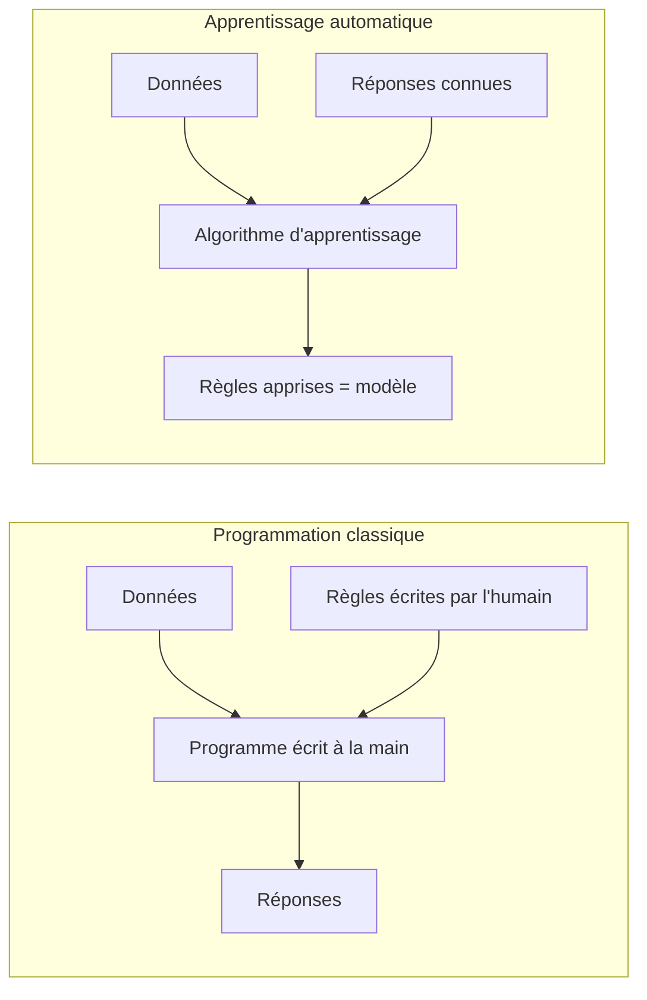

En programmation classique, l'humain fournit les **règles** et les **données**, la machine produit les **réponses**. En apprentissage automatique, on inverse : l'humain fournit les **données** et les **réponses observées**, et la machine produit les **règles** (sous la forme d'un *modèle*). C'est ce renversement qui rend la discipline si puissante : on peut résoudre des problèmes pour lesquels personne ne sait écrire la règle à la main (reconnaître un chat sur une photo, traduire une phrase, prévoir des ventes).

> **L'idée maîtresse, en une phrase.** Apprendre à partir de données, c'est *chercher, dans une grande famille de règles possibles, celle qui explique le mieux ce qu'on a déjà observé, dans l'espoir qu'elle explique aussi ce qu'on n'a pas encore vu.*

Cette phrase contient déjà toute la tension du domaine. « Expliquer le mieux ce qu'on a observé » : c'est l'**ajustement** (fit) aux données passées. « Expliquer aussi ce qu'on n'a pas encore vu » : c'est la **généralisation** (generalization). Un perroquet qui récite par cœur le carnet du marchand ajuste parfaitement le passé mais ne généralise pas : confronté à 28 °C, une valeur absente du carnet, il est muet. Tout l'art consiste à trouver le bon milieu.

#### Les trois grandes familles d'apprentissage

On distingue traditionnellement trois régimes, selon la nature de l'information dont on dispose.

| Régime | Ce qu'on possède | Question typique | Exemple |
|---|---|---|---|
| Supervisé (supervised) | Des entrées **et** les réponses attendues | « Quelle est la sortie pour cette entrée ? » | Prédire le prix d'un logement à partir de sa surface |
| Non supervisé (unsupervised) | Des entrées **sans** réponses | « Quelle structure se cache dans ces données ? » | Regrouper des clients en segments |
| Par renforcement (reinforcement) | Des récompenses suite à des actions | « Quelle action maximise la récompense à long terme ? » | Apprendre à un robot à marcher |

Ce chapitre, et le fil rouge qui le traverse, se concentrent sur l'**apprentissage supervisé**, le plus simple à appréhender et celui où les quatre piliers mathématiques se révèlent le plus clairement. Le marchand de glaces relève précisément de ce cas : chaque température (entrée) est accompagnée d'un nombre de ventes observé (réponse).

> **Remarque, une frontière qui bouge.** Ce classement en trois familles est commode, mais ses frontières sont floues. L'exemple le plus parlant est l'**auto-apprentissage** (self-supervised learning). Rappelons d'abord que l'apprentissage supervisé a besoin de paires *(question, bonne réponse)*, et que, d'ordinaire, c'est un humain qui fournit ces bonnes réponses, par exemple lire des milliers d'e-mails et marquer à la main « spam » ou « pas spam ». C'est long et coûteux. L'astuce de l'auto-apprentissage est de **fabriquer ces paires tout seul, à partir de texte brut**: on prend une phrase quelconque (trouvée sur Internet, par exemple), on **cache un mot**, et on demande au modèle de le deviner. La « question », c'est la phrase trouée ; la « bonne réponse », c'est le mot qu'on a caché, *et on la connaît déjà, puisque c'est nous qui venons de le retirer*. Aucun humain n'a eu à étiqueter quoi que ce soit : **chaque phrase qui existe devient un exercice avec sa correction incluse**. On peut donc en générer des **milliards** sans aucun travail d'annotation, c'est en ce sens que les réponses sont « gratuites ». C'est exactement ce qui a permis, depuis 2018, l'essor des **grands modèles de langage** (les IA conversationnelles type ChatGPT), entraînés sur d'immenses corpus de texte (un *corpus* est simplement une très grande collection de textes rassemblés, comme une gigantesque bibliothèque servant d'exemples). Et pourtant, le socle mathématique, lui, ne change pas.

#### Pourquoi des mathématiques ?

On pourrait croire qu'il suffit de « lancer un algorithme sur les données ». Mais dès qu'on veut répondre précisément à *quel modèle ?*, *le meilleur en quel sens ?*, *avec quelle confiance ?*, *trouvé comment ?*, on bute sur des questions qui sont chacune un pan des mathématiques :

- *Comment représenter une donnée, un modèle, une transformation ?* → **algèbre linéaire** (linear algebra).
- *Comment mesurer ce que signifie « le mieux », et comment l'atteindre ?* → **optimisation** (optimization), via le **calcul différentiel** (calculus).
- *Comment raisonner sur le hasard, le bruit, l'incertitude ?* → **probabilités** (probability).
- *Comment estimer une grandeur inconnue et juger la fiabilité d'une conclusion ?* → **statistique** (statistics).

Ce sont les **quatre piliers**. Le reste du chapitre les présente, puis les fait travailler ensemble sur un unique exemple déroulé de bout en bout. Mais commençons par préciser le vocabulaire : qu'appelle-t-on exactement *donnée*, *modèle*, *paramètre* ?

---

### Données, modèles et paramètres

Reprenons le carnet du marchand et donnons un nom mathématique à chaque ingrédient. C'est ici qu'apparaissent nos premiers symboles : nous allons les introduire **un par un**, en expliquant chacun comme on l'expliquerait à un enfant.

#### Les données : observations chiffrées

Une **donnée** (data point), ou *exemple*, est une situation observée. Le marchand a observé $`n`$ jours. Pour le jour numéro $`i`$, il a noté la température, qu'on appelle $`x_i`$, et les ventes, qu'on appelle $`y_i`$.

> **Le symbole $`\in`$ (« appartient à »).** Ce symbole ressemble à un petit « e » arrondi, comme la première lettre du mot « élément ». Il représente l'idée d'**être un membre de**, d'**appartenir à une collection**. Quand on écrit « $`x \in A`$ », on lit « $`x`$ appartient à $`A`$ », et cela veut dire : l'objet $`x`$ fait partie de la boîte $`A`$. Imaginez une trousse $`A`$ qui contient des crayons : si $`x`$ est un crayon de cette trousse, alors $`x \in A`$. À l'inverse, une gomme qui n'est pas dans la trousse n'y appartient pas.

> **Le symbole $`\mathbb{R}`$ (les nombres réels).** Ce symbole, un « R » à la barre doublée, représente l'ensemble de **tous les nombres de la droite graduée**: les entiers comme $`3`$, les nombres à virgule comme $`2{,}5`$ ou $`-0{,}7`$, et même des nombres infiniment précis comme $`\pi \approx 3{,}1415\ldots`$. (Le signe $`\approx`$, un « égal » ondulé, se lit « **environ égal à** » : il prévient que le nombre écrit n'est pas exact mais arrondi, juste assez proche. Et les trois petits points $`\ldots`$ veulent dire « **et ça continue** », ici les décimales se poursuivent sans fin.) Imaginez une règle d'écolier infiniment longue, sans aucun trou : chaque point de cette règle est un nombre réel. Écrire « $`x \in \mathbb{R}`$ » signifie donc simplement « $`x`$ est un nombre, repérable quelque part sur cette règle ». Une température comme $`28`$ ou $`19{,}3`$ est un réel.

> **Le symbole $`\mathbb{N}`$ (les nombres entiers naturels).** Toujours un « N » à barre doublée, il représente les **nombres qu'on utilise pour compter**: $`0, 1, 2, 3, 4, \ldots`$ et ainsi de suite sans fin, mais **sans virgule ni nombre négatif**. Imaginez que vous comptez des billes dans un sac : vous ne direz jamais « j'ai $`2{,}5`$ billes » ni « j'ai $`-3`$ billes ». Le nombre de jours observés, $`n`$, ou le numéro d'un jour, $`i`$, sont des entiers naturels : $`n \in \mathbb{N}`$, $`i \in \mathbb{N}`$.

> **Les indices, comme $`x_i`$.** Le petit nombre écrit en bas à droite, ici le $`i`$ de $`x_i`$, est un **indice** (index) : c'est une étiquette qui dit *de quel élément on parle*. Pensez à une rangée de casiers numérotés : $`x_1`$ est ce qu'il y a dans le casier 1, $`x_2`$ dans le casier 2, et $`x_i`$ dans le casier numéro $`i`$, où $`i`$ est un numéro qu'on peut faire varier. L'indice ne change pas la nature de l'objet (c'est toujours une température), il dit juste *lequel*.

Avec ces symboles, on écrit proprement : pour chaque jour $`i \in \{1, 2, \ldots, n\}`$, on dispose d'un couple $`(x_i, y_i)`$ avec $`x_i \in \mathbb{R}`$ (la température) et $`y_i \in \mathbb{R}`$ (les ventes). L'**ensemble d'apprentissage** (training set) est la collection de tous ces couples :

```math
\mathcal{D} = \{ (x_1, y_1),\ (x_2, y_2),\ \ldots,\ (x_n, y_n) \}.
```

> **Le symbole $`\mathcal{D}`$ et les accolades $`\{\ \}`$.** La lettre $`\mathcal{D}`$ (un « D » calligraphié) est juste un **nom** qu'on donne à notre paquet de données, comme on appellerait « Médor » son chien. Les accolades $`\{\ \}`$, elles, signifient « **l'ensemble contenant** » : tout ce qui est écrit entre elles forme une collection, comme les objets posés dans une boîte. Ainsi $`\mathcal{D}`$ est la boîte qui contient les $`n`$ couples observés.

En pratique, une donnée a rarement un seul nombre. Pour prédire le prix d'un logement, on dispose de la surface, du nombre de pièces, de l'étage, etc. On regroupe alors ces $`d`$ nombres dans un **vecteur** (vector), c'est-à-dire une liste ordonnée :

```math
\mathbf{x}_i = \begin{pmatrix} x_{i,1} \\ x_{i,2} \\ \vdots \\ x_{i,d} \end{pmatrix} \in \mathbb{R}^d .
```

> **Le symbole $`\mathbb{R}^d`$ et le gras $`\mathbf{x}`$.** Quand on met un petit exposant $`d`$ sur $`\mathbb{R}`$, on parle de **listes de $`d`$ nombres réels**: $`\mathbb{R}^2`$ ce sont les couples $`(a, b)`$ (comme les coordonnées d'un point sur une carte, abscisse et ordonnée), $`\mathbb{R}^3`$ les triplets (longueur, largeur, hauteur d'une boîte), et $`\mathbb{R}^d`$ des listes de $`d`$ cases. On écrit le vecteur **en gras**, $`\mathbf{x}`$, pour le distinguer d'un simple nombre $`x`$: le gras prévient « attention, ici il y a plusieurs nombres rangés ensemble, pas un seul ». Les trois points verticaux $`\vdots`$ veulent dire « et ainsi de suite, on ne réécrit pas toutes les lignes ».

Chaque case $`x_{i,j}`$ s'appelle une **caractéristique** (feature) : le numéro $`j`$ dit *quelle* caractéristique (surface, nombre de pièces…), le numéro $`i`$ dit *quel* exemple. Dans notre fil rouge du marchand, $`d = 1`$: une seule caractéristique, la température, et le vecteur se réduit à un simple nombre.

#### Le modèle : une famille de règles candidates

Un **modèle** (model) est une **fonction** qui transforme une entrée en une prédiction. Voici le symbole le plus important du cours.

> **La notation fonctionnelle $`f(x)`$.** Le symbole $`f`$ représente une **machine qui transforme**: on lui donne quelque chose à l'entrée, elle recrache quelque chose à la sortie. L'écriture « $`f(x)`$ » se lit « $`f`$ de $`x`$ » et signifie « le résultat que produit la machine $`f`$ quand on lui donne $`x`$ ». Imaginez un distributeur automatique : vous insérez une pièce (l'entrée $`x`$), vous obtenez une canette (la sortie $`f(x)`$). Si la machine $`f`$ est « ajouter 3 », alors $`f(2) = 5`$ et $`f(10) = 13`$. La même machine, des entrées différentes, des sorties différentes. Une fonction, c'est donc une **règle de transformation fiable**: à chaque entrée elle associe une et une seule sortie.

Pour le marchand, le modèle prédit les ventes à partir de la température. Le modèle le plus simple imaginable est une **droite**: « les ventes sont, à peu près, un certain coefficient fois la température, plus une constante ». (Un *coefficient* est juste un **nombre fixe par lequel on multiplie** une quantité, comme le « 2 » dans « 2 fois la longueur » ; une *constante* est un nombre qui ne bouge pas, qu'on ajoute toujours pareil.) Mathématiquement :

```math
f(x) = a \, x + b .
```

> **Écrire deux quantités côte à côte, c'est les multiplier.** Dans $`a \, x`$, il n'y a aucun signe entre le $`a`$ et le $`x`$ : en mathématiques, **poser deux quantités l'une à côté de l'autre signifie « les multiplier »**. Ainsi $`a \, x`$ se lit « $`a`$ fois $`x`$ », exactement comme $`3 \times x`$ se note aussi $`3x`$. On garde le signe $`\times`$ pour les nombres écrits en chiffres et on l'omet dès qu'une lettre entre en jeu, pour ne pas confondre le signe $`\times`$ avec la lettre $`x`$. Cette règle vaut pour tout le reste du cours : plus loin, $`\eta \nabla J`$ voudra dire « $`\eta`$ fois $`\nabla J`$ », et $`X\boldsymbol{\theta}`$ « $`X`$ fois $`\boldsymbol{\theta}`$ ».

Ici $`a`$ est la **pente** (de combien de glaces les ventes montent quand la température monte de un degré) et $`b`$ l'**ordonnée à l'origine** (les ventes prédites à $`0`$ °C). Le point essentiel : **$`a`$ et $`b`$ ne sont pas fixés**. En les faisant varier, on obtient une *infinité de droites différentes*, toute une famille de règles candidates. Apprendre, ce sera choisir le couple $`(a, b)`$ qui colle le mieux au carnet.

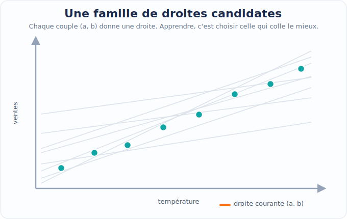

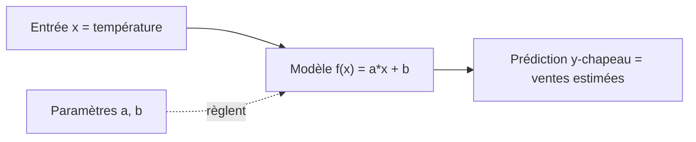

#### Les paramètres : les boutons réglables du modèle

Les nombres qu'on ajuste, ici $`a`$ et $`b`$, sont les **paramètres** (parameters) du modèle. On les regroupe souvent dans un vecteur $`\boldsymbol{\theta}`$ (la lettre grecque « thêta »). Pour la droite, $`\boldsymbol{\theta} = (a, b)`$, et l'on écrit parfois $`f_{\boldsymbol\theta}(x)`$ pour rappeler que la prédiction dépend du réglage choisi.

> **Le symbole $`\boldsymbol{\theta}`$ (thêta).** C'est une lettre de l'alphabet grec, qu'on utilise par tradition pour désigner « **les réglages inconnus qu'on cherche** ». Pensez aux boutons d'une vieille radio : tourner le bouton du volume et celui de la fréquence change le son qui sort. Ici $`\boldsymbol{\theta}`$ regroupe tous les boutons du modèle ; pour la droite, $`\boldsymbol{\theta} = (a, b)`$, deux boutons. Trouver le bon $`\boldsymbol{\theta}`$, c'est régler la radio jusqu'à entendre la station clairement.

Il faut distinguer deux espèces de réglages, souvent confondues par les débutants :

> **Paramètres vs hyperparamètres.**
> Un **paramètre** est appris **par** l'algorithme à partir des données ($`a`$ et $`b`$ de la droite, les millions de poids d'un réseau de neurones ; un *poids*, en apprentissage, est simplement un coefficient réglable, un nombre par lequel on multiplie une entrée, plus il est grand plus cette entrée compte).
> Un **hyperparamètre** (hyperparameter) est choisi **par l'humain avant** l'apprentissage et n'est pas ajusté par la descente sur les données (le degré d'un polynôme, le taux d'apprentissage, la force d'une régularisation ; un *polynôme* est une formule bâtie avec des puissances de $`x`$ comme $`x^2`$ ou $`x^3`$, et son *degré* est la plus haute puissance utilisée, donc « plus le degré est grand, plus la courbe peut se tortiller » ; la *régularisation* est un frein qu'on ajoute pour **empêcher le modèle de devenir trop tarabiscoté**, un peu comme une laisse qui l'oblige à rester simple plutôt qu'à épouser le moindre détail). On le règle typiquement par validation. Confondre les deux est une source classique d'erreurs méthodologiques.

#### La fonction de coût : mesurer « le mieux »

Pour choisir entre deux droites, il faut un **juge** chiffré : un nombre qui dit à quel point une prédiction se trompe. C'est la **fonction de coût** (cost function), aussi appelée fonction de perte (loss function). L'idée : comparer, sur chaque jour, la prédiction $`f_{\boldsymbol\theta}(x_i)`$ à la vraie valeur $`y_i`$, et cumuler les écarts.

Pour cumuler, on a besoin du symbole de sommation.

> **Le symbole $`\sum`$ (somme, « sigma »).** Cette grande lettre grecque en forme de « E » anguleux représente une **addition répétée**: c'est une *boucle qui additionne*. L'écriture
> ```math
> \sum_{i=1}^{n} u_i
> ```
> se lit « somme, pour $`i`$ allant de $`1`$ jusqu'à $`n`$, des $`u_i`$ », et veut simplement dire $`u_1 + u_2 + \cdots + u_n`$. Décortiquons les étiquettes : le « $`i=1`$ » sous le sigma dit *où commence le compteur*; le « $`n`$ » au-dessus dit *où il s'arrête*; le $`u_i`$ à droite dit *ce qu'on additionne à chaque tour*. Imaginez que vous faites le tour d'une classe et que vous additionnez les billes de chaque élève : vous commencez à l'élève 1, vous vous arrêtez au dernier (le $`n`$-ième), et à chaque élève vous ajoutez son nombre de billes. Le sigma, c'est exactement cette tournée d'addition.

La fonction de coût la plus courante en régression est l'**erreur quadratique moyenne** (mean squared error, MSE). Le mot **quadratique** veut simplement dire « au carré » (il vient de *quadratus*, « carré » en latin) : « erreur quadratique moyenne » se lit donc « la moyenne des erreurs au carré ». Pour chaque jour, on mesure l'**écart** entre la prédiction du modèle et la vraie valeur, puis on résume tous ces écarts en un seul nombre qui dit «&nbsp;à quel point on se trompe&nbsp;». On élève chaque écart au carré, pour deux raisons précises.

> **Raison 1 : empêcher les erreurs de s'annuler.** Un écart peut être **négatif** (on a sous-estimé la vente) ou **positif** (on a surestimé). Si on additionnait les écarts bruts, un écart de $`+10`$ et un écart de $`-10`$ se compenseraient et donneraient $`0`$, ce qui laisserait croire à tort que le modèle ne se trompe pas. Le carré fait disparaître le signe : $`(+10)^2`$ et $`(-10)^2`$ valent tous les deux $`100`$. Chaque erreur devient donc positive et **s'ajoute** aux autres au lieu de s'annuler.
>
> **Raison 2 : pénaliser fortement les grosses erreurs.** Parce qu'on met au carré, une erreur deux fois plus grande coûte quatre fois plus cher, et une erreur dix fois plus grande, cent fois plus cher. Le modèle est ainsi fortement incité à éviter un gros raté, quitte à accepter plusieurs petits.

On fait enfin la **moyenne** de ces carrés sur les $`n`$ jours :

```math
J(\boldsymbol{\theta}) = \frac{1}{n} \sum_{i=1}^{n} \big( f_{\boldsymbol{\theta}}(x_i) - y_i \big)^2 = \frac{1}{n} \sum_{i=1}^{n} \big( a\, x_i + b - y_i \big)^2 .
```

> **Lecture de $`J(\boldsymbol{\theta})`$.** La lettre $`J`$ est le nom du juge : on lui donne un réglage $`\boldsymbol{\theta}`$ et il renvoie un nombre, d'autant plus **petit** que le modèle est bon. Le « $`\frac{1}{n}`$ » devant transforme la somme en **moyenne** (on partage le total entre les $`n`$ jours, comme on partage une addition de restaurant entre les convives). L'exposant $`2`$ sur la parenthèse veut dire « **au carré** », c'est-à-dire le nombre multiplié par lui-même : un écart de $`3`$ compte pour $`9`$, un écart de $`5`$ pour $`25`$, les grosses erreurs pèsent donc beaucoup plus lourd.

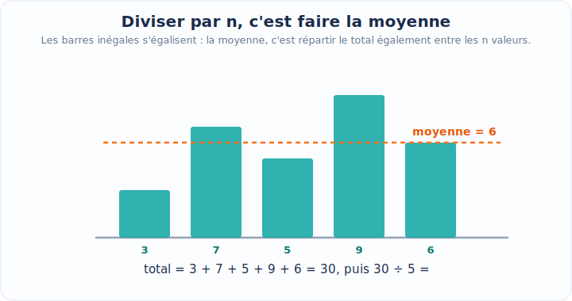


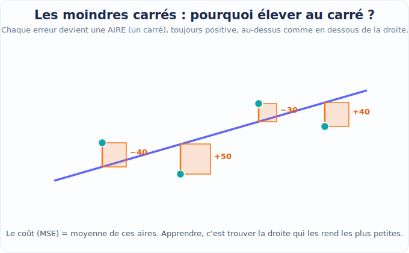

Apprendre se reformule alors en un problème net : **trouver le réglage $`\boldsymbol{\theta}`$ qui rend $`J(\boldsymbol{\theta})`$ le plus petit possible.** C'est un problème d'optimisation, deuxième pilier. Mais avant de le résoudre, prenons de la hauteur et regardons les quatre piliers ensemble.

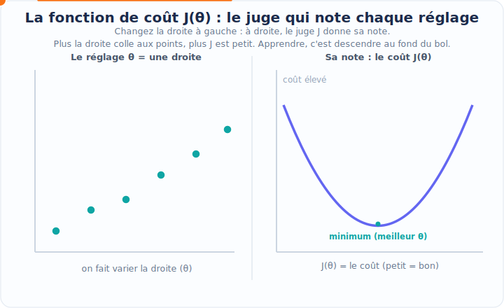

> **Mise à jour 2026.** Le triptyque *données → modèle → paramètres* est resté identique des moindres carrés de Gauss et Legendre (vers 1805–1809) aux modèles de fondation (foundation models) actuels. Ce qui a explosé, c'est l'**échelle**: un grand modèle de langage compte aujourd'hui des dizaines à des centaines de milliards de paramètres, et les « données » sont des corpus de plusieurs milliers de milliards de tokens (un *token* est un petit morceau de texte, en gros un mot ou un bout de mot, l'unité élémentaire que le modèle lit et produit). La nouveauté conceptuelle n'est pas dans la définition, mais dans les *lois d'échelle* (scaling laws) qui relient empiriquement la performance à la taille du modèle, à la quantité de données et au budget de calcul. (« Empiriquement » veut dire « **constaté par l'observation et l'expérience** », pas démontré sur le papier : on l'a vu se produire en pratique, comme une recette de cuisine qui marche même sans qu'on sache pourquoi.)

---

### Les quatre piliers mathématiques

Tout l'édifice de l'apprentissage automatique repose sur quatre disciplines mathématiques qui se répondent. On peut les voir comme les quatre pieds d'une table : retirez-en un, et tout penche.

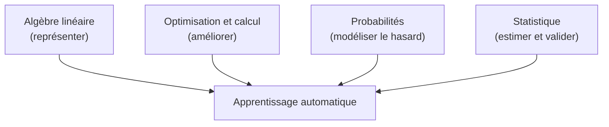

| Pilier | Verbe-clé | Question à laquelle il répond | Objets centraux |
|---|---|---|---|
| Algèbre linéaire | **Représenter** | Comment encoder et transformer données et modèles ? | Vecteurs, matrices, produits, projections, valeurs propres |
| Optimisation & calcul | **Améliorer** | Comment trouver les meilleurs paramètres ? | Dérivée, gradient, descente de gradient, convexité |
| Probabilités | **Modéliser le hasard** | Comment décrire le bruit et l'incertitude ? | Variable aléatoire, loi, espérance, variance |
| Statistique | **Estimer & valider** | Comment inférer des grandeurs et juger la fiabilité ? | Estimateur, biais, variance, vraisemblance, test |

#### Pilier 1 : L'algèbre linéaire : le langage des données

Dès qu'une donnée a plusieurs caractéristiques, c'est un vecteur ; dès qu'on empile plusieurs exemples, c'est une **matrice** (matrix). Empilons les $`n`$ exemples (un par ligne), chacun ayant $`d`$ caractéristiques (une par colonne) : on obtient la **matrice de conception** (design matrix) $`X \in \mathbb{R}^{n \times d}`$.

> **Le symbole $`\mathbb{R}^{n \times d}`$ (une matrice).** Une matrice est un **tableau rectangulaire de nombres**, comme une grille de classeur ou un échiquier rempli de chiffres. L'écriture $`n \times d`$ (lue « $`n`$ par $`d`$ ») donne ses dimensions : $`n`$ lignes et $`d`$ colonnes. Imaginez un tableau Excel où chaque **ligne** est un jour observé et chaque **colonne** une caractéristique mesurée : c'est exactement une matrice de conception.

Le modèle linéaire à $`d`$ caractéristiques s'écrit alors d'un seul coup pour tous les exemples grâce au **produit matrice-vecteur**. En notant $`\hat{\mathbf{y}} \in \mathbb{R}^n`$ le vecteur des $`n`$ prédictions et $`\boldsymbol\theta \in \mathbb{R}^d`$ le vecteur des $`d`$ paramètres (l'expression « **composante par composante** » qui suit veut dire « case par case » : une *composante* d'un vecteur est l'un des nombres rangés dedans, et on décrit ici ce que vaut chaque case prise séparément) :

```math
\hat{\mathbf{y}} = X \boldsymbol{\theta},
\qquad \text{soit composante par composante} \qquad
\hat{y}_i = \sum_{j=1}^{d} X_{i,j}\, \theta_j .
```

> **Que veut dire « linéaire » ?** Le mot vient de « ligne ». Une relation est **linéaire** quand elle est *proportionnelle et additive* : chaque quantité agit seulement en étant multipliée par un nombre fixe, et ces effets s'**additionnent**, sans rien de plus (jamais de carré, jamais de produit entre deux quantités, jamais de courbe). Avec une seule variable, cela trace une **droite** : si la variable double, son effet double, ni plus ni moins. Le contraire (une courbe, un effet qui s'emballe ou sature) est dit *non linéaire*. Un **modèle linéaire** applique exactement cette idée : la prédiction est une somme où chaque caractéristique est multipliée par un poids, puis le tout est additionné. C'est le **ticket de caisse** au supermarché : pour chaque article, quantité × prix unitaire, puis on additionne toutes les lignes pour obtenir le total. Ici les « quantités » sont les caractéristiques $`X_{i,j}`$, les « prix unitaires » sont les poids $`\theta_j`$, et le total est la prédiction $`\hat{y}_i`$.

Les dimensions concordent : multiplier une matrice $`n \times d`$ par un vecteur de taille $`d`$ produit bien un vecteur de taille $`n`$, une prédiction par exemple.


> **Le chapeau, comme dans $`\hat{y}`$.** Le petit accent en forme de toit, $`\hat{y}`$ (lu « y chapeau »), signifie « **valeur estimée / prédite** », par opposition à $`y`$ qui est la **vraie** valeur observée. Pensez au chapeau comme à une étiquette « ceci est une supposition de la machine, pas la réalité mesurée ». L'écart entre $`y`$ (réalité) et $`\hat{y}`$ (prédiction) est précisément ce que la fonction de coût cherche à réduire.

Ce simple produit $`X\boldsymbol{\theta}`$ encapsule des milliers d'additions et de multiplications. L'algèbre linéaire fournit aussi des outils profonds : la **décomposition en valeurs singulières** (singular value decomposition, SVD) pour comprendre la structure d'une matrice, l'**analyse en composantes principales** (principal component analysis, ACP/PCA) pour réduire la dimension, les **valeurs propres** (eigenvalues) pour analyser la stabilité d'un système. Tout cela sera détaillé dans les chapitres dédiés ; pour l'instant, retenez : *l'algèbre linéaire est l'alphabet dans lequel s'écrivent les données et les modèles.*

> **Mise à jour 2026.** Sur de très grandes matrices, on n'utilise plus les SVD/ACP exactes mais des **méthodes randomisées** (randomized SVD) : on projette d'abord la matrice sur un petit sous-espace aléatoire (*projeter*, c'est écraser un objet sur un support plus petit pour n'en garder que l'ombre, comme la projection d'une main sur un mur ; un *sous-espace* est une partie plus petite de l'espace, ici quelques directions choisies au hasard parmi toutes), ce qui donne une approximation excellente pour un coût bien moindre. C'est devenu un standard dès que $`n`$ ou $`d`$ dépasse quelques dizaines de milliers.

#### Pilier 2 : L'optimisation et le calcul : la mécanique de l'amélioration

Une fois le coût $`J(\boldsymbol{\theta})`$ défini, comment trouver son minimum ? L'outil fondamental est la **dérivée**, qui mesure une pente. En plusieurs dimensions, la pente devient le **gradient**.

> **Le symbole $`\nabla`$ (nabla, le gradient).** Ce triangle pointant vers le bas, $`\nabla`$, représente le **gradient**: c'est la collection de toutes les pentes du coût, une dans chaque direction de réglage. Imaginez que vous êtes sur une colline dans le brouillard et que vous voulez descendre : en chaque point, le gradient est la flèche qui pointe vers la montée la plus raide. Pour descendre, il suffit donc d'aller **dans le sens opposé** à cette flèche. Le gradient $`\nabla J(\boldsymbol{\theta})`$ rassemble, pour chaque bouton de réglage, « de combien le coût augmente si je tourne légèrement ce bouton ».

L'algorithme-roi est la **descente de gradient** (gradient descent) : partir d'un réglage quelconque, calculer la pente, faire un petit pas en sens inverse, recommencer.

```math
\boldsymbol{\theta}_{t+1} = \boldsymbol{\theta}_t - \eta \, \nabla J(\boldsymbol{\theta}_t).
```

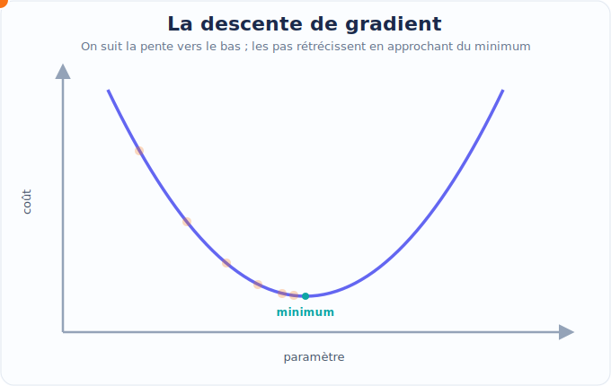

> **Le symbole $`\eta`$ (êta, le taux d'apprentissage).** Cette lettre grecque (qui ressemble à un « n » avec une jambe qui descend) est le **taux d'apprentissage** (learning rate) : la **taille du pas** qu'on fait à chaque étape. Trop petit, on descend la colline à pas de fourmi (très lent) ; trop grand, on enjambe le creux et on rebondit d'un versant à l'autre sans jamais atteindre le fond. Le $`t`$ en indice, lui, est le **numéro de l'étape**: $`\boldsymbol{\theta}_0`$ est le réglage de départ, $`\boldsymbol{\theta}_1`$ après un pas, et ainsi de suite.

La **convexité** (convexity) joue un rôle décisif : si la surface du coût a la forme d'un bol unique (cas du MSE linéaire), la descente atteint le fond, le minimum global. Si elle est bosselée (cas des réseaux profonds), on peut rester coincé dans un creux local. Le calcul différentiel (dérivées partielles, règle de la chaîne) est le moteur qui rend tout cela calculable.

> **Que veut dire « convexe » ?** Une courbe (ou une surface) est **convexe** quand elle a la forme d'un **bol** ou d'une **vallée** : elle se creuse régulièrement vers le bas, avec un seul fond, sans aucune bosse. Sa propriété précieuse : où que vous lâchiez une bille dessus, elle roule toujours vers le **même** point le plus bas. À l'inverse, une surface **bosselée** (on dit *non convexe*) possède plusieurs creux séparés par des bosses ; une bille peut alors se bloquer dans un petit creux, un **minimum local** (le fond d'un creux qui n'est pas le plus profond), sans jamais atteindre le vrai fond, le **minimum global** (le point le plus bas de toute la surface). Voilà pourquoi la convexité est si recherchée : elle garantit que la descente de gradient termine au meilleur endroit possible, jamais dans un creux médiocre.

> **Mise à jour 2026.** Deux révolutions ont transformé ce pilier. (1) La **différentiation automatique** (automatic differentiation, *autodiff*) des bibliothèques comme PyTorch et JAX calcule le gradient $`\nabla J`$ exactement et automatiquement, même pour des modèles à des milliards de paramètres : on n'écrit plus jamais les dérivées à la main. (2) Les optimiseurs **Adam** et **AdamW** (vers 2015–2019) adaptent un taux d'apprentissage par paramètre et sont devenus le réglage par défaut du deep learning (l'*apprentissage profond*: l'apprentissage automatique fondé sur des réseaux de neurones comportant de nombreuses couches empilées), là où la descente de gradient « brute » suffisait pour les modèles linéaires.

> **Que veut dire « descente de gradient brute » (et pourquoi suffit-elle ici) ?** La version « brute » (on dit aussi *vanilla*, comme la glace nature, sans rien ajouté) est la descente la plus simple possible : à chaque étape, $`\boldsymbol{\theta} \leftarrow \boldsymbol{\theta} - \eta\,\nabla J`$, c'est-à-dire « je recule un peu dans le sens de la pente », avec **le même pas $`\eta`$ pour tous les boutons** et **aucune** astuce d'adaptation. La flèche $`\leftarrow`$ se lit ici « devient » : on remplace l'ancienne valeur de $`\boldsymbol{\theta}`$ par la nouvelle. Pour un modèle linéaire, cette version simple **suffit** parce que son coût (le MSE) est *convexe*, c'est-à-dire en forme de bol unique (notion expliquée plus haut). Sur un bol unique, une bille roule toujours jusqu'au seul fond, le minimum global : il n'y a aucune bosse où se coincer, donc inutile d'être plus malin qu'un pas fixe. Les réseaux profonds, eux, ont un coût *non convexe*: une surface bosselée avec plusieurs creux et des pentes d'échelles très différentes selon le bouton. La descente brute y devient lente et hésitante ; c'est pourquoi Adam et AdamW, qui **dosent le pas bouton par bouton**, s'imposent dans ce cas.

#### Pilier 3 : Les probabilités : le langage de l'incertitude

Les données réelles sont bruitées. Deux jours à $`25`$ °C ne donnent pas exactement les mêmes ventes : la pluie, un événement local, le hasard interviennent. Les **probabilités** offrent le vocabulaire pour modéliser ce bruit.

> **Le symbole $`\mathbb{P}`$ et la variable aléatoire.** $`\mathbb{P}(A)`$ (un « P » à barre doublée) représente la **probabilité** de l'événement $`A`$: un nombre entre $`0`$ (impossible) et $`1`$ (certain) qui mesure *à quel point on s'attend à ce que $`A`$ se produise*. Une **variable aléatoire** (random variable) est, quant à elle, une quantité dont la valeur dépend du hasard, comme le résultat d'un dé pas encore lancé. Imaginez un sac de billes de couleurs : tirer une bille au hasard est l'expérience, et $`\mathbb{P}(\text{bleue})`$ est la part de billes bleues dans le sac.

L'objet central pour résumer une variable aléatoire est l'**espérance** (expectation), notée $`\mathbb{E}`$: c'est sa **valeur moyenne à long terme**.

> **Le symbole $`\mathbb{E}`$ (espérance).** $`\mathbb{E}[Z]`$ se lit « espérance de $`Z`$ » et représente la **moyenne qu'on obtiendrait en répétant l'expérience une infinité de fois**. Pensez à un jeu de dé équilibré à six faces où vous gagnez le nombre affiché : vous ne savez pas ce que vous gagnerez au prochain lancer, mais sur des milliers de lancers, vous gagnez en moyenne $`\frac{1+2+3+4+5+6}{6} = 3{,}5`$ par lancer, c'est l'espérance. C'est le « centre de gravité » de la variable aléatoire.

Le bruit du marchand se modélise typiquement ainsi : la vraie valeur est la droite plus un aléa $`\varepsilon`$ (epsilon) de moyenne nulle (un *aléa* est une **petite quantité tirée au hasard**, qui change à chaque fois ; « de moyenne nulle » veut dire qu'en s'accumulant ces hasards se compensent et tournent autour de zéro, autant en plus qu'en moins),

```math
y_i = a\, x_i + b + \varepsilon_i, \qquad \varepsilon_i \sim \mathcal{N}(0, \sigma^2).
```

> **Les symboles $`\varepsilon`$, $`\sim`$ et $`\mathcal{N}(0,\sigma^2)`$.** La lettre $`\varepsilon`$ (epsilon grec) désigne par tradition une **petite quantité**, ici le **bruit** qui s'ajoute à la prédiction idéale. Le symbole $`\sim`$ se lit « **suit la loi** » : il dit *de quelle façon le hasard est distribué*. Enfin $`\mathcal{N}(0, \sigma^2)`$ désigne la célèbre **loi normale** (normal distribution), la fameuse « courbe en cloche » : la plupart des valeurs sont proches du centre ($`0`$ ici), les valeurs extrêmes sont rares. Le $`\sigma^2`$ (sigma au carré) est la **variance**, qui mesure *l'étalement* de la cloche : petit $`\sigma^2`$, cloche étroite et bruit faible ; grand $`\sigma^2`$, cloche large et bruit fort. Imaginez des fléchettes lancées vers un centre : $`0`$ est la cible visée, $`\sigma`$ dit à quel point elles se dispersent autour.

Ce point de vue probabiliste est fécond : il transforme « ajuster une droite » en « estimer les paramètres d'un modèle de génération de données ». Et, magie que nous démontrerons, **minimiser l'erreur quadratique revient exactement à maximiser la vraisemblance** sous l'hypothèse d'un bruit gaussien (la **vraisemblance** mesure à quel point un réglage rend *plausibles* les données réellement observées ; elle est définie précisément à l'Étape 5 ci-dessous). Les deux premiers piliers (coût, optimisation) et le troisième (probabilités) se rejoignent.

#### Pilier 4 : La statistique : estimer et valider

La statistique se demande : *à partir d'un échantillon fini, que peut-on conclure, et avec quelle confiance ?* (Un *échantillon* est une **poignée d'exemples prélevés** dans un ensemble bien plus vaste, comme la cuillerée de soupe qu'on goûte pour juger toute la marmite ; *fini* veut dire « en nombre limité », on n'a pas l'infinité des cas possibles.) Un **estimateur** (estimator) est une recette qui, à partir des données, produit une estimation d'une quantité inconnue (par exemple $`\hat{a}`$ et $`\hat{b}`$ estiment les vrais $`a, b`$). On juge un estimateur par son **biais** (bias, l'erreur systématique) et sa **variance de l'estimateur** (variance, l'instabilité d'un échantillon à l'autre).

> **Attention, ce mot « variance » ne désigne pas la même chose qu'avant.** Le mot **étalement** veut simplement dire « à quel point des nombres sont éparpillés » : serrés autour de leur centre, c'est un petit étalement ; très dispersés, c'est un grand étalement. Le piège, ici, c'est que deux choses différentes s'éparpillent.
>
> Plus haut, la variance $`\sigma^2`$ mesurait l'étalement **des données** : les ventes réelles ne tombent jamais pile sur la vraie droite, elles tremblent un peu au-dessus et un peu en-dessous, et $`\sigma^2`$ dit l'ampleur de ce tremblement. C'est le **bruit** des mesures.
>
> La **variance de l'estimateur**, elle, mesure l'étalement de **votre résultat**. Un estimateur est une recette qui prend les données (le carnet) et en ressort une réponse ($`\hat{a}`$ et $`\hat{b}`$, la droite trouvée). Si vous refaisiez le calcul avec un échantillon un peu différent (quelques jours du carnet retirés ou remplacés), la recette ressortirait une droite un peu différente. La variance de l'estimateur dit de combien cette droite-résultat **saute d'un échantillon à l'autre** : c'est la stabilité de votre conclusion, pas le désordre des données.
>
> Même mot « variance », donc, mais deux objets distincts : d'un côté le tremblement des **données brutes**, de l'autre l'instabilité de la **droite que vous calculez**. Gardez-les bien séparés, surtout dans le compromis biais-variance qui suit.


C'est ici que vit la tension fondamentale de tout l'apprentissage, le **compromis biais-variance** (bias-variance tradeoff) :

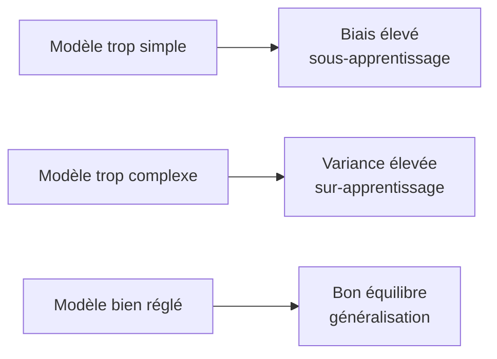

> **Sous-apprentissage et sur-apprentissage.**
> Le **sous-apprentissage** (underfitting) : le modèle est trop pauvre pour capturer la tendance (une droite pour des données en forme de vague). Beaucoup de biais.
> Le **sur-apprentissage** (overfitting) : le modèle est si flexible qu'il épouse le bruit, mémorisant les données d'entraînement sans généraliser (le perroquet du marchand). Beaucoup de variance.
> Le but est l'**équilibre**: un modèle qui capte le signal sans coller au bruit. (Le *signal* est la **vraie tendance régulière** cachée dans les données, ce qu'on cherche à apprendre ; le *bruit* est le fouillis aléatoire qui la masque. Comme à la radio : la chanson est le signal, les grésillements sont le bruit.)

C'est la statistique qui fournit les protocoles pour mesurer la vraie performance : séparer les données en jeu d'entraînement / jeu de test (deux tas distincts : un pour apprendre, un autre, mis de côté, pour vérifier sur des cas jamais vus), faire de la **validation croisée** (cross-validation ; on découpe les données en plusieurs parts et on teste tour à tour sur chacune pendant qu'on apprend sur les autres, pour un verdict plus fiable), construire des **intervalles de confiance** (confidence intervals ; une fourchette du type « la vraie valeur est probablement entre tant et tant », qui dit l'incertitude plutôt qu'un chiffre sec), conduire des **tests d'hypothèse** (hypothesis tests ; une procédure qui tranche si un résultat observé est réel ou s'il pourrait n'être qu'un coup de chance). Sans elle, on confond mémorisation et compréhension.

> **Le piège n°1 du débutant.** Évaluer un modèle sur les **données qui ont servi à l'entraîner** donne un score artificiellement flatteur. *On ne juge jamais un élève en lui reposant exactement les questions de ses propres fiches de révision.* La performance qui compte est celle sur des données **jamais vues** pendant l'apprentissage. Ce principe, simple mais constamment oublié, est le cœur de la méthodologie expérimentale en apprentissage.

> **Mise à jour 2026.** Le compromis biais-variance classique prédit qu'un modèle trop complexe sur-apprend toujours. Or les réseaux très surparamétrés (plus de paramètres que de données) généralisent souvent excellemment : le phénomène de **double descente** (double descent), bien documenté depuis 2019, montre que l'erreur de test peut *rediminuer* au-delà du point d'interpolation (l'*interpolation*, c'est quand le modèle passe **exactement** par tous les points d'entraînement, sans en rater un seul). Cela n'invalide pas le compromis, il faut le lire à travers des notions de complexité plus fines (régularisation implicite de la descente de gradient, norme des solutions ; la *norme* d'une liste de nombres est sa **longueur**, sa taille globale, à la façon dont la longueur d'une flèche résume tout son trajet), mais il a profondément renouvelé la théorie de la généralisation.

Ces quatre piliers ne vivent pas séparément : ils collaborent sur le moindre problème. Pour le montrer concrètement, déroulons maintenant le fil rouge de bout en bout.

---

### Fil rouge : ajuster une droite, de bout en bout

Reprenons le marchand de glaces et résolvons son problème **complètement**, en mobilisant les quatre piliers. C'est l'exemple canonique de la **régression linéaire** (linear regression) : il est assez simple pour être traité à la main, assez riche pour contenir, en germe, presque toute la discipline.

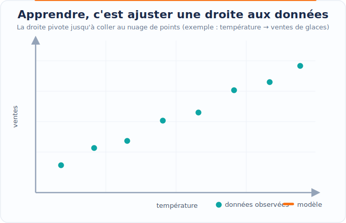

#### Étape 0 : Les données chiffrées

Prenons un petit jeu de $`n = 5`$ jours (volontairement minuscule pour tout calculer à la main).

| Jour $`i`$ | Température $`x_i`$ (°C) | Ventes $`y_i`$ |
|---|---|---|
| 1 | 15 | 40 |
| 2 | 18 | 50 |
| 3 | 20 | 60 |
| 4 | 23 | 65 |
| 5 | 24 | 70 |

L'œil devine une tendance croissante presque rectiligne. Cherchons la **meilleure droite** $`f(x) = a\,x + b`$ au sens des moindres carrés.

#### Étape 1 : Poser le problème (pilier optimisation)

On cherche $`(a, b)`$ minimisant l'erreur quadratique moyenne. Pour la régression linéaire simple, il existe une **solution exacte en forme close** (closed form) : on n'a même pas besoin de descente de gradient. (Une *solution en forme close* est une **formule toute faite** qui donne la réponse exacte d'un seul calcul direct, comme une recette qui livre le résultat sans avoir à tâtonner pas à pas.) Annulons les dérivées partielles du coût.

Le coût (on travaille avec la somme, car le facteur $`\frac1n`$ est une constante positive qui ne change pas le minimiseur, c'est-à-dire le **réglage qui rend le coût le plus petit** : multiplier le coût par un même nombre positif n'en déplace pas le point le plus bas) :

```math
S(a, b) = \sum_{i=1}^{n} \big( a\, x_i + b - y_i \big)^2 .
```

> **Le symbole $`\partial`$ (dérivée partielle).** Ce « d » arrondi, $`\partial`$, signifie « **dérivée partielle** » : on mesure la pente du coût en ne bougeant **qu'un seul** bouton à la fois, les autres restant figés. Imaginez une cuisine avec deux robinets, eau chaude et eau froide : $`\frac{\partial}{\partial a}`$ répond à « si je tourne *seulement* le robinet $`a`$, comment change la température de l'eau ? », sans toucher au robinet $`b`$. Au minimum d'un bol, *toutes* ces pentes sont nulles en même temps.

On dérive $`S`$ par rapport à $`a`$ puis à $`b`$ et on annule (règle de la chaîne sur le carré) :

```math
\frac{\partial S}{\partial a} = \sum_{i=1}^{n} 2\,(a x_i + b - y_i)\,x_i = 0,
\qquad
\frac{\partial S}{\partial b} = \sum_{i=1}^{n} 2\,(a x_i + b - y_i) = 0 .
```

En divisant par $`2`$ et en réarrangeant, on obtient le système dit des **équations normales** (normal equations) :

```math
\begin{cases}
a \displaystyle\sum_i x_i^2 + b \sum_i x_i = \sum_i x_i y_i, \\[2mm]
a \displaystyle\sum_i x_i + b\, n = \sum_i y_i .
\end{cases}
```

#### Étape 2 : Calculer les sommes (le sigma au travail)

Calculons chaque somme nécessaire. C'est littéralement la « tournée d'addition » du sigma.

| $`i`$ | $`x_i`$ | $`y_i`$ | $`x_i^2`$ | $`x_i y_i`$ |
|---|---|---|---|---|
| 1 | 15 | 40 | 225 | 600 |
| 2 | 18 | 50 | 324 | 900 |
| 3 | 20 | 60 | 400 | 1200 |
| 4 | 23 | 65 | 529 | 1495 |
| 5 | 24 | 70 | 576 | 1680 |
| **Σ** | **100** | **285** | **2054** | **5875** |

Donc $`\sum x_i = 100`$, $`\sum y_i = 285`$, $`\sum x_i^2 = 2054`$, $`\sum x_i y_i = 5875`$, et $`n = 5`$.

Les moyennes valent $`\bar{x} = 100/5 = 20`$ et $`\bar{y} = 285/5 = 57`$.

> **Le symbole $`\bar{x}`$ (barre, la moyenne).** La petite barre horizontale au-dessus, $`\bar{x}`$ (lu « x barre »), désigne la **moyenne** des valeurs : on additionne tout et on partage équitablement, $`\bar{x} = \frac1n \sum_i x_i`$. C'est le point d'équilibre, comme le centre d'une balançoire où les enfants assis de part et d'autre se font contrepoids.

#### Étape 3 : Résoudre les équations normales

Il existe une formule fermée très utile. En soustrayant les moyennes (centrage), la pente et l'ordonnée s'écrivent :

```math
\hat{a} = \frac{\displaystyle\sum_i (x_i - \bar{x})(y_i - \bar{y})}{\displaystyle\sum_i (x_i - \bar{x})^2},
\qquad
\hat{b} = \bar{y} - \hat{a}\,\bar{x}.
```

Calculons le numérateur $`\sum_i (x_i-\bar x)(y_i - \bar y)`$ et le dénominateur $`\sum_i (x_i-\bar x)^2`$ (dans une fraction écrite avec une barre, le *numérateur* est le nombre **du haut** et le *dénominateur* celui **du bas**, comme dans $`\frac{\text{haut}}{\text{bas}}`$) :

| $`i`$ | $`x_i-\bar x`$ | $`y_i-\bar y`$ | $`(x_i-\bar x)(y_i-\bar y)`$ | $`(x_i-\bar x)^2`$ |
|---|---|---|---|---|
| 1 | $`-5`$ | $`-17`$ | $`85`$ | $`25`$ |
| 2 | $`-2`$ | $`-7`$ | $`14`$ | $`4`$ |
| 3 | $`0`$ | $`3`$ | $`0`$ | $`0`$ |
| 4 | $`3`$ | $`8`$ | $`24`$ | $`9`$ |
| 5 | $`4`$ | $`13`$ | $`52`$ | $`16`$ |
| **Σ** | | | **175** | **54** |

D'où la pente et l'ordonnée à l'origine :

```math
\hat{a} = \frac{175}{54} \approx 3{,}2407,
\qquad
\hat{b} = \bar{y} - \hat{a}\,\bar{x} = 57 - \frac{175}{54}\times 20 \approx -7{,}8148 .
```

La droite ajustée est donc $`\boxed{\,\hat{y} = 3{,}2407\,x - 7{,}8148\,}`$. Interprétation concrète : **chaque degré supplémentaire fait vendre environ $`3{,}24`$ glaces de plus**. Pour demain à $`28`$ °C : $`\hat{y} = \frac{175}{54}\times 28 - 7{,}8148 \approx 82{,}9`$, soit environ **83 glaces**.

> **Attention aux arrondis.** Tout au long de cette étape, on garde la valeur exacte $`\hat a = 175/54`$ dans les calculs et l'on n'arrondit qu'à l'affichage. Reporter une pente déjà arrondie (par exemple $`3{,}24`$) dans le calcul de $`\hat b`$ ou de la prévision propagerait l'erreur et fausserait les chiffres suivants. C'est un réflexe à prendre dès maintenant.

#### Étape 4 : Mesurer la qualité (pilier statistique)

Calculons les prédictions sur les données d'entraînement et les **résidus** (residuals) $`r_i = y_i - \hat{y}_i`$, en utilisant le modèle exact $`\hat y = \frac{175}{54}x - \frac{422}{54}`$ (les colonnes sont affichées arrondies à trois décimales).

| $`i`$ | $`x_i`$ | $`y_i`$ | $`\hat{y}_i`$ | résidu $`r_i = y_i - \hat y_i`$ |
|---|---|---|---|---|
| 1 | 15 | 40 | $`40{,}796`$ | $`-0{,}796`$ |
| 2 | 18 | 50 | $`50{,}519`$ | $`-0{,}519`$ |
| 3 | 20 | 60 | $`57{,}000`$ | $`+3{,}000`$ |
| 4 | 23 | 65 | $`66{,}722`$ | $`-1{,}722`$ |
| 5 | 24 | 70 | $`69{,}963`$ | $`+0{,}037`$ |

L'erreur quadratique moyenne vaut

```math
J = \frac{1}{5}\big( (-0{,}796)^2 + (-0{,}519)^2 + 3{,}000^2 + (-1{,}722)^2 + 0{,}037^2 \big) \approx \frac{1}{5}(0{,}634 + 0{,}269 + 9{,}000 + 2{,}966 + 0{,}001) \approx 2{,}574.
```

On résume souvent la qualité par le **coefficient de détermination** $`R^2`$: la part de la variance des $`y`$ expliquée par le modèle.

> **Le symbole $`R^2`$ (coefficient de détermination).** Il représente la **proportion de la variabilité expliquée** par le modèle. Pour un modèle linéaire ajusté par moindres carrés (avec ordonnée à l'origine), il est compris entre $`0`$ et $`1`$. À $`R^2 = 1`$, le modèle passe parfaitement par tous les points ; à $`R^2 = 0`$, il ne fait pas mieux que prédire bêtement la moyenne $`\bar y`$ pour tout le monde. Pensez à une note sur $`1`$: $`0{,}98`$ veut dire « le modèle explique 98 % de ce qui fait varier les ventes ».

Avec la variance totale (au sens des sommes de carrés) $`\sum_i (y_i - \bar y)^2 = 17^2+7^2+3^2+8^2+13^2 = 289+49+9+64+169 = 580`$ et la somme des carrés des résidus $`\sum_i r_i^2 \approx 12{,}87`$:

```math
R^2 = 1 - \frac{\sum_i r_i^2}{\sum_i (y_i - \bar y)^2} = 1 - \frac{12{,}87}{580} \approx 0{,}978 .
```

Un $`R^2 \approx 0{,}978`$: la droite explique près de 98 % de la variabilité des ventes. Excellent ajustement, mais attention, **mesuré sur les données d'entraînement**; pour une vraie estimation de généralisation, il faudrait un jeu de test (voir le piège plus haut).

#### Étape 5 : Le point de vue probabiliste : moindres carrés = maximum de vraisemblance

Voici le pont entre piliers, et un résultat central qu'on démontre entièrement.

> **Définition, vraisemblance (likelihood).** Étant donné un modèle probabiliste dépendant de paramètres $`\boldsymbol\theta`$, la **vraisemblance** des données observées est la probabilité (ou densité) que le modèle leur attribue, vue comme une fonction de $`\boldsymbol\theta`$. Estimer par **maximum de vraisemblance** (maximum likelihood estimation, MLE), c'est choisir le $`\boldsymbol\theta`$ qui rend les données observées les plus plausibles.

Supposons le modèle génératif $`y_i = a x_i + b + \varepsilon_i`$ avec $`\varepsilon_i \sim \mathcal N(0, \sigma^2)`$ indépendants. Un **modèle génératif**, c'est simplement une recette qui raconte *comment les données sont fabriquées* : on prend la vraie droite, et on lui ajoute chaque jour un petit grain de hasard $`\varepsilon_i`$ (le bruit). C'est comme une machine à biscuits qui suit toujours la même forme, mais saupoudre à chaque fournée une pincée de sel placée un peu au hasard.

> **« Densité », pour une grandeur qui varie en continu.** Pour une quantité continue, comme un nombre de ventes mesuré aussi finement qu'on veut, la probabilité de tomber sur une valeur *exactement* égale est nulle (il y a une infinité de valeurs possibles, alors tomber pile sur l'une d'elles ne pèse rien). On ne parle donc pas de « probabilité d'une valeur », mais de **densité** : c'est la **hauteur de la courbe en cloche au-dessus de la valeur** $`y_i`$. Plus la cloche est haute à cet endroit, plus cette valeur est plausible ; plus elle est basse, plus la valeur est surprenante. La densité ne dit pas « quelle chance exacte », elle dit « à quel point c'est crédible ».

La densité de la loi normale donne, pour une observation $`y_i`$:

```math
p(y_i \mid x_i; a, b) = \frac{1}{\sqrt{2\pi\sigma^2}} \exp\!\left( -\frac{(y_i - a x_i - b)^2}{2\sigma^2} \right).
```

> **Les symboles $`\exp`$, $`\pi`$ et la barre $`\mid`$.** $`\exp(u)`$ est la **fonction exponentielle**, une machine qui fait grandir très vite ; ici, comme l'argument $`-\frac{(\cdot)^2}{2\sigma^2}`$ est négatif, elle fabrique la forme en cloche (plus on s'éloigne du centre, plus la valeur s'écrase vers zéro). $`\pi \approx 3{,}1416`$ est la constante du cercle, qui apparaît naturellement dans la cloche gaussienne. La barre verticale $`\mid`$ se lit « **sachant** » : $`p(y_i \mid x_i)`$ est « la plausibilité de $`y_i`$ *sachant* la température $`x_i`$ ». Le point-virgule sépare les données des paramètres dont dépend la loi.

Comme les observations sont indépendantes, la vraisemblance de tout l'échantillon est le **produit** des densités :

```math
L(a, b) = \prod_{i=1}^{n} p(y_i \mid x_i; a, b).
```

> **Le symbole $`\prod`$ (produit, « pi majuscule »).** Frère jumeau du sigma, ce grand $`\prod`$ est une *boucle qui multiplie* au lieu d'additionner : $`\prod_{i=1}^{n} u_i = u_1 \times u_2 \times \cdots \times u_n`$. On multiplie les densités parce que, pour des observations indépendantes, la plausibilité qu'elles surviennent **toutes ensemble** est le produit de leurs plausibilités (comme tirer deux fois pile de suite : $`\frac12 \times \frac12`$).

Maximiser un produit de termes minuscules est numériquement périlleux ; on passe au **logarithme** (logarithm), qui transforme produits en sommes et ne déplace pas le maximum (il est strictement croissant).

> **Le symbole $`\log`$ (logarithme).** Le logarithme est la machine **inverse** de l'exponentielle : il *écrase* les grands nombres et, surtout, transforme une multiplication en addition, $`\log(u\cdot v) = \log u + \log v`$. C'est l'outil qui change le produit redoutable $`\prod`$ en somme amicale $`\sum`$. Comme il conserve l'ordre (si $`A > B > 0`$ alors $`\log A > \log B`$), maximiser $`L`$ ou maximiser $`\log L`$ donne le **même** vainqueur. Ici $`\log`$ désigne le logarithme népérien (base $`e`$), inverse de $`\exp`$. (« Népérien » est juste le nom de la version la plus naturelle du logarithme, celle bâtie sur le nombre $`e \approx 2{,}718`$, une constante mathématique aussi célèbre que $`\pi`$ ; retenez simplement « le logarithme habituel des mathématiciens ».)

La **log-vraisemblance** (log-likelihood) devient :

```math
\ell(a,b) = \log L(a,b) = \sum_{i=1}^{n} \left[ -\tfrac12 \log(2\pi\sigma^2) - \frac{(y_i - a x_i - b)^2}{2\sigma^2} \right].
```

Le premier terme ne dépend pas de $`(a,b)`$: c'est une constante pour notre problème (à $`\sigma`$ fixé). Maximiser $`\ell`$ revient donc à maximiser $`-\frac{1}{2\sigma^2}\sum_i (y_i - a x_i - b)^2`$, c'est-à-dire, puisque $`\frac{1}{2\sigma^2} > 0`$, à **minimiser** $`\sum_i (y_i - a x_i - b)^2`$. Conclusion, encadrée tant elle est importante :

> **Théorème (moindres carrés ⇔ MLE gaussien).** Sous l'hypothèse d'un bruit gaussien indépendant de variance constante, l'estimateur des **moindres carrés** coïncide exactement avec l'estimateur du **maximum de vraisemblance** des paramètres $`(a,b)`$. Minimiser l'erreur quadratique, ce n'est pas un choix arbitraire : c'est rendre les données observées les plus probables sous un modèle de bruit en cloche.

Ce résultat soude les piliers optimisation, probabilités et statistique autour de la même solution $`(\hat a, \hat b)`$. Le pilier algèbre linéaire entre en scène dès qu'on généralise à plusieurs caractéristiques : les équations normales s'écrivent alors d'un trait, $`X^\top X\, \boldsymbol\theta = X^\top \mathbf y`$, dont la solution, lorsque $`X^\top X`$ est inversible, est $`\hat{\boldsymbol\theta} = (X^\top X)^{-1} X^\top \mathbf y`$.

> **Les symboles $`X^\top`$ et l'inverse $`(\cdot)^{-1}`$.** Le petit « T » en exposant, $`X^\top`$, est la **transposée**: on bascule le tableau en échangeant lignes et colonnes (comme coucher sur le côté une feuille de tableur). Si $`X`$ est $`n\times d`$, alors $`X^\top`$ est $`d\times n`$, donc $`X^\top X`$ est $`d\times d`$ (carrée). L'exposant $`-1`$, lui, désigne l'**inverse** d'une matrice carrée : la matrice qui « annule » l'effet de $`X^\top X`$, analogue matriciel du $`\frac1z`$ qui annule la multiplication par $`z\neq 0`$. Ensemble, ils résolvent le système d'un seul geste, c'est l'algèbre linéaire qui referme la boucle des quatre piliers.

#### Étape 6 : Tout vérifier en code

Vérifions nos calculs à la main avec NumPy, puis comparons à la solution matricielle et à la descente de gradient.

```python
import numpy as np

x = np.array([15, 18, 20, 23, 24], dtype=float)
y = np.array([40, 50, 60, 65, 70], dtype=float)
n = x.size

x_bar, y_bar = x.mean(), y.mean()
a_hat = np.sum((x - x_bar) * (y - y_bar)) / np.sum((x - x_bar) ** 2)
b_hat = y_bar - a_hat * x_bar
print(f"pente a = {a_hat:.4f}, ordonnee b = {b_hat:.4f}")

y_hat = a_hat * x + b_hat
mse = np.mean((y - y_hat) ** 2)
ss_res = np.sum((y - y_hat) ** 2)
ss_tot = np.sum((y - y_bar) ** 2)
r2 = 1 - ss_res / ss_tot
print(f"MSE = {mse:.4f}, R^2 = {r2:.4f}")
print(f"prevision a 28 C = {a_hat * 28 + b_hat:.1f} glaces")
```

Sortie attendue :

```
pente a = 3.2407, ordonnee b = -7.8148
MSE = 2.5741, R^2 = 0.9778
prevision a 28 C = 82.9 glaces
```

La forme matricielle $`\hat{\boldsymbol\theta} = (X^\top X)^{-1} X^\top \mathbf y`$, en ajoutant une colonne de $`1`$ pour l'ordonnée à l'origine :

```python
X = np.column_stack([x, np.ones(n)])
theta = np.linalg.inv(X.T @ X) @ X.T @ y
print("solution matricielle (a, b) =", np.round(theta, 4))

theta_lstsq, *_ = np.linalg.lstsq(X, y, rcond=None)
print("via lstsq (a, b) =", np.round(theta_lstsq, 4))
```

> **Mise à jour 2026.** En pratique, **n'inversez jamais $`X^\top X`$ à la main**: l'inversion explicite est numériquement instable (elle élève au carré le mauvais conditionnement de $`X`$). L'intuition : former $`X^\top X`$ revient à « multiplier la matrice par elle-même », ce qui **double l'écart** entre ses directions les plus fortes et les plus faibles ; or c'est précisément cet écart que mesure le conditionnement (le bol déjà étiré devient deux fois plus étiré), donc on amplifie l'instabilité numérique au lieu de la subir une seule fois. C'est pour cela qu'on préfère travailler **directement sur $`X`$**. Les bibliothèques modernes résolvent les moindres carrés par décomposition QR ou SVD via `numpy.linalg.lstsq` (ou `scipy.linalg.lstsq`), plus stables. Pour de très grands jeux, on préfère la descente de gradient stochastique (une variante de la descente de gradient qui, à chaque pas, ne regarde qu'une petite poignée d'exemples tirés au hasard plutôt que la totalité des données, ce qui la rend bien plus rapide quand les exemples se comptent en millions). L'opérateur `@` de Python (PEP 465, depuis 2015) note le produit matriciel et rend ce code lisible.

Et la même chose en descente de gradient, pour faire le lien avec le pilier optimisation et préfigurer le deep learning. Un piège pratique apparaît ici : les températures sont grandes et toutes éloignées de zéro (de $`15`$ à $`24`$). Du coup, quand on essaie de régler en même temps la pente et l'ordonnée à l'origine, ces deux boutons sont fortement liés l'un à l'autre, et le coût devient très « allongé » dans une direction (son conditionnement vaut ici environ $`1{,}6\times 10^4`$). Une descente brute sur les données telles quelles convergerait extrêmement lentement. (*Converger*, pour un calcul qui se répète, veut dire « **se rapprocher de plus en plus** d'une valeur stable », comme une toupie qui finit par se poser ; converger lentement, c'est mettre énormément d'étapes à y arriver.) Le remède standard en apprentissage est de **standardiser** la caractéristique (la centrer puis la diviser par son écart-type ; l'*écart-type* est un nombre qui résume **à quel point les valeurs s'éloignent de leur moyenne**, donc l'ampleur typique de leur dispersion) ; la descente converge alors en quelques milliers de pas, et l'on retraduit ensuite les coefficients vers l'échelle d'origine.

> **Le conditionnement, c'est quoi ?** Imaginez la fonction de coût comme un grand bol dans lequel on cherche le point le plus bas. Si ce bol est bien rond, on glisse droit vers le fond. Mais s'il est écrasé, étiré comme une **gouttière** très longue et très étroite, descendre devient pénible : on dévale vite les parois raides et on avance à peine le long de la vallée. Le **conditionnement** est justement le nombre qui mesure cet écrasement : c'est le rapport entre la direction la plus « pentue » du bol et sa direction la plus « plate ». Quand il vaut $`1`$, le bol est parfaitement rond ; plus il est grand, plus le bol est allongé en vallée étroite, et plus la descente de gradient zigzague d'une paroi à l'autre en n'avançant que très lentement vers le fond. Ici, un conditionnement d'environ $`16\,000`$ veut donc dire « bol très étiré, descente très laborieuse », d'où l'intérêt de standardiser.

```python
mu, sd = x.mean(), x.std()
z = (x - mu) / sd

a_z, b_z = 0.0, 0.0
eta = 0.1
for t in range(2000):
    y_hat = a_z * z + b_z
    grad_a = (2 / n) * np.sum((y_hat - y) * z)
    grad_b = (2 / n) * np.sum(y_hat - y)
    a_z -= eta * grad_a
    b_z -= eta * grad_b

a_gd = a_z / sd
b_gd = b_z - a_z * mu / sd
print(f"descente de gradient : a = {a_gd:.4f}, b = {b_gd:.4f}")
```

Sortie attendue :

```
descente de gradient : a = 3.2407, b = -7.8148
```

Les trois méthodes, formule fermée scalaire (un *scalaire* est tout simplement **un seul nombre**, par opposition à un vecteur ou une matrice qui en regroupent plusieurs), formule matricielle, descente de gradient (sur données standardisées), convergent vers le même $`(\hat a, \hat b)`$. Le marchand a sa règle ; nous avons, au passage, vu les quatre piliers coopérer sur un même problème.

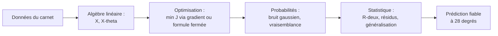

---

### Les notations de base, introduites au fil de l'eau

Cette section ne réintroduit rien : elle **rassemble en contexte** les symboles déjà rencontrés, en les reliant et en comblant les quelques notations transverses utiles pour toute la suite. Chaque symbole a été expliqué « comme à un enfant » à sa première apparition ; on en consolide ici la lecture.

#### Ensembles de nombres et appartenance

On a vu $`\mathbb{N}`$ (entiers de comptage $`0,1,2,\ldots`$), $`\mathbb{R}`$ (tous les nombres de la droite graduée), $`\mathbb{R}^d`$ (listes de $`d`$ réels, les vecteurs) et $`\mathbb{R}^{n\times d}`$ (tableaux $`n`$ par $`d`$, les matrices). On complète par deux notations très fréquentes.

> **Les symboles $`\mathbb{Z}`$ et l'intervalle $`[a,b]`$.** $`\mathbb{Z}`$ (de l'allemand *Zahlen*, « nombres ») représente les **entiers relatifs**: les entiers naturels **plus** leurs opposés négatifs, $`\ldots, -2, -1, 0, 1, 2, \ldots`$. C'est $`\mathbb{N}`$ auquel on ajoute le côté gauche de la règle (les nombres en dessous de zéro, comme une température hivernale de $`-3`$ °C). L'écriture $`[a, b]`$ désigne un **intervalle**: *tous* les réels compris entre $`a`$ et $`b`$, bornes incluses (les crochets tournés vers l'intérieur disent « on prend aussi les extrémités »). Par exemple une probabilité vit dans $`[0, 1]`$: elle peut valoir $`0`$, $`1`$, ou n'importe quelle valeur entre les deux.

Le symbole $`\in`$ (« appartient à ») relie un objet à son ensemble ; sa négation se note $`\notin`$ (« n'appartient pas à »). On a aussi l'inclusion entre ensembles :

> **Le symbole $`\subseteq`$ (inclusion).** $`A \subseteq B`$ se lit « $`A`$ est inclus dans $`B`$ » et signifie tout élément de $`A`$ est aussi dans $`B`$: la petite boîte $`A`$ tient entièrement dans la grande boîte $`B`$. Par exemple $`\mathbb{N} \subseteq \mathbb{Z} \subseteq \mathbb{R}`$: chaque ensemble de nombres est contenu dans le suivant, comme des poupées russes.

#### Scalaires, vecteurs, matrices : la convention typographique

Une convention de notation, tenue dans tout le cours, évite bien des confusions :

| Objet | Notation | Exemple | Intuition |
|---|---|---|---|
| Scalaire (un seul nombre) | minuscule normale | $`x,\ a,\ \eta,\ \sigma`$ | une case |
| Vecteur (liste de nombres) | minuscule **grasse** | $`\mathbf{x},\ \boldsymbol{\theta},\ \mathbf{y}`$ | une colonne de cases |
| Matrice (tableau de nombres) | MAJUSCULE | $`X,\ A,\ \Sigma`$ | une grille de cases |
| Ensemble | majuscule calligraphiée ou ajourée | $`\mathcal{D},\ \mathbb{R}`$ | une boîte |

> **Attention à $`\sigma`$ vs $`\Sigma`$.** La minuscule $`\sigma`$ (sigma) désigne un **écart-type** (un seul nombre, la racine carrée de la variance ; la *racine carrée* d'un nombre est la valeur qui, multipliée par elle-même, le redonne, ainsi la racine carrée de $`9`$ est $`3`$ car $`3\times 3 = 9`$) ; la majuscule $`\Sigma`$ peut désigner soit le **symbole de sommation** $`\sum`$, soit une **matrice de covariance** (un tableau qui décrit comment plusieurs variables varient ensemble). Le contexte tranche : sous des bornes $`\sum_{i=1}^n`$, c'est la somme ; en gras de matrice, c'est la covariance. Cette collision de notation est universelle en machine learning ; mieux vaut l'avoir vue une fois.

#### Fonctions, indices et opérations résumés

La notation $`f(x)`$ (« $`f`$ de $`x`$ », la machine qui transforme une entrée en sortie) se décline dès qu'on précise les ensembles de départ et d'arrivée :

> **Le symbole $`f: A \to B`$ (signature d'une fonction).** L'écriture $`f: A \to B`$ se lit « $`f`$ va de $`A`$ vers $`B`$ » : elle annonce que la machine $`f`$ **prend ses entrées dans $`A`$** (l'ensemble de départ, ou domaine) et **rend ses sorties dans $`B`$** (l'ensemble d'arrivée). La flèche $`\to`$ figure le trajet entrée → sortie. Notre droite est $`f: \mathbb{R} \to \mathbb{R}`$ (un nombre entre, un nombre sort) ; un modèle à $`d`$ caractéristiques renvoyant un score est $`f: \mathbb{R}^d \to \mathbb{R}`$.

Récapitulons, en une table de lecture, les symboles-clés rencontrés, non comme un glossaire externe, mais comme un index de ce que vous savez déjà déchiffrer :

| Symbole | Se lit | Idée en une image |
|---|---|---|
| $`\in`$ | appartient à | être dans la boîte |
| $`\mathbb{N},\ \mathbb{Z},\ \mathbb{R}`$ | entiers naturels, relatifs, réels | billes à compter ; règle des deux côtés ; règle pleine |
| $`\mathbb{R}^d,\ \mathbb{R}^{n\times d}`$ | $`d`$-uplets, matrices $`n\times d`$ | colonne de cases ; grille de cases |
| $`f(x)`$ | $`f`$ de $`x`$ | distributeur : pièce → canette |
| $`\sum`$ | somme | boucle qui additionne |
| $`\prod`$ | produit | boucle qui multiplie |
| $`\nabla`$ | nabla, gradient | flèche de plus forte montée |
| $`\partial`$ | dérivée partielle | tourner un seul robinet |
| $`\mathbb{E}[\cdot]`$ | espérance | moyenne sur l'infini |
| $`\mathbb{P}(\cdot)`$ | probabilité | part dans le sac |
| $`\mathcal{N}(\mu,\sigma^2)`$ | loi normale | courbe en cloche |
| $`\sim`$ | suit la loi | « est distribué comme » |
| $`\hat{\cdot}`$ | chapeau (estimé) | supposition, pas réalité |
| $`\bar{\cdot}`$ | barre (moyenne) | point d'équilibre |
| $`X^\top`$ | transposée | tableau couché |
| $`\eta`$ | êta | taille du pas |
| $`\boldsymbol\theta`$ | thêta | les boutons réglables |

> **Conseil de lecture pour la suite.** Quand une formule paraît hostile, *décomposez-la en briques connues*: repérez d'abord les sommes ($`\sum`$) et produits ($`\prod`$) comme des boucles, identifiez ce qui est scalaire / vecteur / matrice à la typographie, et lisez les chapeaux comme des estimations. Une équation intimidante n'est presque jamais qu'un assemblage de ces gestes élémentaires que vous maîtrisez désormais.

Avec ce socle de notations et l'intuition des quatre piliers, vous disposez de tout le nécessaire pour aborder les chapitres suivants, où chacun de ces piliers sera développé en profondeur, en commençant par l'algèbre linéaire, l'alphabet de tout le reste.

---

### Exercices

Les exercices vont du déchiffrage de notation (échauffement) à la démonstration et au code. Les corrigés sont entièrement détaillés.

#### Exercice 1 : Lire les symboles (échauffement)

Traduisez en français courant, puis dites si chaque énoncé est vrai ou faux.
(a) $`3 \in \mathbb{N}`$. (b) $`-2 \in \mathbb{N}`$. (c) $`-2 \in \mathbb{Z}`$. (d) $`2{,}5 \in \mathbb{R}`$. (e) $`\mathbb{N} \subseteq \mathbb{R}`$. (f) $`\pi \in \mathbb{Z}`$.

> **Corrigé.**
> (a) « $`3`$ appartient aux entiers naturels », **vrai** ($`3`$ sert à compter).
> (b) « $`-2`$ appartient aux entiers naturels », **faux** (les naturels n'ont pas de négatifs).
> (c) « $`-2`$ appartient aux entiers relatifs », **vrai** ($`\mathbb{Z}`$ contient les négatifs).
> (d) « $`2{,}5`$ est un réel », **vrai** (un point de la règle graduée).
> (e) « les naturels sont inclus dans les réels », **vrai** (tout entier est un point de la règle).
> (f) « $`\pi`$ est un entier relatif », **faux** ($`\pi \approx 3{,}14`$ n'est pas entier).

#### Exercice 2 : Dérouler un sigma à la main

Soit $`u_1=2,\ u_2=5,\ u_3=-1,\ u_4=4`$. Calculez (a) $`\sum_{i=1}^{4} u_i`$, (b) $`\sum_{i=1}^{4} u_i^2`$, (c) $`\frac{1}{4}\sum_{i=1}^{4} u_i`$ (la moyenne $`\bar u`$), (d) $`\sum_{i=1}^{4} (u_i - \bar u)`$.

> **Corrigé.**
> (a) Tournée d'addition : $`2 + 5 + (-1) + 4 = 10`$.
> (b) On additionne les carrés : $`4 + 25 + 1 + 16 = 46`$.
> (c) $`\bar u = 10/4 = 2{,}5`$.
> (d) $`(2-2{,}5)+(5-2{,}5)+(-1-2{,}5)+(4-2{,}5) = -0{,}5+2{,}5-3{,}5+1{,}5 = 0`$.
> **Remarque clé**: la somme des écarts à la moyenne est *toujours* nulle. C'est l'une des raisons pour lesquelles on élève au carré dans le MSE, sinon les écarts positifs et négatifs s'annuleraient et ne mesureraient rien.

#### Exercice 3 : Évaluer une fonction et une prédiction

On donne le modèle $`f(x) = 2{,}5\,x + 3`$. (a) Calculez $`f(0)`$, $`f(4)`$, $`f(10)`$. (b) Si la vraie valeur en $`x=4`$ est $`y=15`$, quel est le résidu $`r = y - f(4)`$ ? (c) Quelle est la contribution de ce point au MSE (c'est-à-dire $`r^2`$) ?

> **Corrigé.**
> (a) $`f(0) = 2{,}5\cdot 0 + 3 = 3`$; $`f(4) = 2{,}5\cdot 4 + 3 = 13`$; $`f(10) = 2{,}5\cdot 10 + 3 = 28`$.
> (b) $`r = y - f(4) = 15 - 13 = 2`$ (le modèle sous-estime de $`2`$).
> (c) $`r^2 = 2^2 = 4`$.

#### Exercice 4 : Régression linéaire complète à la main

On observe $`(x,y)`$: $`(1,2),\ (2,2),\ (3,4),\ (4,5)`$. Trouvez la droite des moindres carrés $`\hat y = \hat a x + \hat b`$, puis prédisez $`y`$ en $`x=5`$.

> **Corrigé, étape par étape.**
> Effectif $`n = 4`$ (l'*effectif* est simplement **le nombre d'éléments** observés, ici $`4`$ couples). Sommes : $`\sum x = 1+2+3+4 = 10`$, $`\sum y = 2+2+4+5 = 13`$. Moyennes : $`\bar x = 2{,}5`$, $`\bar y = 3{,}25`$.
> Tableau des écarts centrés :
>
> | $`x_i-\bar x`$ | $`y_i-\bar y`$ | produit | $`(x_i-\bar x)^2`$ |
> |---|---|---|---|
> | $`-1{,}5`$ | $`-1{,}25`$ | $`1{,}875`$ | $`2{,}25`$ |
> | $`-0{,}5`$ | $`-1{,}25`$ | $`0{,}625`$ | $`0{,}25`$ |
> | $`0{,}5`$ | $`0{,}75`$ | $`0{,}375`$ | $`0{,}25`$ |
> | $`1{,}5`$ | $`1{,}75`$ | $`2{,}625`$ | $`2{,}25`$ |
> | **Σ** | | **$`5{,}5`$** | **$`5{,}0`$** |
>
> Pente : $`\hat a = 5{,}5 / 5{,}0 = 1{,}1`$. Ordonnée : $`\hat b = \bar y - \hat a\,\bar x = 3{,}25 - 1{,}1\times 2{,}5 = 3{,}25 - 2{,}75 = 0{,}5`$.
> Droite : $`\hat y = 1{,}1\,x + 0{,}5`$. Prédiction en $`x=5`$: $`1{,}1\times 5 + 0{,}5 = 6{,}0`$.
> Vérification rapide en code :
> ```python
> import numpy as np
> x = np.array([1,2,3,4.]); y = np.array([2,2,4,5.])
> a = np.sum((x-x.mean())*(y-y.mean()))/np.sum((x-x.mean())**2)
> b = y.mean() - a*x.mean()
> print(round(a,3), round(b,3), round(a*5+b,3))  # 1.1 0.5 6.0
> ```

#### Exercice 5 : Le compromis biais-variance par l'exemple

On veut ajuster $`11`$ points issus d'une parabole bruitée. On hésite entre trois modèles : une constante ($`\hat y = c`$), une droite, et un polynôme de degré $`10`$. (a) Lequel sous-apprend ? (b) Lequel sur-apprend ? (c) Lequel a le plus fort biais ? la plus forte variance ? (d) Sur lequel l'erreur d'**entraînement** sera-t-elle la plus faible, et pourquoi est-ce trompeur ?

> **Corrigé.**
> (a) La **constante** sous-apprend : une horizontale ne peut épouser une courbure, elle rate la tendance.
> (b) Le **polynôme de degré $`10`$** sur-apprend : avec $`11`$ points et $`11`$ coefficients (degré $`10`$ ⇒ $`11`$ coefficients), il passe *exactement* par tous les points, bruit compris.
> (c) Plus fort **biais**: la constante (modèle le plus rigide, erreur systématique maximale). Plus forte **variance**: le polynôme de degré $`10`$ (changer un seul point bouge énormément la courbe).
> (d) L'erreur d'entraînement est **minimale (nulle)** pour le degré $`10`$, qui interpole tous les points. C'est trompeur car cette erreur ne mesure que la **mémorisation**: sur des points nouveaux, ce polynôme oscillera énormément et prédira très mal. *Seule l'erreur sur un jeu de test reflète la généralisation*, c'est le piège n°1 du débutant.

#### Exercice 6 : Pourquoi le carré ? (mini-démonstration)

Montrez que, pour des nombres $`y_1,\ldots,y_n`$ fixés, la constante $`c`$ qui minimise $`\sum_{i=1}^n (y_i - c)^2`$ est la moyenne $`\bar y`$. (Indice : dérivez par rapport à $`c`$ et annulez.)

> **Corrigé.**
> Posons $`g(c) = \sum_{i=1}^n (y_i - c)^2`$. On dérive par rapport à $`c`$ (règle de la chaîne sur chaque carré : la dérivée de $`(y_i - c)^2`$ par rapport à $`c`$ est $`-2(y_i-c)`$). La petite apostrophe dans $`g'(c)`$ (lu « $`g`$ prime ») est la **notation courante de la dérivée**: $`g'`$ est la pente de $`g`$, c'est-à-dire la même idée que $`\frac{\partial}{\partial c}`$ vue plus haut, mais notée plus court quand il n'y a qu'une seule variable. On obtient :
> ```math
> g'(c) = \sum_{i=1}^n -2\,(y_i - c) = -2\left( \sum_{i=1}^n y_i - n c \right).
> ```
> On annule : $`g'(c) = 0 \iff \sum_i y_i - n c = 0 \iff c = \frac{1}{n}\sum_i y_i = \bar y`$. (La double flèche $`\iff`$ se lit « **équivaut à** » ou « si et seulement si » : elle dit que les deux énoncés de part et d'autre sont vrais exactement dans les mêmes cas, l'un entraîne l'autre et réciproquement.)
> C'est bien un **minimum** car $`g''(c) = 2n > 0`$ (fonction convexe, en forme de bol). (La double apostrophe de $`g''(c)`$, « $`g`$ seconde », est la **dérivée de la dérivée**: la pente de la pente. Qu'elle soit positive signifie que la pente ne fait que monter, signe d'un creux de bol, donc d'un minimum et non d'un sommet.)
> **Interprétation**: minimiser une somme de carrés conduit naturellement à la moyenne. C'est la raison profonde pour laquelle le coût quadratique est si naturel en régression, et, via le théorème de l'étape 5, pourquoi il correspond à un bruit gaussien.

#### Exercice 7 : Du produit à la somme par le logarithme

Soit la vraisemblance jouet $`L(\theta) = \prod_{i=1}^{3} p_i`$ avec $`p_1 = 0{,}2,\ p_2 = 0{,}5,\ p_3 = 0{,}1`$. (a) Calculez $`L`$. (b) Calculez $`\log L`$ (logarithme népérien). (c) Vérifiez que $`\log L = \sum_i \log p_i`$. (d) Expliquez en une phrase pourquoi on préfère manipuler $`\log L`$ en pratique.

> **Corrigé.**
> (a) $`L = 0{,}2 \times 0{,}5 \times 0{,}1 = 0{,}01`$.
> (b) $`\log L = \log(0{,}01) \approx -4{,}605`$.
> (c) $`\log p_1 + \log p_2 + \log p_3 \approx (-1{,}609) + (-0{,}693) + (-2{,}303) = -4{,}605`$. Identique. ✓
> (d) Parce que le logarithme transforme un **produit** de nombres minuscules (qui provoque des dépassements numériques vers zéro, *underflow*, dès qu'il y a beaucoup de facteurs) en une **somme** stable et calculable, sans déplacer le maximum.

#### Exercice 8 : Un pas de descente de gradient

Coût à une variable $`J(\theta) = (\theta - 3)^2`$. On part de $`\theta_0 = 0`$ avec un taux $`\eta = 0{,}1`$. (a) Donnez $`\nabla J(\theta)`$ (ici une simple dérivée). (b) Calculez $`\theta_1`$ et $`\theta_2`$. (c) Vers quelle valeur la suite converge-t-elle, et est-ce le minimum attendu ?

> **Corrigé.**
> (a) $`J'(\theta) = 2(\theta - 3)`$.
> (b) $`\theta_1 = \theta_0 - \eta\,J'(\theta_0) = 0 - 0{,}1\times 2(0-3) = 0 - 0{,}1\times(-6) = 0{,}6`$.
> $`\theta_2 = 0{,}6 - 0{,}1\times 2(0{,}6 - 3) = 0{,}6 - 0{,}1\times(-4{,}8) = 0{,}6 + 0{,}48 = 1{,}08`$.
> (c) Le coût $`(\theta-3)^2`$ est un bol dont le fond est en $`\theta = 3`$ ($`J'(3)=0`$). La descente s'en approche pas à pas : $`0 \to 0{,}6 \to 1{,}08 \to \cdots \to 3`$. Elle **converge vers $`3`$**, qui est bien le minimum global (fonction convexe). Avec $`\eta`$ trop grand (ici, dès que $`\eta \geq 1`$, et a fortiori $`\eta = 1{,}5`$), les pas dépasseraient le fond et la suite divergerait, illustration du rôle critique du taux d'apprentissage.

---

[← Sommaire](../README.md#table-des-matières) · [↑ Sommaire](../README.md#table-des-matières) · [Algèbre linéaire →](02-algebre-lineaire.md)
