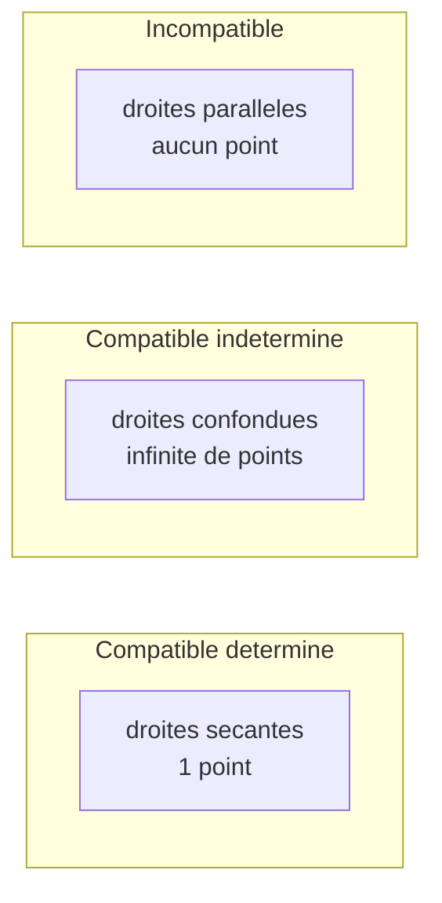
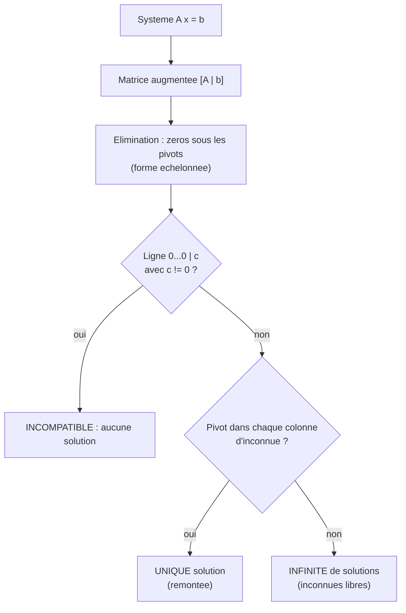
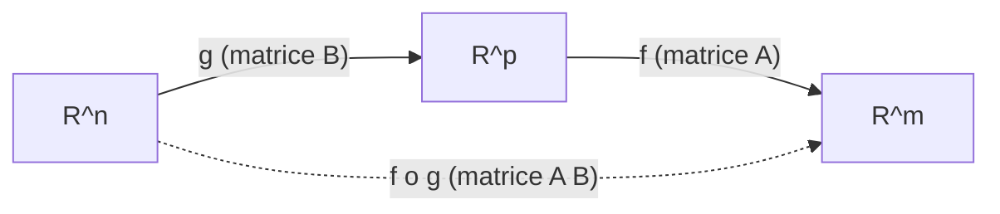

[← Sommaire](../README.md#table-des-matières)

# 2. Algèbre linéaire

### Systèmes d'équations linéaires

#### L'intuition: croiser des contraintes

Imaginez que vous cherchez deux nombres. On vous dit deux choses à leur sujet: « leur somme vaut 10 » et « leur différence vaut 2 ». Chacune de ces phrases est une **contrainte**. Prise seule, chacune laisse une infinité de possibilités. Mais ensemble, elles se croisent en un point unique: 6 et 4. Résoudre un système d'équations linéaires, c'est exactement cela: trouver les valeurs qui satisfont **toutes** les contraintes **en même temps**.

Le mot « linéaire » signifie que les inconnues n'apparaissent qu'à la puissance 1: pas de carré, pas de produit entre inconnues, pas de sinus. Géométriquement, en dimension 2, chaque équation est une **droite**, et la solution est leur point d'intersection. En dimension 3, chaque équation est un **plan**, et la solution est l'intersection de ces plans.

> **Le symbole $`x`$ (et ses amis $`x_1, x_2, \dots`$).**
> Ce symbole représente une **inconnue**: un nombre qu'on ne connaît pas encore et qu'on cherche. C'est comme une boîte fermée dont on veut deviner le contenu. Quand il y a plusieurs boîtes, on les numérote: $`x_1`$ (« x indice 1 ») est la première boîte, $`x_2`$ la deuxième, etc. Le petit chiffre en bas (l'**indice**) est juste une étiquette, comme un numéro de casier; ce n'est pas une multiplication ni une puissance.

#### Definition rigoureuse

> **Définition (système linéaire).** Un **système de $`m`$ équations linéaires à $`n`$ inconnues** sur le corps des réels $`\mathbb{R}`$ est une famille de $`m`$ égalités de la forme
> ```math
> \begin{cases}
> a_{11} x_1 + a_{12} x_2 + \cdots + a_{1n} x_n = b_1 \\
> a_{21} x_1 + a_{22} x_2 + \cdots + a_{2n} x_n = b_2 \\
> \quad\vdots \\
> a_{m1} x_1 + a_{m2} x_2 + \cdots + a_{mn} x_n = b_m
> \end{cases}
> ```
> où les $`a_{ij} \in \mathbb{R}`$ sont les **coefficients**, les $`b_i \in \mathbb{R}`$ les **seconds membres**, et les $`x_j`$ les **inconnues**. Une **solution** est un $`n`$-uplet $`(x_1, \dots, x_n) \in \mathbb{R}^n`$ qui vérifie simultanément les $`m`$ égalités. L'ensemble de toutes les solutions est l'**ensemble solution**.

> **Le double indice $`a_{ij}`$.**
> Ce symbole représente le coefficient situé à l'**intersection** de la ligne $`i`$ et de la colonne $`j`$, exactement comme une case sur une grille de bataille navale repérée par « ligne, colonne ». Le premier indice $`i`$ dit **dans quelle équation** on est (quelle rangée), le second $`j`$ dit **devant quelle inconnue** ce nombre est posé. Ainsi $`a_{23}`$ est le nombre multipliant $`x_3`$ dans la 2e équation. Retenez l'ordre: **ligne d'abord, colonne ensuite**.

> **L'accolade et les points de suspension structurels.**
> L'**accolade** $`\{`$ à gauche d'un système signifie « toutes ces lignes à la fois » (un grand ET logique): un $`n`$-uplet n'est solution que s'il vérifie chaque ligne. Les points $`\vdots`$ ne sont pas un raccourci paresseux: ils disent « la même chose continue régulièrement jusqu'au bout », ici de la ligne 3 à la ligne $`m`$.

Avec le symbole somme $`\sum`$ (vu au chapitre 1), qui additionne une liste de termes, la $`i`$-ème équation s'écrit de manière compacte:

```math
\sum_{j=1}^{n} a_{ij}\, x_j = b_i, \qquad \text{pour } i = 1, \dots, m.
```

Ici $`\sum_{j=1}^{n} a_{ij} x_j`$ veut dire « additionne les produits $`a_{ij}x_j`$ pour $`j`$ allant de 1 à $`n`$ », c'est-à-dire $`a_{i1}x_1 + a_{i2}x_2 + \cdots + a_{in}x_n`$.

#### Les trois cas possibles (theoreme d'alternative)

Un fait remarquable, qu'on démontrera plus loin, structure toute la théorie: un système linéaire ne peut se trouver que dans **exactement trois** situations.

| Cas | Nombre de solutions | Vision géométrique (2D) |
|---|---|---|
| **Compatible déterminé** | exactement une | deux droites sécantes (un seul point) |
| **Compatible indéterminé** | une infinité | deux droites confondues |
| **Incompatible** | aucune | deux droites parallèles distinctes |

> **Remarque fondamentale.** Un système linéaire réel n'a **jamais** « exactement 2 » ou « exactement 17 » solutions. C'est 0, 1 ou l'infini. Cette rigidité vient de la **linéarité**: si $`u`$ et $`v`$ sont deux solutions distinctes d'un même système, alors tout point de la droite qui les relie, $`u + t(v-u)`$ pour $`t \in \mathbb{R}`$, est encore solution, donc dès qu'il y en a deux, il y en a une infinité. Nous prouverons ce point dans la section sur les espaces affines.

Géométriquement, en dimension 2:



#### Exemple chiffre deroule pas a pas

Reprenons l'énigme de l'introduction, formalisée:

```math
\begin{cases}
x_1 + x_2 = 10 \\
x_1 - x_2 = 2
\end{cases}
```

Ici $`m = 2`$ équations, $`n = 2`$ inconnues. Les coefficients sont $`a_{11}=1, a_{12}=1, a_{21}=1, a_{22}=-1`$; les seconds membres $`b_1 = 10, b_2 = 2`$.

**Étape 1, additionner les deux équations** pour éliminer $`x_2`$:
$`(x_1 + x_2) + (x_1 - x_2) = 10 + 2`$, soit $`2x_1 = 12`$, donc $`x_1 = 6`$.

**Étape 2, réinjecter** dans la première: $`6 + x_2 = 10`$, donc $`x_2 = 4`$.

**Étape 3, vérifier** dans la seconde (jamais celle qu'on a utilisée pour conclure): $`6 - 4 = 2`$. C'est juste. L'ensemble solution est le singleton $`\{(6, 4)\}`$: le système est **compatible déterminé**.

#### Forme matricielle: le grand raccourci

Écrire toutes ces sommes est fastidieux. On range les coefficients dans un tableau $`A`$, les inconnues dans une colonne $`\mathbf{x}`$, les seconds membres dans une colonne $`\mathbf{b}`$, et le système entier se résume à une seule égalité:

```math
A\mathbf{x} = \mathbf{b}.
```

Nous définirons proprement ce produit dans les deux prochaines sections. Retenez déjà l'idée: **un système = une équation matricielle**. C'est la pierre angulaire de tout le chapitre, et la raison pour laquelle l'algèbre linéaire est le langage natif du machine learning: ajuster un modèle linéaire à des données, c'est résoudre (au sens des moindres carrés) un système $`A\mathbf{x} = \mathbf{b}`$ où $`A`$ contient les données et $`\mathbf{x}`$ les paramètres à apprendre.

#### En Python

```python
import numpy as np

A = np.array([[1.0, 1.0],
              [1.0, -1.0]])
b = np.array([10.0, 2.0])

x = np.linalg.solve(A, b)
print(x)  # [6. 4.]

print(np.allclose(A @ x, b))  # True : on verifie A x = b
```

> **Piège classique.** `np.linalg.solve` exige une matrice **carrée** et **inversible**. Si le système a plus d'équations que d'inconnues (cas typique en apprentissage, $`m \gg n`$), il faut passer par les moindres carrés `np.linalg.lstsq`, que nous verrons. Lancer `solve` sur une matrice singulière (droites parallèles) lève une `LinAlgError`.

---

### Matrices et leurs opérations

#### Intuition: un tableau qui agit

Une matrice, avant d'être un objet abstrait, est d'abord un **tableau rectangulaire de nombres**, comme une feuille de calcul: des lignes, des colonnes, un nombre dans chaque case. Mais sa vraie puissance, c'est qu'une matrice **fait quelque chose**: elle transforme des vecteurs (elle les étire, les tourne, les projette). On peut la voir à la fois comme un **rangement** (un paquet de données) et comme une **machine** (une fonction). Cette double nature est le cœur du sujet.

> **Le symbole d'un vecteur en gras, $`\mathbf{v}`$, et l'ensemble $`\mathbb{R}^n`$.**
> Le caractère gras $`\mathbf{v}`$ représente un **vecteur**: une liste **ordonnée** de nombres, c'est-à-dire une colonne de cases empilées. On peut le voir comme une **flèche** partant de l'origine et pointant vers un endroit de l'espace, ou plus simplement comme « les coordonnées d'un point ». L'ensemble $`\mathbb{R}^n`$ (« R puissance n ») est la collection de **toutes** les listes de $`n`$ nombres réels: $`\mathbb{R}^2`$ est le plan (deux coordonnées), $`\mathbb{R}^3`$ l'espace usuel (trois coordonnées), et $`\mathbb{R}^{784}`$ l'espace où vit une image $`28\times 28`$ pixels mise à plat. On note un vecteur colonne:
> ```math
> \mathbf{v} = \begin{pmatrix} v_1 \\ v_2 \\ \vdots \\ v_n \end{pmatrix} \in \mathbb{R}^n.
> ```

> **Le symbole $`\mathbb{R}^{m \times n}`$.**
> Ce symbole représente l'ensemble de **toutes les matrices** ayant $`m`$ lignes et $`n`$ colonnes à coefficients réels. Lisez « R, m croix n ». Le « croix » ($`\times`$) n'est pas une multiplication à calculer: c'est la **taille** du tableau, exactement comme on dit « un cadre 13 par 18 ». Ainsi $`A \in \mathbb{R}^{3 \times 2}`$ est un tableau de 3 lignes et 2 colonnes. Convention immuable: **lignes d'abord, colonnes ensuite**.

#### Definition et vocabulaire

> **Définition (matrice).** Une **matrice** $`A`$ de taille $`m \times n`$ sur $`\mathbb{R}`$ est une application $`A: \{1,\dots,m\}\times\{1,\dots,n\} \to \mathbb{R}`$, notée par ses coefficients $`A = (a_{ij})_{1 \le i \le m,\ 1 \le j \le n}`$ et représentée par le tableau
> ```math
> A = \begin{pmatrix}
> a_{11} & a_{12} & \cdots & a_{1n} \\
> a_{21} & a_{22} & \cdots & a_{2n} \\
> \vdots & \vdots & \ddots & \vdots \\
> a_{m1} & a_{m2} & \cdots & a_{mn}
> \end{pmatrix} \in \mathbb{R}^{m \times n}.
> ```

Vocabulaire essentiel, rassemblé:

| Terme | Définition |
|---|---|
| Matrice **carrée** | $`m = n`$ (autant de lignes que de colonnes) |
| Vecteur **colonne** | matrice $`n \times 1`$; vecteur **ligne**: $`1 \times n`$ |
| **Diagonale** principale | les coefficients $`a_{ii}`$ |
| Matrice **diagonale** | $`a_{ij} = 0`$ dès que $`i \ne j`$ |
| Matrice **identité** $`I_n`$ | diagonale avec des 1: $`a_{ii}=1`$, sinon 0 |
| Matrice **nulle** $`0`$ | tous les coefficients valent 0 |
| Matrice **triangulaire supérieure** | $`a_{ij} = 0`$ dès que $`i > j`$ |
| Matrice **triangulaire inférieure** | $`a_{ij} = 0`$ dès que $`i < j`$ |
| Matrice **symétrique** | $`A = A^\top`$ (définie ci-dessous) |

#### Operations elementaires: addition et multiplication par un scalaire

L'addition se fait **case par case**, et seulement entre matrices de **même taille**:

```math
(A + B)_{ij} = a_{ij} + b_{ij}.
```

La multiplication par un nombre $`\lambda \in \mathbb{R}`$ (un **scalaire**) multiplie chaque case:

```math
(\lambda A)_{ij} = \lambda\, a_{ij}.
```

> **Le mot « scalaire ».** Un scalaire, c'est simplement **un nombre seul** (par opposition à un vecteur ou une matrice, qui sont des paquets de nombres). Le mot vient de « échelle »: multiplier par un scalaire $`\lambda > 1`$, c'est agrandir à l'échelle (zoomer), et par $`0 < \lambda < 1`$, rétrécir.

Muni de ces deux opérations, $`\mathbb{R}^{m\times n}`$ est un **espace vectoriel** (notion centrale, définie plus loin): addition commutative et associative, élément neutre la matrice nulle, distributivité $`\lambda(A+B)=\lambda A+\lambda B`$, etc.

#### La transposee

> **Le symbole transposée $`A^\top`$.**
> Ce symbole (un petit T en exposant) représente l'opération de **basculer** la matrice: on échange le rôle des lignes et des colonnes, comme si on faisait pivoter le tableau autour de sa diagonale, ou comme un reflet dans un miroir posé sur la diagonale. La ligne $`i`$ devient la colonne $`i`$. Si $`A`$ est $`m\times n`$, alors $`A^\top`$ est $`n \times m`$.

> **Définition (transposée).** La **transposée** de $`A=(a_{ij}) \in \mathbb{R}^{m\times n}`$ est la matrice $`A^\top = (a^\top_{ij}) \in \mathbb{R}^{n\times m}`$ définie par $`a^\top_{ij} = a_{ji}`$.

Exemple chiffré:

```math
A = \begin{pmatrix} 1 & 2 & 3 \\ 4 & 5 & 6 \end{pmatrix} \in \mathbb{R}^{2\times 3}
\quad\Longrightarrow\quad
A^\top = \begin{pmatrix} 1 & 4 \\ 2 & 5 \\ 3 & 6 \end{pmatrix} \in \mathbb{R}^{3\times 2}.
```

Propriétés (toutes vérifiables coefficient par coefficient): $`(A^\top)^\top = A`$, $`(A+B)^\top = A^\top + B^\top`$, $`(\lambda A)^\top = \lambda A^\top`$, et la règle qui surprend les débutants, $`(AB)^\top = B^\top A^\top`$ (l'ordre s'**inverse**), démontrée après le produit.

#### Le produit matriciel: le coeur du reacteur

C'est l'opération la plus importante, et la moins intuitive au premier abord. On ne multiplie **pas** case par case. La règle: pour multiplier $`A`$ par $`B`$, le **nombre de colonnes de $`A`$** doit égaler le **nombre de lignes de $`B`$**.

> **Le symbole du produit matriciel (la juxtaposition $`AB`$).**
> Écrire $`AB`$ (deux matrices collées) représente leur **produit**, une nouvelle matrice. Chaque case du résultat se calcule comme un **produit scalaire** d'une ligne de $`A`$ par une colonne de $`B`$: on glisse la ligne $`i`$ de $`A`$ « par-dessus » la colonne $`j`$ de $`B`$, on multiplie terme à terme, et on additionne tout. Le $`\sum`$ ci-dessous est cette boucle d'addition.

> **Définition (produit matriciel).** Soient $`A \in \mathbb{R}^{m \times p}`$ et $`B \in \mathbb{R}^{p \times n}`$. Leur **produit** $`C = AB \in \mathbb{R}^{m\times n}`$ a pour coefficients
> ```math
> c_{ij} = \sum_{k=1}^{p} a_{ik}\, b_{kj}.
> ```

Schéma des dimensions (les « $`p`$ » du milieu doivent coïncider, et disparaissent):

```math
\underbrace{(m \times p)}_{A} \cdot \underbrace{(p \times n)}_{B} \;=\; \underbrace{(m \times n)}_{C}.
```

> **Le symbole $`\cdot`$ (produit scalaire de deux vecteurs).** Pour deux vecteurs $`\mathbf{u}, \mathbf{v} \in \mathbb{R}^n`$, le **produit scalaire** $`\mathbf{u}\cdot\mathbf{v} = \sum_{k=1}^{n} u_k v_k`$ est un **nombre** (pas un vecteur). Intuitivement, il mesure « à quel point deux flèches pointent dans la même direction ». En notation matricielle, $`\mathbf{u}\cdot\mathbf{v} = \mathbf{u}^\top \mathbf{v}`$. Chaque case du produit $`AB`$ est donc le produit scalaire ligne-colonne.

##### Exemple chiffre deroule case par case

Soient
```math
A = \begin{pmatrix} 1 & 2 \\ 3 & 4 \end{pmatrix}, \qquad
B = \begin{pmatrix} 5 & 6 \\ 7 & 8 \end{pmatrix}.
```
Calculons $`C = AB`$, case par case:

- $`c_{11} = (1)(5) + (2)(7) = 5 + 14 = 19`$ (ligne 1 de $`A`$ × colonne 1 de $`B`$)
- $`c_{12} = (1)(6) + (2)(8) = 6 + 16 = 22`$
- $`c_{21} = (3)(5) + (4)(7) = 15 + 28 = 43`$
- $`c_{22} = (3)(6) + (4)(8) = 18 + 32 = 50`$

D'ou
```math
AB = \begin{pmatrix} 19 & 22 \\ 43 & 50 \end{pmatrix}.
```

##### Le produit n'est PAS commutatif

Calculons $`BA`$ avec les mêmes matrices:
```math
BA = \begin{pmatrix} 5\cdot1+6\cdot3 & 5\cdot2+6\cdot4 \\ 7\cdot1+8\cdot3 & 7\cdot2+8\cdot4 \end{pmatrix}
= \begin{pmatrix} 23 & 34 \\ 31 & 46 \end{pmatrix} \;\ne\; AB.
```

> **Piège majeur.** En général $`AB \ne BA`$. L'ordre des facteurs **compte**. Mieux: $`AB`$ peut exister sans que $`BA`$ ait un sens (dimensions incompatibles). Ne « simplifiez » jamais un produit matriciel comme un produit de nombres.

#### Proprietes algebriques du produit

> **Théorème (propriétés du produit).** Quand les tailles sont compatibles:
> 1. **Associativité**: $`(AB)C = A(BC)`$.
> 2. **Distributivité**: $`A(B+C) = AB + AC`$ et $`(A+B)C = AC + BC`$.
> 3. **Élément neutre**: $`I_m A = A I_n = A`$ pour $`A \in \mathbb{R}^{m\times n}`$.
> 4. **Compatibilité scalaire**: $`\lambda(AB) = (\lambda A)B = A(\lambda B)`$.
> 5. **Transposée d'un produit**: $`(AB)^\top = B^\top A^\top`$.

**Démonstration de l'associativité (point 1).** Posons $`A\in\mathbb{R}^{m\times p}`$, $`B\in\mathbb{R}^{p\times q}`$, $`C\in\mathbb{R}^{q\times n}`$. Le coefficient $`(i,\ell)`$ de $`(AB)C`$ vaut
```math
\big((AB)C\big)_{i\ell} = \sum_{j=1}^{q} (AB)_{ij}\, c_{j\ell} = \sum_{j=1}^{q}\Big(\sum_{k=1}^{p} a_{ik} b_{kj}\Big) c_{j\ell} = \sum_{j=1}^{q}\sum_{k=1}^{p} a_{ik} b_{kj} c_{j\ell}.
```
De même, le coefficient $`(i,\ell)`$ de $`A(BC)`$ vaut
```math
\big(A(BC)\big)_{i\ell} = \sum_{k=1}^{p} a_{ik}\,(BC)_{k\ell} = \sum_{k=1}^{p} a_{ik}\Big(\sum_{j=1}^{q} b_{kj} c_{j\ell}\Big) = \sum_{k=1}^{p}\sum_{j=1}^{q} a_{ik} b_{kj} c_{j\ell}.
```
Les deux doubles sommes portent sur les mêmes termes $`a_{ik}b_{kj}c_{j\ell}`$; comme l'addition des réels est commutative, on peut intervertir l'ordre de sommation. Les deux coefficients sont égaux pour tout $`(i,\ell)`$, donc $`(AB)C = A(BC)`$. $`\blacksquare`$

> **Le petit carré noir $`\blacksquare`$.** Ce symbole, placé tout à la fin d'une démonstration, signifie simplement « la preuve est terminée » (on dit aussi « CQFD », pour « ce qu'il fallait démontrer »). C'est une borne de fin, comme un point final un peu solennel: tout ce qui précède établit le résultat annoncé, et il n'y a plus rien à ajouter.

**Démonstration de la transposée d'un produit (point 5).** Avec $`A\in\mathbb{R}^{m\times p}, B\in\mathbb{R}^{p\times n}`$:
```math
\big((AB)^\top\big)_{ij} = (AB)_{ji} = \sum_{k=1}^{p} a_{jk} b_{ki} = \sum_{k=1}^{p} (B^\top)_{ik}(A^\top)_{kj} = (B^\top A^\top)_{ij}. \qquad \blacksquare
```

#### Inverse d'une matrice carree

> **Le symbole $`A^{-1}`$.** Ce symbole représente la matrice **inverse**: la matrice qui « défait » ce que $`A`$ fait, comme une touche annuler. Si $`A`$ étire et tourne l'espace, $`A^{-1}`$ rétrécit et tourne en sens inverse pour tout remettre en place.

> **Définition (inverse).** Une matrice carrée $`A \in \mathbb{R}^{n\times n}`$ est **inversible** (ou **régulière**) s'il existe $`A^{-1} \in \mathbb{R}^{n\times n}`$ telle que $`A A^{-1} = A^{-1} A = I_n`$. Sinon, $`A`$ est dite **singulière**.

Quand l'inverse existe, il est **unique**: si $`B`$ et $`C`$ sont deux inverses, alors $`B = B I_n = B(AC) = (BA)C = I_n C = C`$. Règle pour le produit: si $`A`$ et $`B`$ sont inversibles de même taille, alors $`AB`$ l'est et $`(AB)^{-1} = B^{-1}A^{-1}`$ (encore l'inversion d'ordre). Pour le cas $`2\times 2`$, formule à connaître:
```math
A = \begin{pmatrix} a & b \\ c & d \end{pmatrix}, \quad \det A = ad - bc, \qquad A^{-1} = \frac{1}{ad - bc}\begin{pmatrix} d & -b \\ -c & a \end{pmatrix} \ \text{ si } ad-bc \ne 0.
```

> **Le symbole $`\det A`$ (déterminant).** Ce symbole représente le **déterminant**, un seul nombre qui mesure de combien la matrice **dilate les aires (ou les volumes)**, et avec quel signe (retournement ou non). Point capital: $`A`$ est inversible **si et seulement si** $`\det A \ne 0`$. Un déterminant nul signifie que la transformation **aplatit** l'espace (elle écrase un volume à plat), donc on ne peut plus revenir en arrière.

#### Application machine learning

Le produit matriciel **est** le calcul fondamental des réseaux de neurones. Une couche dense (fully connected) qui transforme un vecteur d'entrée $`\mathbf{x} \in \mathbb{R}^n`$ en sortie $`\mathbf{y}\in\mathbb{R}^m`$ s'écrit $`\mathbf{y} = W\mathbf{x} + \mathbf{b}`$, où $`W \in \mathbb{R}^{m\times n}`$ est la matrice de **poids** (weights) et $`\mathbf{b}`$ le **biais** (bias). Empiler $`L`$ couches, c'est composer des produits matriciels (entrecoupés de non-linéarités). Entraîner un réseau, c'est ajuster les coefficients de tous les $`W`$.

> **Mise à jour 2026.** Sur GPU et TPU, le produit matriciel est l'opération reine: les bibliothèques modernes (cuBLAS, et les noyaux Triton/CUTLASS) y consacrent l'essentiel de leur optimisation, et les unités matérielles dédiées (Tensor Cores) calculent des produits de blocs en précision mixte (bfloat16/FP8). Côté logiciel, JAX et PyTorch reposent sur `einsum` et l'auto-vectorisation (`vmap`) pour exprimer ces produits; un modèle de langage de plusieurs centaines de milliards de paramètres n'est, au fond, qu'une longue chaîne de produits matriciels optimisés.

```python
import numpy as np

A = np.array([[1, 2], [3, 4]])
B = np.array([[5, 6], [7, 8]])

print(A @ B)        # produit matriciel : [[19 22] [43 50]]
print(A * B)        # ATTENTION : produit case par case (Hadamard), pas matriciel
print(A.T)          # transposee
print(np.linalg.inv(A))           # inverse
print(np.linalg.det(A))           # determinant = -2.0
print(A @ np.linalg.inv(A))       # ~ identite (aux erreurs d'arrondi pres)
```

> **Piège NumPy à graver.** L'opérateur `*` fait le produit **élément par élément** (Hadamard), PAS le produit matriciel. Le produit matriciel, c'est `@` (ou `np.matmul`, ou `np.dot`). Confondre les deux est l'une des erreurs les plus fréquentes et les plus silencieuses du débutant.

---

### Résolution des systèmes linéaires

#### L'idee maitresse: simplifier sans changer les solutions

Pour résoudre, on transforme le système en un autre **plus simple mais équivalent** (même ensemble solution), jusqu'à pouvoir lire la réponse. Trois manipulations préservent l'ensemble des solutions, ce sont les **opérations élémentaires sur les lignes**:

| Opération | Notation | Effet |
|---|---|---|
| Échanger deux lignes | $`L_i \leftrightarrow L_j`$ | réordonne les équations |
| Multiplier une ligne par $`\lambda \ne 0`$ | $`L_i \leftarrow \lambda L_i`$ | change l'échelle d'une équation |
| Ajouter à une ligne un multiple d'une autre | $`L_i \leftarrow L_i + \lambda L_j`$ | combine deux équations |

Aucune ne crée ni ne détruit de solution: la troisième, par exemple, remplace une égalité vraie par une combinaison d'égalités vraies, réversible en soustrayant $`\lambda L_j`$.

> **La matrice augmentée $`[A \mid \mathbf{b}]`$.** Pour calculer efficacement, on accole la colonne des seconds membres à droite de $`A`$, séparée par une barre: $`[A \mid \mathbf{b}]`$. On travaille alors sur ce seul tableau, sans recopier les $`x_j`$ à chaque étape, la barre marque juste « ici commence le second membre ».

#### Le pivot de Gauss (elimination de Gauss)

> **Le mot « pivot ».** Le **pivot** est le premier coefficient non nul d'une ligne, celui autour duquel on « fait tourner » les éliminations: on s'en sert pour annuler tous les coefficients situés en dessous (et, en Gauss-Jordan, au-dessus) dans la même colonne. Comme un point d'appui qui permet de soulever le reste.

L'**élimination de Gauss** amène la matrice augmentée sous forme **échelonnée**: en escalier, avec sous chaque pivot des zéros. Puis la **remontée** (substitution arrière) lit les inconnues de bas en haut.



##### Exemple chiffre deroule pas a pas

Résolvons
```math
\begin{cases}
2x_1 + x_2 - x_3 = 8 \\
-3x_1 - x_2 + 2x_3 = -11 \\
-2x_1 + x_2 + 2x_3 = -3
\end{cases}
```

Matrice augmentée:
```math
\left[\begin{array}{ccc|c}
2 & 1 & -1 & 8 \\
-3 & -1 & 2 & -11 \\
-2 & 1 & 2 & -3
\end{array}\right]
```

**Pivot 1 = 2 (ligne 1).** On annule la colonne 1 sous le pivot.
$`L_2 \leftarrow L_2 + \tfrac{3}{2}L_1`$ et $`L_3 \leftarrow L_3 + L_1`$:
```math
\left[\begin{array}{ccc|c}
2 & 1 & -1 & 8 \\
0 & \tfrac{1}{2} & \tfrac{1}{2} & 1 \\
0 & 2 & 1 & 5
\end{array}\right]
```

**Pivot 2 = 1/2 (ligne 2).** On annule la colonne 2 sous le pivot.
$`L_3 \leftarrow L_3 - 4 L_2`$:
```math
\left[\begin{array}{ccc|c}
2 & 1 & -1 & 8 \\
0 & \tfrac{1}{2} & \tfrac{1}{2} & 1 \\
0 & 0 & -1 & 1
\end{array}\right]
```

La matrice est **échelonnée**. **Remontée**:
- Ligne 3: $`-x_3 = 1 \Rightarrow x_3 = -1`$.
- Ligne 2: $`\tfrac12 x_2 + \tfrac12(-1) = 1 \Rightarrow \tfrac12 x_2 = \tfrac32 \Rightarrow x_2 = 3`$.
- Ligne 1: $`2x_1 + 3 - (-1) = 8 \Rightarrow 2x_1 = 4 \Rightarrow x_1 = 2`$.

**Solution unique**: $`(x_1,x_2,x_3) = (2, 3, -1)`$. Vérification dans l'équation 2: $`-3(2)-1(3)+2(-1) = -6-3-2 = -11`$. Correct.

#### Forme echelonnee reduite (Gauss-Jordan)

En poussant plus loin (pivots ramenés à 1, zéros aussi **au-dessus** des pivots), on obtient la forme **échelonnée réduite par lignes** (RREF), qui est **unique** pour une matrice donnée. La solution s'y lit directement, et c'est l'outil pour calculer un inverse: on réduit $`[A \mid I_n]`$; si l'on aboutit à $`[I_n \mid B]`$, alors $`B = A^{-1}`$.

#### Cas non determines: les inconnues libres

Quand une colonne d'inconnue ne porte **pas** de pivot, l'inconnue correspondante est **libre**: on lui donne un paramètre, et les autres s'expriment en fonction de lui. Exemple:
```math
\begin{cases}
x_1 + 2x_2 + x_3 = 4 \\
x_2 - x_3 = 1
\end{cases}
```
La colonne de $`x_3`$ n'a pas de pivot: posons $`x_3 = t`$, $`t\in\mathbb{R}`$. Alors $`x_2 = 1 + t`$, puis $`x_1 = 4 - 2(1+t) - t = 2 - 3t`$. L'ensemble solution est la **droite affine**
```math
\Big\{ (2 - 3t,\ 1 + t,\ t) : t \in \mathbb{R} \Big\} = \underbrace{(2,1,0)}_{\text{solution particuliere}} + t\,\underbrace{(-3,1,1)}_{\text{direction}}.
```

> **Idée structurante (à retenir).** Toute solution d'un système se décompose en **une solution particulière** plus **une solution du système homogène** associé ($`A\mathbf{x}=\mathbf{0}`$). C'est le squelette de la théorie: « solution générale = solution particulière + noyau ». Nous y revenons avec les applications linéaires.

#### Theoreme de Rouche-Capelli

> **Le symbole rang, $`\mathrm{rg}(A)`$.** Le **rang** d'une matrice est le **nombre de pivots** obtenus après élimination, autrement dit le nombre d'équations vraiment « indépendantes » (qui apportent une information nouvelle). On le définira rigoureusement plus loin; ici, comptez les pivots.

> **Théorème (Rouché-Capelli).** Le système $`A\mathbf{x}=\mathbf{b}`$, avec $`A\in\mathbb{R}^{m\times n}`$, est:
> - **compatible** (au moins une solution) si et seulement si $`\mathrm{rg}(A) = \mathrm{rg}([A\mid \mathbf{b}])`$;
> - dans ce cas, la solution est **unique** si $`\mathrm{rg}(A) = n`$, et il y a une **infinité** de solutions à $`n - \mathrm{rg}(A)`$ paramètres libres si $`\mathrm{rg}(A) < n`$.

**Idée de preuve.** Après élimination, une incompatibilité se manifeste par une ligne $`[0\ \cdots\ 0 \mid c]`$ avec $`c\ne 0`$ (l'équation $`0 = c`$ est absurde): cela arrive exactement quand ajouter la colonne $`\mathbf{b}`$ crée un pivot supplémentaire, c'est-à-dire $`\mathrm{rg}([A\mid\mathbf{b}]) > \mathrm{rg}(A)`$. S'il n'y a pas une telle ligne, le nombre d'inconnues libres est $`n - \mathrm{rg}(A)`$: nul (solution unique) ou strictement positif (infinité). $`\blacksquare`$

#### Complexite et stabilite numerique

L'élimination de Gauss sur un système $`n\times n`$ coûte de l'ordre de $`\tfrac{2}{3}n^3`$ opérations. Sur ordinateur, on n'utilise **pas** la matrice inverse pour résoudre (plus coûteux et moins stable): on préfère une **factorisation** $`A = LU`$ (produit d'une triangulaire inférieure $`L`$ et supérieure $`U`$), avec **pivotage partiel** pour la stabilité (choisir comme pivot le plus grand coefficient en valeur absolue de la colonne, afin d'éviter de diviser par un nombre minuscule).

> **Mise à jour 2026.** Pour les très grands systèmes creux (sparse) issus du machine learning et de la simulation, on délaisse l'élimination directe au profit de **méthodes itératives** (gradient conjugué, GMRES) et de **préconditionneurs**. Pour les systèmes denses gigantesques, des algorithmes **randomisés** (esquisse aléatoire, randomized sketching) fournissent des solutions approchées à moindre coût. Et l'on résout de plus en plus en **basse précision** (FP16/BF16) avec **raffinement itératif** pour récupérer la précision, une technique qui exploite à plein le matériel d'IA récent.

```python
import numpy as np

A = np.array([[2.0, 1.0, -1.0],
              [-3.0, -1.0, 2.0],
              [-2.0, 1.0, 2.0]])
b = np.array([8.0, -11.0, -3.0])

x = np.linalg.solve(A, b)     # methode recommandee (factorisation interne)
print(x)                       # [ 2.  3. -1.]

# Factorisation LU explicite avec pivotage (SciPy) : A = P L U
from scipy.linalg import lu
P, L, U = lu(A)
print(np.allclose(P @ L @ U, A))   # True

# Rang (via valeurs singulieres, robuste numeriquement)
print(np.linalg.matrix_rank(A))    # 3
```

---

### Espaces vectoriels

#### Intuition: un monde ou l'on peut additionner et redimensionner

Jusqu'ici, nos vecteurs étaient des listes de nombres. Mais l'idée profonde de l'algèbre linéaire est d'**oublier** la nature des objets et de ne retenir que **ce qu'on peut leur faire**: les **additionner** entre eux, et les **multiplier par un scalaire**. Tout ensemble muni de ces deux opérations, se comportant « bien », est un **espace vectoriel**. La magie: des polynômes, des fonctions, des signaux, des images, des matrices, tout cela forme des espaces vectoriels, et **les mêmes théorèmes s'appliquent à tous**. On apprend une fois, on applique partout.

> **Les quantificateurs $`\forall`$ (« pour tout ») et $`\exists`$ (« il existe »).**
> Le symbole $`\forall`$ se lit « **pour tout** » ou « quel que soit »: c'est une promesse qui vaut **sans exception**, comme « tous les élèves de la classe ont un cartable ». Le symbole $`\exists`$ se lit « **il existe (au moins un)** »: il suffit d'un seul exemple pour le satisfaire, comme « il existe un élève qui porte des lunettes ». On combine: « $`\forall \mathbf{x}\, \exists\, \mathbf{y}`$ » veut dire « pour chaque x, on peut trouver un y (qui peut dépendre de x) ». L'ordre est crucial et ne se permute pas à la légère.

> **Le symbole $`\mathbf{0}`$ (vecteur nul).** Le $`\mathbf{0}`$ en gras est le **vecteur nul**: l'élément neutre de l'addition, celui qui ne change rien quand on l'ajoute (« la flèche de longueur zéro », ou l'origine). À ne pas confondre avec le scalaire $`0`$.

#### Definition axiomatique

> **Définition (espace vectoriel réel).** Un **espace vectoriel** sur $`\mathbb{R}`$ est un ensemble $`E`$ non vide muni de deux opérations: une **addition** $`+: E\times E \to E`$ et une **multiplication externe** par un scalaire $`\cdot: \mathbb{R}\times E \to E`$, telles que, $`\forall\, \mathbf{u},\mathbf{v},\mathbf{w}\in E`$ et $`\forall\, \lambda,\mu\in\mathbb{R}`$:
> 1. $`\mathbf{u}+\mathbf{v} = \mathbf{v}+\mathbf{u}`$ (commutativité);
> 2. $`(\mathbf{u}+\mathbf{v})+\mathbf{w} = \mathbf{u}+(\mathbf{v}+\mathbf{w})`$ (associativité);
> 3. $`\exists\, \mathbf{0}\in E`$ tel que $`\mathbf{u}+\mathbf{0}=\mathbf{u}`$ (élément neutre);
> 4. $`\forall \mathbf{u},\ \exists\, (-\mathbf{u})`$ tel que $`\mathbf{u}+(-\mathbf{u})=\mathbf{0}`$ (opposé);
> 5. $`\lambda(\mu\mathbf{u}) = (\lambda\mu)\mathbf{u}`$ (associativité mixte);
> 6. $`1\cdot\mathbf{u} = \mathbf{u}`$ (neutre scalaire);
> 7. $`\lambda(\mathbf{u}+\mathbf{v}) = \lambda\mathbf{u}+\lambda\mathbf{v}`$ (distributivité sur les vecteurs);
> 8. $`(\lambda+\mu)\mathbf{u} = \lambda\mathbf{u}+\mu\mathbf{u}`$ (distributivité sur les scalaires).
>
> Les éléments de $`E`$ sont les **vecteurs**, ceux de $`\mathbb{R}`$ les **scalaires**.

> **Remarque.** On dit aussi « $`\mathbb{R}`$-espace vectoriel ». On peut remplacer $`\mathbb{R}`$ par n'importe quel **corps** $`\mathbb{K}`$ (par exemple $`\mathbb{C}`$, les complexes); la théorie est identique. Dans ce cours, sauf mention contraire, $`\mathbb{K}=\mathbb{R}`$.

Premières conséquences (à déduire des axiomes): le vecteur nul est **unique**; $`0\cdot\mathbf{u}=\mathbf{0}`$; $`(-1)\cdot\mathbf{u} = -\mathbf{u}`$; $`\lambda\cdot\mathbf{0}=\mathbf{0}`$.

**Preuve que $`0\cdot\mathbf{u}=\mathbf{0}`$.** On a $`0\cdot\mathbf{u} = (0+0)\cdot\mathbf{u} = 0\cdot\mathbf{u} + 0\cdot\mathbf{u}`$ par l'axiome 8. En ajoutant l'opposé de $`0\cdot\mathbf{u}`$ aux deux membres: $`\mathbf{0} = 0\cdot\mathbf{u}`$. $`\blacksquare`$

#### Exemples fondamentaux

| Espace | Vecteurs | Addition / scalaire |
|---|---|---|
| $`\mathbb{R}^n`$ | $`n`$-uplets de réels | composante par composante |
| $`\mathbb{R}^{m\times n}`$ | matrices | case par case |
| $`\mathbb{R}[X]`$ | polynômes | coefficient par coefficient |
| $`\mathbb{R}_d[X]`$ | polynômes de degré $`\le d`$ | idem (dimension $`d+1`$) |
| $`\mathcal{F}(\mathbb{R},\mathbb{R})`$ | fonctions $`f:\mathbb{R}\to\mathbb{R}`$ | $`(f+g)(x)=f(x)+g(x)`$ |
| $`\mathcal{C}([0,1])`$ | fonctions continues | idem |

#### Sous-espaces vectoriels

> **Le symbole $`\subseteq`$ (inclusion) et la notion de sous-espace.** $`F \subseteq E`$ signifie « $`F`$ est contenu dans $`E`$ » (chaque élément de $`F`$ est aussi dans $`E`$), comme une pièce à l'intérieur d'une maison. Un **sous-espace** est une partie qui est elle-même un espace vectoriel **avec les mêmes opérations**, un monde stable à l'intérieur du grand monde.

> **Définition (sous-espace vectoriel).** Une partie $`F\subseteq E`$ est un **sous-espace vectoriel** de $`E`$ si:
> 1. $`\mathbf{0}\in F`$ (non vide, contient l'origine);
> 2. $`\forall \mathbf{u},\mathbf{v}\in F,\ \mathbf{u}+\mathbf{v}\in F`$ (stable par addition);
> 3. $`\forall \lambda\in\mathbb{R},\ \forall \mathbf{u}\in F,\ \lambda\mathbf{u}\in F`$ (stable par multiplication scalaire).

Les conditions 2 et 3 se résument: $`F`$ est stable par **combinaison linéaire**. Critère compact: $`F`$ non vide et $`\forall \lambda,\mu\in\mathbb{R}, \forall \mathbf{u},\mathbf{v}\in F,\ \lambda\mathbf{u}+\mu\mathbf{v}\in F`$.

> **Piège géométrique.** En dimension 3, les sous-espaces sont: $`\{\mathbf{0}\}`$, les **droites passant par l'origine**, les **plans passant par l'origine**, et $`\mathbb{R}^3`$ tout entier. Une droite qui **ne passe pas** par l'origine n'est **pas** un sous-espace (elle ne contient pas $`\mathbf{0}`$), c'est un espace **affine**, vu plus loin.

##### Exemple chiffre

Est-ce que $`F = \{(x,y,z)\in\mathbb{R}^3: x + 2y - z = 0\}`$ est un sous-espace ?
- $`\mathbf{0}=(0,0,0)`$: $`0+0-0=0`$, oui $`\mathbf{0}\in F`$.
- Si $`\mathbf{u}=(x,y,z)`$ et $`\mathbf{v}=(x',y',z')`$ sont dans $`F`$, alors $`(x+x')+2(y+y')-(z+z') = (x+2y-z)+(x'+2y'-z') = 0+0=0`$: stable par addition.
- $`\lambda\mathbf{u}`$: $`\lambda x + 2\lambda y - \lambda z = \lambda(x+2y-z)=0`$: stable. **Oui, $`F`$ est un sous-espace** (un plan par l'origine).

En revanche $`G=\{(x,y,z):x+2y-z = 5\}`$ n'en est pas un: $`\mathbf{0}\notin G`$.

#### Combinaisons lineaires et sous-espace engendre

> **Définition (combinaison linéaire).** Une **combinaison linéaire** des vecteurs $`\mathbf{v}_1,\dots,\mathbf{v}_k`$ est tout vecteur de la forme $`\lambda_1\mathbf{v}_1 + \cdots + \lambda_k\mathbf{v}_k = \sum_{i=1}^{k}\lambda_i\mathbf{v}_i`$ avec $`\lambda_i\in\mathbb{R}`$.

> **Définition (sous-espace engendré).** Le **sous-espace engendré** par $`S=\{\mathbf{v}_1,\dots,\mathbf{v}_k\}`$, noté $`\mathrm{Vect}(S)`$ ou $`\mathrm{span}(S)`$, est l'ensemble de **toutes** leurs combinaisons linéaires:
> ```math
> \mathrm{Vect}(\mathbf{v}_1,\dots,\mathbf{v}_k) = \Big\{ \sum_{i=1}^{k}\lambda_i \mathbf{v}_i : \lambda_i\in\mathbb{R} \Big\}.
> ```
> C'est le **plus petit** sous-espace contenant $`S`$.

Intuition: $`\mathrm{Vect}(\mathbf{v})`$ est la droite portée par $`\mathbf{v}`$ (si $`\mathbf{v}\ne\mathbf{0}`$); $`\mathrm{Vect}(\mathbf{u},\mathbf{v})`$ est le plan qu'ils tendent (si non colinéaires). « Engendrer » l'espace, c'est pouvoir l'atteindre **entièrement** par combinaisons.

#### Application machine learning

L'espace des **paramètres** d'un modèle est un espace vectoriel: un réseau à $`P`$ poids vit dans $`\mathbb{R}^P`$; l'optimisation se promène dans cet espace. L'espace des **caractéristiques** (features) est lui aussi vectoriel, additionner deux plongements (embeddings) de mots, c'est de l'algèbre vectorielle, et c'est ce qui rend possibles les fameuses analogies « roi $`-`$ homme $`+`$ femme $`\approx`$ reine ». Enfin, l'ensemble des fonctions représentables par une architecture donnée n'est pas toujours un espace vectoriel (à cause des non-linéarités), mais beaucoup de raisonnements locaux (autour d'un point, via la différentielle) **le sont**: c'est tout l'intérêt de la linéarisation.

```python
import numpy as np

v1 = np.array([1.0, 0.0, 1.0])
v2 = np.array([0.0, 1.0, 1.0])

def in_span(vectors, target, tol=1e-9):
    M = np.column_stack(vectors)
    coef, *_ = np.linalg.lstsq(M, target, rcond=None)
    return np.linalg.norm(M @ coef - target) < tol

print(in_span([v1, v2], np.array([2.0, 3.0, 5.0])))  # True  (2 v1 + 3 v2)
print(in_span([v1, v2], np.array([1.0, 1.0, 0.0])))  # False (hors du plan)
```

---

### Indépendance linéaire

#### Intuition: de l'information non redondante

Trois personnes donnent leur avis. Si la troisième ne fait que répéter une combinaison des deux premières, elle n'apporte **rien de neuf**: elle est « redondante ». Des vecteurs sont **linéairement indépendants** quand **aucun** n'est combinaison des autres: chacun apporte une direction vraiment nouvelle. C'est la notion qui permet de distinguer « beaucoup de vecteurs » de « beaucoup de **vraie** information ».

#### Definition rigoureuse

> **Définition (indépendance linéaire).** Une famille $`(\mathbf{v}_1,\dots,\mathbf{v}_k)`$ de vecteurs de $`E`$ est **linéairement indépendante** (ou **libre**) si la seule combinaison linéaire nulle est la triviale:
> ```math
> \sum_{i=1}^{k}\lambda_i \mathbf{v}_i = \mathbf{0} \quad\Longrightarrow\quad \lambda_1 = \lambda_2 = \cdots = \lambda_k = 0.
> ```
> Dans le cas contraire (il existe des $`\lambda_i`$ non tous nuls donnant $`\mathbf{0}`$), la famille est **liée** (linéairement dépendante).

> **Le symbole $`\Longrightarrow`$ (implication).** Ce symbole se lit « **alors** » ou « implique »: « $`P \Rightarrow Q`$ » signifie « si $`P`$ est vrai, alors $`Q`$ l'est aussi », comme « s'il pleut, alors le sol est mouillé ». Il ne dit rien quand $`P`$ est faux.

> **Pourquoi cette définition ?** « Aucun vecteur n'est combinaison des autres » équivaut à « la seule façon d'obtenir $`\mathbf{0}`$ est de prendre tous les coefficients nuls ». En effet, si $`\mathbf{v}_k = \sum_{i<k}\mu_i\mathbf{v}_i`$, alors $`\sum_{i<k}\mu_i\mathbf{v}_i + (-1)\mathbf{v}_k = \mathbf{0}`$ est une relation **non triviale** (le coefficient $`-1`$ n'est pas nul). La définition « par le zéro » est juste plus maniable.

#### Exemple chiffre deroule

Les vecteurs $`\mathbf{v}_1=(1,2,3)`$, $`\mathbf{v}_2=(0,1,4)`$, $`\mathbf{v}_3=(2,5,10)`$ sont-ils libres ? On résout $`\lambda_1\mathbf{v}_1+\lambda_2\mathbf{v}_2+\lambda_3\mathbf{v}_3 = \mathbf{0}`$:
```math
\begin{cases}
\lambda_1 + 0 + 2\lambda_3 = 0 \\
2\lambda_1 + \lambda_2 + 5\lambda_3 = 0 \\
3\lambda_1 + 4\lambda_2 + 10\lambda_3 = 0
\end{cases}
```
De la 1re: $`\lambda_1 = -2\lambda_3`$. Dans la 2e: $`-4\lambda_3 + \lambda_2 + 5\lambda_3 = 0 \Rightarrow \lambda_2 = -\lambda_3`$. Dans la 3e: $`3(-2\lambda_3) + 4(-\lambda_3) + 10\lambda_3 = -6\lambda_3 -4\lambda_3 + 10\lambda_3 = 0`$, **toujours vraie**. Il existe donc des solutions non nulles: pour $`\lambda_3 = 1`$, $`(\lambda_1,\lambda_2,\lambda_3) = (-2,-1,1)`$. Vérification: $`-2(1,2,3) -1(0,1,4) + 1(2,5,10) = (-2+0+2,\,-4-1+5,\,-6-4+10) = (0,0,0)`$. La famille est **liée**: en effet $`\mathbf{v}_3 = 2\mathbf{v}_1 + \mathbf{v}_2`$.

#### Proprietes utiles

> **Proposition.**
> 1. Toute famille contenant $`\mathbf{0}`$ est **liée** (prendre coefficient 1 devant $`\mathbf{0}`$).
> 2. Une famille **à un vecteur** $`(\mathbf{v})`$ est libre $`\iff \mathbf{v}\ne\mathbf{0}`$.
> 3. Deux vecteurs sont liés $`\iff`$ ils sont **colinéaires** (l'un multiple de l'autre).
> 4. Toute **sous-famille** d'une famille libre est libre; toute **sur-famille** d'une famille liée est liée.
> 5. Dans $`\mathbb{R}^n`$, **toute famille de plus de $`n`$ vecteurs est liée** (résultat clef, lié à la dimension).

> **Le symbole $`\iff`$ (équivalence).** Il se lit « **si et seulement si** »: « $`P \iff Q`$ » veut dire que $`P`$ et $`Q`$ sont vrais en même temps ou faux en même temps, ils vont toujours de pair, comme « avoir la moyenne » et « ne pas avoir en dessous de 10 ».

#### Lien avec le rang et les systemes

Tester l'indépendance de $`k`$ vecteurs de $`\mathbb{R}^n`$, c'est résoudre un système homogène $`A\boldsymbol{\lambda} = \mathbf{0}`$ où $`A`$ a ces vecteurs **en colonnes**. La famille est libre $`\iff`$ ce système n'a **que** la solution nulle $`\iff \mathrm{rg}(A) = k`$ (un pivot par colonne). C'est le pont direct entre indépendance et élimination de Gauss.

```python
import numpy as np

V = np.column_stack([[1, 2, 3], [0, 1, 4], [2, 5, 10]]).astype(float)

r = np.linalg.matrix_rank(V)
k = V.shape[1]
print(r, k)                 # 2 3  -> rang < nombre de vecteurs
print("libre" if r == k else "liee")   # liee

# Noyau : une relation de dependance explicite (SVD)
ns = np.linalg.svd(V)[2][r:].T    # base du noyau (a transposer)
print(np.round(ns / ns[np.argmax(np.abs(ns))], 3).ravel())  # ~ (-2,-1,1) a un facteur pres
```

> **Application machine learning: la multicolinéarité.** Quand deux caractéristiques (colonnes de la matrice de données) sont (presque) linéairement dépendantes, on parle de **multicolinéarité**. Elle rend les paramètres d'une régression instables (la matrice $`X^\top X`$ devient mal conditionnée, presque singulière). Détecter et traiter cette dépendance, par sélection de variables, par **régularisation** (Ridge ajoute $`\lambda I`$ pour rendre $`X^\top X + \lambda I`$ inversible), ou par ACP, est une tâche quotidienne du praticien.

---

### Base et rang

#### Intuition: le jeu de coordonnees minimal et complet

Pour repérer n'importe quel point d'une ville, deux directions suffisent et sont nécessaires: « combien de rues vers l'est, combien vers le nord ». Ces deux directions forment une **base**: un jeu de repères à la fois **suffisant** (on atteint tout: c'est générateur) et **non redondant** (aucun superflu: c'est libre). Le nombre d'éléments d'une base, c'est la **dimension**: le nombre de « boutons de réglage » indépendants de l'espace.

#### Definitions

> **Définition (famille génératrice).** Une famille $`(\mathbf{v}_1,\dots,\mathbf{v}_k)`$ **engendre** $`E`$ (est **génératrice**) si $`\mathrm{Vect}(\mathbf{v}_1,\dots,\mathbf{v}_k) = E`$: tout vecteur de $`E`$ est combinaison linéaire des $`\mathbf{v}_i`$.

> **Définition (base).** Une **base** de $`E`$ est une famille à la fois **libre** et **génératrice**.

> **Théorème (coordonnées).** Si $`\mathcal{B}=(\mathbf{e}_1,\dots,\mathbf{e}_n)`$ est une base de $`E`$, alors tout $`\mathbf{x}\in E`$ s'écrit de **manière unique** $`\mathbf{x} = \sum_{i=1}^{n} x_i \mathbf{e}_i`$. Les scalaires $`x_i`$ sont les **coordonnées** de $`\mathbf{x}`$ dans $`\mathcal{B}`$.

**Preuve de l'unicité.** Si $`\mathbf{x} = \sum x_i\mathbf{e}_i = \sum x'_i\mathbf{e}_i`$, alors $`\sum (x_i - x'_i)\mathbf{e}_i = \mathbf{0}`$; par **liberté** de la base, $`x_i - x'_i = 0`$ pour tout $`i`$. L'existence vient du caractère **générateur**. $`\blacksquare`$

> **La base canonique de $`\mathbb{R}^n`$.** C'est la base la plus naturelle: $`\mathbf{e}_1=(1,0,\dots,0)`$, $`\mathbf{e}_2=(0,1,0,\dots,0)`$, …, $`\mathbf{e}_n=(0,\dots,0,1)`$. Le vecteur $`\mathbf{e}_i`$ a un 1 en position $`i`$ et des 0 partout ailleurs. Dans cette base, les coordonnées d'un vecteur **sont** ses composantes habituelles.

#### Dimension

> **Théorème (de la dimension / théorème de la base).** Dans un espace vectoriel admettant une base finie, **toutes les bases ont le même nombre d'éléments**. Ce nombre commun est la **dimension** de $`E`$, notée $`\dim E`$.

**Idée de preuve (lemme d'échange de Steinitz).** On montre d'abord le lemme: dans un espace engendré par $`n`$ vecteurs, toute famille libre a **au plus** $`n`$ éléments. De là, si $`\mathcal{B}`$ a $`n`$ éléments et $`\mathcal{B}'`$ a $`n'`$ éléments, alors (l'une libre, l'autre génératrice) $`n' \le n`$ et symétriquement $`n \le n'`$, d'où $`n = n'`$. $`\blacksquare`$

| Espace | Dimension |
|---|---|
| $`\mathbb{R}^n`$ | $`n`$ |
| $`\mathbb{R}^{m\times n}`$ | $`m\,n`$ |
| $`\mathbb{R}_d[X]`$ (polynômes de degré $`\le d`$) | $`d+1`$ |
| $`\mathcal{F}(\mathbb{R},\mathbb{R})`$ | infinie |
| $`\{\mathbf{0}\}`$ | $`0`$ |

> **Théorème de la base incomplète.** Dans un espace de dimension finie $`n`$: (a) toute famille libre peut être **complétée** en une base; (b) de toute famille génératrice on peut **extraire** une base; (c) dans un espace de dimension $`n`$, une famille de $`n`$ vecteurs est une base **dès qu'elle est libre OU dès qu'elle est génératrice** (l'une entraîne l'autre).

#### Le rang, proprement

> **Définition (rang).** Le **rang** d'une famille de vecteurs est la dimension du sous-espace qu'ils engendrent: $`\mathrm{rg}(\mathbf{v}_1,\dots,\mathbf{v}_k) = \dim \mathrm{Vect}(\mathbf{v}_1,\dots,\mathbf{v}_k)`$. Le **rang d'une matrice** $`A`$ est le rang de la famille de ses **colonnes**.

> **Théorème (rang lignes = rang colonnes).** Pour toute matrice $`A\in\mathbb{R}^{m\times n}`$, le rang de la famille des colonnes égale le rang de la famille des lignes. On parle donc simplement du **rang de $`A`$**, et $`\mathrm{rg}(A) \le \min(m,n)`$.

C'est un théorème profond: l'« information » portée par les lignes et par les colonnes est la **même quantité**. Opérationnellement, $`\mathrm{rg}(A)`$ est le nombre de pivots de la forme échelonnée, invariant par opérations élémentaires.

> **Le théorème du rang (rang-nullité).** Pour $`A\in\mathbb{R}^{m\times n}`$:
> ```math
> \mathrm{rg}(A) + \dim\big(\ker A\big) = n,
> ```
> où $`\ker A = \{\mathbf{x}\in\mathbb{R}^n: A\mathbf{x}=\mathbf{0}\}`$ est le **noyau**. Autrement dit: (dimensions atteintes) + (dimensions écrasées) = (dimensions de départ).

> **Le symbole $`\ker`$ (noyau) et $`\dim`$.** $`\ker A`$ représente l'ensemble des vecteurs que $`A`$ **envoie sur zéro**, ce que la transformation « efface ». $`\dim`$ compte les degrés de liberté (le nombre de directions indépendantes). Le théorème du rang dit, en image: ce que vous gardez (rang) plus ce que vous écrasez (noyau) égale ce avec quoi vous êtes parti.

#### Exemple chiffre

Pour $`A=\begin{pmatrix}1&2&3\\2&4&6\\1&1&1\end{pmatrix}`$: la 2e ligne est le double de la 1re, donc après élimination il reste 2 pivots, $`\mathrm{rg}(A)=2`$. Par le théorème du rang, $`\dim\ker A = 3 - 2 = 1`$: le noyau est une droite. Déterminons-la: $`A\mathbf{x}=\mathbf{0}`$ se réduit à $`\{\,x+2y+3z=0,\ x+y+z=0\,\}`$ (la 2e équation est redondante). En soustrayant, $`y + 2z = 0`$, soit $`y=-2z`$; puis $`x = -y - z = 2z - z = z`$. Avec $`z=1`$, on obtient la direction $`(1,-2,1)`$. Vérification: $`A\,(1,-2,1)^\top = (1-4+3,\,2-8+6,\,1-2+1) = (0,0,0)`$. Donc $`\ker A = \mathrm{Vect}(1,-2,1)`$.

```python
import numpy as np

A = np.array([[1, 2, 3],
              [2, 4, 6],
              [1, 1, 1]], dtype=float)

r = np.linalg.matrix_rank(A)
n = A.shape[1]
print("rang =", r, " dim noyau =", n - r)   # rang = 2  dim noyau = 1

# Une base du noyau via SVD
U, s, Vt = np.linalg.svd(A)
null_space = Vt[r:].T
print(np.round(null_space / null_space[0], 3).ravel())  # ~ (1, -2, 1) a un facteur pres
print(np.round(A @ null_space, 6).ravel())              # ~ (0, 0, 0)
```

> **Application machine learning.** La **dimension intrinsèque** des données (souvent bien plus petite que le nombre de features brutes) est l'idée derrière la **réduction de dimension**: l'ACP cherche la meilleure base de faible dimension qui capture l'essentiel de la variance. Le **rang** d'une matrice de données mesure le nombre de directions réellement informatives; les approximations de **rang faible** (low-rank) compressent modèles et données, au cœur des systèmes de recommandation (factorisation matricielle) et des adaptateurs **LoRA** des grands modèles.

> **Mise à jour 2026.** Les adaptateurs **LoRA** (Low-Rank Adaptation) et leurs variantes (DoRA, QLoRA) reposent **exactement** sur cette algèbre: au lieu de modifier toute une matrice de poids $`W\in\mathbb{R}^{m\times n}`$, on lui ajoute une correction de **rang faible** $`\Delta W = BA`$ avec $`B\in\mathbb{R}^{m\times r}`$, $`A\in\mathbb{R}^{r\times n}`$ et $`r \ll \min(m,n)`$, soit $`r(m+n)`$ paramètres au lieu de $`mn`$. Affiner un modèle géant devient ainsi accessible sur un seul GPU.

---

### Applications linéaires

#### Intuition: les transformations qui respectent la structure

Une **application linéaire** est une fonction entre espaces vectoriels qui **respecte les deux opérations**: elle envoie une somme sur la somme des images, et un vecteur agrandi sur l'image agrandie d'autant. Image mentale: une transformation qui **ne courbe pas** l'espace et **fixe l'origine**, rotations, dilatations, projections, cisaillements en font partie; pas les translations (elles bougent l'origine), ni quoi que ce soit qui plie ou tord.

#### Definition

> **Définition (application linéaire).** Soient $`E,F`$ deux $`\mathbb{R}`$-espaces vectoriels. Une application $`f:E\to F`$ est **linéaire** si:
> ```math
> \forall \mathbf{u},\mathbf{v}\in E,\ \forall \lambda\in\mathbb{R}:\quad f(\mathbf{u}+\mathbf{v}) = f(\mathbf{u})+f(\mathbf{v}) \quad\text{et}\quad f(\lambda\mathbf{u}) = \lambda f(\mathbf{u}).
> ```
> De manière équivalente, en une seule condition: $`f(\lambda\mathbf{u}+\mu\mathbf{v}) = \lambda f(\mathbf{u})+\mu f(\mathbf{v})`$. On note $`\mathcal{L}(E,F)`$ l'ensemble de ces applications. Si $`E=F`$, $`f`$ est un **endomorphisme**; une application linéaire bijective est un **isomorphisme**.

Conséquence immédiate: $`f(\mathbf{0}_E) = \mathbf{0}_F`$ (poser $`\lambda=0`$ dans $`f(\lambda\mathbf{u}) = \lambda f(\mathbf{u})`$). Une application linéaire **fixe toujours l'origine**, d'où l'exclusion des translations.

> **Le symbole $`f:E\to F`$.** La flèche $`\to`$ dit « va de … vers … »: $`E`$ est l'espace de **départ** (la source), $`F`$ l'espace d'**arrivée** (le but). $`f(\mathbf{u})`$ est l'**image** de $`\mathbf{u}`$: là où $`f`$ envoie le vecteur $`\mathbf{u}`$.

> **Attention, deux flèches différentes: $`\to`$ et $`\mapsto`$.** La flèche simple $`\to`$ relie deux **ensembles** (« $`f`$ va de l'ensemble $`E`$ vers l'ensemble $`F`$ »). La flèche barrée $`\mapsto`$ (« est envoyé sur »), elle, relie un **élément** à son image: $`\mathbf{x}\mapsto W\mathbf{x}`$ se lit « le vecteur $`\mathbf{x}`$ est envoyé sur $`W\mathbf{x}`$ ». Autrement dit, $`\to`$ décrit le trajet au niveau des « boîtes » (ensembles de départ et d'arrivée), et $`\mapsto`$ décrit ce qui arrive à **un** objet précis qu'on y fait entrer.

#### Le pont fondamental: matrices = applications lineaires (en dimension finie)

> **Théorème (représentation matricielle).** Soit $`f:\mathbb{R}^n\to\mathbb{R}^m`$ linéaire. Il existe une **unique** matrice $`A\in\mathbb{R}^{m\times n}`$ telle que $`f(\mathbf{x}) = A\mathbf{x}`$ pour tout $`\mathbf{x}`$. Les **colonnes** de $`A`$ sont les images des vecteurs de la base canonique: la $`j`$-ème colonne est $`f(\mathbf{e}_j)`$.

**Preuve.** Tout $`\mathbf{x}=\sum_j x_j \mathbf{e}_j`$; par linéarité, $`f(\mathbf{x}) = \sum_j x_j f(\mathbf{e}_j)`$. En rangeant les $`f(\mathbf{e}_j)`$ en colonnes d'une matrice $`A`$, cette somme est exactement $`A\mathbf{x}`$. L'unicité vient de ce que $`A\mathbf{e}_j`$ est la $`j`$-ème colonne de $`A`$, donc $`A`$ est entièrement déterminée par les $`f(\mathbf{e}_j)`$. $`\blacksquare`$

Et la pépite: **composer** deux applications linéaires correspond à **multiplier** leurs matrices. Si $`f \leftrightarrow A`$ et $`g \leftrightarrow B`$, alors $`f\circ g \leftrightarrow AB`$. Le produit matriciel, qui semblait arbitraire, est en réalité **la traduction de la composition de fonctions**, voilà pourquoi il est défini ainsi.

> **Les symboles $`\circ`$ (composition) et $`\leftrightarrow`$ (correspondance).** Le petit rond $`\circ`$ se lit « rond » et signifie « enchaîner deux fonctions »: $`f\circ g`$ veut dire « on applique d'abord $`g`$, puis $`f`$ au résultat », comme deux machines mises bout à bout (la sortie de la première entre dans la seconde). Attention à l'ordre: on lit de droite à gauche, le plus proche du vecteur agit en premier. La double flèche $`\leftrightarrow`$ se lit ici « correspond à »: elle relie une application à la matrice qui la représente (« $`f`$ va de pair avec la matrice $`A`$ »).



##### Exemple chiffre: la rotation du plan

La rotation d'angle $`\theta`$ dans $`\mathbb{R}^2`$ envoie $`\mathbf{e}_1=(1,0)`$ sur $`(\cos\theta,\sin\theta)`$ et $`\mathbf{e}_2=(0,1)`$ sur $`(-\sin\theta,\cos\theta)`$. Ces images **sont** les colonnes de la matrice:
```math
R_\theta = \begin{pmatrix}\cos\theta & -\sin\theta \\ \sin\theta & \cos\theta\end{pmatrix}.
```
Pour $`\theta=90^\circ`$: $`R = \begin{pmatrix}0&-1\\1&0\end{pmatrix}`$, et $`R\begin{pmatrix}1\\0\end{pmatrix}=\begin{pmatrix}0\\1\end{pmatrix}`$, le vecteur pointant à droite se retrouve bien pointant vers le haut.

#### Noyau, image, et le theoreme du rang

> **Définition (noyau et image).** Pour $`f:E\to F`$ linéaire:
> - le **noyau** $`\ker f = \{\mathbf{x}\in E: f(\mathbf{x})=\mathbf{0}_F\}`$ (ce que $`f`$ écrase sur zéro);
> - l'**image** $`\mathrm{Im} f = \{ f(\mathbf{x}): \mathbf{x}\in E\}`$ (tout ce que $`f`$ peut produire).
>
> Ce sont des **sous-espaces** (de $`E`$ et de $`F`$ respectivement). La dimension de l'image s'appelle le **rang de $`f`$**.

> **Théorème du rang (forme générale).** Si $`E`$ est de dimension finie et $`f:E\to F`$ linéaire:
> ```math
> \dim E = \dim(\ker f) + \dim(\mathrm{Im} f) = \dim(\ker f) + \mathrm{rg}(f).
> ```

**Preuve.** Soit $`(\mathbf{u}_1,\dots,\mathbf{u}_p)`$ une base de $`\ker f`$, complétée (base incomplète) en une base $`(\mathbf{u}_1,\dots,\mathbf{u}_p,\mathbf{w}_1,\dots,\mathbf{w}_q)`$ de $`E`$, avec $`p+q=\dim E`$. Montrons que $`(f(\mathbf{w}_1),\dots,f(\mathbf{w}_q))`$ est une base de $`\mathrm{Im} f`$.
*Génératrice*: tout $`f(\mathbf{x})`$ avec $`\mathbf{x}=\sum a_i\mathbf{u}_i + \sum b_j\mathbf{w}_j`$ vaut $`\sum b_j f(\mathbf{w}_j)`$ (car $`f(\mathbf{u}_i)=\mathbf{0}`$).
*Libre*: si $`\sum b_j f(\mathbf{w}_j)=\mathbf{0}`$, alors $`f(\sum b_j\mathbf{w}_j)=\mathbf{0}`$, donc $`\sum b_j\mathbf{w}_j\in\ker f`$, donc $`\sum b_j\mathbf{w}_j = \sum a_i\mathbf{u}_i`$ pour certains $`a_i`$; mais la base totale est libre, donc tous les $`b_j=0`$.
Ainsi $`\mathrm{rg}(f)=q`$ et $`\dim\ker f = p`$, d'où $`\dim E = p+q`$. $`\blacksquare`$

#### Injectivite, surjectivite, bijectivite

> **Proposition (critères).** Pour $`f:E\to F`$ linéaire:
> - $`f`$ **injective** $`\iff \ker f = \{\mathbf{0}\}`$ (rien d'autre que zéro ne s'écrase);
> - $`f`$ **surjective** $`\iff \mathrm{Im} f = F`$;
> - en **dimension finie égale** ($`\dim E = \dim F`$): injective $`\iff`$ surjective $`\iff`$ bijective.

**Preuve du critère d'injectivité.** Si $`f`$ est injective et $`f(\mathbf{x})=\mathbf{0}=f(\mathbf{0})`$, alors $`\mathbf{x}=\mathbf{0}`$: le noyau est trivial. Réciproquement, si $`\ker f=\{\mathbf{0}\}`$ et $`f(\mathbf{x})=f(\mathbf{y})`$, alors $`f(\mathbf{x}-\mathbf{y})=\mathbf{0}`$, donc $`\mathbf{x}-\mathbf{y}\in\ker f=\{\mathbf{0}\}`$, donc $`\mathbf{x}=\mathbf{y}`$. $`\blacksquare`$

#### Retour sur les systemes: structure de l'ensemble solution

On peut enfin justifier la phrase « solution générale = particulière + noyau ». Le système $`A\mathbf{x}=\mathbf{b}`$ a une solution $`\iff \mathbf{b}\in\mathrm{Im} A`$. S'il est compatible, soit $`\mathbf{x}_p`$ une solution particulière; alors $`\mathbf{x}`$ est solution $`\iff A(\mathbf{x}-\mathbf{x}_p)=\mathbf{0} \iff \mathbf{x}-\mathbf{x}_p \in \ker A`$. Donc l'ensemble solution est
```math
\mathbf{x}_p + \ker A = \{\mathbf{x}_p + \mathbf{z} : \mathbf{z}\in\ker A\}.
```
C'est **vide** ($`\mathbf{b}\notin\mathrm{Im} A`$), un **point** ($`\ker A=\{\mathbf{0}\}`$), ou un **espace affine** de dimension $`\dim\ker A > 0`$: on retrouve rigoureusement les trois cas (0, 1, $`\infty`$).

#### Application machine learning

Un réseau de neurones **sans** fonction d'activation s'effondrerait en une **seule** application affine (composition d'applications affines = application affine), incapable d'apprendre des frontières courbes: c'est précisément pour briser cette linéarité qu'on intercale des non-linéarités (ReLU, GELU). À l'inverse, la **rétropropagation** (backpropagation) est, à chaque pas, du calcul **linéaire**: le gradient se propage en arrière par des produits avec les **transposées** des matrices de poids (la jacobienne d'une couche linéaire $`\mathbf{x}\mapsto W\mathbf{x}`$ est la matrice de poids $`W`$ elle-même). Comprendre noyau et image éclaire aussi la **capacité** d'un modèle et les directions que le réseau ne « voit » pas.

```python
import numpy as np

theta = np.pi / 2
R = np.array([[np.cos(theta), -np.sin(theta)],
              [np.sin(theta),  np.cos(theta)]])

print(np.round(R @ np.array([1.0, 0.0]), 6))   # [0. 1.] : e1 -> haut

# Composition = produit matriciel
def linear_map(M):
    return lambda x: M @ x

A = np.array([[2.0, 0.0], [0.0, 3.0]])   # dilatation
f, g = linear_map(A), linear_map(R)
x = np.array([1.0, 1.0])
print(np.allclose(f(g(x)), (A @ R) @ x))       # True : f o g <-> A R
```

---

### Espaces affines

#### Intuition: un espace vectoriel qui a oublie ou est son origine

Sur une feuille quadrillée, les **points** sont des emplacements; les **vecteurs** sont des **déplacements** (« avancez de 3 à droite, 2 en haut »). Un **espace affine** est le monde des points: on peut soustraire deux points pour obtenir le vecteur qui mène de l'un à l'autre, et translater un point par un vecteur, **mais il n'y a pas de point « zéro » privilégié**. C'est exactement la géométrie du quotidien: aucune ville n'est « l'origine du monde », pourtant on sait calculer le déplacement entre deux villes.

> **La flèche entre deux points, $`\overrightarrow{AB}`$.** Ce symbole représente le **vecteur** qui va du point $`A`$ au point $`B`$: la consigne de déplacement « pour aller de A à B, faites ceci ». On a la relation de Chasles $`\overrightarrow{AB} + \overrightarrow{BC} = \overrightarrow{AC}`$ (enchaîner deux trajets) et $`\overrightarrow{AB} = -\overrightarrow{BA}`$ (faire demi-tour).

#### Definition

> **Définition (espace affine).** Un **espace affine** $`\mathcal{A}`$ dirigé par un espace vectoriel $`E`$ (sa **direction**) est un ensemble de **points** muni d'une application $`\mathcal{A}\times\mathcal{A}\to E,\ (A,B)\mapsto \overrightarrow{AB}`$ telle que:
> 1. **Chasles**: $`\forall A,B,C,\ \overrightarrow{AB}+\overrightarrow{BC}=\overrightarrow{AC}`$;
> 2. pour tout point $`A`$ et tout vecteur $`\mathbf{u}\in E`$, il existe un **unique** point $`B`$ tel que $`\overrightarrow{AB}=\mathbf{u}`$ (on note $`B = A+\mathbf{u}`$).
>
> La **dimension** de $`\mathcal{A}`$ est $`\dim E`$.

> **Le symbole $`A + \mathbf{u}`$ (translation d'un point).** Additionner un **point** $`A`$ et un **vecteur** $`\mathbf{u}`$ donne un **nouveau point**: celui qu'on atteint en partant de $`A`$ et en suivant le déplacement $`\mathbf{u}`$. Attention, on n'additionne **pas** deux points entre eux (cela n'aurait pas de sens: où serait l'origine ?), mais on peut les **soustraire** pour obtenir un vecteur.

#### Sous-espaces affines: la bonne description des solutions

> **Définition (sous-espace affine).** Un **sous-espace affine** de direction $`F`$ (sous-espace vectoriel de $`E`$) est un ensemble de la forme
> ```math
> \mathcal{V} = A + F = \{ A + \mathbf{u} : \mathbf{u}\in F \},
> ```
> où $`A`$ est un point quelconque de $`\mathcal{V}`$. Sa dimension est $`\dim F`$.

Géométriquement: un **point** (dimension 0), une **droite affine** (dimension 1), un **plan affine** (dimension 2)… qui **n'ont pas besoin** de passer par l'origine. Un sous-espace **vectoriel** est le cas particulier où $`\mathbf{0}\in\mathcal{V}`$ (on peut alors prendre $`A=\mathbf{0}`$).

> **Lien direct avec les systèmes.** L'ensemble solution d'un système **compatible** $`A\mathbf{x}=\mathbf{b}`$ est le sous-espace affine $`\mathbf{x}_p + \ker A`$: un point translaté du noyau. C'est la **vraie nature géométrique** d'un ensemble solution non homogène, il est parallèle au noyau (même direction) mais décalé. On comprend alors la rigidité 0/1/$`\infty`$: un sous-espace affine est soit vide, soit un singleton (direction $`\{\mathbf{0}\}`$), soit infini.

##### Demonstration de la rigidite (0, 1 ou l'infini)

Soient $`\mathbf{u}\ne\mathbf{v}`$ deux solutions de $`A\mathbf{x}=\mathbf{b}`$. Pour tout $`t\in\mathbb{R}`$, posons $`\mathbf{w}_t = \mathbf{u} + t(\mathbf{v}-\mathbf{u})`$. Alors
```math
A\mathbf{w}_t = A\mathbf{u} + t\,A(\mathbf{v}-\mathbf{u}) = \mathbf{b} + t(\mathbf{b}-\mathbf{b}) = \mathbf{b}.
```
Donc **tous** les $`\mathbf{w}_t`$ sont solutions; comme $`\mathbf{u}\ne\mathbf{v}`$, l'application $`t\mapsto\mathbf{w}_t`$ est injective (si $`\mathbf{w}_s=\mathbf{w}_t`$ alors $`(s-t)(\mathbf{v}-\mathbf{u})=\mathbf{0}`$ donc $`s=t`$), d'où une **infinité** de solutions deux à deux distinctes. Conclusion: dès qu'il y a deux solutions, il y en a une infinité, il ne reste que 0, 1 ou $`\infty`$. $`\blacksquare`$

#### Barycentres et combinaisons affines

> **Définition (combinaison affine).** Une **combinaison affine** des points $`A_1,\dots,A_k`$, affectés de poids $`\lambda_1,\dots,\lambda_k`$ avec $`\sum_i \lambda_i = 1`$, est le point $`G`$ défini, à partir de n'importe quelle origine $`O`$, par $`\overrightarrow{OG} = \sum_{i=1}^{k}\lambda_i \overrightarrow{OA_i}`$. C'est le **barycentre** des $`A_i`$ pondérés par les $`\lambda_i`$. Si tous les poids sont égaux ($`\lambda_i = 1/k`$), on obtient l'**isobarycentre** (le centre de gravité).

La contrainte $`\sum\lambda_i = 1`$ est ce qui rend l'opération **bien définie** sans origine: elle garantit que le point $`G`$ obtenu ne dépend pas du choix de $`O`$ (changer d'origine ajoute $`(1-\sum_i\lambda_i)\overrightarrow{O'O} = \mathbf{0}`$). Le segment $`[A,B]`$ est l'ensemble des barycentres $`(1-t)A + tB`$ pour $`t\in[0,1]`$, un cas de combinaison affine (poids $`1-t`$ et $`t`$ sommant à 1).

> **La convexité.** Un ensemble est **convexe** si, pour deux points quelconques qu'il contient, il contient **tout le segment** qui les relie. Le segment est une combinaison affine à poids **positifs** (et de somme 1). Cette notion, bâtie sur l'affine, est l'ossature de l'optimisation: une fonction strictement convexe sur un convexe a **au plus un** minimum, et tout minimum local d'une fonction convexe est global, ce qui rend l'apprentissage fiable.

#### Application machine learning

La frontière de décision d'un classifieur linéaire (perceptron, SVM linéaire, régression logistique) est un **hyperplan affine** $`\{\mathbf{x}: \mathbf{w}^\top\mathbf{x} + b = 0\}`$: c'est le terme de **biais** $`b`$ qui le décolle de l'origine, le transformant d'un hyperplan vectoriel en hyperplan **affine**. La couche $`\mathbf{x}\mapsto W\mathbf{x}+\mathbf{b}`$ est une **transformation affine** (linéaire + translation), brique élémentaire de tout réseau. Et l'**interpolation** entre deux modèles ou deux embeddings, $`(1-t)\boldsymbol{\theta}_1 + t\boldsymbol{\theta}_2`$, est une combinaison affine, au cœur du **model merging** (fusion de modèles).

> **Mise à jour 2026.** La **fusion de modèles** (model merging) par moyennes de poids, moyenne simple, **model soups**, interpolation linéaire le long du chemin d'entraînement, est devenue une technique courante pour combiner les forces de plusieurs modèles sans réentraînement. Sa justification empirique tient à la **connectivité de mode** (mode connectivity): les minima trouvés par descente de gradient sont souvent reliés par des chemins de faible perte, parfois quasi **affines**, dans l'espace des paramètres.

```python
import numpy as np

# Hyperplan affine de decision : w . x + b = 0
w = np.array([2.0, -1.0])
b = -1.0
def decision(x):
    return np.sign(w @ x + b)

print(decision(np.array([1.0, 0.0])))   # 1.0 (cote positif)
print(decision(np.array([0.0, 2.0])))   # -1.0 (cote negatif)

# Combinaison affine de deux jeux de parametres (model merging)
theta1 = np.array([1.0, 2.0, 3.0])
theta2 = np.array([3.0, 0.0, 1.0])
t = 0.25
theta_merged = (1 - t) * theta1 + t * theta2   # poids 0.75 et 0.25 (somme = 1)
print(theta_merged)                            # [1.5 1.5 2.5]
```

---

### L'algèbre linéaire à l'œuvre en machine learning

Cette section rassemble et approfondit les liens déjà semés, pour montrer que **le machine learning est de l'algèbre linéaire en action**.

#### Les donnees sont des matrices

Un jeu de données de $`N`$ exemples à $`d`$ caractéristiques est une matrice $`X\in\mathbb{R}^{N\times d}`$: une **ligne par exemple**, une **colonne par caractéristique**. Une image est un vecteur (ou un tenseur); un corpus de texte devient une matrice terme-document ou une pile de plongements. Le premier réflexe du praticien est **toujours**: « quelle est la forme (shape) de mon tableau, que représentent ses lignes et ses colonnes ? »

#### La regression lineaire et les moindres carres

Le modèle linéaire prédit $`\hat{\mathbf{y}} = X\boldsymbol{\beta}`$. Comme il y a en général plus d'équations que d'inconnues ($`N > d`$), le système $`X\boldsymbol{\beta}=\mathbf{y}`$ n'a pas de solution exacte: on minimise alors l'erreur quadratique $`\lVert X\boldsymbol{\beta}-\mathbf{y}\rVert^2`$.

> **Le symbole de la norme, $`\lVert \cdot \rVert`$.** La double barre représente la **norme** d'un vecteur: sa **longueur**, la distance de la flèche à l'origine. Pour $`\mathbf{v}\in\mathbb{R}^n`$, la norme euclidienne est $`\lVert\mathbf{v}\rVert = \sqrt{\sum_i v_i^2}`$ (le théorème de Pythagore en dimension $`n`$). Minimiser $`\lVert X\boldsymbol{\beta}-\mathbf{y}\rVert^2`$, c'est rendre le vecteur d'erreurs **le plus court possible**.

> **Les symboles $`\boldsymbol{\beta}`$, $`\hat{\mathbf{y}}`$ et $`\arg\min`$.** $`\boldsymbol{\beta}`$ (bêta) est le vecteur des **paramètres** à apprendre (les coefficients du modèle). Le **chapeau** sur $`\hat{\mathbf{y}}`$ signifie « valeur **prédite** » (par opposition à la vraie valeur $`\mathbf{y}`$). L'opérateur $`\arg\min_{\boldsymbol{\beta}}`$ se lit « l'argument qui **minimise** »: il ne renvoie pas la valeur minimale, mais **le $`\boldsymbol{\beta}`$ qui la réalise**, la position du point le plus bas, pas l'altitude.

> **La petite étoile en exposant, $`\boldsymbol{\beta}^\star`$.** L'étoile $`{}^\star`$ marque la valeur **optimale**: $`\boldsymbol{\beta}^\star`$ désigne « le meilleur $`\boldsymbol{\beta}`$ », celui qui réalise le minimum cherché (la solution du problème). C'est une simple étiquette « c'est la bonne réponse », pour la distinguer d'un $`\boldsymbol{\beta}`$ quelconque qu'on essaierait en cours de route.

> **Théorème (équations normales).** Tout minimiseur de $`\lVert X\boldsymbol{\beta}-\mathbf{y}\rVert^2`$ vérifie
> ```math
> X^\top X\,\boldsymbol{\beta} = X^\top \mathbf{y}, \qquad\text{d'ou}\qquad \boldsymbol{\beta}^\star = (X^\top X)^{-1} X^\top \mathbf{y} \ \text{ si } X^\top X \text{ est inversible.}
> ```

**Idée de preuve (géométrique).** La norme de l'erreur $`X\boldsymbol{\beta}-\mathbf{y}`$ est minimale quand $`X\boldsymbol{\beta}`$ est la **projection orthogonale** de $`\mathbf{y}`$ sur $`\mathrm{Im}X`$; le vecteur d'erreur est alors orthogonal à $`\mathrm{Im}X`$. L'orthogonalité à toutes les colonnes de $`X`$ s'écrit $`X^\top(X\boldsymbol{\beta}-\mathbf{y})=\mathbf{0}`$, soit les équations normales. $`\blacksquare`$

> **Mise à jour 2026.** En pratique, on ne calcule **jamais** $`(X^\top X)^{-1}`$: former $`X^\top X`$ **carre** le conditionnement et amplifie les erreurs. On résout via **QR** ou directement par **SVD** (`np.linalg.lstsq`). Pour des $`X`$ énormes, on préfère la **descente de gradient (stochastique)**, qui est aussi ce qui passe à l'échelle pour les modèles non linéaires.

```python
import numpy as np
rng = np.random.default_rng(0)

N, d = 100, 3
X = rng.normal(size=(N, d))
beta_true = np.array([2.0, -1.0, 0.5])
y = X @ beta_true + 0.1 * rng.normal(size=N)

beta_hat, *_ = np.linalg.lstsq(X, y, rcond=None)   # SVD interne, recommande
print(np.round(beta_hat, 3))                        # ~ [ 2. -1.  0.5]
```

#### Le produit scalaire, les normes et la similarite

Le produit scalaire $`\mathbf{u}^\top\mathbf{v}`$ mesure l'alignement de deux vecteurs; normalisé, il donne la **similarité cosinus** $`\cos(\mathbf{u},\mathbf{v}) = \frac{\mathbf{u}^\top\mathbf{v}}{\lVert\mathbf{u}\rVert\,\lVert\mathbf{v}\rVert}`$, omniprésente dans la recherche sémantique et les recommandations. C'est exactement le cœur de l'**attention** des Transformers: les scores $`\mathbf{q}^\top\mathbf{k}`$ entre requêtes (queries) et clés (keys) sont des produits scalaires, organisés en un grand produit matriciel $`QK^\top`$.

#### Valeurs propres, decomposition spectrale et SVD

> **Le symbole valeur propre $`\lambda`$ et vecteur propre $`\mathbf{v}`$.** Pour une matrice carrée $`A`$, un **vecteur propre** (eigenvector) est une direction **que $`A`$ ne fait que dilater** sans la dévier: $`A\mathbf{v} = \lambda\mathbf{v}`$ avec $`\mathbf{v}\ne\mathbf{0}`$, où le scalaire $`\lambda`$ (valeur propre, eigenvalue) est le **facteur d'étirement** le long de cette direction. Ce sont les « axes naturels » de la transformation.

> **Définition (valeurs/vecteurs propres).** $`\lambda\in\mathbb{R}`$ est **valeur propre** de $`A\in\mathbb{R}^{n\times n}`$ s'il existe $`\mathbf{v}\ne\mathbf{0}`$ avec $`A\mathbf{v}=\lambda\mathbf{v}`$. Cela équivaut à $`\det(A-\lambda I_n)=0`$ (polynôme caractéristique). Si $`A`$ est **symétrique** ($`A=A^\top`$), le **théorème spectral** garantit une base orthonormée de vecteurs propres et des valeurs propres réelles: $`A = Q\Lambda Q^\top`$ avec $`Q`$ orthogonale ($`Q^\top Q = I_n`$) et $`\Lambda`$ diagonale.

La **décomposition en valeurs singulières** (SVD) généralise cela à **toute** matrice $`A\in\mathbb{R}^{m\times n}`$:
```math
A = U\Sigma V^\top,
```
avec $`U\in\mathbb{R}^{m\times m}`$ et $`V\in\mathbb{R}^{n\times n}`$ orthogonales, et $`\Sigma\in\mathbb{R}^{m\times n}`$ « diagonale » des **valeurs singulières** $`\sigma_1\ge\sigma_2\ge\cdots\ge 0`$. La SVD est l'outil le plus puissant de tout le chapitre: elle donne le **rang** (nombre de $`\sigma_i`$ non nuls), la meilleure **approximation de rang faible** (théorème d'Eckart-Young), le **conditionnement** ($`\sigma_{\max}/\sigma_{\min}`$ pour une matrice inversible), et fonde l'**ACP**.

#### L'analyse en composantes principales (ACP)

> **Définition (ACP / PCA).** Sur des données **centrées** $`X`$, l'**analyse en composantes principales** cherche les directions orthogonales de **variance maximale**. Ce sont les vecteurs propres de la matrice de covariance $`C = \tfrac{1}{N}X^\top X`$, ou, de manière équivalente et numériquement préférable, les vecteurs singuliers droits ($`V`$) de $`X`$. Projeter sur les $`k`$ premières composantes **comprime** les données en perdant le moins de variance possible.

```python
import numpy as np
rng = np.random.default_rng(1)

X = rng.normal(size=(200, 5))
X[:, 1] = 2 * X[:, 0] + 0.01 * rng.normal(size=200)   # forte correlation

Xc = X - X.mean(axis=0)                 # centrage
U, s, Vt = np.linalg.svd(Xc, full_matrices=False)
explained = s**2 / np.sum(s**2)
print(np.round(explained, 3))           # 1re composante domine (colonnes 0 et 1 liees)
```

> **Mise à jour 2026.** Pour des matrices gigantesques, on calcule la SVD par des **méthodes randomisées** (randomized SVD): une projection aléatoire capture l'essentiel du sous-espace dominant à une fraction du coût. Ces idées irriguent l'apprentissage moderne, du PCA approché aux esquisses (sketching) pour l'attention linéaire, en passant par la compression de modèles par approximation de rang faible (dont **LoRA**).

#### Le gradient, l'optimisation et l'autodiff

Entraîner un modèle, c'est minimiser une fonction de perte $`\mathcal{L}(\boldsymbol{\theta})`$ sur les paramètres $`\boldsymbol{\theta}`$. La descente de gradient met à jour $`\boldsymbol{\theta} \leftarrow \boldsymbol{\theta} - \eta\,\nabla\mathcal{L}(\boldsymbol{\theta})`$, et **chaque** étape repose sur de l'algèbre linéaire: produits matrice-vecteur dans la propagation avant, produits avec les **transposées** dans la rétropropagation (la **règle de la chaîne** matricielle via les jacobiennes).

> **Le symbole gradient $`\nabla`$ (nabla).** Ce symbole (un triangle pointé en bas) représente le **gradient**: le vecteur de **toutes les pentes** d'une fonction, une par variable. C'est la direction de **plus forte montée**; on avance à l'opposé ($`-\nabla`$) pour descendre vers un minimum, comme une bille qui dévale la pente la plus raide. (Le calcul des gradients relève du chapitre d'analyse; on l'utilise ici comme une opération linéaire de plus.)

> **Mise à jour 2026.** L'**autodifférentiation** (autodiff) de JAX et PyTorch calcule ces gradients automatiquement et exactement, en composant les jacobiennes des opérations, c'est-à-dire en **chaînant des produits matriciels**. Les optimiseurs modernes **Adam / AdamW** adaptent le pas coordonnée par coordonnée à partir des moments du gradient; ils restent, sous le capot, des mises à jour vectorielles et matricielles. L'algèbre linéaire n'est pas un prérequis lointain du deep learning: elle en est **la substance calculatoire**, du plus petit produit scalaire au plus grand modèle.

#### Tableau de synthese: un concept, une application

| Concept d'algèbre linéaire | Rôle en machine learning |
|---|---|
| Produit matriciel | couche dense, attention $`QK^\top`$, propagation |
| Système / moindres carrés | régression linéaire, équations normales |
| Transposée | rétropropagation, équations normales |
| Rang / approximation de rang faible | compression, recommandation, **LoRA** |
| Noyau / image | capacité et redondance d'un modèle |
| Produit scalaire / norme | similarité cosinus, régularisation, attention |
| Valeurs/vecteurs propres, SVD | **ACP**, conditionnement, spectre |
| Espaces affines | frontière de décision (biais), fusion de modèles |
| Gradient (opération linéaire) | descente de gradient, autodiff, Adam |

---

### Exercices

Les corrigés suivent immédiatement chaque énoncé. Essayez d'abord seul, crayon en main.

#### Exercice 1: Resolution par Gauss

Résoudre le système:
```math
\begin{cases}
x + y + z = 6 \\
2x - y + z = 3 \\
x + 2y - z = 2
\end{cases}
```

> **Corrigé.** Matrice augmentée, pivot 1 sur la ligne 1.
> $`L_2\leftarrow L_2 - 2L_1`$: $`(0,-3,-1\mid -9)`$. $`L_3\leftarrow L_3 - L_1`$: $`(0,1,-2\mid -4)`$.
> Échangeons pour un pivot commode, $`L_2\leftrightarrow L_3`$: pivot $`1`$ en ligne 2, colonne 2.
> $`L_3\leftarrow L_3 + 3L_2`$: $`(0,0,-7\mid -21)`$, donc $`z = 3`$.
> Remontée: $`y - 2(3) = -4 \Rightarrow y = 2`$; puis $`x + 2 + 3 = 6 \Rightarrow x = 1`$.
> **Solution unique** $`(x,y,z) = (1,2,3)`$. Vérification (éq. 2): $`2(1)-2+3=3`$. Correct.

#### Exercice 2: Produit et transposee

Avec $`A=\begin{pmatrix}1&2\\0&1\\3&1\end{pmatrix}`$ et $`B=\begin{pmatrix}2&0&1\\1&1&0\end{pmatrix}`$, calculer $`AB`$, sa taille, et vérifier $`(AB)^\top = B^\top A^\top`$.

> **Corrigé.** $`A`$ est $`3\times2`$, $`B`$ est $`2\times3`$, donc $`AB`$ est $`3\times3`$.
> ```math
> AB = \begin{pmatrix} 1\cdot2+2\cdot1 & 1\cdot0+2\cdot1 & 1\cdot1+2\cdot0 \\ 0\cdot2+1\cdot1 & 0+1 & 0+0 \\ 3\cdot2+1\cdot1 & 0+1 & 3+0 \end{pmatrix} = \begin{pmatrix} 4 & 2 & 1 \\ 1 & 1 & 0 \\ 7 & 1 & 3 \end{pmatrix}.
> ```
> $`(AB)^\top = \begin{pmatrix}4&1&7\\2&1&1\\1&0&3\end{pmatrix}`$. Par ailleurs $`B^\top A^\top`$ avec $`B^\top=\begin{pmatrix}2&1\\0&1\\1&0\end{pmatrix}`$, $`A^\top=\begin{pmatrix}1&0&3\\2&1&1\end{pmatrix}`$ donne la **même** matrice. Vérifié.

#### Exercice 3: Sous-espace ou non ?

Les ensembles suivants sont-ils des sous-espaces de $`\mathbb{R}^3`$ ? (a) $`F=\{(x,y,z):x=y\}`$; (b) $`G=\{(x,y,z):xyz=0\}`$; (c) $`H=\{(x,y,z):x+y+z=1\}`$.

> **Corrigé.**
> (a) **Oui**: contient $`\mathbf{0}`$, et la condition $`x=y`$ se préserve par somme et par produit scalaire (c'est un plan par l'origine).
> (b) **Non**: $`(1,0,0)`$ et $`(0,1,1)`$ sont dans $`G`$ (un facteur nul), mais leur somme $`(1,1,1)`$ a $`xyz=1\ne0`$: pas stable par addition.
> (c) **Non**: $`\mathbf{0}=(0,0,0)`$ donne $`0\ne1`$, donc $`\mathbf{0}\notin H`$ (c'est un plan **affine**, pas vectoriel).

#### Exercice 4: Independance lineaire

Les vecteurs $`(1,1,0)`$, $`(0,1,1)`$, $`(1,0,1)`$ de $`\mathbb{R}^3`$ sont-ils libres ? Forment-ils une base ?

> **Corrigé.** On résout $`\lambda_1(1,1,0)+\lambda_2(0,1,1)+\lambda_3(1,0,1)=\mathbf{0}`$:
> $`\lambda_1+\lambda_3=0`$, $`\lambda_1+\lambda_2=0`$, $`\lambda_2+\lambda_3=0`$. De la 1re, $`\lambda_3=-\lambda_1`$; de la 2e, $`\lambda_2=-\lambda_1`$; la 3e: $`-\lambda_1-\lambda_1=-2\lambda_1=0\Rightarrow\lambda_1=0`$, puis tout est nul. **Famille libre.** Comme on a 3 vecteurs libres dans un espace de dimension 3, c'est une **base** (théorème de la base incomplète). Le déterminant vaut d'ailleurs $`2 \ne 0`$, confirmation.

#### Exercice 5: Rang et noyau

Pour $`A=\begin{pmatrix}1&2&1\\2&4&2\\3&6&4\end{pmatrix}`$, donner $`\mathrm{rg}(A)`$, $`\dim\ker A`$, et une base du noyau.

> **Corrigé.** $`L_2\leftarrow L_2-2L_1 \Rightarrow (0,0,0)`$; $`L_3\leftarrow L_3-3L_1 \Rightarrow (0,0,1)`$. Restent **2 pivots** (colonnes 1 et 3): $`\mathrm{rg}(A)=2`$. Par le théorème du rang, $`\dim\ker A = 3-2 = 1`$. Pour le noyau, la colonne 2 n'a pas de pivot: posons $`y=t`$. La ligne $`(0,0,1)`$ donne $`z=0`$, et la ligne 1 donne $`x+2t+z=0\Rightarrow x=-2t`$. Base du noyau: $`(-2,1,0)`$. Vérification: $`A(-2,1,0)^\top = (-2+2+0,\,-4+4+0,\,-6+6+0)=(0,0,0)`$. Correct.

#### Exercice 6: Application lineaire et matrice

Soit $`f:\mathbb{R}^2\to\mathbb{R}^2`$ la projection orthogonale sur la droite $`y=x`$. Donner sa matrice dans la base canonique, puis $`\ker f`$ et $`\mathrm{Im} f`$.

> **Corrigé.** La projection sur la droite dirigée par le vecteur unitaire $`\mathbf{u}=\tfrac{1}{\sqrt2}(1,1)`$ est $`f(\mathbf{x})=(\mathbf{x}\cdot\mathbf{u})\mathbf{u}`$, de matrice $`P=\mathbf{u}\mathbf{u}^\top=\tfrac12\begin{pmatrix}1&1\\1&1\end{pmatrix}`$.
> Vérification: $`f(\mathbf{e}_1)=\tfrac12(1,1)`$, $`f(\mathbf{e}_2)=\tfrac12(1,1)`$, ce sont bien les colonnes de $`P`$.
> $`\mathrm{Im} f`$ = la droite $`y=x`$ (dimension 1). $`\ker f`$ = la droite **orthogonale** $`y=-x`$ (les vecteurs envoyés sur $`\mathbf{0}`$), dimension 1. On vérifie le théorème du rang: $`1+1=2`$. Idempotence: $`P^2=P`$ (projeter deux fois = projeter une fois).

#### Exercice 7: Espace affine et systeme

Décrire géométriquement l'ensemble solution de $`\begin{cases} x+y+z=3 \\ x - y + 2z = 4 \end{cases}`$.

> **Corrigé.** Deux équations, trois inconnues. $`L_2\leftarrow L_2 - L_1`$: $`-2y + z = 1 \Rightarrow z = 1+2y`$. Posons $`y=t`$. Alors $`z=1+2t`$, et $`x = 3 - t - (1+2t) = 2 - 3t`$. Ensemble solution:
> ```math
> (2,0,1) + t\,(-3,1,2),\quad t\in\mathbb{R}.
> ```
> C'est une **droite affine**: le point particulier $`(2,0,1)`$ translaté de la droite vectorielle $`\ker A = \mathrm{Vect}(-3,1,2)`$. Dimension 1, conforme à $`n-\mathrm{rg}(A)=3-2=1`$.

#### Exercice 8: Moindres carres a la main

Ajuster une droite $`y = a x + b`$ aux points $`(0,1), (1,2), (2,2)`$ par les équations normales.

> **Corrigé.** On pose $`X=\begin{pmatrix}0&1\\1&1\\2&1\end{pmatrix}`$ (colonnes: $`x`$ et constante), $`\mathbf{y}=(1,2,2)^\top`$, paramètres $`(a,b)`$.
> $`X^\top X = \begin{pmatrix}0^2+1^2+2^2 & 0+1+2 \\ 0+1+2 & 3\end{pmatrix} = \begin{pmatrix}5&3\\3&3\end{pmatrix}`$, $`X^\top\mathbf{y}=\begin{pmatrix}0\cdot1+1\cdot2+2\cdot2\\1+2+2\end{pmatrix}=\begin{pmatrix}6\\5\end{pmatrix}`$.
> Résolvons $`\begin{pmatrix}5&3\\3&3\end{pmatrix}\begin{pmatrix}a\\b\end{pmatrix}=\begin{pmatrix}6\\5\end{pmatrix}`$. Déterminant $`=15-9=6`$. Par la formule d'inversion $`2\times2`$, $`a=\tfrac{1}{6}(3\cdot6 - 3\cdot5)=\tfrac{1}{6}(18-15)=\tfrac12`$, $`b=\tfrac{1}{6}(5\cdot5 - 3\cdot6)=\tfrac{1}{6}(25-18)=\tfrac{7}{6}`$.
> **Droite ajustée**: $`y = \tfrac12 x + \tfrac76`$. Prédictions: $`\tfrac76\approx1.17,\ \tfrac{10}{6}\approx1.67,\ \tfrac{13}{6}\approx2.17`$, au plus près des données au sens des moindres carrés.

#### Exercice 9: Vrai ou faux (avec justification)

1. Si $`AB = 0`$ alors $`A=0`$ ou $`B=0`$.
2. Toute matrice carree est inversible.
3. $`\mathrm{rg}(A) = \mathrm{rg}(A^\top)`$.
4. Une famille de 3 vecteurs dans $`\mathbb{R}^2`$ est toujours liee.

> **Corrigé.**
> 1. **Faux.** Contre-exemple: $`A=\begin{pmatrix}1&0\\0&0\end{pmatrix}`$, $`B=\begin{pmatrix}0&0\\0&1\end{pmatrix}`$, alors $`AB=0`$ sans que ni $`A`$ ni $`B`$ soit nulle. (Il existe des **diviseurs de zéro**.)
> 2. **Faux.** La matrice nulle, ou toute matrice de déterminant nul, n'est pas inversible.
> 3. **Vrai.** C'est le théorème « rang lignes = rang colonnes ».
> 4. **Vrai.** Dans $`\mathbb{R}^n`$, toute famille de plus de $`n`$ vecteurs est liée; ici $`3 > 2`$.

#### Exercice 10: Vers la SVD et l'ACP (avec Python)

Générer un nuage de points corrélé en 2D, calculer sa SVD, et vérifier que la première direction principale suit l'allongement du nuage.

> **Corrigé.**
> ```python
> import numpy as np
> rng = np.random.default_rng(42)
>
> n = 500
> base = rng.normal(size=n)
> X = np.column_stack([base + 0.1*rng.normal(size=n),
>                      2*base + 0.1*rng.normal(size=n)])   # allonge ~ direction (1,2)
> Xc = X - X.mean(axis=0)
>
> U, s, Vt = np.linalg.svd(Xc, full_matrices=False)
> v1 = Vt[0]                       # 1re direction principale
> print(np.round(v1 / v1[0], 3))   # ~ (1, 2) : pente ~ 2
> print(np.round(s**2 / np.sum(s**2), 3))   # la 1re composante capte l'essentiel
> ```
> La première ligne de $`V^\top`$ pointe dans la direction $`(1,2)`$ (l'axe d'allongement), et la première valeur singulière au carré concentre la quasi-totalité de la variance: c'est l'**ACP** en action, fondée entièrement sur la SVD.

---

[← Introduction et motivation](01-introduction-et-motivation.md) · [↑ Sommaire](../README.md#table-des-matières) · [Géométrie analytique →](03-geometrie-analytique.md)
