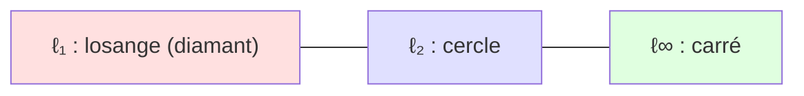
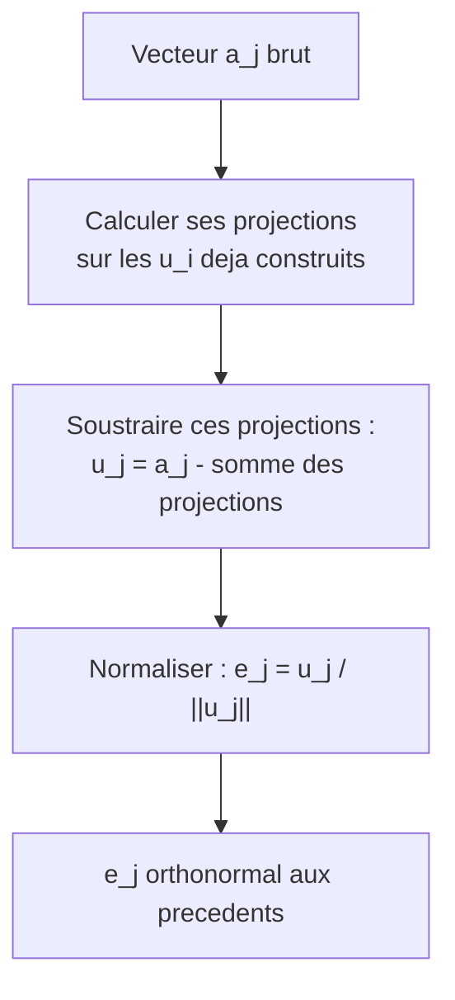
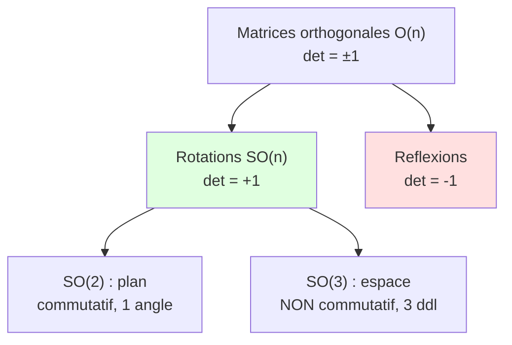

[← Sommaire](../README.md#table-des-matières)

# 3. Géométrie analytique

### Normes

Avant de parler de géométrie, il faut savoir **mesurer**. En géométrie analytique, tout objet — un point, une direction, une donnée — vit dans un espace vectoriel, et la première question que l'on se pose est : « quelle est la *taille* de ce vecteur ? » C'est exactement ce que formalise la notion de **norme** (norm).

#### Intuition imagée

Imaginez une flèche dessinée sur une feuille, partant de l'origine. Sa norme, c'est tout simplement sa **longueur** : la distance entre la pointe et la queue. Si la flèche est deux fois plus longue, sa norme double. Si la flèche est réduite à un point (le vecteur nul), sa norme vaut zéro. Une norme ne peut jamais être négative : une longueur négative n'a aucun sens.

Mais — et c'est le cœur de l'affaire — il existe **plusieurs façons légitimes** de mesurer une « longueur ». À vol d'oiseau (la distance euclidienne usuelle), ou à la manière d'un taxi qui ne peut rouler que dans des rues perpendiculaires (la distance de Manhattan). Ce sont des normes différentes, toutes valides.

#### Définition rigoureuse

> **Le symbole $`\|\cdot\|`$ (double barre verticale).**
> Ce symbole représente la **norme**, c'est-à-dire la « longueur » d'un vecteur. Quand on écrit $`\|x\|`$, lisez « norme de $`x`$ ». Pourquoi une *double* barre, et non une seule comme la valeur absolue $`|a|`$ d'un nombre ? Parce qu'un vecteur a *plusieurs coordonnées* : la double barre nous rappelle qu'on combine toutes ces coordonnées en une seule mesure de taille. C'est comme demander la taille d'une personne : on résume plein d'informations (longueur des jambes, du torse, du cou) en un seul nombre, en centimètres.

Soit $`V`$ un espace vectoriel sur le corps $`\mathbb{R}`$ (l'ensemble des nombres réels, c'est-à-dire tous les nombres « avec une virgule », positifs ou négatifs). Une **norme** sur $`V`$ est une application

```math
\|\cdot\| : V \longrightarrow \mathbb{R}_{\geq 0}
```

qui à chaque vecteur associe un nombre réel positif ou nul, et qui vérifie les **trois axiomes** suivants, pour tous vecteurs $`x, y \in V`$ et tout scalaire $`\lambda \in \mathbb{R}`$ :

> **Le symbole $`\in`$ (appartient à).**
> Ce symbole, qui ressemble à un « e » arrondi, représente l'**appartenance**. $`x \in V`$ se lit « $`x`$ appartient à $`V`$ », c'est-à-dire « $`x`$ est un élément de l'ensemble $`V`$ ». C'est comme dire « Médor appartient à l'ensemble des chiens ». Le symbole $`\mathbb{R}_{\geq 0}`$ désigne quant à lui l'ensemble des réels supérieurs ou égaux à zéro (les longueurs possibles).

| Axiome | Formule | Lecture intuitive |
|---|---|---|
| **(N1) Positivité / séparation** | $`\|x\| \geq 0`$, et $`\|x\| = 0 \iff x = 0`$ | Une longueur est positive ; seule la flèche nulle a une longueur nulle. |
| **(N2) Homogénéité absolue** | $`\|\lambda x\| = |\lambda|\,\|x\|`$ | Étirer la flèche d'un facteur $`\lambda`$ multiplie sa longueur par $`|\lambda|`$. |
| **(N3) Inégalité triangulaire** | $`\|x + y\| \leq \|x\| + \|y\|`$ | Un détour est toujours plus long que la ligne directe. |

> **Attention à l'axiome (N2).** On écrit $`|\lambda|`$ (valeur absolue, **simple** barre) car $`\lambda`$ est un *nombre*, pas un vecteur. La double barre $`\|\cdot\|`$ est réservée aux vecteurs. Si l'on étire une flèche par $`\lambda = -3`$, sa longueur est multipliée par $`|-3| = 3`$ : le signe disparaît, car une longueur reste positive même quand on retourne la flèche.

> **Le symbole $`\iff`$ (équivalence).**
> Cette double flèche signifie « **si et seulement si** » : les deux affirmations qu'elle relie sont vraies exactement dans les mêmes situations. Ici, « $`\|x\|=0`$ » et « $`x=0`$ » vont toujours ensemble, comme « il pleut » $`\iff`$ « le sol devient mouillé » dans un monde idéalisé : l'un ne va jamais sans l'autre.

> **Remarque (inégalité triangulaire, l'âme de la géométrie).** L'axiome (N3) tient son nom du triangle de sommets $`0`$, $`x`$ et $`x+y`$ : aller directement de $`0`$ à $`x+y`$ (côté de longueur $`\|x+y\|`$) est plus court que passer par le sommet intermédiaire (chemin de longueur $`\|x\|+\|y\|`$). C'est la version mathématique du proverbe « le plus court chemin est la ligne droite ».

#### La famille des normes $`\ell_p`$

Sur $`\mathbb{R}^n`$ (l'espace des vecteurs à $`n`$ coordonnées réelles), la classe la plus importante est celle des **normes $`\ell_p`$** (« normes p »), définies pour un réel $`p \geq 1`$ par :

```math
\|x\|_p = \left( \sum_{i=1}^{n} |x_i|^p \right)^{1/p}
```

> **Le symbole $`\sum`$ (sigma majuscule, la somme).**
> Ce grand symbole en forme de « E » anguleux représente une **somme répétée**. Voyez-le comme une **boucle qui additionne** : $`\sum_{i=1}^{n}`$ veut dire « fais varier le compteur $`i`$ depuis $`1`$ jusqu'à $`n`$, et additionne tout ce qui suit ». Par exemple $`\sum_{i=1}^{3} a_i = a_1 + a_2 + a_3`$. La lettre $`i`$ en bas est l'**indice** (le compteur), $`1`$ est sa valeur de départ, $`n`$ (en haut) sa valeur d'arrivée. C'est exactement comme empiler des pièces une par une et compter le total. Le symbole $`|x_i|`$ à l'intérieur est la **valeur absolue** de la $`i`$-ème coordonnée : la distance de $`x_i`$ à zéro, toujours positive (par exemple $`|{-3}| = 3`$).

Trois valeurs de $`p`$ dominent la pratique :

| Nom | Notation | Formule | Image mentale |
|---|---|---|---|
| Norme de Manhattan / taxi ($`\ell_1`$) | $`\|x\|_1`$ | $`\sum_{i=1}^n |x_i|`$ | Distance parcourue dans un quadrillage de rues. |
| Norme euclidienne ($`\ell_2`$) | $`\|x\|_2`$ | $`\sqrt{\sum_{i=1}^n x_i^2}`$ | Distance « à vol d'oiseau », le théorème de Pythagore. |
| Norme du sup / max ($`\ell_\infty`$) | $`\|x\|_\infty`$ | $`\max_{1 \leq i \leq n} |x_i|`$ | La plus grande coordonnée en valeur absolue. |

La norme euclidienne $`\ell_2`$ est la « longueur » usuelle, celle de notre intuition géométrique. Elle correspond à $`p=2`$ et généralise directement Pythagore : dans le plan, $`\|x\|_2 = \sqrt{x_1^2 + x_2^2}`$ est bien la longueur de l'hypoténuse d'un triangle rectangle de côtés $`x_1`$ et $`x_2`$.

> **Le symbole $`\sqrt{\ }`$ (racine carrée).** Il représente l'opération inverse du carré : $`\sqrt{9}=3`$ parce que $`3^2 = 9`$. Intuitivement, si une surface carrée a une aire de $`9`$, son côté mesure $`\sqrt 9 = 3`$. La racine carrée d'une somme de carrés « défait » la mise au carré des coordonnées pour revenir à une longueur.

> **Le symbole $`\max`$ (maximum).** $`\max_i |x_i|`$ signifie « le plus grand parmi les nombres $`|x_i|`$ ». Imaginez une rangée d'enfants : le maximum, c'est la taille du plus grand. La norme $`\ell_\infty`$ est la limite des normes $`\ell_p`$ quand $`p \to \infty`$ ; quand $`p`$ devient gigantesque, le terme le plus grand de la somme écrase tous les autres.

> **Piège fréquent.** Pour $`0 < p < 1`$, la formule ci-dessus **n'est plus une norme** : l'inégalité triangulaire (N3) est violée. On parle alors de « quasi-norme ». De même, le « comptage de coefficients non nuls » noté abusivement $`\|x\|_0`$ (la pseudo-norme $`\ell_0`$, omniprésente en parcimonie) **n'est pas une norme** : elle n'est pas homogène ($`\|2x\|_0 = \|x\|_0 \neq 2\|x\|_0`$).

#### Boules unité : visualiser une norme

La **boule unité** d'une norme est l'ensemble des vecteurs de norme $`\leq 1`$ : $`B = \{x : \|x\| \leq 1\}`$. Sa forme caractérise entièrement la norme.

> **Le symbole $`\{\,\cdot \mid \cdot\,\}`$ (accolades, définition d'un ensemble).** Les accolades $`\{\dots\}`$ décrivent un **ensemble**, et la barre verticale $`\mid`$ (ou deux-points) se lit « tels que ». Ainsi $`\{x \mid \|x\|\leq 1\}`$ se lit « l'ensemble des $`x`$ tels que la norme de $`x`$ est inférieure ou égale à $`1`$ ». C'est comme dire « l'ensemble des élèves tels que leur note dépasse $`10`$ » : une accolade qui regroupe, une condition qui filtre.



Dans le plan, la boule unité $`\ell_1`$ est un **losange** (pointes sur les axes), la boule $`\ell_2`$ est un **cercle** parfait, et la boule $`\ell_\infty`$ est un **carré** aligné sur les axes. Cette géométrie n'est pas anecdotique : en apprentissage automatique, les **coins** du losange $`\ell_1`$ (situés sur les axes, donc avec des coordonnées nulles) expliquent pourquoi la régularisation $`\ell_1`$ (le LASSO) produit des solutions **parcimonieuses** (sparse), c'est-à-dire avec beaucoup de zéros.

#### Inégalités entre normes et équivalence

Sur $`\mathbb{R}^n`$, toutes ces normes vérifient des relations d'encadrement. On a notamment, pour tout $`x \in \mathbb{R}^n`$ :

```math
\|x\|_\infty \leq \|x\|_2 \leq \|x\|_1 \leq \sqrt{n}\,\|x\|_2 \leq n\,\|x\|_\infty
```

Plus profondément, un théorème central :

> **Théorème (équivalence des normes en dimension finie).** Sur un espace vectoriel de dimension finie, **toutes les normes sont équivalentes** : pour deux normes $`\|\cdot\|_a`$ et $`\|\cdot\|_b`$, il existe des constantes $`0 < c \leq C`$ telles que
> ```math
> c\,\|x\|_a \leq \|x\|_b \leq C\,\|x\|_a \qquad \forall x.
> ```
> Conséquence : la convergence d'une suite, la continuité, la notion de « petit » ou « grand » ne dépendent **pas** du choix de la norme. C'est un luxe propre à la dimension finie ; en dimension infinie (espaces de fonctions), il disparaît.

> **Le symbole $`\forall`$ (quantificateur universel).** Ce « A » retourné se lit « **pour tout** » ou « quel que soit ». $`\forall x`$ veut dire « ceci est vrai pour absolument tous les $`x`$ », sans exception. C'est comme une affiche « *interdit à tous les véhicules* » : la règle s'applique à chacun.

*Démonstration (esquisse).* Il suffit de montrer que toute norme $`\|\cdot\|`$ est équivalente à $`\|\cdot\|_2`$. La fonction $`x \mapsto \|x\|`$ est continue pour $`\|\cdot\|_2`$ (par l'inégalité triangulaire et l'homogénéité). La sphère unité $`S = \{x : \|x\|_2 = 1\}`$ est **compacte** (fermée et bornée en dimension finie, théorème de Heine–Borel). Une fonction continue sur un compact atteint ses bornes : posons $`c = \min_{x \in S} \|x\|`$ et $`C = \max_{x \in S} \|x\|`$. Comme $`0 \notin S`$ et que $`\|x\| = 0 \iff x = 0`$, on a $`c > 0`$. Pour $`x \neq 0`$ quelconque, en appliquant à $`x/\|x\|_2 \in S`$ et en utilisant l'homogénéité, on obtient $`c \leq \|x\|/\|x\|_2 \leq C`$, d'où le résultat. $`\blacksquare`$

> **Le symbole $`\mapsto`$ (« associe à »).** La flèche à barre $`\mapsto`$ décrit l'**action** d'une fonction sur un élément : $`x \mapsto \|x\|`$ se lit « à $`x`$, on associe $`\|x\|`$ ». À ne pas confondre avec $`\to`$ (qui relie des *ensembles* : $`f : V \to \mathbb{R}`$). Pensez à une machine : $`\to`$ décrit le type d'entrée et de sortie de la machine, $`\mapsto`$ décrit ce qu'elle fait à un objet précis.

#### Exemple chiffré déroulé

Prenons $`x = (3, -4) \in \mathbb{R}^2`$.

- **$`\ell_1`$ :** $`\|x\|_1 = |3| + |{-4}| = 3 + 4 = 7`$.
- **$`\ell_2`$ :** $`\|x\|_2 = \sqrt{3^2 + (-4)^2} = \sqrt{9 + 16} = \sqrt{25} = 5`$. (Le fameux triangle 3-4-5.)
- **$`\ell_\infty`$ :** $`\|x\|_\infty = \max(|3|, |{-4}|) = \max(3, 4) = 4`$.

On vérifie bien l'encadrement : $`4 \leq 5 \leq 7`$, soit $`\|x\|_\infty \leq \|x\|_2 \leq \|x\|_1`$.

#### Application en machine learning

Les normes sont **omniprésentes** :

- **Fonctions de perte :** l'erreur quadratique moyenne (mean squared error) est $`\frac{1}{n}\|\hat{y} - y\|_2^2`$ ; l'erreur absolue moyenne (mean absolute error) est $`\frac{1}{n}\|\hat{y} - y\|_1`$.
- **Régularisation :** on ajoute $`\lambda \|w\|_2^2`$ (Ridge, qui rétrécit les poids) ou $`\lambda \|w\|_1`$ (LASSO, qui en annule) à la fonction de coût pour contrôler la complexité du modèle.
- **Normalisation de données :** mettre chaque échantillon à norme $`\ell_2`$ unitaire.

```python
import numpy as np

x = np.array([3.0, -4.0])

l1   = np.linalg.norm(x, ord=1)        # 7.0
l2   = np.linalg.norm(x, ord=2)        # 5.0  (= np.linalg.norm(x))
linf = np.linalg.norm(x, ord=np.inf)   # 4.0

print(l1, l2, linf)  # 7.0 5.0 4.0

# Normalisation L2 : ramener un vecteur a une longueur de 1
x_unit = x / np.linalg.norm(x)
print(x_unit, np.linalg.norm(x_unit))  # [ 0.6 -0.8] 1.0

# Norme de Frobenius d'une matrice = norme L2 de ses coefficients "deroules"
A = np.array([[1.0, 2.0], [3.0, 4.0]])
print(np.linalg.norm(A, 'fro'))        # sqrt(1+4+9+16) = sqrt(30) ~ 5.477
```

> **Mise à jour 2026.** Dans les bibliothèques d'autodifférenciation modernes (JAX, PyTorch), la fonction `norm` est entièrement **différentiable** — sauf en $`0`$ pour $`\ell_1`$ et $`\ell_\infty`$, où l'on utilise un **sous-gradient** (subgradient). C'est précisément ce qui permet d'optimiser des pénalités $`\ell_1`$ par descente de (sous-)gradient. Le *clipping* de gradient par la norme (`torch.nn.utils.clip_grad_norm_`), qui borne $`\|g\|_2`$ pour stabiliser l'entraînement des grands modèles, et la *normalisation spectrale* (qui contrôle la plus grande valeur singulière d'une matrice de poids) sont devenus des outils standard de l'entraînement à grande échelle.

---

### Produits scalaires

La norme nous dit *combien long* est un vecteur. Le **produit scalaire** (inner product / dot product) va beaucoup plus loin : il nous dit comment **deux** vecteurs sont orientés l'un par rapport à l'autre. C'est l'outil qui transforme l'algèbre linéaire « sèche » en véritable **géométrie**, avec des angles, des projections et de la perpendicularité.

#### Intuition imagée

Le produit scalaire mesure à quel point deux flèches « **pointent dans la même direction** ». Trois situations résument tout :

- Si les deux flèches pointent **dans le même sens**, leur produit scalaire est **grand et positif** (elles « coopèrent »).
- Si elles sont **perpendiculaires**, leur produit scalaire est **nul** (elles s'ignorent totalement).
- Si elles pointent en **sens opposés**, leur produit scalaire est **négatif** (elles « s'opposent »).

Analogie physique : pour pousser un chariot, seule compte la part de votre force qui va dans le sens du mouvement. Le travail d'une force est précisément un produit scalaire $`W = \vec{F} \cdot \vec{d}`$.

#### Le produit scalaire canonique sur $`\mathbb{R}^n`$

> **Le symbole $`\langle \cdot , \cdot \rangle`$ (crochets en chevrons).**
> Ces crochets pointus encadrant deux objets représentent le **produit scalaire**. $`\langle x, y \rangle`$ se lit « produit scalaire de $`x`$ et $`y`$ ». C'est une **machine à deux entrées** (les deux vecteurs $`x`$ et $`y`$) qui ressort **un seul nombre** (un scalaire). Pensez à une poignée de main entre deux personnes : il faut être deux pour la faire, et le « résultat » (chaleureuse ou froide) est une seule impression. On note aussi parfois $`x \cdot y`$ (notation « point »), surtout en physique, ou $`x^\top y`$ (notation matricielle).

Sur $`\mathbb{R}^n`$, le produit scalaire **canonique** (ou usuel) de $`x = (x_1, \dots, x_n)`$ et $`y = (y_1, \dots, y_n)`$ est :

```math
\langle x, y \rangle = x^\top y = \sum_{i=1}^{n} x_i\, y_i = x_1 y_1 + x_2 y_2 + \cdots + x_n y_n
```

On multiplie les coordonnées **deux à deux** (la première de $`x`$ avec la première de $`y`$, etc.) puis on additionne tout. Le lien fondamental avec la norme euclidienne :

```math
\langle x, x \rangle = \sum_{i=1}^n x_i^2 = \|x\|_2^2 \qquad \Longrightarrow \qquad \|x\|_2 = \sqrt{\langle x, x\rangle}
```

Autrement dit, **la norme euclidienne est la racine du produit scalaire d'un vecteur avec lui-même**. La géométrie des longueurs découle de celle des produits scalaires.

> **Le symbole $`x^\top`$ (transposée), en rappel.** La transposée transforme un vecteur colonne en vecteur ligne (vu au chapitre précédent). L'écriture $`x^\top y`$ est donc le produit d'une matrice ligne $`1\times n`$ par une matrice colonne $`n\times 1`$, qui donne bien une matrice $`1\times 1`$, identifiée à un nombre. Le symbole $`\Longrightarrow`$ se lit « **donc** » / « implique » : si la chose de gauche est vraie, alors celle de droite l'est aussi.

#### Définition rigoureuse (produit scalaire abstrait)

La puissance du concept vient de son **axiomatisation** : on peut définir des produits scalaires bien au-delà de la formule canonique (sur des espaces de matrices, de fonctions, etc.).

> **Définition (produit scalaire réel).** Soit $`V`$ un $`\mathbb{R}`$-espace vectoriel. Un **produit scalaire** est une application $`\langle \cdot, \cdot \rangle : V \times V \to \mathbb{R}`$ vérifiant, pour tous $`x, y, z \in V`$ et $`\lambda, \mu \in \mathbb{R}`$ :

| Propriété | Formule | Sens |
|---|---|---|
| **Linéarité à gauche** | $`\langle \lambda x + \mu z, y\rangle = \lambda\langle x,y\rangle + \mu \langle z, y\rangle`$ | Compatible avec additions et étirements. |
| **Symétrie** | $`\langle x, y \rangle = \langle y, x \rangle`$ | L'ordre des deux vecteurs n'importe pas. |
| **Positivité définie** | $`\langle x, x \rangle \geq 0`$, et $`\langle x, x\rangle = 0 \iff x = 0`$ | Le « carré de longueur » est positif, nul seulement pour $`0`$. |

> **Pourquoi la linéarité d'un seul côté suffit.** On n'impose la linéarité que dans le **premier** argument. Mais combinée à la **symétrie**, elle se transmet automatiquement au second : $`\langle x, \lambda y + \mu z\rangle = \langle \lambda y + \mu z, x\rangle = \lambda\langle y,x\rangle + \mu\langle z,x\rangle = \lambda\langle x,y\rangle + \mu\langle x,z\rangle`$. Linéaire des deux côtés, on dit que le produit scalaire est **bilinéaire**. Inutile donc de poser quatre axiomes là où deux suffisent.

> **Le symbole $`V \times V`$ (produit cartésien).** Le $`\times`$ entre deux ensembles forme l'ensemble des **couples** : $`V \times V`$ est l'ensemble de toutes les paires $`(x, y)`$ de vecteurs. C'est exactement comme un jeu de bataille navale : une case est repérée par un *couple* (lettre, chiffre). Ici, le produit scalaire prend en entrée un tel couple.

Un espace vectoriel muni d'un produit scalaire s'appelle un **espace préhilbertien** ; s'il est complet (toute suite de Cauchy y converge), c'est un **espace de Hilbert** (Hilbert space) — la structure reine de l'analyse fonctionnelle et de la théorie de l'apprentissage (noyaux, RKHS).

#### Produits scalaires généraux : la matrice de Gram

Toute matrice **symétrique définie positive** $`A`$ engendre un produit scalaire valide :

```math
\langle x, y \rangle_A = x^\top A\, y
```

> **Le symbole « définie positive ».** Une matrice symétrique $`A`$ est dite *définie positive* (notée $`A \succ 0`$) si $`x^\top A x > 0`$ pour tout $`x \neq 0`$. Intuitivement, $`A`$ « ne renverse jamais » un vecteur au point de rendre son carré de longueur négatif. C'est la condition exacte pour que $`\langle \cdot,\cdot\rangle_A`$ respecte la positivité définie. La symétrie de $`A`$ garantit, elle, la symétrie du produit scalaire. Le cas $`A = I`$ (matrice identité) redonne le produit scalaire canonique.

Ce produit scalaire « pondéré » est au cœur de la **distance de Mahalanobis** en statistique, où $`A = \Sigma^{-1}`$ est l'inverse de la matrice de covariance : il déforme l'espace pour tenir compte des corrélations entre variables.

#### L'inégalité de Cauchy–Schwarz

C'est sans doute **l'inégalité la plus importante** de toute l'analyse. Elle relie produit scalaire et normes.

> **Théorème (Cauchy–Schwarz).** Pour tous $`x, y`$ dans un espace préhilbertien,
> ```math
> |\langle x, y \rangle| \;\leq\; \|x\|\,\|y\|,
> ```
> avec **égalité si et seulement si** $`x`$ et $`y`$ sont **colinéaires** (l'un est multiple de l'autre).

*Démonstration (élégante, par le discriminant).* Si $`y = 0`$, l'inégalité est triviale ($`0 \leq 0`$). Sinon, considérons pour tout $`t \in \mathbb{R}`$ le polynôme du second degré en $`t`$ :

```math
P(t) = \langle x - t y,\; x - t y\rangle = \|x\|^2 - 2t\langle x, y\rangle + t^2 \|y\|^2 \;\geq\; 0.
```

Ce trinôme est positif ou nul pour **tout** $`t`$ réel (c'est un carré de norme). Un trinôme $`at^2 + bt + c`$ avec $`a = \|y\|^2 > 0`$ reste $`\geq 0`$ partout si et seulement si son **discriminant** $`\Delta = b^2 - 4ac`$ est $`\leq 0`$. Ici :

```math
\Delta = 4\langle x, y\rangle^2 - 4\|y\|^2\|x\|^2 \leq 0 \;\Longrightarrow\; \langle x, y\rangle^2 \leq \|x\|^2 \|y\|^2.
```

En prenant la racine carrée, on obtient $`|\langle x,y\rangle| \leq \|x\|\|y\|`$. L'égalité a lieu quand $`\Delta = 0`$, c'est-à-dire quand $`P`$ admet une racine $`t_0`$ : alors $`\|x - t_0 y\|^2 = 0`$, donc $`x = t_0 y`$ (colinéarité). $`\blacksquare`$

> **Conséquence majeure :** Cauchy–Schwarz garantit que la quantité $`\dfrac{\langle x,y\rangle}{\|x\|\,\|y\|}`$ est toujours comprise entre $`-1`$ et $`+1`$. C'est **exactement** ce qu'il faut pour la définir comme un **cosinus d'angle** (section suivante) ! Et elle implique aussi l'inégalité triangulaire de la norme euclidienne :
> ```math
> \|x+y\|^2 = \|x\|^2 + 2\langle x,y\rangle + \|y\|^2 \leq \|x\|^2 + 2\|x\|\|y\| + \|y\|^2 = (\|x\|+\|y\|)^2.
> ```

#### Exemple chiffré

Soit $`x = (1, 2, 3)`$ et $`y = (4, -5, 6)`$ dans $`\mathbb{R}^3`$.

```math
\langle x, y\rangle = (1)(4) + (2)(-5) + (3)(6) = 4 - 10 + 18 = 12.
```

Vérifions Cauchy–Schwarz : $`\|x\|_2 = \sqrt{1+4+9} = \sqrt{14} \approx 3{,}742`$ et $`\|y\|_2 = \sqrt{16+25+36} = \sqrt{77} \approx 8{,}775`$. Donc $`\|x\|\|y\| = \sqrt{14 \cdot 77} = \sqrt{1078} \approx 32{,}83`$. On a bien $`|12| = 12 \leq 32{,}83`$.

#### Application en machine learning

Le produit scalaire est **le calcul élémentaire du deep learning** :

- Un **neurone** calcule $`\langle w, x\rangle + b`$ (combinaison pondérée des entrées plus un biais), puis applique une fonction d'activation.
- Une **multiplication matrice-vecteur** $`Wx`$ n'est qu'une *pile* de produits scalaires (une ligne de $`W`$ avec $`x`$).
- La **similarité cosinus** entre deux plongements (embeddings) — mots, images, documents — est un produit scalaire normalisé : c'est le cœur de la recherche sémantique et des systèmes de recommandation.
- L'**attention** des Transformers calcule des scores $`\langle q, k\rangle`$ entre une requête (query) et des clés (keys).

```python
import numpy as np

x = np.array([1.0, 2.0, 3.0])
y = np.array([4.0, -5.0, 6.0])

# Trois ecritures equivalentes du produit scalaire
print(np.dot(x, y))   # 12.0
print(x @ y)          # 12.0   (operateur @ = produit matriciel/scalaire)
print(np.sum(x * y))  # 12.0

# Produit scalaire pondere <x,y>_A avec A symetrique definie positive
A = np.array([[2.0, 0.5, 0.0],
              [0.5, 3.0, 0.0],
              [0.0, 0.0, 1.0]])
print(x @ A @ y)      # forme bilineaire x^T A y

# Matrice de Gram d'un jeu de vecteurs : G[i,j] = <v_i, v_j>
V = np.array([[1.0, 0.0], [1.0, 1.0], [0.0, 2.0]])  # 3 vecteurs en ligne
G = V @ V.T
print(G)
```

> **Mise à jour 2026.** Les **méthodes à noyaux** (kernel methods) reposent sur l'idée que $`k(x, y) = \langle \phi(x), \phi(y)\rangle`$ est un produit scalaire dans un espace de caractéristiques de très grande (voire infinie) dimension, sans jamais calculer $`\phi`$ (l'« astuce du noyau », kernel trick). Cette idée connaît un net regain : les **noyaux tangents neuronaux** (Neural Tangent Kernels, NTK) décrivent la dynamique des réseaux très larges, et les approximations randomisées (random features) rendent les noyaux applicables à des millions de points. Côté matériel, les accélérateurs (GPU/TPU) sont avant tout des machines à produits scalaires massivement parallèles.

---

### Longueurs et distances

Une fois munis d'un produit scalaire, longueurs et distances ne sont plus des axiomes posés de l'extérieur : elles **découlent** naturellement de $`\langle\cdot,\cdot\rangle`$. C'est l'élégance de la structure préhilbertienne.

#### De la norme à la distance

La **longueur** d'un vecteur est sa norme. La **distance** entre deux points $`x`$ et $`y`$, c'est la longueur du vecteur qui les sépare :

> **Définition (distance induite par une norme).**
> ```math
> d(x, y) = \|x - y\|.
> ```
> Avec la norme euclidienne, cela donne la **distance euclidienne** :
> ```math
> d_2(x, y) = \|x - y\|_2 = \sqrt{\sum_{i=1}^n (x_i - y_i)^2}.
> ```

> **Intuition.** $`x - y`$ est la « flèche qui va de $`y`$ vers $`x`$ ». Sa longueur est l'écart entre les deux points. C'est exactement ce que mesure une règle posée entre deux points sur une carte.

Cette distance vérifie automatiquement les axiomes d'une **distance** (métrique), hérités de ceux de la norme :

| Axiome de distance | Formule | Origine |
|---|---|---|
| Positivité / séparation | $`d(x,y) \geq 0`$, $`\;d(x,y)=0 \iff x=y`$ | (N1) |
| Symétrie | $`d(x,y) = d(y,x)`$ | $`\|{-v}\| = \|v\|`$ via (N2) |
| Inégalité triangulaire | $`d(x,z) \leq d(x,y) + d(y,z)`$ | (N3) |

> **Le symbole $`d(\cdot,\cdot)`$.** La lettre $`d`$ (pour *distance*) prend **deux** points en entrée et renvoie **un** nombre positif : l'écart entre eux. Comme le compteur kilométrique d'une voiture entre deux villes. Toute norme fabrique une distance, mais toutes les distances ne viennent pas d'une norme (une distance peut exister sur un ensemble sans structure vectorielle, par exemple sur la surface d'une sphère).

#### Le théorème de Pythagore généralisé

Le lien produit scalaire–norme donne une formule centrale, l'**expansion du carré d'une somme** :

```math
\|x \pm y\|^2 = \|x\|^2 \pm 2\langle x, y\rangle + \|y\|^2.
```

Lorsque $`\langle x, y\rangle = 0`$ (vecteurs perpendiculaires), le terme du milieu disparaît et l'on retrouve **Pythagore** :

```math
\langle x, y\rangle = 0 \;\Longrightarrow\; \|x + y\|^2 = \|x\|^2 + \|y\|^2.
```

C'est littéralement « le carré de l'hypoténuse égale la somme des carrés des deux côtés », valable dans **n'importe quelle dimension**.

> **À ne pas confondre avec l'identité du parallélogramme.** En additionnant les deux versions ($`+`$ et $`-`$) ci-dessus, les termes croisés s'annulent et l'on obtient $`\|x+y\|^2 + \|x-y\|^2 = 2\|x\|^2 + 2\|y\|^2`$ : *cela*, c'est l'identité du parallélogramme (la somme des carrés des diagonales égale la somme des carrés des quatre côtés). Elle caractérise les normes qui proviennent réellement d'un produit scalaire — une propriété que les normes $`\ell_1`$ et $`\ell_\infty`$ ne possèdent **pas**.

#### Distances $`\ell_p`$ et leur usage

Chaque norme engendre sa distance. Voici un récapitulatif comparatif sur deux points $`x, y \in \mathbb{R}^n`$ :

| Distance | Formule | Cas d'usage typique |
|---|---|---|
| Manhattan ($`\ell_1`$) | $`\sum_i |x_i - y_i|`$ | Données sur grille, robustesse aux valeurs aberrantes. |
| Euclidienne ($`\ell_2`$) | $`\sqrt{\sum_i (x_i-y_i)^2}`$ | $`k`$-means, $`k`$-NN, géométrie usuelle. |
| Tchebychev ($`\ell_\infty`$) | $`\max_i |x_i - y_i|`$ | Jeux d'échecs (mouvement du roi), tolérances. |
| Minkowski ($`\ell_p`$) | $`\big(\sum_i |x_i-y_i|^p\big)^{1/p}`$ | Famille paramétrée généralisant les précédentes. |

#### Exemple chiffré

Soit $`x = (1, 2)`$ et $`y = (4, 6)`$.

- **Euclidienne :** $`d_2 = \sqrt{(1-4)^2 + (2-6)^2} = \sqrt{9 + 16} = \sqrt{25} = 5`$.
- **Manhattan :** $`d_1 = |1-4| + |2-6| = 3 + 4 = 7`$.
- **Tchebychev :** $`d_\infty = \max(3, 4) = 4`$.

#### Le fléau de la dimension

> **Mise en garde (curse of dimensionality).** En très grande dimension, un phénomène contre-intuitif apparaît : les distances euclidiennes entre points tirés au hasard deviennent **toutes presque égales**. Le rapport entre la distance maximale et la distance minimale tend vers $`1`$. Conséquence pratique : les algorithmes fondés sur la distance ($`k`$-NN, $`k`$-means) perdent leur pouvoir discriminant, et l'on préfère parfois les distances $`\ell_1`$, ou des distances apprises, ou une réduction de dimension préalable (ACP, voir plus loin).

#### Application en machine learning et code

```python
import numpy as np
from scipy.spatial.distance import cdist

x = np.array([1.0, 2.0])
y = np.array([4.0, 6.0])

print(np.linalg.norm(x - y, ord=2))   # 5.0  (euclidienne)
print(np.linalg.norm(x - y, ord=1))   # 7.0  (Manhattan)
print(np.linalg.norm(x - y, ord=np.inf))  # 4.0 (Tchebychev)

# Matrice de toutes les distances entre points d'un nuage (k-NN, clustering)
A = np.array([[0.0, 0.0], [1.0, 1.0], [4.0, 6.0]])
D = cdist(A, A, metric='euclidean')
print(np.round(D, 3))

# Astuce vectorisee : ||x-y||^2 = ||x||^2 + ||y||^2 - 2<x,y>
# tres utilisee pour calculer toutes les distances d'un coup
sq_norms = np.sum(A**2, axis=1)
D2 = sq_norms[:, None] + sq_norms[None, :] - 2 * (A @ A.T)
D2 = np.sqrt(np.maximum(D2, 0))  # max(.,0) corrige les erreurs numeriques
print(np.round(D2, 3))
```

> **Mise à jour 2026.** Le calcul de distances à grande échelle est devenu un domaine d'ingénierie à part entière avec l'essor de la **recherche du plus proche voisin approchée** (Approximate Nearest Neighbours) : des bibliothèques comme FAISS, ScaNN ou HNSW indexent des milliards de vecteurs (plongements de la génération augmentée par récupération, RAG) et trouvent les voisins en quelques millisecondes. L'astuce $`\|x-y\|^2 = \|x\|^2 + \|y\|^2 - 2\langle x,y\rangle`$ ci-dessus est exactement ce qui permet d'exploiter les multiplications matricielles optimisées du GPU pour ces recherches.

---

### Angles et orthogonalité

Nous avons maintenant tout pour définir la notion la plus géométrique qui soit : l'**angle** entre deux vecteurs, et son cas particulier crucial, l'**orthogonalité** (perpendicularité).

#### Le cosinus d'un angle

L'inégalité de Cauchy–Schwarz nous a offert un cadeau : le rapport $`\frac{\langle x,y\rangle}{\|x\|\|y\|}`$ est toujours dans $`[-1, 1]`$. C'est donc le cosinus d'un angle bien défini.

> **Définition (angle non orienté entre deux vecteurs non nuls).**
> ```math
> \cos\theta = \frac{\langle x, y\rangle}{\|x\|\,\|y\|}, \qquad \theta = \arccos\!\left(\frac{\langle x, y\rangle}{\|x\|\,\|y\|}\right) \in [0, \pi].
> ```

> **Le symbole $`\cos\theta`$ (cosinus).** Le cosinus est une fonction qui, à un angle, associe un nombre entre $`-1`$ et $`1`$. Imaginez une grande aiguille d'horloge de longueur $`1`$ : le cosinus de l'angle, c'est la **position horizontale de sa pointe** (sa projection sur l'axe horizontal). À $`0°`$ l'aiguille pointe à droite : $`\cos 0 = 1`$. À $`90°`$ elle pointe en haut, sa pointe est à l'horizontale $`0`$ : $`\cos 90° = 0`$. À $`180°`$ elle pointe à gauche : $`\cos 180° = -1`$. La lettre grecque $`\theta`$ (thêta) est juste le nom traditionnel donné à un angle.

> **Le symbole $`\arccos`$ (arc cosinus) et $`\pi`$ (pi).** $`\arccos`$ fait l'**inverse** du cosinus : on lui donne un nombre entre $`-1`$ et $`1`$, il rend l'angle correspondant. Le symbole $`\pi \approx 3{,}1416`$ est le célèbre nombre « pi » ; en **radians** (l'unité d'angle des mathématiciens), un demi-tour ($`180°`$) vaut exactement $`\pi`$, et un tour complet ($`360°`$) vaut $`2\pi`$. Pourquoi les radians ? Parce que les formules d'analyse (dérivées de $`\sin`$, $`\cos`$) y sont les plus simples.

Le cosinus traduit fidèlement l'intuition :

| Valeur de $`\cos\theta`$ | Angle $`\theta`$ | Configuration |
|---|---|---|
| $`+1`$ | $`0`$ | Même direction, même sens (colinéaires positifs). |
| $`0`$ | $`\pi/2`$ ($`90°`$) | **Perpendiculaires** (orthogonaux). |
| $`-1`$ | $`\pi`$ ($`180°`$) | Sens opposés (colinéaires négatifs). |

#### Orthogonalité

> **Définition (orthogonalité).** Deux vecteurs $`x`$ et $`y`$ sont **orthogonaux**, noté $`x \perp y`$, lorsque
> ```math
> \langle x, y\rangle = 0.
> ```

> **Le symbole $`\perp`$ (perpendiculaire / « taquet »).** Ce petit symbole en forme de « T » renversé représente l'**orthogonalité**, c'est-à-dire l'angle droit. $`x \perp y`$ se lit « $`x`$ est orthogonal à $`y`$ ». Pensez à l'angle parfait entre un mur et le sol, ou entre les deux aiguilles d'une montre à $`15`$ h pile. La beauté de la définition abstraite : on n'a même pas besoin de « voir » l'angle, il suffit que le produit scalaire soit nul.

> **Subtilité importante.** Le vecteur nul $`0`$ est orthogonal à **tous** les vecteurs (car $`\langle 0, y\rangle = 0`$ toujours). C'est le seul vecteur orthogonal à lui-même. L'orthogonalité dépend du produit scalaire choisi : deux vecteurs orthogonaux pour $`\langle\cdot,\cdot\rangle`$ ne le sont pas forcément pour $`\langle\cdot,\cdot\rangle_A`$.

#### Familles orthogonales et indépendance

> **Théorème.** Une famille de vecteurs **non nuls** deux à deux orthogonaux est **linéairement indépendante**.

*Démonstration.* Soit $`\{v_1, \dots, v_k\}`$ orthogonaux deux à deux, et supposons $`\sum_{j=1}^k \lambda_j v_j = 0`$. Prenons le produit scalaire des deux côtés avec un $`v_i`$ fixé :

```math
0 = \Big\langle \sum_j \lambda_j v_j,\; v_i\Big\rangle = \sum_j \lambda_j \langle v_j, v_i\rangle = \lambda_i \langle v_i, v_i\rangle = \lambda_i \|v_i\|^2.
```

Tous les termes $`j \neq i`$ s'annulent par orthogonalité ; il ne reste que le terme $`i`$. Comme $`v_i \neq 0`$, on a $`\|v_i\|^2 > 0`$, donc $`\lambda_i = 0`$. Ceci valant pour tout $`i`$, tous les coefficients sont nuls : la famille est libre. $`\blacksquare`$

#### Similarité cosinus en pratique

La **similarité cosinus** (cosine similarity) est le cosinus de l'angle, vu comme une mesure de ressemblance directionnelle :

```math
\text{sim}_{\cos}(x, y) = \frac{\langle x, y\rangle}{\|x\|\,\|y\|}.
```

Elle ignore les **magnitudes** et ne compare que les **directions** — idéal lorsque l'amplitude n'est pas pertinente (un document long et un document court traitant du même sujet doivent être jugés proches).

#### Exemple chiffré

Soit $`x = (1, 0)`$ et $`y = (1, 1)`$.

```math
\cos\theta = \frac{(1)(1) + (0)(1)}{\sqrt{1}\cdot\sqrt{2}} = \frac{1}{\sqrt 2} \approx 0{,}707 \;\Longrightarrow\; \theta = 45°.
```

Et pour $`x = (1, 0)`$, $`z = (0, 5)`$ : $`\langle x, z\rangle = 0`$, donc $`x \perp z`$ : ils forment un angle droit, quelle que soit la longueur de $`z`$.

#### Application en machine learning et code

```python
import numpy as np

def cosine_similarity(x, y):
    return np.dot(x, y) / (np.linalg.norm(x) * np.linalg.norm(y))

x = np.array([1.0, 0.0])
y = np.array([1.0, 1.0])

cos = cosine_similarity(x, y)
angle_deg = np.degrees(np.arccos(np.clip(cos, -1.0, 1.0)))
print(round(cos, 4), round(angle_deg, 2))   # 0.7071 45.0

# Test d'orthogonalite (avec tolerance numerique)
z = np.array([0.0, 5.0])
print(np.isclose(np.dot(x, z), 0.0))        # True  ->  x ⊥ z

# Similarite cosinus entre une requete et une matrice de plongements
embeddings = np.array([[1.0, 0.0, 1.0],
                       [0.0, 1.0, 0.0],
                       [1.0, 1.0, 1.0]])
query = np.array([1.0, 0.0, 0.9])
norms = np.linalg.norm(embeddings, axis=1) * np.linalg.norm(query)
sims = (embeddings @ query) / norms
print(np.round(sims, 3))   # scores de similarite, le plus grand = plus pertinent
```

> **Le `np.clip` est crucial.** Les erreurs d'arrondi peuvent produire un cosinus comme $`1{,}0000000002`$, hors de $`[-1,1]`$, ce qui ferait renvoyer `nan` à `arccos`. On **borne** donc systématiquement la valeur avant `arccos`.

> **Mise à jour 2026.** La similarité cosinus est le moteur de la **recherche sémantique** moderne et de la génération augmentée par récupération (RAG) : on encode requête et documents en vecteurs, et l'on retient les plus « alignés ». Subtilité de plus en plus discutée : la similarité cosinus dans l'espace brut des plongements peut être trompeuse (les directions n'ont pas toutes le même sens sémantique) ; on lui adjoint des techniques de *whitening*, de recalibrage de température, ou l'apprentissage contrastif (contrastive learning, type InfoNCE) qui *optimise directement* des produits scalaires normalisés pour rapprocher les paires pertinentes et éloigner les autres.

---

### Bases orthonormales

Parmi toutes les bases possibles d'un espace vectoriel, certaines sont **infiniment plus commodes** que les autres : les bases orthonormales. Elles sont aux espaces vectoriels ce que le quadrillage à angle droit est à une feuille : le système de coordonnées idéal.

#### Définition

> **Le symbole $`\delta_{ij}`$ (delta de Kronecker).**
> Ce symbole, une petite lettre grecque delta avec deux indices, est un **interrupteur** ultra-simple : il vaut $`1`$ si les deux indices sont égaux, et $`0`$ sinon.
> ```math
> \delta_{ij} = \begin{cases} 1 & \text{si } i = j,\\ 0 & \text{si } i \neq j. \end{cases}
> ```
> Pensez à un test « est-ce que c'est le même ? » : oui $`\to 1`$, non $`\to 0`$. Il sert de raccourci universel pour dire « la diagonale vaut $`1`$, le reste vaut $`0`$ » (c'est-à-dire les coefficients de la matrice identité).

> **Définition (base orthonormale).** Une famille $`\{e_1, \dots, e_n\}`$ d'un espace préhilbertien est une **base orthonormale** (orthonormal basis) si :
> ```math
> \langle e_i, e_j\rangle = \delta_{ij},
> ```
> c'est-à-dire que les vecteurs sont **deux à deux orthogonaux** ($`\langle e_i, e_j\rangle = 0`$ si $`i \neq j`$) **et** chacun de **norme $`1`$** ($`\|e_i\| = 1`$). « Ortho » pour les angles droits, « normale » pour la longueur unité.

L'exemple canonique sur $`\mathbb{R}^n`$ est la **base standard** $`e_1 = (1,0,\dots,0)`$, $`e_2 = (0,1,0,\dots,0)`$, etc. Mais il en existe une infinité d'autres (toute rotation de la base standard en fournit une).

#### Pourquoi c'est si pratique : les coordonnées deviennent des produits scalaires

> **Théorème (décomposition dans une base orthonormale).** Si $`\{e_1, \dots, e_n\}`$ est une base orthonormale, alors tout vecteur $`x`$ s'écrit
> ```math
> x = \sum_{i=1}^n \langle x, e_i\rangle\, e_i.
> ```
> Les coordonnées de $`x`$ sont simplement les **produits scalaires** $`\langle x, e_i\rangle`$ — aucun système d'équations à résoudre !

*Démonstration.* Comme $`\{e_i\}`$ est une base, $`x = \sum_j c_j e_j`$ pour certains coefficients $`c_j`$. Prenons le produit scalaire avec $`e_i`$ :

```math
\langle x, e_i\rangle = \Big\langle \sum_j c_j e_j, e_i\Big\rangle = \sum_j c_j \langle e_j, e_i\rangle = \sum_j c_j \delta_{ji} = c_i.
```

Donc $`c_i = \langle x, e_i\rangle`$. $`\blacksquare`$

> **Pourquoi c'est révolutionnaire.** Dans une base quelconque, trouver les coordonnées exige de résoudre un système linéaire ($`Ax = b`$). Dans une base orthonormale, on **lit** chaque coordonnée par une simple projection. C'est comme passer d'une carte aux axes obliques et mal gradués à une carte parfaitement quadrillée.

#### L'identité de Parseval

> **Théorème (Parseval).** Dans une base orthonormale, pour tous $`x, y`$ :
> ```math
> \langle x, y\rangle = \sum_{i=1}^n \langle x, e_i\rangle \langle y, e_i\rangle, \qquad \|x\|^2 = \sum_{i=1}^n \langle x, e_i\rangle^2.
> ```

Autrement dit : **dans une base orthonormale, le produit scalaire abstrait redevient le produit scalaire canonique des coordonnées.** Les longueurs et les angles sont **préservés**. C'est la signature des transformations orthogonales (rotations, symétries).

#### Matrices orthogonales

> **Définition.** Une matrice carrée $`Q \in \mathbb{R}^{n\times n}`$ est **orthogonale** si ses colonnes forment une base orthonormale de $`\mathbb{R}^n`$, ce qui équivaut à
> ```math
> Q^\top Q = Q Q^\top = I \qquad \Longleftrightarrow \qquad Q^{-1} = Q^\top.
> ```

> **Le symbole $`\Longleftrightarrow`$.** C'est la même chose que $`\iff`$ rencontré plus haut : « si et seulement si ». Ici, les deux conditions ($`Q^\top Q = I`$ et $`Q^{-1} = Q^\top`$) sont parfaitement interchangeables : avoir l'une, c'est avoir l'autre.

C'est une propriété **en or** : l'inverse d'une matrice orthogonale est sa simple transposée (gratuite à calculer). De plus, les matrices orthogonales **préservent normes et produits scalaires** :

```math
\langle Qx, Qy\rangle = (Qx)^\top(Qy) = x^\top Q^\top Q\, y = x^\top y = \langle x, y\rangle, \qquad \|Qx\| = \|x\|.
```

Géométriquement, ce sont exactement les **isométries linéaires** : rotations (déterminant $`+1`$) et réflexions (déterminant $`-1`$). Elles ne déforment ni ne dilatent l'espace ; elles le font seulement tourner ou se refléter.

#### Le procédé de Gram–Schmidt

Comment **fabriquer** une base orthonormale à partir d'une base quelconque ? Par le procédé de **Gram–Schmidt** : on prend les vecteurs un à un, et à chaque étape on retire de chaque nouveau vecteur tout ce qu'il « contient déjà » des précédents.

> **Algorithme (Gram–Schmidt).** À partir d'une famille libre $`\{a_1, \dots, a_k\}`$ :
> ```math
> u_1 = a_1, \qquad u_j = a_j - \sum_{i=1}^{j-1} \frac{\langle a_j, u_i\rangle}{\langle u_i, u_i\rangle}\, u_i \quad (j \geq 2),
> ```
> puis on normalise : $`e_j = u_j / \|u_j\|`$. Les $`\{e_j\}`$ forment une base orthonormale du même sous-espace.



#### Exemple chiffré (Gram–Schmidt)

Orthonormalisons $`a_1 = (1, 1)`$ et $`a_2 = (1, 0)`$ dans $`\mathbb{R}^2`$.

1. $`u_1 = a_1 = (1,1)`$, donc $`e_1 = \frac{1}{\sqrt 2}(1,1)`$.
2. Projection de $`a_2`$ sur $`u_1`$ : $`\frac{\langle a_2, u_1\rangle}{\langle u_1, u_1\rangle} = \frac{(1)(1)+(0)(1)}{1+1} = \frac{1}{2}`$. Donc
   ```math
   u_2 = a_2 - \tfrac{1}{2}u_1 = (1, 0) - \tfrac{1}{2}(1, 1) = \big(\tfrac{1}{2}, -\tfrac{1}{2}\big).
   ```
3. $`\|u_2\| = \sqrt{\tfrac14 + \tfrac14} = \tfrac{1}{\sqrt 2}`$, donc $`e_2 = \sqrt 2 \cdot (\tfrac12, -\tfrac12) = \frac{1}{\sqrt 2}(1, -1)`$.

Vérification : $`\langle e_1, e_2\rangle = \frac{1}{2}\big((1)(1) + (1)(-1)\big) = 0`$. Orthonormale !

#### Application en machine learning et code

Les bases orthonormales sont **partout** : la décomposition QR (au cœur de la résolution des moindres carrés), l'**ACP** (analyse en composantes principales, dont les axes principaux forment une base orthonormale), les couches orthogonales en deep learning (qui préservent la norme des activations et combattent l'explosion/disparition du gradient).

```python
import numpy as np

# Decomposition QR : A = Q R, avec Q orthogonale (colonnes orthonormales)
A = np.array([[1.0, 1.0],
              [1.0, 0.0]])
Q, R = np.linalg.qr(A)
print("Q =\n", np.round(Q, 4))
print("Q^T Q =\n", np.round(Q.T @ Q, 10))   # ~ identite -> colonnes orthonormales

# Une matrice orthogonale preserve la norme
x = np.array([3.0, 4.0])
print(np.linalg.norm(x), np.linalg.norm(Q @ x))   # 5.0  5.0  (identiques)

# Decomposition dans une base orthonormale : coordonnees = produits scalaires
e1 = np.array([1.0, 1.0]) / np.sqrt(2)
e2 = np.array([1.0, -1.0]) / np.sqrt(2)
v = np.array([3.0, 1.0])
c1, c2 = v @ e1, v @ e2
print(c1, c2)                       # coordonnees dans la base (e1, e2)
print(c1 * e1 + c2 * e2)            # reconstruit v = [3. 1.]
```

> **Mise à jour 2026.** En pratique, le Gram–Schmidt « classique » est **numériquement instable** (perte d'orthogonalité par accumulation d'erreurs). On lui préfère le **Gram–Schmidt modifié**, ou surtout les factorisations par réflexions de **Householder** / rotations de **Givens**, plus robustes. En deep learning, la **régularisation orthogonale** et les **réseaux à poids orthogonaux** (par paramétrisation de Cayley ou de Householder) sont des techniques actives pour stabiliser l'entraînement des réseaux très profonds et des RNN ; PyTorch fournit même `torch.nn.utils.parametrizations.orthogonal` pour contraindre une matrice de poids à rester orthogonale durant l'optimisation.

---

### Complément orthogonal

Si l'on dispose d'un sous-espace (un plan dans l'espace, une droite dans le plan…), il existe une notion duale fondamentale : tout ce qui lui est **perpendiculaire**. C'est le complément orthogonal, pierre angulaire des projections et des moindres carrés.

#### Définition

> **Définition (complément orthogonal).** Soit $`U`$ un sous-espace vectoriel d'un espace préhilbertien $`V`$. Le **complément orthogonal** de $`U`$, noté $`U^\perp`$ (« $`U`$ perp »), est l'ensemble des vecteurs orthogonaux à **tout** $`U`$ :
> ```math
> U^\perp = \{\, v \in V \;\mid\; \langle v, u\rangle = 0 \ \text{ pour tout } u \in U \,\}.
> ```

> **Le symbole $`U^\perp`$.** Le petit « taquet » $`\perp`$ en exposant transforme un sous-espace en l'ensemble de **tout ce qui lui est perpendiculaire**. Si $`U`$ est le sol (un plan horizontal), $`U^\perp`$ est la direction verticale (l'axe « haut-bas »). Si $`U`$ est une droite, $`U^\perp`$ est le plan perpendiculaire qui la coupe à angle droit. C'est le « monde à $`90°`$ » du sous-espace.

> **Remarque.** $`U^\perp`$ est **toujours un sous-espace vectoriel**, même si $`U`$ n'est défini que par des générateurs : il suffit que $`v`$ soit orthogonal à une base de $`U`$ pour l'être à tout $`U`$ (par bilinéarité). De plus $`U \cap U^\perp = \{0\}`$ (un vecteur orthogonal à lui-même est nul).

> **Le symbole $`\cap`$ (intersection).** Ce symbole en forme de « U renversé » représente l'**intersection** de deux ensembles : ce qu'ils ont **en commun**. $`U \cap U^\perp = \{0\}`$ signifie « le seul vecteur appartenant à la fois à $`U`$ et à son orthogonal est le vecteur nul ». Comme l'intersection de « ce qui est rouge » et « ce qui est bleu » : seuls les objets des deux couleurs à la fois (ici, presque rien).

#### Le théorème de décomposition orthogonale

C'est le résultat structurant de tout le chapitre.

> **Théorème (décomposition en somme directe orthogonale).** Si $`U`$ est un sous-espace de **dimension finie** de $`V`$, alors tout vecteur $`v \in V`$ se décompose de manière **unique** en
> ```math
> v = u + w, \qquad u \in U, \quad w \in U^\perp.
> ```
> On écrit $`V = U \oplus U^\perp`$. Le vecteur $`u`$ est la **projection orthogonale** de $`v`$ sur $`U`$ (section suivante).

> **Le symbole $`\oplus`$ (somme directe).** Le « plus entouré d'un cercle » signifie **somme directe** : tout élément se décompose de façon **unique** comme somme d'un morceau dans chaque sous-espace. C'est comme dire qu'un nombre décimal se sépare de manière unique en « partie entière + partie fractionnaire » : $`3{,}7 = 3 + 0{,}7`$, sans ambiguïté. Ici, chaque vecteur = (sa part dans $`U`$) + (sa part perpendiculaire), sans recouvrement.

*Démonstration (existence et unicité).* **Existence :** soit $`\{e_1, \dots, e_k\}`$ une base orthonormale de $`U`$ (qui existe par Gram–Schmidt). Posons $`u = \sum_{i=1}^k \langle v, e_i\rangle e_i \in U`$ et $`w = v - u`$. Pour tout $`j`$ :

```math
\langle w, e_j\rangle = \langle v, e_j\rangle - \sum_i \langle v, e_i\rangle\langle e_i, e_j\rangle = \langle v, e_j\rangle - \langle v, e_j\rangle = 0,
```

donc $`w`$ est orthogonal à toute la base de $`U`$, donc à $`U`$ entier : $`w \in U^\perp`$. **Unicité :** si $`v = u_1 + w_1 = u_2 + w_2`$ avec $`u_i \in U, w_i \in U^\perp`$, alors $`u_1 - u_2 = w_2 - w_1 \in U \cap U^\perp = \{0\}`$, d'où $`u_1 = u_2`$ et $`w_1 = w_2`$. $`\blacksquare`$

#### Propriétés clés et dimensions

| Propriété | Énoncé |
|---|---|
| Dimension | $`\dim U + \dim U^\perp = \dim V`$ (en dimension finie). |
| Double orthogonal | $`(U^\perp)^\perp = U`$ (en dimension finie). |
| Inversion d'inclusion | $`U \subseteq W \;\Longrightarrow\; W^\perp \subseteq U^\perp`$. |
| Somme et intersection | $`(U + W)^\perp = U^\perp \cap W^\perp`$. |

> **Le symbole $`\dim`$ (dimension).** $`\dim U`$ désigne le **nombre de vecteurs d'une base** de $`U`$ : son « nombre de degrés de liberté ». Une droite a dimension $`1`$, un plan dimension $`2`$. La formule $`\dim U + \dim U^\perp = \dim V`$ dit que les libertés de $`U`$ et celles de son perpendiculaire se complètent exactement pour remplir tout l'espace. Le symbole $`\subseteq`$ signifie « **est inclus dans** » : $`U \subseteq W`$ veut dire « tout élément de $`U`$ est aussi dans $`W`$ ».

#### Lien fondamental avec les espaces d'une matrice

Le complément orthogonal éclaire les **quatre sous-espaces fondamentaux** d'une matrice $`A \in \mathbb{R}^{m\times n}`$ :

```math
\big(\mathrm{Im} A\big)^\perp = \ker A^\top, \qquad \big(\ker A\big)^\perp = \mathrm{Im} A^\top.
```

> **Notations.** $`\mathrm{Im} A`$ (l'**image**, ou *column space*) est l'ensemble des $`Ax`$ possibles. $`\ker A`$ (le **noyau**, ou *null space*) est l'ensemble des $`x`$ tels que $`Ax = 0`$. Ces relations, parfois appelées « théorème fondamental de l'algèbre linéaire », disent que l'espace des colonnes et le noyau de la transposée sont des **mondes perpendiculaires** : c'est *exactement* ce qui rend les moindres carrés solubles.

#### Exemple chiffré

Dans $`\mathbb{R}^3`$, soit $`U = \text{Vect}\{(1,0,0),(0,1,0)\}`$ (le plan horizontal $`z=0`$). Un vecteur $`(a,b,c)`$ est dans $`U^\perp`$ ssi il est orthogonal à $`(1,0,0)`$ **et** à $`(0,1,0)`$ :

```math
\langle (a,b,c),(1,0,0)\rangle = a = 0, \qquad \langle (a,b,c),(0,1,0)\rangle = b = 0.
```

Donc $`U^\perp = \{(0,0,c) : c \in \mathbb{R}\} = \text{Vect}\{(0,0,1)\}`$ : l'**axe vertical**. On vérifie $`\dim U + \dim U^\perp = 2 + 1 = 3 = \dim \mathbb{R}^3`$.

#### Application en machine learning et code

```python
import numpy as np
from scipy.linalg import null_space

# U = plan engendre par deux vecteurs dans R^3 ; on cherche U^perp
U = np.array([[1.0, 0.0],
              [0.0, 1.0],
              [0.0, 0.0]])     # colonnes = generateurs de U

# U^perp = noyau de U^T (tout vecteur orthogonal a chaque colonne de U)
U_perp = null_space(U.T)
print("Base de U^perp :\n", np.round(U_perp, 4))   # ~ (0,0,1)

# Verification : chaque vecteur de U^perp est orthogonal a chaque colonne de U
print(np.round(U.T @ U_perp, 10))                  # ~ matrice nulle

# Le residu des moindres carres vit dans (Im A)^perp = ker A^T
A = np.array([[1.0, 0.0], [1.0, 1.0], [1.0, 2.0]])
b = np.array([1.0, 2.0, 2.0])
x_hat, *_ = np.linalg.lstsq(A, b, rcond=None)
residual = b - A @ x_hat
print(np.round(A.T @ residual, 10))   # ~ 0 : le residu est orthogonal aux colonnes de A
```

> **Pourquoi ça compte en ML.** Tout l'édifice des **moindres carrés** (régression linéaire) repose là-dessus : la meilleure approximation $`A\hat{x}`$ de $`b`$ est sa projection sur $`\mathrm{Im} A`$, et le **résidu** $`b - A\hat x`$ est orthogonal à cet espace, donc dans $`\ker A^\top`$. C'est ce qui donne les **équations normales** $`A^\top A \hat x = A^\top b`$, que nous retrouvons dans la section suivante.

---

### Produit scalaire de fonctions

Voici le saut conceptuel le plus puissant du chapitre : et si l'on traitait des **fonctions** comme des **vecteurs** ? Une fonction $`f`$ a une « valeur en chaque point $`t`$ », exactement comme un vecteur a une « coordonnée à chaque indice $`i`$ ». En passant d'une somme à une **intégrale**, tout l'arsenal géométrique (norme, angle, orthogonalité, projection) s'applique aux fonctions. C'est la porte d'entrée vers l'analyse de Fourier et les espaces de Hilbert.

#### De la somme à l'intégrale

Pour des vecteurs, $`\langle x, y\rangle = \sum_i x_i y_i`$. Pour des fonctions $`f, g`$ définies sur un intervalle $`[a, b]`$, on remplace l'indice discret $`i`$ par une variable continue $`t`$, et la somme par une **intégrale** :

> **Définition (produit scalaire $`L^2`$ des fonctions).**
> ```math
> \langle f, g\rangle = \int_a^b f(t)\, g(t)\, dt.
> ```

> **Le symbole $`\int`$ (intégrale).**
> Ce grand « S » étiré représente une **intégrale** : c'est l'équivalent continu de la somme $`\sum`$. Là où $`\sum`$ additionne des valeurs *séparées* (une pièce, puis une autre…), $`\int`$ additionne une infinité de valeurs *infiniment proches*. Image mentale : pour calculer l'**aire** sous une courbe, on la découpe en une myriade de fines tranches verticales de largeur minuscule $`dt`$, on calcule l'aire de chaque tranche (hauteur $`\times`$ largeur), et on les additionne toutes. $`\int_a^b`$ veut dire « additionne depuis $`t=a`$ jusqu'à $`t=b`$ ». Le $`dt`$ à la fin, c'est la « largeur infinitésimale » de chaque tranche — il indique aussi *par rapport à quelle variable* on intègre.

L'analogie est **parfaite** :

| Vecteurs ($`\mathbb{R}^n`$) | Fonctions ($`L^2[a,b]`$) |
|---|---|
| Indice $`i \in \{1,\dots,n\}`$ | Variable $`t \in [a,b]`$ |
| Coordonnée $`x_i`$ | Valeur $`f(t)`$ |
| $`\langle x,y\rangle = \sum_i x_i y_i`$ | $`\langle f,g\rangle = \int_a^b f(t)g(t)\,dt`$ |
| $`\|x\|^2 = \sum_i x_i^2`$ | $`\|f\|^2 = \int_a^b f(t)^2\, dt`$ |

#### L'espace $`L^2`$ et sa norme

> **Définition.** La **norme $`L^2`$** d'une fonction est
> ```math
> \|f\|_{L^2} = \sqrt{\int_a^b f(t)^2\, dt}.
> ```
> L'espace $`L^2[a,b]`$ des fonctions de carré intégrable ($`\int f^2 < \infty`$), muni de ce produit scalaire, est un **espace de Hilbert** (de dimension *infinie*) : la généralisation ultime de $`\mathbb{R}^n`$.

> **Le symbole $`\infty`$ (infini).** Ce « huit couché » représente l'**infini** : une quantité plus grande que tout nombre. $`\int f^2 < \infty`$ se lit « l'intégrale est finie » (elle ne s'envole pas vers l'infini). C'est la condition d'admission dans le club $`L^2`$ : une fonction y est acceptée si l'aire sous $`f^2`$ est finie.

Toutes les notions précédentes se transposent **mot pour mot** :

- **Orthogonalité :** $`f \perp g \iff \int_a^b f(t)g(t)\,dt = 0`$.
- **Angle :** $`\cos\theta = \dfrac{\langle f,g\rangle}{\|f\|\,\|g\|}`$, et Cauchy–Schwarz $`\big|\int fg\big| \leq \|f\|\,\|g\|`$ tient toujours.
- **Distance :** $`d(f,g) = \|f - g\|_{L^2} = \sqrt{\int_a^b (f(t)-g(t))^2\,dt}`$.

#### L'exemple roi : la base de Fourier

Le résultat le plus spectaculaire : sur $`[-\pi, \pi]`$, les fonctions trigonométriques

```math
1,\quad \cos(t),\ \sin(t),\ \cos(2t),\ \sin(2t),\ \cos(3t),\ \sin(3t),\ \dots
```

sont **deux à deux orthogonales** pour le produit scalaire $`L^2`$ ! Par exemple, pour $`m \neq n`$ :

```math
\int_{-\pi}^{\pi} \cos(mt)\cos(nt)\, dt = 0, \qquad \int_{-\pi}^{\pi} \sin(mt)\cos(nt)\, dt = 0.
```

Elles forment une **base orthogonale** (de dimension infinie) de $`L^2[-\pi,\pi]`$. Décomposer une fonction dans cette base, c'est **exactement** calculer sa **série de Fourier** — et les coefficients de Fourier ne sont rien d'autre que des produits scalaires $`\langle f, \cos(nt)\rangle`$ et $`\langle f, \sin(nt)\rangle`$, par la formule de décomposition vue pour les bases orthonormales !

> **Attention : orthogonale, pas encore orthonormale.** Ces fonctions sont orthogonales mais **pas de norme $`1`$**. Un calcul direct donne $`\int_{-\pi}^{\pi}\cos^2(nt)\,dt = \pi`$ (pour $`n\geq 1`$), de même pour $`\sin^2`$, tandis que $`\int_{-\pi}^{\pi} 1^2\,dt = 2\pi`$. Pour obtenir une base *orthonormale*, on divise chaque fonction par sa norme : $`\tfrac{1}{\sqrt{2\pi}}`$, $`\tfrac{1}{\sqrt{\pi}}\cos(nt)`$, $`\tfrac{1}{\sqrt{\pi}}\sin(nt)`$. C'est pourquoi les formules usuelles des coefficients de Fourier contiennent un facteur $`\tfrac{1}{\pi}`$.

> **Le décalage conceptuel.** La série de Fourier, souvent présentée comme une formule magique tombée du ciel, n'est *que* la **décomposition d'un vecteur (la fonction) dans une base orthogonale (les sinus/cosinus)**. Toute la machinerie de la section « Bases orthonormales » s'applique telle quelle. C'est la beauté unificatrice de l'algèbre linéaire.

#### Exemple chiffré

Calculons $`\langle f, g\rangle`$ pour $`f(t) = t`$ et $`g(t) = t^2`$ sur $`[-1, 1]`$ :

```math
\langle f, g\rangle = \int_{-1}^{1} t \cdot t^2\, dt = \int_{-1}^1 t^3\, dt = \left[\frac{t^4}{4}\right]_{-1}^{1} = \frac{1}{4} - \frac{1}{4} = 0.
```

Les fonctions $`t`$ et $`t^2`$ sont **orthogonales** sur $`[-1,1]`$ ! (Logique : $`t^3`$ est impaire, son intégrale sur un intervalle symétrique est nulle.) En revanche $`\|f\|^2 = \int_{-1}^1 t^2\,dt = [\frac{t^3}{3}]_{-1}^1 = \frac{2}{3}`$, donc $`\|f\| = \sqrt{2/3}`$.

#### Application en machine learning et code

Les produits scalaires de fonctions fondent : les **méthodes à noyaux** (un noyau est un produit scalaire dans un espace de fonctions), les **espaces de Hilbert à noyau reproduisant** (RKHS), les **processus gaussiens**, les bases de fonctions (Fourier, ondelettes, polynômes orthogonaux de Legendre/Hermite) utilisées en régression fonctionnelle et en résolution d'EDP par réseaux de neurones.

```python
import numpy as np
from scipy.integrate import quad

# Produit scalaire L2 de deux fonctions sur [a, b], par integration numerique
def inner_product(f, g, a, b):
    val, _ = quad(lambda t: f(t) * g(t), a, b)
    return val

f = lambda t: t
g = lambda t: t**2
print(round(inner_product(f, g, -1, 1), 12))   # ~ 0.0  -> f ⊥ g

# Orthogonalite des modes de Fourier sur [-pi, pi]
cos2 = lambda t: np.cos(2*t)
cos3 = lambda t: np.cos(3*t)
print(round(inner_product(cos2, cos3, -np.pi, np.pi), 10))  # ~ 0.0 (modes distincts)
print(round(inner_product(cos2, cos2, -np.pi, np.pi), 6))   # ~ pi (norme au carre)

# Premier coefficient de Fourier de f(t)=t : <f, sin(t)> / <sin,sin>
f = lambda t: t
sin1 = lambda t: np.sin(t)
b1 = inner_product(f, sin1, -np.pi, np.pi) / inner_product(sin1, sin1, -np.pi, np.pi)
print(round(b1, 6))   # 2.0  -> t = 2 sin(t) - sin(2t) + (2/3) sin(3t) - ...
```

> **Mise à jour 2026.** Les **opérateurs neuronaux** (Neural Operators, dont les Fourier Neural Operators) apprennent des applications *entre espaces de fonctions* — par exemple résoudre une famille d'équations aux dérivées partielles — en travaillant directement dans des bases de fonctions (souvent de Fourier). Les **processus gaussiens** et les méthodes à noyaux profondes restent des piliers de la quantification d'incertitude. Le fil conducteur de 2026 : penser les données non plus comme des vecteurs de $`\mathbb{R}^n`$, mais comme des **fonctions** dans un espace de Hilbert, exactement la géométrie de cette section.

---

### Projections orthogonales

Nous arrivons à l'application la plus opérationnelle de tout le chapitre. **Projeter**, c'est trouver, dans un sous-espace donné, le point **le plus proche** d'un vecteur cible. C'est *le* fondement géométrique de la régression linéaire, de la compression et de l'ACP.

#### Intuition imagée

Vous tenez un crayon en l'air au-dessus d'une table, en plein soleil zénithal. Son **ombre** sur la table est sa projection orthogonale sur le plan de la table. L'ombre est « la meilleure représentation » du crayon une fois aplati sur la table : c'est le point de la table le plus proche de la pointe du crayon, et le rayon de soleil (vertical) qui relie le crayon à son ombre est **perpendiculaire** à la table.

#### Projection sur une droite (un vecteur)

Commençons par le cas le plus simple : projeter $`v`$ sur la droite dirigée par un vecteur $`u \neq 0`$.

> **Définition / formule.** La **projection orthogonale** de $`v`$ sur la droite $`\text{Vect}\{u\}`$ est
> ```math
> \mathrm{proj}_u(v) = \frac{\langle v, u\rangle}{\langle u, u\rangle}\, u = \frac{\langle v, u\rangle}{\|u\|^2}\, u.
> ```

> **Le symbole $`\mathrm{proj}_u(v)`$.** Cet opérateur « proj » est une **machine à aplatir** : elle prend un vecteur $`v`$ et l'écrase sur la droite portée par $`u`$, en gardant uniquement « la part de $`v`$ qui va dans la direction de $`u`$ ». Le coefficient $`\frac{\langle v,u\rangle}{\|u\|^2}`$ mesure *combien* de $`u`$ il faut prendre. Si $`u`$ est déjà de norme $`1`$, la formule se simplifie en $`\langle v, u\rangle\, u`$ : on l'avait déjà rencontrée dans la décomposition en base orthonormale !

*Pourquoi cette formule ?* On cherche $`p = c\,u`$ (un multiple de $`u`$) tel que le résidu $`v - p`$ soit orthogonal à $`u`$ :

```math
\langle v - cu, u\rangle = 0 \;\Longrightarrow\; \langle v, u\rangle = c\langle u, u\rangle \;\Longrightarrow\; c = \frac{\langle v, u\rangle}{\langle u, u\rangle}.
```

#### Projection sur un sous-espace : les équations normales

Cas général : projeter $`b \in \mathbb{R}^m`$ sur le sous-espace $`\mathrm{Im} A`$ engendré par les colonnes d'une matrice $`A \in \mathbb{R}^{m\times n}`$ (colonnes supposées indépendantes).

> **Théorème (projection et équations normales).** La projection orthogonale de $`b`$ sur $`\mathrm{Im} A`$ est $`p = A\hat x`$, où $`\hat x`$ résout les **équations normales** :
> ```math
> A^\top A\, \hat x = A^\top b \qquad\Longrightarrow\qquad \hat x = (A^\top A)^{-1} A^\top b.
> ```
> La projection elle-même s'écrit $`p = P b`$ avec la **matrice de projection**
> ```math
> P = A(A^\top A)^{-1} A^\top.
> ```

*Démonstration.* On cherche $`p = A\hat x \in \mathrm{Im} A`$ tel que le résidu $`b - A\hat x`$ soit orthogonal à **toutes** les colonnes de $`A`$, c'est-à-dire $`A^\top(b - A\hat x) = 0`$. Cela donne directement $`A^\top A\hat x = A^\top b`$. Comme les colonnes de $`A`$ sont indépendantes, $`A^\top A`$ est inversible (symétrique définie positive), d'où $`\hat x`$, puis $`p = A\hat x = A(A^\top A)^{-1}A^\top b`$. $`\blacksquare`$

#### Propriétés d'une matrice de projection

> **Théorème.** Une matrice $`P`$ est une matrice de projection orthogonale si et seulement si elle est **idempotente** et **symétrique** :
> ```math
> P^2 = P \qquad \text{et} \qquad P^\top = P.
> ```

| Propriété | Formule | Sens géométrique |
|---|---|---|
| Idempotence | $`P^2 = P`$ | Projeter une ombre ne la change plus (elle est déjà sur la table). |
| Symétrie | $`P^\top = P`$ | La projection est *orthogonale* (et non oblique). |
| Projection complémentaire | $`I - P`$ projette sur $`(\mathrm{Im}A)^\perp`$ | $`(I-P)b = b - p`$ est le résidu. |
| Valeurs propres | $`\lambda \in \{0, 1\}`$ | $`1`$ sur le sous-espace, $`0`$ sur l'orthogonal. |

> **Le symbole $`P^2 = P`$ (idempotence).** « Idempotent » signifie « qui ne change plus après une première application ». $`P^2 = P`$ dit : appliquer $`P`$ une fois ou deux fois donne le même résultat. C'est logique : une fois le crayon aplati en ombre sur la table, ré-aplatir l'ombre ne fait rien — elle est déjà plate sur la table.

#### Le théorème de meilleure approximation

> **Théorème (la projection minimise la distance).** La projection $`p`$ de $`v`$ sur un sous-espace $`U`$ est l'**unique** point de $`U`$ le plus proche de $`v`$ :
> ```math
> \|v - p\| \;\leq\; \|v - u\| \qquad \text{pour tout } u \in U,
> ```
> avec égalité seulement si $`u = p`$.

*Démonstration (Pythagore).* Pour tout $`u \in U`$, décomposons $`v - u = (v - p) + (p - u)`$. Or $`v - p \in U^\perp`$ et $`p - u \in U`$, donc ces deux vecteurs sont orthogonaux. Par Pythagore :

```math
\|v - u\|^2 = \|v - p\|^2 + \|p - u\|^2 \;\geq\; \|v - p\|^2,
```

avec égalité ssi $`\|p - u\|^2 = 0`$, c'est-à-dire $`u = p`$. $`\blacksquare`$

C'est **précisément** ce qui justifie les moindres carrés : la solution $`\hat x`$ minimise $`\|b - Ax\|^2`$, donc $`A\hat x`$ est la meilleure approximation de $`b`$ atteignable dans $`\mathrm{Im}A`$.

#### Exemple chiffré déroulé (régression linéaire)

Ajustons une droite $`y = c_0 + c_1 t`$ aux points $`(0,1), (1,2), (2,2)`$. On pose

```math
A = \begin{pmatrix} 1 & 0\\ 1 & 1\\ 1 & 2\end{pmatrix}, \qquad b = \begin{pmatrix}1\\2\\2\end{pmatrix}, \qquad \hat x = \begin{pmatrix}c_0\\c_1\end{pmatrix}.
```

Calcul des équations normales :

```math
A^\top A = \begin{pmatrix} 3 & 3\\ 3 & 5\end{pmatrix}, \qquad A^\top b = \begin{pmatrix}5\\6\end{pmatrix}.
```

Résolvons $`\begin{pmatrix}3&3\\3&5\end{pmatrix}\hat x = \begin{pmatrix}5\\6\end{pmatrix}`$. Le déterminant vaut $`3\cdot5 - 3\cdot3 = 6`$, donc

```math
\hat x = \frac{1}{6}\begin{pmatrix}5 & -3\\-3 & 3\end{pmatrix}\begin{pmatrix}5\\6\end{pmatrix} = \frac{1}{6}\begin{pmatrix}25 - 18\\-15 + 18\end{pmatrix} = \frac{1}{6}\begin{pmatrix}7\\3\end{pmatrix} = \begin{pmatrix}7/6\\1/2\end{pmatrix}.
```

La droite des moindres carrés est donc $`y = \tfrac{7}{6} + \tfrac{1}{2}t`$.

#### Application en machine learning et code

```python
import numpy as np

A = np.array([[1.0, 0.0],
              [1.0, 1.0],
              [1.0, 2.0]])
b = np.array([1.0, 2.0, 2.0])

# Equations normales (pedagogique ; en pratique on prefere lstsq / QR)
x_hat = np.linalg.solve(A.T @ A, A.T @ b)
print(x_hat)                  # [1.16666667 0.5]  ->  7/6 et 1/2

# Matrice de projection P = A (A^T A)^{-1} A^T
P = A @ np.linalg.inv(A.T @ A) @ A.T
p = P @ b                     # projection de b sur Im(A)
print(np.round(p, 4))         # valeurs predites par la droite

# Verifications des proprietes d'une projection
print(np.allclose(P @ P, P))  # True : idempotence  P^2 = P
print(np.allclose(P.T, P))    # True : symetrie
residual = b - p
print(np.round(A.T @ residual, 10))  # ~ 0 : residu orthogonal a Im(A)
```

> **Mise à jour 2026.** Pour les grands systèmes, **on ne forme jamais explicitement** $`(A^\top A)^{-1}`$ ni la matrice $`P`$ (coûteux et numériquement instable, surtout si $`A`$ est mal conditionnée). On utilise la **décomposition QR** ($`A = QR \Rightarrow \hat x = R^{-1}Q^\top b`$) ou la **SVD** (pseudo-inverse de Moore–Penrose, robuste au rang déficient), c'est ce que fait `np.linalg.lstsq`. Pour des matrices énormes et creuses, les méthodes itératives (gradient conjugué, LSQR) ou le **gradient stochastique** projettent implicitement, sans jamais matérialiser $`P`$. Les couches de projection apparaissent aussi dans les méthodes d'optimisation sous contraintes (gradient projeté) très utilisées en apprentissage.

---

### Rotations

Pour clore ce chapitre, étudions les transformations qui **font tourner** l'espace sans le déformer : les rotations. Ce sont les matrices orthogonales « propres » (sans réflexion), et elles sont essentielles en vision, robotique, graphisme et au-delà.

#### Intuition imagée

Une rotation fait pivoter tous les points autour d'un centre (en 2D) ou d'un axe (en 3D), comme une plaque tournante. Les distances à l'origine sont **conservées**, les angles entre vecteurs aussi : un carré reste un carré, juste orienté différemment. Rien n'est étiré, comprimé ou retourné comme dans un miroir.

#### Rotations dans le plan

> **Définition (matrice de rotation 2D).** La rotation d'angle $`\theta`$ (dans le sens trigonométrique, autour de l'origine) est donnée par
> ```math
> R(\theta) = \begin{pmatrix} \cos\theta & -\sin\theta\\ \sin\theta & \cos\theta\end{pmatrix}.
> ```

> **Le symbole $`\sin\theta`$ (sinus).** Compagnon du cosinus : si le cosinus est la position **horizontale** de la pointe de l'aiguille d'horloge de longueur $`1`$, le sinus est sa position **verticale**. À $`0°`$ : $`\sin 0 = 0`$ (pointe à l'horizontale). À $`90°`$ : $`\sin 90° = 1`$ (pointe tout en haut). Ensemble, $`(\cos\theta, \sin\theta)`$ donnent les coordonnées exactes d'un point sur le cercle de rayon $`1`$ après rotation d'un angle $`\theta`$ depuis l'axe horizontal.

Appliquée à un point $`(x,y)`$, elle donne le point tourné :

```math
R(\theta)\begin{pmatrix}x\\y\end{pmatrix} = \begin{pmatrix} x\cos\theta - y\sin\theta\\ x\sin\theta + y\cos\theta\end{pmatrix}.
```

> **Vérifions que $`R(\theta)`$ est orthogonale.** Ses colonnes $`(\cos\theta, \sin\theta)`$ et $`(-\sin\theta, \cos\theta)`$ sont de norme $`\sqrt{\cos^2\theta + \sin^2\theta} = 1`$ (identité de Pythagore trigonométrique !) et orthogonales entre elles (produit scalaire $`-\cos\theta\sin\theta + \sin\theta\cos\theta = 0`$). Donc $`R^\top R = I`$. De plus $`\det R = \cos^2\theta + \sin^2\theta = +1`$ : c'est une rotation *propre*, pas une réflexion.

#### Propriétés algébriques fondamentales

| Propriété | Formule | Interprétation |
|---|---|---|
| Composition | $`R(\alpha)R(\beta) = R(\alpha+\beta)`$ | Deux rotations successives = une rotation de la somme des angles. |
| Inverse | $`R(\theta)^{-1} = R(-\theta) = R(\theta)^\top`$ | Annuler une rotation = tourner en sens inverse. |
| Identité | $`R(0) = I`$ | Ne pas tourner = ne rien faire. |
| Déterminant | $`\det R(\theta) = 1`$ | Préserve aires **et** orientation. |

> **Le symbole $`\det`$ (déterminant), en rappel.** Le déterminant d'une matrice $`2\times 2`$ mesure le **facteur d'agrandissement des aires** sous la transformation, avec un signe pour l'orientation. $`\det R = +1`$ signifie : les aires sont conservées ($`\times 1`$) et l'orientation aussi (pas d'effet miroir). Une réflexion aurait $`\det = -1`$.

La propriété de composition révèle une structure de **groupe** : l'ensemble des rotations du plan, muni de la composition, est le groupe $`SO(2)`$ (*special orthogonal group*). « Special » = déterminant $`+1`$, « orthogonal » = préserve la géométrie.

#### Rotations en dimension 3 et au-delà

En 3D, une rotation se fait **autour d'un axe**. Les rotations autour des axes $`x, y, z`$ d'angle $`\theta`$ sont :

```math
R_x = \begin{pmatrix}1&0&0\\0&\cos\theta&-\sin\theta\\0&\sin\theta&\cos\theta\end{pmatrix},\
R_y = \begin{pmatrix}\cos\theta&0&\sin\theta\\0&1&0\\-\sin\theta&0&\cos\theta\end{pmatrix},\
R_z = \begin{pmatrix}\cos\theta&-\sin\theta&0\\\sin\theta&\cos\theta&0\\0&0&1\end{pmatrix}.
```

L'ensemble des rotations de $`\mathbb{R}^3`$ forme le groupe $`SO(3)`$. Contrairement à $`SO(2)`$, il est **non commutatif** : tourner d'abord autour de $`x`$ puis de $`y`$ ne donne **pas** le même résultat que l'inverse (essayez avec un livre !).

> **Le théorème de rotation d'Euler.** Toute rotation de $`\mathbb{R}^3`$, aussi compliquée soit-elle, est *équivalente* à une **unique** rotation autour d'un **seul axe** bien choisi. C'est ce qui fonde la représentation « axe-angle » et les **quaternions**.



#### Exemple chiffré

Tournons le point $`(1, 0)`$ de $`\theta = 90°`$ (soit $`\pi/2`$). Alors $`\cos 90° = 0`$, $`\sin 90° = 1`$ :

```math
R(90°)\begin{pmatrix}1\\0\end{pmatrix} = \begin{pmatrix}0 & -1\\ 1 & 0\end{pmatrix}\begin{pmatrix}1\\0\end{pmatrix} = \begin{pmatrix}0\\1\end{pmatrix}.
```

Le point passe de « à droite » à « en haut ». Vérification de la composition : $`R(90°)R(90°) = R(180°)`$ doit envoyer $`(1,0)`$ sur $`(-1,0)`$ ; en effet $`\begin{pmatrix}0&-1\\1&0\end{pmatrix}^2 = \begin{pmatrix}-1&0\\0&-1\end{pmatrix}`$.

#### Application en machine learning et code

Les rotations sont **partout** : augmentation de données (data augmentation) en vision, estimation de pose en robotique et réalité augmentée, **alignement de nuages de points** (problème de Procuste orthogonal, résolu par SVD), graphisme 3D, et même certaines architectures de réseaux invariants/équivariants par rotation.

```python
import numpy as np

def rotation_2d(theta):
    c, s = np.cos(theta), np.sin(theta)
    return np.array([[c, -s],
                     [s,  c]])

R = rotation_2d(np.pi / 2)          # rotation de 90 degres
print(np.round(R @ np.array([1.0, 0.0]), 10))   # [0. 1.]

# Une rotation preserve normes et angles (isometrie)
x = np.array([3.0, 4.0])
print(np.linalg.norm(x), np.linalg.norm(R @ x))  # 5.0  5.0

# Composition : R(a) R(b) = R(a+b)
A = rotation_2d(0.3) @ rotation_2d(0.5)
B = rotation_2d(0.8)
print(np.allclose(A, B))            # True

# Probleme de Procuste orthogonal : meilleure rotation alignant X sur Y
#   min_R ||R X - Y||  s.c.  R orthogonale  ->  via SVD de Y X^T
rng = np.random.default_rng(0)
X = rng.standard_normal((2, 30))
theta_true = 0.7
Y = rotation_2d(theta_true) @ X
U, _, Vt = np.linalg.svd(Y @ X.T)
R_est = U @ Vt
print(np.round(R_est, 4))           # ~ rotation_2d(0.7)
print(round(np.arctan2(R_est[1, 0], R_est[0, 0]), 4))  # ~ 0.7
```

> **Mise à jour 2026.** En apprentissage profond, **représenter** une rotation est un sujet subtil : les angles d'Euler souffrent du *blocage de cardan* (gimbal lock) et les quaternions de leur double couverture. Des travaux influents ont montré que les paramétrisations à $`5`$ ou $`6`$ dimensions (par exemple deux colonnes orthonormalisées) sont **continues** et donc bien plus faciles à apprendre par un réseau que les quaternions. Côté architectures, les réseaux **équivariants** (qui « tournent » leur sortie quand l'entrée tourne) — réseaux stéerables, $`SO(3)`$-équivariants — sont devenus centraux en chimie computationnelle et en modélisation de protéines, où la géométrie 3D est reine.

---

### Exercices

Les corrigés détaillés suivent chaque énoncé. Tentez chaque exercice avant de lire la solution.

#### Exercice 1 — Calculs de normes

Soit $`x = (2, -3, 6) \in \mathbb{R}^3`$. Calculer $`\|x\|_1`$, $`\|x\|_2`$, $`\|x\|_\infty`$ et vérifier l'encadrement $`\|x\|_\infty \leq \|x\|_2 \leq \|x\|_1`$.

> **Corrigé.**
> - $`\|x\|_1 = |2| + |{-3}| + |6| = 2 + 3 + 6 = 11`$.
> - $`\|x\|_2 = \sqrt{2^2 + (-3)^2 + 6^2} = \sqrt{4 + 9 + 36} = \sqrt{49} = 7`$.
> - $`\|x\|_\infty = \max(2, 3, 6) = 6`$.
> - Encadrement : $`6 \leq 7 \leq 11`$. ✓

#### Exercice 2 — Produit scalaire et Cauchy–Schwarz

Soit $`x = (1, 2, 2)`$ et $`y = (2, 0, -1)`$. Calculer $`\langle x, y\rangle`$, puis vérifier l'inégalité de Cauchy–Schwarz.

> **Corrigé.**
> $`\langle x, y\rangle = (1)(2) + (2)(0) + (2)(-1) = 2 + 0 - 2 = 0`$.
> Les vecteurs sont **orthogonaux** ! $`\|x\|_2 = \sqrt{1+4+4} = 3`$, $`\|y\|_2 = \sqrt{4+0+1} = \sqrt 5 \approx 2{,}236`$.
> Cauchy–Schwarz : $`|0| = 0 \leq 3\sqrt 5 \approx 6{,}7`$. ✓ (Inégalité largement vérifiée ; l'orthogonalité réalise le cas le plus éloigné possible de l'égalité.)

#### Exercice 3 — Angle entre deux vecteurs

Calculer l'angle (en degrés) entre $`x = (1, 1, 0)`$ et $`y = (1, 0, 1)`$.

> **Corrigé.**
> $`\langle x, y\rangle = 1 + 0 + 0 = 1`$. $`\|x\| = \|y\| = \sqrt 2`$.
> $`\cos\theta = \dfrac{1}{\sqrt 2 \cdot \sqrt 2} = \dfrac{1}{2}`$, donc $`\theta = \arccos(1/2) = 60°`$.

#### Exercice 4 — Orthogonalité et complément orthogonal

Dans $`\mathbb{R}^3`$, soit $`U = \text{Vect}\{(1, 1, 1)\}`$. Déterminer $`U^\perp`$ et sa dimension.

> **Corrigé.**
> $`(a,b,c) \in U^\perp \iff \langle (a,b,c),(1,1,1)\rangle = a + b + c = 0`$. C'est l'équation d'un **plan** passant par l'origine. Une base : par exemple $`(1,-1,0)`$ et $`(1,0,-1)`$ (tous deux de somme nulle, et indépendants). Donc $`\dim U^\perp = 2`$, et $`\dim U + \dim U^\perp = 1 + 2 = 3 = \dim\mathbb{R}^3`$. ✓

#### Exercice 5 — Gram–Schmidt

Orthonormaliser la famille $`a_1 = (1, 1, 0)`$, $`a_2 = (1, 0, 1)`$ dans $`\mathbb{R}^3`$.

> **Corrigé.**
> 1. $`u_1 = (1,1,0)`$, $`\|u_1\| = \sqrt 2`$, donc $`e_1 = \frac{1}{\sqrt 2}(1,1,0)`$.
> 2. $`\langle a_2, u_1\rangle = 1\cdot 1 + 0 \cdot 1 + 1 \cdot 0 = 1`$ et $`\langle u_1,u_1\rangle = 2`$, donc
> ```math
> u_2 = a_2 - \tfrac{1}{2}u_1 = (1,0,1) - \tfrac12(1,1,0) = \big(\tfrac12, -\tfrac12, 1\big).
> ```
> 3. $`\|u_2\| = \sqrt{\tfrac14 + \tfrac14 + 1} = \sqrt{\tfrac32} = \tfrac{\sqrt 6}{2}`$, donc $`e_2 = \frac{2}{\sqrt 6}\big(\tfrac12,-\tfrac12,1\big) = \frac{1}{\sqrt 6}(1, -1, 2)`$.
> Vérification : $`\langle e_1, e_2\rangle = \frac{1}{\sqrt{12}}(1 - 1 + 0) = 0`$. ✓

#### Exercice 6 — Projection sur une droite

Projeter $`v = (4, 2)`$ sur la droite dirigée par $`u = (3, 1)`$.

> **Corrigé.**
> $`\langle v, u\rangle = 12 + 2 = 14`$, $`\|u\|^2 = 9 + 1 = 10`$. Donc
> ```math
> \mathrm{proj}_u(v) = \frac{14}{10}(3, 1) = \frac{7}{5}(3,1) = (4{,}2,\ 1{,}4).
> ```
> Vérification d'orthogonalité du résidu : $`v - p = (-0{,}2,\ 0{,}6)`$, et $`\langle (-0{,}2, 0{,}6), (3,1)\rangle = -0{,}6 + 0{,}6 = 0`$. ✓

#### Exercice 7 — Moindres carrés (équations normales)

Ajuster une droite $`y = c_0 + c_1 t`$ aux points $`(1, 1), (2, 2), (3, 2)`$ via les équations normales.

> **Corrigé.**
> ```math
> A = \begin{pmatrix}1 & 1\\ 1 & 2\\ 1 & 3\end{pmatrix},\quad b = \begin{pmatrix}1\\2\\2\end{pmatrix},\quad A^\top A = \begin{pmatrix}3 & 6\\ 6 & 14\end{pmatrix},\quad A^\top b = \begin{pmatrix}5\\11\end{pmatrix}.
> ```
> Déterminant de $`A^\top A`$ : $`3\cdot 14 - 6 \cdot 6 = 42 - 36 = 6`$. Donc
> ```math
> \hat x = \frac{1}{6}\begin{pmatrix}14 & -6\\ -6 & 3\end{pmatrix}\begin{pmatrix}5\\11\end{pmatrix} = \frac{1}{6}\begin{pmatrix}70 - 66\\ -30 + 33\end{pmatrix} = \frac{1}{6}\begin{pmatrix}4\\3\end{pmatrix} = \begin{pmatrix}2/3\\ 1/2\end{pmatrix}.
> ```
> Droite ajustée : $`y = \tfrac{2}{3} + \tfrac{1}{2}t`$.

#### Exercice 8 — Produit scalaire de fonctions

Montrer que $`f(t) = 1`$ et $`g(t) = t`$ sont orthogonales sur $`[-1, 1]`$ pour le produit scalaire $`L^2`$, et calculer $`\|g\|_{L^2}`$.

> **Corrigé.**
> ```math
> \langle f, g\rangle = \int_{-1}^1 1 \cdot t\, dt = \left[\frac{t^2}{2}\right]_{-1}^1 = \frac12 - \frac12 = 0.
> ```
> Orthogonales. ✓ Et $`\|g\|^2 = \int_{-1}^1 t^2\,dt = \left[\frac{t^3}{3}\right]_{-1}^1 = \frac13 - (-\frac13) = \frac23`$, donc $`\|g\|_{L^2} = \sqrt{2/3} \approx 0{,}816`$.

#### Exercice 9 — Rotation

Appliquer une rotation de $`60°`$ au point $`(2, 0)`$, puis vérifier que la norme est conservée.

> **Corrigé.**
> $`\cos 60° = \tfrac12`$, $`\sin 60° = \tfrac{\sqrt 3}{2}`$. Donc
> ```math
> R(60°)\begin{pmatrix}2\\0\end{pmatrix} = \begin{pmatrix}1/2 & -\sqrt3/2\\ \sqrt3/2 & 1/2\end{pmatrix}\begin{pmatrix}2\\0\end{pmatrix} = \begin{pmatrix}1\\ \sqrt 3\end{pmatrix}.
> ```
> Norme du résultat : $`\sqrt{1 + 3} = 2 = \|(2,0)\|`$. ✓ La rotation préserve bien la longueur.

#### Exercice 10 — Matrice de projection (synthèse)

Soit $`u = (1, 2)`$. Construire la matrice $`P`$ qui projette tout vecteur de $`\mathbb{R}^2`$ sur la droite $`\text{Vect}\{u\}`$, vérifier $`P^2 = P`$ et $`P^\top = P`$, puis identifier sur quoi projette $`I - P`$.

> **Corrigé.**
> La matrice de projection sur une droite dirigée par $`u`$ est $`P = \dfrac{u u^\top}{u^\top u}`$. Ici $`u^\top u = 1 + 4 = 5`$ et
> ```math
> u u^\top = \begin{pmatrix}1\\2\end{pmatrix}\begin{pmatrix}1 & 2\end{pmatrix} = \begin{pmatrix}1 & 2\\ 2 & 4\end{pmatrix}, \qquad P = \frac15\begin{pmatrix}1 & 2\\ 2 & 4\end{pmatrix}.
> ```
> **Idempotence :** $`P^2 = \frac{1}{25}\begin{pmatrix}1&2\\2&4\end{pmatrix}\begin{pmatrix}1&2\\2&4\end{pmatrix} = \frac{1}{25}\begin{pmatrix}5 & 10\\ 10 & 20\end{pmatrix} = \frac15\begin{pmatrix}1&2\\2&4\end{pmatrix} = P`$. ✓
> **Symétrie :** $`P^\top = P`$ est évident vu la forme. ✓
> **Complément :** $`I - P = \frac15\begin{pmatrix}4 & -2\\ -2 & 1\end{pmatrix}`$ projette sur $`U^\perp = \text{Vect}\{(2,-1)\}`$ (la droite perpendiculaire à $`u`$, car $`\langle (1,2),(2,-1)\rangle = 0`$).

---

[← Algèbre linéaire](02-algebre-lineaire.md) · [↑ Sommaire](../README.md#table-des-matières) · [Décompositions matricielles →](04-decompositions-matricielles.md)
