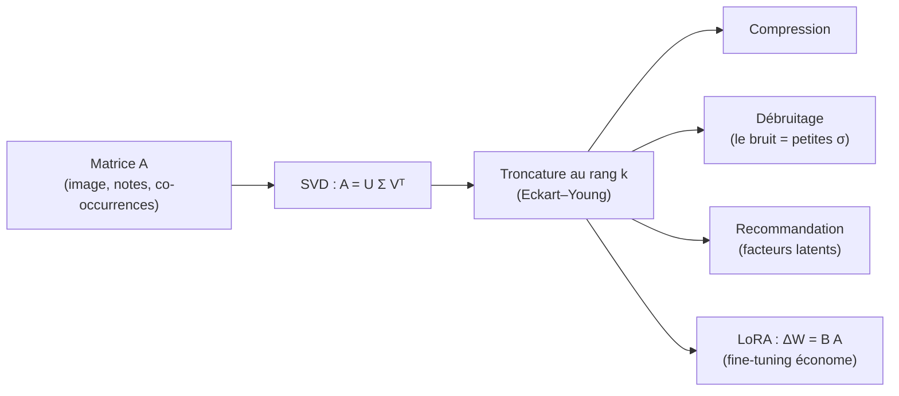
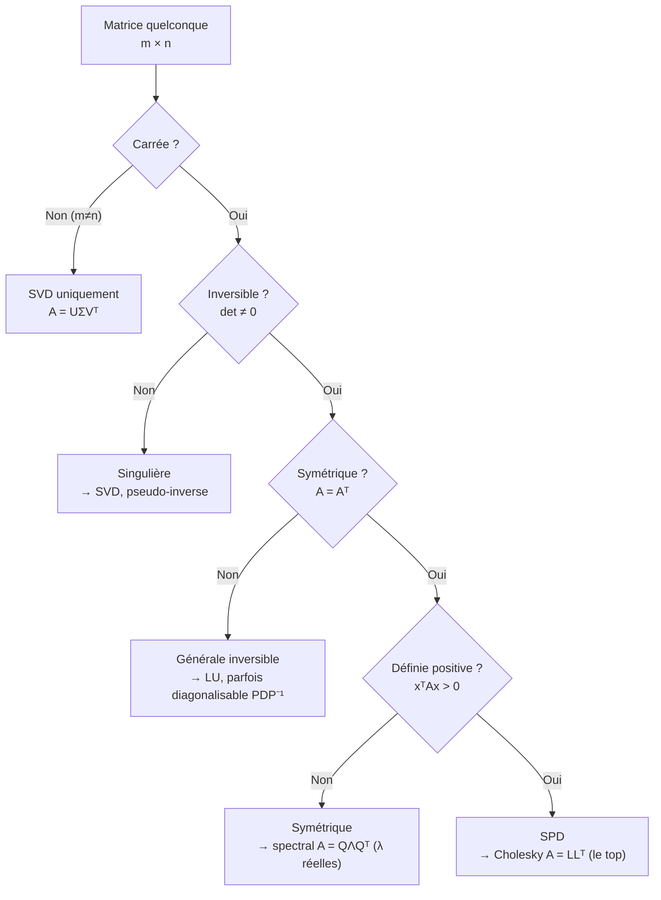
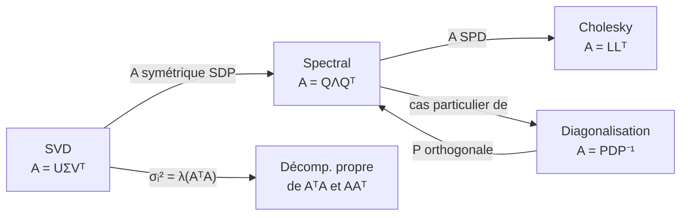

[← Sommaire](../README.md#table-des-matières)

# 4. Décompositions matricielles

### Déterminant et trace

Avant de parler de « décomposition » d'une matrice, il faut deux nombres qui résument, à eux seuls, des informations cruciales sur ce que fait une matrice. Ces deux nombres sont le **déterminant** et la **trace**. Tout le chapitre s'appuiera dessus.

#### Le déterminant : combien une matrice étire l'espace

Imaginons une matrice carrée $`A`$ de taille $`n \times n`$ comme une **machine qui transforme l'espace**. On lui donne un vecteur, elle renvoie un autre vecteur. Si on donne tout un cube unité (un petit carré en dimension 2, un cube en dimension 3), la machine le déforme : elle l'étire, l'écrase, le tourne, le retourne. Le déterminant mesure **de combien le volume de ce cube change**, et **s'il se retourne**.

> **Le symbole $`\det`$.** Ce symbole représente le **déterminant** d'une matrice. Imagine une feuille de pâte à modeler en forme de carré d'aire $`1`$. La matrice $`A`$ écrase et étire cette pâte ; $`\det(A)`$ te dit l'aire du nouveau morceau. Si $`\det(A) = 3`$, l'aire a triplé. Si $`\det(A) = 0`$, la pâte a été écrasée en un fil plat (aire nulle) : la matrice « perd » une dimension. Si $`\det(A) < 0`$, la pâte a été **retournée** comme une crêpe (l'orientation s'inverse). On le note $`\det(A)`$ ou $`|A|`$.

> **Le symbole $`|A|`$.** C'est juste une **autre écriture** de $`\det(A)`$. Attention : les barres verticales ressemblent à une valeur absolue, mais ici elles encadrent une matrice entière, pas un nombre. $`|A|`$ peut donc être négatif (contrairement à la valeur absolue d'un nombre réel).

##### Définition rigoureuse

> **Définition (déterminant).** Soit $`A = (a_{ij})_{1 \le i,j \le n}`$ une matrice carrée à coefficients dans $`\mathbb{R}`$ (ou $`\mathbb{C}`$). Le déterminant est l'unique forme $`n`$-linéaire alternée des colonnes de $`A`$ valant $`1`$ sur la matrice identité. Explicitement (formule de Leibniz) :
> ```math
> \det(A) = \sum_{\sigma \in \mathcal{S}_n} \varepsilon(\sigma) \prod_{i=1}^{n} a_{i,\sigma(i)}
> ```
> où $`\mathcal{S}_n`$ est l'ensemble des permutations de $`\{1,\dots,n\}`$ et $`\varepsilon(\sigma) \in \{-1,+1\}`$ est la signature de la permutation $`\sigma`$.

> **Le symbole $`\sum`$ (sigma majuscule).** Ce symbole représente une **somme**. C'est comme une boucle qui additionne plein de morceaux. En dessous on écrit où la boucle commence (ici $`\sigma \in \mathcal{S}_n`$ : « pour chaque permutation $`\sigma`$ »), et on additionne tout ce qui est écrit à droite. Ici, on parcourt toutes les façons de réordonner les colonnes et on additionne un produit signé pour chacune.

> **Le symbole $`\prod`$ (pi majuscule).** Ce symbole représente un **produit** : la même idée que $`\sum`$, mais on **multiplie** au lieu d'additionner. $`\prod_{i=1}^{n} a_{i,\sigma(i)}`$ veut dire « multiplie ensemble les nombres $`a_{1,\sigma(1)} \times a_{2,\sigma(2)} \times \dots \times a_{n,\sigma(n)}`$ ».

> **Le symbole $`\sigma`$ (sigma minuscule) et $`\mathcal{S}_n`$.** $`\sigma`$ est ici une **permutation** : une façon de mélanger les nombres $`1, 2, \dots, n`$, comme rebattre un jeu de cartes. $`\mathcal{S}_n`$ est le **paquet de toutes ces façons** ($`n!`$ en tout). La signature $`\varepsilon(\sigma)`$ vaut $`+1`$ si on peut revenir à l'ordre initial en un nombre **pair** d'échanges, $`-1`$ si c'est **impair**.

La formule de Leibniz est théoriquement parfaite mais inutilisable en pratique : elle contient $`n!`$ termes. Pour $`n = 20`$, cela fait plus de $`2 \times 10^{18}`$ termes. On l'utilise pour **prouver des propriétés**, jamais pour **calculer**.

##### Petites tailles : les formules à connaître

En dimension 2 :
```math
\det \begin{pmatrix} a & b \\ c & d \end{pmatrix} = ad - bc
```

En dimension 3 (règle de Sarrus) :
```math
\det \begin{pmatrix} a & b & c \\ d & e & f \\ g & h & i \end{pmatrix} = aei + bfg + cdh - ceg - bdi - afh
```

> **Exemple chiffré (2×2).** Prenons $`A = \begin{pmatrix} 2 & 1 \\ 0 & 3 \end{pmatrix}`$. Alors $`\det(A) = 2 \times 3 - 1 \times 0 = 6`$. Géométriquement : le carré unité devient un parallélogramme d'aire $`6`$. Comme $`6 > 0`$, l'orientation est préservée.

##### Calcul réel : par les facteurs triangulaires

Pour calculer un déterminant en pratique, on **triangularise** la matrice par élimination de Gauss (opérations sur les lignes), puis on multiplie les coefficients diagonaux. Chaque échange de deux lignes change le signe du déterminant, et l'ajout d'un multiple d'une ligne à une autre le laisse inchangé ; on suit donc ces opérations pour retrouver $`\det(A)`$. C'est le coût $`O(n^3)`$, pas $`O(n!)`$.

> **Propriété clé.** Le déterminant d'une matrice triangulaire (supérieure ou inférieure) est le **produit de sa diagonale** :
> ```math
> \det(T) = \prod_{i=1}^{n} t_{ii}
> ```

##### Propriétés fondamentales du déterminant

| Propriété | Énoncé | Intuition |
|---|---|---|
| Multiplicativité | $`\det(AB) = \det(A)\det(B)`$ | Étirer deux fois de suite multiplie les facteurs d'étirement |
| Transposée | $`\det(A^\top) = \det(A)`$ | Lignes et colonnes jouent un rôle symétrique |
| Inverse | $`\det(A^{-1}) = 1/\det(A)`$ | Défaire l'étirement = facteur inverse |
| Inversibilité | $`A`$ inversible $`\iff \det(A) \neq 0`$ | Volume non écrasé = on peut revenir en arrière |
| Échelle | $`\det(\lambda A) = \lambda^n \det(A)`$ | Multiplier les $`n`$ colonnes par $`\lambda`$ |
| Échange de lignes | inverse le signe | Retourner l'orientation |
| Triangulaire/diagonale | produit de la diagonale | Étirements indépendants par axe |

> **Démonstration de $`\det(AB) = \det(A)\det(B)`$ (esquisse rigoureuse).** Fixons $`B`$. L'application $`A \mapsto \det(AB)`$ est une forme $`n`$-linéaire alternée des lignes de $`A`$ (car les lignes de $`AB`$ sont des combinaisons linéaires de celles de $`B`$, et $`\det`$ est multilinéaire alternée). Or l'espace des formes $`n`$-linéaires alternées sur les lignes est de dimension $`1`$, engendré par $`\det`$. Donc $`A \mapsto \det(AB) = c \cdot \det(A)`$ pour une constante $`c`$ ne dépendant que de $`B`$. En prenant $`A = I`$, on obtient $`c = \det(B)`$. D'où le résultat. $`\quad\blacksquare`$

> **Piège fréquent.** Le déterminant **n'est pas additif** : en général $`\det(A + B) \neq \det(A) + \det(B)`$. Par exemple avec $`A = B = I_2`$ : $`\det(I_2 + I_2) = \det(2I_2) = 4 \neq \det(I_2) + \det(I_2) = 2`$.

#### La trace : la somme de la diagonale

> **Le symbole $`\mathrm{tr}`$.** Ce symbole représente la **trace** d'une matrice carrée. C'est très simple : on additionne tous les nombres posés sur la **diagonale** (du coin haut-gauche au coin bas-droit). Imagine une matrice comme un damier de nombres ; la trace, c'est la somme de la « ligne en diagonale » seulement. On note $`\mathrm{tr}(A)`$.

> **Définition (trace).** Pour $`A = (a_{ij}) \in \mathbb{R}^{n \times n}`$,
> ```math
> \mathrm{tr}(A) = \sum_{i=1}^{n} a_{ii}.
> ```

> **Exemple chiffré.** Pour $`A = \begin{pmatrix} 2 & 1 \\ 0 & 3 \end{pmatrix}`$, $`\mathrm{tr}(A) = 2 + 3 = 5`$.

##### Propriétés fondamentales de la trace

| Propriété | Énoncé |
|---|---|
| Linéarité | $`\mathrm{tr}(A + B) = \mathrm{tr}(A) + \mathrm{tr}(B)`$ et $`\mathrm{tr}(\lambda A) = \lambda \mathrm{tr}(A)`$ |
| Transposée | $`\mathrm{tr}(A^\top) = \mathrm{tr}(A)`$ |
| Invariance cyclique | $`\mathrm{tr}(AB) = \mathrm{tr}(BA)`$ |
| Similitude | $`\mathrm{tr}(P^{-1} A P) = \mathrm{tr}(A)`$ |

> **Démonstration de l'invariance cyclique $`\mathrm{tr}(AB) = \mathrm{tr}(BA)`$.** Soit $`A \in \mathbb{R}^{m\times n}`$ et $`B \in \mathbb{R}^{n\times m}`$ (de sorte que $`AB`$ et $`BA`$ sont carrées). Par définition,
> ```math
> \mathrm{tr}(AB) = \sum_{i=1}^{m} (AB)_{ii} = \sum_{i=1}^{m} \sum_{k=1}^{n} a_{ik} b_{ki} = \sum_{k=1}^{n} \sum_{i=1}^{m} b_{ki} a_{ik} = \sum_{k=1}^{n} (BA)_{kk} = \mathrm{tr}(BA).
> ```
> On a juste échangé l'ordre des deux sommes finies. $`\quad\blacksquare`$

La conséquence sur la similitude est centrale : $`\mathrm{tr}(P^{-1}AP) = \mathrm{tr}\big((P^{-1}A)P\big) = \mathrm{tr}\big(P(P^{-1}A)\big) = \mathrm{tr}(A)`$. **La trace ne dépend pas de la base** dans laquelle on regarde l'application linéaire. Idem pour le déterminant : $`\det(P^{-1}AP) = \det(P^{-1})\det(A)\det(P) = \det(A)`$. Ce sont des **invariants**.

#### Lien profond avec les valeurs propres (annonce)

Nous le démontrerons dans les sections suivantes, mais retenons dès maintenant le résultat qui irrigue tout le chapitre. Si $`\lambda_1, \dots, \lambda_n`$ sont les valeurs propres de $`A`$ (comptées avec multiplicité, dans $`\mathbb{C}`$) :

```math
\det(A) = \prod_{i=1}^{n} \lambda_i \qquad\text{et}\qquad \mathrm{tr}(A) = \sum_{i=1}^{n} \lambda_i.
```

> **Intuition.** Le déterminant est le **produit** des facteurs d'étirement propres ; la trace en est la **somme**. Si une seule valeur propre est nulle, le produit s'annule : la matrice écrase une direction, elle n'est pas inversible.

#### Application en machine learning

- **Vraisemblance gaussienne (likelihood) :** la densité d'une loi normale multivariée contient le terme $`\frac{1}{\sqrt{(2\pi)^n \det(\Sigma)}}`$. Le déterminant de la matrice de covariance $`\Sigma`$ mesure le « volume » de dispersion des données. En pratique on calcule $`\log \det(\Sigma)`$ (plus stable).
- **Entropie d'une gaussienne :** l'entropie différentielle d'une loi $`\mathcal{N}(\mu,\Sigma)`$ vaut $`\frac12 \log\big((2\pi e)^n \det(\Sigma)\big)`$, donc croît comme $`\frac12 \log\det(\Sigma)`$ — un déterminant élevé signifie une distribution très étalée, donc incertaine.
- **Régularisation et trace :** la pénalité de Ridge s'écrit $`\|w\|^2`$, et le « nombre de degrés de liberté effectifs » d'un modèle linéaire régularisé est $`\mathrm{tr}\big(X(X^\top X + \lambda I)^{-1} X^\top\big)`$.
- **Jacobien des flux normalisants (normalizing flows) :** pour transformer une densité, on a besoin de $`\log\left|\det \frac{\partial f}{\partial x}\right|`$. Toute l'ingénierie des flux modernes consiste à concevoir des transformations dont ce log-déterminant est calculable rapidement.

> **Mise à jour 2026.** Pour de très grandes matrices SPD (symétriques définies positives), on n'évalue plus $`\log\det`$ par factorisation dense $`O(n^3)`$ mais par des **estimateurs stochastiques** (Hutchinson) combinés à des approximations de Lanczos : $`\log\det(A) = \mathrm{tr}(\log A)`$, et on estime cette trace via $`\mathrm{tr}(M) \approx \frac1m \sum_{j=1}^m z_j^\top M z_j`$ avec $`z_j`$ des vecteurs aléatoires (Rademacher, donc $`\mathbb{E}[z_j z_j^\top] = I`$). Ces méthodes sont au cœur des bibliothèques de processus gaussiens à grande échelle (type GPyTorch) et exploitent l'autodifférenciation (JAX/PyTorch) pour propager les gradients à travers l'estimateur.

```python
import numpy as np

A = np.array([[2.0, 1.0],
              [0.0, 3.0]])

print("det(A) =", np.linalg.det(A))          # 6.0
print("tr(A)  =", np.trace(A))               # 5.0

# Stabilite numerique : log-determinant signe
sign, logabsdet = np.linalg.slogdet(A)
print("signe =", sign, " log|det| =", logabsdet)  # 1.0 1.7917...

# Verifions det = produit des valeurs propres, tr = somme
vals = np.linalg.eigvals(A)
print("produit lambda =", np.prod(vals).real)     # 6.0
print("somme   lambda =", np.sum(vals).real)      # 5.0

# Estimateur de Hutchinson pour tr(M) (idee 2026)
M = np.array([[4.0, 1.0], [1.0, 3.0]])
m = 100000
Z = np.random.choice([-1.0, 1.0], size=(2, m))    # vecteurs de Rademacher
est = np.mean(np.sum(Z * (M @ Z), axis=0))
print("tr(M) exact =", np.trace(M), " estime =", round(est, 3))
```

> **Piège numérique.** Ne calculez jamais $`\det(\Sigma)`$ directement pour une grande covariance : le résultat déborde (overflow) ou s'annule (underflow). Utilisez `slogdet`, qui renvoie le signe et le log de la valeur absolue séparément.

---

### Valeurs propres et vecteurs propres

Voici le cœur battant de l'algèbre linéaire appliquée. L'idée est d'une simplicité désarmante : pour comprendre une transformation compliquée, on cherche les directions qu'elle **ne fait pas tourner**.

#### L'intuition : les directions privilégiées

Une matrice fait généralement deux choses à un vecteur : elle le **tourne** et elle l'**étire**. Mais pour certaines directions très spéciales, la matrice **ne tourne pas du tout** : elle se contente d'allonger ou de raccourcir le vecteur le long de sa propre ligne. Ces directions sont les **vecteurs propres** (eigenvectors), et le facteur d'étirement associé est la **valeur propre** (eigenvalue).

> **Image.** Pose une feuille sur une table et étire-la horizontalement (×2) et verticalement (÷2). Une flèche dessinée horizontalement reste horizontale (juste deux fois plus longue) : c'est un vecteur propre, de valeur propre $`2`$. Une flèche verticale reste verticale (deux fois plus courte) : vecteur propre de valeur propre $`1/2`$. Une flèche en diagonale, elle, change de direction : ce n'est pas un vecteur propre.

> **Le symbole $`\lambda`$ (lambda).** Ce symbole représente une **valeur propre** : le facteur par lequel un vecteur propre est étiré. Si $`\lambda = 2`$, le vecteur double de longueur sans tourner. Si $`\lambda = -1`$, il garde sa longueur mais pointe dans le sens opposé. Si $`\lambda = 0`$, il est écrasé sur le point zéro. C'est juste un nombre, mais un nombre qui raconte le comportement de la matrice dans une direction.

#### Définition rigoureuse

> **Définition (valeur propre, vecteur propre).** Soit $`A \in \mathbb{C}^{n \times n}`$. Un scalaire $`\lambda \in \mathbb{C}`$ est une **valeur propre** de $`A`$ s'il existe un vecteur **non nul** $`v \in \mathbb{C}^n`$ tel que
> ```math
> A v = \lambda v.
> ```
> Le vecteur $`v`$ est alors un **vecteur propre** associé à $`\lambda`$. L'ensemble $`E_\lambda = \ker(A - \lambda I) = \{ v \in \mathbb{C}^n : Av = \lambda v \}`$ est le **sous-espace propre** associé à $`\lambda`$ ; sa dimension est la **multiplicité géométrique** de $`\lambda`$.

> **Le symbole $`v`$.** $`v`$ représente le **vecteur propre** : la flèche-direction qui ne tourne pas. On exige $`v \neq 0`$ car le vecteur nul vérifierait l'équation pour n'importe quel $`\lambda`$ (ce serait tricher et n'apprendrait rien). Noter que $`E_\lambda`$, lui, contient bien le vecteur nul : c'est un sous-espace vectoriel, mais seuls ses éléments non nuls sont des vecteurs propres.

> **Le symbole $`\ker`$ (noyau, kernel).** $`\ker(M)`$ représente le **noyau** de la matrice $`M`$ : l'ensemble de tous les vecteurs que $`M`$ envoie sur zéro. Imagine une machine qui « avale » certains vecteurs et les réduit à néant : le noyau est l'ensemble de ces vecteurs avalés.

> **Le symbole $`I`$ (matrice identité).** $`I`$ (parfois noté $`I_n`$) est la matrice carrée avec des $`1`$ sur la diagonale et des $`0`$ ailleurs. C'est l'élément neutre du produit : $`AI = IA = A`$. Géométriquement, elle ne fait rien (aucun étirement, aucune rotation).

#### L'équation caractéristique

Comment trouver les $`\lambda`$ ? On réécrit $`Av = \lambda v`$ comme $`(A - \lambda I)v = 0`$. Pour qu'il existe un $`v \neq 0`$ solution, la matrice $`A - \lambda I`$ doit **écraser une direction**, donc être **non inversible**, donc avoir un déterminant nul.

> **Théorème (polynôme caractéristique).** $`\lambda`$ est valeur propre de $`A`$ si et seulement si
> ```math
> \chi_A(\lambda) := \det(A - \lambda I) = 0.
> ```
> $`\chi_A`$ est un polynôme de degré $`n`$ en $`\lambda`$, le **polynôme caractéristique** (characteristic polynomial). Ses racines (dans $`\mathbb{C}`$) sont exactement les valeurs propres ; l'ordre de multiplicité d'une racine est la **multiplicité algébrique**.

> **Le symbole $`\chi`$ (chi).** $`\chi_A`$ est juste le **nom** qu'on donne au polynôme caractéristique de $`A`$. Comme on nomme une fonction $`f`$, ici on la nomme $`\chi`$ (lettre grecque pour « caractéristique »). On lui donne un nombre $`\lambda`$, il renvoie $`\det(A - \lambda I)`$.

> **Le symbole $`:=`$.** Ce symbole signifie « **est défini comme** ». La barre des deux-points indique qu'on **pose une définition** (on baptise le membre de gauche par le membre de droite), pas qu'on constate une égalité déjà connue.

##### Deux multiplicités à ne pas confondre

> **Piège central.** Pour chaque valeur propre :
> - **multiplicité algébrique** $`m_a(\lambda)`$ = nombre de fois où $`\lambda`$ est racine de $`\chi_A`$ ;
> - **multiplicité géométrique** $`m_g(\lambda)`$ = dimension de $`E_\lambda`$ = nombre de vecteurs propres indépendants.
>
> On a toujours $`1 \le m_g(\lambda) \le m_a(\lambda)`$. Quand $`m_g < m_a`$ pour au moins une valeur propre, la matrice est **défective** (non diagonalisable).

> **Exemple de matrice défective.** $`A = \begin{pmatrix} 2 & 1 \\ 0 & 2 \end{pmatrix}`$ a $`\chi_A(\lambda) = (2-\lambda)^2`$, donc $`\lambda = 2`$ de multiplicité algébrique $`2`$. Mais $`\ker(A - 2I) = \ker\begin{pmatrix} 0 & 1 \\ 0 & 0 \end{pmatrix}`$ est de dimension $`1`$ seulement. Multiplicité géométrique $`1 < 2`$ : défective.

#### Exemple chiffré déroulé pas à pas

Prenons $`A = \begin{pmatrix} 4 & 1 \\ 2 & 3 \end{pmatrix}`$.

**Étape 1 — polynôme caractéristique :**
```math
\chi_A(\lambda) = \det\begin{pmatrix} 4-\lambda & 1 \\ 2 & 3-\lambda \end{pmatrix} = (4-\lambda)(3-\lambda) - 2 = \lambda^2 - 7\lambda + 10.
```

**Étape 2 — racines :** $`\lambda^2 - 7\lambda + 10 = (\lambda - 5)(\lambda - 2)`$, donc $`\lambda_1 = 5`$ et $`\lambda_2 = 2`$.

> **Vérification immédiate.** Somme des valeurs propres $`5 + 2 = 7 = \mathrm{tr}(A)`$. Produit $`5 \times 2 = 10 = \det(A) = 4\cdot3 - 1\cdot2`$. Cohérent.

**Étape 3 — vecteur propre pour $`\lambda_1 = 5`$ :** on résout $`(A - 5I)v = 0`$ :
```math
\begin{pmatrix} -1 & 1 \\ 2 & -2 \end{pmatrix} v = 0 \;\Rightarrow\; -v_1 + v_2 = 0 \;\Rightarrow\; v_1 = v_2.
```
Donc $`v^{(1)} = \begin{pmatrix} 1 \\ 1 \end{pmatrix}`$ (à un facteur près).

**Étape 4 — vecteur propre pour $`\lambda_2 = 2`$ :** on résout $`(A - 2I)v = 0`$ :
```math
\begin{pmatrix} 2 & 1 \\ 2 & 1 \end{pmatrix} v = 0 \;\Rightarrow\; 2v_1 + v_2 = 0 \;\Rightarrow\; v_2 = -2 v_1.
```
Donc $`v^{(2)} = \begin{pmatrix} 1 \\ -2 \end{pmatrix}`$.

**Vérification :** $`A v^{(1)} = \begin{pmatrix} 4+1 \\ 2+3 \end{pmatrix} = \begin{pmatrix} 5 \\ 5 \end{pmatrix} = 5 v^{(1)}`$. 

#### Propriétés essentielles

> **Théorème (relations trace–déterminant–coefficients).** Pour $`A \in \mathbb{C}^{n\times n}`$ de valeurs propres $`\lambda_1,\dots,\lambda_n`$ (avec multiplicité) :
> ```math
> \mathrm{tr}(A) = \sum_i \lambda_i, \qquad \det(A) = \prod_i \lambda_i.
> ```
> **Démonstration.** Le polynôme caractéristique factorisé vaut $`\chi_A(\lambda) = \prod_i(\lambda_i - \lambda)`$. Le coefficient de $`\lambda^{n-1}`$ y est $`(-1)^{n-1}\sum_i \lambda_i`$ et le terme constant $`\chi_A(0) = \prod_i \lambda_i`$. En développant directement $`\det(A-\lambda I)`$, le terme constant est $`\det(A)`$ et le coefficient de $`\lambda^{n-1}`$ est $`(-1)^{n-1}\mathrm{tr}(A)`$. L'identification donne les deux relations (formules de Viète appliquées à $`\chi_A`$). $`\quad\blacksquare`$

> **Théorème de Cayley–Hamilton.** Toute matrice annule son propre polynôme caractéristique : $`\chi_A(A) = 0`$. Autrement dit, en remplaçant $`\lambda`$ par $`A`$ (et le terme constant $`c`$ par $`cI`$), on obtient la matrice nulle.

> **Spectre et matrices particulières.**
> - Valeurs propres d'une matrice **triangulaire** = ses coefficients diagonaux.
> - Une matrice **symétrique réelle** a toutes ses valeurs propres **réelles** (démontré à la section diagonalisation).
> - Valeurs propres de $`A^k`$ : ce sont les $`\lambda_i^k`$ (mêmes vecteurs propres).
> - $`A`$ inversible $`\iff`$ $`0`$ n'est pas valeur propre.

#### Comment on calcule réellement les valeurs propres

> **Mise à jour 2026.** On ne calcule **jamais** les valeurs propres en cherchant les racines de $`\chi_A`$ : c'est numériquement catastrophique (le passage par les coefficients du polynôme est mal conditionné). L'algorithme de référence reste l'**algorithme QR** (avec décalages de Francis), $`O(n^3)`$, implémenté dans LAPACK et appelé par `numpy.linalg.eig`. Pour quelques valeurs propres extrêmes de grandes matrices creuses, on utilise les méthodes de **Krylov** (Lanczos pour le symétrique, Arnoldi pour le général), exposées via `scipy.sparse.linalg.eigsh/eigs`. Les méthodes randomisées (esquisse aléatoire, sketching) dominent désormais l'estimation du spectre de très grandes matrices.

#### Application en machine learning

- **PageRank :** le score d'importance des pages web est le **vecteur propre dominant** (associé à $`\lambda = 1`$) d'une matrice stochastique de transition. On le calcule par la **méthode de la puissance** (power iteration).
- **Stabilité de l'entraînement :** la plus grande valeur propre de la matrice hessienne contrôle le pas maximal admissible d'une descente de gradient. La courbure (les $`\lambda`$ du hessien) gouverne la vitesse de convergence.
- **Convolutions et théorie spectrale des graphes :** les réseaux de neurones sur graphes (GNN) reposent sur les valeurs/vecteurs propres du **laplacien** du graphe.

> **La méthode de la puissance (power iteration).** Pour trouver le vecteur propre dominant, on multiplie un vecteur aléatoire par $`A`$ encore et encore, en normalisant. Les composantes selon les autres directions s'amenuisent ; il ne reste que la direction dominante. Elle converge lorsqu'il existe une unique valeur propre de module maximal, à la vitesse gouvernée par le rapport $`|\lambda_2|/|\lambda_1|`$.

```python
import numpy as np

A = np.array([[4.0, 1.0],
              [2.0, 3.0]])

vals, vecs = np.linalg.eig(A)
print("valeurs propres :", np.sort(vals.real))     # [2. 5.]
print("vecteurs propres (colonnes) :\n", vecs)

# Methode de la puissance : valeur propre dominante
def power_iteration(M, iters=1000):
    v = np.random.randn(M.shape[0])
    v /= np.linalg.norm(v)
    for _ in range(iters):
        w = M @ v
        v = w / np.linalg.norm(w)
    lam = v @ (M @ v)          # quotient de Rayleigh
    return lam, v

lam, v = power_iteration(A)
print("lambda dominant ~", round(lam, 4))           # ~5.0
```

> **Le quotient de Rayleigh.** L'expression $`\dfrac{v^\top A v}{v^\top v}`$ donne, pour un vecteur $`v`$, la « valeur propre apparente » dans cette direction. Quand $`v`$ est exactement un vecteur propre, elle vaut exactement $`\lambda`$. C'est l'outil de base pour estimer une valeur propre à partir d'un vecteur approché.

---

### Décomposition de Cholesky

Nous abordons la première vraie **factorisation** : écrire une matrice comme produit de matrices plus simples. Cholesky est la plus économique et la plus utilisée pour une classe précise de matrices : les **symétriques définies positives**.

#### Quand peut-on l'utiliser ? Les matrices SPD

> **Définition (symétrique définie positive, SPD).** Une matrice réelle $`A \in \mathbb{R}^{n\times n}`$ est **symétrique définie positive** si :
> 1. $`A = A^\top`$ (symétrique) ;
> 2. $`x^\top A x > 0`$ pour tout vecteur $`x \neq 0`$.

> **Le symbole $`x^\top A x`$ (forme quadratique).** Cette expression représente un **nombre** obtenu en « sandwichant » la matrice entre un vecteur ligne $`x^\top`$ (à gauche) et le même vecteur colonne $`x`$ (à droite). Imagine que tu mesures une « énergie » associée à la direction $`x`$. Si cette énergie est toujours strictement positive (sauf en zéro), la matrice est définie positive : c'est une cuvette (bol) parfaitement convexe, qui a un unique point le plus bas.

> **Caractérisation spectrale.** $`A`$ symétrique est définie positive $`\iff`$ **toutes ses valeurs propres sont strictement positives**. (Définie positive $`\Rightarrow \lambda_i > 0`$ ; semi-définie positive, c'est-à-dire $`x^\top A x \ge 0`$ pour tout $`x`$, $`\iff \lambda_i \ge 0`$.)

Les matrices SPD sont omniprésentes : matrices de covariance, matrices de Gram $`X^\top X`$, hessiennes de fonctions convexes, matrices de noyau (kernels) en SVM et processus gaussiens.

#### Le théorème

> **Théorème (décomposition de Cholesky).** Si $`A`$ est symétrique définie positive, il existe une **unique** matrice triangulaire inférieure $`L`$ à coefficients diagonaux strictement positifs telle que
> ```math
> A = L L^\top.
> ```
> $`L`$ est la « racine carrée triangulaire » de $`A`$.

> **Le symbole $`L`$ (triangulaire inférieure).** $`L`$ (pour *lower*) est une matrice dont tous les coefficients **au-dessus** de la diagonale sont nuls : $`\ell_{ij} = 0`$ dès que $`i < j`$. Sa transposée $`L^\top`$ est alors triangulaire **supérieure**. Résoudre un système avec une telle matrice est immédiat (de proche en proche).

> **Intuition.** Si un nombre positif $`a`$ s'écrit $`a = \ell \cdot \ell`$ (racine carrée), alors une matrice SPD $`A`$ s'écrit $`A = L L^\top`$. $`L`$ joue le rôle de $`\sqrt{A}`$, mais sous forme triangulaire (donc facile à inverser et à résoudre).

#### Les formules de calcul (algorithme)

On identifie les coefficients de $`A = LL^\top`$ colonne par colonne. Pour $`j`$ de $`1`$ à $`n`$ :
```math
\ell_{jj} = \sqrt{a_{jj} - \sum_{k=1}^{j-1} \ell_{jk}^2}, \qquad
\ell_{ij} = \frac{1}{\ell_{jj}}\left(a_{ij} - \sum_{k=1}^{j-1} \ell_{ik}\ell_{jk}\right) \;\text{ pour } i > j.
```

> **Détection de non-positivité.** Si, en cours de route, l'argument d'une racine carrée devient $`\le 0`$, c'est que $`A`$ n'est **pas** définie positive. Cholesky est ainsi le **test pratique le plus rapide** de positivité d'une matrice (plus rapide que calculer les valeurs propres).

#### Exemple chiffré déroulé pas à pas

Soit $`A = \begin{pmatrix} 4 & 2 \\ 2 & 5 \end{pmatrix}`$ (symétrique ; on va voir qu'elle est SPD).

- $`\ell_{11} = \sqrt{a_{11}} = \sqrt 4 = 2`$.
- $`\ell_{21} = a_{21}/\ell_{11} = 2/2 = 1`$.
- $`\ell_{22} = \sqrt{a_{22} - \ell_{21}^2} = \sqrt{5 - 1} = 2`$.

Donc
```math
L = \begin{pmatrix} 2 & 0 \\ 1 & 2 \end{pmatrix}, \qquad
L L^\top = \begin{pmatrix} 2 & 0 \\ 1 & 2 \end{pmatrix}\begin{pmatrix} 2 & 1 \\ 0 & 2 \end{pmatrix} = \begin{pmatrix} 4 & 2 \\ 2 & 5 \end{pmatrix} = A. \checkmark
```

#### Coût et comparaison

| Factorisation | Coût (flops) | Matrices visées |
|---|---|---|
| Cholesky | $`\sim n^3/3`$ | SPD |
| LU | $`\sim 2n^3/3`$ | carrées générales |
| QR | $`\sim 2n^3`$ (Householder, $`n\times n`$) | rectangulaires, moindres carrés |

Cholesky coûte **deux fois moins** que LU : c'est la méthode de choix dès que la matrice est SPD.

#### Démonstration de l'existence et de l'unicité

> **Démonstration (existence et unicité).** *Existence* par récurrence sur $`n`$. Pour $`n=1`$, $`A = (a_{11})`$ avec $`a_{11} > 0`$, on pose $`\ell_{11} = \sqrt{a_{11}}`$. Supposons le résultat pour $`n-1`$ et écrivons par blocs
> ```math
> A = \begin{pmatrix} a_{11} & b^\top \\ b & C \end{pmatrix}, \quad a_{11} > 0,
> ```
> où $`b \in \mathbb{R}^{n-1}`$ et $`C \in \mathbb{R}^{(n-1)\times(n-1)}`$. Posons $`\ell_{11} = \sqrt{a_{11}}`$ et $`\ell = b/\ell_{11}`$. Le **complément de Schur** $`S = C - \ell\,\ell^\top = C - bb^\top/a_{11}`$ est symétrique défini positif de taille $`n-1`$ (car $`A`$ l'est), donc par hypothèse de récurrence $`S = L_1 L_1^\top`$. Alors
> ```math
> L = \begin{pmatrix} \ell_{11} & 0 \\ \ell & L_1 \end{pmatrix} \quad\text{vérifie}\quad LL^\top = A.
> ```
> *Unicité* : les formules ci-dessus déterminent chaque $`\ell_{ij}`$ de manière unique sous la contrainte $`\ell_{jj} > 0`$. $`\quad\blacksquare`$

#### Applications phares en machine learning

1. **Résolution de systèmes SPD.** Pour résoudre $`Ax = b`$ avec $`A`$ SPD, on factorise $`A = LL^\top`$ puis on résout deux systèmes triangulaires (descente $`Ly = b`$ puis remontée $`L^\top x = y`$). C'est le cœur des **moindres carrés** via les équations normales $`X^\top X\, w = X^\top y`$.

2. **Échantillonnage gaussien.** Pour tirer $`x \sim \mathcal{N}(\mu, \Sigma)`$, on calcule $`\Sigma = LL^\top`$, on tire $`z \sim \mathcal{N}(0, I)`$ (gaussiennes standard indépendantes), et $`x = \mu + Lz`$ a exactement la covariance voulue. En effet, $`\mathrm{Cov}(Lz) = L\,\mathrm{Cov}(z)\,L^\top = L I L^\top = \Sigma`$. C'est **la** méthode de simulation gaussienne.

3. **Processus gaussiens (GP).** Toute l'inférence (prédiction, log-vraisemblance) passe par la factorisation de Cholesky de la matrice de noyau $`K + \sigma^2 I`$. Le terme $`\log\det(K+\sigma^2 I) = 2\sum_i \log \ell_{ii}`$ se lit gratuitement sur la diagonale de $`L`$.

> **Mise à jour 2026.** Pour des matrices de noyau gigantesques (GP à $`n > 10^5`$), on remplace la factorisation exacte par des **approximations creuses** (points inducteurs) ou par le **gradient conjugué préconditionné** sans jamais former $`L`$ explicitement, avec préconditionnement par Cholesky pivoté partiel. Côté deep learning, des couches imposant la structure $`LL^\top`$ (paramétrisation de Cholesky) garantissent qu'une matrice apprise reste SPD pendant tout l'entraînement par descente de gradient — technique standard pour apprendre des covariances ou des métriques.

```python
import numpy as np

A = np.array([[4.0, 2.0],
              [2.0, 5.0]])

L = np.linalg.cholesky(A)          # triangulaire inferieure
print("L =\n", L)                  # [[2,0],[1,2]]
print("LL^T == A ?", np.allclose(L @ L.T, A))

# Echantillonnage gaussien N(mu, Sigma) via Cholesky
mu = np.array([1.0, -1.0])
Sigma = np.array([[2.0, 0.5], [0.5, 1.0]])
Lc = np.linalg.cholesky(Sigma)
z = np.random.randn(2, 5000)
samples = mu[:, None] + Lc @ z
print("covariance empirique ~\n", np.cov(samples).round(2))

# log-det gratuit
logdet = 2.0 * np.sum(np.log(np.diag(Lc)))
print("logdet(Sigma) =", round(logdet, 4),
      " (verif)", round(np.linalg.slogdet(Sigma)[1], 4))
```

---

### Décomposition propre et diagonalisation

Nous savons trouver valeurs et vecteurs propres ; assemblons-les. **Diagonaliser**, c'est réécrire une matrice dans la base de ses vecteurs propres, où elle devient d'une simplicité absolue : une simple liste d'étirements.

#### L'idée : changer de lunettes

Dans la base standard, une matrice mélange tout. Mais si on regarde le monde **à travers les vecteurs propres** (on change de base), la transformation se réduit à : « étire l'axe 1 par $`\lambda_1`$, l'axe 2 par $`\lambda_2`$, etc. ». Plus aucune rotation, plus aucun mélange : juste des étirements indépendants. C'est exactement ce que fait une matrice **diagonale**.

#### Le théorème de diagonalisation

> **Théorème.** $`A \in \mathbb{C}^{n\times n}`$ est **diagonalisable** si et seulement si elle possède $`n`$ vecteurs propres linéairement indépendants. Dans ce cas,
> ```math
> A = P D P^{-1},
> ```
> où $`P`$ a pour colonnes les vecteurs propres et $`D = \mathrm{diag}(\lambda_1, \dots, \lambda_n)`$ est la matrice diagonale des valeurs propres correspondantes.

> **Le symbole $`P`$ (matrice de passage).** $`P`$ est la matrice dont les **colonnes** sont les $`n`$ vecteurs propres choisis. Comme ils sont linéairement indépendants, $`P`$ est inversible. Elle traduit les coordonnées de la base des vecteurs propres vers la base de départ ; $`P^{-1}`$ fait la traduction inverse.

> **Le symbole $`D = \mathrm{diag}(\lambda_1,\dots,\lambda_n)`$.** $`\mathrm{diag}(\cdots)`$ représente une matrice **diagonale** : des nombres sur la diagonale, des zéros partout ailleurs. C'est la forme la plus simple de matrice, celle qui étire chaque axe indépendamment sans rien mélanger.

> **Lecture de $`A = PDP^{-1}`$ comme un sandwich.** Lis de droite à gauche : $`P^{-1}`$ **traduit** un vecteur dans le langage des vecteurs propres ; $`D`$ **étire** chaque coordonnée par sa valeur propre ; $`P`$ **retraduit** dans le langage d'origine. Trois étapes : traduire, étirer, retraduire.

> **Condition pratique.** $`A`$ est diagonalisable $`\iff`$ pour **chaque** valeur propre, multiplicité géométrique = multiplicité algébrique. Cas suffisant commode : si $`A`$ a $`n`$ valeurs propres **distinctes**, elle est automatiquement diagonalisable.

#### Pourquoi c'est si utile : les puissances

> **Calcul de puissances.** Si $`A = PDP^{-1}`$, alors
> ```math
> A^k = P D^k P^{-1}, \qquad D^k = \mathrm{diag}(\lambda_1^k, \dots, \lambda_n^k).
> ```
> **Démonstration.** $`A^2 = (PDP^{-1})(PDP^{-1}) = PD(P^{-1}P)DP^{-1} = PD^2P^{-1}`$, et par récurrence $`A^k = PD^kP^{-1}`$. Élever une matrice diagonale à la puissance $`k`$ revient à élever chaque coefficient diagonal à la puissance $`k`$ — immédiat. $`\quad\blacksquare`$

C'est spectaculaire : calculer $`A^{1000}`$ directement coûterait $`999`$ produits matriciels ; via la diagonalisation, c'est **une** diagonalisation puis $`n`$ exponentiations scalaires. Cela permet aussi de définir des **fonctions de matrices** : $`\exp(A) = P \exp(D) P^{-1}`$ où $`\exp(D) = \mathrm{diag}(e^{\lambda_i})`$.

#### Exemple chiffré déroulé pas à pas

Reprenons $`A = \begin{pmatrix} 4 & 1 \\ 2 & 3 \end{pmatrix}`$, dont on a trouvé $`\lambda_1 = 5, v^{(1)} = \binom{1}{1}`$ et $`\lambda_2 = 2, v^{(2)} = \binom{1}{-2}`$.

```math
P = \begin{pmatrix} 1 & 1 \\ 1 & -2 \end{pmatrix}, \quad D = \begin{pmatrix} 5 & 0 \\ 0 & 2 \end{pmatrix}, \quad P^{-1} = \frac{1}{-3}\begin{pmatrix} -2 & -1 \\ -1 & 1 \end{pmatrix} = \frac{1}{3}\begin{pmatrix} 2 & 1 \\ 1 & -1 \end{pmatrix}.
```

> **Calcul de $`P^{-1}`$.** Pour $`P = \begin{pmatrix} a & b \\ c & d\end{pmatrix}`$, on a $`P^{-1} = \frac{1}{ad-bc}\begin{pmatrix} d & -b \\ -c & a\end{pmatrix}`$. Ici $`ad-bc = (1)(-2) - (1)(1) = -3`$, d'où le facteur $`\tfrac{1}{-3}`$.

**Vérification :**
```math
PDP^{-1} = \begin{pmatrix} 1 & 1 \\ 1 & -2 \end{pmatrix}\begin{pmatrix} 5 & 0 \\ 0 & 2 \end{pmatrix}\frac13\begin{pmatrix} 2 & 1 \\ 1 & -1 \end{pmatrix} = \frac13\begin{pmatrix} 5 & 2 \\ 5 & -4 \end{pmatrix}\begin{pmatrix} 2 & 1 \\ 1 & -1 \end{pmatrix} = \frac13\begin{pmatrix} 12 & 3 \\ 6 & 9 \end{pmatrix} = \begin{pmatrix} 4 & 1 \\ 2 & 3 \end{pmatrix}.\checkmark
```

#### Le cas roi : le théorème spectral (matrices symétriques)

Pour les matrices symétriques réelles, la diagonalisation est encore plus belle : la base de vecteurs propres peut être choisie **orthonormée**.

> **Théorème spectral (réel).** Si $`A \in \mathbb{R}^{n\times n}`$ est symétrique ($`A = A^\top`$), alors :
> 1. toutes ses valeurs propres sont **réelles** ;
> 2. il existe une base **orthonormée** de vecteurs propres ;
> 3. $`A`$ se diagonalise par une matrice **orthogonale** $`Q`$ (vérifiant $`Q^\top Q = I`$, donc $`Q^{-1} = Q^\top`$) :
> ```math
> A = Q \Lambda Q^\top, \qquad \Lambda = \mathrm{diag}(\lambda_1,\dots,\lambda_n).
> ```

> **Le symbole $`Q^\top Q = I`$ (matrice orthogonale).** Une matrice **orthogonale** $`Q`$ a des colonnes qui sont des vecteurs unitaires deux à deux perpendiculaires. Sa magie : elle **préserve les longueurs et les angles** (c'est une rotation, éventuellement composée d'une réflexion), et son inverse est simplement sa transposée. Pas de calcul d'inverse coûteux : $`Q^{-1} = Q^\top`$.

> **Le symbole $`\Lambda`$ (lambda majuscule).** $`\Lambda`$ est la matrice **diagonale** des valeurs propres $`\lambda_1,\dots,\lambda_n`$. On la note avec un lambda majuscule, par cohérence avec le $`\lambda`$ minuscule d'une valeur propre individuelle ; c'est le même objet que $`D`$, réservé par tradition au cas symétrique.

> **Le symbole $`\bar v`$ et $`v^*`$ (conjugué, transconjugué).** Pour un vecteur complexe $`v`$, $`\bar v`$ remplace chaque coordonnée par son nombre complexe conjugué, et $`v^* = \bar v^\top`$ est le vecteur ligne conjugué. La quantité $`v^* v = \sum_i |v_i|^2 = \|v\|^2`$ est réelle $`\ge 0`$.

> **Démonstration de (1), valeurs propres réelles.** Soit $`Av = \lambda v`$ avec $`v \neq 0`$, éventuellement complexe. Alors $`v^* A v = \lambda\, v^* v = \lambda \|v\|^2`$. Prenons le conjugué (transconjugué) du scalaire $`v^* A v`$ : $`(v^* A v)^* = v^* A^* v = v^* A v`$ car $`A^* = A^\top = A`$ ($`A`$ réelle symétrique). Un scalaire égal à son conjugué est réel, donc $`v^* A v \in \mathbb{R}`$. Comme $`\|v\|^2 > 0`$, $`\lambda`$ est réel. $`\quad\blacksquare`$

> **Démonstration de (2), orthogonalité des espaces propres.** Soient $`Av = \lambda v`$, $`Aw = \mu w`$ avec $`\lambda \neq \mu`$ (valeurs propres réelles, vecteurs réels). Alors $`\lambda\, w^\top v = w^\top A v = (A^\top w)^\top v = (A w)^\top v = \mu\, w^\top v`$, d'où $`(\lambda - \mu) w^\top v = 0`$, donc $`w^\top v = 0`$ : les vecteurs propres associés à des valeurs propres distinctes sont **orthogonaux**. À l'intérieur d'un même espace propre, on orthonormalise par Gram–Schmidt. $`\quad\blacksquare`$

> **Intuition du théorème spectral.** Toute transformation symétrique est, dans les bonnes lunettes orthonormées, une simple combinaison d'étirements le long d'axes perpendiculaires. Une matrice de covariance, par exemple, décrit toujours un ellipsoïde dont les axes principaux sont orthogonaux : ce sont ses vecteurs propres.

#### Application reine en machine learning : l'ACP

> **Analyse en composantes principales (Principal Component Analysis, PCA).** On centre les données, on forme la matrice de covariance $`C = \frac1n X^\top X`$ (symétrique, semi-définie positive), on la diagonalise $`C = Q\Lambda Q^\top`$. Les vecteurs propres (colonnes de $`Q`$) sont les **axes principaux** ; les valeurs propres $`\lambda_i`$ sont les **variances** le long de ces axes. Projeter sur les $`k`$ plus grandes valeurs propres = compresser en gardant le maximum de variance.

```python
import numpy as np

# ACP par decomposition propre de la covariance
np.random.seed(0)
X = np.random.randn(500, 2) @ np.array([[3.0, 1.0], [0.0, 0.5]])
X = X - X.mean(axis=0)

C = (X.T @ X) / X.shape[0]
lam, Q = np.linalg.eigh(C)              # eigh : matrices symetriques
order = np.argsort(lam)[::-1]
lam, Q = lam[order], Q[:, order]

print("variances (valeurs propres) :", lam.round(3))
print("axes principaux (colonnes) :\n", Q.round(3))

# Reconstruction de C via C = Q Lambda Q^T
C_rec = Q @ np.diag(lam) @ Q.T
print("Q Lambda Q^T == C ?", np.allclose(C_rec, C))
```

> **Mise à jour 2026.** Pour l'ACP en grande dimension on n'effectue plus la décomposition propre de la covariance (qui est $`d\times d`$ et coûteuse, voire instable) : on passe par la **SVD** de la matrice de données directement (voir section suivante), et pour les très gros volumes par l'**ACP randomisée** (`sklearn.decomposition.PCA(svd_solver="randomized")`), qui obtient les premiers axes en projetant sur un sous-espace aléatoire. Lien deep learning : les méthodes de « whitening » spectral et les analyses de la dynamique d'entraînement (densité spectrale du hessien) reposent directement sur cette décomposition.

> **Piège.** $`A = PDP^{-1}`$ existe seulement si $`A`$ est diagonalisable. Pour une matrice quelconque (non diagonalisable, voire non carrée), il faut un outil plus général : la SVD, qui marche **toujours**.

---

### Décomposition en valeurs singulières (SVD)

Voici la décomposition la plus puissante et la plus universelle de toute l'algèbre linéaire. Là où la diagonalisation échoue (matrices non carrées, non diagonalisables), la **SVD** réussit **toujours**. C'est le couteau suisse du machine learning.

#### L'intuition : toute matrice est rotation–étirement–rotation

Une affirmation extraordinaire et pourtant exacte : **n'importe quelle** matrice, même rectangulaire, agit géométriquement comme la succession de trois opérations simples :
1. une **rotation** (ou réflexion) dans l'espace de départ ;
2. un **étirement** le long des axes (les valeurs singulières), avec éventuel changement de dimension ;
3. une **rotation** (ou réflexion) dans l'espace d'arrivée.

> **Image.** Prends la sphère unité (le cercle unité en dimension 2). Applique n'importe quelle matrice : tu obtiens toujours une **ellipse** (un ellipsoïde en dimension supérieure), éventuellement aplati. La SVD identifie les axes de cette ellipse (leurs directions = vecteurs singuliers à gauche, leurs demi-longueurs = valeurs singulières) et les rotations qui amènent de la sphère à l'ellipse.

#### Le théorème

> **Théorème (SVD).** Toute matrice $`A \in \mathbb{R}^{m\times n}`$ admet une décomposition
> ```math
> A = U \Sigma V^\top,
> ```
> où :
> - $`U \in \mathbb{R}^{m\times m}`$ est **orthogonale** ($`U^\top U = I_m`$) ; ses colonnes sont les **vecteurs singuliers à gauche** ;
> - $`V \in \mathbb{R}^{n\times n}`$ est **orthogonale** ($`V^\top V = I_n`$) ; ses colonnes sont les **vecteurs singuliers à droite** ;
> - $`\Sigma \in \mathbb{R}^{m\times n}`$ est « diagonale » (coefficients $`\Sigma_{ii} = \sigma_i`$, nuls hors diagonale) avec $`\sigma_1 \ge \sigma_2 \ge \dots \ge \sigma_r > 0`$ et $`\sigma_{r+1} = \dots = 0`$, les **valeurs singulières**, où $`r = \mathrm{rang}(A)`$.

> **Le symbole $`\Sigma`$ (sigma majuscule, ici une matrice).** Attention : ce $`\Sigma`$ n'est **pas** une somme ! Ici c'est le **nom d'une matrice** quasi-diagonale qui contient les valeurs singulières $`\sigma_i`$ (sigma minuscule) sur sa diagonale. Chaque $`\sigma_i`$ est un **facteur d'étirement**, et il est toujours $`\ge 0`$ (contrairement aux valeurs propres qui peuvent être négatives ou complexes).

> **Le symbole $`\sigma_i`$ (sigma minuscule, valeur singulière).** $`\sigma_i`$ représente la **demi-longueur du $`i`$-ème axe de l'ellipse** image de la sphère unité. C'est de combien la matrice étire dans la $`i`$-ème direction privilégiée. On les range toujours du plus grand au plus petit.

> **Le symbole $`\mathrm{rang}(A)`$ (rang, rank).** Le rang représente le **nombre de dimensions réellement utilisées** par la matrice en sortie : le nombre de directions non écrasées. C'est aussi le nombre de valeurs singulières strictement positives.

> **Lecture de $`A = U\Sigma V^\top`$.** De droite à gauche : $`V^\top`$ tourne l'espace de départ pour aligner les axes privilégiés ; $`\Sigma`$ étire chaque axe par $`\sigma_i`$ (et change éventuellement de dimension) ; $`U`$ tourne le résultat dans l'espace d'arrivée. Rotation, étirement, rotation.

#### Lien fondamental SVD ↔ décomposition propre

La SVD n'est pas magique : elle **est** la décomposition propre de deux matrices symétriques associées.

> **Théorème (construction de la SVD).**
> - Les colonnes de $`V`$ sont les vecteurs propres de $`A^\top A`$ (symétrique semi-définie positive, $`n\times n`$) ;
> - les colonnes de $`U`$ sont les vecteurs propres de $`A A^\top`$ ($`m\times m`$) ;
> - les valeurs singulières sont $`\sigma_i = \sqrt{\lambda_i}`$, où $`\lambda_i \ge 0`$ sont les valeurs propres de $`A^\top A`$ (et $`AA^\top`$ partagent les mêmes valeurs propres non nulles).
>
> **Démonstration (esquisse).** $`A^\top A`$ est symétrique semi-définie positive, donc par le théorème spectral $`A^\top A = V \Lambda V^\top`$ avec $`\Lambda = \mathrm{diag}(\lambda_i)`$, $`\lambda_i \ge 0`$. Pose $`\sigma_i = \sqrt{\lambda_i}`$ et, pour $`\sigma_i > 0`$, $`u_i = \frac{1}{\sigma_i} A v_i`$. On vérifie que les $`u_i`$ sont orthonormés ($`u_i^\top u_j = \frac{1}{\sigma_i\sigma_j} v_i^\top A^\top A v_j = \frac{\lambda_j}{\sigma_i\sigma_j} v_i^\top v_j = \delta_{ij}`$) et que $`A v_i = \sigma_i u_i`$, ce qui équivaut à $`A = U\Sigma V^\top`$ après complétion des bases (les $`v_i`$ tels que $`\sigma_i = 0`$ engendrent $`\ker A`$, et l'on complète les $`u_i`$ en base orthonormée de $`\mathbb{R}^m`$). $`\quad\blacksquare`$

> **Le symbole $`\delta_{ij}`$ (delta de Kronecker).** $`\delta_{ij}`$ vaut $`1`$ si $`i = j`$ et $`0`$ sinon. C'est une façon compacte de dire « les vecteurs sont orthonormés » : leur produit scalaire vaut $`1`$ avec eux-mêmes, $`0`$ avec les autres.

#### Valeurs propres vs valeurs singulières

| | Valeurs propres | Valeurs singulières |
|---|---|---|
| Existence | matrices carrées (pas toujours réelles) | **toute** matrice $`m\times n`$ |
| Signe | réelles ou complexes, tout signe | toujours **réelles $`\ge 0`$** |
| Vecteurs | une seule base ($`P`$), pas forcément orthogonale | deux bases **orthonormées** ($`U`$, $`V`$) |
| Stabilité numérique | parfois mauvaise | **excellente** |
| Lien | $`A = PDP^{-1}`$ | $`A = U\Sigma V^\top`$ |

> **Cas particulier.** Si $`A`$ est symétrique semi-définie positive, alors valeurs singulières = valeurs propres, et $`U = V = Q`$. SVD et décomposition spectrale coïncident. (Si $`A`$ est symétrique mais possède des valeurs propres négatives, on a $`\sigma_i = |\lambda_i|`$ et les signes sont absorbés dans $`U`$ ou $`V`$.)

#### Exemple chiffré déroulé pas à pas

Soit $`A = \begin{pmatrix} 1 & 0 \\ 1 & 1 \\ 0 & 1 \end{pmatrix}`$ (matrice $`3\times 2`$, donc non carrée : la diagonalisation est impossible, mais la SVD existe).

**Étape 1 — $`A^\top A`$ :**
```math
A^\top A = \begin{pmatrix} 1 & 1 & 0 \\ 0 & 1 & 1 \end{pmatrix}\begin{pmatrix} 1 & 0 \\ 1 & 1 \\ 0 & 1 \end{pmatrix} = \begin{pmatrix} 2 & 1 \\ 1 & 2 \end{pmatrix}.
```

**Étape 2 — valeurs propres de $`A^\top A`$ :** $`\chi(\lambda) = (2-\lambda)^2 - 1 = \lambda^2 - 4\lambda + 3 = (\lambda-3)(\lambda-1)`$. Donc $`\lambda_1 = 3, \lambda_2 = 1`$.

**Étape 3 — valeurs singulières :** $`\sigma_1 = \sqrt 3,\ \sigma_2 = 1`$.

**Étape 4 — vecteurs singuliers à droite (vecteurs propres de $`A^\top A`$) :**
$`\lambda_1 = 3 : v_1 = \frac{1}{\sqrt2}\binom{1}{1}`$ ; $`\lambda_2 = 1 : v_2 = \frac{1}{\sqrt2}\binom{1}{-1}`$.

**Étape 5 — vecteurs singuliers à gauche $`u_i = \frac{1}{\sigma_i} A v_i`$ :**
```math
u_1 = \frac{1}{\sqrt3}A v_1 = \frac{1}{\sqrt3}\cdot\frac{1}{\sqrt2}\begin{pmatrix} 1 \\ 2 \\ 1 \end{pmatrix} = \frac{1}{\sqrt6}\begin{pmatrix} 1 \\ 2 \\ 1 \end{pmatrix}, \quad
u_2 = \frac{1}{1}A v_2 = \frac{1}{\sqrt2}\begin{pmatrix} 1 \\ 0 \\ -1 \end{pmatrix}.
```

On vérifie $`\|u_1\| = \frac{1}{\sqrt6}\sqrt{1+4+1} = 1`$ et $`\|u_2\| = \frac{1}{\sqrt2}\sqrt{1+0+1} = 1`$. Avec $`U = [u_1\ u_2]`$ (forme réduite, $`3\times 2`$), $`\Sigma = \mathrm{diag}(\sqrt3, 1)`$ et $`V = [v_1\ v_2]`$, on a $`A = U\Sigma V^\top`$. 

#### Propriétés majeures lisibles sur la SVD

| Quantité | Expression via la SVD |
|---|---|
| Rang | nombre de $`\sigma_i > 0`$ |
| Norme spectrale | $`\|A\|_2 = \sigma_1`$ (la plus grande) |
| Norme de Frobenius | $`\|A\|_F = \sqrt{\sum_i \sigma_i^2}`$ |
| Conditionnement | $`\kappa(A) = \sigma_1/\sigma_r`$ |
| Pseudo-inverse | $`A^+ = V \Sigma^+ U^\top`$, $`\Sigma^+ = \mathrm{diag}(1/\sigma_i)`$ pour $`\sigma_i > 0`$ |
| Espace image | engendré par les $`u_i`$ avec $`\sigma_i>0`$ |
| Noyau | engendré par les $`v_i`$ avec $`\sigma_i=0`$ |

> **Le symbole $`\|A\|_2`$ (norme spectrale).** C'est le facteur d'étirement **maximal** de la matrice : $`\|A\|_2 = \max_{x\neq 0}\frac{\|Ax\|}{\|x\|} = \sigma_1`$. Elle prolonge aux matrices la notion de « taille » déjà vue pour les vecteurs.

> **Le symbole $`\|A\|_F`$ (norme de Frobenius).** C'est la racine de la somme des carrés de **tous** les coefficients, $`\|A\|_F = \sqrt{\sum_{i,j} a_{ij}^2}`$ — exactement la norme euclidienne si l'on déroule la matrice en un long vecteur. On montre qu'elle vaut aussi $`\sqrt{\sum_i \sigma_i^2}`$.

> **Le symbole $`\kappa(A)`$ (conditionnement, condition number).** $`\kappa`$ mesure à quel point un système $`Ax=b`$ est **sensible aux erreurs**. Un $`\kappa`$ proche de $`1`$ : système docile. Un $`\kappa`$ énorme : une minuscule erreur sur $`b`$ provoque une catastrophe sur $`x`$. C'est le rapport entre le plus grand et le plus petit étirement.

> **Le symbole $`A^+`$ (pseudo-inverse de Moore–Penrose).** $`A^+`$ est le « meilleur inverse possible » même quand $`A`$ n'est pas inversible (rectangulaire ou singulière). Il fournit la solution de **norme minimale** au problème des moindres carrés $`\min_x \|Ax - b\|`$.

#### Applications phares en machine learning

- **ACP, vraiment :** la SVD de la matrice de données centrée $`X = U\Sigma V^\top`$ donne directement les axes principaux ($`V`$) et les variances ($`\sigma_i^2/n`$), sans former la covariance. Plus stable que la décomposition propre.
- **Moindres carrés et pseudo-inverse :** la solution $`\min_w \|Xw-y\|`$ est $`w = X^+ y = V\Sigma^+ U^\top y`$, robuste même si $`X^\top X`$ est mal conditionnée.
- **Systèmes de recommandation :** la factorisation de la matrice utilisateurs×items (Netflix) est une SVD tronquée, qui révèle des « facteurs latents » (genres implicites).
- **Compression et débruitage :** garder les grandes valeurs singulières, jeter les petites (section suivante).
- **Word embeddings :** la SVD de matrices de co-occurrence (LSA) fut l'ancêtre de Word2Vec.

```python
import numpy as np

A = np.array([[1.0, 0.0],
              [1.0, 1.0],
              [0.0, 1.0]])

U, s, Vt = np.linalg.svd(A, full_matrices=False)
print("valeurs singulieres :", s.round(4))      # [1.732, 1.0] = [sqrt3, 1]
print("U =\n", U.round(4))
print("Vt =\n", Vt.round(4))

# Reconstruction
A_rec = U @ np.diag(s) @ Vt
print("U S Vt == A ?", np.allclose(A_rec, A))

# Quantites cles
print("norme spectrale ||A||_2 =", s[0].round(4))
print("norme de Frobenius      =", np.sqrt((s**2).sum()).round(4))
print("conditionnement kappa   =", (s[0]/s[-1]).round(4))

# Pseudo-inverse et moindres carres
b = np.array([1.0, 2.0, 2.0])
x = np.linalg.pinv(A) @ b
print("solution moindres carres :", x.round(4))
```

> **Mise à jour 2026.** Pour les matrices massives, la **SVD randomisée** (Halko–Martinsson–Tropp) est devenue le standard : on projette $`A`$ sur un petit sous-espace aléatoire $`A\Omega`$, on orthonormalise, puis on fait une petite SVD exacte. Coût quasi linéaire pour un rang cible $`k \ll n`$, et précision contrôlable par quelques itérations de puissance. C'est ce qui rend l'ACP et les approximations de rang faible possibles à l'échelle des données actuelles, et c'est intégré à `scikit-learn`, `PyTorch` (`torch.svd_lowrank`) et JAX. La SVD intervient aussi dans l'analyse des grands modèles (compression de poids, adaptateurs de rang faible **LoRA**, qui apprennent une correction $`\Delta W = BA`$ de rang faible).

---

### Approximation de matrices de rang faible

La SVD ne sert pas qu'à décomposer : elle fournit la **meilleure compression possible** d'une matrice. C'est le principe derrière la compression d'images, le débruitage, les recommandations et les adaptateurs LoRA des grands modèles.

#### L'idée : garder l'essentiel, jeter le détail

Une matrice $`A = U\Sigma V^\top`$ est une **somme** de couches, classées de la plus importante à la plus négligeable :
```math
A = \sum_{i=1}^{r} \sigma_i\, u_i v_i^\top.
```
Chaque terme $`\sigma_i u_i v_i^\top`$ est une matrice de **rang 1** (une couche). Comme $`\sigma_1 \ge \sigma_2 \ge \dots`$, les premières couches portent l'essentiel de l'information. **Garder seulement les $`k`$ premières** donne une excellente approximation.

> **Le symbole $`u_i v_i^\top`$ (produit extérieur, outer product).** Un vecteur colonne ($`u_i`$, de taille $`m`$) multiplié par un vecteur ligne ($`v_i^\top`$, de taille $`n`$) donne une **matrice entière** $`m\times n`$ de rang 1. Imagine une table de multiplication : à partir de deux listes de nombres, tu remplis tout un tableau dont la case $`(j,l)`$ vaut $`(u_i)_j (v_i)_l`$. C'est la « brique élémentaire » de rang 1.

#### Le théorème d'Eckart–Young : l'optimalité

> **Théorème (Eckart–Young–Mirsky).** Soit $`A = U\Sigma V^\top`$ et $`A_k = \sum_{i=1}^{k} \sigma_i u_i v_i^\top`$ (la SVD **tronquée** au rang $`k`$). Alors $`A_k`$ est la **meilleure approximation de rang $`\le k`$** de $`A`$, à la fois pour la norme spectrale et pour la norme de Frobenius :
> ```math
> \min_{\mathrm{rang}(B) \le k} \|A - B\|_2 = \|A - A_k\|_2 = \sigma_{k+1},
> ```
> ```math
> \min_{\mathrm{rang}(B) \le k} \|A - B\|_F = \|A - A_k\|_F = \sqrt{\sum_{i=k+1}^{r} \sigma_i^2}.
> ```

> **Intuition.** L'erreur qu'on commet en tronquant au rang $`k`$ est exactement gouvernée par les valeurs singulières **qu'on a jetées**. Si elles sont minuscules, l'approximation est quasi parfaite. Aucune autre matrice de rang $`k`$ ne fait mieux : la SVD tronquée est **optimale**, pas seulement bonne.

> **Démonstration (norme spectrale, esquisse).** $`\|A - A_k\|_2 = \sigma_{k+1}`$ est immédiat car $`A - A_k = \sum_{i>k}\sigma_i u_i v_i^\top`$ a pour plus grande valeur singulière $`\sigma_{k+1}`$. Pour la borne inférieure : soit $`B`$ de rang $`\le k`$. Son noyau est de dimension $`\ge n-k`$. L'espace engendré par $`v_1,\dots,v_{k+1}`$ est de dimension $`k+1`$. Ces deux sous-espaces de $`\mathbb{R}^n`$ se rencontrent ailleurs qu'en zéro (la somme de leurs dimensions $`(n-k)+(k+1) = n+1 > n`$) : il existe $`x`$ unitaire dans $`\ker(B) \cap \mathrm{vect}(v_1,\dots,v_{k+1})`$. Alors $`\|(A-B)x\|^2 = \|Ax\|^2 = \sum_{i\le k+1}\sigma_i^2 (v_i^\top x)^2 \ge \sigma_{k+1}^2\sum_{i\le k+1}(v_i^\top x)^2 = \sigma_{k+1}^2`$, donc $`\|A-B\|_2 \ge \sigma_{k+1}`$. $`\quad\blacksquare`$

#### Exemple chiffré déroulé pas à pas

Soit $`A = \begin{pmatrix} 3 & 0 \\ 0 & 1 \end{pmatrix}`$ (déjà diagonale, donc $`\sigma_1 = 3, \sigma_2 = 1`$, $`u_i = v_i = e_i`$).

Approximation de rang $`1`$ : on garde la plus grande couche.
```math
A_1 = \sigma_1 u_1 v_1^\top = 3 \begin{pmatrix} 1 \\ 0 \end{pmatrix}\begin{pmatrix} 1 & 0 \end{pmatrix} = \begin{pmatrix} 3 & 0 \\ 0 & 0 \end{pmatrix}.
```
**Erreurs :** $`\|A - A_1\|_2 = \sigma_2 = 1`$, et $`\|A - A_1\|_F = \sqrt{\sigma_2^2} = 1`$. La compression a coûté exactement la valeur singulière jetée.

#### Combien de composantes garder ? La variance expliquée

> **Variance expliquée (explained variance).** On choisit $`k`$ de sorte que le ratio
> ```math
> \frac{\sum_{i=1}^{k}\sigma_i^2}{\sum_{i=1}^{r}\sigma_i^2}
> ```
> dépasse un seuil (par exemple $`0{,}95`$). Tracer ce ratio (« scree plot » ou courbe du coude) révèle souvent un **coude** où ajouter des composantes ne rapporte presque plus rien.

#### Gain de stockage

Stocker $`A`$ en plein : $`m \times n`$ nombres. Stocker $`A_k`$ via ses facteurs $`U_k`$ ($`m\times k`$), $`\Sigma_k`$ ($`k`$ valeurs), $`V_k`$ ($`n\times k`$) : seulement $`k(m + n + 1)`$ nombres.

> **Exemple.** Une image $`1000\times 1000`$ ($`10^6`$ pixels) approchée au rang $`50`$ : $`50 \times (1000 + 1000 + 1) \approx 10^5`$ nombres, soit environ **10× moins** de stockage, souvent sans différence visible.

#### Applications phares en machine learning



- **Compression d'images** : illustrée ci-dessous.
- **Débruitage** : le signal vit dans un sous-espace de rang faible ; le bruit se répartit sur toutes les petites valeurs singulières. Tronquer = débruiter.
- **Filtrage collaboratif** : la matrice utilisateurs×items est supposée de rang faible (peu de « goûts types »).
- **Indexation sémantique latente (LSA)** : compresser une matrice termes×documents révèle des thèmes.

> **Mise à jour 2026.** L'approximation de rang faible est au cœur de l'efficacité des grands modèles : **LoRA** et ses variantes (**QLoRA**, **DoRA**) gèlent les poids $`W`$ et n'apprennent qu'une correction de rang faible $`\Delta W = BA`$ (avec $`B \in \mathbb{R}^{d\times k}, A \in \mathbb{R}^{k\times d}`$, $`k`$ de l'ordre de $`4`$ à $`64`$), réduisant de plusieurs ordres de grandeur le nombre de paramètres à entraîner. La compression de modèles (élagage spectral des couches, distillation low-rank) et la mise en cache des attentions reposent sur la même idée. Pour calculer ces troncatures à grande échelle, on emploie la **SVD randomisée** plutôt que la SVD complète.

```python
import numpy as np

# Compression d'image en niveaux de gris par SVD tronquee
def compress(img, k):
    U, s, Vt = np.linalg.svd(img, full_matrices=False)
    return U[:, :k] @ np.diag(s[:k]) @ Vt[:k, :], s

# Image synthetique structuree (rang faible + bruit)
rng = np.random.default_rng(0)
base = np.outer(np.linspace(0, 1, 200), np.linspace(1, 0, 200)) * 255
img = np.clip(base + rng.normal(0, 8, base.shape), 0, 255)

for k in [1, 5, 20, 50]:
    approx, s = compress(img, k)
    err = np.linalg.norm(img - approx, 'fro') / np.linalg.norm(img, 'fro')
    var = (s[:k]**2).sum() / (s**2).sum()
    print(f"k={k:3d} | erreur relative={err:.4f} | variance expliquee={var:.4f}")

# Coude : afficher la decroissance des valeurs singulieres
_, s_full, _ = np.linalg.svd(img, full_matrices=False)
print("5 premieres valeurs singulieres :", s_full[:5].round(1))
```

> **Piège.** Le rang faible n'a de sens que si les données **ont effectivement** une structure de rang faible. Sur du bruit pur (toutes les $`\sigma_i`$ comparables), tronquer détruit l'information sans rien gagner. Toujours regarder la décroissance des valeurs singulières avant de tronquer.

---

### Phylogénie des matrices

Pour terminer, prenons de la hauteur. Toutes ces décompositions ne sont pas indépendantes : elles forment une **famille**, un arbre généalogique où chaque type de matrice débloque des outils plus puissants. Comprendre cet arbre, c'est savoir **quel outil dégainer** devant une matrice donnée.

#### L'arbre des matrices



#### Hiérarchie d'inclusion

Voici, des matrices les plus structurées aux plus générales, comment chaque classe s'emboîte dans la suivante en perdant des propriétés :

| Classe | Condition | Décomposition reine | Cadeau bonus |
|---|---|---|---|
| Définie positive (SPD) | $`A = A^\top`$, $`\lambda_i > 0`$ | **Cholesky** $`LL^\top`$ | la plus rapide, $`L`$ unique |
| Semi-définie positive | $`A = A^\top`$, $`\lambda_i \ge 0`$ | $`Q\Lambda Q^\top`$ | $`\sigma_i = \lambda_i`$ |
| Symétrique réelle | $`A = A^\top`$ | **spectral** $`Q\Lambda Q^\top`$ | $`\lambda`$ réelles, $`Q`$ orthogonale |
| Normale | $`AA^\top = A^\top A`$ | $`U D U^*`$ (unitaire) | base orthonormée (sur $`\mathbb{C}`$) |
| Diagonalisable | $`n`$ vec. propres indép. | $`PDP^{-1}`$ | puissances faciles |
| Carrée | $`m=n`$ | LU, déterminant | trace, det définis |
| Quelconque $`m\times n`$ | aucune | **SVD** $`U\Sigma V^\top`$ | existe toujours |

> **Note sur l'emboîtement.** Les inclusions strictes vont du haut vers le bas : SPD $`\subset`$ semi-définie positive $`\subset`$ symétrique réelle $`\subset`$ normale $`\subset`$ diagonalisable $`\subset`$ carrée $`\subset`$ quelconque. Attention toutefois : « normale » et « diagonalisable » ne sont pas comparables à « inversible » (une matrice peut être normale et non inversible, ou inversible et non diagonalisable) ; l'arbre de décision ci-dessus trie par questions pratiques, ce tableau par richesse de structure.

> **Le symbole $`U D U^*`$ (matrices normales).** Une matrice **normale** commute avec sa transposée conjuguée ($`AA^* = A^*A`$, avec $`A^* = \bar A^\top`$). Le théorème spectral complexe dit qu'elle se diagonalise dans une base orthonormée (matrice unitaire $`U`$, vérifiant $`U^*U = I`$). Les matrices symétriques réelles, antisymétriques, orthogonales et unitaires sont toutes des cas particuliers de matrices normales.

#### Relations entre décompositions



> **Les ponts à retenir.**
> - La **SVD** contient tout : appliquée à une matrice symétrique semi-définie positive, elle **redonne** la décomposition spectrale ($`U = V = Q`$, $`\sigma_i = \lambda_i`$).
> - La **décomposition spectrale** est le cas particulier de la diagonalisation $`PDP^{-1}`$ où $`P`$ peut être choisie **orthogonale** ($`P = Q`$, $`P^{-1} = Q^\top`$).
> - **Cholesky** est l'« arme rapide » réservée aux SPD : ce que la spectrale fait en $`O(n^3)`$ avec calcul de vecteurs propres, Cholesky le fait pour la résolution de systèmes en $`\sim n^3/3`$ sans toucher au spectre.
> - Les valeurs singulières de $`A`$ sont les **racines carrées** des valeurs propres de $`A^\top A`$.

#### Tableau de décision : quel outil dégainer ?

| Situation rencontrée | Outil recommandé | Pourquoi |
|---|---|---|
| Résoudre $`Ax=b`$, $`A`$ SPD | **Cholesky** | 2× plus rapide que LU |
| Résoudre $`Ax=b`$, $`A`$ carrée générale | LU | standard, pivot partiel |
| Moindres carrés $`\min\|Xw-y\|`$ | **QR** ou **SVD** | stable ; SVD si rang déficient |
| ACP / réduction de dimension | **SVD** (de $`X`$) | stable, donne axes + variances |
| Compression / débruitage | **SVD tronquée** | optimale (Eckart–Young) |
| Calculer $`A^k`$ ou $`\exp(A)`$ | **diagonalisation** | puissances triviales sur $`D`$ |
| Tester si $`A`$ est SPD | tenter **Cholesky** | échoue ssi non SPD, rapide |
| Matrice non carrée / singulière | **SVD** + pseudo-inverse | seule option universelle |
| Quelques $`\lambda`$ d'une grande matrice creuse | **Lanczos/Arnoldi** | évite la factorisation dense |

> **Mise à jour 2026.** À grande échelle, l'arbre se double d'une dimension « randomisée » : SVD randomisée, ACP randomisée, estimateurs stochastiques de trace et de log-déterminant, esquisses (sketching) pour les moindres carrés. La règle pratique moderne : **dès que $`n`$ dépasse quelques milliers, on remplace la factorisation exacte par sa version randomisée ou itérative** (Krylov), en s'appuyant sur l'autodifférenciation (JAX, PyTorch) pour propager les gradients à travers ces opérations dans les pipelines d'apprentissage.

> **Récapitulatif en une phrase.** La **SVD** est la racine universelle de l'arbre (elle existe toujours) ; en descendant vers des matrices plus structurées (carrée → symétrique → SPD), on débloque des décompositions de plus en plus **rapides et spécialisées** (spectrale, puis Cholesky), au prix d'hypothèses de plus en plus fortes.

---

### Exercices

#### Exercice 1 — Déterminant et trace (échauffement)

Soit $`A = \begin{pmatrix} 3 & 2 \\ 1 & 4 \end{pmatrix}`$.
**(a)** Calculer $`\det(A)`$ et $`\mathrm{tr}(A)`$.
**(b)** En déduire la somme et le produit des valeurs propres sans les calculer.
**(c)** Vérifier $`\det(2A) = 2^2 \det(A)`$.

> **Corrigé.**
> **(a)** $`\det(A) = 3\cdot4 - 2\cdot1 = 10`$. $`\mathrm{tr}(A) = 3+4 = 7`$.
> **(b)** $`\lambda_1 + \lambda_2 = \mathrm{tr}(A) = 7`$ et $`\lambda_1\lambda_2 = \det(A) = 10`$. (Ce sont $`\lambda=5`$ et $`\lambda=2`$, racines de $`\lambda^2-7\lambda+10`$.)
> **(c)** $`2A = \begin{pmatrix} 6 & 4 \\ 2 & 8 \end{pmatrix}`$, $`\det(2A) = 48 - 8 = 40 = 4\cdot 10 = 2^2\det(A)`$. $`\checkmark`$

#### Exercice 2 — Valeurs et vecteurs propres

Soit $`A = \begin{pmatrix} 2 & 0 \\ 1 & 3 \end{pmatrix}`$.
**(a)** Trouver les valeurs propres. **(b)** Trouver un vecteur propre pour chacune. **(c)** $`A`$ est-elle diagonalisable ?

> **Corrigé.**
> **(a)** $`A`$ est triangulaire, donc les valeurs propres sont les coefficients diagonaux : $`\lambda_1 = 2,\ \lambda_2 = 3`$. (Vérif : $`\chi_A(\lambda) = (2-\lambda)(3-\lambda)`$.)
> **(b)** Pour $`\lambda=3`$ : $`(A-3I)v = \begin{pmatrix} -1 & 0 \\ 1 & 0\end{pmatrix}v = 0 \Rightarrow v_1 = 0`$, donc $`v^{(3)} = \binom{0}{1}`$. Pour $`\lambda=2`$ : $`(A-2I)v = \begin{pmatrix} 0 & 0 \\ 1 & 1\end{pmatrix}v=0 \Rightarrow v_1 = -v_2`$, donc $`v^{(2)} = \binom{1}{-1}`$.
> **(c)** Deux valeurs propres distinctes $`\Rightarrow`$ deux vecteurs propres indépendants $`\Rightarrow`$ **diagonalisable**.

#### Exercice 3 — Cholesky à la main

Soit $`A = \begin{pmatrix} 9 & 3 \\ 3 & 5 \end{pmatrix}`$.
**(a)** Vérifier qu'elle est SPD. **(b)** Calculer sa décomposition de Cholesky $`L`$. **(c)** En déduire $`\det(A)`$.

> **Corrigé.**
> **(a)** Symétrique. Critère des mineurs principaux (Sylvester) : $`9 > 0`$ et $`\det(A) = 45 - 9 = 36 > 0`$, donc **SPD**.
> **(b)** $`\ell_{11} = \sqrt 9 = 3`$ ; $`\ell_{21} = 3/3 = 1`$ ; $`\ell_{22} = \sqrt{5 - 1^2} = 2`$. Donc $`L = \begin{pmatrix} 3 & 0 \\ 1 & 2 \end{pmatrix}`$. (Vérif : $`LL^\top = \begin{pmatrix} 9 & 3 \\ 3 & 5\end{pmatrix}`$. $`\checkmark`$)
> **(c)** $`\det(A) = \det(L)\det(L^\top) = (\ell_{11}\ell_{22})^2 = (3\cdot2)^2 = 36`$. $`\checkmark`$

#### Exercice 4 — Diagonalisation et puissances

Soit $`A = \begin{pmatrix} 0 & 2 \\ 2 & 0 \end{pmatrix}`$.
**(a)** Diagonaliser $`A`$ (elle est symétrique : utiliser une base orthonormée). **(b)** Calculer $`A^{10}`$.

> **Corrigé.**
> **(a)** $`\chi_A(\lambda) = \lambda^2 - 4 \Rightarrow \lambda = \pm 2`$. Pour $`\lambda=2`$ : $`v_1 = \frac1{\sqrt2}\binom{1}{1}`$ ; pour $`\lambda=-2`$ : $`v_2 = \frac1{\sqrt2}\binom{1}{-1}`$. Ils sont orthonormés, donc $`Q = \frac1{\sqrt2}\begin{pmatrix} 1 & 1 \\ 1 & -1\end{pmatrix}`$, $`\Lambda = \begin{pmatrix} 2 & 0 \\ 0 & -2\end{pmatrix}`$, et $`A = Q\Lambda Q^\top`$.
> **(b)** $`A^{10} = Q\Lambda^{10}Q^\top`$ avec $`\Lambda^{10} = \begin{pmatrix} 2^{10} & 0 \\ 0 & (-2)^{10}\end{pmatrix} = 1024\, I`$. Donc $`A^{10} = Q(1024\,I)Q^\top = 1024\,QQ^\top = 1024\, I = \begin{pmatrix} 1024 & 0 \\ 0 & 1024\end{pmatrix}`$. (Cohérent : $`A^2 = 4I`$, donc $`A^{10} = (A^2)^5 = 4^5 I = 1024\,I`$.)

#### Exercice 5 — SVD à la main

Soit $`A = \begin{pmatrix} 2 & 0 \\ 0 & -3 \end{pmatrix}`$.
**(a)** Donner les valeurs singulières. **(b)** Donner une SVD $`A = U\Sigma V^\top`$. **(c)** Comparer valeurs propres et valeurs singulières.

> **Corrigé.**
> **(a)** $`A^\top A = \begin{pmatrix} 4 & 0 \\ 0 & 9\end{pmatrix}`$, valeurs propres $`4`$ et $`9`$, donc valeurs singulières $`\sigma_1 = 3,\ \sigma_2 = 2`$ (rangées décroissant).
> **(b)** On ordonne pour avoir $`\sigma_1 = 3`$ en premier. $`\Sigma = \begin{pmatrix} 3 & 0 \\ 0 & 2\end{pmatrix}`$. Le vecteur singulier à droite dominant est $`e_2 = \binom{0}{1}`$ (associé à la valeur propre $`9`$ de $`A^\top A`$). On prend $`V = \begin{pmatrix} 0 & 1 \\ 1 & 0\end{pmatrix}`$ (colonnes $`v_1 = e_2`$, $`v_2 = e_1`$). Puis $`u_i = \frac1{\sigma_i}Av_i`$ : $`u_1 = \frac13 A\binom{0}{1} = \frac13\binom{0}{-3} = \binom{0}{-1}`$ ; $`u_2 = \frac12 A\binom{1}{0} = \binom{1}{0}`$. Donc $`U = \begin{pmatrix} 0 & 1 \\ -1 & 0\end{pmatrix}`$. On vérifie $`U\Sigma V^\top = \begin{pmatrix} 0 & 1 \\ -1 & 0\end{pmatrix}\begin{pmatrix} 3 & 0 \\ 0 & 2\end{pmatrix}\begin{pmatrix} 0 & 1 \\ 1 & 0\end{pmatrix} = \begin{pmatrix} 2 & 0 \\ 0 & -3\end{pmatrix} = A`$. $`\checkmark`$
> **(c)** Valeurs propres : $`2`$ et $`-3`$ (signe quelconque). Valeurs singulières : $`3`$ et $`2`$ (positives, $`= |{-3}|`$ et $`|2|`$). Pour une matrice diagonale, $`\sigma_i = |\lambda_i|`$.

#### Exercice 6 — Eckart–Young et compression

Une matrice $`A`$ de taille $`4\times 4`$ a pour valeurs singulières $`\sigma = (10, 6, 0{,}5, 0{,}1)`$.
**(a)** Quelle est l'erreur de la meilleure approximation de rang $`2`$ en norme spectrale ? En norme de Frobenius ? **(b)** Quelle part de variance capture le rang $`2`$ ? **(c)** Le rang $`2`$ est-il un bon choix ?

> **Corrigé.**
> **(a)** Norme spectrale : $`\|A - A_2\|_2 = \sigma_3 = 0{,}5`$. Norme de Frobenius : $`\|A - A_2\|_F = \sqrt{\sigma_3^2 + \sigma_4^2} = \sqrt{0{,}25 + 0{,}01} = \sqrt{0{,}26} \approx 0{,}51`$.
> **(b)** Variance totale $`\propto \sum\sigma_i^2 = 100 + 36 + 0{,}25 + 0{,}01 = 136{,}26`$. Capturée par rang 2 : $`136/136{,}26 \approx 0{,}9981`$, soit **99,8 %**.
> **(c)** Oui, excellent : il y a un **coude** net après $`\sigma_2`$ (chute de $`6`$ à $`0{,}5`$). Les deux dernières composantes sont quasi du bruit ; le rang $`2`$ est le choix naturel.

#### Exercice 7 — Synthèse (raisonnement)

On donne une matrice $`A`$ réelle $`5\times 3`$ de rang $`3`$. Pour chacune des tâches, dire quelle décomposition utiliser et pourquoi.
**(a)** Résoudre au sens des moindres carrés $`A w \approx b`$.
**(b)** Calculer le conditionnement de $`A`$.
**(c)** Compresser $`A`$ en rang $`2`$ de façon optimale.
**(d)** $`A^\top A`$ étant SPD, résoudre $`A^\top A\, x = c`$ efficacement.

> **Corrigé.**
> **(a)** **SVD** (ou QR). $`A`$ n'est pas carrée ; la solution est $`w = A^+ b = V\Sigma^+U^\top b`$. La SVD gère proprement le caractère rectangulaire et donne la solution de norme minimale.
> **(b)** **SVD** : $`\kappa(A) = \sigma_1/\sigma_3`$ (rang $`3`$, donc $`\sigma_3 > 0`$). C'est la définition même via valeurs singulières.
> **(c)** **SVD tronquée** au rang $`2`$ : $`A_2 = \sum_{i=1}^2 \sigma_i u_i v_i^\top`$. Optimale par Eckart–Young, en norme spectrale et de Frobenius.
> **(d)** **Cholesky** de $`A^\top A`$ (matrice $`3\times3`$ SPD car $`A`$ de rang plein) : $`A^\top A = LL^\top`$, puis descente/remontée. Deux fois plus rapide que LU. (En pratique, pour de meilleures propriétés numériques, on préférerait passer par la SVD/QR de $`A`$, car former $`A^\top A`$ carre le conditionnement.)

---

[← Géométrie analytique](03-geometrie-analytique.md) · [↑ Sommaire](../README.md#table-des-matières) · [Calcul différentiel vectoriel →](05-calcul-differentiel-vectoriel.md)
