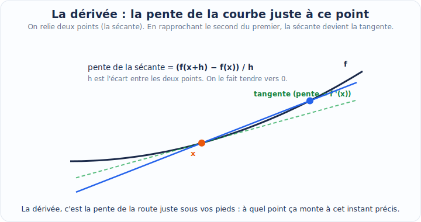
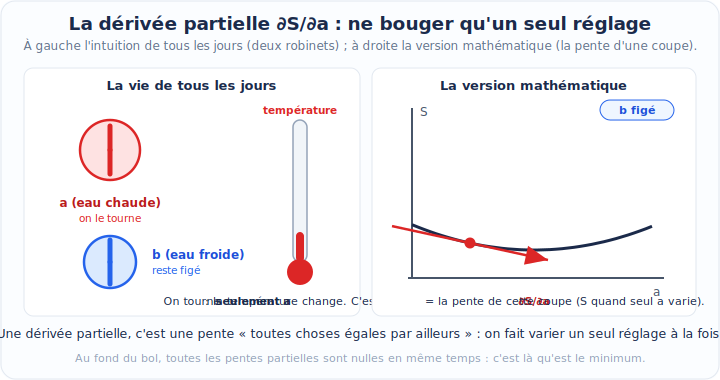
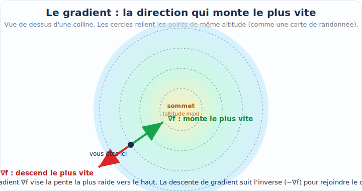
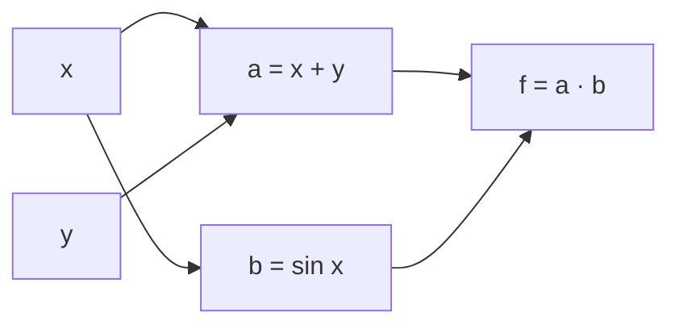

[← Décompositions matricielles](04-decompositions-matricielles.md) · [↑ Sommaire](../README.md#table-des-matières) · [Probabilités et distributions →](06-probabilités-et-distributions.md)

# 5. Calcul différentiel vectoriel

### Dérivation des fonctions d'une variable

Avant de parler de gradients, de jacobiennes ou de rétropropagation, il faut comprendre un objet d'une simplicité trompeuse : la **dérivée** d'une fonction d'une seule variable. C'est la brique élémentaire ; tout le reste du chapitre n'est qu'une généralisation de cette idée à plusieurs dimensions.

#### L'intuition : mesurer une pente

Imaginez que vous roulez en voiture. À chaque instant, le compteur de vitesse vous indique à quelle vitesse vous allez **maintenant**, pas votre vitesse moyenne depuis le départ. La dérivée, c'est exactement ce compteur de vitesse : elle vous dit, en un point précis, **à quelle vitesse une quantité change**.

Géométriquement, si on trace la courbe d'une fonction $`f`$, la dérivée en un point est la **pente de la tangente** à la courbe en ce point. Une pente positive signifie « ça monte », une pente négative « ça descend », une pente nulle « c'est plat » (sommet, creux ou palier).

> **Que veut dire « tangente » ?** La **tangente** est la droite qui « épouse » la courbe en un point précis, en la frôlant sans la traverser. Posez une règle contre l'arrondi d'une assiette : elle ne touche qu'en un seul endroit, c'est la tangente.

> **Le symbole $`f(x)`$.** Ce symbole représente une **machine à transformer les nombres**. On lui donne un nombre $`x`$ (l'entrée), et elle recrache un autre nombre noté $`f(x)`$ (la sortie). Comme une machine à café : vous mettez une capsule (le $`x`$), vous obtenez un café (le $`f(x)`$). La lettre $`f`$ est juste le nom de la machine ; on pourrait l'appeler $`g`$, $`h`$ ou « tartempion ».

> **Le symbole $`x`$.** Ce symbole représente un **nombre qui peut varier**, une « case vide » qu'on remplit avec la valeur de notre choix. On l'appelle une variable. Pensez à une boîte étiquetée « $`x`$ » dans laquelle on range tantôt 2, tantôt 3,7, tantôt $`-10`$.

#### La limite : s'approcher sans jamais toucher

Pour transformer l'idée de pente en une définition rigoureuse, il faut d'abord l'outil le plus fondamental de l'analyse : la **limite**.

> **Le symbole $`\lim`$ (limite).** Ce symbole représente l'idée de **« vers quoi on se dirige quand on s'approche tout près »**. Imaginez que vous marchez vers un mur en faisant à chaque pas la moitié du chemin restant : vous ne touchez jamais le mur, mais tout le monde voit bien que vous vous dirigez vers lui. La limite, c'est la position du mur : la valeur visée, même si on ne l'atteint jamais vraiment.

> **Le symbole $`h \to 0`$.** La flèche $`\to`$ se lit « tend vers ». Donc $`h \to 0`$ veut dire « la petite quantité $`h`$ devient de plus en plus minuscule, se rapprochant de zéro, sans jamais valoir exactement zéro ». Pensez à $`h`$ comme à une miette de pain qu'on rend de plus en plus petite : $`0,1`$ puis $`0,001`$ puis $`0,000001`$...

Pour mesurer une pente, on prend deux points sur la courbe, séparés horizontalement d'une petite distance $`h`$, et on calcule la pente de la droite (la « corde ») qui les relie. Cette pente vaut

```math
\frac{f(x+h) - f(x)}{h}.
```

C'est la variation verticale (la sortie a bougé de $`f(x+h)-f(x)`$) divisée par la variation horizontale ($`h`$). On appelle cela le **taux d'accroissement**. Puis on fait rétrécir $`h`$ vers zéro : les deux points se rapprochent, la corde se confond avec la tangente, et l'on obtient la pente exacte.



> **Définition (dérivée).** Soit $`f: I \to \mathbb{R}`$ définie sur un intervalle ouvert $`I \subseteq \mathbb{R}`$, et $`x \in I`$. On dit que $`f`$ est **dérivable** (synonyme : différentiable, pour une fonction d'une variable) en $`x`$ si la limite suivante existe et est finie :
> ```math
> f'(x) \;=\; \frac{\mathrm{d}f}{\mathrm{d}x}(x) \;=\; \lim_{h \to 0} \frac{f(x+h) - f(x)}{h}.
> ```
> Ce nombre $`f'(x)`$ est la **dérivée** de $`f`$ en $`x`$.

> **Le symbole $`f'(x)`$ et la notation $`\frac{\mathrm{d}f}{\mathrm{d}x}`$.** Le petit trait $`'`$ (« prime ») sur le $`f`$ signifie « la dérivée de ». Donc $`f'`$ se lit « f prime » et désigne la fonction-pente. La notation $`\frac{\mathrm{d}f}{\mathrm{d}x}`$ (notation de Leibniz) se lit « d f sur d x » : le « $`\mathrm{d}`$ » évoque une **variation infiniment petite**. C'est littéralement « une toute petite variation de $`f`$ divisée par une toute petite variation de $`x`$ », la version « zoomée à l'infini » du taux d'accroissement.

> **Le symbole $`\mathbb{R}`$.** Ce symbole (un R à double barre) représente l'ensemble de **tous les nombres réels**: tous les points d'une droite continue, des entiers ($`-2`$, $`0`$, $`5`$) aux fractions ($`\tfrac{1}{3}`$) en passant par les irrationnels ($`\sqrt{2}`$, $`\pi`$). Quand on écrit $`f: I \to \mathbb{R}`$, cela veut dire « $`f`$ prend une entrée dans l'intervalle $`I`$ et produit un nombre réel ».

> **Le symbole $`\in`$ (appartenance).** Ce symbole se lit « appartient à » ou « est dans » : $`x \in I`$ signifie « le nombre $`x`$ fait partie de l'ensemble $`I`$ ». C'est comme dire « la pomme est dans le panier » : $`\in`$ relie un objet au sac qui le contient.

> **Que veut dire « intervalle ouvert » ?** Un **intervalle**, c'est tout simplement un morceau continu de la droite des nombres, par exemple « tous les nombres entre 2 et 5 ». On dit qu'il est **ouvert** quand on **exclut les deux bouts** : on prend tout ce qui est strictement entre 2 et 5, mais pas 2 ni 5 eux-mêmes (comme une rue où l'on peut s'arrêter n'importe où sauf exactement aux deux portails d'entrée). Cette précaution sert à pouvoir s'approcher d'un point « par les deux côtés » sans buter contre un bord.

> **Le symbole $`\subseteq`$ (inclusion).** Ce symbole se lit « est inclus dans » : $`I \subseteq \mathbb{R}`$ signifie « tout élément de $`I`$ est aussi un élément de $`\mathbb{R}`$ », autrement dit $`I`$ est un **morceau** de la droite réelle. C'est l'analogue ensembliste de « le tiroir est rangé dans la commode ».

> **Remarque (dérivabilité et continuité).** Si $`f`$ est dérivable en $`x`$, alors $`f`$ est continue en $`x`$ (pas de saut brutal). La réciproque est fausse (la **réciproque**, c'est la même phrase dite à l'envers : ici « si continue, alors dérivable » ; dire qu'elle est fausse, c'est dire que l'inverse ne marche pas toujours) : la fonction valeur absolue $`f(x)=|x|`$ (la **valeur absolue**, notée avec deux barres droites $`|\cdot|`$ qui se lisent « valeur absolue de », c'est le nombre **sans son signe**, sa distance à zéro : $`|3|=3`$ et $`|-3|=3`$ ; sa courbe dessine un V) est continue en $`0`$ mais pas dérivable (sa courbe forme un coin, et la pente « à gauche » vaut $`-1`$ tandis que la pente « à droite » vaut $`+1`$; il n'y a pas de tangente unique).

#### Exemple chiffré déroulé pas à pas

Calculons la dérivée de $`f(x) = x^2`$ au point $`x = 3`$, directement avec la définition.

1. Formez le taux d'accroissement :
```math
\frac{f(3+h) - f(3)}{h} = \frac{(3+h)^2 - 3^2}{h}.
```
2. Développez $`(3+h)^2 = 9 + 6h + h^2`$:
```math
= \frac{9 + 6h + h^2 - 9}{h} = \frac{6h + h^2}{h}.
```
3. Simplifiez par $`h`$ (licite car $`h \neq 0`$, le symbole $`\neq`$ se lisant « est différent de » : ici « $`h`$ n'est pas égal à zéro », tant qu'on n'a pas pris la limite) :
```math
= 6 + h.
```
4. Faites tendre $`h \to 0`$:
```math
f'(3) = \lim_{h\to 0} (6 + h) = 6.
```

La pente de la parabole $`x^2`$ au point $`x=3`$ vaut donc $`6`$. En refaisant le calcul pour un $`x`$ quelconque on trouve $`f'(x) = 2x`$, ce qui est le cas particulier $`n=2`$ de la règle générale ci-dessous.

#### Le formulaire des dérivées usuelles

En pratique on ne repasse jamais par la limite : on apprend une fois pour toutes les dérivées des fonctions de base et des règles de combinaison. Voici les dérivées qu'il faut connaître par cœur.

| Fonction $`f(x)`$ | Dérivée $`f'(x)`$ | Condition |
|---|---|---|
| $`c`$ (constante) | $`0`$ | |
| $`x^n`$ | $`n\,x^{n-1}`$ | $`n`$ entier : tout $`x`$; $`n`$ réel quelconque : $`x>0`$ |
| $`e^x`$ | $`e^x`$ | |
| $`a^x`$ | $`a^x \ln a`$ | $`a>0`$ |
| $`\ln x`$ | $`1/x`$ | $`x>0`$ |
| $`\sin x`$ | $`\cos x`$ | |
| $`\cos x`$ | $`-\sin x`$ | |
| $`\tan x`$ | $`1 + \tan^2 x = 1/\cos^2 x`$ | $`x \neq \tfrac{\pi}{2}+k\pi`$ |
| $`\sqrt{x}`$ | $`\dfrac{1}{2\sqrt{x}}`$ | $`x>0`$ |
| $`1/x`$ | $`-1/x^2`$ | $`x \neq 0`$ |

> **Attention à la condition sur $`x^n`$.** Pour un exposant entier ($`x^2`$, $`x^3`$, $`x^{-1}`$…), la règle $`n x^{n-1}`$ vaut pour tout $`x`$ admissible, y compris les $`x`$ négatifs. Mais dès que $`n`$ est un réel non entier (par exemple $`x^{1/2}=\sqrt{x}`$), la fonction $`x^n`$ n'est définie sur les réels que pour $`x>0`$; la règle ne s'applique alors que là. C'est pourquoi $`\sqrt{x}`$ figure séparément avec la condition $`x>0`$.

> **Le symbole $`e`$.** Ce symbole représente un nombre spécial, $`e \approx 2,71828`$ (le signe $`\approx`$ se lit « est à peu près égal à » : la valeur exacte a une infinité de décimales, on en donne juste les premières), appelé **constante d'Euler**. Sa particularité magique : la fonction $`e^x`$ est sa propre dérivée. C'est le nombre « naturel » de la croissance continue (intérêts composés, populations, décroissance radioactive). On le retrouvera partout en apprentissage automatique (l'**apprentissage automatique**, ou « machine learning », c'est la branche de l'informatique où l'on fait **apprendre** une tâche à un ordinateur à partir d'exemples, au lieu de lui dicter des règles : on lui montre des milliers de cas et il ajuste tout seul ses réglages pour bien répondre), notamment dans l'exponentielle de la fonction softmax.

> **Le symbole $`\ln`$.** Ce symbole représente le **logarithme naturel**, la fonction réciproque de l'exponentielle : si $`e^a = b`$, alors $`\ln b = a`$. Intuitivement, $`\ln b`$ répond à la question « à quelle puissance faut-il élever $`e`$ pour obtenir $`b`$ ? ». Il transforme les produits en sommes ($`\ln(ab)=\ln a + \ln b`$), ce qui le rend précieux pour manipuler les vraisemblances en probabilités (la **vraisemblance**, expliquée plus loin, mesure à quel point un modèle rend plausibles les données observées).

#### Les règles de combinaison

| Règle | Formule |
|---|---|
| Linéarité | $`(\alpha f + \beta g)' = \alpha f' + \beta g'`$ |
| Produit | $`(fg)' = f'g + f g'`$ |
| Quotient | $`\left(\dfrac{f}{g}\right)' = \dfrac{f'g - f g'}{g^2}`$ |
| Composition (règle de la chaîne) | $`\big(f(g(x))\big)' = f'\!\big(g(x)\big)\cdot g'(x)`$ |

> **Que veut dire « linéaire » (et « linéarité ») ?** Le mot vient de « ligne ». Une relation est **linéaire** quand elle est *proportionnelle et additive* : si vous doublez l'entrée, la sortie double ; et l'effet de deux causes est la somme de leurs effets séparés. Pas de courbe, pas de seuil : tout se fait « en ligne droite ». La **linéarité** de la dérivée dit donc qu'on peut dériver « morceau par morceau » : la dérivée d'une somme est la somme des dérivées, et un nombre qui multiplie ressort tel quel.

> **Les symboles $`\alpha`$ et $`\beta`$ (alpha, bêta).** Ces deux premières lettres grecques désignent ici de simples **nombres fixes** (des constantes) qui pondèrent $`f`$ et $`g`$. On les emploie par convention pour des coefficients (un **coefficient**, c'est juste le nombre par lequel on multiplie quelque chose, comme le « 3 » dans « 3 pommes »), exactement comme on dirait « 3 fois ceci plus 2 fois cela ».

La dernière, la **règle de la chaîne** (chain rule), est de loin la plus importante de tout le chapitre : c'est elle qui, généralisée aux vecteurs et aux matrices, deviendra la **rétropropagation** (backpropagation) qui entraîne les **réseaux de neurones**. Nous lui consacrons un encadré.

> **Que veut dire « rétropropagation » ?** C'est la méthode qui calcule, en remontant le calcul à l'envers, comment régler chaque bouton du modèle pour réduire ses erreurs. Elle est détaillée en fin de chapitre.

> **Que veut dire « réseau de neurones » ?** C'est un gros empilement de petites opérations très simples, branchées les unes aux autres, dont on ajuste les réglages jusqu'à ce que l'ensemble accomplisse une tâche : reconnaître une image, traduire une phrase.

> **Définition (règle de la chaîne, une variable).** Soit $`g`$ dérivable en $`x`$ et $`f`$ dérivable en $`g(x)`$. Alors la fonction composée $`h = f \circ g`$, définie par $`h(x) = f(g(x))`$, est dérivable en $`x`$ et
> ```math
> h'(x) = f'\big(g(x)\big)\cdot g'(x).
> ```
> **Intuition « engrenages ».** Imaginez deux engrenages enchaînés. Si le premier ($`g`$) tourne 3 fois plus vite que sa manivelle, et que le second ($`f`$) tourne 2 fois plus vite que le premier, alors le second tourne $`2 \times 3 = 6`$ fois plus vite que la manivelle. Les vitesses de variation se **multiplient** le long de la chaîne. C'est tout le secret.

> **Le symbole $`\circ`$ (composition).** Ce symbole rond représente l'action d'**enchaîner deux machines**: $`f \circ g`$ se lit « f rond g » et signifie « applique d'abord $`g`$, puis donne le résultat à $`f`$ ». C'est comme une chaîne de montage : la pièce passe dans la machine $`g`$, puis le produit sort et entre directement dans la machine $`f`$. Attention à l'ordre : on lit de droite à gauche, la machine la plus à droite agit en premier.

**Exemple chiffré (règle de la chaîne).** Dérivons $`h(x) = (3x^2 + 1)^5`$.
On pose $`g(x) = 3x^2 + 1`$ (donc $`g'(x) = 6x`$) et $`f(u) = u^5`$ (donc $`f'(u) = 5u^4`$). Alors
```math
h'(x) = f'(g(x))\cdot g'(x) = 5(3x^2+1)^4 \cdot 6x = 30x\,(3x^2+1)^4.
```

#### Application machine learning : la descente de gradient en dimension 1

Tout l'apprentissage automatique repose sur la **minimisation d'une fonction de coût** (loss function). En une dimension, supposons qu'on cherche le minimum d'une fonction $`J(w)`$ qui mesure « à quel point notre modèle se trompe » en fonction d'un paramètre $`w`$. L'idée de la **descente de gradient** (gradient descent) est limpide : la dérivée $`J'(w)`$ indique la pente ; pour descendre vers le minimum, on fait un pas dans le sens **opposé** à la pente.

```math
w_{t+1} = w_t - \eta\, J'(w_t).
```

> **Le symbole $`\eta`$ (êta).** Cette lettre grecque représente le **taux d'apprentissage** (learning rate) : la taille du pas qu'on fait à chaque itération. Trop grand, on saute par-dessus le minimum et on diverge ; trop petit, on avance à pas de fourmi et l'apprentissage est interminable. C'est le « réglage de l'amortisseur » de l'optimisation.

> **Le symbole d'indice $`w_t`$.** Le petit $`t`$ en bas de $`w`$ représente le **numéro de l'étape** (l'instant, le « tour de boucle »). Ainsi $`w_0`$ est la valeur de départ, $`w_1`$ après un pas, $`w_2`$ après deux pas, etc. Pensez aux numéros de page d'un carnet : chaque page note où l'on en est.

Illustrons sur $`J(w) = (w-4)^2`$, dont le minimum évident est en $`w=4`$. La dérivée est $`J'(w) = 2(w-4)`$.

```python
import numpy as np

def J(w):       return (w - 4.0) ** 2
def grad_J(w):  return 2.0 * (w - 4.0)

w = 0.0          # point de depart
eta = 0.1        # taux d'apprentissage
for t in range(25):
    g = grad_J(w)
    w = w - eta * g
    print(f"t={t:2d}  w={w:.5f}  J={J(w):.5f}  J'={g:+.5f}")

print("Minimum trouve :", round(w, 5))   # -> proche de 4.0
```

À chaque tour, $`w`$ se rapproche de $`4`$ et la valeur de coût diminue. On vient d'exécuter, en miniature, l'algorithme qui entraîne la quasi-totalité des modèles modernes, il ne reste qu'à le généraliser à des milliards de paramètres, ce qui exige de passer du nombre $`w`$ à un **vecteur** de paramètres. D'où la suite.

---

### Dérivées partielles et gradients

Une fonction de coût réelle ne dépend pas d'un seul paramètre mais de milliers, de millions, voire de milliards. Il nous faut donc dériver des fonctions **à plusieurs entrées**. C'est exactement l'objet des dérivées partielles et du gradient.

#### L'intuition : la pente dans chaque direction

Considérons une fonction de deux variables, $`f(x_1, x_2)`$. Sa courbe n'est plus une ligne dans le plan, mais une **surface** dans l'espace : un paysage de collines et de vallées, où l'altitude au-dessus du point $`(x_1, x_2)`$ vaut $`f(x_1, x_2)`$.

Sur un paysage, la question « quelle est la pente ? » n'a pas une seule réponse : tout dépend de la **direction** vers laquelle on regarde ! La pente vers l'est n'est pas la même que vers le nord. L'idée de la **dérivée partielle** est de fixer toutes les directions sauf une, et de ne mesurer la pente que dans cette direction-la.



> **Le symbole $`\partial`$ (« d rond », dérivée partielle).** Ce symbole, un « d » arrondi, représente une dérivée **partielle**: on dérive par rapport à une seule variable en **gelant** toutes les autres comme si c'étaient des constantes. Imaginez que vous êtes sur une colline et que vous ne vous autorisez à marcher **que vers l'est** (variable $`x_1`$), en vous interdisant tout pas vers le nord (variable $`x_2`$ figée) : la pente que vous ressentez sous vos pieds, c'est $`\frac{\partial f}{\partial x_1}`$. Le « rond » sert juste à rappeler « attention, il y a d'autres variables qu'on a mises en pause ».

> **Définition (dérivée partielle).** Soit $`f: \mathbb{R}^n \to \mathbb{R}`$ et $`\mathbf{x} = (x_1, \dots, x_n)`$. La **dérivée partielle** de $`f`$ par rapport à $`x_i`$ est
> ```math
> \frac{\partial f}{\partial x_i}(\mathbf{x}) = \lim_{h \to 0} \frac{f(x_1,\dots,x_i + h,\dots,x_n) - f(x_1,\dots,x_i,\dots,x_n)}{h},
> ```
> c'est-à-dire la dérivée ordinaire de la fonction d'une variable $`t \mapsto f(x_1,\dots,t,\dots,x_n)`$, les autres coordonnées étant tenues constantes.

> **Le symbole $`\mathbb{R}^n`$.** Ce symbole représente l'ensemble des **listes ordonnées de $`n`$ nombres réels**, c'est-à-dire les vecteurs à $`n`$ coordonnées. $`\mathbb{R}^2`$ c'est le plan (couples $`(x_1,x_2)`$), $`\mathbb{R}^3`$ l'espace, et $`\mathbb{R}^{1000}`$ un espace à mille dimensions qu'on ne peut pas dessiner mais qu'on manipule avec les mêmes règles. Le petit $`n`$ en exposant compte le nombre de cases dans la liste.

> **Le symbole $`\mathbf{x}`$ en gras.** Quand on écrit $`\mathbf{x}`$ en **gras**, ce n'est plus un seul nombre mais un **vecteur**: un paquet de plusieurs nombres rangés en colonne, $`\mathbf{x} = (x_1, x_2, \dots, x_n)`$. C'est la différence entre un grain de riz ($`x`$, un scalaire) et le sachet entier ($`\mathbf{x}`$, le vecteur). Le petit indice $`i`$ dans $`x_i`$ désigne la $`i`$-ème case du sachet.

> **Le symbole $`\mapsto`$ (« applique sur »).** À ne pas confondre avec $`\to`$. La flèche $`\to`$ relie des **ensembles** ($`f: \mathbb{R}^n \to \mathbb{R}`$: « de tel ensemble vers tel ensemble »), tandis que $`\mapsto`$ relie un **élément à son image** ($`t \mapsto t^2`$: « à $`t`$ on associe $`t^2`$ »). La première décrit la machine en gros, la seconde décrit la règle de calcul précise.

#### Le gradient : empiler toutes les pentes

Si l'on rassemble toutes les dérivées partielles dans un vecteur, on obtient le **gradient**. C'est l'objet central de toute l'optimisation.

> **Le symbole $`\nabla`$ (nabla, le gradient).** Ce symbole en forme de triangle pointe vers le bas se lit « nabla ». $`\nabla f`$ représente le **vecteur des pentes dans toutes les directions à la fois**. Reprenons la colline : en un point donné, $`\nabla f`$ est une flèche posée au sol qui **pointe dans la direction de la montée la plus raide**, et dont la **longueur** indique à quel point ça grimpe fort. Si vous laissez tomber une bille, elle roule exactement dans la direction $`-\nabla f`$ (l'opposé du gradient). C'est la boussole de la descente de gradient.



> **Définition (gradient).** Pour $`f: \mathbb{R}^n \to \mathbb{R}`$ différentiable, le **gradient** de $`f`$ en $`\mathbf{x}`$ est le vecteur des dérivées partielles :
> ```math
> \nabla f(\mathbf{x}) = \begin{bmatrix} \dfrac{\partial f}{\partial x_1}(\mathbf{x}) \\[2mm] \dfrac{\partial f}{\partial x_2}(\mathbf{x}) \\[1mm] \vdots \\[1mm] \dfrac{\partial f}{\partial x_n}(\mathbf{x}) \end{bmatrix} \in \mathbb{R}^n.
> ```
> Sa transposée $`\nabla f(\mathbf{x})^\top = \big[\tfrac{\partial f}{\partial x_1}, \dots, \tfrac{\partial f}{\partial x_n}\big]`$ (le petit $`\top`$ en exposant se lit « transposée » et veut dire « on bascule la colonne en ligne », comme on coucherait une pile de livres debout pour les aligner à plat ; détaillé plus loin), vecteur ligne, représente la **différentielle** de $`f`$ au point $`\mathbf{x}`$ (l'**application linéaire**, c'est-à-dire la règle de calcul « en ligne droite » sans courbe, qui approche le mieux la variation de $`f`$). C'est aussi la matrice jacobienne de $`f`$ vue comme fonction à une seule sortie : une matrice $`1\times n`$ (la jacobienne est une notion définie à la section suivante ; ici, retenez seulement qu'il s'agit du gradient écrit en ligne).
>
> **Que veut dire « différentielle » ?** En un mot : c'est la **meilleure approximation par une droite (ou un plan)** de la fonction autour du point. Elle vous dit de combien $`f`$ bouge si vous bougez un tout petit peu l'entrée. Pour une fonction d'une seule variable, « dérivable » et « différentiable » désignent exactement la même chose (c'est juste la pente de la tangente). À plusieurs variables, le mot « différentiable » devient plus exigeant qu'avoir des dérivées partielles : il réclame que cette approximation linéaire fonctionne dans toutes les directions à la fois. C'est la définition rigoureuse donnée un peu plus loin.

> **Convention de disposition (layout).** Il existe deux conventions opposées pour ranger les dérivées : le *denominator layout* (gradient en colonne, le notre par défaut) et le *numerator layout* (gradient en ligne). Les deux sont corrects ; ils diffèrent par une transposition. Le piège classique consiste à mélanger les deux dans un même calcul. **Choisissez-en une et tenez-vous-y.** Dans ce chapitre, le gradient $`\nabla f`$ d'une fonction scalaire est un **vecteur colonne**.

#### Dérivée directionnelle et différentiabilité

Le gradient encode bien plus que les pentes selon les axes : il donne la pente dans **n'importe quelle** direction.

> **Définition (dérivée directionnelle).** Pour un vecteur unitaire $`\mathbf{u} \in \mathbb{R}^n`$ ($`\|\mathbf{u}\| = 1`$), la dérivée directionnelle de $`f`$ en $`\mathbf{x}`$ dans la direction $`\mathbf{u}`$ est
> ```math
> D_{\mathbf{u}} f(\mathbf{x}) = \lim_{h \to 0} \frac{f(\mathbf{x} + h\mathbf{u}) - f(\mathbf{x})}{h} = \nabla f(\mathbf{x})^\top \mathbf{u} = \langle \nabla f(\mathbf{x}), \mathbf{u}\rangle.
> ```

> **Le symbole $`\|\cdot\|`$ (norme, la « longueur » d'un vecteur).** Les deux barres verticales autour d'un vecteur, $`\|\mathbf{u}\|`$, se lisent « norme de $`\mathbf{u}`$ » et représentent sa **longueur**, exactement comme la longueur d'une flèche tracée sur une feuille. On la calcule (norme euclidienne, vue au chapitre 4) en mettant chaque coordonnée au carré, en additionnant, puis en prenant la racine : $`\|\mathbf{u}\| = \sqrt{u_1^2 + \dots + u_n^2}`$. Dire qu'un vecteur est **unitaire**, c'est dire que sa longueur vaut exactement $`1`$ ($`\|\mathbf{u}\|=1`$) : il indique alors une **direction** pure, sans information de taille, comme l'aiguille d'une boussole qui pointe quelque part mais à toujours la même longueur.

> **Le symbole $`\langle\cdot,\cdot\rangle`$ (produit scalaire).** Vu au chapitre 4, c'est l'opération qui mesure « à quel point deux vecteurs pointent dans le même sens » : $`\langle\mathbf a,\mathbf b\rangle = \mathbf a^\top\mathbf b = \sum_i a_i b_i`$ (la grande lettre $`\sum`$, détaillée plus loin, se lit « somme de » : elle dit qu'on additionne tous les termes $`a_i b_i`$ ; ici on multiplie les coordonnées deux à deux puis on additionne le tout). On le rappelle ici parce qu'il fait le pont entre le gradient (un vecteur) et la pente (un nombre). Les deux écritures $`\nabla f^\top\mathbf u`$ et $`\langle\nabla f,\mathbf u\rangle`$ désignent la même chose.

Cette égalité a une conséquence géométrique fondamentale. Par l'**inégalité** de Cauchy-Schwarz (vue au chapitre 4),

```math
-\|\nabla f(\mathbf{x})\| \;\le\; D_{\mathbf{u}} f(\mathbf{x}) = \langle \nabla f(\mathbf{x}), \mathbf{u}\rangle \;\le\; \|\nabla f(\mathbf{x})\|\,\|\mathbf{u}\| = \|\nabla f(\mathbf{x})\|,
```
la borne supérieure étant atteinte lorsque $`\mathbf{u}`$ est **colinéaire** et de même sens que $`\nabla f(\mathbf{x})`$, et la borne inférieure lorsque $`\mathbf{u}`$ pointe dans le sens opposé. **Le gradient pointe donc dans la direction de plus forte croissance** (sa norme est la pente maximale), et son opposé $`-\nabla f`$ dans celle de plus forte décroissance. C'est la justification rigoureuse de la descente de gradient.

> **Que veut dire « inégalité » ?** Une inégalité affirme qu'une quantité est plus petite, ou plus grande, qu'une autre. Le symbole $`\le`$ se lit « est inférieur ou égal à », c'est-à-dire « ne dépasse pas ».

> **Que veut dire « colinéaires » ?** Deux vecteurs sont colinéaires quand ils sont **parallèles**, c'est-à-dire qu'ils pointent le long de la même droite, soit dans le même sens, soit en sens contraire : comme deux flèches posées sur le même rail.

> **Définition (différentiabilité).** $`f: \mathbb{R}^n \to \mathbb{R}`$ est **différentiable** en $`\mathbf{x}`$ s'il existe un vecteur $`\mathbf{g}`$ tel que
> ```math
> f(\mathbf{x} + \mathbf{h}) = f(\mathbf{x}) + \mathbf{g}^\top \mathbf{h} + o(\|\mathbf{h}\|), \qquad \text{quand } \mathbf{h} \to \mathbf{0}.
> ```
> Le vecteur $`\mathbf{g}`$ est alors unique et vaut $`\nabla f(\mathbf{x})`$. Cela signifie que, **localement, $`f`$ ressemble à une fonction affine** (un plan tangent).

> **Le symbole $`o(\cdot)`$ (petit o de Landau).** La notation $`o(\|\mathbf{h}\|)`$ représente un terme d'erreur **négligeable** devant $`\|\mathbf{h}\|`$ quand $`\mathbf{h}`$ devient minuscule, c'est-à-dire $`\frac{o(\|\mathbf{h}\|)}{\|\mathbf{h}\|} \to 0`$ lorsque $`\mathbf{h} \to \mathbf{0}`$. L'idée importante est que ce reste ne se contente pas d'être petit : il rétrécit **plus vite** que $`\mathbf{h}`$ lui-même. Concrètement, si vous divisez $`\mathbf{h}`$ par 10, l'erreur n'est pas divisée par 10 mais par bien plus, si bien que, **proportionnellement** à $`\mathbf{h}`$, elle s'évanouit. C'est le « reste qui s'efface plus vite que la quantité de référence ».

> **Le symbole $`O(\cdot)`$ (grand O de Landau).** À distinguer du petit o. La notation $`O(\|\mathbf{h}\|)`$ désigne un terme qui reste **du même ordre de grandeur** que $`\|\mathbf{h}\|`$ (borné par un multiple de $`\|\mathbf{h}\|`$), sans forcément devenir négligeable. Image : le petit o, c'est la poussière qui disparaît ; le grand O, c'est un caillou qui reste proportionnel au grain de référence. On s'en sert plus bas dans la preuve de la règle de la chaîne.

> **Piège (l'existence des partielles ne suffit pas).** On peut avoir toutes les dérivées partielles existantes en un point sans que $`f`$ y soit différentiable (exemple classique : $`f(x,y) = \frac{xy}{x^2+y^2}`$ prolongée par $`0`$ à l'origine). En revanche, si les partielles existent **et sont continues** au voisinage de $`\mathbf{x}`$, alors $`f`$ est différentiable en $`\mathbf{x}`$ (on dit que $`f`$ est de classe $`\mathcal{C}^1`$). En pratique, en apprentissage automatique, les fonctions sont presque toujours $`\mathcal{C}^1`$ par morceaux.

#### Exemple chiffré déroulé pas à pas

Soit $`f(x_1, x_2) = x_1^2 x_2 + 3x_2`$. Calculons son gradient au point $`(2, 1)`$.

**Dérivée partielle par rapport à $`x_1`$** (on traite $`x_2`$ comme une constante) :
```math
\frac{\partial f}{\partial x_1} = 2 x_1 x_2 + 0 = 2 x_1 x_2.
```
**Dérivée partielle par rapport à $`x_2`$** (on traite $`x_1`$ comme une constante) :
```math
\frac{\partial f}{\partial x_2} = x_1^2 + 3.
```
Donc le gradient général et son évaluation :
```math
\nabla f(x_1,x_2) = \begin{bmatrix} 2x_1 x_2 \\ x_1^2 + 3 \end{bmatrix}, \qquad \nabla f(2,1) = \begin{bmatrix} 2\cdot 2 \cdot 1 \\ 2^2 + 3 \end{bmatrix} = \begin{bmatrix} 4 \\ 7 \end{bmatrix}.
```
Au point $`(2,1)`$, pour grimper le plus vite, il faut avancer dans la direction $`\begin{bmatrix}4\\7\end{bmatrix}`$; la pente y vaut $`\|\nabla f(2,1)\| = \sqrt{16+49} = \sqrt{65} \approx 8,06`$.

#### Vérification numérique : les différences finies

On peut toujours vérifier un gradient calculé à la main par une approximation numérique, la **différence finie centrée** (central finite difference), qui revient à appliquer la définition avec un $`h`$ petit mais non nul :
```math
\frac{\partial f}{\partial x_i}(\mathbf{x}) \approx \frac{f(\mathbf{x} + h\,\mathbf{e}_i) - f(\mathbf{x} - h\,\mathbf{e}_i)}{2h}.
```

> **Le symbole $`\mathbf{e}_i`$.** Ce symbole représente le $`i`$-ème **vecteur de base canonique**: une liste de zéros partout, sauf un $`1`$ à la position $`i`$. Par exemple dans $`\mathbb{R}^3`$, $`\mathbf{e}_2 = (0,1,0)`$. Il sert d'« interrupteur » qui n'allume qu'une seule direction : ajouter $`h\,\mathbf{e}_i`$ à $`\mathbf{x}`$ ne modifie que la coordonnée $`i`$.

```python
import numpy as np

def f(x):
    return x[0]**2 * x[1] + 3 * x[1]

def grad_analytique(x):
    return np.array([2 * x[0] * x[1], x[0]**2 + 3.0])

def grad_numerique(f, x, h=1e-5):
    g = np.zeros_like(x, dtype=float)
    for i in range(len(x)):
        e = np.zeros_like(x, dtype=float); e[i] = h
        g[i] = (f(x + e) - f(x - e)) / (2 * h)
    return g

x = np.array([2.0, 1.0])
print("analytique :", grad_analytique(x))   # [4. 7.]
print("numerique  :", grad_numerique(f, x)) # ~[4. 7.]
```

> **La vérification par différences finies (`gradcheck`) en pratique.** C'est le réflexe pour valider une implémentation de gradient faite à la main. Mais en production on ne calcule presque plus aucun gradient manuellement : les bibliothèques de différentiation automatique (JAX, PyTorch) le font exactement, à la précision machine, et infiniment plus vite que les différences finies, lesquelles souffrent du compromis entre erreur de troncature (si $`h`$ trop grand) et erreur d'arrondi (si $`h`$ trop petit). On garde `gradcheck` pour déboguer une couche personnalisée, pas pour la production.

#### Application machine learning : la régression linéaire

Soit le problème des moindres carrés : on veut ajuster $`\mathbf{w} \in \mathbb{R}^n`$ pour que $`X\mathbf{w}`$ approche au mieux $`\mathbf{y}`$, en minimisant
```math
J(\mathbf{w}) = \tfrac{1}{2}\,\|X\mathbf{w} - \mathbf{y}\|^2.
```

> **Le vocabulaire de la régression linéaire.** La **régression**, c'est l'art de **tracer la « meilleure » droite (ou le meilleur plan) à travers un nuage de points** de données, pour résumer la tendance et prédire de nouvelles valeurs. Imaginez un nuage de points « surface du logement / prix » : on cherche la droite qui passe au plus près de tous les points. Ici $`X`$ est le **tableau des données** (chaque ligne un exemple observé, chaque colonne une caractéristique mesurée), $`\mathbf{y}`$ le vecteur des **vraies valeurs** à prédire, et $`\mathbf{w}`$ les **poids** (les réglages) qu'on cherche. La méthode des **moindres carrés** consiste à choisir $`\mathbf{w}`$ qui rend la **somme des carrés des erreurs** la plus petite possible : on met chaque écart au carré (pour que les écarts positifs et négatifs ne s'annulent pas, et pour punir davantage les grosses erreurs), puis on additionne, et on minimise ce total. C'est exactement ce que mesure $`J(\mathbf{w})`$.
Nous montrerons plus loin (section sur les identités) que
```math
\nabla_{\mathbf{w}} J(\mathbf{w}) = X^\top (X\mathbf{w} - \mathbf{y}).
```

> **Le symbole $`\nabla_{\mathbf{w}}`$.** Le petit indice sous le nabla précise **par rapport à quoi** on dérive : ici, il s'agit de « la pente de $`J`$ quand on bouge $`\mathbf{w}`$ ».
La descente de gradient s'écrit alors $`\mathbf{w} \leftarrow \mathbf{w} - \eta\, X^\top(X\mathbf{w}-\mathbf{y})`$: exactement la version vectorielle de l'algorithme en dimension 1 vu plus haut, où le simple nombre $`w`$ est devenu le vecteur $`\mathbf{w}`$.

> **Le symbole $`\leftarrow`$ (affectation).** Cette flèche vers la gauche ne signifie pas « égal » mais « devient » : $`\mathbf{w} \leftarrow \mathbf{w} - \eta\,\nabla J`$ se lit « remplace l'ancienne valeur de $`\mathbf{w}`$ par la nouvelle ». C'est l'équivalent mathématique de la ligne de code `w = w - eta * grad`: on écrase la case mémoire.

---

### Gradients de fonctions à valeurs vectorielles

Jusqu'ici la sortie était un seul nombre (fonction scalaire). Mais une **couche** de réseau de neurones transforme un vecteur en un **autre vecteur**. Il faut donc dériver des fonctions $`\mathbf{f}: \mathbb{R}^n \to \mathbb{R}^m`$. L'objet qui généralise le gradient est alors la **matrice jacobienne**.

> **Que veut dire « couche » ?** Une couche, c'est un étage du réseau : un paquet d'opérations qui travaillent en parallèle, recevant le vecteur de l'étage précédent et passant leur résultat à l'étage suivant, comme les wagons successifs d'un train.

#### L'intuition : un tableau de toutes les sensibilités

Une fonction vectorielle $`\mathbf{f}`$ à $`m`$ sorties, chacune dépendant des $`n`$ entrées. La question naturelle est : « si je bouge l'entrée $`j`$, de combien bouge la sortie $`i`$ ? ». Il y a $`m \times n`$ telles questions, et leurs réponses se rangent naturellement dans un **tableau** (une matrice) : c'est la jacobienne.

> **Le symbole $`\mathbf{f}`$ (fonction en gras) et $`\mathbb{R}^n \to \mathbb{R}^m`$.** Le gras sur $`\mathbf{f}`$ rappelle que la **sortie est un vecteur**, pas un seul nombre. La notation $`\mathbb{R}^n \to \mathbb{R}^m`$ se lit « prend une entrée à $`n`$ cases, rend une sortie à $`m`$ cases ». Pensez à une console de mixage : $`n`$ boutons d'entrée, $`m`$ aiguilles de sortie ; chaque bouton peut influencer plusieurs aiguilles à la fois.

> **Définition (matrice jacobienne).** Soit $`\mathbf{f}: \mathbb{R}^n \to \mathbb{R}^m`$ différentiable, de composantes $`\mathbf{f}(\mathbf{x}) = \big(f_1(\mathbf{x}), \dots, f_m(\mathbf{x})\big)`$. La **matrice jacobienne** est la matrice $`m \times n`$ des dérivées partielles :
> ```math
> J_{\mathbf{f}}(\mathbf{x}) = \frac{\partial \mathbf{f}}{\partial \mathbf{x}} = \begin{bmatrix} \dfrac{\partial f_1}{\partial x_1} & \cdots & \dfrac{\partial f_1}{\partial x_n} \\[2mm] \vdots & \ddots & \vdots \\[1mm] \dfrac{\partial f_m}{\partial x_1} & \cdots & \dfrac{\partial f_m}{\partial x_n} \end{bmatrix} \in \mathbb{R}^{m \times n}.
> ```
> La ligne $`i`$ est la transposée du gradient de la $`i`$-ème composante : $`\big(\nabla f_i\big)^\top`$.

> **Le symbole $`J_{\mathbf{f}}`$ (matrice jacobienne).** Ce symbole représente le **tableau complet des sensibilités** de toutes les sorties par rapport à toutes les entrées. Chaque case $`(i,j)`$ répond à « de combien varie la sortie $`i`$ quand on pousse l'entrée $`j`$ ? ». Pensez à un tableau de bord d'avion : en lignes les instruments (sorties), en colonnes les commandes (entrées), et à l'intersection l'effet d'une commande sur un instrument. Quand $`m=1`$, la jacobienne se réduit à une seule ligne : c'est le gradient transposé.

> **Le symbole $`\in \mathbb{R}^{m \times n}`$.** Ce symbole indique les **dimensions** d'une matrice : $`m`$ lignes et $`n`$ colonnes. Le $`\times`$ ici ne veut pas dire « multiplier » mais « par » (comme « une feuille 21 par 29,7 »). Retenir l'ordre **(lignes, colonnes)** est vital pour ne pas se tromper dans les produits matriciels.

#### Cas particuliers à mémoriser

Beaucoup de fonctions courantes ont des jacobiennes très simples ; les connaître évite des calculs.

| Fonction $`\mathbf{f}(\mathbf{x})`$ | Jacobienne $`\dfrac{\partial \mathbf{f}}{\partial \mathbf{x}}`$ | Forme |
|---|---|---|
| $`A\mathbf{x}`$ (application linéaire) | $`A`$ | $`m\times n`$ |
| $`\mathbf{x}`$ (identité) | $`I_n`$ | $`n\times n`$ |
| $`\mathbf{a} \odot \mathbf{x}`$ (produit terme à terme) | $`\mathrm{diag}(\mathbf{a})`$ | $`n\times n`$ |
| $`\sigma(\mathbf{x})`$ (activation appliquée composante par composante) | $`\mathrm{diag}\big(\sigma'(x_1),\dots,\sigma'(x_n)\big)`$ | $`n\times n`$ |

> **Au sujet de $`\sigma`$ dans la dernière ligne.** Ici $`\sigma`$ désigne une **fonction d'activation** (une petite fonction appliquée à chaque case du vecteur), et $`\sigma'`$ sa dérivée ; ces deux notions sont expliquées en détail juste après ce tableau, et la fonction d'activation la plus courante, la sigmoïde, est définie plus loin dans le chapitre. Si ces termes ne vous parlent pas encore, lisez d'abord l'encadré qui suit.

> **Le symbole $`I_n`$ (matrice identité).** Vue au chapitre 2, c'est la matrice carrée $`n\times n`$ avec des $`1`$ sur la diagonale et des $`0`$ ailleurs ; elle laisse tout vecteur inchangé ($`I_n\mathbf{x}=\mathbf{x}`$). Rien d'étonnant donc à ce que la jacobienne de la fonction identité ($`\mathbf x\mapsto\mathbf x`$) soit précisément $`I_n`$: bouger une entrée d'un cran bouge la sortie correspondante d'exactement un cran, sans mélange.

> **Le symbole $`\mathrm{diag}(\cdot)`$.** Ce symbole construit une **matrice diagonale**: on prend une liste de nombres et on les pose sur la diagonale principale, des zéros partout ailleurs. C'est comme un standard téléphonique où chaque ligne ne parle qu'à elle-même : l'entrée $`j`$ n'affecte que la sortie $`j`$. Cela arrive des qu'une fonction agit « composante par composante » sans mélanger les coordonnées.

> **Le symbole $`\odot`$ (produit de Hadamard).** Ce symbole (un point dans un cercle) représente la multiplication **terme à terme** de deux vecteurs de même taille : $`(\mathbf{a}\odot\mathbf{x})_i = a_i x_i`$. À ne pas confondre avec le produit scalaire (qui additionne tout en un seul nombre). Ici on garde un vecteur : case par case, on multiplie les vis-à-vis.

> **Le terme « fonction d'activation appliquée composante par composante ».** Une **fonction d'activation** $`\sigma`$ est une petite fonction qui prend un nombre et en rend un autre (par exemple la sigmoïde $`\sigma(z)=\frac{1}{1+e^{-z}}`$, définie plus loin) ; les réseaux de neurones s'en servent pour « plier » leurs calculs et leur permettre d'apprendre des choses non linéaires. Dire qu'on l'applique **composante par composante** signifie qu'on la passe sur chaque case du vecteur **séparément**, sans mélanger les cases entre elles : $`\sigma(\mathbf{x}) = \big(\sigma(x_1),\dots,\sigma(x_n)\big)`$. C'est comme appliquer le même filtre photo à chaque pixel d'une image, chacun de son côté. Comme chaque sortie ne dépend que de son entrée, la jacobienne est **diagonale**: la case $`(i,j)`$ est nulle dès que $`i\neq j`$, et la diagonale contient les dérivées individuelles $`\sigma'(x_i)`$.

#### Exemple chiffré déroulé pas à pas

Soit $`\mathbf{f}: \mathbb{R}^2 \to \mathbb{R}^2`$ définie par
```math
\mathbf{f}(x_1, x_2) = \begin{bmatrix} f_1 \\ f_2 \end{bmatrix} = \begin{bmatrix} x_1^2 + x_2 \\ \sin(x_1)\,x_2 \end{bmatrix}.
```
On calcule les quatre partielles :
```math
\frac{\partial f_1}{\partial x_1} = 2x_1, \quad \frac{\partial f_1}{\partial x_2} = 1, \quad \frac{\partial f_2}{\partial x_1} = \cos(x_1)\,x_2, \quad \frac{\partial f_2}{\partial x_2} = \sin(x_1).
```
D'où la jacobienne, puis son évaluation en $`(0, 3)`$:
```math
J_{\mathbf{f}}(x_1,x_2) = \begin{bmatrix} 2x_1 & 1 \\ \cos(x_1)\,x_2 & \sin(x_1) \end{bmatrix}, \qquad J_{\mathbf{f}}(0,3) = \begin{bmatrix} 0 & 1 \\ 3 & 0 \end{bmatrix}.
```

#### La règle de la chaîne multivariée

C'est le cœur du chapitre. Lorsqu'on compose deux fonctions vectorielles, **les jacobiennes se multiplient** (au sens du produit matriciel), généralisant exactement la règle des engrenages.

> **Théorème (règle de la chaîne multivariée).** Soient $`\mathbf{g}: \mathbb{R}^n \to \mathbb{R}^p`$ différentiable en $`\mathbf{x}`$ et $`\mathbf{f}: \mathbb{R}^p \to \mathbb{R}^m`$ différentiable en $`\mathbf{g}(\mathbf{x})`$. Alors $`\mathbf{h} = \mathbf{f} \circ \mathbf{g}`$ est différentiable en $`\mathbf{x}`$ et sa jacobienne est le **produit matriciel** des jacobiennes :
> ```math
> J_{\mathbf{h}}(\mathbf{x}) = J_{\mathbf{f}}\big(\mathbf{g}(\mathbf{x})\big)\, J_{\mathbf{g}}(\mathbf{x}).
> ```
> Vérification des dimensions : $`(m\times p)\cdot(p\times n) = m\times n`$. Tout colle. L'ordre est crucial : la jacobienne de la fonction **externe** ($`\mathbf{f}`$) est à gauche.

**Démonstration (esquisse rigoureuse).** Par différentiabilité de $`\mathbf{g}`$ en $`\mathbf{x}`$: $`\mathbf{g}(\mathbf{x}+\mathbf{h}) = \mathbf{g}(\mathbf{x}) + J_{\mathbf{g}}(\mathbf{x})\mathbf{h} + o(\|\mathbf{h}\|)`$. Posons $`\mathbf{k} = J_{\mathbf{g}}(\mathbf{x})\mathbf{h} + o(\|\mathbf{h}\|)`$, de sorte que $`\|\mathbf{k}\| = O(\|\mathbf{h}\|)`$. Par différentiabilité de $`\mathbf{f}`$ en $`\mathbf{g}(\mathbf{x})`$:
```math
\mathbf{f}(\mathbf{g}(\mathbf{x})+\mathbf{k}) = \mathbf{f}(\mathbf{g}(\mathbf{x})) + J_{\mathbf{f}}(\mathbf{g}(\mathbf{x}))\mathbf{k} + o(\|\mathbf{k}\|).
```
En substituant $`\mathbf{k}`$ et en regroupant, les termes en $`o`$ restent en $`o(\|\mathbf{h}\|)`$ (puisque $`\|\mathbf{k}\|=O(\|\mathbf{h}\|)`$), et le terme linéaire en $`\mathbf{h}`$ est $`J_{\mathbf{f}}(\mathbf{g}(\mathbf{x}))\,J_{\mathbf{g}}(\mathbf{x})\,\mathbf{h}`$. Par unicité de la différentielle, c'est la jacobienne cherchée. $`\blacksquare`$

> **Le symbole $`\blacksquare`$.** Ce petit carré plein marque la **fin d'une démonstration**. C'est l'équivalent écrit de « CQFD » (ce qu'il fallait démontrer) : il dit « voilà, la preuve est terminée ».

**Exemple chiffré (chaîne matricielle).** Reprenons $`\mathbf{f}`$ ci-dessus et posons $`\mathbf{g}(t) = (t, t^2)`$ avec $`\mathbf{g}: \mathbb{R} \to \mathbb{R}^2`$, donc $`J_{\mathbf{g}}(t) = \begin{bmatrix}1\\2t\end{bmatrix}`$. En $`t=0`$: $`\mathbf{g}(0) = (0,0)`$, et
```math
J_{\mathbf{f}}(0,0) = \begin{bmatrix}0 & 1\\ 0 & 0\end{bmatrix}, \qquad J_{\mathbf{h}}(0) = J_{\mathbf{f}}(0,0)\,J_{\mathbf{g}}(0) = \begin{bmatrix}0 & 1\\ 0 & 0\end{bmatrix}\begin{bmatrix}1\\0\end{bmatrix} = \begin{bmatrix}0\\0\end{bmatrix}.
```

#### Application machine learning : la jacobienne de softmax

La fonction **softmax** transforme un vecteur de scores en une **distribution de probabilités** :
```math
\mathrm{softmax}(\mathbf{z})_i = \frac{e^{z_i}}{\sum_{k=1}^{n} e^{z_k}} =: p_i.
```

> **Que veut dire « distribution de probabilités » ?** C'est une liste de nombres tous compris entre 0 et 1 et dont la **somme fait exactement 1** ; chacun donne la « chance » d'une possibilité, comme « 70 % chat, 20 % chien, 10 % oiseau ». La softmax convertit des scores bruts en de telles parts de gâteau.

> **Le symbole $`\sum`$ (somme sigma).** Cette grande lettre grecque représente une **boucle qui additionne**. $`\sum_{k=1}^{n} a_k`$ se lit « somme, pour $`k`$ allant de 1 à $`n`$, des $`a_k`$ » et vaut $`a_1 + a_2 + \dots + a_n`$. Pensez à une caisse enregistreuse qui scanne les articles un à un et cumule le total. Le « $`k=1`$ » dessous est le point de départ, le « $`n`$ » dessus l'arrivée.

> **Le symbole $`=:`$ (définition).** Les deux points accolés à l'égalité signifient « ceci **définit** le membre du côté des deux points ». Ainsi $`\dots =: p_i`$ se lit « et l'on appelle désormais cette quantité $`p_i`$ ». C'est un raccourci pour baptiser un résultat sans ouvrir une phrase « où l'on pose… ».

Sa jacobienne a une forme remarquable, omniprésente en classification :
```math
\frac{\partial p_i}{\partial z_j} = p_i(\delta_{ij} - p_j), \qquad\text{soit}\qquad J = \mathrm{diag}(\mathbf{p}) - \mathbf{p}\,\mathbf{p}^\top.
```

> **Le symbole $`\delta_{ij}`$ (delta de Kronecker).** Ce symbole vaut $`1`$ si $`i=j`$ et $`0`$ sinon. C'est un **détecteur d'égalité**: il s'allume (1) quand les deux indices sont identiques, reste éteint (0) sinon. Pratique pour écrire « le terme diagonal » d'une formule en une seule expression compacte.

```python
import numpy as np

def softmax(z):
    z = z - z.max()
    e = np.exp(z)
    return e / e.sum()

def jacobienne_softmax(z):
    p = softmax(z)
    return np.diag(p) - np.outer(p, p)

z = np.array([1.0, 2.0, 0.5])
print(jacobienne_softmax(z))
```

---

### Gradients de matrices

Nous montons d'un cran. Les paramètres d'un réseau ne sont pas seulement des vecteurs : ce sont des **matrices** de poids. Il faut donc savoir dériver par rapport à une matrice, et dériver des objets qui sont eux-mêmes des matrices. C'est le domaine du **calcul matriciel** (matrix calculus).

#### L'intuition : ranger les dérivées comme l'objet d'origine

La règle d'or est simple : **la dérivée d'un objet par rapport à un autre se range en suivant la forme des deux objets**. La dérivée d'un scalaire $`y`$ par rapport à une matrice $`W \in \mathbb{R}^{p\times q}`$ est une matrice **de même forme** $`p \times q`$, où la case $`(i,j)`$ contient $`\partial y / \partial W_{ij}`$.

> **Définition (gradient par rapport à une matrice).** Pour $`y = f(W)`$ scalaire avec $`W \in \mathbb{R}^{p\times q}`$,
> ```math
> \frac{\partial y}{\partial W} \in \mathbb{R}^{p\times q}, \qquad \left(\frac{\partial y}{\partial W}\right)_{ij} = \frac{\partial y}{\partial W_{ij}}.
> ```
> On note souvent ce gradient $`\nabla_W f`$.

> **Le symbole $`W_{ij}`$ (entrée d'une matrice).** Les deux indices repèrent une **case dans une grille**: $`W_{ij}`$ est le nombre situé à la ligne $`i`$ et à la colonne $`j`$ de la matrice $`W`$. Comme une bataille navale : la lettre donne la ligne, le chiffré la colonne. Premier indice = ligne, deuxième = colonne, toujours dans cet ordre.

#### La différentielle, méthode reine

Pour les fonctions matricielles, calculer case par case devient vite ingérable. La méthode professionnelle consiste à travailler avec la **différentielle** $`\mathrm{d}y`$ et à la mettre sous une forme canonique pour lire le gradient directement.

> **Principe (identification du gradient).** Pour une fonction scalaire $`y = f(W)`$, on calcule la différentielle et on l'écrit sous la forme
> ```math
> \mathrm{d}y = \mathrm{tr}\!\big(G^\top\, \mathrm{d}W\big) \quad\Longrightarrow\quad \frac{\partial y}{\partial W} = G.
> ```
> (Le symbole $`\Longrightarrow`$ ci-dessus se lit « entraîne » ou « donc » : il dit « si la ligne de gauche est vraie, alors celle de droite l'est aussi ».) Le facteur $`G`$ qui apparaît en regard de $`\mathrm{d}W`$ dans la trace **est** le gradient. Cela marche parce que $`\mathrm{tr}(A^\top B) = \sum_{ij} A_{ij}B_{ij}`$ est le produit scalaire des matrices.

> **Le symbole $`\mathrm{tr}(\cdot)`$ (trace).** Ce symbole représente la **somme des éléments diagonaux** d'une matrice carrée : $`\mathrm{tr}(A) = \sum_i A_{ii}`$. Imaginez la diagonale d'un damier de haut-gauche à bas-droite : on additionne juste les cases sur cette ligne. La trace possède une propriété reine : $`\mathrm{tr}(ABC) = \mathrm{tr}(BCA) = \mathrm{tr}(CAB)`$ (invariance par permutation circulaire), qu'on utilise sans cesse.

> **Le symbole $`A^\top`$ (transposée).** Ce petit T en exposant représente la **matrice retournée**: on échange lignes et colonnes, $`(A^\top)_{ij} = A_{ji}`$. C'est comme basculer un tableau autour de sa diagonale, ou retourner une carte le long d'un axe. Un vecteur colonne devient une ligne, et inversement.

> **Le symbole $`\mathrm{d}W`$ (différentielle d'une matrice).** Ce symbole représente une **variation infinitésimale de toute la matrice** $`W`$ à la fois : chaque case bouge d'un tout petit peu. C'est la version « matrice » du $`\mathrm{d}x`$ vu au début. La différentielle $`\mathrm{d}y`$ exprime comment la sortie $`y`$ réagit à cette petite perturbation $`\mathrm{d}W`$.

#### Identités matricielles fondamentales

Le tableau suivant rassemble les dérivées matricielles les plus utilisées (convention denominator layout, gradient de même forme que la variable de dérivation).

| Expression scalaire $`y`$ | Gradient $`\partial y / \partial \cdot`$ |
|---|---|
| $`\mathbf{a}^\top \mathbf{x}`$ | $`\partial/\partial\mathbf{x} = \mathbf{a}`$ |
| $`\mathbf{x}^\top A\,\mathbf{x}`$ | $`\partial/\partial\mathbf{x} = (A + A^\top)\mathbf{x}`$ |
| $`\mathbf{x}^\top A\,\mathbf{x}`$, $`A`$ symétrique | $`\partial/\partial\mathbf{x} = 2A\mathbf{x}`$ |
| $`\mathrm{tr}(W^\top A)`$ | $`\partial/\partial W = A`$ |
| $`\mathrm{tr}(AWB)`$ | $`\partial/\partial W = A^\top B^\top`$ |
| $`\mathbf{a}^\top W \mathbf{b}`$ | $`\partial/\partial W = \mathbf{a}\,\mathbf{b}^\top`$ |
| $`\mathrm{tr}(W^\top W)=\|W\|_F^2`$ | $`\partial/\partial W = 2W`$ |
| $`\ln\det(W)`$ | $`\partial/\partial W = (W^{-1})^\top = W^{-\top}`$ |
| $`\det(W)`$ | $`\partial/\partial W = \det(W)\,W^{-\top}`$ |

> **Que veut dire « matrice symétrique » ?** Une matrice est **symétrique** quand elle est **identique à son reflet dans le miroir de sa diagonale** : la case en ligne $`i`$, colonne $`j`$ vaut la même chose que celle en ligne $`j`$, colonne $`i`$ (en bref $`A = A^\top`$). Comme un jeu de Memory disposé en grille où le haut-droit est la copie conforme du bas-gauche. Beaucoup de matrices importantes (distances, covariances, hessiennes) sont symétriques, et cela simplifie les formules : ici $`(A+A^\top)\mathbf{x}`$ devient simplement $`2A\mathbf{x}`$.

> **Le symbole $`\|W\|_F`$ (norme de Frobenius).** Ce symbole représente la **« longueur » d'une matrice**: on prend toutes ses cases, on les met au carré, on additionne et on prend la racine, $`\|W\|_F = \sqrt{\sum_{ij}W_{ij}^2}`$. C'est exactement la norme euclidienne si on dépliait la matrice en un long vecteur. On l'utilise comme pénalité de régularisation (weight decay) pour empêcher les poids de devenir trop grands.

> **Les symboles $`W^{-1}`$ et $`W^{-\top}`$.** $`W^{-1}`$ est la **matrice inverse** (vue au chapitre 2) : celle qui « annule » $`W`$, au sens $`W W^{-1}=I`$. La notation $`W^{-\top}`$ est un raccourci pour $`(W^{-1})^\top`$, c'est-à-dire « inverse puis transposé » (l'ordre des deux opérations n'a d'ailleurs pas d'importance). Ces gradients n'ont de sens que si $`W`$ est inversible.

> **Le symbole $`\det(W)`$ (déterminant).** Vu au chapitre 3 : il mesure le **facteur de dilatation des volumes** de la transformation $`W`$, et s'annule si $`W`$ écrase l'espace (matrice non inversible). On le réutilise ici sans le réexpliquer.

#### Exemple chiffré déroulé pas à pas (gradient d'une forme quadratique)

Calculons $`\nabla_{\mathbf{x}}\,(\mathbf{x}^\top A \mathbf{x})`$ par la différentielle, avec $`A = \begin{bmatrix}2 & 1\\ 0 & 3\end{bmatrix}`$.

Différentielle (règle du produit, $`\mathrm{d}A=0`$ car $`A`$ est constante) :
```math
\mathrm{d}(\mathbf{x}^\top A\mathbf{x}) = (\mathrm{d}\mathbf{x})^\top A\mathbf{x} + \mathbf{x}^\top A\,\mathrm{d}\mathbf{x}.
```
Le premier terme est un scalaire, donc égal à sa transposée : $`(\mathrm{d}\mathbf{x})^\top A\mathbf{x} = \mathbf{x}^\top A^\top \mathrm{d}\mathbf{x}`$. D'où
```math
\mathrm{d}y = \mathbf{x}^\top(A + A^\top)\,\mathrm{d}\mathbf{x} = \big[(A+A^\top)\mathbf{x}\big]^\top \mathrm{d}\mathbf{x} \;\Longrightarrow\; \nabla_{\mathbf{x}} y = (A + A^\top)\mathbf{x}.
```
Avec $`A + A^\top = \begin{bmatrix}4 & 1\\ 1 & 6\end{bmatrix}`$, on obtient au point $`\mathbf{x}=(1,2)`$:
```math
\nabla_{\mathbf{x}} y = \begin{bmatrix}4 & 1\\ 1 & 6\end{bmatrix}\begin{bmatrix}1\\2\end{bmatrix} = \begin{bmatrix}6\\ 13\end{bmatrix}.
```

```python
import numpy as np
A = np.array([[2.0, 1.0], [0.0, 3.0]])
x = np.array([1.0, 2.0])
grad = (A + A.T) @ x
print(grad)                       # [ 6. 13.]
# Verification numerique
def y(x): return x @ A @ x
h = 1e-6
g_num = np.array([(y(x+h*e)-y(x-h*e))/(2*h) for e in np.eye(2)])
print(g_num)                      # ~[ 6. 13.]
```

#### Application machine learning : gradient d'une couche linéaire

Une couche **dense** calcule $`Y = XW`$, et la **perte** scalaire $`L`$ remonte un gradient $`\dfrac{\partial L}{\partial Y} =: \bar{Y}`$ (de même forme que $`Y`$). Les règles de la trace donnent les deux gradients essentiels à la rétropropagation :
```math
\boxed{\;\frac{\partial L}{\partial W} = X^\top \bar{Y}, \qquad \frac{\partial L}{\partial X} = \bar{Y}\,W^\top.\;}
```

> **Que veut dire « dense » ?** Une couche est dense quand **chaque** entrée est reliée à **chaque** sortie, sans trou : c'est la couche la plus simple, une multiplication par la matrice de poids $`W`$.

> **Que veut dire « perte » ?** La perte est un autre nom pour la fonction de coût : le nombre unique qui mesure l'erreur totale du modèle, qu'on cherche à rendre le plus petit possible.

Ces deux formules, dérivées une fois pour toutes, sont **le** moteur de l'entraînement des couches linéaires (et donc des **transformeurs**).

> **Que veut dire « transformeurs » ?** Les transformeurs (« transformers ») sont l'architecture de réseau de neurones qui équipe aujourd'hui la plupart des grands modèles de langage ; elle est massivement faite de couches linéaires comme celle-ci.

---

### Identités utiles pour le calcul des gradients

Cette section regroupe, démontré et illustre la « boîte à outils » du praticien : les règles que l'on applique sans cesse pour dériver vecteurs et matrices, dans une convention cohérente (gradient de même forme que la variable).

#### Les règles structurelles

> **Linéarité.** Pour tout scalaire $`\alpha, \beta`$ et fonctions différentiables : $`\nabla(\alpha f + \beta g) = \alpha\,\nabla f + \beta\,\nabla g`$.

> **Règle du produit (vecteurs).** Pour $`u(\mathbf{x}), v(\mathbf{x})`$ scalaires : $`\nabla(uv) = v\,\nabla u + u\,\nabla v`$. Pour un produit scalaire $`\mathbf{a}(\mathbf{x})^\top \mathbf{b}(\mathbf{x})`$: $`\nabla\big(\mathbf{a}^\top\mathbf{b}\big) = J_{\mathbf{a}}^\top \mathbf{b} + J_{\mathbf{b}}^\top \mathbf{a}`$.

> **Règle de la chaîne (rappel central).** Si $`y = f(\mathbf{u})`$ et $`\mathbf{u} = \mathbf{g}(\mathbf{x})`$, alors $`\nabla_{\mathbf{x}}\,y = J_{\mathbf{g}}(\mathbf{x})^\top\, \nabla_{\mathbf{u}} y`$. La transposée de la jacobienne **propage** le gradient de la sortie vers l'entrée : c'est la formule-mère de la rétropropagation.

#### Tableau de référence complet

| # | Expression | Variable | Résultat |
|---|---|---|---|
| 1 | $`\mathbf{a}^\top \mathbf{x}`$ | $`\mathbf{x}`$ | $`\mathbf{a}`$ |
| 2 | $`\mathbf{x}^\top \mathbf{x} = \|\mathbf{x}\|^2`$ | $`\mathbf{x}`$ | $`2\mathbf{x}`$ |
| 3 | $`\mathbf{x}^\top A \mathbf{x}`$ | $`\mathbf{x}`$ | $`(A+A^\top)\mathbf{x}`$ |
| 4 | $`A\mathbf{x}`$ | $`\mathbf{x}`$ | $`A`$ (jacobienne) |
| 5 | $`\|A\mathbf{x}-\mathbf{b}\|^2`$ | $`\mathbf{x}`$ | $`2A^\top(A\mathbf{x}-\mathbf{b})`$ |
| 6 | $`\mathbf{a}^\top W\mathbf{b}`$ | $`W`$ | $`\mathbf{a}\mathbf{b}^\top`$ |
| 7 | $`\mathrm{tr}(AW)`$ | $`W`$ | $`A^\top`$ |
| 8 | $`\|W\|_F^2`$ | $`W`$ | $`2W`$ |
| 9 | $`\ln\det W`$ | $`W`$ | $`W^{-\top}`$ |
| 10 | $`\mathbf{x}^\top W \mathbf{x}`$ | $`W`$ | $`\mathbf{x}\mathbf{x}^\top`$ |

#### Démonstration de l'identité clé des moindres carrés

Démontrons l'identité 5, fondamentale en régression, par la différentielle. Posons $`\mathbf{r} = A\mathbf{x}-\mathbf{b}`$ (le résidu) et $`y = \mathbf{r}^\top\mathbf{r}`$.
```math
\mathrm{d}y = 2\,\mathbf{r}^\top \mathrm{d}\mathbf{r} = 2\,(A\mathbf{x}-\mathbf{b})^\top A\,\mathrm{d}\mathbf{x} = \big[\,2A^\top(A\mathbf{x}-\mathbf{b})\,\big]^\top \mathrm{d}\mathbf{x}.
```
On lit directement $`\nabla_{\mathbf{x}} y = 2A^\top(A\mathbf{x}-\mathbf{b})`$. En annulant ce gradient on retrouve les **équations normales** $`A^\top A\,\mathbf{x} = A^\top\mathbf{b}`$, dont la solution est l'estimateur des moindres carrés. $`\blacksquare`$

#### Exemple chiffré : dérivée de la log-vraisemblance gaussienne

En statistique, on maximise souvent la **log-vraisemblance** (log-likelihood). Pour une gaussienne de variance fixée, ajuster la moyenne $`\boldsymbol{\mu}`$ revient à minimiser $`\ell(\boldsymbol{\mu}) = \tfrac{1}{2}\sum_{k=1}^{N}\|\mathbf{x}_k - \boldsymbol{\mu}\|^2`$. Par linéarité et l'identité 2 :

> **Trois mots à connaître (expliqués en détail au chapitre 6).** Avant d'aller plus loin, voici ce que veulent dire les termes employés ici, en langage simple. La **moyenne** d'un paquet de nombres, c'est leur « centre », la valeur autour de laquelle ils se regroupent. La **variance** mesure à quel point les données s'éparpillent autour de cette moyenne : petite variance, les points sont serrés les uns contre les autres ; grande variance, ils sont très dispersés. Une **gaussienne** est la fameuse « courbe en cloche » : la façon la plus courante dont des données se répartissent (beaucoup de valeurs près du centre, de moins en moins quand on s'en éloigne). Enfin, la **log-vraisemblance** mesure à quel point un modèle rend plausibles les données qu'on a réellement observées : plus elle est grande, mieux le modèle « colle » aux données. La maximiser, c'est donc chercher le modèle qui explique le mieux ce qu'on a vu.

```math
\nabla_{\boldsymbol{\mu}}\,\ell = \sum_{k=1}^{N} -(\mathbf{x}_k - \boldsymbol{\mu}) = N\boldsymbol{\mu} - \sum_{k=1}^{N}\mathbf{x}_k.
```

> **Le symbole $`\boldsymbol{\mu}`$ (mu, en gras).** Cette lettre grecque désigne traditionnellement une **moyenne**; en gras, c'est un **vecteur** moyenne (un centre dans $`\mathbb{R}^n`$). On dérive ici par rapport à $`\boldsymbol\mu`$ comme par rapport à n'importe quel vecteur de paramètres. La dérivée de $`\|\mathbf x_k-\boldsymbol\mu\|^2`$ par rapport à $`\boldsymbol\mu`$ vaut $`-2(\mathbf x_k-\boldsymbol\mu)`$ par la chaîne ; le facteur $`\tfrac12`$ devant la somme l'absorbe.

En annulant : $`\boldsymbol{\mu}^\star = \frac{1}{N}\sum_k \mathbf{x}_k`$, la moyenne **empirique**. Le calcul différentiel **redémontre** que la meilleure estimation de la moyenne est... la moyenne. Rassurant.

> **Le symbole $`{}^\star`$.** La petite étoile en exposant se lit « optimal » : $`\boldsymbol{\mu}^\star`$ désigne la **meilleure** valeur, celle qui résout le problème.

> **Que veut dire « empirique » ?** Calculé à partir des données réellement observées.

#### Application machine learning : gradient de la régression logistique

Pour la **classification binaire**, le modèle prédit $`\hat{y} = \sigma(\mathbf{w}^\top\mathbf{x})`$ avec $`\sigma`$ la sigmoïde, et la perte d'entropie croisée (cross-entropy) sur un exemple vaut $`L = -\big[y\ln\hat{y} + (1-y)\ln(1-\hat{y})\big]`$. La **régression logistique** du titre est justement la méthode standard pour cette tâche.

> **Que veut dire « classification binaire » ?** C'est trier des exemples en **deux** catégories seulement, par exemple « spam / pas spam » ou « malade / sain ».

> **Que veut dire « entropie croisée » ?** C'est une **mesure d'erreur faite pour les probabilités**. Le modèle annonce une probabilité $`\hat y`$ (par exemple « 90 % spam »), et la vérité $`y`$ vaut soit 0, soit 1. L'entropie croisée **punit d'autant plus fort que le modèle est à la fois sûr de lui et trompé** : annoncer « 99 % sûr » alors que la réponse est « non » coûte très cher, tandis qu'une hésitation prudente coûte peu. Minimiser cette perte pousse donc le modèle à donner des probabilités à la fois justes et bien calibrées.

> **Le symbole $`\hat{y}`$ (« y chapeau »).** Le petit accent circonflexe sur une lettre signifie « valeur **prédite** par le modèle », par opposition à la vraie valeur observée $`y`$. Convention universelle en statistique et en apprentissage : $`y`$ est la cible réelle, $`\hat y`$ est notre estimation. L'écart entre les deux est l'erreur que l'on cherche à réduire.

> **Le symbole $`\sigma`$ (sigmoïde).** Cette lettre grecque (sigma) désigne ici la fonction $`\sigma(z) = \frac{1}{1+e^{-z}}`$, une courbe en S qui **écrase** n'importe quel nombre réel entre 0 et 1, le rendant interprétable comme une probabilité. Sa dérivée est d'une élégance rare : $`\sigma'(z) = \sigma(z)\big(1-\sigma(z)\big)`$.

En enchaînant les règles de la chaîne, une simplification quasi miraculeuse se produit :
```math
\frac{\partial L}{\partial \mathbf{w}} = (\hat{y} - y)\,\mathbf{x}.
```
Le gradient est simplement « l'erreur de prédiction $`\times`$ l'entrée ». C'est la même forme structurelle que pour la régression linéaire, ce n'est pas un hasard : les deux appartiennent à la famille des modèles linéaires généralisés.

```python
import numpy as np

def sigmoid(z): return 1.0 / (1.0 + np.exp(-z))

def gradient_logistique(w, X, y):
    p = sigmoid(X @ w)
    return X.T @ (p - y) / len(y)

X = np.array([[1.0, 2.0], [1.0, -1.0], [1.0, 0.5]])
y = np.array([1.0, 0.0, 1.0])
w = np.zeros(2)
for _ in range(2000):
    w -= 0.1 * gradient_logistique(w, X, y)
print("poids appris :", w)
```

---

### Rétropropagation et différentiation automatique

Nous arrivons au sommet du chapitre. La **rétropropagation** (backpropagation) n'est rien d'autre que la règle de la chaîne, appliquée intelligemment à un graphe de calcul pour obtenir tous les gradients en un seul passage arrière. La **différentiation automatique** (automatic differentiation, autodiff) est la machinerie générale qui automatise ce procédé.

#### Le graphe de calcul

Tout calcul, aussi complexe soit-il, se décompose en opérations élémentaires reliées en un **graphe de calcul** (computational graph) : les nœuds sont des opérations, les arêtes transportent des valeurs. Considérons l'exemple $`f(x,y) = (x+y)\cdot\sin(x)`$.



#### Les deux modes de l'autodiff

Il existe deux façons de propager les dérivées dans ce graphe, et le choix entre les deux est une affaire de **dimensions**, c'est l'idée la plus rentable de tout le chapitre.

> **Mode direct (forward mode).** On propage les dérivées **de l'entrée vers la sortie**, dans le sens du calcul. On choisit une direction d'entrée et on calcule comment elle se propage. Coût proportionnel au **nombre d'entrées** $`n`$. Efficace quand $`n`$ est petit et $`m`$ grand.

> **Mode inverse (reverse mode = rétropropagation).** On fait d'abord le calcul vers l'avant (forward pass) en mémorisant les valeurs, puis on propage les dérivées **de la sortie vers l'entrée** (backward pass). Coût proportionnel au **nombre de sorties** $`m`$. Efficace quand $`m`$ est petit et $`n`$ grand.

> **Pourquoi le deep learning utilise le mode inverse.** En apprentissage, la perte $`L`$ est **un seul scalaire** ($`m=1`$) qui dépend de **millions de paramètres** ($`n`$ énorme). Le mode inverse calcule alors **tous** les gradients $`\partial L/\partial \theta`$ en **un seul** passage arrière, pour un coût comparable à celui d'un passage avant. Le mode direct demanderait de l'ordre de $`n`$ passages : impensable. C'est toute la raison d'être de la rétropropagation.

> **Le symbole $`\theta`$ (thêta).** Cette lettre grecque désigne par convention **l'ensemble des paramètres** d'un modèle (tous les poids et biais empilés). Écrire $`\partial L/\partial\theta`$ veut dire « le gradient de la perte par rapport à tous les paramètres à la fois », c'est le vecteur, potentiellement gigantesque, que la rétropropagation calcule en un seul passage.

> **Le symbole $`\bar{v}`$ (« adjoint » ou « cotangente »).** La barre au-dessus d'une variable, $`\bar{v} = \frac{\partial L}{\partial v}`$, représente la **sensibilité de la perte finale à cette variable intermédiaire**: « si je bouge $`v`$ d'un poil, de combien bouge la perte $`L`$ ? ». On l'appelle l'adjoint. La rétropropagation consiste à calculer tous les adjoints, de la sortie vers l'entrée.

#### La règle locale de la rétropropagation

Le principe est d'une simplicité remarquable. À chaque nœud, on reçoit l'adjoint de la sortie et on le **multiplie par la dérivée locale** pour obtenir l'adjoint de l'entrée (règle de la chaîne, jacobienne transposée) :
```math
\bar{\mathbf{x}} = J^\top\,\bar{\mathbf{y}} \qquad\text{(pour un noeud } \mathbf{y} = \text{op}(\mathbf{x})\text{)}.
```
Lorsqu'une variable alimente plusieurs nœuds, ses contributions **s'additionnent** (règle de la chaîne multivariée : toutes les branches comptent).

#### Exemple chiffré déroulé pas à pas

Calculons $`f(x,y)=(x+y)\sin(x)`$ et ses dérivées en $`(x,y)=(1,2)`$ par le mode inverse.

**Passage avant (forward).**
```math
a = x+y = 3,\qquad b = \sin(x) = \sin(1) \approx 0,8415,\qquad f = a\cdot b \approx 2,5244.
```

**Passage arrière (backward).** On part de $`\bar{f} = \dfrac{\partial f}{\partial f} = 1`$ et on remonte.

| Étape | Règle locale | Calcul | Résultat |
|---|---|---|---|
| Adjoint de $`a`$ | $`\bar a = \bar f\cdot b`$ | $`1 \times 0,8415`$ | $`0,8415`$ |
| Adjoint de $`b`$ | $`\bar b = \bar f\cdot a`$ | $`1 \times 3`$ | $`3`$ |
| Via $`a=x+y`$ | $`\bar x \mathrel{+}= \bar a\cdot 1`$, $`\bar y \mathrel{+}= \bar a\cdot 1`$ | | $`\bar y = 0,8415`$ |
| Via $`b=\sin x`$ | $`\bar x \mathrel{+}= \bar b\cdot\cos x`$ | $`0,8415 + 3\cos(1)`$ | $`\bar x \approx 2,4624`$ |

> **Le symbole $`\mathrel{+}=`$ (accumulation).** Repris de la programmation, $`\bar x \mathrel{+}= \delta`$ se lit « ajoute $`\delta`$ à la valeur courante de $`\bar x`$ ». On l'emploie ici parce que $`x`$ alimente **deux** branches ($`a=x+y`$ et $`b=\sin x`$) : chaque branche apporte sa contribution, et on les **cumule**. C'est la traduction concrète du « toutes les branches comptent ».

Vérification analytique : $`\frac{\partial f}{\partial x} = \sin x + (x+y)\cos x = 0,8415 + 3\times 0,5403 = 2,4624`$ et $`\frac{\partial f}{\partial y} = \sin x = 0,8415`$. Concordance parfaite.

#### Implémentation pédagogique d'un mini-autodiff

Voici un moteur de différentiation automatique en mode inverse, en quelques lignes, dans l'esprit de PyTorch.

```python
import math

class Var:
    def __init__(self, value, parents=(), local_grads=()):
        self.value = value
        self.parents = parents          # variables d'entree
        self.local_grads = local_grads  # derivees locales d/d(parent)
        self.grad = 0.0

    def __add__(self, other):
        return Var(self.value + other.value, (self, other), (1.0, 1.0))

    def __mul__(self, other):
        return Var(self.value * other.value, (self, other),
                   (other.value, self.value))

def vsin(v):
    return Var(math.sin(v.value), (v,), (math.cos(v.value),))

def backward(node):
    node.grad = 1.0
    topo, seen = [], set()
    def build(n):
        if n not in seen:
            seen.add(n)
            for p in n.parents: build(p)
            topo.append(n)
    build(node)
    for n in reversed(topo):
        for parent, local in zip(n.parents, n.local_grads):
            parent.grad += n.grad * local   # accumulation (chaine multivariee)

x = Var(1.0); y = Var(2.0)
f = (x + y) * vsin(x)
backward(f)
print("f  =", f.value)      # 2.5244...
print("df/dx =", x.grad)    # 2.4624...
print("df/dy =", y.grad)    # 0.8415...
```

> **Les cadres modernes d'autodiff.** Ils reposent tous sur le mode inverse : **PyTorch** construit le graphe dynamiquement à l'exécution (define-by-run), tandis que **JAX** compose des transformations fonctionnelles (`grad`, `jacfwd`, `jacrev`, `vjp`, `jvp`, `vmap`) et compile via XLA. `jacfwd` implémente le mode direct (produit jacobienne-vecteur, JVP), `jacrev` le mode inverse (produit vecteur-jacobienne, VJP). Pour une fonction $`\mathbb{R}^n\to\mathbb{R}^m`$, on choisit `jacfwd` si $`n<m`$, `jacrev` si $`n>m`$. Les optimiseurs **Adam** et **AdamW** (découplage de la régularisation $`L_2`$) sont le standard de fait pour entraîner les grands modèles, mais ils consomment tous, en interne, exactement les gradients fournis par cette rétropropagation.

> **Petit décodeur du vocabulaire du paragraphe ci-dessus.** Ne vous laissez pas impressionner par les sigles ; voici l'essentiel en clair. **Adam** et **AdamW** sont simplement des recettes améliorées de descente de gradient : au lieu d'utiliser le même pas pour tous les paramètres, elles ajustent automatiquement la taille du pas paramètre par paramètre, ce qui fait converger l'apprentissage plus vite et plus régulièrement. La **régularisation $`L_2`$** (aussi appelée weight decay) consiste à pénaliser les poids trop grands : on ajoute à la perte un terme qui grandit avec la taille des poids, ce qui pousse le modèle à rester « simple » et l'empêche de trop coller aux données d'entraînement (le surapprentissage). Quant aux sigles de JAX, ils ne sont que des noms d'outils : **VJP** (produit vecteur-jacobienne) et **JVP** (produit jacobienne-vecteur) sont les deux briques de calcul des gradients vues plus haut (mode inverse et mode direct), `vmap` applique automatiquement une même fonction à tout un lot de données d'un coup, et **XLA** est le compilateur qui traduit ces calculs en code machine très rapide. Aucun de ces mots n'est indispensable pour comprendre la suite.

> **Piège (mémoire du passage avant).** Le mode inverse doit **mémoriser toutes les valeurs intermédiaires** du passage avant pour calculer les dérivées locales au retour. C'est pourquoi l'entraînement consomme beaucoup de mémoire. Les techniques de *gradient checkpointing* (recalculer certaines activations au lieu de les stocker) échangent du temps de calcul contre de la mémoire, indispensables pour les très grands modèles.

---

### Dérivées d'ordre supérieur

On peut dériver une dérivée. Ces dérivées secondes mesurent la **courbure** et sont indispensables pour comprendre la nature des points critiques et concevoir des méthodes d'optimisation rapides.

#### L'intuition : la courbure, c'est la dérivée de la pente

La dérivée première donne la pente. La **dérivée seconde** donne la façon dont la pente **change**: c'est la courbure. Sur une route, la dérivée première c'est votre vitesse, la dérivée seconde votre accélération. Une dérivée seconde positive signifie « ça se creuse vers le haut » (convexe, en forme de bol), négative « ça bombe » (concave, en forme de dôme).

> **Le symbole $`f''(x)`$ et $`\frac{\partial^2 f}{\partial x_i \partial x_j}`$.** Le double prime $`''`$ signifie « la dérivée de la dérivée ». De même $`\frac{\partial^2 f}{\partial x_i\partial x_j}`$ veut dire : dérive d'abord par rapport à $`x_j`$, puis dérive le résultat par rapport à $`x_i`$. Le petit $`2`$ indique « deux fois ». C'est la « variation de la variation ».

#### La matrice hessienne

En plusieurs variables, toutes les dérivées secondes se rangent dans une matrice : la **hessienne** (Hessian).

> **Définition (matrice hessienne).** Pour $`f: \mathbb{R}^n \to \mathbb{R}`$ deux fois différentiable, la **hessienne** est la matrice $`n\times n`$ des dérivées partielles secondes :
> ```math
> H_f(\mathbf{x}) = \nabla^2 f(\mathbf{x}) = \begin{bmatrix} \dfrac{\partial^2 f}{\partial x_1^2} & \cdots & \dfrac{\partial^2 f}{\partial x_1 \partial x_n} \\[2mm] \vdots & \ddots & \vdots \\[1mm] \dfrac{\partial^2 f}{\partial x_n \partial x_1} & \cdots & \dfrac{\partial^2 f}{\partial x_n^2} \end{bmatrix}.
> ```
> C'est la jacobienne du champ de gradient $`\nabla f: \mathbb{R}^n \to \mathbb{R}^n`$.

> **Le symbole $`H_f`$ (ou $`\nabla^2 f`$).** Ce symbole représente le **tableau des courbures dans toutes les directions et leurs couplages**. La case $`(i,j)`$ dit comment la pente selon $`x_i`$ change quand on bouge selon $`x_j`$. Imaginez une selle de cheval : ça monte dans un sens, ça descend dans l'autre, la hessienne capture exactement ce mélange de courbures. Le $`\nabla^2`$ (« nabla carré ») rappelle qu'on a dérivé deux fois.

> **Théorème de Schwarz (symétrie de la hessienne).** Si $`f`$ est de classe $`\mathcal{C}^2`$ (dérivées secondes continues) au voisinage de $`\mathbf{x}`$, alors l'ordre de dérivation est indifférent :
> ```math
> \frac{\partial^2 f}{\partial x_i \partial x_j} = \frac{\partial^2 f}{\partial x_j \partial x_i},
> ```
> donc **la hessienne est symétrique**: $`H_f = H_f^\top`$. En pratique (fonctions $`\mathcal{C}^2`$ usuelles) on s'appuie toujours sur cette symétrie.

#### Exemple chiffré déroulé pas à pas

Soit $`f(x,y) = x^3 + 2x y^2 - y^3`$. Calculons gradient puis hessienne.

Gradient :
```math
\nabla f = \begin{bmatrix} 3x^2 + 2y^2 \\ 4xy - 3y^2 \end{bmatrix}.
```
Dérivées secondes :
```math
f_{xx} = 6x,\quad f_{yy} = 4x - 6y,\quad f_{xy} = f_{yx} = 4y.
```
La symétrie $`f_{xy}=f_{yx}=4y`$ illustre le théorème de Schwarz. D'où la hessienne et son évaluation en $`(1,1)`$:
```math
H_f(x,y) = \begin{bmatrix} 6x & 4y \\ 4y & 4x - 6y \end{bmatrix}, \qquad H_f(1,1) = \begin{bmatrix} 6 & 4 \\ 4 & -2 \end{bmatrix}.
```

#### Classification des points critiques

La hessienne sert à déterminer la nature d'un **point critique**, via le signe de ses **valeurs propres** (vues au chapitre 4).

> **Que veut dire « point critique » ?** C'est un endroit où la pente est nulle dans toutes les directions, c'est-à-dire $`\nabla f = \mathbf{0}`$ : un fond de vallée, un sommet de colline ou un col de montagne. Là, le terrain est « plat » sous nos pieds.

> **Rappel sur les « valeurs propres ».** Les valeurs propres d'une matrice sont les quelques nombres qui résument ses « directions privilégiées » et de combien elle y étire ou écrase l'espace.

| Hessienne en un point critique | Valeurs propres | Nature du point |
|---|---|---|
| Définie positive | toutes $`>0`$ | minimum local (bol) |
| Définie négative | toutes $`<0`$ | maximum local (dôme) |
| Indéfinie | signes mixtes | point-selle (saddle point) |
| Semi-définie (dégénérée) | une valeur propre $`=0`$ | indécis (test non concluant) |

> **Rappel (définie positive).** Une matrice symétrique $`A`$ est définie positive si $`\mathbf{v}^\top A \mathbf{v} > 0`$ pour tout $`\mathbf{v}\neq\mathbf{0}`$, ce qui équivaut à « toutes ses valeurs propres sont strictement positives » (chapitre 4). Géométriquement, la fonction se creuse vers le haut dans **toutes** les directions : c'est bien un fond de vallée.

Pour notre exemple en $`(1,1)`$, le gradient n'y est pas nul, donc $`(1,1)`$ n'est pas un point critique ; mais le signe du déterminant de la hessienne y est instructif : $`\det H_f(1,1) = 6\times(-2) - 4\times 4 = -28 < 0`$, ce qui signale des valeurs propres de signes opposés (la hessienne y est indéfinie). En un point critique présentant cette signature, on aurait affaire à un **point-selle**.

> **Que veut dire « point-selle » ?** C'est un endroit plat qui n'est ni un creux ni un sommet : il monte si on part dans une direction et descend si on part dans une autre, exactement comme le centre d'une selle de cheval, où l'on descend vers les flancs mais où l'on monte vers la tête et la queue.

> **Mise à jour de perspective.** En grande dimension, les points critiques d'un réseau profond sont **massivement des points-selles** plutôt que des minima locaux (résultat majeur de la théorie de l'optimisation non convexe ; **non convexe** veut dire « pas en forme de bol unique » : le paysage a plein de creux, de bosses et de cols, pas une seule belle vallée). C'est rassurant : la descente de gradient stochastique (**stochastique** signifie « avec une part de hasard » : à chaque pas, on n'utilise qu'un petit échantillon des données tiré au sort, ce qui rend la trajectoire un peu zigzagante mais permet de s'extraire des pièges) s'échappe des selles, et la plupart des minima atteints ont des valeurs de perte comparables. La hessienne complète ($`n\times n`$ avec $`n`$ en milliards) n'est jamais formée ; on accède à ses effets via des **produits hessienne-vecteur** $`H\mathbf{v}`$ calculés par autodiff (astuce de Pearlmutter : un VJP du gradient), au cœur des méthodes de Newton tronquées, de Gauss-Newton et du calcul de courbure (K-FAC).

#### Application machine learning : la méthode de Newton

La descente de gradient ignore la courbure. La **méthode de Newton** l'exploite pour converger bien plus vite, en résolvant à chaque pas un modèle quadratique local :
```math
\mathbf{x}_{t+1} = \mathbf{x}_t - H_f(\mathbf{x}_t)^{-1}\,\nabla f(\mathbf{x}_t).
```
Intuition : au lieu de descendre « à l'aveugle » dans le sens de la pente, on tient compte de la forme du bol pour viser directement son fond. Sur une fonction quadratique à hessienne définie positive, Newton trouve le minimum en **une seule** itération.

```python
import numpy as np

def f(v):     x, y = v; return (x - 1)**2 + 2*(y + 2)**2
def grad(v):  x, y = v; return np.array([2*(x-1), 4*(y+2)])
def hess(v):  return np.array([[2.0, 0.0], [0.0, 4.0]])

v = np.array([5.0, 5.0])
v = v - np.linalg.solve(hess(v), grad(v))   # un seul pas de Newton
print("minimum :", v)                        # [ 1. -2.]  (exact)
```

---

### Linéarisation et séries de Taylor multivariées

Nous bouclons le chapitre avec l'outil qui relie tout : l'approximation d'une fonction compliquée par des polynômes simples. C'est le fondement de la linéarisation, des méthodes d'optimisation et de l'analyse de sensibilité.

#### L'intuition : remplacer une courbe par sa tangente

Près d'un point, toute fonction régulière « ressemble » à une droite (sa tangente), puis, si l'on veut plus de précision, à une **parabole**, puis à un polynôme de degré croissant. La **série de Taylor** est la recette systématique pour construire ces approximations polynomiales de mieux en mieux ajustées.

> **Que veut dire « parabole » ?** C'est la courbe en forme de U que dessine $`x^2`$, comme la trajectoire d'un ballon qu'on lance.

> **Que veut dire « polynôme » ?** Un **polynôme**, c'est une expression bâtie uniquement avec des additions et des puissances entières de la variable, du genre $`3x^2 + 5x - 7`$ : pas de division par $`x`$, pas de racine, pas de sinus, rien d'exotique. Le **degré** est la plus haute puissance présente (ici 2). Plus le degré est élevé, plus la courbe peut faire de virages, donc plus elle peut « épouser » finement une fonction compliquée. C'est précisément l'idée de Taylor : remplacer une fonction difficile par un polynôme facile à calculer, valable près d'un point.

#### Taylor en une variable

> **Théorème (formule de Taylor, une variable).** Si $`f`$ est $`n+1`$ fois dérivable autour de $`a`$, alors pour $`x`$ proche de $`a`$:
> ```math
> f(x) = f(a) + f'(a)(x-a) + \frac{f''(a)}{2!}(x-a)^2 + \dots + \frac{f^{(n)}(a)}{n!}(x-a)^n + R_n(x),
> ```
> où le reste de Lagrange vaut $`R_n(x) = \dfrac{f^{(n+1)}(\xi)}{(n+1)!}(x-a)^{n+1}`$ pour un certain $`\xi`$ entre $`a`$ et $`x`$.

> **Le symbole $`n!`$ (factorielle).** Le point d'exclamation représente la **factorielle**: le produit de tous les entiers de 1 à $`n`$, soit $`n! = 1\times 2\times \dots\times n`$. Par exemple $`4! = 24`$. Pensez au nombre de façons de ranger $`n`$ livres sur une étagère. Il apparaît au dénominateur pour « compenser » les dérivées répétées. Convention utile ici : $`0! = 1`$ (et $`1!=1`$), ce qui fait que le tout premier terme $`f(a)`$ s'écrit aussi $`\tfrac{f(a)}{0!}(x-a)^0`$.

> **Le symbole $`f^{(n)}`$ et $`\xi`$.** L'exposant $`(n)`$ entre parenthèses signifie « la dérivée $`n`$-ième » (on dérive $`n`$ fois de suite), pratique quand mettre $`n`$ primes serait illisible. La lettre grecque $`\xi`$ (« xi ») désigne un point **inconnu mais existant** situé quelque part entre $`a`$ et $`x`$: on ne sait pas lequel, mais le théorème garantit qu'il y en a un.

#### Taylor multivarié

En plusieurs variables, le gradient joue le rôle de $`f'`$ et la hessienne celui de $`f''`$.

> **Théorème (Taylor à l'ordre 2, multivarié).** Pour $`f: \mathbb{R}^n \to \mathbb{R}`$ de classe $`\mathcal{C}^2`$ et un déplacement $`\mathbf{h}`$ petit :
> ```math
> f(\mathbf{x}+\mathbf{h}) = f(\mathbf{x}) + \nabla f(\mathbf{x})^\top \mathbf{h} + \tfrac{1}{2}\,\mathbf{h}^\top H_f(\mathbf{x})\,\mathbf{h} + o(\|\mathbf{h}\|^2).
> ```

Décortiquons les trois termes, c'est toute l'analyse locale d'une fonction :
- **Ordre 0**: $`f(\mathbf{x})`$, la valeur au point (la hauteur de départ).
- **Ordre 1**: $`\nabla f(\mathbf{x})^\top \mathbf{h}`$, la variation linéaire (la pente) ; ajoutée à la valeur de départ $`f(\mathbf{x})`$, elle donne le plan tangent. C'est la **linéarisation**, base de tout.
- **Ordre 2**: $`\tfrac{1}{2}\mathbf{h}^\top H_f \mathbf{h}`$, la correction de courbure (le bol ou la selle).

> **Le terme $`\mathbf{h}^\top H \mathbf{h}`$ (forme quadratique).** Cette expression « sandwich » (un vecteur, une matrice, le même vecteur) produit un seul nombre qui mesure la **courbure ressentie dans la direction $`\mathbf{h}`$**. Si elle est positive quelle que soit $`\mathbf{h}`$, on est dans un bol (hessienne définie positive) ; si elle change de signe, on est sur une selle. C'est le pont entre la hessienne (objet abstrait) et la forme concrète de la surface.

#### Exemple chiffré déroulé pas à pas

Approximons $`f(x,y) = e^{x}\cos(y)`$ autour de $`(0,0)`$ à l'ordre 2.

Valeur et gradient en $`(0,0)`$:
```math
f(0,0) = 1,\qquad \nabla f = \begin{bmatrix} e^x\cos y \\ -e^x\sin y \end{bmatrix}_{(0,0)} = \begin{bmatrix} 1 \\ 0 \end{bmatrix}.
```
Hessienne en $`(0,0)`$:
```math
H_f = \begin{bmatrix} e^x\cos y & -e^x\sin y \\ -e^x\sin y & -e^x\cos y \end{bmatrix}_{(0,0)} = \begin{bmatrix} 1 & 0 \\ 0 & -1 \end{bmatrix}.
```
L'approximation à l'ordre 2 avec $`\mathbf{h}=(x,y)`$ s'écrit donc :
```math
f(x,y) \approx 1 + x + \tfrac{1}{2}\big(x^2 - y^2\big).
```
Vérifions en $`(0,1;\,0,1)`$: approximation $`= 1 + 0,1 + \tfrac{1}{2}(0,01-0,01) = 1,1`$; valeur exacte $`e^{0,1}\cos(0,1) \approx 1,1052\times 0,9950 \approx 1,0997`$. Erreur de l'ordre de $`3\times10^{-4}`$, conforme à un reste en $`o(\|\mathbf{h}\|^2)`$.

```python
import numpy as np

def f(x, y): return np.exp(x) * np.cos(y)
def taylor2(x, y): return 1 + x + 0.5 * (x**2 - y**2)

for (x, y) in [(0.1, 0.1), (0.2, -0.1), (0.05, 0.3)]:
    exact = f(x, y); approx = taylor2(x, y)
    print(f"({x},{y}) exact={exact:.5f} taylor2={approx:.5f} err={abs(exact-approx):.2e}")
```

#### Application machine learning : d'où viennent les algorithmes

La série de Taylor **engendre** les algorithmes d'optimisation, selon l'ordre auquel on s'arrête.

| Modèle local minimisé | Résultat |
|---|---|
| Ordre 1 + pas borné $`\|\mathbf{h}\|\le \eta`$ | **Descente de gradient**: $`\mathbf{h} \propto -\nabla f`$ |
| Ordre 2 (modèle quadratique complet) | **Méthode de Newton**: $`\mathbf{h} = -H^{-1}\nabla f`$ |
| Ordre 2 approché (Gauss-Newton, L-BFGS) | quasi-Newton, courbure approximée |

> **Le symbole $`\propto`$ (proportionnel à).** Ce symbole se lit « est proportionnel à » : $`\mathbf{h} \propto -\nabla f`$ signifie « $`\mathbf{h}`$ pointe dans la direction de $`-\nabla f`$, à un facteur d'échelle positif près » (ici le pas $`\eta`$). On l'emploie quand seule la **direction** importe, pas la longueur exacte.

Minimiser le modèle de Taylor d'ordre 2 $`\;q(\mathbf{h}) = f + \nabla f^\top\mathbf{h} + \tfrac12\mathbf{h}^\top H\mathbf{h}\;`$ en annulant son gradient $`\nabla_{\mathbf{h}} q = \nabla f + H\mathbf{h} = \mathbf{0}`$ redonne **exactement** le pas de Newton $`\mathbf{h} = -H^{-1}\nabla f`$ (lorsque $`H`$ est inversible). Ainsi, toute l'optimisation différentiable n'est qu'un jeu sur l'ordre de troncature de Taylor.

> **La linéarisation comme outil d'analyse.** Elle reste centrale pour comprendre les réseaux profonds : la théorie du **noyau tangent neuronal** (Neural Tangent Kernel, NTK) montre qu'un réseau très large se comporte, pendant l'entraînement, comme son développement de Taylor au premier ordre (en ses paramètres) autour de l'initialisation, un modèle linéaire en ses paramètres. Cette idée a débloqué une partie de la théorie de la généralisation des grands modèles, en reliant l'apprentissage profond à la régression à noyau (kernel regression : une famille de méthodes où un **noyau** est simplement une fonction qui mesure la **ressemblance** entre deux exemples, et où l'on prédit en faisant une moyenne pondérée par ces ressemblances), un terrain mathématiquement bien compris.

---

### Exercices

#### Exercice 1 : Dérivée par la définition

Calculer, **par la définition** (limite du taux d'accroissement), la dérivée de $`f(x) = \frac{1}{x}`$ en un point $`x \neq 0`$.

> **Corrigé.** Formons le taux d'accroissement :
> ```math
> \frac{f(x+h)-f(x)}{h} = \frac{\frac{1}{x+h}-\frac{1}{x}}{h} = \frac{1}{h}\cdot\frac{x-(x+h)}{x(x+h)} = \frac{1}{h}\cdot\frac{-h}{x(x+h)} = \frac{-1}{x(x+h)}.
> ```
> En faisant $`h\to 0`$: $`f'(x) = \dfrac{-1}{x\cdot x} = -\dfrac{1}{x^2}`$. Conforme au formulaire ($`x^{-1} \to -x^{-2}`$). $`\blacksquare`$

#### Exercice 2 : Règle de la chaîne

Soit $`h(x) = \ln\big(1 + e^{2x}\big)`$ (la fonction « softplus » mise à l'échelle, omniprésente en deep learning). Calculer $`h'(x)`$ et montrer que $`h'(x) = 2\,\sigma(2x)`$ avec $`\sigma`$ la sigmoïde.

> **Corrigé.** Posons $`g(x)=1+e^{2x}`$, donc $`g'(x) = 2e^{2x}`$, et $`f(u)=\ln u`$ avec $`f'(u)=1/u`$. La chaîne donne :
> ```math
> h'(x) = \frac{1}{1+e^{2x}}\cdot 2e^{2x} = \frac{2e^{2x}}{1+e^{2x}}.
> ```
> Divisons haut et bas par $`e^{2x}`$: $`h'(x) = \dfrac{2}{e^{-2x}+1} = 2\,\sigma(2x)`$. La dérivée de la softplus est bien un multiple de la sigmoïde. $`\blacksquare`$

#### Exercice 3 : Gradient et hessienne d'une forme quadratique

Soit $`f(\mathbf{x}) = \tfrac{1}{2}\mathbf{x}^\top A\mathbf{x} - \mathbf{b}^\top\mathbf{x}`$ avec $`A`$ symétrique définie positive. Calculer $`\nabla f`$ et $`H_f`$, puis le minimiseur.

> **Corrigé.** Par les identités (3) et (1), et comme $`A=A^\top`$:
> ```math
> \nabla f(\mathbf{x}) = \tfrac{1}{2}(A+A^\top)\mathbf{x} - \mathbf{b} = A\mathbf{x} - \mathbf{b}, \qquad H_f = A.
> ```
> Le point critique annule le gradient : $`A\mathbf{x}^\star = \mathbf{b}`$, soit $`\mathbf{x}^\star = A^{-1}\mathbf{b}`$. Comme $`H_f = A`$ est définie positive, c'est bien un **minimum global** (la fonction est strictement convexe). C'est le problème résolu en une itération par la méthode de Newton. $`\blacksquare`$

#### Exercice 4 : Jacobienne d'une composition

Soit $`\mathbf{g}(x_1,x_2) = (x_1 x_2,\; x_1 + x_2)`$ et $`\mathbf{f}(u_1,u_2) = (u_1^2,\; u_1 u_2)`$. Calculer la jacobienne de $`\mathbf{h}=\mathbf{f}\circ\mathbf{g}`$ en $`(1,2)`$ par la règle de la chaîne, puis vérifier par calcul direct.

> **Corrigé.** Jacobiennes :
> ```math
> J_{\mathbf{g}}(x_1,x_2) = \begin{bmatrix} x_2 & x_1 \\ 1 & 1 \end{bmatrix},\qquad J_{\mathbf{f}}(u_1,u_2) = \begin{bmatrix} 2u_1 & 0 \\ u_2 & u_1 \end{bmatrix}.
> ```
> En $`(1,2)`$: $`\mathbf{g}(1,2) = (2,3)`$, donc $`J_{\mathbf{g}}(1,2) = \begin{bmatrix}2&1\\1&1\end{bmatrix}`$ et $`J_{\mathbf{f}}(2,3) = \begin{bmatrix}4&0\\3&2\end{bmatrix}`$. Produit :
> ```math
> J_{\mathbf{h}}(1,2) = J_{\mathbf{f}}(2,3)\,J_{\mathbf{g}}(1,2) = \begin{bmatrix}4&0\\3&2\end{bmatrix}\begin{bmatrix}2&1\\1&1\end{bmatrix} = \begin{bmatrix}8&4\\8&5\end{bmatrix}.
> ```
> **Vérification directe**: $`\mathbf{h}(x_1,x_2) = \big((x_1x_2)^2,\; (x_1x_2)(x_1+x_2)\big)`$, soit $`h_2 = x_1^2 x_2 + x_1 x_2^2`$. On a $`\partial h_1/\partial x_1 = 2x_1 x_2^2 = 8`$, $`\partial h_1/\partial x_2 = 2x_1^2 x_2 = 4`$, $`\partial h_2/\partial x_1 = 2x_1x_2 + x_2^2 = 4+4 = 8`$, $`\partial h_2/\partial x_2 = x_1^2 + 2x_1x_2 = 1+4 = 5`$. On retrouve $`\begin{bmatrix}8&4\\8&5\end{bmatrix}`$. $`\blacksquare`$

#### Exercice 5 : Rétropropagation à la main

Pour $`f(x,y,z) = (x+y)\cdot z`$ en $`(x,y,z) = (-2, 5, -4)`$, effectuer le passage avant puis le passage arrière, et donner $`\bar x, \bar y, \bar z`$.

> **Corrigé.** **Avant**: $`q = x+y = 3`$, puis $`f = q\cdot z = 3\times(-4) = -12`$.
> **Arrière**, depuis $`\bar f = 1`$:
> ```math
> \bar q = \bar f\cdot z = 1\times(-4) = -4,\qquad \bar z = \bar f\cdot q = 1\times 3 = 3.
> ```
> Puis via $`q = x+y`$ (dérivée locale $`1`$ pour chacun) :
> ```math
> \bar x = \bar q\cdot 1 = -4,\qquad \bar y = \bar q\cdot 1 = -4.
> ```
> Donc $`\nabla f = (\bar x,\bar y,\bar z) = (-4,-4,3)`$. Vérification : $`\partial f/\partial x = z = -4`$, $`\partial f/\partial y = z = -4`$, $`\partial f/\partial z = x+y = 3`$. Concordance. $`\blacksquare`$

#### Exercice 6 : Taylor et nature d'un point critique

Soit $`f(x,y) = x^2 + xy + y^2 - 3x`$. Trouver le point critique, écrire le développement de Taylor à l'ordre 2 autour de ce point, et conclure sur sa nature.

> **Corrigé.** Gradient : $`\nabla f = \big(2x + y - 3,\; x + 2y\big)`$. On l'annule :
> ```math
> \begin{cases} 2x + y = 3 \\ x + 2y = 0 \end{cases} \;\Rightarrow\; x = 2,\; y = -1.
> ```
> Hessienne (constante ici) : $`H_f = \begin{bmatrix}2 & 1\\ 1 & 2\end{bmatrix}`$. Ses valeurs propres (notées par la lettre grecque $`\lambda`$, « lambda », la notation habituelle des valeurs propres ; le signe $`\pm`$ se lit « plus ou moins » et regroupe les deux cas $`2+1`$ et $`2-1`$) sont $`\lambda = 2\pm 1`$, soit $`1`$ et $`3`$, toutes deux $`>0`$: $`H_f`$ est **définie positive**. Le développement de Taylor à l'ordre 2 autour de $`(2,-1)`$, avec $`\mathbf{h}=(h_1, h_2)=(x-2, y+1)`$ et $`f(2,-1) = 4 - 2 + 1 - 6 = -3`$, est :
> ```math
> f(2+h_1,-1+h_2) = -3 + \tfrac{1}{2}\big(2h_1^2 + 2h_1 h_2 + 2h_2^2\big) = -3 + h_1^2 + h_1 h_2 + h_2^2.
> ```
> (Le terme d'ordre 1 est nul puisqu'on développe en un point critique, et le reste est exactement nul car $`f`$ est un polynôme de degré 2.) Comme la hessienne est définie positive, $`(2,-1)`$ est un **minimum global**, de valeur $`-3`$. $`\blacksquare`$

#### Exercice 7 : Gradient matriciel

Démontrer que $`\nabla_W\,\mathrm{tr}(AWB) = A^\top B^\top`$, puis en déduire $`\nabla_W\,\|XW - Y\|_F^2`$.

> **Corrigé.** **Partie 1.** Par linéarité de la trace, $`\mathrm{d}\,\mathrm{tr}(AWB) = \mathrm{tr}(A\,\mathrm{d}W\,B) = \mathrm{tr}(BA\,\mathrm{d}W)`$ (permutation circulaire). Or la forme canonique est $`\mathrm{d}y = \mathrm{tr}(G^\top \mathrm{d}W)`$ avec $`G = \nabla_W y`$; ici $`G^\top = BA`$, donc $`G = (BA)^\top = A^\top B^\top`$. $`\blacksquare`$
>
> **Partie 2.** Posons $`R = XW - Y`$. Alors $`\|R\|_F^2 = \mathrm{tr}(R^\top R)`$ et
> ```math
> \mathrm{d}\,\|R\|_F^2 = 2\mathrm{tr}(R^\top \mathrm{d}R) = 2\mathrm{tr}(R^\top X\,\mathrm{d}W) = \mathrm{tr}\!\big((2X^\top R)^\top \mathrm{d}W\big).
> ```
> Donc $`\nabla_W\,\|XW-Y\|_F^2 = 2X^\top(XW - Y)`$. C'est la version matricielle des équations normales, et **exactement** le gradient utilisé pour entraîner une couche linéaire par descente de gradient. $`\blacksquare`$

#### Exercice 8 : Implémentation : vérifier un gradient par autodiff

Écrire un test qui compare le gradient analytique de la régression logistique à une approximation par différences finies.

> **Corrigé.**
> ```python
> import numpy as np
>
> def sigmoid(z): return 1.0 / (1.0 + np.exp(-z))
> def loss(w, X, y):
>     p = sigmoid(X @ w)
>     eps = 1e-12
>     return -np.mean(y*np.log(p+eps) + (1-y)*np.log(1-p+eps))
> def grad_analytique(w, X, y):
>     return X.T @ (sigmoid(X @ w) - y) / len(y)
>
> rng = np.random.default_rng(0)
> X = rng.normal(size=(20, 4)); y = (rng.random(20) > 0.5).astype(float)
> w = rng.normal(size=4)
>
> g_ana = grad_analytique(w, X, y)
> g_num = np.zeros_like(w)
> h = 1e-6
> for i in range(len(w)):
>     e = np.zeros_like(w); e[i] = h
>     g_num[i] = (loss(w+e, X, y) - loss(w-e, X, y)) / (2*h)
>
> print("ecart max :", np.max(np.abs(g_ana - g_num)))   # ~1e-9, validation OK
> ```
> L'écart de l'ordre de $`10^{-9}`$ confirme que la formule $`\nabla_{\mathbf{w}}L = \tfrac{1}{N}X^\top(\sigma(X\mathbf{w}) - \mathbf{y})`$ est correcte. C'est exactement le principe du `gradcheck` utilisé pour valider les couches personnalisées avant de faire confiance à l'autodiff.

---

[← Décompositions matricielles](04-decompositions-matricielles.md) · [↑ Sommaire](../README.md#table-des-matières) · [Probabilités et distributions →](06-probabilités-et-distributions.md)
