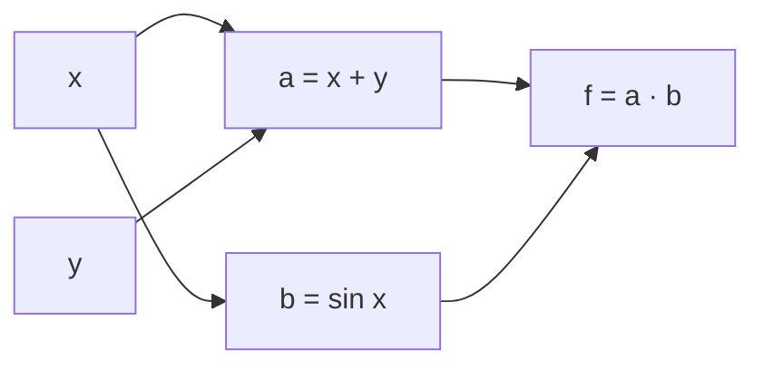

[← Sommaire](../README.md#table-des-matières)

# 5. Calcul différentiel vectoriel

### Dérivation des fonctions d'une variable

Avant de parler de gradients, de jacobiennes ou de retropropagation, il faut comprendre un objet d'une simplicite trompeuse : la **derivee** d'une fonction d'une seule variable. C'est la brique elementaire ; tout le reste du chapitre n'est qu'une generalisation de cette idee a plusieurs dimensions.

#### L'intuition : mesurer une pente

Imaginez que vous roulez en voiture. A chaque instant, le compteur de vitesse vous indique a quelle vitesse vous allez **maintenant**, pas votre vitesse moyenne depuis le depart. La derivee, c'est exactement ce compteur de vitesse : elle vous dit, en un point precis, **a quelle vitesse une quantite change**.

Geometriquement, si on trace la courbe d'une fonction $`f`$, la derivee en un point est la **pente de la tangente** a la courbe en ce point. Une pente positive signifie « ca monte », une pente negative « ca descend », une pente nulle « c'est plat » (sommet, creux ou palier).

> **Le symbole $`f(x)`$.** Ce symbole represente une **machine a transformer les nombres**. On lui donne un nombre $`x`$ (l'entree), et elle recrache un autre nombre note $`f(x)`$ (la sortie). Comme une machine a cafe : vous mettez une capsule (le $`x`$), vous obtenez un cafe (le $`f(x)`$). La lettre $`f`$ est juste le nom de la machine ; on pourrait l'appeler $`g`$, $`h`$ ou « tartempion ».

> **Le symbole $`x`$.** Ce symbole represente un **nombre qui peut varier**, une « case vide » qu'on remplit avec la valeur de notre choix. On l'appelle une variable. Pensez a une boite etiquetee « $`x`$ » dans laquelle on range tantot 2, tantot 3,7, tantot $`-10`$.

#### La limite : s'approcher sans jamais toucher

Pour transformer l'idee de pente en une definition rigoureuse, il faut d'abord l'outil le plus fondamental de l'analyse : la **limite**.

> **Le symbole $`\lim`$ (limite).** Ce symbole represente l'idee de **« vers quoi on se dirige quand on s'approche tout pres »**. Imaginez que vous marchez vers un mur en faisant a chaque pas la moitie du chemin restant : vous ne touchez jamais le mur, mais tout le monde voit bien que vous vous dirigez vers lui. La limite, c'est la position du mur : la valeur visee, meme si on ne l'atteint jamais vraiment.

> **Le symbole $`h \to 0`$.** La fleche $`\to`$ se lit « tend vers ». Donc $`h \to 0`$ veut dire « la petite quantite $`h`$ devient de plus en plus minuscule, se rapprochant de zero, sans jamais valoir exactement zero ». Pensez a $`h`$ comme a une miette de pain qu'on rend de plus en plus petite : $`0,1`$ puis $`0,001`$ puis $`0,000001`$...

Pour mesurer une pente, on prend deux points sur la courbe, separes horizontalement d'une petite distance $`h`$, et on calcule la pente de la droite (la « corde ») qui les relie. Cette pente vaut

```math
\frac{f(x+h) - f(x)}{h}.
```

C'est la variation verticale (la sortie a bouge de $`f(x+h)-f(x)`$) divisee par la variation horizontale ($`h`$). On appelle cela le **taux d'accroissement**. Puis on fait retrecir $`h`$ vers zero : les deux points se rapprochent, la corde se confond avec la tangente, et l'on obtient la pente exacte.

> **Definition (derivee).** Soit $`f: I \to \mathbb{R}`$ definie sur un intervalle ouvert $`I \subseteq \mathbb{R}`$, et $`x \in I`$. On dit que $`f`$ est **derivable** (synonyme : differentiable, pour une fonction d'une variable) en $`x`$ si la limite suivante existe et est finie :
> ```math
> f'(x) \;=\; \frac{\mathrm{d}f}{\mathrm{d}x}(x) \;=\; \lim_{h \to 0} \frac{f(x+h) - f(x)}{h}.
> ```
> Ce nombre $`f'(x)`$ est la **derivee** de $`f`$ en $`x`$.

> **Le symbole $`f'(x)`$ et la notation $`\frac{\mathrm{d}f}{\mathrm{d}x}`$.** Le petit trait $`'`$ (« prime ») sur le $`f`$ signifie « la derivee de ». Donc $`f'`$ se lit « f prime » et designe la fonction-pente. La notation $`\frac{\mathrm{d}f}{\mathrm{d}x}`$ (notation de Leibniz) se lit « d f sur d x » : le « $`\mathrm{d}`$ » evoque une **variation infiniment petite**. C'est litteralement « une toute petite variation de $`f`$ divisee par une toute petite variation de $`x`$ », la version « zoomee a l'infini » du taux d'accroissement.

> **Le symbole $`\mathbb{R}`$.** Ce symbole (un R a double barre) represente l'ensemble de **tous les nombres reels**: tous les points d'une droite continue, des entiers ($`-2`$, $`0`$, $`5`$) aux fractions ($`\tfrac{1}{3}`$) en passant par les irrationnels ($`\sqrt{2}`$, $`\pi`$). Quand on ecrit $`f: I \to \mathbb{R}`$, cela veut dire « $`f`$ prend une entree dans l'intervalle $`I`$ et produit un nombre reel ».

> **Le symbole $`\subseteq`$ (inclusion).** Ce symbole se lit « est inclus dans » : $`I \subseteq \mathbb{R}`$ signifie « tout element de $`I`$ est aussi un element de $`\mathbb{R}`$ », autrement dit $`I`$ est un **morceau** de la droite reelle. C'est l'analogue ensembliste de « le tiroir est range dans la commode ».

> **Remarque (derivabilite et continuite).** Si $`f`$ est derivable en $`x`$, alors $`f`$ est continue en $`x`$ (pas de saut brutal). La reciproque est fausse : la fonction valeur absolue $`f(x)=|x|`$ est continue en $`0`$ mais pas derivable (sa courbe forme un coin, et la pente « a gauche » vaut $`-1`$ tandis que la pente « a droite » vaut $`+1`$; il n'y a pas de tangente unique).

#### Exemple chiffre deroule pas a pas

Calculons la derivee de $`f(x) = x^2`$ au point $`x = 3`$, directement avec la definition.

1. Formez le taux d'accroissement :
```math
\frac{f(3+h) - f(3)}{h} = \frac{(3+h)^2 - 3^2}{h}.
```
2. Developpez $`(3+h)^2 = 9 + 6h + h^2`$:
```math
= \frac{9 + 6h + h^2 - 9}{h} = \frac{6h + h^2}{h}.
```
3. Simplifiez par $`h`$ (licite car $`h \neq 0`$ tant qu'on n'a pas pris la limite) :
```math
= 6 + h.
```
4. Faites tendre $`h \to 0`$:
```math
f'(3) = \lim_{h\to 0} (6 + h) = 6.
```

La pente de la parabole $`x^2`$ au point $`x=3`$ vaut donc $`6`$. En refaisant le calcul pour un $`x`$ quelconque on trouve $`f'(x) = 2x`$, ce qui est le cas particulier $`n=2`$ de la regle generale ci-dessous.

#### Le formulaire des derivees usuelles

En pratique on ne repasse jamais par la limite : on apprend une fois pour toutes les derivees des fonctions de base et des regles de combinaison. Voici les derivees qu'il faut connaitre par coeur.

| Fonction $`f(x)`$ | Derivee $`f'(x)`$ | Condition |
|---|---|---|
| $`c`$ (constante) | $`0`$ |, |
| $`x^n`$ | $`n\,x^{n-1}`$ | $`n`$ entier : tout $`x`$; $`n`$ reel quelconque : $`x>0`$ |
| $`e^x`$ | $`e^x`$ |, |
| $`a^x`$ | $`a^x \ln a`$ | $`a>0`$ |
| $`\ln x`$ | $`1/x`$ | $`x>0`$ |
| $`\sin x`$ | $`\cos x`$ |, |
| $`\cos x`$ | $`-\sin x`$ |, |
| $`\tan x`$ | $`1 + \tan^2 x = 1/\cos^2 x`$ | $`x \neq \tfrac{\pi}{2}+k\pi`$ |
| $`\sqrt{x}`$ | $`\dfrac{1}{2\sqrt{x}}`$ | $`x>0`$ |
| $`1/x`$ | $`-1/x^2`$ | $`x \neq 0`$ |

> **Attention a la condition sur $`x^n`$.** Pour un exposant entier ($`x^2`$, $`x^3`$, $`x^{-1}`$…), la regle $`n x^{n-1}`$ vaut pour tout $`x`$ admissible, y compris les $`x`$ negatifs. Mais des que $`n`$ est un reel non entier (par exemple $`x^{1/2}=\sqrt{x}`$), la fonction $`x^n`$ n'est definie sur les reels que pour $`x>0`$; la regle ne s'applique alors que la. C'est pourquoi $`\sqrt{x}`$ figure separement avec la condition $`x>0`$.

> **Le symbole $`e`$.** Ce symbole represente un nombre special, $`e \approx 2,71828`$, appele **constante d'Euler**. Sa particularite magique : la fonction $`e^x`$ est sa propre derivee. C'est le nombre « naturel » de la croissance continue (interets composes, populations, decroissance radioactive). On le retrouvera partout en apprentissage automatique, notamment dans l'exponentielle de la fonction softmax.

> **Le symbole $`\ln`$.** Ce symbole represente le **logarithme naturel**, la fonction reciproque de l'exponentielle : si $`e^a = b`$, alors $`\ln b = a`$. Intuitivement, $`\ln b`$ repond a la question « a quelle puissance faut-il elever $`e`$ pour obtenir $`b`$ ? ». Il transforme les produits en sommes ($`\ln(ab)=\ln a + \ln b`$), ce qui le rend precieux pour manipuler les vraisemblances en probabilites.

#### Les regles de combinaison

| Regle | Formule |
|---|---|
| Linearite | $`(\alpha f + \beta g)' = \alpha f' + \beta g'`$ |
| Produit | $`(fg)' = f'g + f g'`$ |
| Quotient | $`\left(\dfrac{f}{g}\right)' = \dfrac{f'g - f g'}{g^2}`$ |
| Composition (regle de la chaine) | $`\big(f(g(x))\big)' = f'\!\big(g(x)\big)\cdot g'(x)`$ |

> **Les symboles $`\alpha`$ et $`\beta`$ (alpha, beta).** Ces deux premieres lettres grecques designent ici de simples **nombres fixes** (des constantes) qui ponderent $`f`$ et $`g`$. On les emploie par convention pour des coefficients, exactement comme on dirait « 3 fois ceci plus 2 fois cela ».

La derniere, la **regle de la chaine** (chain rule), est de loin la plus importante de tout le chapitre : c'est elle qui, generalisee aux vecteurs et aux matrices, deviendra la **retropropagation** (backpropagation) qui entraine les reseaux de neurones. Nous lui consacrons un encadre.

> **Definition (regle de la chaine, une variable).** Soit $`g`$ derivable en $`x`$ et $`f`$ derivable en $`g(x)`$. Alors la fonction composee $`h = f \circ g`$, definie par $`h(x) = f(g(x))`$, est derivable en $`x`$ et
> ```math
> h'(x) = f'\big(g(x)\big)\cdot g'(x).
> ```
> **Intuition « engrenages ».** Imaginez deux engrenages enchaines. Si le premier ($`g`$) tourne 3 fois plus vite que sa manivelle, et que le second ($`f`$) tourne 2 fois plus vite que le premier, alors le second tourne $`2 \times 3 = 6`$ fois plus vite que la manivelle. Les vitesses de variation se **multiplient** le long de la chaine. C'est tout le secret.

> **Le symbole $`\circ`$ (composition).** Ce symbole rond represente l'action d'**enchainer deux machines**: $`f \circ g`$ se lit « f rond g » et signifie « applique d'abord $`g`$, puis donne le resultat a $`f`$ ». C'est comme une chaine de montage : la piece passe dans la machine $`g`$, puis le produit sort et entre directement dans la machine $`f`$. Attention a l'ordre : on lit de droite a gauche, la machine la plus a droite agit en premier.

**Exemple chiffre (regle de la chaine).** Derivons $`h(x) = (3x^2 + 1)^5`$.
On pose $`g(x) = 3x^2 + 1`$ (donc $`g'(x) = 6x`$) et $`f(u) = u^5`$ (donc $`f'(u) = 5u^4`$). Alors
```math
h'(x) = f'(g(x))\cdot g'(x) = 5(3x^2+1)^4 \cdot 6x = 30x\,(3x^2+1)^4.
```

#### Application machine learning : la descente de gradient en dimension 1

Tout l'apprentissage automatique repose sur la **minimisation d'une fonction de cout** (loss function). En une dimension, supposons qu'on cherche le minimum d'une fonction $`J(w)`$ qui mesure « a quel point notre modele se trompe » en fonction d'un parametre $`w`$. L'idee de la **descente de gradient** (gradient descent) est limpide : la derivee $`J'(w)`$ indique la pente ; pour descendre vers le minimum, on fait un pas dans le sens **oppose** a la pente.

```math
w_{t+1} = w_t - \eta\, J'(w_t).
```

> **Le symbole $`\eta`$ (eta).** Cette lettre grecque represente le **taux d'apprentissage** (learning rate) : la taille du pas qu'on fait a chaque iteration. Trop grand, on saute par-dessus le minimum et on diverge ; trop petit, on avance a pas de fourmi et l'apprentissage est interminable. C'est le « reglage de l'amortisseur » de l'optimisation.

> **Le symbole d'indice $`w_t`$.** Le petit $`t`$ en bas de $`w`$ represente le **numero de l'etape** (l'instant, le « tour de boucle »). Ainsi $`w_0`$ est la valeur de depart, $`w_1`$ apres un pas, $`w_2`$ apres deux pas, etc. Pensez aux numeros de page d'un carnet : chaque page note ou l'on en est.

Illustrons sur $`J(w) = (w-4)^2`$, dont le minimum evident est en $`w=4`$. La derivee est $`J'(w) = 2(w-4)`$.

```python
import numpy as np

def J(w):       return (w - 4.0) ** 2
def grad_J(w):  return 2.0 * (w - 4.0)

w = 0.0          # point de depart
eta = 0.1        # taux d'apprentissage
for t in range(25):
    g = grad_J(w)
    w = w - eta * g
    print(f"t={t:2d}  w={w:.5f}  J={J(w):.5f}  J'={g:+.5f}")

print("Minimum trouve :", round(w, 5))   # -> proche de 4.0
```

A chaque tour, $`w`$ se rapproche de $`4`$ et la valeur de cout diminue. On vient d'executer, en miniature, l'algorithme qui entraine la quasi-totalite des modeles modernes, il ne reste qu'a le generaliser a des milliards de parametres, ce qui exige de passer du nombre $`w`$ a un **vecteur** de parametres. D'ou la suite.

---

### Dérivées partielles et gradients

Une fonction de cout reelle ne depend pas d'un seul parametre mais de milliers, de millions, voire de milliards. Il nous faut donc deriver des fonctions **a plusieurs entrees**. C'est exactement l'objet des derivees partielles et du gradient.

#### L'intuition : la pente dans chaque direction

Considerons une fonction de deux variables, $`f(x_1, x_2)`$. Sa courbe n'est plus une ligne dans le plan, mais une **surface** dans l'espace : un paysage de collines et de vallees, ou l'altitude au-dessus du point $`(x_1, x_2)`$ vaut $`f(x_1, x_2)`$.

Sur un paysage, la question « quelle est la pente ? » n'a pas une seule reponse : tout depend de la **direction** vers laquelle on regarde ! La pente vers l'est n'est pas la meme que vers le nord. L'idee de la **derivee partielle** est de fixer toutes les directions sauf une, et de ne mesurer la pente que dans cette direction-la.

> **Le symbole $`\partial`$ (« d rond », derivee partielle).** Ce symbole, un « d » arrondi, represente une derivee **partielle**: on derive par rapport a une seule variable en **gelant** toutes les autres comme si c'etaient des constantes. Imaginez que vous etes sur une colline et que vous ne vous autorisez a marcher **que vers l'est** (variable $`x_1`$), en vous interdisant tout pas vers le nord (variable $`x_2`$ figee) : la pente que vous ressentez sous vos pieds, c'est $`\frac{\partial f}{\partial x_1}`$. Le « rond » sert juste a rappeler « attention, il y a d'autres variables qu'on a mises en pause ».

> **Definition (derivee partielle).** Soit $`f: \mathbb{R}^n \to \mathbb{R}`$ et $`\mathbf{x} = (x_1, \dots, x_n)`$. La **derivee partielle** de $`f`$ par rapport a $`x_i`$ est
> ```math
> \frac{\partial f}{\partial x_i}(\mathbf{x}) = \lim_{h \to 0} \frac{f(x_1,\dots,x_i + h,\dots,x_n) - f(x_1,\dots,x_i,\dots,x_n)}{h},
> ```
> c'est-a-dire la derivee ordinaire de la fonction d'une variable $`t \mapsto f(x_1,\dots,t,\dots,x_n)`$, les autres coordonnees etant tenues constantes.

> **Le symbole $`\mathbb{R}^n`$.** Ce symbole represente l'ensemble des **listes ordonnees de $`n`$ nombres reels**, c'est-a-dire les vecteurs a $`n`$ coordonnees. $`\mathbb{R}^2`$ c'est le plan (couples $`(x_1,x_2)`$), $`\mathbb{R}^3`$ l'espace, et $`\mathbb{R}^{1000}`$ un espace a mille dimensions qu'on ne peut pas dessiner mais qu'on manipule avec les memes regles. Le petit $`n`$ en exposant compte le nombre de cases dans la liste.

> **Le symbole $`\mathbf{x}`$ en gras.** Quand on ecrit $`\mathbf{x}`$ en **gras**, ce n'est plus un seul nombre mais un **vecteur**: un paquet de plusieurs nombres ranges en colonne, $`\mathbf{x} = (x_1, x_2, \dots, x_n)`$. C'est la difference entre un grain de riz ($`x`$, un scalaire) et le sachet entier ($`\mathbf{x}`$, le vecteur). Le petit indice $`i`$ dans $`x_i`$ designe la $`i`$-eme case du sachet.

> **Le symbole $`\mapsto`$ (« applique sur »).** A ne pas confondre avec $`\to`$. La fleche $`\to`$ relie des **ensembles** ($`f: \mathbb{R}^n \to \mathbb{R}`$: « de tel ensemble vers tel ensemble »), tandis que $`\mapsto`$ relie un **element a son image** ($`t \mapsto t^2`$: « a $`t`$ on associe $`t^2`$ »). La premiere decrit la machine en gros, la seconde decrit la regle de calcul precise.

#### Le gradient : empiler toutes les pentes

Si l'on rassemble toutes les derivees partielles dans un vecteur, on obtient le **gradient**. C'est l'objet central de toute l'optimisation.

> **Le symbole $`\nabla`$ (nabla, le gradient).** Ce symbole en forme de triangle pointe vers le bas se lit « nabla ». $`\nabla f`$ represente le **vecteur des pentes dans toutes les directions a la fois**. Reprenons la colline : en un point donne, $`\nabla f`$ est une fleche posee au sol qui **pointe dans la direction de la montee la plus raide**, et dont la **longueur** indique a quel point ca grimpe fort. Si vous laissez tomber une bille, elle roule exactement dans la direction $`-\nabla f`$ (l'oppose du gradient). C'est la boussole de la descente de gradient.

> **Definition (gradient).** Pour $`f: \mathbb{R}^n \to \mathbb{R}`$ differentiable, le **gradient** de $`f`$ en $`\mathbf{x}`$ est le vecteur des derivees partielles :
> ```math
> \nabla f(\mathbf{x}) = \begin{bmatrix} \dfrac{\partial f}{\partial x_1}(\mathbf{x}) \\[2mm] \dfrac{\partial f}{\partial x_2}(\mathbf{x}) \\[1mm] \vdots \\[1mm] \dfrac{\partial f}{\partial x_n}(\mathbf{x}) \end{bmatrix} \in \mathbb{R}^n.
> ```
> Sa transposee $`\nabla f(\mathbf{x})^\top = \big[\tfrac{\partial f}{\partial x_1}, \dots, \tfrac{\partial f}{\partial x_n}\big]`$, vecteur ligne, represente la **differentielle** de $`f`$ au point $`\mathbf{x}`$ (l'application lineaire qui approche le mieux la variation de $`f`$). C'est aussi la matrice jacobienne de $`f`$ vue comme fonction a une seule sortie : une matrice $`1\times n`$.

> **Convention de disposition (layout).** Il existe deux conventions opposees pour ranger les derivees : le *denominator layout* (gradient en colonne, le notre par defaut) et le *numerator layout* (gradient en ligne). Les deux sont corrects ; ils different par une transposition. Le piege classique consiste a melanger les deux dans un meme calcul. **Choisissez-en une et tenez-vous-y.** Dans ce chapitre, le gradient $`\nabla f`$ d'une fonction scalaire est un **vecteur colonne**.

#### Derivee directionnelle et differentiabilite

Le gradient encode bien plus que les pentes selon les axes : il donne la pente dans **n'importe quelle** direction.

> **Definition (derivee directionnelle).** Pour un vecteur unitaire $`\mathbf{u} \in \mathbb{R}^n`$ ($`\|\mathbf{u}\| = 1`$), la derivee directionnelle de $`f`$ en $`\mathbf{x}`$ dans la direction $`\mathbf{u}`$ est
> ```math
> D_{\mathbf{u}} f(\mathbf{x}) = \lim_{h \to 0} \frac{f(\mathbf{x} + h\mathbf{u}) - f(\mathbf{x})}{h} = \nabla f(\mathbf{x})^\top \mathbf{u} = \langle \nabla f(\mathbf{x}), \mathbf{u}\rangle.
> ```

> **Le symbole $`\|\cdot\|`$ (norme, la « longueur » d'un vecteur).** Les deux barres verticales autour d'un vecteur, $`\|\mathbf{u}\|`$, se lisent « norme de $`\mathbf{u}`$ » et representent sa **longueur**, exactement comme la longueur d'une fleche tracee sur une feuille. On la calcule (norme euclidienne, vue au chapitre 4) en mettant chaque coordonnee au carre, en additionnant, puis en prenant la racine : $`\|\mathbf{u}\| = \sqrt{u_1^2 + \dots + u_n^2}`$. Dire qu'un vecteur est **unitaire**, c'est dire que sa longueur vaut exactement $`1`$ ($`\|\mathbf{u}\|=1`$) : il indique alors une **direction** pure, sans information de taille, comme l'aiguille d'une boussole qui pointe quelque part mais a toujours la meme longueur.

> **Le symbole $`\langle\cdot,\cdot\rangle`$ (produit scalaire).** Vu au chapitre 4, c'est l'operation qui mesure « a quel point deux vecteurs pointent dans le meme sens » : $`\langle\mathbf a,\mathbf b\rangle = \mathbf a^\top\mathbf b = \sum_i a_i b_i`$. On le rappelle ici parce qu'il fait le pont entre le gradient (un vecteur) et la pente (un nombre). Les deux ecritures $`\nabla f^\top\mathbf u`$ et $`\langle\nabla f,\mathbf u\rangle`$ designent la meme chose.

Cette egalite a une consequence geometrique fondamentale. Par l'inegalite de Cauchy-Schwarz (vue au chapitre 4),
```math
-\|\nabla f(\mathbf{x})\| \;\le\; D_{\mathbf{u}} f(\mathbf{x}) = \langle \nabla f(\mathbf{x}), \mathbf{u}\rangle \;\le\; \|\nabla f(\mathbf{x})\|\,\|\mathbf{u}\| = \|\nabla f(\mathbf{x})\|,
```
la borne superieure etant atteinte lorsque $`\mathbf{u}`$ est colineaire et de meme sens que $`\nabla f(\mathbf{x})`$, et la borne inferieure lorsque $`\mathbf{u}`$ pointe dans le sens oppose. **Le gradient pointe donc dans la direction de plus forte croissance** (sa norme est la pente maximale), et son oppose $`-\nabla f`$ dans celle de plus forte decroissance. C'est la justification rigoureuse de la descente de gradient.

> **Definition (differentiabilite).** $`f: \mathbb{R}^n \to \mathbb{R}`$ est **differentiable** en $`\mathbf{x}`$ s'il existe un vecteur $`\mathbf{g}`$ tel que
> ```math
> f(\mathbf{x} + \mathbf{h}) = f(\mathbf{x}) + \mathbf{g}^\top \mathbf{h} + o(\|\mathbf{h}\|), \qquad \text{quand } \mathbf{h} \to \mathbf{0}.
> ```
> Le vecteur $`\mathbf{g}`$ est alors unique et vaut $`\nabla f(\mathbf{x})`$. Cela signifie que, **localement, $`f`$ ressemble a une fonction affine** (un plan tangent).

> **Le symbole $`o(\cdot)`$ (petit o de Landau).** La notation $`o(\|\mathbf{h}\|)`$ represente un terme d'erreur **negligeable** devant $`\|\mathbf{h}\|`$ quand $`\mathbf{h}`$ devient minuscule, c'est-a-dire $`\frac{o(\|\mathbf{h}\|)}{\|\mathbf{h}\|} \to 0`$. Imaginez la poussiere a cote d'un grain de sable : quand on zoome assez, la poussiere disparait completement par rapport au grain. C'est le « reste qui s'efface plus vite que la quantite de reference ».

> **Le symbole $`O(\cdot)`$ (grand O de Landau).** A distinguer du petit o. La notation $`O(\|\mathbf{h}\|)`$ designe un terme qui reste **du meme ordre de grandeur** que $`\|\mathbf{h}\|`$ (borne par un multiple de $`\|\mathbf{h}\|`$), sans forcement devenir negligeable. Image : le petit o, c'est la poussiere qui disparait ; le grand O, c'est un caillou qui reste proportionnel au grain de reference. On s'en sert plus bas dans la preuve de la regle de la chaine.

> **Piege (l'existence des partielles ne suffit pas).** On peut avoir toutes les derivees partielles existantes en un point sans que $`f`$ y soit differentiable (exemple classique : $`f(x,y) = \frac{xy}{x^2+y^2}`$ prolongee par $`0`$ a l'origine). En revanche, si les partielles existent **et sont continues** au voisinage de $`\mathbf{x}`$, alors $`f`$ est differentiable en $`\mathbf{x}`$ (on dit que $`f`$ est de classe $`\mathcal{C}^1`$). En pratique, en apprentissage automatique, les fonctions sont presque toujours $`\mathcal{C}^1`$ par morceaux.

#### Exemple chiffre deroule pas a pas

Soit $`f(x_1, x_2) = x_1^2 x_2 + 3x_2`$. Calculons son gradient au point $`(2, 1)`$.

**Derivee partielle par rapport a $`x_1`$** (on traite $`x_2`$ comme une constante) :
```math
\frac{\partial f}{\partial x_1} = 2 x_1 x_2 + 0 = 2 x_1 x_2.
```
**Derivee partielle par rapport a $`x_2`$** (on traite $`x_1`$ comme une constante) :
```math
\frac{\partial f}{\partial x_2} = x_1^2 + 3.
```
Donc le gradient general et son evaluation :
```math
\nabla f(x_1,x_2) = \begin{bmatrix} 2x_1 x_2 \\ x_1^2 + 3 \end{bmatrix}, \qquad \nabla f(2,1) = \begin{bmatrix} 2\cdot 2 \cdot 1 \\ 2^2 + 3 \end{bmatrix} = \begin{bmatrix} 4 \\ 7 \end{bmatrix}.
```
Au point $`(2,1)`$, pour grimper le plus vite, il faut avancer dans la direction $`\begin{bmatrix}4\\7\end{bmatrix}`$; la pente y vaut $`\|\nabla f(2,1)\| = \sqrt{16+49} = \sqrt{65} \approx 8,06`$.

#### Verification numerique : les differences finies

On peut toujours verifier un gradient calcule a la main par une approximation numerique, la **difference finie centree** (central finite difference), qui revient a appliquer la definition avec un $`h`$ petit mais non nul :
```math
\frac{\partial f}{\partial x_i}(\mathbf{x}) \approx \frac{f(\mathbf{x} + h\,\mathbf{e}_i) - f(\mathbf{x} - h\,\mathbf{e}_i)}{2h}.
```

> **Le symbole $`\mathbf{e}_i`$.** Ce symbole represente le $`i`$-eme **vecteur de base canonique**: une liste de zeros partout, sauf un $`1`$ a la position $`i`$. Par exemple dans $`\mathbb{R}^3`$, $`\mathbf{e}_2 = (0,1,0)`$. Il sert d'« interrupteur » qui n'allume qu'une seule direction : ajouter $`h\,\mathbf{e}_i`$ a $`\mathbf{x}`$ ne modifie que la coordonnee $`i`$.

```python
import numpy as np

def f(x):
    return x[0]**2 * x[1] + 3 * x[1]

def grad_analytique(x):
    return np.array([2 * x[0] * x[1], x[0]**2 + 3.0])

def grad_numerique(f, x, h=1e-5):
    g = np.zeros_like(x, dtype=float)
    for i in range(len(x)):
        e = np.zeros_like(x, dtype=float); e[i] = h
        g[i] = (f(x + e) - f(x - e)) / (2 * h)
    return g

x = np.array([2.0, 1.0])
print("analytique :", grad_analytique(x))   # [4. 7.]
print("numerique  :", grad_numerique(f, x)) # ~[4. 7.]
```

> **La verification par differences finies (`gradcheck`) en pratique.** C'est le reflexe pour valider une implementation de gradient faite a la main. Mais en production on ne calcule presque plus aucun gradient manuellement : les bibliotheques de differentiation automatique (JAX, PyTorch) le font exactement, a la precision machine, et infiniment plus vite que les differences finies, lesquelles souffrent du compromis entre erreur de troncature (si $`h`$ trop grand) et erreur d'arrondi (si $`h`$ trop petit). On garde `gradcheck` pour deboguer une couche personnalisee, pas pour la production.

#### Application machine learning : la regression lineaire

Soit le probleme des moindres carres : on veut ajuster $`\mathbf{w} \in \mathbb{R}^n`$ pour que $`X\mathbf{w}`$ approche au mieux $`\mathbf{y}`$, en minimisant
```math
J(\mathbf{w}) = \tfrac{1}{2}\,\|X\mathbf{w} - \mathbf{y}\|^2.
```
Nous montrerons plus loin (section sur les identites) que
```math
\nabla_{\mathbf{w}} J(\mathbf{w}) = X^\top (X\mathbf{w} - \mathbf{y}).
```
La descente de gradient s'ecrit alors $`\mathbf{w} \leftarrow \mathbf{w} - \eta\, X^\top(X\mathbf{w}-\mathbf{y})`$: exactement la version vectorielle de l'algorithme en dimension 1 vu plus haut, ou le simple nombre $`w`$ est devenu le vecteur $`\mathbf{w}`$.

> **Le symbole $`\leftarrow`$ (affectation).** Cette fleche vers la gauche ne signifie pas « egal » mais « devient » : $`\mathbf{w} \leftarrow \mathbf{w} - \eta\,\nabla J`$ se lit « remplace l'ancienne valeur de $`\mathbf{w}`$ par la nouvelle ». C'est l'equivalent mathematique de la ligne de code `w = w - eta * grad`: on ecrase la case memoire.

---

### Gradients de fonctions à valeurs vectorielles

Jusqu'ici la sortie etait un seul nombre (fonction scalaire). Mais une couche de reseau de neurones transforme un vecteur en un **autre vecteur**. Il faut donc deriver des fonctions $`\mathbf{f}: \mathbb{R}^n \to \mathbb{R}^m`$. L'objet qui generalise le gradient est alors la **matrice jacobienne**.

#### L'intuition : un tableau de toutes les sensibilites

Une fonction vectorielle $`\mathbf{f}`$ a $`m`$ sorties, chacune dependant des $`n`$ entrees. La question naturelle est : « si je bouge l'entree $`j`$, de combien bouge la sortie $`i`$ ? ». Il y a $`m \times n`$ telles questions, et leurs reponses se rangent naturellement dans un **tableau** (une matrice) : c'est la jacobienne.

> **Le symbole $`\mathbf{f}`$ (fonction en gras) et $`\mathbb{R}^n \to \mathbb{R}^m`$.** Le gras sur $`\mathbf{f}`$ rappelle que la **sortie est un vecteur**, pas un seul nombre. La notation $`\mathbb{R}^n \to \mathbb{R}^m`$ se lit « prend une entree a $`n`$ cases, rend une sortie a $`m`$ cases ». Pensez a une console de mixage : $`n`$ boutons d'entree, $`m`$ aiguilles de sortie ; chaque bouton peut influencer plusieurs aiguilles a la fois.

> **Definition (matrice jacobienne).** Soit $`\mathbf{f}: \mathbb{R}^n \to \mathbb{R}^m`$ differentiable, de composantes $`\mathbf{f}(\mathbf{x}) = \big(f_1(\mathbf{x}), \dots, f_m(\mathbf{x})\big)`$. La **matrice jacobienne** est la matrice $`m \times n`$ des derivees partielles :
> ```math
> J_{\mathbf{f}}(\mathbf{x}) = \frac{\partial \mathbf{f}}{\partial \mathbf{x}} = \begin{bmatrix} \dfrac{\partial f_1}{\partial x_1} & \cdots & \dfrac{\partial f_1}{\partial x_n} \\[2mm] \vdots & \ddots & \vdots \\[1mm] \dfrac{\partial f_m}{\partial x_1} & \cdots & \dfrac{\partial f_m}{\partial x_n} \end{bmatrix} \in \mathbb{R}^{m \times n}.
> ```
> La ligne $`i`$ est la transposee du gradient de la $`i`$-eme composante : $`\big(\nabla f_i\big)^\top`$.

> **Le symbole $`J_{\mathbf{f}}`$ (matrice jacobienne).** Ce symbole represente le **tableau complet des sensibilites** de toutes les sorties par rapport a toutes les entrees. Chaque case $`(i,j)`$ repond a « de combien varie la sortie $`i`$ quand on pousse l'entree $`j`$ ? ». Pensez a un tableau de bord d'avion : en lignes les instruments (sorties), en colonnes les commandes (entrees), et a l'intersection l'effet d'une commande sur un instrument. Quand $`m=1`$, la jacobienne se reduit a une seule ligne : c'est le gradient transpose.

> **Le symbole $`\in \mathbb{R}^{m \times n}`$.** Ce symbole indique les **dimensions** d'une matrice : $`m`$ lignes et $`n`$ colonnes. Le $`\times`$ ici ne veut pas dire « multiplier » mais « par » (comme « une feuille 21 par 29,7 »). Retenir l'ordre **(lignes, colonnes)** est vital pour ne pas se tromper dans les produits matriciels.

#### Cas particuliers a memoriser

Beaucoup de fonctions courantes ont des jacobiennes tres simples ; les connaitre evite des calculs.

| Fonction $`\mathbf{f}(\mathbf{x})`$ | Jacobienne $`\dfrac{\partial \mathbf{f}}{\partial \mathbf{x}}`$ | Forme |
|---|---|---|
| $`A\mathbf{x}`$ (application lineaire) | $`A`$ | $`m\times n`$ |
| $`\mathbf{x}`$ (identite) | $`I_n`$ | $`n\times n`$ |
| $`\mathbf{a} \odot \mathbf{x}`$ (produit terme a terme) | $`\mathrm{diag}(\mathbf{a})`$ | $`n\times n`$ |
| $`\sigma(\mathbf{x})`$ (activation appliquee composante par composante) | $`\mathrm{diag}\big(\sigma'(x_1),\dots,\sigma'(x_n)\big)`$ | $`n\times n`$ |

> **Le symbole $`I_n`$ (matrice identite).** Vue au chapitre 2, c'est la matrice carree $`n\times n`$ avec des $`1`$ sur la diagonale et des $`0`$ ailleurs ; elle laisse tout vecteur inchange ($`I_n\mathbf{x}=\mathbf{x}`$). Rien d'etonnant donc a ce que la jacobienne de la fonction identite ($`\mathbf x\mapsto\mathbf x`$) soit precisement $`I_n`$: bouger une entree d'un cran bouge la sortie correspondante d'exactement un cran, sans melange.

> **Le symbole $`\mathrm{diag}(\cdot)`$.** Ce symbole construit une **matrice diagonale**: on prend une liste de nombres et on les pose sur la diagonale principale, des zeros partout ailleurs. C'est comme un standard telephonique ou chaque ligne ne parle qu'a elle-meme : l'entree $`j`$ n'affecte que la sortie $`j`$. Cela arrive des qu'une fonction agit « composante par composante » sans melanger les coordonnees.

> **Le symbole $`\odot`$ (produit de Hadamard).** Ce symbole (un point dans un cercle) represente la multiplication **terme a terme** de deux vecteurs de meme taille : $`(\mathbf{a}\odot\mathbf{x})_i = a_i x_i`$. A ne pas confondre avec le produit scalaire (qui additionne tout en un seul nombre). Ici on garde un vecteur : case par case, on multiplie les vis-a-vis.

> **Le terme « fonction d'activation appliquee composante par composante ».** Une **fonction d'activation** $`\sigma`$ est une petite fonction qui prend un nombre et en rend un autre (par exemple la sigmoide $`\sigma(z)=\frac{1}{1+e^{-z}}`$, definie plus loin) ; les reseaux de neurones s'en servent pour « plier » leurs calculs et leur permettre d'apprendre des choses non lineaires. Dire qu'on l'applique **composante par composante** signifie qu'on la passe sur chaque case du vecteur **separement**, sans melanger les cases entre elles : $`\sigma(\mathbf{x}) = \big(\sigma(x_1),\dots,\sigma(x_n)\big)`$. C'est comme appliquer le meme filtre photo a chaque pixel d'une image, chacun de son cote. Comme chaque sortie ne depend que de son entree, la jacobienne est **diagonale**: la case $`(i,j)`$ est nulle des que $`i\neq j`$, et la diagonale contient les derivees individuelles $`\sigma'(x_i)`$.

#### Exemple chiffre deroule pas a pas

Soit $`\mathbf{f}: \mathbb{R}^2 \to \mathbb{R}^2`$ definie par
```math
\mathbf{f}(x_1, x_2) = \begin{bmatrix} f_1 \\ f_2 \end{bmatrix} = \begin{bmatrix} x_1^2 + x_2 \\ \sin(x_1)\,x_2 \end{bmatrix}.
```
On calcule les quatre partielles :
```math
\frac{\partial f_1}{\partial x_1} = 2x_1, \quad \frac{\partial f_1}{\partial x_2} = 1, \quad \frac{\partial f_2}{\partial x_1} = \cos(x_1)\,x_2, \quad \frac{\partial f_2}{\partial x_2} = \sin(x_1).
```
D'ou la jacobienne, puis son evaluation en $`(0, 3)`$:
```math
J_{\mathbf{f}}(x_1,x_2) = \begin{bmatrix} 2x_1 & 1 \\ \cos(x_1)\,x_2 & \sin(x_1) \end{bmatrix}, \qquad J_{\mathbf{f}}(0,3) = \begin{bmatrix} 0 & 1 \\ 3 & 0 \end{bmatrix}.
```

#### La regle de la chaine multivariee

C'est le coeur du chapitre. Lorsqu'on compose deux fonctions vectorielles, **les jacobiennes se multiplient** (au sens du produit matriciel), generalisant exactement la regle des engrenages.

> **Theoreme (regle de la chaine multivariee).** Soient $`\mathbf{g}: \mathbb{R}^n \to \mathbb{R}^p`$ differentiable en $`\mathbf{x}`$ et $`\mathbf{f}: \mathbb{R}^p \to \mathbb{R}^m`$ differentiable en $`\mathbf{g}(\mathbf{x})`$. Alors $`\mathbf{h} = \mathbf{f} \circ \mathbf{g}`$ est differentiable en $`\mathbf{x}`$ et sa jacobienne est le **produit matriciel** des jacobiennes :
> ```math
> J_{\mathbf{h}}(\mathbf{x}) = J_{\mathbf{f}}\big(\mathbf{g}(\mathbf{x})\big)\, J_{\mathbf{g}}(\mathbf{x}).
> ```
> Verification des dimensions : $`(m\times p)\cdot(p\times n) = m\times n`$. Tout colle. L'ordre est crucial : la jacobienne de la fonction **externe** ($`\mathbf{f}`$) est a gauche.

**Demonstration (esquisse rigoureuse).** Par differentiabilite de $`\mathbf{g}`$ en $`\mathbf{x}`$: $`\mathbf{g}(\mathbf{x}+\mathbf{h}) = \mathbf{g}(\mathbf{x}) + J_{\mathbf{g}}(\mathbf{x})\mathbf{h} + o(\|\mathbf{h}\|)`$. Posons $`\mathbf{k} = J_{\mathbf{g}}(\mathbf{x})\mathbf{h} + o(\|\mathbf{h}\|)`$, de sorte que $`\|\mathbf{k}\| = O(\|\mathbf{h}\|)`$. Par differentiabilite de $`\mathbf{f}`$ en $`\mathbf{g}(\mathbf{x})`$:
```math
\mathbf{f}(\mathbf{g}(\mathbf{x})+\mathbf{k}) = \mathbf{f}(\mathbf{g}(\mathbf{x})) + J_{\mathbf{f}}(\mathbf{g}(\mathbf{x}))\mathbf{k} + o(\|\mathbf{k}\|).
```
En substituant $`\mathbf{k}`$ et en regroupant, les termes en $`o`$ restent en $`o(\|\mathbf{h}\|)`$ (puisque $`\|\mathbf{k}\|=O(\|\mathbf{h}\|)`$), et le terme lineaire en $`\mathbf{h}`$ est $`J_{\mathbf{f}}(\mathbf{g}(\mathbf{x}))\,J_{\mathbf{g}}(\mathbf{x})\,\mathbf{h}`$. Par unicite de la differentielle, c'est la jacobienne cherchee. $`\blacksquare`$

> **Le symbole $`\blacksquare`$.** Ce petit carre plein marque la **fin d'une demonstration**. C'est l'equivalent ecrit de « CQFD » (ce qu'il fallait demontrer) : il dit « voila, la preuve est terminee ».

**Exemple chiffre (chaine matricielle).** Reprenons $`\mathbf{f}`$ ci-dessus et posons $`\mathbf{g}(t) = (t, t^2)`$ avec $`\mathbf{g}: \mathbb{R} \to \mathbb{R}^2`$, donc $`J_{\mathbf{g}}(t) = \begin{bmatrix}1\\2t\end{bmatrix}`$. En $`t=0`$: $`\mathbf{g}(0) = (0,0)`$, et
```math
J_{\mathbf{f}}(0,0) = \begin{bmatrix}0 & 1\\ 0 & 0\end{bmatrix}, \qquad J_{\mathbf{h}}(0) = J_{\mathbf{f}}(0,0)\,J_{\mathbf{g}}(0) = \begin{bmatrix}0 & 1\\ 0 & 0\end{bmatrix}\begin{bmatrix}1\\0\end{bmatrix} = \begin{bmatrix}0\\0\end{bmatrix}.
```

#### Application machine learning : la jacobienne de softmax

La fonction **softmax** transforme un vecteur de scores en une distribution de probabilites :
```math
\mathrm{softmax}(\mathbf{z})_i = \frac{e^{z_i}}{\sum_{k=1}^{n} e^{z_k}} =: p_i.
```

> **Le symbole $`\sum`$ (somme sigma).** Cette grande lettre grecque represente une **boucle qui additionne**. $`\sum_{k=1}^{n} a_k`$ se lit « somme, pour $`k`$ allant de 1 a $`n`$, des $`a_k`$ » et vaut $`a_1 + a_2 + \dots + a_n`$. Pensez a une caisse enregistreuse qui scanne les articles un a un et cumule le total. Le « $`k=1`$ » dessous est le point de depart, le « $`n`$ » dessus l'arrivee.

> **Le symbole $`=:`$ (definition).** Les deux points accoles a l'egalite signifient « ceci **definit** le membre du cote des deux points ». Ainsi $`\dots =: p_i`$ se lit « et l'on appelle desormais cette quantite $`p_i`$ ». C'est un raccourci pour baptiser un resultat sans ouvrir une phrase « ou l'on pose… ».

Sa jacobienne a une forme remarquable, omnipresente en classification :
```math
\frac{\partial p_i}{\partial z_j} = p_i(\delta_{ij} - p_j), \qquad\text{soit}\qquad J = \mathrm{diag}(\mathbf{p}) - \mathbf{p}\,\mathbf{p}^\top.
```

> **Le symbole $`\delta_{ij}`$ (delta de Kronecker).** Ce symbole vaut $`1`$ si $`i=j`$ et $`0`$ sinon. C'est un **detecteur d'egalite**: il s'allume (1) quand les deux indices sont identiques, reste eteint (0) sinon. Pratique pour ecrire « le terme diagonal » d'une formule en une seule expression compacte.

```python
import numpy as np

def softmax(z):
    z = z - z.max()
    e = np.exp(z)
    return e / e.sum()

def jacobienne_softmax(z):
    p = softmax(z)
    return np.diag(p) - np.outer(p, p)

z = np.array([1.0, 2.0, 0.5])
print(jacobienne_softmax(z))
```

---

### Gradients de matrices

Nous montons d'un cran. Les parametres d'un reseau ne sont pas seulement des vecteurs : ce sont des **matrices** de poids. Il faut donc savoir deriver par rapport a une matrice, et deriver des objets qui sont eux-memes des matrices. C'est le domaine du **calcul matriciel** (matrix calculus).

#### L'intuition : ranger les derivees comme l'objet d'origine

La regle d'or est simple : **la derivee d'un objet par rapport a un autre se range en suivant la forme des deux objets**. La derivee d'un scalaire $`y`$ par rapport a une matrice $`W \in \mathbb{R}^{p\times q}`$ est une matrice **de meme forme** $`p \times q`$, ou la case $`(i,j)`$ contient $`\partial y / \partial W_{ij}`$.

> **Definition (gradient par rapport a une matrice).** Pour $`y = f(W)`$ scalaire avec $`W \in \mathbb{R}^{p\times q}`$,
> ```math
> \frac{\partial y}{\partial W} \in \mathbb{R}^{p\times q}, \qquad \left(\frac{\partial y}{\partial W}\right)_{ij} = \frac{\partial y}{\partial W_{ij}}.
> ```
> On note souvent ce gradient $`\nabla_W f`$.

> **Le symbole $`W_{ij}`$ (entree d'une matrice).** Les deux indices reperent une **case dans une grille**: $`W_{ij}`$ est le nombre situe a la ligne $`i`$ et a la colonne $`j`$ de la matrice $`W`$. Comme une bataille navale : la lettre donne la ligne, le chiffre la colonne. Premier indice = ligne, deuxieme = colonne, toujours dans cet ordre.

#### La differentielle, methode reine

Pour les fonctions matricielles, calculer case par case devient vite ingerable. La methode professionnelle consiste a travailler avec la **differentielle** $`\mathrm{d}y`$ et a la mettre sous une forme canonique pour lire le gradient directement.

> **Principe (identification du gradient).** Pour une fonction scalaire $`y = f(W)`$, on calcule la differentielle et on l'ecrit sous la forme
> ```math
> \mathrm{d}y = \mathrm{tr}\!\big(G^\top\, \mathrm{d}W\big) \quad\Longrightarrow\quad \frac{\partial y}{\partial W} = G.
> ```
> Le facteur $`G`$ qui apparait en regard de $`\mathrm{d}W`$ dans la trace **est** le gradient. Cela marche parce que $`\mathrm{tr}(A^\top B) = \sum_{ij} A_{ij}B_{ij}`$ est le produit scalaire des matrices.

> **Le symbole $`\mathrm{tr}(\cdot)`$ (trace).** Ce symbole represente la **somme des elements diagonaux** d'une matrice carree : $`\mathrm{tr}(A) = \sum_i A_{ii}`$. Imaginez la diagonale d'un damier de haut-gauche a bas-droite : on additionne juste les cases sur cette ligne. La trace possede une propriete reine : $`\mathrm{tr}(ABC) = \mathrm{tr}(BCA) = \mathrm{tr}(CAB)`$ (invariance par permutation circulaire), qu'on utilise sans cesse.

> **Le symbole $`A^\top`$ (transposee).** Ce petit T en exposant represente la **matrice retournee**: on echange lignes et colonnes, $`(A^\top)_{ij} = A_{ji}`$. C'est comme basculer un tableau autour de sa diagonale, ou retourner une carte le long d'un axe. Un vecteur colonne devient une ligne, et inversement.

> **Le symbole $`\mathrm{d}W`$ (differentielle d'une matrice).** Ce symbole represente une **variation infinitesimale de toute la matrice** $`W`$ a la fois : chaque case bouge d'un tout petit peu. C'est la version « matrice » du $`\mathrm{d}x`$ vu au debut. La differentielle $`\mathrm{d}y`$ exprime comment la sortie $`y`$ reagit a cette petite perturbation $`\mathrm{d}W`$.

#### Identites matricielles fondamentales

Le tableau suivant rassemble les derivees matricielles les plus utilisees (convention denominator layout, gradient de meme forme que la variable de derivation).

| Expression scalaire $`y`$ | Gradient $`\partial y / \partial \cdot`$ |
|---|---|
| $`\mathbf{a}^\top \mathbf{x}`$ | $`\partial/\partial\mathbf{x} = \mathbf{a}`$ |
| $`\mathbf{x}^\top A\,\mathbf{x}`$ | $`\partial/\partial\mathbf{x} = (A + A^\top)\mathbf{x}`$ |
| $`\mathbf{x}^\top A\,\mathbf{x}`$, $`A`$ symetrique | $`\partial/\partial\mathbf{x} = 2A\mathbf{x}`$ |
| $`\mathrm{tr}(W^\top A)`$ | $`\partial/\partial W = A`$ |
| $`\mathrm{tr}(AWB)`$ | $`\partial/\partial W = A^\top B^\top`$ |
| $`\mathbf{a}^\top W \mathbf{b}`$ | $`\partial/\partial W = \mathbf{a}\,\mathbf{b}^\top`$ |
| $`\mathrm{tr}(W^\top W)=\|W\|_F^2`$ | $`\partial/\partial W = 2W`$ |
| $`\ln\det(W)`$ | $`\partial/\partial W = (W^{-1})^\top = W^{-\top}`$ |
| $`\det(W)`$ | $`\partial/\partial W = \det(W)\,W^{-\top}`$ |

> **Le symbole $`\|W\|_F`$ (norme de Frobenius).** Ce symbole represente la **« longueur » d'une matrice**: on prend toutes ses cases, on les met au carre, on additionne et on prend la racine, $`\|W\|_F = \sqrt{\sum_{ij}W_{ij}^2}`$. C'est exactement la norme euclidienne si on depliait la matrice en un long vecteur. On l'utilise comme penalite de regularisation (weight decay) pour empecher les poids de devenir trop grands.

> **Les symboles $`W^{-1}`$ et $`W^{-\top}`$.** $`W^{-1}`$ est la **matrice inverse** (vue au chapitre 2) : celle qui « annule » $`W`$, au sens $`W W^{-1}=I`$. La notation $`W^{-\top}`$ est un raccourci pour $`(W^{-1})^\top`$, c'est-a-dire « inverse puis transpose » (l'ordre des deux operations n'a d'ailleurs pas d'importance). Ces gradients n'ont de sens que si $`W`$ est inversible.

> **Le symbole $`\det(W)`$ (determinant).** Vu au chapitre 3 : il mesure le **facteur de dilatation des volumes** de la transformation $`W`$, et s'annule si $`W`$ ecrase l'espace (matrice non inversible). On le reutilise ici sans le reexpliquer.

#### Exemple chiffre deroule pas a pas (gradient d'une forme quadratique)

Calculons $`\nabla_{\mathbf{x}}\,(\mathbf{x}^\top A \mathbf{x})`$ par la differentielle, avec $`A = \begin{bmatrix}2 & 1\\ 0 & 3\end{bmatrix}`$.

Differentielle (regle du produit, $`\mathrm{d}A=0`$ car $`A`$ est constante) :
```math
\mathrm{d}(\mathbf{x}^\top A\mathbf{x}) = (\mathrm{d}\mathbf{x})^\top A\mathbf{x} + \mathbf{x}^\top A\,\mathrm{d}\mathbf{x}.
```
Le premier terme est un scalaire, donc egal a sa transposee : $`(\mathrm{d}\mathbf{x})^\top A\mathbf{x} = \mathbf{x}^\top A^\top \mathrm{d}\mathbf{x}`$. D'ou
```math
\mathrm{d}y = \mathbf{x}^\top(A + A^\top)\,\mathrm{d}\mathbf{x} = \big[(A+A^\top)\mathbf{x}\big]^\top \mathrm{d}\mathbf{x} \;\Longrightarrow\; \nabla_{\mathbf{x}} y = (A + A^\top)\mathbf{x}.
```
Avec $`A + A^\top = \begin{bmatrix}4 & 1\\ 1 & 6\end{bmatrix}`$, on obtient au point $`\mathbf{x}=(1,2)`$:
```math
\nabla_{\mathbf{x}} y = \begin{bmatrix}4 & 1\\ 1 & 6\end{bmatrix}\begin{bmatrix}1\\2\end{bmatrix} = \begin{bmatrix}6\\ 13\end{bmatrix}.
```

```python
import numpy as np
A = np.array([[2.0, 1.0], [0.0, 3.0]])
x = np.array([1.0, 2.0])
grad = (A + A.T) @ x
print(grad)                       # [ 6. 13.]
# Verification numerique
def y(x): return x @ A @ x
h = 1e-6
g_num = np.array([(y(x+h*e)-y(x-h*e))/(2*h) for e in np.eye(2)])
print(g_num)                      # ~[ 6. 13.]
```

#### Application machine learning : gradient d'une couche lineaire

Une couche dense calcule $`Y = XW`$, et la perte scalaire $`L`$ remonte un gradient $`\dfrac{\partial L}{\partial Y} =: \bar{Y}`$ (de meme forme que $`Y`$). Les regles de la trace donnent les deux gradients essentiels a la retropropagation :
```math
\boxed{\;\frac{\partial L}{\partial W} = X^\top \bar{Y}, \qquad \frac{\partial L}{\partial X} = \bar{Y}\,W^\top.\;}
```
Ces deux formules, derivees une fois pour toutes, sont **le** moteur de l'entrainement des couches lineaires (et donc des transformeurs).

---

### Identités utiles pour le calcul des gradients

Cette section regroupe, demontre et illustre la « boite a outils » du praticien : les regles que l'on applique sans cesse pour deriver vecteurs et matrices, dans une convention coherente (gradient de meme forme que la variable).

#### Les regles structurelles

> **Linearite.** Pour tout scalaire $`\alpha, \beta`$ et fonctions differentiables : $`\nabla(\alpha f + \beta g) = \alpha\,\nabla f + \beta\,\nabla g`$.

> **Regle du produit (vecteurs).** Pour $`u(\mathbf{x}), v(\mathbf{x})`$ scalaires : $`\nabla(uv) = v\,\nabla u + u\,\nabla v`$. Pour un produit scalaire $`\mathbf{a}(\mathbf{x})^\top \mathbf{b}(\mathbf{x})`$: $`\nabla\big(\mathbf{a}^\top\mathbf{b}\big) = J_{\mathbf{a}}^\top \mathbf{b} + J_{\mathbf{b}}^\top \mathbf{a}`$.

> **Regle de la chaine (rappel central).** Si $`y = f(\mathbf{u})`$ et $`\mathbf{u} = \mathbf{g}(\mathbf{x})`$, alors $`\nabla_{\mathbf{x}}\,y = J_{\mathbf{g}}(\mathbf{x})^\top\, \nabla_{\mathbf{u}} y`$. La transposee de la jacobienne **propage** le gradient de la sortie vers l'entree : c'est la formule-mere de la retropropagation.

#### Tableau de reference complet

| # | Expression | Variable | Resultat |
|---|---|---|---|
| 1 | $`\mathbf{a}^\top \mathbf{x}`$ | $`\mathbf{x}`$ | $`\mathbf{a}`$ |
| 2 | $`\mathbf{x}^\top \mathbf{x} = \|\mathbf{x}\|^2`$ | $`\mathbf{x}`$ | $`2\mathbf{x}`$ |
| 3 | $`\mathbf{x}^\top A \mathbf{x}`$ | $`\mathbf{x}`$ | $`(A+A^\top)\mathbf{x}`$ |
| 4 | $`A\mathbf{x}`$ | $`\mathbf{x}`$ | $`A`$ (jacobienne) |
| 5 | $`\|A\mathbf{x}-\mathbf{b}\|^2`$ | $`\mathbf{x}`$ | $`2A^\top(A\mathbf{x}-\mathbf{b})`$ |
| 6 | $`\mathbf{a}^\top W\mathbf{b}`$ | $`W`$ | $`\mathbf{a}\mathbf{b}^\top`$ |
| 7 | $`\mathrm{tr}(AW)`$ | $`W`$ | $`A^\top`$ |
| 8 | $`\|W\|_F^2`$ | $`W`$ | $`2W`$ |
| 9 | $`\ln\det W`$ | $`W`$ | $`W^{-\top}`$ |
| 10 | $`\mathbf{x}^\top W \mathbf{x}`$ | $`W`$ | $`\mathbf{x}\mathbf{x}^\top`$ |

#### Demonstration de l'identite cle des moindres carres

Demontrons l'identite 5, fondamentale en regression, par la differentielle. Posons $`\mathbf{r} = A\mathbf{x}-\mathbf{b}`$ (le residu) et $`y = \mathbf{r}^\top\mathbf{r}`$.
```math
\mathrm{d}y = 2\,\mathbf{r}^\top \mathrm{d}\mathbf{r} = 2\,(A\mathbf{x}-\mathbf{b})^\top A\,\mathrm{d}\mathbf{x} = \big[\,2A^\top(A\mathbf{x}-\mathbf{b})\,\big]^\top \mathrm{d}\mathbf{x}.
```
On lit directement $`\nabla_{\mathbf{x}} y = 2A^\top(A\mathbf{x}-\mathbf{b})`$. En annulant ce gradient on retrouve les **equations normales** $`A^\top A\,\mathbf{x} = A^\top\mathbf{b}`$, dont la solution est l'estimateur des moindres carres. $`\blacksquare`$

#### Exemple chiffre : derivee de la log-vraisemblance gaussienne

En statistique, on maximise souvent la **log-vraisemblance** (log-likelihood). Pour une gaussienne de variance fixee, ajuster la moyenne $`\boldsymbol{\mu}`$ revient a minimiser $`\ell(\boldsymbol{\mu}) = \tfrac{1}{2}\sum_{k=1}^{N}\|\mathbf{x}_k - \boldsymbol{\mu}\|^2`$. Par linearite et l'identite 2 :
```math
\nabla_{\boldsymbol{\mu}}\,\ell = \sum_{k=1}^{N} -(\mathbf{x}_k - \boldsymbol{\mu}) = N\boldsymbol{\mu} - \sum_{k=1}^{N}\mathbf{x}_k.
```

> **Le symbole $`\boldsymbol{\mu}`$ (mu, en gras).** Cette lettre grecque designe traditionnellement une **moyenne**; en gras, c'est un **vecteur** moyenne (un centre dans $`\mathbb{R}^n`$). On derive ici par rapport a $`\boldsymbol\mu`$ comme par rapport a n'importe quel vecteur de parametres. La derivee de $`\|\mathbf x_k-\boldsymbol\mu\|^2`$ par rapport a $`\boldsymbol\mu`$ vaut $`-2(\mathbf x_k-\boldsymbol\mu)`$ par la chaine ; le facteur $`\tfrac12`$ devant la somme l'absorbe.

En annulant : $`\boldsymbol{\mu}^\star = \frac{1}{N}\sum_k \mathbf{x}_k`$, la moyenne empirique. Le calcul differentiel **redemontre** que la meilleure estimation de la moyenne est... la moyenne. Rassurant.

#### Application machine learning : gradient de la regression logistique

Pour la classification binaire, le modele predit $`\hat{y} = \sigma(\mathbf{w}^\top\mathbf{x})`$ avec $`\sigma`$ la sigmoide, et la perte d'entropie croisee (cross-entropy) sur un exemple vaut $`L = -\big[y\ln\hat{y} + (1-y)\ln(1-\hat{y})\big]`$.

> **Le symbole $`\hat{y}`$ (« y chapeau »).** Le petit accent circonflexe sur une lettre signifie « valeur **predite** par le modele », par opposition a la vraie valeur observee $`y`$. Convention universelle en statistique et en apprentissage : $`y`$ est la cible reelle, $`\hat y`$ est notre estimation. L'ecart entre les deux est l'erreur que l'on cherche a reduire.

> **Le symbole $`\sigma`$ (sigmoide).** Cette lettre grecque (sigma) designe ici la fonction $`\sigma(z) = \frac{1}{1+e^{-z}}`$, une courbe en S qui **ecrase** n'importe quel nombre reel entre 0 et 1, le rendant interpretable comme une probabilite. Sa derivee est d'une elegance rare : $`\sigma'(z) = \sigma(z)\big(1-\sigma(z)\big)`$.

En enchainant les regles de la chaine, une simplification quasi miraculeuse se produit :
```math
\frac{\partial L}{\partial \mathbf{w}} = (\hat{y} - y)\,\mathbf{x}.
```
Le gradient est simplement « l'erreur de prediction $`\times`$ l'entree ». C'est la meme forme structurelle que pour la regression lineaire, ce n'est pas un hasard : les deux appartiennent a la famille des modeles lineaires generalises.

```python
import numpy as np

def sigmoid(z): return 1.0 / (1.0 + np.exp(-z))

def gradient_logistique(w, X, y):
    p = sigmoid(X @ w)
    return X.T @ (p - y) / len(y)

X = np.array([[1.0, 2.0], [1.0, -1.0], [1.0, 0.5]])
y = np.array([1.0, 0.0, 1.0])
w = np.zeros(2)
for _ in range(2000):
    w -= 0.1 * gradient_logistique(w, X, y)
print("poids appris :", w)
```

---

### Rétropropagation et différentiation automatique

Nous arrivons au sommet du chapitre. La **retropropagation** (backpropagation) n'est rien d'autre que la regle de la chaine, appliquee intelligemment a un graphe de calcul pour obtenir tous les gradients en un seul passage arriere. La **differentiation automatique** (automatic differentiation, autodiff) est la machinerie generale qui automatise ce procede.

#### Le graphe de calcul

Tout calcul, aussi complexe soit-il, se decompose en operations elementaires reliees en un **graphe de calcul** (computational graph) : les noeuds sont des operations, les aretes transportent des valeurs. Considerons l'exemple $`f(x,y) = (x+y)\cdot\sin(x)`$.



#### Les deux modes de l'autodiff

Il existe deux facons de propager les derivees dans ce graphe, et le choix entre les deux est une affaire de **dimensions**, c'est l'idee la plus rentable de tout le chapitre.

> **Mode direct (forward mode).** On propage les derivees **de l'entree vers la sortie**, dans le sens du calcul. On choisit une direction d'entree et on calcule comment elle se propage. Cout proportionnel au **nombre d'entrees** $`n`$. Efficace quand $`n`$ est petit et $`m`$ grand.

> **Mode inverse (reverse mode = retropropagation).** On fait d'abord le calcul vers l'avant (forward pass) en memorisant les valeurs, puis on propage les derivees **de la sortie vers l'entree** (backward pass). Cout proportionnel au **nombre de sorties** $`m`$. Efficace quand $`m`$ est petit et $`n`$ grand.

> **Pourquoi le deep learning utilise le mode inverse.** En apprentissage, la perte $`L`$ est **un seul scalaire** ($`m=1`$) qui depend de **millions de parametres** ($`n`$ enorme). Le mode inverse calcule alors **tous** les gradients $`\partial L/\partial \theta`$ en **un seul** passage arriere, pour un cout comparable a celui d'un passage avant. Le mode direct demanderait de l'ordre de $`n`$ passages : impensable. C'est toute la raison d'etre de la retropropagation.

> **Le symbole $`\theta`$ (theta).** Cette lettre grecque designe par convention **l'ensemble des parametres** d'un modele (tous les poids et biais empiles). Ecrire $`\partial L/\partial\theta`$ veut dire « le gradient de la perte par rapport a tous les parametres a la fois », c'est le vecteur, potentiellement gigantesque, que la retropropagation calcule en un seul passage.

> **Le symbole $`\bar{v}`$ (« adjoint » ou « cotangente »).** La barre au-dessus d'une variable, $`\bar{v} = \frac{\partial L}{\partial v}`$, represente la **sensibilite de la perte finale a cette variable intermediaire**: « si je bouge $`v`$ d'un poil, de combien bouge la perte $`L`$ ? ». On l'appelle l'adjoint. La retropropagation consiste a calculer tous les adjoints, de la sortie vers l'entree.

#### La regle locale de la retropropagation

Le principe est d'une simplicite remarquable. A chaque noeud, on recoit l'adjoint de la sortie et on le **multiplie par la derivee locale** pour obtenir l'adjoint de l'entree (regle de la chaine, jacobienne transposee) :
```math
\bar{\mathbf{x}} = J^\top\,\bar{\mathbf{y}} \qquad\text{(pour un noeud } \mathbf{y} = \text{op}(\mathbf{x})\text{)}.
```
Lorsqu'une variable alimente plusieurs noeuds, ses contributions **s'additionnent** (regle de la chaine multivariee : toutes les branches comptent).

#### Exemple chiffre deroule pas a pas

Calculons $`f(x,y)=(x+y)\sin(x)`$ et ses derivees en $`(x,y)=(1,2)`$ par le mode inverse.

**Passage avant (forward).**
```math
a = x+y = 3,\qquad b = \sin(x) = \sin(1) \approx 0,8415,\qquad f = a\cdot b \approx 2,5244.
```

**Passage arriere (backward).** On part de $`\bar{f} = \dfrac{\partial f}{\partial f} = 1`$ et on remonte.

| Etape | Regle locale | Calcul | Resultat |
|---|---|---|---|
| Adjoint de $`a`$ | $`\bar a = \bar f\cdot b`$ | $`1 \times 0,8415`$ | $`0,8415`$ |
| Adjoint de $`b`$ | $`\bar b = \bar f\cdot a`$ | $`1 \times 3`$ | $`3`$ |
| Via $`a=x+y`$ | $`\bar x \mathrel{+}= \bar a\cdot 1`$, $`\bar y \mathrel{+}= \bar a\cdot 1`$ |, | $`\bar y = 0,8415`$ |
| Via $`b=\sin x`$ | $`\bar x \mathrel{+}= \bar b\cdot\cos x`$ | $`0,8415 + 3\cos(1)`$ | $`\bar x \approx 2,4624`$ |

> **Le symbole $`\mathrel{+}=`$ (accumulation).** Repris de la programmation, $`\bar x \mathrel{+}= \delta`$ se lit « ajoute $`\delta`$ a la valeur courante de $`\bar x`$ ». On l'emploie ici parce que $`x`$ alimente **deux** branches ($`a=x+y`$ et $`b=\sin x`$) : chaque branche apporte sa contribution, et on les **cumule**. C'est la traduction concrete du « toutes les branches comptent ».

Verification analytique : $`\frac{\partial f}{\partial x} = \sin x + (x+y)\cos x = 0,8415 + 3\times 0,5403 = 2,4624`$ et $`\frac{\partial f}{\partial y} = \sin x = 0,8415`$. Concordance parfaite.

#### Implementation pedagogique d'un mini-autodiff

Voici un moteur de differentiation automatique en mode inverse, en quelques lignes, dans l'esprit de PyTorch.

```python
import math

class Var:
    def __init__(self, value, parents=(), local_grads=()):
        self.value = value
        self.parents = parents          # variables d'entree
        self.local_grads = local_grads  # derivees locales d/d(parent)
        self.grad = 0.0

    def __add__(self, other):
        return Var(self.value + other.value, (self, other), (1.0, 1.0))

    def __mul__(self, other):
        return Var(self.value * other.value, (self, other),
                   (other.value, self.value))

def vsin(v):
    return Var(math.sin(v.value), (v,), (math.cos(v.value),))

def backward(node):
    node.grad = 1.0
    topo, seen = [], set()
    def build(n):
        if n not in seen:
            seen.add(n)
            for p in n.parents: build(p)
            topo.append(n)
    build(node)
    for n in reversed(topo):
        for parent, local in zip(n.parents, n.local_grads):
            parent.grad += n.grad * local   # accumulation (chaine multivariee)

x = Var(1.0); y = Var(2.0)
f = (x + y) * vsin(x)
backward(f)
print("f  =", f.value)      # 2.5244...
print("df/dx =", x.grad)    # 2.4624...
print("df/dy =", y.grad)    # 0.8415...
```

> **Les cadres modernes d'autodiff.** Ils reposent tous sur le mode inverse : **PyTorch** construit le graphe dynamiquement a l'execution (define-by-run), tandis que **JAX** compose des transformations fonctionnelles (`grad`, `jacfwd`, `jacrev`, `vjp`, `jvp`, `vmap`) et compile via XLA. `jacfwd` implemente le mode direct (produit jacobienne-vecteur, JVP), `jacrev` le mode inverse (produit vecteur-jacobienne, VJP). Pour une fonction $`\mathbb{R}^n\to\mathbb{R}^m`$, on choisit `jacfwd` si $`n<m`$, `jacrev` si $`n>m`$. Les optimiseurs **Adam** et **AdamW** (decouplage de la regularisation $`L_2`$) sont le standard de fait pour entrainer les grands modeles, mais ils consomment tous, en interne, exactement les gradients fournis par cette retropropagation.

> **Piege (memoire du passage avant).** Le mode inverse doit **memoriser toutes les valeurs intermediaires** du passage avant pour calculer les derivees locales au retour. C'est pourquoi l'entrainement consomme beaucoup de memoire. Les techniques de *gradient checkpointing* (recalculer certaines activations au lieu de les stocker) echangent du temps de calcul contre de la memoire, indispensables pour les tres grands modeles.

---

### Dérivées d'ordre supérieur

On peut deriver une derivee. Ces derivees secondes mesurent la **courbure** et sont indispensables pour comprendre la nature des points critiques et concevoir des methodes d'optimisation rapides.

#### L'intuition : la courbure, c'est la derivee de la pente

La derivee premiere donne la pente. La **derivee seconde** donne la facon dont la pente **change**: c'est la courbure. Sur une route, la derivee premiere c'est votre vitesse, la derivee seconde votre acceleration. Une derivee seconde positive signifie « ca se creuse vers le haut » (convexe, en forme de bol), negative « ca bombe » (concave, en forme de dome).

> **Le symbole $`f''(x)`$ et $`\frac{\partial^2 f}{\partial x_i \partial x_j}`$.** Le double prime $`''`$ signifie « la derivee de la derivee ». De meme $`\frac{\partial^2 f}{\partial x_i\partial x_j}`$ veut dire : derive d'abord par rapport a $`x_j`$, puis derive le resultat par rapport a $`x_i`$. Le petit $`2`$ indique « deux fois ». C'est la « variation de la variation ».

#### La matrice hessienne

En plusieurs variables, toutes les derivees secondes se rangent dans une matrice : la **hessienne** (Hessian).

> **Definition (matrice hessienne).** Pour $`f: \mathbb{R}^n \to \mathbb{R}`$ deux fois differentiable, la **hessienne** est la matrice $`n\times n`$ des derivees partielles secondes :
> ```math
> H_f(\mathbf{x}) = \nabla^2 f(\mathbf{x}) = \begin{bmatrix} \dfrac{\partial^2 f}{\partial x_1^2} & \cdots & \dfrac{\partial^2 f}{\partial x_1 \partial x_n} \\[2mm] \vdots & \ddots & \vdots \\[1mm] \dfrac{\partial^2 f}{\partial x_n \partial x_1} & \cdots & \dfrac{\partial^2 f}{\partial x_n^2} \end{bmatrix}.
> ```
> C'est la jacobienne du champ de gradient $`\nabla f: \mathbb{R}^n \to \mathbb{R}^n`$.

> **Le symbole $`H_f`$ (ou $`\nabla^2 f`$).** Ce symbole represente le **tableau des courbures dans toutes les directions et leurs couplages**. La case $`(i,j)`$ dit comment la pente selon $`x_i`$ change quand on bouge selon $`x_j`$. Imaginez une selle de cheval : ca monte dans un sens, ca descend dans l'autre, la hessienne capture exactement ce melange de courbures. Le $`\nabla^2`$ (« nabla carre ») rappelle qu'on a derive deux fois.

> **Theoreme de Schwarz (symetrie de la hessienne).** Si $`f`$ est de classe $`\mathcal{C}^2`$ (derivees secondes continues) au voisinage de $`\mathbf{x}`$, alors l'ordre de derivation est indifferent :
> ```math
> \frac{\partial^2 f}{\partial x_i \partial x_j} = \frac{\partial^2 f}{\partial x_j \partial x_i},
> ```
> donc **la hessienne est symetrique**: $`H_f = H_f^\top`$. En pratique (fonctions $`\mathcal{C}^2`$ usuelles) on s'appuie toujours sur cette symetrie.

#### Exemple chiffre deroule pas a pas

Soit $`f(x,y) = x^3 + 2x y^2 - y^3`$. Calculons gradient puis hessienne.

Gradient :
```math
\nabla f = \begin{bmatrix} 3x^2 + 2y^2 \\ 4xy - 3y^2 \end{bmatrix}.
```
Derivees secondes :
```math
f_{xx} = 6x,\quad f_{yy} = 4x - 6y,\quad f_{xy} = f_{yx} = 4y.
```
La symetrie $`f_{xy}=f_{yx}=4y`$ illustre le theoreme de Schwarz. D'ou la hessienne et son evaluation en $`(1,1)`$:
```math
H_f(x,y) = \begin{bmatrix} 6x & 4y \\ 4y & 4x - 6y \end{bmatrix}, \qquad H_f(1,1) = \begin{bmatrix} 6 & 4 \\ 4 & -2 \end{bmatrix}.
```

#### Classification des points critiques

La hessienne sert a determiner la nature d'un **point critique** (ou $`\nabla f = \mathbf{0}`$), via le signe de ses valeurs propres (vues au chapitre 4).

| Hessienne en un point critique | Valeurs propres | Nature du point |
|---|---|---|
| Definie positive | toutes $`>0`$ | minimum local (bol) |
| Definie negative | toutes $`<0`$ | maximum local (dome) |
| Indefinie | signes mixtes | point-selle (saddle point) |
| Semi-definie (degeneree) | une valeur propre $`=0`$ | indecis (test non concluant) |

> **Rappel (definie positive).** Une matrice symetrique $`A`$ est definie positive si $`\mathbf{v}^\top A \mathbf{v} > 0`$ pour tout $`\mathbf{v}\neq\mathbf{0}`$, ce qui equivaut a « toutes ses valeurs propres sont strictement positives » (chapitre 4). Geometriquement, la fonction se creuse vers le haut dans **toutes** les directions : c'est bien un fond de vallee.

Pour notre exemple en $`(1,1)`$, le gradient n'y est pas nul, donc $`(1,1)`$ n'est pas un point critique ; mais le signe du determinant de la hessienne y est instructif : $`\det H_f(1,1) = 6\times(-2) - 4\times 4 = -28 < 0`$, ce qui signale des valeurs propres de signes opposes (la hessienne y est indefinie). En un point critique presentant cette signature, on aurait affaire a un **point-selle**.

> **Mise a jour de perspective.** En grande dimension, les points critiques d'un reseau profond sont **massivement des points-selles** plutot que des minima locaux (resultat majeur de la theorie de l'optimisation non convexe). C'est rassurant : la descente de gradient stochastique s'echappe des selles, et la plupart des minima atteints ont des valeurs de perte comparables. La hessienne complete ($`n\times n`$ avec $`n`$ en milliards) n'est jamais formee ; on accede a ses effets via des **produits hessienne-vecteur** $`H\mathbf{v}`$ calcules par autodiff (astuce de Pearlmutter : un VJP du gradient), au coeur des methodes de Newton tronquees, de Gauss-Newton et du calcul de courbure (K-FAC).

#### Application machine learning : la methode de Newton

La descente de gradient ignore la courbure. La **methode de Newton** l'exploite pour converger bien plus vite, en resolvant a chaque pas un modele quadratique local :
```math
\mathbf{x}_{t+1} = \mathbf{x}_t - H_f(\mathbf{x}_t)^{-1}\,\nabla f(\mathbf{x}_t).
```
Intuition : au lieu de descendre « a l'aveugle » dans le sens de la pente, on tient compte de la forme du bol pour viser directement son fond. Sur une fonction quadratique a hessienne definie positive, Newton trouve le minimum en **une seule** iteration.

```python
import numpy as np

def f(v):     x, y = v; return (x - 1)**2 + 2*(y + 2)**2
def grad(v):  x, y = v; return np.array([2*(x-1), 4*(y+2)])
def hess(v):  return np.array([[2.0, 0.0], [0.0, 4.0]])

v = np.array([5.0, 5.0])
v = v - np.linalg.solve(hess(v), grad(v))   # un seul pas de Newton
print("minimum :", v)                        # [ 1. -2.]  (exact)
```

---

### Linéarisation et séries de Taylor multivariées

Nous bouclons le chapitre avec l'outil qui relie tout : l'approximation d'une fonction compliquee par des polynomes simples. C'est le fondement de la linearisation, des methodes d'optimisation et de l'analyse de sensibilite.

#### L'intuition : remplacer une courbe par sa tangente

Pres d'un point, toute fonction reguliere « ressemble » a une droite (sa tangente), puis, si l'on veut plus de precision, a une parabole, puis a un polynome de degre croissant. La **serie de Taylor** est la recette systematique pour construire ces approximations polynomiales de mieux en mieux ajustees.

#### Taylor en une variable

> **Theoreme (formule de Taylor, une variable).** Si $`f`$ est $`n+1`$ fois derivable autour de $`a`$, alors pour $`x`$ proche de $`a`$:
> ```math
> f(x) = f(a) + f'(a)(x-a) + \frac{f''(a)}{2!}(x-a)^2 + \dots + \frac{f^{(n)}(a)}{n!}(x-a)^n + R_n(x),
> ```
> ou le reste de Lagrange vaut $`R_n(x) = \dfrac{f^{(n+1)}(\xi)}{(n+1)!}(x-a)^{n+1}`$ pour un certain $`\xi`$ entre $`a`$ et $`x`$.

> **Le symbole $`n!`$ (factorielle).** Le point d'exclamation represente la **factorielle**: le produit de tous les entiers de 1 a $`n`$, soit $`n! = 1\times 2\times \dots\times n`$. Par exemple $`4! = 24`$. Pensez au nombre de facons de ranger $`n`$ livres sur une etagere. Il apparait au denominateur pour « compenser » les derivees repetees. Convention utile ici : $`0! = 1`$ (et $`1!=1`$), ce qui fait que le tout premier terme $`f(a)`$ s'ecrit aussi $`\tfrac{f(a)}{0!}(x-a)^0`$.

> **Le symbole $`f^{(n)}`$ et $`\xi`$.** L'exposant $`(n)`$ entre parentheses signifie « la derivee $`n`$-ieme » (on derive $`n`$ fois de suite), pratique quand mettre $`n`$ primes serait illisible. La lettre grecque $`\xi`$ (« xi ») designe un point **inconnu mais existant** situe quelque part entre $`a`$ et $`x`$: on ne sait pas lequel, mais le theoreme garantit qu'il y en a un.

#### Taylor multivarie

En plusieurs variables, le gradient joue le role de $`f'`$ et la hessienne celui de $`f''`$.

> **Theoreme (Taylor a l'ordre 2, multivarie).** Pour $`f: \mathbb{R}^n \to \mathbb{R}`$ de classe $`\mathcal{C}^2`$ et un deplacement $`\mathbf{h}`$ petit :
> ```math
> f(\mathbf{x}+\mathbf{h}) = f(\mathbf{x}) + \nabla f(\mathbf{x})^\top \mathbf{h} + \tfrac{1}{2}\,\mathbf{h}^\top H_f(\mathbf{x})\,\mathbf{h} + o(\|\mathbf{h}\|^2).
> ```

Decortiquons les trois termes, c'est toute l'analyse locale d'une fonction :
- **Ordre 0**: $`f(\mathbf{x})`$, la valeur au point (la hauteur de depart).
- **Ordre 1**: $`\nabla f(\mathbf{x})^\top \mathbf{h}`$, le plan tangent (la pente). C'est la **linearisation**, base de tout.
- **Ordre 2**: $`\tfrac{1}{2}\mathbf{h}^\top H_f \mathbf{h}`$, la correction de courbure (le bol ou la selle).

> **Le terme $`\mathbf{h}^\top H \mathbf{h}`$ (forme quadratique).** Cette expression « sandwich » (un vecteur, une matrice, le meme vecteur) produit un seul nombre qui mesure la **courbure ressentie dans la direction $`\mathbf{h}`$**. Si elle est positive quelle que soit $`\mathbf{h}`$, on est dans un bol (hessienne definie positive) ; si elle change de signe, on est sur une selle. C'est le pont entre la hessienne (objet abstrait) et la forme concrete de la surface.

#### Exemple chiffre deroule pas a pas

Approximons $`f(x,y) = e^{x}\cos(y)`$ autour de $`(0,0)`$ a l'ordre 2.

Valeur et gradient en $`(0,0)`$:
```math
f(0,0) = 1,\qquad \nabla f = \begin{bmatrix} e^x\cos y \\ -e^x\sin y \end{bmatrix}_{(0,0)} = \begin{bmatrix} 1 \\ 0 \end{bmatrix}.
```
Hessienne en $`(0,0)`$:
```math
H_f = \begin{bmatrix} e^x\cos y & -e^x\sin y \\ -e^x\sin y & -e^x\cos y \end{bmatrix}_{(0,0)} = \begin{bmatrix} 1 & 0 \\ 0 & -1 \end{bmatrix}.
```
L'approximation a l'ordre 2 avec $`\mathbf{h}=(x,y)`$ s'ecrit donc :
```math
f(x,y) \approx 1 + x + \tfrac{1}{2}\big(x^2 - y^2\big).
```
Verifions en $`(0,1;\,0,1)`$: approximation $`= 1 + 0,1 + \tfrac{1}{2}(0,01-0,01) = 1,1`$; valeur exacte $`e^{0,1}\cos(0,1) \approx 1,1052\times 0,9950 \approx 1,0997`$. Erreur de l'ordre de $`3\times10^{-4}`$, conforme a un reste en $`o(\|\mathbf{h}\|^2)`$.

```python
import numpy as np

def f(x, y): return np.exp(x) * np.cos(y)
def taylor2(x, y): return 1 + x + 0.5 * (x**2 - y**2)

for (x, y) in [(0.1, 0.1), (0.2, -0.1), (0.05, 0.3)]:
    exact = f(x, y); approx = taylor2(x, y)
    print(f"({x},{y}) exact={exact:.5f} taylor2={approx:.5f} err={abs(exact-approx):.2e}")
```

#### Application machine learning : d'ou viennent les algorithmes

La serie de Taylor **engendre** les algorithmes d'optimisation, selon l'ordre auquel on s'arrete.

| Modele local minimise | Resultat |
|---|---|
| Ordre 1 + pas borne $`\|\mathbf{h}\|\le \eta`$ | **Descente de gradient**: $`\mathbf{h} \propto -\nabla f`$ |
| Ordre 2 (modele quadratique complet) | **Methode de Newton**: $`\mathbf{h} = -H^{-1}\nabla f`$ |
| Ordre 2 approche (Gauss-Newton, L-BFGS) | quasi-Newton, courbure approximee |

> **Le symbole $`\propto`$ (proportionnel a).** Ce symbole se lit « est proportionnel a » : $`\mathbf{h} \propto -\nabla f`$ signifie « $`\mathbf{h}`$ pointe dans la direction de $`-\nabla f`$, a un facteur d'echelle positif pres » (ici le pas $`\eta`$). On l'emploie quand seule la **direction** importe, pas la longueur exacte.

Minimiser le modele de Taylor d'ordre 2 $`\;q(\mathbf{h}) = f + \nabla f^\top\mathbf{h} + \tfrac12\mathbf{h}^\top H\mathbf{h}\;`$ en annulant son gradient $`\nabla_{\mathbf{h}} q = \nabla f + H\mathbf{h} = \mathbf{0}`$ redonne **exactement** le pas de Newton $`\mathbf{h} = -H^{-1}\nabla f`$ (lorsque $`H`$ est inversible). Ainsi, toute l'optimisation differentiable n'est qu'un jeu sur l'ordre de troncature de Taylor.

> **La linearisation comme outil d'analyse.** Elle reste centrale pour comprendre les reseaux profonds : la theorie du **noyau tangent neuronal** (Neural Tangent Kernel, NTK) montre qu'un reseau tres large se comporte, pendant l'entrainement, comme son developpement de Taylor au premier ordre (en ses parametres) autour de l'initialisation, un modele lineaire en ses parametres. Cette idee a debloque une partie de la theorie de la generalisation des grands modeles, en reliant l'apprentissage profond a la regression a noyau (kernel regression), un terrain mathematiquement bien compris.

---

### Exercices

#### Exercice 1 : Derivee par la definition

Calculer, **par la definition** (limite du taux d'accroissement), la derivee de $`f(x) = \frac{1}{x}`$ en un point $`x \neq 0`$.

> **Corrige.** Formons le taux d'accroissement :
> ```math
> \frac{f(x+h)-f(x)}{h} = \frac{\frac{1}{x+h}-\frac{1}{x}}{h} = \frac{1}{h}\cdot\frac{x-(x+h)}{x(x+h)} = \frac{1}{h}\cdot\frac{-h}{x(x+h)} = \frac{-1}{x(x+h)}.
> ```
> En faisant $`h\to 0`$: $`f'(x) = \dfrac{-1}{x\cdot x} = -\dfrac{1}{x^2}`$. Conforme au formulaire ($`x^{-1} \to -x^{-2}`$). $`\blacksquare`$

#### Exercice 2 : Regle de la chaine

Soit $`h(x) = \ln\big(1 + e^{2x}\big)`$ (la fonction « softplus » mise a l'echelle, omnipresente en deep learning). Calculer $`h'(x)`$ et montrer que $`h'(x) = 2\,\sigma(2x)`$ avec $`\sigma`$ la sigmoide.

> **Corrige.** Posons $`g(x)=1+e^{2x}`$, donc $`g'(x) = 2e^{2x}`$, et $`f(u)=\ln u`$ avec $`f'(u)=1/u`$. La chaine donne :
> ```math
> h'(x) = \frac{1}{1+e^{2x}}\cdot 2e^{2x} = \frac{2e^{2x}}{1+e^{2x}}.
> ```
> Divisons haut et bas par $`e^{2x}`$: $`h'(x) = \dfrac{2}{e^{-2x}+1} = 2\,\sigma(2x)`$. La derivee de la softplus est bien un multiple de la sigmoide. $`\blacksquare`$

#### Exercice 3 : Gradient et hessienne d'une forme quadratique

Soit $`f(\mathbf{x}) = \tfrac{1}{2}\mathbf{x}^\top A\mathbf{x} - \mathbf{b}^\top\mathbf{x}`$ avec $`A`$ symetrique definie positive. Calculer $`\nabla f`$ et $`H_f`$, puis le minimiseur.

> **Corrige.** Par les identites (3) et (1), et comme $`A=A^\top`$:
> ```math
> \nabla f(\mathbf{x}) = \tfrac{1}{2}(A+A^\top)\mathbf{x} - \mathbf{b} = A\mathbf{x} - \mathbf{b}, \qquad H_f = A.
> ```
> Le point critique annule le gradient : $`A\mathbf{x}^\star = \mathbf{b}`$, soit $`\mathbf{x}^\star = A^{-1}\mathbf{b}`$. Comme $`H_f = A`$ est definie positive, c'est bien un **minimum global** (la fonction est strictement convexe). C'est le probleme resolu en une iteration par la methode de Newton. $`\blacksquare`$

#### Exercice 4 : Jacobienne d'une composition

Soit $`\mathbf{g}(x_1,x_2) = (x_1 x_2,\; x_1 + x_2)`$ et $`\mathbf{f}(u_1,u_2) = (u_1^2,\; u_1 u_2)`$. Calculer la jacobienne de $`\mathbf{h}=\mathbf{f}\circ\mathbf{g}`$ en $`(1,2)`$ par la regle de la chaine, puis verifier par calcul direct.

> **Corrige.** Jacobiennes :
> ```math
> J_{\mathbf{g}}(x_1,x_2) = \begin{bmatrix} x_2 & x_1 \\ 1 & 1 \end{bmatrix},\qquad J_{\mathbf{f}}(u_1,u_2) = \begin{bmatrix} 2u_1 & 0 \\ u_2 & u_1 \end{bmatrix}.
> ```
> En $`(1,2)`$: $`\mathbf{g}(1,2) = (2,3)`$, donc $`J_{\mathbf{g}}(1,2) = \begin{bmatrix}2&1\\1&1\end{bmatrix}`$ et $`J_{\mathbf{f}}(2,3) = \begin{bmatrix}4&0\\3&2\end{bmatrix}`$. Produit :
> ```math
> J_{\mathbf{h}}(1,2) = J_{\mathbf{f}}(2,3)\,J_{\mathbf{g}}(1,2) = \begin{bmatrix}4&0\\3&2\end{bmatrix}\begin{bmatrix}2&1\\1&1\end{bmatrix} = \begin{bmatrix}8&4\\8&5\end{bmatrix}.
> ```
> **Verification directe**: $`\mathbf{h}(x_1,x_2) = \big((x_1x_2)^2,\; (x_1x_2)(x_1+x_2)\big)`$, soit $`h_2 = x_1^2 x_2 + x_1 x_2^2`$. On a $`\partial h_1/\partial x_1 = 2x_1 x_2^2 = 8`$, $`\partial h_1/\partial x_2 = 2x_1^2 x_2 = 4`$, $`\partial h_2/\partial x_1 = 2x_1x_2 + x_2^2 = 4+4 = 8`$, $`\partial h_2/\partial x_2 = x_1^2 + 2x_1x_2 = 1+4 = 5`$. On retrouve $`\begin{bmatrix}8&4\\8&5\end{bmatrix}`$. $`\blacksquare`$

#### Exercice 5 : Retropropagation a la main

Pour $`f(x,y,z) = (x+y)\cdot z`$ en $`(x,y,z) = (-2, 5, -4)`$, effectuer le passage avant puis le passage arriere, et donner $`\bar x, \bar y, \bar z`$.

> **Corrige.** **Avant**: $`q = x+y = 3`$, puis $`f = q\cdot z = 3\times(-4) = -12`$.
> **Arriere**, depuis $`\bar f = 1`$:
> ```math
> \bar q = \bar f\cdot z = 1\times(-4) = -4,\qquad \bar z = \bar f\cdot q = 1\times 3 = 3.
> ```
> Puis via $`q = x+y`$ (derivee locale $`1`$ pour chacun) :
> ```math
> \bar x = \bar q\cdot 1 = -4,\qquad \bar y = \bar q\cdot 1 = -4.
> ```
> Donc $`\nabla f = (\bar x,\bar y,\bar z) = (-4,-4,3)`$. Verification : $`\partial f/\partial x = z = -4`$, $`\partial f/\partial y = z = -4`$, $`\partial f/\partial z = x+y = 3`$. Concordance. $`\blacksquare`$

#### Exercice 6 : Taylor et nature d'un point critique

Soit $`f(x,y) = x^2 + xy + y^2 - 3x`$. Trouver le point critique, ecrire le developpement de Taylor a l'ordre 2 autour de ce point, et conclure sur sa nature.

> **Corrige.** Gradient : $`\nabla f = \big(2x + y - 3,\; x + 2y\big)`$. On l'annule :
> ```math
> \begin{cases} 2x + y = 3 \\ x + 2y = 0 \end{cases} \;\Rightarrow\; x = 2,\; y = -1.
> ```
> Hessienne (constante ici) : $`H_f = \begin{bmatrix}2 & 1\\ 1 & 2\end{bmatrix}`$. Ses valeurs propres sont $`\lambda = 2\pm 1`$, soit $`1`$ et $`3`$, toutes deux $`>0`$: $`H_f`$ est **definie positive**. Le developpement de Taylor a l'ordre 2 autour de $`(2,-1)`$, avec $`\mathbf{h}=(h_1, h_2)=(x-2, y+1)`$ et $`f(2,-1) = 4 - 2 + 1 - 6 = -3`$, est :
> ```math
> f(2+h_1,-1+h_2) = -3 + \tfrac{1}{2}\big(2h_1^2 + 2h_1 h_2 + 2h_2^2\big) = -3 + h_1^2 + h_1 h_2 + h_2^2.
> ```
> (Le terme d'ordre 1 est nul puisqu'on developpe en un point critique, et le reste est exactement nul car $`f`$ est un polynome de degre 2.) Comme la hessienne est definie positive, $`(2,-1)`$ est un **minimum global**, de valeur $`-3`$. $`\blacksquare`$

#### Exercice 7 : Gradient matriciel

Demontrer que $`\nabla_W\,\mathrm{tr}(AWB) = A^\top B^\top`$, puis en deduire $`\nabla_W\,\|XW - Y\|_F^2`$.

> **Corrige.** **Partie 1.** Par linearite de la trace, $`\mathrm{d}\,\mathrm{tr}(AWB) = \mathrm{tr}(A\,\mathrm{d}W\,B) = \mathrm{tr}(BA\,\mathrm{d}W)`$ (permutation circulaire). Or la forme canonique est $`\mathrm{d}y = \mathrm{tr}(G^\top \mathrm{d}W)`$ avec $`G = \nabla_W y`$; ici $`G^\top = BA`$, donc $`G = (BA)^\top = A^\top B^\top`$. $`\blacksquare`$
>
> **Partie 2.** Posons $`R = XW - Y`$. Alors $`\|R\|_F^2 = \mathrm{tr}(R^\top R)`$ et
> ```math
> \mathrm{d}\,\|R\|_F^2 = 2\mathrm{tr}(R^\top \mathrm{d}R) = 2\mathrm{tr}(R^\top X\,\mathrm{d}W) = \mathrm{tr}\!\big((2X^\top R)^\top \mathrm{d}W\big).
> ```
> Donc $`\nabla_W\,\|XW-Y\|_F^2 = 2X^\top(XW - Y)`$. C'est la version matricielle des equations normales, et **exactement** le gradient utilise pour entrainer une couche lineaire par descente de gradient. $`\blacksquare`$

#### Exercice 8 : Implementation : verifier un gradient par autodiff

Ecrire un test qui compare le gradient analytique de la regression logistique a une approximation par differences finies.

> **Corrige.**
> ```python
> import numpy as np
>
> def sigmoid(z): return 1.0 / (1.0 + np.exp(-z))
> def loss(w, X, y):
>     p = sigmoid(X @ w)
>     eps = 1e-12
>     return -np.mean(y*np.log(p+eps) + (1-y)*np.log(1-p+eps))
> def grad_analytique(w, X, y):
>     return X.T @ (sigmoid(X @ w) - y) / len(y)
>
> rng = np.random.default_rng(0)
> X = rng.normal(size=(20, 4)); y = (rng.random(20) > 0.5).astype(float)
> w = rng.normal(size=4)
>
> g_ana = grad_analytique(w, X, y)
> g_num = np.zeros_like(w)
> h = 1e-6
> for i in range(len(w)):
>     e = np.zeros_like(w); e[i] = h
>     g_num[i] = (loss(w+e, X, y) - loss(w-e, X, y)) / (2*h)
>
> print("ecart max :", np.max(np.abs(g_ana - g_num)))   # ~1e-9, validation OK
> ```
> L'ecart de l'ordre de $`10^{-9}`$ confirme que la formule $`\nabla_{\mathbf{w}}L = \tfrac{1}{N}X^\top(\sigma(X\mathbf{w}) - \mathbf{y})`$ est correcte. C'est exactement le principe du `gradcheck` utilise pour valider les couches personnalisees avant de faire confiance a l'autodiff.

---

[← Décompositions matricielles](04-decompositions-matricielles.md) · [↑ Sommaire](../README.md#table-des-matières) · [Probabilités et distributions →](06-probabilites-et-distributions.md)
