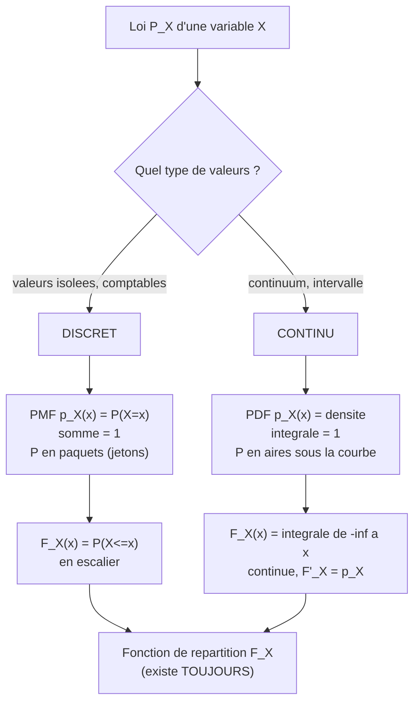

[← Sommaire](../README.md#table-des-matières)

# 6. Probabilités et distributions

### Construction d'un espace probabilisé

#### L'intuition : mesurer notre ignorance

Avant toute formule, posons l'image fondatrice. Une probabilité, ce n'est pas une propriété mystérieuse cachée dans les objets: c'est une manière de **mesurer notre ignorance** ou la fréquence avec laquelle quelque chose se produit. Quand on dit « cette pièce a une chance sur deux de tomber sur pile », on résume en un nombre, $`\tfrac{1}{2}`$, toute notre incertitude sur le résultat d'un lancer que l'on n'a pas encore vu.

L'analogie la plus utile pour tout le chapitre est celle du **gâteau découpé**. Imaginez un gâteau entier qui représente « tout ce qui peut arriver ». On le coupe en parts. Chaque part représente un événement possible. La taille d'une part, sa fraction du gâteau total, c'est sa probabilité. Le gâteau entier vaut $`1`$ (c'est-à-dire $`100\%`$). Une part ne peut pas être négative (on ne peut pas avoir « moins que rien » de gâteau) et la somme de toutes les parts redonne exactement le gâteau entier. Ces trois idées enfantines, total égal à un, jamais négatif, les parts s'additionnent, sont **exactement** les trois axiomes de Kolmogorov que nous allons formaliser.

#### Les trois ingredients : $`\Omega`$, $`\mathcal{F}`$, $`P`$

Un **espace probabilisé (probability space)** est un triplet $`(\Omega, \mathcal{F}, P)`$. Examinons chaque ingrédient.

> **Le symbole $`\Omega`$ (oméga majuscule).** Ce symbole représente **l'ensemble de tout ce qui peut arriver**. C'est notre gâteau entier avant découpe. Pensez à une grande boîte qui contient, écrits sur des petits papiers, absolument tous les résultats imaginables de l'expérience. Pour un lancer de dé, $`\Omega = \{1,2,3,4,5,6\}`$: la boîte contient six papiers. On l'appelle l'**univers** ou l'**espace des résultats**. Un élément de cette boîte, un résultat individuel, se note souvent $`\omega`$ (oméga minuscule): c'est **un** papier tiré de la boîte.

> **Le symbole $`\mathcal{F}`$ (F calligraphié).** Ce symbole représente **la liste de toutes les questions auxquelles on s'autorise à répondre par une probabilité**. Chaque « question » est en fait un sous-ensemble de $`\Omega`$, appelé **événement (event)**. Par exemple « le dé est pair » correspond au sous-ensemble $`\{2,4,6\}`$. Pensez à $`\mathcal{F}`$ comme au **menu d'un restaurant**: il ne liste pas des résultats bruts, mais des regroupements (des plats composés) sur lesquels on peut mettre un prix (une probabilité). On exige que ce menu soit « cohérent »: si on peut demander la probabilité d'un événement, on doit pouvoir demander celle de son contraire, et celle de combinaisons.

> **Le symbole $`P`$.** Ce symbole représente **la règle qui attribue à chaque événement sa taille de part de gâteau**, c'est-à-dire un nombre entre $`0`$ et $`1`$. On écrit $`P(A)`$ et on lit « probabilité de $`A`$ ». Pensez à $`P`$ comme à une **balance**: vous lui présentez un événement (un morceau de gâteau), elle vous rend son poids, et le poids total de tout le gâteau est toujours exactement $`1`$.

Formalisons. L'objet $`\mathcal{F}`$ doit être une **tribu** (ou **sigma-algèbre**, en anglais $`\sigma`$-*algebra*) sur $`\Omega`$, c'est-à-dire une famille de parties de $`\Omega`$ vérifiant:

1. $`\Omega \in \mathcal{F}`$ (l'événement certain « quelque chose arrive » est dans le menu);
2. si $`A \in \mathcal{F}`$, alors son complémentaire $`A^{c} = \Omega \setminus A \in \mathcal{F}`$ (stabilité par passage au contraire);
3. si $`A_{1}, A_{2}, A_{3}, \dots \in \mathcal{F}`$ est une suite **dénombrable** d'événements, alors leur réunion $`\bigcup_{n=1}^{\infty} A_{n} \in \mathcal{F}`$ (stabilité par réunion dénombrable).

> **Le symbole $`\bigcup`$ (grande réunion).** Ce symbole représente **« on rassemble tout dans un seul sac »**. Comme la somme $`\sum`$ est une boucle qui additionne des nombres, $`\bigcup_{n} A_{n}`$ est une boucle qui jette le contenu de chaque ensemble $`A_{n}`$ dans un grand sac commun: un élément y figure dès qu'il appartient à **au moins un** des $`A_{n}`$. Son cousin $`\bigcap`$ (grande intersection) garde au contraire seulement ce qui est **dans tous** à la fois.

> **Pourquoi « dénombrable » (countable) ?** Dénombrable veut dire « qu'on peut compter un par un, éventuellement sans fin »: les entiers $`1, 2, 3, \dots`$ sont dénombrables, les points d'un segment ne le sont pas. On se limite à des réunions dénombrables car vouloir mesurer **tous** les sous-ensembles d'un ensemble continu mène à des contradictions (ensembles non mesurables de Vitali). La tribu est précisément l'astuce qui dit: « je ne promets de peser que les morceaux raisonnables. »

Enfin, $`P: \mathcal{F} \to [0,1]`$ est une **mesure de probabilité**: une application qui satisfait les **axiomes de Kolmogorov** (Andreï Kolmogorov, 1933).

> **Définition (axiomes de Kolmogorov).** Une mesure de probabilité sur $`(\Omega, \mathcal{F})`$ est une application $`P: \mathcal{F} \to \mathbb{R}`$ telle que:
> - **(A1) Positivité.** $`P(A) \ge 0`$ pour tout $`A \in \mathcal{F}`$.
> - **(A2) Normalisation.** $`P(\Omega) = 1`$.
> - **(A3) Sigma-additivité.** Pour toute suite $`(A_{n})_{n \ge 1}`$ d'événements **deux à deux disjoints** (c.-à-d. $`A_{i} \cap A_{j} = \varnothing`$ si $`i \ne j`$),
> ```math
> P\!\left( \bigcup_{n=1}^{\infty} A_{n} \right) = \sum_{n=1}^{\infty} P(A_{n}).
> ```

Ces trois axiomes sont la traduction littérale du gâteau: (A1) une part n'est jamais négative, (A2) le gâteau entier vaut $`1`$, (A3) si on coupe le gâteau en parts qui ne se chevauchent pas, le poids du morceau reconstitué est la somme des poids des parts.

> **Le symbole $`\varnothing`$ (ensemble vide).** Ce symbole représente **« rien du tout »**, le sac complètement vide, l'événement impossible. C'est l'assiette où il n'y a aucune part de gâteau. On verra à l'instant que $`P(\varnothing) = 0`$.

#### Premieres consequences (et leurs preuves)

De ces trois axiomes découlent, par pure logique, toutes les règles de calcul usuelles. Démontrons-les: chaque étape reste élémentaire.

> **Proposition (règles élémentaires).** Pour tous $`A, B \in \mathcal{F}`$:
> 1. $`P(\varnothing) = 0`$.
> 2. **Additivité finie**: si $`A_{1}, \dots, A_{n}`$ sont deux à deux disjoints, $`P(\bigcup_{k=1}^{n} A_{k}) = \sum_{k=1}^{n} P(A_{k})`$.
> 3. **Complémentaire**: $`P(A^{c}) = 1 - P(A)`$.
> 4. **Monotonie**: si $`A \subseteq B`$, alors $`P(A) \le P(B)`$.
> 5. **Inclusion-exclusion (2 termes)**: $`P(A \cup B) = P(A) + P(B) - P(A \cap B)`$.

**Preuve de 1.** Prenons la suite $`A_{1} = A_{2} = \dots = \varnothing`$. Ces ensembles sont deux à deux disjoints (l'intersection de $`\varnothing`$ avec lui-même est $`\varnothing`$), et leur réunion est $`\varnothing`$. Par (A3), $`P(\varnothing) = \sum_{n=1}^{\infty} P(\varnothing)`$. Notons $`p = P(\varnothing) \ge 0`$. L'égalité $`p = \sum_{n=1}^\infty p`$ n'est possible pour un réel fini que si $`p = 0`$ (sinon la somme diverge vers $`+\infty`$). Donc $`P(\varnothing) = 0`$. $`\blacksquare`$

**Preuve de 2.** Complétons la liste finie en une suite infinie en posant $`A_{n+1} = A_{n+2} = \dots = \varnothing`$. Les ensembles restent deux à deux disjoints. Par (A3) puis par $`P(\varnothing)=0`$:
```math
P\!\left( \bigcup_{k=1}^{n} A_{k} \right) = \sum_{k=1}^{\infty} P(A_{k}) = \sum_{k=1}^{n} P(A_{k}) + \sum_{k>n} 0 = \sum_{k=1}^{n} P(A_{k}). \quad \blacksquare
```

**Preuve de 3.** Les événements $`A`$ et $`A^{c}`$ sont disjoints et leur réunion est $`\Omega`$. Par additivité finie (2) et normalisation (A2): $`P(A) + P(A^{c}) = P(\Omega) = 1`$, d'où $`P(A^{c}) = 1 - P(A)`$. $`\blacksquare`$

**Preuve de 4.** Si $`A \subseteq B`$, on décompose $`B = A \cup (B \setminus A)`$, réunion **disjointe**. Donc $`P(B) = P(A) + P(B \setminus A) \ge P(A)`$ car $`P(B \setminus A) \ge 0`$ par (A1). $`\blacksquare`$

**Preuve de 5.** On écrit $`A \cup B`$ comme réunion disjointe $`A \cup B = A \cup (B \setminus A)`$, donc $`P(A\cup B) = P(A) + P(B\setminus A)`$. Par ailleurs $`B = (A\cap B) \cup (B \setminus A)`$, réunion disjointe, donc $`P(B) = P(A\cap B) + P(B\setminus A)`$, c.-à-d. $`P(B\setminus A) = P(B) - P(A\cap B)`$. En substituant: $`P(A\cup B) = P(A) + P(B) - P(A\cap B)`$. $`\blacksquare`$

> **Remarque (la formule du « ou »).** La règle 5 corrige un piège courant: on ne peut pas additionner bêtement $`P(A)`$ et $`P(B)`$ pour avoir « $`A`$ ou $`B`$ », car on compterait deux fois la zone commune $`A \cap B`$. On la retranche une fois. C'est exactement comme compter les élèves qui font du sport **ou** de la musique: on additionne les deux clubs, puis on enlève une fois ceux qui sont dans les deux.

#### Un exemple chiffre deroule : le de equilibre

Prenons $`\Omega = \{1,2,3,4,5,6\}`$, $`\mathcal{F} = \mathcal{P}(\Omega)`$ (toutes les parties, ici $`2^{6} = 64`$ événements possibles, car chaque face est soit dedans soit dehors), et $`P`$ uniforme: $`P(\{\omega\}) = \tfrac{1}{6}`$ pour chaque face.

- Événement $`A`$ = « pair » $`= \{2,4,6\}`$. Par additivité: $`P(A) = \tfrac{1}{6}+\tfrac{1}{6}+\tfrac{1}{6} = \tfrac{3}{6} = \tfrac{1}{2}`$.
- Événement $`B`$ = « au moins $`5`$ » $`= \{5,6\}`$: $`P(B) = \tfrac{2}{6} = \tfrac{1}{3}`$.
- $`A \cap B = \{6\}`$, donc $`P(A\cap B) = \tfrac{1}{6}`$.
- Par inclusion-exclusion: $`P(A \cup B) = \tfrac{1}{2} + \tfrac{1}{3} - \tfrac{1}{6} = \tfrac{3}{6}+\tfrac{2}{6}-\tfrac{1}{6} = \tfrac{4}{6} = \tfrac{2}{3}`$. Vérification directe: $`A \cup B = \{2,4,5,6\}`$, soit $`4`$ faces sur $`6`$, bien $`\tfrac{2}{3}`$.

#### Variables aleatoires et loi image

En pratique, on ne s'intéresse presque jamais à $`\omega`$ brut (le « papier tiré »), mais à une **mesure numérique** qu'on en extrait: le gain d'un pari, la taille d'une personne, le pixel d'une image. C'est le rôle de la **variable aléatoire (random variable)**.

> **Définition (variable aléatoire réelle).** Une variable aléatoire est une application $`X: \Omega \to \mathbb{R}`$ qui est **mesurable**, c'est-à-dire telle que pour tout réel $`x`$, l'ensemble $`\{\omega \in \Omega: X(\omega) \le x\}`$ appartient à $`\mathcal{F}`$. Cette condition garantit qu'on a le droit de demander « quelle est la probabilité que $`X`$ soit inférieur à $`x`$ ? ».

> **Comment lire ce symbole $`X`$.** Ce symbole (en majuscule) représente **une machine à chiffres branchée sur le hasard**: on tourne la manivelle (on tire $`\omega`$), et la machine affiche un nombre $`X(\omega)`$. Le hasard est dans la manivelle; $`X`$ n'est que la règle de lecture. Convention universelle: la **variable** (la machine, encore inconnue) est en MAJUSCULE $`X`$; la **valeur** observée (le chiffre affiché) est en minuscule $`x`$.

La probabilité $`P`$ vivant sur $`\Omega`$ se **transporte** alors sur les nombres réels via $`X`$. On définit la **loi (distribution)** de $`X`$, notée $`P_{X}`$, par
```math
P_{X}(B) = P\big( X^{-1}(B) \big) = P\big( \{\omega : X(\omega) \in B\} \big),
```
pour tout ensemble $`B`$ de réels (borélien). On la résume par la **fonction de répartition (cumulative distribution function, CDF)**:
```math
F_{X}(x) = P(X \le x).
```

> **Image mentale.** $`X`$ est une **moulinette** qui pousse la pâte (la probabilité) depuis le moule $`\Omega`$ vers une assiette graduée (les réels). On oublie d'où venait chaque gramme de pâte; il ne reste que la façon dont la pâte s'étale sur la graduation. Toute la suite du chapitre, distributions discrètes, continues, gaussienne, décrit **la forme de cet étalement**.

> **Mise à jour 2026.** Cette construction abstraite (mesurabilité, tribus) reste le socle exact des bibliothèques modernes de programmation probabiliste. Dans des outils comme **NumPyro**, **TensorFlow Probability** ou **Pyro**, un objet `Distribution` n'est rien d'autre qu'une loi $`P_{X}`$ munie de deux opérations clés: `sample` (tirer un $`\omega`$ et renvoyer $`X(\omega)`$) et `log_prob` (évaluer la densité, voir section suivante). La théorie de la mesure justifie pourquoi ces deux briques suffisent à tout reconstruire, y compris la différentiation automatique à travers le tirage.

```python
import numpy as np

rng = np.random.default_rng(0)

omega = np.array([1, 2, 3, 4, 5, 6])
P = np.full(6, 1 / 6)

def proba(event_mask):
    return P[event_mask].sum()

A = np.isin(omega, [2, 4, 6])
B = np.isin(omega, [5, 6])

print(proba(A))            # 0.5
print(proba(B))            # 0.333...
print(proba(A & B))        # 0.166...  -> P(A inter B)
print(proba(A | B))        # 0.666...  -> P(A union B)

tirages = rng.choice(omega, size=1_000_000, p=P)
print((tirages % 2 == 0).mean())   # ~0.5, estimation frequentiste de P(A)
```

La dernière ligne illustre l'**interprétation fréquentiste**: la probabilité est la limite de la fréquence observée quand on répète l'expérience un grand nombre de fois. C'est le pont concret entre l'axiomatique abstraite et les données réelles que manipule le machine learning.

---

### Probabilités discrètes et continues

Une fois la loi $`P_X`$ d'une variable aléatoire posée, deux grands mondes s'ouvrent selon la nature des valeurs prises: un monde **discret** (valeurs isolées, qu'on peut compter) et un monde **continu** (valeurs formant un continuum, comme tous les réels d'un intervalle). Ils se décrivent par deux objets jumeaux: la fonction de masse pour l'un, la densité pour l'autre.

#### Le cas discret : la fonction de masse

> **Définition (variable discrète et PMF).** Une variable aléatoire $`X`$ est **discrète** si elle ne prend qu'un nombre fini ou dénombrable de valeurs $`x_{1}, x_{2}, \dots`$. Sa loi est entièrement décrite par sa **fonction de masse (probability mass function, PMF)**:
> ```math
> p_{X}(x) = P(X = x).
> ```
> Elle vérifie $`p_{X}(x) \ge 0`$ et $`\sum_{i} p_{X}(x_{i}) = 1`$.

> **Le symbole $`\sum`$ (somme sigma), rappel d'usage.** On l'a vu aux chapitres précédents: c'est **une boucle qui additionne**. Ici $`\sum_{i} p_{X}(x_{i})`$ veut dire « passez en revue chaque valeur possible $`x_{i}`$, prenez sa probabilité, et faites le total ». Le résultat doit valoir $`1`$: c'est notre gâteau, redécoupé en parts comptables.

L'image est limpide: la masse de probabilité est posée en **paquets discrets** sur certains points de la droite, comme des piles de jetons de hauteurs différentes posées sur des cases. La hauteur de la pile en $`x`$ est $`p_X(x)`$; la somme des hauteurs fait $`1`$.

**Lois discrètes de référence.** Voici les briques qu'on rencontre partout en pratique. (On note $`\mathrm{Pois}(\lambda)`$ la loi de Poisson, pour éviter toute confusion avec l'ensemble des parties $`\mathcal{P}(\Omega)`$ et la mesure $`P`$.)

| Loi | Notation | $`p_X(k)`$ | Support | Espérance | Variance |
|---|---|---|---|---|---|
| Bernoulli | $`\mathcal{B}(p)`$ | $`p^{k}(1-p)^{1-k}`$ | $`k\in\{0,1\}`$ | $`p`$ | $`p(1-p)`$ |
| Binomiale | $`\mathcal{B}(n,p)`$ | $`\binom{n}{k}p^{k}(1-p)^{n-k}`$ | $`k\in\{0,\dots,n\}`$ | $`np`$ | $`np(1-p)`$ |
| Géométrique | $`\mathcal{G}(p)`$ | $`(1-p)^{k-1}p`$ | $`k\in\{1,2,\dots\}`$ | $`1/p`$ | $`(1-p)/p^{2}`$ |
| Poisson | $`\mathrm{Pois}(\lambda)`$ | $`e^{-\lambda}\lambda^{k}/k!`$ | $`k\in\{0,1,\dots\}`$ | $`\lambda`$ | $`\lambda`$ |

> **Le symbole $`\binom{n}{k}`$ (coefficient binomial).** Ce symbole représente **le nombre de façons de choisir $`k`$ objets parmi $`n`$ sans tenir compte de l'ordre**. On le lit « $`k`$ parmi $`n`$ ». Concrètement: combien d'équipes de $`k`$ joueurs peut-on former dans un groupe de $`n`$ ? Sa formule est $`\binom{n}{k} = \dfrac{n!}{k!\,(n-k)!}`$, où le symbole $`!`$ (factorielle) signifie « multiplier tous les entiers de $`1`$ jusqu'à ce nombre »: $`4! = 1\times2\times3\times4 = 24`$. Pensez à $`\binom{n}{k}`$ comme au nombre de combinaisons possibles d'une serrure où l'ordre ne compte pas.

> **Exemple chiffré (binomiale).** On lance $`n=3`$ fois une pièce équilibrée ($`p=\tfrac12`$). Probabilité d'obtenir exactement $`k=2`$ piles ?
> ```math
> p_X(2) = \binom{3}{2}\left(\tfrac12\right)^{2}\left(\tfrac12\right)^{1} = 3 \times \tfrac14 \times \tfrac12 = \tfrac{3}{8} = 0{,}375.
> ```
> On le vérifie à la main: les séquences à $`2`$ piles sont PPF, PFP, FPP, soit $`3`$ cas sur $`2^3 = 8`$ également probables, bien $`\tfrac{3}{8}`$.

#### Le cas continu : la densite

Quand $`X`$ prend ses valeurs dans un continuum (un poids exact en kilogrammes, un temps d'attente), un phénomène contre-intuitif apparaît: la probabilité de tomber sur **une** valeur précise est **nulle**. La probabilité qu'une personne mesure exactement $`1{,}750000\dots`$ m est $`0`$, car il y a une infinité non dénombrable de tailles possibles. On ne peut plus poser des jetons sur des points: la masse est **étalée comme une couche de beurre** sur la droite, et ce qui compte est son **épaisseur locale**.

> **Définition (variable continue et densité).** Une variable $`X`$ est **continue** (à densité, ou absolument continue) s'il existe une fonction $`p_{X} \ge 0`$, appelée **densité de probabilité (probability density function, PDF)**, telle que pour tout intervalle $`[a,b]`$:
> ```math
> P(a \le X \le b) = \int_{a}^{b} p_{X}(x)\,\mathrm{d}x,
> ```
> avec la condition de normalisation $`\displaystyle\int_{-\infty}^{+\infty} p_{X}(x)\,\mathrm{d}x = 1`$ (l'aire totale sous la courbe vaut $`1`$).

> **Le symbole $`\int`$ (intégrale).** Ce symbole représente **une somme continue, une boucle d'addition pour des quantités infiniment fines**. La somme $`\sum`$ additionne des jetons séparés; l'intégrale $`\int_a^b p_X(x)\,\mathrm{d}x`$ additionne une infinité de tranches infiniment minces sous la courbe $`p_X`$, entre $`a`$ et $`b`$. Le morceau $`\mathrm{d}x`$ est la **largeur** d'une tranche (infiniment petite), et $`p_X(x)`$ sa **hauteur**: leur produit $`p_X(x)\,\mathrm{d}x`$ est l'aire d'une tranche, c'est-à-dire un petit bout de probabilité. L'intégrale fait le total de toutes ces aires. **Retenez cette image: une probabilité continue est une aire sous une courbe.**

> **Le symbole $`p(x)`$ (densité).** Attention au piège central: $`p_X(x)`$ **n'est pas** une probabilité ! C'est une **densité**, une probabilité **par unité de longueur** (comme une densité de population: habitants par km², qui peut dépasser $`1`$). Une densité peut très bien valoir $`5`$ en un point. Ce qui est toujours entre $`0`$ et $`1`$, c'est l'**aire** $`p_X(x)\,\mathrm{d}x`$ sur un petit morceau, et l'aire totale qui vaut $`1`$. Pensez à la densité comme à la **richesse du beurre** à un endroit de la tartine; la quantité de beurre réellement mangée est l'aire (densité $`\times`$ largeur de la bouchée).

> **Piège classique.** En continu, $`P(X = a) = \int_a^a p_X(x)\,\mathrm{d}x = 0`$ pour tout point $`a`$. Conséquence pratique: les inégalités larges et strictes donnent la même probabilité, $`P(X \le a) = P(X < a)`$. C'est faux en discret, où un point porte une masse non nulle.

#### Le pont unificateur : la fonction de repartition

La **fonction de répartition** $`F_X(x) = P(X \le x)`$ réconcilie les deux mondes: elle existe **toujours**, discret ou continu. Elle est croissante (au sens large), continue à droite, tend vers $`0`$ en $`-\infty`$ et vers $`1`$ en $`+\infty`$.



- **Discret**: $`F_X`$ est une fonction **en escalier**, qui saute de $`p_X(x_i)`$ à chaque valeur $`x_i`$.
- **Continu**: $`F_X`$ est continue et $`F_X'(x) = p_X(x)`$ (en tout point de continuité de $`p_X`$), la densité est la **pente** de la fonction de répartition. Inversement $`F_X(x) = \int_{-\infty}^x p_X(t)\,\mathrm{d}t`$.

Ce lien $`F_X' = p_X`$ est l'analogue exact du théorème fondamental de l'analyse: la densité mesure la vitesse à laquelle la probabilité s'accumule.

> **Application en machine learning.** La distinction discret/continu structure tout le choix de modèle. Un classifieur produit une loi **discrète** sur les classes (sortie d'un *softmax*, qui est littéralement une PMF). Un modèle génératif d'images ou un débruiteur produit une loi **continue** sur les pixels. La fonction de coût par excellence, la **log-vraisemblance négative (negative log-likelihood)**, s'écrit $`-\log p_X(x)`$: on y met une PMF en classification, une PDF en régression. C'est pourquoi `log_prob` est l'opération centrale des bibliothèques citées.

```python
import numpy as np
from scipy import stats

# --- Discret : binomiale B(3, 1/2) ---
k = np.arange(0, 4)
pmf = stats.binom.pmf(k, n=3, p=0.5)
print(pmf)            # [0.125 0.375 0.375 0.125]
print(pmf.sum())      # 1.0  -> normalisation

# --- Continu : loi normale standard ---
x = np.linspace(-4, 4, 100000)
pdf = stats.norm.pdf(x)            # densite, peut depasser... ici max ~0.399
aire = np.trapezoid(pdf, x)        # integrale numerique (np.trapz est deprecie depuis NumPy 2.0)
print(round(aire, 4))             # ~1.0  -> normalisation

# P(-1 <= X <= 1) comme AIRE sous la courbe
mask = (x >= -1) & (x <= 1)
print(round(np.trapezoid(pdf[mask], x[mask]), 4))   # ~0.6827 (regle des 68%)

# P(X = 0.5) en continu : nul
print(stats.norm.cdf(0.5) - stats.norm.cdf(0.5))  # 0.0
```

---

### Règle de la somme, règle du produit et théorème de Bayes

Tout l'édifice du calcul probabiliste, et, on le verra, de l'apprentissage bayésien, repose sur **deux règles** seulement, dont découle un théorème universel. On travaille désormais avec **plusieurs** variables à la fois, ce qui introduit les lois jointes, marginales et conditionnelles.

#### Loi jointe, loi marginale

> **Le symbole virgule dans $`p(x,y)`$ (loi jointe).** La virgule représente le **« ET » simultané**. La quantité $`p(x,y) = P(X=x, Y=y)`$ est la probabilité que $`X`$ vaille $`x`$ **et en même temps** $`Y`$ vaille $`y`$. Image: une grille (un tableur) où les lignes sont les valeurs de $`X`$, les colonnes celles de $`Y`$; $`p(x,y)`$ est ce qui est écrit dans la **case** à l'intersection. La somme de toutes les cases vaut $`1`$.

> **Règle de la somme (sum rule / marginalisation).** Pour récupérer la loi d'une seule variable à partir de la loi jointe, on **somme sur l'autre** (on « marginalise »):
> ```math
> p(x) = \sum_{y} p(x,y) \quad \text{(discret)}, \qquad p(x) = \int p(x,y)\,\mathrm{d}y \quad \text{(continu)}.
> ```
> $`p(x)`$ s'appelle la **loi marginale (marginal distribution)** de $`X`$.

L'image est parlante: dans le tableur, la loi marginale de $`X`$, c'est la colonne des **totaux de lignes**, écrite dans la **marge** du tableau (d'où le nom). On a aplati la dimension $`Y`$ en additionnant tout le long.

#### Probabilite conditionnelle, regle du produit

> **Le symbole barre $`\mid`$ dans $`p(x \mid y)`$ (conditionnement).** Cette barre verticale se lit **« sachant que »**. La quantité $`p(x \mid y) = P(X = x \mid Y = y)`$ est la probabilité que $`X = x`$ **une fois qu'on sait déjà** que $`Y = y`$. Image: on a appris une information ($`Y=y`$), donc on **jette tout le reste du gâteau** et on ne regarde plus que la tranche où $`Y=y`$; on y recalcule les proportions pour que cette tranche fasse à son tour un gâteau entier (de masse $`1`$). Conditionner, c'est **zoomer sur un sous-monde** et y renormaliser.

> **Définition (probabilité conditionnelle).** Pour $`P(B) > 0`$,
> ```math
> P(A \mid B) = \frac{P(A \cap B)}{P(B)}.
> ```
> Le numérateur est la part commune; le dénominateur renormalise pour que le sous-monde $`B`$ pèse $`1`$.

> **Règle du produit (product rule).** En réorganisant la définition:
> ```math
> p(x, y) = p(x \mid y)\, p(y) = p(y \mid x)\, p(x).
> ```
> Lecture: la probabilité que **deux** choses arrivent = (proba de la première) $`\times`$ (proba de la seconde **sachant** la première).

> **Le symbole $`\prod`$ (produit pi).** Ce symbole représente **une boucle qui multiplie**, exactement comme $`\sum`$ est une boucle qui additionne. $`\prod_{i=1}^{n} a_i = a_1 \times a_2 \times \dots \times a_n`$. Il apparaît dès qu'on enchaîne la règle du produit sur plusieurs variables: la **règle de chaînage (chain rule)** généralise
> ```math
> p(x_1, x_2, \dots, x_n) = \prod_{i=1}^{n} p(x_i \mid x_1, \dots, x_{i-1}).
> ```
> Pensez à $`\prod`$ comme à une chaîne de probabilités: chaque maillon est conditionné par tous les précédents. C'est **exactement** la formule qu'optimise un modèle de langage autorégressif (chaque mot sachant les mots précédents).

#### Le theoreme de Bayes

En combinant les deux écritures de la règle du produit, $`p(x \mid y)\,p(y) = p(y \mid x)\,p(x)`$, on isole $`p(x \mid y)`$ et l'on obtient le résultat le plus important de tout le chapitre.

> **Théorème (Bayes, 1763).** Pour $`p(y) > 0`$:
> ```math
> \underbrace{p(x \mid y)}_{\text{posterior}} = \frac{\overbrace{p(y \mid x)}^{\text{vraisemblance}}\ \overbrace{p(x)}^{\text{prior}}}{\underbrace{p(y)}_{\text{evidence}}}, \qquad \text{avec} \quad p(y) = \sum_{x'} p(y \mid x')\,p(x').
> ```

Le dénominateur $`p(y)`$ (l'**évidence**, ou *marginal likelihood*) se calcule par la règle de la somme appliquée au numérateur: il sert uniquement de **constante de normalisation** pour que $`p(\cdot \mid y)`$ soit une vraie loi sommant à $`1`$. D'où la forme opérationnelle qu'on retient:
```math
\text{posterior} \ \propto\ \text{vraisemblance} \times \text{prior}.
```

> **Le symbole $`\propto`$ (proportionnel à).** Ce symbole représente **« égal à un facteur constant près »**. Quand on écrit $`a \propto b`$, cela veut dire $`a = c \cdot b`$ pour une constante $`c`$ qu'on ne précise pas (ici, $`1/p(y)`$). Image: la **forme** de la distribution est donnée par le produit vraisemblance $`\times`$ prior; la constante ne fait que régler l'échelle pour que l'aire totale fasse $`1`$. Très pratique: on calcule la forme, on normalise à la fin.

Le vocabulaire bayésien mérite d'être ancré, car c'est la grammaire de l'apprentissage moderne.

| Terme | Notation | Sens intuitif |
|---|---|---|
| **Prior** (a priori) | $`p(x)`$ | Ce qu'on croit **avant** de voir la donnée |
| **Vraisemblance** (likelihood) | $`p(y \mid x)`$ | À quel point l'hypothèse $`x`$ explique la donnée $`y`$ observée |
| **Posterior** (a posteriori) | $`p(x \mid y)`$ | Ce qu'on croit **après** avoir vu la donnée |
| **Évidence** (marginal likelihood) | $`p(y)`$ | Probabilité globale de la donnée, toutes hypothèses confondues |

> **Exemple chiffré déroulé: test médical (le piège des faux positifs).** Une maladie touche $`1`$ personne sur $`1000`$: prior $`P(M) = 0{,}001`$. Le test détecte la maladie dans $`99\%`$ des cas si elle est présente (**sensibilité** $`P(+\mid M) = 0{,}99`$); chez les personnes saines, il se trompe dans $`5\%`$ des cas (**taux de faux positifs** $`P(+\mid \overline M) = 0{,}05`$, c'est-à-dire une **spécificité** $`P(-\mid\overline M) = 0{,}95`$). **Question: une personne testée positive est-elle vraiment malade ?**
>
> Calculons l'évidence par la règle de la somme:
> ```math
> P(+) = P(+\mid M)P(M) + P(+\mid \overline M)P(\overline M) = 0{,}99 \times 0{,}001 + 0{,}05 \times 0{,}999 = 0{,}00099 + 0{,}04995 = 0{,}05094.
> ```
> Puis Bayes:
> ```math
> P(M \mid +) = \frac{P(+\mid M)P(M)}{P(+)} = \frac{0{,}00099}{0{,}05094} \approx 0{,}0194 \approx 1{,}9\%.
> ```
> **Résultat contre-intuitif**: malgré un test « fiable à $`99\%`$ », un positif n'a qu'environ $`2\%`$ de chances d'être réellement malade ! La raison: la maladie est si rare que les faux positifs (sur les $`999`$ sains) submergent les vrais positifs (sur l'unique malade). C'est l'illustration reine de l'importance du **prior**: négliger la rareté de base (*base rate fallacy*) conduit à des conclusions absurdes.

```python
import numpy as np

P_M = 0.001
P_pos_M = 0.99        # sensibilite
P_pos_notM = 0.05     # taux de faux positifs (= 1 - specificite)

P_notM = 1 - P_M
evidence = P_pos_M * P_M + P_pos_notM * P_notM     # regle de la somme
posterior = (P_pos_M * P_M) / evidence             # Bayes
print(round(evidence, 5))     # 0.05094
print(round(posterior, 4))    # 0.0194  -> ~1.9 %
```

> **Application en machine learning.** Bayes est le moteur de l'**inférence**. En apprentissage bayésien, $`x`$ devient le vecteur de paramètres $`\theta`$ d'un modèle et $`y`$ le jeu de données $`\mathcal{D}`$: on cherche $`p(\theta \mid \mathcal{D}) \propto p(\mathcal{D}\mid\theta)\,p(\theta)`$, soit « mes paramètres après avoir vu les données ». Le **maximum a posteriori (MAP)** maximise ce posterior; le **maximum de vraisemblance (MLE)** ignore le prior et maximise seulement $`p(\mathcal D\mid\theta)`$. Le classifieur **naïf de Bayes** applique directement le théorème en supposant les caractéristiques conditionnellement indépendantes. Et la régularisation $`L_2`$ (*weight decay*) n'est rien d'autre qu'un MAP avec prior gaussien sur les poids, comme on le reverra.

> **Mise à jour 2026.** L'évidence $`p(y) = \int p(y\mid x)p(x)\,\mathrm{d}x`$ est en général une intégrale insoluble en grande dimension. Tout un pan de la recherche vise à la contourner: **inférence variationnelle** (on approche le posterior par une loi simple en maximisant une borne, l'ELBO), **MCMC** modernes (NUTS, *No-U-Turn Sampler*, au cœur de Stan et NumPyro), et **flots normalisants (normalizing flows)** qui apprennent un changement de variables vers une loi simple (voir dernière section). En 2026, ces méthodes, accélérées par autodiff sur GPU, rendent l'inférence bayésienne praticable sur des réseaux de neurones entiers.

---

### Statistiques résumées et indépendance

Une distribution complète (PMF ou PDF) contient toute l'information, mais elle est souvent trop riche à manipuler. On la **résume** par quelques nombres clés: où est-elle centrée (espérance), à quel point est-elle étalée (variance), comment deux variables bougent-elles ensemble (covariance) ?

#### L'esperance : le centre de gravite

> **Le symbole $`\mathbb{E}`$ (espérance).** Ce symbole représente **la moyenne pondérée par les probabilités**, c'est-à-dire la valeur « typique » autour de laquelle la variable se balance. Image physique exacte: si on pose les masses de probabilité le long d'une règle, $`\mathbb{E}[X]`$ est le **point d'équilibre**, le centre de gravité où la règle tient en équilibre sur un doigt. On le note aussi $`\mu`$ (mu). Ce n'est pas la valeur la plus probable, c'est la moyenne « à la longue ».

> **Définition (espérance).** Pour une variable discrète puis continue:
> ```math
> \mathbb{E}[X] = \sum_{i} x_{i}\, p_X(x_{i}) \qquad ; \qquad \mathbb{E}[X] = \int_{-\infty}^{+\infty} x\, p_X(x)\,\mathrm{d}x.
> ```
> Plus généralement, pour une fonction $`g`$ (**théorème du statisticien inconscient**, *law of the unconscious statistician*):
> ```math
> \mathbb{E}[g(X)] = \sum_i g(x_i)\,p_X(x_i) \qquad ; \qquad \mathbb{E}[g(X)] = \int g(x)\,p_X(x)\,\mathrm{d}x.
> ```

> **Propriété clé: la linéarité de l'espérance.** Pour toutes variables $`X, Y`$ et tous réels $`a, b`$:
> ```math
> \mathbb{E}[aX + bY] = a\,\mathbb{E}[X] + b\,\mathbb{E}[Y].
> ```
> **Remarquable**: cette égalité est vraie **même si $`X`$ et $`Y`$ ne sont pas indépendantes**. C'est l'une des propriétés les plus puissantes et les plus utilisées de toutes les probabilités.

**Preuve (cas discret, deux variables).** Par définition et règle de la somme:
```math
\mathbb{E}[aX+bY] = \sum_{x,y}(ax+by)\,p(x,y) = a\sum_{x,y} x\,p(x,y) + b\sum_{x,y} y\,p(x,y) = a\sum_x x\,p(x) + b\sum_y y\,p(y) = a\mathbb{E}[X]+b\mathbb{E}[Y].
```
On a juste utilisé la marginalisation $`\sum_y p(x,y) = p(x)`$. $`\blacksquare`$

#### La variance : la dispersion

> **Le symbole $`\mathrm{Var}`$ (variance).** Ce symbole représente **à quel point les valeurs s'éloignent en moyenne du centre**. On mesure l'écart à la moyenne, on l'élève au carré (pour que les écarts positifs et négatifs ne s'annulent pas, et pour pénaliser fort les grands écarts), puis on en prend la moyenne. Image: si l'espérance est le centre d'une cible, la variance dit si les flèches sont **groupées** (petite variance) ou **dispersées** (grande variance). On la note aussi $`\sigma^{2}`$ (sigma au carré).

> **Définition (variance et écart-type).**
> ```math
> \mathrm{Var}(X) = \mathbb{E}\big[(X - \mathbb{E}[X])^{2}\big] = \mathbb{E}[X^{2}] - \big(\mathbb{E}[X]\big)^{2}.
> ```
> Sa racine carrée $`\sigma_X = \sqrt{\mathrm{Var}(X)}`$ est l'**écart-type (standard deviation)**, exprimé dans la **même unité** que $`X`$ (d'où son intérêt pratique).

**Preuve de la formule de Koenig–Huygens** $`\mathrm{Var}(X) = \mathbb{E}[X^2] - \mathbb{E}[X]^2`$. Posons $`\mu = \mathbb{E}[X]`$. En développant le carré et par linéarité:
```math
\mathbb{E}[(X-\mu)^2] = \mathbb{E}[X^2 - 2\mu X + \mu^2] = \mathbb{E}[X^2] - 2\mu\,\mathbb{E}[X] + \mu^2 = \mathbb{E}[X^2] - 2\mu^2 + \mu^2 = \mathbb{E}[X^2] - \mu^2. \quad \blacksquare
```

> **Le symbole $`\sigma`$ (sigma minuscule), écart-type.** À ne pas confondre avec $`\sum`$ (sigma majuscule, la somme) ! Le $`\sigma`$ minuscule représente **la largeur typique de l'étalement** d'une distribution, dans la même unité que les données. Si $`X`$ est une taille en cm, $`\sigma`$ est en cm. Image: c'est le « rayon flou » autour du centre dans lequel se trouvent la plupart des valeurs.

**Règle de transformation.** Pour des constantes $`a, b`$: $`\mathrm{Var}(aX + b) = a^{2}\,\mathrm{Var}(X)`$. La translation $`b`$ ne change rien (déplacer la cible ne change pas la dispersion des flèches); le facteur $`a`$ ressort **au carré**.

> **Exemple chiffré déroulé (dé équilibré).** $`X`$ = face d'un dé à six faces, $`p(k) = \tfrac16`$.
> Espérance: $`\mathbb{E}[X] = \tfrac{1+2+3+4+5+6}{6} = \tfrac{21}{6} = 3{,}5`$.
> Moment d'ordre 2: $`\mathbb{E}[X^2] = \tfrac{1+4+9+16+25+36}{6} = \tfrac{91}{6} \approx 15{,}1\overline{6}`$.
> Variance: $`\mathrm{Var}(X) = \tfrac{91}{6} - 3{,}5^2 = 15{,}1\overline 6 - 12{,}25 = \tfrac{105}{36} \approx 2{,}9167`$.
> Écart-type: $`\sigma_X = \sqrt{2{,}9167} \approx 1{,}708`$.

#### Covariance et correlation : bouger ensemble

> **Le symbole $`\mathrm{Cov}`$ (covariance).** Ce symbole représente **la tendance de deux variables à varier dans le même sens**. Quand $`X`$ est au-dessus de sa moyenne, $`Y`$ l'est-il aussi ? Si oui (covariance positive), elles montent ensemble; si $`Y`$ est plutôt en dessous quand $`X`$ est au-dessus (covariance négative), elles vont en sens opposés. Image: deux danseurs; la covariance dit s'ils bougent en harmonie (positif), à contretemps (négatif) ou indépendamment (zéro).

> **Définition (covariance).**
> ```math
> \mathrm{Cov}(X, Y) = \mathbb{E}\big[(X - \mathbb{E}[X])(Y - \mathbb{E}[Y])\big] = \mathbb{E}[XY] - \mathbb{E}[X]\,\mathbb{E}[Y].
> ```
> Noter que $`\mathrm{Cov}(X,X) = \mathrm{Var}(X)`$: la variance est la covariance d'une variable avec elle-même.

Le défaut de la covariance est de dépendre des **unités** (en cm·kg, elle n'est pas interprétable). On la normalise en **coefficient de corrélation (correlation)** de Pearson:
```math
\rho(X, Y) = \frac{\mathrm{Cov}(X, Y)}{\sigma_X\,\sigma_Y} \in [-1, 1].
```
La valeur $`\rho = +1`$ signifie alignement parfait croissant, $`\rho = -1`$ alignement parfait décroissant, $`\rho = 0`$ absence de **liaison linéaire**.

> **Piège majeur: corrélation n'est pas causalité, et $`\rho=0`$ n'est pas indépendance.** La corrélation ne capte que le lien **linéaire**. Si $`Y = X^2`$ avec $`X`$ symétrique autour de $`0`$, alors $`\rho(X,Y) = 0`$ alors que $`Y`$ est **entièrement déterminée** par $`X`$ ! Une corrélation nulle n'implique **pas** l'indépendance; seule la réciproque est vraie (indépendance $`\Rightarrow`$ covariance nulle). Gardez cet exemple en tête, il revient sans cesse en pratique.

#### La matrice de covariance

Pour un **vecteur aléatoire** $`\mathbf{X} = (X_1, \dots, X_d)^\top`$, on rassemble toutes les covariances dans une matrice.

> **Définition (matrice de covariance).**
> ```math
> \boldsymbol{\Sigma} = \mathrm{Cov}(\mathbf{X}) = \mathbb{E}\big[(\mathbf{X} - \boldsymbol{\mu})(\mathbf{X} - \boldsymbol{\mu})^{\top}\big], \qquad \Sigma_{ij} = \mathrm{Cov}(X_i, X_j).
> ```
> Sur la **diagonale** on trouve les variances $`\Sigma_{ii} = \mathrm{Var}(X_i)`$; **hors diagonale**, les covariances croisées. Cette matrice est **symétrique** ($`\Sigma_{ij} = \Sigma_{ji}`$) et **semi-définie positive** (toutes ses valeurs propres sont $`\ge 0`$).

> **Pourquoi semi-définie positive ?** Pour tout vecteur $`\mathbf{v}`$, la combinaison $`\mathbf{v}^\top \mathbf{X}`$ est une variable aléatoire scalaire, donc sa variance est $`\ge 0`$. Or $`\mathrm{Var}(\mathbf{v}^\top\mathbf{X}) = \mathbf{v}^\top \boldsymbol{\Sigma}\,\mathbf{v} \ge 0`$, ce qui est **exactement** la définition d'une matrice semi-définie positive. La structure géométrique (vecteurs/matrices des chapitres précédents) rejoint ici la probabilité.

#### Independance

> **Définition (indépendance).** Deux variables $`X, Y`$ sont **indépendantes (independent)**, noté $`X \perp\!\!\!\perp Y`$, si leur loi jointe se **factorise**:
> ```math
> p(x, y) = p(x)\,p(y) \quad \text{pour tout } (x,y),
> ```
> ce qui équivaut à $`p(x\mid y) = p(x)`$ (lorsque $`p(y) > 0`$): savoir $`Y`$ n'apprend **rien** sur $`X`$. Le sous-monde conditionnel a la même forme que le monde entier.

> **Le symbole $`\perp\!\!\!\perp`$ (indépendance).** Ce symbole représente **« n'ont aucune influence l'une sur l'autre »**. Comme deux dés lancés dans deux pièces différentes: connaître le résultat de l'un ne donne strictement aucune information sur l'autre. Image: deux histoires sans personnage commun.

**Conséquences de l'indépendance** (faux en général sans elle):
- $`\mathbb{E}[XY] = \mathbb{E}[X]\,\mathbb{E}[Y]`$, donc $`\mathrm{Cov}(X,Y) = 0`$ (la réciproque est fausse, cf. piège ci-dessus);
- $`\mathrm{Var}(X + Y) = \mathrm{Var}(X) + \mathrm{Var}(Y)`$ (les variances s'additionnent).

> **Le cas i.i.d., omniprésent en ML.** On dit que des données $`X_1, \dots, X_n`$ sont **i.i.d.** (*independent and identically distributed*: indépendantes et de même loi) si elles sont mutuellement indépendantes et tirées de la **même** distribution. C'est l'hypothèse fondatrice de presque tout l'apprentissage supervisé: on suppose que les exemples d'entraînement sont des tirages i.i.d. d'une loi inconnue. Sous i.i.d., la **vraisemblance** d'un jeu de données se factorise en produit, $`p(\mathcal D\mid\theta) = \prod_{i=1}^n p(x_i\mid\theta)`$, et la **log-vraisemblance** en somme, $`\sum_i \log p(x_i\mid\theta)`$, ce qui rend l'optimisation par descente de gradient possible.

> **Exemple chiffré déroulé (covariance sur loi jointe).** Soit la loi jointe discrète:
>
> | $`p(x,y)`$ | $`y=0`$ | $`y=1`$ | marginale $`p(x)`$ |
> |---|---|---|---|
> | $`x=0`$ | $`0{,}4`$ | $`0{,}2`$ | $`0{,}6`$ |
> | $`x=1`$ | $`0{,}1`$ | $`0{,}3`$ | $`0{,}4`$ |
> | marginale $`p(y)`$ | $`0{,}5`$ | $`0{,}5`$ | $`1`$ |
>
> $`\mathbb{E}[X] = 0{,}4`$, $`\mathbb{E}[Y] = 0{,}5`$.
> $`\mathbb{E}[XY] = \sum xy\,p(x,y) = 1\cdot1\cdot 0{,}3 = 0{,}3`$ (seul le terme $`x=y=1`$ est non nul).
> $`\mathrm{Cov}(X,Y) = 0{,}3 - 0{,}4\times 0{,}5 = 0{,}3 - 0{,}2 = 0{,}1 > 0`$.
> Test d'indépendance: $`p(0,0) = 0{,}4`$ mais $`p(0)p(0) = 0{,}6\times 0{,}5 = 0{,}3 \ne 0{,}4`$. Donc $`X`$ et $`Y`$ ne sont **pas** indépendantes, cohérent avec une covariance non nulle.

```python
import numpy as np

# Echantillon bivarie correle
rng = np.random.default_rng(1)
mean = [0.0, 0.0]
cov_true = [[1.0, 0.8],
            [0.8, 1.0]]
data = rng.multivariate_normal(mean, cov_true, size=100000)

emp_mean = data.mean(axis=0)
emp_cov = np.cov(data, rowvar=False)          # matrice de covariance empirique
emp_corr = np.corrcoef(data, rowvar=False)    # matrice de correlation

print(np.round(emp_mean, 3))   # ~[0. 0.]
print(np.round(emp_cov, 3))    # ~[[1.  0.8],[0.8 1.]]
print(np.round(emp_corr, 3))   # ~[[1.  0.8],[0.8 1.]]

# Linearite de l'esperance (vraie meme correle) : E[X+Y] = E[X]+E[Y]
print(np.round(data.sum(axis=1).mean(), 3))                # ~0
print(np.round(emp_mean.sum(), 3))                         # ~0

# Var(X+Y) = Var(X)+Var(Y)+2Cov(X,Y)  (le 2Cov ne disparait que si independance)
print(np.round(data.sum(axis=1).var(), 3))                 # ~1+1+2*0.8 = 3.6
```

---

### La loi gaussienne

La **loi normale**, ou **gaussienne (Gaussian)**, est la distribution la plus importante de toutes les sciences. Elle est la forme limite vers laquelle tend la somme de nombreux petits effets indépendants (théorème central limite), ce qui explique son omniprésence: tailles, erreurs de mesure, bruit, et, crucialement, les hypothèses par défaut d'innombrables modèles de machine learning.

#### La forme en cloche : intuition

Imaginez une planche de Galton: des billes tombent et rebondissent à gauche ou à droite sur des clous, au hasard. En bas, elles s'empilent: beaucoup au centre, de moins en moins sur les côtés, formant une **courbe en cloche** symétrique. Chaque bille subit une **somme** de petits chocs aléatoires indépendants; le résultat se concentre autour du centre avec une dispersion régulière. Cette cloche, c'est la gaussienne, et son apparition systématique dès qu'on additionne du hasard n'est pas un accident: c'est une loi mathématique profonde.

#### Definition univariee

> **Le symbole $`\mathcal{N}(\mu, \sigma^2)`$ (loi normale).** Ce symbole représente **la cloche caractérisée par deux réglages seulement**: $`\mu`$ (mu), qui dit **où** est le sommet (le centre), et $`\sigma^2`$ (sigma au carré), qui dit **à quel point** la cloche est large ou étroite. Image: $`\mu`$ déplace la cloche horizontalement (translation), $`\sigma`$ l'étire ou la resserre (zoom horizontal). Deux boutons, et toute la famille des cloches est décrite.

> **Le symbole $`\sim`$ (tilde, « suit la loi »).** Ce symbole se lit **« suit la loi »** ou **« est distribué selon »**. L'écriture $`X \sim \mathcal{N}(\mu, \sigma^2)`$ signifie « la variable aléatoire $`X`$ est tirée de la loi normale de moyenne $`\mu`$ et variance $`\sigma^2`$ ». Image: c'est une **étiquette** collée sur la machine à hasard $`X`$, indiquant la règle du jeu selon laquelle elle crache ses nombres.

> **Définition (densité gaussienne univariée).** $`X \sim \mathcal{N}(\mu, \sigma^2)`$ a pour densité, sur tout $`\mathbb{R}`$:
> ```math
> p(x) = \frac{1}{\sqrt{2\pi\sigma^2}}\,\exp\!\left( -\frac{(x - \mu)^2}{2\sigma^2} \right).
> ```
> On a alors $`\mathbb{E}[X] = \mu`$ et $`\mathrm{Var}(X) = \sigma^2`$.

Décortiquons cette formule, morceau par morceau, car chaque partie a un rôle précis:

- $`\exp\!\big(-\tfrac{(x-\mu)^2}{2\sigma^2}\big)`$ est le **cœur**: l'écart au centre $`(x-\mu)`$ est mis **au carré** (symétrie: gauche et droite traités pareil), divisé par $`2\sigma^2`$ (plus $`\sigma`$ est grand, plus on tolère de grands écarts avant que la densité ne chute), et le **signe moins** fait **décroître** la densité à mesure qu'on s'éloigne du centre. C'est la cloche.

> **Le symbole $`\exp`$ (exponentielle) et $`e`$.** Ce symbole représente **la croissance/décroissance multiplicative**, $`\exp(t) = e^{t}`$ où $`e \approx 2{,}718`$. Ici, avec un argument **négatif** qui devient très négatif loin du centre, $`\exp`$ écrase la valeur vers $`0`$ très vite: c'est ce qui donne à la cloche ses queues qui s'amincissent rapidement. Image: un volume sonore qui s'atténue de plus en plus fort à mesure qu'on s'éloigne de la source.

- $`\frac{1}{\sqrt{2\pi\sigma^2}}`$ est la **constante de normalisation**: elle n'a aucun rôle de forme, elle ajuste juste la hauteur pour que l'aire totale sous la cloche fasse exactement $`1`$ (c'est notre gâteau). Le $`\pi \approx 3{,}1416`$ surgit de l'intégrale de Gauss $`\int_{-\infty}^{+\infty} e^{-t^2/2}\,\mathrm{d}t = \sqrt{2\pi}`$, résultat classique d'analyse.

> **La loi normale standard et la standardisation (z-score).** Le cas $`\mu=0`$, $`\sigma=1`$ donne la **normale standard** $`\mathcal N(0,1)`$. Toute gaussienne s'y ramène par **standardisation**: si $`X \sim \mathcal N(\mu,\sigma^2)`$, alors
> ```math
> Z = \frac{X - \mu}{\sigma} \sim \mathcal N(0, 1).
> ```
> On centre (on retranche la moyenne) puis on réduit (on divise par l'écart-type). Cette opération, le **z-score**, est exactement le prétraitement de **normalisation des données** omniprésent en ML.

> **La règle empirique 68–95–99,7.** Pour une gaussienne, la probabilité de tomber dans un intervalle autour de la moyenne est universelle:
> | Intervalle | Probabilite |
> |---|---|
> | $`[\mu - \sigma,\ \mu + \sigma]`$ | $`\approx 68{,}3\%`$ |
> | $`[\mu - 2\sigma,\ \mu + 2\sigma]`$ | $`\approx 95{,}4\%`$ |
> | $`[\mu - 3\sigma,\ \mu + 3\sigma]`$ | $`\approx 99{,}7\%`$ |
> Autrement dit, il est très rare (moins de $`0{,}3\%`$) de s'éloigner de plus de trois écarts-types. D'où l'expression « événement à trois sigmas ».

#### Theoreme central limite

> **Théorème (central limite, CLT).** Soit $`X_1, X_2, \dots`$ des variables i.i.d. d'espérance $`\mu`$ et de variance finie $`\sigma^2 > 0`$. Alors la moyenne empirique $`\bar X_n = \tfrac1n\sum_{i=1}^n X_i`$, une fois centrée et réduite, converge en loi vers la normale standard:
> ```math
> \frac{\bar X_n - \mu}{\sigma/\sqrt{n}} \ \xrightarrow[n\to\infty]{\text{loi}}\ \mathcal N(0, 1).
> ```

C'est la justification profonde de l'omniprésence gaussienne: **dès qu'une grandeur résulte de la somme de nombreux petits effets aléatoires indépendants, elle est approximativement normale**, quelle que soit la loi de chaque effet. La planche de Galton en est l'incarnation physique. Ce théorème fonde aussi l'inférence statistique (intervalles de confiance, tests).

#### La gaussienne multivariee

En grande dimension, la cloche devient une « colline » dans l'espace, et les deux boutons deviennent un vecteur moyenne et une matrice de covariance.

> **Définition (gaussienne multivariée).** Un vecteur $`\mathbf X \sim \mathcal N(\boldsymbol\mu, \boldsymbol\Sigma)`$ en dimension $`d`$ (avec $`\boldsymbol\Sigma`$ définie positive) a pour densité:
> ```math
> p(\mathbf x) = \frac{1}{(2\pi)^{d/2}\,|\boldsymbol\Sigma|^{1/2}}\,\exp\!\left( -\tfrac{1}{2}(\mathbf x - \boldsymbol\mu)^{\top}\,\boldsymbol\Sigma^{-1}\,(\mathbf x - \boldsymbol\mu) \right).
> ```

La structure est **identique** au cas scalaire, traduite en algèbre linéaire (chapitres précédents):

| Univarie | Multivarie | Role |
|---|---|---|
| $`\mu`$ | $`\boldsymbol\mu`$ (vecteur) | centre de la cloche |
| $`\sigma^2`$ | $`\boldsymbol\Sigma`$ (matrice) | étalement + orientation |
| $`\frac{(x-\mu)^2}{\sigma^2}`$ | $`(\mathbf x-\boldsymbol\mu)^\top\boldsymbol\Sigma^{-1}(\mathbf x-\boldsymbol\mu)`$ | **distance de Mahalanobis** au carré |
| $`\frac{1}{\sqrt{2\pi\sigma^2}}`$ | $`\frac{1}{(2\pi)^{d/2}\vert \boldsymbol\Sigma\vert ^{1/2}}`$ | normalisation |

> **Le symbole $`|\boldsymbol\Sigma|`$ (déterminant).** Ce symbole représente **le « volume » associé à la matrice** (vu au chapitre algèbre linéaire). Pour la covariance, $`|\boldsymbol\Sigma|`$ mesure le volume d'incertitude: plus la cloche est étalée, plus le déterminant est grand, et plus la constante de normalisation est petite (on étale la même masse $`1`$ sur un plus grand volume). Le terme $`\boldsymbol\Sigma^{-1}`$ (matrice **inverse**, dite **matrice de précision**) joue le rôle de $`1/\sigma^2`$.

> **Distance de Mahalanobis.** La quantité $`(\mathbf x-\boldsymbol\mu)^\top\boldsymbol\Sigma^{-1}(\mathbf x-\boldsymbol\mu)`$ est une **distance qui tient compte de la forme** du nuage: un point peut être loin du centre en distance euclidienne ordinaire mais « proche » s'il est dans la direction où le nuage est étalé (grande variance). Les lignes de niveau de la densité sont des **ellipses** (ellipsoïdes en dimension $`d`$) dont les axes sont les vecteurs propres de $`\boldsymbol\Sigma`$. C'est la généralisation naturelle de « combien d'écarts-types suis-je loin ? ».

> **Application en machine learning (centrale).** La gaussienne est partout:
> - **Hypothèse de bruit**: la régression linéaire avec erreur gaussienne $`y = \mathbf w^\top\mathbf x + \varepsilon`$, $`\varepsilon\sim\mathcal N(0,\sigma^2)`$, donne par maximum de vraisemblance exactement la **minimisation des moindres carrés** (on le démontre en exercice).
> - **Initialisation et régularisation**: un prior gaussien sur les poids $`\Rightarrow`$ régularisation $`L_2`$; les schémas d'initialisation (Xavier, He) sont gaussiens.
> - **Modèles**: mélanges de gaussiennes (GMM), analyse en composantes principales probabiliste, processus gaussiens, et l'espace latent des **autoencodeurs variationnels (VAE)** est gaussien.

> **Mise à jour 2026.** Les **modèles de diffusion (diffusion models)**, état de l'art en génération d'images et de vidéo en 2026 (lignée de Stable Diffusion, des modèles texte-vers-vidéo), reposent **entièrement** sur la gaussienne: on ajoute progressivement du bruit gaussien à une donnée jusqu'à la transformer en $`\mathcal N(\mathbf 0, \mathbf I)`$ pur, puis on apprend à inverser ce processus pas à pas. Comprendre $`\mathcal N(\boldsymbol\mu,\boldsymbol\Sigma)`$ et ses propriétés de stabilité par addition et par conditionnement est littéralement le prérequis pour comprendre ces architectures.

```python
import numpy as np
from scipy import stats

# --- Univarie : regle 68-95-99.7 ---
for k in (1, 2, 3):
    p = stats.norm.cdf(k) - stats.norm.cdf(-k)
    print(f"+/-{k} sigma : {p:.4f}")
# +/-1 sigma : 0.6827
# +/-2 sigma : 0.9545
# +/-3 sigma : 0.9973

# --- Theoreme central limite : moyenne de tirages UNIFORMES -> cloche ---
rng = np.random.default_rng(0)
n, reps = 30, 200000
means = rng.uniform(0, 1, size=(reps, n)).mean(axis=1)
# standardisation : uniforme(0,1) a moyenne 1/2 et variance 1/12
z = (means - 0.5) / (np.sqrt(1 / 12) / np.sqrt(n))
print(np.round(z.mean(), 3), np.round(z.std(), 3))   # ~0, ~1 : bien N(0,1)

# --- Multivarie : densite et distance de Mahalanobis ---
mu = np.array([0.0, 0.0])
Sigma = np.array([[2.0, 0.6],
                  [0.6, 1.0]])
mvn = stats.multivariate_normal(mean=mu, cov=Sigma)
x = np.array([1.5, -0.5])
d2 = (x - mu) @ np.linalg.inv(Sigma) @ (x - mu)   # Mahalanobis au carre
print(round(d2, 4))      # 2.2256
print(round(mvn.pdf(x), 6))   # 0.040843
```

---

### Conjugaison et famille exponentielle

Le théorème de Bayes nous donne le posterior, mais son calcul bute sur l'évidence (l'intégrale de normalisation). Il existe une situation bénie où tout se calcule à la main, de façon fermée: la **conjugaison**. Et derrière elle se cache une structure algébrique unificatrice: la **famille exponentielle**.

#### Priors conjugues : rester dans la meme famille

> **Définition (conjugaison).** Une famille de priors est **conjuguée (conjugate)** à une vraisemblance donnée si le posterior appartient à la **même famille** que le prior. Autrement dit, observer des données ne fait que **mettre à jour les paramètres** du prior, sans changer sa forme.

L'image est celle d'une **forme stable par apprentissage**: on part d'une croyance en forme de Beta, on voit des données, et la croyance reste une Beta, seuls ses réglages bougent. C'est l'équivalent probabiliste d'un format de fichier qui reste identique après édition. L'énorme avantage: l'inférence devient une simple **arithmétique sur les paramètres**, sans aucune intégrale.

#### L'exemple canonique : Beta–Binomiale

Le couple le plus instructif modélise l'apprentissage d'une probabilité inconnue $`\theta`$ (ex. le taux de clic d'une publicité, le biais d'une pièce).

> **La loi Beta** $`\mathrm{Beta}(\alpha, \beta)`$ vit sur $`[0,1]`$, parfaite pour modéliser une probabilité inconnue. Sa densité est $`p(\theta) \propto \theta^{\alpha-1}(1-\theta)^{\beta-1}`$. Les paramètres $`\alpha, \beta`$ s'interprètent comme des **pseudo-comptes**: $`\alpha-1`$ « succès imaginaires » et $`\beta-1`$ « échecs imaginaires » déjà observés avant les vraies données. Son espérance est $`\frac{\alpha}{\alpha+\beta}`$.

**Mise à jour.** Prior $`\theta \sim \mathrm{Beta}(\alpha, \beta)`$. On observe $`n`$ essais binomiaux dont $`k`$ succès, vraisemblance $`p(k\mid\theta) \propto \theta^{k}(1-\theta)^{n-k}`$. Le posterior:
```math
p(\theta\mid k) \propto \underbrace{\theta^{k}(1-\theta)^{n-k}}_{\text{vraisemblance}}\cdot\underbrace{\theta^{\alpha-1}(1-\theta)^{\beta-1}}_{\text{prior}} = \theta^{(\alpha+k)-1}(1-\theta)^{(\beta+n-k)-1}.
```
On **reconnaît** une Beta ! Donc:
```math
\theta \mid k \ \sim\ \mathrm{Beta}(\alpha + k,\ \beta + n - k).
```
La règle de mise à jour est d'une simplicité enfantine: **on ajoute le nombre de succès à $`\alpha`$, le nombre d'échecs à $`\beta`$**. C'est cela, l'apprentissage bayésien sous forme close.

> **Exemple chiffré déroulé.** On teste une publicité. Prior neutre $`\mathrm{Beta}(1,1)`$ (loi uniforme: on ne sait rien, toute valeur de $`\theta`$ entre $`0`$ et $`1`$ est a priori égale). On observe $`n=10`$ affichages, $`k=3`$ clics. Posterior:
> ```math
> \theta \mid \text{donnees} \sim \mathrm{Beta}(1+3,\ 1+7) = \mathrm{Beta}(4, 8).
> ```
> Estimation ponctuelle (moyenne du posterior): $`\frac{4}{4+8} = \frac{4}{12} = \tfrac13 \approx 0{,}333`$. À comparer au maximum de vraisemblance brut $`k/n = 3/10 = 0{,}3`$. Le prior tire légèrement l'estimation vers $`0{,}5`$: c'est une **régularisation** naturelle, précieuse quand les données sont rares (avec $`0`$ clic sur $`2`$ essais, le MLE dirait $`0`$, le posterior dirait prudemment $`\frac{1}{4}=0{,}25`$).

Quelques couples conjugués de référence, omniprésents:

| Vraisemblance | Prior conjugué | Posterior (mise à jour) |
|---|---|---|
| Bernoulli / Binomiale | Beta $`(\alpha,\beta)`$ | Beta $`(\alpha + \sum x_i,\ \beta + n - \sum x_i)`$ |
| Poisson | Gamma $`(\alpha,\beta)`$ | Gamma $`(\alpha + \sum x_i,\ \beta + n)`$ |
| Multinomiale | Dirichlet $`(\boldsymbol\alpha)`$ | Dirichlet $`(\boldsymbol\alpha + \text{comptes})`$ |
| Normale (moyenne, $`\sigma^2`$ connue) | Normale | Normale (moyennes pondérées par précisions) |

#### La famille exponentielle

Pourquoi la conjugaison existe-t-elle ? Parce que toutes ces lois (Bernoulli, Poisson, normale, Beta, Gamma, Dirichlet, exponentielle…) partagent une **forme algébrique commune**.

> **Définition (famille exponentielle).** Une famille de lois appartient à la **famille exponentielle (exponential family)** si sa densité (ou PMF) s'écrit:
> ```math
> p(x\mid\boldsymbol\eta) = h(x)\,\exp\!\big( \boldsymbol\eta^{\top}\, T(x) - A(\boldsymbol\eta) \big),
> ```
> où $`\boldsymbol\eta`$ est le **paramètre naturel (natural parameter)**, $`T(x)`$ la **statistique suffisante (sufficient statistic)**, $`h(x)`$ la mesure de base, et $`A(\boldsymbol\eta)`$ la **fonction de partition log (log-partition)** qui assure la normalisation.

Chaque ingrédient a un sens fort:

> **La statistique suffisante $`T(x)`$.** Ce symbole représente **le seul résumé des données dont on a besoin**: tout ce que les données disent sur le paramètre passe par $`T(x)`$, le reste est du bruit jetable. Pour estimer la moyenne d'une gaussienne, $`\sum x_i`$ suffit; nul besoin de garder chaque donnée. Image: pour connaître le poids total de courses, le ticket de caisse (le total) suffit, on peut jeter le détail.

> **La fonction de partition log $`A(\boldsymbol\eta)`$.** Ce symbole représente **le « comptable » qui équilibre les comptes** pour que la densité somme/intègre à $`1`$. Sa propriété magique: ses dérivées engendrent les moments. Précisément,
> ```math
> \nabla_{\boldsymbol\eta} A(\boldsymbol\eta) = \mathbb{E}[T(X)], \qquad \nabla^2_{\boldsymbol\eta} A(\boldsymbol\eta) = \mathrm{Cov}(T(X)).
> ```
> Le gradient (la pente, vue au chapitre précédent) de $`A`$ donne l'espérance de la statistique suffisante; sa matrice hessienne donne la covariance. Comme une covariance est semi-définie positive, $`A`$ est **convexe**, ce qui rend l'estimation par maximum de vraisemblance bien posée.

> **Exemple: la Bernoulli est exponentielle.** Partons de $`p(x\mid\theta) = \theta^x(1-\theta)^{1-x}`$ pour $`x\in\{0,1\}`$. En passant par l'exponentielle du logarithme:
> ```math
> p(x\mid\theta) = \exp\!\big( x\log\theta + (1-x)\log(1-\theta) \big) = \exp\!\Big( x\underbrace{\log\tfrac{\theta}{1-\theta}}_{\eta} + \log(1-\theta) \Big).
> ```
> On identifie: $`T(x) = x`$, paramètre naturel $`\eta = \log\frac{\theta}{1-\theta}`$ (c'est le **logit** !), $`h(x)=1`$, et $`A(\eta) = -\log(1-\theta) = \log(1+e^{\eta})`$ (le **softplus**). Vérification: $`A'(\eta) = \frac{e^\eta}{1+e^\eta} = \theta = \mathbb{E}[X]`$. La pente du log-partition redonne bien l'espérance.

> **Application en machine learning.** La famille exponentielle est l'ossature théorique des **modèles linéaires généralisés (GLM)**: régression logistique (Bernoulli), régression de Poisson, régression linéaire (normale) ne sont qu'un même schéma avec des membres différents de la famille. Le lien $`\eta = \log\frac{\theta}{1-\theta}`$ explique pourquoi la **fonction logit** et son inverse la **sigmoïde** $`\sigma(\eta)=\frac{1}{1+e^{-\eta}}`$ sont au cœur de la classification; et le **softmax** est la fonction de lien inverse de la loi catégorielle (il transforme les paramètres naturels, les logits, en probabilités). La notion de statistique suffisante éclaire enfin pourquoi certains résumés de données suffisent à l'entraînement.

> **Mise à jour 2026.** La structure de la famille exponentielle reste centrale dans l'inférence variationnelle moderne (les familles variationnelles exponentielles donnent des mises à jour de gradient naturel élégantes) et dans la compréhension théorique des couches de sortie des réseaux: un softmax suivi d'une entropie croisée **est** l'estimation par maximum de vraisemblance d'une loi catégorielle de la famille exponentielle. Cette lecture unifie des dizaines de fonctions de coût apparemment disparates.

```python
import numpy as np
from scipy import stats

# --- Conjugaison Beta-Binomiale : mise a jour = arithmetique ---
alpha, beta = 1.0, 1.0          # prior uniforme Beta(1,1)
k, n = 3, 10                    # 3 clics sur 10 affichages
alpha_post, beta_post = alpha + k, beta + (n - k)
print(alpha_post, beta_post)                       # 4.0 8.0
post_mean = alpha_post / (alpha_post + beta_post)
print(round(post_mean, 4), "vs MLE", k / n)        # 0.3333 vs 0.3

# Apprentissage sequentiel : chaque donnee met a jour les parametres
rng = np.random.default_rng(0)
a, b = 1.0, 1.0
theta_true = 0.7
for x in rng.binomial(1, theta_true, size=200):
    a, b = a + x, b + (1 - x)                       # +1 a alpha si succes, sinon a beta
print(round(a / (a + b), 3))                        # ~0.7 : converge vers la verite

# --- Famille exponentielle : log-partition de la Bernoulli ---
eta = np.linspace(-5, 5, 11)
A = np.log1p(np.exp(eta))            # A(eta) = softplus
theta = 1 / (1 + np.exp(-eta))       # sigmoide = A'(eta) = E[T(X)]
grad_A = np.gradient(A, eta)
print(np.round(np.abs(grad_A - theta).max(), 3))    # ~0 : A'(eta) = E[X]
```

---

### Changement de variables et transformation inverse

Dernière brique: que devient une distribution quand on **transforme** la variable ? Comment passer la densité d'un côté à l'autre d'une fonction ? Cette mécanique fonde la simulation (générer n'importe quelle loi à partir du hasard uniforme) et les architectures génératives les plus expressives de 2026.

#### Formule du changement de variables (univarie)

Le piège à éviter d'emblée: **une densité ne se transforme pas comme une simple valeur de fonction**. Si $`Y = g(X)`$, on ne peut pas écrire naïvement $`p_Y(y) = p_X(g^{-1}(y))`$. Il faut corriger par un facteur d'**étirement local**, car transformer l'axe étire ou comprime les tranches d'aire, et l'aire (la probabilité) doit être préservée.

> **Théorème (changement de variables, 1D).** Soit $`g`$ une fonction strictement monotone et dérivable (de dérivée non nulle), et $`Y = g(X)`$. Alors la densité de $`Y`$ est:
> ```math
> p_Y(y) = p_X\big(g^{-1}(y)\big)\,\left| \frac{\mathrm{d}}{\mathrm{d}y}\, g^{-1}(y) \right| = \frac{p_X(x)}{\left| g'(x) \right|}\Bigg|_{x = g^{-1}(y)}.
> ```

> **Pourquoi la valeur absolue et la dérivée ?** Image du tapis roulant: la transformation $`g`$ étire ou compresse l'axe. La probabilité contenue dans une petite tranche doit être **conservée**: $`p_Y(y)\,\mathrm{d}y = p_X(x)\,\mathrm{d}x`$ (la même « quantité de beurre » avant et après, juste étalée différemment). En réorganisant, $`p_Y(y) = p_X(x)\,\big|\mathrm{d}x/\mathrm{d}y\big|`$. Le facteur $`\big|\mathrm{d}x/\mathrm{d}y\big| = 1/|g'(x)|`$ corrige l'étirement: là où $`g`$ étire (grande pente), la densité se dilue; là où $`g`$ compresse, elle se concentre. La **valeur absolue** parce qu'une densité reste positive même si $`g`$ est décroissante.

> **Exemple chiffré déroulé (transformation affine).** Soit $`X\sim\mathcal N(0,1)`$ et $`Y = \sigma X + \mu`$ (donc $`g(x)=\sigma x+\mu`$, $`\sigma>0`$). Alors $`g^{-1}(y) = \frac{y-\mu}{\sigma}`$ et $`\frac{\mathrm{d}}{\mathrm{d}y}g^{-1}(y) = \frac1\sigma`$. D'où:
> ```math
> p_Y(y) = p_X\!\Big(\tfrac{y-\mu}{\sigma}\Big)\cdot\frac1\sigma = \frac{1}{\sqrt{2\pi}}\exp\!\Big(-\tfrac{(y-\mu)^2/\sigma^2}{2}\Big)\cdot\frac1\sigma = \frac{1}{\sqrt{2\pi\sigma^2}}\exp\!\Big(-\tfrac{(y-\mu)^2}{2\sigma^2}\Big).
> ```
> On **retrouve exactement** la densité de $`\mathcal N(\mu,\sigma^2)`$ ! Cela démontre au passage la règle de standardisation de la section gaussienne.

#### Cas multivarie : le jacobien

> **Théorème (changement de variables, multivarié).** Pour $`\mathbf Y = g(\mathbf X)`$ avec $`g`$ inversible et différentiable (jacobien inversible):
> ```math
> p_{\mathbf Y}(\mathbf y) = p_{\mathbf X}\big(g^{-1}(\mathbf y)\big)\,\Big| \det J_{g^{-1}}(\mathbf y) \Big|,
> ```
> où $`J_{g^{-1}}`$ est la **matrice jacobienne** de $`g^{-1}`$ (matrice de toutes les dérivées partielles $`\partial x_i/\partial y_j`$).

> **Le symbole $`\det J`$ (déterminant du jacobien).** Le **jacobien** $`J`$ rassemble toutes les pentes locales de la transformation dans chaque direction (c'est le gradient généralisé à une fonction vectorielle, vu au chapitre précédent). Son **déterminant** mesure le **facteur de dilatation du volume** local: de combien un petit cube de volume se gonfle ou se ratatine en passant par $`g`$. C'est l'exact analogue multidimensionnel du $`|g'(x)|`$: il corrige le changement de volume pour préserver la probabilité totale. Image: une grille en caoutchouc déformée; $`|\det J|`$ dit de combien chaque petite maille a changé de surface.

#### La transformation inverse : fabriquer du hasard sur mesure

Voici l'application la plus spectaculaire: on peut générer une variable de **n'importe quelle** loi à partir d'un simple tirage uniforme sur $`[0,1]`$.

> **Théorème (transformation inverse, inverse transform sampling).** Soit $`F`$ une fonction de répartition continue et strictement croissante, d'inverse $`F^{-1}`$ (la fonction **quantile**). Si $`U \sim \mathcal U(0,1)`$ (loi uniforme sur $`[0,1]`$), alors:
> ```math
> X = F^{-1}(U) \quad\text{suit la loi de fonction de repartition } F.
> ```

**Preuve.** Calculons la fonction de répartition de $`X = F^{-1}(U)`$. Comme $`F`$ est continue et strictement croissante,
```math
P(X \le x) = P\big(F^{-1}(U) \le x\big) = P\big(U \le F(x)\big) = F(x),
```
la dernière égalité car $`U`$ uniforme vérifie $`P(U \le u) = u`$ pour $`u\in[0,1]`$, et $`F(x)\in[0,1]`$. Donc $`X`$ a bien pour fonction de répartition $`F`$. $`\blacksquare`$

> **L'intuition géométrique.** La fonction de répartition $`F`$ « range » la probabilité de $`0`$ à $`1`$ sur l'axe vertical. Tirer $`U`$ uniforme, c'est **choisir une hauteur au hasard** sur cet axe vertical; appliquer $`F^{-1}`$, c'est **redescendre** vers l'abscisse $`x`$ correspondante. Comme $`F`$ monte vite là où la densité est forte, on retombe souvent dans les zones denses: le tirage uniforme en hauteur se transforme automatiquement en tirage selon la densité voulue. Image: un toboggan dont la pente reflète la densité; on lâche des billes uniformément en hauteur, elles atterrissent selon la loi cible.

> **Exemple chiffré déroulé (loi exponentielle).** La loi exponentielle de paramètre $`\lambda`$ a pour fonction de répartition $`F(x) = 1 - e^{-\lambda x}`$ (pour $`x\ge0`$). Inversons: on pose $`u = 1 - e^{-\lambda x}`$, donc $`e^{-\lambda x} = 1-u`$, d'où $`x = -\frac1\lambda\ln(1-u)`$. Donc:
> ```math
> X = -\frac{1}{\lambda}\ln(1 - U) \ \sim\ \mathrm{Exp}(\lambda).
> ```
> Comme $`1-U`$ est aussi uniforme sur $`[0,1]`$, on simplifie souvent en $`X = -\frac1\lambda\ln U`$. Avec $`\lambda=1`$ et un tirage $`U = 0{,}5`$: $`X = -\ln(0{,}5) \approx 0{,}693`$.

```python
import numpy as np
from scipy import stats

rng = np.random.default_rng(0)

# --- Transformation inverse : generer Exp(lambda) depuis Uniforme(0,1) ---
lam = 2.0
U = rng.uniform(0, 1, size=1_000_000)
X = -np.log(1 - U) / lam                       # F^{-1}(U)
print(round(X.mean(), 3), "theorie", 1 / lam)  # ~0.5 = 1/lambda
print(round(X.var(), 3),  "theorie", 1 / lam**2)  # ~0.25 = 1/lambda^2

# Verification : la CDF empirique colle a 1-e^{-lambda x}
grid = np.linspace(0, 3, 7)
emp_cdf = np.array([(X <= t).mean() for t in grid])
theo_cdf = 1 - np.exp(-lam * grid)
print(np.round(np.abs(emp_cdf - theo_cdf).max(), 3))   # ~0

# --- Changement de variables verifie numeriquement : Y = sigma X + mu ---
mu, sigma = 1.0, 2.0
Xn = rng.standard_normal(1_000_000)
Yn = sigma * Xn + mu
print(round(Yn.mean(), 3), round(Yn.std(), 3))   # ~1.0, ~2.0 -> N(mu, sigma^2)
```

> **Application en machine learning: les flots normalisants.** Le changement de variables multivarié est le **fondement exact** des **flots normalisants (normalizing flows)**. L'idée: partir d'une loi simple (gaussienne standard $`\mathbf Z`$), lui appliquer une suite de transformations inversibles apprises $`g_\theta`$, et obtenir une loi complexe $`\mathbf X = g_\theta(\mathbf Z)`$. La densité se calcule **exactement** par la formule du jacobien:
> ```math
> \log p_{\mathbf X}(\mathbf x) = \log p_{\mathbf Z}\big(g_\theta^{-1}(\mathbf x)\big) + \log\Big| \det J_{g_\theta^{-1}}(\mathbf x) \Big|.
> ```
> Tout l'art consiste à concevoir des transformations dont le déterminant du jacobien soit **facile à calculer** (RealNVP, couches de couplage, transformations autorégressives comme MAF/IAF). On obtient alors un modèle génératif à **vraisemblance exacte**, contrairement aux VAE (borne) ou aux GAN (implicite).

> **Mise à jour 2026.** La **technique de reparamétrisation (reparameterization trick)**, qui permet de différencier à travers un tirage aléatoire, est un changement de variables déguisé: pour $`\mathbf X\sim\mathcal N(\boldsymbol\mu,\boldsymbol\Sigma)`$, on écrit $`\mathbf X = \boldsymbol\mu + \mathbf L\,\boldsymbol\epsilon`$ avec $`\boldsymbol\epsilon\sim\mathcal N(\mathbf 0,\mathbf I)`$ et $`\mathbf L`$ le facteur de Cholesky de $`\boldsymbol\Sigma`$ (donc $`\mathbf L\mathbf L^\top = \boldsymbol\Sigma`$). Le hasard est ainsi isolé dans $`\boldsymbol\epsilon`$, et le gradient passe à travers $`\boldsymbol\mu`$ et $`\mathbf L`$, pilier de l'entraînement des VAE et de l'inférence variationnelle moderne par autodiff (JAX, PyTorch). Les flots continus (**neural ODEs**, FFJORD) généralisent encore l'idée en remplaçant la suite de couches par une équation différentielle, avec un coût de jacobien linéaire.

---

### Exercices

Les corrigés sont détaillés et entièrement déroulés. Tentez chaque exercice avant de regarder la solution.

#### Exercice 1 — Axiomes et inclusion-exclusion

Dans une population, $`60\%`$ des gens aiment le café ($`C`$), $`50\%`$ aiment le thé ($`T`$), et $`30\%`$ aiment les deux. (a) Quelle proportion aime le café **ou** le thé ? (b) Quelle proportion n'aime **ni** l'un **ni** l'autre ? (c) Quelle proportion aime le café **mais pas** le thé ?

> **Corrigé.**
> (a) Par inclusion-exclusion: $`P(C\cup T) = P(C)+P(T)-P(C\cap T) = 0{,}6+0{,}5-0{,}3 = 0{,}8`$, soit $`80\%`$.
> (b) « Ni l'un ni l'autre » est le complémentaire de « au moins un »: $`P((C\cup T)^c) = 1 - 0{,}8 = 0{,}2`$, soit $`20\%`$.
> (c) $`P(C\setminus T) = P(C) - P(C\cap T) = 0{,}6 - 0{,}3 = 0{,}3`$, soit $`30\%`$.

#### Exercice 2 — Bayes et diagnostic

Un email est un spam avec probabilité $`P(S)=0{,}3`$. Le mot « gratuit » apparaît dans $`80\%`$ des spams et dans $`10\%`$ des emails légitimes. Un email contient « gratuit »: quelle est la probabilité qu'il soit un spam ?

> **Corrigé.** Notons $`G`$ l'événement « contient gratuit ». On veut $`P(S\mid G)`$.
> Évidence (règle de la somme): $`P(G) = P(G\mid S)P(S) + P(G\mid\overline S)P(\overline S) = 0{,}8\times0{,}3 + 0{,}1\times0{,}7 = 0{,}24 + 0{,}07 = 0{,}31`$.
> Bayes: $`P(S\mid G) = \dfrac{P(G\mid S)P(S)}{P(G)} = \dfrac{0{,}24}{0{,}31} \approx 0{,}774`$, soit environ $`77{,}4\%`$. L'email est très probablement un spam.

#### Exercice 3 — Esperance et variance d'une Bernoulli

Soit $`X\sim\mathcal B(p)`$ (vaut $`1`$ avec proba $`p`$, $`0`$ sinon). Calculez $`\mathbb E[X]`$ et $`\mathrm{Var}(X)`$ à partir des définitions.

> **Corrigé.**
> Espérance: $`\mathbb E[X] = 1\cdot p + 0\cdot(1-p) = p`$.
> Moment d'ordre 2: comme $`X\in\{0,1\}`$, on a $`X^2 = X`$, donc $`\mathbb E[X^2] = \mathbb E[X] = p`$.
> Variance (Koenig): $`\mathrm{Var}(X) = \mathbb E[X^2] - \mathbb E[X]^2 = p - p^2 = p(1-p)`$.
> Remarque: la variance est maximale en $`p=\tfrac12`$ (incertitude maximale) et nulle en $`p\in\{0,1\}`$ (certitude).

#### Exercice 4 — Linearite et variance d'une somme

Soit $`X, Y`$ deux variables avec $`\mathbb E[X]=2`$, $`\mathbb E[Y]=3`$, $`\mathrm{Var}(X)=4`$, $`\mathrm{Var}(Y)=9`$, $`\mathrm{Cov}(X,Y)=2`$. Calculez $`\mathbb E[2X-Y+1]`$ et $`\mathrm{Var}(2X-Y)`$.

> **Corrigé.**
> Espérance (linéarité, toujours valable): $`\mathbb E[2X-Y+1] = 2\mathbb E[X]-\mathbb E[Y]+1 = 2\times2 - 3 + 1 = 2`$.
> Variance: on utilise $`\mathrm{Var}(aX+bY) = a^2\mathrm{Var}(X)+b^2\mathrm{Var}(Y)+2ab\,\mathrm{Cov}(X,Y)`$ avec $`a=2`$, $`b=-1`$:
> ```math
> \mathrm{Var}(2X-Y) = 4\times4 + 1\times9 + 2\times2\times(-1)\times2 = 16 + 9 - 8 = 17.
> ```
> Noter que la constante $`+1`$ ne change pas la variance.
> (On rappelle que $`\mathrm{Var}(aX+bY)`$ contient un terme croisé $`2ab\,\mathrm{Cov}(X,Y)`$: ici, comme $`X`$ et $`Y`$ ne sont pas supposées indépendantes, ce terme ne disparaît pas.)

#### Exercice 5 — Conjugaison Beta–Binomiale

On part d'un prior $`\mathrm{Beta}(2,2)`$ sur le biais $`\theta`$ d'une pièce. On lance la pièce $`20`$ fois et on obtient $`14`$ piles. (a) Donnez le posterior. (b) Donnez l'estimation MAP et la moyenne a posteriori. (c) Comparez au maximum de vraisemblance.

> **Corrigé.**
> (a) Mise à jour: $`\alpha' = 2 + 14 = 16`$, $`\beta' = 2 + (20-14) = 8`$. Posterior: $`\theta\mid\text{donnees}\sim\mathrm{Beta}(16, 8)`$.
> (b) Le **mode** d'une $`\mathrm{Beta}(\alpha,\beta)`$ (avec $`\alpha,\beta>1`$) est $`\frac{\alpha-1}{\alpha+\beta-2}`$, donc MAP $`= \frac{15}{22}\approx 0{,}682`$. La **moyenne** est $`\frac{\alpha}{\alpha+\beta} = \frac{16}{24} = \frac{2}{3}\approx 0{,}667`$.
> (c) Le MLE est $`k/n = 14/20 = 0{,}7`$. Le posterior tire l'estimation légèrement vers $`0{,}5`$ (effet régularisant du prior $`\mathrm{Beta}(2,2)`$, centré sur $`0{,}5`$). Avec beaucoup de données, les trois valeurs convergeraient.

#### Exercice 6 — Transformation inverse

Soit la densité $`p_X(x) = 2x`$ pour $`x\in[0,1]`$ (et $`0`$ ailleurs). (a) Vérifiez que c'est bien une densité. (b) Calculez sa fonction de répartition $`F`$. (c) Donnez la formule de simulation par transformation inverse à partir de $`U\sim\mathcal U(0,1)`$.

> **Corrigé.**
> (a) $`\int_0^1 2x\,\mathrm{d}x = [x^2]_0^1 = 1`$, et $`2x\ge0`$ sur $`[0,1]`$: c'est bien une densité.
> (b) Pour $`x\in[0,1]`$: $`F(x) = \int_0^x 2t\,\mathrm{d}t = x^2`$ (et $`F(x)=0`$ avant $`0`$, $`1`$ après $`1`$).
> (c) On inverse $`u = x^2`$ sur $`[0,1]`$, soit $`x = \sqrt{u}`$. Donc $`X = \sqrt{U}`$ suit la loi voulue. Vérification rapide: $`P(\sqrt U\le x) = P(U\le x^2) = x^2 = F(x)`$. Correct.

#### Exercice 7 — Changement de variables (loi log-normale)

Soit $`X\sim\mathcal N(\mu,\sigma^2)`$ et $`Y = e^{X}`$. Trouvez la densité de $`Y`$ (c'est la **loi log-normale**).

> **Corrigé.** La transformation est $`g(x)=e^x`$, strictement croissante, d'inverse $`g^{-1}(y)=\ln y`$ (défini pour $`y>0`$), de dérivée $`\frac{\mathrm d}{\mathrm dy}\ln y = \frac1y`$. Par la formule du changement de variables:
> ```math
> p_Y(y) = p_X(\ln y)\cdot\Big|\tfrac1y\Big| = \frac{1}{\sqrt{2\pi\sigma^2}}\exp\!\Big(-\frac{(\ln y-\mu)^2}{2\sigma^2}\Big)\cdot\frac1y, \qquad y>0.
> ```
> Le facteur $`1/y`$ est la correction jacobienne; sans lui, l'aire ne ferait pas $`1`$. Cette loi modélise des grandeurs positives multiplicatives (prix, revenus, tailles de fichiers).

#### Exercice 8 — Moindres carres comme maximum de vraisemblance gaussien

Montrez que, sous l'hypothèse $`y_i = \mathbf w^\top\mathbf x_i + \varepsilon_i`$ avec $`\varepsilon_i\sim\mathcal N(0,\sigma^2)`$ i.i.d., maximiser la vraisemblance des données revient à minimiser la somme des carrés des résidus.

> **Corrigé.** Sous ces hypothèses, $`y_i\mid\mathbf x_i\sim\mathcal N(\mathbf w^\top\mathbf x_i,\ \sigma^2)`$, donc chaque observation a pour densité
> ```math
> p(y_i\mid\mathbf x_i,\mathbf w) = \frac{1}{\sqrt{2\pi\sigma^2}}\exp\!\Big(-\frac{(y_i-\mathbf w^\top\mathbf x_i)^2}{2\sigma^2}\Big).
> ```
> Par indépendance, la vraisemblance est le **produit** ($`\prod`$), et la log-vraisemblance la **somme**:
> ```math
> \log p(\mathcal D\mid\mathbf w) = \sum_{i=1}^n\Big[-\tfrac12\log(2\pi\sigma^2) - \frac{(y_i-\mathbf w^\top\mathbf x_i)^2}{2\sigma^2}\Big] = \text{const} - \frac{1}{2\sigma^2}\sum_{i=1}^n (y_i-\mathbf w^\top\mathbf x_i)^2.
> ```
> Le premier terme ne dépend pas de $`\mathbf w`$, et $`\frac{1}{2\sigma^2}>0`$. **Maximiser** la log-vraisemblance en $`\mathbf w`$ revient donc exactement à **minimiser** $`\sum_{i=1}^n (y_i-\mathbf w^\top\mathbf x_i)^2`$, la somme des carrés des résidus. C'est le pont fondamental entre le point de vue probabiliste (maximum de vraisemblance) et le point de vue géométrique (moindres carrés) de la régression linéaire. $`\blacksquare`$

---

[← Calcul différentiel vectoriel](05-calcul-differentiel-vectoriel.md) · [↑ Sommaire](../README.md#table-des-matières) · [Optimisation continue →](07-optimisation-continue.md)
