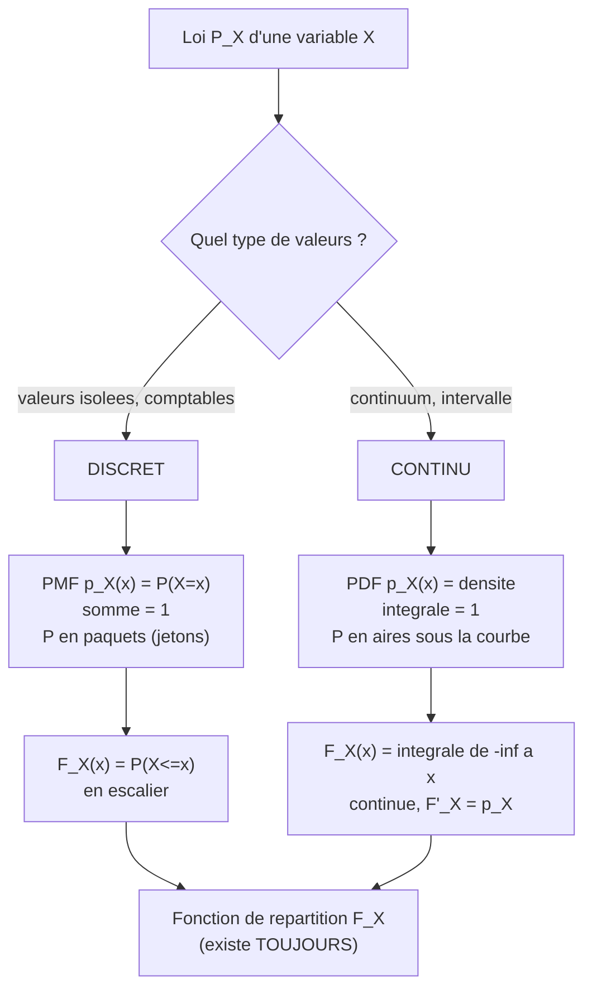

[← Sommaire](../README.md#table-des-matières)

# 6. Probabilités et distributions

### Construction d'un espace probabilisé

#### L'intuition : mesurer notre ignorance

Avant toute formule, posons l'image fondatrice. Une probabilite, ce n'est pas une propriete mysterieuse cachee dans les objets : c'est une maniere de **mesurer notre ignorance** ou la frequence avec laquelle quelque chose se produit. Quand on dit « cette piece a une chance sur deux de tomber sur pile », on resume en un nombre, $`\tfrac{1}{2}`$, toute notre incertitude sur le resultat d'un lancer que l'on n'a pas encore vu.

L'analogie la plus utile pour tout le chapitre est celle du **gateau decoupe**. Imaginez un gateau entier qui represente « tout ce qui peut arriver ». On le coupe en parts. Chaque part represente un evenement possible. La taille d'une part — sa fraction du gateau total — c'est sa probabilite. Le gateau entier vaut $`1`$ (c'est-a-dire $`100\%`$). Une part ne peut pas etre negative (on ne peut pas avoir « moins que rien » de gateau) et la somme de toutes les parts redonne exactement le gateau entier. Ces trois idees enfantines — total egal a un, jamais negatif, les parts s'additionnent — sont **exactement** les trois axiomes de Kolmogorov que nous allons formaliser.

#### Les trois ingredients : $`\Omega`$, $`\mathcal{F}`$, $`P`$

Un **espace probabilise (probability space)** est un triplet $`(\Omega, \mathcal{F}, P)`$. Examinons chaque ingredient.

> **Le symbole $`\Omega`$ (omega majuscule).** Ce symbole represente **l'ensemble de tout ce qui peut arriver**. C'est notre gateau entier avant decoupe. Pense a une grande boite qui contient, ecrits sur des petits papiers, absolument tous les resultats imaginables de l'experience. Pour un lancer de de, $`\Omega = \{1,2,3,4,5,6\}`$ : la boite contient six papiers. On l'appelle l'**univers** ou l'**espace des resultats**. Un element de cette boite, un resultat individuel, se note souvent $`\omega`$ (omega minuscule) : c'est **un** papier tire de la boite.

> **Le symbole $`\mathcal{F}`$ (F calligraphie).** Ce symbole represente **la liste de toutes les questions auxquelles on s'autorise a repondre par une probabilite**. Chaque « question » est en fait un sous-ensemble de $`\Omega`$, appele **evenement (event)**. Par exemple « le de est pair » correspond au sous-ensemble $`\{2,4,6\}`$. Pense a $`\mathcal{F}`$ comme au **menu d'un restaurant** : il ne liste pas des resultats bruts, mais des regroupements (des plats composes) sur lesquels on peut mettre un prix (une probabilite). On exige que ce menu soit « coherent » : si on peut demander la probabilite d'un evenement, on doit pouvoir demander celle de son contraire, et celle de combinaisons.

> **Le symbole $`P`$.** Ce symbole represente **la regle qui attribue a chaque evenement sa taille de part de gateau**, c'est-a-dire un nombre entre $`0`$ et $`1`$. On ecrit $`P(A)`$ et on lit « probabilite de $`A`$ ». Pense a $`P`$ comme a une **balance** : tu lui presentes un evenement (un morceau de gateau), elle te rend son poids, et le poids total de tout le gateau est toujours exactement $`1`$.

Formalisons. L'objet $`\mathcal{F}`$ doit etre une **tribu** (ou **sigma-algebre**, en anglais $`\sigma`$-*algebra*) sur $`\Omega`$, c'est-a-dire une famille de parties de $`\Omega`$ verifiant :

1. $`\Omega \in \mathcal{F}`$ (l'evenement certain « quelque chose arrive » est dans le menu) ;
2. si $`A \in \mathcal{F}`$, alors son complementaire $`A^{c} = \Omega \setminus A \in \mathcal{F}`$ (stabilite par passage au contraire) ;
3. si $`A_{1}, A_{2}, A_{3}, \dots \in \mathcal{F}`$ est une suite **denombrable** d'evenements, alors leur reunion $`\bigcup_{n=1}^{\infty} A_{n} \in \mathcal{F}`$ (stabilite par reunion denombrable).

> **Le symbole $`\bigcup`$ (grande reunion).** Ce symbole represente **« on rassemble tout dans un seul sac »**. Comme la somme $`\sum`$ est une boucle qui additionne des nombres, $`\bigcup_{n} A_{n}`$ est une boucle qui jette le contenu de chaque ensemble $`A_{n}`$ dans un grand sac commun : un element y figure des qu'il appartient a **au moins un** des $`A_{n}`$. Son cousin $`\bigcap`$ (grande intersection) garde au contraire seulement ce qui est **dans tous** a la fois.

> **Pourquoi « denombrable » (countable) ?** Denombrable veut dire « qu'on peut compter un par un, eventuellement sans fin » : les entiers $`1, 2, 3, \dots`$ sont denombrables, les points d'un segment ne le sont pas. On se limite a des reunions denombrables car vouloir mesurer **tous** les sous-ensembles d'un ensemble continu mene a des contradictions (ensembles non mesurables de Vitali). La tribu est precisement l'astuce qui dit : « je ne promets de peser que les morceaux raisonnables. »

Enfin, $`P : \mathcal{F} \to [0,1]`$ est une **mesure de probabilite** : une application qui satisfait les **axiomes de Kolmogorov** (Andrei Kolmogorov, 1933).

> **Definition (axiomes de Kolmogorov).** Une mesure de probabilite sur $`(\Omega, \mathcal{F})`$ est une application $`P : \mathcal{F} \to \mathbb{R}`$ telle que :
> - **(A1) Positivite.** $`P(A) \ge 0`$ pour tout $`A \in \mathcal{F}`$.
> - **(A2) Normalisation.** $`P(\Omega) = 1`$.
> - **(A3) Sigma-additivite.** Pour toute suite $`(A_{n})_{n \ge 1}`$ d'evenements **deux a deux disjoints** (c.-a-d. $`A_{i} \cap A_{j} = \varnothing`$ si $`i \ne j`$),
> ```math
> P\!\left( \bigcup_{n=1}^{\infty} A_{n} \right) = \sum_{n=1}^{\infty} P(A_{n}).
> ```

Ces trois axiomes sont la traduction litterale du gateau : (A1) une part n'est jamais negative, (A2) le gateau entier vaut $`1`$, (A3) si on coupe le gateau en parts qui ne se chevauchent pas, le poids du morceau reconstitue est la somme des poids des parts.

> **Le symbole $`\varnothing`$ (ensemble vide).** Ce symbole represente **« rien du tout »**, le sac completement vide, l'evenement impossible. C'est l'assiette ou il n'y a aucune part de gateau. On verra a l'instant que $`P(\varnothing) = 0`$.

#### Premieres consequences (et leurs preuves)

De ces trois axiomes decoulent, par pure logique, toutes les regles de calcul usuelles. Demontrons-les : chaque etape reste elementaire.

> **Proposition (regles elementaires).** Pour tous $`A, B \in \mathcal{F}`$ :
> 1. $`P(\varnothing) = 0`$.
> 2. **Additivite finie** : si $`A_{1}, \dots, A_{n}`$ sont deux a deux disjoints, $`P(\bigcup_{k=1}^{n} A_{k}) = \sum_{k=1}^{n} P(A_{k})`$.
> 3. **Complementaire** : $`P(A^{c}) = 1 - P(A)`$.
> 4. **Monotonie** : si $`A \subseteq B`$, alors $`P(A) \le P(B)`$.
> 5. **Inclusion-exclusion (2 termes)** : $`P(A \cup B) = P(A) + P(B) - P(A \cap B)`$.

**Preuve de 1.** Prenons la suite $`A_{1} = A_{2} = \dots = \varnothing`$. Ces ensembles sont deux a deux disjoints (l'intersection de $`\varnothing`$ avec lui-meme est $`\varnothing`$), et leur reunion est $`\varnothing`$. Par (A3), $`P(\varnothing) = \sum_{n=1}^{\infty} P(\varnothing)`$. Notons $`p = P(\varnothing) \ge 0`$. L'egalite $`p = \sum_{n=1}^\infty p`$ n'est possible pour un reel fini que si $`p = 0`$ (sinon la somme diverge vers $`+\infty`$). Donc $`P(\varnothing) = 0`$. $`\blacksquare`$

**Preuve de 2.** Completons la liste finie en une suite infinie en posant $`A_{n+1} = A_{n+2} = \dots = \varnothing`$. Les ensembles restent deux a deux disjoints. Par (A3) puis par $`P(\varnothing)=0`$ :
```math
P\!\left( \bigcup_{k=1}^{n} A_{k} \right) = \sum_{k=1}^{\infty} P(A_{k}) = \sum_{k=1}^{n} P(A_{k}) + \sum_{k>n} 0 = \sum_{k=1}^{n} P(A_{k}). \quad \blacksquare
```

**Preuve de 3.** Les evenements $`A`$ et $`A^{c}`$ sont disjoints et leur reunion est $`\Omega`$. Par additivite finie (2) et normalisation (A2) : $`P(A) + P(A^{c}) = P(\Omega) = 1`$, d'ou $`P(A^{c}) = 1 - P(A)`$. $`\blacksquare`$

**Preuve de 4.** Si $`A \subseteq B`$, on decompose $`B = A \cup (B \setminus A)`$, reunion **disjointe**. Donc $`P(B) = P(A) + P(B \setminus A) \ge P(A)`$ car $`P(B \setminus A) \ge 0`$ par (A1). $`\blacksquare`$

**Preuve de 5.** On ecrit $`A \cup B`$ comme reunion disjointe $`A \cup B = A \cup (B \setminus A)`$, donc $`P(A\cup B) = P(A) + P(B\setminus A)`$. Par ailleurs $`B = (A\cap B) \cup (B \setminus A)`$, reunion disjointe, donc $`P(B) = P(A\cap B) + P(B\setminus A)`$, c.-a-d. $`P(B\setminus A) = P(B) - P(A\cap B)`$. En substituant : $`P(A\cup B) = P(A) + P(B) - P(A\cap B)`$. $`\blacksquare`$

> **Remarque (la formule du « ou »).** La regle 5 corrige un piege courant : on ne peut pas additionner betement $`P(A)`$ et $`P(B)`$ pour avoir « $`A`$ ou $`B`$ », car on compterait deux fois la zone commune $`A \cap B`$. On la retranche une fois. C'est exactement comme compter les eleves qui font du sport **ou** de la musique : on additionne les deux clubs, puis on enleve une fois ceux qui sont dans les deux.

#### Un exemple chiffre deroule : le de equilibre

Prenons $`\Omega = \{1,2,3,4,5,6\}`$, $`\mathcal{F} = \mathcal{P}(\Omega)`$ (toutes les parties — ici $`2^{6} = 64`$ evenements possibles, car chaque face est soit dedans soit dehors), et $`P`$ uniforme : $`P(\{\omega\}) = \tfrac{1}{6}`$ pour chaque face.

- Evenement $`A`$ = « pair » $`= \{2,4,6\}`$. Par additivite : $`P(A) = \tfrac{1}{6}+\tfrac{1}{6}+\tfrac{1}{6} = \tfrac{3}{6} = \tfrac{1}{2}`$.
- Evenement $`B`$ = « au moins $`5`$ » $`= \{5,6\}`$ : $`P(B) = \tfrac{2}{6} = \tfrac{1}{3}`$.
- $`A \cap B = \{6\}`$, donc $`P(A\cap B) = \tfrac{1}{6}`$.
- Par inclusion-exclusion : $`P(A \cup B) = \tfrac{1}{2} + \tfrac{1}{3} - \tfrac{1}{6} = \tfrac{3}{6}+\tfrac{2}{6}-\tfrac{1}{6} = \tfrac{4}{6} = \tfrac{2}{3}`$. Verification directe : $`A \cup B = \{2,4,5,6\}`$, soit $`4`$ faces sur $`6`$, bien $`\tfrac{2}{3}`$.

#### Variables aleatoires et loi image

En pratique, on ne s'interesse presque jamais a $`\omega`$ brut (le « papier tire »), mais a une **mesure numerique** qu'on en extrait : le gain d'un pari, la taille d'une personne, le pixel d'une image. C'est le role de la **variable aleatoire (random variable)**.

> **Definition (variable aleatoire reelle).** Une variable aleatoire est une application $`X : \Omega \to \mathbb{R}`$ qui est **mesurable**, c'est-a-dire telle que pour tout reel $`x`$, l'ensemble $`\{\omega \in \Omega : X(\omega) \le x\}`$ appartient a $`\mathcal{F}`$. Cette condition garantit qu'on a le droit de demander « quelle est la probabilite que $`X`$ soit inferieur a $`x`$ ? ».

> **Comment lire ce symbole $`X`$.** Ce symbole (en majuscule) represente **une machine a chiffres branchee sur le hasard** : on tourne la manivelle (on tire $`\omega`$), et la machine affiche un nombre $`X(\omega)`$. Le hasard est dans la manivelle ; $`X`$ n'est que la regle de lecture. Convention universelle : la **variable** (la machine, encore inconnue) est en MAJUSCULE $`X`$ ; la **valeur** observee (le chiffre affiche) est en minuscule $`x`$.

La probabilite $`P`$ vivant sur $`\Omega`$ se **transporte** alors sur les nombres reels via $`X`$. On definit la **loi (distribution)** de $`X`$, notee $`P_{X}`$, par
```math
P_{X}(B) = P\big( X^{-1}(B) \big) = P\big( \{\omega : X(\omega) \in B\} \big),
```
pour tout ensemble $`B`$ de reels (borelien). On la resume par la **fonction de repartition (cumulative distribution function, CDF)** :
```math
F_{X}(x) = P(X \le x).
```

> **Image mentale.** $`X`$ est une **moulinette** qui pousse la pate (la probabilite) depuis le moule $`\Omega`$ vers une assiette graduee (les reels). On oublie d'ou venait chaque gramme de pate ; il ne reste que la facon dont la pate s'etale sur la graduation. Toute la suite du chapitre — distributions discretes, continues, gaussienne — decrit **la forme de cet etalement**.

> **Mise a jour 2026.** Cette construction abstraite (mesurabilite, tribus) reste le socle exact des bibliotheques modernes de programmation probabiliste. Dans des outils comme **NumPyro**, **TensorFlow Probability** ou **Pyro**, un objet `Distribution` n'est rien d'autre qu'une loi $`P_{X}`$ munie de deux operations cles : `sample` (tirer un $`\omega`$ et renvoyer $`X(\omega)`$) et `log_prob` (evaluer la densite, voir section suivante). La theorie de la mesure justifie pourquoi ces deux briques suffisent a tout reconstruire, y compris la differentiation automatique a travers le tirage.

```python
import numpy as np

rng = np.random.default_rng(0)

omega = np.array([1, 2, 3, 4, 5, 6])
P = np.full(6, 1 / 6)

def proba(event_mask):
    return P[event_mask].sum()

A = np.isin(omega, [2, 4, 6])
B = np.isin(omega, [5, 6])

print(proba(A))            # 0.5
print(proba(B))            # 0.333...
print(proba(A & B))        # 0.166...  -> P(A inter B)
print(proba(A | B))        # 0.666...  -> P(A union B)

tirages = rng.choice(omega, size=1_000_000, p=P)
print((tirages % 2 == 0).mean())   # ~0.5, estimation frequentiste de P(A)
```

La derniere ligne illustre l'**interpretation frequentiste** : la probabilite est la limite de la frequence observee quand on repete l'experience un grand nombre de fois. C'est le pont concret entre l'axiomatique abstraite et les donnees reelles que manipule le machine learning.

---

### Probabilités discrètes et continues

Une fois la loi $`P_X`$ d'une variable aleatoire posee, deux grands mondes s'ouvrent selon la nature des valeurs prises : un monde **discret** (valeurs isolees, qu'on peut compter) et un monde **continu** (valeurs formant un continuum, comme tous les reels d'un intervalle). Ils se decrivent par deux objets jumeaux : la fonction de masse pour l'un, la densite pour l'autre.

#### Le cas discret : la fonction de masse

> **Definition (variable discrete et PMF).** Une variable aleatoire $`X`$ est **discrete** si elle ne prend qu'un nombre fini ou denombrable de valeurs $`x_{1}, x_{2}, \dots`$. Sa loi est entierement decrite par sa **fonction de masse (probability mass function, PMF)** :
> ```math
> p_{X}(x) = P(X = x).
> ```
> Elle verifie $`p_{X}(x) \ge 0`$ et $`\sum_{i} p_{X}(x_{i}) = 1`$.

> **Le symbole $`\sum`$ (somme sigma), rappel d'usage.** On l'a vu aux chapitres precedents : c'est **une boucle qui additionne**. Ici $`\sum_{i} p_{X}(x_{i})`$ veut dire « passe en revue chaque valeur possible $`x_{i}`$, prends sa probabilite, et fais le total ». Le resultat doit valoir $`1`$ : c'est notre gateau, redecoupe en parts comptables.

L'image est limpide : la masse de probabilite est posee en **paquets discrets** sur certains points de la droite, comme des piles de jetons de hauteurs differentes posees sur des cases. La hauteur de la pile en $`x`$ est $`p_X(x)`$ ; la somme des hauteurs fait $`1`$.

**Lois discretes de reference.** Voici les briques qu'on rencontre partout en pratique. (On note $`\mathrm{Pois}(\lambda)`$ la loi de Poisson, pour eviter toute confusion avec l'ensemble des parties $`\mathcal{P}(\Omega)`$ et la mesure $`P`$.)

| Loi | Notation | $`p_X(k)`$ | Support | Esperance | Variance |
|---|---|---|---|---|---|
| Bernoulli | $`\mathcal{B}(p)`$ | $`p^{k}(1-p)^{1-k}`$ | $`k\in\{0,1\}`$ | $`p`$ | $`p(1-p)`$ |
| Binomiale | $`\mathcal{B}(n,p)`$ | $`\binom{n}{k}p^{k}(1-p)^{n-k}`$ | $`k\in\{0,\dots,n\}`$ | $`np`$ | $`np(1-p)`$ |
| Geometrique | $`\mathcal{G}(p)`$ | $`(1-p)^{k-1}p`$ | $`k\in\{1,2,\dots\}`$ | $`1/p`$ | $`(1-p)/p^{2}`$ |
| Poisson | $`\mathrm{Pois}(\lambda)`$ | $`e^{-\lambda}\lambda^{k}/k!`$ | $`k\in\{0,1,\dots\}`$ | $`\lambda`$ | $`\lambda`$ |

> **Le symbole $`\binom{n}{k}`$ (coefficient binomial).** Ce symbole represente **le nombre de facons de choisir $`k`$ objets parmi $`n`$ sans tenir compte de l'ordre**. On le lit « $`k`$ parmi $`n`$ ». Concretement : combien d'equipes de $`k`$ joueurs peut-on former dans un groupe de $`n`$ ? Sa formule est $`\binom{n}{k} = \dfrac{n!}{k!\,(n-k)!}`$, ou le symbole $`!`$ (factorielle) signifie « multiplie tous les entiers de $`1`$ jusqu'a ce nombre » : $`4! = 1\times2\times3\times4 = 24`$. Pense a $`\binom{n}{k}`$ comme au nombre de combinaisons possibles d'une serrure ou l'ordre ne compte pas.

> **Exemple chiffre (binomiale).** On lance $`n=3`$ fois une piece equilibree ($`p=\tfrac12`$). Probabilite d'obtenir exactement $`k=2`$ piles ?
> ```math
> p_X(2) = \binom{3}{2}\left(\tfrac12\right)^{2}\left(\tfrac12\right)^{1} = 3 \times \tfrac14 \times \tfrac12 = \tfrac{3}{8} = 0{,}375.
> ```
> On le verifie a la main : les sequences a $`2`$ piles sont PPF, PFP, FPP, soit $`3`$ cas sur $`2^3 = 8`$ egalement probables, bien $`\tfrac{3}{8}`$.

#### Le cas continu : la densite

Quand $`X`$ prend ses valeurs dans un continuum (un poids exact en kilogrammes, un temps d'attente), un phenomene contre-intuitif apparait : la probabilite de tomber sur **une** valeur precise est **nulle**. La probabilite qu'une personne mesure exactement $`1{,}750000\dots`$ m est $`0`$, car il y a une infinite non denombrable de tailles possibles. On ne peut plus poser des jetons sur des points : la masse est **etalee comme une couche de beurre** sur la droite, et ce qui compte est son **epaisseur locale**.

> **Definition (variable continue et densite).** Une variable $`X`$ est **continue** (a densite, ou absolument continue) s'il existe une fonction $`p_{X} \ge 0`$, appelee **densite de probabilite (probability density function, PDF)**, telle que pour tout intervalle $`[a,b]`$ :
> ```math
> P(a \le X \le b) = \int_{a}^{b} p_{X}(x)\,\mathrm{d}x,
> ```
> avec la condition de normalisation $`\displaystyle\int_{-\infty}^{+\infty} p_{X}(x)\,\mathrm{d}x = 1`$.

> **Le symbole $`\int`$ (integrale).** Ce symbole represente **une somme continue, une boucle d'addition pour des quantites infiniment fines**. La somme $`\sum`$ additionne des jetons separes ; l'integrale $`\int_a^b p_X(x)\,\mathrm{d}x`$ additionne une infinite de tranches infiniment minces sous la courbe $`p_X`$, entre $`a`$ et $`b`$. Le morceau $`\mathrm{d}x`$ est la **largeur** d'une tranche (infiniment petite), et $`p_X(x)`$ sa **hauteur** : leur produit $`p_X(x)\,\mathrm{d}x`$ est l'aire d'une tranche, c'est-a-dire un petit bout de probabilite. L'integrale fait le total de toutes ces aires. **Retiens cette image : une probabilite continue est une aire sous une courbe.**

> **Le symbole $`p(x)`$ (densite).** Attention au piege central : $`p_X(x)`$ **n'est pas** une probabilite ! C'est une **densite**, une probabilite **par unite de longueur** (comme une densite de population : habitants par km², qui peut depasser $`1`$). Une densite peut tres bien valoir $`5`$ en un point. Ce qui est toujours entre $`0`$ et $`1`$, c'est l'**aire** $`p_X(x)\,\mathrm{d}x`$ sur un petit morceau, et l'aire totale qui vaut $`1`$. Pense a la densite comme a la **richesse du beurre** a un endroit de la tartine ; la quantite de beurre reellement mangee est l'aire (densite $`\times`$ largeur de la bouchee).

> **Piege classique.** En continu, $`P(X = a) = \int_a^a p_X(x)\,\mathrm{d}x = 0`$ pour tout point $`a`$. Consequence pratique : les inegalites larges et strictes donnent la meme probabilite, $`P(X \le a) = P(X < a)`$. C'est faux en discret, ou un point porte une masse non nulle.

#### Le pont unificateur : la fonction de repartition

La **fonction de repartition** $`F_X(x) = P(X \le x)`$ reconcilie les deux mondes : elle existe **toujours**, discret ou continu. Elle est croissante (au sens large), continue a droite, tend vers $`0`$ en $`-\infty`$ et vers $`1`$ en $`+\infty`$.



- **Discret** : $`F_X`$ est une fonction **en escalier**, qui saute de $`p_X(x_i)`$ a chaque valeur $`x_i`$.
- **Continu** : $`F_X`$ est continue et $`F_X'(x) = p_X(x)`$ (en tout point de continuite de $`p_X`$) — la densite est la **pente** de la fonction de repartition. Inversement $`F_X(x) = \int_{-\infty}^x p_X(t)\,\mathrm{d}t`$.

Ce lien $`F_X' = p_X`$ est l'analogue exact du theoreme fondamental de l'analyse : la densite mesure la vitesse a laquelle la probabilite s'accumule.

> **Application en machine learning.** La distinction discret/continu structure tout le choix de modele. Un classifieur produit une loi **discrete** sur les classes (sortie d'un *softmax*, qui est litteralement une PMF). Un modele generatif d'images ou un debruiteur produit une loi **continue** sur les pixels. La fonction de cout par excellence, la **log-vraisemblance negative (negative log-likelihood)**, s'ecrit $`-\log p_X(x)`$ : on y met une PMF en classification, une PDF en regression. C'est pourquoi `log_prob` est l'operation centrale des bibliotheques citees.

```python
import numpy as np
from scipy import stats

# --- Discret : binomiale B(3, 1/2) ---
k = np.arange(0, 4)
pmf = stats.binom.pmf(k, n=3, p=0.5)
print(pmf)            # [0.125 0.375 0.375 0.125]
print(pmf.sum())      # 1.0  -> normalisation

# --- Continu : loi normale standard ---
x = np.linspace(-4, 4, 100000)
pdf = stats.norm.pdf(x)            # densite, peut depasser... ici max ~0.399
aire = np.trapezoid(pdf, x)        # integrale numerique (np.trapz est deprecie depuis NumPy 2.0)
print(round(aire, 4))             # ~1.0  -> normalisation

# P(-1 <= X <= 1) comme AIRE sous la courbe
mask = (x >= -1) & (x <= 1)
print(round(np.trapezoid(pdf[mask], x[mask]), 4))   # ~0.6827 (regle des 68%)

# P(X = 0.5) en continu : nul
print(stats.norm.cdf(0.5) - stats.norm.cdf(0.5))  # 0.0
```

---

### Règle de la somme, règle du produit et théorème de Bayes

Tout l'edifice du calcul probabiliste — et, on le verra, de l'apprentissage bayesien — repose sur **deux regles** seulement, dont decoule un theoreme universel. On travaille desormais avec **plusieurs** variables a la fois, ce qui introduit les lois jointes, marginales et conditionnelles.

#### Loi jointe, loi marginale

> **Le symbole virgule dans $`p(x,y)`$ (loi jointe).** La virgule represente le **« ET » simultane**. La quantite $`p(x,y) = P(X=x, Y=y)`$ est la probabilite que $`X`$ vaille $`x`$ **et en meme temps** $`Y`$ vaille $`y`$. Image : une grille (un tableur) ou les lignes sont les valeurs de $`X`$, les colonnes celles de $`Y`$ ; $`p(x,y)`$ est ce qui est ecrit dans la **case** a l'intersection. La somme de toutes les cases vaut $`1`$.

> **Regle de la somme (sum rule / marginalisation).** Pour recuperer la loi d'une seule variable a partir de la loi jointe, on **somme sur l'autre** (on « marginalise ») :
> ```math
> p(x) = \sum_{y} p(x,y) \quad \text{(discret)}, \qquad p(x) = \int p(x,y)\,\mathrm{d}y \quad \text{(continu)}.
> ```
> $`p(x)`$ s'appelle la **loi marginale (marginal distribution)** de $`X`$.

L'image est parlante : dans le tableur, la loi marginale de $`X`$, c'est la colonne des **totaux de lignes**, ecrite dans la **marge** du tableau (d'ou le nom). On a aplati la dimension $`Y`$ en additionnant tout le long.

#### Probabilite conditionnelle, regle du produit

> **Le symbole barre $`\mid`$ dans $`p(x \mid y)`$ (conditionnement).** Cette barre verticale se lit **« sachant que »**. La quantite $`p(x \mid y) = P(X = x \mid Y = y)`$ est la probabilite que $`X = x`$ **une fois qu'on sait deja** que $`Y = y`$. Image : on a appris une information ($`Y=y`$), donc on **jette tout le reste du gateau** et on ne regarde plus que la tranche ou $`Y=y`$ ; on y recalcule les proportions pour que cette tranche fasse a son tour un gateau entier (de masse $`1`$). Conditionner, c'est **zoomer sur un sous-monde** et y renormaliser.

> **Definition (probabilite conditionnelle).** Pour $`P(B) > 0`$,
> ```math
> P(A \mid B) = \frac{P(A \cap B)}{P(B)}.
> ```
> Le numerateur est la part commune ; le denominateur renormalise pour que le sous-monde $`B`$ pese $`1`$.

> **Regle du produit (product rule).** En reorganisant la definition :
> ```math
> p(x, y) = p(x \mid y)\, p(y) = p(y \mid x)\, p(x).
> ```
> Lecture : la probabilite que **deux** choses arrivent = (proba de la premiere) $`\times`$ (proba de la seconde **sachant** la premiere).

> **Le symbole $`\prod`$ (produit pi).** Ce symbole represente **une boucle qui multiplie**, exactement comme $`\sum`$ est une boucle qui additionne. $`\prod_{i=1}^{n} a_i = a_1 \times a_2 \times \dots \times a_n`$. Il apparait des qu'on enchaine la regle du produit sur plusieurs variables : la **regle de chainage (chain rule)** generalise
> ```math
> p(x_1, x_2, \dots, x_n) = \prod_{i=1}^{n} p(x_i \mid x_1, \dots, x_{i-1}).
> ```
> Pense a $`\prod`$ comme a une chaine de probabilites : chaque maillon est conditionne par tous les precedents. C'est **exactement** la formule qu'optimise un modele de langage autoregressif (chaque mot sachant les mots precedents).

#### Le theoreme de Bayes

En combinant les deux ecritures de la regle du produit, $`p(x \mid y)\,p(y) = p(y \mid x)\,p(x)`$, on isole $`p(x \mid y)`$ et l'on obtient le resultat le plus important de tout le chapitre.

> **Theoreme (Bayes, 1763).** Pour $`p(y) > 0`$ :
> ```math
> \underbrace{p(x \mid y)}_{\text{posterior}} = \frac{\overbrace{p(y \mid x)}^{\text{vraisemblance}}\ \overbrace{p(x)}^{\text{prior}}}{\underbrace{p(y)}_{\text{evidence}}}, \qquad \text{avec} \quad p(y) = \sum_{x'} p(y \mid x')\,p(x').
> ```

Le denominateur $`p(y)`$ (l'**evidence**, ou *marginal likelihood*) se calcule par la regle de la somme appliquee au numerateur : il sert uniquement de **constante de normalisation** pour que $`p(\cdot \mid y)`$ soit une vraie loi sommant a $`1`$. D'ou la forme operationnelle qu'on retient :
```math
\text{posterior} \ \propto\ \text{vraisemblance} \times \text{prior}.
```

> **Le symbole $`\propto`$ (proportionnel a).** Ce symbole represente **« egal a un facteur constant pres »**. Quand on ecrit $`a \propto b`$, cela veut dire $`a = c \cdot b`$ pour une constante $`c`$ qu'on ne precise pas (ici, $`1/p(y)`$). Image : la **forme** de la distribution est donnee par le produit vraisemblance $`\times`$ prior ; la constante ne fait que regler l'echelle pour que l'aire totale fasse $`1`$. Tres pratique : on calcule la forme, on normalise a la fin.

Le vocabulaire bayesien merite d'etre ancre, car c'est la grammaire de l'apprentissage moderne.

| Terme | Notation | Sens intuitif |
|---|---|---|
| **Prior** (a priori) | $`p(x)`$ | Ce qu'on croit **avant** de voir la donnee |
| **Vraisemblance** (likelihood) | $`p(y \mid x)`$ | A quel point l'hypothese $`x`$ explique la donnee $`y`$ observee |
| **Posterior** (a posteriori) | $`p(x \mid y)`$ | Ce qu'on croit **apres** avoir vu la donnee |
| **Evidence** (marginal likelihood) | $`p(y)`$ | Probabilite globale de la donnee, toutes hypotheses confondues |

> **Exemple chiffre deroule : test medical (le piege des faux positifs).** Une maladie touche $`1`$ personne sur $`1000`$ : prior $`P(M) = 0{,}001`$. Le test detecte la maladie dans $`99\%`$ des cas si elle est presente (**sensibilite** $`P(+\mid M) = 0{,}99`$) ; chez les personnes saines, il se trompe dans $`5\%`$ des cas (**taux de faux positifs** $`P(+\mid \overline M) = 0{,}05`$, c'est-a-dire une **specificite** $`P(-\mid\overline M) = 0{,}95`$). **Question : une personne testee positive est-elle vraiment malade ?**
>
> Calculons l'evidence par la regle de la somme :
> ```math
> P(+) = P(+\mid M)P(M) + P(+\mid \overline M)P(\overline M) = 0{,}99 \times 0{,}001 + 0{,}05 \times 0{,}999 = 0{,}00099 + 0{,}04995 = 0{,}05094.
> ```
> Puis Bayes :
> ```math
> P(M \mid +) = \frac{P(+\mid M)P(M)}{P(+)} = \frac{0{,}00099}{0{,}05094} \approx 0{,}0194 \approx 1{,}9\%.
> ```
> **Resultat contre-intuitif** : malgre un test « fiable a $`99\%`$ », un positif n'a qu'environ $`2\%`$ de chances d'etre reellement malade ! La raison : la maladie est si rare que les faux positifs (sur les $`999`$ sains) submergent les vrais positifs (sur l'unique malade). C'est l'illustration reine de l'importance du **prior** : negliger la rarete de base (*base rate fallacy*) conduit a des conclusions absurdes.

```python
import numpy as np

P_M = 0.001
P_pos_M = 0.99        # sensibilite
P_pos_notM = 0.05     # taux de faux positifs (= 1 - specificite)

P_notM = 1 - P_M
evidence = P_pos_M * P_M + P_pos_notM * P_notM     # regle de la somme
posterior = (P_pos_M * P_M) / evidence             # Bayes
print(round(evidence, 5))     # 0.05094
print(round(posterior, 4))    # 0.0194  -> ~1.9 %
```

> **Application en machine learning.** Bayes est le moteur de l'**inference**. En apprentissage bayesien, $`x`$ devient le vecteur de parametres $`\theta`$ d'un modele et $`y`$ le jeu de donnees $`\mathcal{D}`$ : on cherche $`p(\theta \mid \mathcal{D}) \propto p(\mathcal{D}\mid\theta)\,p(\theta)`$, soit « mes parametres apres avoir vu les donnees ». Le **maximum a posteriori (MAP)** maximise ce posterior ; le **maximum de vraisemblance (MLE)** ignore le prior et maximise seulement $`p(\mathcal D\mid\theta)`$. Le classifieur **naif de Bayes** applique directement le theoreme en supposant les caracteristiques conditionnellement independantes. Et la regularisation $`L_2`$ (*weight decay*) n'est rien d'autre qu'un MAP avec prior gaussien sur les poids, comme on le reverra.

> **Mise a jour 2026.** L'evidence $`p(y) = \int p(y\mid x)p(x)\,\mathrm{d}x`$ est en general une integrale insoluble en grande dimension. Tout un pan de la recherche vise a la contourner : **inference variationnelle** (on approche le posterior par une loi simple en maximisant une borne, l'ELBO), **MCMC** modernes (NUTS, *No-U-Turn Sampler*, au coeur de Stan et NumPyro), et **flots normalisants (normalizing flows)** qui apprennent un changement de variables vers une loi simple (voir derniere section). En 2026, ces methodes, accelerees par autodiff sur GPU, rendent l'inference bayesienne praticable sur des reseaux de neurones entiers.

---

### Statistiques résumées et indépendance

Une distribution complete (PMF ou PDF) contient toute l'information, mais elle est souvent trop riche a manipuler. On la **resume** par quelques nombres cles : ou est-elle centree (esperance), a quel point est-elle etalee (variance), comment deux variables bougent-elles ensemble (covariance) ?

#### L'esperance : le centre de gravite

> **Le symbole $`\mathbb{E}`$ (esperance).** Ce symbole represente **la moyenne ponderee par les probabilites**, c'est-a-dire la valeur « typique » autour de laquelle la variable se balance. Image physique exacte : si on pose les masses de probabilite le long d'une regle, $`\mathbb{E}[X]`$ est le **point d'equilibre**, le centre de gravite ou la regle tient en equilibre sur un doigt. On le note aussi $`\mu`$ (mu). Ce n'est pas la valeur la plus probable, c'est la moyenne « a la longue ».

> **Definition (esperance).** Pour une variable discrete puis continue :
> ```math
> \mathbb{E}[X] = \sum_{i} x_{i}\, p_X(x_{i}) \qquad ; \qquad \mathbb{E}[X] = \int_{-\infty}^{+\infty} x\, p_X(x)\,\mathrm{d}x.
> ```
> Plus generalement, pour une fonction $`g`$ (**theoreme du statisticien inconscient**, *law of the unconscious statistician*) :
> ```math
> \mathbb{E}[g(X)] = \sum_i g(x_i)\,p_X(x_i) \qquad ; \qquad \mathbb{E}[g(X)] = \int g(x)\,p_X(x)\,\mathrm{d}x.
> ```

> **Propriete cle : la linearite de l'esperance.** Pour toutes variables $`X, Y`$ et tous reels $`a, b`$ :
> ```math
> \mathbb{E}[aX + bY] = a\,\mathbb{E}[X] + b\,\mathbb{E}[Y].
> ```
> **Remarquable** : cette egalite est vraie **meme si $`X`$ et $`Y`$ ne sont pas independantes**. C'est l'une des proprietes les plus puissantes et les plus utilisees de toutes les probabilites.

**Preuve (cas discret, deux variables).** Par definition et regle de la somme :
```math
\mathbb{E}[aX+bY] = \sum_{x,y}(ax+by)\,p(x,y) = a\sum_{x,y} x\,p(x,y) + b\sum_{x,y} y\,p(x,y) = a\sum_x x\,p(x) + b\sum_y y\,p(y) = a\mathbb{E}[X]+b\mathbb{E}[Y].
```
On a juste utilise la marginalisation $`\sum_y p(x,y) = p(x)`$. $`\blacksquare`$

#### La variance : la dispersion

> **Le symbole $`\mathrm{Var}`$ (variance).** Ce symbole represente **a quel point les valeurs s'eloignent en moyenne du centre**. On mesure l'ecart a la moyenne, on l'eleve au carre (pour que les ecarts positifs et negatifs ne s'annulent pas, et pour penaliser fort les grands ecarts), puis on en prend la moyenne. Image : si l'esperance est le centre d'une cible, la variance dit si les fleches sont **groupees** (petite variance) ou **dispersees** (grande variance). On la note aussi $`\sigma^{2}`$ (sigma au carre).

> **Definition (variance et ecart-type).**
> ```math
> \mathrm{Var}(X) = \mathbb{E}\big[(X - \mathbb{E}[X])^{2}\big] = \mathbb{E}[X^{2}] - \big(\mathbb{E}[X]\big)^{2}.
> ```
> Sa racine carree $`\sigma_X = \sqrt{\mathrm{Var}(X)}`$ est l'**ecart-type (standard deviation)**, exprime dans la **meme unite** que $`X`$ (d'ou son interet pratique).

**Preuve de la formule de Koenig–Huygens** $`\mathrm{Var}(X) = \mathbb{E}[X^2] - \mathbb{E}[X]^2`$. Posons $`\mu = \mathbb{E}[X]`$. En developpant le carre et par linearite :
```math
\mathbb{E}[(X-\mu)^2] = \mathbb{E}[X^2 - 2\mu X + \mu^2] = \mathbb{E}[X^2] - 2\mu\,\mathbb{E}[X] + \mu^2 = \mathbb{E}[X^2] - 2\mu^2 + \mu^2 = \mathbb{E}[X^2] - \mu^2. \quad \blacksquare
```

> **Le symbole $`\sigma`$ (sigma minuscule), ecart-type.** A ne pas confondre avec $`\sum`$ (sigma majuscule, la somme) ! Le $`\sigma`$ minuscule represente **la largeur typique de l'etalement** d'une distribution, dans la meme unite que les donnees. Si $`X`$ est une taille en cm, $`\sigma`$ est en cm. Image : c'est le « rayon flou » autour du centre dans lequel se trouvent la plupart des valeurs.

**Regle de transformation.** Pour des constantes $`a, b`$ : $`\mathrm{Var}(aX + b) = a^{2}\,\mathrm{Var}(X)`$. La translation $`b`$ ne change rien (deplacer la cible ne change pas la dispersion des fleches) ; le facteur $`a`$ ressort **au carre**.

> **Exemple chiffre deroule (de equilibre).** $`X`$ = face d'un de a six faces, $`p(k) = \tfrac16`$.
> Esperance : $`\mathbb{E}[X] = \tfrac{1+2+3+4+5+6}{6} = \tfrac{21}{6} = 3{,}5`$.
> Moment d'ordre 2 : $`\mathbb{E}[X^2] = \tfrac{1+4+9+16+25+36}{6} = \tfrac{91}{6} \approx 15{,}1\overline{6}`$.
> Variance : $`\mathrm{Var}(X) = \tfrac{91}{6} - 3{,}5^2 = 15{,}1\overline 6 - 12{,}25 = \tfrac{105}{36} \approx 2{,}9167`$.
> Ecart-type : $`\sigma_X = \sqrt{2{,}9167} \approx 1{,}708`$.

#### Covariance et correlation : bouger ensemble

> **Le symbole $`\mathrm{Cov}`$ (covariance).** Ce symbole represente **la tendance de deux variables a varier dans le meme sens**. Quand $`X`$ est au-dessus de sa moyenne, $`Y`$ l'est-il aussi ? Si oui (covariance positive), elles montent ensemble ; si $`Y`$ est plutot en dessous quand $`X`$ est au-dessus (covariance negative), elles vont en sens opposes. Image : deux danseurs ; la covariance dit s'ils bougent en harmonie (positif), a contretemps (negatif) ou independamment (zero).

> **Definition (covariance).**
> ```math
> \mathrm{Cov}(X, Y) = \mathbb{E}\big[(X - \mathbb{E}[X])(Y - \mathbb{E}[Y])\big] = \mathbb{E}[XY] - \mathbb{E}[X]\,\mathbb{E}[Y].
> ```
> Noter que $`\mathrm{Cov}(X,X) = \mathrm{Var}(X)`$ : la variance est la covariance d'une variable avec elle-meme.

Le defaut de la covariance est de dependre des **unites** (en cm·kg, elle n'est pas interpretable). On la normalise en **coefficient de correlation (correlation)** de Pearson :
```math
\rho(X, Y) = \frac{\mathrm{Cov}(X, Y)}{\sigma_X\,\sigma_Y} \in [-1, 1].
```
La valeur $`\rho = +1`$ signifie alignement parfait croissant, $`\rho = -1`$ alignement parfait decroissant, $`\rho = 0`$ absence de **liaison lineaire**.

> **Piege majeur : correlation n'est pas causalite, et $`\rho=0`$ n'est pas independance.** La correlation ne capte que le lien **lineaire**. Si $`Y = X^2`$ avec $`X`$ symetrique autour de $`0`$, alors $`\rho(X,Y) = 0`$ alors que $`Y`$ est **entierement determinee** par $`X`$ ! Une correlation nulle n'implique **pas** l'independance ; seule la reciproque est vraie (independance $`\Rightarrow`$ covariance nulle). Garde cet exemple en tete, il revient sans cesse en pratique.

#### La matrice de covariance

Pour un **vecteur aleatoire** $`\mathbf{X} = (X_1, \dots, X_d)^\top`$, on rassemble toutes les covariances dans une matrice.

> **Definition (matrice de covariance).**
> ```math
> \boldsymbol{\Sigma} = \mathrm{Cov}(\mathbf{X}) = \mathbb{E}\big[(\mathbf{X} - \boldsymbol{\mu})(\mathbf{X} - \boldsymbol{\mu})^{\top}\big], \qquad \Sigma_{ij} = \mathrm{Cov}(X_i, X_j).
> ```
> Sur la **diagonale** on trouve les variances $`\Sigma_{ii} = \mathrm{Var}(X_i)`$ ; **hors diagonale**, les covariances croisees. Cette matrice est **symetrique** ($`\Sigma_{ij} = \Sigma_{ji}`$) et **semi-definie positive** (toutes ses valeurs propres sont $`\ge 0`$).

> **Pourquoi semi-definie positive ?** Pour tout vecteur $`\mathbf{v}`$, la combinaison $`\mathbf{v}^\top \mathbf{X}`$ est une variable aleatoire scalaire, donc sa variance est $`\ge 0`$. Or $`\mathrm{Var}(\mathbf{v}^\top\mathbf{X}) = \mathbf{v}^\top \boldsymbol{\Sigma}\,\mathbf{v} \ge 0`$, ce qui est **exactement** la definition d'une matrice semi-definie positive. La structure geometrique (vecteurs/matrices des chapitres precedents) rejoint ici la probabilite.

#### Independance

> **Definition (independance).** Deux variables $`X, Y`$ sont **independantes (independent)**, note $`X \perp\!\!\!\perp Y`$, si leur loi jointe se **factorise** :
> ```math
> p(x, y) = p(x)\,p(y) \quad \text{pour tout } (x,y),
> ```
> ce qui equivaut a $`p(x\mid y) = p(x)`$ (lorsque $`p(y) > 0`$) : savoir $`Y`$ n'apprend **rien** sur $`X`$. Le sous-monde conditionnel a la meme forme que le monde entier.

> **Le symbole $`\perp\!\!\!\perp`$ (independance).** Ce symbole represente **« n'ont aucune influence l'une sur l'autre »**. Comme deux des lances dans deux pieces differentes : connaitre le resultat de l'un ne donne strictement aucune information sur l'autre. Image : deux histoires sans personnage commun.

**Consequences de l'independance** (faux en general sans elle) :
- $`\mathbb{E}[XY] = \mathbb{E}[X]\,\mathbb{E}[Y]`$, donc $`\mathrm{Cov}(X,Y) = 0`$ (la reciproque est fausse, cf. piege ci-dessus) ;
- $`\mathrm{Var}(X + Y) = \mathrm{Var}(X) + \mathrm{Var}(Y)`$ (les variances s'additionnent).

> **Le cas i.i.d., omnipresent en ML.** On dit que des donnees $`X_1, \dots, X_n`$ sont **i.i.d.** (*independent and identically distributed* : independantes et de meme loi) si elles sont mutuellement independantes et tirees de la **meme** distribution. C'est l'hypothese fondatrice de presque tout l'apprentissage supervise : on suppose que les exemples d'entrainement sont des tirages i.i.d. d'une loi inconnue. Sous i.i.d., la **vraisemblance** d'un jeu de donnees se factorise en produit, $`p(\mathcal D\mid\theta) = \prod_{i=1}^n p(x_i\mid\theta)`$, et la **log-vraisemblance** en somme, $`\sum_i \log p(x_i\mid\theta)`$ — ce qui rend l'optimisation par descente de gradient possible.

> **Exemple chiffre deroule (covariance sur loi jointe).** Soit la loi jointe discrete :
>
> | $`p(x,y)`$ | $`y=0`$ | $`y=1`$ | marginale $`p(x)`$ |
> |---|---|---|---|
> | $`x=0`$ | $`0{,}4`$ | $`0{,}2`$ | $`0{,}6`$ |
> | $`x=1`$ | $`0{,}1`$ | $`0{,}3`$ | $`0{,}4`$ |
> | marginale $`p(y)`$ | $`0{,}5`$ | $`0{,}5`$ | $`1`$ |
>
> $`\mathbb{E}[X] = 0{,}4`$, $`\mathbb{E}[Y] = 0{,}5`$.
> $`\mathbb{E}[XY] = \sum xy\,p(x,y) = 1\cdot1\cdot 0{,}3 = 0{,}3`$ (seul le terme $`x=y=1`$ est non nul).
> $`\mathrm{Cov}(X,Y) = 0{,}3 - 0{,}4\times 0{,}5 = 0{,}3 - 0{,}2 = 0{,}1 > 0`$.
> Test d'independance : $`p(0,0) = 0{,}4`$ mais $`p(0)p(0) = 0{,}6\times 0{,}5 = 0{,}3 \ne 0{,}4`$. Donc $`X`$ et $`Y`$ ne sont **pas** independantes — coherent avec une covariance non nulle.

```python
import numpy as np

# Echantillon bivarie correle
rng = np.random.default_rng(1)
mean = [0.0, 0.0]
cov_true = [[1.0, 0.8],
            [0.8, 1.0]]
data = rng.multivariate_normal(mean, cov_true, size=100000)

emp_mean = data.mean(axis=0)
emp_cov = np.cov(data, rowvar=False)          # matrice de covariance empirique
emp_corr = np.corrcoef(data, rowvar=False)    # matrice de correlation

print(np.round(emp_mean, 3))   # ~[0. 0.]
print(np.round(emp_cov, 3))    # ~[[1.  0.8],[0.8 1.]]
print(np.round(emp_corr, 3))   # ~[[1.  0.8],[0.8 1.]]

# Linearite de l'esperance (vraie meme correle) : E[X+Y] = E[X]+E[Y]
print(np.round(data.sum(axis=1).mean(), 3))                # ~0
print(np.round(emp_mean.sum(), 3))                         # ~0

# Var(X+Y) = Var(X)+Var(Y)+2Cov(X,Y)  (le 2Cov ne disparait que si independance)
print(np.round(data.sum(axis=1).var(), 3))                 # ~1+1+2*0.8 = 3.6
```

---

### La loi gaussienne

La **loi normale**, ou **gaussienne (Gaussian)**, est la distribution la plus importante de toutes les sciences. Elle est la forme limite vers laquelle tend la somme de nombreux petits effets independants (theoreme central limite), ce qui explique son omnipresence : tailles, erreurs de mesure, bruit, et — crucialement — les hypotheses par defaut d'innombrables modeles de machine learning.

#### La forme en cloche : intuition

Imaginez une planche de Galton : des billes tombent et rebondissent a gauche ou a droite sur des clous, au hasard. En bas, elles s'empilent : beaucoup au centre, de moins en moins sur les cotes, formant une **courbe en cloche** symetrique. Chaque bille subit une **somme** de petits chocs aleatoires independants ; le resultat se concentre autour du centre avec une dispersion reguliere. Cette cloche, c'est la gaussienne, et son apparition systematique des qu'on additionne du hasard n'est pas un accident : c'est une loi mathematique profonde.

#### Definition univariee

> **Le symbole $`\mathcal{N}(\mu, \sigma^2)`$ (loi normale).** Ce symbole represente **la cloche caracterisee par deux reglages seulement** : $`\mu`$ (mu), qui dit **ou** est le sommet (le centre), et $`\sigma^2`$ (sigma au carre), qui dit **a quel point** la cloche est large ou etroite. Image : $`\mu`$ deplace la cloche horizontalement (translation), $`\sigma`$ l'etire ou la resserre (zoom horizontal). Deux boutons, et toute la famille des cloches est decrite.

> **Le symbole $`\sim`$ (tilde, « suit la loi »).** Ce symbole se lit **« suit la loi »** ou **« est distribue selon »**. L'ecriture $`X \sim \mathcal{N}(\mu, \sigma^2)`$ signifie « la variable aleatoire $`X`$ est tiree de la loi normale de moyenne $`\mu`$ et variance $`\sigma^2`$ ». Image : c'est une **etiquette** collee sur la machine a hasard $`X`$, indiquant la regle du jeu selon laquelle elle crache ses nombres.

> **Definition (densite gaussienne univariee).** $`X \sim \mathcal{N}(\mu, \sigma^2)`$ a pour densite, sur tout $`\mathbb{R}`$ :
> ```math
> p(x) = \frac{1}{\sqrt{2\pi\sigma^2}}\,\exp\!\left( -\frac{(x - \mu)^2}{2\sigma^2} \right).
> ```
> On a alors $`\mathbb{E}[X] = \mu`$ et $`\mathrm{Var}(X) = \sigma^2`$.

Decortiquons cette formule, morceau par morceau, car chaque partie a un role precis :

- $`\exp\!\big(-\tfrac{(x-\mu)^2}{2\sigma^2}\big)`$ est le **coeur** : l'ecart au centre $`(x-\mu)`$ est mis **au carre** (symetrie : gauche et droite traites pareil), divise par $`2\sigma^2`$ (plus $`\sigma`$ est grand, plus on tolere de grands ecarts avant que la densite ne chute), et le **signe moins** fait **decroitre** la densite a mesure qu'on s'eloigne du centre. C'est la cloche.

> **Le symbole $`\exp`$ (exponentielle) et $`e`$.** Ce symbole represente **la croissance/decroissance multiplicative**, $`\exp(t) = e^{t}`$ ou $`e \approx 2{,}718`$. Ici, avec un argument **negatif** qui devient tres negatif loin du centre, $`\exp`$ ecrase la valeur vers $`0`$ tres vite : c'est ce qui donne a la cloche ses queues qui s'amincissent rapidement. Image : un volume sonore qui s'attenue de plus en plus fort a mesure qu'on s'eloigne de la source.

- $`\frac{1}{\sqrt{2\pi\sigma^2}}`$ est la **constante de normalisation** : elle n'a aucun role de forme, elle ajuste juste la hauteur pour que l'aire totale sous la cloche fasse exactement $`1`$ (c'est notre gateau). Le $`\pi \approx 3{,}1416`$ surgit de l'integrale de Gauss $`\int_{-\infty}^{+\infty} e^{-t^2/2}\,\mathrm{d}t = \sqrt{2\pi}`$, resultat classique d'analyse.

> **La loi normale standard et la standardisation (z-score).** Le cas $`\mu=0`$, $`\sigma=1`$ donne la **normale standard** $`\mathcal N(0,1)`$. Toute gaussienne s'y ramene par **standardisation** : si $`X \sim \mathcal N(\mu,\sigma^2)`$, alors
> ```math
> Z = \frac{X - \mu}{\sigma} \sim \mathcal N(0, 1).
> ```
> On centre (on retranche la moyenne) puis on reduit (on divise par l'ecart-type). Cette operation, le **z-score**, est exactement le pretraitement de **normalisation des donnees** omnipresent en ML.

> **La regle empirique 68–95–99,7.** Pour une gaussienne, la probabilite de tomber dans un intervalle autour de la moyenne est universelle :
> | Intervalle | Probabilite |
> |---|---|
> | $`[\mu - \sigma,\ \mu + \sigma]`$ | $`\approx 68{,}3\%`$ |
> | $`[\mu - 2\sigma,\ \mu + 2\sigma]`$ | $`\approx 95{,}4\%`$ |
> | $`[\mu - 3\sigma,\ \mu + 3\sigma]`$ | $`\approx 99{,}7\%`$ |
> Autrement dit, il est tres rare (moins de $`0{,}3\%`$) de s'eloigner de plus de trois ecarts-types. D'ou l'expression « evenement a trois sigmas ».

#### Theoreme central limite

> **Theoreme (central limite, CLT).** Soit $`X_1, X_2, \dots`$ des variables i.i.d. d'esperance $`\mu`$ et de variance finie $`\sigma^2 > 0`$. Alors la moyenne empirique $`\bar X_n = \tfrac1n\sum_{i=1}^n X_i`$, une fois centree et reduite, converge en loi vers la normale standard :
> ```math
> \frac{\bar X_n - \mu}{\sigma/\sqrt{n}} \ \xrightarrow[n\to\infty]{\text{loi}}\ \mathcal N(0, 1).
> ```

C'est la justification profonde de l'omnipresence gaussienne : **des qu'une grandeur resulte de la somme de nombreux petits effets aleatoires independants, elle est approximativement normale**, quelle que soit la loi de chaque effet. La planche de Galton en est l'incarnation physique. Ce theoreme fonde aussi l'inference statistique (intervalles de confiance, tests).

#### La gaussienne multivariee

En grande dimension, la cloche devient une « colline » dans l'espace, et les deux boutons deviennent un vecteur moyenne et une matrice de covariance.

> **Definition (gaussienne multivariee).** Un vecteur $`\mathbf X \sim \mathcal N(\boldsymbol\mu, \boldsymbol\Sigma)`$ en dimension $`d`$ (avec $`\boldsymbol\Sigma`$ definie positive) a pour densite :
> ```math
> p(\mathbf x) = \frac{1}{(2\pi)^{d/2}\,|\boldsymbol\Sigma|^{1/2}}\,\exp\!\left( -\tfrac{1}{2}(\mathbf x - \boldsymbol\mu)^{\top}\,\boldsymbol\Sigma^{-1}\,(\mathbf x - \boldsymbol\mu) \right).
> ```

La structure est **identique** au cas scalaire, traduite en algebre lineaire (chapitres precedents) :

| Univarie | Multivarie | Role |
|---|---|---|
| $`\mu`$ | $`\boldsymbol\mu`$ (vecteur) | centre de la cloche |
| $`\sigma^2`$ | $`\boldsymbol\Sigma`$ (matrice) | etalement + orientation |
| $`\frac{(x-\mu)^2}{\sigma^2}`$ | $`(\mathbf x-\boldsymbol\mu)^\top\boldsymbol\Sigma^{-1}(\mathbf x-\boldsymbol\mu)`$ | **distance de Mahalanobis** au carre |
| $`\frac{1}{\sqrt{2\pi\sigma^2}}`$ | $`\frac{1}{(2\pi)^{d/2}\vert \boldsymbol\Sigma\vert ^{1/2}}`$ | normalisation |

> **Le symbole $`|\boldsymbol\Sigma|`$ (determinant).** Ce symbole represente **le « volume » associe a la matrice** (vu au chapitre algebre lineaire). Pour la covariance, $`|\boldsymbol\Sigma|`$ mesure le volume d'incertitude : plus la cloche est etalee, plus le determinant est grand, et plus la constante de normalisation est petite (on etale la meme masse $`1`$ sur un plus grand volume). Le terme $`\boldsymbol\Sigma^{-1}`$ (matrice **inverse**, dite **matrice de precision**) joue le role de $`1/\sigma^2`$.

> **Distance de Mahalanobis.** La quantite $`(\mathbf x-\boldsymbol\mu)^\top\boldsymbol\Sigma^{-1}(\mathbf x-\boldsymbol\mu)`$ est une **distance qui tient compte de la forme** du nuage : un point peut etre loin du centre en distance euclidienne ordinaire mais « proche » s'il est dans la direction ou le nuage est etale (grande variance). Les lignes de niveau de la densite sont des **ellipses** (ellipsoides en dimension $`d`$) dont les axes sont les vecteurs propres de $`\boldsymbol\Sigma`$. C'est la generalisation naturelle de « combien d'ecarts-types suis-je loin ? ».

> **Application en machine learning (centrale).** La gaussienne est partout :
> - **Hypothese de bruit** : la regression lineaire avec erreur gaussienne $`y = \mathbf w^\top\mathbf x + \varepsilon`$, $`\varepsilon\sim\mathcal N(0,\sigma^2)`$, donne par maximum de vraisemblance exactement la **minimisation des moindres carres** (on le demontre en exercice).
> - **Initialisation et regularisation** : un prior gaussien sur les poids $`\Rightarrow`$ regularisation $`L_2`$ ; les schemas d'initialisation (Xavier, He) sont gaussiens.
> - **Modeles** : melanges de gaussiennes (GMM), analyse en composantes principales probabiliste, processus gaussiens, et l'espace latent des **autoencodeurs variationnels (VAE)** est gaussien.

> **Mise a jour 2026.** Les **modeles de diffusion (diffusion models)**, etat de l'art en generation d'images et de video en 2026 (lignee de Stable Diffusion, des modeles texte-vers-video), reposent **entierement** sur la gaussienne : on ajoute progressivement du bruit gaussien a une donnee jusqu'a la transformer en $`\mathcal N(\mathbf 0, \mathbf I)`$ pur, puis on apprend a inverser ce processus pas a pas. Comprendre $`\mathcal N(\boldsymbol\mu,\boldsymbol\Sigma)`$ et ses proprietes de stabilite par addition et par conditionnement est litteralement le prerequis pour comprendre ces architectures.

```python
import numpy as np
from scipy import stats

# --- Univarie : regle 68-95-99.7 ---
for k in (1, 2, 3):
    p = stats.norm.cdf(k) - stats.norm.cdf(-k)
    print(f"+/-{k} sigma : {p:.4f}")
# +/-1 sigma : 0.6827
# +/-2 sigma : 0.9545
# +/-3 sigma : 0.9973

# --- Theoreme central limite : moyenne de tirages UNIFORMES -> cloche ---
rng = np.random.default_rng(0)
n, reps = 30, 200000
means = rng.uniform(0, 1, size=(reps, n)).mean(axis=1)
# standardisation : uniforme(0,1) a moyenne 1/2 et variance 1/12
z = (means - 0.5) / (np.sqrt(1 / 12) / np.sqrt(n))
print(np.round(z.mean(), 3), np.round(z.std(), 3))   # ~0, ~1 : bien N(0,1)

# --- Multivarie : densite et distance de Mahalanobis ---
mu = np.array([0.0, 0.0])
Sigma = np.array([[2.0, 0.6],
                  [0.6, 1.0]])
mvn = stats.multivariate_normal(mean=mu, cov=Sigma)
x = np.array([1.5, -0.5])
d2 = (x - mu) @ np.linalg.inv(Sigma) @ (x - mu)   # Mahalanobis au carre
print(round(d2, 4))      # 2.2256
print(round(mvn.pdf(x), 6))   # 0.040843
```

---

### Conjugaison et famille exponentielle

Le theoreme de Bayes nous donne le posterior, mais son calcul bute sur l'evidence (l'integrale de normalisation). Il existe une situation benie ou tout se calcule a la main, de facon fermee : la **conjugaison**. Et derriere elle se cache une structure algebrique unificatrice : la **famille exponentielle**.

#### Priors conjugues : rester dans la meme famille

> **Definition (conjugaison).** Une famille de priors est **conjuguee (conjugate)** a une vraisemblance donnee si le posterior appartient a la **meme famille** que le prior. Autrement dit, observer des donnees ne fait que **mettre a jour les parametres** du prior, sans changer sa forme.

L'image est celle d'une **forme stable par apprentissage** : on part d'une croyance en forme de Beta, on voit des donnees, et la croyance reste une Beta — seuls ses reglages bougent. C'est l'equivalent probabiliste d'un format de fichier qui reste identique apres edition. L'enorme avantage : l'inference devient une simple **arithmetique sur les parametres**, sans aucune integrale.

#### L'exemple canonique : Beta–Binomiale

Le couple le plus instructif modelise l'apprentissage d'une probabilite inconnue $`\theta`$ (ex. le taux de clic d'une publicite, le biais d'une piece).

> **La loi Beta** $`\mathrm{Beta}(\alpha, \beta)`$ vit sur $`[0,1]`$ — parfaite pour modeliser une probabilite inconnue. Sa densite est $`p(\theta) \propto \theta^{\alpha-1}(1-\theta)^{\beta-1}`$. Les parametres $`\alpha, \beta`$ s'interpretent comme des **pseudo-comptes** : $`\alpha-1`$ « succes imaginaires » et $`\beta-1`$ « echecs imaginaires » deja observes avant les vraies donnees. Son esperance est $`\frac{\alpha}{\alpha+\beta}`$.

**Mise a jour.** Prior $`\theta \sim \mathrm{Beta}(\alpha, \beta)`$. On observe $`n`$ essais binomiaux dont $`k`$ succes, vraisemblance $`p(k\mid\theta) \propto \theta^{k}(1-\theta)^{n-k}`$. Le posterior :
```math
p(\theta\mid k) \propto \underbrace{\theta^{k}(1-\theta)^{n-k}}_{\text{vraisemblance}}\cdot\underbrace{\theta^{\alpha-1}(1-\theta)^{\beta-1}}_{\text{prior}} = \theta^{(\alpha+k)-1}(1-\theta)^{(\beta+n-k)-1}.
```
On **reconnait** une Beta ! Donc :
```math
\theta \mid k \ \sim\ \mathrm{Beta}(\alpha + k,\ \beta + n - k).
```
La regle de mise a jour est d'une simplicite enfantine : **on ajoute le nombre de succes a $`\alpha`$, le nombre d'echecs a $`\beta`$**. C'est cela, l'apprentissage bayesien sous forme close.

> **Exemple chiffre deroule.** On teste une publicite. Prior neutre $`\mathrm{Beta}(1,1)`$ (loi uniforme : on ne sait rien, toute valeur de $`\theta`$ entre $`0`$ et $`1`$ est a priori egale). On observe $`n=10`$ affichages, $`k=3`$ clics. Posterior :
> ```math
> \theta \mid \text{donnees} \sim \mathrm{Beta}(1+3,\ 1+7) = \mathrm{Beta}(4, 8).
> ```
> Estimation ponctuelle (moyenne du posterior) : $`\frac{4}{4+8} = \frac{4}{12} = \tfrac13 \approx 0{,}333`$. A comparer au maximum de vraisemblance brut $`k/n = 3/10 = 0{,}3`$. Le prior tire legerement l'estimation vers $`0{,}5`$ : c'est une **regularisation** naturelle, precieuse quand les donnees sont rares (avec $`0`$ clic sur $`2`$ essais, le MLE dirait $`0`$, le posterior dirait prudemment $`\frac{1}{4}=0{,}25`$).

Quelques couples conjugues de reference, omnipresents :

| Vraisemblance | Prior conjugue | Posterior (mise a jour) |
|---|---|---|
| Bernoulli / Binomiale | Beta $`(\alpha,\beta)`$ | Beta $`(\alpha + \sum x_i,\ \beta + n - \sum x_i)`$ |
| Poisson | Gamma $`(\alpha,\beta)`$ | Gamma $`(\alpha + \sum x_i,\ \beta + n)`$ |
| Multinomiale | Dirichlet $`(\boldsymbol\alpha)`$ | Dirichlet $`(\boldsymbol\alpha + \text{comptes})`$ |
| Normale (moyenne, $`\sigma^2`$ connue) | Normale | Normale (moyennes ponderees par precisions) |

#### La famille exponentielle

Pourquoi la conjugaison existe-t-elle ? Parce que toutes ces lois (Bernoulli, Poisson, normale, Beta, Gamma, Dirichlet, exponentielle…) partagent une **forme algebrique commune**.

> **Definition (famille exponentielle).** Une famille de lois appartient a la **famille exponentielle (exponential family)** si sa densite (ou PMF) s'ecrit :
> ```math
> p(x\mid\boldsymbol\eta) = h(x)\,\exp\!\big( \boldsymbol\eta^{\top}\, T(x) - A(\boldsymbol\eta) \big),
> ```
> ou $`\boldsymbol\eta`$ est le **parametre naturel (natural parameter)**, $`T(x)`$ la **statistique suffisante (sufficient statistic)**, $`h(x)`$ la mesure de base, et $`A(\boldsymbol\eta)`$ la **fonction de partition log (log-partition)** qui assure la normalisation.

Chaque ingredient a un sens fort :

> **La statistique suffisante $`T(x)`$.** Ce symbole represente **le seul resume des donnees dont on a besoin** : tout ce que les donnees disent sur le parametre passe par $`T(x)`$, le reste est du bruit jetable. Pour estimer la moyenne d'une gaussienne, $`\sum x_i`$ suffit ; nul besoin de garder chaque donnee. Image : pour connaitre le poids total de courses, le ticket de caisse (le total) suffit, on peut jeter le detail.

> **La fonction de partition log $`A(\boldsymbol\eta)`$.** Ce symbole represente **le « comptable » qui equilibre les comptes** pour que la densite somme/integre a $`1`$. Sa propriete magique : ses derivees engendrent les moments. Precisement,
> ```math
> \nabla_{\boldsymbol\eta} A(\boldsymbol\eta) = \mathbb{E}[T(X)], \qquad \nabla^2_{\boldsymbol\eta} A(\boldsymbol\eta) = \mathrm{Cov}(T(X)).
> ```
> Le gradient (la pente, vue au chapitre precedent) de $`A`$ donne l'esperance de la statistique suffisante ; sa matrice hessienne donne la covariance. Comme une covariance est semi-definie positive, $`A`$ est **convexe** — ce qui rend l'estimation par maximum de vraisemblance bien posee.

> **Exemple : la Bernoulli est exponentielle.** Partons de $`p(x\mid\theta) = \theta^x(1-\theta)^{1-x}`$ pour $`x\in\{0,1\}`$. En passant par l'exponentielle du logarithme :
> ```math
> p(x\mid\theta) = \exp\!\big( x\log\theta + (1-x)\log(1-\theta) \big) = \exp\!\Big( x\underbrace{\log\tfrac{\theta}{1-\theta}}_{\eta} + \log(1-\theta) \Big).
> ```
> On identifie : $`T(x) = x`$, parametre naturel $`\eta = \log\frac{\theta}{1-\theta}`$ (c'est le **logit** !), $`h(x)=1`$, et $`A(\eta) = -\log(1-\theta) = \log(1+e^{\eta})`$ (le **softplus**). Verification : $`A'(\eta) = \frac{e^\eta}{1+e^\eta} = \theta = \mathbb{E}[X]`$. La pente du log-partition redonne bien l'esperance.

> **Application en machine learning.** La famille exponentielle est l'ossature theorique des **modeles lineaires generalises (GLM)** : regression logistique (Bernoulli), regression de Poisson, regression lineaire (normale) ne sont qu'un meme schema avec des membres differents de la famille. Le lien $`\eta = \log\frac{\theta}{1-\theta}`$ explique pourquoi la **fonction logit** et son inverse la **sigmoide** $`\sigma(\eta)=\frac{1}{1+e^{-\eta}}`$ sont au coeur de la classification ; et le **softmax** est la fonction de lien inverse de la loi categorielle (il transforme les parametres naturels — les logits — en probabilites). La notion de statistique suffisante eclaire enfin pourquoi certains resumes de donnees suffisent a l'entrainement.

> **Mise a jour 2026.** La structure de la famille exponentielle reste centrale dans l'inference variationnelle moderne (les familles variationnelles exponentielles donnent des mises a jour de gradient naturel elegantes) et dans la comprehension theorique des couches de sortie des reseaux : un softmax suivi d'une entropie croisee **est** l'estimation par maximum de vraisemblance d'une loi categorielle de la famille exponentielle. Cette lecture unifie des dizaines de fonctions de cout apparemment disparates.

```python
import numpy as np
from scipy import stats

# --- Conjugaison Beta-Binomiale : mise a jour = arithmetique ---
alpha, beta = 1.0, 1.0          # prior uniforme Beta(1,1)
k, n = 3, 10                    # 3 clics sur 10 affichages
alpha_post, beta_post = alpha + k, beta + (n - k)
print(alpha_post, beta_post)                       # 4.0 8.0
post_mean = alpha_post / (alpha_post + beta_post)
print(round(post_mean, 4), "vs MLE", k / n)        # 0.3333 vs 0.3

# Apprentissage sequentiel : chaque donnee met a jour les parametres
rng = np.random.default_rng(0)
a, b = 1.0, 1.0
theta_true = 0.7
for x in rng.binomial(1, theta_true, size=200):
    a, b = a + x, b + (1 - x)                       # +1 a alpha si succes, sinon a beta
print(round(a / (a + b), 3))                        # ~0.7 : converge vers la verite

# --- Famille exponentielle : log-partition de la Bernoulli ---
eta = np.linspace(-5, 5, 11)
A = np.log1p(np.exp(eta))            # A(eta) = softplus
theta = 1 / (1 + np.exp(-eta))       # sigmoide = A'(eta) = E[T(X)]
grad_A = np.gradient(A, eta)
print(np.round(np.abs(grad_A - theta).max(), 3))    # ~0 : A'(eta) = E[X]
```

---

### Changement de variables et transformation inverse

Derniere brique : que devient une distribution quand on **transforme** la variable ? Comment passer la densite d'un cote a l'autre d'une fonction ? Cette mecanique fonde la simulation (generer n'importe quelle loi a partir du hasard uniforme) et les architectures generatives les plus expressives de 2026.

#### Formule du changement de variables (univarie)

Le piege a eviter d'emblee : **une densite ne se transforme pas comme une simple valeur de fonction**. Si $`Y = g(X)`$, on ne peut pas ecrire naivement $`p_Y(y) = p_X(g^{-1}(y))`$. Il faut corriger par un facteur d'**etirement local**, car transformer l'axe etire ou comprime les tranches d'aire, et l'aire (la probabilite) doit etre preservee.

> **Theoreme (changement de variables, 1D).** Soit $`g`$ une fonction strictement monotone et derivable (de derivee non nulle), et $`Y = g(X)`$. Alors la densite de $`Y`$ est :
> ```math
> p_Y(y) = p_X\big(g^{-1}(y)\big)\,\left| \frac{\mathrm{d}}{\mathrm{d}y}\, g^{-1}(y) \right| = \frac{p_X(x)}{\left| g'(x) \right|}\Bigg|_{x = g^{-1}(y)}.
> ```

> **Pourquoi la valeur absolue et la derivee ?** Image du tapis roulant : la transformation $`g`$ etire ou compresse l'axe. La probabilite contenue dans une petite tranche doit etre **conservee** : $`p_Y(y)\,\mathrm{d}y = p_X(x)\,\mathrm{d}x`$ (la meme « quantite de beurre » avant et apres, juste etalee differemment). En reorganisant, $`p_Y(y) = p_X(x)\,\big|\mathrm{d}x/\mathrm{d}y\big|`$. Le facteur $`\big|\mathrm{d}x/\mathrm{d}y\big| = 1/|g'(x)|`$ corrige l'etirement : la ou $`g`$ etire (grande pente), la densite se dilue ; la ou $`g`$ compresse, elle se concentre. La **valeur absolue** parce qu'une densite reste positive meme si $`g`$ est decroissante.

> **Exemple chiffre deroule (transformation affine).** Soit $`X\sim\mathcal N(0,1)`$ et $`Y = \sigma X + \mu`$ (donc $`g(x)=\sigma x+\mu`$, $`\sigma>0`$). Alors $`g^{-1}(y) = \frac{y-\mu}{\sigma}`$ et $`\frac{\mathrm{d}}{\mathrm{d}y}g^{-1}(y) = \frac1\sigma`$. D'ou :
> ```math
> p_Y(y) = p_X\!\Big(\tfrac{y-\mu}{\sigma}\Big)\cdot\frac1\sigma = \frac{1}{\sqrt{2\pi}}\exp\!\Big(-\tfrac{(y-\mu)^2/\sigma^2}{2}\Big)\cdot\frac1\sigma = \frac{1}{\sqrt{2\pi\sigma^2}}\exp\!\Big(-\tfrac{(y-\mu)^2}{2\sigma^2}\Big).
> ```
> On **retrouve exactement** la densite de $`\mathcal N(\mu,\sigma^2)`$ ! Cela demontre au passage la regle de standardisation de la section gaussienne.

#### Cas multivarie : le jacobien

> **Theoreme (changement de variables, multivarie).** Pour $`\mathbf Y = g(\mathbf X)`$ avec $`g`$ inversible et differentiable (jacobien inversible) :
> ```math
> p_{\mathbf Y}(\mathbf y) = p_{\mathbf X}\big(g^{-1}(\mathbf y)\big)\,\Big| \det J_{g^{-1}}(\mathbf y) \Big|,
> ```
> ou $`J_{g^{-1}}`$ est la **matrice jacobienne** de $`g^{-1}`$ (matrice de toutes les derivees partielles $`\partial x_i/\partial y_j`$).

> **Le symbole $`\det J`$ (determinant du jacobien).** Le **jacobien** $`J`$ rassemble toutes les pentes locales de la transformation dans chaque direction (c'est le gradient generalise a une fonction vectorielle, vu au chapitre precedent). Son **determinant** mesure le **facteur de dilatation du volume** local : de combien un petit cube de volume se gonfle ou se ratatine en passant par $`g`$. C'est l'exact analogue multidimensionnel du $`|g'(x)|`$ : il corrige le changement de volume pour preserver la probabilite totale. Image : une grille en caoutchouc deformee ; $`|\det J|`$ dit de combien chaque petite maille a change de surface.

#### La transformation inverse : fabriquer du hasard sur mesure

Voici l'application la plus spectaculaire : on peut generer une variable de **n'importe quelle** loi a partir d'un simple tirage uniforme sur $`[0,1]`$.

> **Theoreme (transformation inverse, inverse transform sampling).** Soit $`F`$ une fonction de repartition continue et strictement croissante, d'inverse $`F^{-1}`$ (la fonction **quantile**). Si $`U \sim \mathcal U(0,1)`$ (loi uniforme sur $`[0,1]`$), alors :
> ```math
> X = F^{-1}(U) \quad\text{suit la loi de fonction de repartition } F.
> ```

**Preuve.** Calculons la fonction de repartition de $`X = F^{-1}(U)`$. Comme $`F`$ est continue et strictement croissante,
```math
P(X \le x) = P\big(F^{-1}(U) \le x\big) = P\big(U \le F(x)\big) = F(x),
```
la derniere egalite car $`U`$ uniforme verifie $`P(U \le u) = u`$ pour $`u\in[0,1]`$, et $`F(x)\in[0,1]`$. Donc $`X`$ a bien pour fonction de repartition $`F`$. $`\blacksquare`$

> **L'intuition geometrique.** La fonction de repartition $`F`$ « range » la probabilite de $`0`$ a $`1`$ sur l'axe vertical. Tirer $`U`$ uniforme, c'est **choisir une hauteur au hasard** sur cet axe vertical ; appliquer $`F^{-1}`$, c'est **redescendre** vers l'abscisse $`x`$ correspondante. Comme $`F`$ monte vite la ou la densite est forte, on retombe souvent dans les zones denses : le tirage uniforme en hauteur se transforme automatiquement en tirage selon la densite voulue. Image : un toboggan dont la pente reflete la densite ; on lache des billes uniformement en hauteur, elles atterrissent selon la loi cible.

> **Exemple chiffre deroule (loi exponentielle).** La loi exponentielle de parametre $`\lambda`$ a pour fonction de repartition $`F(x) = 1 - e^{-\lambda x}`$ (pour $`x\ge0`$). Inversons : on pose $`u = 1 - e^{-\lambda x}`$, donc $`e^{-\lambda x} = 1-u`$, d'ou $`x = -\frac1\lambda\ln(1-u)`$. Donc :
> ```math
> X = -\frac{1}{\lambda}\ln(1 - U) \ \sim\ \mathrm{Exp}(\lambda).
> ```
> Comme $`1-U`$ est aussi uniforme sur $`[0,1]`$, on simplifie souvent en $`X = -\frac1\lambda\ln U`$. Avec $`\lambda=1`$ et un tirage $`U = 0{,}5`$ : $`X = -\ln(0{,}5) \approx 0{,}693`$.

```python
import numpy as np
from scipy import stats

rng = np.random.default_rng(0)

# --- Transformation inverse : generer Exp(lambda) depuis Uniforme(0,1) ---
lam = 2.0
U = rng.uniform(0, 1, size=1_000_000)
X = -np.log(1 - U) / lam                       # F^{-1}(U)
print(round(X.mean(), 3), "theorie", 1 / lam)  # ~0.5 = 1/lambda
print(round(X.var(), 3),  "theorie", 1 / lam**2)  # ~0.25 = 1/lambda^2

# Verification : la CDF empirique colle a 1-e^{-lambda x}
grid = np.linspace(0, 3, 7)
emp_cdf = np.array([(X <= t).mean() for t in grid])
theo_cdf = 1 - np.exp(-lam * grid)
print(np.round(np.abs(emp_cdf - theo_cdf).max(), 3))   # ~0

# --- Changement de variables verifie numeriquement : Y = sigma X + mu ---
mu, sigma = 1.0, 2.0
Xn = rng.standard_normal(1_000_000)
Yn = sigma * Xn + mu
print(round(Yn.mean(), 3), round(Yn.std(), 3))   # ~1.0, ~2.0 -> N(mu, sigma^2)
```

> **Application en machine learning : les flots normalisants.** Le changement de variables multivarie est le **fondement exact** des **flots normalisants (normalizing flows)**. L'idee : partir d'une loi simple (gaussienne standard $`\mathbf Z`$), lui appliquer une suite de transformations inversibles apprises $`g_\theta`$, et obtenir une loi complexe $`\mathbf X = g_\theta(\mathbf Z)`$. La densite se calcule **exactement** par la formule du jacobien :
> ```math
> \log p_{\mathbf X}(\mathbf x) = \log p_{\mathbf Z}\big(g_\theta^{-1}(\mathbf x)\big) + \log\Big| \det J_{g_\theta^{-1}}(\mathbf x) \Big|.
> ```
> Tout l'art consiste a concevoir des transformations dont le determinant du jacobien soit **facile a calculer** (RealNVP, couches de couplage, transformations autoregressives comme MAF/IAF). On obtient alors un modele generatif a **vraisemblance exacte**, contrairement aux VAE (borne) ou aux GAN (implicite).

> **Mise a jour 2026.** La **technique de reparametrisation (reparameterization trick)**, qui permet de differencier a travers un tirage aleatoire, est un changement de variables deguise : pour $`\mathbf X\sim\mathcal N(\boldsymbol\mu,\boldsymbol\Sigma)`$, on ecrit $`\mathbf X = \boldsymbol\mu + \mathbf L\,\boldsymbol\epsilon`$ avec $`\boldsymbol\epsilon\sim\mathcal N(\mathbf 0,\mathbf I)`$ et $`\mathbf L`$ le facteur de Cholesky de $`\boldsymbol\Sigma`$ (donc $`\mathbf L\mathbf L^\top = \boldsymbol\Sigma`$). Le hasard est ainsi isole dans $`\boldsymbol\epsilon`$, et le gradient passe a travers $`\boldsymbol\mu`$ et $`\mathbf L`$ — pilier de l'entrainement des VAE et de l'inference variationnelle moderne par autodiff (JAX, PyTorch). Les flots continus (**neural ODEs**, FFJORD) generalisent encore l'idee en remplacant la suite de couches par une equation differentielle, avec un cout de jacobien lineaire.

---

### Exercices

Les corriges sont detailles et entierement deroules. Tentez chaque exercice avant de regarder la solution.

#### Exercice 1 — Axiomes et inclusion-exclusion

Dans une population, $`60\%`$ des gens aiment le cafe ($`C`$), $`50\%`$ aiment le the ($`T`$), et $`30\%`$ aiment les deux. (a) Quelle proportion aime le cafe **ou** le the ? (b) Quelle proportion n'aime **ni** l'un **ni** l'autre ? (c) Quelle proportion aime le cafe **mais pas** le the ?

> **Corrige.**
> (a) Par inclusion-exclusion : $`P(C\cup T) = P(C)+P(T)-P(C\cap T) = 0{,}6+0{,}5-0{,}3 = 0{,}8`$, soit $`80\%`$.
> (b) « Ni l'un ni l'autre » est le complementaire de « au moins un » : $`P((C\cup T)^c) = 1 - 0{,}8 = 0{,}2`$, soit $`20\%`$.
> (c) $`P(C\setminus T) = P(C) - P(C\cap T) = 0{,}6 - 0{,}3 = 0{,}3`$, soit $`30\%`$.

#### Exercice 2 — Bayes et diagnostic

Un email est un spam avec probabilite $`P(S)=0{,}3`$. Le mot « gratuit » apparait dans $`80\%`$ des spams et dans $`10\%`$ des emails legitimes. Un email contient « gratuit » : quelle est la probabilite qu'il soit un spam ?

> **Corrige.** Notons $`G`$ l'evenement « contient gratuit ». On veut $`P(S\mid G)`$.
> Evidence (regle de la somme) : $`P(G) = P(G\mid S)P(S) + P(G\mid\overline S)P(\overline S) = 0{,}8\times0{,}3 + 0{,}1\times0{,}7 = 0{,}24 + 0{,}07 = 0{,}31`$.
> Bayes : $`P(S\mid G) = \dfrac{P(G\mid S)P(S)}{P(G)} = \dfrac{0{,}24}{0{,}31} \approx 0{,}774`$, soit environ $`77{,}4\%`$. L'email est tres probablement un spam.

#### Exercice 3 — Esperance et variance d'une Bernoulli

Soit $`X\sim\mathcal B(p)`$ (vaut $`1`$ avec proba $`p`$, $`0`$ sinon). Calculez $`\mathbb E[X]`$ et $`\mathrm{Var}(X)`$ a partir des definitions.

> **Corrige.**
> Esperance : $`\mathbb E[X] = 1\cdot p + 0\cdot(1-p) = p`$.
> Moment d'ordre 2 : comme $`X\in\{0,1\}`$, on a $`X^2 = X`$, donc $`\mathbb E[X^2] = \mathbb E[X] = p`$.
> Variance (Koenig) : $`\mathrm{Var}(X) = \mathbb E[X^2] - \mathbb E[X]^2 = p - p^2 = p(1-p)`$.
> Remarque : la variance est maximale en $`p=\tfrac12`$ (incertitude maximale) et nulle en $`p\in\{0,1\}`$ (certitude).

#### Exercice 4 — Linearite et variance d'une somme

Soit $`X, Y`$ deux variables avec $`\mathbb E[X]=2`$, $`\mathbb E[Y]=3`$, $`\mathrm{Var}(X)=4`$, $`\mathrm{Var}(Y)=9`$, $`\mathrm{Cov}(X,Y)=2`$. Calculez $`\mathbb E[2X-Y+1]`$ et $`\mathrm{Var}(2X-Y)`$.

> **Corrige.**
> Esperance (linearite, toujours valable) : $`\mathbb E[2X-Y+1] = 2\mathbb E[X]-\mathbb E[Y]+1 = 2\times2 - 3 + 1 = 2`$.
> Variance : on utilise $`\mathrm{Var}(aX+bY) = a^2\mathrm{Var}(X)+b^2\mathrm{Var}(Y)+2ab\,\mathrm{Cov}(X,Y)`$ avec $`a=2`$, $`b=-1`$ :
> ```math
> \mathrm{Var}(2X-Y) = 4\times4 + 1\times9 + 2\times2\times(-1)\times2 = 16 + 9 - 8 = 17.
> ```
> Noter que la constante $`+1`$ ne change pas la variance.

#### Exercice 5 — Conjugaison Beta–Binomiale

On part d'un prior $`\mathrm{Beta}(2,2)`$ sur le biais $`\theta`$ d'une piece. On lance la piece $`20`$ fois et on obtient $`14`$ piles. (a) Donnez le posterior. (b) Donnez l'estimation MAP et la moyenne a posteriori. (c) Comparez au maximum de vraisemblance.

> **Corrige.**
> (a) Mise a jour : $`\alpha' = 2 + 14 = 16`$, $`\beta' = 2 + (20-14) = 8`$. Posterior : $`\theta\mid\text{donnees}\sim\mathrm{Beta}(16, 8)`$.
> (b) Le **mode** d'une $`\mathrm{Beta}(\alpha,\beta)`$ (avec $`\alpha,\beta>1`$) est $`\frac{\alpha-1}{\alpha+\beta-2}`$, donc MAP $`= \frac{15}{22}\approx 0{,}682`$. La **moyenne** est $`\frac{\alpha}{\alpha+\beta} = \frac{16}{24} = \frac{2}{3}\approx 0{,}667`$.
> (c) Le MLE est $`k/n = 14/20 = 0{,}7`$. Le posterior tire l'estimation legerement vers $`0{,}5`$ (effet regularisant du prior $`\mathrm{Beta}(2,2)`$, centre sur $`0{,}5`$). Avec beaucoup de donnees, les trois valeurs convergeraient.

#### Exercice 6 — Transformation inverse

Soit la densite $`p_X(x) = 2x`$ pour $`x\in[0,1]`$ (et $`0`$ ailleurs). (a) Verifiez que c'est bien une densite. (b) Calculez sa fonction de repartition $`F`$. (c) Donnez la formule de simulation par transformation inverse a partir de $`U\sim\mathcal U(0,1)`$.

> **Corrige.**
> (a) $`\int_0^1 2x\,\mathrm{d}x = [x^2]_0^1 = 1`$, et $`2x\ge0`$ sur $`[0,1]`$ : c'est bien une densite.
> (b) Pour $`x\in[0,1]`$ : $`F(x) = \int_0^x 2t\,\mathrm{d}t = x^2`$ (et $`F(x)=0`$ avant $`0`$, $`1`$ apres $`1`$).
> (c) On inverse $`u = x^2`$ sur $`[0,1]`$, soit $`x = \sqrt{u}`$. Donc $`X = \sqrt{U}`$ suit la loi voulue. Verification rapide : $`P(\sqrt U\le x) = P(U\le x^2) = x^2 = F(x)`$. Correct.

#### Exercice 7 — Changement de variables (loi log-normale)

Soit $`X\sim\mathcal N(\mu,\sigma^2)`$ et $`Y = e^{X}`$. Trouvez la densite de $`Y`$ (c'est la **loi log-normale**).

> **Corrige.** La transformation est $`g(x)=e^x`$, strictement croissante, d'inverse $`g^{-1}(y)=\ln y`$ (defini pour $`y>0`$), de derivee $`\frac{\mathrm d}{\mathrm dy}\ln y = \frac1y`$. Par la formule du changement de variables :
> ```math
> p_Y(y) = p_X(\ln y)\cdot\Big|\tfrac1y\Big| = \frac{1}{\sqrt{2\pi\sigma^2}}\exp\!\Big(-\frac{(\ln y-\mu)^2}{2\sigma^2}\Big)\cdot\frac1y, \qquad y>0.
> ```
> Le facteur $`1/y`$ est la correction jacobienne ; sans lui, l'aire ne ferait pas $`1`$. Cette loi modelise des grandeurs positives multiplicatives (prix, revenus, tailles de fichiers).

#### Exercice 8 — Moindres carres comme maximum de vraisemblance gaussien

Montrez que, sous l'hypothese $`y_i = \mathbf w^\top\mathbf x_i + \varepsilon_i`$ avec $`\varepsilon_i\sim\mathcal N(0,\sigma^2)`$ i.i.d., maximiser la vraisemblance des donnees revient a minimiser la somme des carres des residus.

> **Corrige.** Sous ces hypotheses, $`y_i\mid\mathbf x_i\sim\mathcal N(\mathbf w^\top\mathbf x_i,\ \sigma^2)`$, donc chaque observation a pour densite
> ```math
> p(y_i\mid\mathbf x_i,\mathbf w) = \frac{1}{\sqrt{2\pi\sigma^2}}\exp\!\Big(-\frac{(y_i-\mathbf w^\top\mathbf x_i)^2}{2\sigma^2}\Big).
> ```
> Par independance, la vraisemblance est le **produit** ($`\prod`$), et la log-vraisemblance la **somme** :
> ```math
> \log p(\mathcal D\mid\mathbf w) = \sum_{i=1}^n\Big[-\tfrac12\log(2\pi\sigma^2) - \frac{(y_i-\mathbf w^\top\mathbf x_i)^2}{2\sigma^2}\Big] = \text{const} - \frac{1}{2\sigma^2}\sum_{i=1}^n (y_i-\mathbf w^\top\mathbf x_i)^2.
> ```
> Le premier terme ne depend pas de $`\mathbf w`$, et $`\frac{1}{2\sigma^2}>0`$. **Maximiser** la log-vraisemblance en $`\mathbf w`$ revient donc exactement a **minimiser** $`\sum_{i=1}^n (y_i-\mathbf w^\top\mathbf x_i)^2`$, la somme des carres des residus. C'est le pont fondamental entre le point de vue probabiliste (maximum de vraisemblance) et le point de vue geometrique (moindres carres) de la regression lineaire. $`\blacksquare`$

---

[← Calcul différentiel vectoriel](05-calcul-differentiel-vectoriel.md) · [↑ Sommaire](../README.md#table-des-matières) · [Optimisation continue →](07-optimisation-continue.md)
