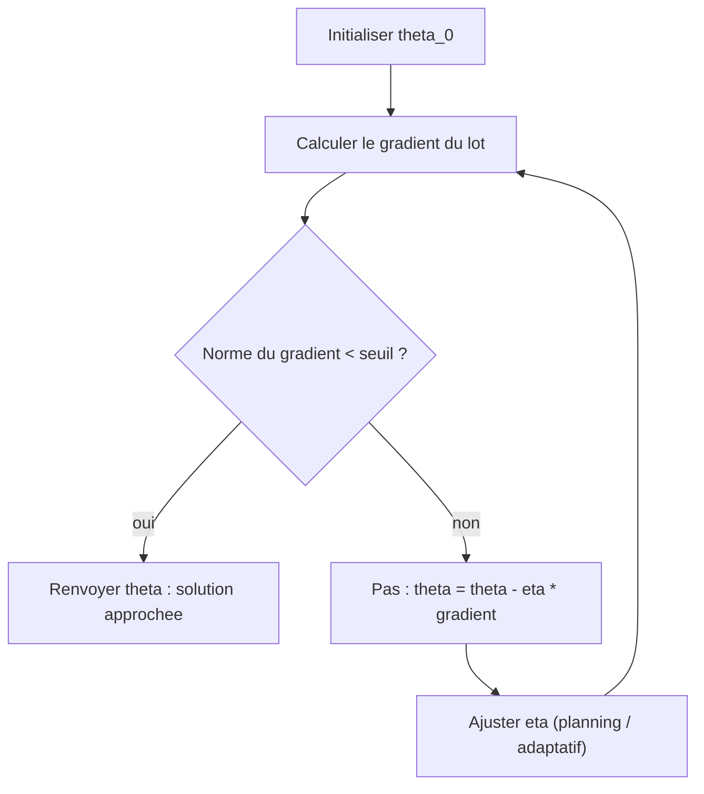
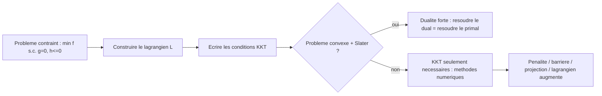
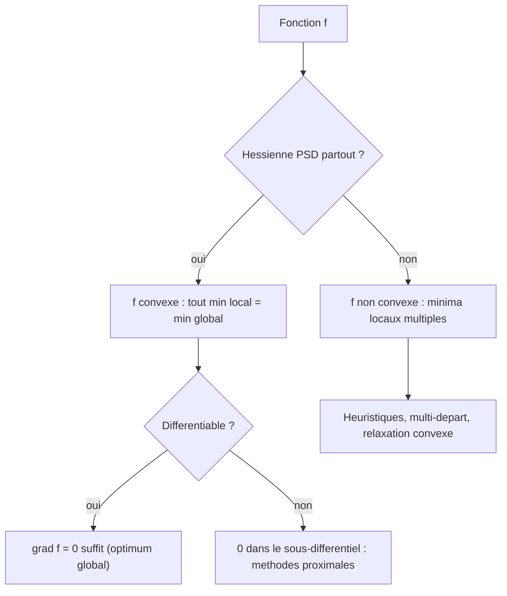

[← Sommaire](../README.md#table-des-matières)

# 7. Optimisation continue

### Optimisation par descente de gradient

Imaginez une randonneuse perdue dans le brouillard sur une montagne. Elle ne voit rien autour d'elle, mais sous ses pieds elle sent la pente. Pour descendre dans la vallée le plus vite possible, elle fait un pas dans la direction où le sol descend le plus fort, puis recommence. Voilà, en une phrase, toute l'idée de la descente de gradient (gradient descent). C'est l'algorithme qui fait tourner aujourd'hui la quasi-totalité de l'apprentissage automatique (machine learning), du plus petit modèle de régression au plus gros réseau de neurones.


#### Le problème: minimiser une fonction

On se donne une fonction $`f: \mathbb{R}^n \to \mathbb{R}`$ que l'on appelle **fonction objectif** (objective function), ou **fonction de coût** (cost / loss function). Elle prend en entrée un vecteur de paramètres et renvoie un seul nombre: « à quel point c'est mauvais ». Notre but est de trouver le vecteur qui rend ce nombre le plus petit possible.

> **Le symbole $`\mathbb{R}^n`$.** Ce symbole représente l'ensemble de toutes les listes de $`n`$ nombres à virgule. Pensez à une fiche avec $`n`$ cases, et dans chaque case un nombre réel (un nombre comme $`3{,}14`$, $`-2`$ ou $`0`$). Si $`n = 2`$, un élément de $`\mathbb{R}^2`$ est un point sur une feuille de papier (deux coordonnées: gauche-droite, haut-bas). Si $`n = 1\,000\,000`$, c'est une fiche à un million de cases, typiquement les réglages d'un réseau de neurones. La flèche $`\to`$ veut juste dire « transforme en »: $`f`$ prend une fiche de $`n`$ nombres et la transforme en un seul nombre.

On note ce problème ainsi:

```math
\min_{x \in \mathbb{R}^n} f(x)
```

et la solution, c'est-à-dire l'endroit où le minimum est atteint, se note avec un symbole nouveau et central pour tout le chapitre: **argmin**.

> **Le symbole $`\arg\min`$ (et son jumeau $`\arg\max`$).** Ce symbole représente « l'endroit où c'est le plus petit », pas « la plus petite valeur ». C'est une distinction cruciale. Imaginez une classe d'élèves et leurs tailles. Le **minimum** des tailles, c'est le plus petit nombre de centimètres (par exemple $`120`$ cm). L'**argmin**, c'est *l'élève* qui mesure $`120`$ cm, c'est-à-dire *qui* réalise ce minimum. Donc:
> - $`\min_x f(x)`$ = la plus petite valeur que $`f`$ peut prendre (un nombre, sur l'axe vertical);
> - $`\arg\min_x f(x)`$ = le point $`x`$ (sur l'axe horizontal) où cette plus petite valeur est atteinte.
>
> De même $`\arg\max`$ donne le point où une fonction est la plus *grande*. Astuce à retenir: maximiser $`f`$ revient à minimiser $`-f`$, donc $`\arg\max_x f(x) = \arg\min_x \big(\!-f(x)\big)`$. On écrit par exemple $`x^\star = \arg\min_x f(x)`$, où l'étoile $`^\star`$ signale « la valeur optimale, la solution ».

> **Définition (minimiseur global et local).** Un point $`x^\star \in \mathbb{R}^n`$ est un **minimiseur global** de $`f`$ si $`f(x^\star) \le f(x)`$ pour tout $`x \in \mathbb{R}^n`$. C'est un **minimiseur local** s'il existe un rayon $`\varepsilon > 0`$ tel que $`f(x^\star) \le f(x)`$ pour tout $`x`$ vérifiant $`\|x - x^\star\| \le \varepsilon`$. Autrement dit, un minimum local est le plus bas point *de son voisinage immédiat* (le fond d'une cuvette parmi d'autres), tandis que le minimum global est le point le plus bas *de tout le paysage*.

> **Le symbole $`\|\cdot\|`$ (la norme).** Ce symbole représente la **longueur** d'un vecteur, c'est-à-dire « à quelle distance du zéro on est ». Pour une flèche dessinée du point d'origine jusqu'à un point, $`\|x\|`$ est la longueur de la flèche, mesurée au mètre ruban. En dimension 2, c'est le théorème de Pythagore: $`\|(a,b)\| = \sqrt{a^2+b^2}`$. En général, la norme euclidienne d'un vecteur $`x = (x_1,\dots,x_n)`$ est $`\|x\| = \sqrt{x_1^2 + \cdots + x_n^2}`$. Donc $`\|x - x^\star\|`$ est simplement la distance entre les points $`x`$ et $`x^\star`$.

#### Pourquoi le gradient indique la direction de plus forte montée

On suppose $`f`$ différentiable. Son **gradient** au point $`x`$, noté $`\nabla f(x)`$, est le vecteur de toutes ses dérivées partielles. On l'a vu aux chapitres précédents, on le réutilise simplement ici.

> **Le symbole $`\nabla`$ (nabla, le gradient).** Ce symbole (un triangle pointant vers le bas) représente **la pente dans chaque direction à la fois**. Reprenez la randonneuse: à l'endroit où elle est, le sol monte peut-être fortement vers l'est et faiblement vers le nord. Le gradient $`\nabla f(x)`$ est une flèche qui rassemble toutes ces pentes: sa direction est celle où ça monte le plus raide, et sa longueur dit à quel point c'est raide. Concrètement c'est la liste des dérivées partielles: $`\nabla f(x) = \left(\frac{\partial f}{\partial x_1}, \dots, \frac{\partial f}{\partial x_n}\right)`$, chaque case mesurant « de combien $`f`$ change si je bouge un tout petit peu selon cet axe-là, en gardant les autres fixes ».

Le résultat fondamental qui justifie l'algorithme est le suivant. Faisons un petit pas $`d`$ (un vecteur de déplacement) depuis $`x`$. Le développement de Taylor au premier ordre donne:

```math
f(x + d) \approx f(x) + \nabla f(x)^\top d .
```

> **Le symbole $`^\top`$ (transposée) et le produit $`\nabla f(x)^\top d`$.** Le petit $`^\top`$ retourne un vecteur-colonne en vecteur-ligne; écrire $`a^\top b`$ est la façon standard de noter le **produit scalaire** (vu au chapitre 3) entre deux vecteurs $`a`$ et $`b`$, c'est-à-dire $`a_1 b_1 + a_2 b_2 + \cdots + a_n b_n`$. Intuitivement, le produit scalaire mesure « à quel point deux flèches pointent dans la même direction ». Ici $`\nabla f(x)^\top d`$ dit donc: « de combien $`f`$ va monter si je me déplace dans la direction $`d`$ ».

Pour faire *baisser* $`f`$ le plus vite possible avec un pas de longueur fixée, on doit choisir la direction $`d`$ qui rend $`\nabla f(x)^\top d`$ le plus négatif possible. Or, par l'inégalité de Cauchy–Schwarz, $`\nabla f(x)^\top d \ge -\|\nabla f(x)\|\,\|d\|`$, avec égalité exactement quand $`d`$ pointe à l'opposé du gradient. **La direction de plus forte descente est donc $`d = -\nabla f(x)`$.** C'est là tout le secret: on avance dans le sens inverse de la pente.

#### L'algorithme de descente de gradient

On part d'un point initial $`x_0`$ et on répète:

```math
x_{k+1} = x_k - \eta\, \nabla f(x_k),
```

où $`\eta > 0`$ est le **pas d'apprentissage** (learning rate; aussi appelé taux d'apprentissage ou simplement « le pas »).

> **Le symbole $`\eta`$ (êta) et l'indice $`k`$.** La lettre grecque $`\eta`$ représente la **taille du pas** que fait la randonneuse à chaque itération. Trop petit: elle descend en fourmi, c'est lent. Trop grand: elle enjambe la vallée et se retrouve à remonter de l'autre côté, voire diverge. L'indice $`k`$ en bas (comme dans $`x_k`$) est juste un **compteur de pas**: $`x_0`$ est la position de départ, $`x_1`$ après un pas, $`x_2`$ après deux pas, etc. La flèche de mise à jour « $`x_{k+1} = x_k - \dots`$ » se lit « la prochaine position = la position actuelle moins un pas dans le sens de la pente ».

> **Critère d'arrêt.** En un minimum (local ou global) intérieur, la pente est nulle dans toutes les directions: $`\nabla f(x^\star) = 0`$. C'est la **condition du premier ordre** (first-order optimality). En pratique on s'arrête quand $`\|\nabla f(x_k)\|`$ devient minuscule (en dessous d'un seuil), ou quand $`f`$ ne diminue plus, ou après un nombre maximal d'itérations.

```python
import numpy as np

def gradient_descent(grad_f, x0, lr=0.1, n_iter=1000, tol=1e-8):
    x = np.array(x0, dtype=float)
    trajectory = [x.copy()]
    for _ in range(n_iter):
        g = grad_f(x)
        if np.linalg.norm(g) < tol:
            break
        x = x - lr * g
        trajectory.append(x.copy())
    return x, np.array(trajectory)
```

#### Exemple chiffré déroulé pas à pas

Prenons la fonction la plus simple qui soit instructive: $`f(x) = x^2`$, en dimension 1. On sait que le minimum est en $`x^\star = 0`$. Le gradient (ici la dérivée) vaut $`f'(x) = 2x`$. La mise à jour devient:

```math
x_{k+1} = x_k - \eta \cdot 2 x_k = (1 - 2\eta)\, x_k .
```

Partons de $`x_0 = 10`$ avec $`\eta = 0{,}1`$. Le facteur de contraction est $`1 - 2\eta = 0{,}8`$. On multiplie donc par $`0{,}8`$ à chaque pas:

| $`k`$ | $`x_k`$ | $`f(x_k)=x_k^2`$ |
|---:|---:|---:|
| 0 | $`10{,}000`$ | $`100{,}000`$ |
| 1 | $`8{,}000`$ | $`64{,}000`$ |
| 2 | $`6{,}400`$ | $`40{,}960`$ |
| 3 | $`5{,}120`$ | $`26{,}214`$ |
| 4 | $`4{,}096`$ | $`16{,}777`$ |
| 5 | $`3{,}277`$ | $`10{,}737`$ |
| 10 | $`1{,}074`$ | $`1{,}153`$ |
| 20 | $`0{,}115`$ | $`0{,}013`$ |

On voit la convergence géométrique: $`x_k = (0{,}8)^k \cdot 10 \to 0`$. Chaque pas réduit la distance au minimum de $`20\,\%`$.

> **Piège: l'effet du pas $`\eta`$ sur ce même exemple.** Comme $`x_{k+1} = (1-2\eta)x_k`$, le comportement dépend entièrement de $`|1 - 2\eta|`$:
> - $`\eta = 0{,}1 \Rightarrow`$ facteur $`0{,}8`$: descente douce et monotone.
> - $`\eta = 0{,}5 \Rightarrow`$ facteur $`0`$: on atteint $`x^\star=0`$ en **un seul pas** (cas idéal, propre à cette fonction quadratique).
> - $`\eta = 0{,}9 \Rightarrow`$ facteur $`-0{,}8`$: on **oscille** autour de $`0`$ en se rapprochant lentement (le signe alterne).
> - $`\eta = 1{,}1 \Rightarrow`$ facteur $`-1{,}2`$: $`|{-1{,}2}| > 1`$, on **diverge**, $`x_k`$ explose. La randonneuse enjambe la vallée toujours plus loin.

#### Le rôle de la courbure: conditionnement et hessienne

Pourquoi certaines fonctions sont-elles si pénibles à minimiser ? À cause de leur **courbure**, encodée par la **hessienne** $`\nabla^2 f`$ (la matrice des dérivées secondes, vue au chapitre précédent). Considérons une « cuvette » très allongée, du genre:

```math
f(x_1, x_2) = \tfrac{1}{2}\left(x_1^2 + \gamma\, x_2^2\right), \qquad \gamma \gg 1 .
```

Sa hessienne est la matrice diagonale $`\mathrm{diag}(1, \gamma)`$. La direction $`x_2`$ est $`\gamma`$ fois plus « raide » que la direction $`x_1`$: on a une vallée étroite et profonde. La descente de gradient y **zigzague** lamentablement, car le gradient pointe surtout perpendiculairement à la vallée plutôt que vers le fond.

> **Définition (nombre de conditionnement).** Pour une quadratique de hessienne symétrique définie positive $`H`$, le **conditionnement** est $`\kappa = \lambda_{\max}/\lambda_{\min}`$, rapport de la plus grande à la plus petite valeur propre de $`H`$. Dans l'exemple, $`\kappa = \gamma`$. Plus $`\kappa`$ est grand, plus la cuvette est déformée, et plus la descente de gradient est lente.

> **Le symbole $`\lambda`$ (lambda, valeur propre).** Ici, $`\lambda`$ représente une **valeur propre** (eigenvalue) de la matrice: un nombre qui dit « de combien la matrice étire l'espace dans une certaine direction privilégiée ». Imaginez un ballon de baudruche que l'on presse: il s'allonge beaucoup dans un sens ($`\lambda_{\max}`$, grand étirement) et se comprime dans l'autre ($`\lambda_{\min}`$, petit). Le rapport des deux mesure à quel point le ballon est devenu une saucisse. Pour la courbure d'une fonction, une grande valeur propre = direction très bombée, une petite = direction quasi plate. (Attention: la même lettre $`\lambda`$ servira plus loin à nommer un *multiplicateur de Lagrange*; ce sont deux usages distincts, signalés à chaque fois.)

> **Théorème (vitesse de convergence sur une fonction fortement convexe et lisse).** Si $`f`$ a une hessienne dont les valeurs propres restent dans $`[m, L]`$ avec $`0 < m \le L`$ partout (on dit: $`f`$ est $`m`$-fortement convexe et $`L`$-lisse), alors la descente de gradient à pas constant $`\eta = 1/L`$ vérifie:
>
> ```math
> f(x_k) - f(x^\star) \le \left(1 - \frac{m}{L}\right)^{k}\big(f(x_0) - f(x^\star)\big).
> ```

La convergence est **linéaire** (géométrique), de raison $`1 - 1/\kappa`$ avec $`\kappa = L/m`$. Si $`\kappa = 1`$ (cuvette parfaitement ronde), un seul pas suffit; si $`\kappa = 1000`$, il faut de l'ordre de $`\kappa = 1000`$ itérations pour seulement gagner un facteur $`e \approx 2{,}72`$ sur l'écart à l'optimum, et bien davantage pour gagner plusieurs ordres de grandeur. **Le conditionnement est l'ennemi numéro un de la descente de gradient.**

> **Démonstration (esquisse rigoureuse).** La $`L`$-lissité donne l'inégalité de descente, valable au pas $`\eta = 1/L`$,
> ```math
> f(x_{k+1}) \le f(x_k) - \tfrac{1}{2L}\,\|\nabla f(x_k)\|^2
> ```
> (on majore $`f`$ le long du pas par sa parabole tangente de courbure $`L`$, puis on évalue cette parabole au point d'arrivée). La $`m`$-forte convexité donne l'inégalité de Polyak–Łojasiewicz
> ```math
> \tfrac{1}{2}\,\|\nabla f(x_k)\|^2 \ge m\,\big(f(x_k) - f(x^\star)\big)
> ```
> (en minimisant sur $`y`$ la borne inférieure $`f(y) \ge f(x_k) + \nabla f(x_k)^\top(y-x_k) + \tfrac{m}{2}\|y-x_k\|^2`$, on obtient $`f(x^\star) \ge f(x_k) - \tfrac{1}{2m}\|\nabla f(x_k)\|^2`$). En combinant, $`f(x_{k+1}) - f(x^\star) \le \big(1 - m/L\big)\big(f(x_k)-f(x^\star)\big)`$, puis on itère. $`\blacksquare`$

#### Choisir le pas: recherche linéaire et conditions de Wolfe

À pas constant, il faut connaître $`L`$. En pratique on l'ignore, alors on cherche $`\eta`$ « à la volée » à chaque itération: c'est la **recherche linéaire** (line search). L'idée: le long de la demi-droite $`\eta \mapsto x_k - \eta\,\nabla f(x_k)`$, trouver un $`\eta`$ qui fait suffisamment baisser $`f`$.

La méthode la plus utilisée est le **rebroussement d'Armijo** (backtracking line search): partir d'un grand pas et le diviser par deux tant que la baisse n'est pas « assez bonne ». Pour la direction de plus forte descente $`d = -\nabla f(x_k)`$, la condition d'Armijo (décroissance suffisante) s'écrit:

```math
f\big(x_k - \eta \nabla f(x_k)\big) \le f(x_k) - c_1\, \eta\, \|\nabla f(x_k)\|^2, \qquad c_1 \in (0,1),\ \text{typiquement } c_1 = 10^{-4}.
```

```python
def backtracking_line_search(f, grad_f, x, alpha0=1.0, c1=1e-4, rho=0.5):
    g = grad_f(x)
    fx = f(x)
    alpha = alpha0
    while f(x - alpha * g) > fx - c1 * alpha * (g @ g):
        alpha *= rho
    return alpha
```

> **Remarque (conditions de Wolfe).** Armijo empêche les pas trop grands. Pour éviter aussi des pas trop *petits*, on ajoute la **condition de courbure** $`\nabla f(x_{k+1})^\top d \ge c_2\, \nabla f(x_k)^\top d`$ avec $`0 < c_1 < c_2 < 1`$ (ici $`d = -\nabla f(x_k)`$). Ensemble elles forment les **conditions de Wolfe**, garantes de la convergence des méthodes de quasi-Newton (BFGS, L-BFGS) que l'on retrouve dans `scipy.optimize.minimize`.

#### Au-delà de la première dérivée: Newton et quasi-Newton

La descente de gradient n'utilise que la pente. La **méthode de Newton** utilise aussi la courbure pour faire un pas « intelligent » qui corrige le conditionnement:

```math
x_{k+1} = x_k - \big[\nabla^2 f(x_k)\big]^{-1} \nabla f(x_k).
```

Sur une quadratique, elle atteint le minimum en **un seul pas**, quel que soit le conditionnement ! Géométriquement, multiplier par l'inverse de la hessienne « re-rondit » la cuvette déformée avant de faire le pas. Le prix: calculer et inverser une matrice $`n \times n`$ coûte $`O(n^3)`$, prohibitif quand $`n`$ vaut des millions. D'où les méthodes **quasi-Newton** (BFGS, L-BFGS) qui approchent $`[\nabla^2 f]^{-1}`$ à partir des seuls gradients, et les méthodes du premier ordre pour le très grand $`n`$.

> **Le symbole $`O(\cdot)`$ (la notation « grand O », le coût de calcul).** Ce symbole représente l'**ordre de grandeur du travail** que demande un calcul quand la taille du problème grandit, en ne gardant que le terme qui domine et en ignorant les détails de constantes. Pensez à une recette: si préparer un plat pour $`n`$ convives demande de couper $`n`$ légumes, le travail est « de l'ordre de $`n`$ », noté $`O(n)`$, doubler le nombre d'invités double le travail. Si, en plus, chaque invité doit serrer la main de chaque autre invité, le nombre de poignées de main est « de l'ordre de $`n^2`$ », noté $`O(n^2)`$, doubler les invités quadruple le travail. Ici, $`O(n)`$ veut dire « un travail proportionnel au nombre de paramètres », tandis que $`O(n^3)`$ veut dire « un travail proportionnel au cube du nombre de paramètres »: avec un million de paramètres, $`n^3`$ vaut $`10^{18}`$, totalement hors de portée. C'est pourquoi inverser la hessienne complète est impensable en grande dimension.

> **Les acronymes BFGS et L-BFGS, et les vitesses « superlinéaire » et « quadratique ».** **BFGS** (du nom de ses quatre inventeurs: Broyden, Fletcher, Goldfarb et Shanno) est une méthode quasi-Newton qui se fabrique petit à petit une *estimation* de la courbure à partir des gradients déjà rencontrés, sans jamais calculer la vraie hessienne. **L-BFGS** (le L pour *limited memory*, « mémoire limitée ») est sa version économe qui ne retient que les quelques derniers gradients, ce qui la rend utilisable même avec des millions de paramètres. Quant aux mots qui décrivent la rapidité dans le tableau ci-dessous: une convergence **linéaire** gagne un nombre *fixe* de décimales correctes à chaque pas (par exemple une de plus tous les deux pas); **superlinéaire** veut dire « de plus en plus vite que cela à mesure qu'on approche »; et **quadratique** est la plus fulgurante: le nombre de décimales correctes *double* à chaque itération près de la solution (2, puis 4, puis 8, puis 16…).

| Méthode | Info utilisée | Coût / itération | Convergence (fortement convexe) |
|---|---|---|---|
| Descente de gradient | gradient | $`O(n)`$ | linéaire, raison $`1-1/\kappa`$ |
| Gradient + moment (Nesterov) | gradient | $`O(n)`$ | linéaire, raison $`1-1/\sqrt{\kappa}`$ |
| L-BFGS | gradient (+ mémoire) | $`O(mn)`$ | superlinéaire |
| Newton | gradient + hessienne | $`O(n^3)`$ | quadratique |

#### Accélération: moment (momentum) et Nesterov

Un correctif peu coûteux mais spectaculaire consiste à donner de **l'inertie** à la descente, comme une bille lourde qui dévale et lisse les zigzags. La méthode de la **boule lourde** (heavy ball) de Polyak:

```math
v_{k+1} = \beta\, v_k - \eta\, \nabla f(x_k), \qquad x_{k+1} = x_k + v_{k+1},
```

où $`v_k`$ est la « vitesse » accumulée et $`\beta \in [0,1)`$ le coefficient de moment (souvent $`0{,}9`$). La variante de **Nesterov** (évaluer le gradient *après* avoir avancé selon l'inertie) atteint la vitesse optimale de raison $`1 - 1/\sqrt{\kappa}`$: sur un problème de conditionnement $`10^4`$, on passe d'environ $`10^4`$ à environ $`10^2`$ itérations. C'est une amélioration quadratique du nombre d'itérations.

#### Le grand passage à l'échelle: descente de gradient stochastique (SGD)

En apprentissage automatique, la fonction de coût est presque toujours une **moyenne sur les données**:

```math
f(\theta) = \frac{1}{N}\sum_{i=1}^{N} \ell_i(\theta), \qquad \ell_i(\theta) = \text{perte sur l'exemple } i .
```

> **Le symbole $`\sum`$ (sigma, la somme) et $`\theta`$ (thêta).** Le grand $`\sum`$ représente une **boucle qui additionne**: $`\sum_{i=1}^{N} a_i`$ veut dire « fais varier le compteur $`i`$ de $`1`$ jusqu'à $`N`$, et empile tous les $`a_i`$ ». C'est exactement un `for i in range(1, N+1): total += a[i]`. Ici on additionne la perte de chaque exemple puis on divise par $`N`$ pour la moyenne. La lettre $`\theta`$ (thêta) est le nom traditionnel, en apprentissage automatique, du **vecteur de paramètres** du modèle (les poids à régler); c'est juste un autre nom pour notre $`x`$.

Calculer $`\nabla f(\theta)`$ exige de parcourir **les $`N`$ données** à chaque pas. Avec $`N = 10^8`$, impensable. La **descente de gradient stochastique** (stochastic gradient descent, SGD) remplace le vrai gradient par une **estimation bruitée** calculée sur un seul exemple, ou sur un petit paquet (mini-batch) $`B`$ tiré au hasard:

```math
\theta_{k+1} = \theta_k - \eta\, \frac{1}{|B|}\sum_{i \in B} \nabla \ell_i(\theta_k).
```

Comme l'exemple est tiré au hasard uniformément, on a $`\mathbb{E}\big[\nabla \ell_i(\theta)\big] = \nabla f(\theta)`$: en moyenne, on va dans la bonne direction, même si chaque pas est imprécis.

> **Le symbole $`\mathbb{E}[\cdot]`$ (espérance).** Ce symbole représente la **moyenne attendue** d'une quantité aléatoire (vu au chapitre des probabilités). Si vous lancez un dé un très grand nombre de fois, la moyenne des résultats tend vers $`\mathbb{E} = 3{,}5`$. Dire $`\mathbb{E}[\nabla \ell_i] = \nabla f`$ signifie: « si je faisais la moyenne de tous les gradients-sur-un-exemple possibles, je retomberais sur le vrai gradient complet ». Chaque pas de SGD est donc une **flèche tordue par le hasard mais juste en moyenne**.

Le bruit impose un pas **décroissant** pour converger. Les conditions classiques de Robbins–Monro sont:

```math
\sum_{k} \eta_k = \infty \quad (\text{aller assez loin}), \qquad \sum_{k} \eta_k^2 < \infty \quad (\text{calmer le bruit à la fin}).
```

> **Le mot « époque » (epoch).** Dans le code ci-dessous, une **époque** désigne **un passage complet sur l'ensemble des données d'entraînement**: on a vu chaque exemple exactement une fois. Si vous avez $`1\,000`$ exemples traités par paquets de $`32`$, une époque enchaîne environ $`31`$ petits pas (un par paquet); faire $`10`$ époques (`n_epochs=10`) revient à repasser dix fois sur toute la base, en la remélangeant à chaque fois (`np.random.shuffle`) pour que l'ordre des paquets change. Image: réviser un paquet de fiches de révision; une époque = avoir parcouru tout le paquet une fois, et l'on recommence plusieurs fois pour bien apprendre.

```python
def sgd(grad_li, theta0, data, lr0=0.1, n_epochs=10, batch_size=32):
    theta = np.array(theta0, dtype=float)
    N = len(data)
    t = 0
    for epoch in range(n_epochs):
        np.random.shuffle(data)
        for start in range(0, N, batch_size):
            batch = data[start:start + batch_size]
            g = np.mean([grad_li(theta, xi) for xi in batch], axis=0)
            lr = lr0 / (1 + 0.01 * t)
            theta = theta - lr * g
            t += 1
    return theta
```

#### Les optimiseurs adaptatifs modernes (Adam et compagnie)

Choisir un seul pas $`\eta`$ pour des millions de paramètres aux courbures très différentes est illusoire. Les **optimiseurs adaptatifs** donnent à *chaque* coordonnée son propre pas, ajusté automatiquement.

- **AdaGrad**: divise le pas de chaque coordonnée par la racine de la somme des carrés de ses gradients passés. Les directions souvent sollicitées ralentissent; les rares accélèrent. Défaut: le pas finit par s'éteindre.
- **RMSProp**: remplace la somme par une **moyenne mobile exponentielle** des carrés, ce qui évite l'extinction.
- **Adam**: combine moment (moyenne mobile du gradient, $`m_k`$) et RMSProp (moyenne mobile du carré, $`v_k`$):

```math
m_k = \beta_1 m_{k-1} + (1-\beta_1) g_k, \quad v_k = \beta_2 v_{k-1} + (1-\beta_2) g_k^2,
```
```math
\hat m_k = \frac{m_k}{1-\beta_1^k}, \quad \hat v_k = \frac{v_k}{1-\beta_2^k}, \qquad \theta_{k+1} = \theta_k - \eta\, \frac{\hat m_k}{\sqrt{\hat v_k} + \epsilon}.
```

Les valeurs par défaut $`\beta_1 = 0{,}9`$, $`\beta_2 = 0{,}999`$, $`\epsilon = 10^{-8}`$ marchent étonnamment bien partout. Toutes les opérations sur les vecteurs $`g_k`$, $`m_k`$, $`v_k`$ sont **élément par élément** (le carré $`g_k^2`$, la racine $`\sqrt{\hat v_k}`$, la division); les corrections $`\hat m_k, \hat v_k`$ compensent le biais dû au démarrage à zéro de $`m_0`$ et $`v_0`$.

> **Optimiseurs récents.** En apprentissage profond, **AdamW** (Adam avec *découplage* de la régularisation $`L_2`$, dite « weight decay ») est devenu le choix par défaut pour entraîner Transformers et grands modèles: séparer la pénalité de poids du terme adaptatif améliore nettement la généralisation. Des optimiseurs plus récents (Lion, fondé sur le seul signe du moment, ou des méthodes du second ordre approchées de type Shampoo/SOAP) gagnent du terrain sur les très grands entraînements. Mais pour la plupart des usages, SGD-moment et AdamW restent les deux chevaux de bataille. Côté pas, le **planning** (warm-up linéaire puis décroissance en cosinus) est aussi déterminant que l'optimiseur lui-même.

> **Différentiation automatique.** Vous n'écrivez plus jamais les gradients à la main. La **différentiation automatique** (automatic differentiation, autodiff) de **PyTorch** (mode inverse, `loss.backward()`) et de **JAX** (`jax.grad`, composable avec `jit`, `vmap`) calcule $`\nabla f`$ exactement (aux erreurs d'arrondi près), au coût d'environ deux évaluations de $`f`$, quelle que soit la dimension. C'est ce qui rend la descente de gradient praticable sur des modèles à des milliards de paramètres.

#### Application complète: régression logistique par descente de gradient

Mettons tout bout à bout sur un classique de l'apprentissage automatique. En **régression logistique** (logistic regression), on prédit une probabilité $`\hat y = \sigma(\theta^\top x)`$ avec la sigmoïde $`\sigma(z) = 1/(1+e^{-z})`$, et on minimise l'**entropie croisée** (cross-entropy). Le gradient a une forme remarquablement simple:

```math
\nabla_\theta f(\theta) = \frac{1}{N}\sum_{i=1}^{N} \big(\sigma(\theta^\top x_i) - y_i\big)\, x_i .
```

```python
import numpy as np

def sigmoid(z):
    return 1.0 / (1.0 + np.exp(-z))

def logistic_loss(theta, X, y):
    p = sigmoid(X @ theta)
    eps = 1e-12
    return -np.mean(y * np.log(p + eps) + (1 - y) * np.log(1 - p + eps))

def logistic_grad(theta, X, y):
    p = sigmoid(X @ theta)
    return X.T @ (p - y) / len(y)

rng = np.random.default_rng(0)
N, d = 500, 3
X = np.hstack([np.ones((N, 1)), rng.normal(size=(N, d))])
theta_true = np.array([-0.5, 2.0, -1.0, 0.5])
y = (rng.random(N) < sigmoid(X @ theta_true)).astype(float)

theta = np.zeros(d + 1)
lr = 0.5
for it in range(2000):
    theta -= lr * logistic_grad(theta, X, y)

print("theta estime :", np.round(theta, 2))
print("perte finale :", round(logistic_loss(theta, X, y), 4))
```

Ce squelette, initialiser, calculer le gradient, faire un pas, répéter, est *exactement* celui qui, démultiplié par l'autodiff et les optimiseurs adaptatifs, entraîne les plus grands modèles actuels.



---

### Optimisation sous contraintes et multiplicateurs de Lagrange

Jusqu'ici la randonneuse pouvait aller où elle voulait. Mais la vie réelle impose des **contraintes**: un budget à ne pas dépasser, des probabilités qui doivent sommer à $`1`$, un poids total limité. On ne cherche plus le point le plus bas de toute la montagne, mais le point le plus bas *en restant sur un sentier autorisé*. C'est l'**optimisation sous contraintes** (constrained optimization), et son outil maître est le **lagrangien**.

#### Poser le problème

Le problème général s'écrit:

```math
\min_{x \in \mathbb{R}^n} f(x) \quad \text{sous} \quad
\begin{cases}
g_i(x) = 0, & i = 1, \dots, p \quad (\text{contraintes d'égalité}),\\
h_j(x) \le 0, & j = 1, \dots, q \quad (\text{contraintes d'inégalité}).
\end{cases}
```

L'ensemble des points qui respectent toutes les contraintes s'appelle le **domaine réalisable** (feasible set), le « sentier autorisé ». Une contrainte d'égalité $`g_i(x)=0`$ vous force à rester *exactement sur* une courbe; une contrainte d'inégalité $`h_j(x)\le 0`$ vous autorise une *région* (un côté de la frontière).

> **Le symbole « sous » (s.c., « sous contrainte que »).** Tout ce qui suit le mot « sous » (en anglais *subject to*, abrégé *s.t.*) liste les **règles à respecter**. C'est comme un jeu: « marquez le plus de points possible (l'objectif) *sous* la règle que vous ne sortez pas du terrain (les contraintes) ». Les $`g_i`$ et $`h_j`$ sont juste d'autres fonctions de $`x`$, comme $`f`$.

#### Cas d'une seule égalité: l'intuition géométrique

Commençons par $`\min f(x)`$ sous une seule contrainte $`g(x) = 0`$. Imaginez les **courbes de niveau** de $`f`$ (comme sur une carte topographique: chaque courbe relie les points de même altitude) et, par-dessus, le sentier $`g(x)=0`$. En marchant le long du sentier, tant que celui-ci **traverse** les courbes de niveau, on monte ou on descend: on peut faire mieux. On ne peut plus s'améliorer qu'à l'endroit où le sentier est **tangent** à une courbe de niveau.

Or le gradient $`\nabla f`$ est toujours **perpendiculaire** aux courbes de niveau de $`f`$, et $`\nabla g`$ perpendiculaire au sentier. Tangence des courbes $`\Leftrightarrow`$ gradients **colinéaires**. Il existe donc un nombre $`\lambda`$ tel que:

```math
\nabla f(x^\star) + \lambda\, \nabla g(x^\star) = 0.
```

Ce nombre $`\lambda`$ est le **multiplicateur de Lagrange**. (On écrit la colinéarité sous cette forme « avec un $`+`$ » pour qu'elle coïncide exactement avec la dérivée du lagrangien définie plus bas; c'est la convention que l'on gardera dans tout le reste de la section.)

> **Le symbole $`\lambda`$ (le multiplicateur de Lagrange).** Ici, $`\lambda`$ ne désigne plus une valeur propre mais **un multiplicateur de Lagrange**: un nombre dont la *valeur absolue* mesure « combien la contrainte pousse sur la solution ». Image: vous poussez une bille pour qu'elle descende, mais un rail (la contrainte) l'en empêche. Le rail exerce une force de réaction. $`|\lambda|`$, c'est l'**intensité de cette force**: grande si la contrainte est très gênante, nulle si la contrainte ne sert à rien (la bille serait tombée là de toute façon). Le *signe* de $`\lambda`$, lui, dépend de l'orientation choisie pour $`g`$ (remplacer $`g`$ par $`-g`$ change $`\lambda`$ en $`-\lambda`$): pour une égalité, ce signe est conventionnel, c'est pourquoi $`\lambda`$ peut être positif ou négatif. On verra plus bas que $`|\lambda|`$ a un sens économique précis: c'est l'amplitude d'un **prix**.

> **Exemple chiffré déroulé.** Minimisons $`f(x_1, x_2) = x_1^2 + x_2^2`$ (distance² à l'origine) sous $`g(x) = x_1 + x_2 - 1 = 0`$ (rester sur une droite). On cherche le point de la droite le plus proche de l'origine.
> Les gradients: $`\nabla f = (2x_1, 2x_2)`$, $`\nabla g = (1, 1)`$. La condition $`\nabla f + \lambda \nabla g = 0`$ donne $`2x_1 + \lambda = 0`$ et $`2x_2 + \lambda = 0`$, donc $`x_1 = x_2 = -\lambda/2`$. La contrainte $`x_1 + x_2 = 1`$ impose alors $`-\lambda = 1`$, soit $`\lambda = -1`$ et $`x_1 = x_2 = \tfrac12`$. Solution: $`x^\star = (\tfrac12, \tfrac12)`$, valeur optimale $`f(x^\star) = \tfrac14`$. C'est bien le pied de la perpendiculaire abaissée de l'origine sur la droite; l'intensité $`|\lambda| = 1`$ mesure la « poussée » de la contrainte.

#### Le lagrangien: transformer un problème contraint en problème libre

L'astuce géniale de Lagrange: encoder contraintes *et* objectif dans **une seule fonction**, le **lagrangien**, en payant un « péage » pour chaque écart aux contraintes.

> **Définition (lagrangien).** Pour le problème avec égalités $`g_i`$ et inégalités $`h_j`$, le lagrangien est la fonction
> ```math
> \mathcal{L}(x, \lambda, \mu) = f(x) + \sum_{i=1}^{p} \lambda_i\, g_i(x) + \sum_{j=1}^{q} \mu_j\, h_j(x),
> ```
> où chaque $`\lambda_i \in \mathbb{R}`$ et chaque $`\mu_j \ge 0`$ est un multiplicateur associé à sa contrainte.

> **Le symbole $`\mathcal{L}`$ (le lagrangien), expliqué simplement.** Ce symbole (un grand L calligraphié) représente une **fonction de marchandage** entre « je veux minimiser $`f`$ » et « je dois respecter les règles ». À l'objectif $`f(x)`$, on ajoute, pour chaque règle, le terme « multiplicateur $`\times`$ écart à la règle ». Si une contrainte $`g_i(x)`$ s'écarte de $`0`$, le terme $`\lambda_i g_i(x)`$ ajoute un coût (ou un gain). Le multiplicateur $`\lambda_i`$ est le **prix unitaire de l'écart**. Optimiser ce lagrangien revient à trouver un équilibre où l'on n'a plus intérêt ni à bouger $`x`$, ni à changer les prix: c'est un **point de selle** (saddle point), un col de montagne, minimum dans la direction $`x`$ et maximum dans la direction des multiplicateurs.

Pour le cas à égalités seules, annuler les dérivées de $`\mathcal{L}`$ par rapport à $`x`$ **et** par rapport à $`\lambda`$ redonne exactement le système précédent:

```math
\nabla_x \mathcal{L} = \nabla f(x) + \sum_i \lambda_i \nabla g_i(x) = 0, \qquad \nabla_\lambda \mathcal{L} = g(x) = 0 .
```

La seconde équation **restitue la contrainte**: dériver par rapport au multiplicateur, c'est exiger que la règle soit respectée. On a transformé un problème contraint en $`\mathbb{R}^n`$ en un problème *sans contrainte* en $`\mathbb{R}^{n+p}`$.

#### Les conditions de Karush–Kuhn–Tucker (KKT)

Avec des inégalités, la situation se raffine: une contrainte $`h_j(x) \le 0`$ peut être **active** (saturée, $`h_j(x^\star) = 0`$: on est collé à la frontière) ou **inactive** (lâche, $`h_j(x^\star) < 0`$: on est strictement à l'intérieur, la contrainte ne sert à rien). Les **conditions KKT** généralisent Lagrange à ce cas. Elles sont *la* boîte à outils de l'optimisation sous contraintes.

> **Théorème (conditions KKT, nécessaires au premier ordre).** Sous une condition de qualification des contraintes (par exemple les gradients des contraintes actives sont linéairement indépendants), si $`x^\star`$ est un minimum local, alors il existe des multiplicateurs $`\lambda_i \in \mathbb{R}`$ et $`\mu_j \ge 0`$ tels que:
>
> 1. **Stationnarité**: $`\displaystyle \nabla f(x^\star) + \sum_{i} \lambda_i \nabla g_i(x^\star) + \sum_{j} \mu_j \nabla h_j(x^\star) = 0`$.
> 2. **Réalisabilité primale**: $`g_i(x^\star) = 0`$ et $`h_j(x^\star) \le 0`$.
> 3. **Réalisabilité duale**: $`\mu_j \ge 0`$ pour tout $`j`$.
> 4. **Complémentarité**: $`\mu_j\, h_j(x^\star) = 0`$ pour tout $`j`$.

> **Lire les KKT comme un enfant.** Chaque condition raconte une histoire simple.
> - **(1) Stationnarité**: au point optimal, l'envie de descendre ($`-\nabla f`$) est *exactement* compensée par les poussées des contraintes. Plus moyen de bouger sans casser une règle.
> - **(2) Réalisabilité primale**: la solution respecte vraiment les règles (elle est sur le sentier).
> - **(3) Réalisabilité duale**: les prix des inégalités sont **positifs**. Une barrière ne peut que *vous repousser vers l'intérieur*, jamais vous aspirer dehors, d'où $`\mu_j \ge 0`$.
> - **(4) Complémentarité**: c'est la plus belle. Pour chaque inégalité, **soit** la contrainte est inactive ($`h_j < 0`$) et alors son prix est nul ($`\mu_j = 0`$, le mur est loin, il ne pousse pas), **soit** son prix est non nul ($`\mu_j > 0`$) et alors la contrainte est saturée ($`h_j = 0`$, on est plaqué contre le mur). On ne paie un péage que pour une barrière contre laquelle on est réellement appuyé.

> **Exemple chiffré avec inégalité active/inactive.** Minimisons $`f(x) = (x-3)^2`$ sous $`h(x) = x - 1 \le 0`$ (donc $`x \le 1`$). Sans contrainte le minimum serait en $`x=3`$, **interdit**. Le lagrangien est $`\mathcal{L} = (x-3)^2 + \mu(x-1)`$.
> - Stationnarité: $`2(x-3) + \mu = 0`$.
> - Si la contrainte est **active** ($`x = 1`$): $`\mu = -2(1-3) = 4 > 0`$. Cohérent avec $`\mu \ge 0`$. La solution est $`x^\star = 1`$, $`\mu = 4`$.
> - Vérifions par l'absurde l'option *inactive* ($`\mu = 0`$): on aurait $`x=3`$, mais alors $`h(3) = 2 > 0`$, contrainte **violée**. Rejeté.
>
> Conclusion: $`x^\star = 1`$, la contrainte est saturée, son prix $`\mu = 4`$ mesure de combien $`f`$ remonte parce qu'on nous interdit d'aller jusqu'à $`3`$.

#### Dualité et sens « prix » des multiplicateurs

À partir du lagrangien, on définit la **fonction duale** $`\,q(\lambda, \mu) = \min_x \mathcal{L}(x, \lambda, \mu)`$. Pour tout point réalisable $`x`$ (donc $`g_i(x)=0`$ et $`h_j(x)\le 0`$) et tout $`\mu \ge 0`$, on a $`\mathcal{L}(x,\lambda,\mu) = f(x) + 0 + \sum_j \mu_j h_j(x) \le f(x)`$, car chaque terme $`\mu_j h_j(x)`$ est $`\le 0`$. En minimisant le membre de gauche sur *tout* $`x`$, on obtient une **borne inférieure** sur la valeur optimale $`p^\star`$ du problème de départ: c'est la **dualité faible** $`q(\lambda,\mu) \le p^\star`$. Le **problème dual** consiste à remonter cette borne le plus haut possible:

```math
\max_{\lambda,\ \mu \ge 0}\ q(\lambda, \mu) \ \le\ p^\star .
```

> **Théorème (dualité forte).** Si le problème est **convexe** (objectif et inégalités convexes, égalités affines) et qu'il existe un point strictement réalisable (**condition de Slater**), alors il n'y a **aucun écart**: $`\max q = p^\star`$. Le saut de dualité (duality gap) est nul, et résoudre le dual *équivaut* à résoudre le primal.

> **Interprétation économique (le multiplicateur est un prix).** Théorème de sensibilité: si l'on relâche légèrement la contrainte en $`h_j(x) \le b_j`$ (on déplace la borne de $`b_j`$ à partir de $`0`$), la valeur optimale varie selon $`\frac{\partial p^\star}{\partial b_j} = -\mu_j`$. Le multiplicateur est donc le **prix marginal** (shadow price) de la contrainte: « combien je gagnerais à m'autoriser une unité de plus ». Dans l'exemple précédent, $`\mu = 4`$: desserrer la limite de $`x\le1`$ vers $`x\le1{,}01`$ ($`b = 0{,}01`$) ferait baisser $`f`$ d'environ $`-\mu \cdot b = -4 \times 0{,}01 = -0{,}04`$, soit une baisse de $`0{,}04`$. C'est ce qui donne aux multiplicateurs leur immense portée en économie, en théorie des jeux et en apprentissage automatique.

#### Application phare: la machine à vecteurs de support (SVM)

L'exemple le plus emblématique en apprentissage automatique est le **séparateur à vaste marge** (support vector machine, SVM). On cherche l'hyperplan $`\theta^\top x + b = 0`$ qui sépare deux classes en **maximisant la marge**, ce qui revient au problème convexe:

```math
\min_{\theta, b}\ \tfrac12 \|\theta\|^2 \quad \text{sous} \quad y_i(\theta^\top x_i + b) \ge 1,\ \ i = 1,\dots,N .
```

En réécrivant chaque contrainte sous la forme standard $`h_i(\theta,b) = 1 - y_i(\theta^\top x_i + b) \le 0`$, en formant le lagrangien et en appliquant les KKT, la complémentarité fait tout le travail: seuls les points **sur la marge** ($`y_i(\theta^\top x_i + b) = 1`$) ont un multiplicateur $`\alpha_i > 0`$. Ce sont les **vecteurs de support** (support vectors), les seuls qui déterminent la frontière; tous les autres exemples pourraient disparaître sans rien changer. Le problème dual ne dépend des données qu'à travers des produits scalaires $`x_i^\top x_j`$, ce qui ouvre la porte à l'**astuce du noyau** (kernel trick) pour séparer des données non linéairement séparables.

> **Contraintes en apprentissage profond.** Les contraintes structurent aussi l'apprentissage profond moderne: projection sur des boules de norme pour la robustesse adversariale, **clipping** de norme de gradient (une contrainte implicite sur le pas), pénalités de Lagrange pour l'**équité** (fairness) ou le respect d'un budget de calcul, et entraînements *sous contraintes* (par exemple borner une métrique secondaire) résolus par des méthodes primal-dual. Les solveurs convexes disciplinés (CVXPY) et les méthodes de point intérieur restent une référence pour les sous-problèmes convexes de taille moyenne.

#### Méthodes numériques: pénalité, barrière, projection

Comment résout-on concrètement ? Trois grandes familles, illustrées sur un même cas.

| Méthode | Principe | Image |
|---|---|---|
| **Pénalité** | ajouter $`\rho \sum_i g_i(x)^2`$ à $`f`$ et augmenter $`\rho`$ | une amende croissante si on sort du sentier |
| **Barrière (point intérieur)** | ajouter $`-\mu \sum_j \log(-h_j(x))`$ | un mur infranchissable qui repousse de l'intérieur |
| **Projection / lagrangien augmenté** | faire un pas libre puis se reprojeter sur le domaine, ou ajuster les $`\lambda`$ | revenir sur le sentier après chaque écart |

```python
import numpy as np
from scipy.optimize import minimize

def f(x):
    return x[0]**2 + x[1]**2

constraints = [{'type': 'eq', 'fun': lambda x: x[0] + x[1] - 1}]
res = minimize(f, x0=[0.0, 0.0], constraints=constraints)
print("x* =", np.round(res.x, 4))          # [0.5 0.5]
print("f(x*) =", round(res.fun, 4))         # 0.25
```

```python
def projected_gradient_descent(grad_f, project, x0, lr=0.1, n_iter=500):
    x = np.array(x0, dtype=float)
    for _ in range(n_iter):
        x = project(x - lr * grad_f(x))
    return x

grad = lambda x: 2 * x
project_line = lambda x: x - (x.sum() - 1) / 2.0 * np.ones(2)
print(np.round(projected_gradient_descent(grad, project_line, [3.0, -1.0]), 4))  # [0.5 0.5]
```



---

### Optimisation convexe

Pourquoi consacrer une section entière à un type de fonctions ? Parce que la **convexité** est la frontière magique entre les problèmes que l'on sait résoudre **à coup sûr** et ceux où l'on tâtonne. Pour une fonction convexe, **tout minimum local est global**: la randonneuse qui descend ne peut pas se faire piéger dans une fausse vallée. C'est la propriété la plus précieuse de toute l'optimisation.

#### Ensembles convexes

> **La convexité, intuition d'abord.** « Convexe » se dit d'une forme **sans creux ni renfoncement**, où l'on peut tendre une ficelle entre deux points sans qu'elle sorte de la forme. Un disque plein, un cube, un segment: convexes. Une étoile, un croissant de lune, un haricot: non convexes (la ficelle sort). Pour une *fonction*, convexe veut dire « en forme de cuvette » (bol): si vous reliez deux points de la courbe par une corde, la corde passe **au-dessus** de la courbe.

> **Définition (ensemble convexe).** Un ensemble $`C \subseteq \mathbb{R}^n`$ est **convexe** si, pour tous $`x, y \in C`$ et tout $`t \in [0,1]`$, le point $`t x + (1-t) y`$ appartient encore à $`C`$. Autrement dit, le segment reliant deux points quelconques de $`C`$ est entièrement inclus dans $`C`$.

> **Le symbole $`t x + (1-t)y`$ (combinaison convexe).** Ce symbole représente **un point situé sur le segment entre $`x`$ et $`y`$**. Le curseur $`t`$ glisse de $`0`$ à $`1`$: à $`t=0`$ on est en $`y`$, à $`t=1`$ on est en $`x`$, à $`t=\tfrac12`$ pile au milieu. C'est une **moyenne pondérée**: « un peu de $`x`$, un peu de $`y`$, les deux poids faisant $`1`$ ». Comme une recette qui mélange deux ingrédients dans des proportions qui totalisent $`100\,\%`$.

Exemples fondamentaux d'ensembles convexes: les hyperplans $`\{x: a^\top x = b\}`$, les demi-espaces $`\{x: a^\top x \le b\}`$, les boules $`\{x: \|x - c\| \le r\}`$, et, crucial, toute **intersection** d'ensembles convexes (donc tout domaine défini par des inégalités linéaires, un **polyèdre**). C'est pourquoi les domaines réalisables « linéaires » sont si commodes.

#### Fonctions convexes

> **Définition (fonction convexe).** Une fonction $`f: C \to \mathbb{R}`$, définie sur un convexe $`C`$, est **convexe** si pour tous $`x, y \in C`$ et $`t \in [0,1]`$:
> ```math
> f\big(t x + (1-t) y\big) \le t f(x) + (1-t) f(y).
> ```
> Géométriquement: la corde (membre de droite) est toujours au-dessus de l'arc (membre de gauche). Elle est **strictement convexe** si l'inégalité est stricte pour $`x \neq y`$ et $`t \in (0,1)`$ (vraie cuvette, sans portion plate), et **concave** si $`-f`$ est convexe (une bosse au lieu d'un bol).

> **Lecture imagée de l'inégalité.** À gauche: l'altitude réelle de la fonction au point milieu. À droite: l'altitude de la corde tendue entre les deux extrémités. « Corde au-dessus de l'arc » = la fonction se *creuse* entre deux points. C'est exactement ce qui interdit les bosses, donc les faux minima.

**Caractérisations différentiables.** Si $`f`$ est dérivable, ces trois énoncés sont équivalents à la convexité:

- **Premier ordre**: $`f(y) \ge f(x) + \nabla f(x)^\top (y - x)`$ pour tous $`x, y`$. La fonction est **toujours au-dessus de chacune de ses tangentes**. (C'est l'inégalité reine, utilisée partout dans les preuves.)
- **Monotonie du gradient**: $`\big(\nabla f(y) - \nabla f(x)\big)^\top (y - x) \ge 0`$. La pente ne fait que croître.
- **Second ordre**: la hessienne $`\nabla^2 f(x)`$ est **semi-définie positive** en tout point.

Cette dernière caractérisation introduit un nouveau symbole essentiel.

> **La relation $`\succeq 0`$ (matrice semi-définie positive).** Le symbole $`A \succeq 0`$ (lire « $`A`$ est semi-définie positive », positive semidefinite, PSD) représente l'idée qu'une matrice symétrique **courbe l'espace vers le haut dans toutes les directions**, jamais vers le bas. Formellement: $`v^\top A v \ge 0`$ pour tout vecteur $`v`$. Image: la matrice est la « forme d'un bol ». Si vous lâchez une bille en n'importe quel point et la poussez dans n'importe quelle direction, le sol remonte (ou reste plat), jamais il ne descend en creux. Pour une matrice symétrique, c'est équivalent à: **toutes ses valeurs propres sont $`\ge 0`$**. La version stricte $`A \succ 0`$ (définie positive, $`v^\top A v > 0`$ pour $`v \neq 0`$, valeurs propres $`> 0`$) correspond à un bol *strictement* incurvé partout, une hessienne $`\succ 0`$ partout garantit la stricte convexité. Le lien avec la première section est direct: « hessienne PSD partout » = « cuvette partout » = « fonction convexe ».

> **Exemple chiffré (tester la convexité par la hessienne).** Soit $`f(x_1, x_2) = x_1^2 + 3 x_1 x_2 + x_2^2`$. Sa hessienne (constante) est
> ```math
> H = \begin{pmatrix} 2 & 3 \\ 3 & 2 \end{pmatrix}.
> ```
> Ses valeurs propres sont $`2 \pm 3`$, soit $`5`$ et $`-1`$. Comme $`-1 < 0`$, $`H \not\succeq 0`$: **la fonction n'est pas convexe** (c'est une selle). En revanche $`f(x_1,x_2) = x_1^2 + x_1 x_2 + x_2^2`$ a pour hessienne $`\begin{pmatrix} 2 & 1 \\ 1 & 2\end{pmatrix}`$, valeurs propres $`3`$ et $`1`$, toutes $`> 0`$: **strictement convexe**.

```python
import numpy as np

def is_convex_quadratic(H, tol=1e-9):
    H = np.asarray(H, dtype=float)
    eigvals = np.linalg.eigvalsh(0.5 * (H + H.T))
    return bool(np.all(eigvals >= -tol)), np.round(eigvals, 6)

print(is_convex_quadratic([[2, 3], [3, 2]]))   # (False, [-1.  5.])
print(is_convex_quadratic([[2, 1], [1, 2]]))   # (True,  [1.  3.])
```

#### Le théorème central de l'optimisation convexe

> **Théorème (minimum local = minimum global).** Si $`f`$ est convexe sur un ensemble convexe $`C`$, alors tout minimiseur local de $`f`$ sur $`C`$ est un minimiseur **global**. Si $`f`$ est *strictement* convexe, le minimiseur, s'il existe, est **unique**.

> **Démonstration.** Soit $`x^\star`$ un minimum local et supposons par l'absurde qu'il existe $`y \in C`$ avec $`f(y) < f(x^\star)`$. Pour $`t \in (0,1)`$ petit, le point $`z_t = (1-t) x^\star + t y`$ est dans $`C`$ (convexité de $`C`$) et, par convexité de $`f`$:
> ```math
> f(z_t) \le (1-t) f(x^\star) + t f(y) < (1-t) f(x^\star) + t f(x^\star) = f(x^\star).
> ```
> En prenant $`t`$ assez petit, $`z_t`$ est aussi proche que l'on veut de $`x^\star`$, donc dans son voisinage; on y trouve une valeur strictement plus basse que $`f(x^\star)`$, ce qui **contredit** la minimalité locale. Donc aucun tel $`y`$ n'existe: $`x^\star`$ est global. Pour l'unicité sous stricte convexité, si $`x^\star \neq y^\star`$ étaient deux minima globaux de même valeur $`p^\star`$, le milieu $`z_{1/2} = \tfrac12 x^\star + \tfrac12 y^\star`$ donnerait, par convexité *stricte*, $`f(z_{1/2}) < \tfrac12 p^\star + \tfrac12 p^\star = p^\star`$, absurde. $`\blacksquare`$

Une conséquence pratique majeure: pour une fonction convexe **différentiable**, la condition nécessaire $`\nabla f(x^\star) = 0`$ devient aussi **suffisante** d'optimalité globale. Trouver un point critique, c'est avoir gagné.

> **Pourquoi cela change tout en apprentissage automatique.** Les problèmes convexes (régression linéaire des moindres carrés, régression logistique sans couche cachée, SVM, Lasso, Ridge) se résolvent de façon **fiable et reproductible**: la descente de gradient converge vers *la* solution, indépendamment de l'initialisation. À l'inverse, l'apprentissage profond est **non convexe**: il existe d'innombrables minima locaux et points de selle. On accepte alors un « bon » minimum local au lieu du global, et, fait remarquable confirmé ces dernières années, en très haute dimension ces minima locaux sont le plus souvent presque aussi bons que le global.

#### Opérations qui préservent la convexité (la « boîte à outils »)

Reconnaître la convexité sans calculer de hessienne, en composant des briques connues:

| Opération | Préserve la convexité ? | Exemple |
|---|---|---|
| Somme pondérée positive $`\sum_k w_k f_k`$, $`w_k \ge 0`$ | oui | $`\|\theta\|^2 + \lambda \|\theta\|_1`$ (Ridge + Lasso) |
| Maximum ponctuel $`\max_k f_k`$ | oui | fonction « hinge » des SVM |
| Composition affine $`f(Ax + b)`$ | oui | perte sur $`\theta^\top x`$ |
| Composition $`g\circ h`$ avec $`g`$ convexe **croissante**, $`h`$ convexe | oui | $`\exp(\|x\|)`$ |
| Minimum, produit, composition quelconque | **non** en général | $`f\cdot g`$ peut ne pas l'être |

Ces règles, appliquées mécaniquement, sont le cœur de la **programmation convexe disciplinée** (disciplined convex programming, DCP) des solveurs comme CVXPY: si vous assemblez votre objectif uniquement avec des atomes convexes et ces opérations, le solveur **garantit** trouver l'optimum global.

#### Classes canoniques de problèmes convexes

L'optimisation convexe se décline en familles standard, par ordre de généralité croissante, chacune avec ses solveurs dédiés:

- **Programmation linéaire** (linear programming, LP): $`\min c^\top x`$ sous $`Ax \le b`$. Objectif et contraintes affines.
- **Programmation quadratique** (quadratic programming, QP): $`\min \tfrac12 x^\top Q x + c^\top x`$ sous $`Ax \le b`$, avec $`Q \succeq 0`$. (La SVM en est une.)
- **Cône du second ordre** (second-order cone programming, SOCP): contraintes du type $`\|A x + b\| \le c^\top x + d`$.
- **Programmation semi-définie** (semidefinite programming, SDP): variables = matrices, contrainte $`X \succeq 0`$. La plus expressive; cœur de nombreuses relaxations convexes de problèmes NP-difficiles.

> **« NP-difficile » et « relaxation convexe », en clair.** Un problème dit **NP-difficile** est un problème pour lequel on ne connaît aucune méthode rapide garantissant la meilleure réponse: le temps de calcul explose si vite avec la taille qu'au-delà de quelques dizaines de variables, même les ordinateurs les plus puissants renoncent (image: trouver le trajet le plus court qui visite toutes les villes d'un pays, le nombre de trajets possibles devient astronomique). Une **relaxation convexe**, c'est la ruse qui consiste à *assouplir* un tel problème difficile en un problème convexe voisin, plus facile, que l'on sait résoudre à coup sûr; sa solution n'est pas forcément celle du problème d'origine, mais elle en donne une excellente approximation ou une borne fiable. C'est un peu comme remplacer un casse-tête anguleux par sa version « arrondie » que l'on sait dénouer.

```math
\text{LP} \subset \text{QP} \subset \text{SOCP} \subset \text{SDP}.
```

#### Sous-gradient: quand ça n'est pas dérivable

Beaucoup de fonctions convexes utiles ont des **coins** (valeur absolue, norme $`\ell_1`$, hinge). En un coin, pas de tangente unique, mais tout un éventail de droites support: c'est le **sous-différentiel**.

> **Définition (sous-gradient).** Un vecteur $`u`$ est un **sous-gradient** de $`f`$ convexe en $`x`$ si $`f(y) \ge f(x) + u^\top(y - x)`$ pour tout $`y`$. L'ensemble de ces $`u`$ est le **sous-différentiel** $`\partial f(x)`$. En un point dérivable, $`\partial f(x) = \{\nabla f(x)\}`$ (un seul élément). Condition d'optimalité généralisée: $`x^\star`$ minimise $`f`$ **si et seulement si** $`0 \in \partial f(x^\star)`$.

> **Image du sous-gradient.** À un coin du graphe (comme la pointe en bas de $`|x|`$ en $`0`$), on peut glisser une règle rigide sous la courbe et la faire **pivoter** dans une plage d'angles sans qu'elle ne traverse jamais la courbe. Chaque position de la règle est un sous-gradient. Pour $`|x|`$ en $`0`$, toutes les pentes de $`-1`$ à $`+1`$ conviennent: $`\partial |x|(0) = [-1, 1]`$. Le minimum est là où la règle peut être posée **horizontale** ($`0`$ est une pente admissible), ce qui redonne $`0 \in \partial f`$.

C'est le fondement de la **descente de sous-gradient** et des méthodes **proximales** qui rendent le Lasso ($`\min \tfrac12\|Ax-b\|^2 + \lambda\|x\|_1`$) résoluble efficacement, l'opérateur proximal de $`\|\cdot\|_1`$ étant le **seuillage doux** (soft-thresholding), qui annule les petits coefficients et réalise la sélection de variables.

> **Exemple chiffré (seuillage doux).** L'opérateur proximal $`\mathrm{prox}_{\lambda|\cdot|}(z) = \arg\min_x \big(\tfrac12 (x-z)^2 + \lambda|x|\big)`$ vaut $`\mathrm{sign}(z)\max(|z|-\lambda, 0)`$. Avec $`\lambda = 0{,}5`$: $`z = 2 \Rightarrow x = 1{,}5`$; $`z = 0{,}3 \Rightarrow x = 0`$ (annulé !); $`z = -1{,}2 \Rightarrow x = -0{,}7`$. C'est ce « rabotage vers zéro » qui rend les solutions Lasso **parcimonieuses** (sparse).

```python
import numpy as np

def soft_threshold(z, lam):
    return np.sign(z) * np.maximum(np.abs(z) - lam, 0.0)

def lasso_ista(A, b, lam, lr=None, n_iter=500):
    n = A.shape[1]
    x = np.zeros(n)
    L = np.linalg.norm(A, 2) ** 2
    lr = 1.0 / L if lr is None else lr
    for _ in range(n_iter):
        x = soft_threshold(x - lr * (A.T @ (A @ x - b)), lam * lr)
    return x

rng = np.random.default_rng(0)
A = rng.normal(size=(50, 10))
x_true = np.array([3, 0, 0, -2, 0, 0, 0, 1.5, 0, 0])
b = A @ x_true + 0.1 * rng.normal(size=50)
print(np.round(lasso_ista(A, b, lam=0.3), 2))
```

> **La frontière convexe/non convexe en pratique.** Elle reste le bon prisme de lecture du domaine. Les blocs convexes (couches linéaires + perte convexe, attention vue comme un barycentre convexe, projections) s'insèrent dans des architectures globalement non convexes; comprendre la partie convexe éclaire la stabilité de l'entraînement. Côté théorie, l'**accélération de Nesterov** et les méthodes **proximales/ADMM** sous-tendent une large part de l'apprentissage structuré et fédéré; les solveurs convexes différentiables (couches d'optimisation `cvxpylayers`, OptNet) permettent désormais d'**enchâsser un problème convexe comme une couche** d'un réseau et de rétropropager à travers sa solution. Enfin, la **relaxation convexe** (SDP) demeure un outil de référence pour certifier la robustesse de réseaux ou borner des quantités combinatoires.



---

### Exercices

Les corrigés suivent immédiatement chaque énoncé.

#### Exercice 1: Descente de gradient sur une quadratique 1D

On minimise $`f(x) = 3x^2 - 12x + 7`$.
**(a)** Calculer le minimiseur exact $`x^\star`$ et la valeur $`f(x^\star)`$.
**(b)** Écrire la mise à jour de descente de gradient et le facteur de contraction en fonction de $`\eta`$.
**(c)** Pour quelles valeurs de $`\eta`$ l'algorithme converge-t-il ? Quel $`\eta`$ converge en un seul pas ?

> **Corrigé.**
> **(a)** $`f'(x) = 6x - 12 = 0 \Rightarrow x^\star = 2`$. Alors $`f(2) = 12 - 24 + 7 = -5`$.
> **(b)** $`x_{k+1} = x_k - \eta(6x_k - 12) = (1 - 6\eta)x_k + 12\eta`$. En posant $`e_k = x_k - 2`$ (l'erreur), on obtient $`e_{k+1} = (1-6\eta)e_k`$: le facteur de contraction est $`1 - 6\eta`$.
> **(c)** Convergence $`\Leftrightarrow |1 - 6\eta| < 1 \Leftrightarrow 0 < \eta < \tfrac13`$. Un seul pas $`\Leftrightarrow 1 - 6\eta = 0 \Leftrightarrow \eta = \tfrac16`$. (Cohérent avec $`\eta = 1/L`$ où $`L = f'' = 6`$.)

#### Exercice 2: Effet du conditionnement

Soit $`f(x_1, x_2) = \tfrac12(x_1^2 + 100\, x_2^2)`$.
**(a)** Donner la hessienne et le conditionnement $`\kappa`$.
**(b)** Quel pas constant maximal garantit la convergence ? En déduire le facteur de convergence par itération.
**(c)** Combien d'itérations (ordre de grandeur) pour réduire l'erreur d'un facteur $`10`$ ?

> **Corrigé.**
> **(a)** $`H = \mathrm{diag}(1, 100)`$, valeurs propres $`1`$ et $`100`$, donc $`\kappa = 100`$.
> **(b)** La stabilité sur chaque coordonnée impose $`|1 - \eta \lambda| < 1`$ pour $`\lambda \in \{1, 100\}`$; la plus contraignante est $`\lambda = 100`$, d'où $`\eta < 2/100 = 0{,}02`$. À pas optimal $`\eta = 1/L = 0{,}01`$, le facteur sur la coordonnée lente ($`\lambda=1`$) est $`1 - 0{,}01 = 0{,}99`$: la convergence est dictée par ce facteur, égal à $`1 - m/L = 1 - 1/100 = 0{,}99`$.
> **(c)** On veut $`0{,}99^k \le 0{,}1`$, soit $`k \ge \ln(0{,}1)/\ln(0{,}99) \approx -2{,}30 / (-0{,}01005) \approx 229`$ itérations. Avec moment de Nesterov, le facteur passe à $`1 - 1/\sqrt{\kappa} = 0{,}9`$, soit $`k \approx \ln(0{,}1)/\ln(0{,}9) \approx 22`$: **dix fois moins**.

#### Exercice 3: Lagrange avec une égalité

Maximiser $`f(x_1, x_2) = x_1 x_2`$ (une aire) sous $`x_1 + x_2 = 10`$ (un périmètre fixé).
**(a)** Poser le lagrangien et les conditions.
**(b)** Résoudre et interpréter le multiplicateur.

> **Corrigé.**
> **(a)** Maximiser $`f`$ revient à minimiser $`-f`$. Avec la contrainte $`g(x) = x_1 + x_2 - 10 = 0`$, le lagrangien est $`\mathcal{L} = -x_1 x_2 + \lambda(x_1 + x_2 - 10)`$. Stationnarité $`\nabla_x \mathcal{L} = 0`$: $`-x_2 + \lambda = 0`$ et $`-x_1 + \lambda = 0`$, donc $`x_1 = x_2 = \lambda`$.
> **(b)** La contrainte donne alors $`2\lambda = 10`$, soit $`\lambda = 5`$ et $`x_1 = x_2 = 5`$. L'aire maximale est $`25`$ (le carré bat tous les rectangles de même périmètre). Sens du multiplicateur: l'aire optimale, en fonction de la borne $`b`$ de $`x_1 + x_2 = b`$, vaut $`(b/2)^2`$; sa dérivée en $`b = 10`$ vaut $`b/2 = 5`$. Augmenter le périmètre disponible de $`1`$ augmente donc l'aire optimale d'environ $`5`$, ce que retrouve exactement $`|\lambda| = 5`$. $`\checkmark`$

#### Exercice 4: KKT avec une inégalité

Minimiser $`f(x_1, x_2) = (x_1 - 2)^2 + (x_2 - 2)^2`$ sous $`x_1 + x_2 \le 2`$.
**(a)** L'optimum sans contrainte est-il réalisable ?
**(b)** Résoudre par les KKT.
**(c)** Donner le multiplicateur et son interprétation.

> **Corrigé.**
> **(a)** Sans contrainte, minimum en $`(2,2)`$, mais $`2+2 = 4 > 2`$: **non réalisable**. La contrainte sera donc **active**.
> **(b)** Lagrangien $`\mathcal{L} = (x_1-2)^2 + (x_2-2)^2 + \mu(x_1 + x_2 - 2)`$. Stationnarité: $`2(x_1-2) + \mu = 0`$ et $`2(x_2 - 2) + \mu = 0`$, d'où $`x_1 = x_2 = 2 - \mu/2`$. Contrainte active: $`x_1 + x_2 = 2 \Rightarrow 2(2 - \mu/2) = 2 \Rightarrow 4 - \mu = 2 \Rightarrow \mu = 2`$. Donc $`x_1 = x_2 = 1`$.
> **(c)** $`\mu = 2 \ge 0`$ (réalisabilité duale $`\checkmark`$) et $`h(x^\star) = 0`$ (complémentarité $`\checkmark`$). Solution $`x^\star = (1,1)`$, $`f(x^\star) = 2`$. Interprétation: relâcher la contrainte vers $`x_1 + x_2 \le 2 + \delta`$ ferait baisser $`f`$ d'environ $`\mu\,\delta = 2\delta`$, le « prix » de la contrainte vaut $`2`$.

#### Exercice 5: Vérifier une convexité

Pour chaque fonction, dire si elle est convexe sur son domaine, en justifiant par la hessienne ou par les règles de composition.
**(a)** $`f(x) = e^{ax}`$, $`a \in \mathbb{R}`$. **(b)** $`f(x_1,x_2) = x_1^2 - x_2^2`$. **(c)** $`f(x) = \|Ax - b\|^2`$. **(d)** $`f(x) = \max(0,\ 1 - x)`$ (hinge).

> **Corrigé.**
> **(a)** $`f''(x) = a^2 e^{ax} \ge 0`$ partout: **convexe** (strictement si $`a \neq 0`$).
> **(b)** Hessienne $`\mathrm{diag}(2, -2)`$, valeurs propres $`2`$ et $`-2`$: une négative, donc $`H \not\succeq 0`$: **non convexe** (selle).
> **(c)** $`f(x) = (Ax-b)^\top(Ax-b)`$, hessienne $`2 A^\top A`$. Or $`v^\top A^\top A\, v = \|Av\|^2 \ge 0`$ pour tout $`v`$, donc $`A^\top A \succeq 0`$: **convexe** (on le retrouve sans calcul comme composition affine de la norme au carré, qui est convexe).
> **(d)** Maximum de deux fonctions affines ($`0`$ et $`1-x`$); or le max ponctuel de fonctions convexes est convexe: **convexe** (avec un coin en $`x=1`$, d'où l'usage des sous-gradients).

#### Exercice 6: Sous-gradient de la valeur absolue et seuillage

**(a)** Donner $`\partial f(x)`$ pour $`f(x) = |x|`$ en tout $`x`$.
**(b)** Résoudre $`\min_x \tfrac12 (x - z)^2 + \lambda |x|`$ via la condition $`0 \in \partial`$ et retrouver le seuillage doux.

> **Corrigé.**
> **(a)** Pour $`x > 0`$: $`\partial f = \{1\}`$; pour $`x < 0`$: $`\{-1\}`$; en $`x = 0`$: $`[-1, 1]`$ (toutes les pentes admissibles entre les deux demi-droites).
> **(b)** L'objectif est convexe; la condition d'optimalité est $`0 \in (x - z) + \lambda\,\partial|x|`$.
> - Si $`x > 0`$: $`0 = x - z + \lambda \Rightarrow x = z - \lambda`$, valable si $`z > \lambda`$.
> - Si $`x < 0`$: $`0 = x - z - \lambda \Rightarrow x = z + \lambda`$, valable si $`z < -\lambda`$.
> - Si $`x = 0`$: il faut $`0 \in (0 - z) + \lambda[-1,1] = [-z-\lambda,\ -z+\lambda]`$, soit $`|z| \le \lambda`$.
>
> En rassemblant: $`x^\star = \mathrm{sign}(z)\max(|z| - \lambda, 0)`$, le **seuillage doux**, qui annule toute entrée d'amplitude $`\le \lambda`$ et rétrécit les autres de $`\lambda`$ vers zéro.

#### Exercice 7: Implémentation et observation (au choix, avec ordinateur)

À partir du code `gradient_descent` de la première section, minimiser la fonction de Rosenbrock $`f(x,y) = (1-x)^2 + 100(y - x^2)^2`$ (minimum en $`(1,1)`$). Observer la lenteur due à la « banane » (vallée courbe, mal conditionnée), puis comparer avec un optimiseur de `scipy.optimize.minimize` en méthode `'BFGS'`.

> **Corrigé (indications et résultat attendu).** Le gradient est $`\nabla f = \big(-2(1-x) - 400x(y - x^2),\ 200(y - x^2)\big)`$.
> ```python
> import numpy as np
> from scipy.optimize import minimize
>
> def f(p):
>     x, y = p
>     return (1 - x)**2 + 100 * (y - x**2)**2
>
> def grad(p):
>     x, y = p
>     return np.array([-2*(1 - x) - 400*x*(y - x**2), 200*(y - x**2)])
>
> # Descente de gradient : tres lente, lr doit etre minuscule (~1e-3) pour ne pas diverger
> x = np.array([-1.2, 1.0])
> for _ in range(100000):
>     x = x - 1e-3 * grad(x)
> print("GD :", np.round(x, 3))          # proche de (1,1) mais apres des dizaines de milliers de pas
>
> # BFGS (quasi-Newton) : utilise la courbure approchee, converge en quelques dizaines d'iterations
> res = minimize(f, [-1.2, 1.0], jac=grad, method='BFGS')
> print("BFGS :", np.round(res.x, 6), "en", res.nit, "iterations")
> ```
> **Observation clé.** La descente de gradient zigzague interminablement le long de la vallée courbe (conditionnement effectif énorme) et exige un pas minuscule pour rester stable, donc des dizaines de milliers d'itérations. BFGS, en reconstruisant une approximation de la courbure (la hessienne) à partir des gradients successifs, redresse la géométrie et atteint $`(1,1)`$ en quelques dizaines d'itérations. C'est l'illustration concrète de tout le chapitre: **première dérivée seule = robuste mais sensible au conditionnement; exploiter la courbure = bien plus rapide quand on peut se le permettre.**

---

[← Probabilités et distributions](06-probabilites-et-distributions.md) · [↑ Sommaire](../README.md#table-des-matières) · [Quand les modèles rencontrent les données →](08-modeles-et-donnees.md)
