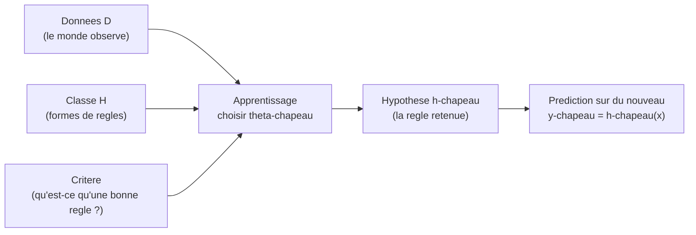
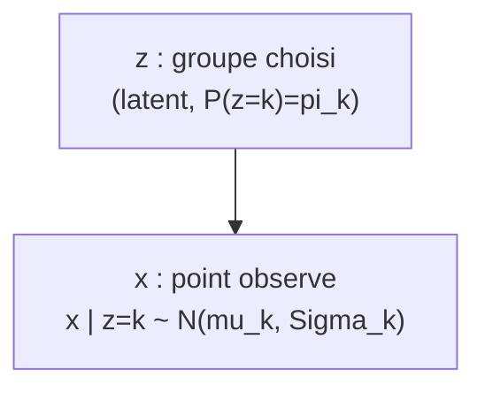
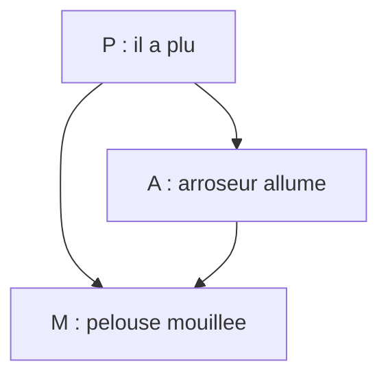
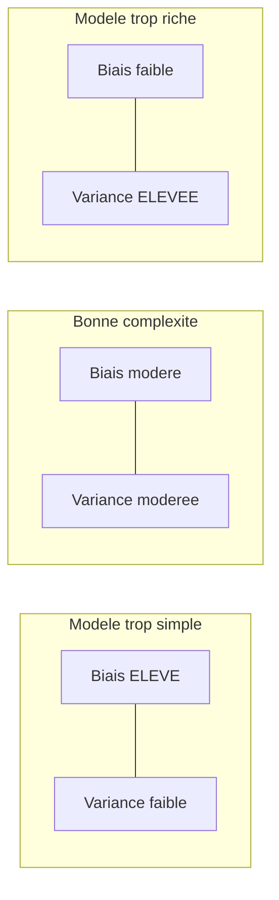
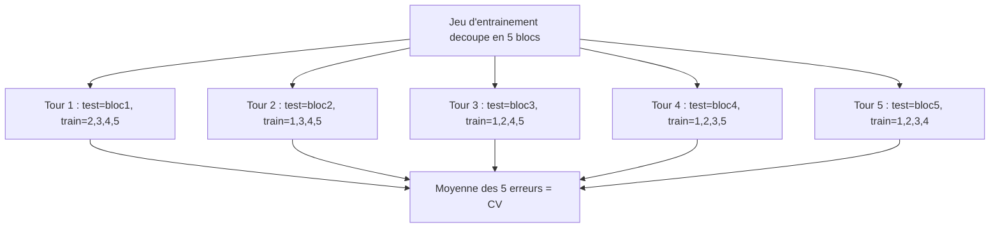
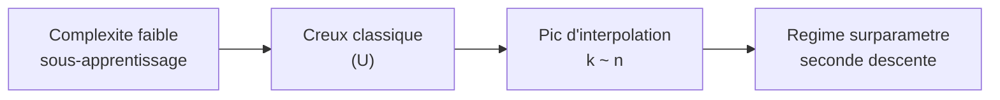

[← Sommaire](../README.md#table-des-matières)

# 8. Quand les modèles rencontrent les données

### Données, modèles et apprentissage

Imaginez un apprenti boulanger qui regarde son maître pendant des mois. Il voit des centaines de fois la même scène: telle quantité de farine, telle quantité d'eau, tel temps de cuisson, et à la sortie, un pain plus ou moins réussi. Au début il ne comprend rien. Puis, peu à peu, son cerveau construit une *règle intérieure*: « si la pâte colle aux doigts, c'est qu'il faut un peu plus de farine ». Personne ne lui a donné la formule; il l'a *apprise* en confrontant ce qu'il croyait à ce qu'il observait. L'apprentissage automatique (machine learning) fait exactement cela, mais avec des nombres et des fonctions à la place de l'intuition du boulanger.

Ce chapitre raconte cette rencontre: d'un côté des **données** (ce que le monde nous montre), de l'autre des **modèles** (les règles candidates), et au milieu un **principe d'apprentissage** qui choisit la meilleure règle. Tout le reste n'est que la mise en équations, de plus en plus précise, de cette idée simple.

#### Le vocabulaire de base: observations, etiquettes, hypotheses

Commençons par poser les objets. On observe des **exemples** (samples). Chaque exemple est décrit par des **caractéristiques** (features): pour un appartement, ce serait sa surface, son nombre de pièces, son étage. On rassemble ces caractéristiques dans un vecteur.

> **Le symbole $`\mathbf{x}`$.** Ce symbole représente *un exemple décrit par ses caractéristiques*, rangé comme une liste de nombres. C'est comme la fiche d'identité d'une chose: pour un appartement, $`\mathbf{x} = (72, 3, 4)`$ veut dire « 72 mètres carrés, 3 pièces, 4e étage ». On l'écrit en **gras** parce que c'est un vecteur (plusieurs nombres d'un coup), et on dit qu'il vit dans $`\mathcal{X}`$, l'ensemble de toutes les fiches possibles. La lettre calligraphiée $`\mathcal{X}`$ est juste « le grand sac qui contient toutes les fiches imaginables ».

> **Le symbole $`y`$.** Ce symbole représente *la réponse* qu'on aimerait prédire pour l'exemple $`\mathbf{x}`$. Pour l'appartement, $`y`$ serait son prix. On dit que $`y`$ vit dans $`\mathcal{Y}`$ (le sac de toutes les réponses possibles). Quand $`y`$ est un nombre réel (un prix), on parle de **régression**; quand $`y`$ est une catégorie (chat / chien), on parle de **classification**.

Une **donnée** (datum) est donc un couple $`(\mathbf{x}, y)`$: une question et sa réponse. Un **jeu de données** (dataset) est une collection de tels couples.

> **Le symbole $`\mathcal{D}`$.** Ce symbole représente *tout le cahier d'observations*: l'ensemble complet des exemples qu'on a récoltés. On écrit
> ```math
> \mathcal{D} = \{(\mathbf{x}_1, y_1), (\mathbf{x}_2, y_2), \dots, (\mathbf{x}_n, y_n)\}.
> ```
> Les accolades $`\{\;\}`$ veulent dire « l'ensemble des choses la-dedans ». Le petit indice en bas (le $`i`$ dans $`\mathbf{x}_i`$) est un **numéro de ligne** dans le cahier: $`\mathbf{x}_1`$ est le premier appartement, $`\mathbf{x}_2`$ le deuxième, et ainsi de suite.

> **Le symbole $`n`$.** Ce symbole représente *combien d'exemples on a*: le nombre de lignes du cahier. Si on a observé 500 appartements, alors $`n = 500`$. Plus $`n`$ est grand, plus on a de matière pour apprendre.

Le boulanger ne se contente pas de mémoriser; il veut une **règle** qui, face à une *nouvelle* pâte jamais vue, prédit le bon geste. Cette règle, c'est une fonction.

> **Le symbole $`f`$ (et $`h`$).** Ces symboles représentent *la règle qui transforme une question en réponse*: on donne $`\mathbf{x}`$, la machine rend une prédiction $`f(\mathbf{x})`$. C'est exactement la « recette intérieure » du boulanger. On note souvent la règle apprise $`h`$ (pour **hypothèse**, hypothesis), parce que c'est une *proposition* de règle qu'on teste. Prédire, c'est calculer $`\hat{y} = h(\mathbf{x})`$.

> **Le symbole chapeau $`\hat{\cdot}`$.** Le petit chapeau au-dessus d'une lettre signifie « ceci est une *estimation*, une *devinette éclairée*, pas la vérité ». Ainsi $`\hat{y}`$ se lit « y chapeau » et veut dire « le prix que *je prédis* », à distinguer de $`y`$, « le vrai prix ». C'est la différence entre la météo qui annonce 25 degrés ($`\hat{y}`$) et la température réelle de demain ($`y`$). On retrouvera ce chapeau partout: des qu'une quantité est *apprise à partir des données*, elle porte un chapeau.

#### La classe d'hypotheses: on ne cherche pas n'importe quelle regle

Le boulanger ne teste pas *toutes* les règles imaginables de l'univers: il reste dans le cadre « plus de farine / moins d'eau / temps de cuisson ». De même, en apprentissage, on se restreint à une **famille de règles candidates**, qu'on appelle la **classe d'hypothèses** (hypothesis class).

> **Le symbole $`\mathcal{H}`$.** Ce symbole représente *le catalogue des règles autorisées*: l'ensemble de toutes les fonctions $`h`$ qu'on s'autorise à essayer. C'est comme un magasin de bricolage: on n'a pas tous les outils du monde, seulement ceux des rayons. Choisir $`\mathcal{H}`$, c'est décider à l'avance la *forme* des règles. Exemple: « toutes les droites » est une classe d'hypothèses simple.

> **Le symbole $`\boldsymbol{\theta}`$.** Ce symbole (la lettre grecque *thêta*) représente *les boutons de réglage* d'une règle: les nombres qu'on peut tourner pour passer d'une règle à une autre dans la même famille. On parle de **paramètres** (parameters). Pour une droite $`h(x) = \theta_1 x + \theta_0`$, les deux boutons sont la pente $`\theta_1`$ et la hauteur $`\theta_0`$. Tourner les boutons = se déplacer dans le catalogue $`\mathcal{H}`$. On range tous les boutons dans un vecteur $`\boldsymbol{\theta}`$ qui vit dans $`\Theta`$ (l'ensemble des réglages possibles).

On écrit alors une règle paramétrée $`h_{\boldsymbol{\theta}}`$: c'est « la règle obtenue quand les boutons valent $`\boldsymbol{\theta}`$ ». La classe d'hypothèses devient
```math
\mathcal{H} = \{\, h_{\boldsymbol{\theta}} : \boldsymbol{\theta} \in \Theta \,\}.
```
**Apprendre, c'est choisir $`\boldsymbol{\theta}`$.** Toute la suite du chapitre répond à la question: *parmi tous les réglages possibles, lequel choisir au vu du cahier $`\mathcal{D}`$ ?*

> **Définition (problème d'apprentissage supervisé).** On dispose d'un espace des entrées $`\mathcal{X}`$, d'un espace des sorties $`\mathcal{Y}`$, d'une classe d'hypothèses $`\mathcal{H} \subseteq \mathcal{Y}^{\mathcal{X}}`$ et d'un jeu de données $`\mathcal{D} = \{(\mathbf{x}_i, y_i)\}_{i=1}^n`$. Un **algorithme d'apprentissage** (learning algorithm) est une application $`\mathcal{A}`$ qui, à tout jeu de données, associe une hypothèse: $`\mathcal{A}(\mathcal{D}) = \hat{h} \in \mathcal{H}`$. On dit que l'apprentissage est **supervisé** (supervised) quand chaque exemple porte sa réponse $`y_i`$; **non supervisé** (unsupervised) quand on n'a que les $`\mathbf{x}_i`$ (pas de réponse) et qu'on cherche une structure cachée.

> **Le symbole $`\mathcal{Y}^{\mathcal{X}}`$.** Cette notation représente *l'ensemble de toutes les fonctions* qui partent de $`\mathcal{X}`$ et arrivent dans $`\mathcal{Y}`$. C'est l'usage habituel de l'exposant pour les ensembles: tout comme $`\mathcal{Y}^n`$ désigne les listes de $`n`$ éléments de $`\mathcal{Y}`$ (une valeur par indice $`1,\dots,n`$), $`\mathcal{Y}^{\mathcal{X}}`$ désigne les « listes » indexées par tous les $`\mathbf{x} \in \mathcal{X}`$, c'est-à-dire les règles. Écrire $`\mathcal{H} \subseteq \mathcal{Y}^{\mathcal{X}}`$ dit simplement: notre catalogue $`\mathcal{H}`$ est un sous-ensemble de toutes les règles concevables.

#### Les trois ingredients de tout apprentissage

Tout au long de ce chapitre, on va voir revenir la même trilogie. La voici en un schéma.



| Ingrédient | Question à laquelle il répond | Exemple « droite » |
|---|---|---|
| Classe d'hypothèses $`\mathcal{H}`$ | *Quelle forme* peut prendre la règle ? | toutes les droites $`\theta_1 x + \theta_0`$ |
| Critère d'apprentissage | *Comment juger* qu'une règle est bonne ? | erreur quadratique moyenne |
| Algorithme $`\mathcal{A}`$ | *Comment trouver* la meilleure règle ? | moindres carrés / descente de gradient |

> **Remarque (le cœur du chapitre).** Les deux grandes façons de définir le critère d'apprentissage donneront les deux grandes sections suivantes: minimiser une **erreur** mesurée sur les données (vision *minimisation du risque empirique*), ou maximiser la **plausibilité** des données sous un modèle probabiliste (vision *maximum de vraisemblance*). On verra que ces deux visions, apparemment différentes, se rejoignent souvent, c'est l'un des plus beaux ponts du domaine.

#### Generalisation: apprendre n'est pas memoriser

Un piège guette le boulanger: il pourrait apprendre par cœur « le mardi 3 j'ai mis 502 g de farine ». C'est inutile, car le mardi suivant la farine n'est pas la même. Ce qui compte, c'est de bien faire sur des situations *nouvelles*. En apprentissage, cette capacité porte un nom: la **généralisation** (generalization).

> **Piège (par cœur vs compréhension).** Une règle qui colle *parfaitement* aux données observées peut être *catastrophique* sur des données nouvelles: elle a appris le bruit, les détails, les accidents du cahier, au lieu de la tendance de fond. C'est le **surapprentissage** (overfitting). A l'opposé, une règle trop rigide rate la tendance: c'est le **sous-apprentissage** (underfitting). Tout l'art consiste à viser juste entre les deux, on y consacrera toute la dernière section, sur le compromis biais-variance.

Pour parler proprement de généralisation, il faut un cadre probabiliste: on suppose que les données ne tombent pas au hasard complet, mais sont **tirées** d'une certaine loi du monde.

> **Le symbole $`\sim`$.** Ce petit signe ondulé se lit « suit la loi » ou « est tiré selon ». Quand on écrit $`(\mathbf{x}, y) \sim P`$, cela veut dire « le couple question-réponse est pioché au hasard dans une grande urne dont les proportions sont décrites par la loi $`P`$ ». C'est comme dire « cette boule est tirée d'un sac où il y a 70 pour cent de boules rouges »: le $`\sim`$ relie l'objet tiré au sac d'où il vient.

> **Hypothèse i.i.d.** On suppose très souvent que les $`n`$ exemples sont **indépendants et identiquement distribués** (independent and identically distributed, i.i.d.): chaque couple $`(\mathbf{x}_i, y_i)`$ est tiré de la *même* loi $`P`$, et les tirages ne s'influencent pas. C'est l'équivalent de « je tire $`n`$ boules du *même* sac, en remettant la boule à chaque fois ». Cette hypothèse, souvent imparfaite dans la vraie vie (les données temporelles, par exemple, ne sont pas indépendantes), est la fondation théorique qui rend l'apprentissage analysable.

Voilà le décor planté: des données tirées d'une loi $`P`$, une famille de règles $`\mathcal{H}`$ paramétrée par $`\boldsymbol{\theta}`$, et le projet de choisir $`\hat{\boldsymbol{\theta}}`$ pour bien prédire *au-delà* du cahier. Passons maintenant au premier grand principe pour faire ce choix.

---

### Minimisation du risque empirique

Reprenons le boulanger. Pour savoir si sa règle est bonne, il lui faut une **note de douleur**: à quel point s'est-il trompé ? Un pain brûlé rapporte une grosse pénalité, un pain parfait rapporte zéro. Cette note, en apprentissage, s'appelle la **fonction de perte**.

#### La fonction de perte: mesurer une erreur

> **Le symbole $`\ell`$ (la fonction de perte, loss).** Ce symbole représente *le prix à payer quand on se trompe*. On lui donne deux choses: la prédiction $`\hat{y}`$ et la vraie réponse $`y`$, et il rend un nombre $`\ell(\hat{y}, y) \ge 0`$ qui dit « voilà à quel point cette prédiction est mauvaise ». C'est comme un arbitre sévère: si vous prédisez pile la vérité, il dit « 0, parfait »; plus vous vous éloignez, plus la note monte. La perte vaut toujours zéro ou plus (on ne peut pas être *récompensé* pour une erreur), et elle vaut zéro quand $`\hat{y} = y`$.

Quelques pertes classiques, selon le type de problème:

| Nom | Formule $`\ell(\hat{y}, y)`$ | Pour quoi ? |
|---|---|---|
| Quadratique (squared / L2) | $`(\hat{y} - y)^2`$ | régression, pénalise fort les grosses erreurs |
| Absolue (absolute / L1) | $`\lvert \hat{y} - y \rvert`$ | régression robuste aux valeurs aberrantes |
| 0–1 (zéro-one) | $`\mathbf{1}[\hat{y} \neq y]`$ | classification, compte les erreurs |
| Logistique (log-loss) | $`-\big(y \ln \hat{p} + (1-y)\ln(1-\hat{p})\big)`$ | classification probabiliste |

> **Le symbole $`\mathbf{1}[\,\cdot\,]`$ (indicatrice).** Ce symbole représente *un interrupteur qui vaut 1 si c'est vrai, 0 si c'est faux*. Ainsi $`\mathbf{1}[\hat{y} \neq y]`$ vaut 1 quand on s'est trompé de classe, et 0 quand on a vu juste. C'est l'ampoule qui s'allume uniquement quand la condition entre crochets est réalisée. La perte 0–1 est donc, littéralement, « compte un point à chaque erreur ».

> **Le symbole $`\hat{p}`$ (probabilité prédite).** Dans la log-loss, $`\hat{p}`$ représente *la probabilité que le modèle attribue à la classe 1* (par exemple « 0,8 de chance que ce soit un chat »). C'est un nombre entre 0 et 1, alors que la vraie étiquette $`y`$ vaut 0 ou 1. La log-loss récompense un modèle *confiant et correct* (prédire 0,99 quand $`y=1`$ coûte presque rien) et punit sévèrement un modèle *confiant et faux* (prédire 0,01 quand $`y=1`$ coûte très cher).

#### Le risque: la perte moyenne sur tout le monde

La perte note *une* prédiction. Mais une bonne règle doit être bonne *en moyenne*, sur tous les exemples que le monde peut produire. On mesure donc la perte moyenne sous la loi $`P`$: c'est le **risque** (risk), ou **erreur de généralisation**.

> **Le symbole $`R(h)`$ (le risque, ou erreur attendue).** Ce symbole représente *la douleur moyenne d'une règle sur l'ensemble du monde*, pas seulement sur les exemples vus, mais sur tous les exemples possibles, pondérés par leur probabilité d'apparaître. C'est la « note de vie » de la règle $`h`$. Formellement, on prend l'**espérance** (la moyenne pondérée par les probabilités) de la perte:
> ```math
> R(h) = \mathbb{E}_{(\mathbf{x}, y) \sim P}\big[\ell(h(\mathbf{x}), y)\big].
> ```
> L'indice « $`(\mathbf{x}, y) \sim P`$ » sous le $`\mathbb{E}`$ précise *par rapport à quel hasard* on fait la moyenne: on imagine tirer une infinité de couples du sac $`P`$, calculer la perte à chaque fois, et faire la moyenne de toutes ces pertes. Plus $`R(h)`$ est petit, meilleure est la règle.

Le but idéal de l'apprentissage est de trouver la règle de **risque minimal**:
```math
h^\star = \arg\min_{h \in \mathcal{H}} R(h).
```

> **Remarque (le mur infranchissable).** On ne peut **pas** calculer $`R(h)`$: il faudrait connaître la loi $`P`$ du monde entier, qui est précisément ce qu'on ignore ! On ne dispose que d'un échantillon fini, le cahier $`\mathcal{D}`$. Toute la suite consiste à *remplacer* cette moyenne ideale, inaccessible, par une moyenne *concrète* calculée sur nos données.

#### Le risque empirique: la moyenne sur le cahier

Puisqu'on ne connaît pas $`P`$, on remplace l'espérance théorique par la **moyenne effective sur les exemples observés**. C'est le **risque empirique** (empirical risk), aussi appelé perte d'entraînement.

> **Le symbole $`\hat{R}(h)`$ ou $`\hat{R}_n(h)`$ (le risque empirique).** Ce symbole représente *la douleur moyenne de la règle, mesurée seulement sur les exemples du cahier*. Le chapeau rappelle que c'est une *estimation* du vrai risque $`R(h)`$ à partir de nos données, et le $`n`$ rappelle qu'on a moyenne sur $`n`$ exemples. On additionne la perte sur chaque ligne du cahier, puis on divise par le nombre de lignes:
> ```math
> \hat{R}_n(h) = \frac{1}{n}\sum_{i=1}^{n} \ell\big(h(\mathbf{x}_i), y_i\big).
> ```
> Ici le grand $`\Sigma`$ (sigma) est la « boucle qui additionne »: on parcourt $`i = 1, 2, \dots, n`$, on calcule la perte sur l'exemple $`i`$, et on empile tout. Le $`\frac{1}{n}`$ devant transforme cette somme en *moyenne* (on partage le total entre les $`n`$ exemples).

L'idée maîtresse, le **principe de minimisation du risque empirique** (empirical risk minimization, ERM), est de choisir la règle qui minimise cette quantité calculable:
```math
\hat{h} = \arg\min_{h \in \mathcal{H}} \hat{R}_n(h)
\qquad\text{soit, en parametres,}\qquad
\hat{\boldsymbol{\theta}} = \arg\min_{\boldsymbol{\theta} \in \Theta} \frac{1}{n}\sum_{i=1}^n \ell\big(h_{\boldsymbol{\theta}}(\mathbf{x}_i), y_i\big).
```

> **Définition (ERM).** Étant donné une classe $`\mathcal{H}`$, une perte $`\ell`$ et des données $`\mathcal{D}`$, l'**estimateur du risque empirique** est tout $`\hat{h} \in \arg\min_{h\in\mathcal{H}} \hat{R}_n(h)`$. C'est le pari, fondamental et souvent justifie, que *bien faire sur les exemples vus* tend à *bien faire sur les exemples futurs*, à condition de ne pas surapprendre.

> **Le symbole $`\arg\min`$ (rappel d'usage).** Il ne rend pas la *valeur* minimale de la fonction, mais *l'endroit* (ici le $`\boldsymbol{\theta}`$) où ce minimum est atteint. « $`\arg`$ » = *argument*, c'est-à-dire l'entrée qui réalise le mieux. On écrit « $`\hat{h} \in \arg\min`$ » (appartenance) plutôt que « $`\hat{h} = \arg\min`$ » quand le minimum peut être atteint en plusieurs endroits: l'$`\arg\min`$ est alors un *ensemble* de minimiseurs, et on en choisit un.

#### Pourquoi ca marche: la loi des grands nombres

Pourquoi remplacer $`R`$ par $`\hat{R}_n`$ serait-il légitime ? Parce que, sous l'hypothèse i.i.d., la moyenne empirique converge vers l'espérance.

> **Théorème (loi des grands nombres, justification de l'ERM).** Soit $`h`$ fixée. Si les $`(\mathbf{x}_i, y_i)`$ sont i.i.d. de loi $`P`$ et si $`\mathbb{E}[\lvert \ell(h(\mathbf{x}), y)\rvert] < \infty`$, alors
> ```math
> \hat{R}_n(h) \;\xrightarrow[n \to \infty]{} \; R(h) \quad \text{(presque surement).}
> ```
> **Démonstration.** Posons $`Z_i = \ell(h(\mathbf{x}_i), y_i)`$. Les $`Z_i`$ sont i.i.d. (image par la même fonction $`\ell(h(\cdot),\cdot)`$ de variables i.i.d.), d'espérance $`\mathbb{E}[Z_i] = R(h)`$ par définition même du risque. Le risque empirique $`\hat{R}_n(h) = \frac{1}{n}\sum_i Z_i`$ est exactement la moyenne empirique de ces variables. La loi forte des grands nombres affirme que la moyenne empirique de variables i.i.d. intégrables converge presque sûrement vers leur espérance commune. D'où la conclusion. $`\blacksquare`$

> **Le symbole « presque sûrement ».** Cette expression (notée p.s.) signifie *« avec probabilité 1 »*: l'événement de convergence est certain, à l'exception éventuelle de cas si rares que leur probabilité totale est nulle. C'est la forme de convergence la plus forte qu'on rencontre ici; intuitivement, « si l'on accumule assez de données, la moyenne observée finit par coller à la vraie moyenne, sans exception qui compte ».

> **Piège subtil (uniformité).** La loi des grands nombres vaut pour une hypothèse $`h`$ *fixée à l'avance*. Or l'ERM *choisit* $`\hat{h}`$ *en regardant les données*: $`\hat{h}`$ dépend de $`\mathcal{D}`$. La garantie « $`\hat{R}_n(\hat{h}) \approx R(\hat{h})`$ » exige une convergence **uniforme** sur toute la classe $`\mathcal{H}`$; c'est le rôle de la théorie de Vapnik–Chervonenkis (dimension VC) et de la complexité de Rademacher. Retenir: *plus $`\mathcal{H}`$ est riche, plus l'écart entre risque empirique et risque vrai peut être grand*, c'est le germe du surapprentissage, et on y reviendra.

#### Exemple chiffre deroule: la regression lineaire par moindres carres

Mettons l'ERM en action sur le cas le plus célèbre: une droite, avec la perte quadratique. C'est la **méthode des moindres carrés** (least squares).

Classe d'hypothèses: les fonctions affines $`h_{\boldsymbol{\theta}}(\mathbf{x}) = \boldsymbol{\theta}^\top \mathbf{x}`$, où l'on a glissé un 1 en tête de $`\mathbf{x}`$ pour absorber le terme constant (le biais).

> **Convention de l'« intercept ».** Pour ne pas traîner séparément la hauteur $`\theta_0`$, on ajoute artificiellement une coordonnée constante égale à 1 à chaque exemple: $`\mathbf{x} = (1, x_1, \dots, x_d)`$. Alors $`\boldsymbol{\theta}^\top \mathbf{x} = \theta_0 \cdot 1 + \theta_1 x_1 + \dots + \theta_d x_d`$ contient le terme constant $`\theta_0`$ « gratuitement ». C'est un truc de comptable pour écrire tout d'un bloc.

Le risque empirique avec la perte quadratique s'écrit
```math
\hat{R}_n(\boldsymbol{\theta}) = \frac{1}{n}\sum_{i=1}^n \big(\boldsymbol{\theta}^\top \mathbf{x}_i - y_i\big)^2.
```

Empilons les exemples en une matrice de **design** $`X \in \mathbb{R}^{n \times d}`$ (une ligne par exemple, $`d`$ colonnes pour les caractéristiques intercept inclus) et les réponses en un vecteur $`\mathbf{y} \in \mathbb{R}^n`$. Alors
```math
\hat{R}_n(\boldsymbol{\theta}) = \frac{1}{n}\,\lVert X\boldsymbol{\theta} - \mathbf{y}\rVert^2.
```

> **La matrice de design $`X`$.** Elle représente *tout le cahier rangé en tableau*: une ligne par exemple, une colonne par caractéristique. Le produit $`X\boldsymbol{\theta}`$ calcule d'un seul coup les $`n`$ prédictions (la $`i`$-e ligne de $`X\boldsymbol{\theta}`$ est $`\boldsymbol{\theta}^\top\mathbf{x}_i`$), et $`X\boldsymbol{\theta} - \mathbf{y}`$ est le vecteur des $`n`$ écarts entre prédictions et vérités. Sa norme au carré est donc la somme des carrés des résidus.

Pour trouver le minimum, on annule le gradient (la pente est nulle au creux de la vallée).

> **Le symbole $`\nabla`$ (nabla, le gradient, rappel d'usage).** Ce symbole en triangle pointe vers le bas représente *la pente dans toutes les directions à la fois*: $`\nabla_{\boldsymbol{\theta}} g`$ est le vecteur dont chaque composante dit « de combien $`g`$ monte si je pousse ce bouton-la ». Au fond d'une vallée (un minimum d'une fonction convexe lisse), il n'y a plus de pente nulle part: le gradient est le vecteur nul. Résoudre $`\nabla_{\boldsymbol{\theta}}\hat{R}_n = \mathbf{0}`$, c'est chercher ce fond de vallée.

Développons $`\lVert X\boldsymbol{\theta} - \mathbf{y}\rVert^2 = \boldsymbol{\theta}^\top X^\top X \boldsymbol{\theta} - 2\,\boldsymbol{\theta}^\top X^\top \mathbf{y} + \mathbf{y}^\top \mathbf{y}`$, puis dérivons:
```math
\nabla_{\boldsymbol{\theta}}\, \hat{R}_n(\boldsymbol{\theta}) = \frac{2}{n}\big(X^\top X \boldsymbol{\theta} - X^\top \mathbf{y}\big).
```
En annulant, on obtient les **équations normales** (normal équations):
```math
X^\top X\, \hat{\boldsymbol{\theta}} = X^\top \mathbf{y}
\qquad\Longrightarrow\qquad
\hat{\boldsymbol{\theta}} = (X^\top X)^{-1} X^\top \mathbf{y} \quad (\text{si } X^\top X \text{ inversible}).
```

> **Lecture géométrique.** $`X\hat{\boldsymbol{\theta}}`$ est la **projection orthogonale** de $`\mathbf{y}`$ sur l'espace engendré par les colonnes de $`X`$. Les équations normales disent exactement que le résidu $`\mathbf{y} - X\hat{\boldsymbol{\theta}}`$ est orthogonal à toutes les colonnes de $`X`$ (puisque $`X^\top(\mathbf{y} - X\hat{\boldsymbol{\theta}}) = \mathbf{0}`$). On choisit le point de l'espace des prédictions le plus proche de la vérité: l'ombre de $`\mathbf{y}`$ sur le plan des règles possibles.

Faisons tourner un mini-exemple à la main. Trois points: $`(x, y) \in \{(1, 2), (2, 2), (3, 4)\}`$. Avec l'intercept, $`X = \begin{pmatrix}1&1\\1&2\\1&3\end{pmatrix}`$, $`\mathbf{y} = (2, 2, 4)^\top`$.

Calculons $`X^\top X = \begin{pmatrix}3 & 6\\ 6 & 14\end{pmatrix}`$ et $`X^\top \mathbf{y} = (8, 18)^\top`$. Le déterminant vaut $`3\cdot 14 - 6\cdot 6 = 6`$, donc
```math
(X^\top X)^{-1} = \frac{1}{6}\begin{pmatrix}14 & -6\\ -6 & 3\end{pmatrix},
\qquad
\hat{\boldsymbol{\theta}} = \frac{1}{6}\begin{pmatrix}14 & -6\\ -6 & 3\end{pmatrix}\begin{pmatrix}8\\18\end{pmatrix}
= \frac{1}{6}\begin{pmatrix}112 - 108\\ -48 + 54\end{pmatrix}
= \begin{pmatrix}2/3\\ 1\end{pmatrix}.
```
La droite ajustée est donc $`\hat{y} = 1\cdot x + \tfrac{2}{3}`$: pente 1, ordonnée à l'origine $`2/3`$. Les trois résidus valent alors $`-\tfrac13,\ +\tfrac23,\ -\tfrac13`$ (par exemple en $`x=2`$: $`\hat{y} = 2 + \tfrac23 = \tfrac83 \approx 2{,}67`$ contre $`y=2`$ observé). Leur somme est nulle, signature de l'orthogonalité avec la colonne d'intercept, et le risque empirique vaut $`\tfrac13\big(\tfrac19+\tfrac49+\tfrac19\big) = \tfrac{2}{9} \approx 0{,}22`$.

#### Application machine learning et code

Les moindres carrés sont la brique de base de la régression. En pratique on n'inverse pas $`X^\top X`$ à la main (instable si les colonnes sont presque colinéaires): on résout les équations normales par décomposition (QR ou SVD).

```python
import numpy as np

def fit_least_squares(X, y):
    n = X.shape[0]
    X1 = np.hstack([np.ones((n, 1)), X])
    theta, *_ = np.linalg.lstsq(X1, y, rcond=None)
    return theta

def empirical_risk(theta, X, y):
    n = X.shape[0]
    X1 = np.hstack([np.ones((n, 1)), X])
    residuals = X1 @ theta - y
    return np.mean(residuals ** 2)

X = np.array([[1.0], [2.0], [3.0]])
y = np.array([2.0, 2.0, 4.0])

theta = fit_least_squares(X, y)
print("theta (intercept, pente) =", theta)        # [0.667 1.   ]
print("risque empirique          =", empirical_risk(theta, X, y))  # 0.222
```

> **Mise à jour 2026.** Pour les très grands jeux de données ($`n`$ ou $`d`$ énormes), on ne forme jamais $`X^\top X`$ (coût $`O(nd^2)`$ et mauvais conditionnement). On préfère: (i) la **SVD tronquée randomisée** pour une solution stable de rang réduit; (ii) surtout la **descente de gradient stochastique** (stochastic gradient descent, SGD) et ses variantes adaptatives **Adam / AdamW**, qui minimisent le risque empirique par petits lots sans jamais matérialiser la matrice normale. Le gradient $`\frac{2}{n} X^\top(X\boldsymbol{\theta} - \mathbf{y})`$ se calcule par produits matrice-vecteur, et en apprentissage profond il est obtenu par **différentiation automatique** (autodiff, via PyTorch ou JAX) plutôt qu'à la main.

#### Regularisation: empecher le surapprentissage des l'ERM

L'ERM brute peut surapprendre, surtout si $`\mathcal{H}`$ est riche. Le remède le plus courant est d'ajouter au risque empirique une **pénalité** qui décourage les réglages extrêmes: c'est la **régularisation** (regularization).

> **Le symbole $`\lambda`$ (lambda, force de régularisation).** Ce symbole représente *le poids du garde-fou*: un curseur qui dit à quel point on pénalise les réglages compliqués. A $`\lambda = 0`$, pas de garde-fou (ERM pure); plus $`\lambda`$ grandit, plus on force les boutons $`\boldsymbol{\theta}`$ à rester petits et sages. C'est le bouton « prudence » du modèle. C'est un **hyperparamètre**: on ne l'apprend pas par l'ERM, on le règle par validation (dernière section).

L'objectif **régularisé** s'écrit
```math
\hat{\boldsymbol{\theta}}_\lambda = \arg\min_{\boldsymbol{\theta}} \;\underbrace{\frac{1}{n}\sum_{i=1}^n \ell\big(h_{\boldsymbol{\theta}}(\mathbf{x}_i), y_i\big)}_{\text{coller aux donnees}} \;+\; \underbrace{\lambda\, \Omega(\boldsymbol{\theta})}_{\text{rester simple}}.
```

> **Le symbole $`\Omega(\boldsymbol{\theta})`$ (pénalité de complexité).** Ce symbole (la lettre grecque *oméga* majuscule) représente *une mesure de « combien le réglage est compliqué »*: plus les coefficients sont gros, plus $`\Omega`$ est grand. On la choisit positive et minimale (souvent nulle) au réglage le plus simple. Le produit $`\lambda\,\Omega(\boldsymbol{\theta})`$ est l'amende ajoutée à la note d'erreur; minimiser la somme, c'est arbitrer entre coller aux données et rester sobre.

| Pénalité $`\Omega(\boldsymbol{\theta})`$ | Nom | Effet |
|---|---|---|
| $`\lVert \boldsymbol{\theta}\rVert_2^2 = \sum_j \theta_j^2`$ | Ridge (L2, Tikhonov) | rétrécit tous les coefficients, solution unique |
| $`\lVert \boldsymbol{\theta}\rVert_1 = \sum_j \lvert \theta_j\rvert`$ | Lasso (L1) | met des coefficients exactement à zéro (sélection de variables) |

Pour la régression ridge, la solution reste explicite et *toujours* bien définie (le terme $`n\lambda I`$ rend la matrice inversible des que $`\lambda > 0`$):
```math
\hat{\boldsymbol{\theta}}_\lambda = (X^\top X + n\lambda I)^{-1} X^\top \mathbf{y}.
```
On verra dans la section suivante que cette pénalité n'est pas un bricolage: elle correspond *exactement* à une croyance a priori gaussienne sur $`\boldsymbol{\theta}`$ (estimation MAP). Le pont entre « ajouter une pénalité » et « avoir une opinion a priori » est l'un des résultats les plus éclairants du chapitre.

---

### Estimation des paramètres: maximum de vraisemblance et MAP

Changeons de lunettes. Jusqu'ici, on *mesurait une erreur*. Adoptons maintenant un point de vue **probabiliste**: on suppose que les données ont été *engendrées* par un modèle de hasard dépendant de $`\boldsymbol{\theta}`$, et on demande: *quel réglage $`\boldsymbol{\theta}`$ rend ce que j'ai observé le plus plausible ?* C'est l'**estimation par maximum de vraisemblance**.

#### La vraisemblance: « avec quelle probabilite ce modele aurait-il produit mes donnees ? »

Imaginez une machine à fabriquer des données, dont le comportement dépend de boutons $`\boldsymbol{\theta}`$. Pour un réglage donné, elle a une certaine probabilité de cracher exactement le cahier $`\mathcal{D}`$ que vous avez sous les yeux. La **vraisemblance** retourne le point de vue: les données sont *fixées* (c'est ce qu'on a vu), et on regarde cette probabilité *comme une fonction des boutons*.

> **Le symbole $`p(\cdot \mid \boldsymbol{\theta})`$ (loi du modèle, ou densité paramétrée).** Ce symbole représente la règle de hasard de la machine quand ses boutons valent $`\boldsymbol{\theta}`$. La barre verticale « $`\mid`$ » se lit « sachant » ou « étant donné »: $`p(\mathbf{y} \mid \boldsymbol{\theta})`$ veut dire « la probabilité (ou densité) de voir les réponses $`\mathbf{y}`$, *si* la machine est réglée sur $`\boldsymbol{\theta}`$ ». C'est la fiche technique de la machine: pour chaque réglage, elle dit quelles sorties sont fréquentes et lesquelles sont rares.

> **Le symbole $`\mathcal{L}(\boldsymbol{\theta})`$ (la vraisemblance, likelihood).** Ce symbole représente *la plausibilité d'un réglage au vu des données observées*. C'est numériquement la même expression que $`p(\text{donnees} \mid \boldsymbol{\theta})`$, mais on a échangé les rôles: on bloque les données (elles sont connues, c'est notre cahier) et on fait varier $`\boldsymbol{\theta}`$. Question posée: « quel réglage explique le mieux ce que j'ai vu ? ». Sous l'hypothèse i.i.d., la machine fabrique chaque exemple indépendamment, donc la probabilité du paquet est le **produit** des probabilités:
> ```math
> \mathcal{L}(\boldsymbol{\theta}) = p(\mathcal{D} \mid \boldsymbol{\theta}) = \prod_{i=1}^n p(\mathbf{x}_i, y_i \mid \boldsymbol{\theta}).
> ```

> **Le symbole $`\prod`$ (produit, « pi » majuscule).** Ce symbole est le cousin multiplicatif du $`\Sigma`$: là où sigma *additionne*, pi *multiplie*. C'est une « boucle qui multiplie »: $`\prod_{i=1}^n a_i = a_1 \times a_2 \times \dots \times a_n`$. Il apparaît ici parce que la probabilité de plusieurs événements *indépendants* qui se produisent *tous* est le produit de leurs probabilités (comme « pile ET pile ET pile » à une chance sur deux puissance trois).

#### La log-vraisemblance: transformer les produits en sommes

Multiplier des centaines de petites probabilités donne un nombre minuscule, instable numériquement, et pénible à dériver. L'astuce universelle: prendre le **logarithme**, qui transforme les produits en sommes et ne déplace pas l'emplacement du maximum (le logarithme est strictement croissant).

> **Le symbole $`\ln`$ (logarithme népérien, rappel d'usage).** Le logarithme transforme la multiplication en addition: $`\ln(a\times b) = \ln a + \ln b`$. C'est pour cela qu'on l'aime ici: il déplie le produit géant $`\prod`$ en une somme bien plus douce $`\Sigma`$. Comme il est strictement croissant, « rendre $`\mathcal{L}`$ maximal » et « rendre $`\ln \mathcal{L}`$ maximal » donnent *le même* $`\boldsymbol{\theta}`$.

> **Le symbole $`\ell(\boldsymbol{\theta})`$ (log-vraisemblance, log-likelihood).** Attention, même lettre que la perte mais rôle différent (la perte prend une prédiction et une cible; ici l'argument est le réglage $`\boldsymbol{\theta}`$): $`\ell(\boldsymbol{\theta}) = \ln \mathcal{L}(\boldsymbol{\theta})`$ représente *la plausibilité d'un réglage, mesurée sur une échelle logarithmique*. On la préfère toujours en pratique:
> ```math
> \ell(\boldsymbol{\theta}) = \ln \mathcal{L}(\boldsymbol{\theta}) = \sum_{i=1}^n \ln p(\mathbf{x}_i, y_i \mid \boldsymbol{\theta}).
> ```

L'**estimateur du maximum de vraisemblance** (maximum likelihood estimator, MLE) est le réglage qui maximise cette plausibilité:
```math
\hat{\boldsymbol{\theta}}_{\text{MV}} = \arg\max_{\boldsymbol{\theta}} \ell(\boldsymbol{\theta}) = \arg\max_{\boldsymbol{\theta}} \sum_{i=1}^n \ln p(\mathbf{x}_i, y_i \mid \boldsymbol{\theta}).
```

> **Le symbole $`\arg\max`$ (rappel d'usage).** Symétrique de $`\arg\min`$: il rend *l'endroit* où une fonction atteint son maximum, pas la valeur du maximum. Maximiser $`\ell`$ ou minimiser $`-\ell`$ donnent le même $`\boldsymbol{\theta}`$, c'est ce changement de signe qui reliera vraisemblance et perte.

> **Définition (maximum de vraisemblance).** Soit un modèle statistique $`\{p(\cdot \mid \boldsymbol{\theta}): \boldsymbol{\theta} \in \Theta\}`$ et des observations i.i.d. $`\mathcal{D}`$. L'**estimateur du maximum de vraisemblance** est tout $`\hat{\boldsymbol{\theta}}_{\text{MV}} \in \arg\max_{\boldsymbol{\theta}\in\Theta} \mathcal{L}(\boldsymbol{\theta})`$. Intuitivement: *parmi toutes les machines candidates, on garde celle qui avait le plus de chances de produire exactement ce qu'on a observe.*

#### Le pont fondamental: minimiser la perte = maximiser la vraisemblance

Voici le résultat qui relie les deux premières sections. Maximiser une vraisemblance, c'est minimiser une perte bien choisie ($`\ell_{\text{perte}}(\hat y, y) = -\ln p`$), et inversement. Démontrons-le sur le cas roi.

> **Théorème (moindres carrés = vraisemblance gaussienne).** Supposons le modèle $`y_i = \boldsymbol{\theta}^\top \mathbf{x}_i + \varepsilon_i`$ avec des bruits $`\varepsilon_i \sim \mathcal{N}(0, \sigma^2)`$ i.i.d. (et $`\sigma^2`$ fixe connu). Alors l'estimateur du maximum de vraisemblance de $`\boldsymbol{\theta}`$ coincide avec l'estimateur des moindres carrés.

> **Le symbole $`\varepsilon`$ (epsilon, le bruit).** Ce symbole représente *le grain de hasard* qui fait que la réalité ne tombe jamais pile sur la droite: la petite erreur de mesure, l'imprévu, l'aléa. On le suppose ici centré (moyenne nulle: il ne tire pas systématiquement vers le haut ou le bas) et de variance $`\sigma^2`$ (son ampleur typique). C'est le tremblement de la main du monde quand il écrit les données.

> **Le symbole $`\sigma^2`$ (variance du bruit).** Ce symbole représente *l'ampleur typique du tremblement*: un grand $`\sigma^2`$ signifie des points très dispersés autour de la droite, un petit $`\sigma^2`$ des points presque alignés. C'est le carré de l'écart-type $`\sigma`$; on travaille avec le carré parce que c'est lui qui apparaît naturellement dans la densité gaussienne.

**Démonstration.** La densité gaussienne d'un résidu donne, pour chaque exemple,
```math
p(y_i \mid \mathbf{x}_i, \boldsymbol{\theta}) = \frac{1}{\sqrt{2\pi\sigma^2}}\exp\!\left(-\frac{(y_i - \boldsymbol{\theta}^\top \mathbf{x}_i)^2}{2\sigma^2}\right).
```
La log-vraisemblance vaut donc
```math
\ell(\boldsymbol{\theta}) = \sum_{i=1}^n \ln p(y_i \mid \mathbf{x}_i, \boldsymbol{\theta})
= -\frac{n}{2}\ln(2\pi\sigma^2) \;-\; \frac{1}{2\sigma^2}\sum_{i=1}^n (y_i - \boldsymbol{\theta}^\top \mathbf{x}_i)^2.
```
Le premier terme ne dépend pas de $`\boldsymbol{\theta}`$; le second est, au facteur positif $`\frac{1}{2\sigma^2}`$ près, l'opposé de la somme des carrés des résidus. Maximiser $`\ell`$ en $`\boldsymbol{\theta}`$ revient donc à *minimiser* $`\sum_i (y_i - \boldsymbol{\theta}^\top \mathbf{x}_i)^2`$: exactement le critère des moindres carrés. $`\blacksquare`$

> **Remarque (la log-vraisemblance négative comme perte).** En général, poser $`\ell_{\text{perte}}(\hat y, y) = -\ln p(y \mid \hat y)`$ transforme tout MLE en une ERM. Avec un bruit gaussien on retombe sur la perte quadratique; avec un bruit de Laplace, sur la perte absolue L1; en classification binaire avec un modèle de Bernoulli, sur la **log-loss**. La fonction de perte n'est donc pas arbitraire: elle encode une *hypothèse sur la nature du bruit*.

#### Exemple chiffre: MLE d'une piece truquee (Bernoulli)

Le cas le plus simple pour sentir le mécanisme. On lance $`n`$ fois une pièce qui tombe sur « face » avec une probabilité inconnue $`\theta \in [0,1]`$. On observe $`k`$ faces. Quel $`\hat\theta`$ ?

Chaque lancer suit une loi de **Bernoulli**: $`p(y_i \mid \theta) = \theta^{y_i}(1-\theta)^{1-y_i}`$ (avec $`y_i = 1`$ pour face). La log-vraisemblance:
```math
\ell(\theta) = \sum_{i=1}^n \big[y_i \ln\theta + (1-y_i)\ln(1-\theta)\big] = k\ln\theta + (n-k)\ln(1-\theta).
```
On dérive et on annule:
```math
\ell'(\theta) = \frac{k}{\theta} - \frac{n-k}{1-\theta} = 0
\;\Longrightarrow\;
k(1-\theta) = (n-k)\theta
\;\Longrightarrow\;
\hat\theta_{\text{MV}} = \frac{k}{n}.
```
Résultat très intuitif: la meilleure estimation de la probabilité de face est *la fréquence observée* de faces. Avec $`n=10`$ lancers et $`k=7`$ faces, $`\hat\theta_{\text{MV}} = 0{,}7`$.

> **Piège (le MLE peut être extrême).** Si l'on observe $`k=0`$ face sur $`n=3`$ lancers, le MLE donne $`\hat\theta = 0`$: « cette pièce ne tombera *jamais* sur face ». Conclusion absurde tirée de trop peu de données. C'est exactement le genre d'excès que l'approche bayésienne (ci-dessous) va tempérer en injectant un a priori.

#### Proprietes du MLE (niveau avance)

Le MLE n'est pas qu'une recette: c'est un estimateur aux propriétés remarquables quand $`n`$ grandit.

> **Théorème (propriétés asymptotiques du MLE).** Sous des conditions de régularité (identifiabilité, support fixe, dérivabilité, vrai paramètre $`\boldsymbol{\theta}_0`$ à l'intérieur de $`\Theta`$), l'estimateur du maximum de vraisemblance est:
> 1. **Consistant**: $`\hat{\boldsymbol{\theta}}_{\text{MV}} \xrightarrow{P} \boldsymbol{\theta}_0`$ (il converge vers la vérité).
> 2. **Asymptotiquement normal**: $`\sqrt{n}\,(\hat{\boldsymbol{\theta}}_{\text{MV}} - \boldsymbol{\theta}_0) \xrightarrow{d} \mathcal{N}\big(0, I_1(\boldsymbol{\theta}_0)^{-1}\big)`$, où $`I_1`$ est l'information de Fisher d'*une seule* observation.
> 3. **Asymptotiquement efficace**: sa variance atteint la borne de Cramér–Rao (le minimum théorique pour un estimateur sans biais). Dit autrement: il existe un *plancher* infranchissable sur la précision de n'importe quel estimateur honnête (sans biais), aucune méthode ne peut faire trembler ses estimations moins que cette limite, et le maximum de vraisemblance finit, quand on a beaucoup de données, par toucher exactement ce plancher. C'est en ce sens qu'il est « le meilleur possible ».

> **Les symboles $`\xrightarrow{P}`$ et $`\xrightarrow{d}`$ (modes de convergence).** La flèche $`\xrightarrow{P}`$ se lit « converge en probabilité »: la probabilité que l'estimateur s'écarte de la cible de plus d'un cheveu tend vers 0. La flèche $`\xrightarrow{d}`$ se lit « converge en loi »: ce n'est plus une valeur qui se fige, mais la *forme de la distribution* (ici, des fluctuations $`\sqrt{n}(\hat{\boldsymbol{\theta}} - \boldsymbol{\theta}_0)`$) qui se rapproche d'une loi limite, la gaussienne. Intuition: non seulement le MLE vise juste, mais ses erreurs prennent une forme de cloche dont on connaît la largeur.

> **Le symbole $`I(\boldsymbol{\theta})`$ (information de Fisher).** Ce symbole représente *combien les données sont instructives sur le paramètre*, à quel point la vraisemblance est « pointue » autour de son maximum. Une vraisemblance très piquée (information grande) signifie qu'on localise très précisément $`\boldsymbol{\theta}`$; une vraisemblance plate (information faible) signifie que beaucoup de réglages expliquent aussi bien les données. Formellement, c'est la courbure moyenne (l'opposé de l'espérance de la hessienne) de la log-vraisemblance d'une observation:
> ```math
> I_1(\boldsymbol{\theta}) = -\,\mathbb{E}\big[\nabla^2_{\boldsymbol{\theta}} \ln p(y\mid\boldsymbol{\theta})\big].
> ```
> Plus la cuvette est creuse, plus l'estimation est sûre, et c'est l'inverse de cette information ($`I_1^{-1}`$) qui donne la variance limite du MLE.

> **Le symbole $`\nabla^2`$ (hessienne, rappel d'usage).** C'est la matrice des dérivées secondes: elle mesure la *courbure* d'une fonction dans toutes les directions. Pour la log-vraisemblance, une hessienne très négative (forte courbure vers le bas au sommet) signifie un pic étroit, donc une information de Fisher élevée. La hessienne raconte la forme du relief autour du maximum, là où le gradient ne dit que la pente.

#### De la vraisemblance a l'a posteriori: l'approche bayesienne

Le MLE ne croît qu'aux données. Mais souvent on a une **opinion préalable**: avant de lancer la pièce, on pense raisonnablement qu'elle est à peu près équilibrée. L'approche **bayésienne** (Bayesian) formalise cela en traitant $`\boldsymbol{\theta}`$ lui-même comme une variable aléatoire, dotée d'une loi *avant* de voir les données.

> **Le symbole $`p(\boldsymbol{\theta})`$ (loi a priori, prior).** Ce symbole représente *ce qu'on croît sur les réglages avant d'avoir regarde la moindre donnée*. C'est notre opinion de départ, notre préjugé quantifié: « je pense que la pièce est probablement équilibrée », « je pense que les coefficients sont probablement petits ». C'est la carte de nos croyances initiales.

Le théorème de Bayes met à jour cette croyance à la lumière des données:
```math
\underbrace{p(\boldsymbol{\theta} \mid \mathcal{D})}_{\text{a posteriori}} = \frac{\overbrace{p(\mathcal{D} \mid \boldsymbol{\theta})}^{\text{vraisemblance}}\;\overbrace{p(\boldsymbol{\theta})}^{\text{a priori}}}{\underbrace{p(\mathcal{D})}_{\text{evidence}}}.
```

> **Le symbole $`p(\boldsymbol{\theta} \mid \mathcal{D})`$ (loi a posteriori, posterior).** Ce symbole représente *ce qu'on croît sur les réglages APRÈS avoir vu les données*. C'est la croyance initiale, corrigée par l'expérience. La barre « $`\mid \mathcal{D}`$ » dit « sachant ce que j'ai observé ». Tout l'apprentissage bayésien tient dans une phrase: on part d'un a priori, les données parlent via la vraisemblance, et on obtient un a posteriori, la connaissance mise à jour.

> **Le symbole $`p(\mathcal{D})`$ (évidence, ou vraisemblance marginale).** Ce symbole représente *la probabilité totale d'observer ces données, toutes machines confondues*: $`p(\mathcal{D}) = \int p(\mathcal{D}\mid\boldsymbol{\theta})\,p(\boldsymbol{\theta})\,d\boldsymbol{\theta}`$. C'est une simple constante de normalisation (elle ne dépend pas de $`\boldsymbol{\theta}`$) qui fait que l'a posteriori, intégré sur tous les $`\boldsymbol{\theta}`$, vaut bien 1. Pour *trouver* le $`\boldsymbol{\theta}`$ le plus probable, on peut souvent l'ignorer.

#### L'estimation MAP: le sommet de l'a posteriori

Plutôt que de manipuler toute la distribution a posteriori, on peut se contenter de son point culminant: le réglage le plus probable après avoir vu les données. C'est l'estimation du **maximum a posteriori** (MAP).

> **Définition (maximum a posteriori, MAP).** L'estimateur MAP est le mode de la loi a posteriori:
> ```math
> \hat{\boldsymbol{\theta}}_{\text{MAP}} = \arg\max_{\boldsymbol{\theta}} p(\boldsymbol{\theta}\mid\mathcal{D}) = \arg\max_{\boldsymbol{\theta}} \big[\ln p(\mathcal{D}\mid\boldsymbol{\theta}) + \ln p(\boldsymbol{\theta})\big].
> ```
> On à jeté l'évidence $`p(\mathcal{D})`$ (constante en $`\boldsymbol{\theta}`$, donc sans effet sur l'$`\arg\max`$) et pris le log. Lecture: *le MAP, c'est le MLE corrigé par une prime/pénalité venue de l'a priori.* Si l'a priori est plat (on ne croît rien de particulier), $`\ln p(\boldsymbol{\theta})`$ est constant et le MAP redevient le MLE.

> **Le symbole « mode ».** Le **mode** d'une distribution est *l'endroit où elle culmine*: la valeur la plus probable. A distinguer de la moyenne (centre de gravité) et de la médiane (point qui coupe en deux). Le MAP retient le sommet de la cloche a posteriori; l'espérance a posteriori, elle, en retiendrait le centre de gravité, les deux coïncident pour une gaussienne, mais pas en général.

#### Le second pont fondamental: regularisation = a priori

On avait promis que la régularisation ridge n'était pas un bricolage. Voici la preuve.

> **Théorème (ridge = a priori gaussien).** Dans le modèle linéaire gaussien $`y_i = \boldsymbol{\theta}^\top\mathbf{x}_i + \varepsilon_i`$, $`\varepsilon_i \sim \mathcal{N}(0,\sigma^2)`$, muni de l'a priori gaussien $`\boldsymbol{\theta} \sim \mathcal{N}(\mathbf{0}, \tau^2 I)`$, l'estimateur MAP est exactement l'estimateur ridge avec $`\lambda = \dfrac{\sigma^2}{n\,\tau^2}`$.

> **Le symbole $`\tau^2`$ (variance de l'a priori).** Ce symbole représente *l'ampleur de nos croyances sur les coefficients avant les données*: un petit $`\tau^2`$ dit « je suis convaincu que les $`\theta_j`$ sont proches de zéro » (a priori serré), un grand $`\tau^2`$ dit « je n'ai pas d'idée, ils peuvent être grands » (a priori vague). C'est le pendant, du côté des croyances, de ce que $`\sigma^2`$ est du côté du bruit.

**Démonstration.** L'a priori gaussien donne $`\ln p(\boldsymbol{\theta}) = -\frac{1}{2\tau^2}\lVert\boldsymbol{\theta}\rVert^2 + \text{cste}`$. En reportant dans l'objectif MAP avec la log-vraisemblance gaussienne calculée plus haut:
```math
\hat{\boldsymbol{\theta}}_{\text{MAP}} = \arg\max_{\boldsymbol{\theta}} \left[-\frac{1}{2\sigma^2}\sum_{i=1}^n (y_i - \boldsymbol{\theta}^\top\mathbf{x}_i)^2 - \frac{1}{2\tau^2}\lVert\boldsymbol{\theta}\rVert^2\right].
```
On change de signe (le max devient min) et on multiplie par $`\frac{2\sigma^2}{n} > 0`$ (sans déplacer l'optimum):
```math
\hat{\boldsymbol{\theta}}_{\text{MAP}} = \arg\min_{\boldsymbol{\theta}} \left[\frac{1}{n}\sum_{i=1}^n (y_i - \boldsymbol{\theta}^\top\mathbf{x}_i)^2 + \frac{\sigma^2}{n\tau^2}\lVert\boldsymbol{\theta}\rVert^2\right].
```
On reconnaît l'objectif ridge avec $`\lambda = \sigma^2/(n\tau^2)`$. $`\blacksquare`$

> **Lecture profonde.** Un a priori gaussien serré (petit $`\tau`$, on croît fort que $`\boldsymbol{\theta}`$ est proche de zéro) donne un grand $`\lambda`$ (forte régularisation). Un a priori vague (grand $`\tau`$) donne $`\lambda \to 0`$: on laisse parler les données. De même, un a priori de **Laplace** (double exponentielle) sur $`\boldsymbol{\theta}`$ donne la pénalité L1 du **Lasso**. *Toute pénalité est une croyance a priori déguisée*, et réciproquement.

| Vision « erreur » (ERM) | Vision « probabilité » (bayésienne) |
|---|---|
| fonction de perte $`\ell`$ | $`-\ln`$ vraisemblance |
| perte quadratique | bruit gaussien |
| perte absolue L1 | bruit de Laplace |
| pénalité ridge L2 | a priori gaussien sur $`\boldsymbol{\theta}`$ |
| pénalité Lasso L1 | a priori de Laplace sur $`\boldsymbol{\theta}`$ |
| minimiser le risque régularisé | maximiser l'a posteriori (MAP) |

```python
import numpy as np

def fit_map_ridge(X, y, lam):
    n, d = X.shape
    X1 = np.hstack([np.ones((n, 1)), X])
    A = X1.T @ X1 + n * lam * np.eye(d + 1)
    return np.linalg.solve(A, X1.T @ y)

def mle_bernoulli(samples):
    return np.mean(samples)

rng = np.random.default_rng(0)
X = rng.normal(size=(50, 3))
true_theta = np.array([1.0, -2.0, 0.5, 0.0])
y = np.hstack([np.ones((50, 1)), X]) @ true_theta + 0.3 * rng.normal(size=50)

for lam in [0.0, 0.1, 1.0, 10.0]:
    print(f"lambda={lam:5.1f} -> theta_MAP = {np.round(fit_map_ridge(X, y, lam), 3)}")

coins = np.array([1, 1, 0, 1, 1, 1, 0, 1, 1, 0])
print("MLE Bernoulli (frequence de faces) =", mle_bernoulli(coins))   # 0.7
```

On observe ce qu'annonce la théorie: à $`\lambda = 0`$ les coefficients estimés collent au vrai $`\boldsymbol{\theta}`$, puis ils sont *rétrécis* vers zéro à mesure que $`\lambda`$ croît.

> **Mise à jour 2026.** Quand l'a posteriori n'est pas calculable en forme close (la règle générale des que le modèle est un tant soit peu complexe), on l'*approche*. Deux grandes familles dominent: l'**inférence variationnelle** (variational inférence, qui remplace l'a posteriori par la loi la plus proche dans une famille simple, via optimisation) et les **méthodes de Monte-Carlo par chaînes de Markov** (MCMC, notamment le **Hamiltonian Monte Carlo / NUTS** des bibliothèques comme Stan, PyMC, NumPyro). Le deep learning bayésien et les **ensembles profonds** (deep ensembles) sont devenus les outils pratiques d'estimation de l'incertitude à grande échelle.

---

### Modélisation probabiliste et inférence

On à vu *estimer un paramètre*. Élargissons: la **modélisation probabiliste** consiste à écrire une histoire complète de hasard reliant *toutes* les quantités, observées et cachées, puis à *interroger* ce modèle. Cette interrogation s'appelle l'**inférence** (inférence).

#### Variables observees, variables latentes

Dans la vraie vie, on ne voit pas tout. Le boulanger observe le pain, mais pas l'humidité exacte de l'air ni la « vraie » qualité de la levure ce jour-la. Ces causes invisibles, on les appelle **variables latentes** (latent variables) ou cachées.

> **Le symbole $`\mathbf{z}`$ (variable latente).** Ce symbole représente *une cause cachée qu'on ne mesure pas directement* mais qui influence ce qu'on observe. C'est le fil invisible derrière la marionnette: on voit la marionnette bouger ($`\mathbf{x}`$), on devine qu'il y a une main ($`\mathbf{z}`$) qui tire les fils. Exemples: le *thème* d'un texte, le *groupe* auquel appartient un client, l'*intention* derrière un clic.

Un modèle probabiliste spécifie la **loi jointe** de tout ce petit monde, $`p(\mathbf{x}, \mathbf{z} \mid \boldsymbol{\theta})`$. L'inférence répond ensuite à des questions du type: « connaissant ce que j'observe, que puis-je dire des causes cachées ? », c'est-à-dire calculer une loi conditionnelle $`p(\mathbf{z}\mid\mathbf{x})`$.

> **Le symbole « loi jointe ».** La loi *jointe* de plusieurs variables, notée $`p(\mathbf{x}, \mathbf{z})`$, représente *la probabilité de toutes leurs valeurs prises ensemble, simultanément*: « quelle chance que la cause cachée soit ceci ET l'observation cela ». A partir d'elle on retrouve tout: la loi d'une variable seule (par marginalisation, ci-dessous) et la loi de l'une sachant l'autre (par conditionnement). C'est le document maître du modèle.

> **Définition (les deux problèmes d'inférence).**
> - **Inférence des latentes**: calculer $`p(\mathbf{z}\mid\mathbf{x})`$, ce que les observations révèlent sur les causes cachées.
> - **Inférence des paramètres**: calculer $`p(\boldsymbol{\theta}\mid\mathcal{D})`$ (vu à la section précédente).
> Dans les deux cas, la machinerie est la même, le théorème de Bayes, et la difficulté est la même: la constante de normalisation (une somme ou une intégrale) est souvent monstrueuse.

#### Marginalisation et conditionnement: les deux gestes de base

Toute inférence se ramène à deux opérations sur la loi jointe.

> **Le symbole $`\sum_{\mathbf{z}}`$ / $`\int \cdot\, d\mathbf{z}`$ (marginalisation).** Ce geste représente *oublier une variable en la moyennant sur toutes ses valeurs possibles*. Si je connais la loi jointe de « météo ET humeur » et que je veux la loi de l'humeur seule, je *somme* sur toutes les météos. C'est passer d'une vue détaillée à une vue d'ensemble en effaçant une dimension:
> ```math
> p(\mathbf{x}) = \sum_{\mathbf{z}} p(\mathbf{x}, \mathbf{z}) \quad\text{(variables discretes)}, \qquad p(\mathbf{x}) = \int p(\mathbf{x}, \mathbf{z})\, d\mathbf{z}\quad\text{(continues)}.
> ```
> Cette $`p(\mathbf{x})`$ est dite **marginale**: on a « marginalisé » (mis de côté) la variable $`\mathbf{z}`$. La somme sert quand $`\mathbf{z}`$ prend des valeurs discrètes (un groupe parmi $`K`$), l'intégrale quand $`\mathbf{z}`$ est continue.

Le **conditionnement**, lui, c'est l'application de la règle de Bayes: $`p(\mathbf{z}\mid\mathbf{x}) = p(\mathbf{x},\mathbf{z})/p(\mathbf{x})`$. On *fixe* ce qu'on sait et on renormalise.

#### Exemple complet: le melange gaussien

Illustrons sur un modèle star: le **mélange de gaussiennes** (Gaussian mixture model, GMM). Histoire générative: pour fabriquer un point, la nature (i) choisit secrètement un groupe $`z \in \{1,\dots,K\}`$ avec probabilités $`\pi_k`$, puis (ii) tire le point dans la gaussienne de ce groupe.

> **Le symbole $`\pi_k`$ (poids de mélange).** Ce symbole représente *la part de chaque groupe dans la population*: $`\pi_k`$ est la probabilité qu'un point pris au hasard appartienne au groupe $`k`$. Ce sont des nombres positifs qui somment à 1 ($`\sum_k \pi_k = 1`$), comme les tranches d'un camembert. Le symbole $`K`$ désigne simplement *le nombre de groupes* du mélange.

> **Le symbole $`\mathcal{N}(x\mid\mu_k,\Sigma_k)`$ (gaussienne du groupe $`k`$).** Cette notation représente la cloche de probabilité du groupe $`k`$: $`\mu_k`$ est son centre (le point typique du groupe) et $`\Sigma_k`$ sa **matrice de covariance** (la forme et l'orientation du nuage, large ou serré, rond ou allongé). C'est l'usage habituel de la loi normale, simplement décliné pour chaque groupe.



La loi jointe d'un point et de son groupe: $`p(x, z=k) = \pi_k\, \mathcal{N}(x\mid\mu_k, \Sigma_k)`$. Par marginalisation, la loi observée d'un point est un *mélange*:
```math
p(x) = \sum_{k=1}^K \pi_k\, \mathcal{N}(x\mid \mu_k, \Sigma_k).
```
Par conditionnement (Bayes), la probabilité *a posteriori* qu'un point observé appartienne au groupe $`k`$, sa **responsabilité** (responsibility), vaut
```math
\gamma_k(x) = p(z=k\mid x) = \frac{\pi_k\,\mathcal{N}(x\mid\mu_k,\Sigma_k)}{\sum_{j=1}^K \pi_j\,\mathcal{N}(x\mid\mu_j,\Sigma_j)}.
```

> **Le symbole $`\gamma_k(x)`$ (responsabilité).** Ce symbole représente à quel point le groupe $`k`$ « revendique » le point $`x`$: un nombre entre 0 et 1 qui dit la probabilité que $`x`$ soit ne du groupe $`k`$. Pour un point donné, les responsabilités de tous les groupes somment à 1 (le point appartient forcément à *un* groupe). C'est une appartenance *douce*: au lieu de trancher « ce point est au groupe 2 », on dit « 70 pour cent groupe 2, 30 pour cent groupe 1 ».

#### L'algorithme EM: apprendre avec des variables cachees

Problème: pour estimer $`\boldsymbol{\theta} = \{\pi_k, \mu_k, \Sigma_k\}`$ par maximum de vraisemblance, la log-vraisemblance contient un *logarithme d'une somme* ($`\ln\sum_k \dots`$), qui ne se dérive pas joliment. La parade est l'algorithme **EM** (expectation–maximization, espérance–maximisation), qui alterne deux étapes intuitives: « deviner les groupes cachés », puis « re-estimer les paramètres comme si on les connaissait ».

> **Idée de l'EM (en une image).** C'est un dialogue poule-œuf. Si je connaissais les groupes, j'estimerais facilement les gaussiennes; si je connaissais les gaussiennes, je devinerais facilement les groupes. EM brise le cercle en alternant: on devine les groupes au mieux (étape E), on en déduit les meilleures gaussiennes (étape M), on redevine les groupes, etc., chaque tour ne peut qu'améliorer (ou laisser stable) la vraisemblance.

> **Théorème (EM fait monter la vraisemblance).** A chaque itération, l'algorithme EM ne diminue jamais la log-vraisemblance des données observées: $`\ell(\boldsymbol{\theta}^{(t+1)}) \ge \ell(\boldsymbol{\theta}^{(t)})`$.

**Démonstration (esquisse).** EM maximise à chaque tour une **borne inférieure** (lower bound) de la log-vraisemblance, construite par l'inégalité de Jensen. Pour toute loi $`q(\mathbf{z})`$ sur les latentes,
```math
\ell(\boldsymbol{\theta}) = \ln\sum_{\mathbf{z}} p(\mathbf{x},\mathbf{z}\mid\boldsymbol{\theta})
= \ln \sum_{\mathbf{z}} q(\mathbf{z})\,\frac{p(\mathbf{x},\mathbf{z}\mid\boldsymbol{\theta})}{q(\mathbf{z})}
\;\ge\; \sum_{\mathbf{z}} q(\mathbf{z})\ln\frac{p(\mathbf{x},\mathbf{z}\mid\boldsymbol{\theta})}{q(\mathbf{z})} =: \mathcal{F}(q,\boldsymbol{\theta}),
```
où l'inégalité vient de la concavité du logarithme ($`\ln \mathbb{E}[\cdot] \ge \mathbb{E}[\ln \cdot]`$). Cette borne $`\mathcal{F}`$ est appelée **borne inférieure de l'évidence** (evidence lower bound, ELBO). L'étape E choisit $`q(\mathbf{z}) = p(\mathbf{z}\mid\mathbf{x},\boldsymbol{\theta}^{(t)})`$, ce qui *rend la borne exacte* (égalité: l'écart entre $`\ell`$ et $`\mathcal{F}`$ est une divergence de Kullback–Leibler, nulle pour ce choix). L'étape M maximise $`\mathcal{F}`$ en $`\boldsymbol{\theta}`$. Comme la borne touche la vraie log-vraisemblance après l'étape E et qu'on la fait ensuite monter, la log-vraisemblance elle-même monte. $`\blacksquare`$

> **Le symbole divergence de Kullback–Leibler $`\mathrm{KL}(q\,\|\,p)`$.** Cette quantité représente *l'écart entre deux lois de probabilité*: combien $`q`$ s'éloigné de $`p`$. Elle vaut zéro quand les deux lois sont identiques et grandit à mesure qu'elles différent; attention, elle n'est pas symétrique (la distance de $`q`$ à $`p`$ n'égale pas celle de $`p`$ à $`q`$). Dans l'EM, c'est exactement l'écart entre l'ELBO et la vraie log-vraisemblance, que l'étape E annule en posant $`q = p(\mathbf{z}\mid\mathbf{x},\boldsymbol{\theta}^{(t)})`$.

Pour le mélange gaussien, les deux étapes prennent une forme close limpide:

> **Étape E (espérance).** Avec les paramètres courants, calculer les responsabilités $`\gamma_{ik} = p(z_i=k\mid x_i)`$ par la formule de Bayes ci-dessus.
>
> **Étape M (maximisation).** Re-estimer chaque paramètre comme une moyenne *pondérée par les responsabilités* (chaque point « vote » pour chaque groupe à hauteur de sa responsabilité). En posant $`N_k = \sum_{i=1}^n \gamma_{ik}`$ (la « taille molle » du groupe $`k`$):
> ```math
> \pi_k = \frac{N_k}{n}, \qquad
> \mu_k = \frac{1}{N_k}\sum_{i=1}^n \gamma_{ik}\, x_i, \qquad
> \Sigma_k = \frac{1}{N_k}\sum_{i=1}^n \gamma_{ik}\,(x_i-\mu_k)(x_i-\mu_k)^\top.
> ```

```python
import numpy as np

def gaussian_pdf(X, mu, var):
    d = X.shape[1]
    diff = X - mu
    return np.exp(-0.5 * np.sum(diff**2, axis=1) / var) / (2 * np.pi * var) ** (d / 2)

def em_gmm(X, K, n_iter=100, seed=0):
    rng = np.random.default_rng(seed)
    n, d = X.shape
    idx = [rng.integers(n)]
    for _ in range(1, K):
        d2 = np.min([np.sum((X - X[c]) ** 2, axis=1) for c in idx], axis=0)
        idx.append(int(np.argmax(d2)))
    mu = X[idx].astype(float)
    var = np.full(K, X.var() / K)
    pi = np.full(K, 1.0 / K)
    for _ in range(n_iter):
        resp = np.stack([pi[k] * gaussian_pdf(X, mu[k], var[k]) for k in range(K)], axis=1)
        resp /= resp.sum(axis=1, keepdims=True)
        Nk = resp.sum(axis=0)
        pi = Nk / n
        mu = (resp.T @ X) / Nk[:, None]
        for k in range(K):
            diff = X - mu[k]
            var[k] = np.sum(resp[:, k] * np.sum(diff**2, axis=1)) / (Nk[k] * d)
    return pi, mu, var

rng = np.random.default_rng(1)
X = np.vstack([rng.normal(-3, 1, (150, 1)), rng.normal(3, 1, (150, 1))])
pi, mu, var = em_gmm(X, K=2)
print("poids   :", np.round(pi, 3))           # ~ [0.5  0.5]
print("centres :", np.round(mu.ravel(), 3))   # ~ [ 2.87 -3.08]
```

> **Note d'implémentation.** L'initialisation des centres est ici faite « à la k-means++ »: on tire un premier centre, puis chaque centre suivant est le point le plus éloigné des centres déjà choisis. Cette astuce *évite la dégénérescence* (deux centres tombant dans le même amas) qui ferait converger l'EM vers une solution sans intérêt; combinée à une variance initiale modérée ($`\text{Var}(X)/K`$), elle rend l'exemple stable d'une graine à l'autre.

> **Lien avec k-means.** Quand on durcit les responsabilités (chaque point attribue à 100 pour cent à son groupe le plus probable) et qu'on fige des variances égales, l'EM du mélange gaussien dégénère exactement en l'algorithme **k-means**. Autrement dit, k-means est un EM « à décisions tranchées ».

> **Mise à jour 2026.** L'EM est l'ancêtre direct de l'inférence variationnelle moderne: la même ELBO, maximisée par descente de gradient stochastique et autodiff, motorise les **auto-encodeurs variationnels** (variational autoencoders, VAE), ou l'étape E intraitable est remplacée par un réseau de neurones « encodeur » (inférence amortie). C'est le pont direct entre l'EM classique et le deep learning génératif.

---

### Modèles graphiques dirigés

Quand un modèle relie beaucoup de variables, les formules deviennent illisibles. Les **modèles graphiques** offrent un langage visuel: on dessine les variables comme des bulles et les dépendances comme des flèches. Un dessin remplace une longue équation, et, surtout, il rend les hypothèses d'indépendance *lisibles d'un coup d'œil*.

#### Le graphe comme factorisation de la loi jointe

> **Le symbole d'un réseau bayésien (DAG).** Un **modèle graphique dirigé** (directed graphical model), ou **réseau bayésien** (Bayesian network), est un graphe orienté sans cycle (directed acyclic graph, DAG) où chaque nœud est une variable aléatoire et chaque flèche $`A \to B`$ se lit « $`A`$ influence directement $`B`$ », ou « $`A`$ est un *parent* de $`B`$ ». « Sans cycle » signifie qu'en suivant les flèches on ne revient jamais à son point de départ: c'est un arbre généalogique de causes, les flèches pointant des causes vers leurs effets.

La règle d'or relie le dessin à la formule: la loi jointe se **factorise** en un produit, où chaque variable ne dépend que de ses parents directs.

> **Définition (factorisation d'un réseau bayésien).** Pour des variables $`X_1, \dots, X_m`$ et un DAG donné, en notant $`\mathrm{pa}(X_j)`$ l'ensemble des **parents** de $`X_j`$ (les nœuds d'où partent les flèches arrivant sur $`X_j`$),
> ```math
> p(X_1, \dots, X_m) = \prod_{j=1}^m p\big(X_j \mid \mathrm{pa}(X_j)\big).
> ```
> Lecture: la probabilité de *tout* le système est le produit, pour chaque variable, de « sa probabilité sachant ses parents ». Une variable sans parent apporte simplement sa loi marginale $`p(X_j)`$.

> **Pourquoi c'est puissant.** Sans hypothèse, décrire la loi jointe de $`m`$ variables binaires demande $`2^m - 1`$ nombres, explosif. Le graphe dit *quelles dépendances on s'autorise*; chaque variable ne « coûte » que ses parents. Si chaque nœud à au plus $`p`$ parents, le coût chute à environ $`m\cdot 2^p`$: on a troqué l'exponentiel en $`m`$ contre du linéaire en $`m`$. Le graphe est une *machine à économiser des paramètres*.

#### Exemple deroule: un petit reseau de diagnostic

Construisons le réseau classique « pluie / arroseur / pelouse mouillée ».



La factorisation se lit directement sur le dessin:
```math
p(P, A, M) = p(P)\,\cdot\, p(A\mid P)\,\cdot\, p(M\mid P, A).
```
$`P`$ n'a pas de parent (sa loi marginale); $`A`$ à pour parent $`P`$; $`M`$ à pour parents $`P`$ et $`A`$. Donnons des chiffres: $`p(P{=}1)=0{,}2`$; $`p(A{=}1\mid P{=}1)=0{,}1`$, $`p(A{=}1\mid P{=}0)=0{,}4`$; et pour la pelouse,

| $`P`$ | $`A`$ | $`p(M{=}1\mid P,A)`$ |
|---|---|---|
| 0 | 0 | 0,0 |
| 0 | 1 | 0,8 |
| 1 | 0 | 0,9 |
| 1 | 1 | 0,99 |

Calculons par exemple la probabilité que tout soit « allumé »: pluie, arroseur et pelouse mouillée.
```math
p(P{=}1, A{=}1, M{=}1) = p(P{=}1)\,p(A{=}1\mid P{=}1)\,p(M{=}1\mid P{=}1,A{=}1) = 0{,}2 \times 0{,}1 \times 0{,}99 = 0{,}0198.
```
Et l'**inférence diagnostique** (remonter de l'effet à la cause): sachant la pelouse mouillée, à-t-il plu ? On combine marginalisation et conditionnement. Calculons d'abord $`p(M{=}1)`$ en sommant sur les quatre scénarios $`(P,A)`$:

| $`P`$ | $`A`$ | $`p(P,A)`$ | $`p(M{=}1\mid P,A)`$ | produit |
|---|---|---|---|---|
| 0 | 0 | $`0{,}8\times0{,}6=0{,}48`$ | 0,0 | 0 |
| 0 | 1 | $`0{,}8\times0{,}4=0{,}32`$ | 0,8 | 0,256 |
| 1 | 0 | $`0{,}2\times0{,}9=0{,}18`$ | 0,9 | 0,162 |
| 1 | 1 | $`0{,}2\times0{,}1=0{,}02`$ | 0,99 | 0,0198 |

Somme: $`p(M{=}1) = 0{,}4378`$. Or $`p(P{=}1, M{=}1) = 0{,}162 + 0{,}0198 = 0{,}1818`$. Donc
```math
p(P{=}1\mid M{=}1) = \frac{p(P{=}1, M{=}1)}{p(M{=}1)} = \frac{0{,}1818}{0{,}4378} \approx 0{,}415.
```
Voir la pelouse mouillée fait passer la probabilité de pluie de 20 pour cent (a priori) à environ 41,5 pour cent (a posteriori). Le modèle *raisonne*.

#### Independance conditionnelle et d-separation

La force des graphes est de *lire* les indépendances sans calcul. La notion clef est l'**indépendance conditionnelle**.

> **Le symbole $`\perp\!\!\!\perp`$ (indépendance).** Ce double symbole perpendiculaire représente *« ces deux choses n'ont rien à se dire »*. $`X \perp\!\!\!\perp Y`$ veut dire « savoir $`X`$ ne change rien à ce que je crois sur $`Y`$ », soit $`p(X,Y) = p(X)\,p(Y)`$. La version conditionnelle, $`X \perp\!\!\!\perp Y \mid Z`$, dit « *une fois $`Z`$ connu*, $`X`$ et $`Y`$ deviennent indépendants »: $`Z`$ contenait toute l'information partagée. C'est comme deux témoins qui semblent d'accord uniquement parce qu'ils ont lu le même journal $`Z`$: on neutralise $`Z`$, leur accord disparaît.

Trois motifs élémentaires structurent toute lecture d'indépendance dans un DAG:

| Motif | Schéma | Lecture |
|---|---|---|
| Chaîne | $`A \to B \to C`$ | $`A \perp\!\!\!\perp C \mid B`$: connaître l'intermédiaire $`B`$ coupe le lien |
| Fourche (cause commune) | $`A \leftarrow B \to C`$ | $`A \perp\!\!\!\perp C \mid B`$: la cause commune $`B`$ explique la corrélation |
| Collision (V-structure) | $`A \to B \leftarrow C`$ | $`A \perp\!\!\!\perp C`$ *mais* dépendants *sachant* $`B`$ ! |

> **Piège (le collisionneur, ou « explaining away »).** La collision $`A \to B \leftarrow C`$ est contre-intuitive. Deux causes indépendantes $`A`$ et $`C`$ d'un même effet $`B`$ deviennent *dépendantes* des qu'on observe $`B`$. Exemple: l'herbe est mouillée ($`B`$); cela peut venir de la pluie ($`A`$) *ou* de l'arroseur ($`C`$). Si j'apprends qu'il a plu, l'arroseur devient *moins* probable: la pluie « explique déjà » la pelouse. Observer l'effet commun crée un lien entre les causes, d'où le nom « explaining away » (l'une disculpe l'autre).

> **Définition (d-séparation).** Deux ensembles de nœuds $`\mathbf{A}`$ et $`\mathbf{B}`$ sont **d-séparés** par un ensemble $`\mathbf{Z}`$ si tout chemin (non orienté) de $`\mathbf{A}`$ vers $`\mathbf{B}`$ est *bloqué*. Un chemin est bloque si (i) il passe par une chaîne ou une fourche dont le nœud central est dans $`\mathbf{Z}`$, ou (ii) il passe par une collision dont le nœud central *et toute sa descendance* sont hors de $`\mathbf{Z}`$. La d-séparation dans le graphe garantit l'indépendance conditionnelle $`\mathbf{A}\perp\!\!\!\perp\mathbf{B}\mid\mathbf{Z}`$ dans *toutes* les lois compatibles avec le graphe. C'est le dictionnaire exact entre dessin et probabilités.

#### Apprentissage et inference dans les modeles graphiques

Avec un modèle graphique, on retrouve les memes deux tâches que précédemment, organisées par le graphe:
- **Apprentissage des paramètres**: estimer les tables conditionnelles $`p(X_j\mid\mathrm{pa}(X_j))`$ (par MLE/MAP, souvent en forme close grâce à la factorisation).
- **Inférence**: calculer une marginale ou une conditionnelle d'intérêt. Sur des graphes en arbre, l'algorithme de **propagation de croyances** (belief propagation, ou somme-produit) est exact et efficace; sur des graphes généraux, l'inférence exacte est NP-difficile et on recourt à des approximations (variationnelles, MCMC).

> **Place dans le paysage.** Les réseaux bayésiens sont la branche *dirigée* (causale, générative) des modèles graphiques; il existe une branche *non dirigée* (champs de Markov, énergie). De nombreux modèles connus *sont* des réseaux bayésiens déguisés: le **classifieur bayésien naïf** (naive Bayes) est l'étoile $`Y \to X_1, \dots, Y \to X_d`$ (toutes les caractéristiques conditionnellement indépendantes sachant la classe); les **chaînes de Markov cachées** (hidden Markov models, HMM) sont une chaîne de latentes $`z_1 \to z_2 \to \dots`$ émettant chacune une observation. Tous se lisent, s'estiment et s'interrogent avec la même grammaire.

> **Mise à jour 2026.** Les langages de **programmation probabiliste** (probabilistic programming, PyMC, NumPyro, Stan, Pyro) permettent d'écrire le modèle génératif comme un simple programme: le moteur dérive automatiquement la loi jointe et lance l'inférence (NUTS/HMC ou variationnelle) sans calcul manuel. Côté causalité, les memes DAG, augmentés de l'opérateur d'intervention $`\mathrm{do}(\cdot)`$ de Judea Pearl, fondent l'**inférence causale** moderne, distincte de la simple corrélation.

---

### Sélection de modèle et compromis biais-variance

Reste la question pratique cruciale: *quelle complexité* donner au modèle ? Un polynôme de degré 1, 3, ou 15 ? Un $`\lambda`$ de 0,01 ou de 10 ? Trop simple, on rate la tendance; trop riche, on épouse le bruit. Ce dilemme porte un nom mathématique précis: le **compromis biais-variance** (bias–variance tradeoff).

#### La decomposition biais-variance

Plaçons-nous en régression avec perte quadratique. La vraie relation est $`y = f(\mathbf{x}) + \varepsilon`$ avec un bruit centré de variance $`\sigma^2`$. On entraîne, sur un jeu de données aléatoire $`\mathcal{D}`$, un prédicteur $`\hat{h}_{\mathcal{D}}`$. La question: en un point $`\mathbf{x}_0`$, quelle est l'erreur *attendue sur tous les jeux d'entraînement possibles* ?

> **Théorème (décomposition biais-variance).** L'erreur quadratique espérée se décompose en trois termes:
> ```math
> \mathbb{E}_{\mathcal{D},\,\varepsilon}\Big[\big(y_0 - \hat{h}_{\mathcal{D}}(\mathbf{x}_0)\big)^2\Big]
> = \underbrace{\big(f(\mathbf{x}_0) - \bar{h}(\mathbf{x}_0)\big)^2}_{\text{biais}^2}
> \;+\; \underbrace{\mathbb{E}_{\mathcal{D}}\big[(\hat{h}_{\mathcal{D}}(\mathbf{x}_0) - \bar{h}(\mathbf{x}_0))^2\big]}_{\text{variance}}
> \;+\; \underbrace{\sigma^2}_{\text{bruit}},
> ```
> où $`\bar{h}(\mathbf{x}_0) = \mathbb{E}_{\mathcal{D}}[\hat{h}_{\mathcal{D}}(\mathbf{x}_0)]`$ est la prédiction *moyenne* sur tous les entraînements possibles, et $`y_0 = f(\mathbf{x}_0) + \varepsilon`$ avec $`\varepsilon`$ centré, de variance $`\sigma^2`$, indépendant de $`\mathcal{D}`$.

> **Le symbole $`\bar{h}`$ (la barre, moyenne).** La barre au-dessus représente *la moyenne sur tous les tirages possibles du jeu d'entraînement*. Imaginez qu'on refasse l'expérience mille fois, avec mille cahiers différents tirés du même monde, et qu'on entraîne mille modèles: $`\bar{h}(\mathbf{x}_0)`$ est la prédiction moyenne de ce comité. C'est le prédicteur « typique » de la méthode, débarrassé des aléas d'un cahier particulier.

**Démonstration.** Notons $`\hat h = \hat h_{\mathcal D}(\mathbf{x}_0)`$, $`\bar h = \mathbb{E}_{\mathcal D}[\hat h]`$, $`f = f(\mathbf{x}_0)`$. Comme $`y_0 = f + \varepsilon`$ avec $`\varepsilon`$ centré et indépendant de $`\mathcal D`$:
```math
\mathbb{E}\big[(y_0 - \hat h)^2\big] = \mathbb{E}\big[(f + \varepsilon - \hat h)^2\big] = \mathbb{E}\big[(f - \hat h)^2\big] + \mathbb{E}[\varepsilon^2] + 2\,\mathbb{E}[\varepsilon]\,\mathbb{E}[f - \hat h].
```
Le dernier terme s'annule ($`\mathbb{E}[\varepsilon]=0`$ et $`\varepsilon \perp \mathcal D`$) et $`\mathbb{E}[\varepsilon^2] = \sigma^2`$. Il reste à décomposer $`\mathbb{E}[(f-\hat h)^2]`$ en insérant $`\bar h`$:
```math
\mathbb{E}\big[(f - \hat h)^2\big] = \mathbb{E}\big[((f - \bar h) + (\bar h - \hat h))^2\big] = (f-\bar h)^2 + \mathbb{E}\big[(\bar h - \hat h)^2\big] + 2(f-\bar h)\,\mathbb{E}[\bar h - \hat h].
```
Le double produit s'annule car $`\mathbb{E}[\bar h - \hat h] = \bar h - \bar h = 0`$ (et $`f - \bar h`$ est une constante). On obtient le biais au carré $`(f-\bar h)^2`$, plus la variance $`\mathbb{E}[(\hat h - \bar h)^2]`$, plus le bruit $`\sigma^2`$. $`\blacksquare`$

> **Les trois termes, en clair.**
> - **Biais** (bias): l'erreur systématique de la *méthode*, même entraînée parfaitement en moyenne. Un modèle trop rigide (droite pour une courbe) vise toujours à côté: grand biais. C'est l'erreur de la flèche moyenne par rapport au centre de la cible.
> - **Variance** (variance): l'instabilité d'un entraînement à l'autre. Un modèle trop souple change radicalement selon le cahier tiré: grande variance. C'est la dispersion des flèches entre elles.
> - **Bruit** (noise): l'aléa irréductible $`\sigma^2`$ du monde, qu'*aucun* modèle ne peut effacer. C'est le plancher d'erreur incompressible.



#### Le compromis: la courbe en U de l'erreur de test

Quand on augmente la complexité du modèle, le biais baisse (on épouse mieux la vraie forme) mais la variance monte (on devient sensible au bruit). La somme, l'erreur de généralisation, suit donc une **courbe en U**: elle décroît, atteint un minimum, puis remonte. Le bon modèle est *au creux du U*.

| Complexité | Biais | Variance | Erreur d'entraînement | Erreur de test | Diagnostic |
|---|---|---|---|---|---|
| Trop faible | élevé | faible | élevée | élevée | sous-apprentissage |
| Bien choisie | modéré | modéré | basse | **minimale** | bon compromis |
| Trop forte | faible | élevée | très basse (≈0) | élevée | surapprentissage |

> **Diagnostic pratique.** Un grand écart « erreur de test ≫ erreur d'entraînement » signe la **variance** (surapprentissage): remèdes = plus de données, plus de régularisation, modèle plus simple. Une erreur d'entraînement *déjà* élevée signe le **biais** (sous-apprentissage): remèdes = modèle plus riche, meilleures caractéristiques, moins de régularisation.

#### Estimer l'erreur de generalisation: validation et validation croisee

On ne peut pas mesurer l'erreur de test sur les données d'entraînement (elle est trompeusement basse). On *réserve* donc des données jamais vues pendant l'apprentissage.

> **Définition (partition train / validation / test).**
> - **Entraînement** (training set): sert à ajuster les paramètres $`\boldsymbol{\theta}`$.
> - **Validation** (validation set): sert à choisir les *hyperparamètres* (degré, $`\lambda`$, architecture).
> - **Test** (test set): touché *une seule fois*, à la toute fin, pour estimer l'erreur de généralisation finale. Le contaminer (l'utiliser pour décider quoi que ce soit) invalide l'estimation.

Quand les données sont rares, sacrifier un bloc pour la validation est coûteux. La **validation croisée** (cross-validation) recycle intelligemment toutes les données.

> **Définition (validation croisée à $`K`$ blocs, K-fold).** On découpe le jeu d'entraînement en $`K`$ blocs (folds) de taille égale. Pour chaque bloc $`j`$: on entraîne sur les $`K-1`$ autres blocs et on évalue sur le bloc $`j`$ laisse de côté. L'erreur estimée est la moyenne des $`K`$ erreurs:
> ```math
> \mathrm{CV}_K = \frac{1}{K}\sum_{j=1}^K \widehat{\mathrm{Err}}^{(j)},
> ```
> où $`\widehat{\mathrm{Err}}^{(j)}`$ est l'erreur mesurée sur le bloc $`j`$ par le modèle entraîné sans ce bloc. Chaque exemple sert ainsi exactement une fois à la validation et $`K-1`$ fois à l'entraînement. Le cas extrême $`K=n`$ s'appelle **leave-one-out** (on laisse un seul exemple de côté à chaque tour).



#### Exemple chiffre et code: choisir le degre d'un polynome

Illustrons toute la démarche: on génère des données autour d'une vraie fonction, on ajuste des polynômes de degrés croissants, et on regarde la courbe en U émerger via la validation croisée.

```python
import numpy as np

def poly_features(x, degree):
    return np.vander(x, degree + 1, increasing=True)

def fit_predict(x_tr, y_tr, x_te, degree, lam=0.0):
    Phi = poly_features(x_tr, degree)
    A = Phi.T @ Phi + lam * np.eye(degree + 1)
    theta = np.linalg.solve(A, Phi.T @ y_tr)
    return poly_features(x_te, degree) @ theta

def cross_val_error(x, y, degree, K=5, seed=0):
    rng = np.random.default_rng(seed)
    idx = rng.permutation(len(x))
    folds = np.array_split(idx, K)
    errors = []
    for j in range(K):
        te = folds[j]
        tr = np.concatenate([folds[m] for m in range(K) if m != j])
        pred = fit_predict(x[tr], y[tr], x[te], degree)
        errors.append(np.mean((pred - y[te]) ** 2))
    return np.mean(errors)

rng = np.random.default_rng(2)
x = np.sort(rng.uniform(-1, 1, 40))
y_true = np.sin(2 * np.pi * x)
y = y_true + 0.25 * rng.normal(size=x.size)

for degree in [1, 3, 5, 9, 15]:
    cv = cross_val_error(x, y, degree)
    print(f"degre {degree:2d} -> erreur de validation croisee = {cv:.4f}")
```

L'exécution fait apparaître une erreur élevée aux petits degrés (biais: la droite ne peut pas suivre un sinus), un minimum vers un degré intermédiaire (ici autour du degré 5), puis une remontée aux grands degrés (variance: le polynôme se met à osciller violemment pour passer au plus près de chaque point bruité). Le creux du U désigne le degré à retenir.

#### Au-dela du U classique: regularisation, parcimonie et double descente

Le compromis biais-variance ne se pilote pas qu'en changeant le *nombre* de paramètres: la régularisation déplace le curseur **en continu**. Augmenter $`\lambda`$ (ridge) *augmente le biais* et *réduit la variance*, c'est le même U, parcouru le long de $`\lambda`$ plutôt que du degré. Choisir $`\lambda`$ par validation croisée est la pratique standard.

> **Critères d'information (AIC, BIC).** Quand on tient à la vraisemblance, on peut pénaliser la complexité *analytiquement* plutôt que par validation. L'**AIC** (Akaike) vaut $`-2\,\ell(\hat{\boldsymbol{\theta}}) + 2k`$ et le **BIC** (Bayésien) vaut $`-2\,\ell(\hat{\boldsymbol{\theta}}) + k\ln n`$, où $`k`$ est le nombre de paramètres et $`\ell(\hat{\boldsymbol{\theta}})`$ la log-vraisemblance maximisée. Dans les deux cas: récompenser l'ajustement (la log-vraisemblance) *moins* une amende par paramètre, et l'on choisit le modèle de plus petit critère. Le BIC, qui pénalise plus fort ($`\ln n > 2`$ des $`n \ge 8`$), tend à choisir des modèles plus parcimonieux et est cohérent (il retrouve le vrai modèle quand $`n\to\infty`$).

> **Mise à jour 2026 (la double descente).** Le « U » classique n'est pas toute l'histoire. En régime très surparamétré (modèles dont le nombre de paramètres dépasse de loin $`n`$, typiques de l'apprentissage profond), on observe la **double descente** (double descent): passe le pic d'interpolation (là où le modèle colle exactement aux données, $`k \approx n`$), l'erreur de test *redescend* et peut atteindre un nouveau minimum, parfois meilleur que le creux classique. La régularisation implicite de la descente de gradient stochastique sélectionne, parmi l'infinité de solutions qui interpolent, des solutions de faible norme qui generalisent bien. Cela ne contredit pas la décomposition biais-variance (toujours exacte) mais montre que, dans ces régimes, la « variance » se comporte de façon non monotone, un domaine de recherche très actif.



---

### Exercices

#### Exercice 1: Risque empirique a la main (echauffement)

On dispose des prédictions $`\hat{\mathbf{y}} = (3, 1, 4)`$ et des vraies valeurs $`\mathbf{y} = (2, 1, 2)`$.
(à) Calculer le risque empirique pour la perte quadratique.
(b) Le calculer pour la perte absolue L1.
(c) Que vaut la perte 0–1 si l'on considère les valeurs comme des classes ?

> **Corrigé.**
> (à) Erreurs: $`3-2=1`$, $`1-1=0`$, $`4-2=2`$. Carrés: $`1, 0, 4`$. Moyenne: $`\hat R = (1+0+4)/3 = 5/3 \approx 1{,}67`$.
> (b) Valeurs absolues: $`1, 0, 2`$. Moyenne: $`(1+0+2)/3 = 1`$.
> (c) Indicatrices d'erreur: $`3\neq2 \Rightarrow 1`$; $`1=1 \Rightarrow 0`$; $`4\neq2 \Rightarrow 1`$. Moyenne: $`2/3 \approx 0{,}67`$. On voit que la perte quadratique punit beaucoup plus la grosse erreur (le 2) que la L1, et que la 0–1 ignore l'amplitude.

#### Exercice 2: Moindres carres sans intercept

On observe $`(x,y) \in \{(1,1),(2,3),(3,4)\}`$ et on ajuste $`\hat y = \theta x`$ (droite passant par l'origine, un seul paramètre).
(à) Écrire le risque empirique $`\hat R(\theta)`$.
(b) Le minimiser et donner $`\hat\theta`$.

> **Corrigé.**
> (à) $`\hat R(\theta) = \frac{1}{3}\big[(\theta-1)^2 + (2\theta-3)^2 + (3\theta-4)^2\big]`$.
> (b) Dérivée: $`\hat R'(\theta) = \frac{2}{3}\big[(\theta-1) + 2(2\theta-3) + 3(3\theta-4)\big] = \frac{2}{3}(14\theta - 19)`$. Annulation: $`\hat\theta = 19/14 \approx 1{,}357`$. On retrouve la formule générale $`\hat\theta = \frac{\sum x_i y_i}{\sum x_i^2} = \frac{1+6+12}{1+4+9} = \frac{19}{14}`$.

#### Exercice 3: MLE d'une loi exponentielle

Des durées de vie $`t_1, \dots, t_n`$ sont supposées i.i.d. de loi exponentielle de densité $`p(t\mid\lambda) = \lambda e^{-\lambda t}`$ (pour $`t \ge 0`$, $`\lambda > 0`$).
(à) Écrire la log-vraisemblance.
(b) Trouver l'estimateur du maximum de vraisemblance $`\hat\lambda`$.
(c) Application: pour des durées $`\{2, 3, 5\}`$ (heures), donner $`\hat\lambda`$.

> **Corrigé.**
> (à) $`\ell(\lambda) = \sum_{i=1}^n \ln(\lambda e^{-\lambda t_i}) = n\ln\lambda - \lambda\sum_{i=1}^n t_i`$.
> (b) $`\ell'(\lambda) = \frac{n}{\lambda} - \sum_i t_i = 0 \Rightarrow \hat\lambda = \frac{n}{\sum_i t_i} = \frac{1}{\bar t}`$ (l'inverse de la durée moyenne). La dérivée seconde $`-n/\lambda^2 < 0`$ confirme un maximum.
> (c) $`\sum t_i = 10`$, $`n=3`$, donc $`\hat\lambda = 3/10 = 0{,}3\ \text{h}^{-1}`$ (durée de vie moyenne estimée $`\bar t = 10/3 \approx 3{,}33`$ h).

#### Exercice 4: MAP avec a priori beta (le lien regularisation/a priori)

On reprend la pièce truquée ($`k`$ faces sur $`n`$ lancers, paramètre $`\theta`$), avec cette fois un a priori **bêta** $`p(\theta) \propto \theta^{\alpha-1}(1-\theta)^{\beta-1}`$.
(à) Écrire la log-densité a posteriori (à une constante près).
(b) Trouver l'estimateur MAP.
(c) Avec $`\alpha=\beta=2`$ (a priori « doux » centré sur 1/2), recalculer l'estimation pour $`k=0`$ face sur $`n=3`$ lancers, et comparer au MLE.

> **Corrigé.**
> (à) $`\ln p(\theta\mid\mathcal D) = \underbrace{k\ln\theta + (n-k)\ln(1-\theta)}_{\text{vraisemblance}} + \underbrace{(\alpha-1)\ln\theta + (\beta-1)\ln(1-\theta)}_{\text{a priori}} + \text{cste}`$.
> (b) Regroupons: $`(k+\alpha-1)\ln\theta + (n-k+\beta-1)\ln(1-\theta)`$. Dérivée nulle: $`\frac{k+\alpha-1}{\theta} = \frac{n-k+\beta-1}{1-\theta}`$, d'où
> ```math
> \hat\theta_{\text{MAP}} = \frac{k+\alpha-1}{n+\alpha+\beta-2}.
> ```
> (c) Avec $`\alpha=\beta=2`$: $`\hat\theta_{\text{MAP}} = \frac{k+1}{n+2} = \frac{0+1}{3+2} = \frac{1}{5} = 0{,}2`$. La, le MLE donnait l'absurde $`0`$; l'a priori à *régularisé* l'estimation vers une valeur raisonnable. C'est exactement le mécanisme de « lissage de Laplace » (add-one smoothing), et l'illustration concrète que l'a priori joue le rôle de la régularisation.

#### Exercice 5: Inference dans un reseau bayesien

Reprenons le réseau pluie/arroseur/pelouse de la section, avec les memes chiffres.
(à) Calculer $`p(A{=}1)`$ (probabilité marginale que l'arroseur soit allumé).
(b) Sachant que la pelouse est mouillée, l'arroseur est-il plus probablement allumé ? Calculer $`p(A{=}1\mid M{=}1)`$.

> **Corrigé.**
> (à) Marginalisation sur $`P`$: $`p(A{=}1) = p(A{=}1\mid P{=}1)p(P{=}1) + p(A{=}1\mid P{=}0)p(P{=}0) = 0{,}1\times0{,}2 + 0{,}4\times0{,}8 = 0{,}02 + 0{,}32 = 0{,}34`$.
> (b) On à besoin de $`p(A{=}1, M{=}1)`$. D'après le tableau des produits de la section (lignes ou $`A{=}1`$): $`(P{=}0,A{=}1) \to 0{,}256`$ et $`(P{=}1,A{=}1)\to 0{,}0198`$, somme $`0{,}2758`$. Avec $`p(M{=}1)=0{,}4378`$:
> ```math
> p(A{=}1\mid M{=}1) = \frac{0{,}2758}{0{,}4378} \approx 0{,}630.
> ```
> Voir la pelouse mouillée fait passer l'arroseur de 34 pour cent à 63 pour cent: l'observation de l'effet renforce la croyance en cette cause.

#### Exercice 6: Decomposition biais-variance d'un estimateur retreci

Soit $`\hat\mu = \frac{1}{n}\sum_{i=1}^n X_i`$ la moyenne empirique de $`n`$ tirages i.i.d. d'espérance $`\mu`$ et variance $`\sigma^2`$. On considère l'estimateur *rétréci* (shrinkage) $`\hat\mu_c = c\,\hat\mu`$ avec $`c \in [0,1]`$.
(à) Calculer le biais et la variance de $`\hat\mu_c`$.
(b) Écrire l'erreur quadratique moyenne (MSE) en fonction de $`c`$.
(c) Trouver le $`c^\star`$ qui minimise la MSE et commenter.

> **Corrigé.**
> (à) On rappelle $`\mathbb{E}[\hat\mu] = \mu`$ et $`\mathrm{Var}(\hat\mu) = \sigma^2/n`$. Biais: $`\mathbb{E}[\hat\mu_c] - \mu = c\mu - \mu = (c-1)\mu`$. Variance: $`\mathrm{Var}(c\hat\mu) = c^2\,\mathrm{Var}(\hat\mu) = c^2\sigma^2/n`$.
> (b) $`\mathrm{MSE}(c) = \text{biais}^2 + \text{variance} = (c-1)^2\mu^2 + c^2\sigma^2/n`$.
> (c) Dérivée en $`c`$: $`2(c-1)\mu^2 + 2c\sigma^2/n = 0 \Rightarrow c^\star = \dfrac{\mu^2}{\mu^2 + \sigma^2/n}`$. Ce $`c^\star`$ est strictement *inférieur* à 1: un peu de rétrécissement (donc un peu de biais volontaire) réduit la variance et abaisse la MSE totale sous celle de la moyenne empirique brute ($`c=1`$). C'est l'idée même de la régularisation et le cœur du paradoxe de Stein: accepter un brin de biais pour gagner beaucoup en variance. Quand $`n\to\infty`$, $`\sigma^2/n\to0`$ et $`c^\star\to1`$: avec assez de données, le rétrécissement devient inutile.

---

[← Optimisation continue](07-optimisation-continue.md) · [↑ Sommaire](../README.md#table-des-matières) · [Régression linéaire →](09-regression-lineaire.md)
