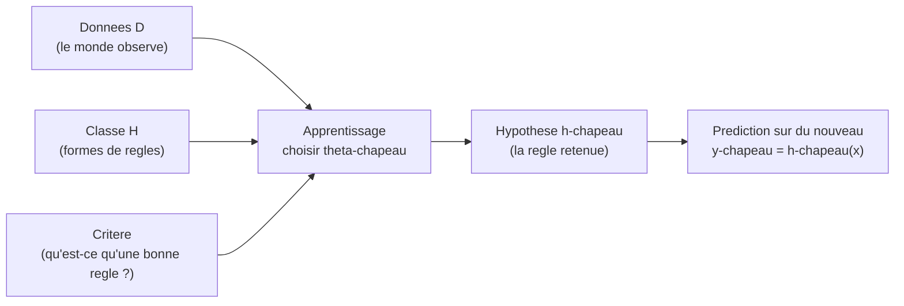
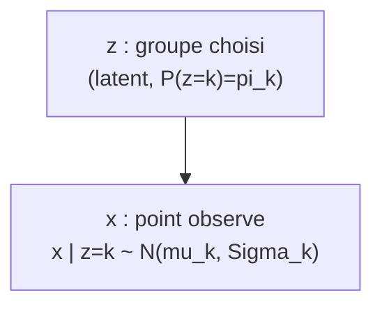
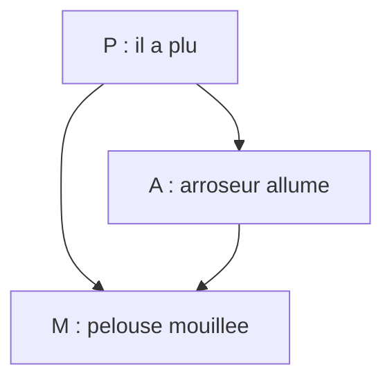
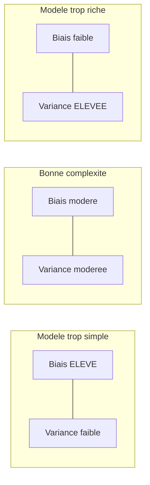
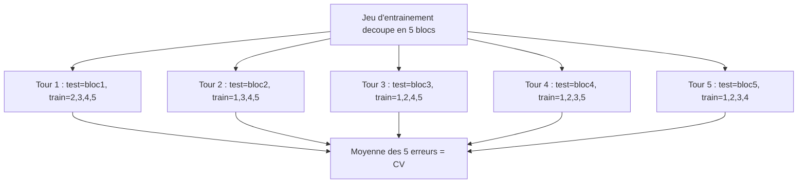
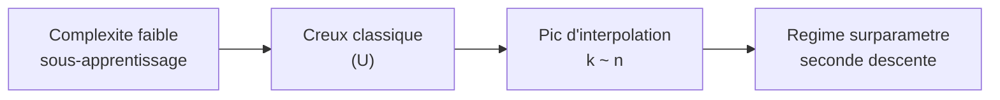

[← Sommaire](../README.md#table-des-matières)

# 8. Quand les modèles rencontrent les données

### Données, modèles et apprentissage

Imaginez un apprenti boulanger qui regarde son maitre pendant des mois. Il voit des centaines de fois la meme scene : telle quantite de farine, telle quantite d'eau, tel temps de cuisson, et a la sortie, un pain plus ou moins reussi. Au debut il ne comprend rien. Puis, peu a peu, son cerveau construit une *regle interieure* : « si la pate colle aux doigts, c'est qu'il faut un peu plus de farine ». Personne ne lui a donne la formule ; il l'a *apprise* en confrontant ce qu'il croyait a ce qu'il observait. L'apprentissage automatique (machine learning) fait exactement cela, mais avec des nombres et des fonctions a la place de l'intuition du boulanger.

Ce chapitre raconte cette rencontre : d'un cote des **donnees** (ce que le monde nous montre), de l'autre des **modeles** (les regles candidates), et au milieu un **principe d'apprentissage** qui choisit la meilleure regle. Tout le reste n'est que la mise en equations, de plus en plus precise, de cette idee simple.

#### Le vocabulaire de base : observations, etiquettes, hypotheses

Commencons par poser les objets. On observe des **exemples** (samples). Chaque exemple est decrit par des **caracteristiques** (features) : pour un appartement, ce serait sa surface, son nombre de pieces, son etage. On rassemble ces caracteristiques dans un vecteur.

> **Le symbole $`\mathbf{x}`$.** Ce symbole represente *un exemple decrit par ses caracteristiques*, range comme une liste de nombres. C'est comme la fiche d'identite d'une chose : pour un appartement, $`\mathbf{x} = (72, 3, 4)`$ veut dire « 72 metres carres, 3 pieces, 4e etage ». On l'ecrit en **gras** parce que c'est un vecteur (plusieurs nombres d'un coup), et on dit qu'il vit dans $`\mathcal{X}`$, l'ensemble de toutes les fiches possibles. La lettre calligraphiee $`\mathcal{X}`$ est juste « le grand sac qui contient toutes les fiches imaginables ».

> **Le symbole $`y`$.** Ce symbole represente *la reponse* qu'on aimerait predire pour l'exemple $`\mathbf{x}`$. Pour l'appartement, $`y`$ serait son prix. On dit que $`y`$ vit dans $`\mathcal{Y}`$ (le sac de toutes les reponses possibles). Quand $`y`$ est un nombre reel (un prix), on parle de **regression** ; quand $`y`$ est une categorie (chat / chien), on parle de **classification**.

Une **donnee** (datum) est donc un couple $`(\mathbf{x}, y)`$ : une question et sa reponse. Un **jeu de donnees** (dataset) est une collection de tels couples.

> **Le symbole $`\mathcal{D}`$.** Ce symbole represente *tout le cahier d'observations* : l'ensemble complet des exemples qu'on a recoltes. On ecrit
> ```math
> \mathcal{D} = \{(\mathbf{x}_1, y_1), (\mathbf{x}_2, y_2), \dots, (\mathbf{x}_n, y_n)\}.
> ```
> Les accolades $`\{\;\}`$ veulent dire « l'ensemble des choses la-dedans ». Le petit indice en bas (le $`i`$ dans $`\mathbf{x}_i`$) est un **numero de ligne** dans le cahier : $`\mathbf{x}_1`$ est le premier appartement, $`\mathbf{x}_2`$ le deuxieme, et ainsi de suite.

> **Le symbole $`n`$.** Ce symbole represente *combien d'exemples on a* : le nombre de lignes du cahier. Si on a observe 500 appartements, alors $`n = 500`$. Plus $`n`$ est grand, plus on a de matiere pour apprendre.

Le boulanger ne se contente pas de memoriser ; il veut une **regle** qui, face a une *nouvelle* pate jamais vue, predit le bon geste. Cette regle, c'est une fonction.

> **Le symbole $`f`$ (et $`h`$).** Ces symboles representent *la regle qui transforme une question en reponse* : on donne $`\mathbf{x}`$, la machine rend une prediction $`f(\mathbf{x})`$. C'est exactement la « recette interieure » du boulanger. On note souvent la regle apprise $`h`$ (pour **hypothese**, hypothesis), parce que c'est une *proposition* de regle qu'on teste. Predire, c'est calculer $`\hat{y} = h(\mathbf{x})`$.

> **Le symbole chapeau $`\hat{\cdot}`$.** Le petit chapeau au-dessus d'une lettre signifie « ceci est une *estimation*, une *devinette eclairee*, pas la verite ». Ainsi $`\hat{y}`$ se lit « y chapeau » et veut dire « le prix que *je predis* », a distinguer de $`y`$, « le vrai prix ». C'est la difference entre la meteo qui annonce 25 degres ($`\hat{y}`$) et la temperature reelle de demain ($`y`$). On retrouvera ce chapeau partout : des qu'une quantite est *apprise a partir des donnees*, elle porte un chapeau.

#### La classe d'hypotheses : on ne cherche pas n'importe quelle regle

Le boulanger ne teste pas *toutes* les regles imaginables de l'univers : il reste dans le cadre « plus de farine / moins d'eau / temps de cuisson ». De meme, en apprentissage, on se restreint a une **famille de regles candidates**, qu'on appelle la **classe d'hypotheses** (hypothesis class).

> **Le symbole $`\mathcal{H}`$.** Ce symbole represente *le catalogue des regles autorisees* : l'ensemble de toutes les fonctions $`h`$ qu'on s'autorise a essayer. C'est comme un magasin de bricolage : on n'a pas tous les outils du monde, seulement ceux des rayons. Choisir $`\mathcal{H}`$, c'est decider a l'avance la *forme* des regles. Exemple : « toutes les droites » est une classe d'hypotheses simple.

> **Le symbole $`\boldsymbol{\theta}`$.** Ce symbole (la lettre grecque *theta*) represente *les boutons de reglage* d'une regle : les nombres qu'on peut tourner pour passer d'une regle a une autre dans la meme famille. On parle de **parametres** (parameters). Pour une droite $`h(x) = \theta_1 x + \theta_0`$, les deux boutons sont la pente $`\theta_1`$ et la hauteur $`\theta_0`$. Tourner les boutons = se deplacer dans le catalogue $`\mathcal{H}`$. On range tous les boutons dans un vecteur $`\boldsymbol{\theta}`$ qui vit dans $`\Theta`$ (l'ensemble des reglages possibles).

On ecrit alors une regle parametree $`h_{\boldsymbol{\theta}}`$ : c'est « la regle obtenue quand les boutons valent $`\boldsymbol{\theta}`$ ». La classe d'hypotheses devient
```math
\mathcal{H} = \{\, h_{\boldsymbol{\theta}} : \boldsymbol{\theta} \in \Theta \,\}.
```
**Apprendre, c'est choisir $`\boldsymbol{\theta}`$.** Toute la suite du chapitre repond a la question : *parmi tous les reglages possibles, lequel choisir au vu du cahier $`\mathcal{D}`$ ?*

> **Definition (probleme d'apprentissage supervise).** On dispose d'un espace des entrees $`\mathcal{X}`$, d'un espace des sorties $`\mathcal{Y}`$, d'une classe d'hypotheses $`\mathcal{H} \subseteq \mathcal{Y}^{\mathcal{X}}`$ et d'un jeu de donnees $`\mathcal{D} = \{(\mathbf{x}_i, y_i)\}_{i=1}^n`$. Un **algorithme d'apprentissage** (learning algorithm) est une application $`\mathcal{A}`$ qui, a tout jeu de donnees, associe une hypothese : $`\mathcal{A}(\mathcal{D}) = \hat{h} \in \mathcal{H}`$. On dit que l'apprentissage est **supervise** (supervised) quand chaque exemple porte sa reponse $`y_i`$ ; **non supervise** (unsupervised) quand on n'a que les $`\mathbf{x}_i`$ (pas de reponse) et qu'on cherche une structure cachee.

> **Le symbole $`\mathcal{Y}^{\mathcal{X}}`$.** Cette notation represente *l'ensemble de toutes les fonctions* qui partent de $`\mathcal{X}`$ et arrivent dans $`\mathcal{Y}`$. C'est l'usage habituel de l'exposant pour les ensembles : tout comme $`\mathcal{Y}^n`$ designe les listes de $`n`$ elements de $`\mathcal{Y}`$ (une valeur par indice $`1,\dots,n`$), $`\mathcal{Y}^{\mathcal{X}}`$ designe les « listes » indexees par tous les $`\mathbf{x} \in \mathcal{X}`$, c'est-a-dire les regles. Ecrire $`\mathcal{H} \subseteq \mathcal{Y}^{\mathcal{X}}`$ dit simplement : notre catalogue $`\mathcal{H}`$ est un sous-ensemble de toutes les regles concevables.

#### Les trois ingredients de tout apprentissage

Tout au long de ce chapitre, on va voir revenir la meme trilogie. La voici en un schema.



| Ingredient | Question a laquelle il repond | Exemple « droite » |
|---|---|---|
| Classe d'hypotheses $`\mathcal{H}`$ | *Quelle forme* peut prendre la regle ? | toutes les droites $`\theta_1 x + \theta_0`$ |
| Critere d'apprentissage | *Comment juger* qu'une regle est bonne ? | erreur quadratique moyenne |
| Algorithme $`\mathcal{A}`$ | *Comment trouver* la meilleure regle ? | moindres carres / descente de gradient |

> **Remarque (le coeur du chapitre).** Les deux grandes facons de definir le critere d'apprentissage donneront les deux grandes sections suivantes : minimiser une **erreur** mesuree sur les donnees (vision *minimisation du risque empirique*), ou maximiser la **plausibilite** des donnees sous un modele probabiliste (vision *maximum de vraisemblance*). On verra que ces deux visions, apparemment differentes, se rejoignent souvent — c'est l'un des plus beaux ponts du domaine.

#### Generalisation : apprendre n'est pas memoriser

Un piege guette le boulanger : il pourrait apprendre par coeur « le mardi 3 j'ai mis 502 g de farine ». C'est inutile, car le mardi suivant la farine n'est pas la meme. Ce qui compte, c'est de bien faire sur des situations *nouvelles*. En apprentissage, cette capacite porte un nom : la **generalisation** (generalization).

> **Piege (par coeur vs comprehension).** Une regle qui colle *parfaitement* aux donnees observees peut etre *catastrophique* sur des donnees nouvelles : elle a appris le bruit, les details, les accidents du cahier, au lieu de la tendance de fond. C'est le **surapprentissage** (overfitting). A l'oppose, une regle trop rigide rate la tendance : c'est le **sous-apprentissage** (underfitting). Tout l'art consiste a viser juste entre les deux — on y consacrera toute la derniere section, sur le compromis biais-variance.

Pour parler proprement de generalisation, il faut un cadre probabiliste : on suppose que les donnees ne tombent pas au hasard complet, mais sont **tirees** d'une certaine loi du monde.

> **Le symbole $`\sim`$.** Ce petit signe ondule se lit « suit la loi » ou « est tire selon ». Quand on ecrit $`(\mathbf{x}, y) \sim P`$, cela veut dire « le couple question-reponse est pioche au hasard dans une grande urne dont les proportions sont decrites par la loi $`P`$ ». C'est comme dire « cette boule est tiree d'un sac ou il y a 70 pour cent de boules rouges » : le $`\sim`$ relie l'objet tire au sac d'ou il vient.

> **Hypothese i.i.d.** On suppose tres souvent que les $`n`$ exemples sont **independants et identiquement distribues** (independent and identically distributed, i.i.d.) : chaque couple $`(\mathbf{x}_i, y_i)`$ est tire de la *meme* loi $`P`$, et les tirages ne s'influencent pas. C'est l'equivalent de « je tire $`n`$ boules du *meme* sac, en remettant la boule a chaque fois ». Cette hypothese, souvent imparfaite dans la vraie vie (les donnees temporelles, par exemple, ne sont pas independantes), est la fondation theorique qui rend l'apprentissage analysable.

Voila le decor plante : des donnees tirees d'une loi $`P`$, une famille de regles $`\mathcal{H}`$ parametree par $`\boldsymbol{\theta}`$, et le projet de choisir $`\hat{\boldsymbol{\theta}}`$ pour bien predire *au-dela* du cahier. Passons maintenant au premier grand principe pour faire ce choix.

---

### Minimisation du risque empirique

Reprenons le boulanger. Pour savoir si sa regle est bonne, il lui faut une **note de douleur** : a quel point s'est-il trompe ? Un pain brule rapporte une grosse penalite, un pain parfait rapporte zero. Cette note, en apprentissage, s'appelle la **fonction de perte**.

#### La fonction de perte : mesurer une erreur

> **Le symbole $`\ell`$ (la fonction de perte, loss).** Ce symbole represente *le prix a payer quand on se trompe*. On lui donne deux choses : la prediction $`\hat{y}`$ et la vraie reponse $`y`$, et il rend un nombre $`\ell(\hat{y}, y) \ge 0`$ qui dit « voila a quel point cette prediction est mauvaise ». C'est comme un arbitre severe : si tu predis pile la verite, il dit « 0, parfait » ; plus tu t'eloignes, plus la note monte. La perte vaut toujours zero ou plus (on ne peut pas etre *recompense* pour une erreur), et elle vaut zero quand $`\hat{y} = y`$.

Quelques pertes classiques, selon le type de probleme :

| Nom | Formule $`\ell(\hat{y}, y)`$ | Pour quoi ? |
|---|---|---|
| Quadratique (squared / L2) | $`(\hat{y} - y)^2`$ | regression, penalise fort les grosses erreurs |
| Absolue (absolute / L1) | $`\lvert \hat{y} - y \rvert`$ | regression robuste aux valeurs aberrantes |
| 0–1 (zero-one) | $`\mathbf{1}[\hat{y} \neq y]`$ | classification, compte les erreurs |
| Logistique (log-loss) | $`-\big(y \ln \hat{p} + (1-y)\ln(1-\hat{p})\big)`$ | classification probabiliste |

> **Le symbole $`\mathbf{1}[\,\cdot\,]`$ (indicatrice).** Ce symbole represente *un interrupteur qui vaut 1 si c'est vrai, 0 si c'est faux*. Ainsi $`\mathbf{1}[\hat{y} \neq y]`$ vaut 1 quand on s'est trompe de classe, et 0 quand on a vu juste. C'est l'ampoule qui s'allume uniquement quand la condition entre crochets est realisee. La perte 0–1 est donc, litteralement, « compte un point a chaque erreur ».

> **Le symbole $`\hat{p}`$ (probabilite predite).** Dans la log-loss, $`\hat{p}`$ represente *la probabilite que le modele attribue a la classe 1* (par exemple « 0,8 de chance que ce soit un chat »). C'est un nombre entre 0 et 1, alors que la vraie etiquette $`y`$ vaut 0 ou 1. La log-loss recompense un modele *confiant et correct* (predire 0,99 quand $`y=1`$ coute presque rien) et punit severement un modele *confiant et faux* (predire 0,01 quand $`y=1`$ coute tres cher).

#### Le risque : la perte moyenne sur tout le monde

La perte note *une* prediction. Mais une bonne regle doit etre bonne *en moyenne*, sur tous les exemples que le monde peut produire. On mesure donc la perte moyenne sous la loi $`P`$ : c'est le **risque** (risk), ou **erreur de generalisation**.

> **Le symbole $`R(h)`$ (le risque, ou erreur attendue).** Ce symbole represente *la douleur moyenne d'une regle sur l'ensemble du monde* — pas seulement sur les exemples vus, mais sur tous les exemples possibles, ponderes par leur probabilite d'apparaitre. C'est la « note de vie » de la regle $`h`$. Formellement, on prend l'**esperance** (la moyenne ponderee par les probabilites) de la perte :
> ```math
> R(h) = \mathbb{E}_{(\mathbf{x}, y) \sim P}\big[\ell(h(\mathbf{x}), y)\big].
> ```
> L'indice « $`(\mathbf{x}, y) \sim P`$ » sous le $`\mathbb{E}`$ precise *par rapport a quel hasard* on fait la moyenne : on imagine tirer une infinite de couples du sac $`P`$, calculer la perte a chaque fois, et faire la moyenne de toutes ces pertes. Plus $`R(h)`$ est petit, meilleure est la regle.

Le but ideal de l'apprentissage est de trouver la regle de **risque minimal** :
```math
h^\star = \arg\min_{h \in \mathcal{H}} R(h).
```

> **Remarque (le mur infranchissable).** On ne peut **pas** calculer $`R(h)`$ : il faudrait connaitre la loi $`P`$ du monde entier, qui est precisement ce qu'on ignore ! On ne dispose que d'un echantillon fini, le cahier $`\mathcal{D}`$. Toute la suite consiste a *remplacer* cette moyenne ideale, inaccessible, par une moyenne *concrete* calculee sur nos donnees.

#### Le risque empirique : la moyenne sur le cahier

Puisqu'on ne connait pas $`P`$, on remplace l'esperance theorique par la **moyenne effective sur les exemples observes**. C'est le **risque empirique** (empirical risk), aussi appele perte d'entrainement.

> **Le symbole $`\hat{R}(h)`$ ou $`\hat{R}_n(h)`$ (le risque empirique).** Ce symbole represente *la douleur moyenne de la regle, mesuree seulement sur les exemples du cahier*. Le chapeau rappelle que c'est une *estimation* du vrai risque $`R(h)`$ a partir de nos donnees, et le $`n`$ rappelle qu'on a moyenne sur $`n`$ exemples. On additionne la perte sur chaque ligne du cahier, puis on divise par le nombre de lignes :
> ```math
> \hat{R}_n(h) = \frac{1}{n}\sum_{i=1}^{n} \ell\big(h(\mathbf{x}_i), y_i\big).
> ```
> Ici le grand $`\Sigma`$ (sigma) est la « boucle qui additionne » : on parcourt $`i = 1, 2, \dots, n`$, on calcule la perte sur l'exemple $`i`$, et on empile tout. Le $`\frac{1}{n}`$ devant transforme cette somme en *moyenne* (on partage le total entre les $`n`$ exemples).

L'idee maitresse, le **principe de minimisation du risque empirique** (empirical risk minimization, ERM), est de choisir la regle qui minimise cette quantite calculable :
```math
\hat{h} = \arg\min_{h \in \mathcal{H}} \hat{R}_n(h)
\qquad\text{soit, en parametres,}\qquad
\hat{\boldsymbol{\theta}} = \arg\min_{\boldsymbol{\theta} \in \Theta} \frac{1}{n}\sum_{i=1}^n \ell\big(h_{\boldsymbol{\theta}}(\mathbf{x}_i), y_i\big).
```

> **Definition (ERM).** Etant donnes une classe $`\mathcal{H}`$, une perte $`\ell`$ et des donnees $`\mathcal{D}`$, l'**estimateur du risque empirique** est tout $`\hat{h} \in \arg\min_{h\in\mathcal{H}} \hat{R}_n(h)`$. C'est le pari, fondamental et souvent justifie, que *bien faire sur les exemples vus* tend a *bien faire sur les exemples futurs* — a condition de ne pas surapprendre.

> **Le symbole $`\arg\min`$ (rappel d'usage).** Il ne rend pas la *valeur* minimale de la fonction, mais *l'endroit* (ici le $`\boldsymbol{\theta}`$) ou ce minimum est atteint. « $`\arg`$ » = *argument*, c'est-a-dire l'entree qui realise le mieux. On ecrit « $`\hat{h} \in \arg\min`$ » (appartenance) plutot que « $`\hat{h} = \arg\min`$ » quand le minimum peut etre atteint en plusieurs endroits : l'$`\arg\min`$ est alors un *ensemble* de minimiseurs, et on en choisit un.

#### Pourquoi ca marche : la loi des grands nombres

Pourquoi remplacer $`R`$ par $`\hat{R}_n`$ serait-il legitime ? Parce que, sous l'hypothese i.i.d., la moyenne empirique converge vers l'esperance.

> **Theoreme (loi des grands nombres, justification de l'ERM).** Soit $`h`$ fixee. Si les $`(\mathbf{x}_i, y_i)`$ sont i.i.d. de loi $`P`$ et si $`\mathbb{E}[\lvert \ell(h(\mathbf{x}), y)\rvert] < \infty`$, alors
> ```math
> \hat{R}_n(h) \;\xrightarrow[n \to \infty]{} \; R(h) \quad \text{(presque surement).}
> ```
> **Demonstration.** Posons $`Z_i = \ell(h(\mathbf{x}_i), y_i)`$. Les $`Z_i`$ sont i.i.d. (image par la meme fonction $`\ell(h(\cdot),\cdot)`$ de variables i.i.d.), d'esperance $`\mathbb{E}[Z_i] = R(h)`$ par definition meme du risque. Le risque empirique $`\hat{R}_n(h) = \frac{1}{n}\sum_i Z_i`$ est exactement la moyenne empirique de ces variables. La loi forte des grands nombres affirme que la moyenne empirique de variables i.i.d. integrables converge presque surement vers leur esperance commune. D'ou la conclusion. $`\blacksquare`$

> **Le symbole « presque surement ».** Cette expression (notee p.s.) signifie *« avec probabilite 1 »* : l'evenement de convergence est certain, a l'exception eventuelle de cas si rares que leur probabilite totale est nulle. C'est la forme de convergence la plus forte qu'on rencontre ici ; intuitivement, « si l'on accumule assez de donnees, la moyenne observee finit par coller a la vraie moyenne, sans exception qui compte ».

> **Piege subtil (uniformite).** La loi des grands nombres vaut pour une hypothese $`h`$ *fixee a l'avance*. Or l'ERM *choisit* $`\hat{h}`$ *en regardant les donnees* : $`\hat{h}`$ depend de $`\mathcal{D}`$. La garantie « $`\hat{R}_n(\hat{h}) \approx R(\hat{h})`$ » exige une convergence **uniforme** sur toute la classe $`\mathcal{H}`$ ; c'est le role de la theorie de Vapnik–Chervonenkis (dimension VC) et de la complexite de Rademacher. Retenir : *plus $`\mathcal{H}`$ est riche, plus l'ecart entre risque empirique et risque vrai peut etre grand* — c'est le germe du surapprentissage, et on y reviendra.

#### Exemple chiffre deroule : la regression lineaire par moindres carres

Mettons l'ERM en action sur le cas le plus celebre : une droite, avec la perte quadratique. C'est la **methode des moindres carres** (least squares).

Classe d'hypotheses : les fonctions affines $`h_{\boldsymbol{\theta}}(\mathbf{x}) = \boldsymbol{\theta}^\top \mathbf{x}`$, ou l'on a glisse un 1 en tete de $`\mathbf{x}`$ pour absorber le terme constant (le biais).

> **Convention de l'« intercept ».** Pour ne pas trainer separement la hauteur $`\theta_0`$, on ajoute artificiellement une coordonnee constante egale a 1 a chaque exemple : $`\mathbf{x} = (1, x_1, \dots, x_d)`$. Alors $`\boldsymbol{\theta}^\top \mathbf{x} = \theta_0 \cdot 1 + \theta_1 x_1 + \dots + \theta_d x_d`$ contient le terme constant $`\theta_0`$ « gratuitement ». C'est un truc de comptable pour ecrire tout d'un bloc.

Le risque empirique avec la perte quadratique s'ecrit
```math
\hat{R}_n(\boldsymbol{\theta}) = \frac{1}{n}\sum_{i=1}^n \big(\boldsymbol{\theta}^\top \mathbf{x}_i - y_i\big)^2.
```

Empilons les exemples en une matrice de **design** $`X \in \mathbb{R}^{n \times d}`$ (une ligne par exemple, $`d`$ colonnes pour les caracteristiques intercept inclus) et les reponses en un vecteur $`\mathbf{y} \in \mathbb{R}^n`$. Alors
```math
\hat{R}_n(\boldsymbol{\theta}) = \frac{1}{n}\,\lVert X\boldsymbol{\theta} - \mathbf{y}\rVert^2.
```

> **La matrice de design $`X`$.** Elle represente *tout le cahier range en tableau* : une ligne par exemple, une colonne par caracteristique. Le produit $`X\boldsymbol{\theta}`$ calcule d'un seul coup les $`n`$ predictions (la $`i`$-e ligne de $`X\boldsymbol{\theta}`$ est $`\boldsymbol{\theta}^\top\mathbf{x}_i`$), et $`X\boldsymbol{\theta} - \mathbf{y}`$ est le vecteur des $`n`$ ecarts entre predictions et verites. Sa norme au carre est donc la somme des carres des residus.

Pour trouver le minimum, on annule le gradient (la pente est nulle au creux de la vallee).

> **Le symbole $`\nabla`$ (nabla, le gradient — rappel d'usage).** Ce symbole en triangle pointe vers le bas represente *la pente dans toutes les directions a la fois* : $`\nabla_{\boldsymbol{\theta}} g`$ est le vecteur dont chaque composante dit « de combien $`g`$ monte si je pousse ce bouton-la ». Au fond d'une vallee (un minimum d'une fonction convexe lisse), il n'y a plus de pente nulle part : le gradient est le vecteur nul. Resoudre $`\nabla_{\boldsymbol{\theta}}\hat{R}_n = \mathbf{0}`$, c'est chercher ce fond de vallee.

Developpons $`\lVert X\boldsymbol{\theta} - \mathbf{y}\rVert^2 = \boldsymbol{\theta}^\top X^\top X \boldsymbol{\theta} - 2\,\boldsymbol{\theta}^\top X^\top \mathbf{y} + \mathbf{y}^\top \mathbf{y}`$, puis derivons :
```math
\nabla_{\boldsymbol{\theta}}\, \hat{R}_n(\boldsymbol{\theta}) = \frac{2}{n}\big(X^\top X \boldsymbol{\theta} - X^\top \mathbf{y}\big).
```
En annulant, on obtient les **equations normales** (normal equations) :
```math
X^\top X\, \hat{\boldsymbol{\theta}} = X^\top \mathbf{y}
\qquad\Longrightarrow\qquad
\hat{\boldsymbol{\theta}} = (X^\top X)^{-1} X^\top \mathbf{y} \quad (\text{si } X^\top X \text{ inversible}).
```

> **Lecture geometrique.** $`X\hat{\boldsymbol{\theta}}`$ est la **projection orthogonale** de $`\mathbf{y}`$ sur l'espace engendre par les colonnes de $`X`$. Les equations normales disent exactement que le residu $`\mathbf{y} - X\hat{\boldsymbol{\theta}}`$ est orthogonal a toutes les colonnes de $`X`$ (puisque $`X^\top(\mathbf{y} - X\hat{\boldsymbol{\theta}}) = \mathbf{0}`$). On choisit le point de l'espace des predictions le plus proche de la verite : l'ombre de $`\mathbf{y}`$ sur le plan des regles possibles.

Faisons tourner un mini-exemple a la main. Trois points : $`(x, y) \in \{(1, 2), (2, 2), (3, 4)\}`$. Avec l'intercept, $`X = \begin{pmatrix}1&1\\1&2\\1&3\end{pmatrix}`$, $`\mathbf{y} = (2, 2, 4)^\top`$.

Calculons $`X^\top X = \begin{pmatrix}3 & 6\\ 6 & 14\end{pmatrix}`$ et $`X^\top \mathbf{y} = (8, 18)^\top`$. Le determinant vaut $`3\cdot 14 - 6\cdot 6 = 6`$, donc
```math
(X^\top X)^{-1} = \frac{1}{6}\begin{pmatrix}14 & -6\\ -6 & 3\end{pmatrix},
\qquad
\hat{\boldsymbol{\theta}} = \frac{1}{6}\begin{pmatrix}14 & -6\\ -6 & 3\end{pmatrix}\begin{pmatrix}8\\18\end{pmatrix}
= \frac{1}{6}\begin{pmatrix}112 - 108\\ -48 + 54\end{pmatrix}
= \begin{pmatrix}2/3\\ 1\end{pmatrix}.
```
La droite ajustee est donc $`\hat{y} = 1\cdot x + \tfrac{2}{3}`$ : pente 1, ordonnee a l'origine $`2/3`$. Les trois residus valent alors $`-\tfrac13,\ +\tfrac23,\ -\tfrac13`$ (par exemple en $`x=2`$ : $`\hat{y} = 2 + \tfrac23 = \tfrac83 \approx 2{,}67`$ contre $`y=2`$ observe). Leur somme est nulle — signature de l'orthogonalite avec la colonne d'intercept — et le risque empirique vaut $`\tfrac13\big(\tfrac19+\tfrac49+\tfrac19\big) = \tfrac{2}{9} \approx 0{,}22`$.

#### Application machine learning et code

Les moindres carres sont la brique de base de la regression. En pratique on n'inverse pas $`X^\top X`$ a la main (instable si les colonnes sont presque colineaires) : on resout les equations normales par decomposition (QR ou SVD).

```python
import numpy as np

def fit_least_squares(X, y):
    n = X.shape[0]
    X1 = np.hstack([np.ones((n, 1)), X])
    theta, *_ = np.linalg.lstsq(X1, y, rcond=None)
    return theta

def empirical_risk(theta, X, y):
    n = X.shape[0]
    X1 = np.hstack([np.ones((n, 1)), X])
    residuals = X1 @ theta - y
    return np.mean(residuals ** 2)

X = np.array([[1.0], [2.0], [3.0]])
y = np.array([2.0, 2.0, 4.0])

theta = fit_least_squares(X, y)
print("theta (intercept, pente) =", theta)        # [0.667 1.   ]
print("risque empirique          =", empirical_risk(theta, X, y))  # 0.222
```

> **Mise a jour 2026.** Pour les tres grands jeux de donnees ($`n`$ ou $`d`$ enormes), on ne forme jamais $`X^\top X`$ (cout $`O(nd^2)`$ et mauvais conditionnement). On prefere : (i) la **SVD tronquee randomisee** pour une solution stable de rang reduit ; (ii) surtout la **descente de gradient stochastique** (stochastic gradient descent, SGD) et ses variantes adaptatives **Adam / AdamW**, qui minimisent le risque empirique par petits lots sans jamais materialiser la matrice normale. Le gradient $`\frac{2}{n} X^\top(X\boldsymbol{\theta} - \mathbf{y})`$ se calcule par produits matrice-vecteur, et en apprentissage profond il est obtenu par **differentiation automatique** (autodiff, via PyTorch ou JAX) plutot qu'a la main.

#### Regularisation : empecher le surapprentissage des l'ERM

L'ERM brute peut surapprendre, surtout si $`\mathcal{H}`$ est riche. Le remede le plus courant est d'ajouter au risque empirique une **penalite** qui decourage les reglages extremes : c'est la **regularisation** (regularization).

> **Le symbole $`\lambda`$ (lambda, force de regularisation).** Ce symbole represente *le poids du garde-fou* : un curseur qui dit a quel point on penalise les reglages compliques. A $`\lambda = 0`$, pas de garde-fou (ERM pure) ; plus $`\lambda`$ grandit, plus on force les boutons $`\boldsymbol{\theta}`$ a rester petits et sages. C'est le bouton « prudence » du modele. C'est un **hyperparametre** : on ne l'apprend pas par l'ERM, on le regle par validation (derniere section).

L'objectif **regularise** s'ecrit
```math
\hat{\boldsymbol{\theta}}_\lambda = \arg\min_{\boldsymbol{\theta}} \;\underbrace{\frac{1}{n}\sum_{i=1}^n \ell\big(h_{\boldsymbol{\theta}}(\mathbf{x}_i), y_i\big)}_{\text{coller aux donnees}} \;+\; \underbrace{\lambda\, \Omega(\boldsymbol{\theta})}_{\text{rester simple}}.
```

> **Le symbole $`\Omega(\boldsymbol{\theta})`$ (penalite de complexite).** Ce symbole (la lettre grecque *omega* majuscule) represente *une mesure de « combien le reglage est complique »* : plus les coefficients sont gros, plus $`\Omega`$ est grand. On la choisit positive et minimale (souvent nulle) au reglage le plus simple. Le produit $`\lambda\,\Omega(\boldsymbol{\theta})`$ est l'amende ajoutee a la note d'erreur ; minimiser la somme, c'est arbitrer entre coller aux donnees et rester sobre.

| Penalite $`\Omega(\boldsymbol{\theta})`$ | Nom | Effet |
|---|---|---|
| $`\lVert \boldsymbol{\theta}\rVert_2^2 = \sum_j \theta_j^2`$ | Ridge (L2, Tikhonov) | retrecit tous les coefficients, solution unique |
| $`\lVert \boldsymbol{\theta}\rVert_1 = \sum_j \lvert \theta_j\rvert`$ | Lasso (L1) | met des coefficients exactement a zero (selection de variables) |

Pour la regression ridge, la solution reste explicite et *toujours* bien definie (le terme $`n\lambda I`$ rend la matrice inversible des que $`\lambda > 0`$) :
```math
\hat{\boldsymbol{\theta}}_\lambda = (X^\top X + n\lambda I)^{-1} X^\top \mathbf{y}.
```
On verra dans la section suivante que cette penalite n'est pas un bricolage : elle correspond *exactement* a une croyance a priori gaussienne sur $`\boldsymbol{\theta}`$ (estimation MAP). Le pont entre « ajouter une penalite » et « avoir une opinion a priori » est l'un des resultats les plus eclairants du chapitre.

---

### Estimation des paramètres : maximum de vraisemblance et MAP

Changeons de lunettes. Jusqu'ici, on *mesurait une erreur*. Adoptons maintenant un point de vue **probabiliste** : on suppose que les donnees ont ete *engendrees* par un modele de hasard dependant de $`\boldsymbol{\theta}`$, et on demande : *quel reglage $`\boldsymbol{\theta}`$ rend ce que j'ai observe le plus plausible ?* C'est l'**estimation par maximum de vraisemblance**.

#### La vraisemblance : « avec quelle probabilite ce modele aurait-il produit mes donnees ? »

Imaginez une machine a fabriquer des donnees, dont le comportement depend de boutons $`\boldsymbol{\theta}`$. Pour un reglage donne, elle a une certaine probabilite de cracher exactement le cahier $`\mathcal{D}`$ que vous avez sous les yeux. La **vraisemblance** retourne le point de vue : les donnees sont *fixees* (c'est ce qu'on a vu), et on regarde cette probabilite *comme une fonction des boutons*.

> **Le symbole $`p(\cdot \mid \boldsymbol{\theta})`$ (loi du modele, ou densite parametree).** Ce symbole represente la regle de hasard de la machine quand ses boutons valent $`\boldsymbol{\theta}`$. La barre verticale « $`\mid`$ » se lit « sachant » ou « etant donne » : $`p(\mathbf{y} \mid \boldsymbol{\theta})`$ veut dire « la probabilite (ou densite) de voir les reponses $`\mathbf{y}`$, *si* la machine est reglee sur $`\boldsymbol{\theta}`$ ». C'est la fiche technique de la machine : pour chaque reglage, elle dit quelles sorties sont frequentes et lesquelles sont rares.

> **Le symbole $`\mathcal{L}(\boldsymbol{\theta})`$ (la vraisemblance, likelihood).** Ce symbole represente *la plausibilite d'un reglage au vu des donnees observees*. C'est numeriquement la meme expression que $`p(\text{donnees} \mid \boldsymbol{\theta})`$, mais on a echange les roles : on bloque les donnees (elles sont connues, c'est notre cahier) et on fait varier $`\boldsymbol{\theta}`$. Question posee : « quel reglage explique le mieux ce que j'ai vu ? ». Sous l'hypothese i.i.d., la machine fabrique chaque exemple independamment, donc la probabilite du paquet est le **produit** des probabilites :
> ```math
> \mathcal{L}(\boldsymbol{\theta}) = p(\mathcal{D} \mid \boldsymbol{\theta}) = \prod_{i=1}^n p(\mathbf{x}_i, y_i \mid \boldsymbol{\theta}).
> ```

> **Le symbole $`\prod`$ (produit, « pi » majuscule).** Ce symbole est le cousin multiplicatif du $`\Sigma`$ : la ou sigma *additionne*, pi *multiplie*. C'est une « boucle qui multiplie » : $`\prod_{i=1}^n a_i = a_1 \times a_2 \times \dots \times a_n`$. Il apparait ici parce que la probabilite de plusieurs evenements *independants* qui se produisent *tous* est le produit de leurs probabilites (comme « pile ET pile ET pile » a une chance sur deux puissance trois).

#### La log-vraisemblance : transformer les produits en sommes

Multiplier des centaines de petites probabilites donne un nombre minuscule, instable numeriquement, et penible a deriver. L'astuce universelle : prendre le **logarithme**, qui transforme les produits en sommes et ne deplace pas l'emplacement du maximum (le logarithme est strictement croissant).

> **Le symbole $`\ln`$ (logarithme neperien — rappel d'usage).** Le logarithme transforme la multiplication en addition : $`\ln(a\times b) = \ln a + \ln b`$. C'est pour cela qu'on l'aime ici : il deplie le produit geant $`\prod`$ en une somme bien plus douce $`\Sigma`$. Comme il est strictement croissant, « rendre $`\mathcal{L}`$ maximal » et « rendre $`\ln \mathcal{L}`$ maximal » donnent *le meme* $`\boldsymbol{\theta}`$.

> **Le symbole $`\ell(\boldsymbol{\theta})`$ (log-vraisemblance, log-likelihood).** Attention, meme lettre que la perte mais role different (la perte prend une prediction et une cible ; ici l'argument est le reglage $`\boldsymbol{\theta}`$) : $`\ell(\boldsymbol{\theta}) = \ln \mathcal{L}(\boldsymbol{\theta})`$ represente *la plausibilite d'un reglage, mesuree sur une echelle logarithmique*. On la prefere toujours en pratique :
> ```math
> \ell(\boldsymbol{\theta}) = \ln \mathcal{L}(\boldsymbol{\theta}) = \sum_{i=1}^n \ln p(\mathbf{x}_i, y_i \mid \boldsymbol{\theta}).
> ```

L'**estimateur du maximum de vraisemblance** (maximum likelihood estimator, MLE) est le reglage qui maximise cette plausibilite :
```math
\hat{\boldsymbol{\theta}}_{\text{MV}} = \arg\max_{\boldsymbol{\theta}} \ell(\boldsymbol{\theta}) = \arg\max_{\boldsymbol{\theta}} \sum_{i=1}^n \ln p(\mathbf{x}_i, y_i \mid \boldsymbol{\theta}).
```

> **Le symbole $`\arg\max`$ (rappel d'usage).** Symetrique de $`\arg\min`$ : il rend *l'endroit* ou une fonction atteint son maximum, pas la valeur du maximum. Maximiser $`\ell`$ ou minimiser $`-\ell`$ donnent le meme $`\boldsymbol{\theta}`$ — c'est ce changement de signe qui reliera vraisemblance et perte.

> **Definition (maximum de vraisemblance).** Soit un modele statistique $`\{p(\cdot \mid \boldsymbol{\theta}) : \boldsymbol{\theta} \in \Theta\}`$ et des observations i.i.d. $`\mathcal{D}`$. L'**estimateur du maximum de vraisemblance** est tout $`\hat{\boldsymbol{\theta}}_{\text{MV}} \in \arg\max_{\boldsymbol{\theta}\in\Theta} \mathcal{L}(\boldsymbol{\theta})`$. Intuitivement : *parmi toutes les machines candidates, on garde celle qui avait le plus de chances de produire exactement ce qu'on a observe.*

#### Le pont fondamental : minimiser la perte = maximiser la vraisemblance

Voici le resultat qui relie les deux premieres sections. Maximiser une vraisemblance, c'est minimiser une perte bien choisie ($`\ell_{\text{perte}}(\hat y, y) = -\ln p`$), et inversement. Demontrons-le sur le cas roi.

> **Theoreme (moindres carres = vraisemblance gaussienne).** Supposons le modele $`y_i = \boldsymbol{\theta}^\top \mathbf{x}_i + \varepsilon_i`$ avec des bruits $`\varepsilon_i \sim \mathcal{N}(0, \sigma^2)`$ i.i.d. (et $`\sigma^2`$ fixe connu). Alors l'estimateur du maximum de vraisemblance de $`\boldsymbol{\theta}`$ coincide avec l'estimateur des moindres carres.

> **Le symbole $`\varepsilon`$ (epsilon, le bruit).** Ce symbole represente *le grain de hasard* qui fait que la realite ne tombe jamais pile sur la droite : la petite erreur de mesure, l'imprevu, l'alea. On le suppose ici centre (moyenne nulle : il ne tire pas systematiquement vers le haut ou le bas) et de variance $`\sigma^2`$ (son ampleur typique). C'est le tremblement de la main du monde quand il ecrit les donnees.

> **Le symbole $`\sigma^2`$ (variance du bruit).** Ce symbole represente *l'ampleur typique du tremblement* : un grand $`\sigma^2`$ signifie des points tres disperses autour de la droite, un petit $`\sigma^2`$ des points presque alignes. C'est le carre de l'ecart-type $`\sigma`$ ; on travaille avec le carre parce que c'est lui qui apparait naturellement dans la densite gaussienne.

**Demonstration.** La densite gaussienne d'un residu donne, pour chaque exemple,
```math
p(y_i \mid \mathbf{x}_i, \boldsymbol{\theta}) = \frac{1}{\sqrt{2\pi\sigma^2}}\exp\!\left(-\frac{(y_i - \boldsymbol{\theta}^\top \mathbf{x}_i)^2}{2\sigma^2}\right).
```
La log-vraisemblance vaut donc
```math
\ell(\boldsymbol{\theta}) = \sum_{i=1}^n \ln p(y_i \mid \mathbf{x}_i, \boldsymbol{\theta})
= -\frac{n}{2}\ln(2\pi\sigma^2) \;-\; \frac{1}{2\sigma^2}\sum_{i=1}^n (y_i - \boldsymbol{\theta}^\top \mathbf{x}_i)^2.
```
Le premier terme ne depend pas de $`\boldsymbol{\theta}`$ ; le second est, au facteur positif $`\frac{1}{2\sigma^2}`$ pres, l'oppose de la somme des carres des residus. Maximiser $`\ell`$ en $`\boldsymbol{\theta}`$ revient donc a *minimiser* $`\sum_i (y_i - \boldsymbol{\theta}^\top \mathbf{x}_i)^2`$ : exactement le critere des moindres carres. $`\blacksquare`$

> **Remarque (la log-vraisemblance negative comme perte).** En general, poser $`\ell_{\text{perte}}(\hat y, y) = -\ln p(y \mid \hat y)`$ transforme tout MLE en une ERM. Avec un bruit gaussien on retombe sur la perte quadratique ; avec un bruit de Laplace, sur la perte absolue L1 ; en classification binaire avec un modele de Bernoulli, sur la **log-loss**. La fonction de perte n'est donc pas arbitraire : elle encode une *hypothese sur la nature du bruit*.

#### Exemple chiffre : MLE d'une piece truquee (Bernoulli)

Le cas le plus simple pour sentir le mecanisme. On lance $`n`$ fois une piece qui tombe sur « face » avec une probabilite inconnue $`\theta \in [0,1]`$. On observe $`k`$ faces. Quel $`\hat\theta`$ ?

Chaque lancer suit une loi de **Bernoulli** : $`p(y_i \mid \theta) = \theta^{y_i}(1-\theta)^{1-y_i}`$ (avec $`y_i = 1`$ pour face). La log-vraisemblance :
```math
\ell(\theta) = \sum_{i=1}^n \big[y_i \ln\theta + (1-y_i)\ln(1-\theta)\big] = k\ln\theta + (n-k)\ln(1-\theta).
```
On derive et on annule :
```math
\ell'(\theta) = \frac{k}{\theta} - \frac{n-k}{1-\theta} = 0
\;\Longrightarrow\;
k(1-\theta) = (n-k)\theta
\;\Longrightarrow\;
\hat\theta_{\text{MV}} = \frac{k}{n}.
```
Resultat tres intuitif : la meilleure estimation de la probabilite de face est *la frequence observee* de faces. Avec $`n=10`$ lancers et $`k=7`$ faces, $`\hat\theta_{\text{MV}} = 0{,}7`$.

> **Piege (le MLE peut etre extreme).** Si l'on observe $`k=0`$ face sur $`n=3`$ lancers, le MLE donne $`\hat\theta = 0`$ : « cette piece ne tombera *jamais* sur face ». Conclusion absurde tiree de trop peu de donnees. C'est exactement le genre d'exces que l'approche bayesienne (ci-dessous) va temperer en injectant un a priori.

#### Proprietes du MLE (niveau avance)

Le MLE n'est pas qu'une recette : c'est un estimateur aux proprietes remarquables quand $`n`$ grandit.

> **Theoreme (proprietes asymptotiques du MLE).** Sous des conditions de regularite (identifiabilite, support fixe, derivabilite, vrai parametre $`\boldsymbol{\theta}_0`$ a l'interieur de $`\Theta`$), l'estimateur du maximum de vraisemblance est :
> 1. **Consistant** : $`\hat{\boldsymbol{\theta}}_{\text{MV}} \xrightarrow{P} \boldsymbol{\theta}_0`$ (il converge vers la verite).
> 2. **Asymptotiquement normal** : $`\sqrt{n}\,(\hat{\boldsymbol{\theta}}_{\text{MV}} - \boldsymbol{\theta}_0) \xrightarrow{d} \mathcal{N}\big(0, I_1(\boldsymbol{\theta}_0)^{-1}\big)`$, ou $`I_1`$ est l'information de Fisher d'*une seule* observation.
> 3. **Asymptotiquement efficace** : sa variance atteint la borne de Cramér–Rao (le minimum theorique pour un estimateur sans biais).

> **Les symboles $`\xrightarrow{P}`$ et $`\xrightarrow{d}`$ (modes de convergence).** La fleche $`\xrightarrow{P}`$ se lit « converge en probabilite » : la probabilite que l'estimateur s'ecarte de la cible de plus d'un cheveu tend vers 0. La fleche $`\xrightarrow{d}`$ se lit « converge en loi » : ce n'est plus une valeur qui se fige, mais la *forme de la distribution* (ici, des fluctuations $`\sqrt{n}(\hat{\boldsymbol{\theta}} - \boldsymbol{\theta}_0)`$) qui se rapproche d'une loi limite — la gaussienne. Intuition : non seulement le MLE vise juste, mais ses erreurs prennent une forme de cloche dont on connait la largeur.

> **Le symbole $`I(\boldsymbol{\theta})`$ (information de Fisher).** Ce symbole represente *combien les donnees sont instructives sur le parametre* — a quel point la vraisemblance est « pointue » autour de son maximum. Une vraisemblance tres piquee (information grande) signifie qu'on localise tres precisement $`\boldsymbol{\theta}`$ ; une vraisemblance plate (information faible) signifie que beaucoup de reglages expliquent aussi bien les donnees. Formellement, c'est la courbure moyenne (l'oppose de l'esperance de la hessienne) de la log-vraisemblance d'une observation :
> ```math
> I_1(\boldsymbol{\theta}) = -\,\mathbb{E}\big[\nabla^2_{\boldsymbol{\theta}} \ln p(y\mid\boldsymbol{\theta})\big].
> ```
> Plus la cuvette est creuse, plus l'estimation est sure — et c'est l'inverse de cette information ($`I_1^{-1}`$) qui donne la variance limite du MLE.

> **Le symbole $`\nabla^2`$ (hessienne — rappel d'usage).** C'est la matrice des derivees secondes : elle mesure la *courbure* d'une fonction dans toutes les directions. Pour la log-vraisemblance, une hessienne tres negative (forte courbure vers le bas au sommet) signifie un pic etroit, donc une information de Fisher elevee. La hessienne raconte la forme du relief autour du maximum, la ou le gradient ne dit que la pente.

#### De la vraisemblance a l'a posteriori : l'approche bayesienne

Le MLE ne croit qu'aux donnees. Mais souvent on a une **opinion prealable** : avant de lancer la piece, on pense raisonnablement qu'elle est a peu pres equilibree. L'approche **bayesienne** (Bayesian) formalise cela en traitant $`\boldsymbol{\theta}`$ lui-meme comme une variable aleatoire, dotee d'une loi *avant* de voir les donnees.

> **Le symbole $`p(\boldsymbol{\theta})`$ (loi a priori, prior).** Ce symbole represente *ce qu'on croit sur les reglages avant d'avoir regarde la moindre donnee*. C'est notre opinion de depart, notre prejuge quantifie : « je pense que la piece est probablement equilibree », « je pense que les coefficients sont probablement petits ». C'est la carte de nos croyances initiales.

Le theoreme de Bayes met a jour cette croyance a la lumiere des donnees :
```math
\underbrace{p(\boldsymbol{\theta} \mid \mathcal{D})}_{\text{a posteriori}} = \frac{\overbrace{p(\mathcal{D} \mid \boldsymbol{\theta})}^{\text{vraisemblance}}\;\overbrace{p(\boldsymbol{\theta})}^{\text{a priori}}}{\underbrace{p(\mathcal{D})}_{\text{evidence}}}.
```

> **Le symbole $`p(\boldsymbol{\theta} \mid \mathcal{D})`$ (loi a posteriori, posterior).** Ce symbole represente *ce qu'on croit sur les reglages APRES avoir vu les donnees*. C'est la croyance initiale, corrigee par l'experience. La barre « $`\mid \mathcal{D}`$ » dit « sachant ce que j'ai observe ». Tout l'apprentissage bayesien tient dans une phrase : on part d'un a priori, les donnees parlent via la vraisemblance, et on obtient un a posteriori — la connaissance mise a jour.

> **Le symbole $`p(\mathcal{D})`$ (evidence, ou vraisemblance marginale).** Ce symbole represente *la probabilite totale d'observer ces donnees, toutes machines confondues* : $`p(\mathcal{D}) = \int p(\mathcal{D}\mid\boldsymbol{\theta})\,p(\boldsymbol{\theta})\,d\boldsymbol{\theta}`$. C'est une simple constante de normalisation (elle ne depend pas de $`\boldsymbol{\theta}`$) qui fait que l'a posteriori, integre sur tous les $`\boldsymbol{\theta}`$, vaut bien 1. Pour *trouver* le $`\boldsymbol{\theta}`$ le plus probable, on peut souvent l'ignorer.

#### L'estimation MAP : le sommet de l'a posteriori

Plutot que de manipuler toute la distribution a posteriori, on peut se contenter de son point culminant : le reglage le plus probable apres avoir vu les donnees. C'est l'estimation du **maximum a posteriori** (MAP).

> **Definition (maximum a posteriori, MAP).** L'estimateur MAP est le mode de la loi a posteriori :
> ```math
> \hat{\boldsymbol{\theta}}_{\text{MAP}} = \arg\max_{\boldsymbol{\theta}} p(\boldsymbol{\theta}\mid\mathcal{D}) = \arg\max_{\boldsymbol{\theta}} \big[\ln p(\mathcal{D}\mid\boldsymbol{\theta}) + \ln p(\boldsymbol{\theta})\big].
> ```
> On a jete l'evidence $`p(\mathcal{D})`$ (constante en $`\boldsymbol{\theta}`$, donc sans effet sur l'$`\arg\max`$) et pris le log. Lecture : *le MAP, c'est le MLE corrige par une prime/penalite venue de l'a priori.* Si l'a priori est plat (on ne croit rien de particulier), $`\ln p(\boldsymbol{\theta})`$ est constant et le MAP redevient le MLE.

> **Le symbole « mode ».** Le **mode** d'une distribution est *l'endroit ou elle culmine* : la valeur la plus probable. A distinguer de la moyenne (centre de gravite) et de la mediane (point qui coupe en deux). Le MAP retient le sommet de la cloche a posteriori ; l'esperance a posteriori, elle, en retiendrait le centre de gravite — les deux coincident pour une gaussienne, mais pas en general.

#### Le second pont fondamental : regularisation = a priori

On avait promis que la regularisation ridge n'etait pas un bricolage. Voici la preuve.

> **Theoreme (ridge = a priori gaussien).** Dans le modele lineaire gaussien $`y_i = \boldsymbol{\theta}^\top\mathbf{x}_i + \varepsilon_i`$, $`\varepsilon_i \sim \mathcal{N}(0,\sigma^2)`$, muni de l'a priori gaussien $`\boldsymbol{\theta} \sim \mathcal{N}(\mathbf{0}, \tau^2 I)`$, l'estimateur MAP est exactement l'estimateur ridge avec $`\lambda = \dfrac{\sigma^2}{n\,\tau^2}`$.

> **Le symbole $`\tau^2`$ (variance de l'a priori).** Ce symbole represente *l'ampleur de nos croyances sur les coefficients avant les donnees* : un petit $`\tau^2`$ dit « je suis convaincu que les $`\theta_j`$ sont proches de zero » (a priori serre), un grand $`\tau^2`$ dit « je n'ai pas d'idee, ils peuvent etre grands » (a priori vague). C'est le pendant, du cote des croyances, de ce que $`\sigma^2`$ est du cote du bruit.

**Demonstration.** L'a priori gaussien donne $`\ln p(\boldsymbol{\theta}) = -\frac{1}{2\tau^2}\lVert\boldsymbol{\theta}\rVert^2 + \text{cste}`$. En reportant dans l'objectif MAP avec la log-vraisemblance gaussienne calculee plus haut :
```math
\hat{\boldsymbol{\theta}}_{\text{MAP}} = \arg\max_{\boldsymbol{\theta}} \left[-\frac{1}{2\sigma^2}\sum_{i=1}^n (y_i - \boldsymbol{\theta}^\top\mathbf{x}_i)^2 - \frac{1}{2\tau^2}\lVert\boldsymbol{\theta}\rVert^2\right].
```
On change de signe (le max devient min) et on multiplie par $`\frac{2\sigma^2}{n} > 0`$ (sans deplacer l'optimum) :
```math
\hat{\boldsymbol{\theta}}_{\text{MAP}} = \arg\min_{\boldsymbol{\theta}} \left[\frac{1}{n}\sum_{i=1}^n (y_i - \boldsymbol{\theta}^\top\mathbf{x}_i)^2 + \frac{\sigma^2}{n\tau^2}\lVert\boldsymbol{\theta}\rVert^2\right].
```
On reconnait l'objectif ridge avec $`\lambda = \sigma^2/(n\tau^2)`$. $`\blacksquare`$

> **Lecture profonde.** Un a priori gaussien serre (petit $`\tau`$, on croit fort que $`\boldsymbol{\theta}`$ est proche de zero) donne un grand $`\lambda`$ (forte regularisation). Un a priori vague (grand $`\tau`$) donne $`\lambda \to 0`$ : on laisse parler les donnees. De meme, un a priori de **Laplace** (double exponentielle) sur $`\boldsymbol{\theta}`$ donne la penalite L1 du **Lasso**. *Toute penalite est une croyance a priori deguisee* — et reciproquement.

| Vision « erreur » (ERM) | Vision « probabilite » (bayesienne) |
|---|---|
| fonction de perte $`\ell`$ | $`-\ln`$ vraisemblance |
| perte quadratique | bruit gaussien |
| perte absolue L1 | bruit de Laplace |
| penalite ridge L2 | a priori gaussien sur $`\boldsymbol{\theta}`$ |
| penalite Lasso L1 | a priori de Laplace sur $`\boldsymbol{\theta}`$ |
| minimiser le risque regularise | maximiser l'a posteriori (MAP) |

```python
import numpy as np

def fit_map_ridge(X, y, lam):
    n, d = X.shape
    X1 = np.hstack([np.ones((n, 1)), X])
    A = X1.T @ X1 + n * lam * np.eye(d + 1)
    return np.linalg.solve(A, X1.T @ y)

def mle_bernoulli(samples):
    return np.mean(samples)

rng = np.random.default_rng(0)
X = rng.normal(size=(50, 3))
true_theta = np.array([1.0, -2.0, 0.5, 0.0])
y = np.hstack([np.ones((50, 1)), X]) @ true_theta + 0.3 * rng.normal(size=50)

for lam in [0.0, 0.1, 1.0, 10.0]:
    print(f"lambda={lam:5.1f} -> theta_MAP = {np.round(fit_map_ridge(X, y, lam), 3)}")

coins = np.array([1, 1, 0, 1, 1, 1, 0, 1, 1, 0])
print("MLE Bernoulli (frequence de faces) =", mle_bernoulli(coins))   # 0.7
```

On observe ce qu'annonce la theorie : a $`\lambda = 0`$ les coefficients estimes collent au vrai $`\boldsymbol{\theta}`$, puis ils sont *retrecis* vers zero a mesure que $`\lambda`$ croit.

> **Mise a jour 2026.** Quand l'a posteriori n'est pas calculable en forme close (la regle generale des que le modele est un tant soit peu complexe), on l'*approche*. Deux grandes familles dominent : l'**inference variationnelle** (variational inference, qui remplace l'a posteriori par la loi la plus proche dans une famille simple, via optimisation) et les **methodes de Monte-Carlo par chaines de Markov** (MCMC, notamment le **Hamiltonian Monte Carlo / NUTS** des bibliotheques comme Stan, PyMC, NumPyro). Le deep learning bayesien et les **ensembles profonds** (deep ensembles) sont devenus les outils pratiques d'estimation de l'incertitude a grande echelle.

---

### Modélisation probabiliste et inférence

On a vu *estimer un parametre*. Elargissons : la **modelisation probabiliste** consiste a ecrire une histoire complete de hasard reliant *toutes* les quantites — observees et cachees — puis a *interroger* ce modele. Cette interrogation s'appelle l'**inference** (inference).

#### Variables observees, variables latentes

Dans la vraie vie, on ne voit pas tout. Le boulanger observe le pain, mais pas l'humidite exacte de l'air ni la « vraie » qualite de la levure ce jour-la. Ces causes invisibles, on les appelle **variables latentes** (latent variables) ou cachees.

> **Le symbole $`\mathbf{z}`$ (variable latente).** Ce symbole represente *une cause cachee qu'on ne mesure pas directement* mais qui influence ce qu'on observe. C'est le fil invisible derriere la marionnette : on voit la marionnette bouger ($`\mathbf{x}`$), on devine qu'il y a une main ($`\mathbf{z}`$) qui tire les fils. Exemples : le *theme* d'un texte, le *groupe* auquel appartient un client, l'*intention* derriere un clic.

Un modele probabiliste specifie la **loi jointe** de tout ce petit monde, $`p(\mathbf{x}, \mathbf{z} \mid \boldsymbol{\theta})`$. L'inference repond ensuite a des questions du type : « connaissant ce que j'observe, que puis-je dire des causes cachees ? », c'est-a-dire calculer une loi conditionnelle $`p(\mathbf{z}\mid\mathbf{x})`$.

> **Le symbole « loi jointe ».** La loi *jointe* de plusieurs variables, notee $`p(\mathbf{x}, \mathbf{z})`$, represente *la probabilite de toutes leurs valeurs prises ensemble, simultanement* : « quelle chance que la cause cachee soit ceci ET l'observation cela ». A partir d'elle on retrouve tout : la loi d'une variable seule (par marginalisation, ci-dessous) et la loi de l'une sachant l'autre (par conditionnement). C'est le document maitre du modele.

> **Definition (les deux problemes d'inference).**
> - **Inference des latentes** : calculer $`p(\mathbf{z}\mid\mathbf{x})`$, ce que les observations revelent sur les causes cachees.
> - **Inference des parametres** : calculer $`p(\boldsymbol{\theta}\mid\mathcal{D})`$ (vu a la section precedente).
> Dans les deux cas, la machinerie est la meme — le theoreme de Bayes — et la difficulte est la meme : la constante de normalisation (une somme ou une integrale) est souvent monstrueuse.

#### Marginalisation et conditionnement : les deux gestes de base

Toute inference se ramene a deux operations sur la loi jointe.

> **Le symbole $`\sum_{\mathbf{z}}`$ / $`\int \cdot\, d\mathbf{z}`$ (marginalisation).** Ce geste represente *oublier une variable en la moyennant sur toutes ses valeurs possibles*. Si je connais la loi jointe de « meteo ET humeur » et que je veux la loi de l'humeur seule, je *somme* sur toutes les meteos. C'est passer d'une vue detaillee a une vue d'ensemble en effacant une dimension :
> ```math
> p(\mathbf{x}) = \sum_{\mathbf{z}} p(\mathbf{x}, \mathbf{z}) \quad\text{(variables discretes)}, \qquad p(\mathbf{x}) = \int p(\mathbf{x}, \mathbf{z})\, d\mathbf{z}\quad\text{(continues)}.
> ```
> Cette $`p(\mathbf{x})`$ est dite **marginale** : on a « marginalise » (mis de cote) la variable $`\mathbf{z}`$. La somme sert quand $`\mathbf{z}`$ prend des valeurs discretes (un groupe parmi $`K`$), l'integrale quand $`\mathbf{z}`$ est continue.

Le **conditionnement**, lui, c'est l'application de la regle de Bayes : $`p(\mathbf{z}\mid\mathbf{x}) = p(\mathbf{x},\mathbf{z})/p(\mathbf{x})`$. On *fixe* ce qu'on sait et on renormalise.

#### Exemple complet : le melange gaussien

Illustrons sur un modele star : le **melange de gaussiennes** (Gaussian mixture model, GMM). Histoire generative : pour fabriquer un point, la nature (i) choisit secretement un groupe $`z \in \{1,\dots,K\}`$ avec probabilites $`\pi_k`$, puis (ii) tire le point dans la gaussienne de ce groupe.

> **Le symbole $`\pi_k`$ (poids de melange).** Ce symbole represente *la part de chaque groupe dans la population* : $`\pi_k`$ est la probabilite qu'un point pris au hasard appartienne au groupe $`k`$. Ce sont des nombres positifs qui somment a 1 ($`\sum_k \pi_k = 1`$), comme les tranches d'un camembert. Le symbole $`K`$ designe simplement *le nombre de groupes* du melange.

> **Le symbole $`\mathcal{N}(x\mid\mu_k,\Sigma_k)`$ (gaussienne du groupe $`k`$).** Cette notation represente la cloche de probabilite du groupe $`k`$ : $`\mu_k`$ est son centre (le point typique du groupe) et $`\Sigma_k`$ sa **matrice de covariance** (la forme et l'orientation du nuage — large ou serre, rond ou allonge). C'est l'usage habituel de la loi normale, simplement decline pour chaque groupe.



La loi jointe d'un point et de son groupe : $`p(x, z=k) = \pi_k\, \mathcal{N}(x\mid\mu_k, \Sigma_k)`$. Par marginalisation, la loi observee d'un point est un *melange* :
```math
p(x) = \sum_{k=1}^K \pi_k\, \mathcal{N}(x\mid \mu_k, \Sigma_k).
```
Par conditionnement (Bayes), la probabilite *a posteriori* qu'un point observe appartienne au groupe $`k`$ — sa **responsabilite** (responsibility) — vaut
```math
\gamma_k(x) = p(z=k\mid x) = \frac{\pi_k\,\mathcal{N}(x\mid\mu_k,\Sigma_k)}{\sum_{j=1}^K \pi_j\,\mathcal{N}(x\mid\mu_j,\Sigma_j)}.
```

> **Le symbole $`\gamma_k(x)`$ (responsabilite).** Ce symbole represente a quel point le groupe $`k`$ « revendique » le point $`x`$ : un nombre entre 0 et 1 qui dit la probabilite que $`x`$ soit ne du groupe $`k`$. Pour un point donne, les responsabilites de tous les groupes somment a 1 (le point appartient forcement a *un* groupe). C'est une appartenance *douce* : au lieu de trancher « ce point est au groupe 2 », on dit « 70 pour cent groupe 2, 30 pour cent groupe 1 ».

#### L'algorithme EM : apprendre avec des variables cachees

Probleme : pour estimer $`\boldsymbol{\theta} = \{\pi_k, \mu_k, \Sigma_k\}`$ par maximum de vraisemblance, la log-vraisemblance contient un *logarithme d'une somme* ($`\ln\sum_k \dots`$), qui ne se derive pas joliment. La parade est l'algorithme **EM** (expectation–maximization, esperance–maximisation), qui alterne deux etapes intuitives : « deviner les groupes caches », puis « re-estimer les parametres comme si on les connaissait ».

> **Idee de l'EM (en une image).** C'est un dialogue poule-oeuf. Si je connaissais les groupes, j'estimerais facilement les gaussiennes ; si je connaissais les gaussiennes, je devinerais facilement les groupes. EM brise le cercle en alternant : on devine les groupes au mieux (etape E), on en deduit les meilleures gaussiennes (etape M), on redevine les groupes, etc. — chaque tour ne peut qu'ameliorer (ou laisser stable) la vraisemblance.

> **Theoreme (EM fait monter la vraisemblance).** A chaque iteration, l'algorithme EM ne diminue jamais la log-vraisemblance des donnees observees : $`\ell(\boldsymbol{\theta}^{(t+1)}) \ge \ell(\boldsymbol{\theta}^{(t)})`$.

**Demonstration (esquisse).** EM maximise a chaque tour une **borne inferieure** (lower bound) de la log-vraisemblance, construite par l'inegalite de Jensen. Pour toute loi $`q(\mathbf{z})`$ sur les latentes,
```math
\ell(\boldsymbol{\theta}) = \ln\sum_{\mathbf{z}} p(\mathbf{x},\mathbf{z}\mid\boldsymbol{\theta})
= \ln \sum_{\mathbf{z}} q(\mathbf{z})\,\frac{p(\mathbf{x},\mathbf{z}\mid\boldsymbol{\theta})}{q(\mathbf{z})}
\;\ge\; \sum_{\mathbf{z}} q(\mathbf{z})\ln\frac{p(\mathbf{x},\mathbf{z}\mid\boldsymbol{\theta})}{q(\mathbf{z})} =: \mathcal{F}(q,\boldsymbol{\theta}),
```
ou l'inegalite vient de la concavite du logarithme ($`\ln \mathbb{E}[\cdot] \ge \mathbb{E}[\ln \cdot]`$). Cette borne $`\mathcal{F}`$ est appelee **borne inferieure de l'evidence** (evidence lower bound, ELBO). L'etape E choisit $`q(\mathbf{z}) = p(\mathbf{z}\mid\mathbf{x},\boldsymbol{\theta}^{(t)})`$, ce qui *rend la borne exacte* (egalite : l'ecart entre $`\ell`$ et $`\mathcal{F}`$ est une divergence de Kullback–Leibler, nulle pour ce choix). L'etape M maximise $`\mathcal{F}`$ en $`\boldsymbol{\theta}`$. Comme la borne touche la vraie log-vraisemblance apres l'etape E et qu'on la fait ensuite monter, la log-vraisemblance elle-meme monte. $`\blacksquare`$

> **Le symbole divergence de Kullback–Leibler $`\mathrm{KL}(q\,\|\,p)`$.** Cette quantite represente *l'ecart entre deux lois de probabilite* : combien $`q`$ s'eloigne de $`p`$. Elle vaut zero quand les deux lois sont identiques et grandit a mesure qu'elles different ; attention, elle n'est pas symetrique (la distance de $`q`$ a $`p`$ n'egale pas celle de $`p`$ a $`q`$). Dans l'EM, c'est exactement l'ecart entre l'ELBO et la vraie log-vraisemblance, que l'etape E annule en posant $`q = p(\mathbf{z}\mid\mathbf{x},\boldsymbol{\theta}^{(t)})`$.

Pour le melange gaussien, les deux etapes prennent une forme close limpide :

> **Etape E (esperance).** Avec les parametres courants, calculer les responsabilites $`\gamma_{ik} = p(z_i=k\mid x_i)`$ par la formule de Bayes ci-dessus.
>
> **Etape M (maximisation).** Re-estimer chaque parametre comme une moyenne *ponderee par les responsabilites* (chaque point « vote » pour chaque groupe a hauteur de sa responsabilite). En posant $`N_k = \sum_{i=1}^n \gamma_{ik}`$ (la « taille molle » du groupe $`k`$) :
> ```math
> \pi_k = \frac{N_k}{n}, \qquad
> \mu_k = \frac{1}{N_k}\sum_{i=1}^n \gamma_{ik}\, x_i, \qquad
> \Sigma_k = \frac{1}{N_k}\sum_{i=1}^n \gamma_{ik}\,(x_i-\mu_k)(x_i-\mu_k)^\top.
> ```

```python
import numpy as np

def gaussian_pdf(X, mu, var):
    d = X.shape[1]
    diff = X - mu
    return np.exp(-0.5 * np.sum(diff**2, axis=1) / var) / (2 * np.pi * var) ** (d / 2)

def em_gmm(X, K, n_iter=100, seed=0):
    rng = np.random.default_rng(seed)
    n, d = X.shape
    idx = [rng.integers(n)]
    for _ in range(1, K):
        d2 = np.min([np.sum((X - X[c]) ** 2, axis=1) for c in idx], axis=0)
        idx.append(int(np.argmax(d2)))
    mu = X[idx].astype(float)
    var = np.full(K, X.var() / K)
    pi = np.full(K, 1.0 / K)
    for _ in range(n_iter):
        resp = np.stack([pi[k] * gaussian_pdf(X, mu[k], var[k]) for k in range(K)], axis=1)
        resp /= resp.sum(axis=1, keepdims=True)
        Nk = resp.sum(axis=0)
        pi = Nk / n
        mu = (resp.T @ X) / Nk[:, None]
        for k in range(K):
            diff = X - mu[k]
            var[k] = np.sum(resp[:, k] * np.sum(diff**2, axis=1)) / (Nk[k] * d)
    return pi, mu, var

rng = np.random.default_rng(1)
X = np.vstack([rng.normal(-3, 1, (150, 1)), rng.normal(3, 1, (150, 1))])
pi, mu, var = em_gmm(X, K=2)
print("poids   :", np.round(pi, 3))           # ~ [0.5  0.5]
print("centres :", np.round(mu.ravel(), 3))   # ~ [ 2.87 -3.08]
```

> **Note d'implementation.** L'initialisation des centres est ici faite « a la k-means++ » : on tire un premier centre, puis chaque centre suivant est le point le plus eloigne des centres deja choisis. Cette astuce *evite la degenerescence* (deux centres tombant dans le meme amas) qui ferait converger l'EM vers une solution sans interet ; combinee a une variance initiale moderee ($`\text{Var}(X)/K`$), elle rend l'exemple stable d'une graine a l'autre.

> **Lien avec k-means.** Quand on durcit les responsabilites (chaque point attribue a 100 pour cent a son groupe le plus probable) et qu'on fige des variances egales, l'EM du melange gaussien degenere exactement en l'algorithme **k-means**. Autrement dit, k-means est un EM « a decisions tranchees ».

> **Mise a jour 2026.** L'EM est l'ancetre direct de l'inference variationnelle moderne : la meme ELBO, maximisee par descente de gradient stochastique et autodiff, motorise les **auto-encodeurs variationnels** (variational autoencoders, VAE), ou l'etape E intraitable est remplacee par un reseau de neurones « encodeur » (inference amortie). C'est le pont direct entre l'EM classique et le deep learning generatif.

---

### Modèles graphiques dirigés

Quand un modele relie beaucoup de variables, les formules deviennent illisibles. Les **modeles graphiques** offrent un langage visuel : on dessine les variables comme des bulles et les dependances comme des fleches. Un dessin remplace une longue equation — et, surtout, il rend les hypotheses d'independance *lisibles d'un coup d'oeil*.

#### Le graphe comme factorisation de la loi jointe

> **Le symbole d'un reseau bayesien (DAG).** Un **modele graphique dirige** (directed graphical model), ou **reseau bayesien** (Bayesian network), est un graphe oriente sans cycle (directed acyclic graph, DAG) ou chaque noeud est une variable aleatoire et chaque fleche $`A \to B`$ se lit « $`A`$ influence directement $`B`$ », ou « $`A`$ est un *parent* de $`B`$ ». « Sans cycle » signifie qu'en suivant les fleches on ne revient jamais a son point de depart : c'est un arbre genealogique de causes, les fleches pointant des causes vers leurs effets.

La regle d'or relie le dessin a la formule : la loi jointe se **factorise** en un produit, ou chaque variable ne depend que de ses parents directs.

> **Definition (factorisation d'un reseau bayesien).** Pour des variables $`X_1, \dots, X_m`$ et un DAG donne, en notant $`\mathrm{pa}(X_j)`$ l'ensemble des **parents** de $`X_j`$ (les noeuds d'ou partent les fleches arrivant sur $`X_j`$),
> ```math
> p(X_1, \dots, X_m) = \prod_{j=1}^m p\big(X_j \mid \mathrm{pa}(X_j)\big).
> ```
> Lecture : la probabilite de *tout* le systeme est le produit, pour chaque variable, de « sa probabilite sachant ses parents ». Une variable sans parent apporte simplement sa loi marginale $`p(X_j)`$.

> **Pourquoi c'est puissant.** Sans hypothese, decrire la loi jointe de $`m`$ variables binaires demande $`2^m - 1`$ nombres — explosif. Le graphe dit *quelles dependances on s'autorise* ; chaque variable ne « coute » que ses parents. Si chaque noeud a au plus $`p`$ parents, le cout chute a environ $`m\cdot 2^p`$ : on a troque l'exponentiel en $`m`$ contre du lineaire en $`m`$. Le graphe est une *machine a economiser des parametres*.

#### Exemple deroule : un petit reseau de diagnostic

Construisons le reseau classique « pluie / arroseur / pelouse mouillee ».



La factorisation se lit directement sur le dessin :
```math
p(P, A, M) = p(P)\,\cdot\, p(A\mid P)\,\cdot\, p(M\mid P, A).
```
$`P`$ n'a pas de parent (sa loi marginale) ; $`A`$ a pour parent $`P`$ ; $`M`$ a pour parents $`P`$ et $`A`$. Donnons des chiffres : $`p(P{=}1)=0{,}2`$ ; $`p(A{=}1\mid P{=}1)=0{,}1`$, $`p(A{=}1\mid P{=}0)=0{,}4`$ ; et pour la pelouse,

| $`P`$ | $`A`$ | $`p(M{=}1\mid P,A)`$ |
|---|---|---|
| 0 | 0 | 0,0 |
| 0 | 1 | 0,8 |
| 1 | 0 | 0,9 |
| 1 | 1 | 0,99 |

Calculons par exemple la probabilite que tout soit « allume » : pluie, arroseur et pelouse mouillee.
```math
p(P{=}1, A{=}1, M{=}1) = p(P{=}1)\,p(A{=}1\mid P{=}1)\,p(M{=}1\mid P{=}1,A{=}1) = 0{,}2 \times 0{,}1 \times 0{,}99 = 0{,}0198.
```
Et l'**inference diagnostique** (remonter de l'effet a la cause) : sachant la pelouse mouillee, a-t-il plu ? On combine marginalisation et conditionnement. Calculons d'abord $`p(M{=}1)`$ en sommant sur les quatre scenarios $`(P,A)`$ :

| $`P`$ | $`A`$ | $`p(P,A)`$ | $`p(M{=}1\mid P,A)`$ | produit |
|---|---|---|---|---|
| 0 | 0 | $`0{,}8\times0{,}6=0{,}48`$ | 0,0 | 0 |
| 0 | 1 | $`0{,}8\times0{,}4=0{,}32`$ | 0,8 | 0,256 |
| 1 | 0 | $`0{,}2\times0{,}9=0{,}18`$ | 0,9 | 0,162 |
| 1 | 1 | $`0{,}2\times0{,}1=0{,}02`$ | 0,99 | 0,0198 |

Somme : $`p(M{=}1) = 0{,}4378`$. Or $`p(P{=}1, M{=}1) = 0{,}162 + 0{,}0198 = 0{,}1818`$. Donc
```math
p(P{=}1\mid M{=}1) = \frac{p(P{=}1, M{=}1)}{p(M{=}1)} = \frac{0{,}1818}{0{,}4378} \approx 0{,}415.
```
Voir la pelouse mouillee fait passer la probabilite de pluie de 20 pour cent (a priori) a environ 41,5 pour cent (a posteriori). Le modele *raisonne*.

#### Independance conditionnelle et d-separation

La force des graphes est de *lire* les independances sans calcul. La notion clef est l'**independance conditionnelle**.

> **Le symbole $`\perp\!\!\!\perp`$ (independance).** Ce double symbole perpendiculaire represente *« ces deux choses n'ont rien a se dire »*. $`X \perp\!\!\!\perp Y`$ veut dire « savoir $`X`$ ne change rien a ce que je crois sur $`Y`$ », soit $`p(X,Y) = p(X)\,p(Y)`$. La version conditionnelle, $`X \perp\!\!\!\perp Y \mid Z`$, dit « *une fois $`Z`$ connu*, $`X`$ et $`Y`$ deviennent independants » : $`Z`$ contenait toute l'information partagee. C'est comme deux temoins qui semblent d'accord uniquement parce qu'ils ont lu le meme journal $`Z`$ : on neutralise $`Z`$, leur accord disparait.

Trois motifs elementaires structurent toute lecture d'independance dans un DAG :

| Motif | Schema | Lecture |
|---|---|---|
| Chaine | $`A \to B \to C`$ | $`A \perp\!\!\!\perp C \mid B`$ : connaitre l'intermediaire $`B`$ coupe le lien |
| Fourche (cause commune) | $`A \leftarrow B \to C`$ | $`A \perp\!\!\!\perp C \mid B`$ : la cause commune $`B`$ explique la correlation |
| Collision (V-structure) | $`A \to B \leftarrow C`$ | $`A \perp\!\!\!\perp C`$ *mais* dependants *sachant* $`B`$ ! |

> **Piege (le collisionneur, ou « explaining away »).** La collision $`A \to B \leftarrow C`$ est contre-intuitive. Deux causes independantes $`A`$ et $`C`$ d'un meme effet $`B`$ deviennent *dependantes* des qu'on observe $`B`$. Exemple : l'herbe est mouillee ($`B`$) ; cela peut venir de la pluie ($`A`$) *ou* de l'arroseur ($`C`$). Si j'apprends qu'il a plu, l'arroseur devient *moins* probable : la pluie « explique deja » la pelouse. Observer l'effet commun cree un lien entre les causes — d'ou le nom « explaining away » (l'une disculpe l'autre).

> **Definition (d-separation).** Deux ensembles de noeuds $`\mathbf{A}`$ et $`\mathbf{B}`$ sont **d-separes** par un ensemble $`\mathbf{Z}`$ si tout chemin (non oriente) de $`\mathbf{A}`$ vers $`\mathbf{B}`$ est *bloque*. Un chemin est bloque si (i) il passe par une chaine ou une fourche dont le noeud central est dans $`\mathbf{Z}`$, ou (ii) il passe par une collision dont le noeud central *et toute sa descendance* sont hors de $`\mathbf{Z}`$. La d-separation dans le graphe garantit l'independance conditionnelle $`\mathbf{A}\perp\!\!\!\perp\mathbf{B}\mid\mathbf{Z}`$ dans *toutes* les lois compatibles avec le graphe. C'est le dictionnaire exact entre dessin et probabilites.

#### Apprentissage et inference dans les modeles graphiques

Avec un modele graphique, on retrouve les memes deux taches que precedemment, organisees par le graphe :
- **Apprentissage des parametres** : estimer les tables conditionnelles $`p(X_j\mid\mathrm{pa}(X_j))`$ (par MLE/MAP, souvent en forme close grace a la factorisation).
- **Inference** : calculer une marginale ou une conditionnelle d'interet. Sur des graphes en arbre, l'algorithme de **propagation de croyances** (belief propagation, ou somme-produit) est exact et efficace ; sur des graphes generaux, l'inference exacte est NP-difficile et on recourt a des approximations (variationnelles, MCMC).

> **Place dans le paysage.** Les reseaux bayesiens sont la branche *dirigee* (causale, generative) des modeles graphiques ; il existe une branche *non dirigee* (champs de Markov, energie). De nombreux modeles connus *sont* des reseaux bayesiens deguises : le **classifieur bayesien naif** (naive Bayes) est l'etoile $`Y \to X_1, \dots, Y \to X_d`$ (toutes les caracteristiques conditionnellement independantes sachant la classe) ; les **chaines de Markov cachees** (hidden Markov models, HMM) sont une chaine de latentes $`z_1 \to z_2 \to \dots`$ emettant chacune une observation. Tous se lisent, s'estiment et s'interrogent avec la meme grammaire.

> **Mise a jour 2026.** Les langages de **programmation probabiliste** (probabilistic programming, PyMC, NumPyro, Stan, Pyro) permettent d'ecrire le modele generatif comme un simple programme : le moteur derive automatiquement la loi jointe et lance l'inference (NUTS/HMC ou variationnelle) sans calcul manuel. Cote causalite, les memes DAG, augmentes de l'operateur d'intervention $`\mathrm{do}(\cdot)`$ de Judea Pearl, fondent l'**inference causale** moderne — distincte de la simple correlation.

---

### Sélection de modèle et compromis biais-variance

Reste la question pratique cruciale : *quelle complexite* donner au modele ? Un polynome de degre 1, 3, ou 15 ? Un $`\lambda`$ de 0,01 ou de 10 ? Trop simple, on rate la tendance ; trop riche, on epouse le bruit. Ce dilemme porte un nom mathematique precis : le **compromis biais-variance** (bias–variance tradeoff).

#### La decomposition biais-variance

Placons-nous en regression avec perte quadratique. La vraie relation est $`y = f(\mathbf{x}) + \varepsilon`$ avec un bruit centre de variance $`\sigma^2`$. On entraine, sur un jeu de donnees aleatoire $`\mathcal{D}`$, un predicteur $`\hat{h}_{\mathcal{D}}`$. La question : en un point $`\mathbf{x}_0`$, quelle est l'erreur *attendue sur tous les jeux d'entrainement possibles* ?

> **Theoreme (decomposition biais-variance).** L'erreur quadratique esperee se decompose en trois termes :
> ```math
> \mathbb{E}_{\mathcal{D},\,\varepsilon}\Big[\big(y_0 - \hat{h}_{\mathcal{D}}(\mathbf{x}_0)\big)^2\Big]
> = \underbrace{\big(f(\mathbf{x}_0) - \bar{h}(\mathbf{x}_0)\big)^2}_{\text{biais}^2}
> \;+\; \underbrace{\mathbb{E}_{\mathcal{D}}\big[(\hat{h}_{\mathcal{D}}(\mathbf{x}_0) - \bar{h}(\mathbf{x}_0))^2\big]}_{\text{variance}}
> \;+\; \underbrace{\sigma^2}_{\text{bruit}},
> ```
> ou $`\bar{h}(\mathbf{x}_0) = \mathbb{E}_{\mathcal{D}}[\hat{h}_{\mathcal{D}}(\mathbf{x}_0)]`$ est la prediction *moyenne* sur tous les entrainements possibles, et $`y_0 = f(\mathbf{x}_0) + \varepsilon`$ avec $`\varepsilon`$ centre, de variance $`\sigma^2`$, independant de $`\mathcal{D}`$.

> **Le symbole $`\bar{h}`$ (la barre, moyenne).** La barre au-dessus represente *la moyenne sur tous les tirages possibles du jeu d'entrainement*. Imaginez qu'on refasse l'experience mille fois, avec mille cahiers differents tires du meme monde, et qu'on entraine mille modeles : $`\bar{h}(\mathbf{x}_0)`$ est la prediction moyenne de ce comite. C'est le predicteur « typique » de la methode, debarrasse des aleas d'un cahier particulier.

**Demonstration.** Notons $`\hat h = \hat h_{\mathcal D}(\mathbf{x}_0)`$, $`\bar h = \mathbb{E}_{\mathcal D}[\hat h]`$, $`f = f(\mathbf{x}_0)`$. Comme $`y_0 = f + \varepsilon`$ avec $`\varepsilon`$ centre et independant de $`\mathcal D`$ :
```math
\mathbb{E}\big[(y_0 - \hat h)^2\big] = \mathbb{E}\big[(f + \varepsilon - \hat h)^2\big] = \mathbb{E}\big[(f - \hat h)^2\big] + \mathbb{E}[\varepsilon^2] + 2\,\mathbb{E}[\varepsilon]\,\mathbb{E}[f - \hat h].
```
Le dernier terme s'annule ($`\mathbb{E}[\varepsilon]=0`$ et $`\varepsilon \perp \mathcal D`$) et $`\mathbb{E}[\varepsilon^2] = \sigma^2`$. Il reste a decomposer $`\mathbb{E}[(f-\hat h)^2]`$ en inserant $`\bar h`$ :
```math
\mathbb{E}\big[(f - \hat h)^2\big] = \mathbb{E}\big[((f - \bar h) + (\bar h - \hat h))^2\big] = (f-\bar h)^2 + \mathbb{E}\big[(\bar h - \hat h)^2\big] + 2(f-\bar h)\,\mathbb{E}[\bar h - \hat h].
```
Le double produit s'annule car $`\mathbb{E}[\bar h - \hat h] = \bar h - \bar h = 0`$ (et $`f - \bar h`$ est une constante). On obtient le biais au carre $`(f-\bar h)^2`$, plus la variance $`\mathbb{E}[(\hat h - \bar h)^2]`$, plus le bruit $`\sigma^2`$. $`\blacksquare`$

> **Les trois termes, en clair.**
> - **Biais** (bias) : l'erreur systematique de la *methode*, meme entrainee parfaitement en moyenne. Un modele trop rigide (droite pour une courbe) vise toujours a cote : grand biais. C'est l'erreur de la fleche moyenne par rapport au centre de la cible.
> - **Variance** (variance) : l'instabilite d'un entrainement a l'autre. Un modele trop souple change radicalement selon le cahier tire : grande variance. C'est la dispersion des fleches entre elles.
> - **Bruit** (noise) : l'alea irreductible $`\sigma^2`$ du monde, qu'*aucun* modele ne peut effacer. C'est le plancher d'erreur incompressible.



#### Le compromis : la courbe en U de l'erreur de test

Quand on augmente la complexite du modele, le biais baisse (on epouse mieux la vraie forme) mais la variance monte (on devient sensible au bruit). La somme — l'erreur de generalisation — suit donc une **courbe en U** : elle decroit, atteint un minimum, puis remonte. Le bon modele est *au creux du U*.

| Complexite | Biais | Variance | Erreur d'entrainement | Erreur de test | Diagnostic |
|---|---|---|---|---|---|
| Trop faible | eleve | faible | elevee | elevee | sous-apprentissage |
| Bien choisie | modere | modere | basse | **minimale** | bon compromis |
| Trop forte | faible | elevee | tres basse (≈0) | elevee | surapprentissage |

> **Diagnostic pratique.** Un grand ecart « erreur de test ≫ erreur d'entrainement » signe la **variance** (surapprentissage) : remedes = plus de donnees, plus de regularisation, modele plus simple. Une erreur d'entrainement *deja* elevee signe le **biais** (sous-apprentissage) : remedes = modele plus riche, meilleures caracteristiques, moins de regularisation.

#### Estimer l'erreur de generalisation : validation et validation croisee

On ne peut pas mesurer l'erreur de test sur les donnees d'entrainement (elle est trompeusement basse). On *reserve* donc des donnees jamais vues pendant l'apprentissage.

> **Definition (partition train / validation / test).**
> - **Entrainement** (training set) : sert a ajuster les parametres $`\boldsymbol{\theta}`$.
> - **Validation** (validation set) : sert a choisir les *hyperparametres* (degre, $`\lambda`$, architecture).
> - **Test** (test set) : touche *une seule fois*, a la toute fin, pour estimer l'erreur de generalisation finale. Le contaminer (l'utiliser pour decider quoi que ce soit) invalide l'estimation.

Quand les donnees sont rares, sacrifier un bloc pour la validation est couteux. La **validation croisee** (cross-validation) recycle intelligemment toutes les donnees.

> **Definition (validation croisee a $`K`$ blocs, K-fold).** On decoupe le jeu d'entrainement en $`K`$ blocs (folds) de taille egale. Pour chaque bloc $`j`$ : on entraine sur les $`K-1`$ autres blocs et on evalue sur le bloc $`j`$ laisse de cote. L'erreur estimee est la moyenne des $`K`$ erreurs :
> ```math
> \mathrm{CV}_K = \frac{1}{K}\sum_{j=1}^K \widehat{\mathrm{Err}}^{(j)},
> ```
> ou $`\widehat{\mathrm{Err}}^{(j)}`$ est l'erreur mesuree sur le bloc $`j`$ par le modele entraine sans ce bloc. Chaque exemple sert ainsi exactement une fois a la validation et $`K-1`$ fois a l'entrainement. Le cas extreme $`K=n`$ s'appelle **leave-one-out** (on laisse un seul exemple de cote a chaque tour).



#### Exemple chiffre et code : choisir le degre d'un polynome

Illustrons toute la demarche : on genere des donnees autour d'une vraie fonction, on ajuste des polynomes de degres croissants, et on regarde la courbe en U emerger via la validation croisee.

```python
import numpy as np

def poly_features(x, degree):
    return np.vander(x, degree + 1, increasing=True)

def fit_predict(x_tr, y_tr, x_te, degree, lam=0.0):
    Phi = poly_features(x_tr, degree)
    A = Phi.T @ Phi + lam * np.eye(degree + 1)
    theta = np.linalg.solve(A, Phi.T @ y_tr)
    return poly_features(x_te, degree) @ theta

def cross_val_error(x, y, degree, K=5, seed=0):
    rng = np.random.default_rng(seed)
    idx = rng.permutation(len(x))
    folds = np.array_split(idx, K)
    errors = []
    for j in range(K):
        te = folds[j]
        tr = np.concatenate([folds[m] for m in range(K) if m != j])
        pred = fit_predict(x[tr], y[tr], x[te], degree)
        errors.append(np.mean((pred - y[te]) ** 2))
    return np.mean(errors)

rng = np.random.default_rng(2)
x = np.sort(rng.uniform(-1, 1, 40))
y_true = np.sin(2 * np.pi * x)
y = y_true + 0.25 * rng.normal(size=x.size)

for degree in [1, 3, 5, 9, 15]:
    cv = cross_val_error(x, y, degree)
    print(f"degre {degree:2d} -> erreur de validation croisee = {cv:.4f}")
```

L'execution fait apparaitre une erreur elevee aux petits degres (biais : la droite ne peut pas suivre un sinus), un minimum vers un degre intermediaire (ici autour du degre 5), puis une remontee aux grands degres (variance : le polynome se met a osciller violemment pour passer au plus pres de chaque point bruite). Le creux du U designe le degre a retenir.

#### Au-dela du U classique : regularisation, parcimonie et double descente

Le compromis biais-variance ne se pilote pas qu'en changeant le *nombre* de parametres : la regularisation deplace le curseur **en continu**. Augmenter $`\lambda`$ (ridge) *augmente le biais* et *reduit la variance* — c'est le meme U, parcouru le long de $`\lambda`$ plutot que du degre. Choisir $`\lambda`$ par validation croisee est la pratique standard.

> **Criteres d'information (AIC, BIC).** Quand on tient a la vraisemblance, on peut penaliser la complexite *analytiquement* plutot que par validation. L'**AIC** (Akaike) vaut $`-2\,\ell(\hat{\boldsymbol{\theta}}) + 2k`$ et le **BIC** (Bayesien) vaut $`-2\,\ell(\hat{\boldsymbol{\theta}}) + k\ln n`$, ou $`k`$ est le nombre de parametres et $`\ell(\hat{\boldsymbol{\theta}})`$ la log-vraisemblance maximisee. Dans les deux cas : recompenser l'ajustement (la log-vraisemblance) *moins* une amende par parametre, et l'on choisit le modele de plus petit critere. Le BIC, qui penalise plus fort ($`\ln n > 2`$ des $`n \ge 8`$), tend a choisir des modeles plus parcimonieux et est coherent (il retrouve le vrai modele quand $`n\to\infty`$).

> **Mise a jour 2026 (la double descente).** Le « U » classique n'est pas toute l'histoire. En regime tres surparametre (modeles dont le nombre de parametres depasse de loin $`n`$, typiques de l'apprentissage profond), on observe la **double descente** (double descent) : passe le pic d'interpolation (la ou le modele colle exactement aux donnees, $`k \approx n`$), l'erreur de test *redescend* et peut atteindre un nouveau minimum, parfois meilleur que le creux classique. La regularisation implicite de la descente de gradient stochastique selectionne, parmi l'infinite de solutions qui interpolent, des solutions de faible norme qui generalisent bien. Cela ne contredit pas la decomposition biais-variance (toujours exacte) mais montre que, dans ces regimes, la « variance » se comporte de facon non monotone — un domaine de recherche tres actif.



---

### Exercices

#### Exercice 1 — Risque empirique a la main (echauffement)

On dispose des predictions $`\hat{\mathbf{y}} = (3, 1, 4)`$ et des vraies valeurs $`\mathbf{y} = (2, 1, 2)`$.
(a) Calculer le risque empirique pour la perte quadratique.
(b) Le calculer pour la perte absolue L1.
(c) Que vaut la perte 0–1 si l'on considere les valeurs comme des classes ?

> **Corrige.**
> (a) Erreurs : $`3-2=1`$, $`1-1=0`$, $`4-2=2`$. Carres : $`1, 0, 4`$. Moyenne : $`\hat R = (1+0+4)/3 = 5/3 \approx 1{,}67`$.
> (b) Valeurs absolues : $`1, 0, 2`$. Moyenne : $`(1+0+2)/3 = 1`$.
> (c) Indicatrices d'erreur : $`3\neq2 \Rightarrow 1`$ ; $`1=1 \Rightarrow 0`$ ; $`4\neq2 \Rightarrow 1`$. Moyenne : $`2/3 \approx 0{,}67`$. On voit que la perte quadratique punit beaucoup plus la grosse erreur (le 2) que la L1, et que la 0–1 ignore l'amplitude.

#### Exercice 2 — Moindres carres sans intercept

On observe $`(x,y) \in \{(1,1),(2,3),(3,4)\}`$ et on ajuste $`\hat y = \theta x`$ (droite passant par l'origine, un seul parametre).
(a) Ecrire le risque empirique $`\hat R(\theta)`$.
(b) Le minimiser et donner $`\hat\theta`$.

> **Corrige.**
> (a) $`\hat R(\theta) = \frac{1}{3}\big[(\theta-1)^2 + (2\theta-3)^2 + (3\theta-4)^2\big]`$.
> (b) Derivee : $`\hat R'(\theta) = \frac{2}{3}\big[(\theta-1) + 2(2\theta-3) + 3(3\theta-4)\big] = \frac{2}{3}(14\theta - 19)`$. Annulation : $`\hat\theta = 19/14 \approx 1{,}357`$. On retrouve la formule generale $`\hat\theta = \frac{\sum x_i y_i}{\sum x_i^2} = \frac{1+6+12}{1+4+9} = \frac{19}{14}`$.

#### Exercice 3 — MLE d'une loi exponentielle

Des durees de vie $`t_1, \dots, t_n`$ sont supposees i.i.d. de loi exponentielle de densite $`p(t\mid\lambda) = \lambda e^{-\lambda t}`$ (pour $`t \ge 0`$, $`\lambda > 0`$).
(a) Ecrire la log-vraisemblance.
(b) Trouver l'estimateur du maximum de vraisemblance $`\hat\lambda`$.
(c) Application : pour des durees $`\{2, 3, 5\}`$ (heures), donner $`\hat\lambda`$.

> **Corrige.**
> (a) $`\ell(\lambda) = \sum_{i=1}^n \ln(\lambda e^{-\lambda t_i}) = n\ln\lambda - \lambda\sum_{i=1}^n t_i`$.
> (b) $`\ell'(\lambda) = \frac{n}{\lambda} - \sum_i t_i = 0 \Rightarrow \hat\lambda = \frac{n}{\sum_i t_i} = \frac{1}{\bar t}`$ (l'inverse de la duree moyenne). La derivee seconde $`-n/\lambda^2 < 0`$ confirme un maximum.
> (c) $`\sum t_i = 10`$, $`n=3`$, donc $`\hat\lambda = 3/10 = 0{,}3\ \text{h}^{-1}`$ (duree de vie moyenne estimee $`\bar t = 10/3 \approx 3{,}33`$ h).

#### Exercice 4 — MAP avec a priori beta (le lien regularisation/a priori)

On reprend la piece truquee ($`k`$ faces sur $`n`$ lancers, parametre $`\theta`$), avec cette fois un a priori **beta** $`p(\theta) \propto \theta^{\alpha-1}(1-\theta)^{\beta-1}`$.
(a) Ecrire la log-densite a posteriori (a une constante pres).
(b) Trouver l'estimateur MAP.
(c) Avec $`\alpha=\beta=2`$ (a priori « doux » centre sur 1/2), recalculer l'estimation pour $`k=0`$ face sur $`n=3`$ lancers, et comparer au MLE.

> **Corrige.**
> (a) $`\ln p(\theta\mid\mathcal D) = \underbrace{k\ln\theta + (n-k)\ln(1-\theta)}_{\text{vraisemblance}} + \underbrace{(\alpha-1)\ln\theta + (\beta-1)\ln(1-\theta)}_{\text{a priori}} + \text{cste}`$.
> (b) Regroupons : $`(k+\alpha-1)\ln\theta + (n-k+\beta-1)\ln(1-\theta)`$. Derivee nulle : $`\frac{k+\alpha-1}{\theta} = \frac{n-k+\beta-1}{1-\theta}`$, d'ou
> ```math
> \hat\theta_{\text{MAP}} = \frac{k+\alpha-1}{n+\alpha+\beta-2}.
> ```
> (c) Avec $`\alpha=\beta=2`$ : $`\hat\theta_{\text{MAP}} = \frac{k+1}{n+2} = \frac{0+1}{3+2} = \frac{1}{5} = 0{,}2`$. La, le MLE donnait l'absurde $`0`$ ; l'a priori a *regularise* l'estimation vers une valeur raisonnable. C'est exactement le mecanisme de « lissage de Laplace » (add-one smoothing), et l'illustration concrete que l'a priori joue le role de la regularisation.

#### Exercice 5 — Inference dans un reseau bayesien

Reprenons le reseau pluie/arroseur/pelouse de la section, avec les memes chiffres.
(a) Calculer $`p(A{=}1)`$ (probabilite marginale que l'arroseur soit allume).
(b) Sachant que la pelouse est mouillee, l'arroseur est-il plus probablement allume ? Calculer $`p(A{=}1\mid M{=}1)`$.

> **Corrige.**
> (a) Marginalisation sur $`P`$ : $`p(A{=}1) = p(A{=}1\mid P{=}1)p(P{=}1) + p(A{=}1\mid P{=}0)p(P{=}0) = 0{,}1\times0{,}2 + 0{,}4\times0{,}8 = 0{,}02 + 0{,}32 = 0{,}34`$.
> (b) On a besoin de $`p(A{=}1, M{=}1)`$. D'apres le tableau des produits de la section (lignes ou $`A{=}1`$) : $`(P{=}0,A{=}1) \to 0{,}256`$ et $`(P{=}1,A{=}1)\to 0{,}0198`$, somme $`0{,}2758`$. Avec $`p(M{=}1)=0{,}4378`$ :
> ```math
> p(A{=}1\mid M{=}1) = \frac{0{,}2758}{0{,}4378} \approx 0{,}630.
> ```
> Voir la pelouse mouillee fait passer l'arroseur de 34 pour cent a 63 pour cent : l'observation de l'effet renforce la croyance en cette cause.

#### Exercice 6 — Decomposition biais-variance d'un estimateur retreci

Soit $`\hat\mu = \frac{1}{n}\sum_{i=1}^n X_i`$ la moyenne empirique de $`n`$ tirages i.i.d. d'esperance $`\mu`$ et variance $`\sigma^2`$. On considere l'estimateur *retreci* (shrinkage) $`\hat\mu_c = c\,\hat\mu`$ avec $`c \in [0,1]`$.
(a) Calculer le biais et la variance de $`\hat\mu_c`$.
(b) Ecrire l'erreur quadratique moyenne (MSE) en fonction de $`c`$.
(c) Trouver le $`c^\star`$ qui minimise la MSE et commenter.

> **Corrige.**
> (a) On rappelle $`\mathbb{E}[\hat\mu] = \mu`$ et $`\mathrm{Var}(\hat\mu) = \sigma^2/n`$. Biais : $`\mathbb{E}[\hat\mu_c] - \mu = c\mu - \mu = (c-1)\mu`$. Variance : $`\mathrm{Var}(c\hat\mu) = c^2\,\mathrm{Var}(\hat\mu) = c^2\sigma^2/n`$.
> (b) $`\mathrm{MSE}(c) = \text{biais}^2 + \text{variance} = (c-1)^2\mu^2 + c^2\sigma^2/n`$.
> (c) Derivee en $`c`$ : $`2(c-1)\mu^2 + 2c\sigma^2/n = 0 \Rightarrow c^\star = \dfrac{\mu^2}{\mu^2 + \sigma^2/n}`$. Ce $`c^\star`$ est strictement *inferieur* a 1 : un peu de retrecissement (donc un peu de biais volontaire) reduit la variance et abaisse la MSE totale sous celle de la moyenne empirique brute ($`c=1`$). C'est l'idee meme de la regularisation et le coeur du paradoxe de Stein : accepter un brin de biais pour gagner beaucoup en variance. Quand $`n\to\infty`$, $`\sigma^2/n\to0`$ et $`c^\star\to1`$ : avec assez de donnees, le retrecissement devient inutile.

---

[← Optimisation continue](07-optimisation-continue.md) · [↑ Sommaire](../README.md#table-des-matières) · [Régression linéaire →](09-regression-lineaire.md)
