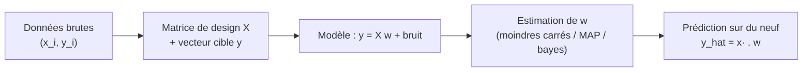
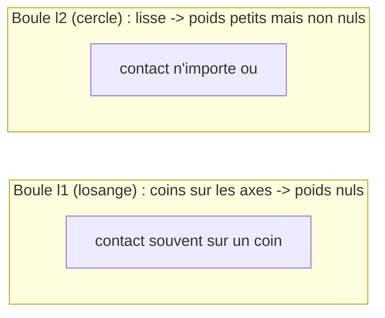
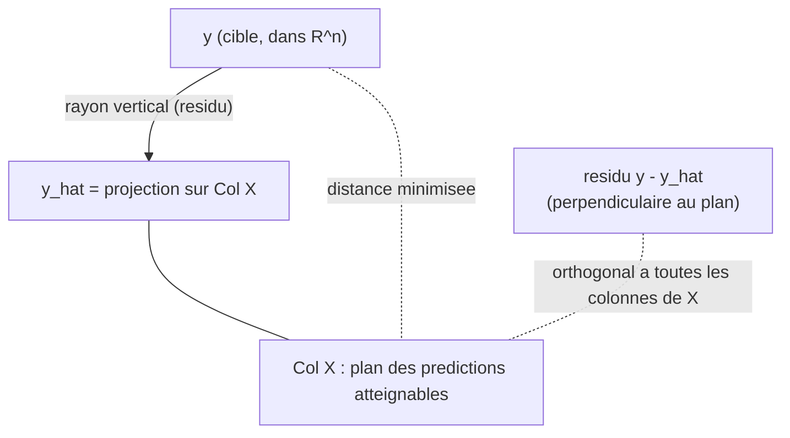
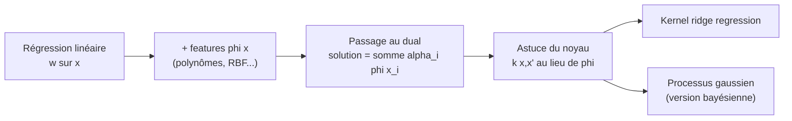

[← Quand les modèles rencontrent les données](08-modeles-et-donnees.md) · [↑ Sommaire](../README.md#table-des-matières) · [Réduction de dimension par ACP →](10-reduction-de-dimension-acp.md)

# 9. Régression linéaire

### Formulation de la régression linéaire

La régression linéaire est le point de départ de presque tout l'**apprentissage statistique**. On cherche à prédire une grandeur numérique (un nombre : un prix, une température, une concentration) à partir d'une ou plusieurs grandeurs mesurées. L'hypothèse centrale, d'une simplicité trompeuse, est que la grandeur à prédire s'exprime comme une **combinaison pondérée** des grandeurs observées, plus un petit écart inexplicable.

> **Que veut dire « apprentissage statistique » ?** C'est l'art de faire apprendre à une machine, à partir d'exemples chiffrés, à deviner une réponse qu'on ne lui a pas donnée.

> **Que veut dire « combinaison pondérée » ?** On multiplie chaque grandeur par un nombre, son « poids », et on additionne le tout, comme un prix total est la somme de chaque article multiplié par sa quantité.

> **Que veut dire « linéaire » ?** Le mot vient de « ligne ». Une relation est **linéaire** quand elle est *proportionnelle et additive* : si vous doublez l'entrée, la sortie double ; et l'effet de deux causes est la somme de leurs effets séparés. Pas de courbe, pas de seuil : tout se fait « en ligne droite ». Exemple : si 1 kg de pommes coûte 2 euros, alors 2 kg coûtent 4 euros, 3 kg coûtent 6 euros (proportionnel) ; et le total pommes + poires est la somme du prix des pommes et du prix des poires (additif).

#### Le problème et son vocabulaire

On dispose de $`n`$ observations. Pour chaque observation $`i`$, on connaît un vecteur d'entrée (un *vecteur* est simplement une liste ordonnée de nombres, comme les coordonnées d'un point ou les cases d'une ligne de tableur) $`\mathbf{x}_i \in \mathbb{R}^d`$ (les *caractéristiques*, en anglais *features* : les renseignements mesurés sur l'objet) et une sortie scalaire (un *scalaire* est un nombre tout seul, par opposition à une liste de nombres) $`y_i \in \mathbb{R}`$ (la *cible*, en anglais *target* ou *label* : la valeur qu'on veut prédire). On postule l'existence d'un vecteur de poids $`\mathbf{w}`$ tel que

> **Les symboles $`\in`$ et $`\mathbb{R}^d`$, $`\mathbb{R}`$.** Le symbole $`\in`$ se lit « appartient à » ou « est dans » : il dit de quelle sorte est un objet, comme on dirait « Médor appartient à l'ensemble des chiens ». Le symbole $`\mathbb{R}`$ (un grand R à double barre) se lit « les réels » : c'est l'ensemble de *tous les nombres* (entiers, virgules, négatifs : $`3`$, $`-1{,}5`$, $`0{,}0007`$…). Donc $`y_i \in \mathbb{R}`$ se lit « $`y_i`$ est un nombre ». Le petit exposant dans $`\mathbb{R}^d`$ (l'*exposant*, c'est le petit symbole écrit en haut à droite, comme le $`2`$ dans $`3^2`$) dit *combien* de nombres : $`\mathbb{R}^d`$ est l'ensemble des listes de $`d`$ nombres. Donc $`\mathbf{x}_i \in \mathbb{R}^d`$ se lit « $`\mathbf{x}_i`$ est une liste de $`d`$ nombres ». Image : $`\mathbb{R}^2`$ = tous les points d'une feuille (deux coordonnées), $`\mathbb{R}^3`$ = tous les points de l'espace (trois coordonnées).

```math
y_i \approx \mathbf{w}^\top \mathbf{x}_i .
```

> **Les symboles $`\approx`$ et $`\top`$, comment les lire.** Le symbole $`\approx`$ se lit « est à peu près égal à » (un signe égal ondulé) : on ne promet pas l'égalité parfaite, juste « très proche ». Le petit $`\top`$ en exposant, dans $`\mathbf{w}^\top`$, se lit **transposée** : transposer, c'est *basculer les lignes en colonnes* (et inversement), comme on ferait pivoter un domino debout pour le coucher. Ici ce basculement sert à coller deux listes de nombres bout à bout pour les multiplier terme à terme puis additionner : c'est exactement l'opération « combinaison pondérée » détaillée juste après. Toute la ligne se lit donc : « la cible $`y_i`$ vaut à peu près la combinaison des caractéristiques de l'exemple $`i`$ pondérées par les poids $`\mathbf{w}`$ ».

> **Les symboles $`n`$ (nombre d'observations) et $`d`$ (nombre de caractéristiques).** $`n`$ est le nombre de *fiches* dont on dispose pour apprendre : si on étudie 200 appartements, $`n = 200`$. $`d`$ est le nombre de *renseignements* portés par chaque fiche : surface, nombre de pièces, étage donnent $`d = 3`$. Retenir : $`n`$ compte les lignes (les exemples), $`d`$ compte les colonnes (les caractéristiques).

> **Le symbole $`\mathbf{w}`$ (vecteur de poids, en anglais *weight vector*).** Ce symbole représente le *réglage* du modèle : une liste de nombres, un par caractéristique. Imaginez une console de mixage avec un curseur par instrument. Chaque curseur $`w_j`$ dit « combien » la caractéristique $`j`$ compte dans la prédiction. Un $`w_j`$ grand et positif : quand cette caractéristique monte, la prédiction monte beaucoup. Un $`w_j`$ négatif : elle fait baisser la prédiction. Un $`w_j`$ nul : on ignore cette caractéristique. Tout l'apprentissage consiste à tourner ces curseurs jusqu'à ce que la musique (les prédictions) ressemble le plus possible à la réalité (les vraies cibles $`y_i`$).

> **Le symbole $`\mathbf{x}_i`$ (vecteur d'entrée de l'exemple $`i`$).** Ce symbole représente une *fiche signalétique* d'un objet qu'on observe. Si on veut prédire le prix d'un appartement, $`\mathbf{x}_i`$ pourrait être la liste $`(\text{surface}, \text{nombre de pieces}, \text{etage})`$. L'indice $`i`$ en bas dit « de quel appartement on parle » : $`\mathbf{x}_1`$ est le premier, $`\mathbf{x}_2`$ le deuxième, etc. La flèche en gras rappelle que c'est une liste de nombres, pas un seul nombre. On note $`x_{ij}`$ la $`j`$-ième coordonnée de $`\mathbf{x}_i`$ (la caractéristique $`j`$ de l'exemple $`i`$).

> **Le symbole $`y_i`$ (cible de l'exemple $`i`$).** C'est *la bonne réponse* qu'on cherche à retrouver : le vrai prix de l'appartement $`i`$. Pendant l'apprentissage on la connaît (on apprend à partir d'exemples corrigés) ; en production on ne la connaît pas, et c'est elle qu'on veut deviner.

Le produit scalaire $`\mathbf{w}^\top \mathbf{x}_i = \sum_{j=1}^d w_j x_{ij}`$ réalise exactement l'idée de « combinaison pondérée » : on multiplie chaque caractéristique par son curseur et on additionne.

#### Le terme constant (biais)

Une droite passant par l'origine est rarement suffisante : il faut pouvoir décaler la prédiction d'une constante. On introduit donc un *biais* (en anglais *bias* ou *intercept*) noté $`b`$:

```math
y_i \approx \mathbf{w}^\top \mathbf{x}_i + b .
```

> **Le symbole $`b`$ (biais).** C'est la valeur que prédit le modèle *quand toutes les caractéristiques sont nulles*: le « point de départ » de la prédiction. Géométriquement, en dimension 1, $`b`$ est l'ordonnée à l'origine de la droite $`\hat y = w x + b`$ (la hauteur à laquelle elle coupe l'axe vertical). Sans lui, la droite serait forcée de passer par $`0`$, ce qui colle rarement aux données réelles.

> **Astuce de l'absorption du biais.** Plutôt que de traîner $`b`$ séparément, on ajoute à chaque $`\mathbf{x}_i`$ une coordonnée constante égale à $`1`$. Alors le poids associé à cette coordonnée *est* le biais : $`\mathbf{w}^\top \mathbf{x}_i + b = \tilde{\mathbf{w}}^\top \tilde{\mathbf{x}}_i`$ avec $`\tilde{\mathbf{x}}_i = (1, x_{i1}, \dots, x_{id})`$ et $`\tilde{\mathbf{w}} = (b, w_1, \dots, w_d)`$. Dans toute la suite on supposera, sauf mention contraire, que cette coordonnée constante est déjà incluse ; on écrira simplement $`\mathbf{w} \in \mathbb{R}^d`$ en gardant à l'esprit qu'une de ses composantes joue le rôle de biais.

#### Empilement : la matrice de design

Travailler observation par observation est lourd. On empile les $`n`$ vecteurs d'entrée en lignes d'une grande matrice, et les $`n`$ cibles en un vecteur.

> **Le symbole $`\mathbf{X}`$ (matrice de design, en anglais *design matrix*).** Ce symbole représente le *grand tableau* de toutes nos données d'entrée. Pensez à un tableur : une ligne par exemple (un appartement par ligne), une colonne par caractéristique (une colonne « surface », une colonne « nb pièces »…). La case à la ligne $`i`$ et la colonne $`j`$ vaut $`X_{ij} = x_{ij}`$, c'est-à-dire la caractéristique $`j`$ de l'exemple $`i`$. C'est juste un rangement bien ordonné de nos fiches signalétiques, les unes sous les autres.

Formellement, $`\mathbf{X} \in \mathbb{R}^{n \times d}`$ et $`\mathbf{y} \in \mathbb{R}^n`$:

```math
\mathbf{X} =
\begin{pmatrix}
\text{---} & \mathbf{x}_1^\top & \text{---} \\
\text{---} & \mathbf{x}_2^\top & \text{---} \\
& \vdots & \\
\text{---} & \mathbf{x}_n^\top & \text{---}
\end{pmatrix}
=
\begin{pmatrix}
x_{11} & x_{12} & \cdots & x_{1d} \\
x_{21} & x_{22} & \cdots & x_{2d} \\
\vdots & \vdots & \ddots & \vdots \\
x_{n1} & x_{n2} & \cdots & x_{nd}
\end{pmatrix},
\qquad
\mathbf{y} =
\begin{pmatrix} y_1 \\ y_2 \\ \vdots \\ y_n \end{pmatrix}.
```

> **Comment lire ce grand tableau.** Les grosses parenthèses verticales encadrent simplement une *matrice* (le tableau de nombres). Les petits tirets « --- » de part et d'autre de $`\mathbf{x}_i^\top`$ veulent dire « ici, la fiche $`\mathbf{x}_i`$ est couchée à plat sur toute une ligne ». Les pointillés $`\vdots`$ (verticaux), $`\cdots`$ (horizontaux) et $`\ddots`$ (en diagonale) signifient « et ainsi de suite, on continue le même motif » : on ne récrit pas les milliers de lignes intermédiaires, on les sous-entend. Bref, ce tableau dit juste : chaque ligne est un exemple, chaque colonne une caractéristique.

Le vecteur des $`n`$ prédictions du modèle s'écrit alors d'un seul coup, par un produit matrice-vecteur (multiplier la matrice $`\mathbf{X}`$ par la liste $`\mathbf{w}`$ : pour chaque ligne, on fait la combinaison pondérée vue plus haut, ce qui donne une prédiction par ligne) :

```math
\hat{\mathbf{y}} = \mathbf{X}\mathbf{w}, \qquad \hat{y}_i = \mathbf{x}_i^\top \mathbf{w} .
```

> **Le symbole $`\hat{\mathbf{y}}`$ (prédiction).** Le petit chapeau « ^ » sur une lettre signifie partout en statistique : « ceci est une *estimation*, une valeur devinée par le modèle, pas la vérité ». Donc $`\hat{y}_i`$ est *ce que le modèle prédit* pour l'exemple $`i`$, à distinguer de $`y_i`$ qui est la vraie valeur. La différence $`y_i - \hat{y}_i`$ est l'erreur de prédiction (le *résidu*).

> **Vérification des dimensions.** $`\mathbf{X}`$ est $`n \times d`$, $`\mathbf{w}`$ est $`d \times 1`$: le produit $`\mathbf{X}\mathbf{w}`$ est donc $`n \times 1`$, soit bien un vecteur de $`n`$ prédictions, une par observation. Vérifier que les tailles « s'emboîtent » (la dimension de droite de la première matrice égale celle de gauche de la seconde) est le réflexe le plus rentable pour ne jamais se tromper d'écriture.

#### Le bruit : pourquoi un signe « approximativement »

Aucune relation réelle n'est parfaitement linéaire ni parfaitement mesurée. On modélise explicitement l'écart entre la vraie cible et la partie linéaire par un terme aléatoire.

> **Le symbole $`\varepsilon`$ (bruit, en anglais *noise*).** La lettre grecque epsilon représente ici *tout ce qu'on ne contrôle pas*: erreurs de mesure de l'appareil, facteurs qu'on n'a pas mis dans les caractéristiques, hasard pur. Imaginez que vous pesez un sac de pommes : la balance affiche presque le bon poids, mais tremblote un peu à cause d'un courant d'air. Ce petit tremblotement, imprévisible, c'est $`\varepsilon`$. On le suppose en général « centré » (en moyenne nul, il ne triche pas systématiquement dans un sens) et « petit ».

Le *modèle génératif* (la fiction probabiliste qui dit comment les données naissent) s'écrit, pour chaque observation :

```math
y_i = \mathbf{w}_\star^\top \mathbf{x}_i + \varepsilon_i, \qquad \varepsilon_i \sim \mathcal{N}(0, \sigma^2),
```

> **Le symbole $`\sim`$ (suit la loi) et $`\mathcal{N}`$.** Le tilde $`\sim`$ se lit ici « suit la loi » ou « est tiré au hasard selon » : il branche une quantité aléatoire sur la machine à tirages qui la produit, comme on dirait « le résultat $`\sim`$ un lancer de dé ». La lettre $`\mathcal{N}`$ (un grand N calligraphié) désigne la *loi normale*, la fameuse « courbe en cloche » (détaillée juste en dessous). Donc $`\varepsilon_i \sim \mathcal{N}(0, \sigma^2)`$ se lit : « le bruit $`\varepsilon_i`$ est tiré au hasard selon une cloche centrée sur $`0`$, d'étalement $`\sigma^2`$ ».

ou $`\mathbf{w}_\star`$ est le « vrai » vecteur de poids (inconnu, celui de la nature) et les $`\varepsilon_i`$ sont des tirages indépendants d'une loi normale centrée de variance $`\sigma^2`$.

> **Le symbole $`\mathbf{w}_\star`$ (le vrai vecteur de poids).** L'étoile en indice marque la valeur *idéale*, celle qui régit réellement la nature mais qu'on ne connaît pas. Tout le travail d'estimation consiste à en produire une approximation $`\hat{\mathbf{w}}`$ à partir des données. On distingue donc trois objets : $`\mathbf{w}_\star`$ (la vérité, inaccessible), $`\hat{\mathbf{w}}`$ (notre estimation, calculée), et $`\mathbf{w}`$ (la variable libre sur laquelle on optimise).

> **Le symbole $`\sigma^2`$ (variance du bruit).** $`\sigma^2`$ mesure *l'ampleur* du tremblotement : un petit $`\sigma^2`$ signifie des mesures très fiables (les points serrés autour de la droite), un grand $`\sigma^2`$ des mesures dispersées. $`\sigma`$ (sans le carré) est l'écart-type, exprimé dans la même unité que $`y`$; $`\sigma^2`$ est son carré. Rappel : la loi normale $`\mathcal{N}(0, \sigma^2)`$ est la fameuse « courbe en cloche » centrée sur $`0`$ et d'autant plus large que $`\sigma^2`$ est grand.

En notation vectorielle :

```math
\mathbf{y} = \mathbf{X}\mathbf{w}_\star + \boldsymbol{\varepsilon}, \qquad \boldsymbol{\varepsilon} \sim \mathcal{N}(\mathbf{0}, \sigma^2 \mathbf{I}_n).
```

> **Le symbole $`\mathbf{I}_n`$ (matrice identité) et la loi normale multivariée.** $`\mathbf{I}_n`$ est la matrice $`n \times n`$ avec des $`1`$ sur la diagonale et des $`0`$ partout ailleurs ; elle joue, pour la multiplication des matrices, le rôle du nombre $`1`$ ($`\mathbf{I}_n \mathbf{v} = \mathbf{v}`$). Écrire $`\boldsymbol{\varepsilon} \sim \mathcal{N}(\mathbf{0}, \sigma^2 \mathbf{I}_n)`$ veut dire : un *vecteur* de $`n`$ bruits, tous centrés, tous de même variance $`\sigma^2`$ (les $`\sigma^2`$ sur la diagonale) et *deux à deux non corrélés* (les $`0`$ hors diagonale, qui sont les covariances). C'est la version « en bloc » des $`n`$ tirages indépendants $`\varepsilon_i \sim \mathcal{N}(0, \sigma^2)`$.

> **Définition (modèle de régression linéaire gaussien).** On observe $`(\mathbf{X}, \mathbf{y})`$. On suppose que $`\mathbf{y} = \mathbf{X}\mathbf{w}_\star + \boldsymbol{\varepsilon}`$ avec $`\boldsymbol{\varepsilon}`$ un vecteur gaussien de moyenne nulle et de matrice de covariance $`\sigma^2 \mathbf{I}_n`$ (bruit *homoscédastique*, même variance partout, et *non corrélé*, chaque erreur indépendante des autres). L'inconnue est $`\mathbf{w}_\star \in \mathbb{R}^d`$ (et éventuellement $`\sigma^2`$).

> **Remarque, « linéaire » en quoi ?** Le modèle est linéaire *en les paramètres* $`\mathbf{w}`$, pas nécessairement en les variables physiques. On verra dans la dernière section qu'en remplaçant $`\mathbf{x}`$ par des transformations $`\boldsymbol{\phi}(\mathbf{x})`$ (carrés, produits, sinus…), on capture des relations très courbes tout en restant dans le cadre « linéaire en $`\mathbf{w}`$ », donc soluble par les mêmes formules. C'est la grande force, et la raison pour laquelle ce chapitre infuse tout le reste de l'apprentissage.

#### Schéma d'ensemble



> **Exemple chiffré minimal.** Trois maisons, une seule caractéristique (surface en dizaines de m²) plus le biais. Données : $`(x, y) = (5, 12), (8, 18), (10, 21)`$ (prix en dizaines de milliers d'euros). Avec biais absorbé, $`\mathbf{x}_1 = (1,5)`$, $`\mathbf{x}_2 = (1,8)`$, $`\mathbf{x}_3 = (1,10)`$. Si on devine $`\mathbf{w} = (b, a) = (2,\ 1{,}9)`$, alors $`\hat y_1 = 2 + 1{,}9 \times 5 = 11{,}5`$, $`\hat y_2 = 2 + 1{,}9 \times 8 = 17{,}2`$, $`\hat y_3 = 2 + 1{,}9 \times 10 = 21`$. Les résidus $`y_i - \hat y_i`$ sont $`0{,}5,\ 0{,}8,\ 0`$. La section suivante explique comment trouver *le meilleur* $`\mathbf{w}`$ automatiquement plutôt qu'à la main.

```python
import numpy as np

X = np.array([[1.0, 5.0],
              [1.0, 8.0],
              [1.0, 10.0]])
y = np.array([12.0, 18.0, 21.0])

w_guess = np.array([2.0, 1.9])
y_hat = X @ w_guess
residus = y - y_hat
print("predictions :", y_hat)        # [11.5 17.2 21. ]
print("residus     :", residus)      # [ 0.5  0.8  0. ]
```

---

### Estimation des paramètres et moindres carrés

On cherche le $`\mathbf{w}`$ qui rend les prédictions $`\mathbf{X}\mathbf{w}`$ aussi proches que possible des cibles $`\mathbf{y}`$. Reste à définir « proche ». Le choix historique, géométriquement et statistiquement justifié, est la somme des carrés des erreurs, d'où le nom de **moindres carrés**.

> **Pourquoi « moindres carrés » ?** On cherche les réglages qui rendent cette somme de carrés la plus petite, « moindre » voulant dire « le plus petit possible ».

#### La fonction de coût des moindres carrés

> **Intuition.** Pour chaque exemple, on regarde de combien on se trompe : $`r_i = y_i - \mathbf{x}_i^\top \mathbf{w}`$ (l'*erreur* sur l'exemple $`i`$, aussi appelée *résidu*). On pourrait additionner les valeurs absolues $`|r_i|`$ (la *valeur absolue*, notée avec deux barres droites $`|\cdot|`$, c'est le nombre rendu positif, sans son signe : $`|{-3}| = 3`$ et $`|3| = 3`$ ; ici cela transforme chaque erreur en distance toujours positive), mais elles ont un coin (la courbe de $`|r|`$ forme un V pointu en $`0`$, *non dérivable* à la pointe : la *dérivée* est la pente de la courbe, et à la pointe d'un V il n'y a pas de pente unique, ce qui gêne les calculs) et tolèrent mal les grosses erreurs. On préfère additionner les *carrés* $`r_i^2`$: une erreur deux fois plus grande coûte quatre fois plus cher, ce qui pousse fort à corriger les gros écarts, et le carré est une jolie parabole lisse, dérivable partout (la pente y est définie en chaque point).

On définit le coût (en anglais *loss* ou *objective*)

```math
J(\mathbf{w}) = \frac{1}{2}\sum_{i=1}^{n} \bigl(y_i - \mathbf{x}_i^\top \mathbf{w}\bigr)^2 = \frac{1}{2}\,\lVert \mathbf{y} - \mathbf{X}\mathbf{w}\rVert_2^2 .
```

> **Le symbole $`J(\mathbf{w})`$ (fonction de coût).** $`J`$ est un *score de mécontentement*: un seul nombre qui dit à quel point le réglage $`\mathbf{w}`$ se trompe sur l'ensemble des données. Plus $`J`$ est petit, meilleur est le modèle. C'est une fonction de $`\mathbf{w}`$ (les données $`\mathbf{X}, \mathbf{y}`$ sont fixées) : on cherchera le creux de cette fonction.

> **Le symbole $`\sum`$ (somme), rappel d'usage.** Le grand sigma est une *boucle qui additionne*: $`\sum_{i=1}^n a_i = a_1 + a_2 + \dots + a_n`$. Ici il fait la somme des carrés d'erreur sur tous les exemples, de l'exemple $`1`$ à l'exemple $`n`$.

> **Le symbole $`\lVert \cdot \rVert_2`$ (norme euclidienne), rappel d'usage.** La norme d'un vecteur, c'est sa *longueur* (théorème de Pythagore en dimension quelconque) : $`\lVert \mathbf{r}\rVert_2 = \sqrt{\sum_i r_i^2}`$. Donc $`\lVert \mathbf{y} - \mathbf{X}\mathbf{w}\rVert_2^2`$ est exactement la somme des carrés des erreurs : minimiser le coût, c'est rendre le vecteur d'erreurs *le plus court possible*.

Le facteur $`\tfrac12`$ ne change pas l'argument du minimum ; il sert juste à simplifier la dérivée (le $`2`$ du carré s'annulera). On appelle *estimateur des moindres carrés ordinaires* (en anglais *ordinary least squares*, OLS) tout

```math
\hat{\mathbf{w}} \in \arg\min_{\mathbf{w} \in \mathbb{R}^d} J(\mathbf{w}).
```

> **Le symbole $`\arg\min`$, rappel d'usage.** $`\min_{\mathbf{w}} J(\mathbf{w})`$ est la *plus petite valeur* atteinte par le coût ; $`\arg\min_{\mathbf{w}} J(\mathbf{w})`$ est *l'endroit* (le $`\mathbf{w}`$) où ce minimum est atteint. On veut le point, pas la valeur : d'où $`\arg\min`$. Le symbole $`\in`$ (et non $`=`$) rappelle que ce point pourrait ne pas être unique.

#### Les équations normales

Le coût $`J`$ est une fonction quadratique convexe de $`\mathbf{w}`$; son minimum s'obtient en annulant le gradient.

> **« Quadratique » et « annuler le gradient ».** *Quadratique* veut dire « du second degré », c'est-à-dire faisant intervenir des carrés des inconnues (le mot vient du latin *quadratus*, carré) : sa courbe est une parabole (en forme de U), pas une droite. *Annuler le gradient*, c'est chercher l'endroit où la pente est nulle (le sol parfaitement plat) : au fond d'une cuvette, on ne descend ni ne monte dans aucune direction, donc c'est là qu'est le minimum. On résout donc l'équation « pente $`= 0`$ ».

> **Le mot « convexe », rappel d'usage.** Imaginez une fonction en forme de bol, ou de cuvette : elle descend, atteint un creux, puis remonte, sans aucune bosse ni vallon secondaire. C'est cela, une fonction convexe. La conséquence est très pratique : il n'y a qu'un seul creux, et ce creux est forcément le point le plus bas de tous (le minimum global). Donc dès qu'on a trouvé un endroit où la pente est nulle, on est sûr d'être au fond : pas de « faux fond » qui piégerait la recherche. C'est pour cette raison que la régression linéaire se résout proprement, sans risque de rester coincé dans un mauvais minimum.

> **Le symbole $`\nabla`$ (nabla, le gradient), rappel d'usage.** Le triangle pointe en bas représente la *pente dans chaque direction* à la fois : $`\nabla_{\mathbf{w}} J`$ est le vecteur dont la composante $`j`$ est $`\partial J / \partial w_j`$, la sensibilité du coût quand on bouge le curseur $`j`$. Au sommet ou au fond d'une vallée, la pente est nulle dans toutes les directions : c'est pour cela qu'on cherche $`\nabla J = \mathbf{0}`$.

Développons. En posant $`\mathbf{r} = \mathbf{y} - \mathbf{X}\mathbf{w}`$,

```math
J(\mathbf{w}) = \tfrac12 (\mathbf{y} - \mathbf{X}\mathbf{w})^\top (\mathbf{y} - \mathbf{X}\mathbf{w}) = \tfrac12\left( \mathbf{y}^\top\mathbf{y} - 2\,\mathbf{w}^\top \mathbf{X}^\top \mathbf{y} + \mathbf{w}^\top \mathbf{X}^\top \mathbf{X}\, \mathbf{w}\right).
```

> **Détail du développement.** En distribuant, $`(\mathbf{y} - \mathbf{X}\mathbf{w})^\top (\mathbf{y} - \mathbf{X}\mathbf{w}) = \mathbf{y}^\top\mathbf{y} - \mathbf{y}^\top\mathbf{X}\mathbf{w} - \mathbf{w}^\top\mathbf{X}^\top\mathbf{y} + \mathbf{w}^\top\mathbf{X}^\top\mathbf{X}\mathbf{w}`$. Les deux termes croisés sont des scalaires *égaux* (l'un est la transposée de l'autre, et la transposée d'un scalaire est lui-même : $`\mathbf{y}^\top\mathbf{X}\mathbf{w} = (\mathbf{y}^\top\mathbf{X}\mathbf{w})^\top = \mathbf{w}^\top\mathbf{X}^\top\mathbf{y}`$), d'où le facteur $`-2`$.

En dérivant par rapport à $`\mathbf{w}`$ (règles : $`\nabla_{\mathbf{w}}(\mathbf{a}^\top\mathbf{w}) = \mathbf{a}`$ et $`\nabla_{\mathbf{w}}(\mathbf{w}^\top \mathbf{A}\mathbf{w}) = (\mathbf{A}+\mathbf{A}^\top)\mathbf{w} = 2\mathbf{A}\mathbf{w}`$ pour $`\mathbf{A}`$ symétrique) :

```math
\nabla_{\mathbf{w}} J(\mathbf{w}) = -\mathbf{X}^\top \mathbf{y} + \mathbf{X}^\top \mathbf{X}\, \mathbf{w} = -\mathbf{X}^\top(\mathbf{y} - \mathbf{X}\mathbf{w}).
```

Annuler ce gradient donne les **équations normales**:

```math
\boxed{\ \mathbf{X}^\top \mathbf{X}\, \hat{\mathbf{w}} = \mathbf{X}^\top \mathbf{y}\ }
```

> **Théorème (existence, unicité, solution OLS).** Le coût $`J`$ est convexe (sa hessienne $`\mathbf{X}^\top\mathbf{X}`$ est semi-définie positive ; ces deux mots, *hessienne* et *semi-définie positive*, sont expliqués dans les deux encadrés juste en dessous). Tout minimiseur (c'est-à-dire tout $`\mathbf{w}`$ qui réalise le plus petit coût possible) vérifie les équations normales. Si $`\mathbf{X}`$ est de rang plein en colonnes ($`\mathrm{rang}\mathbf{X} = d`$, ce qui exige $`n \ge d`$, le symbole $`\ge`$ se lisant « plus grand ou égal à » : il faut donc au moins autant d'exemples que de caractéristiques, et des colonnes linéairement indépendantes), alors $`\mathbf{X}^\top\mathbf{X}`$ est inversible (une matrice est *inversible* quand on peut « défaire » sa multiplication, comme la division défait la multiplication des nombres ; le petit exposant $`-1`$, écrit $`(\cdots)^{-1}`$, se lit « inverse de » et joue le rôle de $`1`$ divisé par, mais pour les matrices) et le minimiseur est **unique**:
> ```math
> \hat{\mathbf{w}} = (\mathbf{X}^\top \mathbf{X})^{-1}\mathbf{X}^\top \mathbf{y}.
> ```

> **Le symbole $`\nabla^2 J`$ (hessienne), rappel d'usage.** La hessienne est la matrice des dérivées secondes : sa case $`(j,k)`$ vaut $`\partial^2 J / \partial w_j \partial w_k`$. Elle décrit la *courbure* du coût. Pour une fonction d'une variable, le signe de la dérivée seconde dit si l'on est dans un creux (positif) ou sur une bosse ; en plusieurs variables, le rôle est tenu par le caractère défini positif de la hessienne.

> **Les mots « semi-définie positive » et « définie positive », rappel d'usage.** Reprenez l'image de la cuvette en plusieurs dimensions. Dire que la courbure (la hessienne) est *définie positive*, c'est dire que, dans n'importe quelle direction où l'on s'éloigne du fond, le sol remonte strictement : la cuvette ne pointe vers le bas dans aucune direction, et le creux est donc unique. Dire qu'elle est *semi-définie positive*, c'est presque pareil, en plus mou : dans certaines directions le sol peut rester parfaitement plat (ni montée ni descente) au lieu de remonter. Le fond existe toujours, mais il peut être un fond « en gouttière » plutôt qu'un point unique, d'où la possibilité de plusieurs solutions équivalentes.

> **Le symbole $`\mathrm{rang}\mathbf{X}`$ (rang), rappel d'usage.** Le rang est le nombre de colonnes *vraiment indépendantes* (non redondantes) de $`\mathbf{X}`$: le nombre de directions réellement distinctes que portent les caractéristiques. Si deux colonnes sont identiques ou proportionnelles (ex. une surface en m² et la même en cm²), elles n'apportent qu'une seule direction : le rang chute, et $`\mathbf{X}^\top\mathbf{X}`$ devient non inversible.

*Démonstration.* La hessienne de $`J`$ est $`\nabla^2 J = \mathbf{X}^\top\mathbf{X}`$. Pour tout $`\mathbf{v}`$, $`\mathbf{v}^\top \mathbf{X}^\top\mathbf{X}\mathbf{v} = \lVert \mathbf{X}\mathbf{v}\rVert_2^2 \ge 0`$, donc $`J`$ est convexe et un point critique est un minimum global. Si $`\mathrm{rang}\mathbf{X}=d`$, alors $`\mathbf{X}\mathbf{v}=\mathbf{0} \Rightarrow \mathbf{v}=\mathbf{0}`$, donc $`\mathbf{v}^\top\mathbf{X}^\top\mathbf{X}\mathbf{v}>0`$ pour $`\mathbf{v}\neq\mathbf0`$: $`\mathbf{X}^\top\mathbf{X}`$ est définie positive, donc inversible, d'où l'unicité et la formule. $`\blacksquare`$

> **Petit lexique de cette démonstration.** Un *point critique* est un endroit où la pente (le gradient) est nulle : un fond de cuvette, un sommet de colline ou un replat. Le symbole $`\Rightarrow`$ se lit « implique » ou « entraîne » : « si ceci, alors cela ». Le symbole $`\neq`$ se lit « différent de » (un signe égal barré : $`\mathbf{v}\neq\mathbf0`$ veut dire « $`\mathbf{v}`$ n'est pas la liste de zéros »). Le carré noir $`\blacksquare`$ en fin de paragraphe est juste la marque traditionnelle « fin de la démonstration » (l'équivalent moderne de « CQFD »).

> **Le symbole $`\mathbf{X}^\top \mathbf{X}`$ (matrice de Gram ; proportionnelle à la matrice de covariance uniquement si les colonnes sont d'abord centrées).** Ce produit, de taille $`d \times d`$, contient *tous les produits scalaires entre colonnes*: sa case $`(j,k)`$ vaut $`\sum_i x_{ij}x_{ik}`$, c'est-à-dire la somme des produits, exemple par exemple, des valeurs des colonnes $`j`$ et $`k`$. Attention : on lit souvent cette case comme « à quel point les caractéristiques $`j`$ et $`k`$ varient ensemble » (une covariance), mais ce n'est exact que si l'on a au préalable retranché la moyenne de chaque colonne (colonnes *centrées*). Sans ce centrage, et en particulier pour la colonne constante de 1 du biais, c'est un simple produit scalaire brut, pas une covariance. C'est le cœur de calcul de la régression : tout se joue dans cette petite matrice carrée, même si on a des millions de lignes.

#### Exemple chiffré déroulé pas à pas

Reprenons les trois maisons : $`\mathbf{X}=\begin{pmatrix}1&5\\1&8\\1&10\end{pmatrix}`$, $`\mathbf{y}=(12,18,21)`$.

Étape 1, Gram :
```math
\mathbf{X}^\top\mathbf{X}=\begin{pmatrix}3 & 23\\ 23 & 189\end{pmatrix},\qquad
\mathbf{X}^\top\mathbf{y}=\begin{pmatrix}51\\ 414\end{pmatrix}.
```
(Vérification : $`1+1+1=3`$; $`5+8+10=23`$; $`25+64+100=189`$; $`12+18+21=51`$; $`5\cdot12+8\cdot18+10\cdot21=60+144+210=414`$.)

Étape 2, inverse. Déterminant $`= 3\cdot189 - 23^2 = 567-529 = 38`$.

> **Le symbole $`\det`$ et l'inverse $`2 \times 2`$, rappel d'usage.** Le déterminant d'une matrice $`\begin{psmallmatrix}a&b\\c&d\end{psmallmatrix}`$ vaut $`ad - bc`$; il est nul exactement quand la matrice n'est pas inversible (colonnes redondantes). Quand il ne l'est pas, l'inverse se calcule par la recette $`\begin{psmallmatrix}a&b\\c&d\end{psmallmatrix}^{-1} = \tfrac{1}{ad-bc}\begin{psmallmatrix}d&-b\\-c&a\end{psmallmatrix}`$ (on échange la diagonale, on change le signe de l'antidiagonale, on divise par le déterminant).

```math
(\mathbf{X}^\top\mathbf{X})^{-1}=\frac{1}{38}\begin{pmatrix}189 & -23\\ -23 & 3\end{pmatrix}.
```

Étape 3, solution :
```math
\hat{\mathbf{w}}=\frac{1}{38}\begin{pmatrix}189 & -23\\ -23 & 3\end{pmatrix}\begin{pmatrix}51\\414\end{pmatrix}
=\frac{1}{38}\begin{pmatrix}189\cdot51-23\cdot414\\ -23\cdot51+3\cdot414\end{pmatrix}
=\frac{1}{38}\begin{pmatrix}9639-9522\\ -1173+1242\end{pmatrix}
=\frac{1}{38}\begin{pmatrix}117\\69\end{pmatrix}.
```
Donc $`\hat b = 117/38 \approx 3{,}079`$ et $`\hat a = 69/38 \approx 1{,}816`$. La droite ajustée est $`\hat y \approx 3{,}08 + 1{,}82\,x`$. Prédictions : $`\hat y_1\approx 12{,}16`$, $`\hat y_2\approx 17{,}61`$, $`\hat y_3\approx 21{,}24`$; résidus $`\approx -0{,}16,\ 0{,}39,\ -0{,}24`$, bien plus petits (et de somme nulle) que notre devinette manuelle.

```python
import numpy as np

X = np.array([[1.,5.],[1.,8.],[1.,10.]])
y = np.array([12.,18.,21.])

XtX = X.T @ X
Xty = X.T @ y
w_hat = np.linalg.solve(XtX, Xty)     # ne jamais inverser explicitement
print(w_hat)                          # [3.07894737 1.81578947]
print("residus :", y - X @ w_hat)     # somme ~ 0
```

> **Piège numérique (important).** N'écrivez **jamais** `np.linalg.inv(XtX) @ Xty`. Former $`\mathbf{X}^\top\mathbf{X}`$ *carré* le conditionnement (en anglais *condition number* ; le *conditionnement* mesure à quel point une petite erreur sur les nombres d'entrée se transforme en grosse erreur sur le résultat : un calcul « mal conditionné » est comme une balance ultra-sensible qui s'affole au moindre souffle, et l'élever au carré rend la balance encore mille fois plus capricieuse) : si $`\mathbf{X}`$ est déjà un peu mal conditionnée, $`\mathbf{X}^\top\mathbf{X}`$ l'est catastrophiquement, et l'inversion explicite amplifie les erreurs d'arrondi (les minuscules imprécisions que l'ordinateur commet en ne gardant qu'un nombre fini de décimales). Utilisez un solveur (`np.linalg.solve`), une factorisation de Cholesky de $`\mathbf{X}^\top\mathbf{X}`$ (une façon économique de découper une matrice symétrique en deux morceaux triangulaires faciles à résoudre), ou mieux une décomposition QR / SVD de $`\mathbf{X}`$ directement (voir plus bas).

#### La solution par QR (numériquement stable)

> **Le symbole de la décomposition QR, rappel d'usage.** *Factoriser*, c'est décomposer en facteurs, comme on écrit $`12 = 3\times 4`$ ; ici on décompose la matrice $`\mathbf{X}`$ en deux matrices $`\mathbf{Q}`$ et $`\mathbf{R}`$ plus pratiques. Factoriser $`\mathbf{X} = \mathbf{Q}\mathbf{R}`$, c'est réécrire les colonnes de $`\mathbf{X}`$ dans une base *orthonormée* (une *base* est un jeu de directions de référence qui permet de repérer tous les points, comme les axes « gauche-droite » et « haut-bas » d'une carte ; *orthonormée* veut dire que ces directions sont perpendiculaires entre elles et de longueur 1, rangées dans $`\mathbf{Q}`$) tout en gardant trace du changement de base (dans la matrice $`\mathbf{R}`$, dite *triangulaire* car tous ses nombres sous la diagonale sont des zéros, ce qui la rend très rapide à résoudre). « Orthonormé » garantit $`\mathbf{Q}^\top\mathbf{Q} = \mathbf{I}`$, ce qui simplifie radicalement les calculs et évite l'amplification des erreurs d'arrondi.

Si $`\mathbf{X}=\mathbf{Q}\mathbf{R}`$ avec $`\mathbf{Q}\in\mathbb{R}^{n\times d}`$ à colonnes orthonormées ($`\mathbf{Q}^\top\mathbf{Q}=\mathbf{I}_d`$) et $`\mathbf{R}\in\mathbb{R}^{d\times d}`$ triangulaire supérieure inversible, alors $`\mathbf{X}^\top\mathbf{X}=\mathbf{R}^\top\mathbf{Q}^\top\mathbf{Q}\mathbf{R}=\mathbf{R}^\top\mathbf{R}`$ et les équations normales deviennent $`\mathbf{R}^\top\mathbf{R}\hat{\mathbf{w}}=\mathbf{R}^\top\mathbf{Q}^\top\mathbf{y}`$, soit, en simplifiant par $`\mathbf{R}^\top`$ inversible,

```math
\mathbf{R}\,\hat{\mathbf{w}} = \mathbf{Q}^\top \mathbf{y},
```

système triangulaire résolu par simple remontée, sans jamais former $`\mathbf{X}^\top\mathbf{X}`$. C'est ce que fait `np.linalg.lstsq` (via LAPACK).

#### Le cas sous-déterminé et la pseudo-inverse

Si $`\mathrm{rang}\mathbf{X}<d`$ (colonnes redondantes, ou plus de caractéristiques que d'exemples, $`d>n`$), les équations normales ont une *infinité* de solutions : on peut ajouter à $`\hat{\mathbf{w}}`$ n'importe quel vecteur du noyau de $`\mathbf{X}`$ sans changer $`\mathbf{X}\hat{\mathbf{w}}`$. On sélectionne alors classiquement la solution de **norme minimale**, donnée par la pseudo-inverse de Moore-Penrose $`\mathbf{X}^+`$:

```math
\hat{\mathbf{w}}_{\min} = \mathbf{X}^+ \mathbf{y}.
```

> **Le symbole « noyau de $`\mathbf{X}`$ » et la pseudo-inverse $`\mathbf{X}^+`$.** Le *noyau* (en anglais *null space*) de $`\mathbf{X}`$ est l'ensemble des vecteurs $`\mathbf{v}`$ tels que $`\mathbf{X}\mathbf{v} = \mathbf{0}`$: des directions « invisibles » pour le modèle, qu'on peut ajouter aux poids sans rien changer aux prédictions. La *pseudo-inverse* $`\mathbf{X}^+`$ généralise l'inverse aux matrices non carrées ou non inversibles : quand $`\mathbf{X}^\top\mathbf{X}`$ est inversible elle redonne $`(\mathbf{X}^\top\mathbf{X})^{-1}\mathbf{X}^\top`$, et sinon elle sélectionne, parmi l'infinité de solutions, celle de plus petite norme.

Via la SVD $`\mathbf{X}=\mathbf{U}\boldsymbol{\Sigma}\mathbf{V}^\top`$, on a $`\mathbf{X}^+=\mathbf{V}\boldsymbol{\Sigma}^+\mathbf{U}^\top`$ ou $`\boldsymbol{\Sigma}^+`$ remplace chaque valeur singulière non nulle $`\sigma_k`$ par $`1/\sigma_k`$ (et laisse les zéros). C'est le pont direct vers la régularisation : faire tendre $`\lambda \to 0`$ dans la ridge redonne précisément cette solution de norme minimale.

> **Le symbole de la SVD, rappel d'usage.** La décomposition en valeurs singulières $`\mathbf{X} = \mathbf{U}\boldsymbol{\Sigma}\mathbf{V}^\top`$ écrit n'importe quelle matrice comme : une rotation ($`\mathbf{V}^\top`$), un étirement le long des axes (la diagonale $`\boldsymbol{\Sigma}`$ des *valeurs singulières* $`\sigma_k \ge 0`$, qui mesurent « combien la matrice étire » dans chaque direction), puis une autre rotation ($`\mathbf{U}`$). Les directions de faible $`\sigma_k`$ sont celles que les données explorent peu, exactement celles que le bruit fait déraper.

#### Propriétés statistiques de l'estimateur OLS

Sous le modèle gaussien $`\mathbf{y}=\mathbf{X}\mathbf{w}_\star+\boldsymbol{\varepsilon}`$, $`\boldsymbol{\varepsilon}\sim\mathcal N(\mathbf0,\sigma^2\mathbf I_n)`$, et $`\mathbf{X}`$ de rang plein **déterministe** :

> **Que veut dire « déterministe » ?** Cela veut dire « fixé d'avance, pas tiré au hasard » : on considère le tableau $`\mathbf{X}`$ comme connu et figé, seul le bruit $`\boldsymbol{\varepsilon}`$ étant aléatoire.

> **Le symbole $`\mathbb{E}`$ (espérance) et $`\mathrm{Cov}`$ (covariance), rappel d'usage.** L'espérance $`\mathbb{E}[\cdot]`$ est la *moyenne théorique* sur tous les tirages possibles du bruit : ce qu'on obtiendrait en répétant l'expérience une infinité de fois. La matrice de covariance $`\mathrm{Cov}(\hat{\mathbf{w}})`$ décrit la *dispersion* de l'estimateur autour de cette moyenne : sa diagonale donne la variance de chaque coefficient, ses cases hors diagonale disent si deux coefficients varient ensemble d'un tirage à l'autre.

- **Sans biais (en anglais *unbiased*).** $`\mathbb{E}[\hat{\mathbf{w}}] = \mathbf{w}_\star`$. (Attention : ce *biais* statistique n'est pas le terme constant $`b`$ vu au début ! Ici, *biais* veut dire *erreur systématique*, viser toujours un peu à côté dans le même sens, comme une balance déréglée qui ajoute 100 g à chaque pesée. *Sans biais* signifie donc qu'en moyenne, sur énormément de tirages, l'estimateur tombe pile sur la vraie valeur $`\mathbf{w}_\star`$.) En effet $`\hat{\mathbf{w}}=(\mathbf X^\top\mathbf X)^{-1}\mathbf X^\top\mathbf y=\mathbf w_\star+(\mathbf X^\top\mathbf X)^{-1}\mathbf X^\top\boldsymbol\varepsilon`$, et $`\mathbb E[\boldsymbol\varepsilon]=\mathbf0`$.
- **Covariance.** $`\mathrm{Cov}(\hat{\mathbf{w}}) = \sigma^2 (\mathbf{X}^\top\mathbf{X})^{-1}`$. Plus les données sont nombreuses et « étalées », plus $`\mathbf X^\top\mathbf X`$ est grande, plus la covariance est petite : l'estimation se resserre.
- **Loi exacte.** $`\hat{\mathbf{w}} \sim \mathcal N\bigl(\mathbf{w}_\star,\ \sigma^2(\mathbf{X}^\top\mathbf{X})^{-1}\bigr)`$ (combinaison linéaire de gaussiennes ; une *combinaison linéaire* est une somme pondérée, le même genre d'objet que la « combinaison pondérée » du début : on multiplie des quantités par des nombres et on additionne).
- **Théorème de Gauss-Markov.** Parmi *tous* les estimateurs linéaires en $`\mathbf{y}`$ et sans biais, OLS a la plus petite variance (il est *BLUE*, en anglais *Best Linear Unbiased Estimator*). Remarquable : ce résultat ne suppose même pas la normalité, seulement bruit centré, non corrélé, de variance constante.

> **Estimation de $`\sigma^2`$.** On l'estime sans biais par $`\hat\sigma^2=\dfrac{\lVert\mathbf y-\mathbf X\hat{\mathbf w}\rVert_2^2}{n-d}`$ (les $`d`$ paramètres ajustés consomment $`d`$ degrés de liberté ; un *degré de liberté*, c'est une quantité que l'on a été libre de régler pour coller aux données, et chaque réglage utilisé « épuise » un peu l'information disponible, d'où le fait de diviser par $`n-d`$ et non $`n`$, ce qui corrige le biais).

#### Descente de gradient : quand la formule fermée ne passe pas

Pour $`d`$ très grand (millions de caractéristiques) ou $`n`$ énorme, inverser ou factoriser devient impraticable. On minimise alors $`J`$ itérativement.

> **Intuition.** Imaginez une bille lâchée sur le flanc d'une vallée. À chaque instant elle roule dans le sens de la plus forte descente, c'est-à-dire l'opposé du gradient. On reproduit cela : on part d'un $`\mathbf w`$ quelconque et on fait des petits pas $`-\eta\,\nabla J`$.

> **Le symbole $`\eta`$ (pas d'apprentissage, en anglais *learning rate*).** $`\eta`$ (la lettre grecque eta) est la *taille des pas* qu'on fait à chaque itération. Trop petit : la bille avance à la vitesse d'un escargot, la convergence traîne. Trop grand : elle saute par-dessus le fond de la vallée et peut diverger (osciller de plus en plus loin). Bien le régler est le premier réflexe pratique de l'optimisation.

La règle de mise à jour, avec pas $`\eta>0`$:

```math
\mathbf{w}^{(t+1)} = \mathbf{w}^{(t)} - \eta\,\nabla_{\mathbf w}J(\mathbf w^{(t)}) = \mathbf{w}^{(t)} + \eta\,\mathbf{X}^\top\bigl(\mathbf y - \mathbf X\mathbf w^{(t)}\bigr).
```

> **Le symbole $`\lambda_{\max}(\mathbf{X}^\top\mathbf{X})`$ (plus grande valeur propre), rappel d'usage.** Une *valeur propre* d'une matrice symétrique mesure de combien elle étire l'espace dans une direction privilégiée (le *vecteur propre* associé). $`\lambda_{\max}`$ est l'étirement maximal ; il fixe la courbure la plus raide du coût, donc la limite au-delà de laquelle un pas $`\eta`$ trop grand fait diverger la descente.

Comme $`J`$ est convexe et lisse, la descente de gradient converge vers le minimum global pour $`0<\eta<2/\lambda_{\max}(\mathbf X^\top\mathbf X)`$. En pratique sur grands jeux de données on utilise la version **stochastique** : au lieu de calculer le gradient sur la totalité des exemples à chaque pas, on l'estime sur un petit lot (en anglais *mini-batch*) d'exemples tirés au hasard. C'est une estimation un peu bruitée du vrai gradient, mais bien moins coûteuse à calculer, donc on peut faire beaucoup plus de pas dans le même temps.

> **Que veut dire « stochastique » ?** Le mot veut simplement dire « au hasard », « aléatoire ». En anglais on parle de *SGD*, pour *stochastic gradient descent*, soit « descente de gradient au hasard ».

```python
import numpy as np

def descente_gradient(X, y, eta=1e-2, n_iter=2000):
    n, d = X.shape
    w = np.zeros(d)
    for _ in range(n_iter):
        grad = -X.T @ (y - X @ w)      # gradient des moindres carres
        w = w - eta * grad
    return w
```

> **Mise à jour 2026.** Pour la régression linéaire *pure*, la formule fermée (QR/SVD) reste imbattable et doit être préférée. Mais dès que le modèle est emboîté dans un réseau profond, ce sont les optimiseurs adaptatifs **Adam / AdamW** qui dominent : ils ajustent un pas par coordonnée à partir d'estimées de moment, et **AdamW** découple proprement la régularisation $`\ell_2`$ (le *weight decay*) du gradient, ce qui correspond exactement, on le verra, à la ridge. Tout cela s'appuie sur la **différentiation automatique** (autodiff) de JAX / PyTorch : on n'écrit plus le gradient à la main, le framework le calcule exactement par rétropropagation.

---

### Régularisation : ridge, lasso et estimation MAP

L'estimateur OLS souffre de deux maux liés : il **explose** quand $`\mathbf X^\top\mathbf X`$ est presque singulière (caractéristiques corrélées, *colinéarité*) et il **surapprend** (en anglais *overfitting*) quand $`d`$ est grand devant $`n`$. Le remède : pénaliser les poids trop gros. C'est la régularisation.

> **Intuition générale.** Un modèle aux poids énormes est un funambule : il colle parfaitement aux points d'entraînement mais vacille au moindre point nouveau. La régularisation, c'est un filet de sécurité qui dit « reste raisonnable » : on accepte un peu plus d'erreur sur l'entraînement en échange de poids plus petits, donc d'un modèle plus stable et qui généralise mieux.

#### Le paramètre de régularisation

> **Le symbole $`\lambda`$ (paramètre de régularisation, en anglais *regularization strength*).** Cette lettre grecque (lambda) représente le *bouton de sévérité* du filet de sécurité. À $`\lambda=0`$, aucun filet : on retombe sur OLS, libre d'utiliser des poids gigantesques. Quand $`\lambda`$ augmente, on serre la vis : le modèle est de plus en plus contraint à garder des poids petits, quitte à moins bien coller aux données. À $`\lambda\to\infty`$, tous les poids sont écrasés vers zéro. Choisir $`\lambda`$, c'est doser le compromis entre « bien coller » et « rester sage », un compromis biais-variance qu'on règle par validation croisée.

> **Le « compromis biais-variance », rappel d'usage.** C'est l'arbitrage central de tout l'apprentissage, et il se comprend avec deux travers opposés. Si le modèle est trop simple (ou trop bridé), il rate la vraie tendance des données : il se trompe toujours un peu dans le même sens, c'est ce qu'on appelle le *biais*. Si au contraire le modèle est trop flexible, il épouse non seulement la tendance mais aussi le moindre soubresaut dû au hasard (le bruit) : ses réponses changent beaucoup d'un jeu de données à l'autre, c'est ce qu'on appelle la *variance*. On ne peut pas annuler les deux à la fois ; bien régler $`\lambda`$, c'est trouver le juste milieu qui minimise l'erreur totale.

> **La « validation croisée », rappel d'usage.** Comment savoir quelle valeur de $`\lambda`$ choisir sans tricher ? On cache une partie des données (on fait *comme si* on ne les avait jamais vues), on entraîne le modèle sur le reste, puis on mesure son erreur sur la partie cachée, qui joue le rôle de « nouvelles » données. On répète l'opération en cachant tour à tour différentes parts, pour chaque valeur de $`\lambda`$ envisagée, et l'on garde le $`\lambda`$ qui donne la plus petite erreur moyenne sur les parts cachées. C'est une façon honnête de simuler la performance sur des données futures.

#### Régression ridge ($`\ell_2`$)

On ajoute au coût une pénalité proportionnelle au carré de la norme des poids.

```math
J_{\text{ridge}}(\mathbf w)=\tfrac12\lVert\mathbf y-\mathbf X\mathbf w\rVert_2^2+\tfrac{\lambda}{2}\lVert\mathbf w\rVert_2^2 .
```

Le gradient s'annule en $`-\mathbf X^\top(\mathbf y-\mathbf X\mathbf w)+\lambda\mathbf w=\mathbf 0`$, d'où les **équations normales régularisées**:

```math
(\mathbf X^\top\mathbf X+\lambda\mathbf I_d)\,\hat{\mathbf w}_{\text{ridge}}=\mathbf X^\top\mathbf y
\quad\Longrightarrow\quad
\hat{\mathbf w}_{\text{ridge}}=(\mathbf X^\top\mathbf X+\lambda\mathbf I_d)^{-1}\mathbf X^\top\mathbf y .
```

> **Pourquoi ça répare tout.** La matrice $`\mathbf X^\top\mathbf X+\lambda\mathbf I_d`$ est **toujours inversible** pour $`\lambda>0`$, même si $`\mathbf X^\top\mathbf X`$ est singulière : on ajoute $`\lambda`$ à chacune de ses valeurs propres, qui passent toutes strictement au-dessus de zéro. La solution existe et est unique même quand $`d>n`$. Le terme $`\lambda\mathbf I_d`$ « remonte la diagonale », d'où le nom historique de *ridge* (la crête).

> **Lecture par la SVD (effet de rétrécissement, en anglais *shrinkage*).** Avec $`\mathbf X=\mathbf U\boldsymbol\Sigma\mathbf V^\top`$, OLS donne des coefficients $`\propto 1/\sigma_k`$ (le symbole $`\propto`$ se lit « proportionnel à » : « qui varie comme », à un facteur multiplicatif près) sur chaque direction propre $`\mathbf v_k`$, ce qui explose quand $`\sigma_k`$ est minuscule. La ridge remplace le facteur $`1/\sigma_k`$ par $`\sigma_k/(\sigma_k^2+\lambda)`$: les directions à grande variance ($`\sigma_k`$ grand) sont quasi intactes, mais les directions à faible variance (les plus bruitées) sont **fortement atténuées**. La ridge dégonfle sélectivement le bruit. C'est aussi le lien avec l'ACP (l'*analyse en composantes principales*, une méthode du chapitre 10 qui range les directions des données de la plus étalée à la moins étalée) : on amortit les composantes de petite variance.

```math
\hat{\mathbf w}_{\text{ridge}}=\sum_{k=1}^{d}\frac{\sigma_k}{\sigma_k^2+\lambda}\,(\mathbf u_k^\top\mathbf y)\,\mathbf v_k .
```

> **Exemple chiffré (la colinéarité domptée).** Soit deux caractéristiques presque identiques : $`\mathbf X=\begin{pmatrix}1&1\\1&1{,}001\\1&0{,}999\end{pmatrix}`$, $`\mathbf y=(2,2,2)`$. Ici $`\mathbf X^\top\mathbf X`$ est quasi singulière (déterminant $`\approx 4\times10^{-6}`$) : OLS produit des poids énormes et opposés (par exemple $`w_1\approx 10^3, w_2\approx-10^3`$) très sensibles au bruit. Avec $`\lambda=0{,}1`$, $`(\mathbf X^\top\mathbf X+0{,}1\,\mathbf I)`$ est bien conditionnée et $`\hat{\mathbf w}_{\text{ridge}}\approx(0{,}98,\ 0{,}98)`$: des poids petits, stables, qui se partagent équitablement l'effet des deux colonnes jumelles.

```python
import numpy as np
def ridge(X, y, lam):
    d = X.shape[1]
    return np.linalg.solve(X.T @ X + lam*np.eye(d), X.T @ y)
```

> **Note pratique, ne pas pénaliser le biais, standardiser les colonnes.** Le terme constant ne devrait pas être rétréci (sinon les prédictions sont décentrées) : on l'exclut de la pénalité (matrice $`\mathbf I`$ avec un $`0`$ sur la composante du biais). De plus, la pénalité $`\ell_2`$ dépend de l'échelle des caractéristiques ; on **standardise** (moyenne 0, variance 1) chaque colonne avant d'appliquer la ridge, pour que $`\lambda`$ agisse équitablement.

#### Régression lasso ($`\ell_1`$)

On remplace le carré de la norme par la norme $`\ell_1`$ (somme des valeurs absolues).

> **Le symbole $`\lVert\mathbf w\rVert_1`$ (norme $`\ell_1`$).** C'est la *distance à pied dans une ville en damier* (distance de Manhattan) : $`\lVert\mathbf w\rVert_1=\sum_j|w_j|`$. Au lieu de la longueur à vol d'oiseau (norme $`\ell_2`$), on additionne les déplacements le long de chaque rue. Ce détail géométrique a une conséquence spectaculaire : la lasso met des poids *exactement* à zéro.

```math
J_{\text{lasso}}(\mathbf w)=\tfrac12\lVert\mathbf y-\mathbf X\mathbf w\rVert_2^2+\lambda\lVert\mathbf w\rVert_1 .
```

> **Pourquoi le lasso sélectionne des variables (en anglais *sparsity*, la *parcimonie* : le fait d'avoir une solution faite surtout de zéros, donc peu de poids réellement actifs, comme une liste de courses très courte).** La boule $`\ell_1`$ (l'ensemble $`\{\,\lVert\mathbf w\rVert_1\le t\,\}`$ des poids dont la longueur-Manhattan ne dépasse pas $`t`$ ; on l'appelle « boule » par analogie, même si sa forme n'est pas ronde) est un losange (un *octaèdre*, c'est-à-dire la version à plusieurs dimensions du losange, comme un cube est la version 3D du carré) : elle a des *coins* pointus situés sur les axes. Quand les lignes de niveau elliptiques du coût (les *lignes de niveau* sont les courbes qui relient les points de même coût, exactement comme les courbes d'altitude sur une carte de randonnée relient les points de même hauteur ; *elliptiques* veut dire en forme d'ovale) viennent toucher cette boule, le contact se fait très souvent *sur un coin*, c'est-à-dire en un point où certaines coordonnées sont nulles. La boule $`\ell_2`$, parfaitement ronde, n'a pas de coin : elle rétrécit les poids mais ne les annule jamais. Résultat : la lasso fait d'une pierre deux coups, elle régularise *et* sélectionne automatiquement un sous-ensemble de caractéristiques.



Il n'existe pas de formule fermée générale ($`|\cdot|`$ n'est pas dérivable en 0). On résout par des méthodes adaptées : descente par coordonnées (en anglais *coordinate descent*, le standard de scikit-learn), ou gradient proximal (ISTA/FISTA). Le cœur de ces méthodes est l'**opérateur de seuillage doux** (en anglais *soft-thresholding*), solution du sous-problème scalaire $`\min_w \tfrac12(w-z)^2+\lambda|w|`$:

```math
S_\lambda(z)=\mathrm{sign}(z)\,\max(|z|-\lambda,\ 0)=
\begin{cases} z-\lambda & z>\lambda\\ 0 & |z|\le\lambda\\ z+\lambda & z<-\lambda\end{cases}.
```

> **Lecture imagée du seuillage doux.** On « rabote » chaque coefficient de $`\lambda`$ vers zéro, et tout ce qui était déjà plus petit que $`\lambda`$ en valeur absolue tombe net à zéro. C'est le mécanisme exact qui crée la parcimonie.

| Critère | Ridge ($`\ell_2`$) | Lasso ($`\ell_1`$) |
|---|---|---|
| Pénalité | $`\tfrac\lambda2\sum_j w_j^2`$ | $`\lambda\sum_j \vert w_j\vert `$ |
| Solution | fermée, $`(\mathbf X^\top\mathbf X+\lambda\mathbf I)^{-1}\mathbf X^\top\mathbf y`$ | itérative (coordonnées, proximal) |
| Effet sur les poids | rétrécit tous (jamais 0) | annule certains (parcimonie) |
| Sélection de variables | non | oui |
| Caractéristiques corrélées | les garde toutes, partage le poids | en choisit une, ignore les autres |
| Géométrie de la boule | sphère (lisse) | losange (coins) |

> **Mise à jour 2026.** Entre les deux extrêmes, l'**elastic net** $`\lambda\bigl(\alpha\lVert\mathbf w\rVert_1+\tfrac{1-\alpha}2\lVert\mathbf w\rVert_2^2\bigr)`$ combine parcimonie et stabilité, et gère mieux les groupes de variables corrélées (la lasso seule en choisit une au hasard). C'est le choix par défaut robuste sur données réelles à beaucoup de caractéristiques.

#### Le pont décisif : régularisation = estimation MAP

Voici l'un des résultats les plus éclairants du chapitre. On reprend le modèle bayésien : on met une *loi a priori* (en anglais *prior*) sur les poids et on cherche le mode de la loi a posteriori (estimation *maximum a posteriori*, MAP, vue au chapitre 8).

> **Le symbole $`p(\mathbf w \mid \mathbf y)`$ (loi a posteriori), rappel d'usage.** La barre verticale $`\mid`$ se lit « sachant » : $`p(\mathbf w \mid \mathbf y)`$ est la crédibilité des poids $`\mathbf w`$ *une fois les données $`\mathbf y`$ observées*. Le théorème de Bayes la relie à la *vraisemblance* $`p(\mathbf y \mid \mathbf w)`$ (à quel point ces poids expliquent les données) et à la *loi a priori* $`p(\mathbf w)`$ (ce qu'on croyait des poids avant de voir quoi que ce soit). Le *mode* de cette loi a posteriori (son sommet) est l'estimateur MAP.

Le théorème de Bayes donne $`p(\mathbf w\mid\mathbf y)\propto p(\mathbf y\mid\mathbf w)\,p(\mathbf w)`$. En prenant le logarithme négatif :

> **Le symbole $`\log`$ (logarithme) et l'astuce du « $`-\log`$ ».** Le *logarithme*, noté $`\log`$, est une fonction qui *écrase les grands nombres* et, surtout, *transforme les multiplications en additions* : $`\log(a\times b)=\log a+\log b`$. Image : c'est une réglette qui range les nombres non pas un par un, mais par « ordres de grandeur ». Pourquoi s'en servir ici ? Parce que les probabilités se multiplient (et un produit de plein de petits nombres est pénible à manipuler), tandis qu'avec le log on retombe sur de simples sommes. De plus, le logarithme *grandit toujours quand son entrée grandit* (il est croissant) : le réglage qui rend une probabilité maximale rend aussi son log maximal, donc on a le droit de remplacer la probabilité par son log sans changer le gagnant. On prend ici le log *négatif* (un signe moins devant) pour transformer « chercher le plus grand » en « chercher le plus petit », c'est-à-dire en un problème de minimisation comme les moindres carrés.

```math
-\log p(\mathbf w\mid\mathbf y)=\underbrace{-\log p(\mathbf y\mid\mathbf w)}_{\text{attache aux donnees}}\ \underbrace{-\log p(\mathbf w)}_{\text{penalite}}+\text{const}.
```

> **Le symbole $`\propto`$ (proportionnel à), rappel d'usage.** $`a \propto b`$ signifie « $`a`$ égale $`b`$ à une constante multiplicative près ». Ici la constante manquante (le dénominateur de Bayes, $`p(\mathbf y)`$) ne dépend pas de $`\mathbf w`$: elle ne déplace donc ni le sommet ni l'argmin, et on peut l'ignorer pour chercher le mode. Après passage au $`-\log`$, cette constante multiplicative devient une constante *additive*, notée « const ».

La vraisemblance gaussienne $`p(\mathbf y\mid\mathbf w)=\mathcal N(\mathbf X\mathbf w,\sigma^2\mathbf I)`$ donne $`-\log p(\mathbf y\mid\mathbf w)=\tfrac{1}{2\sigma^2}\lVert\mathbf y-\mathbf X\mathbf w\rVert_2^2+\text{const}`$, exactement le terme des moindres carrés (au facteur $`1/\sigma^2`$ près). Le prior fixe la pénalité :

| Loi a priori sur $`\mathbf w`$ | Terme $`-\log p(\mathbf w)`$ | Estimation MAP obtenue |
|---|---|---|
| Gaussienne $`\mathcal N(\mathbf 0,\ \tau^2\mathbf I)`$ | $`\tfrac{1}{2\tau^2}\lVert\mathbf w\rVert_2^2 + \text{const}`$ | **ridge** avec $`\lambda=\sigma^2/\tau^2`$ |
| Laplace $`\prod_j \tfrac{1}{2b}e^{-\vert w_j\vert /b}`$ | $`\tfrac1b\lVert\mathbf w\rVert_1 + \text{const}`$ | **lasso** avec $`\lambda=\sigma^2/b`$ |

> **Le symbole $`\tau^2`$ (variance du prior) et $`b`$ (échelle de Laplace).** $`\tau^2`$ est la variance de la gaussienne *a priori* sur chaque poids : elle dit à quel point on autorise les poids à s'éloigner de zéro *avant* de voir les données. Petit $`\tau^2`$ = on croit fort que les poids sont petits = forte régularisation. Le paramètre $`b`$ joue le même rôle pour la loi de Laplace (la « double exponentielle », plus piquée en zéro que la gaussienne, ce qui favorise les poids exactement nuls).

> **Théorème (ridge = MAP gaussien).** Sous le modèle gaussien de bruit et un prior $`\mathbf w\sim\mathcal N(\mathbf 0,\tau^2\mathbf I)`$, l'estimateur MAP est exactement $`\hat{\mathbf w}_{\text{ridge}}`$ avec $`\lambda=\sigma^2/\tau^2`$.

*Démonstration.* $`-\log p(\mathbf w\mid\mathbf y)=\tfrac{1}{2\sigma^2}\lVert\mathbf y-\mathbf X\mathbf w\rVert_2^2+\tfrac{1}{2\tau^2}\lVert\mathbf w\rVert_2^2+\text{const}`$. Multiplier par $`\sigma^2>0`$ ne change pas l'argmin et donne $`\tfrac12\lVert\mathbf y-\mathbf X\mathbf w\rVert_2^2+\tfrac{\sigma^2}{2\tau^2}\lVert\mathbf w\rVert_2^2`$, soit $`J_{\text{ridge}}`$ avec $`\lambda=\sigma^2/\tau^2`$. Annuler le gradient redonne les équations normales régularisées. $`\blacksquare`$

> **L'interprétation profonde.** Un prior étroit (petit $`\tau^2`$, on *croit fort* que les poids sont petits) donne un grand $`\lambda`$ (forte régularisation). Un prior large (on ne sait rien a priori, $`\tau^2\to\infty`$) donne $`\lambda\to0`$, soit OLS. La régularisation n'est donc pas un bricolage : c'est l'expression mathématique d'une **croyance a priori** sur la simplicité du modèle. Choisir $`\lambda`$ revient à choisir à quel point on est sceptique vis-à-vis des grands poids.

---

### Régression linéaire bayésienne

L'estimation MAP ne renvoie qu'un *point* (le mode du posterior). L'approche bayésienne complète conserve **toute la loi a posteriori**: non seulement la meilleure estimation, mais aussi *l'incertitude* qui l'entoure. On obtient alors des prédictions accompagnées de barres d'erreur honnêtes, crucial en médecine, finance, ingénierie.

#### Le posterior gaussien (conjugaison)

On pose le modèle complet :
- Vraisemblance : $`\mathbf y\mid\mathbf w\sim\mathcal N(\mathbf X\mathbf w,\ \sigma^2\mathbf I_n)`$, avec $`\beta=1/\sigma^2`$ la *précision* du bruit.
- Prior : $`\mathbf w\sim\mathcal N(\mathbf 0,\ \alpha^{-1}\mathbf I_d)`$, avec $`\alpha`$ la *précision* du prior.

> **Le symbole « précision » $`\beta,\alpha`$.** En bayésien on aime parler de *précision* plutôt que de variance : c'est simplement l'inverse de la variance, $`\beta=1/\sigma^2`$ et $`\alpha = 1/\tau^2`$. Image : la variance dit « à quel point ça s'éparpille » ; la précision dit « à quel point c'est piqué/concentré ». Grande précision = petite variance = on est sur de soi.

Comme prior gaussien et vraisemblance gaussienne sont *conjugués* (en anglais *conjugate*), le posterior est encore gaussien, c'est le miracle qui rend tout calculable en forme fermée.

> **Le mot « conjugué », rappel d'usage.** Un prior est dit *conjugué* à une vraisemblance lorsque le posterior appartient à la *même famille* de lois que le prior. Ici, prior gaussien + vraisemblance gaussienne donnent un posterior gaussien : on reste « en famille », si bien que mettre à jour ses croyances revient juste à recalculer une moyenne et une covariance, sans aucune intégrale numérique.

> **Théorème (posterior de la régression linéaire bayésienne).** Avec les hypothèses ci-dessus,
> ```math
> \mathbf w\mid\mathbf y\ \sim\ \mathcal N(\mathbf m_N,\ \mathbf S_N),\qquad
> \mathbf S_N=\bigl(\alpha\mathbf I_d+\beta\,\mathbf X^\top\mathbf X\bigr)^{-1},\qquad
> \mathbf m_N=\beta\,\mathbf S_N\,\mathbf X^\top\mathbf y .
> ```

> **Les symboles $`\mathbf m_N`$ et $`\mathbf S_N`$.** $`\mathbf m_N`$ est la *moyenne* du posterior (le centre de notre croyance après avoir vu les $`N`$ données, et aussi l'estimateur MAP), $`\mathbf S_N`$ sa *matrice de covariance* (la forme et l'ampleur de notre incertitude résiduelle). L'indice $`N`$ rappelle que ces deux objets dépendent du nombre de données absorbées : plus on en voit, plus $`\mathbf S_N`$ se resserre.

*Démonstration (par completion du carré : une vieille astuce d'algèbre qui consiste à réécrire une expression du second degré sous la forme d'un carré parfait $`(\dots)^2`$ plus une constante, afin d'y lire directement le centre et l'étalement).* Le log-posterior est
```math
\log p(\mathbf w\mid\mathbf y)=-\tfrac\beta2\lVert\mathbf y-\mathbf X\mathbf w\rVert^2-\tfrac\alpha2\lVert\mathbf w\rVert^2+\text{const}.
```
Le terme quadratique en $`\mathbf w`$ est $`-\tfrac12\mathbf w^\top(\alpha\mathbf I+\beta\mathbf X^\top\mathbf X)\mathbf w`$: on identifie la matrice de précision du posterior $`\mathbf S_N^{-1}=\alpha\mathbf I+\beta\mathbf X^\top\mathbf X`$ (la *matrice de précision* est simplement l'inverse de la matrice de covariance, exactement comme la précision scalaire est l'inverse de la variance). Le terme linéaire est $`+\beta\mathbf w^\top\mathbf X^\top\mathbf y`$; pour une gaussienne $`\mathcal N(\mathbf m_N,\mathbf S_N)`$ il vaut $`+\mathbf w^\top\mathbf S_N^{-1}\mathbf m_N`$, d'où $`\mathbf S_N^{-1}\mathbf m_N=\beta\mathbf X^\top\mathbf y`$, soit $`\mathbf m_N=\beta\mathbf S_N\mathbf X^\top\mathbf y`$. $`\blacksquare`$

> **Cohérence avec ce qu'on sait.** La moyenne du posterior $`\mathbf m_N`$ *est* l'estimateur MAP ; et c'est exactement la ridge avec $`\lambda=\alpha/\beta=\alpha\sigma^2`$. Quand $`\alpha\to0`$ (prior plat), $`\mathbf m_N\to(\mathbf X^\top\mathbf X)^{-1}\mathbf X^\top\mathbf y`$: on retrouve OLS. La nouveauté, c'est $`\mathbf S_N`$: la *forme de notre ignorance*.

#### La loi prédictive a posteriori

Pour un nouveau point $`\mathbf x_\star`$, on ne veut pas une seule prédiction mais une **distribution** de la cible $`y_\star`$, intégrant l'incertitude sur $`\mathbf w`$:

```math
p(y_\star\mid\mathbf x_\star,\mathbf y)=\int p(y_\star\mid\mathbf x_\star,\mathbf w)\,p(\mathbf w\mid\mathbf y)\,d\mathbf w
=\mathcal N\!\bigl(\mathbf m_N^\top\mathbf x_\star,\ \sigma_\star^2(\mathbf x_\star)\bigr),
```
```math
\sigma_\star^2(\mathbf x_\star)=\underbrace{\sigma^2}_{\text{bruit irreductible}}+\underbrace{\mathbf x_\star^\top\mathbf S_N\,\mathbf x_\star}_{\text{incertitude sur }\mathbf w}.
```

> **Lecture cruciale.** La variance prédictive à **deux sources**: (1) le bruit de mesure $`\sigma^2`$, qu'on ne pourra jamais supprimer même avec des données infinies ; (2) l'incertitude épistémique (le mot *épistémique* vient du grec « savoir » : c'est l'incertitude due à notre *manque de connaissance*, celle qui se réduit quand on apprend davantage, par opposition au hasard pur du bruit) $`\mathbf x_\star^\top\mathbf S_N\mathbf x_\star`$, qui *diminue* à mesure qu'on accumule des données. Géométriquement, cette seconde variance **enfle quand $`\mathbf x_\star`$ s'éloigne** des zones où l'on a observé des données : le modèle « avoue » qu'il extrapole (*extrapoler*, c'est deviner *en dehors* de la plage des données déjà vues, terrain où l'on a beaucoup moins de garanties). C'est précisément ce qui manque à une prédiction OLS nue.

> **Le symbole $`\int`$ (intégrale), rappel d'usage.** L'intégrale ici additionne sur toutes les valeurs possibles de $`\mathbf w`$, chacune pondérée par sa crédibilité $`p(\mathbf w\mid\mathbf y)`$. C'est une « moyenne pondérée continue » : au lieu de parier sur un seul $`\mathbf w`$, on consulte *tous* les modèles plausibles et on mélange leurs avis. On appelle cela la *marginalisation*.

#### Mise à jour séquentielle (en ligne)

Le posterior d'aujourd'hui devient le prior de demain. En recevant les données par paquets, on met à jour $`\mathbf S_N^{-1}\leftarrow\mathbf S_N^{-1}+\beta\,\mathbf x_{\text{new}}\mathbf x_{\text{new}}^\top`$ et le terme $`\mathbf S_N^{-1}\mathbf m_N\leftarrow\mathbf S_N^{-1}\mathbf m_N+\beta\,\mathbf x_{\text{new}}y_{\text{new}}`$. Cette récursion (parente du filtre de Kalman) est idéale pour l'hébergement contraint : pas de stockage de tout l'historique, mise à jour par requête.

```python
import numpy as np

def bayes_lin_fit(X, y, alpha=1.0, beta=25.0):
    d = X.shape[1]
    SN_inv = alpha*np.eye(d) + beta * X.T @ X
    SN = np.linalg.inv(SN_inv)            # d x d : petit, acceptable ici
    mN = beta * SN @ X.T @ y
    return mN, SN

def bayes_lin_predict(Xstar, mN, SN, beta):
    mean = Xstar @ mN
    var = 1.0/beta + np.einsum('ij,jk,ik->i', Xstar, SN, Xstar)
    return mean, np.sqrt(var)             # moyenne et ecart-type predictifs
```

#### La vraisemblance marginale (sélection de modèle)

Comment choisir $`\alpha,\beta`$ (donc $`\lambda`$), ou le degré d'un polynôme, *sans validation croisée* ? On maximise la **vraisemblance marginale** (en anglais *marginal likelihood* ou *évidence*), obtenue en intégrant les poids :

```math
p(\mathbf y\mid\alpha,\beta)=\int p(\mathbf y\mid\mathbf w,\beta)\,p(\mathbf w\mid\alpha)\,d\mathbf w=\mathcal N\!\bigl(\mathbf y\ \big|\ \mathbf 0,\ \beta^{-1}\mathbf I_n+\alpha^{-1}\mathbf X\mathbf X^\top\bigr).
```

> **Le rasoir d'Occam automatique.** L'évidence pénalise *toute seule* les modèles trop complexes : un modèle trop riche étale sa probabilité sur trop de jeux de données possibles et attribue donc peu de masse à celui *réellement observé*. Maximiser l'évidence (procédure dite *empirical Bayes* ou *evidence maximization* / *type-II maximum likelihood*) trouve le bon $`\lambda`$ sans jamais mettre de côté des données pour valider. C'est la formalisation mathématique du principe « à explication égale, préfère la plus simple ».

> **Mise à jour 2026.** Sur les modèles modernes, on ne peut plus intégrer en forme fermée. On approche le posterior par l'**inférence variationnelle** (en anglais *variational inference*) ou par des méthodes de Monte-Carlo (HMC/NUTS de Stan, NumPyro). Les **Laplace approximations** sur les derniers poids d'un réseau profond (la « last-layer Laplace ») redonnent précisément la régression linéaire bayésienne sur des *features* apprises : c'est l'une des manières les plus économiques d'ajouter une incertitude calibrée à un réseau de neurones, et un sujet de recherche très actif.

---

### Le maximum de vraisemblance comme projection orthogonale

Cette section relie trois points de vue qui, étonnamment, coïncident : la statistique (maximum de vraisemblance), l'optimisation (moindres carrés) et la géométrie (projection orthogonale). Comprendre ce triangle, c'est *comprendre* la régression linéaire.

#### Maximum de vraisemblance = moindres carrés

> **Rappel (vu au chapitre 8).** Le *maximum de vraisemblance* (en anglais *maximum likelihood*) choisit les paramètres qui rendent les données observées les plus probables.

Sous le modèle gaussien, la vraisemblance des $`n`$ observations indépendantes est
```math
p(\mathbf y\mid\mathbf w)=\prod_{i=1}^n\frac{1}{\sqrt{2\pi\sigma^2}}\exp\!\left(-\frac{(y_i-\mathbf x_i^\top\mathbf w)^2}{2\sigma^2}\right).
```

> **Les symboles $`\exp`$, $`\sqrt{\ }`$ et $`\pi`$ de cette formule.** $`\exp(\cdot)`$ se lit « exponentielle » : c'est la fonction qui transforme un nombre en une puissance de la constante $`e\approx 2{,}718`$ ; tout ce qu'il faut retenir ici, c'est qu'elle vaut $`1`$ en $`0`$ et décroît très vite vers $`0`$ quand son entrée devient très négative, ce qui dessine justement la « cloche » : plus l'erreur $`(y_i-\mathbf x_i^\top\mathbf w)^2`$ est grande, plus $`\exp`$ de son opposé est petit, donc moins ce réglage est probable. Le signe $`\sqrt{\ }`$ se lit « racine carrée » (l'opération inverse du carré : $`\sqrt{9}=3`$). La lettre $`\pi`$ (pi) est le nombre $`\approx 3{,}14159`$, la même constante que pour le cercle ; ici elle n'est qu'une constante de normalisation pour que l'aire sous la cloche fasse exactement $`1`$.

> **Le symbole $`\prod`$ (produit), rappel d'usage.** Le grand pi est une *boucle qui multiplie* (le frère du sigma qui additionne) : $`\prod_{i=1}^n a_i=a_1\times a_2\times\dots\times a_n`$. Ici on multiplie les probabilités des $`n`$ observations indépendantes (la proba de tout = produit des probas, par indépendance).

La log-vraisemblance (on prend le log car il transforme le produit en somme et est croissant, donc ne déplace pas l'argmax : l'*argmax* est, comme l'argmin vu plus haut mais dans l'autre sens, l'endroit où une fonction atteint sa plus *grande* valeur) vaut
```math
\log p(\mathbf y\mid\mathbf w)=-\frac{n}{2}\log(2\pi\sigma^2)-\frac{1}{2\sigma^2}\sum_{i=1}^n(y_i-\mathbf x_i^\top\mathbf w)^2 .
```
Le seul terme dépendant de $`\mathbf w`$ est la somme des carrés d'erreur, *avec un signe moins*. Donc :

> **Théorème (MV = OLS).** Sous bruit gaussien i.i.d. centré de variance constante, l'estimateur du maximum de vraisemblance de $`\mathbf w`$ coïncide *exactement* avec l'estimateur des moindres carrés : $`\arg\max_{\mathbf w}\log p(\mathbf y\mid\mathbf w)=\arg\min_{\mathbf w}\lVert\mathbf y-\mathbf X\mathbf w\rVert_2^2`$. Les moindres carrés ne sont donc pas un choix arbitraire : ils *tombent* de l'hypothèse de bruit gaussien.

> **Le sigle « i.i.d. », rappel d'usage.** Il signifie *indépendantes et identiquement distribuées*: chaque bruit $`\varepsilon_i`$ est tiré de la *même* loi ($`\mathcal N(0,\sigma^2)`$) et *sans influence* sur les autres. C'est exactement cette hypothèse qui autorise à écrire la vraisemblance comme un *produit* (indépendance) de termes *tous identiques* (même loi).

> **Réciproque éclairante.** Si on changeait la loi du bruit, on changerait la perte : un bruit de Laplace mène à la régression en valeur absolue ($`\ell_1`$ sur les résidus, robuste aux valeurs aberrantes), un bruit de Student à la régression robuste. La perte quadratique *est* l'hypothèse gaussienne déguisée.

#### L'interprétation géométrique : projection orthogonale

Plaçons-nous dans $`\mathbb R^n`$ (un axe par *observation*, pas par caractéristique). Le vecteur cible $`\mathbf y`$ est un point de cet espace. Les prédictions accessibles $`\mathbf X\mathbf w`$, quand $`\mathbf w`$ parcourt $`\mathbb R^d`$, décrivent exactement le **sous-espace engendré par les colonnes** de $`\mathbf X`$, noté $`\mathrm{Col}(\mathbf X)`$, un sous-espace de dimension $`\le d`$.

> **Le symbole $`\mathrm{Col}(\mathbf X)`$ (espace des colonnes), rappel d'usage.** C'est l'ensemble de *toutes* les combinaisons pondérées des colonnes de $`\mathbf X`$, c'est-à-dire tous les $`\mathbf X\mathbf w`$ possibles : exactement l'éventail des prédictions que le modèle peut produire. Si $`\mathbf X`$ a $`d`$ colonnes indépendantes, c'est un « plan » de dimension $`d`$ plongé dans $`\mathbb R^n`$.

> **Intuition « ombre au soleil ».** $`\mathbf y`$ est un oiseau en l'air ; $`\mathrm{Col}(\mathbf X)`$ est le sol (le plan des prédictions atteignables). Minimiser $`\lVert\mathbf y-\mathbf X\mathbf w\rVert`$, c'est trouver le point du sol *le plus proche* de l'oiseau : son **ombre à midi**, pile à la verticale. Cette ombre, c'est la *projection orthogonale* $`\hat{\mathbf y}`$. Le rayon de soleil vertical (le résidu $`\mathbf y-\hat{\mathbf y}`$) est *perpendiculaire au sol*.

> **Théorème (projection orthogonale).** $`\hat{\mathbf y}=\mathbf X\hat{\mathbf w}`$ est la projection orthogonale de $`\mathbf y`$ sur $`\mathrm{Col}(\mathbf X)`$. Le résidu $`\mathbf y-\hat{\mathbf y}`$ est orthogonal à *toutes* les colonnes de $`\mathbf X`$: $`\mathbf X^\top(\mathbf y-\hat{\mathbf y})=\mathbf 0`$, ce qui *est* exactement l'équation normale.


*Démonstration.* L'équation normale $`\mathbf X^\top(\mathbf y-\mathbf X\hat{\mathbf w})=\mathbf0`$ dit que le résidu est orthogonal à chaque colonne de $`\mathbf X`$, donc à tout $`\mathrm{Col}(\mathbf X)`$. Par le théorème de projection dans un espace de Hilbert (un espace de Hilbert est un espace muni d'un produit scalaire, donc d'une notion de longueur et d'angle, et « complet », c'est-à-dire sans trou ; pas besoin d'en savoir plus ici, car notre espace est tout simplement $`\mathbb R^n`$ muni de la distance euclidienne usuelle, l'exemple de base), il existe un unique point de $`\mathrm{Col}(\mathbf X)`$ réalisant la distance minimale à $`\mathbf y`$, caractérisé précisément par cette orthogonalité. Donc $`\mathbf X\hat{\mathbf w}`$ est cette projection. $`\blacksquare`$



#### La matrice chapeau (hat matrix)

La projection s'écrit linéairement en $`\mathbf y`$:
```math
\hat{\mathbf y}=\mathbf X(\mathbf X^\top\mathbf X)^{-1}\mathbf X^\top\,\mathbf y=\mathbf H\mathbf y,\qquad \mathbf H=\mathbf X(\mathbf X^\top\mathbf X)^{-1}\mathbf X^\top .
```

> **Le symbole $`\mathbf H`$ (matrice chapeau, en anglais *hat matrix*).** On l'appelle ainsi parce qu'elle « met le chapeau » sur $`\mathbf y`$: elle transforme les vraies valeurs $`\mathbf y`$ en prédictions $`\hat{\mathbf y}`$. C'est la machine à projeter sur le plan des modèles.

Propriétés (caractéristiques d'un *projecteur orthogonal*) :
- **Idempotente**: $`\mathbf H^2=\mathbf H`$ (projeter l'ombre ne la bouge plus).
- **Symétrique**: $`\mathbf H^\top=\mathbf H`$ (projection *orthogonale*).
- $`\mathrm{trace}(\mathbf H)=\mathrm{rang}(\mathbf X)=d`$: la trace compte les degrés de liberté du modèle. En toute rigueur, la trace égale toujours le rang de $`\mathbf{X}`$ ; la dernière égalité avec $`d`$ suppose en plus que $`\mathbf{X}`$ est de rang plein en colonnes (rang $`= d`$). Dans le cas sous-déterminé vu plus haut (rang $`< d`$), c'est le rang, et non $`d`$, qui donne le bon nombre de degrés de liberté.
- $`\mathbf I-\mathbf H`$ projette sur l'orthogonal (l'espace des résidus), de dimension $`n-d`$, d'où le diviseur $`n-d`$ de $`\hat\sigma^2`$.

> **Le symbole $`\mathrm{trace}`$ (trace), rappel d'usage.** La trace d'une matrice carrée est la *somme de ses coefficients diagonaux*. Pour un projecteur, elle égale la dimension du sous-espace sur lequel on projette : ici $`\mathrm{trace}(\mathbf H) = d`$ compte donc le nombre de directions réellement ajustées, c'est-à-dire les degrés de liberté du modèle. Propriété clé utilisée : l'invariance cyclique $`\mathrm{trace}(\mathbf A\mathbf B) = \mathrm{trace}(\mathbf B\mathbf A)`$.

Via la QR ($`\mathbf X=\mathbf Q\mathbf R`$), $`\mathbf H=\mathbf Q\mathbf Q^\top`$: la projection est immédiate dans la base orthonormée $`\mathbf Q`$. La SVD donne $`\mathbf H=\mathbf U_d\mathbf U_d^\top`$ (où $`\mathbf U_d`$ regroupe les colonnes de $`\mathbf U`$ associées aux valeurs singulières non nulles).

> **Application ML, les *leviers* (en anglais *leverage*).** Les coefficients diagonaux $`H_{ii}\in[0,1]`$ mesurent l'influence du point $`i`$ sur sa propre prédiction. Un $`H_{ii}`$ proche de 1 est un point *à fort levier*: isolé en $`\mathbf x`$, il « tire » la droite vers lui. C'est un outil de diagnostic classique pour repérer les observations influentes/aberrantes.

```python
import numpy as np
X = np.array([[1.,5.],[1.,8.],[1.,10.]])
y = np.array([12.,18.,21.])
Q, R = np.linalg.qr(X)
y_hat = Q @ (Q.T @ y)                 # projection sans former l'inverse
H = Q @ Q.T
print("y_hat :", y_hat)
print("residu . colonnes de X :", X.T @ (y - y_hat))  # ~ 0 : orthogonalite
print("trace(H) =", np.trace(H), " (= d = 2)")
print("leviers H_ii :", np.diag(H))
```

> **Le triangle à retenir.** *Statistique* (maximum de vraisemblance sous bruit gaussien) = *optimisation* (minimiser la somme des carrés) = *géométrie* (projeter orthogonalement $`\mathbf y`$ sur $`\mathrm{Col}\mathbf X`$). Trois langages, une seule vérité. C'est ce socle qui, étendu, donne le filtrage, le moindre carré récursif, et la couche linéaire finale de tout réseau de neurones.

---

### Caractéristiques non linéaires et ouverture vers les noyaux

La régression « linéaire » semble condamnée aux droites et aux plans. Pas du tout : il suffit de nourrir le modèle avec des *transformations* bien choisies des entrées. La linéarité se cache dans les paramètres, jamais imposée aux données.

#### La carte de caractéristiques (feature map)

> **Le symbole $`\boldsymbol\phi`$ (carte de caractéristiques, en anglais *feature map*).** Cette lettre grecque (phi) représente une *recette de transformation*: elle prend une entrée brute $`\mathbf x`$ et fabrique de nouvelles caractéristiques. Image : vous avez un fruit, et $`\boldsymbol\phi`$ vous rend sa fiche enrichie, non seulement son poids, mais aussi son poids au carré, sa couleur, le produit poids x couleur… Le modèle reste une simple combinaison pondérée, mais *de ces ingrédients enrichis*, ce qui lui permet de dessiner des courbes. On note $`\phi_j(\mathbf x)`$ la $`j`$-ième caractéristique fabriquée, et $`p`$ leur nombre total.

On remplace $`\mathbf x`$ par $`\boldsymbol\phi(\mathbf x)\in\mathbb R^p`$ et le modèle devient
```math
f(\mathbf x)=\mathbf w^\top\boldsymbol\phi(\mathbf x)=\sum_{j=1}^p w_j\,\phi_j(\mathbf x).
```
La matrice de design devient la matrice $`\boldsymbol\Phi\in\mathbb R^{n\times p}`$ de lignes $`\boldsymbol\phi(\mathbf x_i)^\top`$. **Toutes** les formules précédentes restent valides en remplaçant $`\mathbf X`$ par $`\boldsymbol\Phi`$: équations normales $`\boldsymbol\Phi^\top\boldsymbol\Phi\hat{\mathbf w}=\boldsymbol\Phi^\top\mathbf y`$, ridge $`(\boldsymbol\Phi^\top\boldsymbol\Phi+\lambda\mathbf I)^{-1}\boldsymbol\Phi^\top\mathbf y`$, posterior bayésien, projection orthogonale. C'est la beauté du procédé : **zéro mathématique nouvelle**, une puissance expressive démultipliée.

Exemples de cartes usuelles :

| Carte $`\boldsymbol\phi`$ | Effet | Usage |
|---|---|---|
| $`(1,x,x^2,\dots,x^M)`$ | régression polynomiale | courbes lisses 1D |
| $`(1,x_1,x_2,x_1x_2,x_1^2,x_2^2)`$ | termes croisés | interactions entre variables |
| $`\exp(-\lVert x-c_k\rVert^2/2s^2)`$ | fonctions à base radiale (RBF) | bosses locales, interpolation |
| $`\cos(k\omega x),\sin(k\omega x)`$ | base de Fourier | signaux périodiques |
| $`\max(0, x-t_k)`$ | splines linéaires | régressions par morceaux |

> **Exemple chiffré, la parabole capturée par une « droite ».** Données $`(x,y)=(-1,1{,}1),(0,0{,}05),(1,0{,}9),(2,4{,}1)`$, manifestement en $`y\approx x^2`$. Une droite échoue. Avec $`\boldsymbol\phi(x)=(1,x,x^2)`$, on résout les moindres carrés sur $`\boldsymbol\Phi`$ et l'on retrouve $`\hat{\mathbf w}\approx(0{,}03,\ -0{,}03,\ 1{,}01)`$, soit $`f(x)\approx x^2`$. Le modèle est linéaire en $`\mathbf w`$ et pourtant décrit une parabole parfaite.

```python
import numpy as np
x = np.array([-1.,0.,1.,2.])
y = np.array([1.1,0.05,0.9,4.1])
Phi = np.vstack([np.ones_like(x), x, x**2]).T   # carte polynomiale degre 2
w = np.linalg.lstsq(Phi, y, rcond=None)[0]       # QR stable en interne
print(w)                                          # ~ [0.03 -0.03 1.01]
```

> **Piège, l'explosion combinatoire.** En degré $`M`$ et dimension $`d`$, le nombre de monômes croît comme $`\binom{M+d}{d}`$: pour $`d=1000`$ et $`M=3`$, des centaines de millions de termes. Construire et stocker $`\boldsymbol\Phi`$ devient impossible. Ce mur motive *exactement* l'astuce du noyau.

#### Le passage au dual : tout via les produits scalaires

Observons la solution ridge sous un autre angle. Une identité matricielle, le **lemme de Woodbury**, donne :

> **Que veut dire « lemme » ?** Un lemme est un petit résultat outil qui sert à en démontrer un plus grand. Celui-ci, le lemme de Woodbury, aussi appelé *push-through*, est une égalité toujours vraie entre deux écritures d'une même matrice.

> **Les mots « primal » et « dual ».** Résoudre un problème sous sa forme *primale*, c'est travailler directement avec les poids $`\mathbf{w}`$ (une coordonnée par caractéristique). Le passer au *dual*, c'est le réécrire en travaillant plutôt avec un coefficient par *exemple d'entraînement* : deux points de vue sur le même problème, comme regarder une maison de face ou de derrière. On choisira celui qui mène à la plus petite matrice à inverser.

```math
\hat{\mathbf w}=(\boldsymbol\Phi^\top\boldsymbol\Phi+\lambda\mathbf I_p)^{-1}\boldsymbol\Phi^\top\mathbf y
=\boldsymbol\Phi^\top(\boldsymbol\Phi\boldsymbol\Phi^\top+\lambda\mathbf I_n)^{-1}\mathbf y .
```

Cette égalité, anodine en apparence, est un changement de monde. À gauche on inverse une matrice $`p\times p`$ (taille de l'espace des features, possiblement infinie). À droite, une matrice $`n\times n`$ (taille du jeu de données). Posons le **vecteur dual** $`\boldsymbol\alpha=(\boldsymbol\Phi\boldsymbol\Phi^\top+\lambda\mathbf I_n)^{-1}\mathbf y\in\mathbb R^n`$, de sorte que $`\hat{\mathbf w}=\boldsymbol\Phi^\top\boldsymbol\alpha=\sum_{i=1}^n\alpha_i\,\boldsymbol\phi(\mathbf x_i)`$.

> **Le symbole $`\boldsymbol\alpha`$ (vecteur dual).** Attention : ce $`\boldsymbol\alpha`$-ci (un *vecteur* de $`\mathbb R^n`$, un coefficient par exemple d'entraînement) n'a rien à voir avec la précision $`\alpha`$ de la section bayésienne (un scalaire), collision de notation classique en apprentissage. Chaque $`\alpha_i`$ dit « quel poids » l'exemple $`i`$ reçoit dans la reconstruction de la solution : le modèle est entièrement décrit par l'importance accordée à chaque donnée d'entraînement.

> **Le représentant (representer theorem), énoncé.** La solution optimale s'écrit *toujours* comme une combinaison linéaire des données d'entraînement transformées. On n'a donc jamais besoin de $`\mathbf w`$ explicitement.

La prédiction sur un nouveau point ne fait plus intervenir que des **produits scalaires** dans l'espace des features :
```math
f(\mathbf x_\star)=\mathbf w^\top\boldsymbol\phi(\mathbf x_\star)=\sum_{i=1}^n\alpha_i\,\underbrace{\boldsymbol\phi(\mathbf x_i)^\top\boldsymbol\phi(\mathbf x_\star)}_{=\,k(\mathbf x_i,\mathbf x_\star)} .
```

#### L'astuce du noyau (kernel trick)

> **L'idée maîtresse.** Si la seule chose dont on a besoin est le produit scalaire $`\boldsymbol\phi(\mathbf x)^\top\boldsymbol\phi(\mathbf x')`$, alors *pourquoi calculer $`\boldsymbol\phi`$ du tout* ? Pour beaucoup de cartes, il existe une fonction $`k(\mathbf x,\mathbf x')`$ qui rend ce produit scalaire *directement*, sans jamais construire les features. On l'appelle un **noyau** (en anglais *kernel*). On obtient la puissance d'un espace de features gigantesque (parfois de dimension infinie) au prix d'un simple calcul scalaire.

> **Le symbole $`k(\mathbf x,\mathbf x')`$ (noyau).** Ce symbole représente une *mesure de ressemblance* entre deux objets : $`k`$ est grand quand $`\mathbf x`$ et $`\mathbf x'`$ se ressemblent, petit sinon. C'est un raccourci magique : il donne le produit scalaire $`\boldsymbol\phi(\mathbf x)^\top\boldsymbol\phi(\mathbf x')`$ de deux fiches enrichies *sans jamais écrire les fiches*.

Exemples fondamentaux :

| Noyau | Formule $`k(\mathbf x,\mathbf x')`$ | Espace de features implicite |
|---|---|---|
| Linéaire | $`\mathbf x^\top\mathbf x'`$ | les entrées elles-mêmes |
| Polynomial | $`(\mathbf x^\top\mathbf x'+c)^M`$ | tous les monômes jusqu'au degré $`M`$ |
| Gaussien (RBF) | $`\exp(-\lVert\mathbf x-\mathbf x'\rVert^2/2s^2)`$ | **dimension infinie** |

> **Exemple déroulé, le noyau polynomial cache des produits.** Prenons $`d=2`$, $`M=2`$, $`c=0`$: $`k(\mathbf x,\mathbf x')=(x_1x_1'+x_2x_2')^2=x_1^2x_1'^2+2x_1x_2x_1'x_2'+x_2^2x_2'^2`$. C'est exactement $`\boldsymbol\phi(\mathbf x)^\top\boldsymbol\phi(\mathbf x')`$ avec $`\boldsymbol\phi(\mathbf x)=(x_1^2,\ \sqrt2\,x_1x_2,\ x_2^2)`$. On a calculé un produit scalaire dans l'espace des monômes de degré 2 *sans jamais former ces monômes*, juste en élevant un produit scalaire 2D au carré. Multiplie par mille caractéristiques, l'économie est colossale.

L'apprentissage et la prédiction ne manipulent plus que la **matrice de Gram du noyau** $`\mathbf K`$ avec $`K_{ij}=k(\mathbf x_i,\mathbf x_j)`$:

```math
\boldsymbol\alpha=(\mathbf K+\lambda\mathbf I_n)^{-1}\mathbf y,\qquad
f(\mathbf x_\star)=\sum_{i=1}^n\alpha_i\,k(\mathbf x_i,\mathbf x_\star).
```

C'est la **régression ridge à noyau** (en anglais *kernel ridge regression*). Sa cousine probabiliste, où l'on met le noyau dans le prior bayésien, est le **processus gaussien** (en anglais *Gaussian process*) : la régression linéaire bayésienne de la section précédente, poussée à un espace de features infini, avec incertitude prédictive complète.

```python
import numpy as np

def rbf_kernel(A, B, s=1.0):
    A2 = np.sum(A**2, axis=1)[:, None]
    B2 = np.sum(B**2, axis=1)[None, :]
    d2 = A2 + B2 - 2 * A @ B.T
    return np.exp(-d2 / (2*s**2))

def kernel_ridge_fit(X, y, lam=1e-2, s=1.0):
    K = rbf_kernel(X, X, s)
    alpha = np.linalg.solve(K + lam*np.eye(len(y)), y)
    return alpha

def kernel_ridge_predict(Xstar, X, alpha, s=1.0):
    return rbf_kernel(Xstar, X, s) @ alpha
```

> **Condition de validité (théorème de Mercer).** Une fonction $`k`$ est un noyau valide si et seulement si elle est *symétrique* et *semi-définie positive*: pour tout choix de points, la matrice de Gram $`\mathbf K`$ est semi-définie positive. C'est la garantie qu'il existe bien un espace de features (un *espace de Hilbert à noyau reproduisant*, RKHS) où $`k`$ est un vrai produit scalaire. On peut combiner des noyaux valides (somme, produit, mise à l'échelle) pour en construire de nouveaux.



> **Mise à jour 2026.** Le coût du noyau est sa matrice $`n\times n`$: l'inversion en $`O(n^3)`$ et le stockage en $`O(n^2)`$ bloquent au-delà de quelques dizaines de milliers de points. Les parades modernes : **caractéristiques aléatoires de Fourier** (en anglais *random Fourier features*) qui approchent le noyau RBF par un $`\boldsymbol\phi`$ explicite de dimension modérée (on revient alors au primal, rapide) ; **méthodes de Nystrom** (approximation de rang faible de $`\mathbf K`$) ; **processus gaussiens parcimonieux** à points inducteurs. Théoriquement, le lien *noyau tangent neuronal* (en anglais *neural tangent kernel*, NTK) montre qu'un réseau de neurones très large, entraîné par descente de gradient, se comporte comme une régression ridge à noyau avec un noyau fixe, bouclant la boucle entre ce chapitre fondateur et l'apprentissage profond contemporain.

---

### Exercices

> **Conseil.** Cherchez d'abord seul, papier-crayon ou NumPy, avant de lire le corrigé. Les corrigés sont entièrement déroulés.

#### Exercice 1 : Équations normales à la main

Soit $`\mathbf X=\begin{pmatrix}1&0\\1&1\\1&2\\1&3\end{pmatrix}`$ et $`\mathbf y=(1,3,4,6)^\top`$. Calculez $`\hat{\mathbf w}`$ par les équations normales, puis le vecteur des résidus et vérifiez l'orthogonalité $`\mathbf X^\top(\mathbf y-\hat{\mathbf y})=\mathbf 0`$.

> **Corrigé.**
> $`\mathbf X^\top\mathbf X=\begin{pmatrix}4&6\\6&14\end{pmatrix}`$ (la colonne 1 : $`4`$ uns ; produits croisés $`0+1+2+3=6`$; carrés $`0+1+4+9=14`$). $`\mathbf X^\top\mathbf y=\begin{pmatrix}1+3+4+6\\0+3+8+18\end{pmatrix}=\begin{pmatrix}14\\29\end{pmatrix}`$.
> Déterminant $`=4\cdot14-36=20`$. Inverse $`=\tfrac1{20}\begin{pmatrix}14&-6\\-6&4\end{pmatrix}`$.
> $`\hat{\mathbf w}=\tfrac1{20}\begin{pmatrix}14&-6\\-6&4\end{pmatrix}\begin{pmatrix}14\\29\end{pmatrix}=\tfrac1{20}\begin{pmatrix}196-174\\-84+116\end{pmatrix}=\tfrac1{20}\begin{pmatrix}22\\32\end{pmatrix}=\begin{pmatrix}1{,}1\\1{,}6\end{pmatrix}`$.
> Prédictions $`\hat y=1{,}1+1{,}6x`$: $`1{,}1;\,2{,}7;\,4{,}3;\,5{,}9`$. Résidus : $`-0{,}1;\,0{,}3;\,-0{,}3;\,0{,}1`$. Somme $`=0`$ (orthogonal à la colonne de 1) ; $`\sum x_i r_i=0\cdot(-0{,}1)+1\cdot0{,}3+2\cdot(-0{,}3)+3\cdot0{,}1=0{,}3-0{,}6+0{,}3=0`$ (orthogonal à la colonne $`x`$). $`\checkmark`$

#### Exercice 2 : Effet de la ridge sur une direction

On a une seule caractéristique centrée, $`\mathbf X^\top\mathbf X=s`$ (un scalaire $`>0`$) et $`\mathbf X^\top\mathbf y=c`$. Donnez $`\hat w_{\text{OLS}}`$ et $`\hat w_{\text{ridge}}(\lambda)`$, puis le ratio de rétrécissement. Que vaut la limite $`\lambda\to\infty`$ ?

> **Corrigé.** $`\hat w_{\text{OLS}}=c/s`$. $`\hat w_{\text{ridge}}=c/(s+\lambda)`$. Ratio $`=\dfrac{\hat w_{\text{ridge}}}{\hat w_{\text{OLS}}}=\dfrac{s}{s+\lambda}\in(0,1)`$: la ridge multiplie le coefficient OLS par un facteur $`<1`$ (rétrécissement). Quand $`\lambda\to\infty`$, le facteur tend vers $`0`$: $`\hat w_{\text{ridge}}\to0`$. Ceci illustre la formule SVD $`\sigma_k/(\sigma_k^2+\lambda)`$ en dimension 1 : avec une seule colonne, $`s=\sigma_1^2`$ et $`c=\sigma_1\,(\mathbf u_1^\top\mathbf y)`$, de sorte que $`\hat w_{\text{ridge}}=c/(s+\lambda)=\sigma_1(\mathbf u_1^\top\mathbf y)/(\sigma_1^2+\lambda)`$.

#### Exercice 3 : Lasso scalaire et seuillage doux

Minimisez $`g(w)=\tfrac12(w-3)^2+\lambda|w|`$ pour $`\lambda=1`$, puis $`\lambda=4`$. Généralisez.

> **Corrigé.** Pour $`w>0`$: $`g'(w)=(w-3)+\lambda=0\Rightarrow w=3-\lambda`$, valable si $`3-\lambda>0`$. Pour $`\lambda=1`$: $`w^\star=2>0`$ $`\checkmark`$. Pour $`\lambda=4`$: $`3-\lambda=-1<0`$ donc pas de solution positive ; par symétrie pas de solution négative (le terme $`-3`$ tire vers le positif) ; le minimum est en $`w^\star=0`$. C'est exactement $`S_\lambda(3)=\mathrm{sign}(3)\max(|3|-\lambda,0)`$: vaut $`2`$ pour $`\lambda=1`$, vaut $`0`$ pour $`\lambda=4`$. La lasso met le coefficient *à zéro* dès que la « preuve » $`|z|`$ ne dépasse pas le seuil $`\lambda`$.

#### Exercice 4 : Ridge = MAP gaussien (redémonstration)

Montrez directement que maximiser $`p(\mathbf w\mid\mathbf y)`$ avec vraisemblance $`\mathcal N(\mathbf X\mathbf w,\sigma^2\mathbf I)`$ et prior $`\mathcal N(\mathbf 0,\tau^2\mathbf I)`$ revient à la ridge, et identifiez $`\lambda`$.

> **Corrigé.** $`-\log p(\mathbf w\mid\mathbf y)=\tfrac{1}{2\sigma^2}\lVert\mathbf y-\mathbf X\mathbf w\rVert^2+\tfrac{1}{2\tau^2}\lVert\mathbf w\rVert^2+\text{const}`$. Le gradient : $`-\tfrac1{\sigma^2}\mathbf X^\top(\mathbf y-\mathbf X\mathbf w)+\tfrac1{\tau^2}\mathbf w`$. Annulation : $`\mathbf X^\top\mathbf X\mathbf w+\tfrac{\sigma^2}{\tau^2}\mathbf w=\mathbf X^\top\mathbf y`$, soit $`(\mathbf X^\top\mathbf X+\lambda\mathbf I)\mathbf w=\mathbf X^\top\mathbf y`$ avec $`\boxed{\lambda=\sigma^2/\tau^2}`$. C'est la ridge. Un prior plus serré (petit $`\tau^2`$) donne un $`\lambda`$ plus grand. $`\checkmark`$

#### Exercice 5 : Idempotence de la matrice chapeau

Montrez que $`\mathbf H=\mathbf X(\mathbf X^\top\mathbf X)^{-1}\mathbf X^\top`$ vérifie $`\mathbf H^2=\mathbf H`$ et $`\mathbf H^\top=\mathbf H`$, et que $`\mathrm{trace}(\mathbf H)=d`$.

> **Corrigé.** Symétrie : $`\mathbf H^\top=\mathbf X\bigl((\mathbf X^\top\mathbf X)^{-1}\bigr)^\top\mathbf X^\top=\mathbf X(\mathbf X^\top\mathbf X)^{-1}\mathbf X^\top=\mathbf H`$ (l'inverse d'une symétrique est symétrique). Idempotence : $`\mathbf H^2=\mathbf X(\mathbf X^\top\mathbf X)^{-1}\underbrace{\mathbf X^\top\mathbf X(\mathbf X^\top\mathbf X)^{-1}}_{=\mathbf I}\mathbf X^\top=\mathbf X(\mathbf X^\top\mathbf X)^{-1}\mathbf X^\top=\mathbf H`$. Trace : $`\mathrm{trace}(\mathbf H)=\mathrm{trace}\bigl(\mathbf X(\mathbf X^\top\mathbf X)^{-1}\mathbf X^\top\bigr)=\mathrm{trace}\bigl((\mathbf X^\top\mathbf X)^{-1}\mathbf X^\top\mathbf X\bigr)=\mathrm{trace}(\mathbf I_d)=d`$ (invariance cyclique de la trace). $`\checkmark`$

#### Exercice 6 : Variance prédictive bayésienne qui enfle en extrapolation

Modèle 1D sans biais, $`\boldsymbol\phi(x)=x`$, données aux abscisses proches de $`0`$. Expliquez pourquoi $`\sigma_\star^2(x_\star)=\sigma^2+x_\star^2 S_N`$ grandit avec $`|x_\star|`$, et ce que cela signifie.

> **Corrigé.** Ici $`\mathbf S_N`$ se réduit à un scalaire positif $`S_N>0`$. La variance épistémique $`x_\star^2 S_N`$ est une parabole en $`x_\star`$: nulle à l'origine (là où les données sont concentrées, l'incertitude sur la pente importe peu) et croissant comme le carré de la distance. Interprétation : plus on extrapole loin des données, plus une petite incertitude sur la pente se traduit par une grande incertitude sur la prédiction. Le modèle bayésien *signale* honnêtement qu'il extrapole, contrairement à OLS qui afficherait la même confiance partout. C'est un argument clé pour préférer le bayésien en zones à risque.

#### Exercice 7 : Le noyau polynomial comme produit scalaire

Pour $`\mathbf x,\mathbf x'\in\mathbb R^2`$, montrez que $`k(\mathbf x,\mathbf x')=(\mathbf x^\top\mathbf x'+1)^2`$ correspond à une carte $`\boldsymbol\phi`$ explicite. Donnez $`\boldsymbol\phi`$.

> **Corrigé.** Développons avec $`u=\mathbf x^\top\mathbf x'=x_1x_1'+x_2x_2'`$: $`(u+1)^2=u^2+2u+1=(x_1x_1'+x_2x_2')^2+2(x_1x_1'+x_2x_2')+1`$. En développant le carré : $`x_1^2x_1'^2+2x_1x_2x_1'x_2'+x_2^2x_2'^2+2x_1x_1'+2x_2x_2'+1`$. On identifie $`k=\boldsymbol\phi(\mathbf x)^\top\boldsymbol\phi(\mathbf x')`$ avec
> ```math
> \boldsymbol\phi(\mathbf x)=\bigl(x_1^2,\ \sqrt2\,x_1x_2,\ x_2^2,\ \sqrt2\,x_1,\ \sqrt2\,x_2,\ 1\bigr).
> ```
> Le noyau évalue donc un produit scalaire dans un espace à 6 dimensions (tous les monômes de degré $`\le 2`$, biais inclus grâce au $`+1`$) au prix d'un seul produit scalaire 2D élevé au carré. $`\checkmark`$

#### Exercice 8 : Identité primale-duale (Woodbury)

Vérifiez l'identité $`(\boldsymbol\Phi^\top\boldsymbol\Phi+\lambda\mathbf I_p)^{-1}\boldsymbol\Phi^\top=\boldsymbol\Phi^\top(\boldsymbol\Phi\boldsymbol\Phi^\top+\lambda\mathbf I_n)^{-1}`$ et commentez l'intérêt calculatoire.

> **Corrigé.** Partons de l'identité évidente $`\boldsymbol\Phi^\top(\boldsymbol\Phi\boldsymbol\Phi^\top+\lambda\mathbf I_n)=(\boldsymbol\Phi^\top\boldsymbol\Phi+\lambda\mathbf I_p)\boldsymbol\Phi^\top`$ (les deux membres valent $`\boldsymbol\Phi^\top\boldsymbol\Phi\boldsymbol\Phi^\top+\lambda\boldsymbol\Phi^\top`$). Multiplions à gauche par $`(\boldsymbol\Phi^\top\boldsymbol\Phi+\lambda\mathbf I_p)^{-1}`$ et à droite par $`(\boldsymbol\Phi\boldsymbol\Phi^\top+\lambda\mathbf I_n)^{-1}`$ (toutes deux inversibles pour $`\lambda>0`$) : $`(\boldsymbol\Phi^\top\boldsymbol\Phi+\lambda\mathbf I_p)^{-1}\boldsymbol\Phi^\top=\boldsymbol\Phi^\top(\boldsymbol\Phi\boldsymbol\Phi^\top+\lambda\mathbf I_n)^{-1}`$. $`\checkmark`$ Intérêt : à gauche on inverse une matrice $`p\times p`$ (taille de l'espace des features, possiblement infinie), à droite une matrice $`n\times n`$ (taille des données). Quand $`p\gg n`$, voire $`p=\infty`$ via un noyau, on travaille à droite : c'est tout le passage au dual qui rend l'astuce du noyau possible.

#### Exercice 9 : MV avec bruit de Laplace donne la perte $`\ell_1`$

Supposez $`y_i=\mathbf x_i^\top\mathbf w+\varepsilon_i`$ avec $`\varepsilon_i`$ i.i.d. de loi de Laplace $`p(\varepsilon)=\tfrac1{2b}e^{-|\varepsilon|/b}`$. Quelle perte le maximum de vraisemblance minimise-t-il ?

> **Corrigé.** $`\log p(\mathbf y\mid\mathbf w)=\sum_i\bigl(-\log(2b)-\tfrac1b|y_i-\mathbf x_i^\top\mathbf w|\bigr)`$. Le seul terme dépendant de $`\mathbf w`$ est $`-\tfrac1b\sum_i|y_i-\mathbf x_i^\top\mathbf w|`$. Maximiser la log-vraisemblance revient donc à **minimiser $`\sum_i|y_i-\mathbf x_i^\top\mathbf w|`$**, c'est-à-dire la perte $`\ell_1`$ sur les résidus (régression de la médiane, dite *least absolute deviations*). Leçon : la perte quadratique n'a rien d'universel, elle découle du choix gaussien ; un bruit à queues plus lourdes (Laplace) mène à une perte robuste aux valeurs aberrantes.

#### Exercice 10 : Degrés de liberté de la ridge

Pour la ridge, les valeurs ajustées sont $`\hat{\mathbf y}=\mathbf H_\lambda\mathbf y`$ avec $`\mathbf H_\lambda=\mathbf X(\mathbf X^\top\mathbf X+\lambda\mathbf I)^{-1}\mathbf X^\top`$. Exprimez $`\mathrm{trace}(\mathbf H_\lambda)`$ via les valeurs singulières $`\sigma_k`$ de $`\mathbf X`$ et interprétez.

> **Corrigé.** Avec $`\mathbf X=\mathbf U\boldsymbol\Sigma\mathbf V^\top`$, on calcule $`\mathbf H_\lambda=\mathbf U\,\mathrm{diag}\!\bigl(\tfrac{\sigma_k^2}{\sigma_k^2+\lambda}\bigr)\,\mathbf U^\top`$, donc
> ```math
> \mathrm{df}(\lambda)=\mathrm{trace}(\mathbf H_\lambda)=\sum_{k}\frac{\sigma_k^2}{\sigma_k^2+\lambda}.
> ```
> Interprétation : chaque direction propre contribue par un facteur entre $`0`$ et $`1`$. À $`\lambda=0`$: tous les facteurs valent $`1`$, $`\mathrm{df}=\mathrm{rang}(\mathbf X)=d`$ (modèle OLS plein). Quand $`\lambda`$ croît, chaque facteur décroît vers $`0`$, donc les *degrés de liberté effectifs* diminuent continûment de $`d`$ vers $`0`$. La ridge réalise une complexité *continue*, intermédiaire entre le modèle complet et le modèle nul, c'est pour cela qu'elle généralise souvent mieux qu'une sélection brutale de variables.

---

[← Quand les modèles rencontrent les données](08-modeles-et-donnees.md) · [↑ Sommaire](../README.md#table-des-matières) · [Réduction de dimension par ACP →](10-reduction-de-dimension-acp.md)
