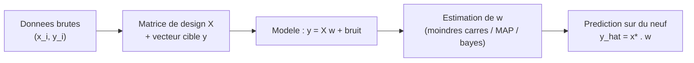
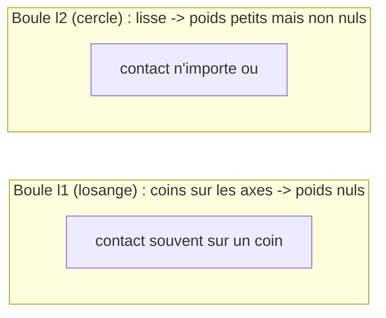
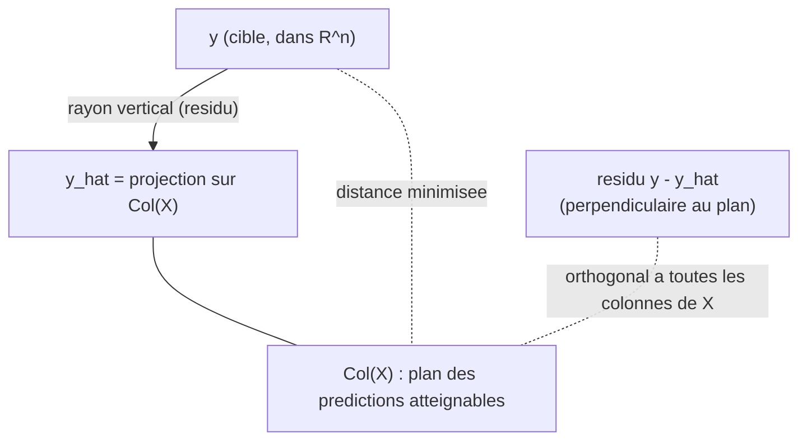
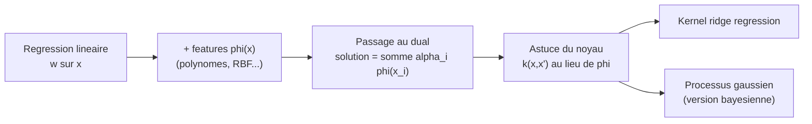

[← Sommaire](../README.md#table-des-matières)

# 9. Régression linéaire

### Formulation de la régression linéaire

La regression lineaire est le point de depart de presque tout l'apprentissage statistique. On cherche a predire une grandeur numerique (un prix, une temperature, une concentration) a partir d'une ou plusieurs grandeurs mesurees. L'hypothese centrale, d'une simplicite trompeuse, est que la grandeur a predire s'exprime comme une combinaison ponderee des grandeurs observees, plus un petit ecart inexplicable.

#### Le probleme et son vocabulaire

On dispose de $`n`$ observations. Pour chaque observation $`i`$, on connait un vecteur d'entree $`\mathbf{x}_i \in \mathbb{R}^d`$ (les *caracteristiques*, en anglais *features*) et une sortie scalaire $`y_i \in \mathbb{R}`$ (la *cible*, en anglais *target* ou *label*). On postule l'existence d'un vecteur de poids $`\mathbf{w}`$ tel que

```math
y_i \approx \mathbf{w}^\top \mathbf{x}_i .
```

> **Le symbole $`n`$ (nombre d'observations) et $`d`$ (nombre de caracteristiques).** $`n`$ est le nombre de *fiches* dont on dispose pour apprendre : si on etudie 200 appartements, $`n = 200`$. $`d`$ est le nombre de *renseignements* portes par chaque fiche : surface, nombre de pieces, etage donnent $`d = 3`$. Retenir : $`n`$ compte les lignes (les exemples), $`d`$ compte les colonnes (les caracteristiques).

> **Le symbole $`\mathbf{w}`$ (vecteur de poids, en anglais *weight vector*).** Ce symbole represente le *reglage* du modele : une liste de nombres, un par caracteristique. Imaginez une console de mixage avec un curseur par instrument. Chaque curseur $`w_j`$ dit « combien » la caracteristique $`j`$ compte dans la prediction. Un $`w_j`$ grand et positif : quand cette caracteristique monte, la prediction monte beaucoup. Un $`w_j`$ negatif : elle fait baisser la prediction. Un $`w_j`$ nul : on ignore cette caracteristique. Tout l'apprentissage consiste a tourner ces curseurs jusqu'a ce que la musique (les predictions) ressemble le plus possible a la realite (les vraies cibles $`y_i`$).

> **Le symbole $`\mathbf{x}_i`$ (vecteur d'entree de l'exemple $`i`$).** Ce symbole represente une *fiche signaletique* d'un objet qu'on observe. Si on veut predire le prix d'un appartement, $`\mathbf{x}_i`$ pourrait etre la liste $`(\text{surface}, \text{nombre de pieces}, \text{etage})`$. L'indice $`i`$ en bas dit « de quel appartement on parle » : $`\mathbf{x}_1`$ est le premier, $`\mathbf{x}_2`$ le deuxieme, etc. La fleche en gras rappelle que c'est une liste de nombres, pas un seul nombre. On note $`x_{ij}`$ la $`j`$-ieme coordonnee de $`\mathbf{x}_i`$ (la caracteristique $`j`$ de l'exemple $`i`$).

> **Le symbole $`y_i`$ (cible de l'exemple $`i`$).** C'est *la bonne reponse* qu'on cherche a retrouver : le vrai prix de l'appartement $`i`$. Pendant l'apprentissage on la connait (on apprend a partir d'exemples corriges) ; en production on ne la connait pas, et c'est elle qu'on veut deviner.

Le produit scalaire $`\mathbf{w}^\top \mathbf{x}_i = \sum_{j=1}^d w_j x_{ij}`$ realise exactement l'idee de « combinaison ponderee » : on multiplie chaque caracteristique par son curseur et on additionne.

#### Le terme constant (biais)

Une droite passant par l'origine est rarement suffisante : il faut pouvoir decaler la prediction d'une constante. On introduit donc un *biais* (en anglais *bias* ou *intercept*) note $`b`$:

```math
y_i \approx \mathbf{w}^\top \mathbf{x}_i + b .
```

> **Le symbole $`b`$ (biais).** C'est la valeur que predit le modele *quand toutes les caracteristiques sont nulles*: le « point de depart » de la prediction. Geometriquement, en dimension 1, $`b`$ est l'ordonnee a l'origine de la droite $`\hat y = w x + b`$ (la hauteur a laquelle elle coupe l'axe vertical). Sans lui, la droite serait forcee de passer par $`0`$, ce qui colle rarement aux donnees reelles.

> **Astuce de l'absorption du biais.** Plutot que de trainer $`b`$ separement, on ajoute a chaque $`\mathbf{x}_i`$ une coordonnee constante egale a $`1`$. Alors le poids associe a cette coordonnee *est* le biais : $`\mathbf{w}^\top \mathbf{x}_i + b = \tilde{\mathbf{w}}^\top \tilde{\mathbf{x}}_i`$ avec $`\tilde{\mathbf{x}}_i = (1, x_{i1}, \dots, x_{id})`$ et $`\tilde{\mathbf{w}} = (b, w_1, \dots, w_d)`$. Dans toute la suite on supposera, sauf mention contraire, que cette coordonnee constante est deja incluse ; on ecrira simplement $`\mathbf{w} \in \mathbb{R}^d`$ en gardant a l'esprit qu'une de ses composantes joue le role de biais.

#### Empilement : la matrice de design

Travailler observation par observation est lourd. On empile les $`n`$ vecteurs d'entree en lignes d'une grande matrice, et les $`n`$ cibles en un vecteur.

> **Le symbole $`\mathbf{X}`$ (matrice de design, en anglais *design matrix*).** Ce symbole represente le *grand tableau* de toutes nos donnees d'entree. Pensez a un tableur : une ligne par exemple (un appartement par ligne), une colonne par caracteristique (une colonne « surface », une colonne « nb pieces »…). La case a la ligne $`i`$ et la colonne $`j`$ vaut $`X_{ij} = x_{ij}`$, c'est-a-dire la caracteristique $`j`$ de l'exemple $`i`$. C'est juste un rangement bien ordonne de nos fiches signaletiques, les unes sous les autres.

Formellement, $`\mathbf{X} \in \mathbb{R}^{n \times d}`$ et $`\mathbf{y} \in \mathbb{R}^n`$:

```math
\mathbf{X} =
\begin{pmatrix}
\text{---} & \mathbf{x}_1^\top & \text{---} \\
\text{---} & \mathbf{x}_2^\top & \text{---} \\
& \vdots & \\
\text{---} & \mathbf{x}_n^\top & \text{---}
\end{pmatrix}
=
\begin{pmatrix}
x_{11} & x_{12} & \cdots & x_{1d} \\
x_{21} & x_{22} & \cdots & x_{2d} \\
\vdots & \vdots & \ddots & \vdots \\
x_{n1} & x_{n2} & \cdots & x_{nd}
\end{pmatrix},
\qquad
\mathbf{y} =
\begin{pmatrix} y_1 \\ y_2 \\ \vdots \\ y_n \end{pmatrix}.
```

Le vecteur des $`n`$ predictions du modele s'ecrit alors d'un seul coup, par un produit matrice-vecteur :

```math
\hat{\mathbf{y}} = \mathbf{X}\mathbf{w}, \qquad \hat{y}_i = \mathbf{x}_i^\top \mathbf{w} .
```

> **Le symbole $`\hat{\mathbf{y}}`$ (prediction).** Le petit chapeau « ^ » sur une lettre signifie partout en statistique : « ceci est une *estimation*, une valeur devinee par le modele, pas la verite ». Donc $`\hat{y}_i`$ est *ce que le modele predit* pour l'exemple $`i`$, a distinguer de $`y_i`$ qui est la vraie valeur. La difference $`y_i - \hat{y}_i`$ est l'erreur de prediction (le *residu*).

> **Verification des dimensions.** $`\mathbf{X}`$ est $`n \times d`$, $`\mathbf{w}`$ est $`d \times 1`$: le produit $`\mathbf{X}\mathbf{w}`$ est donc $`n \times 1`$, soit bien un vecteur de $`n`$ predictions, une par observation. Verifier que les tailles « s'emboitent » (la dimension de droite de la premiere matrice egale celle de gauche de la seconde) est le reflexe le plus rentable pour ne jamais se tromper d'ecriture.

#### Le bruit : pourquoi un signe « approximativement »

Aucune relation reelle n'est parfaitement lineaire ni parfaitement mesuree. On modelise explicitement l'ecart entre la vraie cible et la partie lineaire par un terme aleatoire.

> **Le symbole $`\varepsilon`$ (bruit, en anglais *noise*).** La lettre grecque epsilon represente ici *tout ce qu'on ne controle pas*: erreurs de mesure de l'appareil, facteurs qu'on n'a pas mis dans les caracteristiques, hasard pur. Imaginez que vous pesez un sac de pommes : la balance affiche presque le bon poids, mais tremblote un peu a cause d'un courant d'air. Ce petit tremblotement, imprevisible, c'est $`\varepsilon`$. On le suppose en general « centre » (en moyenne nul, il ne triche pas systematiquement dans un sens) et « petit ».

Le *modele generatif* (la fiction probabiliste qui dit comment les donnees naissent) s'ecrit, pour chaque observation :

```math
y_i = \mathbf{w}_\star^\top \mathbf{x}_i + \varepsilon_i, \qquad \varepsilon_i \sim \mathcal{N}(0, \sigma^2),
```

ou $`\mathbf{w}_\star`$ est le « vrai » vecteur de poids (inconnu, celui de la nature) et les $`\varepsilon_i`$ sont des tirages independants d'une loi normale centree de variance $`\sigma^2`$.

> **Le symbole $`\mathbf{w}_\star`$ (le vrai vecteur de poids).** L'etoile en indice marque la valeur *ideale*, celle qui regit reellement la nature mais qu'on ne connait pas. Tout le travail d'estimation consiste a en produire une approximation $`\hat{\mathbf{w}}`$ a partir des donnees. On distingue donc trois objets : $`\mathbf{w}_\star`$ (la verite, inaccessible), $`\hat{\mathbf{w}}`$ (notre estimation, calculee), et $`\mathbf{w}`$ (la variable libre sur laquelle on optimise).

> **Le symbole $`\sigma^2`$ (variance du bruit).** $`\sigma^2`$ mesure *l'ampleur* du tremblotement : un petit $`\sigma^2`$ signifie des mesures tres fiables (les points serres autour de la droite), un grand $`\sigma^2`$ des mesures dispersees. $`\sigma`$ (sans le carre) est l'ecart-type, exprime dans la meme unite que $`y`$; $`\sigma^2`$ est son carre. Rappel : la loi normale $`\mathcal{N}(0, \sigma^2)`$ est la fameuse « courbe en cloche » centree sur $`0`$ et d'autant plus large que $`\sigma^2`$ est grand.

En notation vectorielle :

```math
\mathbf{y} = \mathbf{X}\mathbf{w}_\star + \boldsymbol{\varepsilon}, \qquad \boldsymbol{\varepsilon} \sim \mathcal{N}(\mathbf{0}, \sigma^2 \mathbf{I}_n).
```

> **Le symbole $`\mathbf{I}_n`$ (matrice identite) et la loi normale multivariee.** $`\mathbf{I}_n`$ est la matrice $`n \times n`$ avec des $`1`$ sur la diagonale et des $`0`$ partout ailleurs ; elle joue, pour la multiplication des matrices, le role du nombre $`1`$ ($`\mathbf{I}_n \mathbf{v} = \mathbf{v}`$). Ecrire $`\boldsymbol{\varepsilon} \sim \mathcal{N}(\mathbf{0}, \sigma^2 \mathbf{I}_n)`$ veut dire : un *vecteur* de $`n`$ bruits, tous centres, tous de meme variance $`\sigma^2`$ (les $`\sigma^2`$ sur la diagonale) et *deux a deux non correles* (les $`0`$ hors diagonale, qui sont les covariances). C'est la version « en bloc » des $`n`$ tirages independants $`\varepsilon_i \sim \mathcal{N}(0, \sigma^2)`$.

> **Definition (modele de regression lineaire gaussien).** On observe $`(\mathbf{X}, \mathbf{y})`$. On suppose que $`\mathbf{y} = \mathbf{X}\mathbf{w}_\star + \boldsymbol{\varepsilon}`$ avec $`\boldsymbol{\varepsilon}`$ un vecteur gaussien de moyenne nulle et de matrice de covariance $`\sigma^2 \mathbf{I}_n`$ (bruit *homoscedastique*, meme variance partout, et *non correle*, chaque erreur independante des autres). L'inconnue est $`\mathbf{w}_\star \in \mathbb{R}^d`$ (et eventuellement $`\sigma^2`$).

> **Remarque, « lineaire » en quoi ?** Le modele est lineaire *en les parametres* $`\mathbf{w}`$, pas necessairement en les variables physiques. On verra dans la derniere section qu'en remplacant $`\mathbf{x}`$ par des transformations $`\boldsymbol{\phi}(\mathbf{x})`$ (carres, produits, sinus…), on capture des relations tres courbes tout en restant dans le cadre « lineaire en $`\mathbf{w}`$ », donc soluble par les memes formules. C'est la grande force, et la raison pour laquelle ce chapitre infuse tout le reste de l'apprentissage.

#### Schema d'ensemble



> **Exemple chiffre minimal.** Trois maisons, une seule caracteristique (surface en dizaines de m²) plus le biais. Donnees : $`(x, y) = (5, 12), (8, 18), (10, 21)`$ (prix en dizaines de milliers d'euros). Avec biais absorbe, $`\mathbf{x}_1 = (1,5)`$, $`\mathbf{x}_2 = (1,8)`$, $`\mathbf{x}_3 = (1,10)`$. Si on devine $`\mathbf{w} = (b, a) = (2,\ 1{,}9)`$, alors $`\hat y_1 = 2 + 1{,}9 \times 5 = 11{,}5`$, $`\hat y_2 = 2 + 1{,}9 \times 8 = 17{,}2`$, $`\hat y_3 = 2 + 1{,}9 \times 10 = 21`$. Les residus $`y_i - \hat y_i`$ sont $`0{,}5,\ 0{,}8,\ 0`$. La section suivante explique comment trouver *le meilleur* $`\mathbf{w}`$ automatiquement plutot qu'a la main.

```python
import numpy as np

X = np.array([[1.0, 5.0],
              [1.0, 8.0],
              [1.0, 10.0]])
y = np.array([12.0, 18.0, 21.0])

w_guess = np.array([2.0, 1.9])
y_hat = X @ w_guess
residus = y - y_hat
print("predictions :", y_hat)        # [11.5 17.2 21. ]
print("residus     :", residus)      # [ 0.5  0.8  0. ]
```

---

### Estimation des paramètres et moindres carrés

On cherche le $`\mathbf{w}`$ qui rend les predictions $`\mathbf{X}\mathbf{w}`$ aussi proches que possible des cibles $`\mathbf{y}`$. Reste a definir « proche ». Le choix historique, geometriquement et statistiquement justifie, est la somme des carres des erreurs.

#### La fonction de cout des moindres carres

> **Intuition.** Pour chaque exemple, on regarde de combien on se trompe : $`r_i = y_i - \mathbf{x}_i^\top \mathbf{w}`$. On pourrait additionner les valeurs absolues $`|r_i|`$, mais elles ont un coin (non derivable en 0) et tolerent mal les grosses erreurs. On prefere additionner les *carres* $`r_i^2`$: une erreur deux fois plus grande coute quatre fois plus cher, ce qui pousse fort a corriger les gros ecarts, et le carre est une jolie parabole lisse, derivable partout.

On definit le cout (en anglais *loss* ou *objective*)

```math
J(\mathbf{w}) = \frac{1}{2}\sum_{i=1}^{n} \bigl(y_i - \mathbf{x}_i^\top \mathbf{w}\bigr)^2 = \frac{1}{2}\,\lVert \mathbf{y} - \mathbf{X}\mathbf{w}\rVert_2^2 .
```

> **Le symbole $`J(\mathbf{w})`$ (fonction de cout).** $`J`$ est un *score de mecontentement*: un seul nombre qui dit a quel point le reglage $`\mathbf{w}`$ se trompe sur l'ensemble des donnees. Plus $`J`$ est petit, meilleur est le modele. C'est une fonction de $`\mathbf{w}`$ (les donnees $`\mathbf{X}, \mathbf{y}`$ sont fixees) : on cherchera le creux de cette fonction.

> **Le symbole $`\sum`$ (somme), rappel d'usage.** Le grand sigma est une *boucle qui additionne*: $`\sum_{i=1}^n a_i = a_1 + a_2 + \dots + a_n`$. Ici il fait la somme des carres d'erreur sur tous les exemples, de l'exemple $`1`$ a l'exemple $`n`$.

> **Le symbole $`\lVert \cdot \rVert_2`$ (norme euclidienne), rappel d'usage.** La norme d'un vecteur, c'est sa *longueur* (theoreme de Pythagore en dimension quelconque) : $`\lVert \mathbf{r}\rVert_2 = \sqrt{\sum_i r_i^2}`$. Donc $`\lVert \mathbf{y} - \mathbf{X}\mathbf{w}\rVert_2^2`$ est exactement la somme des carres des erreurs : minimiser le cout, c'est rendre le vecteur d'erreurs *le plus court possible*.

Le facteur $`\tfrac12`$ ne change pas l'argument du minimum ; il sert juste a simplifier la derivee (le $`2`$ du carre s'annulera). On appelle *estimateur des moindres carres ordinaires* (en anglais *ordinary least squares*, OLS) tout

```math
\hat{\mathbf{w}} \in \arg\min_{\mathbf{w} \in \mathbb{R}^d} J(\mathbf{w}).
```

> **Le symbole $`\arg\min`$, rappel d'usage.** $`\min_{\mathbf{w}} J(\mathbf{w})`$ est la *plus petite valeur* atteinte par le cout ; $`\arg\min_{\mathbf{w}} J(\mathbf{w})`$ est *l'endroit* (le $`\mathbf{w}`$) ou ce minimum est atteint. On veut le point, pas la valeur : d'ou $`\arg\min`$. Le symbole $`\in`$ (et non $`=`$) rappelle que ce point pourrait ne pas etre unique.

#### Les equations normales

Le cout $`J`$ est une fonction quadratique convexe de $`\mathbf{w}`$; son minimum s'obtient en annulant le gradient.

> **Le symbole $`\nabla`$ (nabla, le gradient), rappel d'usage.** Le triangle pointe en bas represente la *pente dans chaque direction* a la fois : $`\nabla_{\mathbf{w}} J`$ est le vecteur dont la composante $`j`$ est $`\partial J / \partial w_j`$, la sensibilite du cout quand on bouge le curseur $`j`$. Au sommet ou au fond d'une vallee, la pente est nulle dans toutes les directions : c'est pour cela qu'on cherche $`\nabla J = \mathbf{0}`$.

Developpons. En posant $`\mathbf{r} = \mathbf{y} - \mathbf{X}\mathbf{w}`$,

```math
J(\mathbf{w}) = \tfrac12 (\mathbf{y} - \mathbf{X}\mathbf{w})^\top (\mathbf{y} - \mathbf{X}\mathbf{w}) = \tfrac12\left( \mathbf{y}^\top\mathbf{y} - 2\,\mathbf{w}^\top \mathbf{X}^\top \mathbf{y} + \mathbf{w}^\top \mathbf{X}^\top \mathbf{X}\, \mathbf{w}\right).
```

> **Detail du developpement.** En distribuant, $`(\mathbf{y} - \mathbf{X}\mathbf{w})^\top (\mathbf{y} - \mathbf{X}\mathbf{w}) = \mathbf{y}^\top\mathbf{y} - \mathbf{y}^\top\mathbf{X}\mathbf{w} - \mathbf{w}^\top\mathbf{X}^\top\mathbf{y} + \mathbf{w}^\top\mathbf{X}^\top\mathbf{X}\mathbf{w}`$. Les deux termes croises sont des scalaires *egaux* (l'un est la transposee de l'autre, et la transposee d'un scalaire est lui-meme : $`\mathbf{y}^\top\mathbf{X}\mathbf{w} = (\mathbf{y}^\top\mathbf{X}\mathbf{w})^\top = \mathbf{w}^\top\mathbf{X}^\top\mathbf{y}`$), d'ou le facteur $`-2`$.

En derivant par rapport a $`\mathbf{w}`$ (regles : $`\nabla_{\mathbf{w}}(\mathbf{a}^\top\mathbf{w}) = \mathbf{a}`$ et $`\nabla_{\mathbf{w}}(\mathbf{w}^\top \mathbf{A}\mathbf{w}) = (\mathbf{A}+\mathbf{A}^\top)\mathbf{w} = 2\mathbf{A}\mathbf{w}`$ pour $`\mathbf{A}`$ symetrique) :

```math
\nabla_{\mathbf{w}} J(\mathbf{w}) = -\mathbf{X}^\top \mathbf{y} + \mathbf{X}^\top \mathbf{X}\, \mathbf{w} = -\mathbf{X}^\top(\mathbf{y} - \mathbf{X}\mathbf{w}).
```

Annuler ce gradient donne les **equations normales**:

```math
\boxed{\ \mathbf{X}^\top \mathbf{X}\, \hat{\mathbf{w}} = \mathbf{X}^\top \mathbf{y}\ }
```

> **Theoreme (existence, unicite, solution OLS).** Le cout $`J`$ est convexe (sa hessienne $`\mathbf{X}^\top\mathbf{X}`$ est semi-definie positive). Tout minimiseur verifie les equations normales. Si $`\mathbf{X}`$ est de rang plein en colonnes ($`\mathrm{rang}\mathbf{X} = d`$, ce qui exige $`n \ge d`$ et des colonnes lineairement independantes), alors $`\mathbf{X}^\top\mathbf{X}`$ est inversible et le minimiseur est **unique**:
> ```math
> \hat{\mathbf{w}} = (\mathbf{X}^\top \mathbf{X})^{-1}\mathbf{X}^\top \mathbf{y}.
> ```

> **Le symbole $`\nabla^2 J`$ (hessienne), rappel d'usage.** La hessienne est la matrice des derivees secondes : sa case $`(j,k)`$ vaut $`\partial^2 J / \partial w_j \partial w_k`$. Elle decrit la *courbure* du cout. Pour une fonction d'une variable, le signe de la derivee seconde dit si l'on est dans un creux (positif) ou sur une bosse ; en plusieurs variables, le role est tenu par le caractere defini positif de la hessienne.

> **Le symbole $`\mathrm{rang}\mathbf{X}`$ (rang), rappel d'usage.** Le rang est le nombre de colonnes *vraiment independantes* (non redondantes) de $`\mathbf{X}`$: le nombre de directions reellement distinctes que portent les caracteristiques. Si deux colonnes sont identiques ou proportionnelles (ex. une surface en m² et la meme en cm²), elles n'apportent qu'une seule direction : le rang chute, et $`\mathbf{X}^\top\mathbf{X}`$ devient non inversible.

*Demonstration.* La hessienne de $`J`$ est $`\nabla^2 J = \mathbf{X}^\top\mathbf{X}`$. Pour tout $`\mathbf{v}`$, $`\mathbf{v}^\top \mathbf{X}^\top\mathbf{X}\mathbf{v} = \lVert \mathbf{X}\mathbf{v}\rVert_2^2 \ge 0`$, donc $`J`$ est convexe et un point critique est un minimum global. Si $`\mathrm{rang}\mathbf{X}=d`$, alors $`\mathbf{X}\mathbf{v}=\mathbf{0} \Rightarrow \mathbf{v}=\mathbf{0}`$, donc $`\mathbf{v}^\top\mathbf{X}^\top\mathbf{X}\mathbf{v}>0`$ pour $`\mathbf{v}\neq\mathbf0`$: $`\mathbf{X}^\top\mathbf{X}`$ est definie positive, donc inversible, d'ou l'unicite et la formule. $`\blacksquare`$

> **Le symbole $`\mathbf{X}^\top \mathbf{X}`$ (matrice de Gram / de covariance non normalisee).** Ce produit, de taille $`d \times d`$, contient *tous les produits scalaires entre colonnes*: sa case $`(j,k)`$ vaut $`\sum_i x_{ij}x_{ik}`$, c'est-a-dire « a quel point la caracteristique $`j`$ et la caracteristique $`k`$ varient ensemble ». C'est le coeur de calcul de la regression : tout se joue dans cette petite matrice carree, meme si on a des millions de lignes.

#### Exemple chiffre deroule pas a pas

Reprenons les trois maisons : $`\mathbf{X}=\begin{pmatrix}1&5\\1&8\\1&10\end{pmatrix}`$, $`\mathbf{y}=(12,18,21)`$.

Etape 1, Gram :
```math
\mathbf{X}^\top\mathbf{X}=\begin{pmatrix}3 & 23\\ 23 & 189\end{pmatrix},\qquad
\mathbf{X}^\top\mathbf{y}=\begin{pmatrix}51\\ 414\end{pmatrix}.
```
(Verification : $`1+1+1=3`$; $`5+8+10=23`$; $`25+64+100=189`$; $`12+18+21=51`$; $`5\cdot12+8\cdot18+10\cdot21=60+144+210=414`$.)

Etape 2, inverse. Determinant $`= 3\cdot189 - 23^2 = 567-529 = 38`$.

> **Le symbole $`\det`$ et l'inverse $`2 \times 2`$, rappel d'usage.** Le determinant d'une matrice $`\begin{psmallmatrix}a&b\\c&d\end{psmallmatrix}`$ vaut $`ad - bc`$; il est nul exactement quand la matrice n'est pas inversible (colonnes redondantes). Quand il ne l'est pas, l'inverse se calcule par la recette $`\begin{psmallmatrix}a&b\\c&d\end{psmallmatrix}^{-1} = \tfrac{1}{ad-bc}\begin{psmallmatrix}d&-b\\-c&a\end{psmallmatrix}`$ (on echange la diagonale, on change le signe de l'antidiagonale, on divise par le determinant).

```math
(\mathbf{X}^\top\mathbf{X})^{-1}=\frac{1}{38}\begin{pmatrix}189 & -23\\ -23 & 3\end{pmatrix}.
```

Etape 3, solution :
```math
\hat{\mathbf{w}}=\frac{1}{38}\begin{pmatrix}189 & -23\\ -23 & 3\end{pmatrix}\begin{pmatrix}51\\414\end{pmatrix}
=\frac{1}{38}\begin{pmatrix}189\cdot51-23\cdot414\\ -23\cdot51+3\cdot414\end{pmatrix}
=\frac{1}{38}\begin{pmatrix}9639-9522\\ -1173+1242\end{pmatrix}
=\frac{1}{38}\begin{pmatrix}117\\69\end{pmatrix}.
```
Donc $`\hat b = 117/38 \approx 3{,}079`$ et $`\hat a = 69/38 \approx 1{,}816`$. La droite ajustee est $`\hat y \approx 3{,}08 + 1{,}82\,x`$. Predictions : $`\hat y_1\approx 12{,}16`$, $`\hat y_2\approx 17{,}61`$, $`\hat y_3\approx 21{,}24`$; residus $`\approx -0{,}16,\ 0{,}39,\ -0{,}24`$, bien plus petits (et de somme nulle) que notre devinette manuelle.

```python
import numpy as np

X = np.array([[1.,5.],[1.,8.],[1.,10.]])
y = np.array([12.,18.,21.])

XtX = X.T @ X
Xty = X.T @ y
w_hat = np.linalg.solve(XtX, Xty)     # ne jamais inverser explicitement
print(w_hat)                          # [3.07894737 1.81578947]
print("residus :", y - X @ w_hat)     # somme ~ 0
```

> **Piege numerique (important).** N'ecrivez **jamais** `np.linalg.inv(XtX) @ Xty`. Former $`\mathbf{X}^\top\mathbf{X}`$ *carre* le conditionnement (en anglais *condition number*) : si $`\mathbf{X}`$ est deja un peu mal conditionnee, $`\mathbf{X}^\top\mathbf{X}`$ l'est catastrophiquement, et l'inversion explicite amplifie les erreurs d'arrondi. Utilisez un solveur (`np.linalg.solve`), une factorisation de Cholesky de $`\mathbf{X}^\top\mathbf{X}`$, ou mieux une decomposition QR / SVD de $`\mathbf{X}`$ directement (voir plus bas).

#### La solution par QR (numeriquement stable)

> **Le symbole de la decomposition QR, rappel d'usage.** Factoriser $`\mathbf{X} = \mathbf{Q}\mathbf{R}`$, c'est reecrire les colonnes de $`\mathbf{X}`$ dans une base *orthonormee* (des directions perpendiculaires de longueur 1, rangees dans $`\mathbf{Q}`$) tout en gardant trace du changement de base (dans la triangulaire $`\mathbf{R}`$). « Orthonorme » garantit $`\mathbf{Q}^\top\mathbf{Q} = \mathbf{I}`$, ce qui simplifie radicalement les calculs et evite l'amplification des erreurs d'arrondi.

Si $`\mathbf{X}=\mathbf{Q}\mathbf{R}`$ avec $`\mathbf{Q}\in\mathbb{R}^{n\times d}`$ a colonnes orthonormees ($`\mathbf{Q}^\top\mathbf{Q}=\mathbf{I}_d`$) et $`\mathbf{R}\in\mathbb{R}^{d\times d}`$ triangulaire superieure inversible, alors $`\mathbf{X}^\top\mathbf{X}=\mathbf{R}^\top\mathbf{Q}^\top\mathbf{Q}\mathbf{R}=\mathbf{R}^\top\mathbf{R}`$ et les equations normales deviennent $`\mathbf{R}^\top\mathbf{R}\hat{\mathbf{w}}=\mathbf{R}^\top\mathbf{Q}^\top\mathbf{y}`$, soit, en simplifiant par $`\mathbf{R}^\top`$ inversible,

```math
\mathbf{R}\,\hat{\mathbf{w}} = \mathbf{Q}^\top \mathbf{y},
```

systeme triangulaire resolu par simple remontee, sans jamais former $`\mathbf{X}^\top\mathbf{X}`$. C'est ce que fait `np.linalg.lstsq` (via LAPACK).

#### Le cas sous-determine et la pseudo-inverse

Si $`\mathrm{rang}\mathbf{X}<d`$ (colonnes redondantes, ou plus de caracteristiques que d'exemples, $`d>n`$), les equations normales ont une *infinite* de solutions : on peut ajouter a $`\hat{\mathbf{w}}`$ n'importe quel vecteur du noyau de $`\mathbf{X}`$ sans changer $`\mathbf{X}\hat{\mathbf{w}}`$. On selectionne alors classiquement la solution de **norme minimale**, donnee par la pseudo-inverse de Moore-Penrose $`\mathbf{X}^+`$:

```math
\hat{\mathbf{w}}_{\min} = \mathbf{X}^+ \mathbf{y}.
```

> **Le symbole « noyau de $`\mathbf{X}`$ » et la pseudo-inverse $`\mathbf{X}^+`$.** Le *noyau* (en anglais *null space*) de $`\mathbf{X}`$ est l'ensemble des vecteurs $`\mathbf{v}`$ tels que $`\mathbf{X}\mathbf{v} = \mathbf{0}`$: des directions « invisibles » pour le modele, qu'on peut ajouter aux poids sans rien changer aux predictions. La *pseudo-inverse* $`\mathbf{X}^+`$ generalise l'inverse aux matrices non carrees ou non inversibles : quand $`\mathbf{X}^\top\mathbf{X}`$ est inversible elle redonne $`(\mathbf{X}^\top\mathbf{X})^{-1}\mathbf{X}^\top`$, et sinon elle selectionne, parmi l'infinite de solutions, celle de plus petite norme.

Via la SVD $`\mathbf{X}=\mathbf{U}\boldsymbol{\Sigma}\mathbf{V}^\top`$, on a $`\mathbf{X}^+=\mathbf{V}\boldsymbol{\Sigma}^+\mathbf{U}^\top`$ ou $`\boldsymbol{\Sigma}^+`$ remplace chaque valeur singuliere non nulle $`\sigma_k`$ par $`1/\sigma_k`$ (et laisse les zeros). C'est le pont direct vers la regularisation : faire tendre $`\lambda \to 0`$ dans la ridge redonne precisement cette solution de norme minimale.

> **Le symbole de la SVD, rappel d'usage.** La decomposition en valeurs singulieres $`\mathbf{X} = \mathbf{U}\boldsymbol{\Sigma}\mathbf{V}^\top`$ ecrit n'importe quelle matrice comme : une rotation ($`\mathbf{V}^\top`$), un etirement le long des axes (la diagonale $`\boldsymbol{\Sigma}`$ des *valeurs singulieres* $`\sigma_k \ge 0`$, qui mesurent « combien la matrice etire » dans chaque direction), puis une autre rotation ($`\mathbf{U}`$). Les directions de faible $`\sigma_k`$ sont celles que les donnees explorent peu, exactement celles que le bruit fait deraper.

#### Proprietes statistiques de l'estimateur OLS

Sous le modele gaussien $`\mathbf{y}=\mathbf{X}\mathbf{w}_\star+\boldsymbol{\varepsilon}`$, $`\boldsymbol{\varepsilon}\sim\mathcal N(\mathbf0,\sigma^2\mathbf I_n)`$, et $`\mathbf{X}`$ de rang plein deterministe :

> **Le symbole $`\mathbb{E}`$ (esperance) et $`\mathrm{Cov}`$ (covariance), rappel d'usage.** L'esperance $`\mathbb{E}[\cdot]`$ est la *moyenne theorique* sur tous les tirages possibles du bruit : ce qu'on obtiendrait en repetant l'experience une infinite de fois. La matrice de covariance $`\mathrm{Cov}(\hat{\mathbf{w}})`$ decrit la *dispersion* de l'estimateur autour de cette moyenne : sa diagonale donne la variance de chaque coefficient, ses cases hors diagonale disent si deux coefficients varient ensemble d'un tirage a l'autre.

- **Sans biais (en anglais *unbiased*).** $`\mathbb{E}[\hat{\mathbf{w}}] = \mathbf{w}_\star`$. En effet $`\hat{\mathbf{w}}=(\mathbf X^\top\mathbf X)^{-1}\mathbf X^\top\mathbf y=\mathbf w_\star+(\mathbf X^\top\mathbf X)^{-1}\mathbf X^\top\boldsymbol\varepsilon`$, et $`\mathbb E[\boldsymbol\varepsilon]=\mathbf0`$.
- **Covariance.** $`\mathrm{Cov}(\hat{\mathbf{w}}) = \sigma^2 (\mathbf{X}^\top\mathbf{X})^{-1}`$. Plus les donnees sont nombreuses et « etalees », plus $`\mathbf X^\top\mathbf X`$ est grande, plus la covariance est petite : l'estimation se resserre.
- **Loi exacte.** $`\hat{\mathbf{w}} \sim \mathcal N\bigl(\mathbf{w}_\star,\ \sigma^2(\mathbf{X}^\top\mathbf{X})^{-1}\bigr)`$ (combinaison lineaire de gaussiennes).
- **Theoreme de Gauss-Markov.** Parmi *tous* les estimateurs lineaires en $`\mathbf{y}`$ et sans biais, OLS a la plus petite variance (il est *BLUE*, en anglais *Best Linear Unbiased Estimator*). Remarquable : ce resultat ne suppose meme pas la normalite, seulement bruit centre, non correle, de variance constante.

> **Estimation de $`\sigma^2`$.** On l'estime sans biais par $`\hat\sigma^2=\dfrac{\lVert\mathbf y-\mathbf X\hat{\mathbf w}\rVert_2^2}{n-d}`$ (les $`d`$ parametres ajustes consomment $`d`$ degres de liberte ; diviser par $`n-d`$ et non $`n`$ corrige le biais).

#### Descente de gradient : quand la formule fermee ne passe pas

Pour $`d`$ tres grand (millions de caracteristiques) ou $`n`$ enorme, inverser ou factoriser devient impraticable. On minimise alors $`J`$ iterativement.

> **Intuition.** Imaginez une bille lachee sur le flanc d'une vallee. A chaque instant elle roule dans le sens de la plus forte descente, c'est-a-dire l'oppose du gradient. On reproduit cela : on part d'un $`\mathbf w`$ quelconque et on fait des petits pas $`-\eta\,\nabla J`$.

> **Le symbole $`\eta`$ (pas d'apprentissage, en anglais *learning rate*).** $`\eta`$ (la lettre grecque eta) est la *taille des pas* qu'on fait a chaque iteration. Trop petit : la bille avance a la vitesse d'un escargot, la convergence traine. Trop grand : elle saute par-dessus le fond de la vallee et peut diverger (osciller de plus en plus loin). Bien le regler est le premier reflexe pratique de l'optimisation.

La regle de mise a jour, avec pas $`\eta>0`$:

```math
\mathbf{w}^{(t+1)} = \mathbf{w}^{(t)} - \eta\,\nabla_{\mathbf w}J(\mathbf w^{(t)}) = \mathbf{w}^{(t)} + \eta\,\mathbf{X}^\top\bigl(\mathbf y - \mathbf X\mathbf w^{(t)}\bigr).
```

> **Le symbole $`\lambda_{\max}(\mathbf{X}^\top\mathbf{X})`$ (plus grande valeur propre), rappel d'usage.** Une *valeur propre* d'une matrice symetrique mesure de combien elle etire l'espace dans une direction privilegiee (le *vecteur propre* associe). $`\lambda_{\max}`$ est l'etirement maximal ; il fixe la courbure la plus raide du cout, donc la limite au-dela de laquelle un pas $`\eta`$ trop grand fait diverger la descente.

Comme $`J`$ est convexe et lisse, la descente de gradient converge vers le minimum global pour $`0<\eta<2/\lambda_{\max}(\mathbf X^\top\mathbf X)`$. En pratique sur grands jeux de donnees on utilise la version **stochastique** (en anglais *SGD*) : on estime le gradient sur un petit lot (en anglais *mini-batch*) d'exemples tires au hasard, bien moins couteux par pas.

```python
import numpy as np

def descente_gradient(X, y, eta=1e-2, n_iter=2000):
    n, d = X.shape
    w = np.zeros(d)
    for _ in range(n_iter):
        grad = -X.T @ (y - X @ w)      # gradient des moindres carres
        w = w - eta * grad
    return w
```

> **Mise a jour 2026.** Pour la regression lineaire *pure*, la formule fermee (QR/SVD) reste imbattable et doit etre preferee. Mais des que le modele est emboite dans un reseau profond, ce sont les optimiseurs adaptatifs **Adam / AdamW** qui dominent : ils ajustent un pas par coordonnee a partir d'estimees de moment, et **AdamW** decouple proprement la regularisation $`\ell_2`$ (le *weight decay*) du gradient, ce qui correspond exactement, on le verra, a la ridge. Tout cela s'appuie sur la **differentiation automatique** (autodiff) de JAX / PyTorch : on n'ecrit plus le gradient a la main, le framework le calcule exactement par retropropagation.

---

### Régularisation : ridge, lasso et estimation MAP

L'estimateur OLS souffre de deux maux lies : il **explose** quand $`\mathbf X^\top\mathbf X`$ est presque singuliere (caracteristiques correlees, *colinearite*) et il **surapprend** (en anglais *overfitting*) quand $`d`$ est grand devant $`n`$. Le remede : penaliser les poids trop gros. C'est la regularisation.

> **Intuition generale.** Un modele aux poids enormes est un funambule : il colle parfaitement aux points d'entrainement mais vacille au moindre point nouveau. La regularisation, c'est un filet de securite qui dit « reste raisonnable » : on accepte un peu plus d'erreur sur l'entrainement en echange de poids plus petits, donc d'un modele plus stable et qui generalise mieux.

#### Le parametre de regularisation

> **Le symbole $`\lambda`$ (parametre de regularisation, en anglais *regularization strength*).** Cette lettre grecque (lambda) represente le *bouton de severite* du filet de securite. A $`\lambda=0`$, aucun filet : on retombe sur OLS, libre d'utiliser des poids gigantesques. Quand $`\lambda`$ augmente, on serre la vis : le modele est de plus en plus contraint a garder des poids petits, quitte a moins bien coller aux donnees. A $`\lambda\to\infty`$, tous les poids sont ecrases vers zero. Choisir $`\lambda`$, c'est doser le compromis entre « bien coller » et « rester sage », un compromis biais-variance qu'on regle par validation croisee.

#### Regression ridge ($`\ell_2`$)

On ajoute au cout une penalite proportionnelle au carre de la norme des poids.

```math
J_{\text{ridge}}(\mathbf w)=\tfrac12\lVert\mathbf y-\mathbf X\mathbf w\rVert_2^2+\tfrac{\lambda}{2}\lVert\mathbf w\rVert_2^2 .
```

Le gradient s'annule en $`-\mathbf X^\top(\mathbf y-\mathbf X\mathbf w)+\lambda\mathbf w=\mathbf 0`$, d'ou les **equations normales regularisees**:

```math
(\mathbf X^\top\mathbf X+\lambda\mathbf I_d)\,\hat{\mathbf w}_{\text{ridge}}=\mathbf X^\top\mathbf y
\quad\Longrightarrow\quad
\hat{\mathbf w}_{\text{ridge}}=(\mathbf X^\top\mathbf X+\lambda\mathbf I_d)^{-1}\mathbf X^\top\mathbf y .
```

> **Pourquoi ca repare tout.** La matrice $`\mathbf X^\top\mathbf X+\lambda\mathbf I_d`$ est **toujours inversible** pour $`\lambda>0`$, meme si $`\mathbf X^\top\mathbf X`$ est singuliere : on ajoute $`\lambda`$ a chacune de ses valeurs propres, qui passent toutes strictement au-dessus de zero. La solution existe et est unique meme quand $`d>n`$. Le terme $`\lambda\mathbf I_d`$ « remonte la diagonale », d'ou le nom historique de *ridge* (la crete).

> **Lecture par la SVD (effet de retrecissement, en anglais *shrinkage*).** Avec $`\mathbf X=\mathbf U\boldsymbol\Sigma\mathbf V^\top`$, OLS donne des coefficients $`\propto 1/\sigma_k`$ sur chaque direction propre $`\mathbf v_k`$, ce qui explose quand $`\sigma_k`$ est minuscule. La ridge remplace le facteur $`1/\sigma_k`$ par $`\sigma_k/(\sigma_k^2+\lambda)`$: les directions a grande variance ($`\sigma_k`$ grand) sont quasi intactes, mais les directions a faible variance (les plus bruitees) sont **fortement attenuees**. La ridge degonfle selectivement le bruit. C'est aussi le lien avec l'ACP : on amortit les composantes de petite variance.

```math
\hat{\mathbf w}_{\text{ridge}}=\sum_{k=1}^{d}\frac{\sigma_k}{\sigma_k^2+\lambda}\,(\mathbf u_k^\top\mathbf y)\,\mathbf v_k .
```

> **Exemple chiffre (la colinearite domptee).** Soit deux caracteristiques presque identiques : $`\mathbf X=\begin{pmatrix}1&1\\1&1{,}001\\1&0{,}999\end{pmatrix}`$, $`\mathbf y=(2,2,2)`$. Ici $`\mathbf X^\top\mathbf X`$ est quasi singuliere (determinant $`\approx 4\times10^{-6}`$) : OLS produit des poids enormes et opposes (par exemple $`w_1\approx 10^3, w_2\approx-10^3`$) tres sensibles au bruit. Avec $`\lambda=0{,}1`$, $`(\mathbf X^\top\mathbf X+0{,}1\,\mathbf I)`$ est bien conditionnee et $`\hat{\mathbf w}_{\text{ridge}}\approx(0{,}98,\ 0{,}98)`$: des poids petits, stables, qui se partagent equitablement l'effet des deux colonnes jumelles.

```python
import numpy as np
def ridge(X, y, lam):
    d = X.shape[1]
    return np.linalg.solve(X.T @ X + lam*np.eye(d), X.T @ y)
```

> **Note pratique, ne pas penaliser le biais, standardiser les colonnes.** Le terme constant ne devrait pas etre retreci (sinon les predictions sont decentrees) : on l'exclut de la penalite (matrice $`\mathbf I`$ avec un $`0`$ sur la composante du biais). De plus, la penalite $`\ell_2`$ depend de l'echelle des caracteristiques ; on **standardise** (moyenne 0, variance 1) chaque colonne avant d'appliquer la ridge, pour que $`\lambda`$ agisse equitablement.

#### Regression lasso ($`\ell_1`$)

On remplace le carre de la norme par la norme $`\ell_1`$ (somme des valeurs absolues).

> **Le symbole $`\lVert\mathbf w\rVert_1`$ (norme $`\ell_1`$).** C'est la *distance a pied dans une ville en damier* (distance de Manhattan) : $`\lVert\mathbf w\rVert_1=\sum_j|w_j|`$. Au lieu de la longueur a vol d'oiseau (norme $`\ell_2`$), on additionne les deplacements le long de chaque rue. Ce detail geometrique a une consequence spectaculaire : la lasso met des poids *exactement* a zero.

```math
J_{\text{lasso}}(\mathbf w)=\tfrac12\lVert\mathbf y-\mathbf X\mathbf w\rVert_2^2+\lambda\lVert\mathbf w\rVert_1 .
```

> **Pourquoi le lasso selectionne des variables (en anglais *sparsity*).** La boule $`\ell_1`$ $`\{\,\lVert\mathbf w\rVert_1\le t\,\}`$ est un losange (un *octaedre* en dimension superieure) : elle a des *coins* pointus situes sur les axes. Quand les lignes de niveau elliptiques du cout viennent toucher cette boule, le contact se fait tres souvent *sur un coin*, c'est-a-dire en un point ou certaines coordonnees sont nulles. La boule $`\ell_2`$, parfaitement ronde, n'a pas de coin : elle retrecit les poids mais ne les annule jamais. Resultat : la lasso fait d'une pierre deux coups, elle regularise *et* selectionne automatiquement un sous-ensemble de caracteristiques.



Il n'existe pas de formule fermee generale ($`|\cdot|`$ n'est pas derivable en 0). On resout par des methodes adaptees : descente par coordonnees (en anglais *coordinate descent*, le standard de scikit-learn), ou gradient proximal (ISTA/FISTA). Le coeur de ces methodes est l'**operateur de seuillage doux** (en anglais *soft-thresholding*), solution du sous-probleme scalaire $`\min_w \tfrac12(w-z)^2+\lambda|w|`$:

```math
S_\lambda(z)=\mathrm{sign}(z)\,\max(|z|-\lambda,\ 0)=
\begin{cases} z-\lambda & z>\lambda\\ 0 & |z|\le\lambda\\ z+\lambda & z<-\lambda\end{cases}.
```

> **Lecture imagee du seuillage doux.** On « rabote » chaque coefficient de $`\lambda`$ vers zero, et tout ce qui etait deja plus petit que $`\lambda`$ en valeur absolue tombe net a zero. C'est le mecanisme exact qui cree la parcimonie.

| Critere | Ridge ($`\ell_2`$) | Lasso ($`\ell_1`$) |
|---|---|---|
| Penalite | $`\tfrac\lambda2\sum_j w_j^2`$ | $`\lambda\sum_j \vert w_j\vert `$ |
| Solution | fermee, $`(\mathbf X^\top\mathbf X+\lambda\mathbf I)^{-1}\mathbf X^\top\mathbf y`$ | iterative (coordonnees, proximal) |
| Effet sur les poids | retrecit tous (jamais 0) | annule certains (parcimonie) |
| Selection de variables | non | oui |
| Caracteristiques correlees | les garde toutes, partage le poids | en choisit une, ignore les autres |
| Geometrie de la boule | sphere (lisse) | losange (coins) |

> **Mise a jour 2026.** Entre les deux extremes, l'**elastic net** $`\lambda\bigl(\alpha\lVert\mathbf w\rVert_1+\tfrac{1-\alpha}2\lVert\mathbf w\rVert_2^2\bigr)`$ combine parcimonie et stabilite, et gere mieux les groupes de variables correlees (la lasso seule en choisit une au hasard). C'est le choix par defaut robuste sur donnees reelles a beaucoup de caracteristiques.

#### Le pont decisif : regularisation = estimation MAP

Voici l'un des resultats les plus eclairants du chapitre. On reprend le modele bayesien : on met une *loi a priori* (en anglais *prior*) sur les poids et on cherche le mode de la loi a posteriori (estimation *maximum a posteriori*, MAP, vue au chapitre 8).

> **Le symbole $`p(\mathbf w \mid \mathbf y)`$ (loi a posteriori), rappel d'usage.** La barre verticale $`\mid`$ se lit « sachant » : $`p(\mathbf w \mid \mathbf y)`$ est la credibilite des poids $`\mathbf w`$ *une fois les donnees $`\mathbf y`$ observees*. Le theoreme de Bayes la relie a la *vraisemblance* $`p(\mathbf y \mid \mathbf w)`$ (a quel point ces poids expliquent les donnees) et a la *loi a priori* $`p(\mathbf w)`$ (ce qu'on croyait des poids avant de voir quoi que ce soit). Le *mode* de cette loi a posteriori (son sommet) est l'estimateur MAP.

Le theoreme de Bayes donne $`p(\mathbf w\mid\mathbf y)\propto p(\mathbf y\mid\mathbf w)\,p(\mathbf w)`$. En prenant le logarithme negatif :

```math
-\log p(\mathbf w\mid\mathbf y)=\underbrace{-\log p(\mathbf y\mid\mathbf w)}_{\text{attache aux donnees}}\ \underbrace{-\log p(\mathbf w)}_{\text{penalite}}+\text{const}.
```

> **Le symbole $`\propto`$ (proportionnel a), rappel d'usage.** $`a \propto b`$ signifie « $`a`$ egale $`b`$ a une constante multiplicative pres ». Ici la constante manquante (le denominateur de Bayes, $`p(\mathbf y)`$) ne depend pas de $`\mathbf w`$: elle ne deplace donc ni le sommet ni l'argmin, et on peut l'ignorer pour chercher le mode. Apres passage au $`-\log`$, cette constante multiplicative devient une constante *additive*, notee « const ».

La vraisemblance gaussienne $`p(\mathbf y\mid\mathbf w)=\mathcal N(\mathbf X\mathbf w,\sigma^2\mathbf I)`$ donne $`-\log p(\mathbf y\mid\mathbf w)=\tfrac{1}{2\sigma^2}\lVert\mathbf y-\mathbf X\mathbf w\rVert_2^2+\text{const}`$, exactement le terme des moindres carres (au facteur $`1/\sigma^2`$ pres). Le prior fixe la penalite :

| Loi a priori sur $`\mathbf w`$ | Terme $`-\log p(\mathbf w)`$ | Estimation MAP obtenue |
|---|---|---|
| Gaussienne $`\mathcal N(\mathbf 0,\ \tau^2\mathbf I)`$ | $`\tfrac{1}{2\tau^2}\lVert\mathbf w\rVert_2^2 + \text{const}`$ | **ridge** avec $`\lambda=\sigma^2/\tau^2`$ |
| Laplace $`\prod_j \tfrac{1}{2b}e^{-\vert w_j\vert /b}`$ | $`\tfrac1b\lVert\mathbf w\rVert_1 + \text{const}`$ | **lasso** avec $`\lambda=\sigma^2/b`$ |

> **Le symbole $`\tau^2`$ (variance du prior) et $`b`$ (echelle de Laplace).** $`\tau^2`$ est la variance de la gaussienne *a priori* sur chaque poids : elle dit a quel point on autorise les poids a s'eloigner de zero *avant* de voir les donnees. Petit $`\tau^2`$ = on croit fort que les poids sont petits = forte regularisation. Le parametre $`b`$ joue le meme role pour la loi de Laplace (la « double exponentielle », plus piquee en zero que la gaussienne, ce qui favorise les poids exactement nuls).

> **Theoreme (ridge = MAP gaussien).** Sous le modele gaussien de bruit et un prior $`\mathbf w\sim\mathcal N(\mathbf 0,\tau^2\mathbf I)`$, l'estimateur MAP est exactement $`\hat{\mathbf w}_{\text{ridge}}`$ avec $`\lambda=\sigma^2/\tau^2`$.

*Demonstration.* $`-\log p(\mathbf w\mid\mathbf y)=\tfrac{1}{2\sigma^2}\lVert\mathbf y-\mathbf X\mathbf w\rVert_2^2+\tfrac{1}{2\tau^2}\lVert\mathbf w\rVert_2^2+\text{const}`$. Multiplier par $`\sigma^2>0`$ ne change pas l'argmin et donne $`\tfrac12\lVert\mathbf y-\mathbf X\mathbf w\rVert_2^2+\tfrac{\sigma^2}{2\tau^2}\lVert\mathbf w\rVert_2^2`$, soit $`J_{\text{ridge}}`$ avec $`\lambda=\sigma^2/\tau^2`$. Annuler le gradient redonne les equations normales regularisees. $`\blacksquare`$

> **L'interpretation profonde.** Un prior etroit (petit $`\tau^2`$, on *croit fort* que les poids sont petits) donne un grand $`\lambda`$ (forte regularisation). Un prior large (on ne sait rien a priori, $`\tau^2\to\infty`$) donne $`\lambda\to0`$, soit OLS. La regularisation n'est donc pas un bricolage : c'est l'expression mathematique d'une **croyance a priori** sur la simplicite du modele. Choisir $`\lambda`$ revient a choisir a quel point on est sceptique vis-a-vis des grands poids.

---

### Régression linéaire bayésienne

L'estimation MAP ne renvoie qu'un *point* (le mode du posterior). L'approche bayesienne complete conserve **toute la loi a posteriori**: non seulement la meilleure estimation, mais aussi *l'incertitude* qui l'entoure. On obtient alors des predictions accompagnees de barres d'erreur honnetes, crucial en medecine, finance, ingenierie.

#### Le posterior gaussien (conjugaison)

On pose le modele complet :
- Vraisemblance : $`\mathbf y\mid\mathbf w\sim\mathcal N(\mathbf X\mathbf w,\ \sigma^2\mathbf I_n)`$, avec $`\beta=1/\sigma^2`$ la *precision* du bruit.
- Prior : $`\mathbf w\sim\mathcal N(\mathbf 0,\ \alpha^{-1}\mathbf I_d)`$, avec $`\alpha`$ la *precision* du prior.

> **Le symbole « precision » $`\beta,\alpha`$.** En bayesien on aime parler de *precision* plutot que de variance : c'est simplement l'inverse de la variance, $`\beta=1/\sigma^2`$ et $`\alpha = 1/\tau^2`$. Image : la variance dit « a quel point ca s'eparpille » ; la precision dit « a quel point c'est pique/concentre ». Grande precision = petite variance = on est sur de soi.

Comme prior gaussien et vraisemblance gaussienne sont *conjugues* (en anglais *conjugate*), le posterior est encore gaussien, c'est le miracle qui rend tout calculable en forme fermee.

> **Le mot « conjugue », rappel d'usage.** Un prior est dit *conjugue* a une vraisemblance lorsque le posterior appartient a la *meme famille* de lois que le prior. Ici, prior gaussien + vraisemblance gaussienne donnent un posterior gaussien : on reste « en famille », si bien que mettre a jour ses croyances revient juste a recalculer une moyenne et une covariance, sans aucune integrale numerique.

> **Theoreme (posterior de la regression lineaire bayesienne).** Avec les hypotheses ci-dessus,
> ```math
> \mathbf w\mid\mathbf y\ \sim\ \mathcal N(\mathbf m_N,\ \mathbf S_N),\qquad
> \mathbf S_N=\bigl(\alpha\mathbf I_d+\beta\,\mathbf X^\top\mathbf X\bigr)^{-1},\qquad
> \mathbf m_N=\beta\,\mathbf S_N\,\mathbf X^\top\mathbf y .
> ```

> **Les symboles $`\mathbf m_N`$ et $`\mathbf S_N`$.** $`\mathbf m_N`$ est la *moyenne* du posterior (le centre de notre croyance apres avoir vu les $`N`$ donnees, et aussi l'estimateur MAP), $`\mathbf S_N`$ sa *matrice de covariance* (la forme et l'ampleur de notre incertitude residuelle). L'indice $`N`$ rappelle que ces deux objets dependent du nombre de donnees absorbees : plus on en voit, plus $`\mathbf S_N`$ se resserre.

*Demonstration (par completion du carre).* Le log-posterior est
```math
\log p(\mathbf w\mid\mathbf y)=-\tfrac\beta2\lVert\mathbf y-\mathbf X\mathbf w\rVert^2-\tfrac\alpha2\lVert\mathbf w\rVert^2+\text{const}.
```
Le terme quadratique en $`\mathbf w`$ est $`-\tfrac12\mathbf w^\top(\alpha\mathbf I+\beta\mathbf X^\top\mathbf X)\mathbf w`$: on identifie la matrice de precision du posterior $`\mathbf S_N^{-1}=\alpha\mathbf I+\beta\mathbf X^\top\mathbf X`$. Le terme lineaire est $`+\beta\mathbf w^\top\mathbf X^\top\mathbf y`$; pour une gaussienne $`\mathcal N(\mathbf m_N,\mathbf S_N)`$ il vaut $`+\mathbf w^\top\mathbf S_N^{-1}\mathbf m_N`$, d'ou $`\mathbf S_N^{-1}\mathbf m_N=\beta\mathbf X^\top\mathbf y`$, soit $`\mathbf m_N=\beta\mathbf S_N\mathbf X^\top\mathbf y`$. $`\blacksquare`$

> **Coherence avec ce qu'on sait.** La moyenne du posterior $`\mathbf m_N`$ *est* l'estimateur MAP ; et c'est exactement la ridge avec $`\lambda=\alpha/\beta=\alpha\sigma^2`$. Quand $`\alpha\to0`$ (prior plat), $`\mathbf m_N\to(\mathbf X^\top\mathbf X)^{-1}\mathbf X^\top\mathbf y`$: on retrouve OLS. La nouveaute, c'est $`\mathbf S_N`$: la *forme de notre ignorance*.

#### La loi predictive a posteriori

Pour un nouveau point $`\mathbf x_\star`$, on ne veut pas une seule prediction mais une **distribution** de la cible $`y_\star`$, integrant l'incertitude sur $`\mathbf w`$:

```math
p(y_\star\mid\mathbf x_\star,\mathbf y)=\int p(y_\star\mid\mathbf x_\star,\mathbf w)\,p(\mathbf w\mid\mathbf y)\,d\mathbf w
=\mathcal N\!\bigl(\mathbf m_N^\top\mathbf x_\star,\ \sigma_\star^2(\mathbf x_\star)\bigr),
```
```math
\sigma_\star^2(\mathbf x_\star)=\underbrace{\sigma^2}_{\text{bruit irreductible}}+\underbrace{\mathbf x_\star^\top\mathbf S_N\,\mathbf x_\star}_{\text{incertitude sur }\mathbf w}.
```

> **Lecture cruciale.** La variance predictive a **deux sources**: (1) le bruit de mesure $`\sigma^2`$, qu'on ne pourra jamais supprimer meme avec des donnees infinies ; (2) l'incertitude epistemique $`\mathbf x_\star^\top\mathbf S_N\mathbf x_\star`$, qui *diminue* a mesure qu'on accumule des donnees. Geometriquement, cette seconde variance **enfle quand $`\mathbf x_\star`$ s'eloigne** des zones ou l'on a observe des donnees : le modele « avoue » qu'il extrapole. C'est precisement ce qui manque a une prediction OLS nue.

> **Le symbole $`\int`$ (integrale), rappel d'usage.** L'integrale ici additionne sur toutes les valeurs possibles de $`\mathbf w`$, chacune ponderee par sa credibilite $`p(\mathbf w\mid\mathbf y)`$. C'est une « moyenne ponderee continue » : au lieu de parier sur un seul $`\mathbf w`$, on consulte *tous* les modeles plausibles et on melange leurs avis. On appelle cela la *marginalisation*.

#### Mise a jour sequentielle (en ligne)

Le posterior d'aujourd'hui devient le prior de demain. En recevant les donnees par paquets, on met a jour $`\mathbf S_N^{-1}\leftarrow\mathbf S_N^{-1}+\beta\,\mathbf x_{\text{new}}\mathbf x_{\text{new}}^\top`$ et le terme $`\mathbf S_N^{-1}\mathbf m_N\leftarrow\mathbf S_N^{-1}\mathbf m_N+\beta\,\mathbf x_{\text{new}}y_{\text{new}}`$. Cette recursion (parente du filtre de Kalman) est ideale pour l'hebergement contraint : pas de stockage de tout l'historique, mise a jour par requete.

```python
import numpy as np

def bayes_lin_fit(X, y, alpha=1.0, beta=25.0):
    d = X.shape[1]
    SN_inv = alpha*np.eye(d) + beta * X.T @ X
    SN = np.linalg.inv(SN_inv)            # d x d : petit, acceptable ici
    mN = beta * SN @ X.T @ y
    return mN, SN

def bayes_lin_predict(Xstar, mN, SN, beta):
    mean = Xstar @ mN
    var = 1.0/beta + np.einsum('ij,jk,ik->i', Xstar, SN, Xstar)
    return mean, np.sqrt(var)             # moyenne et ecart-type predictifs
```

#### La vraisemblance marginale (selection de modele)

Comment choisir $`\alpha,\beta`$ (donc $`\lambda`$), ou le degre d'un polynome, *sans validation croisee* ? On maximise la **vraisemblance marginale** (en anglais *marginal likelihood* ou *evidence*), obtenue en integrant les poids :

```math
p(\mathbf y\mid\alpha,\beta)=\int p(\mathbf y\mid\mathbf w,\beta)\,p(\mathbf w\mid\alpha)\,d\mathbf w=\mathcal N\!\bigl(\mathbf y\ \big|\ \mathbf 0,\ \beta^{-1}\mathbf I_n+\alpha^{-1}\mathbf X\mathbf X^\top\bigr).
```

> **Le rasoir d'Occam automatique.** L'evidence penalise *toute seule* les modeles trop complexes : un modele trop riche etale sa probabilite sur trop de jeux de donnees possibles et attribue donc peu de masse a celui *reellement observe*. Maximiser l'evidence (procedure dite *empirical Bayes* ou *evidence maximization* / *type-II maximum likelihood*) trouve le bon $`\lambda`$ sans jamais mettre de cote des donnees pour valider. C'est la formalisation mathematique du principe « a explication egale, prefere la plus simple ».

> **Mise a jour 2026.** Sur les modeles modernes, on ne peut plus integrer en forme fermee. On approche le posterior par l'**inference variationnelle** (en anglais *variational inference*) ou par des methodes de Monte-Carlo (HMC/NUTS de Stan, NumPyro). Les **Laplace approximations** sur les derniers poids d'un reseau profond (la « last-layer Laplace ») redonnent precisement la regression lineaire bayesienne sur des *features* apprises : c'est l'une des manieres les plus economiques d'ajouter une incertitude calibree a un reseau de neurones, et un sujet de recherche tres actif.

---

### Le maximum de vraisemblance comme projection orthogonale

Cette section relie trois points de vue qui, etonnamment, coincident : la statistique (maximum de vraisemblance), l'optimisation (moindres carres) et la geometrie (projection orthogonale). Comprendre ce triangle, c'est *comprendre* la regression lineaire.

#### Maximum de vraisemblance = moindres carres

> **Rappel (vu au chapitre 8).** Le *maximum de vraisemblance* (en anglais *maximum likelihood*) choisit les parametres qui rendent les donnees observees les plus probables.

Sous le modele gaussien, la vraisemblance des $`n`$ observations independantes est
```math
p(\mathbf y\mid\mathbf w)=\prod_{i=1}^n\frac{1}{\sqrt{2\pi\sigma^2}}\exp\!\left(-\frac{(y_i-\mathbf x_i^\top\mathbf w)^2}{2\sigma^2}\right).
```

> **Le symbole $`\prod`$ (produit), rappel d'usage.** Le grand pi est une *boucle qui multiplie* (le frere du sigma qui additionne) : $`\prod_{i=1}^n a_i=a_1\times a_2\times\dots\times a_n`$. Ici on multiplie les probabilites des $`n`$ observations independantes (la proba de tout = produit des probas, par independance).

La log-vraisemblance (on prend le log car il transforme le produit en somme et est croissant, donc ne deplace pas l'argmax) vaut
```math
\log p(\mathbf y\mid\mathbf w)=-\frac{n}{2}\log(2\pi\sigma^2)-\frac{1}{2\sigma^2}\sum_{i=1}^n(y_i-\mathbf x_i^\top\mathbf w)^2 .
```
Le seul terme dependant de $`\mathbf w`$ est la somme des carres d'erreur, *avec un signe moins*. Donc :

> **Theoreme (MV = OLS).** Sous bruit gaussien i.i.d. centre de variance constante, l'estimateur du maximum de vraisemblance de $`\mathbf w`$ coincide *exactement* avec l'estimateur des moindres carres : $`\arg\max_{\mathbf w}\log p(\mathbf y\mid\mathbf w)=\arg\min_{\mathbf w}\lVert\mathbf y-\mathbf X\mathbf w\rVert_2^2`$. Les moindres carres ne sont donc pas un choix arbitraire : ils *tombent* de l'hypothese de bruit gaussien.

> **Le sigle « i.i.d. », rappel d'usage.** Il signifie *independantes et identiquement distribuees*: chaque bruit $`\varepsilon_i`$ est tire de la *meme* loi ($`\mathcal N(0,\sigma^2)`$) et *sans influence* sur les autres. C'est exactement cette hypothese qui autorise a ecrire la vraisemblance comme un *produit* (independance) de termes *tous identiques* (meme loi).

> **Reciproque eclairante.** Si on changeait la loi du bruit, on changerait la perte : un bruit de Laplace mene a la regression en valeur absolue ($`\ell_1`$ sur les residus, robuste aux valeurs aberrantes), un bruit de Student a la regression robuste. La perte quadratique *est* l'hypothese gaussienne deguisee.

#### L'interpretation geometrique : projection orthogonale

Placons-nous dans $`\mathbb R^n`$ (un axe par *observation*, pas par caracteristique). Le vecteur cible $`\mathbf y`$ est un point de cet espace. Les predictions accessibles $`\mathbf X\mathbf w`$, quand $`\mathbf w`$ parcourt $`\mathbb R^d`$, decrivent exactement le **sous-espace engendre par les colonnes** de $`\mathbf X`$, note $`\mathrm{Col}(\mathbf X)`$, un sous-espace de dimension $`\le d`$.

> **Le symbole $`\mathrm{Col}(\mathbf X)`$ (espace des colonnes), rappel d'usage.** C'est l'ensemble de *toutes* les combinaisons ponderees des colonnes de $`\mathbf X`$, c'est-a-dire tous les $`\mathbf X\mathbf w`$ possibles : exactement l'eventail des predictions que le modele peut produire. Si $`\mathbf X`$ a $`d`$ colonnes independantes, c'est un « plan » de dimension $`d`$ plonge dans $`\mathbb R^n`$.

> **Intuition « ombre au soleil ».** $`\mathbf y`$ est un oiseau en l'air ; $`\mathrm{Col}(\mathbf X)`$ est le sol (le plan des predictions atteignables). Minimiser $`\lVert\mathbf y-\mathbf X\mathbf w\rVert`$, c'est trouver le point du sol *le plus proche* de l'oiseau : son **ombre a midi**, pile a la verticale. Cette ombre, c'est la *projection orthogonale* $`\hat{\mathbf y}`$. Le rayon de soleil vertical (le residu $`\mathbf y-\hat{\mathbf y}`$) est *perpendiculaire au sol*.

> **Theoreme (projection orthogonale).** $`\hat{\mathbf y}=\mathbf X\hat{\mathbf w}`$ est la projection orthogonale de $`\mathbf y`$ sur $`\mathrm{Col}(\mathbf X)`$. Le residu $`\mathbf y-\hat{\mathbf y}`$ est orthogonal a *toutes* les colonnes de $`\mathbf X`$: $`\mathbf X^\top(\mathbf y-\hat{\mathbf y})=\mathbf 0`$, ce qui *est* exactement l'equation normale.

*Demonstration.* L'equation normale $`\mathbf X^\top(\mathbf y-\mathbf X\hat{\mathbf w})=\mathbf0`$ dit que le residu est orthogonal a chaque colonne de $`\mathbf X`$, donc a tout $`\mathrm{Col}(\mathbf X)`$. Par le theoreme de projection dans un espace de Hilbert (ici $`\mathbb R^n`$ euclidien), il existe un unique point de $`\mathrm{Col}(\mathbf X)`$ realisant la distance minimale a $`\mathbf y`$, caracterise precisement par cette orthogonalite. Donc $`\mathbf X\hat{\mathbf w}`$ est cette projection. $`\blacksquare`$



#### La matrice chapeau (hat matrix)

La projection s'ecrit lineairement en $`\mathbf y`$:
```math
\hat{\mathbf y}=\mathbf X(\mathbf X^\top\mathbf X)^{-1}\mathbf X^\top\,\mathbf y=\mathbf H\mathbf y,\qquad \mathbf H=\mathbf X(\mathbf X^\top\mathbf X)^{-1}\mathbf X^\top .
```

> **Le symbole $`\mathbf H`$ (matrice chapeau, en anglais *hat matrix*).** On l'appelle ainsi parce qu'elle « met le chapeau » sur $`\mathbf y`$: elle transforme les vraies valeurs $`\mathbf y`$ en predictions $`\hat{\mathbf y}`$. C'est la machine a projeter sur le plan des modeles.

Proprietes (caracteristiques d'un *projecteur orthogonal*) :
- **Idempotente**: $`\mathbf H^2=\mathbf H`$ (projeter l'ombre ne la bouge plus).
- **Symetrique**: $`\mathbf H^\top=\mathbf H`$ (projection *orthogonale*).
- $`\mathrm{trace}(\mathbf H)=\mathrm{rang}(\mathbf X)=d`$: la trace compte les degres de liberte du modele.
- $`\mathbf I-\mathbf H`$ projette sur l'orthogonal (l'espace des residus), de dimension $`n-d`$, d'ou le diviseur $`n-d`$ de $`\hat\sigma^2`$.

> **Le symbole $`\mathrm{trace}`$ (trace), rappel d'usage.** La trace d'une matrice carree est la *somme de ses coefficients diagonaux*. Pour un projecteur, elle egale la dimension du sous-espace sur lequel on projette : ici $`\mathrm{trace}(\mathbf H) = d`$ compte donc le nombre de directions reellement ajustees, c'est-a-dire les degres de liberte du modele. Propriete cle utilisee : l'invariance cyclique $`\mathrm{trace}(\mathbf A\mathbf B) = \mathrm{trace}(\mathbf B\mathbf A)`$.

Via la QR ($`\mathbf X=\mathbf Q\mathbf R`$), $`\mathbf H=\mathbf Q\mathbf Q^\top`$: la projection est immediate dans la base orthonormee $`\mathbf Q`$. La SVD donne $`\mathbf H=\mathbf U_d\mathbf U_d^\top`$ (ou $`\mathbf U_d`$ regroupe les colonnes de $`\mathbf U`$ associees aux valeurs singulieres non nulles).

> **Application ML, les *leviers* (en anglais *leverage*).** Les coefficients diagonaux $`H_{ii}\in[0,1]`$ mesurent l'influence du point $`i`$ sur sa propre prediction. Un $`H_{ii}`$ proche de 1 est un point *a fort levier*: isole en $`\mathbf x`$, il « tire » la droite vers lui. C'est un outil de diagnostic classique pour reperer les observations influentes/aberrantes.

```python
import numpy as np
X = np.array([[1.,5.],[1.,8.],[1.,10.]])
y = np.array([12.,18.,21.])
Q, R = np.linalg.qr(X)
y_hat = Q @ (Q.T @ y)                 # projection sans former l'inverse
H = Q @ Q.T
print("y_hat :", y_hat)
print("residu . colonnes de X :", X.T @ (y - y_hat))  # ~ 0 : orthogonalite
print("trace(H) =", np.trace(H), " (= d = 2)")
print("leviers H_ii :", np.diag(H))
```

> **Le triangle a retenir.** *Statistique* (maximum de vraisemblance sous bruit gaussien) = *optimisation* (minimiser la somme des carres) = *geometrie* (projeter orthogonalement $`\mathbf y`$ sur $`\mathrm{Col}\mathbf X`$). Trois langages, une seule verite. C'est ce socle qui, etendu, donne le filtrage, le moindre carre recursif, et la couche lineaire finale de tout reseau de neurones.

---

### Caractéristiques non linéaires et ouverture vers les noyaux

La regression « lineaire » semble condamnee aux droites et aux plans. Pas du tout : il suffit de nourrir le modele avec des *transformations* bien choisies des entrees. La linearite se cache dans les parametres, jamais imposee aux donnees.

#### La carte de caracteristiques (feature map)

> **Le symbole $`\boldsymbol\phi`$ (carte de caracteristiques, en anglais *feature map*).** Cette lettre grecque (phi) represente une *recette de transformation*: elle prend une entree brute $`\mathbf x`$ et fabrique de nouvelles caracteristiques. Image : vous avez un fruit, et $`\boldsymbol\phi`$ vous rend sa fiche enrichie, non seulement son poids, mais aussi son poids au carre, sa couleur, le produit poids x couleur… Le modele reste une simple combinaison ponderee, mais *de ces ingredients enrichis*, ce qui lui permet de dessiner des courbes. On note $`\phi_j(\mathbf x)`$ la $`j`$-ieme caracteristique fabriquee, et $`p`$ leur nombre total.

On remplace $`\mathbf x`$ par $`\boldsymbol\phi(\mathbf x)\in\mathbb R^p`$ et le modele devient
```math
f(\mathbf x)=\mathbf w^\top\boldsymbol\phi(\mathbf x)=\sum_{j=1}^p w_j\,\phi_j(\mathbf x).
```
La matrice de design devient la matrice $`\boldsymbol\Phi\in\mathbb R^{n\times p}`$ de lignes $`\boldsymbol\phi(\mathbf x_i)^\top`$. **Toutes** les formules precedentes restent valides en remplacant $`\mathbf X`$ par $`\boldsymbol\Phi`$: equations normales $`\boldsymbol\Phi^\top\boldsymbol\Phi\hat{\mathbf w}=\boldsymbol\Phi^\top\mathbf y`$, ridge $`(\boldsymbol\Phi^\top\boldsymbol\Phi+\lambda\mathbf I)^{-1}\boldsymbol\Phi^\top\mathbf y`$, posterior bayesien, projection orthogonale. C'est la beaute du procede : **zero mathematique nouvelle**, une puissance expressive demultipliee.

Exemples de cartes usuelles :

| Carte $`\boldsymbol\phi`$ | Effet | Usage |
|---|---|---|
| $`(1,x,x^2,\dots,x^M)`$ | regression polynomiale | courbes lisses 1D |
| $`(1,x_1,x_2,x_1x_2,x_1^2,x_2^2)`$ | termes croises | interactions entre variables |
| $`\exp(-\lVert x-c_k\rVert^2/2s^2)`$ | fonctions a base radiale (RBF) | bosses locales, interpolation |
| $`\cos(k\omega x),\sin(k\omega x)`$ | base de Fourier | signaux periodiques |
| $`\max(0, x-t_k)`$ | splines lineaires | regressions par morceaux |

> **Exemple chiffre, la parabole capturee par une « droite ».** Donnees $`(x,y)=(-1,1{,}1),(0,0{,}05),(1,0{,}9),(2,4{,}1)`$, manifestement en $`y\approx x^2`$. Une droite echoue. Avec $`\boldsymbol\phi(x)=(1,x,x^2)`$, on resout les moindres carres sur $`\boldsymbol\Phi`$ et l'on retrouve $`\hat{\mathbf w}\approx(0{,}03,\ -0{,}03,\ 1{,}01)`$, soit $`f(x)\approx x^2`$. Le modele est lineaire en $`\mathbf w`$ et pourtant decrit une parabole parfaite.

```python
import numpy as np
x = np.array([-1.,0.,1.,2.])
y = np.array([1.1,0.05,0.9,4.1])
Phi = np.vstack([np.ones_like(x), x, x**2]).T   # carte polynomiale degre 2
w = np.linalg.lstsq(Phi, y, rcond=None)[0]       # QR stable en interne
print(w)                                          # ~ [0.03 -0.03 1.01]
```

> **Piege, l'explosion combinatoire.** En degre $`M`$ et dimension $`d`$, le nombre de monomes croit comme $`\binom{M+d}{d}`$: pour $`d=1000`$ et $`M=3`$, des centaines de millions de termes. Construire et stocker $`\boldsymbol\Phi`$ devient impossible. Ce mur motive *exactement* l'astuce du noyau.

#### Le passage au dual : tout via les produits scalaires

Observons la solution ridge sous un autre angle. Une identite matricielle (le lemme de Woodbury / *push-through*) donne :

```math
\hat{\mathbf w}=(\boldsymbol\Phi^\top\boldsymbol\Phi+\lambda\mathbf I_p)^{-1}\boldsymbol\Phi^\top\mathbf y
=\boldsymbol\Phi^\top(\boldsymbol\Phi\boldsymbol\Phi^\top+\lambda\mathbf I_n)^{-1}\mathbf y .
```

Cette egalite, anodine en apparence, est un changement de monde. A gauche on inverse une matrice $`p\times p`$ (taille de l'espace des features, possiblement infinie). A droite, une matrice $`n\times n`$ (taille du jeu de donnees). Posons le **vecteur dual** $`\boldsymbol\alpha=(\boldsymbol\Phi\boldsymbol\Phi^\top+\lambda\mathbf I_n)^{-1}\mathbf y\in\mathbb R^n`$, de sorte que $`\hat{\mathbf w}=\boldsymbol\Phi^\top\boldsymbol\alpha=\sum_{i=1}^n\alpha_i\,\boldsymbol\phi(\mathbf x_i)`$.

> **Le symbole $`\boldsymbol\alpha`$ (vecteur dual).** Attention : ce $`\boldsymbol\alpha`$-ci (un *vecteur* de $`\mathbb R^n`$, un coefficient par exemple d'entrainement) n'a rien a voir avec la precision $`\alpha`$ de la section bayesienne (un scalaire), collision de notation classique en apprentissage. Chaque $`\alpha_i`$ dit « quel poids » l'exemple $`i`$ recoit dans la reconstruction de la solution : le modele est entierement decrit par l'importance accordee a chaque donnee d'entrainement.

> **Le representant (representer theorem), enonce.** La solution optimale s'ecrit *toujours* comme une combinaison lineaire des donnees d'entrainement transformees. On n'a donc jamais besoin de $`\mathbf w`$ explicitement.

La prediction sur un nouveau point ne fait plus intervenir que des **produits scalaires** dans l'espace des features :
```math
f(\mathbf x_\star)=\mathbf w^\top\boldsymbol\phi(\mathbf x_\star)=\sum_{i=1}^n\alpha_i\,\underbrace{\boldsymbol\phi(\mathbf x_i)^\top\boldsymbol\phi(\mathbf x_\star)}_{=\,k(\mathbf x_i,\mathbf x_\star)} .
```

#### L'astuce du noyau (kernel trick)

> **L'idee maitresse.** Si la seule chose dont on a besoin est le produit scalaire $`\boldsymbol\phi(\mathbf x)^\top\boldsymbol\phi(\mathbf x')`$, alors *pourquoi calculer $`\boldsymbol\phi`$ du tout* ? Pour beaucoup de cartes, il existe une fonction $`k(\mathbf x,\mathbf x')`$ qui rend ce produit scalaire *directement*, sans jamais construire les features. On l'appelle un **noyau** (en anglais *kernel*). On obtient la puissance d'un espace de features gigantesque (parfois de dimension infinie) au prix d'un simple calcul scalaire.

> **Le symbole $`k(\mathbf x,\mathbf x')`$ (noyau).** Ce symbole represente une *mesure de ressemblance* entre deux objets : $`k`$ est grand quand $`\mathbf x`$ et $`\mathbf x'`$ se ressemblent, petit sinon. C'est un raccourci magique : il donne le produit scalaire $`\boldsymbol\phi(\mathbf x)^\top\boldsymbol\phi(\mathbf x')`$ de deux fiches enrichies *sans jamais ecrire les fiches*.

Exemples fondamentaux :

| Noyau | Formule $`k(\mathbf x,\mathbf x')`$ | Espace de features implicite |
|---|---|---|
| Lineaire | $`\mathbf x^\top\mathbf x'`$ | les entrees elles-memes |
| Polynomial | $`(\mathbf x^\top\mathbf x'+c)^M`$ | tous les monomes jusqu'au degre $`M`$ |
| Gaussien (RBF) | $`\exp(-\lVert\mathbf x-\mathbf x'\rVert^2/2s^2)`$ | **dimension infinie** |

> **Exemple deroule, le noyau polynomial cache des produits.** Prenons $`d=2`$, $`M=2`$, $`c=0`$: $`k(\mathbf x,\mathbf x')=(x_1x_1'+x_2x_2')^2=x_1^2x_1'^2+2x_1x_2x_1'x_2'+x_2^2x_2'^2`$. C'est exactement $`\boldsymbol\phi(\mathbf x)^\top\boldsymbol\phi(\mathbf x')`$ avec $`\boldsymbol\phi(\mathbf x)=(x_1^2,\ \sqrt2\,x_1x_2,\ x_2^2)`$. On a calcule un produit scalaire dans l'espace des monomes de degre 2 *sans jamais former ces monomes*, juste en elevant un produit scalaire 2D au carre. Multiplie par mille caracteristiques, l'economie est colossale.

L'apprentissage et la prediction ne manipulent plus que la **matrice de Gram du noyau** $`\mathbf K`$ avec $`K_{ij}=k(\mathbf x_i,\mathbf x_j)`$:

```math
\boldsymbol\alpha=(\mathbf K+\lambda\mathbf I_n)^{-1}\mathbf y,\qquad
f(\mathbf x_\star)=\sum_{i=1}^n\alpha_i\,k(\mathbf x_i,\mathbf x_\star).
```

C'est la **regression ridge a noyau** (en anglais *kernel ridge regression*). Sa cousine probabiliste, ou l'on met le noyau dans le prior bayesien, est le **processus gaussien** (en anglais *Gaussian process*) : la regression lineaire bayesienne de la section precedente, poussee a un espace de features infini, avec incertitude predictive complete.

```python
import numpy as np

def rbf_kernel(A, B, s=1.0):
    A2 = np.sum(A**2, axis=1)[:, None]
    B2 = np.sum(B**2, axis=1)[None, :]
    d2 = A2 + B2 - 2 * A @ B.T
    return np.exp(-d2 / (2*s**2))

def kernel_ridge_fit(X, y, lam=1e-2, s=1.0):
    K = rbf_kernel(X, X, s)
    alpha = np.linalg.solve(K + lam*np.eye(len(y)), y)
    return alpha

def kernel_ridge_predict(Xstar, X, alpha, s=1.0):
    return rbf_kernel(Xstar, X, s) @ alpha
```

> **Condition de validite (theoreme de Mercer).** Une fonction $`k`$ est un noyau valide si et seulement si elle est *symetrique* et *semi-definie positive*: pour tout choix de points, la matrice de Gram $`\mathbf K`$ est semi-definie positive. C'est la garantie qu'il existe bien un espace de features (un *espace de Hilbert a noyau reproduisant*, RKHS) ou $`k`$ est un vrai produit scalaire. On peut combiner des noyaux valides (somme, produit, mise a l'echelle) pour en construire de nouveaux.



> **Mise a jour 2026.** Le cout du noyau est sa matrice $`n\times n`$: l'inversion en $`O(n^3)`$ et le stockage en $`O(n^2)`$ bloquent au-dela de quelques dizaines de milliers de points. Les parades modernes : **caracteristiques aleatoires de Fourier** (en anglais *random Fourier features*) qui approchent le noyau RBF par un $`\boldsymbol\phi`$ explicite de dimension moderee (on revient alors au primal, rapide) ; **methodes de Nystrom** (approximation de rang faible de $`\mathbf K`$) ; **processus gaussiens parcimonieux** a points inducteurs. Theoriquement, le lien *noyau tangent neuronal* (en anglais *neural tangent kernel*, NTK) montre qu'un reseau de neurones tres large, entraine par descente de gradient, se comporte comme une regression ridge a noyau avec un noyau fixe, bouclant la boucle entre ce chapitre fondateur et l'apprentissage profond contemporain.

---

### Exercices

> **Conseil.** Cherchez d'abord seul, papier-crayon ou NumPy, avant de lire le corrige. Les corriges sont entierement deroules.

#### Exercice 1 : Equations normales a la main

Soit $`\mathbf X=\begin{pmatrix}1&0\\1&1\\1&2\\1&3\end{pmatrix}`$ et $`\mathbf y=(1,3,4,6)^\top`$. Calculez $`\hat{\mathbf w}`$ par les equations normales, puis le vecteur des residus et verifiez l'orthogonalite $`\mathbf X^\top(\mathbf y-\hat{\mathbf y})=\mathbf 0`$.

> **Corrige.**
> $`\mathbf X^\top\mathbf X=\begin{pmatrix}4&6\\6&14\end{pmatrix}`$ (la colonne 1 : $`4`$ uns ; produits croises $`0+1+2+3=6`$; carres $`0+1+4+9=14`$). $`\mathbf X^\top\mathbf y=\begin{pmatrix}1+3+4+6\\0+3+8+18\end{pmatrix}=\begin{pmatrix}14\\29\end{pmatrix}`$.
> Determinant $`=4\cdot14-36=20`$. Inverse $`=\tfrac1{20}\begin{pmatrix}14&-6\\-6&4\end{pmatrix}`$.
> $`\hat{\mathbf w}=\tfrac1{20}\begin{pmatrix}14&-6\\-6&4\end{pmatrix}\begin{pmatrix}14\\29\end{pmatrix}=\tfrac1{20}\begin{pmatrix}196-174\\-84+116\end{pmatrix}=\tfrac1{20}\begin{pmatrix}22\\32\end{pmatrix}=\begin{pmatrix}1{,}1\\1{,}6\end{pmatrix}`$.
> Predictions $`\hat y=1{,}1+1{,}6x`$: $`1{,}1;\,2{,}7;\,4{,}3;\,5{,}9`$. Residus : $`-0{,}1;\,0{,}3;\,-0{,}3;\,0{,}1`$. Somme $`=0`$ (orthogonal a la colonne de 1) ; $`\sum x_i r_i=0\cdot(-0{,}1)+1\cdot0{,}3+2\cdot(-0{,}3)+3\cdot0{,}1=0{,}3-0{,}6+0{,}3=0`$ (orthogonal a la colonne $`x`$). $`\checkmark`$

#### Exercice 2 : Effet de la ridge sur une direction

On a une seule caracteristique centree, $`\mathbf X^\top\mathbf X=s`$ (un scalaire $`>0`$) et $`\mathbf X^\top\mathbf y=c`$. Donnez $`\hat w_{\text{OLS}}`$ et $`\hat w_{\text{ridge}}(\lambda)`$, puis le ratio de retrecissement. Que vaut la limite $`\lambda\to\infty`$ ?

> **Corrige.** $`\hat w_{\text{OLS}}=c/s`$. $`\hat w_{\text{ridge}}=c/(s+\lambda)`$. Ratio $`=\dfrac{\hat w_{\text{ridge}}}{\hat w_{\text{OLS}}}=\dfrac{s}{s+\lambda}\in(0,1)`$: la ridge multiplie le coefficient OLS par un facteur $`<1`$ (retrecissement). Quand $`\lambda\to\infty`$, le facteur tend vers $`0`$: $`\hat w_{\text{ridge}}\to0`$. Ceci illustre la formule SVD $`\sigma_k/(\sigma_k^2+\lambda)`$ en dimension 1 : avec une seule colonne, $`s=\sigma_1^2`$ et $`c=\sigma_1\,(\mathbf u_1^\top\mathbf y)`$, de sorte que $`\hat w_{\text{ridge}}=c/(s+\lambda)=\sigma_1(\mathbf u_1^\top\mathbf y)/(\sigma_1^2+\lambda)`$.

#### Exercice 3 : Lasso scalaire et seuillage doux

Minimisez $`g(w)=\tfrac12(w-3)^2+\lambda|w|`$ pour $`\lambda=1`$, puis $`\lambda=4`$. Generalisez.

> **Corrige.** Pour $`w>0`$: $`g'(w)=(w-3)+\lambda=0\Rightarrow w=3-\lambda`$, valable si $`3-\lambda>0`$. Pour $`\lambda=1`$: $`w^\star=2>0`$ $`\checkmark`$. Pour $`\lambda=4`$: $`3-\lambda=-1<0`$ donc pas de solution positive ; par symetrie pas de solution negative (le terme $`-3`$ tire vers le positif) ; le minimum est en $`w^\star=0`$. C'est exactement $`S_\lambda(3)=\mathrm{sign}(3)\max(|3|-\lambda,0)`$: vaut $`2`$ pour $`\lambda=1`$, vaut $`0`$ pour $`\lambda=4`$. La lasso met le coefficient *a zero* des que la « preuve » $`|z|`$ ne depasse pas le seuil $`\lambda`$.

#### Exercice 4 : Ridge = MAP gaussien (redemonstration)

Montrez directement que maximiser $`p(\mathbf w\mid\mathbf y)`$ avec vraisemblance $`\mathcal N(\mathbf X\mathbf w,\sigma^2\mathbf I)`$ et prior $`\mathcal N(\mathbf 0,\tau^2\mathbf I)`$ revient a la ridge, et identifiez $`\lambda`$.

> **Corrige.** $`-\log p(\mathbf w\mid\mathbf y)=\tfrac{1}{2\sigma^2}\lVert\mathbf y-\mathbf X\mathbf w\rVert^2+\tfrac{1}{2\tau^2}\lVert\mathbf w\rVert^2+\text{const}`$. Le gradient : $`-\tfrac1{\sigma^2}\mathbf X^\top(\mathbf y-\mathbf X\mathbf w)+\tfrac1{\tau^2}\mathbf w`$. Annulation : $`\mathbf X^\top\mathbf X\mathbf w+\tfrac{\sigma^2}{\tau^2}\mathbf w=\mathbf X^\top\mathbf y`$, soit $`(\mathbf X^\top\mathbf X+\lambda\mathbf I)\mathbf w=\mathbf X^\top\mathbf y`$ avec $`\boxed{\lambda=\sigma^2/\tau^2}`$. C'est la ridge. Un prior plus serre (petit $`\tau^2`$) donne un $`\lambda`$ plus grand. $`\checkmark`$

#### Exercice 5 : Idempotence de la matrice chapeau

Montrez que $`\mathbf H=\mathbf X(\mathbf X^\top\mathbf X)^{-1}\mathbf X^\top`$ verifie $`\mathbf H^2=\mathbf H`$ et $`\mathbf H^\top=\mathbf H`$, et que $`\mathrm{trace}(\mathbf H)=d`$.

> **Corrige.** Symetrie : $`\mathbf H^\top=\mathbf X\bigl((\mathbf X^\top\mathbf X)^{-1}\bigr)^\top\mathbf X^\top=\mathbf X(\mathbf X^\top\mathbf X)^{-1}\mathbf X^\top=\mathbf H`$ (l'inverse d'une symetrique est symetrique). Idempotence : $`\mathbf H^2=\mathbf X(\mathbf X^\top\mathbf X)^{-1}\underbrace{\mathbf X^\top\mathbf X(\mathbf X^\top\mathbf X)^{-1}}_{=\mathbf I}\mathbf X^\top=\mathbf X(\mathbf X^\top\mathbf X)^{-1}\mathbf X^\top=\mathbf H`$. Trace : $`\mathrm{trace}(\mathbf H)=\mathrm{trace}\bigl(\mathbf X(\mathbf X^\top\mathbf X)^{-1}\mathbf X^\top\bigr)=\mathrm{trace}\bigl((\mathbf X^\top\mathbf X)^{-1}\mathbf X^\top\mathbf X\bigr)=\mathrm{trace}(\mathbf I_d)=d`$ (invariance cyclique de la trace). $`\checkmark`$

#### Exercice 6 : Variance predictive bayesienne qui enfle en extrapolation

Modele 1D sans biais, $`\boldsymbol\phi(x)=x`$, donnees aux abscisses proches de $`0`$. Expliquez pourquoi $`\sigma_\star^2(x_\star)=\sigma^2+x_\star^2 S_N`$ grandit avec $`|x_\star|`$, et ce que cela signifie.

> **Corrige.** Ici $`\mathbf S_N`$ se reduit a un scalaire positif $`S_N>0`$. La variance epistemique $`x_\star^2 S_N`$ est une parabole en $`x_\star`$: nulle a l'origine (la ou les donnees sont concentrees, l'incertitude sur la pente importe peu) et croissant comme le carre de la distance. Interpretation : plus on extrapole loin des donnees, plus une petite incertitude sur la pente se traduit par une grande incertitude sur la prediction. Le modele bayesien *signale* honnetement qu'il extrapole, contrairement a OLS qui afficherait la meme confiance partout. C'est un argument cle pour preferer le bayesien en zones a risque.

#### Exercice 7 : Le noyau polynomial comme produit scalaire

Pour $`\mathbf x,\mathbf x'\in\mathbb R^2`$, montrez que $`k(\mathbf x,\mathbf x')=(\mathbf x^\top\mathbf x'+1)^2`$ correspond a une carte $`\boldsymbol\phi`$ explicite. Donnez $`\boldsymbol\phi`$.

> **Corrige.** Developpons avec $`u=\mathbf x^\top\mathbf x'=x_1x_1'+x_2x_2'`$: $`(u+1)^2=u^2+2u+1=(x_1x_1'+x_2x_2')^2+2(x_1x_1'+x_2x_2')+1`$. En developpant le carre : $`x_1^2x_1'^2+2x_1x_2x_1'x_2'+x_2^2x_2'^2+2x_1x_1'+2x_2x_2'+1`$. On identifie $`k=\boldsymbol\phi(\mathbf x)^\top\boldsymbol\phi(\mathbf x')`$ avec
> ```math
> \boldsymbol\phi(\mathbf x)=\bigl(x_1^2,\ \sqrt2\,x_1x_2,\ x_2^2,\ \sqrt2\,x_1,\ \sqrt2\,x_2,\ 1\bigr).
> ```
> Le noyau evalue donc un produit scalaire dans un espace a 6 dimensions (tous les monomes de degre $`\le 2`$, biais inclus grace au $`+1`$) au prix d'un seul produit scalaire 2D eleve au carre. $`\checkmark`$

#### Exercice 8 : Identite primale-duale (Woodbury)

Verifiez l'identite $`(\boldsymbol\Phi^\top\boldsymbol\Phi+\lambda\mathbf I_p)^{-1}\boldsymbol\Phi^\top=\boldsymbol\Phi^\top(\boldsymbol\Phi\boldsymbol\Phi^\top+\lambda\mathbf I_n)^{-1}`$ et commentez l'interet calculatoire.

> **Corrige.** Partons de l'identite evidente $`\boldsymbol\Phi^\top(\boldsymbol\Phi\boldsymbol\Phi^\top+\lambda\mathbf I_n)=(\boldsymbol\Phi^\top\boldsymbol\Phi+\lambda\mathbf I_p)\boldsymbol\Phi^\top`$ (les deux membres valent $`\boldsymbol\Phi^\top\boldsymbol\Phi\boldsymbol\Phi^\top+\lambda\boldsymbol\Phi^\top`$). Multiplions a gauche par $`(\boldsymbol\Phi^\top\boldsymbol\Phi+\lambda\mathbf I_p)^{-1}`$ et a droite par $`(\boldsymbol\Phi\boldsymbol\Phi^\top+\lambda\mathbf I_n)^{-1}`$ (toutes deux inversibles pour $`\lambda>0`$) : $`(\boldsymbol\Phi^\top\boldsymbol\Phi+\lambda\mathbf I_p)^{-1}\boldsymbol\Phi^\top=\boldsymbol\Phi^\top(\boldsymbol\Phi\boldsymbol\Phi^\top+\lambda\mathbf I_n)^{-1}`$. $`\checkmark`$ Interet : a gauche on inverse une matrice $`p\times p`$ (taille de l'espace des features, possiblement infinie), a droite une matrice $`n\times n`$ (taille des donnees). Quand $`p\gg n`$, voire $`p=\infty`$ via un noyau, on travaille a droite : c'est tout le passage au dual qui rend l'astuce du noyau possible.

#### Exercice 9 : MV avec bruit de Laplace donne la perte $`\ell_1`$

Supposez $`y_i=\mathbf x_i^\top\mathbf w+\varepsilon_i`$ avec $`\varepsilon_i`$ i.i.d. de loi de Laplace $`p(\varepsilon)=\tfrac1{2b}e^{-|\varepsilon|/b}`$. Quelle perte le maximum de vraisemblance minimise-t-il ?

> **Corrige.** $`\log p(\mathbf y\mid\mathbf w)=\sum_i\bigl(-\log(2b)-\tfrac1b|y_i-\mathbf x_i^\top\mathbf w|\bigr)`$. Le seul terme dependant de $`\mathbf w`$ est $`-\tfrac1b\sum_i|y_i-\mathbf x_i^\top\mathbf w|`$. Maximiser la log-vraisemblance revient donc a **minimiser $`\sum_i|y_i-\mathbf x_i^\top\mathbf w|`$**, c'est-a-dire la perte $`\ell_1`$ sur les residus (regression de la mediane, dite *least absolute deviations*). Lecon : la perte quadratique n'a rien d'universel, elle decoule du choix gaussien ; un bruit a queues plus lourdes (Laplace) mene a une perte robuste aux valeurs aberrantes.

#### Exercice 10 : Degres de liberte de la ridge

Pour la ridge, les valeurs ajustees sont $`\hat{\mathbf y}=\mathbf H_\lambda\mathbf y`$ avec $`\mathbf H_\lambda=\mathbf X(\mathbf X^\top\mathbf X+\lambda\mathbf I)^{-1}\mathbf X^\top`$. Exprimez $`\mathrm{trace}(\mathbf H_\lambda)`$ via les valeurs singulieres $`\sigma_k`$ de $`\mathbf X`$ et interpretez.

> **Corrige.** Avec $`\mathbf X=\mathbf U\boldsymbol\Sigma\mathbf V^\top`$, on calcule $`\mathbf H_\lambda=\mathbf U\,\mathrm{diag}\!\bigl(\tfrac{\sigma_k^2}{\sigma_k^2+\lambda}\bigr)\,\mathbf U^\top`$, donc
> ```math
> \mathrm{df}(\lambda)=\mathrm{trace}(\mathbf H_\lambda)=\sum_{k}\frac{\sigma_k^2}{\sigma_k^2+\lambda}.
> ```
> Interpretation : chaque direction propre contribue par un facteur entre $`0`$ et $`1`$. A $`\lambda=0`$: tous les facteurs valent $`1`$, $`\mathrm{df}=\mathrm{rang}(\mathbf X)=d`$ (modele OLS plein). Quand $`\lambda`$ croit, chaque facteur decroit vers $`0`$, donc les *degres de liberte effectifs* diminuent continument de $`d`$ vers $`0`$. La ridge realise une complexite *continue*, intermediaire entre le modele complet et le modele nul, c'est pour cela qu'elle generalise souvent mieux qu'une selection brutale de variables.

---

[← Quand les modèles rencontrent les données](08-modeles-et-donnees.md) · [↑ Sommaire](../README.md#table-des-matières) · [Réduction de dimension par ACP →](10-reduction-de-dimension-acp.md)
