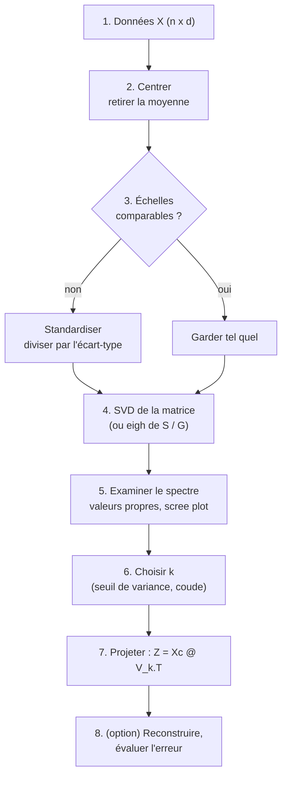

[← Régression linéaire](09-regression-lineaire.md) · [↑ Sommaire](../README.md#table-des-matières) · [Estimation de densité par mélanges gaussiens →](11-melanges-gaussiens.md)

# 10. Réduction de dimension par ACP

### Cadre de la réduction de dimension

Imaginez que vous disposiez d'un immense tableau de chiffres : chaque ligne décrit un objet (une photo, un client, une fleur, une cellule biologique) et chaque colonne mesure une caractéristique de cet objet (le nombre de pixels rouges, l'âge du client, la longueur d'un pétale, l'expression d'un gène). Quand il y a deux ou trois colonnes, on peut dessiner les points sur une feuille de papier ou dans une maquette en relief, et l'œil comprend tout de suite la forme du nuage. Mais que faire avec **mille** colonnes ? On ne peut plus dessiner. Pire : avec autant de dimensions, les distances se brouillent, les calculs deviennent lourds, et beaucoup de colonnes racontent en réalité **la même histoire** sous des habits différents.

La **réduction de dimension** (dimensionality reduction) répond à ce problème. Son idée : remplacer un tableau à beaucoup de colonnes par un tableau à peu de colonnes, **en perdant le moins d'information possible**. C'est exactement ce que fait un bon résumé de roman : on passe de cinq cents pages à une page, et pourtant l'essentiel de l'intrigue est conservé. L'**analyse en composantes principales** (Principal Component Analysis, ACP, ou *PCA* en anglais) est la méthode la plus célèbre et la plus utilisée pour ce résumé.

#### Pourquoi tant de dimensions posent problème

Avant de construire l'ACP, prenons le temps de comprendre **pourquoi** on veut réduire la dimension. Trois grandes raisons reviennent sans cesse.

> **Définition, Données, observations, variables.**
> On appelle **données** un tableau de nombres. Chaque **ligne** est une *observation* (un individu, un exemple), notée par un vecteur $`\mathbf{x}_i`$ (un **vecteur**, c'est simplement une petite liste de nombres rangés dans un ordre fixe, comme la liste des courses : 3 pommes, 2 pains, 1 lait). Chaque **colonne** est une *variable* (une caractéristique mesurée), aussi appelée *feature* en anglais. Le tableau complet, avec $`n`$ lignes et $`d`$ colonnes, est rassemblé dans une **matrice** $`X \in \mathbb{R}^{n \times d}`$.
>
> **Trois petits symboles à lire tout de suite.** Une **matrice**, c'est juste un grand tableau de nombres à lignes et colonnes, comme une grille de mots croisés remplie de chiffres. Le symbole $`\in`$ se lit « appartient à » : il dit « ceci est de telle sorte », comme « Marie $`\in`$ la classe de CM2 ». Le symbole $`\mathbb{R}`$ (un grand « R » à double barre) se lit « les réels » et désigne **tous les nombres ordinaires** (entiers, virgules, négatifs : $`3`$, $`-2{,}5`$, $`0{,}001`$...). Du coup $`\mathbb{R}^{n \times d}`$ se lit « l'ensemble des tableaux de nombres ayant $`n`$ lignes et $`d`$ colonnes » : écrire $`X \in \mathbb{R}^{n \times d}`$, c'est juste annoncer « $`X`$ est un tableau de nombres de taille $`n`$ sur $`d`$ ». C'est une étiquette de taille, rien de plus.

> **Le symbole $`\mathbf{x}_i`$.** Ce symbole représente **un objet décrit par plusieurs nombres à la fois**. Imaginez une carte d'identité : au lieu d'écrire « Marie, 28 ans, 1m65 » en toutes lettres, on empile les nombres dans une petite colonne $`\mathbf{x}_i = (28, 165, \dots)`$. Le gras nous rappelle que ce n'est pas un seul nombre mais **un paquet de nombres**. Le petit $`i`$ en bas est juste **l'étiquette du tiroir**: $`\mathbf{x}_1`$ est le premier objet, $`\mathbf{x}_2`$ le deuxième, et ainsi de suite. Dans tout ce chapitre, $`\mathbf{x}_i \in \mathbb{R}^d`$ est un vecteur **colonne**; quand on l'écrit en ligne dans le tableau $`X`$, c'est sa transposée $`\mathbf{x}_i^{\top}`$ qui forme la $`i`$-ième ligne.

> **Le symbole $`^{\top}`$ (la transposée).** Ce petit « T » en exposant veut simplement dire : couchez ce qui était debout. Un vecteur écrit en colonne (les nombres empilés les uns au-dessus des autres) devient, une fois transposé, un vecteur en ligne (les mêmes nombres alignés côte à côte), et inversement. Imaginez une pile d'assiettes que vous renversez pour les poser en rang sur la table : ce sont les mêmes assiettes, juste tournées d'un quart de tour. Pour une matrice (un tableau de nombres), transposer revient à échanger les lignes et les colonnes : la première ligne devient la première colonne, et ainsi de suite. On s'en sert sans arrêt en algèbre, car coucher un vecteur permet ensuite de le multiplier par un autre.

> **Les symboles $`n`$ et $`d`$.** Le symbole $`n`$ représente **combien on a d'objets** (le nombre de lignes, comme le nombre de personnes dans une salle). Le symbole $`d`$ représente **combien de mesures on prend sur chaque objet** (le nombre de colonnes, comme le nombre de questions d'un questionnaire). Si on photographie $`n=1000`$ visages et que chaque image fait $`d=100\times100 = 10\,000`$ pixels, alors notre tableau a mille lignes et dix mille colonnes.

**1. Le fléau de la dimension (curse of dimensionality).** En grande dimension, l'espace est tellement vaste que les points deviennent presque tous « loin » les uns des autres, et les notions de proximité, de **densité**, de plus proche voisin perdent leur sens. Un petit exemple frappant : le volume d'une boule de rayon $`1`$ rapporté au volume du cube $`[-1,1]^d`$ qui la contient tend vers $`0`$ quand $`d`$ grandit (de $`0{,}52`$ en dimension 3, il chute à $`0{,}0025`$ en dimension 10, puis à $`2{,}5\cdot10^{-8}`$ en dimension 20). Autrement dit, en grande dimension, **presque tout le volume d'un cube est dans ses coins**, loin du centre. Les algorithmes qui s'appuient sur les distances (k plus proches voisins, regroupement / clustering) en souffrent directement.

> **Que veut dire « densité » ?** La densité dit à quel point les points sont serrés, tassés les uns contre les autres, comme la foule dense d'un marché bondé face à une place déserte.

**2. Le coût de calcul et de stockage.** Beaucoup de colonnes signifient beaucoup de mémoire et des calculs plus lents. Réduire $`d`$ de $`10\,000`$ à $`50`$ peut transformer un entraînement de plusieurs heures en quelques secondes.

**3. La redondance et le bruit.** Dans la vraie vie, les colonnes ne sont presque jamais indépendantes. La taille en centimètres et la taille en pouces seraient parfaitement redondantes ; la taille et le poids le sont partiellement (les grandes personnes pèsent souvent plus). Cette redondance veut dire que l'information « vraie » vit dans un espace **plus petit** que le tableau ne le laisse croire. L'ACP cherche précisément cet espace caché.

> **Intuition centrale.** Les données réelles, même décrites par mille colonnes, sont souvent « aplaties » : elles vivent au voisinage d'un sous-espace de petite dimension, comme une feuille de papier froissée flotte dans une pièce. Le papier est en relief (dimension 3) mais reste fondamentalement une surface (dimension 2). La réduction de dimension cherche à **déplier** ou au moins à **retrouver** cette feuille.

#### Le sous-espace linéaire : le cadre de l'ACP

L'ACP fait une hypothèse simple et puissante : le sous-espace caché est **linéaire**, c'est-à-dire un *sous-espace affine* (une droite, un plan, un hyperplan passant par un point central). Ce n'est pas toujours vrai, une donnée enroulée en spirale ne sera pas bien capturée par un plan, mais cette hypothèse rend les calculs exacts, rapides et interprétables. Les méthodes non linéaires (t-SNE, UMAP, autoencodeurs) viendront plus tard ; l'ACP est la fondation.

> **Que veut dire « linéaire » ?** Le mot vient de « ligne ». Une relation est **linéaire** quand elle est *proportionnelle et additive* : si vous doublez l'entrée, la sortie double ; et l'effet de deux causes est la somme de leurs effets séparés. Pas de courbe, pas de seuil : tout se fait « en ligne droite ». Un sous-espace **affine** est juste un morceau plat (droite, plan...) qu'on a le droit de décaler pour qu'il ne passe pas forcément par le zéro, comme une étagère qu'on accroche à la hauteur qu'on veut. Et un **hyperplan**, c'est le nom savant d'un sous-espace plat « le plus grand possible sans remplir tout l'espace » : dans une feuille (espace à 2 dimensions) c'est une droite, dans une pièce (3 dimensions) c'est un mur plat, et ainsi de suite.

> **Le symbole $`k`$.** Ce symbole représente **le nombre de colonnes qu'on veut garder à la fin**, la taille du résumé. On a toujours $`k \le d`$ (le signe $`\le`$ se lit « inférieur ou égal à » : $`k \le d`$ veut dire « $`k`$ ne dépasse jamais $`d`$ » ; son miroir $`\ge`$, qu'on verra bientôt, se lit « supérieur ou égal à ») : on résume, on n'invente pas de colonnes. Si on passe de $`d=10\,000`$ pixels à $`k=50`$ nombres, alors $`k=50`$. Pensez à $`k`$ comme au nombre de phrases que vous vous autorisez pour résumer un livre.

Formellement, voici le contrat de l'ACP. On dispose de $`n`$ points $`\mathbf{x}_1, \dots, \mathbf{x}_n`$ dans $`\mathbb{R}^d`$. On veut trouver :

- un **point d'ancrage** (en général la moyenne du nuage), autour duquel tout se joue ;
- $`k`$ directions privilégiées (les futures « composantes principales »), formant une base orthonormée d'un sous-espace de dimension $`k`$;
- pour chaque point, $`k`$ **coordonnées** dans ce sous-espace (le résumé), telles qu'on puisse **reconstruire** au mieux le point d'origine à partir de son résumé.

> **Trois mots à apprivoiser : sous-espace, orthogonal, base orthonormée.** Un **sous-espace**, c'est juste un morceau bien plat de l'espace qui passe par un point de référence : une droite, un plan, ou un « volume plat » dans un espace plus grand. Pensez à une feuille de papier tendue à l'intérieur d'une pièce : la pièce est l'espace entier, la feuille est un sous-espace. Deux directions sont **orthogonales** quand elles forment un angle droit, exactement comme deux murs qui se rencontrent dans un coin : « orthogonal » est le mot savant pour « perpendiculaire ». Enfin, une **base orthonormée**, ce sont quelques flèches repères qui sont à la fois perpendiculaires entre elles (orthogonales) et toutes de longueur 1 (normées) : un jeu d'axes bien réglés, comme les coins d'une boîte, avec lesquels on peut repérer n'importe quel point sans qu'ils se gênent.


Deux grandes lectures mènent **exactement au même calcul** mais éclairent l'ACP différemment :

| Perspective | Question posée | Critère optimisé |
|---|---|---|
| **Variance maximale** | Quelle direction « étale » le plus le nuage ? | *Maximiser* la variance des projections |
| **Projection / reconstruction** | Quel sous-espace approche le mieux les points ? | *Minimiser* l'erreur de reconstruction |

C'est l'un des plus beaux résultats du domaine : ces deux objectifs en apparence opposés (maximiser l'un, minimiser l'autre) donnent **la même réponse**. Nous le démontrerons. Mais d'abord, un objet incontournable : la matrice de covariance.

#### Centrage et matrice de covariance

Toute l'ACP repose sur la **dispersion** du nuage : comment les points s'éloignent de leur centre, et comment les variables varient **ensemble**. L'outil qui encode cela est la matrice de covariance. Avant de la définir, on doit **centrer** les données.

> **Le symbole $`\bar{\mathbf{x}}`$ (la moyenne).** La barre au-dessus signifie « moyenne ». Ce symbole représente **le point situé au milieu du nuage**, son centre de gravité. Pour le calculer, on additionne tous les points et on divise par leur nombre, exactement comme on fait la moyenne des notes d'une classe, sauf qu'ici chaque « note » est un vecteur, donc on fait la moyenne colonne par colonne. Si trois points valent $`(0,0)`$, $`(2,0)`$, $`(4,3)`$, leur moyenne est $`\big(\tfrac{0+2+4}{3}, \tfrac{0+0+3}{3}\big) = (2, 1)`$.

```math
\bar{\mathbf{x}} = \frac{1}{n} \sum_{i=1}^{n} \mathbf{x}_i \in \mathbb{R}^d
```

> Rappel de lecture : le grand $`\sum`$ est « la boucle qui additionne » déjà vue ; ici elle parcourt les $`n`$ objets et les empile, puis on divise par $`n`$.

**Centrer** veut dire déplacer l'origine du repère sur ce centre de gravité, c'est-à-dire soustraire $`\bar{\mathbf{x}}`$ à chaque point :

```math
\tilde{\mathbf{x}}_i = \mathbf{x}_i - \bar{\mathbf{x}}.
```

> **Pourquoi centrer ?** Sans centrage, la « plus grande direction de variation » se confondrait avec la direction qui pointe vers le nuage depuis l'origine arbitraire du repère, une information sans intérêt, qui dépend de la fois où on a placé le zéro. En centrant, on dit : « ce qui m'intéresse, ce n'est pas *où* est le nuage, mais *comment il s'étale* ». La tilde $`\tilde{\ }`$ signale simplement « version centrée ».

On range les points centrés en lignes dans une matrice $`\tilde{X} \in \mathbb{R}^{n \times d}`$ (la $`i`$-ième ligne est $`\tilde{\mathbf{x}}_i^{\top}`$). On peut alors définir l'objet vedette.

> **Le symbole $`S`$, la matrice de covariance des données.** Ce symbole représente **un tableau carré qui mesure comment les variables bougent ensemble**. (Une **case** est juste une cellule du tableau, repérée par sa ligne et sa colonne ; la **diagonale**, ce sont les cases situées en escalier du coin haut-gauche au coin bas-droite, là où le numéro de ligne égale le numéro de colonne, comme les cases d'un plateau d'échecs alignées en biais.) Sur sa diagonale, on lit la *variance* de chaque colonne (à quel point cette variable, seule, s'étale). En dehors de la diagonale, on lit la *covariance* entre deux colonnes : un nombre positif si elles montent ensemble (taille et poids), négatif si l'une monte quand l'autre descend (altitude et température), proche de zéro si elles n'ont rien à voir. Imaginez un tableau à double entrée « variable contre variable » dont chaque case dit : « quand celle-ci augmente, qu'arrive-t-il à celle-la ? ». C'est le cœur battant de l'ACP : toute la géométrie du nuage y est résumée.

```math
S = \frac{1}{n} \sum_{i=1}^{n} (\mathbf{x}_i - \bar{\mathbf{x}})(\mathbf{x}_i - \bar{\mathbf{x}})^{\top} = \frac{1}{n}\, \tilde{X}^{\top}\tilde{X} \;\in\; \mathbb{R}^{d \times d}.
```

> **Pourquoi ce produit $`(\cdot)(\cdot)^{\top}`$ ?** Un vecteur colonne $`\tilde{\mathbf{x}}`$ ($`d\times 1`$) multiplié par sa propre transposée (en ligne, $`1\times d`$) donne une matrice $`d\times d`$ dont la case $`(j,\ell)`$ vaut $`\tilde{x}_j\,\tilde{x}_\ell`$: le produit de l'écart de la variable $`j`$ par l'écart de la variable $`\ell`$. En moyennant sur tous les points, la case $`(j,\ell)`$ devient exactement la covariance entre la variable $`j`$ et la variable $`\ell`$. C'est ce qu'on appelle un *produit extérieur* (outer product) : il fabrique une matrice à partir de deux vecteurs.

> **Remarque, diviser par $`n`$ ou par $`n-1`$ ?** Avec $`\tfrac{1}{n}`$ on obtient l'estimateur du *maximum de vraisemblance* (biaisé) ; avec $`\tfrac{1}{n-1}`$ l'estimateur *non biaisé* (correction de Bessel). (Quelques mots de vocabulaire : un **estimateur** est une recette pour deviner une quantité inconnue à partir des données ; la **vraisemblance** mesure à quel point une explication colle bien à ce qu'on a observé, et le *maximum de vraisemblance* choisit l'explication la plus crédible, comme un détective retient le scénario qui colle le mieux aux indices ; un estimateur **biaisé** vise un peu à côté de la cible en moyenne, un estimateur **non biaisé** vise juste.) Pour l'ACP cela ne change **rien** aux directions principales (on multiplie $`S`$ par une constante, les vecteurs propres sont identiques, les valeurs propres juste rééchelonnées). On gardera $`\tfrac{1}{n}`$ par simplicité, sauf mention contraire.

**Trois propriétés fondamentales de $`S`$** (elles justifient tout ce qui suit) :

1. $`S`$ est **symétrique**: $`S^{\top} = S`$ (une matrice est **symétrique** quand elle est identique à sa transposée, c'est-à-dire que la case ligne $`j`$ colonne $`\ell`$ égale la case ligne $`\ell`$ colonne $`j`$ : le tableau est en miroir parfait de part et d'autre de sa diagonale, comme un papillon). En effet $`(\tilde{X}^{\top}\tilde{X})^{\top} = \tilde{X}^{\top}\tilde{X}`$. Conséquence majeure (le **théorème spectral**, vu au chapitre 4, est le grand résultat qui garantit qu'une matrice symétrique se range toujours proprement le long d'axes perpendiculaires) : $`S`$ possède une base **orthonormée** de vecteurs propres et toutes ses valeurs propres sont **réelles**.
2. $`S`$ est **semi-définie positive**: pour tout vecteur $`\mathbf{u}`$, $`\mathbf{u}^{\top} S \,\mathbf{u} = \tfrac{1}{n}\sum_i (\tilde{\mathbf{x}}_i^{\top}\mathbf{u})^2 \ge 0`$. C'est une somme de carrés. Conséquence : toutes les valeurs propres de $`S`$ sont $`\ge 0`$. Ce sont, on le verra, des **variances**, et une variance ne peut pas être négative.
3. La quantité $`\mathbf{u}^{\top} S\, \mathbf{u}`$ à une interprétation limpide : c'est **la variance des données une fois projetées sur la direction $`\mathbf{u}`$** (quand $`\|\mathbf{u}\|=1`$). Cette formule sera la clé de la perspective « variance maximale ».

> **Les doubles barres $`\|\cdot\|`$ : la longueur.** L'écriture $`\|\mathbf{u}\|`$ (deux barres verticales autour d'un vecteur) se lit « **norme de $`\mathbf{u}`$ » et veut dire **la longueur de la flèche** $`\mathbf{u}`$, sa taille mesurée du début à la pointe (comme on mesure une ficelle avec une règle). Donc $`\|\mathbf{u}\|=1`$ veut simplement dire « cette flèche mesure une unité de long ». À ne pas confondre avec une seule barre $`|\cdot|`$, qui sert pour un nombre tout seul (sa « valeur absolue », c'est-à-dire ce nombre rendu positif).

> **« Projeter », c'est faire de l'ombre.** Projeter un point sur une direction, c'est exactement ce que fait le soleil avec votre ombre sur le sol : on écrase le point sur une ligne (ou un plan) en gardant seulement sa position le long de cette ligne. La *projection* d'un point, c'est donc l'ombre de ce point sur la direction choisie ; on perd ce qui dépassait sur les côtés et on ne garde que l'ombre.



```python
import numpy as np

def centrer(X):
    moyenne = X.mean(axis=0)
    return X - moyenne, moyenne

def matrice_covariance(X):
    Xc, _ = centrer(X)
    n = Xc.shape[0]
    return (Xc.T @ Xc) / n

rng = np.random.default_rng(0)
X = rng.normal(size=(500, 3)) @ np.array([[2.0, 0.0, 0.0],
                                          [1.5, 1.0, 0.0],
                                          [0.0, 0.0, 0.3]])
S = matrice_covariance(X)
print(np.round(S, 3))
print("S symetrique ?", np.allclose(S, S.T))
print("valeurs propres >= 0 ?", np.all(np.linalg.eigvalsh(S) >= -1e-12))
```

Avec ce cadre, un nuage centré, une matrice de covariance $`S`$ symétrique semi-définie positive, nous avons tout pour attaquer l'ACP. Le plan : (i) la lire comme une recherche de variance maximale, (ii) la relire comme une projection optimale, (iii) montrer que les deux coïncident et se calculent par les vecteurs propres de $`S`$ (ou la SVD de $`\tilde{X}`$).

---

### Perspective de la variance maximale

Première façon de raconter l'ACP. On cherche **la direction le long de laquelle le nuage de points est le plus étale**. Pourquoi ? Parce que l'étalement, c'est l'information : une variable qui ne varie pas (tout le monde à la même valeur) ne distingue personne et n'apprend rien. La direction de plus forte variance est celle qui « voit » le plus de différences entre les objets.

> **Image.** Posez une baguette de pain sur la table et éclairez-la avec une lampe. Selon l'orientation de la lampe, l'ombre de la baguette sur le mur est longue ou courte. La direction qui donne **l'ombre la plus longue** est celle qui suit la baguette dans sa longueur : c'est sa direction de plus grande variation. L'ACP cherche cette direction, puis la suivante (la plus longue parmi celles perpendiculaires à la première), et ainsi de suite.

#### La première composante principale

> **Le symbole $`\mathbf{u}`$, une direction unitaire.** Ce symbole représente **une flèche qui pointe dans une direction, de longueur exactement 1**. On s'en sert comme d'une boussole : elle indique *vers où regarder*, sans information de distance (la longueur est fixée à 1 pour ne comparer que les orientations). La contrainte $`\|\mathbf{u}\| = 1`$, c'est-à-dire $`\mathbf{u}^{\top}\mathbf{u} = 1`$, dit simplement « cette flèche mesure une unité ».

Projeter un point centré $`\tilde{\mathbf{x}}_i`$ sur la direction $`\mathbf{u}`$ donne le nombre $`\tilde{\mathbf{x}}_i^{\top}\mathbf{u}`$: c'est la **coordonnée** du point le long de $`\mathbf{u}`$, la position de son ombre sur l'axe. La moyenne de ces projections est nulle (les données sont centrées), donc leur **variance** vaut :

```math
\mathrm{Var}\big(\tilde{\mathbf{x}}^{\top}\mathbf{u}\big) = \frac{1}{n}\sum_{i=1}^{n}\big(\tilde{\mathbf{x}}_i^{\top}\mathbf{u}\big)^2 = \frac{1}{n}\sum_{i=1}^{n} \mathbf{u}^{\top}\tilde{\mathbf{x}}_i\,\tilde{\mathbf{x}}_i^{\top}\mathbf{u} = \mathbf{u}^{\top}\!\left(\frac{1}{n}\sum_{i=1}^{n}\tilde{\mathbf{x}}_i\,\tilde{\mathbf{x}}_i^{\top}\right)\!\mathbf{u} = \mathbf{u}^{\top} S\,\mathbf{u}.
```

Ce petit calcul est le pivot de toute la section. Il dit : **la variance projetée sur $`\mathbf{u}`$ se lit directement sur la matrice de covariance**, via la *forme quadratique* $`\mathbf{u}^{\top} S\,\mathbf{u}`$. Une *forme quadratique*, c'est simplement une machine qui prend une direction $`\mathbf{u}`$ et recrache un seul nombre, en faisant intervenir des produits de deux coordonnées à la fois (jamais une coordonnée seule) ; ici, ce nombre n'est autre que la variance le long de $`\mathbf{u}`$. Trouver la direction de variance maximale, c'est donc résoudre :

```math
\boxed{\;\mathbf{u}_1 = \arg\max_{\mathbf{u}\,:\,\|\mathbf{u}\|=1}\; \mathbf{u}^{\top} S\,\mathbf{u}.\;}
```

> **Comment lire $`\arg\max`$ ?** Cela se lit « argument du maximum ». Attention à la nuance : $`\max`$ tout court demande **la plus grande valeur** atteinte (le score le plus haut), tandis que $`\arg\max`$ demande **qui** réalise ce maximum (le gagnant, pas le score). Exemple : parmi les élèves de la classe, $`\max`$ des tailles donne « 1m80 », mais $`\arg\max`$ des tailles donne « c'est Paul ». Ici, $`\mathbf{u}_1 = \arg\max_{\mathbf{u}} \mathbf{u}^{\top}S\mathbf{u}`$ signifie donc : « $`\mathbf{u}_1`$ est la direction qui rend la variance la plus grande ». Le petit texte écrit sous le $`\arg\max`$ ($`\mathbf{u} : \|\mathbf{u}\|=1`$) rappelle où on a le droit de chercher : seulement parmi les flèches de longueur 1.

> **Pourquoi la contrainte $`\|\mathbf{u}\|=1`$ est indispensable.** Sans elle, on pourrait rendre $`\mathbf{u}^{\top}S\,\mathbf{u}`$ aussi grand qu'on veut en allongeant $`\mathbf{u}`$ (doubler $`\mathbf{u}`$ quadruple la valeur). Le problème n'aurait pas de solution finie. Fixer la longueur à 1 force à ne choisir qu'une *orientation*. C'est un problème d'optimisation **sous contrainte**: l'outil adapté est le multiplicateur de Lagrange.

#### Résolution par les multiplicateurs de Lagrange

On forme le lagrangien (vu au chapitre sur l'optimisation) en attachant un multiplicateur $`\lambda`$ à la contrainte $`\mathbf{u}^{\top}\mathbf{u} = 1`$:

```math
\mathcal{L}(\mathbf{u}, \lambda) = \mathbf{u}^{\top} S\,\mathbf{u} - \lambda\,(\mathbf{u}^{\top}\mathbf{u} - 1).
```

> **Le symbole $`\lambda`$ ici.** Dans ce contexte, $`\lambda`$ est d'abord le *multiplicateur de Lagrange*: un nombre qu'on ajoute pour « payer le respect » de la contrainte de longueur. La surprise, qu'on va voir à l'instant, c'est qu'il se révèle être **une valeur propre** de $`S`$. Deux rôles, un seul symbole, et ce n'est pas un hasard.

> **Le symbole $`\nabla`$ (le gradient).** Ce triangle pointe en bas, qu'on lit « nabla », est le **gradient**. Imaginez que vous marchez sur une colline : en chaque endroit, le gradient est la flèche qui montre dans quelle direction ça monte le plus fort, et sa longueur dit à quel point la pente est raide. Quand on cherche le point le plus haut (un sommet) ou le plus bas (un creux), on se place là où plus aucune direction ne fait grimper : la flèche se réduit à rien. « Annuler le gradient », c'est exactement chercher cet endroit où la pente est plate dans toutes les directions, donc un sommet ou un creux. C'est ainsi qu'on trouve un maximum ou un minimum.

> **Pourquoi $`\nabla_{\mathbf{u}}(\mathbf{u}^{\top} S\,\mathbf{u}) = 2 S\,\mathbf{u}`$ ?** C'est simplement la version « avec des vecteurs » d'une dérivée d'école. (La **dérivée** d'une quantité mesure **sa vitesse de variation** : de combien la sortie change quand on bouge un tout petit peu l'entrée, autrement dit la pente de la courbe en un point. Le gradient vu juste avant n'est rien d'autre que la dérivée quand il y a plusieurs entrées à la fois.) Pour un seul nombre $`u`$, la dérivée de $`a\,u^2`$ vaut $`2a\,u`$ : le carré fait descendre un facteur 2 et baisser la puissance d'un cran. Ici $`\mathbf{u}^{\top} S\,\mathbf{u}`$ joue le rôle d'un « carré » de $`\mathbf{u}`$ pondéré par $`S`$ (chaque coordonnée intervient au carré ou croisée avec une autre) ; en dérivant, on retrouve le même schéma, et le résultat s'écrit $`2 S\,\mathbf{u}`$ (le $`S`$ remplaçant le coefficient $`a`$ ; un **coefficient**, c'est juste le nombre par lequel on multiplie, le « facteur » devant la quantité, comme le 3 dans « 3 pommes »). De même, la dérivée de $`\mathbf{u}^{\top}\mathbf{u}`$, qui est la longueur au carré, vaut $`2\mathbf{u}`$, tout comme la dérivée de $`u^2`$ vaut $`2u`$.

On annule le gradient par rapport à $`\mathbf{u}`$. Comme $`\nabla_{\mathbf{u}}(\mathbf{u}^{\top} S\,\mathbf{u}) = 2 S\,\mathbf{u}`$ (car $`S`$ est symétrique) et $`\nabla_{\mathbf{u}}(\mathbf{u}^{\top}\mathbf{u}) = 2\mathbf{u}`$:

```math
\nabla_{\mathbf{u}}\mathcal{L} = 2 S\,\mathbf{u} - 2\lambda\,\mathbf{u} = \mathbf{0} \quad\Longleftrightarrow\quad \boxed{\,S\,\mathbf{u} = \lambda\,\mathbf{u}.\,}
```

> **Deux symboles de cette ligne.** Le $`\mathbf{0}`$ en gras est le **vecteur nul** : non pas le chiffre zéro tout seul, mais une liste **entièrement** remplie de zéros (la flèche de longueur nulle qui ne pointe nulle part). Écrire « $`\dots = \mathbf{0}`$ » veut dire « toutes les cases valent zéro à la fois ». La double flèche $`\Longleftrightarrow`$ se lit « équivaut à » ou « c'est la même chose que » : elle relie deux affirmations qui sont vraies exactement dans les mêmes cas, comme « il pleut $`\Longleftrightarrow`$ le sol est mouillé par la pluie ».

Voilà le cœur de l'ACP : la direction de variance maximale est un **vecteur propre** (eigenvector) de la matrice de covariance, et le multiplicateur $`\lambda`$ associé en est la **valeur propre** (eigenvalue). Mais laquelle des $`d`$ valeurs propres choisir ? Reportons $`S\mathbf{u} = \lambda\mathbf{u}`$ dans la quantité à maximiser :

```math
\mathbf{u}^{\top} S\,\mathbf{u} = \mathbf{u}^{\top}(\lambda \mathbf{u}) = \lambda\,(\mathbf{u}^{\top}\mathbf{u}) = \lambda.
```

La variance projetée **est égale à la valeur propre**. Pour la maximiser, on prend donc la **plus grande** valeur propre $`\lambda_1`$, et $`\mathbf{u}_1`$ son vecteur propre. Ce vecteur $`\mathbf{u}_1`$ est la **première composante principale** (first principal component) ; la valeur $`\lambda_1`$ est la variance des données le long de cette direction.

> **Le symbole « composante principale ».** Une composante principale représente **une nouvelle direction de regard sur les données, taillée sur mesure pour le nuage**. La première est l'axe le plus étale ; la deuxième, l'axe le plus étale parmi ceux perpendiculaires au premier ; etc. Ce sont les axes « naturels » du nuage, comme les axes d'une ellipse : on tourne le repère pour qu'il épouse la forme réelle des données au lieu de garder les colonnes d'origine, souvent mal orientées.

#### Les composantes suivantes

Pour la deuxième direction, on impose qu'elle soit **orthogonale** à la première (sinon on retrouverait la même information) :

```math
\mathbf{u}_2 = \arg\max_{\substack{\|\mathbf{u}\|=1 \\ \mathbf{u}^{\top}\mathbf{u}_1 = 0}} \mathbf{u}^{\top} S\,\mathbf{u}.
```

Le même calcul de Lagrange (avec deux contraintes) montre que $`\mathbf{u}_2`$ est le vecteur propre associé à la **deuxième plus grande** valeur propre $`\lambda_2`$. En itérant, on obtient le résultat central.

> **Théorème (ACP par diagonalisation de la covariance).** Soit $`S`$ la matrice de covariance, symétrique semi-définie positive. Notons ses valeurs propres rangées par ordre décroissant $`\lambda_1 \ge \lambda_2 \ge \dots \ge \lambda_d \ge 0`$ et $`\mathbf{u}_1, \dots, \mathbf{u}_d`$ une base orthonormée de vecteurs propres associés. Alors, pour tout $`k`$, le sous-espace qui maximise la variance totale projetée parmi tous les sous-espaces de dimension $`k`$ est engendré par $`\mathbf{u}_1, \dots, \mathbf{u}_k`$. La variance capturée vaut $`\lambda_1 + \dots + \lambda_k`$.

> **Que veut dire « diagonaliser » ?** **Diagonaliser** une matrice, c'est trouver toutes ses directions propres (les vecteurs propres) et leurs nombres associés (les valeurs propres). C'est comme tourner le repère pour le poser bien droit le long des axes naturels du nuage : une fois dans ce bon repère, le tableau devient ultra-simple (il n'y a plus que des nombres sur la diagonale, d'où le mot). Pour l'ACP, diagonaliser $`S`$ et « faire l'ACP » sont une seule et même opération.

> **Démonstration (récurrence).** (La **récurrence** est une façon de prouver « de proche en proche », comme une rangée de dominos : on montre que le premier tombe, puis que chaque domino fait tomber le suivant, et on en conclut qu'ils tombent tous.) Le cas $`k=1`$ est établi ci-dessus. Supposons le résultat vrai jusqu'au rang $`k-1`$, avec composantes $`\mathbf{u}_1,\dots,\mathbf{u}_{k-1}`$. On cherche $`\mathbf{u}_k`$ unitaire, orthogonal aux précédents, maximisant $`\mathbf{u}^{\top}S\mathbf{u}`$. Décomposons tout vecteur candidat dans la base propre : $`\mathbf{u} = \sum_{j=1}^{d} c_j \mathbf{u}_j`$ avec $`\sum_j c_j^2 = 1`$ (norme 1) et, par orthogonalité aux précédents, $`c_1 = \dots = c_{k-1} = 0`$. Alors, en utilisant $`S\mathbf{u}_j = \lambda_j \mathbf{u}_j`$ et l'orthonormalité,
> ```math
> \mathbf{u}^{\top}S\mathbf{u} = \sum_{j=k}^{d} \lambda_j c_j^2 \le \lambda_k \sum_{j=k}^{d} c_j^2 = \lambda_k,
> ```
> l'inégalité venant de $`\lambda_j \le \lambda_k`$ pour $`j \ge k`$. Le maximum $`\lambda_k`$ est atteint en prenant $`c_k = 1`$ et les autres nuls, c'est-à-dire $`\mathbf{u} = \mathbf{u}_k`$. Par récurrence, $`\mathbf{u}_1,\dots,\mathbf{u}_k`$ réalisent l'optimum et la variance totale captée est $`\sum_{j=1}^k \lambda_j`$. $`\blacksquare`$
>
> *(Le petit carré noir $`\blacksquare`$ est juste le panneau « fin de la démonstration » : il dit « c'est prouvé, on s'arrête là », comme un point final. Plus loin, le crochet $`\checkmark`$ jouera le même rôle pour les corrigés : « vérifié, terminé ».)*

> **Lien avec la trace.** La variance **totale** du nuage (somme des variances de toutes les colonnes) vaut $`\mathrm{tr}(S) = \sum_{j=1}^d \lambda_j`$, car la trace est invariante par changement de base orthonormée et égale la somme des valeurs propres. C'est pourquoi on parle de *part* de variance : chaque $`\lambda_j`$ est une part du gâteau total $`\mathrm{tr}(S)`$.

> **Le symbole « variance expliquée ».** La *variance expliquée* (explained variance) par les $`k`$ premières composantes représente **la fraction de l'étalement total du nuage que notre résumé conserve**. C'est un pourcentage de fidélité : si les deux premières composantes expliquent 95 % de la variance, cela veut dire que notre dessin en 2D garde 95 % de la « richesse » du nuage d'origine, et qu'on n'en perd que 5 %. On la calcule par le *ratio de variance expliquée*:
> ```math
> \text{ratio}_k = \frac{\lambda_1 + \dots + \lambda_k}{\lambda_1 + \dots + \lambda_d} = \frac{\sum_{j=1}^{k}\lambda_j}{\mathrm{tr}(S)}.
> ```

#### Exemple chiffré déroulé pas à pas

Choisissons un cas où les variables sont **corrélées** pour voir l'ACP tourner le repère. Soit les points
$`(1,1),\quad (2,2),\quad (3,3),\quad (4,4),\quad (5,5).`$
Ils sont parfaitement alignés sur la droite $`y=x`$ : une seule direction porte toute l'information.

> **Que veut dire « corrélées » ?** Deux variables sont corrélées quand elles ont tendance à bouger ensemble : quand l'une monte, l'autre monte aussi, comme la taille et la pointure de chaussure.

> **L'écriture $`y=x`$.** Elle décrit la droite formée de tous les points dont les deux coordonnées sont égales : $`(1,1)`$, $`(2,2)`$, etc., c'est la diagonale qui monte à 45 degrés.

**Étape 1, moyenne.** $`\bar{\mathbf{x}} = \big(\tfrac{1+2+3+4+5}{5}, \tfrac{1+2+3+4+5}{5}\big) = (3,3)`$.

**Étape 2, centrage.** Les points centrés : $`(-2,-2),(-1,-1),(0,0),(1,1),(2,2)`$.

**Étape 3, covariance.** Variance de la colonne 1 : $`\tfrac{1}{5}(4+1+0+1+4) = 2`$. Idem colonne 2 : $`2`$. Covariance : $`\tfrac{1}{5}((-2)(-2)+(-1)(-1)+0+1\cdot1+2\cdot2) = \tfrac{10}{5}=2`$. Donc
```math
S = \begin{pmatrix} 2 & 2 \\ 2 & 2 \end{pmatrix}.
```

> **Trois notations à lire au passage.** Les **grandes parenthèses** $`\begin{pmatrix} 2 & 2 \\ 2 & 2 \end{pmatrix}`$ ci-dessus sont juste la façon d'écrire une matrice : on aligne les nombres en lignes et colonnes entre deux parenthèses géantes. Le symbole $`I`$ (parfois écrit $`I_2`$, $`I_k`$...) est la **matrice identité** : un tableau carré avec des 1 sur la diagonale et des 0 partout ailleurs ; elle joue pour les matrices le rôle du nombre 1 (multiplier par elle ne change rien). Enfin $`\det(\cdot)`$ se lit **déterminant** : c'est un seul nombre calculé à partir d'une matrice carrée, qui vaut zéro exactement quand la matrice « écrase » l'espace (quand elle aplatit le volume à plat) ; on l'utilise ici parce que les valeurs propres $`\lambda`$ sont précisément les valeurs qui rendent $`\det(S-\lambda I)=0`$.

**Étape 4, valeurs propres.** $`\det(S - \lambda I) = (2-\lambda)^2 - 4 = \lambda^2 - 4\lambda = \lambda(\lambda - 4)`$. D'où $`\lambda_1 = 4`$, $`\lambda_2 = 0`$.

**Étape 5, vecteurs propres.** Pour $`\lambda_1=4`$: $`(S-4I)\mathbf{u}=0`$ donne $`-2u_1+2u_2=0`$, soit $`u_1=u_2`$; normalisé : $`\mathbf{u}_1 = \tfrac{1}{\sqrt2}(1,1)`$. Pour $`\lambda_2=0`$: $`\mathbf{u}_2 = \tfrac{1}{\sqrt2}(1,-1)`$.

**Lecture.** La première composante pointe **exactement le long de $`y=x`$**: l'ACP a retrouvé la droite porteuse. La variance le long de $`\mathbf{u}_1`$ vaut $`\lambda_1=4`$, le long de $`\mathbf{u}_2`$ vaut $`\lambda_2=0`$: il n'y a aucune dispersion perpendiculaire (les points sont alignés). Le ratio de variance expliqué par la 1re composante : $`\tfrac{4}{4+0}=100\%`$. On peut donc résumer ces points 2D par **un seul nombre** (leur position le long de $`\mathbf{u}_1`$) sans rien perdre.

```python
import numpy as np

P = np.array([[1,1],[2,2],[3,3],[4,4],[5,5]], dtype=float)
Pc = P - P.mean(axis=0)
S = (Pc.T @ Pc) / len(P)

valeurs, vecteurs = np.linalg.eigh(S)          # eigh : matrice symetrique, valeurs croissantes
ordre = np.argsort(valeurs)[::-1]              # on remet en ordre decroissant
valeurs, vecteurs = valeurs[ordre], vecteurs[:, ordre]

print("valeurs propres :", np.round(valeurs, 6))
print("1re composante  :", np.round(vecteurs[:, 0], 6))
print("ratio variance  :", np.round(valeurs / valeurs.sum(), 6))
```

> **Application en machine learning.** En reconnaissance de visages, l'ACP appliquée à des milliers d'images produit des *eigenfaces* (visages propres) : les premières composantes capturent l'éclairage et la forme globale du visage, les suivantes des détails. Garder $`k\approx 100`$ composantes (le signe $`\approx`$, un « égal » ondulé, se lit « environ égal à » : $`k\approx 100`$ veut dire « à peu près cent ») sur des images de $`10\,000`$ pixels suffit souvent à reconnaître une personne, tout en divisant par 100 la taille des données. La variance expliquée guide le choix de $`k`$: on prend assez de composantes pour atteindre, disons, 95 %.

---

### Perspective de la projection

Changeons complètement de point de vue, et pourtant nous allons retomber sur les mêmes vecteurs propres. Au lieu de demander « quelle direction étale le plus le nuage ? », demandons : « si je dois écraser les points sur un sous-espace de dimension $`k`$, **quel sous-espace déforme le moins les points** ? ». C'est la perspective de la **reconstruction**: on veut pouvoir reconstruire chaque point à partir de son résumé avec le minimum d'erreur.

> **Image.** Vous photographiez une sculpture en relief : la photo est plate (dimension 2), la sculpture est en relief (dimension 3). Selon l'angle de prise de vue, la photo trahit plus ou moins la forme réelle. La perspective de la projection cherche **le meilleur angle**, celui sous lequel on pourra le mieux « deviner » la sculpture à partir de la photo. La distance entre chaque point réel et son ombre sur la photo, c'est l'erreur ; on veut la rendre minimale.

#### Projeter, reconstruire, mesurer l'erreur

On se donne un repère orthonormé $`\mathbf{u}_1, \dots, \mathbf{u}_k`$ du sous-espace candidat (toujours $`k \le d`$). On range ces vecteurs en colonnes dans une matrice $`U_k \in \mathbb{R}^{d\times k}`$, qui vérifie $`U_k^{\top} U_k = I_k`$ (colonnes orthonormées).

> **Le symbole $`\mathbf{z}_i`$, le code, le résumé du point.** Ce symbole représente **les quelques nombres qui résument un objet** dans le nouveau repère. Si $`\mathbf{x}_i`$ était une longue carte d'identité à $`d`$ cases, alors $`\mathbf{z}_i`$ en est la version « carte de visite » à $`k`$ cases. On l'appelle aussi le *code* ou les *scores* du point. Passer de $`\mathbf{x}_i`$ à $`\mathbf{z}_i`$, c'est *encoder*; revenir en arrière, c'est *décoder*.

**Encodage** (projection sur le sous-espace) : la coordonnée du point centré le long de chaque axe est un produit scalaire, donc
```math
\mathbf{z}_i = U_k^{\top}(\mathbf{x}_i - \bar{\mathbf{x}}) \in \mathbb{R}^k.
```

> **Qu'est-ce qu'un produit scalaire ?** Le **produit scalaire** de deux listes de nombres (deux vecteurs) se calcule en multipliant leurs cases une à une (la 1re avec la 1re, la 2e avec la 2e...) puis en additionnant tout, ce qui donne **un seul nombre**. Exemple de caisse de supermarché : quantités $`(2,3,1)`$ et prix $`(4,1,5)`$ donnent $`2\times4 + 3\times1 + 1\times5 = 16`$, le total à payer. Géométriquement, ce nombre mesure « à quel point deux flèches pointent dans la même direction » : grand quand elles sont alignées, nul quand elles sont perpendiculaires. C'est exactement ce que fait l'écriture $`\mathbf{a}^{\top}\mathbf{b}`$ (on couche $`\mathbf{a}`$ avec sa transposée pour le multiplier par $`\mathbf{b}`$). Projeter un point sur un axe revient justement à faire le produit scalaire du point avec la flèche-repère de cet axe.

> **Le symbole « reconstruction ».** La *reconstruction* représente **le point qu'on obtient en repartant du résumé pour reconstruire l'objet d'origine**. C'est la « meilleure devinette » de $`\mathbf{x}_i`$ qu'on puisse faire en ne connaissant que son code $`\mathbf{z}_i`$ et les axes choisis. Comme on a jeté une partie de l'information (les directions hors du sous-espace), cette devinette est en général imparfaite : l'écart entre le vrai point et sa reconstruction est l'**erreur de reconstruction**.

**Décodage** (reconstruction) : on replace le code dans l'espace d'origine et on rajoute le centre,
```math
\hat{\mathbf{x}}_i = \bar{\mathbf{x}} + U_k\,\mathbf{z}_i = \bar{\mathbf{x}} + U_k U_k^{\top}(\mathbf{x}_i - \bar{\mathbf{x}}).
```

> **Le petit chapeau $`\hat{\ }`$.** Le chapeau posé sur une lettre, comme dans $`\hat{\mathbf{x}}_i`$, se lit « $`\mathbf{x}`$ **chapeau** » et signale **une estimation, une reconstruction, une devinette** : ce n'est pas le vrai $`\mathbf{x}_i`$, mais notre meilleure tentative pour le retrouver. Comparez la lettre nue $`\mathbf{x}_i`$ (la vérité, l'original) et la lettre chapeautée $`\hat{\mathbf{x}}_i`$ (ce qu'on a reconstruit à partir du résumé) : l'écart entre les deux est précisément l'erreur. Pensez au chapeau comme à l'étiquette « copie » sur un double de clé.

La matrice $`P = U_k U_k^{\top} \in \mathbb{R}^{d\times d}`$ est un **projecteur orthogonal**: elle vérifie $`P^{\top}=P`$ et $`P^2 = P`$ (projeter deux fois ne change rien de plus que projeter une fois). Elle envoie chaque point centré sur le sous-espace.

L'**erreur de reconstruction** moyenne, qu'on cherche à minimiser, est la moyenne des distances au carré entre points réels et reconstructions :

```math
J(U_k) = \frac{1}{n}\sum_{i=1}^{n}\big\|\mathbf{x}_i - \hat{\mathbf{x}}_i\big\|^2 = \frac{1}{n}\sum_{i=1}^{n}\big\|\tilde{\mathbf{x}}_i - U_k U_k^{\top}\tilde{\mathbf{x}}_i\big\|^2.
```

> **Le symbole $`J`$.** Ce symbole représente **la note de mauvaise qualité du résumé**: plus $`J`$ est grand, plus on a déformé les points ; plus $`J`$ est petit, plus la reconstruction est fidèle. C'est une *fonction de coût* (cost / loss). Notre but : choisir le sous-espace $`U_k`$ qui rend cette note la plus basse possible. La double barre $`\|\cdot\|`$ est la longueur (norme) du vecteur d'écart, et le carré évite les signes négatifs tout en pénalisant fort les gros écarts.

#### Le théorème de Pythagore qui relie les deux perspectives

Voici le moment clé. Pour chaque point centré $`\tilde{\mathbf{x}}_i`$, décomposons-le en sa part **dans** le sous-espace ($`U_kU_k^{\top}\tilde{\mathbf{x}}_i`$, gardée) et sa part **perpendiculaire** ($`\tilde{\mathbf{x}}_i - U_kU_k^{\top}\tilde{\mathbf{x}}_i`$, jetée). Ces deux parts sont orthogonales (propriété du projecteur orthogonal), donc le théorème de Pythagore donne :

> **Rappel du théorème de Pythagore.** C'est le résultat d'école sur le triangle rectangle (un triangle avec un angle droit) : le carré du grand côté (l'hypoténuse) égale la somme des carrés des deux autres côtés, souvent résumé par $`a^2 + b^2 = c^2`$. Ici, le « point complet » joue le rôle du grand côté, et ses deux morceaux perpendiculaires (la part gardée et la part jetée) jouent le rôle des deux petits côtés : la longueur-au-carré du tout égale la somme des longueurs-au-carré des morceaux.

```math
\|\tilde{\mathbf{x}}_i\|^2 = \underbrace{\|U_kU_k^{\top}\tilde{\mathbf{x}}_i\|^2}_{\text{garde (projection)}} + \underbrace{\|\tilde{\mathbf{x}}_i - U_kU_k^{\top}\tilde{\mathbf{x}}_i\|^2}_{\text{jete (erreur)}}.
```

En moyennant sur les $`n`$ points :

```math
\underbrace{\frac{1}{n}\sum_i \|\tilde{\mathbf{x}}_i\|^2}_{\text{variance totale } = \,\mathrm{tr}(S)} = \underbrace{\frac{1}{n}\sum_i \|U_kU_k^{\top}\tilde{\mathbf{x}}_i\|^2}_{\text{variance projetee}} + \underbrace{J(U_k)}_{\text{erreur}}.
```

> **La révélation.** Le membre de gauche, la variance totale, est une **constante**: elle ne dépend pas du sous-espace choisi, seulement des données. Donc **maximiser la variance projetée** (perspective 1) revient **exactement** à **minimiser l'erreur de reconstruction** $`J`$ (perspective 2). Ce ne sont pas deux méthodes qui se ressemblent : c'est **une seule et même équation** lue de deux côtés. Tout ce qui est gagné d'un côté (variance gardée) est exactement ce qui est perdu de l'autre (erreur).

Comme la variance projetée est maximale pour $`U_k = (\mathbf{u}_1,\dots,\mathbf{u}_k)`$ (vu à la section précédente), on en déduit :

> **Théorème (ACP comme meilleure approximation linéaire).** Parmi tous les sous-espaces affines de dimension $`k`$, celui qui minimise l'erreur quadratique moyenne de reconstruction est l'espace affine passant par $`\bar{\mathbf{x}}`$ et engendré par les $`k`$ premiers vecteurs propres $`\mathbf{u}_1, \dots, \mathbf{u}_k`$ de la matrice de covariance $`S`$. L'erreur minimale vaut la somme des valeurs propres **abandonnées**:
> ```math
> J_{\min} = \lambda_{k+1} + \lambda_{k+2} + \dots + \lambda_d = \sum_{j=k+1}^{d}\lambda_j.
> ```

> **Démonstration.** La variance projetée maximale vaut $`\sum_{j=1}^k \lambda_j`$ (théorème précédent). La variance totale vaut $`\sum_{j=1}^d \lambda_j`$. Par l'égalité de Pythagore moyennée, $`J_{\min} = \sum_{j=1}^d \lambda_j - \sum_{j=1}^k \lambda_j = \sum_{j=k+1}^d \lambda_j`$. $`\blacksquare`$

Cela donne une lecture très concrète des valeurs propres : $`\lambda_{k+1},\dots,\lambda_d`$ sont **exactement ce qu'on perd** en se limitant à $`k`$ composantes. Si ces valeurs propres « de queue » sont minuscules, on peut couper sans remords.

#### Exemple chiffré : projeter sur la meilleure droite

Reprenons un nuage légèrement bruité autour de la droite $`y=x`$. Soit les points **déjà centrés** (leur moyenne est bien $`(0,0)`$)
$`(-2,-1.8),\ (-1,-1.2),\ (0,0.1),\ (1,0.9),\ (2,2.0).`$

La matrice de covariance (calcul direct, $`\tfrac1n`$ avec $`n=5`$) vaut
```math
S = \begin{pmatrix} 2.00 & 1.94 \\ 1.94 & 1.90 \end{pmatrix},
```
de valeurs propres $`\lambda_1 \approx 3{,}89`$ et $`\lambda_2 \approx 0{,}009`$, de première composante $`\mathbf{u}_1 \approx (0{,}716,\ 0{,}698)`$ (quasi la diagonale). La variance totale vaut $`\mathrm{tr}(S) = 3{,}9`$.

- **Si on projette sur $`\mathbf{u}_1`$** ($`k=1`$) : erreur $`J_{\min} = \lambda_2 \approx 0{,}009`$. Quasi nulle : les points sont presque alignés, l'ombre sur $`\mathbf{u}_1`$ les représente très bien.
- **Si on projetait bêtement sur l'axe horizontal** $`\mathbf{e}_1 = (1,0)`$: on garderait la variance $`\mathbf{e}_1^{\top}S\mathbf{e}_1 = 2{,}0`$ seulement, et on perdrait $`3{,}9 - 2{,}0 = 1{,}9`$. Soit **plus de 200 fois** l'erreur obtenue en choisissant la bonne direction.

C'est tout l'intérêt de l'ACP : choisir la projection **intelligente** plutôt que de jeter naïvement des colonnes.

```python
import numpy as np

Xc = np.array([[-2,-1.8],[-1,-1.2],[0,0.1],[1,0.9],[2,2.0]])
n = len(Xc)
S = (Xc.T @ Xc) / n
val, vec = np.linalg.eigh(S)
val, vec = val[::-1], vec[:, ::-1]          # decroissant
u1 = vec[:, 0]

P = np.outer(u1, u1)                         # projecteur sur la droite u1
recon = Xc @ P.T                             # reconstructions (donnees centrees)
err_pca = np.mean(np.sum((Xc - recon)**2, axis=1))

e1 = np.array([1.0, 0.0])
P_naif = np.outer(e1, e1)
recon_naif = Xc @ P_naif.T
err_naif = np.mean(np.sum((Xc - recon_naif)**2, axis=1))

print("S                           :", np.round(S, 3).tolist())
print("valeurs propres             :", np.round(val, 4))
print("lambda_2 (erreur theorique) :", round(val[1], 4))
print("erreur ACP                  :", round(err_pca, 4))
print("erreur projection naive (x) :", round(err_naif, 4))
```

> **Application en machine learning.** La perspective reconstruction fait de l'ACP l'ancêtre linéaire de l'*autoencodeur* (autoencoder). Un autoencodeur linéaire a une couche cachée de taille $`k`$, entraîné à minimiser l'erreur quadratique de reconstruction, **converge vers le sous-espace de l'ACP** (à une transformation inversible près dans l'espace latent ; l'**espace latent** est l'espace des résumés cachés, celui des codes $`\mathbf{z}_i`$, « latent » voulant dire « présent mais qu'on ne voit pas directement »). C'est aussi la base de la *compression*: on stocke les codes $`\mathbf{z}_i`$ (légers) et la matrice $`U_k`$ une seule fois, plutôt que les images entières. Et c'est un détecteur d'anomalies : un point dont l'erreur de reconstruction est anormalement grande « ne ressemble pas » aux données d'entraînement.

> **Mise à jour 2026.** La parenté ACP ↔ autoencodeur reste un repère pédagogique majeur, mais on sait depuis quelques années la nuancer : avec des non-linéarités et des régularisations modernes (la **régularisation** regroupe les petites astuces qu'on ajoute pour empêcher un modèle d'apprendre « par cœur » et de coller au moindre détail, un peu comme des garde-fous qui le forcent à rester simple), un autoencodeur profond peut capturer des structures **courbes** que l'ACP rate. En pratique 2026, on essaie quasi systématiquement l'ACP **d'abord** (rapide, déterministe, interprétable) comme référence et comme pre-réduction avant un modèle non linéaire (UMAP, autoencodeur variationnel). « ACP d'abord, sophistication ensuite » est devenu un réflexe sain.

---

### Calcul des vecteurs propres et approximations de rang faible

On sait *quoi* calculer (les vecteurs propres de $`S`$). Reste *comment* le faire, efficacement, de manière stable, et à grande échelle. Cette section relie l'ACP à la **décomposition en valeurs singulières** (SVD), donne les algorithmes pratiques, et établit le lien fondamental avec l'**approximation de rang faible** (low-rank approximation) via le théorème d'Eckart–Young.

#### ACP via la SVD : la voie royale

Calculer $`S = \tfrac{1}{n}\tilde{X}^{\top}\tilde{X}`$ puis la diagonaliser fonctionne, mais ce n'est **ni la méthode la plus stable ni la plus efficace**. Former $`\tilde{X}^{\top}\tilde{X}`$ élève au carré le *conditionnement* du problème (les petites valeurs singulières deviennent minuscules et se noient dans les erreurs d'arrondi) et coûte $`O(nd^2)`$. Le *conditionnement*, c'est une note de fragilité du calcul : il mesure de combien les résultats peuvent se dérégler quand les nombres de départ sont à peine perturbés (par exemple par les arrondis de l'ordinateur) ; plus il est grand, plus le calcul est délicat. L'élever au carré, c'est donc rendre le calcul nettement plus fragile. La SVD de $`\tilde{X}`$ contourne ces deux écueils.

> **Comment lire $`O(nd^2)`$ ?** La grande lettre $`O`$ (on dit « un grand O ») est une **étiquette de coût** : elle dit, en gros, combien d'opérations l'ordinateur devra faire, sans s'embêter avec les détails. $`O(nd^2)`$ se lit « de l'ordre de $`n`$ fois $`d`$ au carré » : si vous doublez $`d`$, le travail est multiplié par environ quatre ($`2^2`$). C'est une jauge « ça coûtera à peu près tant », utile pour comparer deux méthodes : $`O(ndk)`$ est bien moins cher que $`O(nd^2)`$ dès que $`k`$ (le petit nombre de composantes) est beaucoup plus petit que $`d`$.

Rappel (chapitre 4) : toute matrice $`\tilde{X} \in \mathbb{R}^{n\times d}`$ s'écrit
```math
\tilde{X} = U\,\Sigma\,V^{\top},
```
avec $`U \in \mathbb{R}^{n\times n}`$ et $`V \in \mathbb{R}^{d\times d}`$ orthogonales, et $`\Sigma \in \mathbb{R}^{n\times d}`$ « diagonale » portant les **valeurs singulières** $`\sigma_1 \ge \sigma_2 \ge \dots \ge 0`$.

> **Attention à deux symboles qui se ressemblent.** Le grand $`\Sigma`$ (sigma majuscule) utilisé ici est un **nom de matrice**, à ne pas confondre avec le signe $`\sum`$ (qui veut dire « additionne tout ») ni avec le petit $`\sigma`$ (une valeur singulière). Même famille de lettre grecque, trois usages différents : le contexte tranche. Par ailleurs, dire qu'une matrice est **orthogonale** veut dire que ses colonnes sont des flèches-repères toutes perpendiculaires entre elles et de longueur 1 (une base orthonormée rangée en colonnes) : une telle matrice ne fait que **tourner ou retourner** l'espace, sans l'étirer ni l'écraser, comme quand on fait simplement pivoter une photo sans la déformer.

> **Le symbole $`\sigma_j`$ (valeur singulière).** Ce symbole représente **la force de la $`j`$-ième direction principale, mesurée sur les données brutes plutôt que sur la covariance**. C'est en quelque sorte la « longueur » de l'étalement le long de l'axe $`j`$, avant qu'on l'élève au carré. Plus $`\sigma_j`$ est grand, plus cette direction porte de signal.

Le lien avec $`S`$ est immédiat. En utilisant $`U^{\top}U = I_n`$:
```math
S = \frac{1}{n}\tilde{X}^{\top}\tilde{X} = \frac{1}{n} V\Sigma^{\top}U^{\top}U\Sigma V^{\top} = \frac{1}{n} V\,(\Sigma^{\top}\Sigma)\,V^{\top} = V\,\mathrm{diag}\!\Big(\tfrac{\sigma_1^2}{n},\dots,\tfrac{\sigma_d^2}{n}\Big)V^{\top}.
```

> **Le raccourci $`\mathrm{diag}(\dots)`$.** L'écriture $`\mathrm{diag}(a, b, c, \dots)`$ désigne **la matrice diagonale** dont on a posé les nombres $`a, b, c, \dots`$ sur la diagonale et des zéros partout ailleurs. C'est juste une façon courte d'écrire un tableau presque vide où seule la « ligne en escalier » est remplie.

C'est **exactement** une diagonalisation de $`S`$. On en déduit le dictionnaire de traduction, à connaître par cœur :

| Objet ACP | Donne par la SVD de $`\tilde{X}`$ |
|---|---|
| Vecteurs propres de $`S`$ (composantes principales) | colonnes de $`V`$, c.-à-d. $`\mathbf{u}_j = \mathbf{v}_j`$ |
| Valeurs propres de $`S`$ (variances) | $`\lambda_j = \sigma_j^2 / n`$ |
| Codes / scores $`\mathbf{z}_i`$ (projection des points) | lignes de $`\tilde{X}V_k = U_k\Sigma_k`$ |

Autrement dit : **les directions principales sont les vecteurs singuliers à droite de $`\tilde{X}`$**, et **les valeurs propres sont les carrés des valeurs singulières divisés par $`n`$**. On n'a jamais besoin de former $`S`$.

```python
import numpy as np

def acp_par_svd(X, k):
    Xc = X - X.mean(axis=0)
    n = Xc.shape[0]
    U, s, Vt = np.linalg.svd(Xc, full_matrices=False)
    composantes = Vt[:k]                 # k directions principales (lignes)
    valeurs_propres = (s**2) / n         # variances
    scores = (U[:, :k] * s[:k])          # = Xc @ Vt[:k].T, les codes z_i
    ratio = valeurs_propres / valeurs_propres.sum()
    return composantes, valeurs_propres, scores, ratio

rng = np.random.default_rng(1)
X = rng.normal(size=(200, 5)) @ rng.normal(size=(5, 5))
comp, val, Z, ratio = acp_par_svd(X, k=2)
print("variances (lambda) :", np.round(val, 3))
print("ratio cumule       :", np.round(np.cumsum(ratio), 3))
print("forme des scores   :", Z.shape)
```

#### Le théorème d'Eckart–Young : l'ACP est la meilleure approximation de rang faible

L'ACP peut se voir comme la réponse à une question d'**algèbre matricielle pure**, indépendante de toute statistique : *quelle matrice de rang au plus $`k`$ approche le mieux $`\tilde{X}`$ ?* La réponse est l'un des théorèmes les plus importants de l'algèbre linéaire numérique.

> **Le symbole « rang $`k`$ ».** Le *rang* d'une matrice représente **le nombre de directions vraiment indépendantes qu'elle contient**. Une matrice de rang 1 est « pauvre » : toutes ses lignes sont des multiples d'une seule. Demander une approximation de rang $`k`$, c'est demander la meilleure version « comprimée à $`k`$ directions » de la matrice. C'est exactement l'idée de la réduction de dimension, traduite en langage matriciel.

> **Le symbole $`\|\cdot\|_F`$ (norme de Frobenius).** Ce symbole représente **la taille globale d'une matrice, mesurée en mettant tous ses coefficients dans un grand sac et en prenant la racine de la somme de leurs carrés**. C'est la norme euclidienne, mais appliquée à une matrice vue comme une longue liste de nombres : $`\|A\|_F = \sqrt{\sum_{i,j} A_{ij}^2}`$. Elle mesure « à quel point deux matrices différent » quand on écrit $`\|A-B\|_F`$.

> **Théorème (Eckart–Young–Mirsky).** Soit $`\tilde{X} = U\Sigma V^{\top}`$ de valeurs singulières $`\sigma_1 \ge \dots \ge \sigma_r > 0`$ (avec $`r = \mathrm{rang}(\tilde{X})`$). Pour tout $`k < r`$, la meilleure approximation de rang $`\le k`$ au sens de la norme de Frobenius (et aussi de la norme spectrale) est la *SVD tronquée* (**tronquer**, c'est couper, garder seulement le début et jeter la fin, comme quand on coupe le tronc d'un arbre : ici on garde les $`k`$ plus grosses contributions et on jette les autres)
> ```math
> \tilde{X}_k = U_k \Sigma_k V_k^{\top} = \sum_{j=1}^{k} \sigma_j\,\mathbf{u}_j\,\mathbf{v}_j^{\top},
> ```
> où $`\mathbf{u}_j`$ est le $`j`$-ième vecteur singulier **à gauche** (colonne de $`U`$) et $`\mathbf{v}_j`$ le $`j`$-ième vecteur singulier **à droite** (colonne de $`V`$). L'erreur minimale vaut
> ```math
> \min_{\mathrm{rang}(B)\le k}\|\tilde{X}-B\|_F^2 = \sum_{j=k+1}^{r}\sigma_j^2.
> ```

> **La norme spectrale, en deux mots.** Le théorème parle aussi de la *norme spectrale*. Là où la norme de Frobenius mesurait la taille globale d'une matrice (tous ses coefficients mis dans un sac), la norme spectrale mesure son **étirement maximal** : si la matrice prend un vecteur et le déforme, c'est le plus grand facteur d'agrandissement qu'elle puisse appliquer. Ce nombre n'est autre que la plus grande valeur singulière, $`\sigma_1`$. Retenez juste l'idée : la même SVD tronquée est la meilleure approximation pour ces deux façons de mesurer la taille d'une matrice.

> **Démonstration (esquisse rigoureuse).** Écrivons $`\tilde{X} = \sum_j \sigma_j \mathbf{u}_j\mathbf{v}_j^{\top}`$. Pour toute matrice $`B`$ de rang $`\le k`$, on montre via les valeurs singulières que $`\|\tilde{X}-B\|_F^2 \ge \sum_{j>k}\sigma_j^2`$, l'argument clé étant l'inégalité de Weyl sur les valeurs singulières d'une somme : tronquer la SVD après $`k`$ termes annule les $`k`$ plus grandes contributions $`\sigma_1,\dots,\sigma_k`$ et ne laisse que la queue $`\sigma_{k+1},\dots`$, ce qui sature la borne. La borne étant atteinte par $`\tilde{X}_k`$, c'est bien l'optimum. Le détail complet (cas Frobenius et cas spectral) est l'objet de l'exercice 5. $`\blacksquare`$

Le lien avec l'ACP saute aux yeux : la reconstruction ACP de tous les points (centrés), empilée en matrice, est **précisément** $`\tilde{X}_k`$. L'erreur de reconstruction de l'ACP $`J_{\min} = \tfrac{1}{n}\sum_{j>k}\sigma_j^2 = \sum_{j>k}\lambda_j`$ est l'erreur d'Eckart–Young divisée par $`n`$. **L'ACP n'est rien d'autre que la SVD tronquée des données centrées.**

```python
import numpy as np

rng = np.random.default_rng(2)
A = rng.normal(size=(6, 4))
U, s, Vt = np.linalg.svd(A, full_matrices=False)

k = 2
A_k = U[:, :k] @ np.diag(s[:k]) @ Vt[:k]      # SVD tronquee = meilleure approx rang 2
err = np.linalg.norm(A - A_k, 'fro')**2
print("erreur SVD tronquee :", round(err, 4))
print("somme sigma^2 (j>k) :", round((s[k:]**2).sum(), 4))   # identiques (Eckart-Young)

B = U[:, :k] @ np.diag(s[:k]) @ Vt[:k] + 1e-3*rng.normal(size=A.shape)  # rang <= k perturbe
print("erreur d'un B concurrent (>=) :", round(np.linalg.norm(A - B, 'fro')**2, 4))
```

#### Méthodes de calcul : exact, itératif, randomisé

Selon la taille du problème, on choisit l'une de ces stratégies.

| Méthode | Quand l'utiliser | Coût indicatif |
|---|---|---|
| Diagonalisation de $`S`$ (`eigh`) | $`d`$ petit ($`\lesssim`$ quelques milliers), $`n`$ quelconque | $`O(nd^2 + d^3)`$ |
| SVD complète de $`\tilde{X}`$ (`svd`) | $`n,d`$ modérés ; meilleure stabilité | $`O(\min(nd^2, n^2d))`$ |
| **Itération de la puissance / Lanczos** | on ne veut que $`k \ll d`$ composantes | $`O(ndk)`$ par balayage |
| **SVD randomisée** | $`n,d`$ très grands, $`k`$ petit | $`O(ndk)`$, très rapide |

> **Deux symboles de comparaison du tableau.** $`\lesssim`$ se lit « à peu près au plus » (« de l'ordre de, sans dépasser beaucoup »). Et surtout $`\ll`$ se lit « **très inférieur à** » (son miroir $`\gg`$, qu'on verra plus loin, se lit « **très supérieur à** ») : $`k \ll d`$ veut dire « $`k`$ est minuscule devant $`d`$ », comme une cuillère devant une marmite.

L'**itération de la puissance** (power iteration) trouve le vecteur propre dominant en multipliant répétitivement un vecteur aléatoire par $`S`$: chaque produit amplifie la composante associée à $`\lambda_1`$, qui finit par écraser les autres. Avec une *déflation* (on retire la composante trouvée), on obtient les suivantes.

```python
import numpy as np

def iteration_puissance(S, n_iter=1000, tol=1e-12):
    d = S.shape[0]
    u = np.random.default_rng(0).normal(size=d)
    u /= np.linalg.norm(u)
    lam_old = 0.0
    for _ in range(n_iter):
        w = S @ u
        u = w / np.linalg.norm(w)
        lam = u @ S @ u                      # quotient de Rayleigh = variance projetee
        if abs(lam - lam_old) < tol:
            break
        lam_old = lam
    return lam, u

S = np.array([[2.0, 2.0], [2.0, 2.0]])
lam, u = iteration_puissance(S)
print("plus grande valeur propre :", round(lam, 6))   # ~ 4
print("vecteur propre dominant   :", np.round(np.abs(u), 6))  # ~ (0.707, 0.707)
```

> **Mise à jour 2026.** Pour les matrices massives (génomique, NLP, recommandation), la **SVD randomisée** de Halko–Martinsson–Tropp s'est imposée comme standard : on projette $`\tilde{X}`$ sur un petit sous-espace aléatoire de dimension $`k+p`$ (avec un faible *oversampling* $`p`$, typiquement 5 à 10 ; l'**oversampling** consiste à prendre quelques directions de plus que strictement nécessaire, comme une marge de sécurité, pour fiabiliser le résultat), on orthonormalise (on redresse ces directions pour les rendre perpendiculaires et de longueur 1), puis on fait une SVD exacte sur cette esquisse minuscule. Coût $`O(ndk)`$ au lieu de $`O(nd^2)`$, avec des garanties probabilistes serrées et une précision quasi optimale. C'est ce qu'utilisent `sklearn.decomposition.PCA(svd_solver="randomized")` et `TruncatedSVD`. Combinée à l'autodiff (la **différentiation automatique** : la capacité d'un logiciel à calculer tout seul les gradients d'un calcul, sans qu'on ait à les dériver à la main), pour les pipelines bout-en-bout, et à des solveurs *out-of-core* (« hors mémoire vive », qui traitent les données par morceaux quand elles sont trop grosses pour tenir d'un coup dans la mémoire de l'ordinateur), elle rend l'ACP applicable à des matrices de plusieurs milliards de coefficients.

> **Piège numérique à retenir.** Ne calculez **jamais** $`S=\tilde{X}^{\top}\tilde{X}`$ pour ensuite diagonaliser si la stabilité compte : vous perdez environ la moitié des chiffres significatifs (le conditionnement est élevé au carré). Passez par la SVD de $`\tilde{X}`$ directement. C'est la différence entre un résultat juste et un résultat où les petites composantes sont du pur bruit d'arrondi.

---

### L'ACP en grande dimension

Que se passe-t-il quand le nombre de variables **dépasse** le nombre d'observations, $`d > n`$, voire $`d \gg n`$ ? C'est le quotidien de la génomique (des dizaines de milliers de gènes, quelques centaines de patients), de l'imagerie (des millions de pixels, quelques milliers d'images), du traitement du langage. La matrice de covariance $`S \in \mathbb{R}^{d\times d}`$ devient gigantesque et **singulière**, mais l'ACP reste calculable, et un joli tour de passe-passe la rend même bon marché.

> **Que veut dire « singulière » ?** Une matrice est dite singulière quand elle « aplatit » l'espace : son déterminant vaut zéro, certaines directions sont écrasées à plat et on ne peut pas revenir en arrière, un peu comme une photo qui perd la profondeur. Le contraire serait une matrice *inversible*.

#### Le rang est limité par le nombre de points

Première observation cruciale : $`n`$ points centrés vivent dans un sous-espace de dimension **au plus** $`n-1`$ (le centrage « consomme » un degré de liberté, car les écarts centrés somment à zéro : $`\sum_i \tilde{\mathbf{x}}_i = \mathbf{0}`$). Donc

> **Qu'est-ce qu'un « degré de liberté » ?** C'est le nombre de choix réellement libres qu'il vous reste. Imaginez trois nombres dont vous savez d'avance que la somme fait zéro : vous pouvez choisir les deux premiers comme vous voulez, mais le troisième est alors **forcé** (c'est l'opposé de la somme des deux autres). Vous aviez l'air d'avoir trois libertés, il n'en reste que deux : le fait d'avoir centré (somme nulle) a « mangé » une liberté. D'où le « $`-1`$ » dans $`n-1`$.

```math
\mathrm{rang}(\tilde{X}) \le \min(n-1,\ d).
```

> Lecture : $`\min(a, b)`$ se lit « le plus petit des deux nombres $`a`$ et $`b`$ » (son contraire, $`\max(a,b)`$, est le plus grand des deux). Donc $`\min(n-1, d)`$ vaut $`n-1`$ s'il y a peu de points, et $`d`$ s'il y a peu de colonnes : le rang est bridé par celui des deux qui est le plus petit.

Quand $`d > n`$, le rang est plafonné par $`n-1`$. Cela signifie qu'il y a **au plus $`n-1`$ valeurs propres non nulles**: toutes les directions au-delà sont des directions de variance strictement nulle, sans aucun intérêt. Inutile donc de chercher $`d`$ composantes : il n'en existe que $`n-1`$ d'utiles au maximum.

> **Image.** Trois personnes dans une pièce tiennent chacune un ballon. Même si la pièce est immense (grande dimension $`d`$), trois points ne peuvent définir qu'un plan (dimension 2). Vouloir une « quatrième direction de variation » entre trois points n'a aucun sens. En grande dimension, le nombre de points est le vrai facteur limitant de la richesse du nuage.

#### L'astuce du noyau (Gram) : calculer dans le petit espace

Diagonaliser $`S`$ ($`d\times d`$) est hors de portée si $`d = 10^6`$. Mais on peut travailler avec la **matrice de Gram** $`G = \tilde{X}\tilde{X}^{\top} \in \mathbb{R}^{n\times n}`$, qui est petite (taille $`n`$, le nombre de points). L'idée : les vecteurs propres de $`S`$ et ceux de $`G`$ sont reliés par $`\tilde{X}`$.

> **Le symbole $`G`$ (matrice de Gram).** Ce symbole représente **un tableau des ressemblances entre les objets pris deux à deux**. Sa case $`(i,j)`$ vaut $`\tilde{\mathbf{x}}_i^{\top}\tilde{\mathbf{x}}_j`$: le produit scalaire entre l'objet $`i`$ et l'objet $`j`$, donc une mesure de « à quel point ils pointent dans la même direction ». La covariance $`S`$ compare les *variables* entre elles ; la matrice de Gram compare les *objets* entre eux. Deux faces de la même pièce.

Démonstration du lien. Soit $`\mathbf{w}`$ un vecteur propre de $`G`$: $`G\mathbf{w} = \mu\,\mathbf{w}`$, soit $`\tilde{X}\tilde{X}^{\top}\mathbf{w} = \mu\mathbf{w}`$, avec $`\mu > 0`$. Multiplions à gauche par $`\tilde{X}^{\top}`$:
```math
\tilde{X}^{\top}\tilde{X}\,(\tilde{X}^{\top}\mathbf{w}) = \mu\,(\tilde{X}^{\top}\mathbf{w}).
```
Or $`\tilde{X}^{\top}\tilde{X} = nS`$. Donc $`\tilde{X}^{\top}\mathbf{w}`$ est vecteur propre de $`S`$ pour la valeur propre $`\mu/n`$ ! On obtient les composantes principales **sans jamais former $`S`$**, en diagonalisant la petite matrice $`G`$ ($`n\times n`$) puis en « remontant » via $`\tilde{X}^{\top}`$. Il reste à normaliser : avec $`\|\mathbf{w}\|=1`$, on a $`\|\tilde{X}^{\top}\mathbf{w}\|^2 = \mathbf{w}^{\top}\tilde{X}\tilde{X}^{\top}\mathbf{w} = \mu`$, donc le vecteur propre unitaire de $`S`$ est $`\mathbf{u} = \tilde{X}^{\top}\mathbf{w}/\sqrt{\mu}`$.

> **Pourquoi ca marche : $`S`$ et $`G`$ partagent leurs valeurs propres non nulles.** Les matrices $`\tilde{X}^{\top}\tilde{X}`$ ($`d\times d`$) et $`\tilde{X}\tilde{X}^{\top}`$ ($`n\times n`$) ont **exactement les mêmes valeurs propres non nulles** (ce sont les $`\sigma_j^2`$ de la SVD). Seule change la multiplicité de la valeur propre $`0`$. On peut donc choisir de diagonaliser la plus petite des deux, un gain colossal quand $`n`$ et $`d`$ sont très déséquilibrés.

```python
import numpy as np

def acp_par_gram(X, k):
    Xc = X - X.mean(axis=0)
    n = Xc.shape[0]
    G = Xc @ Xc.T                                  # n x n (petit si d >> n)
    mu, W = np.linalg.eigh(G)
    idx = np.argsort(mu)[::-1][:k]
    mu, W = mu[idx], W[:, idx]
    composantes = (Xc.T @ W) / np.sqrt(np.maximum(mu, 1e-12))  # d x k, normalisees
    valeurs_propres = mu / n
    return composantes.T, valeurs_propres

rng = np.random.default_rng(3)
X = rng.normal(size=(40, 5000))                    # 40 points, 5000 variables : d >> n
comp, val = acp_par_gram(X, k=3)
print("nombre de variances utiles (>1e-9) :", np.sum(val > 1e-9), " (<= n-1 = 39)")
print("3 plus grandes variances           :", np.round(val[:3], 3))
print("forme des composantes              :", comp.shape)   # (3, 5000)
```

#### Vers l'ACP à noyau (kernel PCA)

L'astuce de Gram a une conséquence théorique majeure : puisque tout le calcul ne fait intervenir que des **produits scalaires entre objets** ($`\tilde{\mathbf{x}}_i^{\top}\tilde{\mathbf{x}}_j`$), on peut remplacer ce produit scalaire par une fonction de similarité plus riche, un **noyau** (kernel) $`\kappa(\mathbf{x}_i,\mathbf{x}_j)`$. Cela donne l'**ACP à noyau** (kernel PCA), capable de capturer des structures **non linéaires** (spirales, anneaux) en projetant implicitement les données dans un espace de très grande dimension, sans jamais y aller explicitement. C'est le pont entre l'ACP linéaire de ce chapitre et les méthodes non linéaires.

> **Remarque, un fléau statistique caché.** En grande dimension, l'estimation de la covariance devient peu fiable : avec $`d`$ comparable à $`n`$, la matrice $`S`$ empirique est un mauvais estimateur de la vraie covariance (ses valeurs propres sont systématiquement étalées, phénomène décrit par la théorie des matrices aléatoires, loi de Marchenko–Pastur). En pratique 2026, on régularise (*shrinkage* de Ledoit–Wolf), on impose de la parcimonie (*sparse PCA* ; la **parcimonie** consiste à forcer la plupart des coefficients à valoir zéro, pour garder une description courte et lisible, comme écrire avec le moins de mots possible), ou l'on combine ACP randomisée et validation croisée pour choisir $`k`$ sans surajuster (**surajuster**, ou *surapprendre*, c'est apprendre les données « par cœur », bruit compris, au point de mal se débrouiller sur de nouveaux exemples, comme un élève qui récite la correction sans avoir compris). Calculer l'ACP en grande dimension est facile ; l'*interpréter* correctement demande de la prudence.

---

### Les étapes de l'ACP en pratique

Place à la recette complète, dans l'ordre, avec les pièges qui font échouer une ACP en production. Le calcul mathématique n'est qu'une partie du travail : le **prétraitement** et le **choix de $`k`$** décident souvent du résultat.

#### Le pipeline pas à pas



**Étape 1, Nettoyer et cadrer.** Traiter les valeurs manquantes par **imputation**, repérer les valeurs aberrantes, car l'ACP est **très sensible aux outliers**.

> **Que veut dire « imputation » ?** Imputer, c'est boucher les trous : remplacer une case vide du tableau par une valeur raisonnable, par exemple la moyenne de la colonne.

> **Que veut dire « sensible aux outliers » ?** L'ACP, fondée sur la variance et donc sur des carrés, se laisse facilement détourner par les *outliers*, c'est-à-dire les points extrêmes, complètement à l'écart des autres : un seul point extrême peut détourner une composante entière.

**Étape 2, Centrer (obligatoire).** Retirer la moyenne de chaque colonne. Sans centrage, ce n'est plus l'ACP : la première « composante » pointerait vers le nuage depuis une origine arbitraire.

**Étape 3, Standardiser (souvent indispensable).** C'est le piège numéro un.

> **Au fait, qu'est-ce que l'« écart-type » ?** L'**écart-type** est une mesure de dispersion très proche de la variance : c'est tout simplement la **racine carrée de la variance**. Pourquoi cette racine ? Pour revenir dans la **même unité** que les données : si les tailles sont en centimètres, la variance est en « centimètres carrés » (peu parlant), tandis que l'écart-type est de nouveau en centimètres. Concrètement, un petit écart-type veut dire « les valeurs sont serrées autour de la moyenne », un grand écart-type « elles sont très éparpillées ». C'est l'écart « typique » à la moyenne, d'où son nom.

> **Pourquoi standardiser ?** L'ACP maximise la variance, mais la variance dépend des **unités**. Si une colonne est en millimètres (valeurs de 0 à 10 000) et une autre en mètres (0 à 10), la première écrasera tout par sa variance énorme, uniquement à cause du choix d'unité. Standardiser, diviser chaque colonne par son écart-type après centrage, remet toutes les variables sur un pied d'égalité. Faire l'ACP sur les données standardisées revient à diagonaliser la **matrice de corrélation** plutôt que la covariance.

> **La corrélation et la matrice de corrélation.** La **corrélation** est tout simplement la covariance remise à une échelle commune, ramenée entre $`-1`$ et $`+1`$ en divisant par les écarts-types des deux variables. C'est une note de « marchent-elles ensemble ? » : $`+1`$ veut dire qu'elles montent et descendent parfaitement à l'unisson, $`0`$ qu'elles n'ont aucun lien, et $`-1`$ qu'elles sont parfaitement opposées (l'une monte quand l'autre descend). Comme elle est sans unité, on peut comparer la corrélation taille-poids et la corrélation prix-surface sans se soucier des centimètres ou des euros. La **matrice de corrélation** range toutes ces notes dans un tableau, exactement comme la matrice de covariance, mais sur les données standardisées : c'est donc la matrice de covariance des variables une fois ramenées chacune à un écart-type de 1.

> **Quand NE PAS standardiser ?** Si toutes les colonnes ont la **même nature et la même unité** (par exemple des pixels d'image, tous entre 0 et 255), standardiser peut *amplifier le bruit* des variables peu informatives. Règle pratique : variables hétérogènes (âge, salaire, taille) → standardiser ; variables homogènes (pixels, mêmes capteurs) → souvent garder la covariance brute.

**Étape 4, Décomposer.** SVD de la matrice prétraitée (voie recommandée), ou `eigh` de $`S`$, ou astuce de Gram si $`d \gg n`$.

**Étape 5, Examiner le spectre.** Tracer les valeurs propres décroissantes (le **scree plot**) et le ratio de variance cumulé.

> **Que veut dire « scree plot » ?** C'est le graphique « éboulis » : un graphique en bâtons rangés du plus grand au plus petit, qui ressemble à un tas de cailloux dévalant une pente, d'où le nom.

> **Que veut dire « spectre » ?** Le spectre d'une matrice désigne simplement la collection de ses valeurs propres, la liste de tous ses $`\lambda_j`$.

**Étape 6, Choisir $`k`$.** Plusieurs critères, à croiser.

| Critère | Principe | Remarque |
|---|---|---|
| **Seuil de variance cumulée** | garder $`k`$ tel que $`\text{ratio}_k \ge 90\%`$ (ou 95 %, 99 %) | le plus courant, simple à justifier |
| **Méthode du coude** (elbow) | repérer le « coude » du scree plot, là où la pente s'aplatit | visuel, parfois ambigu |
| **Règle de Kaiser** | garder les composantes de valeur propre $`> 1`$ (sur données standardisées) | heuristique, à manier avec prudence |
| **Validation croisée** | choisir $`k`$ qui minimise l'erreur de reconstruction sur données de test | le plus rigoureux, plus coûteux |

> **Entraînement, test, validation croisée.** On coupe d'habitude les données en deux paquets : l'**ensemble d'entraînement** (les exemples sur lesquels on apprend, comme les exercices corrigés qu'on révise) et l'**ensemble de test** (des exemples mis de côté pour vérifier qu'on a vraiment compris, comme les questions du jour de l'examen, jamais vues avant). La **validation croisée** pousse l'idée plus loin : on découpe les données en plusieurs morceaux et, à tour de rôle, chaque morceau sert d'examen pendant que les autres servent de révisions ; on fait la moyenne des résultats. C'est plus fiable, mais plus long puisqu'on recommence plusieurs fois.

**Étape 7, Projeter.** Calculer les codes $`Z = \tilde{X}\,V_k`$ (les nouvelles coordonnées), où $`V_k \in \mathbb{R}^{d\times k}`$ a pour colonnes les composantes principales. C'est le résultat utilisable : un tableau $`n\times k`$, léger, décorrélé.

**Étape 8, Reconstruire / évaluer (optionnel).** Reconstruire $`\hat{X} = \bar{\mathbf{x}} + Z\,V_k^{\top}`$ et mesurer l'erreur, ou utiliser $`Z`$ comme entrée d'un modèle aval.

#### Pièges classiques

> **Piège 1, fuite de données (data leakage).** La moyenne, l'écart-type **et** les composantes doivent être appris **uniquement sur l'ensemble d'entraînement**, puis appliqués tels quels au test. Calculer l'ACP sur l'ensemble complet (train + test) avant de séparer **triche**: on laisse fuiter de l'information du test dans l'entraînement. En pratique : `fit` sur le train, `transform` sur le test.

> **Piège 2, signe arbitraire des composantes.** Un vecteur propre $`\mathbf{u}`$ et son opposé $`-\mathbf{u}`$ sont **tous deux** des composantes valides (même valeur propre). Le signe que renvoie un solveur est arbitraire et peut changer d'une bibliothèque ou d'une exécution à l'autre. Ne jamais interpréter le signe absolu d'une composante ; seules comptent les positions **relatives** des variables.

> **Piège 3, confondre composantes et variables d'origine.** Une composante principale est une *combinaison* de toutes les variables. « La composante 1 représente la taille » est au mieux une interprétation à posteriori, jamais une garantie. Examiner les *loadings* (coefficients $`\mathbf{u}_j`$) aide, mais reste délicat.

#### Implémentation complète et propre

```python
import numpy as np

class ACP:
    def __init__(self, k, standardiser=True):
        self.k = k
        self.standardiser = standardiser

    def fit(self, X):
        self.moyenne_ = X.mean(axis=0)
        Xc = X - self.moyenne_
        if self.standardiser:
            self.ecart_type_ = Xc.std(axis=0) + 1e-12
            Xc = Xc / self.ecart_type_
        else:
            self.ecart_type_ = np.ones(X.shape[1])
        n = Xc.shape[0]
        U, s, Vt = np.linalg.svd(Xc, full_matrices=False)
        self.composantes_ = Vt[:self.k]                  # (k, d)
        self.variances_ = (s[:self.k]**2) / n
        total = (s**2).sum() / n
        self.ratio_variance_ = self.variances_ / total
        return self

    def transform(self, X):
        Xc = (X - self.moyenne_) / self.ecart_type_
        return Xc @ self.composantes_.T                  # scores Z (n, k)

    def inverse_transform(self, Z):
        Xc = Z @ self.composantes_
        return Xc * self.ecart_type_ + self.moyenne_

    def erreur_reconstruction(self, X):
        return np.mean(np.sum((X - self.inverse_transform(self.transform(X)))**2, axis=1))

rng = np.random.default_rng(4)
base = rng.normal(size=(300, 2)) @ rng.normal(size=(2, 8))   # vrai rang 2
X = base + 0.01 * rng.normal(size=(300, 8))                  # bruit faible

modele = ACP(k=2, standardiser=False).fit(X)
print("ratio de variance par composante :", np.round(modele.ratio_variance_, 4))
print("ratio cumule (k=2)               :", round(modele.ratio_variance_.sum(), 4))
print("erreur de reconstruction (k=2)   :", round(modele.erreur_reconstruction(X), 6))
```

> **Application en machine learning.** L'ACP est un *prétraitement* omniprésent : on l'insère comme première étape d'un pipeline (`PCA` puis `LogisticRegression`, ou `PCA` puis k plus proches voisins). Elle accélère l'entraînement, **décorrèle** les variables (utile pour les modèles sensibles à la colinéarité ; la **colinéarité**, c'est quand deux colonnes racontent presque la même chose, comme la taille en centimètres et la taille en pouces : elles « font double emploi » et embrouillent certains modèles), réduit le surapprentissage en supprimant les directions de bruit, et permet la **visualisation** en 2D/3D (on projette sur les 2-3 premières composantes pour voir les classes se séparer). Le whitening (blanchiment), diviser en plus les scores par $`\sqrt{\lambda_j}`$ pour rendre la covariance des codes égale à l'identité, est un raffinement fréquent avant certains modèles.

---

### Perspective par variable latente (ACP probabiliste)

Jusqu'ici, l'ACP était un objet **géométrique et déterministe**. On peut lui donner une troisième vie, **probabiliste**, en la voyant comme un *modèle génératif*, une histoire racontant **comment les données auraient pu être fabriquées** par le hasard. C'est l'**ACP probabiliste** (Probabilistic PCA, PPCA) de Tipping et Bishop. Elle éclaire l'ACP sous un jour nouveau, la relie au maximum de vraisemblance, gère proprement les données manquantes, et ouvre la porte aux modèles à variables latentes modernes (analyse factorielle, autoencodeurs variationnels).

> **Que veut dire « déterministe » ?** « Sans aucun hasard » : mêmes données en entrée, toujours exactement le même résultat, comme une recette suivie à la lettre.

> **Que veut dire « probabiliste » ?** « Qui fait intervenir le hasard, les probabilités », comme un lancer de dés.

#### L'idée : une cause cachée de petite dimension

> **Le symbole $`\mathbf{z}`$, la variable latente.** Ce symbole représente **une cause cachée, invisible, de petite dimension, qui explique ce qu'on observe**. Imaginez que la « vraie » description d'un visage tienne en $`k`$ réglages secrets (rondeur, âge apparent, sourire...) ; on ne les voit jamais directement, on ne voit que les milliers de pixels qu'ils engendrent. Le $`\mathbf{z}`$ est ce jeu de réglages cachés. Le mot *latent* veut dire « présent mais non observé », comme une cause qu'on devine sans la voir.

L'histoire générative de la PPCA tient en deux temps :

1. **Tirer une cause cachée** de petite dimension, selon une loi normale standard :
```math
\mathbf{z} \sim \mathcal{N}(\mathbf{0}, I_k).
```
2. **Fabriquer l'observation** en étirant/tournant cette cause par une matrice $`W`$, en la décalant par la moyenne $`\boldsymbol\mu`$, et en ajoutant un bruit gaussien **isotrope** :
```math
\mathbf{x} \mid \mathbf{z} \sim \mathcal{N}\big(W\mathbf{z} + \boldsymbol\mu,\ \sigma^2 I_d\big).
```

> **Que veut dire « isotrope » ?** « Pareil dans toutes les directions », sans direction privilégiée, comme une tache d'encre parfaitement ronde.

> **Les symboles de ces deux lignes : $`\mathcal{N}`$, $`\sim`$, et la barre $`\mid`$.** Une **loi normale** (ou loi **gaussienne**) est la fameuse courbe « en cloche » : les valeurs proches du centre sont très fréquentes, celles loin du centre de plus en plus rares, comme les tailles des gens autour de la moyenne. On la note $`\mathcal{N}(\text{centre},\ \text{dispersion})`$ : le premier argument dit où est le sommet de la cloche, le second à quel point elle est large. Une loi normale **standard**, c'est la cloche la plus simple : centrée en zéro, de largeur 1. Le symbole $`\sim`$ se lit « **suit la loi** » ou « est tiré au hasard selon » : $`\mathbf{z} \sim \mathcal{N}(\mathbf{0}, I_k)`$ veut dire « $`\mathbf{z}`$ est tiré au sort selon cette cloche ». Enfin la barre verticale $`\mid`$ se lit « **sachant** » : $`\mathbf{x} \mid \mathbf{z}`$ signifie « la valeur de $`\mathbf{x}`$ une fois qu'on connaît déjà $`\mathbf{z}`$ », comme « la météo de demain sachant qu'aujourd'hui il pleut ».

> **Le symbole $`W`$.** Ce symbole représente **la machine qui transforme les quelques réglages cachés en milliers de valeurs observées**. C'est une matrice $`d\times k`$: elle prend un petit vecteur $`\mathbf{z}`$ (taille $`k`$) et en fait un grand vecteur (taille $`d`$). Géométriquement, ses colonnes engendrent le sous-espace où vivent (presque) les données, le même sous-espace que les composantes principales, on va le montrer.

> **Le symbole $`\sigma^2`$ ici.** Ce symbole représente **la quantité de bruit, le flou, autour du sous-espace**. Si $`\sigma^2`$ est nul, les points tombent exactement sur le sous-espace engendré par $`W`$; plus $`\sigma^2`$ grandit, plus ils s'en écartent en un nuage diffus. C'est le « grain » de la photo : le sous-espace donne l'image nette, $`\sigma^2`$ ajoute le grain isotrope (identique dans toutes les directions, d'où le $`I_d`$).


#### La loi marginale des observations

En intégrant la cause cachée (somme de deux gaussiennes, donc gaussienne), on obtient la loi des données observées :

> **« Loi marginale », « intégrer la cause cachée » : de quoi parle-t-on ?** Une loi **marginale** est ce qu'on obtient quand on s'intéresse à une seule chose en **oubliant** (en moyennant sur) tout le reste. Imaginez un grand tableau de double comptage « couleur des yeux × couleur des cheveux » : si vous ne gardez que le total par couleur d'yeux, vous regardez la loi *marginale* des yeux, peu importe les cheveux. Ici, « **intégrer** (ou *marginaliser*) la cause cachée $`\mathbf{z}`$ » veut dire : faire la moyenne sur toutes les valeurs possibles de la cause invisible, pour ne garder que la loi de ce qu'on observe vraiment, $`\mathbf{x}`$. Le résultat ci-dessous est donc « la loi de $`\mathbf{x}`$, toutes causes cachées confondues ».

```math
\mathbf{x} \sim \mathcal{N}\big(\boldsymbol\mu,\ C\big), \qquad C = W W^{\top} + \sigma^2 I_d.
```

> **Lecture de la covariance $`C`$.** Le modèle dit : la covariance des données se décompose en **une partie structurée de rang $`k`$** ($`WW^{\top}`$, le signal porté par les causes cachées) plus **du bruit isotrope** ($`\sigma^2 I_d`$, le grain dans toutes les directions). C'est une hypothèse très naturelle : « il y a $`k`$ facteurs qui structurent mes données, le reste est du bruit uniforme ». L'ACP classique correspond à la limite $`\sigma^2 \to 0`$ (la petite flèche $`\to`$ se lit « **tend vers** » : $`\sigma^2 \to 0`$ veut dire « on imagine le bruit qui se rapproche de plus en plus de zéro, sans forcément l'atteindre », comme un robinet qu'on ferme petit à petit).

> **Le symbole « vraisemblance ».** La *vraisemblance* (likelihood) représente **la probabilité que le modèle attribue aux données qu'on a réellement observées**. On cherche les réglages ($`W,\boldsymbol\mu,\sigma^2`$) qui rendent les données observées **les plus plausibles possibles**: c'est le principe du *maximum de vraisemblance*. Intuitivement : « quel réglage de la machine à hasard explique le mieux ce que j'ai vu ? »

#### Théorème : le maximum de vraisemblance redonne l'ACP

> **Deux notations avant le théorème.** La **log-vraisemblance** est juste le **logarithme** de la vraisemblance. Le *logarithme* (noté « log ») est une opération qui transforme les multiplications en additions et tasse les très grands nombres : appliquer le log à la vraisemblance ne change pas où se trouve le maximum, mais rend les calculs bien plus commodes (on additionne au lieu de multiplier des quantités minuscules). Par ailleurs la petite **étoile** en indice, comme dans $`\boldsymbol\mu_{\star}`$, marque la **valeur optimale** : « le meilleur réglage », celui qui gagne.
>
> **Théorème (Tipping–Bishop, 1999).** La log-vraisemblance des données sous le modèle PPCA est maximisée par
> ```math
> \boldsymbol\mu_{\star} = \bar{\mathbf{x}}, \qquad
> W_{\star} = U_k\,(\Lambda_k - \sigma^2 I_k)^{1/2}\,R, \qquad
> \sigma^2_{\star} = \frac{1}{d-k}\sum_{j=k+1}^{d}\lambda_j,
> ```
> où $`U_k`$ contient les $`k`$ premiers vecteurs propres de $`S`$, $`\Lambda_k = \mathrm{diag}(\lambda_1,\dots,\lambda_k)`$, et $`R`$ est une matrice orthogonale $`k\times k`$ arbitraire (rotation).

Décryptons ce résultat magnifique :

- **$`\boldsymbol\mu_{\star} = \bar{\mathbf{x}}`$**: le centre estimé est la moyenne empirique. Rien d'étonnant, mais c'est confirmé par la vraisemblance, pas postulé.
- **Les colonnes de $`W_{\star}`$ engendrent le sous-espace des $`k`$ premiers vecteurs propres**: on retrouve **exactement le sous-espace de l'ACP**. La PPCA et l'ACP voient le même sous-espace.
- **Le bruit estimé $`\sigma^2_{\star}`$ est la moyenne des valeurs propres abandonnées**: tout ce que l'ACP « jetait » comme erreur de reconstruction est ici réinterprété comme la variance du bruit, répartie sur les $`d-k`$ directions résiduelles. La quantité $`\sum_{j>k}\lambda_j`$ (l'erreur de reconstruction de l'ACP !) réapparaît, divisée cette fois par $`d-k`$.
- **La rotation $`R`$** rappelle que le sous-espace est déterminé, mais pas une base privilégiée à l'intérieur (indétermination de rotation, comme le signe pour l'ACP classique).

> **Le symbole $`\mathbb{E}[\cdot]`$ et le mot « à posteriori ».** Le grand $`\mathbb{E}`$ (« E » à double barre) se lit **espérance** : c'est la **moyenne attendue** d'une quantité au hasard, la valeur vers laquelle on tendrait en répétant l'expérience un très grand nombre de fois (l'espérance des points d'un dé équilibré vaut $`3{,}5`$). Donc $`\mathbb{E}[\mathbf{z}\mid\mathbf{x}]`$ se lit « la valeur moyenne de la cause cachée $`\mathbf{z}`$, **sachant** qu'on a observé $`\mathbf{x}`$ » : notre meilleure estimation de la cause une fois l'observation connue. Le mot **à posteriori** veut justement dire « **après** avoir vu les données » (par opposition à *à priori*, « avant de rien observer ») : la *loi à posteriori* est ce qu'on croit sur la cause cachée une fois l'observation prise en compte.

> **La limite sans bruit.** Quand $`\sigma^2 \to 0`$, la **reconstruction** $`W\,\mathbb{E}[\mathbf{z}\mid\mathbf{x}]`$ tend vers la projection orthogonale ACP $`U_k U_k^{\top}(\mathbf{x}-\bar{\mathbf{x}})`$. (L'espérance à posteriori elle-même, $`\mathbb{E}[\mathbf{z}\mid\mathbf{x}] = (W^{\top}W + \sigma^2 I_k)^{-1}W^{\top}(\mathbf{x}-\bar{\mathbf{x}})`$, tend vers $`\Lambda_k^{-1/2}U_k^{\top}(\mathbf{x}-\bar{\mathbf{x}})`$, les scores ACP « blanchis », donc ce sont bien les *reconstructions*, et non les codes bruts, qui coïncident avec l'ACP.) La PPCA **contient** ainsi l'ACP classique comme cas limite : l'ACP est une PPCA dont on aurait fait disparaître le grain.

#### Pourquoi se compliquer la vie ? Ce que la version probabiliste apporte

| Apport de la PPCA | Ce que l'ACP déterministe ne sait pas faire |
|---|---|
| **Modèle génératif** | on peut *échantillonner* de nouvelles données plausibles |
| **Vraisemblance chiffrée** | comparer des modèles, choisir $`k`$ par critère d'information (AIC/BIC) |
| **Données manquantes** | gérées proprement par l'algorithme EM (espérance-maximisation) |
| **Quantification d'incertitude** | une loi à posteriori $`p(\mathbf{z}\mid\mathbf{x})`$, pas juste un point |
| **Brique modulaire** | s'insère dans des modèles bayésiens plus larges, mélanges de PPCA |

> **Quelques mots du tableau.** **Échantillonner**, c'est tirer au sort de nouveaux exemples selon la loi du modèle, comme piocher des billets dans un chapeau ; un modèle qui sait échantillonner peut donc *inventer* des données neuves mais crédibles. L'écriture $`p(\cdot)`$ se lit « **probabilité (ou loi) de** » : $`p(\mathbf{z}\mid\mathbf{x})`$ veut dire « la loi de la cause cachée $`\mathbf{z}`$ sachant l'observation $`\mathbf{x}`$ ». Un **critère d'information** (les sigles **AIC** et **BIC**) est une note qui récompense un modèle qui colle bien aux données tout en le pénalisant s'il utilise trop de réglages : un garde-fou contre la tentation de tout compliquer. Enfin **bayésien** qualifie une façon de raisonner sur le hasard où l'on part de ce qu'on croyait *avant* (l'à priori) et où on le met à jour à la lumière des données observées.

> **Le symbole $`\boldsymbol\mu`$.** Ce symbole (la lettre grecque « mu ») représente **le centre de la loi**, l'endroit autour duquel les tirages se concentrent, l'analogue probabiliste de la moyenne $`\bar{\mathbf{x}}`$. Quand on écrit $`\mathcal{N}(\boldsymbol\mu, C)`$, on dit « une cloche gaussienne centrée en $`\boldsymbol\mu`$, dont la forme (largeur, orientation) est donnée par $`C`$ ».

```python
import numpy as np

def ppca(X, k):
    n, d = X.shape
    mu = X.mean(axis=0)
    Xc = X - mu
    S = (Xc.T @ Xc) / n
    val, vec = np.linalg.eigh(S)
    val, vec = val[::-1], vec[:, ::-1]            # decroissant
    sigma2 = val[k:].mean() if d > k else 0.0     # bruit = moyenne des vp abandonnees
    Uk, Lk = vec[:, :k], np.diag(val[:k])
    W = Uk @ np.sqrt(np.maximum(Lk - sigma2*np.eye(k), 0.0))   # sans rotation (R = I)
    return mu, W, sigma2

rng = np.random.default_rng(5)
Wt = rng.normal(size=(6, 2))
Z = rng.normal(size=(400, 2))
X = Z @ Wt.T + 0.3 * rng.normal(size=(400, 6))    # vrai k=2, bruit sigma=0.3

mu, W, sigma2 = ppca(X, k=2)
print("sigma^2 estime (~0.09 attendu) :", round(sigma2, 4))
print("sous-espace W (forme)          :", W.shape)
C = W @ W.T + sigma2*np.eye(6)
print("erreur ||C - S_emp||_F          :", round(np.linalg.norm(C - (X-mu).T@(X-mu)/len(X), 'fro'), 4))
```

> **Application en machine learning.** La PPCA est la porte d'entrée des **modèles à variables latentes**. Elle généralise vers : l'**analyse factorielle** (bruit non isotrope, $`\sigma^2 I \to \Psi`$ diagonale ; ici $`\Psi`$, la lettre grecque « psi », remplace le bruit unique $`\sigma^2`$ par un bruit qu'on autorise à être différent selon chaque variable), les **mélanges de PPCA** (plusieurs sous-espaces locaux, pour données multimodales, c'est-à-dire des données faites de plusieurs « paquets » distincts plutôt que d'un seul nuage), et surtout l'**autoencodeur variationnel** (Variational Autoencoder, VAE), qui remplace la transformation linéaire $`W\mathbf{z}`$ par un réseau de neurones profond (un **réseau de neurones**, c'est un empilement de petites fonctions réglables, inspiré du cerveau, capable d'apprendre des relations beaucoup plus tordues qu'une simple droite) et la loi à posteriori exacte par une approximation apprise. Comprendre la PPCA, c'est comprendre le squelette du VAE.

> **Mise à jour 2026.** L'angle « variable latente » domine aujourd'hui la modélisation générative. Les outils d'autodiff (JAX, PyTorch) permettent d'ajuster une PPCA, ou ses descendants non linéaires, par descente de gradient stochastique sur la log-vraisemblance (la **descente de gradient** est la méthode qui améliore un modèle pas à pas en suivant la pente vers le bas, comme un randonneur qui descend toujours dans le sens le plus pentu ; « **stochastique** » veut dire qu'à chaque pas on ne regarde qu'un petit échantillon de données tiré au hasard, pour aller plus vite), avec les optimiseurs Adam/AdamW, plutôt que par les formules fermées ci-dessus (une **formule fermée** est une solution exacte écrite directement, qu'on calcule en une fois, par opposition à une méthode qui tâtonne par essais successifs). Les formules de Tipping–Bishop restent néanmoins le **cas test de référence** (sanity check) : tout modèle latent gaussien linéaire bien implémenté doit, à la limite, retomber sur l'ACP. C'est devenu un test unitaire standard des bibliothèques probabilistes.

---

### Exercices

Les corrigés sont détaillés. Essayez sincèrement avant de les lire.

#### Exercice 1 : Covariance et variance projetée (échauffement)

On considère les trois points de $`\mathbb{R}^2`$: $`(0,0)`$, $`(2,0)`$, $`(4,2)`$.
**(a)** Calculer la moyenne et centrer les points.
**(b)** Calculer la matrice de covariance $`S`$ (avec $`\tfrac{1}{n}`$).
**(c)** Calculer la variance des points projetés sur la direction $`\mathbf{u}=\tfrac{1}{\sqrt2}(1,1)`$, de deux façons : directement, et via $`\mathbf{u}^{\top}S\mathbf{u}`$.

> **Corrigé 1.**
> **(a)** Moyenne : $`\big(\tfrac{0+2+4}{3},\tfrac{0+0+2}{3}\big) = (2,\tfrac{2}{3})`$. Points centrés : $`(-2,-\tfrac23),\,(0,-\tfrac23),\,(2,\tfrac43)`$.
> **(b)** Variance colonne 1 : $`\tfrac13(4+0+4)=\tfrac83`$. Variance colonne 2 : $`\tfrac13\big((\tfrac23)^2+(\tfrac23)^2+(\tfrac43)^2\big)=\tfrac13\big(\tfrac49+\tfrac49+\tfrac{16}{9}\big)=\tfrac13\cdot\tfrac{24}{9}=\tfrac{8}{9}`$. Covariance : $`\tfrac13\big((-2)(-\tfrac23)+0\cdot(-\tfrac23)+2\cdot\tfrac43\big)=\tfrac13\big(\tfrac43+\tfrac83\big)=\tfrac13\cdot4=\tfrac43`$. Donc
> ```math
> S=\begin{pmatrix} 8/3 & 4/3 \\ 4/3 & 8/9 \end{pmatrix}.
> ```
> **(c)** Projections : $`\tilde{\mathbf{x}}^{\top}\mathbf{u}=\tfrac{1}{\sqrt2}(\tilde x_1+\tilde x_2)`$. Valeurs : $`\tfrac{1}{\sqrt2}(-\tfrac83),\,\tfrac{1}{\sqrt2}(-\tfrac23),\,\tfrac{1}{\sqrt2}(\tfrac{10}{3})`$. Variance $`=\tfrac13\cdot\tfrac12\big(\tfrac{64}{9}+\tfrac49+\tfrac{100}{9}\big)=\tfrac16\cdot\tfrac{168}{9}=\tfrac{168}{54}=\tfrac{28}{9}`$.
> Vérification : $`\mathbf{u}^{\top}S\mathbf{u}=\tfrac12(S_{11}+2S_{12}+S_{22})=\tfrac12\big(\tfrac83+\tfrac83+\tfrac89\big)=\tfrac12\cdot\tfrac{56}{9}=\tfrac{28}{9}`$. Les deux coïncident. $`\checkmark`$

#### Exercice 2 : Diagonalisation à la main

Soit $`S=\begin{pmatrix} 3 & 1 \\ 1 & 3\end{pmatrix}`$.
**(a)** Trouver les valeurs propres et les vecteurs propres orthonormés.
**(b)** Quelle est la première composante principale ? La part de variance qu'elle explique ?
**(c)** Si on projette sur cette seule composante, quelle est l'erreur de reconstruction ?

> **Corrigé 2.**
> **(a)** $`\det(S-\lambda I)=(3-\lambda)^2-1=\lambda^2-6\lambda+8=(\lambda-4)(\lambda-2)`$. Donc $`\lambda_1=4,\lambda_2=2`$. Pour $`\lambda_1=4`$: $`-u_1+u_2=0\Rightarrow \mathbf{u}_1=\tfrac{1}{\sqrt2}(1,1)`$ (la flèche simple $`\Rightarrow`$ se lit « **implique** » ou « donc » : elle va dans un seul sens, « si ceci, alors cela », à la différence de la double flèche $`\Longleftrightarrow`$ qui marchait dans les deux sens). Pour $`\lambda_2=2`$: $`u_1+u_2=0\Rightarrow \mathbf{u}_2=\tfrac{1}{\sqrt2}(1,-1)`$.
> **(b)** Première composante $`\mathbf{u}_1=\tfrac{1}{\sqrt2}(1,1)`$. Part expliquée : $`\tfrac{\lambda_1}{\lambda_1+\lambda_2}=\tfrac{4}{6}=\tfrac23\approx 66{,}7\%`$.
> **(c)** Erreur $`=\lambda_2=2`$ (la valeur propre abandonnée). $`\checkmark`$

#### Exercice 3 : Pourquoi standardiser change tout

Deux variables : $`X_1`$ avec écart-type $`100`$ et $`X_2`$ avec écart-type $`1`$, faiblement corrélées (corr $`=0{,}3`$).
**(a)** Sans standardisation, vers quelle variable pointera la première composante ? Pourquoi ?
**(b)** Après standardisation, sur quelle matrice fait-on l'ACP ?
**(c)** En une phrase, quand vaut-il mieux NE PAS standardiser ?

> **Corrigé 3.**
> **(a)** Vers $`X_1`$, presque exclusivement. La variance de $`X_1`$ vaut $`100^2=10\,000`$, celle de $`X_2`$ vaut $`1`$. La première composante maximise la variance ; elle s'alignera donc quasi parfaitement sur $`X_1`$, qui écrase tout par son échelle, alors même que ce n'est qu'un artefact d'unité.
> **(b)** Sur la **matrice de corrélation** (covariance des données standardisées : chaque variable est ramenée à variance 1, les termes hors-diagonale deviennent les corrélations).
> **(c)** Quand toutes les variables ont **la même nature et la même unité** (ex. pixels), pour ne pas amplifier le bruit des variables peu informatives. $`\checkmark`$

#### Exercice 4 : L'équivalence variance / reconstruction

Démontrer, pour une **seule** direction unitaire $`\mathbf{u}`$ (cas $`k=1`$), que maximiser la variance projetée équivaut à minimiser l'erreur de reconstruction. On notera la variance totale $`T=\tfrac1n\sum_i\|\tilde{\mathbf{x}}_i\|^2`$.

> **Corrigé 4.** La reconstruction d'un point centré projeté sur $`\mathbf{u}`$ est $`\hat{\tilde{\mathbf{x}}}_i=(\mathbf{u}^{\top}\tilde{\mathbf{x}}_i)\mathbf{u}`$. L'erreur, en développant le carré de la norme :
> ```math
> \|\tilde{\mathbf{x}}_i-(\mathbf{u}^{\top}\tilde{\mathbf{x}}_i)\mathbf{u}\|^2 = \|\tilde{\mathbf{x}}_i\|^2 - 2(\mathbf{u}^{\top}\tilde{\mathbf{x}}_i)^2 + (\mathbf{u}^{\top}\tilde{\mathbf{x}}_i)^2\underbrace{\|\mathbf{u}\|^2}_{=1} = \|\tilde{\mathbf{x}}_i\|^2-(\mathbf{u}^{\top}\tilde{\mathbf{x}}_i)^2.
> ```
> En moyennant : $`J(\mathbf{u})=T-\mathbf{u}^{\top}S\mathbf{u}`$. Comme $`T`$ est constant (indépendant de $`\mathbf{u}`$), minimiser $`J`$ revient **exactement** à maximiser $`\mathbf{u}^{\top}S\mathbf{u}`$, la variance projetée. $`\blacksquare`$

#### Exercice 5 : Eckart–Young en norme de Frobenius

Soit $`A=U\Sigma V^{\top}`$ une SVD, $`\sigma_1\ge\dots\ge\sigma_r>0`$, avec $`A \in \mathbb{R}^{m\times d}`$. On admet l'invariance de $`\|\cdot\|_F`$ par multiplication orthogonale ($`\|QAZ\|_F=\|A\|_F`$ pour $`Q,Z`$ orthogonales).
**(a)** Montrer que $`\|A-A_k\|_F^2=\sum_{j>k}\sigma_j^2`$ pour la SVD tronquée $`A_k`$.
**(b)** Esquisser pourquoi aucune matrice de rang $`\le k`$ ne fait mieux.

> **Corrigé 5.**
> **(a)** $`A-A_k=U(\Sigma-\Sigma_k)V^{\top}`$ où $`\Sigma-\Sigma_k`$ ne garde que $`\sigma_{k+1},\dots,\sigma_r`$ sur la diagonale. Par invariance orthogonale, $`\|A-A_k\|_F^2=\|\Sigma-\Sigma_k\|_F^2=\sum_{j>k}\sigma_j^2`$.
> **(b)** Soit $`B`$ de rang $`\le k`$. Son noyau $`\ker(B)\subseteq\mathbb{R}^d`$ a dimension $`\ge d-k`$ (théorème du rang). L'espace engendré par les $`k+1`$ premiers vecteurs singuliers à droite $`\{\mathbf{v}_1,\dots,\mathbf{v}_{k+1}\}\subseteq\mathbb{R}^d`$ a dimension $`k+1`$. Deux sous-espaces de $`\mathbb{R}^d`$ dont les dimensions somment à $`\ge (d-k)+(k+1)=d+1`$ s'intersectent non trivialement : il existe $`\mathbf{w}`$ unitaire dans $`\ker(B)\cap\mathrm{vect}(\mathbf{v}_1,\dots,\mathbf{v}_{k+1})`$. Alors $`B\mathbf{w}=\mathbf{0}`$, et en écrivant $`\mathbf{w}=\sum_{j\le k+1}w_j\mathbf{v}_j`$ avec $`\sum w_j^2=1`$, on a $`\|A\mathbf{w}\|^2=\sum_{j\le k+1}\sigma_j^2 w_j^2\ge\sigma_{k+1}^2`$. Donc $`\|A-B\|_F^2\ge\|(A-B)\mathbf{w}\|^2=\|A\mathbf{w}\|^2\ge\sigma_{k+1}^2`$. Un argument plus fin (inégalités de Weyl, appliquées direction par direction) étend cette borne à $`\sum_{j>k}\sigma_j^2`$, atteinte par $`A_k`$. $`\blacksquare`$
>
> *(Lexique de ce corrigé, pour les symboles nouveaux. Le **noyau** $`\ker(B)`$ d'une matrice (attention : un sens différent du « noyau » de l'ACP à noyau !) est l'ensemble de tous les vecteurs que $`B`$ envoie sur zéro, autrement dit ce que la matrice « efface ». Le **théorème du rang** dit que les directions gardées et les directions effacées se complètent toujours pour totaliser $`d`$. Le symbole $`\subseteq`$ se lit « est inclus dans » (« est un morceau de »), comme « les chats $`\subseteq`$ les animaux ». Le symbole $`\cap`$ se lit « inter » et désigne ce que **deux ensembles ont en commun** (leur intersection), comme la partie commune de deux cercles qui se chevauchent. Enfin $`\mathrm{vect}(\dots)`$ désigne le **sous-espace engendré** par des vecteurs : toutes les combinaisons qu'on peut fabriquer en les étirant et en les additionnant. « S'intersecter non trivialement » veut juste dire « avoir en commun autre chose que le seul vecteur nul ».)*

#### Exercice 6 : Astuce de Gram quand $`d \gg n`$

On à $`n=3`$ points dans $`\mathbb{R}^{1000}`$. Après centrage, on forme $`G=\tilde{X}\tilde{X}^{\top}\in\mathbb{R}^{3\times3}`$.
**(a)** Combien de valeurs propres non nulles $`S`$ peut-elle avoir au maximum ? Pourquoi ?
**(b)** Si $`G`$ à pour valeurs propres $`\{12,6,0\}`$, quelles sont les variances ($`\lambda_j`$) des composantes principales ?
**(c)** Comment reconstruit-on un vecteur propre $`\mathbf{u}`$ de $`S`$ à partir d'un vecteur propre $`\mathbf{w}`$ de $`G`$ ?

> **Corrigé 6.**
> **(a)** Au plus $`n-1=2`$. Le centrage impose $`\sum_i\tilde{\mathbf{x}}_i=\mathbf{0}`$, donc les points centrés vivent dans un sous-espace de dimension $`\le n-1=2`$; le rang de $`\tilde{X}`$, donc de $`S`$, est $`\le 2`$.
> **(b)** $`S`$ et $`G`$ partagent les valeurs propres non nulles. Avec $`\lambda_j=\mu_j/n`$: $`\lambda_1=12/3=4`$, $`\lambda_2=6/3=2`$, $`\lambda_3=0`$. (La troisième est nulle, cohérent avec (a).)
> **(c)** $`\mathbf{u}=\tilde{X}^{\top}\mathbf{w}`$, puis normalisation : $`\mathbf{u}\leftarrow \tilde{X}^{\top}\mathbf{w}/\sqrt{\mu}`$ (en supposant $`\|\mathbf{w}\|=1`$, où $`\mu`$ est la valeur propre de $`G`$ associée à $`\mathbf{w}`$). $`\checkmark`$

#### Exercice 7 : Variance expliquée et choix de $`k`$

Une ACP sur $`d=6`$ variables donne les valeurs propres : $`\lambda=(6{,}0,\ 3{,}0,\ 0{,}6,\ 0{,}3,\ 0{,}1,\ 0{,}0)`$.
**(a)** Calculer le ratio de variance expliqué par chaque composante.
**(b)** Combien de composantes pour atteindre au moins 90 % de variance cumulée ?
**(c)** Quelle serait l'erreur de reconstruction (somme des valeurs propres abandonnées) pour ce $`k`$ ?

> **Corrigé 7.**
> Total $`=6+3+0{,}6+0{,}3+0{,}1+0=10`$.
> **(a)** Ratios : $`0{,}60\,;\,0{,}30\,;\,0{,}06\,;\,0{,}03\,;\,0{,}01\,;\,0`$.
> **(b)** Cumul : $`0{,}60\,;\,0{,}90\,;\,0{,}96\,\dots`$ Des $`k=2`$, on atteint **exactement 90 %**. Donc $`k=2`$ suffit (et $`k=3`$ donne 96 %).
> **(c)** Pour $`k=2`$: erreur $`=\lambda_3+\lambda_4+\lambda_5+\lambda_6=0{,}6+0{,}3+0{,}1+0=1{,}0`$ (soit bien $`10\%`$ de la variance totale). $`\checkmark`$

#### Exercice 8 : ACP probabiliste (PPCA)

Dans le modèle PPCA, $`\mathbf{x}\sim\mathcal{N}(\boldsymbol\mu,\,WW^{\top}+\sigma^2 I_d)`$.
**(a)** Pour $`d=5`$ variables, $`k=2`$, avec valeurs propres de $`S`$ égales à $`(5,3,0{,}4,0{,}3,0{,}3)`$, calculer l'estimation du bruit $`\sigma^2_{\star}`$.
**(b)** Que devient le modèle quand $`\sigma^2\to 0`$ ?
**(c)** Citer un avantage concret de la PPCA sur l'ACP déterministe.

> **Corrigé 8.**
> **(a)** $`\sigma^2_{\star}=\tfrac{1}{d-k}\sum_{j>k}\lambda_j=\tfrac{1}{5-2}(0{,}4+0{,}3+0{,}3)=\tfrac{1}{3}\cdot1{,}0=0{,}333`$.
> **(b)** Les points tombent exactement sur le sous-espace engendré par $`W`$ (les $`k`$ premières composantes principales) ; la reconstruction $`W\,\mathbb{E}[\mathbf{z}\mid\mathbf{x}]`$ tend vers la projection orthogonale ACP $`U_kU_k^{\top}(\mathbf{x}-\bar{\mathbf{x}})`$. La PPCA dégénère en ACP déterministe.
> **(c)** Plusieurs réponses acceptables : gestion native des données manquantes (via EM), vraisemblance permettant de choisir $`k`$ par BIC/AIC, capacité générative (échantillonner de nouvelles données), quantification de l'incertitude via la loi à posteriori. $`\checkmark`$

#### Exercice 9 : Implémentation et vérification (au clavier)

Écrire une fonction qui (i) génère $`n=500`$ points dans $`\mathbb{R}^{10}`$ de vrai rang $`3`$ plus un faible bruit, (ii) calcule l'ACP par SVD, (iii) vérifie numériquement que la somme des $`7`$ plus petites valeurs propres égale l'erreur de reconstruction pour $`k=3`$.

> **Corrigé 9.**
> ```python
> import numpy as np
>
> rng = np.random.default_rng(7)
> base = rng.normal(size=(500, 3)) @ rng.normal(size=(3, 10))   # vrai rang 3
> X = base + 0.05 * rng.normal(size=(500, 10))                  # bruit faible
>
> Xc = X - X.mean(axis=0)
> n = len(Xc)
> U, s, Vt = np.linalg.svd(Xc, full_matrices=False)
> lam = s**2 / n                                                # variances
>
> k = 3
> Vk = Vt[:k]
> recon = (Xc @ Vk.T) @ Vk                                      # reconstruction centree
> err = np.mean(np.sum((Xc - recon)**2, axis=1))
>
> print("erreur reconstruction (k=3) :", round(err, 6))
> print("somme des lambda abandonnes :", round(lam[k:].sum(), 6))
> assert np.isclose(err, lam[k:].sum())                         # identite J_min = somme vp queue
> print("identite verifiee.")
> ```
> Le `assert` passe : l'erreur de reconstruction égale bien $`\sum_{j>k}\lambda_j`$, illustrant numériquement le théorème de la section « Perspective de la projection ». Comme le vrai rang est 3, les valeurs propres $`\lambda_4,\dots,\lambda_{10}`$ sont minuscules (de l'ordre du bruit au carré), confirmant que $`k=3`$ suffit. $`\checkmark`$

---

[← Régression linéaire](09-regression-lineaire.md) · [↑ Sommaire](../README.md#table-des-matières) · [Estimation de densité par mélanges gaussiens →](11-melanges-gaussiens.md)
