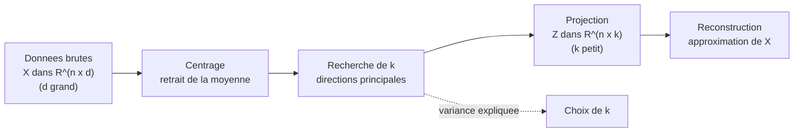
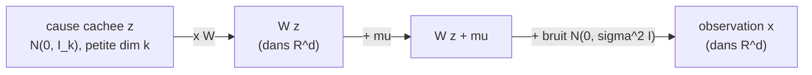

[← Sommaire](../README.md#table-des-matières)

# 10. Réduction de dimension par ACP

### Cadre de la réduction de dimension

Imaginez que vous disposiez d'un immense tableau de chiffres : chaque ligne decrit un objet (une photo, un client, une fleur, une cellule biologique) et chaque colonne mesure une caracteristique de cet objet (le nombre de pixels rouges, l'age du client, la longueur d'un petale, l'expression d'un gene). Quand il y a deux ou trois colonnes, on peut dessiner les points sur une feuille de papier ou dans une maquette en relief, et l'oeil comprend tout de suite la forme du nuage. Mais que faire avec **mille** colonnes ? On ne peut plus dessiner. Pire : avec autant de dimensions, les distances se brouillent, les calculs deviennent lourds, et beaucoup de colonnes racontent en realite **la meme histoire** sous des habits differents.

La **reduction de dimension** (dimensionality reduction) repond a ce probleme. Son idee : remplacer un tableau a beaucoup de colonnes par un tableau a peu de colonnes, **en perdant le moins d'information possible**. C'est exactement ce que fait un bon resume de roman : on passe de cinq cents pages a une page, et pourtant l'essentiel de l'intrigue est conserve. L'**analyse en composantes principales** (Principal Component Analysis, ACP, ou *PCA* en anglais) est la methode la plus celebre et la plus utilisee pour ce resume.

#### Pourquoi tant de dimensions posent probleme

Avant de construire l'ACP, prenons le temps de comprendre **pourquoi** on veut reduire la dimension. Trois grandes raisons reviennent sans cesse.

> **Definition — Donnees, observations, variables.**
> On appelle **donnees** un tableau de nombres. Chaque **ligne** est une *observation* (un individu, un exemple), notee par un vecteur $`\mathbf{x}_i`$. Chaque **colonne** est une *variable* (une caracteristique mesuree), aussi appelee *feature* en anglais. Le tableau complet, avec $`n`$ lignes et $`d`$ colonnes, est rassemble dans une matrice $`X \in \mathbb{R}^{n \times d}`$.

> **Le symbole $`\mathbf{x}_i`$.** Ce symbole represente **un objet decrit par plusieurs nombres a la fois**. Imagine une carte d'identite : au lieu d'ecrire « Marie, 28 ans, 1m65 » en toutes lettres, on empile les nombres dans une petite colonne $`\mathbf{x}_i = (28, 165, \dots)`$. Le gras nous rappelle que ce n'est pas un seul nombre mais **un paquet de nombres**. Le petit $`i`$ en bas est juste **l'etiquette du tiroir** : $`\mathbf{x}_1`$ est le premier objet, $`\mathbf{x}_2`$ le deuxieme, et ainsi de suite. Dans tout ce chapitre, $`\mathbf{x}_i \in \mathbb{R}^d`$ est un vecteur **colonne** ; quand on l'ecrit en ligne dans le tableau $`X`$, c'est sa transposee $`\mathbf{x}_i^{\top}`$ qui forme la $`i`$-ieme ligne.

> **Les symboles $`n`$ et $`d`$.** Le symbole $`n`$ represente **combien on a d'objets** (le nombre de lignes, comme le nombre de personnes dans une salle). Le symbole $`d`$ represente **combien de mesures on prend sur chaque objet** (le nombre de colonnes, comme le nombre de questions d'un questionnaire). Si on photographie $`n=1000`$ visages et que chaque image fait $`d=100\times100 = 10\,000`$ pixels, alors notre tableau a mille lignes et dix mille colonnes.

**1. Le fleau de la dimension (curse of dimensionality).** En grande dimension, l'espace est tellement vaste que les points deviennent presque tous « loin » les uns des autres, et les notions de proximite, de densite, de plus proche voisin perdent leur sens. Un petit exemple frappant : le volume d'une boule de rayon $`1`$ rapporte au volume du cube $`[-1,1]^d`$ qui la contient tend vers $`0`$ quand $`d`$ grandit (de $`0{,}52`$ en dimension 3, il chute a $`0{,}0025`$ en dimension 10, puis a $`2{,}5\cdot10^{-8}`$ en dimension 20). Autrement dit, en grande dimension, **presque tout le volume d'un cube est dans ses coins**, loin du centre. Les algorithmes qui s'appuient sur les distances (k plus proches voisins, regroupement / clustering) en souffrent directement.

**2. Le cout de calcul et de stockage.** Beaucoup de colonnes signifient beaucoup de memoire et des calculs plus lents. Reduire $`d`$ de $`10\,000`$ a $`50`$ peut transformer un entrainement de plusieurs heures en quelques secondes.

**3. La redondance et le bruit.** Dans la vraie vie, les colonnes ne sont presque jamais independantes. La taille en centimetres et la taille en pouces seraient parfaitement redondantes ; la taille et le poids le sont partiellement (les grandes personnes pesent souvent plus). Cette redondance veut dire que l'information « vraie » vit dans un espace **plus petit** que le tableau ne le laisse croire. L'ACP cherche precisement cet espace cache.

> **Intuition centrale.** Les donnees reelles, meme decrites par mille colonnes, sont souvent « aplaties » : elles vivent au voisinage d'un sous-espace de petite dimension, comme une feuille de papier froissee flotte dans une piece. Le papier est en relief (dimension 3) mais reste fondamentalement une surface (dimension 2). La reduction de dimension cherche a **deplier** ou au moins a **retrouver** cette feuille.

#### Le sous-espace lineaire : le cadre de l'ACP

L'ACP fait une hypothese simple et puissante : le sous-espace cache est **lineaire**, c'est-a-dire un *sous-espace affine* (une droite, un plan, un hyperplan passant par un point central). Ce n'est pas toujours vrai — une donnee enroulee en spirale ne sera pas bien capturee par un plan — mais cette hypothese rend les calculs exacts, rapides et interpretables. Les methodes non lineaires (t-SNE, UMAP, autoencodeurs) viendront plus tard ; l'ACP est la fondation.

> **Le symbole $`k`$.** Ce symbole represente **le nombre de colonnes qu'on veut garder a la fin**, la taille du resume. On a toujours $`k \le d`$ : on resume, on n'invente pas de colonnes. Si on passe de $`d=10\,000`$ pixels a $`k=50`$ nombres, alors $`k=50`$. Pense a $`k`$ comme au nombre de phrases que tu t'autorises pour resumer un livre.

Formellement, voici le contrat de l'ACP. On dispose de $`n`$ points $`\mathbf{x}_1, \dots, \mathbf{x}_n`$ dans $`\mathbb{R}^d`$. On veut trouver :

- un **point d'ancrage** (en general la moyenne du nuage), autour duquel tout se joue ;
- $`k`$ directions privilegiees (les futures « composantes principales »), formant une base orthonormee d'un sous-espace de dimension $`k`$ ;
- pour chaque point, $`k`$ **coordonnees** dans ce sous-espace (le resume), telles qu'on puisse **reconstruire** au mieux le point d'origine a partir de son resume.



Deux grandes lectures menent **exactement au meme calcul** mais eclairent l'ACP differemment :

| Perspective | Question posee | Critere optimise |
|---|---|---|
| **Variance maximale** | Quelle direction « etale » le plus le nuage ? | *Maximiser* la variance des projections |
| **Projection / reconstruction** | Quel sous-espace approche le mieux les points ? | *Minimiser* l'erreur de reconstruction |

C'est l'un des plus beaux resultats du domaine : ces deux objectifs en apparence opposes (maximiser l'un, minimiser l'autre) donnent **la meme reponse**. Nous le demontrerons. Mais d'abord, un objet incontournable : la matrice de covariance.

#### Centrage et matrice de covariance

Toute l'ACP repose sur la **dispersion** du nuage : comment les points s'eloignent de leur centre, et comment les variables varient **ensemble**. L'outil qui encode cela est la matrice de covariance. Avant de la definir, on doit **centrer** les donnees.

> **Le symbole $`\bar{\mathbf{x}}`$ (la moyenne).** La barre au-dessus signifie « moyenne ». Ce symbole represente **le point situe au milieu du nuage**, son centre de gravite. Pour le calculer, on additionne tous les points et on divise par leur nombre, exactement comme on fait la moyenne des notes d'une classe — sauf qu'ici chaque « note » est un vecteur, donc on fait la moyenne colonne par colonne. Si trois points valent $`(0,0)`$, $`(2,0)`$, $`(4,3)`$, leur moyenne est $`\big(\tfrac{0+2+4}{3}, \tfrac{0+0+3}{3}\big) = (2, 1)`$.

```math
\bar{\mathbf{x}} = \frac{1}{n} \sum_{i=1}^{n} \mathbf{x}_i \in \mathbb{R}^d
```

> Rappel de lecture : le grand $`\sum`$ est « la boucle qui additionne » deja vue ; ici elle parcourt les $`n`$ objets et les empile, puis on divise par $`n`$.

**Centrer** veut dire deplacer l'origine du repere sur ce centre de gravite, c'est-a-dire soustraire $`\bar{\mathbf{x}}`$ a chaque point :

```math
\tilde{\mathbf{x}}_i = \mathbf{x}_i - \bar{\mathbf{x}}.
```

> **Pourquoi centrer ?** Sans centrage, la « plus grande direction de variation » se confondrait avec la direction qui pointe vers le nuage depuis l'origine arbitraire du repere — une information sans interet, qui depend de la fois ou on a place le zero. En centrant, on dit : « ce qui m'interesse, ce n'est pas *ou* est le nuage, mais *comment il s'etale* ». La tilde $`\tilde{\ }`$ signale simplement « version centree ».

On range les points centres en lignes dans une matrice $`\tilde{X} \in \mathbb{R}^{n \times d}`$ (la $`i`$-ieme ligne est $`\tilde{\mathbf{x}}_i^{\top}`$). On peut alors definir l'objet vedette.

> **Le symbole $`S`$ — la matrice de covariance des donnees.** Ce symbole represente **un tableau carre qui mesure comment les variables bougent ensemble**. Sur sa diagonale, on lit la *variance* de chaque colonne (a quel point cette variable, seule, s'etale). En dehors de la diagonale, on lit la *covariance* entre deux colonnes : un nombre positif si elles montent ensemble (taille et poids), negatif si l'une monte quand l'autre descend (altitude et temperature), proche de zero si elles n'ont rien a voir. Imagine un tableau a double entree « variable contre variable » dont chaque case dit : « quand celle-ci augmente, qu'arrive-t-il a celle-la ? ». C'est le coeur battant de l'ACP : toute la geometrie du nuage y est resumee.

```math
S = \frac{1}{n} \sum_{i=1}^{n} (\mathbf{x}_i - \bar{\mathbf{x}})(\mathbf{x}_i - \bar{\mathbf{x}})^{\top} = \frac{1}{n}\, \tilde{X}^{\top}\tilde{X} \;\in\; \mathbb{R}^{d \times d}.
```

> **Pourquoi ce produit $`(\cdot)(\cdot)^{\top}`$ ?** Un vecteur colonne $`\tilde{\mathbf{x}}`$ ($`d\times 1`$) multiplie par sa propre transposee (en ligne, $`1\times d`$) donne une matrice $`d\times d`$ dont la case $`(j,\ell)`$ vaut $`\tilde{x}_j\,\tilde{x}_\ell`$ : le produit de l'ecart de la variable $`j`$ par l'ecart de la variable $`\ell`$. En moyennant sur tous les points, la case $`(j,\ell)`$ devient exactement la covariance entre la variable $`j`$ et la variable $`\ell`$. C'est ce qu'on appelle un *produit exterieur* (outer product) : il fabrique une matrice a partir de deux vecteurs.

> **Remarque — diviser par $`n`$ ou par $`n-1`$ ?** Avec $`\tfrac{1}{n}`$ on obtient l'estimateur du *maximum de vraisemblance* (biaise) ; avec $`\tfrac{1}{n-1}`$ l'estimateur *non biaise* (correction de Bessel). Pour l'ACP cela ne change **rien** aux directions principales (on multiplie $`S`$ par une constante, les vecteurs propres sont identiques, les valeurs propres juste reechelonnees). On gardera $`\tfrac{1}{n}`$ par simplicite, sauf mention contraire.

**Trois proprietes fondamentales de $`S`$** (elles justifient tout ce qui suit) :

1. $`S`$ est **symetrique** : $`S^{\top} = S`$. En effet $`(\tilde{X}^{\top}\tilde{X})^{\top} = \tilde{X}^{\top}\tilde{X}`$. Consequence majeure (theoreme spectral, vu au chapitre 4) : $`S`$ possede une base **orthonormee** de vecteurs propres et toutes ses valeurs propres sont **reelles**.
2. $`S`$ est **semi-definie positive** : pour tout vecteur $`\mathbf{u}`$, $`\mathbf{u}^{\top} S \,\mathbf{u} = \tfrac{1}{n}\sum_i (\tilde{\mathbf{x}}_i^{\top}\mathbf{u})^2 \ge 0`$. C'est une somme de carres. Consequence : toutes les valeurs propres de $`S`$ sont $`\ge 0`$. Ce sont, on le verra, des **variances** — et une variance ne peut pas etre negative.
3. La quantite $`\mathbf{u}^{\top} S\, \mathbf{u}`$ a une interpretation limpide : c'est **la variance des donnees une fois projetees sur la direction $`\mathbf{u}`$** (quand $`\|\mathbf{u}\|=1`$). Cette formule sera la cle de la perspective « variance maximale ».

```python
import numpy as np

def centrer(X):
    moyenne = X.mean(axis=0)
    return X - moyenne, moyenne

def matrice_covariance(X):
    Xc, _ = centrer(X)
    n = Xc.shape[0]
    return (Xc.T @ Xc) / n

rng = np.random.default_rng(0)
X = rng.normal(size=(500, 3)) @ np.array([[2.0, 0.0, 0.0],
                                          [1.5, 1.0, 0.0],
                                          [0.0, 0.0, 0.3]])
S = matrice_covariance(X)
print(np.round(S, 3))
print("S symetrique ?", np.allclose(S, S.T))
print("valeurs propres >= 0 ?", np.all(np.linalg.eigvalsh(S) >= -1e-12))
```

Avec ce cadre — un nuage centre, une matrice de covariance $`S`$ symetrique semi-definie positive — nous avons tout pour attaquer l'ACP. Le plan : (i) la lire comme une recherche de variance maximale, (ii) la relire comme une projection optimale, (iii) montrer que les deux coincident et se calculent par les vecteurs propres de $`S`$ (ou la SVD de $`\tilde{X}`$).

---

### Perspective de la variance maximale

Premiere facon de raconter l'ACP. On cherche **la direction le long de laquelle le nuage de points est le plus etale**. Pourquoi ? Parce que l'etalement, c'est l'information : une variable qui ne varie pas (tout le monde a la meme valeur) ne distingue personne et n'apprend rien. La direction de plus forte variance est celle qui « voit » le plus de differences entre les objets.

> **Image.** Posez une baguette de pain sur la table et eclairez-la avec une lampe. Selon l'orientation de la lampe, l'ombre de la baguette sur le mur est longue ou courte. La direction qui donne **l'ombre la plus longue** est celle qui suit la baguette dans sa longueur : c'est sa direction de plus grande variation. L'ACP cherche cette direction, puis la suivante (la plus longue parmi celles perpendiculaires a la premiere), et ainsi de suite.

#### La premiere composante principale

> **Le symbole $`\mathbf{u}`$ — une direction unitaire.** Ce symbole represente **une fleche qui pointe dans une direction, de longueur exactement 1**. On s'en sert comme d'une boussole : elle indique *vers ou regarder*, sans information de distance (la longueur est fixee a 1 pour ne comparer que les orientations). La contrainte $`\|\mathbf{u}\| = 1`$, c'est-a-dire $`\mathbf{u}^{\top}\mathbf{u} = 1`$, dit simplement « cette fleche mesure une unite ».

Projeter un point centre $`\tilde{\mathbf{x}}_i`$ sur la direction $`\mathbf{u}`$ donne le nombre $`\tilde{\mathbf{x}}_i^{\top}\mathbf{u}`$ : c'est la **coordonnee** du point le long de $`\mathbf{u}`$, la position de son ombre sur l'axe. La moyenne de ces projections est nulle (les donnees sont centrees), donc leur **variance** vaut :

```math
\mathrm{Var}\big(\tilde{\mathbf{x}}^{\top}\mathbf{u}\big) = \frac{1}{n}\sum_{i=1}^{n}\big(\tilde{\mathbf{x}}_i^{\top}\mathbf{u}\big)^2 = \frac{1}{n}\sum_{i=1}^{n} \mathbf{u}^{\top}\tilde{\mathbf{x}}_i\,\tilde{\mathbf{x}}_i^{\top}\mathbf{u} = \mathbf{u}^{\top}\!\left(\frac{1}{n}\sum_{i=1}^{n}\tilde{\mathbf{x}}_i\,\tilde{\mathbf{x}}_i^{\top}\right)\!\mathbf{u} = \mathbf{u}^{\top} S\,\mathbf{u}.
```

Ce petit calcul est le pivot de toute la section. Il dit : **la variance projetee sur $`\mathbf{u}`$ se lit directement sur la matrice de covariance**, via la *forme quadratique* $`\mathbf{u}^{\top} S\,\mathbf{u}`$. Trouver la direction de variance maximale, c'est donc resoudre :

```math
\boxed{\;\mathbf{u}_1 = \arg\max_{\mathbf{u}\,:\,\|\mathbf{u}\|=1}\; \mathbf{u}^{\top} S\,\mathbf{u}.\;}
```

> **Pourquoi la contrainte $`\|\mathbf{u}\|=1`$ est indispensable.** Sans elle, on pourrait rendre $`\mathbf{u}^{\top}S\,\mathbf{u}`$ aussi grand qu'on veut en allongeant $`\mathbf{u}`$ (doubler $`\mathbf{u}`$ quadruple la valeur). Le probleme n'aurait pas de solution finie. Fixer la longueur a 1 force a ne choisir qu'une *orientation*. C'est un probleme d'optimisation **sous contrainte** : l'outil adapte est le multiplicateur de Lagrange.

#### Resolution par les multiplicateurs de Lagrange

On forme le lagrangien (vu au chapitre sur l'optimisation) en attachant un multiplicateur $`\lambda`$ a la contrainte $`\mathbf{u}^{\top}\mathbf{u} = 1`$ :

```math
\mathcal{L}(\mathbf{u}, \lambda) = \mathbf{u}^{\top} S\,\mathbf{u} - \lambda\,(\mathbf{u}^{\top}\mathbf{u} - 1).
```

> **Le symbole $`\lambda`$ ici.** Dans ce contexte, $`\lambda`$ est d'abord le *multiplicateur de Lagrange* : un nombre qu'on ajoute pour « payer le respect » de la contrainte de longueur. La surprise — qu'on va voir a l'instant — c'est qu'il se revele etre **une valeur propre** de $`S`$. Deux roles, un seul symbole, et ce n'est pas un hasard.

On annule le gradient par rapport a $`\mathbf{u}`$. Comme $`\nabla_{\mathbf{u}}(\mathbf{u}^{\top} S\,\mathbf{u}) = 2 S\,\mathbf{u}`$ (car $`S`$ est symetrique) et $`\nabla_{\mathbf{u}}(\mathbf{u}^{\top}\mathbf{u}) = 2\mathbf{u}`$ :

```math
\nabla_{\mathbf{u}}\mathcal{L} = 2 S\,\mathbf{u} - 2\lambda\,\mathbf{u} = \mathbf{0} \quad\Longleftrightarrow\quad \boxed{\,S\,\mathbf{u} = \lambda\,\mathbf{u}.\,}
```

Voila le coeur de l'ACP : la direction de variance maximale est un **vecteur propre** (eigenvector) de la matrice de covariance, et le multiplicateur $`\lambda`$ associe en est la **valeur propre** (eigenvalue). Mais laquelle des $`d`$ valeurs propres choisir ? Reportons $`S\mathbf{u} = \lambda\mathbf{u}`$ dans la quantite a maximiser :

```math
\mathbf{u}^{\top} S\,\mathbf{u} = \mathbf{u}^{\top}(\lambda \mathbf{u}) = \lambda\,(\mathbf{u}^{\top}\mathbf{u}) = \lambda.
```

La variance projetee **est egale a la valeur propre**. Pour la maximiser, on prend donc la **plus grande** valeur propre $`\lambda_1`$, et $`\mathbf{u}_1`$ son vecteur propre. Ce vecteur $`\mathbf{u}_1`$ est la **premiere composante principale** (first principal component) ; la valeur $`\lambda_1`$ est la variance des donnees le long de cette direction.

> **Le symbole « composante principale ».** Une composante principale represente **une nouvelle direction de regard sur les donnees, taillee sur mesure pour le nuage**. La premiere est l'axe le plus etale ; la deuxieme, l'axe le plus etale parmi ceux perpendiculaires au premier ; etc. Ce sont les axes « naturels » du nuage, comme les axes d'une ellipse : on tourne le repere pour qu'il epouse la forme reelle des donnees au lieu de garder les colonnes d'origine, souvent mal orientees.

#### Les composantes suivantes

Pour la deuxieme direction, on impose qu'elle soit **orthogonale** a la premiere (sinon on retrouverait la meme information) :

```math
\mathbf{u}_2 = \arg\max_{\substack{\|\mathbf{u}\|=1 \\ \mathbf{u}^{\top}\mathbf{u}_1 = 0}} \mathbf{u}^{\top} S\,\mathbf{u}.
```

Le meme calcul de Lagrange (avec deux contraintes) montre que $`\mathbf{u}_2`$ est le vecteur propre associe a la **deuxieme plus grande** valeur propre $`\lambda_2`$. En iterant, on obtient le resultat central.

> **Theoreme (ACP par diagonalisation de la covariance).** Soit $`S`$ la matrice de covariance, symetrique semi-definie positive. Notons ses valeurs propres rangees par ordre decroissant $`\lambda_1 \ge \lambda_2 \ge \dots \ge \lambda_d \ge 0`$ et $`\mathbf{u}_1, \dots, \mathbf{u}_d`$ une base orthonormee de vecteurs propres associes. Alors, pour tout $`k`$, le sous-espace qui maximise la variance totale projetee parmi tous les sous-espaces de dimension $`k`$ est engendre par $`\mathbf{u}_1, \dots, \mathbf{u}_k`$. La variance capturee vaut $`\lambda_1 + \dots + \lambda_k`$.

> **Demonstration (recurrence).** Le cas $`k=1`$ est etabli ci-dessus. Supposons le resultat vrai jusqu'au rang $`k-1`$, avec composantes $`\mathbf{u}_1,\dots,\mathbf{u}_{k-1}`$. On cherche $`\mathbf{u}_k`$ unitaire, orthogonal aux precedents, maximisant $`\mathbf{u}^{\top}S\mathbf{u}`$. Decomposons tout vecteur candidat dans la base propre : $`\mathbf{u} = \sum_{j=1}^{d} c_j \mathbf{u}_j`$ avec $`\sum_j c_j^2 = 1`$ (norme 1) et, par orthogonalite aux precedents, $`c_1 = \dots = c_{k-1} = 0`$. Alors, en utilisant $`S\mathbf{u}_j = \lambda_j \mathbf{u}_j`$ et l'orthonormalite,
> ```math
> \mathbf{u}^{\top}S\mathbf{u} = \sum_{j=k}^{d} \lambda_j c_j^2 \le \lambda_k \sum_{j=k}^{d} c_j^2 = \lambda_k,
> ```
> l'inegalite venant de $`\lambda_j \le \lambda_k`$ pour $`j \ge k`$. Le maximum $`\lambda_k`$ est atteint en prenant $`c_k = 1`$ et les autres nuls, c'est-a-dire $`\mathbf{u} = \mathbf{u}_k`$. Par recurrence, $`\mathbf{u}_1,\dots,\mathbf{u}_k`$ realisent l'optimum et la variance totale captee est $`\sum_{j=1}^k \lambda_j`$. $`\blacksquare`$

> **Lien avec la trace.** La variance **totale** du nuage (somme des variances de toutes les colonnes) vaut $`\mathrm{tr}(S) = \sum_{j=1}^d \lambda_j`$, car la trace est invariante par changement de base orthonormee et egale la somme des valeurs propres. C'est pourquoi on parle de *part* de variance : chaque $`\lambda_j`$ est une part du gateau total $`\mathrm{tr}(S)`$.

> **Le symbole « variance expliquee ».** La *variance expliquee* (explained variance) par les $`k`$ premieres composantes represente **la fraction de l'etalement total du nuage que notre resume conserve**. C'est un pourcentage de fidelite : si les deux premieres composantes expliquent 95 % de la variance, cela veut dire que notre dessin en 2D garde 95 % de la « richesse » du nuage d'origine, et qu'on n'en perd que 5 %. On la calcule par le *ratio de variance expliquee* :
> ```math
> \text{ratio}_k = \frac{\lambda_1 + \dots + \lambda_k}{\lambda_1 + \dots + \lambda_d} = \frac{\sum_{j=1}^{k}\lambda_j}{\mathrm{tr}(S)}.
> ```

#### Exemple chiffre deroule pas a pas

Choisissons un cas ou les variables sont **correlees** pour voir l'ACP tourner le repere. Soit les points
$`(1,1),\quad (2,2),\quad (3,3),\quad (4,4),\quad (5,5).`$
Ils sont parfaitement alignes sur la droite $`y=x`$ : une seule direction porte toute l'information.

**Etape 1 — moyenne.** $`\bar{\mathbf{x}} = \big(\tfrac{1+2+3+4+5}{5}, \tfrac{1+2+3+4+5}{5}\big) = (3,3)`$.

**Etape 2 — centrage.** Les points centres : $`(-2,-2),(-1,-1),(0,0),(1,1),(2,2)`$.

**Etape 3 — covariance.** Variance de la colonne 1 : $`\tfrac{1}{5}(4+1+0+1+4) = 2`$. Idem colonne 2 : $`2`$. Covariance : $`\tfrac{1}{5}((-2)(-2)+(-1)(-1)+0+1\cdot1+2\cdot2) = \tfrac{10}{5}=2`$. Donc
```math
S = \begin{pmatrix} 2 & 2 \\ 2 & 2 \end{pmatrix}.
```

**Etape 4 — valeurs propres.** $`\det(S - \lambda I) = (2-\lambda)^2 - 4 = \lambda^2 - 4\lambda = \lambda(\lambda - 4)`$. D'ou $`\lambda_1 = 4`$, $`\lambda_2 = 0`$.

**Etape 5 — vecteurs propres.** Pour $`\lambda_1=4`$ : $`(S-4I)\mathbf{u}=0`$ donne $`-2u_1+2u_2=0`$, soit $`u_1=u_2`$ ; normalise : $`\mathbf{u}_1 = \tfrac{1}{\sqrt2}(1,1)`$. Pour $`\lambda_2=0`$ : $`\mathbf{u}_2 = \tfrac{1}{\sqrt2}(1,-1)`$.

**Lecture.** La premiere composante pointe **exactement le long de $`y=x`$** : l'ACP a retrouve la droite porteuse. La variance le long de $`\mathbf{u}_1`$ vaut $`\lambda_1=4`$, le long de $`\mathbf{u}_2`$ vaut $`\lambda_2=0`$ : il n'y a aucune dispersion perpendiculaire (les points sont alignes). Le ratio de variance explique par la 1re composante : $`\tfrac{4}{4+0}=100\%`$. On peut donc resumer ces points 2D par **un seul nombre** (leur position le long de $`\mathbf{u}_1`$) sans rien perdre.

```python
import numpy as np

P = np.array([[1,1],[2,2],[3,3],[4,4],[5,5]], dtype=float)
Pc = P - P.mean(axis=0)
S = (Pc.T @ Pc) / len(P)

valeurs, vecteurs = np.linalg.eigh(S)          # eigh : matrice symetrique, valeurs croissantes
ordre = np.argsort(valeurs)[::-1]              # on remet en ordre decroissant
valeurs, vecteurs = valeurs[ordre], vecteurs[:, ordre]

print("valeurs propres :", np.round(valeurs, 6))
print("1re composante  :", np.round(vecteurs[:, 0], 6))
print("ratio variance  :", np.round(valeurs / valeurs.sum(), 6))
```

> **Application en machine learning.** En reconnaissance de visages, l'ACP appliquee a des milliers d'images produit des *eigenfaces* (visages propres) : les premieres composantes capturent l'eclairage et la forme globale du visage, les suivantes des details. Garder $`k\approx 100`$ composantes sur des images de $`10\,000`$ pixels suffit souvent a reconnaitre une personne, tout en divisant par 100 la taille des donnees. La variance expliquee guide le choix de $`k`$ : on prend assez de composantes pour atteindre, disons, 95 %.

---

### Perspective de la projection

Changeons completement de point de vue — et pourtant nous allons retomber sur les memes vecteurs propres. Au lieu de demander « quelle direction etale le plus le nuage ? », demandons : « si je dois ecraser les points sur un sous-espace de dimension $`k`$, **quel sous-espace deforme le moins les points** ? ». C'est la perspective de la **reconstruction** : on veut pouvoir reconstruire chaque point a partir de son resume avec le minimum d'erreur.

> **Image.** Vous photographiez une sculpture en relief : la photo est plate (dimension 2), la sculpture est en relief (dimension 3). Selon l'angle de prise de vue, la photo trahit plus ou moins la forme reelle. La perspective de la projection cherche **le meilleur angle**, celui sous lequel on pourra le mieux « deviner » la sculpture a partir de la photo. La distance entre chaque point reel et son ombre sur la photo, c'est l'erreur ; on veut la rendre minimale.

#### Projeter, reconstruire, mesurer l'erreur

On se donne un repere orthonorme $`\mathbf{u}_1, \dots, \mathbf{u}_k`$ du sous-espace candidat (toujours $`k \le d`$). On range ces vecteurs en colonnes dans une matrice $`U_k \in \mathbb{R}^{d\times k}`$, qui verifie $`U_k^{\top} U_k = I_k`$ (colonnes orthonormees).

> **Le symbole $`\mathbf{z}_i`$ — le code, le resume du point.** Ce symbole represente **les quelques nombres qui resument un objet** dans le nouveau repere. Si $`\mathbf{x}_i`$ etait une longue carte d'identite a $`d`$ cases, alors $`\mathbf{z}_i`$ en est la version « carte de visite » a $`k`$ cases. On l'appelle aussi le *code* ou les *scores* du point. Passer de $`\mathbf{x}_i`$ a $`\mathbf{z}_i`$, c'est *encoder* ; revenir en arriere, c'est *decoder*.

**Encodage** (projection sur le sous-espace) : la coordonnee du point centre le long de chaque axe est un produit scalaire, donc
```math
\mathbf{z}_i = U_k^{\top}(\mathbf{x}_i - \bar{\mathbf{x}}) \in \mathbb{R}^k.
```

> **Le symbole « reconstruction ».** La *reconstruction* represente **le point qu'on obtient en repartant du resume pour reconstruire l'objet d'origine**. C'est la « meilleure devinette » de $`\mathbf{x}_i`$ qu'on puisse faire en ne connaissant que son code $`\mathbf{z}_i`$ et les axes choisis. Comme on a jete une partie de l'information (les directions hors du sous-espace), cette devinette est en general imparfaite : l'ecart entre le vrai point et sa reconstruction est l'**erreur de reconstruction**.

**Decodage** (reconstruction) : on replace le code dans l'espace d'origine et on rajoute le centre,
```math
\hat{\mathbf{x}}_i = \bar{\mathbf{x}} + U_k\,\mathbf{z}_i = \bar{\mathbf{x}} + U_k U_k^{\top}(\mathbf{x}_i - \bar{\mathbf{x}}).
```

La matrice $`P = U_k U_k^{\top} \in \mathbb{R}^{d\times d}`$ est un **projecteur orthogonal** : elle verifie $`P^{\top}=P`$ et $`P^2 = P`$ (projeter deux fois ne change rien de plus que projeter une fois). Elle envoie chaque point centre sur le sous-espace.

L'**erreur de reconstruction** moyenne, qu'on cherche a minimiser, est la moyenne des distances au carre entre points reels et reconstructions :

```math
J(U_k) = \frac{1}{n}\sum_{i=1}^{n}\big\|\mathbf{x}_i - \hat{\mathbf{x}}_i\big\|^2 = \frac{1}{n}\sum_{i=1}^{n}\big\|\tilde{\mathbf{x}}_i - U_k U_k^{\top}\tilde{\mathbf{x}}_i\big\|^2.
```

> **Le symbole $`J`$.** Ce symbole represente **la note de mauvaise qualite du resume** : plus $`J`$ est grand, plus on a deforme les points ; plus $`J`$ est petit, plus la reconstruction est fidele. C'est une *fonction de cout* (cost / loss). Notre but : choisir le sous-espace $`U_k`$ qui rend cette note la plus basse possible. La double barre $`\|\cdot\|`$ est la longueur (norme) du vecteur d'ecart, et le carre evite les signes negatifs tout en penalisant fort les gros ecarts.

#### Le theoreme de Pythagore qui relie les deux perspectives

Voici le moment cle. Pour chaque point centre $`\tilde{\mathbf{x}}_i`$, decomposons-le en sa part **dans** le sous-espace ($`U_kU_k^{\top}\tilde{\mathbf{x}}_i`$, gardee) et sa part **perpendiculaire** ($`\tilde{\mathbf{x}}_i - U_kU_k^{\top}\tilde{\mathbf{x}}_i`$, jetee). Ces deux parts sont orthogonales (propriete du projecteur orthogonal), donc le theoreme de Pythagore donne :

```math
\|\tilde{\mathbf{x}}_i\|^2 = \underbrace{\|U_kU_k^{\top}\tilde{\mathbf{x}}_i\|^2}_{\text{garde (projection)}} + \underbrace{\|\tilde{\mathbf{x}}_i - U_kU_k^{\top}\tilde{\mathbf{x}}_i\|^2}_{\text{jete (erreur)}}.
```

En moyennant sur les $`n`$ points :

```math
\underbrace{\frac{1}{n}\sum_i \|\tilde{\mathbf{x}}_i\|^2}_{\text{variance totale } = \,\mathrm{tr}(S)} = \underbrace{\frac{1}{n}\sum_i \|U_kU_k^{\top}\tilde{\mathbf{x}}_i\|^2}_{\text{variance projetee}} + \underbrace{J(U_k)}_{\text{erreur}}.
```

> **La revelation.** Le membre de gauche, la variance totale, est une **constante** : elle ne depend pas du sous-espace choisi, seulement des donnees. Donc **maximiser la variance projetee** (perspective 1) revient **exactement** a **minimiser l'erreur de reconstruction** $`J`$ (perspective 2). Ce ne sont pas deux methodes qui se ressemblent : c'est **une seule et meme equation** lue de deux cotes. Tout ce qui est gagne d'un cote (variance gardee) est exactement ce qui est perdu de l'autre (erreur).

Comme la variance projetee est maximale pour $`U_k = (\mathbf{u}_1,\dots,\mathbf{u}_k)`$ (vu a la section precedente), on en deduit :

> **Theoreme (ACP comme meilleure approximation lineaire).** Parmi tous les sous-espaces affines de dimension $`k`$, celui qui minimise l'erreur quadratique moyenne de reconstruction est l'espace affine passant par $`\bar{\mathbf{x}}`$ et engendre par les $`k`$ premiers vecteurs propres $`\mathbf{u}_1, \dots, \mathbf{u}_k`$ de la matrice de covariance $`S`$. L'erreur minimale vaut la somme des valeurs propres **abandonnees** :
> ```math
> J_{\min} = \lambda_{k+1} + \lambda_{k+2} + \dots + \lambda_d = \sum_{j=k+1}^{d}\lambda_j.
> ```

> **Demonstration.** La variance projetee maximale vaut $`\sum_{j=1}^k \lambda_j`$ (theoreme precedent). La variance totale vaut $`\sum_{j=1}^d \lambda_j`$. Par l'egalite de Pythagore moyennee, $`J_{\min} = \sum_{j=1}^d \lambda_j - \sum_{j=1}^k \lambda_j = \sum_{j=k+1}^d \lambda_j`$. $`\blacksquare`$

Cela donne une lecture tres concrete des valeurs propres : $`\lambda_{k+1},\dots,\lambda_d`$ sont **exactement ce qu'on perd** en se limitant a $`k`$ composantes. Si ces valeurs propres « de queue » sont minuscules, on peut couper sans remords.

#### Exemple chiffre : projeter sur la meilleure droite

Reprenons un nuage legerement bruite autour de la droite $`y=x`$. Soit les points **deja centres** (leur moyenne est bien $`(0,0)`$)
$`(-2,-1.8),\ (-1,-1.2),\ (0,0.1),\ (1,0.9),\ (2,2.0).`$

La matrice de covariance (calcul direct, $`\tfrac1n`$ avec $`n=5`$) vaut
```math
S = \begin{pmatrix} 2.00 & 1.94 \\ 1.94 & 1.90 \end{pmatrix},
```
de valeurs propres $`\lambda_1 \approx 3{,}89`$ et $`\lambda_2 \approx 0{,}009`$, de premiere composante $`\mathbf{u}_1 \approx (0{,}716,\ 0{,}698)`$ (quasi la diagonale). La variance totale vaut $`\mathrm{tr}(S) = 3{,}9`$.

- **Si on projette sur $`\mathbf{u}_1`$** ($`k=1`$) : erreur $`J_{\min} = \lambda_2 \approx 0{,}009`$. Quasi nulle : les points sont presque alignes, l'ombre sur $`\mathbf{u}_1`$ les represente tres bien.
- **Si on projetait betement sur l'axe horizontal** $`\mathbf{e}_1 = (1,0)`$ : on garderait la variance $`\mathbf{e}_1^{\top}S\mathbf{e}_1 = 2{,}0`$ seulement, et on perdrait $`3{,}9 - 2{,}0 = 1{,}9`$. Soit **plus de 200 fois** l'erreur obtenue en choisissant la bonne direction.

C'est tout l'interet de l'ACP : choisir la projection **intelligente** plutot que de jeter naivement des colonnes.

```python
import numpy as np

Xc = np.array([[-2,-1.8],[-1,-1.2],[0,0.1],[1,0.9],[2,2.0]])
n = len(Xc)
S = (Xc.T @ Xc) / n
val, vec = np.linalg.eigh(S)
val, vec = val[::-1], vec[:, ::-1]          # decroissant
u1 = vec[:, 0]

P = np.outer(u1, u1)                         # projecteur sur la droite u1
recon = Xc @ P.T                             # reconstructions (donnees centrees)
err_pca = np.mean(np.sum((Xc - recon)**2, axis=1))

e1 = np.array([1.0, 0.0])
P_naif = np.outer(e1, e1)
recon_naif = Xc @ P_naif.T
err_naif = np.mean(np.sum((Xc - recon_naif)**2, axis=1))

print("S                           :", np.round(S, 3).tolist())
print("valeurs propres             :", np.round(val, 4))
print("lambda_2 (erreur theorique) :", round(val[1], 4))
print("erreur ACP                  :", round(err_pca, 4))
print("erreur projection naive (x) :", round(err_naif, 4))
```

> **Application en machine learning.** La perspective reconstruction fait de l'ACP l'ancetre lineaire de l'*autoencodeur* (autoencoder). Un autoencodeur lineaire a une couche cachee de taille $`k`$, entraine a minimiser l'erreur quadratique de reconstruction, **converge vers le sous-espace de l'ACP** (a une transformation inversible pres dans l'espace latent). C'est aussi la base de la *compression* : on stocke les codes $`\mathbf{z}_i`$ (legers) et la matrice $`U_k`$ une seule fois, plutot que les images entieres. Et c'est un detecteur d'anomalies : un point dont l'erreur de reconstruction est anormalement grande « ne ressemble pas » aux donnees d'entrainement.

> **Mise a jour 2026.** La parente ACP ↔ autoencodeur reste un repere pedagogique majeur, mais on sait depuis quelques annees la nuancer : avec des non-linearites et des regularisations modernes, un autoencodeur profond peut capturer des structures **courbes** que l'ACP rate. En pratique 2026, on essaie quasi systematiquement l'ACP **d'abord** (rapide, deterministe, interpretable) comme reference et comme pre-reduction avant un modele non lineaire (UMAP, autoencodeur variationnel). « ACP d'abord, sophistication ensuite » est devenu un reflexe sain.

---

### Calcul des vecteurs propres et approximations de rang faible

On sait *quoi* calculer (les vecteurs propres de $`S`$). Reste *comment* le faire — efficacement, de maniere stable, et a grande echelle. Cette section relie l'ACP a la **decomposition en valeurs singulieres** (SVD), donne les algorithmes pratiques, et etablit le lien fondamental avec l'**approximation de rang faible** (low-rank approximation) via le theoreme d'Eckart–Young.

#### ACP via la SVD : la voie royale

Calculer $`S = \tfrac{1}{n}\tilde{X}^{\top}\tilde{X}`$ puis la diagonaliser fonctionne, mais ce n'est **ni la methode la plus stable ni la plus efficace**. Former $`\tilde{X}^{\top}\tilde{X}`$ eleve au carre le *conditionnement* du probleme (les petites valeurs singulieres deviennent minuscules et se noient dans les erreurs d'arrondi) et coute $`O(nd^2)`$. La SVD de $`\tilde{X}`$ contourne ces deux ecueils.

Rappel (chapitre 4) : toute matrice $`\tilde{X} \in \mathbb{R}^{n\times d}`$ s'ecrit
```math
\tilde{X} = U\,\Sigma\,V^{\top},
```
avec $`U \in \mathbb{R}^{n\times n}`$ et $`V \in \mathbb{R}^{d\times d}`$ orthogonales, et $`\Sigma \in \mathbb{R}^{n\times d}`$ « diagonale » portant les **valeurs singulieres** $`\sigma_1 \ge \sigma_2 \ge \dots \ge 0`$.

> **Le symbole $`\sigma_j`$ (valeur singuliere).** Ce symbole represente **la force de la $`j`$-ieme direction principale, mesuree sur les donnees brutes plutot que sur la covariance**. C'est en quelque sorte la « longueur » de l'etalement le long de l'axe $`j`$, avant qu'on l'eleve au carre. Plus $`\sigma_j`$ est grand, plus cette direction porte de signal.

Le lien avec $`S`$ est immediat. En utilisant $`U^{\top}U = I_n`$ :
```math
S = \frac{1}{n}\tilde{X}^{\top}\tilde{X} = \frac{1}{n} V\Sigma^{\top}U^{\top}U\Sigma V^{\top} = \frac{1}{n} V\,(\Sigma^{\top}\Sigma)\,V^{\top} = V\,\mathrm{diag}\!\Big(\tfrac{\sigma_1^2}{n},\dots,\tfrac{\sigma_d^2}{n}\Big)V^{\top}.
```

C'est **exactement** une diagonalisation de $`S`$. On en deduit le dictionnaire de traduction, a connaitre par coeur :

| Objet ACP | Donne par la SVD de $`\tilde{X}`$ |
|---|---|
| Vecteurs propres de $`S`$ (composantes principales) | colonnes de $`V`$, c.-a-d. $`\mathbf{u}_j = \mathbf{v}_j`$ |
| Valeurs propres de $`S`$ (variances) | $`\lambda_j = \sigma_j^2 / n`$ |
| Codes / scores $`\mathbf{z}_i`$ (projection des points) | lignes de $`\tilde{X}V_k = U_k\Sigma_k`$ |

Autrement dit : **les directions principales sont les vecteurs singuliers a droite de $`\tilde{X}`$**, et **les valeurs propres sont les carres des valeurs singulieres divises par $`n`$**. On n'a jamais besoin de former $`S`$.

```python
import numpy as np

def acp_par_svd(X, k):
    Xc = X - X.mean(axis=0)
    n = Xc.shape[0]
    U, s, Vt = np.linalg.svd(Xc, full_matrices=False)
    composantes = Vt[:k]                 # k directions principales (lignes)
    valeurs_propres = (s**2) / n         # variances
    scores = (U[:, :k] * s[:k])          # = Xc @ Vt[:k].T, les codes z_i
    ratio = valeurs_propres / valeurs_propres.sum()
    return composantes, valeurs_propres, scores, ratio

rng = np.random.default_rng(1)
X = rng.normal(size=(200, 5)) @ rng.normal(size=(5, 5))
comp, val, Z, ratio = acp_par_svd(X, k=2)
print("variances (lambda) :", np.round(val, 3))
print("ratio cumule       :", np.round(np.cumsum(ratio), 3))
print("forme des scores   :", Z.shape)
```

#### Le theoreme d'Eckart–Young : l'ACP est la meilleure approximation de rang faible

L'ACP peut se voir comme la reponse a une question d'**algebre matricielle pure**, independante de toute statistique : *quelle matrice de rang au plus $`k`$ approche le mieux $`\tilde{X}`$ ?* La reponse est l'un des theoremes les plus importants de l'algebre lineaire numerique.

> **Le symbole « rang $`k`$ ».** Le *rang* d'une matrice represente **le nombre de directions vraiment independantes qu'elle contient**. Une matrice de rang 1 est « pauvre » : toutes ses lignes sont des multiples d'une seule. Demander une approximation de rang $`k`$, c'est demander la meilleure version « comprimee a $`k`$ directions » de la matrice. C'est exactement l'idee de la reduction de dimension, traduite en langage matriciel.

> **Le symbole $`\|\cdot\|_F`$ (norme de Frobenius).** Ce symbole represente **la taille globale d'une matrice, mesuree en mettant tous ses coefficients dans un grand sac et en prenant la racine de la somme de leurs carres**. C'est la norme euclidienne, mais appliquee a une matrice vue comme une longue liste de nombres : $`\|A\|_F = \sqrt{\sum_{i,j} A_{ij}^2}`$. Elle mesure « a quel point deux matrices different » quand on ecrit $`\|A-B\|_F`$.

> **Theoreme (Eckart–Young–Mirsky).** Soit $`\tilde{X} = U\Sigma V^{\top}`$ de valeurs singulieres $`\sigma_1 \ge \dots \ge \sigma_r > 0`$ (avec $`r = \mathrm{rang}(\tilde{X})`$). Pour tout $`k < r`$, la meilleure approximation de rang $`\le k`$ au sens de la norme de Frobenius (et aussi de la norme spectrale) est la *SVD tronquee*
> ```math
> \tilde{X}_k = U_k \Sigma_k V_k^{\top} = \sum_{j=1}^{k} \sigma_j\,\mathbf{u}_j\,\mathbf{v}_j^{\top},
> ```
> ou $`\mathbf{u}_j`$ est le $`j`$-ieme vecteur singulier **a gauche** (colonne de $`U`$) et $`\mathbf{v}_j`$ le $`j`$-ieme vecteur singulier **a droite** (colonne de $`V`$). L'erreur minimale vaut
> ```math
> \min_{\mathrm{rang}(B)\le k}\|\tilde{X}-B\|_F^2 = \sum_{j=k+1}^{r}\sigma_j^2.
> ```

> **Demonstration (esquisse rigoureuse).** Ecrivons $`\tilde{X} = \sum_j \sigma_j \mathbf{u}_j\mathbf{v}_j^{\top}`$. Pour toute matrice $`B`$ de rang $`\le k`$, on montre via les valeurs singulieres que $`\|\tilde{X}-B\|_F^2 \ge \sum_{j>k}\sigma_j^2`$, l'argument cle etant l'inegalite de Weyl sur les valeurs singulieres d'une somme : tronquer la SVD apres $`k`$ termes annule les $`k`$ plus grandes contributions $`\sigma_1,\dots,\sigma_k`$ et ne laisse que la queue $`\sigma_{k+1},\dots`$, ce qui sature la borne. La borne etant atteinte par $`\tilde{X}_k`$, c'est bien l'optimum. Le detail complet (cas Frobenius et cas spectral) est l'objet de l'exercice 5. $`\blacksquare`$

Le lien avec l'ACP saute aux yeux : la reconstruction ACP de tous les points (centres), empilee en matrice, est **precisement** $`\tilde{X}_k`$. L'erreur de reconstruction de l'ACP $`J_{\min} = \tfrac{1}{n}\sum_{j>k}\sigma_j^2 = \sum_{j>k}\lambda_j`$ est l'erreur d'Eckart–Young divisee par $`n`$. **L'ACP n'est rien d'autre que la SVD tronquee des donnees centrees.**

```python
import numpy as np

rng = np.random.default_rng(2)
A = rng.normal(size=(6, 4))
U, s, Vt = np.linalg.svd(A, full_matrices=False)

k = 2
A_k = U[:, :k] @ np.diag(s[:k]) @ Vt[:k]      # SVD tronquee = meilleure approx rang 2
err = np.linalg.norm(A - A_k, 'fro')**2
print("erreur SVD tronquee :", round(err, 4))
print("somme sigma^2 (j>k) :", round((s[k:]**2).sum(), 4))   # identiques (Eckart-Young)

B = U[:, :k] @ np.diag(s[:k]) @ Vt[:k] + 1e-3*rng.normal(size=A.shape)  # rang <= k perturbe
print("erreur d'un B concurrent (>=) :", round(np.linalg.norm(A - B, 'fro')**2, 4))
```

#### Methodes de calcul : exact, iteratif, randomise

Selon la taille du probleme, on choisit l'une de ces strategies.

| Methode | Quand l'utiliser | Cout indicatif |
|---|---|---|
| Diagonalisation de $`S`$ (`eigh`) | $`d`$ petit ($`\lesssim`$ quelques milliers), $`n`$ quelconque | $`O(nd^2 + d^3)`$ |
| SVD complete de $`\tilde{X}`$ (`svd`) | $`n,d`$ moderes ; meilleure stabilite | $`O(\min(nd^2, n^2d))`$ |
| **Iteration de la puissance / Lanczos** | on ne veut que $`k \ll d`$ composantes | $`O(ndk)`$ par balayage |
| **SVD randomisee** | $`n,d`$ tres grands, $`k`$ petit | $`O(ndk)`$, tres rapide |

L'**iteration de la puissance** (power iteration) trouve le vecteur propre dominant en multipliant repetitivement un vecteur aleatoire par $`S`$ : chaque produit amplifie la composante associee a $`\lambda_1`$, qui finit par ecraser les autres. Avec une *deflation* (on retire la composante trouvee), on obtient les suivantes.

```python
import numpy as np

def iteration_puissance(S, n_iter=1000, tol=1e-12):
    d = S.shape[0]
    u = np.random.default_rng(0).normal(size=d)
    u /= np.linalg.norm(u)
    lam_old = 0.0
    for _ in range(n_iter):
        w = S @ u
        u = w / np.linalg.norm(w)
        lam = u @ S @ u                      # quotient de Rayleigh = variance projetee
        if abs(lam - lam_old) < tol:
            break
        lam_old = lam
    return lam, u

S = np.array([[2.0, 2.0], [2.0, 2.0]])
lam, u = iteration_puissance(S)
print("plus grande valeur propre :", round(lam, 6))   # ~ 4
print("vecteur propre dominant   :", np.round(np.abs(u), 6))  # ~ (0.707, 0.707)
```

> **Mise a jour 2026.** Pour les matrices massives (genomique, NLP, recommandation), la **SVD randomisee** de Halko–Martinsson–Tropp s'est imposee comme standard : on projette $`\tilde{X}`$ sur un petit sous-espace aleatoire de dimension $`k+p`$ (avec un faible *oversampling* $`p`$, typiquement 5 a 10), on orthonormalise, puis on fait une SVD exacte sur cette esquisse minuscule. Cout $`O(ndk)`$ au lieu de $`O(nd^2)`$, avec des garanties probabilistes serrees et une precision quasi optimale. C'est ce qu'utilisent `sklearn.decomposition.PCA(svd_solver="randomized")` et `TruncatedSVD`. Combinee a l'autodiff (JAX/PyTorch) pour les pipelines bout-en-bout, et a des solveurs *out-of-core* pour les donnees qui ne tiennent pas en memoire, elle rend l'ACP applicable a des matrices de plusieurs milliards de coefficients.

> **Piege numerique a retenir.** Ne calculez **jamais** $`S=\tilde{X}^{\top}\tilde{X}`$ pour ensuite diagonaliser si la stabilite compte : vous perdez environ la moitie des chiffres significatifs (le conditionnement est eleve au carre). Passez par la SVD de $`\tilde{X}`$ directement. C'est la difference entre un resultat juste et un resultat ou les petites composantes sont du pur bruit d'arrondi.

---

### L'ACP en grande dimension

Que se passe-t-il quand le nombre de variables **depasse** le nombre d'observations, $`d > n`$ — voire $`d \gg n`$ ? C'est le quotidien de la genomique (des dizaines de milliers de genes, quelques centaines de patients), de l'imagerie (des millions de pixels, quelques milliers d'images), du traitement du langage. La matrice de covariance $`S \in \mathbb{R}^{d\times d}`$ devient gigantesque et **singuliere**, mais l'ACP reste calculable — et un joli tour de passe-passe la rend meme bon marche.

#### Le rang est limite par le nombre de points

Premiere observation cruciale : $`n`$ points centres vivent dans un sous-espace de dimension **au plus** $`n-1`$ (le centrage « consomme » un degre de liberte, car les ecarts centres somment a zero : $`\sum_i \tilde{\mathbf{x}}_i = \mathbf{0}`$). Donc

```math
\mathrm{rang}(\tilde{X}) \le \min(n-1,\ d).
```

Quand $`d > n`$, le rang est plafonne par $`n-1`$. Cela signifie qu'il y a **au plus $`n-1`$ valeurs propres non nulles** : toutes les directions au-dela sont des directions de variance strictement nulle, sans aucun interet. Inutile donc de chercher $`d`$ composantes : il n'en existe que $`n-1`$ d'utiles au maximum.

> **Image.** Trois personnes dans une piece tiennent chacune un ballon. Meme si la piece est immense (grande dimension $`d`$), trois points ne peuvent definir qu'un plan (dimension 2). Vouloir une « quatrieme direction de variation » entre trois points n'a aucun sens. En grande dimension, le nombre de points est le vrai facteur limitant de la richesse du nuage.

#### L'astuce du noyau (Gram) : calculer dans le petit espace

Diagonaliser $`S`$ ($`d\times d`$) est hors de portee si $`d = 10^6`$. Mais on peut travailler avec la **matrice de Gram** $`G = \tilde{X}\tilde{X}^{\top} \in \mathbb{R}^{n\times n}`$, qui est petite (taille $`n`$, le nombre de points). L'idee : les vecteurs propres de $`S`$ et ceux de $`G`$ sont relies par $`\tilde{X}`$.

> **Le symbole $`G`$ (matrice de Gram).** Ce symbole represente **un tableau des ressemblances entre les objets pris deux a deux**. Sa case $`(i,j)`$ vaut $`\tilde{\mathbf{x}}_i^{\top}\tilde{\mathbf{x}}_j`$ : le produit scalaire entre l'objet $`i`$ et l'objet $`j`$, donc une mesure de « a quel point ils pointent dans la meme direction ». La covariance $`S`$ compare les *variables* entre elles ; la matrice de Gram compare les *objets* entre eux. Deux faces de la meme piece.

Demonstration du lien. Soit $`\mathbf{w}`$ un vecteur propre de $`G`$ : $`G\mathbf{w} = \mu\,\mathbf{w}`$, soit $`\tilde{X}\tilde{X}^{\top}\mathbf{w} = \mu\mathbf{w}`$, avec $`\mu > 0`$. Multiplions a gauche par $`\tilde{X}^{\top}`$ :
```math
\tilde{X}^{\top}\tilde{X}\,(\tilde{X}^{\top}\mathbf{w}) = \mu\,(\tilde{X}^{\top}\mathbf{w}).
```
Or $`\tilde{X}^{\top}\tilde{X} = nS`$. Donc $`\tilde{X}^{\top}\mathbf{w}`$ est vecteur propre de $`S`$ pour la valeur propre $`\mu/n`$ ! On obtient les composantes principales **sans jamais former $`S`$**, en diagonalisant la petite matrice $`G`$ ($`n\times n`$) puis en « remontant » via $`\tilde{X}^{\top}`$. Il reste a normaliser : avec $`\|\mathbf{w}\|=1`$, on a $`\|\tilde{X}^{\top}\mathbf{w}\|^2 = \mathbf{w}^{\top}\tilde{X}\tilde{X}^{\top}\mathbf{w} = \mu`$, donc le vecteur propre unitaire de $`S`$ est $`\mathbf{u} = \tilde{X}^{\top}\mathbf{w}/\sqrt{\mu}`$.

> **Pourquoi ca marche : $`S`$ et $`G`$ partagent leurs valeurs propres non nulles.** Les matrices $`\tilde{X}^{\top}\tilde{X}`$ ($`d\times d`$) et $`\tilde{X}\tilde{X}^{\top}`$ ($`n\times n`$) ont **exactement les memes valeurs propres non nulles** (ce sont les $`\sigma_j^2`$ de la SVD). Seule change la multiplicite de la valeur propre $`0`$. On peut donc choisir de diagonaliser la plus petite des deux — un gain colossal quand $`n`$ et $`d`$ sont tres desequilibres.

```python
import numpy as np

def acp_par_gram(X, k):
    Xc = X - X.mean(axis=0)
    n = Xc.shape[0]
    G = Xc @ Xc.T                                  # n x n (petit si d >> n)
    mu, W = np.linalg.eigh(G)
    idx = np.argsort(mu)[::-1][:k]
    mu, W = mu[idx], W[:, idx]
    composantes = (Xc.T @ W) / np.sqrt(np.maximum(mu, 1e-12))  # d x k, normalisees
    valeurs_propres = mu / n
    return composantes.T, valeurs_propres

rng = np.random.default_rng(3)
X = rng.normal(size=(40, 5000))                    # 40 points, 5000 variables : d >> n
comp, val = acp_par_gram(X, k=3)
print("nombre de variances utiles (>1e-9) :", np.sum(val > 1e-9), " (<= n-1 = 39)")
print("3 plus grandes variances           :", np.round(val[:3], 3))
print("forme des composantes              :", comp.shape)   # (3, 5000)
```

#### Vers l'ACP a noyau (kernel PCA)

L'astuce de Gram a une consequence theorique majeure : puisque tout le calcul ne fait intervenir que des **produits scalaires entre objets** ($`\tilde{\mathbf{x}}_i^{\top}\tilde{\mathbf{x}}_j`$), on peut remplacer ce produit scalaire par une fonction de similarite plus riche, un **noyau** (kernel) $`\kappa(\mathbf{x}_i,\mathbf{x}_j)`$. Cela donne l'**ACP a noyau** (kernel PCA), capable de capturer des structures **non lineaires** (spirales, anneaux) en projetant implicitement les donnees dans un espace de tres grande dimension, sans jamais y aller explicitement. C'est le pont entre l'ACP lineaire de ce chapitre et les methodes non lineaires.

> **Remarque — un fleau statistique cache.** En grande dimension, l'estimation de la covariance devient peu fiable : avec $`d`$ comparable a $`n`$, la matrice $`S`$ empirique est un mauvais estimateur de la vraie covariance (ses valeurs propres sont systematiquement etalees, phenomene decrit par la theorie des matrices aleatoires, loi de Marchenko–Pastur). En pratique 2026, on regularise (*shrinkage* de Ledoit–Wolf), on impose de la parcimonie (*sparse PCA*), ou l'on combine ACP randomisee et validation croisee pour choisir $`k`$ sans surajuster. Calculer l'ACP en grande dimension est facile ; l'*interpreter* correctement demande de la prudence.

---

### Les étapes de l'ACP en pratique

Place a la recette complete, dans l'ordre, avec les pieges qui font echouer une ACP en production. Le calcul mathematique n'est qu'une partie du travail : le **pretraitement** et le **choix de $`k`$** decident souvent du resultat.

#### Le pipeline pas a pas


**Etape 1 — Nettoyer et cadrer.** Traiter les valeurs manquantes (imputation), reperer les valeurs aberrantes (l'ACP, fondee sur la variance et donc sur des carres, est **tres sensible aux outliers** : un seul point extreme peut detourner une composante entiere).

**Etape 2 — Centrer (obligatoire).** Retirer la moyenne de chaque colonne. Sans centrage, ce n'est plus l'ACP : la premiere « composante » pointerait vers le nuage depuis une origine arbitraire.

**Etape 3 — Standardiser (souvent indispensable).** C'est le piege numero un.

> **Pourquoi standardiser ?** L'ACP maximise la variance, mais la variance depend des **unites**. Si une colonne est en millimetres (valeurs de 0 a 10 000) et une autre en metres (0 a 10), la premiere ecrasera tout par sa variance enorme, uniquement a cause du choix d'unite. Standardiser — diviser chaque colonne par son ecart-type apres centrage — remet toutes les variables sur un pied d'egalite. Faire l'ACP sur les donnees standardisees revient a diagonaliser la **matrice de correlation** plutot que la covariance.

> **Quand NE PAS standardiser ?** Si toutes les colonnes ont la **meme nature et la meme unite** (par exemple des pixels d'image, tous entre 0 et 255), standardiser peut *amplifier le bruit* des variables peu informatives. Regle pratique : variables heterogenes (age, salaire, taille) → standardiser ; variables homogenes (pixels, memes capteurs) → souvent garder la covariance brute.

**Etape 4 — Decomposer.** SVD de la matrice pretraitee (voie recommandee), ou `eigh` de $`S`$, ou astuce de Gram si $`d \gg n`$.

**Etape 5 — Examiner le spectre.** Tracer les valeurs propres decroissantes (le *scree plot*, « eboulis ») et le ratio de variance cumule.

**Etape 6 — Choisir $`k`$.** Plusieurs criteres, a croiser.

| Critere | Principe | Remarque |
|---|---|---|
| **Seuil de variance cumulee** | garder $`k`$ tel que $`\text{ratio}_k \ge 90\%`$ (ou 95 %, 99 %) | le plus courant, simple a justifier |
| **Methode du coude** (elbow) | reperer le « coude » du scree plot, la ou la pente s'aplatit | visuel, parfois ambigu |
| **Regle de Kaiser** | garder les composantes de valeur propre $`> 1`$ (sur donnees standardisees) | heuristique, a manier avec prudence |
| **Validation croisee** | choisir $`k`$ qui minimise l'erreur de reconstruction sur donnees de test | le plus rigoureux, plus couteux |

**Etape 7 — Projeter.** Calculer les codes $`Z = \tilde{X}\,V_k`$ (les nouvelles coordonnees), ou $`V_k \in \mathbb{R}^{d\times k}`$ a pour colonnes les composantes principales. C'est le resultat utilisable : un tableau $`n\times k`$, leger, decorrele.

**Etape 8 — Reconstruire / evaluer (optionnel).** Reconstruire $`\hat{X} = \bar{\mathbf{x}} + Z\,V_k^{\top}`$ et mesurer l'erreur, ou utiliser $`Z`$ comme entree d'un modele aval.

#### Pieges classiques

> **Piege 1 — fuite de donnees (data leakage).** La moyenne, l'ecart-type **et** les composantes doivent etre appris **uniquement sur l'ensemble d'entrainement**, puis appliques tels quels au test. Calculer l'ACP sur l'ensemble complet (train + test) avant de separer **triche** : on laisse fuiter de l'information du test dans l'entrainement. En pratique : `fit` sur le train, `transform` sur le test.

> **Piege 2 — signe arbitraire des composantes.** Un vecteur propre $`\mathbf{u}`$ et son oppose $`-\mathbf{u}`$ sont **tous deux** des composantes valides (meme valeur propre). Le signe que renvoie un solveur est arbitraire et peut changer d'une bibliotheque ou d'une execution a l'autre. Ne jamais interpreter le signe absolu d'une composante ; seules comptent les positions **relatives** des variables.

> **Piege 3 — confondre composantes et variables d'origine.** Une composante principale est une *combinaison* de toutes les variables. « La composante 1 represente la taille » est au mieux une interpretation a posteriori, jamais une garantie. Examiner les *loadings* (coefficients $`\mathbf{u}_j`$) aide, mais reste delicat.

#### Implementation complete et propre

```python
import numpy as np

class ACP:
    def __init__(self, k, standardiser=True):
        self.k = k
        self.standardiser = standardiser

    def fit(self, X):
        self.moyenne_ = X.mean(axis=0)
        Xc = X - self.moyenne_
        if self.standardiser:
            self.ecart_type_ = Xc.std(axis=0) + 1e-12
            Xc = Xc / self.ecart_type_
        else:
            self.ecart_type_ = np.ones(X.shape[1])
        n = Xc.shape[0]
        U, s, Vt = np.linalg.svd(Xc, full_matrices=False)
        self.composantes_ = Vt[:self.k]                  # (k, d)
        self.variances_ = (s[:self.k]**2) / n
        total = (s**2).sum() / n
        self.ratio_variance_ = self.variances_ / total
        return self

    def transform(self, X):
        Xc = (X - self.moyenne_) / self.ecart_type_
        return Xc @ self.composantes_.T                  # scores Z (n, k)

    def inverse_transform(self, Z):
        Xc = Z @ self.composantes_
        return Xc * self.ecart_type_ + self.moyenne_

    def erreur_reconstruction(self, X):
        return np.mean(np.sum((X - self.inverse_transform(self.transform(X)))**2, axis=1))

rng = np.random.default_rng(4)
base = rng.normal(size=(300, 2)) @ rng.normal(size=(2, 8))   # vrai rang 2
X = base + 0.01 * rng.normal(size=(300, 8))                  # bruit faible

modele = ACP(k=2, standardiser=False).fit(X)
print("ratio de variance par composante :", np.round(modele.ratio_variance_, 4))
print("ratio cumule (k=2)               :", round(modele.ratio_variance_.sum(), 4))
print("erreur de reconstruction (k=2)   :", round(modele.erreur_reconstruction(X), 6))
```

> **Application en machine learning.** L'ACP est un *pretraitement* omnipresent : on l'insere comme premiere etape d'un pipeline (`PCA` puis `LogisticRegression`, ou `PCA` puis k plus proches voisins). Elle accelere l'entrainement, **decorrele** les variables (utile pour les modeles sensibles a la colinearite), reduit le surapprentissage en supprimant les directions de bruit, et permet la **visualisation** en 2D/3D (on projette sur les 2-3 premieres composantes pour voir les classes se separer). Le whitening (blanchiment) — diviser en plus les scores par $`\sqrt{\lambda_j}`$ pour rendre la covariance des codes egale a l'identite — est un raffinement frequent avant certains modeles.

---

### Perspective par variable latente (ACP probabiliste)

Jusqu'ici, l'ACP etait un objet **geometrique et deterministe** : des directions, des projections, des erreurs au carre. On peut lui donner une troisieme vie, **probabiliste**, en la voyant comme un *modele generatif* — une histoire racontant **comment les donnees auraient pu etre fabriquees** par le hasard. C'est l'**ACP probabiliste** (Probabilistic PCA, PPCA) de Tipping et Bishop. Elle eclaire l'ACP sous un jour nouveau, la relie au maximum de vraisemblance, gere proprement les donnees manquantes, et ouvre la porte aux modeles a variables latentes modernes (analyse factorielle, autoencodeurs variationnels).

#### L'idee : une cause cachee de petite dimension

> **Le symbole $`\mathbf{z}`$ — la variable latente.** Ce symbole represente **une cause cachee, invisible, de petite dimension, qui explique ce qu'on observe**. Imagine que la « vraie » description d'un visage tienne en $`k`$ reglages secrets (rondeur, age apparent, sourire...) ; on ne les voit jamais directement, on ne voit que les milliers de pixels qu'ils engendrent. Le $`\mathbf{z}`$ est ce jeu de reglages caches. Le mot *latent* veut dire « present mais non observe », comme une cause qu'on devine sans la voir.

L'histoire generative de la PPCA tient en deux temps :

1. **Tirer une cause cachee** de petite dimension, selon une loi normale standard :
```math
\mathbf{z} \sim \mathcal{N}(\mathbf{0}, I_k).
```
2. **Fabriquer l'observation** en etirant/tournant cette cause par une matrice $`W`$, en la decalant par la moyenne $`\boldsymbol\mu`$, et en ajoutant un bruit gaussien isotrope :
```math
\mathbf{x} \mid \mathbf{z} \sim \mathcal{N}\big(W\mathbf{z} + \boldsymbol\mu,\ \sigma^2 I_d\big).
```

> **Le symbole $`W`$.** Ce symbole represente **la machine qui transforme les quelques reglages caches en milliers de valeurs observees**. C'est une matrice $`d\times k`$ : elle prend un petit vecteur $`\mathbf{z}`$ (taille $`k`$) et en fait un grand vecteur (taille $`d`$). Geometriquement, ses colonnes engendrent le sous-espace ou vivent (presque) les donnees — le meme sous-espace que les composantes principales, on va le montrer.

> **Le symbole $`\sigma^2`$ ici.** Ce symbole represente **la quantite de bruit, le flou, autour du sous-espace**. Si $`\sigma^2`$ est nul, les points tombent exactement sur le sous-espace engendre par $`W`$ ; plus $`\sigma^2`$ grandit, plus ils s'en ecartent en un nuage diffus. C'est le « grain » de la photo : le sous-espace donne l'image nette, $`\sigma^2`$ ajoute le grain isotrope (identique dans toutes les directions, d'ou le $`I_d`$).



#### La loi marginale des observations

En integrant la cause cachee (somme de deux gaussiennes, donc gaussienne), on obtient la loi des donnees observees :

```math
\mathbf{x} \sim \mathcal{N}\big(\boldsymbol\mu,\ C\big), \qquad C = W W^{\top} + \sigma^2 I_d.
```

> **Lecture de la covariance $`C`$.** Le modele dit : la covariance des donnees se decompose en **une partie structuree de rang $`k`$** ($`WW^{\top}`$, le signal porte par les causes cachees) plus **du bruit isotrope** ($`\sigma^2 I_d`$, le grain dans toutes les directions). C'est une hypothese tres naturelle : « il y a $`k`$ facteurs qui structurent mes donnees, le reste est du bruit uniforme ». L'ACP classique correspond a la limite $`\sigma^2 \to 0`$.

> **Le symbole « vraisemblance ».** La *vraisemblance* (likelihood) represente **la probabilite que le modele attribue aux donnees qu'on a reellement observees**. On cherche les reglages ($`W,\boldsymbol\mu,\sigma^2`$) qui rendent les donnees observees **les plus plausibles possibles** : c'est le principe du *maximum de vraisemblance*. Intuitivement : « quel reglage de la machine a hasard explique le mieux ce que j'ai vu ? »

#### Theoreme : le maximum de vraisemblance redonne l'ACP

> **Theoreme (Tipping–Bishop, 1999).** La log-vraisemblance des donnees sous le modele PPCA est maximisee par
> ```math
> \boldsymbol\mu_{\star} = \bar{\mathbf{x}}, \qquad
> W_{\star} = U_k\,(\Lambda_k - \sigma^2 I_k)^{1/2}\,R, \qquad
> \sigma^2_{\star} = \frac{1}{d-k}\sum_{j=k+1}^{d}\lambda_j,
> ```
> ou $`U_k`$ contient les $`k`$ premiers vecteurs propres de $`S`$, $`\Lambda_k = \mathrm{diag}(\lambda_1,\dots,\lambda_k)`$, et $`R`$ est une matrice orthogonale $`k\times k`$ arbitraire (rotation).

Decryptons ce resultat magnifique :

- **$`\boldsymbol\mu_{\star} = \bar{\mathbf{x}}`$** : le centre estime est la moyenne empirique. Rien d'etonnant, mais c'est confirme par la vraisemblance, pas postule.
- **Les colonnes de $`W_{\star}`$ engendrent le sous-espace des $`k`$ premiers vecteurs propres** : on retrouve **exactement le sous-espace de l'ACP**. La PPCA et l'ACP voient le meme sous-espace.
- **Le bruit estime $`\sigma^2_{\star}`$ est la moyenne des valeurs propres abandonnees** : tout ce que l'ACP « jetait » comme erreur de reconstruction est ici reinterprete comme la variance du bruit, repartie sur les $`d-k`$ directions residuelles. La quantite $`\sum_{j>k}\lambda_j`$ (l'erreur de reconstruction de l'ACP !) reapparait, divisee cette fois par $`d-k`$.
- **La rotation $`R`$** rappelle que le sous-espace est determine, mais pas une base privilegiee a l'interieur (indetermination de rotation, comme le signe pour l'ACP classique).

> **La limite sans bruit.** Quand $`\sigma^2 \to 0`$, la **reconstruction** $`W\,\mathbb{E}[\mathbf{z}\mid\mathbf{x}]`$ tend vers la projection orthogonale ACP $`U_k U_k^{\top}(\mathbf{x}-\bar{\mathbf{x}})`$. (L'esperance a posteriori elle-meme, $`\mathbb{E}[\mathbf{z}\mid\mathbf{x}] = (W^{\top}W + \sigma^2 I_k)^{-1}W^{\top}(\mathbf{x}-\bar{\mathbf{x}})`$, tend vers $`\Lambda_k^{-1/2}U_k^{\top}(\mathbf{x}-\bar{\mathbf{x}})`$ — les scores ACP « blanchis » — donc ce sont bien les *reconstructions*, et non les codes bruts, qui coincident avec l'ACP.) La PPCA **contient** ainsi l'ACP classique comme cas limite : l'ACP est une PPCA dont on aurait fait disparaitre le grain.

#### Pourquoi se compliquer la vie ? Ce que la version probabiliste apporte

| Apport de la PPCA | Ce que l'ACP deterministe ne sait pas faire |
|---|---|
| **Modele generatif** | on peut *echantillonner* de nouvelles donnees plausibles |
| **Vraisemblance chiffree** | comparer des modeles, choisir $`k`$ par critere d'information (AIC/BIC) |
| **Donnees manquantes** | gerees proprement par l'algorithme EM (esperance-maximisation) |
| **Quantification d'incertitude** | une loi a posteriori $`p(\mathbf{z}\mid\mathbf{x})`$, pas juste un point |
| **Brique modulaire** | s'insere dans des modeles bayesiens plus larges, melanges de PPCA |

> **Le symbole $`\boldsymbol\mu`$.** Ce symbole (la lettre grecque « mu ») represente **le centre de la loi**, l'endroit autour duquel les tirages se concentrent — l'analogue probabiliste de la moyenne $`\bar{\mathbf{x}}`$. Quand on ecrit $`\mathcal{N}(\boldsymbol\mu, C)`$, on dit « une cloche gaussienne centree en $`\boldsymbol\mu`$, dont la forme (largeur, orientation) est donnee par $`C`$ ».

```python
import numpy as np

def ppca(X, k):
    n, d = X.shape
    mu = X.mean(axis=0)
    Xc = X - mu
    S = (Xc.T @ Xc) / n
    val, vec = np.linalg.eigh(S)
    val, vec = val[::-1], vec[:, ::-1]            # decroissant
    sigma2 = val[k:].mean() if d > k else 0.0     # bruit = moyenne des vp abandonnees
    Uk, Lk = vec[:, :k], np.diag(val[:k])
    W = Uk @ np.sqrt(np.maximum(Lk - sigma2*np.eye(k), 0.0))   # sans rotation (R = I)
    return mu, W, sigma2

rng = np.random.default_rng(5)
Wt = rng.normal(size=(6, 2))
Z = rng.normal(size=(400, 2))
X = Z @ Wt.T + 0.3 * rng.normal(size=(400, 6))    # vrai k=2, bruit sigma=0.3

mu, W, sigma2 = ppca(X, k=2)
print("sigma^2 estime (~0.09 attendu) :", round(sigma2, 4))
print("sous-espace W (forme)          :", W.shape)
C = W @ W.T + sigma2*np.eye(6)
print("erreur ||C - S_emp||_F          :", round(np.linalg.norm(C - (X-mu).T@(X-mu)/len(X), 'fro'), 4))
```

> **Application en machine learning.** La PPCA est la porte d'entree des **modeles a variables latentes**. Elle generalise vers : l'**analyse factorielle** (bruit non isotrope, $`\sigma^2 I \to \Psi`$ diagonale), les **melanges de PPCA** (plusieurs sous-espaces locaux, pour donnees multimodales), et surtout l'**autoencodeur variationnel** (Variational Autoencoder, VAE), qui remplace la transformation lineaire $`W\mathbf{z}`$ par un reseau de neurones profond et la loi a posteriori exacte par une approximation apprise. Comprendre la PPCA, c'est comprendre le squelette du VAE.

> **Mise a jour 2026.** L'angle « variable latente » domine aujourd'hui la modelisation generative. Les outils d'autodiff (JAX, PyTorch) permettent d'ajuster une PPCA — ou ses descendants non lineaires — par descente de gradient stochastique sur la log-vraisemblance, avec les optimiseurs Adam/AdamW, plutot que par les formules fermees ci-dessus. Les formules de Tipping–Bishop restent neanmoins le **cas test de reference** (sanity check) : tout modele latent gaussien lineaire bien implemente doit, a la limite, retomber sur l'ACP. C'est devenu un test unitaire standard des bibliotheques probabilistes.

---

### Exercices

Les corriges sont detailles. Essayez sincerement avant de les lire.

#### Exercice 1 — Covariance et variance projetee (echauffement)

On considere les trois points de $`\mathbb{R}^2`$ : $`(0,0)`$, $`(2,0)`$, $`(4,2)`$.
**(a)** Calculer la moyenne et centrer les points.
**(b)** Calculer la matrice de covariance $`S`$ (avec $`\tfrac{1}{n}`$).
**(c)** Calculer la variance des points projetes sur la direction $`\mathbf{u}=\tfrac{1}{\sqrt2}(1,1)`$, de deux facons : directement, et via $`\mathbf{u}^{\top}S\mathbf{u}`$.

> **Corrige 1.**
> **(a)** Moyenne : $`\big(\tfrac{0+2+4}{3},\tfrac{0+0+2}{3}\big) = (2,\tfrac{2}{3})`$. Points centres : $`(-2,-\tfrac23),\,(0,-\tfrac23),\,(2,\tfrac43)`$.
> **(b)** Variance colonne 1 : $`\tfrac13(4+0+4)=\tfrac83`$. Variance colonne 2 : $`\tfrac13\big((\tfrac23)^2+(\tfrac23)^2+(\tfrac43)^2\big)=\tfrac13\big(\tfrac49+\tfrac49+\tfrac{16}{9}\big)=\tfrac13\cdot\tfrac{24}{9}=\tfrac{8}{9}`$. Covariance : $`\tfrac13\big((-2)(-\tfrac23)+0\cdot(-\tfrac23)+2\cdot\tfrac43\big)=\tfrac13\big(\tfrac43+\tfrac83\big)=\tfrac13\cdot4=\tfrac43`$. Donc
> ```math
> S=\begin{pmatrix} 8/3 & 4/3 \\ 4/3 & 8/9 \end{pmatrix}.
> ```
> **(c)** Projections : $`\tilde{\mathbf{x}}^{\top}\mathbf{u}=\tfrac{1}{\sqrt2}(\tilde x_1+\tilde x_2)`$. Valeurs : $`\tfrac{1}{\sqrt2}(-\tfrac83),\,\tfrac{1}{\sqrt2}(-\tfrac23),\,\tfrac{1}{\sqrt2}(\tfrac{10}{3})`$. Variance $`=\tfrac13\cdot\tfrac12\big(\tfrac{64}{9}+\tfrac49+\tfrac{100}{9}\big)=\tfrac16\cdot\tfrac{168}{9}=\tfrac{168}{54}=\tfrac{28}{9}`$.
> Verification : $`\mathbf{u}^{\top}S\mathbf{u}=\tfrac12(S_{11}+2S_{12}+S_{22})=\tfrac12\big(\tfrac83+\tfrac83+\tfrac89\big)=\tfrac12\cdot\tfrac{56}{9}=\tfrac{28}{9}`$. Les deux coincident. $`\checkmark`$

#### Exercice 2 — Diagonalisation a la main

Soit $`S=\begin{pmatrix} 3 & 1 \\ 1 & 3\end{pmatrix}`$.
**(a)** Trouver les valeurs propres et les vecteurs propres orthonormes.
**(b)** Quelle est la premiere composante principale ? La part de variance qu'elle explique ?
**(c)** Si on projette sur cette seule composante, quelle est l'erreur de reconstruction ?

> **Corrige 2.**
> **(a)** $`\det(S-\lambda I)=(3-\lambda)^2-1=\lambda^2-6\lambda+8=(\lambda-4)(\lambda-2)`$. Donc $`\lambda_1=4,\lambda_2=2`$. Pour $`\lambda_1=4`$ : $`-u_1+u_2=0\Rightarrow \mathbf{u}_1=\tfrac{1}{\sqrt2}(1,1)`$. Pour $`\lambda_2=2`$ : $`u_1+u_2=0\Rightarrow \mathbf{u}_2=\tfrac{1}{\sqrt2}(1,-1)`$.
> **(b)** Premiere composante $`\mathbf{u}_1=\tfrac{1}{\sqrt2}(1,1)`$. Part expliquee : $`\tfrac{\lambda_1}{\lambda_1+\lambda_2}=\tfrac{4}{6}=\tfrac23\approx 66{,}7\%`$.
> **(c)** Erreur $`=\lambda_2=2`$ (la valeur propre abandonnee). $`\checkmark`$

#### Exercice 3 — Pourquoi standardiser change tout

Deux variables : $`X_1`$ avec ecart-type $`100`$ et $`X_2`$ avec ecart-type $`1`$, faiblement correlees (corr $`=0{,}3`$).
**(a)** Sans standardisation, vers quelle variable pointera la premiere composante ? Pourquoi ?
**(b)** Apres standardisation, sur quelle matrice fait-on l'ACP ?
**(c)** En une phrase, quand vaut-il mieux NE PAS standardiser ?

> **Corrige 3.**
> **(a)** Vers $`X_1`$, presque exclusivement. La variance de $`X_1`$ vaut $`100^2=10\,000`$, celle de $`X_2`$ vaut $`1`$. La premiere composante maximise la variance ; elle s'alignera donc quasi parfaitement sur $`X_1`$, qui ecrase tout par son echelle — alors meme que ce n'est qu'un artefact d'unite.
> **(b)** Sur la **matrice de correlation** (covariance des donnees standardisees : chaque variable est ramenee a variance 1, les termes hors-diagonale deviennent les correlations).
> **(c)** Quand toutes les variables ont **la meme nature et la meme unite** (ex. pixels), pour ne pas amplifier le bruit des variables peu informatives. $`\checkmark`$

#### Exercice 4 — L'equivalence variance / reconstruction

Demontrer, pour une **seule** direction unitaire $`\mathbf{u}`$ (cas $`k=1`$), que maximiser la variance projetee equivaut a minimiser l'erreur de reconstruction. On notera la variance totale $`T=\tfrac1n\sum_i\|\tilde{\mathbf{x}}_i\|^2`$.

> **Corrige 4.** La reconstruction d'un point centre projete sur $`\mathbf{u}`$ est $`\hat{\tilde{\mathbf{x}}}_i=(\mathbf{u}^{\top}\tilde{\mathbf{x}}_i)\mathbf{u}`$. L'erreur, en developpant le carre de la norme :
> ```math
> \|\tilde{\mathbf{x}}_i-(\mathbf{u}^{\top}\tilde{\mathbf{x}}_i)\mathbf{u}\|^2 = \|\tilde{\mathbf{x}}_i\|^2 - 2(\mathbf{u}^{\top}\tilde{\mathbf{x}}_i)^2 + (\mathbf{u}^{\top}\tilde{\mathbf{x}}_i)^2\underbrace{\|\mathbf{u}\|^2}_{=1} = \|\tilde{\mathbf{x}}_i\|^2-(\mathbf{u}^{\top}\tilde{\mathbf{x}}_i)^2.
> ```
> En moyennant : $`J(\mathbf{u})=T-\mathbf{u}^{\top}S\mathbf{u}`$. Comme $`T`$ est constant (independant de $`\mathbf{u}`$), minimiser $`J`$ revient **exactement** a maximiser $`\mathbf{u}^{\top}S\mathbf{u}`$, la variance projetee. $`\blacksquare`$

#### Exercice 5 — Eckart–Young en norme de Frobenius

Soit $`A=U\Sigma V^{\top}`$ une SVD, $`\sigma_1\ge\dots\ge\sigma_r>0`$, avec $`A \in \mathbb{R}^{m\times d}`$. On admet l'invariance de $`\|\cdot\|_F`$ par multiplication orthogonale ($`\|QAZ\|_F=\|A\|_F`$ pour $`Q,Z`$ orthogonales).
**(a)** Montrer que $`\|A-A_k\|_F^2=\sum_{j>k}\sigma_j^2`$ pour la SVD tronquee $`A_k`$.
**(b)** Esquisser pourquoi aucune matrice de rang $`\le k`$ ne fait mieux.

> **Corrige 5.**
> **(a)** $`A-A_k=U(\Sigma-\Sigma_k)V^{\top}`$ ou $`\Sigma-\Sigma_k`$ ne garde que $`\sigma_{k+1},\dots,\sigma_r`$ sur la diagonale. Par invariance orthogonale, $`\|A-A_k\|_F^2=\|\Sigma-\Sigma_k\|_F^2=\sum_{j>k}\sigma_j^2`$.
> **(b)** Soit $`B`$ de rang $`\le k`$. Son noyau $`\ker(B)\subseteq\mathbb{R}^d`$ a dimension $`\ge d-k`$ (theoreme du rang). L'espace engendre par les $`k+1`$ premiers vecteurs singuliers a droite $`\{\mathbf{v}_1,\dots,\mathbf{v}_{k+1}\}\subseteq\mathbb{R}^d`$ a dimension $`k+1`$. Deux sous-espaces de $`\mathbb{R}^d`$ dont les dimensions somment a $`\ge (d-k)+(k+1)=d+1`$ s'intersectent non trivialement : il existe $`\mathbf{w}`$ unitaire dans $`\ker(B)\cap\mathrm{vect}(\mathbf{v}_1,\dots,\mathbf{v}_{k+1})`$. Alors $`B\mathbf{w}=\mathbf{0}`$, et en ecrivant $`\mathbf{w}=\sum_{j\le k+1}w_j\mathbf{v}_j`$ avec $`\sum w_j^2=1`$, on a $`\|A\mathbf{w}\|^2=\sum_{j\le k+1}\sigma_j^2 w_j^2\ge\sigma_{k+1}^2`$. Donc $`\|A-B\|_F^2\ge\|(A-B)\mathbf{w}\|^2=\|A\mathbf{w}\|^2\ge\sigma_{k+1}^2`$. Un argument plus fin (inegalites de Weyl, appliquees direction par direction) etend cette borne a $`\sum_{j>k}\sigma_j^2`$, atteinte par $`A_k`$. $`\blacksquare`$

#### Exercice 6 — Astuce de Gram quand $`d \gg n`$

On a $`n=3`$ points dans $`\mathbb{R}^{1000}`$. Apres centrage, on forme $`G=\tilde{X}\tilde{X}^{\top}\in\mathbb{R}^{3\times3}`$.
**(a)** Combien de valeurs propres non nulles $`S`$ peut-elle avoir au maximum ? Pourquoi ?
**(b)** Si $`G`$ a pour valeurs propres $`\{12,6,0\}`$, quelles sont les variances ($`\lambda_j`$) des composantes principales ?
**(c)** Comment reconstruit-on un vecteur propre $`\mathbf{u}`$ de $`S`$ a partir d'un vecteur propre $`\mathbf{w}`$ de $`G`$ ?

> **Corrige 6.**
> **(a)** Au plus $`n-1=2`$. Le centrage impose $`\sum_i\tilde{\mathbf{x}}_i=\mathbf{0}`$, donc les points centres vivent dans un sous-espace de dimension $`\le n-1=2`$ ; le rang de $`\tilde{X}`$, donc de $`S`$, est $`\le 2`$.
> **(b)** $`S`$ et $`G`$ partagent les valeurs propres non nulles. Avec $`\lambda_j=\mu_j/n`$ : $`\lambda_1=12/3=4`$, $`\lambda_2=6/3=2`$, $`\lambda_3=0`$. (La troisieme est nulle, coherent avec (a).)
> **(c)** $`\mathbf{u}=\tilde{X}^{\top}\mathbf{w}`$, puis normalisation : $`\mathbf{u}\leftarrow \tilde{X}^{\top}\mathbf{w}/\sqrt{\mu}`$ (en supposant $`\|\mathbf{w}\|=1`$, ou $`\mu`$ est la valeur propre de $`G`$ associee a $`\mathbf{w}`$). $`\checkmark`$

#### Exercice 7 — Variance expliquee et choix de $`k`$

Une ACP sur $`d=6`$ variables donne les valeurs propres : $`\lambda=(6{,}0,\ 3{,}0,\ 0{,}6,\ 0{,}3,\ 0{,}1,\ 0{,}0)`$.
**(a)** Calculer le ratio de variance explique par chaque composante.
**(b)** Combien de composantes pour atteindre au moins 90 % de variance cumulee ?
**(c)** Quelle serait l'erreur de reconstruction (somme des valeurs propres abandonnees) pour ce $`k`$ ?

> **Corrige 7.**
> Total $`=6+3+0{,}6+0{,}3+0{,}1+0=10`$.
> **(a)** Ratios : $`0{,}60\,;\,0{,}30\,;\,0{,}06\,;\,0{,}03\,;\,0{,}01\,;\,0`$.
> **(b)** Cumul : $`0{,}60\,;\,0{,}90\,;\,0{,}96\,\dots`$ Des $`k=2`$, on atteint **exactement 90 %**. Donc $`k=2`$ suffit (et $`k=3`$ donne 96 %).
> **(c)** Pour $`k=2`$ : erreur $`=\lambda_3+\lambda_4+\lambda_5+\lambda_6=0{,}6+0{,}3+0{,}1+0=1{,}0`$ (soit bien $`10\%`$ de la variance totale). $`\checkmark`$

#### Exercice 8 — ACP probabiliste (PPCA)

Dans le modele PPCA, $`\mathbf{x}\sim\mathcal{N}(\boldsymbol\mu,\,WW^{\top}+\sigma^2 I_d)`$.
**(a)** Pour $`d=5`$ variables, $`k=2`$, avec valeurs propres de $`S`$ egales a $`(5,3,0{,}4,0{,}3,0{,}3)`$, calculer l'estimation du bruit $`\sigma^2_{\star}`$.
**(b)** Que devient le modele quand $`\sigma^2\to 0`$ ?
**(c)** Citer un avantage concret de la PPCA sur l'ACP deterministe.

> **Corrige 8.**
> **(a)** $`\sigma^2_{\star}=\tfrac{1}{d-k}\sum_{j>k}\lambda_j=\tfrac{1}{5-2}(0{,}4+0{,}3+0{,}3)=\tfrac{1}{3}\cdot1{,}0=0{,}333`$.
> **(b)** Les points tombent exactement sur le sous-espace engendre par $`W`$ (les $`k`$ premieres composantes principales) ; la reconstruction $`W\,\mathbb{E}[\mathbf{z}\mid\mathbf{x}]`$ tend vers la projection orthogonale ACP $`U_kU_k^{\top}(\mathbf{x}-\bar{\mathbf{x}})`$. La PPCA degenere en ACP deterministe.
> **(c)** Plusieurs reponses acceptables : gestion native des donnees manquantes (via EM), vraisemblance permettant de choisir $`k`$ par BIC/AIC, capacite generative (echantillonner de nouvelles donnees), quantification de l'incertitude via la loi a posteriori. $`\checkmark`$

#### Exercice 9 — Implementation et verification (au clavier)

Ecrire une fonction qui (i) genere $`n=500`$ points dans $`\mathbb{R}^{10}`$ de vrai rang $`3`$ plus un faible bruit, (ii) calcule l'ACP par SVD, (iii) verifie numeriquement que la somme des $`7`$ plus petites valeurs propres egale l'erreur de reconstruction pour $`k=3`$.

> **Corrige 9.**
> ```python
> import numpy as np
>
> rng = np.random.default_rng(7)
> base = rng.normal(size=(500, 3)) @ rng.normal(size=(3, 10))   # vrai rang 3
> X = base + 0.05 * rng.normal(size=(500, 10))                  # bruit faible
>
> Xc = X - X.mean(axis=0)
> n = len(Xc)
> U, s, Vt = np.linalg.svd(Xc, full_matrices=False)
> lam = s**2 / n                                                # variances
>
> k = 3
> Vk = Vt[:k]
> recon = (Xc @ Vk.T) @ Vk                                      # reconstruction centree
> err = np.mean(np.sum((Xc - recon)**2, axis=1))
>
> print("erreur reconstruction (k=3) :", round(err, 6))
> print("somme des lambda abandonnes :", round(lam[k:].sum(), 6))
> assert np.isclose(err, lam[k:].sum())                         # identite J_min = somme vp queue
> print("identite verifiee.")
> ```
> Le `assert` passe : l'erreur de reconstruction egale bien $`\sum_{j>k}\lambda_j`$, illustrant numeriquement le theoreme de la section « Perspective de la projection ». Comme le vrai rang est 3, les valeurs propres $`\lambda_4,\dots,\lambda_{10}`$ sont minuscules (de l'ordre du bruit au carre), confirmant que $`k=3`$ suffit. $`\checkmark`$

---

[← Régression linéaire](09-regression-lineaire.md) · [↑ Sommaire](../README.md#table-des-matières) · [Estimation de densité par mélanges gaussiens →](11-melanges-gaussiens.md)
