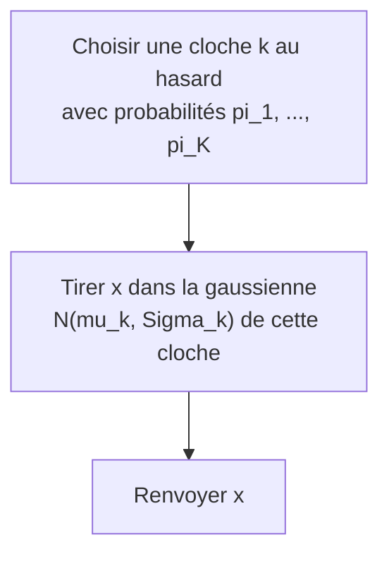

[← Sommaire](../README.md#table-des-matières)

# 11. Estimation de densité par mélanges gaussiens

### Le modèle de mélange gaussien

Imaginez que vous regardez la liste des tailles de tous les élèves d'une grande école, du CP à la terminale, mélangés dans un même tableau. Si vous tracez l'histogramme de ces tailles (c'est-à-dire un graphique en barres qui compte combien d'élèves tombent dans chaque tranche de taille : une barre haute = beaucoup d'élèves de cette taille-là), vous ne verrez **pas** une seule cloche bien nette : vous verrez plutôt deux ou trois bosses. Une bosse vers $`1{,}20`$ m (les petits), une bosse vers $`1{,}70`$ m (les grands), et peut-être une bosse intermédiaire. Une seule loi normale (loi gaussienne) ne peut pas décrire ça : elle n'a qu'une seule bosse. Mais si on **additionne plusieurs cloches**, chacune avec sa position, sa largeur et son importance, on peut épouser n'importe quelle forme bosselée. C'est exactement l'idée du **mélange gaussien** (Gaussian mixture model, abrégé GMM).

> **Que veut dire « loi normale » ou « gaussienne » (la « cloche ») ?** C'est la fameuse courbe **en forme de cloche** : un sommet au milieu (la valeur la plus fréquente), et ça redescend de part et d'autre de façon symétrique (les valeurs très petites ou très grandes sont rares). Si vous mesurez la taille de milliers de gens, leur tracé dessine cette cloche. « Loi normale », « loi gaussienne », « cloche » et « gaussienne » désignent tous **la même chose** dans ce chapitre. Une *loi* (ou *loi de probabilité*) est juste une règle qui dit quelles valeurs sont fréquentes et lesquelles sont rares.

Ce chapitre répond à une question très concrète : *étant donné un nuage de points (c'est-à-dire un ensemble de données semées comme des points sur un graphique), comment apprendre la « forme » de la densité de probabilité qui les a engendrés, quand cette forme n'est pas une simple gaussienne ?* La réponse, superposer des gaussiennes et ajuster automatiquement leurs paramètres (les *paramètres* sont les nombres de réglage du modèle : ici la position, la largeur et l'importance de chaque cloche, comme les boutons d'une radio qu'on tourne pour bien capter), est l'une des techniques les plus utilisées en apprentissage automatique (machine learning) : segmentation de clientèle, compression d'images, reconnaissance vocale, détection d'anomalies, initialisation de réseaux de neurones génératifs.

> **Que veut dire « densité de probabilité » ?** C'est une courbe qui dit, pour chaque valeur possible, **à quel point elle est probable** (à quel point les points de données aiment se rassembler à cet endroit). Là où la courbe est **haute**, les valeurs sont fréquentes (beaucoup de points) ; là où elle est **basse**, elles sont rares. La cloche gaussienne est un exemple de densité. Image : c'est comme la « carte de chaleur » d'une plage qui montre où les baigneurs s'entassent (zones hautes) et où le sable est désert (zones basses). Règle importante : l'**aire totale sous la courbe vaut toujours $`1`$** (soit $`100\%`$), parce qu'en additionnant les chances de toutes les valeurs possibles on doit retomber sur la certitude.

#### Rappel express : une seule gaussienne

On suppose connue (chapitre 6) la **densité gaussienne multivariée** sur $`\mathbb{R}^d`$. Pour un vecteur $`\mathbf{x} \in \mathbb{R}^d`$, de moyenne $`\boldsymbol{\mu} \in \mathbb{R}^d`$ et de matrice de covariance $`\boldsymbol{\Sigma}`$ (symétrique définie positive de taille $`d \times d`$), elle vaut :

> **Les symboles de base de cette ligne, un par un.** Plusieurs notations arrivent d'un coup, prenons-les calmement.
> - Un **vecteur** est une **liste ordonnée de nombres**, par exemple la fiche d'un élève $`(1{,}65\ \text{m},\ 52\ \text{kg})`$ : ici taille **et** poids rangés dans l'ordre. On le note en gras, $`\mathbf{x}`$. Le $`d`$ est le **nombre de cases** de cette liste (ici $`d=2`$). Image : un vecteur, c'est une étagère avec $`d`$ tiroirs numérotés.
> - $`\mathbb{R}`$ (« R majuscule ajouré », lu « erre ») est l'ensemble de **tous les nombres** (les positifs, les négatifs, les virgules : $`-3`$, $`0{,}7`$, $`42`$…). Du coup $`\mathbb{R}^d`$ (lu « erre puissance d ») est l'ensemble de **toutes les listes de $`d`$ nombres** : tous les vecteurs à $`d`$ cases. Si $`d=2`$, c'est tout le plan (chaque point a deux coordonnées) ; si $`d=3`$, tout l'espace.
> - $`\in`$ (lu « appartient à ») veut dire « **est dans** », « **fait partie de** ». Donc $`\mathbf{x} \in \mathbb{R}^d`$ se lit « $`\mathbf{x}`$ est une liste de $`d`$ nombres ». Image : $`\in`$ est le panneau « membre du club ».
> - La **moyenne** $`\boldsymbol{\mu}`$ est le **centre** du nuage (le point « milieu », là où ça culmine).
> - Une **matrice** est un **tableau de nombres** à plusieurs lignes et plusieurs colonnes (un vecteur n'a qu'une seule colonne ; une matrice en a plusieurs). « De taille $`d \times d`$ » (lu « d croix d ») veut dire « carrée, avec $`d`$ lignes et $`d`$ colonnes ».
> - **Symétrique** (pour une matrice carrée) veut dire qu'elle est **identique à son reflet dans un miroir posé sur sa diagonale** : la case ligne $`i`$ / colonne $`j`$ contient le même nombre que la case ligne $`j`$ / colonne $`i`$. Image : un tableau qui se lit pareil qu'on le retourne en haut-à-droite ou en bas-à-gauche.

> **Trois mots à apprivoiser tout de suite.** *Multivariée* veut dire « en plusieurs dimensions à la fois » : on ne mesure pas que la taille, mais par exemple la taille ET le poids ensemble. *Covariance* veut dire « comment deux mesures varient ensemble » : si les grands sont aussi les plus lourds, taille et poids ont une covariance positive. *Définie positive*, pour la matrice $`\boldsymbol{\Sigma}`$, veut dire « qui décrit une vraie cloche bien formée (une ellipse), jamais une forme impossible avec une aire négative ». Vous pouvez retenir ces trois idées comme des images, les calculs précis viennent du chapitre 6.

```math
\mathcal{N}(\mathbf{x} \mid \boldsymbol{\mu}, \boldsymbol{\Sigma})
= \frac{1}{(2\pi)^{d/2}\,\lvert \boldsymbol{\Sigma}\rvert^{1/2}}
\exp\!\left(-\tfrac{1}{2}(\mathbf{x}-\boldsymbol{\mu})^{\top}\boldsymbol{\Sigma}^{-1}(\mathbf{x}-\boldsymbol{\mu})\right).
```

> **Le symbole $`\mathcal{N}`$ (la lettre « N » calligraphiée).** Il se lit « grand N » et représente **la cloche gaussienne elle-même**. $`\mathcal{N}(\mathbf{x} \mid \boldsymbol{\mu}, \boldsymbol{\Sigma})`$ est donc une **machine** : vous lui donnez un point $`\mathbf{x}`$ et les réglages (centre $`\boldsymbol{\mu}`$, étalement $`\boldsymbol{\Sigma}`$), elle vous renvoie **la hauteur de la cloche** à cet endroit (un nombre : grand près du centre, minuscule loin). La grosse formule qui suit n'est que la recette de calcul de cette hauteur ; pas de panique, on la décortique morceau par morceau.

> **Petit glossaire express de la formule (vue au chapitre 6, on la redécortique ici).** Plusieurs symboles s'invitent d'un coup, voici leur sens en images. Le petit $`^{\top}`$ (« transposé ») veut dire qu'on couche le vecteur colonne pour le mettre en ligne, afin de pouvoir le multiplier avec ce qui suit (« transposer » = basculer les lignes en colonnes et inversement, comme coucher une colonne de chiffres pour l'écrire à l'horizontale). Le $`\boldsymbol{\Sigma}^{-1}`$ (« inverse ») est la matrice qui « défait » l'étalement de la cloche, comme une clé qui déverrouille la déformation. Le $`\lvert \boldsymbol{\Sigma}\rvert`$ (« déterminant », un nombre qui résume une matrice et mesure « combien d'espace » elle occupe) mesure le volume occupé par la cloche, il sert de facteur de normalisation (c'est-à-dire un nombre par lequel on divise pour ramener l'aire totale à exactement $`1`$, comme on ajuste une recette pour qu'elle fasse pile une part) pour que l'aire totale fasse bien $`1`$. Enfin $`\exp`$ (lu « exponentielle de ») est la fonction exponentielle, qui transforme une « distance » en une hauteur de cloche ; retenez surtout qu'elle **varie très vite** : $`\exp`$ d'un nombre négatif fonce vers zéro à toute allure (c'est ce qui fait redescendre la cloche très fort quand on s'éloigne du centre). En une phrase : l'expression entre parenthèses mesure la distance du point $`\mathbf{x}`$ au centre $`\boldsymbol{\mu}`$, corrigée par la forme de la cloche (on l'appelle la distance de Mahalanobis), et plus cette distance est grande, plus la cloche est basse à cet endroit.

> **Le symbole $`\mid`$ (barre verticale).** Ce symbole représente l'idée de « sachant que » ou « avec les réglages ». Quand on écrit $`\mathcal{N}(\mathbf{x} \mid \boldsymbol{\mu}, \boldsymbol{\Sigma})`$, on lit : « la valeur de la cloche au point $`\mathbf{x}`$, **avec** comme réglages le centre $`\boldsymbol{\mu}`$ et l'étalement $`\boldsymbol{\Sigma}`$ ». C'est comme une machine à dessiner des cloches : à gauche de la barre, l'endroit où l'on regarde ; à droite, les boutons de réglage de la machine.

Cette unique cloche a un centre unique et une seule région de forte densité. Insuffisant pour des données multimodales (à plusieurs bosses).

#### Définition du modèle de mélange

> **Définition (mélange gaussien).** Un mélange gaussien à $`K`$ composantes est la densité de probabilité sur $`\mathbb{R}^d`$ définie par
> ```math
> p(\mathbf{x}) = \sum_{k=1}^{K} \pi_k \, \mathcal{N}(\mathbf{x} \mid \boldsymbol{\mu}_k, \boldsymbol{\Sigma}_k),
> ```
> où les $`\pi_k`$ sont des réels appelés **poids de mélange** (mixing coefficients) vérifiant
> ```math
> \pi_k \ge 0 \quad \text{pour tout } k, \qquad \sum_{k=1}^{K} \pi_k = 1,
> ```
> et où $`(\boldsymbol{\mu}_k, \boldsymbol{\Sigma}_k)`$ sont la moyenne et la covariance de la $`k`$-ième composante (cloche).

> **Quelques notations de cette définition.** Le **$`p(\mathbf{x})`$** se lit « p de x » : c'est la **densité au point $`\mathbf{x}`$** (la hauteur de la courbe à cet endroit), $`p`$ étant juste le nom qu'on donne à la fonction densité. Une **composante** est simplement **une des cloches** du mélange (le mot savant pour « une bosse »). Un **réel** est un nombre ordinaire (entier, à virgule, positif ou négatif), comme expliqué plus haut pour $`\mathbb{R}`$. Le symbole **$`\ge`$** se lit « supérieur ou égal à » : $`\pi_k \ge 0`$ veut dire « $`\pi_k`$ vaut zéro ou plus » (jamais négatif). Le grand **$`\sum`$** qui apparaît ici est expliqué juste en dessous : retenez pour l'instant que c'est « une addition en série ».

Décortiquons chaque symbole nouveau.

> **Le symbole $`K`$.** Ce symbole représente **le nombre de cloches** qu'on empile. Si $`K=3`$, on mélange trois gaussiennes. C'est comme décider combien de groupes on pense qu'il y a dans la classe : les petits, les moyens, les grands $`\rightarrow K=3`$.

> **Le symbole $`\pi_k`$ (les poids de mélange).** Ce symbole représente **l'importance relative de chaque cloche**. Le petit $`k`$ en bas (l'indice) dit « de quelle cloche on parle » : $`\pi_1`$ est le poids de la cloche n°1, $`\pi_2`$ celui de la cloche n°2, etc. Attention, ce $`\pi`$ ici n'a rien à voir avec le nombre $`3{,}1415\dots`$: c'est juste la lettre grecque qu'on réutilise pour nommer une proportion. Imaginez un gros gâteau coupé en parts : $`\pi_k`$ est la taille de la part de la cloche $`k`$. Toutes les parts mises bout à bout font le gâteau entier, donc elles s'additionnent à $`1`$ ($`100\%`$). Et une part ne peut pas être négative, donc $`\pi_k \ge 0`$. Concrètement, si dans l'école il y a $`50\%`$ de petits, $`30\%`$ de moyens et $`20\%`$ de grands, alors $`\pi_1=0{,}5`$, $`\pi_2=0{,}3`$, $`\pi_3=0{,}2`$.

> **Le symbole $`\boldsymbol{\mu}_k`$ et $`\boldsymbol{\Sigma}_k`$.** Le $`\boldsymbol{\mu}`$ (lettre grecque « mu », en gras car c'est un vecteur) représente **le centre** de la cloche $`k`$: l'endroit où elle culmine. Le $`\boldsymbol{\Sigma}`$ (lettre grecque « sigma » majuscule, une matrice) représente **l'étalement et l'inclinaison** de la cloche $`k`$: est-elle large ou serrée, ronde ou ovale, penchée ou droite ? Ce sont les mêmes objets qu'au chapitre 6, mais maintenant on en a un jeu **par cloche**, d'où l'indice $`k`$.

La contrainte $`\sum_k \pi_k = 1`$ avec $`\pi_k \ge 0`$ (une *contrainte* est une **condition obligatoire** que la solution doit respecter, comme une règle du jeu : ici, les parts doivent toutes être positives et faire un tout) fait que $`p(\mathbf{x})`$ est bien une densité : elle est positive (somme de termes positifs) et son intégrale vaut $`1`$, car

> **Le symbole $`\int`$ (intégrale) et le $`\mathrm{d}\mathbf{x}`$.** Le grand S allongé $`\int`$ se lit « intégrale » : c'est une machine qui calcule l'**aire sous une courbe** (la surface comprise entre la courbe et le sol). Image : on découpe la zone sous la courbe en une infinité de tranches verticales très fines et on additionne toutes leurs surfaces. Le petit $`\mathrm{d}\mathbf{x}`$ collé à la fin indique **par rapport à quelle variable** on balaie (ici on glisse le long de l'axe des $`\mathbf{x}`$, en additionnant tranche après tranche). Dire « l'intégrale de la densité vaut $`1`$ » revient à dire « l'aire totale sous la cloche vaut $`100\%`$ », ce qui confirme que c'est bien une densité. La petite accolade $`\underbrace{\;\dots\;}_{=\,1}`$ sous un morceau de formule sert juste à annoter : « ce morceau-là vaut $`1`$ ».

```math
\int_{\mathbb{R}^d} p(\mathbf{x})\,\mathrm{d}\mathbf{x}
= \sum_{k=1}^{K} \pi_k \underbrace{\int_{\mathbb{R}^d}\mathcal{N}(\mathbf{x}\mid\boldsymbol{\mu}_k,\boldsymbol{\Sigma}_k)\,\mathrm{d}\mathbf{x}}_{=\,1}
= \sum_{k=1}^{K}\pi_k = 1.
```

> **Rappel sur le symbole $`\sum`$.** On le suppose connu : c'est « une boucle qui additionne ». $`\sum_{k=1}^{K} a_k`$ veut dire « fais la somme $`a_1 + a_2 + \dots + a_K`$ ». Ici la boucle additionne les $`K`$ cloches pondérées (*pondérer*, c'est **donner à chaque chose un poids, une importance** avant de l'additionner : ici chaque cloche compte selon son poids $`\pi_k`$, comme une note de contrôle qui compte « coefficient 2 » pèse double dans la moyenne). On a pu sortir chaque $`\pi_k`$ de l'intégrale car l'intégration porte sur $`\mathbf{x}`$, pas sur $`k`$.

#### Le mélange comme densité vraiment universelle

Pourquoi se donner tant de mal ? Parce qu'un mélange gaussien est un **approximateur universel de densités** (c'est-à-dire qu'il peut imiter d'aussi près qu'on veut **n'importe quelle** forme de densité, comme un jeu de briques assez fin permet de reconstituer n'importe quelle silhouette). Intuitivement : en plaçant beaucoup de petites cloches côte à côte (à la manière des pixels qui reconstituent une image, ou des briques Lego qui épousent une courbe), on approche d'aussi près qu'on veut n'importe quelle densité continue raisonnable.

> **Théorème (densité des mélanges gaussiens, version informelle).** Soit $`p^\star`$ une densité de probabilité continue sur $`\mathbb{R}^d`$. Pour tout $`\varepsilon > 0`$, il existe un mélange gaussien fini $`p`$ tel que $`\int_{\mathbb{R}^d} \lvert p(\mathbf{x}) - p^\star(\mathbf{x})\rvert\,\mathrm{d}\mathbf{x} < \varepsilon`$.

> **Les symboles de ce théorème.** Un *théorème* est un résultat **démontré, garanti vrai**. Décodons :
> - **« Soit … »** est une formule rituelle des maths qui veut dire « **prenons** un … » ou « **donnons-nous** un … » (on pose le décor).
> - **$`p^\star`$** (lu « p étoile ») désigne **la vraie densité, la cible** qu'on cherche à imiter (l'étoile $`^\star`$ sert juste à la distinguer de notre imitation $`p`$). *Continue* veut dire « sans saut brusque » : la courbe se trace d'un seul trait, sans lever le crayon.
> - **$`\varepsilon`$** (lettre grecque « epsilon », lu « epsilon ») désigne par tradition **un tout petit nombre positif**, aussi petit qu'on veut : c'est la « marge d'erreur » qu'on s'autorise. « Pour tout $`\varepsilon > 0`$ » se lit « quelle que soit la petitesse exigée ». **$`> 0`$** se lit « strictement positif » (plus grand que zéro).
> - **$`\lvert \cdot \rvert`$** (les deux barres droites) se lit « valeur absolue » : ça **enlève le signe moins**, ne gardant que la taille de l'écart ($`\lvert -3 \rvert = 3`$). Donc $`\lvert p - p^\star\rvert`$ est l'écart entre les deux courbes compté positivement.
> - **$`<`$** se lit « strictement inférieur à » (plus petit que). En clair, le théorème dit : « l'aire totale de l'écart entre mon mélange et la vraie densité peut être rendue plus petite que n'importe quelle marge $`\varepsilon`$ fixée d'avance ». *Fini* veut dire « avec un nombre **limité** de cloches » (pas une infinité).

*Idée de preuve.* On approche $`p^\star`$ par une convolution avec un noyau gaussien d'écart-type $`\sigma`$: la fonction $`p_\sigma = p^\star * \mathcal{N}(\cdot \mid \mathbf{0}, \sigma^2 \mathbf{I})`$ converge vers $`p^\star`$ en norme $`L^1`$ quand $`\sigma \to 0`$ (propriété d'approximation de l'identité). Or

> **Le vocabulaire de cette idée de preuve (c'est la partie la plus technique du chapitre, vous pouvez la survoler).**
> - **$`\sigma`$** (lettre grecque « sigma » minuscule, lu « sigma ») désigne ici l'**écart-type**, c'est-à-dire **la largeur de la cloche** : petit $`\sigma`$ = cloche étroite et pointue ; grand $`\sigma`$ = cloche large et plate. (L'écart-type est une mesure de dispersion ; son carré $`\sigma^2`$ est la *variance*, voir plus loin.)
> - Une **convolution**, notée par l'étoile **$`*`$** (lu « convolué avec »), c'est l'opération qui consiste à **flouter** une courbe en remplaçant chaque point par une moyenne de ses voisins (comme l'outil « flou » d'un logiciel de photo, qui étale chaque pixel sur ses voisins). Le **noyau** est le « petit tampon flou » qu'on promène : ici une petite cloche gaussienne.
> - Le **point $`\cdot`$** dans $`\mathcal{N}(\cdot \mid \dots)`$ est un **emplacement vide** (« là où on mettra l'argument ») ; le **$`\mathbf{0}`$** en gras est le **vecteur nul** (que des zéros), donc une cloche centrée à l'origine.
> - **$`\to`$** se lit « tend vers » : « quand $`\sigma \to 0`$ » veut dire « lorsqu'on rend la cloche de floutage de plus en plus fine, jusqu'à presque rien ». **Converger** veut dire « se rapprocher de plus en plus » : la courbe floutée $`p_\sigma`$ redevient la vraie courbe $`p^\star`$ à mesure que le flou disparaît. (« Approximation de l'identité » est juste le nom savant de ce phénomène : flouter de moins en moins finit par ne plus rien changer.)

```math
p_\sigma(\mathbf{x}) = \int_{\mathbb{R}^d} p^\star(\mathbf{y})\,\mathcal{N}(\mathbf{x}\mid \mathbf{y}, \sigma^2\mathbf{I})\,\mathrm{d}\mathbf{y}
```

est une « somme continue » (intégrale) de gaussiennes centrées en chaque $`\mathbf{y}`$, pondérées par $`p^\star(\mathbf{y})`$. On discrétise cette intégrale par une somme de Riemann finie : on obtient un mélange fini de gaussiennes (toutes de covariance $`\sigma^2 \mathbf{I}`$) aussi proche qu'on veut de $`p_\sigma`$, donc de $`p^\star`$. $`\;\blacksquare`$

> **Trois derniers mots de cette preuve.** **Discrétiser** veut dire « remplacer quelque chose de continu (une infinité de valeurs collées) par un nombre **fini** de morceaux séparés », comme remplacer une rampe lisse par un escalier à marches. Une **somme de Riemann** est précisément cette façon d'approcher une aire (une intégrale) en la découpant en quelques rectangles dont on additionne les surfaces : moins il y a de rectangles, plus c'est grossier ; plus il y en a, plus c'est fidèle. Enfin le petit carré noir **$`\blacksquare`$** est le symbole traditionnel qui veut dire **« fin de la démonstration »** (l'équivalent de « CQFD » : c'est gagné, c'est prouvé).

> **Le symbole $`L^1`$ et la norme $`\|\cdot\|_{L^1}`$.** « Converger en norme $`L^1`$ » veut simplement dire que **l'aire totale de l'écart** entre les deux courbes, $`\int \lvert p_\sigma - p^\star\rvert`$, devient aussi petite qu'on veut. Image : on superpose les deux dessins de densité et on mesure la surface coloriée qui dépasse ; cette surface tend vers $`0`$.

> **Remarque (universel ne veut pas dire facile).** L'universalité est un résultat d'*existence*: elle garantit qu'un bon mélange existe, pas qu'on saura le trouver, ni avec combien de composantes. Trouver les bons $`\pi_k, \boldsymbol{\mu}_k, \boldsymbol{\Sigma}_k`$ à partir de données est précisément le problème d'apprentissage des sections suivantes.

#### Variantes de structure de covariance

En pratique on contraint souvent la forme des $`\boldsymbol{\Sigma}_k`$ pour réduire le nombre de paramètres (et donc le risque de surapprentissage / overfitting). Pour des données en dimension $`d`$ (la *dimension* $`d`$ est juste le nombre de mesures par individu : taille seule $`\to d=1`$, taille + poids $`\to d=2`$, etc.) :

> **Que veut dire « surapprentissage » (overfitting) ?** C'est quand un modèle, **trop libre**, se met à apprendre **par cœur** les données d'exemple (y compris leurs accidents et leur bruit) au lieu d'en saisir la tendance générale. Résultat : il est excellent sur les exemples vus et **mauvais sur du nouveau**. Image : un élève qui mémorise mot à mot les corrigés de l'an dernier au lieu de comprendre la leçon : il échoue dès qu'on change l'énoncé. Moins on laisse de paramètres au modèle, moins il peut « tricher » ainsi, d'où l'idée de contraindre la forme des cloches.

| Type de covariance | Forme de $`\boldsymbol{\Sigma}_k`$ | Forme des cloches | Nb total de paramètres de covariance |
|---|---|---|---|
| `spherical` | $`\sigma_k^2\,\mathbf{I}`$ | boules de rayon variable | $`K`$ |
| `diag` | $`\mathrm{diag}(\sigma_{k,1}^2,\dots,\sigma_{k,d}^2)`$ | ellipsoïdes alignés sur les axes | $`K d`$ |
| `full` | matrice SDP quelconque | ellipsoïdes penchés quelconques | $`K\,\dfrac{d(d+1)}{2}`$ |
| `tied` | une seule $`\boldsymbol{\Sigma}`$ commune | même forme pour toutes | $`\dfrac{d(d+1)}{2}`$ |

> **Le vocabulaire de ce tableau.** **$`\mathrm{diag}(\dots)`$** se lit « matrice diagonale » : un tableau qui n'a des nombres **que sur sa diagonale** (le trait du coin haut-gauche au coin bas-droit) et des zéros partout ailleurs. La **diagonale** d'une matrice, ce sont justement ces cases en biais. Une **boule** est l'équivalent du cercle/de la sphère mais en dimension quelconque (une cloche parfaitement ronde). Un **ellipsoïde** est une boule **étirée**, donc un ballon de rugby ou une galette : large dans certaines directions, étroite dans d'autres. « Aligné sur les **axes** » veut dire que cet ellipsoïde n'est pas penché : il est bien droit, allongé le long des directions de mesure. **SDP** est l'abréviation de « symétrique définie positive » (vue plus haut : le profil d'une vraie cloche bien formée). **Quelconque** veut dire « sans contrainte de forme, n'importe lequel ».

> **Le symbole $`\mathbf{I}`$.** Il représente la **matrice identité**: des $`1`$ sur la diagonale, des $`0`$ ailleurs. Multiplier par $`\sigma^2 \mathbf{I}`$, c'est dire « une cloche parfaitement ronde, de même largeur dans toutes les directions ». C'est le réglage le plus simple.

> **Pourquoi $`\dfrac{d(d+1)}{2}`$ pour une covariance `full` ?** Une matrice $`d\times d`$ a $`d^2`$ cases, mais $`\boldsymbol{\Sigma}`$ est **symétrique** ($`\boldsymbol{\Sigma}=\boldsymbol{\Sigma}^{\top}`$) : la moitié au-dessus de la diagonale répète la moitié en dessous. Il reste donc la diagonale ($`d`$ termes) plus le triangle strictement supérieur ($`\tfrac{d(d-1)}{2}`$ termes), soit $`d + \tfrac{d(d-1)}{2} = \tfrac{d(d+1)}{2}`$ nombres libres.

> **Piège (le nombre de paramètres explose).** Une covariance `full` coûte $`\frac{d(d+1)}{2}`$ nombres **par composante**. En dimension $`d=100`$ avec $`K=10`$, cela fait déjà $`10 \times \frac{100\times 101}{2} = 50\,500`$ paramètres rien que pour les covariances. Si on a peu de données, on préfère `diag` ou `spherical`, ou on régularise (voir plus loin).

#### Générer un point : le mode d'emploi

Un mélange n'est pas qu'une formule : c'est une **recette pour fabriquer des données**. Pour tirer un point au hasard selon $`p`$ (*tirer un point au hasard selon* $`p`$, ou « selon une loi », veut dire fabriquer une valeur en respectant les chances dictées par $`p`$ : les zones où $`p`$ est haute sortent souvent, celles où $`p`$ est basse rarement, comme une tombola truquée qui favorise certains numéros) :



Autrement dit : d'abord on lance un dé truqué (les faces ont les probabilités $`\pi_k`$) pour décider de quel groupe vient le point ; ensuite on tire le point dans la cloche de ce groupe. Cette lecture « en deux temps » est la clé de toute la théorie (section sur la variable latente).

> **Exemple chiffré (genèse à la main).** Prenons $`d=1`$, $`K=2`$, avec $`\pi_1=0{,}7`$, $`\pi_2=0{,}3`$, $`\mu_1=0`$, $`\sigma_1=1`$, $`\mu_2=5`$, $`\sigma_2=0{,}5`$.
> 1. Je tire un nombre $`u`$ uniforme dans $`[0,1]`$ (« uniforme » = **chaque valeur a la même chance de sortir**, comme un dé équilibré ; $`[0,1]`$ se lit « l'intervalle de zéro à un » et désigne tous les nombres entre $`0`$ et $`1`$, bornes comprises). Disons $`u=0{,}55`$. Comme $`0{,}55 < 0{,}7 = \pi_1`$, je choisis la cloche 1.
> 2. Je tire $`x`$ dans $`\mathcal{N}(0, 1)`$. Disons $`x = 0{,}82`$. Mon point est $`0{,}82`$.
> Si j'avais obtenu $`u = 0{,}9 > 0{,}7`$, j'aurais choisi la cloche 2 et tiré $`x`$ dans $`\mathcal{N}(5, 0{,}25)`$ (rappel : ici $`\sigma_2=0{,}5`$ donc la variance vaut $`\sigma_2^2=0{,}25`$).

> **Que veut dire « variance » ?** La **variance** mesure **à quel point les valeurs sont dispersées** autour de leur moyenne : petite variance = points serrés autour du centre ; grande variance = points éparpillés. Précisément, c'est **la moyenne des carrés des écarts à la moyenne** (on regarde de combien chaque valeur s'écarte du centre, on met ces écarts au carré pour qu'ils comptent tous positivement, puis on en fait la moyenne). C'est exactement le **carré de l'écart-type** : variance $`= \sigma^2`$, écart-type $`= \sigma`$. Image : pour deux classes de même taille moyenne, celle où tout le monde mesure presque pareil a une petite variance, celle qui mélange très petits et très grands a une grosse variance.

Voici le code correspondant, qui génère un jeu de données et trace la densité théorique.

```python
import numpy as np

rng = np.random.default_rng(0)

# Parametres du melange (1D, K=2)
pis    = np.array([0.7, 0.3])
mus    = np.array([0.0, 5.0])
sigmas = np.array([1.0, 0.5])          # ecarts-types (pas variances)

def echantillonne_melange(n, pis, mus, sigmas, rng):
    # Etape 1 : choisir la cloche de chaque point (le "de truque")
    k = rng.choice(len(pis), size=n, p=pis)
    # Etape 2 : tirer dans la gaussienne choisie
    return rng.normal(loc=mus[k], scale=sigmas[k])

X = echantillonne_melange(10_000, pis, mus, sigmas, rng)

def densite_melange(x, pis, mus, sigmas):
    # somme_k pi_k * N(x | mu_k, sigma_k^2)
    comp = (pis[None, :]
            * np.exp(-0.5 * ((x[:, None] - mus[None, :]) / sigmas[None, :]) ** 2)
            / (np.sqrt(2 * np.pi) * sigmas[None, :]))
    return comp.sum(axis=1)

grille = np.linspace(-4, 8, 400)
print("Integrale numerique de p :",
      np.trapz(densite_melange(grille, pis, mus, sigmas), grille))
# -> proche de 1.0 : c'est bien une densite
```

> **Application en machine learning.** Ce mécanisme « choisir un groupe puis générer » est le squelette de tout *modèle génératif* (un *modèle génératif* est un modèle capable non seulement de reconnaître, mais de **fabriquer de nouvelles données réalistes** lui-même, comme un programme qui invente des visages ou des phrases plausibles ; *génératif* vient de « générer », c'est-à-dire « produire ») *à variable latente*: mélanges gaussiens, mais aussi modèles de Markov cachés, auto-encodeurs variationnels (VAE). Comprendre le GMM, c'est poser la première brique conceptuelle des modèles génératifs profonds modernes.

---

### Apprentissage par maximum de vraisemblance

On dispose maintenant de données $`\mathbf{x}_1, \dots, \mathbf{x}_N`$ (le nuage observé ; les petits numéros en bas, $`1, \dots, N`$, sont les *indices* qui numérotent les points : $`\mathbf{x}_1`$ le 1ᵉʳ point, $`\mathbf{x}_N`$ le dernier, et les trois petits points $`\dots`$ veulent dire « et ainsi de suite jusqu'au bout ») et on **suppose** qu'elles ont été tirées indépendamment d'un mélange gaussien dont on ignore les paramètres. Le but : **retrouver** les meilleurs $`\pi_k, \boldsymbol{\mu}_k, \boldsymbol{\Sigma}_k`$. La méthode est celle du chapitre 8 : le **maximum de vraisemblance** (maximum likelihood).

> **Que veut dire « tirées indépendamment » ?** Deux tirages sont **indépendants** quand le résultat de l'un **n'influence pas** l'autre (comme deux lancers de dé : le premier ne change rien au second). Ici, supposer les points indépendants veut dire qu'on imagine chaque donnée fabriquée séparément, sans qu'aucune ne dépende des précédentes. C'est cette hypothèse qui autorisera, juste après, à **multiplier** les probabilités.

> **Le symbole $`N`$.** Il représente **le nombre de points de données** qu'on a observés (la taille de l'échantillon : un *échantillon* est l'ensemble des données effectivement recueillies, comme la poignée d'élèves qu'on a réellement mesurés). À ne pas confondre avec $`K`$ (le nombre de cloches) : $`N`$ se compte en milliers (les élèves mesurés), $`K`$ en unités (les groupes supposés).

> **Le symbole $`\boldsymbol{\theta}`$.** Il représente **le sac contenant TOUS les réglages à apprendre**: $`\boldsymbol{\theta} = \{\pi_k, \boldsymbol{\mu}_k, \boldsymbol{\Sigma}_k\}_{k=1}^{K}`$. Plutôt que d'écrire la longue liste à chaque fois, on l'emballe dans une seule lettre, comme on rangerait tous ses outils dans une seule boîte à outils nommée $`\boldsymbol{\theta}`$ (« thêta »).

#### La fonction de vraisemblance

La **vraisemblance** (likelihood) d'un jeu de paramètres, c'est « la probabilité que ce modèle aurait donnée à nos données ». Comme les points sont indépendants, la probabilité de les voir tous ensemble est le **produit** des probabilités de chacun (le **$`\mathcal{L}`$** calligraphié de la formule, lu « grand L », est justement le nom qu'on donne à cette vraisemblance ; $`\mathcal{L}(\boldsymbol{\theta})`$ se lit « la vraisemblance pour les réglages $`\boldsymbol{\theta}`$ ») :

```math
\mathcal{L}(\boldsymbol{\theta}) = p(\mathbf{x}_1,\dots,\mathbf{x}_N \mid \boldsymbol{\theta})
= \prod_{n=1}^{N} p(\mathbf{x}_n \mid \boldsymbol{\theta})
= \prod_{n=1}^{N} \sum_{k=1}^{K} \pi_k\, \mathcal{N}(\mathbf{x}_n \mid \boldsymbol{\mu}_k, \boldsymbol{\Sigma}_k).
```

> **Le symbole $`\prod`$ (produit).** Frère jumeau de $`\sum`$, mais il **multiplie** au lieu d'additionner. $`\prod_{n=1}^{N} a_n`$ veut dire $`a_1 \times a_2 \times \dots \times a_N`$. Pourquoi un produit ? Parce que pour des événements indépendants, les probabilités se multiplient (la proba de « pile puis pile » est $`\tfrac12 \times \tfrac12`$). C'est une boucle, mais qui multiplie.

#### Pourquoi on passe au logarithme

Multiplier des milliers de nombres tous compris entre $`0`$ et $`1`$ donne un résultat astronomiquement petit (sous-débordement numérique / underflow : l'ordinateur l'arrondit à $`0`$). Et un produit est pénible à dériver. On prend donc le **logarithme**, qui transforme les produits en sommes et est strictement croissant (donc il ne change pas l'emplacement du maximum) :

```math
\ell(\boldsymbol{\theta}) = \ln \mathcal{L}(\boldsymbol{\theta})
= \sum_{n=1}^{N} \ln\!\left( \sum_{k=1}^{K} \pi_k\, \mathcal{N}(\mathbf{x}_n \mid \boldsymbol{\mu}_k, \boldsymbol{\Sigma}_k) \right).
```

> **Le symbole $`\ln`$.** C'est le **logarithme naturel** (logarithme en base $`e`$). Vu comme une « règle à calcul » magique : il transforme une multiplication en addition ($`\ln(ab) = \ln a + \ln b`$) et écrase les ordres de grandeur. Comme il est strictement croissant, l'endroit où $`\mathcal{L}`$ est maximale est aussi l'endroit où $`\ln\mathcal{L}`$ est maximale : passer au log ne déplace pas le sommet. On l'utilise partout en apprentissage car il rend les calculs stables et additifs.

> **Le symbole $`\ell`$ (« l » cursif).** Il représente la **log-vraisemblance** (log-likelihood) : juste le logarithme de la vraisemblance $`\mathcal{L}`$. Maximiser $`\ell`$ revient exactement à maximiser $`\mathcal{L}`$, mais en plus confortable. L'estimateur (c'est-à-dire la **valeur estimée à partir des données**, notre meilleure devinette) du maximum de vraisemblance est
> ```math
> \hat{\boldsymbol{\theta}} = \arg\max_{\boldsymbol{\theta}} \ell(\boldsymbol{\theta}).
> ```

> **Le chapeau $`\hat{\;}`$ et le symbole $`\arg\max`$.** Le petit **chapeau** au-dessus d'une lettre, $`\hat{\boldsymbol{\theta}}`$ (lu « thêta chapeau »), signale une **valeur estimée** : pas la vérité inconnue $`\boldsymbol{\theta}`$, mais la **meilleure devinette** qu'on en tire des données. (Convention universelle : le chapeau = « estimé / prédit ».) Le **$`\arg\max`$** (lu « argmax », pour *argument du maximum*) répond à la question « **pour quelle valeur** la fonction est-elle la plus grande ? ». Attention à la nuance : $`\max`$ donne **la plus grande hauteur** atteinte, tandis que $`\arg\max`$ donne **l'endroit** où cette hauteur est atteinte. Image : sur une chaîne de montagnes, $`\max`$ = l'altitude du plus haut sommet, $`\arg\max`$ = **où** se trouve ce sommet sur la carte. Donc $`\hat{\boldsymbol{\theta}} = \arg\max_{\boldsymbol{\theta}} \ell(\boldsymbol{\theta})`$ se lit : « les réglages $`\boldsymbol{\theta}`$ qui rendent la log-vraisemblance la plus grande possible ».

> **Piège central (le log d'une somme).** Pour une seule gaussienne, le $`\ln`$ « mange » l'exponentielle et tout se simplifie. Ici, le $`\ln`$ porte sur une **somme** $`\sum_k \pi_k \mathcal{N}(\cdot)`$: impossible de la casser proprement, car $`\ln(a+b) \ne \ln a + \ln b`$. C'est cette somme **à l'intérieur** du logarithme qui rend le problème difficile et interdit une solution en forme close (une *solution en forme close*, ou *solution close*, c'est une réponse qu'on peut écrire d'un coup avec une formule finie, comme « la moyenne = somme divisée par le nombre » ; quand il n'y en a pas, on doit procéder par essais successifs avec un algorithme : un *algorithme* est une **recette précise, une suite d'étapes mécaniques** qu'on exécute dans l'ordre pour obtenir un résultat, comme une recette de cuisine ou un mode d'emploi de meuble à monter). Tout l'algorithme EM (section suivante) est né pour contourner cet obstacle.

#### Les équations de stationnarité

Cherchons les points où le gradient s'annule. On introduit une quantité qui va devenir centrale.

> **Que veut dire « gradient » et « le gradient s'annule » ?** Le **gradient** d'une fonction, c'est la **direction de plus forte pente** (la flèche qui indique « par là, ça monte le plus vite »), avec sa raideur. Image : posé sur une colline, le gradient pointe droit vers le haut de la pente sous vos pieds. Or **au sommet** (ou au fond d'une cuvette), il n'y a plus de pente : le terrain est plat. Donc « chercher où **le gradient s'annule** » (où il vaut zéro) revient à **chercher les sommets et les creux** de la fonction, c'est-à-dire ses maximums et minimums. C'est notre stratégie pour trouver le maximum de la log-vraisemblance. (Le gradient est la généralisation de la *dérivée*, qui mesure la pente d'une courbe en un point ; on le revoit juste en dessous avec le symbole $`\partial`$.)

> **Les responsabilités $`r_{nk}`$.** Ce symbole représente **la part de responsabilité de la cloche $`k`$ dans l'apparition du point $`\mathbf{x}_n`$**. Les deux indices se lisent : $`n`$ = quel point, $`k`$ = quelle cloche. Image : un point de donnée est une « affaire à résoudre », et les $`K`$ cloches sont des suspectes ; $`r_{nk}`$ est la probabilité que ce soit la cloche $`k`$ la coupable pour le point $`n`$. Pour un point donné, les responsabilités de toutes les cloches s'additionnent à $`1`$ ($`\sum_k r_{nk}=1`$) : on est sûr qu'**une** des cloches l'a produit. Formellement, c'est la probabilité a posteriori (règle de Bayes) que le point $`n`$ vienne de la cloche $`k`$:
> ```math
> r_{nk} = \frac{\pi_k\,\mathcal{N}(\mathbf{x}_n \mid \boldsymbol{\mu}_k, \boldsymbol{\Sigma}_k)}{\displaystyle\sum_{j=1}^{K} \pi_j\,\mathcal{N}(\mathbf{x}_n \mid \boldsymbol{\mu}_j, \boldsymbol{\Sigma}_j)}.
> ```
> Le numérateur (le **nombre du haut** d'une fraction), c'est « cloche $`k`$ choisie ET point généré par elle » ; le dénominateur (le **nombre du bas**, celui par lequel on divise), c'est la proba totale du point (toutes cloches confondues). On divise pour normaliser, comme on répartirait $`100\%`$ de soupçons entre les suspectes.

> **« Probabilité a posteriori » et « règle de Bayes ».** *A posteriori* est du latin pour « **après coup** », c'est-à-dire **une fois qu'on a vu la donnée**. La probabilité a posteriori, c'est donc notre croyance **révisée** : « maintenant que j'observe ce point précis, quelle est la chance qu'il vienne de la cloche $`k`$ ? » (à opposer à la croyance *a priori* $`\pi_k`$, qu'on avait **avant** de regarder le point). La **règle de Bayes** est la formule qui fait cette mise à jour : elle combine la croyance de départ ($`\pi_k`$) et ce que la donnée apporte (la hauteur $`\mathcal{N}`$), puis divise par le total pour que tout somme à $`100\%`$. Image : un médecin part d'un pronostic général (a priori), reçoit le résultat d'un test (la donnée), et **révise** son diagnostic (a posteriori). Le numérateur et le dénominateur ci-dessus sont exactement cette recette de Bayes. Le **$`j`$** au dénominateur (à la place de $`k`$) est juste un *indice muet* : une lettre de comptage qui parcourt toutes les cloches pour les additionner (on aurait pu l'appeler autrement, ça ne change rien).

Dérivons $`\ell`$ par rapport à chaque paramètre. Pour $`\boldsymbol{\mu}_k`$, en utilisant
$`\dfrac{\partial}{\partial \boldsymbol{\mu}_k}\mathcal{N}(\mathbf{x}_n\mid\boldsymbol{\mu}_k,\boldsymbol{\Sigma}_k) = \mathcal{N}(\mathbf{x}_n\mid\boldsymbol{\mu}_k,\boldsymbol{\Sigma}_k)\,\boldsymbol{\Sigma}_k^{-1}(\mathbf{x}_n - \boldsymbol{\mu}_k)`$
et la règle de dérivation $`\dfrac{\partial}{\partial \boldsymbol{\mu}_k}\ln(\cdot) = \dfrac{1}{(\cdot)}\dfrac{\partial(\cdot)}{\partial \boldsymbol{\mu}_k}`$:

> **« Dériver », le symbole $`\partial`$, et la « règle de dérivation ».** **Dériver** une fonction, c'est **calculer sa pente** : de combien la sortie monte ou descend quand on bouge un peu l'entrée. Le résultat s'appelle la *dérivée*. Le symbole **$`\partial`$** (un « d » arrondi, lu « d rond » ou « dé partiel ») marque une **dérivée partielle** : on calcule la pente **par rapport à une seule variable à la fois**, en gelant toutes les autres (comme régler le robinet d'eau chaude en laissant le froid fixe, pour voir l'effet du seul chaud). Ainsi $`\dfrac{\partial \ell}{\partial \boldsymbol{\mu}_k}`$ se lit « la pente de $`\ell`$ quand on bouge seulement $`\boldsymbol{\mu}_k`$ ». Mettre cette pente à zéro, c'est appliquer l'idée du gradient ci-dessus (chercher le sommet). La **« règle de dérivation »** invoquée est une recette mécanique connue (vue au chapitre 8) pour calculer la pente d'une fonction composée, ici d'un logarithme ; vous pouvez l'admettre sans la refaire.

```math
\frac{\partial \ell}{\partial \boldsymbol{\mu}_k}
= \sum_{n=1}^{N} \underbrace{\frac{\pi_k\,\mathcal{N}(\mathbf{x}_n\mid\boldsymbol{\mu}_k,\boldsymbol{\Sigma}_k)}{\sum_j \pi_j\,\mathcal{N}(\mathbf{x}_n\mid\boldsymbol{\mu}_j,\boldsymbol{\Sigma}_j)}}_{=\,r_{nk}} \boldsymbol{\Sigma}_k^{-1}(\mathbf{x}_n - \boldsymbol{\mu}_k) = \mathbf{0}.
```

Comme par magie, la responsabilité $`r_{nk}`$ **apparaît toute seule** dans le gradient : le $`\pi_k\mathcal{N}(\cdot)`$ venant de la dérivée se combine avec le $`1/p(\mathbf{x}_n)`$ venant du $`\ln`$. En multipliant à gauche par $`\boldsymbol{\Sigma}_k`$ (inversible : c'est-à-dire qu'il existe une matrice qui « annule » son effet, comme la division annule la multiplication ; cela permet d'isoler $`\boldsymbol{\mu}_k`$) et en isolant $`\boldsymbol{\mu}_k`$:

```math
\boxed{\;\boldsymbol{\mu}_k = \frac{\sum_{n=1}^{N} r_{nk}\,\mathbf{x}_n}{\sum_{n=1}^{N} r_{nk}} = \frac{1}{N_k}\sum_{n=1}^{N} r_{nk}\,\mathbf{x}_n\;}, \qquad N_k := \sum_{n=1}^{N} r_{nk}.
```

> **Deux notations de la formule encadrée.** Le **cadre** (la *boîte*) autour d'une formule sert juste à dire « **résultat important, à retenir** ». Le symbole **$`:=`$** se lit « **est défini comme** » : à gauche le nouveau nom qu'on invente ($`N_k`$), à droite ce qu'il désigne. Donc $`N_k := \sum_n r_{nk}`$ veut dire « j'appelle désormais $`N_k`$ la somme des responsabilités de la cloche $`k`$ ».

> **Le symbole $`N_k`$ (effectif mou).** Il représente le **nombre « mou » de points attribués à la cloche $`k`$**: on additionne les responsabilités de tous les points pour cette cloche. Si la cloche $`k`$ « possède » fermement $`300`$ points, $`N_k \approx 300`$ (le signe $`\approx`$ se lit « environ égal à » : presque, à un poil près). Mais comme les responsabilités sont des fractions, $`N_k`$ peut valoir $`287{,}4`$: c'est un comptage flou, pas entier. Comme $`\sum_k r_{nk}=1`$ pour chaque point, on a toujours $`\sum_k N_k = N`$.

La moyenne optimale est donc la **moyenne des points pondérée par leur responsabilité**: chaque point « vote » pour le centre de la cloche $`k`$ avec un poids égal à sa responsabilité envers elle. De même, en dérivant par rapport à $`\boldsymbol{\Sigma}_k`$ (calcul matriciel sur $`\ln\lvert\boldsymbol{\Sigma}\rvert`$ et $`\boldsymbol{\Sigma}^{-1}`$, chapitre 6) et en annulant le gradient :

```math
\boxed{\;\boldsymbol{\Sigma}_k = \frac{1}{N_k}\sum_{n=1}^{N} r_{nk}\,(\mathbf{x}_n - \boldsymbol{\mu}_k)(\mathbf{x}_n - \boldsymbol{\mu}_k)^{\top}\;}.
```

> **Le symbole $`(\mathbf{x}_n - \boldsymbol{\mu}_k)(\mathbf{x}_n - \boldsymbol{\mu}_k)^{\top}`$ (produit extérieur).** Un vecteur colonne (une liste de nombres rangés **verticalement**) $`\mathbf{v}\in\mathbb{R}^d`$ multiplié par sa propre transposée $`\mathbf{v}^{\top}`$ (la même liste couchée **en ligne**) donne une **matrice** $`d\times d`$: la case $`(i,j)`$ (c'est-à-dire la case croisant la ligne $`i`$ et la colonne $`j`$) vaut $`v_i v_j`$. C'est l'opposé du produit scalaire $`\mathbf{v}^{\top}\mathbf{v}`$ (qui, lui, donne un seul nombre : le *produit scalaire* de deux listes consiste à multiplier leurs cases une à une puis à tout additionner, par exemple $`\mathbf{v}^{\top}\mathbf{v} = v_1^2 + \dots + v_d^2`$). Ici cette matrice mesure comment l'écart d'un point à son centre s'étale dans chaque paire de directions ; en moyennant ces matrices (pondérées par $`r_{nk}`$) on reconstruit la forme de la cloche.

Pour les poids $`\pi_k`$, il faut tenir compte de la contrainte $`\sum_k \pi_k = 1`$. On ajoute un **multiplicateur de Lagrange** $`\lambda`$ (chapitre sur le lagrangien) et on annule la dérivée de $`\ell(\boldsymbol{\theta}) + \lambda\big(\sum_k \pi_k - 1\big)`$ par rapport à $`\pi_k`$:

```math
\frac{\partial}{\partial \pi_k}\left[\ell + \lambda\Big(\textstyle\sum_j \pi_j - 1\Big)\right]
= \sum_{n=1}^{N} \frac{\mathcal{N}(\mathbf{x}_n\mid\boldsymbol{\mu}_k,\boldsymbol{\Sigma}_k)}{\sum_j \pi_j\,\mathcal{N}(\mathbf{x}_n\mid\boldsymbol{\mu}_j,\boldsymbol{\Sigma}_j)} + \lambda = \frac{N_k}{\pi_k} + \lambda = 0.
```

(On a reconnu $`\frac{N_k}{\pi_k}`$: en multipliant et divisant le terme de gauche par $`\pi_k`$, on fait apparaître $`r_{nk}`$ au numérateur, dont la somme sur $`n`$ vaut $`N_k`$.) Donc $`\pi_k = -N_k/\lambda`$. En sommant sur $`k`$ et en utilisant $`\sum_k \pi_k = 1`$ et $`\sum_k N_k = N`$, on trouve $`-N/\lambda = 1`$, soit $`\lambda = -N`$, d'où :

```math
\boxed{\;\pi_k = \frac{N_k}{N}\;}.
```

> **Le symbole $`\lambda`$ (multiplicateur de Lagrange).** C'est une **variable supplémentaire** qu'on s'autorise à introduire pour gérer une contrainte d'égalité (ici « les poids somment à $`1`$ »). Image : un ressort qui rappelle la solution vers la zone autorisée ; sa « raideur » $`\lambda`$ s'ajuste toute seule pour que la contrainte soit pile respectée. On le détermine en réinjectant la contrainte, comme on vient de le faire pour trouver $`\lambda=-N`$.

> **Lecture intuitive.** Le poids optimal d'une cloche est simplement **sa part du gâteau**: le nombre mou de points qu'elle possède, divisé par le total. Limpide.

#### Le serpent qui se mord la queue

Regardons bien les trois formules encadrées. Elles donnent $`\boldsymbol{\mu}_k, \boldsymbol{\Sigma}_k, \pi_k`$ **en fonction des responsabilités** $`r_{nk}`$. Mais la définition de $`r_{nk}`$ dépend elle-même de $`\boldsymbol{\mu}_k, \boldsymbol{\Sigma}_k, \pi_k`$ ! C'est un système **implicite**: pour calculer les paramètres il faut les responsabilités, et pour les responsabilités il faut les paramètres.


> **L'idée qui sauve tout.** Quand un système s'auto-référence comme ça, une stratégie naturelle est le **point fixe**: on devine des paramètres, on en déduit les responsabilités, puis on recalcule les paramètres à partir de ces responsabilités, et on recommence jusqu'à stabilisation. Cette alternance porte un nom : c'est l'algorithme espérance-maximisation, objet de la section suivante. Les équations encadrées ci-dessus ne sont donc pas une solution close, mais les **règles de mise à jour** d'une boucle.

---

### L'algorithme espérance-maximisation (EM)

L'algorithme **espérance-maximisation** (expectation-maximization, EM) résout le problème du serpent qui se mord la queue par une alternance simple et élégante. C'est l'un des algorithmes les plus importants de tout l'apprentissage statistique.

#### Le principe en deux temps

> **Intuition (le jeu du professeur et des groupes).** Vous êtes professeur face à une classe mélangée et vous voulez (a) deviner à quel groupe appartient chaque élève et (b) décrire chaque groupe (sa taille moyenne, sa dispersion). Problème : pour assigner les élèves il faut connaître les groupes, et pour décrire les groupes il faut savoir qui en fait partie. Solution pragmatique :
> - **Étape E:** avec votre description actuelle des groupes, calculez pour chaque élève sa probabilité d'appartenance à chaque groupe (les responsabilités).
> - **Étape M:** en supposant ces appartenances, **re-décrivez** chaque groupe (recalculez moyenne, dispersion, taille).
> Répétez. À chaque tour, votre description s'améliore.


#### Algorithme détaillé

> **Algorithme (EM pour mélange gaussien).**
> **Entrée:** données $`\{\mathbf{x}_n\}_{n=1}^N`$, nombre de composantes $`K`$.
> **Initialisation:** choisir $`\boldsymbol{\theta}^{(0)} = \{\pi_k, \boldsymbol{\mu}_k, \boldsymbol{\Sigma}_k\}`$ (souvent via $`k`$-moyennes, voir plus bas).
> **Répéter** pour $`t = 0, 1, 2, \dots`$ jusqu'à convergence :
>
> **Étape E (espérance).** Pour tout $`n, k`$, calculer la responsabilité avec les paramètres courants $`\boldsymbol{\theta}^{(t)}`$:
> ```math
> r_{nk}^{(t)} = \frac{\pi_k^{(t)}\,\mathcal{N}(\mathbf{x}_n \mid \boldsymbol{\mu}_k^{(t)}, \boldsymbol{\Sigma}_k^{(t)})}{\sum_{j=1}^{K} \pi_j^{(t)}\,\mathcal{N}(\mathbf{x}_n \mid \boldsymbol{\mu}_j^{(t)}, \boldsymbol{\Sigma}_j^{(t)})}.
> ```
>
> **Étape M (maximisation).** Poser $`N_k = \sum_{n} r_{nk}^{(t)}`$, puis mettre à jour :
> ```math
> \pi_k^{(t+1)} = \frac{N_k}{N}, \quad
> \boldsymbol{\mu}_k^{(t+1)} = \frac{1}{N_k}\sum_{n} r_{nk}^{(t)}\mathbf{x}_n, \quad
> \boldsymbol{\Sigma}_k^{(t+1)} = \frac{1}{N_k}\sum_{n} r_{nk}^{(t)} (\mathbf{x}_n - \boldsymbol{\mu}_k^{(t+1)})(\mathbf{x}_n - \boldsymbol{\mu}_k^{(t+1)})^{\top}.
> ```
>
> **Critère d'arrêt:** s'arrêter quand $`\ell(\boldsymbol{\theta}^{(t+1)}) - \ell(\boldsymbol{\theta}^{(t)}) < \varepsilon`$ (gain de log-vraisemblance négligeable).

> **Comment lire cet « algorithme » (recette pas à pas).** Les **accolades $`\{\dots\}`$** notent un **ensemble**, c'est-à-dire une **collection d'objets** ; $`\{\mathbf{x}_n\}_{n=1}^N`$ se lit « la collection de tous les points, de $`\mathbf{x}_1`$ jusqu'à $`\mathbf{x}_N`$ » (comme on dirait « le paquet de cartes »). **Initialiser**, c'est **choisir un point de départ** (des premières valeurs, même approximatives, pour démarrer la boucle) ; l'exposant $`^{(0)}`$ marque ce tout premier jeu de réglages. Le **« critère d'arrêt »** est la **condition pour savoir quand s'arrêter de tourner** : ici, dès que la log-vraisemblance ne progresse presque plus (gain plus petit que la marge $`\varepsilon`$), on considère qu'on est arrivé : c'est ce qu'on appelle **converger**. Image globale : c'est une recette qu'on répète en boucle (étape E, puis étape M), encore et encore, jusqu'à ce que ça ne bouge plus.

> **Le symbole $`t`$ et l'exposant $`^{(t)}`$.** Le $`t`$ représente **le numéro du tour de boucle** (l'itération). L'exposant entre parenthèses, comme dans $`\boldsymbol{\mu}_k^{(t)}`$, veut dire « la valeur de ce paramètre **au tour $`t`$** ». À ne pas confondre avec une puissance : $`\boldsymbol{\mu}_k^{(3)}`$ n'est pas « mu au cube », c'est « mu après 3 tours ». La parenthèse est justement là pour signaler « ce n'est pas un exposant de puissance ».

#### Lien avec k-moyennes

L'algorithme des **$`k`$-moyennes** (k-means) est un cas limite « dur » d'EM. Au lieu de responsabilités floues $`r_{nk} \in [0,1]`$, on assigne chaque point à sa cloche la plus proche ($`r_{nk} \in \{0,1\}`$). On le retrouve en prenant des covariances $`\boldsymbol{\Sigma}_k = \sigma^2 \mathbf{I}`$ communes et en faisant tendre $`\sigma \to 0`$: dans la formule des responsabilités, l'écart le plus petit écrase exponentiellement tous les autres, et la responsabilité se concentre entièrement sur la composante la plus proche.

> **Qu'est-ce que les « $`k`$-moyennes » (k-means) ?** C'est une méthode très simple pour **ranger des points en $`k`$ groupes** : on place $`k`$ « chefs de groupe » (les centres), on rattache chaque point au chef le plus proche, on recalcule chaque chef comme la moyenne de ses points, et on recommence jusqu'à stabilisation. La différence avec EM : ici l'appartenance est **tranchée** (chaque point appartient à **un seul** groupe, à $`100\%`$), d'où les valeurs $`\{0,1\}`$ (« 0 = pas dans ce groupe, 1 = dans ce groupe », rien entre les deux), alors qu'EM autorise des appartenances **partagées** (n'importe quelle fraction de $`0`$ à $`1`$). C'est pour ça qu'on dit que les $`k`$-moyennes sont la version « **dure** » et EM la version « **molle** ». *Cas limite* veut dire « ce qu'on obtient en poussant un réglage à son extrême » (ici en rendant les cloches infiniment fines).

> **Pourquoi « écrase exponentiellement » ? Un exemple chiffré.** La responsabilité d'une cloche fait intervenir le facteur $`\exp(-\text{distance}^2 / 2\sigma^2)`$. Quand $`\sigma`$ devient minuscule, le nombre $`2\sigma^2`$ au dénominateur devient minuscule, donc la fraction sous l'exponentielle devient énorme et négative pour tout point qui n'est pas pile sur le centre, et l'exponentielle d'un grand nombre négatif tombe très vite vers zéro. Prenons un point à distance $`1`$ d'une cloche et à distance $`2`$ d'une autre. Avec $`\sigma = 1`$, les deux poids valent $`\exp(-1/2)\approx 0{,}607`$ et $`\exp(-4/2)\approx 0{,}135`$ : leur rapport est environ $`4{,}5`$, la cloche proche gagne mais l'autre compte encore un peu. Avec $`\sigma = 0{,}1`$, ils valent $`\exp(-1/0{,}02)`$ et $`\exp(-4/0{,}02)`$, c'est-à-dire $`\exp(-50)`$ contre $`\exp(-200)`$ : le rapport explose à $`\exp(150)`$, un nombre gigantesque. Autrement dit, la cloche la plus proche rafle toute la responsabilité (proche de $`1`$) et l'autre tombe à zéro, ce qui redonne exactement l'assignation « dure » des $`k`$-moyennes.

> **Initialisation en pratique.** On initialise presque toujours EM par **$`k`$-means++** (variante de $`k`$-moyennes à tirage initial intelligent), qui évite les mauvais minima (« minima » est le pluriel de *minimum* : les creux ; ici un « mauvais minimum » est une solution médiocre dans laquelle on reste coincé, comme une bille qui s'arrête dans un petit trou au lieu de rouler jusqu'au fond de la vallée) et accélère nettement la convergence. C'est le défaut de `scikit-learn` (`init_params='kmeans'` ou `'k-means++'`). Pour de très grands jeux de données, on utilise des variantes **mini-batch / stochastiques** d'EM, dans l'esprit des optimiseurs par lots du deep learning. (Vocabulaire, pour aller plus loin : un *mini-batch* est un petit paquet de données ; au lieu de relire tout le jeu à chaque tour, on met à jour les réglages à partir de petits paquets tirés au hasard, ce qui va beaucoup plus vite sur de gros volumes. Un *optimiseur par lots* est simplement un procédé qui améliore les réglages en traitant les données par tels paquets. Ces notions appartiennent au deep learning et ne sont pas indispensables ici.)

| Aspect | $`k`$-moyennes | EM (GMM) |
|---|---|---|
| Assignation | dure ($`0`$ ou $`1`$) | molle (responsabilités $`\in [0,1]`$) |
| Forme des groupes | sphériques, même taille | ellipsoïdes, tailles variables |
| Sortie | étiquettes | densité de probabilité complète |
| Cas particulier de... | (cas de base, rien à simplifier) | EM avec $`\boldsymbol{\Sigma}=\sigma^2\mathbf{I}, \sigma\to 0`$ |

> **Le mot « étiquette » dans ce tableau.** Une **étiquette** (au sens de l'apprentissage), c'est le **nom du groupe** attribué à un point, comme une gommette de couleur collée dessus (« groupe 1 », « groupe 2 »…). Les $`k`$-moyennes ne renvoient que ça (une gommette par point), tandis qu'EM renvoie en plus toute la **densité** (la forme statistique complète des données).

#### Garantie de convergence : la log-vraisemblance ne descend jamais

C'est la propriété fondamentale d'EM, démontrée en détail dans la section suivante via l'ELBO.

> **Théorème (monotonie d'EM).** À chaque itération d'EM, la log-vraisemblance des données ne diminue pas :
> ```math
> \ell(\boldsymbol{\theta}^{(t+1)}) \ge \ell(\boldsymbol{\theta}^{(t)}).
> ```
> Comme $`\ell`$ est majorée (une log-vraisemblance de densité ne tend pas vers $`+\infty`$ sur des configurations raisonnables, hors singularités traitées plus bas), la suite croissante $`\ell(\boldsymbol{\theta}^{(t)})`$ converge.

> **Les mots de ce théorème.** La **monotonie** veut dire « **qui va toujours dans le même sens** » : ici la log-vraisemblance ne fait **que monter** (ou rester égale), jamais redescendre, tour après tour. Une **suite** est simplement une **liste de nombres dans l'ordre** ($`\ell`$ au tour 0, au tour 1, au tour 2…). Dire qu'une suite **est majorée**, c'est dire qu'elle a un **plafond** qu'elle ne dépasse jamais. Le symbole **$`+\infty`$** se lit « plus l'infini » : c'est « plus grand que tout nombre, sans limite ». Une suite qui **monte toujours** mais **reste sous un plafond** finit forcément par se **stabiliser** (converger) : imaginez un ascenseur qui ne fait que monter mais ne peut pas dépasser le dernier étage, il finit immobile en haut. C'est exactement ce qui garantit qu'EM s'arrête.

> **Piège (convergence vers un optimum LOCAL).** EM garantit de **monter**, pas d'atteindre le sommet le plus haut. Selon l'initialisation, on peut rester coincé sur une colline secondaire (optimum local). Remède standard : lancer EM plusieurs fois avec des initialisations différentes et **garder la solution de plus grande log-vraisemblance**.

> **Piège (singularités / divergence vers $`+\infty`$).** Si une composante se concentre sur un **seul** point ($`\boldsymbol{\mu}_k = \mathbf{x}_n`$) et que sa variance tend vers $`0`$, sa densité en ce point explose et $`\ell \to +\infty`$: c'est une singularité pathologique du maximum de vraisemblance, pas une vraie solution. Remèdes : ajouter une petite **régularisation** $`\boldsymbol{\Sigma}_k \leftarrow \boldsymbol{\Sigma}_k + \epsilon \mathbf{I}`$ (covariance floor), borner les variances, ou ré-initialiser une composante qui s'effondre.

> **« Singularité », « régulariser », et la flèche $`\leftarrow`$.** Une **singularité** est un endroit où une formule **déraille** (devient infinie ou n'a plus de sens), comme une division par zéro. **Régulariser**, c'est **ajouter un petit garde-fou** pour empêcher ce dérapage : ici on rajoute une mini-quantité $`\epsilon \mathbf{I}`$ à la covariance pour interdire à une cloche de devenir infiniment fine (le « **covariance floor** » est ce plancher minimal de largeur ; *borner* = poser une limite à ne pas franchir). Le **$`\epsilon`$** est encore notre tout petit nombre positif. La flèche **$`\leftarrow`$** se lit « **reçoit** » ou « **devient** » : $`\boldsymbol{\Sigma}_k \leftarrow \boldsymbol{\Sigma}_k + \epsilon \mathbf{I}`$ veut dire « **remplace** $`\boldsymbol{\Sigma}_k`$ par $`\boldsymbol{\Sigma}_k + \epsilon \mathbf{I}`$ » (on écrase l'ancienne valeur par la nouvelle, comme une affectation en informatique). Image : c'est le rail de sécurité qui empêche la bille de tomber dans le trou sans fond.

#### Exemple chiffré déroulé pas à pas

Prenons $`1`$ D, $`N=4`$ points : $`\mathbf{x} = (0,\ 1,\ 8,\ 9)`$, et $`K=2`$. Initialisons grossièrement : $`\pi_1=\pi_2=0{,}5`$, $`\mu_1=1`$, $`\mu_2=8`$, $`\sigma_1^2=\sigma_2^2=4`$.

**Étape E (premier tour).** Calculons $`r_{n1}`$ (responsabilité de la cloche 1). Avec $`\mathcal{N}(x\mid\mu,\sigma^2) = \tfrac{1}{\sqrt{2\pi\cdot 4}}\exp\!\big(-(x-\mu)^2/8\big)`$ ici :

> **Deux symboles dans cette formule.** Le signe **$`\sqrt{\;}`$** (lu « racine carrée de ») demande **quel nombre, multiplié par lui-même, redonne ce qu'il y a dessous** : $`\sqrt{9}=3`$ car $`3\times 3 = 9`$ ; $`\sqrt{4}=2`$. Et le petit point **$`\cdot`$** entre deux nombres est juste un **signe de multiplication** ($`2\pi\cdot 4`$ veut dire $`2\pi \times 4`$) : on l'emploie pour ne pas confondre la croix $`\times`$ avec la lettre $`x`$.

| point $`x_n`$ | $`\mathcal{N}(x_n\mid 1,4)`$ | $`\mathcal{N}(x_n\mid 8,4)`$ | $`r_{n1}`$ | $`r_{n2}`$ |
|---|---|---|---|---|
| $`0`$ | $`0{,}1760`$ | $`\approx 0{,}0000`$ | $`\approx 1{,}000`$ | $`\approx 0{,}000`$ |
| $`1`$ | $`0{,}1995`$ | $`\approx 0{,}0000`$ | $`\approx 1{,}000`$ | $`\approx 0{,}000`$ |
| $`8`$ | $`\approx 0{,}0000`$ | $`0{,}1995`$ | $`\approx 0{,}000`$ | $`\approx 1{,}000`$ |
| $`9`$ | $`\approx 0{,}0000`$ | $`0{,}1760`$ | $`\approx 0{,}000`$ | $`\approx 1{,}000`$ |

Les points $`\{0,1\}`$ sont clairement attribués à la cloche 1, les points $`\{8,9\}`$ à la cloche 2.

**Étape M (premier tour).** $`N_1 = 1+1+0+0 = 2`$, $`N_2 = 2`$.
- $`\pi_1 = \pi_2 = 2/4 = 0{,}5`$.
- $`\mu_1 = (1\cdot 0 + 1\cdot 1)/2 = 0{,}5`$; $`\mu_2 = (8+9)/2 = 8{,}5`$.
- $`\sigma_1^2 = \tfrac12\big[(0-0{,}5)^2 + (1-0{,}5)^2\big] = 0{,}25`$; de même $`\sigma_2^2 = 0{,}25`$.

En **un seul tour**, les centres sont passés de $`(1, 8)`$ à $`(0{,}5,\ 8{,}5)`$, les vraies moyennes des deux paquets, et les variances ont chuté à $`0{,}25`$. Les tours suivants ne bougent quasiment plus : on a convergé. Vérifions par le code.

```python
import numpy as np

def em_gmm_1d(X, K, n_iter=50, eps=1e-6, seed=0):
    rng = np.random.default_rng(seed)
    N = len(X)
    # Initialisation
    mu = rng.choice(X, size=K, replace=False).astype(float)
    var = np.full(K, X.var() + 1e-3)
    pi = np.full(K, 1.0 / K)
    log_vrais = []

    def gauss(x, m, v):
        return np.exp(-0.5 * (x - m) ** 2 / v) / np.sqrt(2 * np.pi * v)

    for _ in range(n_iter):
        # ---- Etape E ----
        comp = pi[None, :] * gauss(X[:, None], mu[None, :], var[None, :])  # (N, K)
        total = comp.sum(axis=1, keepdims=True)                            # (N, 1)
        r = comp / total                                                   # responsabilites
        log_vrais.append(np.log(total).sum())
        # ---- Etape M ----
        Nk = r.sum(axis=0)                       # effectifs mous
        pi = Nk / N
        mu = (r * X[:, None]).sum(axis=0) / Nk
        var = (r * (X[:, None] - mu[None, :]) ** 2).sum(axis=0) / Nk
        var = np.maximum(var, 1e-6)              # garde-fou anti-singularite
        if len(log_vrais) > 1 and log_vrais[-1] - log_vrais[-2] < eps:
            break
    return pi, mu, var, log_vrais

X = np.array([0.0, 1.0, 8.0, 9.0])
pi, mu, var, lv = em_gmm_1d(X, K=2)
print("pi  =", np.round(pi, 3))     # ~ [0.5 0.5]
print("mu  =", np.round(mu, 3))     # ~ [0.5 8.5] (a l'ordre des composantes pres)
print("var =", np.round(var, 3))    # ~ [0.25 0.25]
print("log-vraisemblance croissante :",
      all(lv[i+1] >= lv[i] - 1e-9 for i in range(len(lv)-1)))  # True
```

#### Application concrète en machine learning

> **Segmentation et détection d'anomalies.** Après apprentissage, un GMM donne pour tout nouveau point $`\mathbf{x}`$: (1) une **étiquette de groupe** $`\arg\max_k r_{k}(\mathbf{x})`$ (segmentation de clientèle, regroupement de documents) ; (2) une **densité** $`p(\mathbf{x})`$, un point où $`p(\mathbf{x})`$ est très faible est une **anomalie** (fraude, défaut industriel). La covariance `full` capture des corrélations entre variables que $`k`$-moyennes ignore totalement.

> **Deux mots de ce paragraphe.** La **segmentation**, c'est **découper une population en groupes** qui se ressemblent (par exemple répartir des clients en « petits acheteurs », « gros acheteurs », etc.). Une **corrélation** entre deux mesures, c'est le fait qu'elles **varient ensemble** de façon régulière : par exemple « plus il fait chaud, plus on vend de glaces » est une corrélation positive (c'est l'idée même de covariance vue plus haut, exprimée en mots). Dire qu'une méthode « capture les corrélations » signifie qu'elle remarque ces liens entre variables.

> **Petite précision de notation.** Ici on écrit la responsabilité $`r_{k}(\mathbf{x})`$ avec un seul indice et le point entre parenthèses : c'est exactement la même chose que la responsabilité $`r_{nk}`$ vue plus haut, mais pour un point générique noté $`\mathbf{x}`$ (la responsabilité de la cloche $`k`$ pour CE point précis), au lieu d'un point numéroté $`n`$ du jeu d'entraînement. Pour un point unique, on peut donc lire $`r_k(\mathbf{x})`$ comme le $`r_{nk}`$ de ce point. Choisir l'étiquette par $`\arg\max_k`$, c'est simplement attribuer le point à la cloche dont la responsabilité est la plus grande.

> **Comment fixer le seuil « très faible » d'anomalie ?** On ne décide pas « à l'œil » : on calibre un seuil. La façon la plus simple est de calculer la densité $`p(\mathbf{x})`$ (ou plutôt son logarithme $`\ln p(\mathbf{x})`$, plus stable) sur toutes les données d'entraînement, puis de prendre comme seuil un quantile bas (un *quantile* est une valeur qui coupe les données triées à un certain pourcentage : le quantile à $`1\%`$ est le niveau en dessous duquel se trouvent seulement les $`1\%`$ plus petites valeurs, comme la barre « les 1 % du bas de la classe »), par exemple la valeur en dessous de laquelle ne tombe que $`1\%`$ des points d'entraînement. Tout nouveau point dont la densité passe sous ce seuil est alors jugé anormal. On règle ainsi la sévérité du détecteur : un seuil plus haut signale plus d'anomalies (mais plus de fausses alertes), un seuil plus bas en signale moins.

> **Compression d'image par quantification.** En modélisant les couleurs (RVB, donc $`d=3`$ : *RVB* = Rouge-Vert-Bleu, les trois nombres qui composent une couleur d'écran) des pixels d'une image par un GMM à $`K`$ composantes, on remplace chaque pixel par sa composante dominante : on passe de millions de couleurs à $`K`$ couleurs représentatives. Même idée qu'une palette, mais apprise statistiquement.

> **Que veut dire « quantification » ?** C'est le fait de **remplacer une infinité de valeurs possibles par un petit nombre de valeurs autorisées**, en arrondissant chacune vers la plus proche. Image : au lieu d'un dégradé continu de milliers de teintes, on n'autorise qu'une boîte de $`K`$ crayons de couleur, et on colorie chaque pixel avec le crayon dont la teinte est la plus proche. On perd un peu de finesse, mais le fichier devient bien plus léger : c'est une forme de **compression**.

---

### Perspective par variable latente

Nous avons jusqu'ici manipulé EM comme une recette qui marche. Cette dernière section dévoile **pourquoi** elle marche, grâce à un changement de point de vue d'une grande portée : voir le mélange comme un modèle à **variable latente** (latent variable), puis construire la **borne inférieure de l'évidence** (ELBO). C'est la clé théorique qui justifie la monotonie d'EM et qui sous-tend les modèles génératifs profonds modernes.

#### Le tirage en deux temps, formalisé

Reprenons la recette de génération (« choisir une cloche, puis tirer dedans »). Introduisons une variable cachée qui dit **de quelle cloche** vient chaque point.

> **La variable latente $`\mathbf{z}_n`$.** Ce symbole représente **l'étiquette cachée** du point $`n`$: « de quelle cloche venez-vous ? ». On l'encode en *one-hot* (codage où un seul élément vaut $`1`$ et tous les autres valent $`0`$) : $`\mathbf{z}_n = (z_{n1}, \dots, z_{nK})`$ est un vecteur de $`0`$ avec un seul $`1`$. Si $`z_{nk}=1`$, le point $`n`$ vient de la cloche $`k`$. C'est « latent » (caché) car dans les vraies données, on voit la taille de l'élève mais **pas** son groupe d'origine : cette information existe mais nous est invisible. Image : chaque point porte une étiquette secrète pliée dans sa poche ; EM essaie de deviner ce qui est écrit dessus.

Le modèle génératif s'écrit alors en deux lois :

```math
p(z_{nk}=1) = \pi_k \quad\Longleftrightarrow\quad p(\mathbf{z}_n) = \prod_{k=1}^{K} \pi_k^{\,z_{nk}},
\qquad
p(\mathbf{x}_n \mid z_{nk}=1) = \mathcal{N}(\mathbf{x}_n \mid \boldsymbol{\mu}_k, \boldsymbol{\Sigma}_k).
```

> **Le symbole $`\Longleftrightarrow`$ et le mot « loi ».** La double flèche **$`\Longleftrightarrow`$** se lit « **équivaut à** » ou « **revient exactement au même que** » : ce qui est écrit à gauche et à droite disent la même chose de deux façons. Le mot **loi** (au pluriel « deux lois ») désigne ici **une loi de probabilité**, c'est-à-dire la règle qui donne les chances des différentes valeurs (déjà rencontrée pour la « loi normale »).

> **Pourquoi l'écriture $`\pi_k^{z_{nk}}`$ ?** Astuce d'écriture très pratique : comme $`\mathbf{z}_n`$ est one-hot, dans le produit $`\prod_k \pi_k^{z_{nk}}`$ tous les exposants (les petits nombres écrits en haut à droite, qui indiquent une puissance : $`\pi^2 = \pi\times\pi`$) valent $`0`$ (et $`\pi^0=1`$) sauf celui de la vraie cloche, qui vaut $`1`$ (et $`\pi^1=\pi`$). Le produit se réduit donc au seul $`\pi_k`$ de la cloche choisie. C'est une façon compacte d'écrire « sélectionne le bon terme ».

On retrouve le mélange en **sommant sur la variable cachée** (marginalisation), c'est-à-dire en envisageant tous les groupes d'origine possibles :

> **« Marginaliser » et « loi marginale ».** *Marginaliser* une variable cachée, c'est **la faire disparaître en additionnant toutes ses possibilités**, pour ne garder que ce qu'on observe. Image : si vous connaissez le nombre d'élèves par (classe ET sexe), additionner sur le sexe vous redonne le total par classe, peu importe le détail garçons/filles. La **loi marginale** est justement la loi qu'on obtient ainsi (ici : la densité de $`\mathbf{x}`$ seul, une fois oublié de quelle cloche il vient). Le mélange $`p(\mathbf{x})`$ est exactement cette loi marginale.

```math
p(\mathbf{x}_n) = \sum_{k=1}^{K} p(z_{nk}=1)\,p(\mathbf{x}_n \mid z_{nk}=1) = \sum_{k=1}^{K} \pi_k\,\mathcal{N}(\mathbf{x}_n \mid \boldsymbol{\mu}_k, \boldsymbol{\Sigma}_k).
```

La densité de mélange n'est donc rien d'autre que la **loi marginale** d'un modèle à variable latente. Et la responsabilité $`r_{nk}`$ est exactement la **loi a posteriori** de la variable cachée, par la règle de Bayes :

```math
r_{nk} = p(z_{nk}=1 \mid \mathbf{x}_n) = \frac{p(z_{nk}=1)\,p(\mathbf{x}_n\mid z_{nk}=1)}{\sum_j p(z_{nj}=1)\,p(\mathbf{x}_n\mid z_{nj}=1)} = \frac{\pi_k\,\mathcal{N}(\mathbf{x}_n\mid\boldsymbol{\mu}_k,\boldsymbol{\Sigma}_k)}{\sum_j \pi_j\,\mathcal{N}(\mathbf{x}_n\mid\boldsymbol{\mu}_j,\boldsymbol{\Sigma}_j)}.
```

> **Le déclic.** L'étape E n'est pas une astuce sortie d'un chapeau : c'est **le calcul de la loi a posteriori de la variable cachée**. « Quelle est la proba que ce point vienne de la cloche $`k`$, maintenant que je l'observe ? » Tout EM découle de cette lecture probabiliste.

#### La vraisemblance complète

Si on connaissait les étiquettes $`\mathbf{z}_n`$ (données complètes), la log-vraisemblance serait **facile**, plus de log d'une somme :

```math
\ln p(\mathbf{X}, \mathbf{Z} \mid \boldsymbol{\theta}) = \sum_{n=1}^{N}\sum_{k=1}^{K} z_{nk}\,\big[\ln \pi_k + \ln \mathcal{N}(\mathbf{x}_n \mid \boldsymbol{\mu}_k, \boldsymbol{\Sigma}_k)\big].
```

> **Le symbole $`\mathbf{X}`$ et $`\mathbf{Z}`$.** En majuscules grasses, ils représentent **l'ensemble de toutes les données**: $`\mathbf{X} = \{\mathbf{x}_1,\dots,\mathbf{x}_N\}`$ (tout ce qu'on voit) et $`\mathbf{Z} = \{\mathbf{z}_1,\dots,\mathbf{z}_N\}`$ (toutes les étiquettes cachées). C'est juste un raccourci pour « le paquet entier ».

Le $`\ln`$ tombe maintenant **directement** sur chaque gaussienne (grâce au $`z_{nk}`$ qui sélectionne un seul terme, et au $`\ln`$ d'un produit qui devient somme) : c'est ce que l'étape M sait maximiser en forme close. Mais $`\mathbf{Z}`$ est inconnu... On remplace donc, dans cette expression, $`z_{nk}`$ par son **espérance** sous la loi a posteriori courante. Comme $`z_{nk}`$ ne vaut que $`0`$ ou $`1`$, son espérance est $`\mathbb{E}[z_{nk}\mid\mathbf{x}_n] = p(z_{nk}=1\mid\mathbf{x}_n) = r_{nk}`$: c'est l'**étape E** (on prend l'*espérance* de la vraisemblance complète). D'où les deux noms : **E** comme espérance, **M** comme maximisation.

> **Que veut dire « espérance » et le symbole $`\mathbb{E}`$ ?** L'**espérance** d'une quantité qui varie au hasard, c'est sa **valeur moyenne attendue** sur le long terme, en pondérant chaque valeur possible par sa probabilité. Image : à un jeu où vous gagnez $`10`$ € une fois sur quatre et $`0`$ € sinon, votre gain « espéré » par partie est $`\tfrac14\times 10 + \tfrac34\times 0 = 2{,}5`$ € (même si vous ne gagnez jamais exactement $`2{,}5`$ € en une partie). Le symbole **$`\mathbb{E}`$** (le « E ajouré », lu « espérance de » ou « E de ») note cette moyenne : $`\mathbb{E}[\,\cdot\,]`$ se lit « la moyenne attendue de ce qu'il y a dans les crochets ». La barre $`\mid`$ à l'intérieur ($`\mathbb{E}[z_{nk}\mid\mathbf{x}_n]`$) signifie « **sachant** $`\mathbf{x}_n`$ » (la moyenne une fois qu'on a observé ce point). Joli résultat : comme $`z_{nk}`$ ne vaut que $`0`$ ou $`1`$, sa moyenne **est** directement la probabilité qu'il vaille $`1`$, c'est-à-dire la responsabilité $`r_{nk}`$. (Le petit indice de $`\mathbb{E}_q`$ croisé plus bas précise « moyenne calculée selon la loi $`q`$ ».)

#### La borne inférieure de l'évidence (ELBO)

Voici l'outil qui unifie et justifie tout. Pour n'importe quelle distribution $`q(\mathbf{Z})`$ sur les étiquettes cachées, on a une décomposition exacte.

> **Deux mots avant de plonger.** Une **distribution** (de probabilité) est la même chose qu'une **loi** : la règle qui répartit les chances entre les valeurs possibles (« distribution » insiste sur l'idée de répartir $`100\%`$ de chances entre les options). Une **décomposition**, c'est simplement le fait de **réécrire une quantité comme une somme de plusieurs morceaux** plus simples à comprendre (comme décomposer une facture en « produit + livraison + taxes »). Ici on va couper la log-vraisemblance en deux morceaux parlants.

> **La borne inférieure de l'évidence (ELBO).** Cette quantité, notée $`\mathcal{F}(q, \boldsymbol{\theta})`$ ou ELBO (*Evidence Lower BOund*), représente **un plancher garanti sous la log-vraisemblance** $`\ell(\boldsymbol{\theta}) = \ln p(\mathbf{X}\mid\boldsymbol{\theta})`$ (l'« évidence »). Image : la vraie log-vraisemblance est un plafond qu'on ne sait pas calculer facilement (à cause du log d'une somme) ; l'ELBO est un **plancher** facile à calculer et à pousser vers le haut. En soulevant le plancher, on pousse forcément le plafond. Sa définition :
> ```math
> \mathcal{F}(q, \boldsymbol{\theta}) = \sum_{\mathbf{Z}} q(\mathbf{Z})\,\ln \frac{p(\mathbf{X}, \mathbf{Z}\mid\boldsymbol{\theta})}{q(\mathbf{Z})} = \mathbb{E}_{q}\!\big[\ln p(\mathbf{X},\mathbf{Z}\mid\boldsymbol{\theta})\big] + \mathbb{H}(q).
> ```
> La somme $`\sum_{\mathbf{Z}}`$ parcourt toutes les configurations possibles d'étiquettes cachées (une *configuration* est **une façon possible d'attribuer un groupe à chaque point** ; le $`\sum_{\mathbf{Z}}`$ passe en revue **toutes** ces répartitions imaginables, comme on énumérerait toutes les manières de répartir des élèves entre plusieurs équipes).

> **Le symbole $`q`$ (la distribution auxiliaire).** Il représente **notre hypothèse provisoire sur les étiquettes cachées**: une distribution de probabilité qu'on choisit librement pour deviner $`\mathbf{Z}`$. C'est un « brouillon » de croyance sur les groupes d'origine, qu'on a le droit d'ajuster. Quand ce brouillon coïncide avec la vérité a posteriori, la borne devient exacte (voir ci-dessous).

> **Le symbole $`\mathbb{H}(q)`$ (entropie).** Il représente **la quantité d'incertitude** contenue dans la distribution $`q`$: $`\mathbb{H}(q) = -\sum_{\mathbf{Z}} q(\mathbf{Z})\ln q(\mathbf{Z})`$. Image : si $`q`$ hésite à parts égales entre toutes les cloches, l'entropie est grande (beaucoup de flou) ; si $`q`$ est sûre d'elle (tout le poids sur une cloche), l'entropie vaut $`0`$ (aucun flou). L'égalité $`\mathbb{E}_q[\ln p] + \mathbb{H}(q)`$ vient juste de couper le $`\ln`$ du quotient en $`\ln p(\mathbf{X},\mathbf{Z}\mid\boldsymbol{\theta}) - \ln q(\mathbf{Z})`$.

> **Le symbole $`\mathrm{KL}(q\,\|\,p)`$ (divergence de Kullback-Leibler).** Il représente **à quel point deux distributions diffèrent**: un « écart » entre la croyance $`q`$ et la vérité $`p(\cdot\mid\mathbf{X})`$. Définie par $`\mathrm{KL}(q\,\|\,p)=\sum_{\mathbf{Z}} q(\mathbf{Z})\ln\frac{q(\mathbf{Z})}{p(\mathbf{Z}\mid\mathbf{X})}`$, elle vaut $`0`$ si et seulement si $`q=p`$ (« **si et seulement si** » est une équivalence stricte : c'est vrai dans un sens **et** dans l'autre, donc ici « écart nul » et « les deux lois identiques » sont deux façons de dire exactement la même situation), et est strictement positive sinon. Ce n'est pas une distance symétrique (c'est-à-dire que l'écart de $`q`$ à $`p`$ peut différer de l'écart de $`p`$ à $`q`$, contrairement à une vraie distance routière qui est la même à l'aller et au retour), mais une mesure d'« étonnement » : combien on est surpris en croyant $`q`$ alors que la réalité est $`p`$. Important : $`\mathrm{KL} \ge 0`$ **toujours** (inégalité de Gibbs : c'est le nom du résultat garantissant que cet écart n'est jamais négatif).

L'identité clé, valable pour tout $`q`$ et tout $`\boldsymbol{\theta}`$, est (une *identité* est une égalité **toujours vraie**, quelles que soient les valeurs en jeu, comme « $`a + b = b + a`$ » : ce n'est pas une équation à résoudre, c'est une vérité permanente) :

```math
\boxed{\;\ell(\boldsymbol{\theta}) = \underbrace{\mathcal{F}(q, \boldsymbol{\theta})}_{\text{plancher (ELBO)}} + \underbrace{\mathrm{KL}\big(q(\mathbf{Z})\,\|\,p(\mathbf{Z}\mid\mathbf{X}, \boldsymbol{\theta})\big)}_{\ge\, 0}\;}.
```

*Démonstration.* Partons de l'ELBO et injectons la règle du produit $`p(\mathbf{X},\mathbf{Z}\mid\boldsymbol{\theta}) = p(\mathbf{Z}\mid\mathbf{X},\boldsymbol{\theta})\,p(\mathbf{X}\mid\boldsymbol{\theta})`$:

> **Deux mots de cette preuve.** Une **démonstration** (ou *preuve*) est le **raisonnement détaillé qui établit qu'un résultat est vrai**, étape après étape (« injecter » veut juste dire « remplacer une expression par une autre qui lui est égale »). La **règle du produit** des probabilités dit que la chance que **deux choses arrivent ensemble** = chance de la première $`\times`$ chance de la seconde **sachant la première** : ici « point ET son étiquette » = « étiquette sachant le point » $`\times`$ « le point ». C'est la décomposition naturelle d'un « ET » en probabilités.

```math
\mathcal{F}(q,\boldsymbol{\theta}) = \sum_{\mathbf{Z}} q(\mathbf{Z})\ln\frac{p(\mathbf{Z}\mid\mathbf{X},\boldsymbol{\theta})\,p(\mathbf{X}\mid\boldsymbol{\theta})}{q(\mathbf{Z})}
= \sum_{\mathbf{Z}} q(\mathbf{Z})\ln p(\mathbf{X}\mid\boldsymbol{\theta}) + \sum_{\mathbf{Z}} q(\mathbf{Z})\ln\frac{p(\mathbf{Z}\mid\mathbf{X},\boldsymbol{\theta})}{q(\mathbf{Z})}.
```

Le premier terme vaut $`\ln p(\mathbf{X}\mid\boldsymbol{\theta})\sum_{\mathbf{Z}}q(\mathbf{Z}) = \ell(\boldsymbol{\theta})`$ (car $`\sum_{\mathbf{Z}}q(\mathbf{Z})=1`$ et $`\ln p(\mathbf{X}\mid\boldsymbol{\theta})`$ ne dépend pas de $`\mathbf{Z}`$). Le second vaut $`-\mathrm{KL}(q\,\|\,p(\cdot\mid\mathbf{X},\boldsymbol{\theta}))`$ (le signe vient du quotient inversé dans la définition de la KL). D'où $`\mathcal{F} = \ell - \mathrm{KL}`$, soit $`\ell = \mathcal{F} + \mathrm{KL}`$. Comme $`\mathrm{KL}\ge 0`$, on a $`\ell(\boldsymbol{\theta}) \ge \mathcal{F}(q,\boldsymbol{\theta})`$: l'ELBO est bien un plancher. $`\;\blacksquare`$

#### EM relu comme une montée de colline à deux pas

Cette décomposition donne la **vraie** définition d'EM : une **maximisation par coordonnées alternées** de l'ELBO $`\mathcal{F}(q,\boldsymbol{\theta})`$, d'abord en $`q`$ (étape E), puis en $`\boldsymbol{\theta}`$ (étape M).

> **« Maximisation par coordonnées alternées ».** C'est une stratégie pour grimper le plus haut possible quand on a **plusieurs leviers** à régler : au lieu de tout bouger en même temps, on **fige tous les leviers sauf un**, on optimise celui-là à fond, puis on passe au suivant, et on tourne. Image : régler une douche à deux robinets (chaud et froid) en ajustant l'un, puis l'autre, puis de nouveau l'un, jusqu'à la bonne température. Ici les deux « leviers » sont $`q`$ (l'étape E) et $`\boldsymbol{\theta}`$ (l'étape M).


> **Étape E = annuler la KL.** À $`\boldsymbol{\theta}`$ fixé, $`\ell(\boldsymbol{\theta})`$ ne dépend pas de $`q`$. Maximiser $`\mathcal{F} = \ell - \mathrm{KL}`$ en $`q`$ revient donc à **minimiser** $`\mathrm{KL}(q\,\|\,p(\cdot\mid\mathbf{X},\boldsymbol{\theta}))`$. Le minimum ($`\mathrm{KL}=0`$) est atteint pour $`q^\star(\mathbf{Z}) = p(\mathbf{Z}\mid\mathbf{X},\boldsymbol{\theta})`$, c'est-à-dire $`q^\star`$ donne exactement les responsabilités $`r_{nk}`$ ! À cet instant le plancher **touche** le plafond : $`\mathcal{F}(q^\star,\boldsymbol{\theta}) = \ell(\boldsymbol{\theta})`$.

> **Étape M = soulever le plancher.** À $`q^\star`$ fixé, on maximise $`\mathcal{F}(q^\star,\boldsymbol{\theta})`$ en $`\boldsymbol{\theta}`$. Comme l'entropie $`\mathbb{H}(q^\star)`$ ne dépend pas de $`\boldsymbol{\theta}`$, cela revient à maximiser $`\mathbb{E}_{q^\star}[\ln p(\mathbf{X},\mathbf{Z}\mid\boldsymbol{\theta})]`$, exactement la **vraisemblance complète espérée** vue plus haut, dont la solution close donne les formules de mise à jour de $`\pi_k, \boldsymbol{\mu}_k, \boldsymbol{\Sigma}_k`$.

#### Démonstration propre de la monotonie d'EM

On peut maintenant prouver le théorème de la section précédente proprement.

> **Théorème (monotonie, version ELBO).** La suite des log-vraisemblances produite par EM est croissante : $`\ell(\boldsymbol{\theta}^{(t+1)}) \ge \ell(\boldsymbol{\theta}^{(t)})`$.

*Démonstration.* Notons $`q^{(t)}`$ le $`q`$ choisi à l'étape E du tour $`t`$, soit $`q^{(t)} = p(\mathbf{Z}\mid\mathbf{X},\boldsymbol{\theta}^{(t)})`$.

1. **Après l'étape E**: $`\mathrm{KL}\big(q^{(t)}\,\|\,p(\cdot\mid\mathbf{X},\boldsymbol{\theta}^{(t)})\big)=0`$, donc $`\mathcal{F}(q^{(t)}, \boldsymbol{\theta}^{(t)}) = \ell(\boldsymbol{\theta}^{(t)})`$.
2. **Après l'étape M**: on choisit $`\boldsymbol{\theta}^{(t+1)} = \arg\max_{\boldsymbol{\theta}} \mathcal{F}(q^{(t)}, \boldsymbol{\theta})`$, donc $`\mathcal{F}(q^{(t)}, \boldsymbol{\theta}^{(t+1)}) \ge \mathcal{F}(q^{(t)}, \boldsymbol{\theta}^{(t)})`$.
3. **Borne**: pour tout $`\boldsymbol{\theta}`$, l'identité donne $`\ell(\boldsymbol{\theta}) = \mathcal{F}(q^{(t)},\boldsymbol{\theta}) + \mathrm{KL}(\dots) \ge \mathcal{F}(q^{(t)},\boldsymbol{\theta})`$. En particulier $`\ell(\boldsymbol{\theta}^{(t+1)}) \ge \mathcal{F}(q^{(t)}, \boldsymbol{\theta}^{(t+1)})`$.

En enchaînant : $`\ell(\boldsymbol{\theta}^{(t+1)}) \overset{(3)}{\ge} \mathcal{F}(q^{(t)},\boldsymbol{\theta}^{(t+1)}) \overset{(2)}{\ge} \mathcal{F}(q^{(t)},\boldsymbol{\theta}^{(t)}) \overset{(1)}{=} \ell(\boldsymbol{\theta}^{(t)})`$. $`\;\blacksquare`$

> **Comment lire cette chaîne.** Le petit numéro posé **au-dessus** d'un signe ($`\overset{(2)}{\ge}`$) indique simplement **quelle ligne du raisonnement justifie cette étape** (« d'après le point (2) »). En lisant de gauche à droite, on enchaîne « plus grand ou égal », « plus grand ou égal », « égal » : on conclut donc que la valeur de départ (au tour $`t+1`$) est **au moins aussi grande** que celle d'arrivée (au tour $`t`$). C'est précisément « EM ne fait jamais redescendre la log-vraisemblance ».

> **Image finale.** Pensez à deux planches : le plafond ($`\ell`$, qu'on veut monter) et le plancher mobile ($`\mathcal{F}`$). **E** soulève le plancher jusqu'à toucher le plafond (sous eux, plus aucun espace : KL = 0). **M** pousse alors le plancher vers le haut ; comme le plafond est toujours au-dessus, il monte aussi. On alterne : on ne redescend jamais.

> **Lien avec l'inférence variationnelle.** Cette décomposition $`\ell = \mathrm{ELBO} + \mathrm{KL}`$ est **exactement** la fondation des auto-encodeurs variationnels (VAE) et de l'inférence variationnelle (l'*inférence variationnelle* est une grande famille de méthodes qui, faute de pouvoir calculer la vérité a posteriori exacte, en cherchent la **meilleure approximation** au sein d'une famille de lois choisie : « variationnelle » parce qu'on fait *varier* cette loi-brouillon jusqu'à la meilleure). La différence : quand la loi a posteriori $`p(\mathbf{Z}\mid\mathbf{X})`$ est trop complexe pour être calculée exactement (réseaux profonds), on ne peut plus annuler la KL ; on choisit alors une famille paramétrée $`q_{\boldsymbol\phi}`$ et on **optimise l'ELBO par descente de gradient** (différentiation automatique, optimiseur Adam), avec l'astuce de reparamétrisation. EM sur le GMM est le cas « jouet » exactement soluble de ce cadre général : c'est pourquoi le comprendre à fond est un investissement rentable.

> **Que veut dire « descente de gradient » ?** C'est **la** méthode reine pour optimiser en apprentissage automatique. Souvenez-vous que le gradient pointe vers la plus forte montée ; pour **descendre** (atteindre un minimum) on fait donc de petits pas dans le sens **opposé** au gradient, encore et encore, jusqu'au creux. Image : un randonneur dans le brouillard qui veut rejoindre la vallée tâte la pente sous ses pieds et avance toujours vers le bas, pas après pas. (Pour **maximiser** plutôt que minimiser, on monte la pente : c'est la même idée à l'envers.)

> **Trois mots lâchés ci-dessus, pour aller plus loin (notions de chapitres ultérieurs).** La *différentiation automatique* est un outil qui calcule tout seul les dérivées d'une fonction écrite en code, sans qu'on ait à les poser à la main. L'*optimiseur Adam* est une recette très répandue pour ajuster les réglages pas à pas dans la bonne direction, une variante futée de la descente de gradient. L'*astuce de reparamétrisation* est une réécriture qui permet de dériver à travers un tirage aléatoire, en séparant le hasard des réglages. Vous pouvez ignorer ces trois termes pour le moment : ils ne servent que dans les modèles profonds et seront vus plus tard.

#### Vue d'ensemble synthétique


---

### Exercices

Les corrigés sont détaillés juste après chaque énoncé.

#### Exercice 1 : Vérifier qu'un mélange est bien une densité

Soit le mélange $`1`$ D $`p(x) = 0{,}4\,\mathcal{N}(x\mid -2, 1) + 0{,}6\,\mathcal{N}(x\mid 3, 4)`$ (les seconds arguments sont des **variances**).
**(a)** Vérifier que $`p`$ est une densité. **(b)** Calculer l'espérance $`\mathbb{E}[X]`$. **(c)** La variance $`\mathrm{Var}[X]`$.

> **Corrigé.**
> **(a)** Les poids $`0{,}4`$ et $`0{,}6`$ sont positifs et somment à $`1`$; chaque $`\mathcal{N}`$ intègre à $`1`$, donc $`\int p = 0{,}4 + 0{,}6 = 1`$ et $`p\ge 0`$. C'est une densité.
> **(b)** Par linéarité de l'espérance (la *linéarité de l'espérance* est la propriété très commode qui dit que la moyenne d'un mélange est la **moyenne des moyennes pondérée par les poids** ; plus généralement, la moyenne d'une somme est la somme des moyennes, et $`\mathbb{E}[X]`$ note « la moyenne attendue de la quantité aléatoire $`X`$ »), $`\mathbb{E}[X] = \sum_k \pi_k \mu_k = 0{,}4\times(-2) + 0{,}6\times 3 = -0{,}8 + 1{,}8 = 1{,}0`$.
> **(c)** On utilise $`\mathrm{Var}[X] = \mathbb{E}[X^2] - (\mathbb{E}[X])^2`$ avec $`\mathbb{E}[X^2] = \sum_k \pi_k(\sigma_k^2 + \mu_k^2)`$ (car pour chaque composante $`\mathbb{E}[X^2\mid k] = \sigma_k^2+\mu_k^2`$). Donc $`\mathbb{E}[X^2] = 0{,}4(1 + 4) + 0{,}6(4 + 9) = 0{,}4\times 5 + 0{,}6\times 13 = 2 + 7{,}8 = 9{,}8`$. D'où $`\mathrm{Var}[X] = 9{,}8 - 1{,}0^2 = 8{,}8`$.
> **Leçon:** la variance d'un mélange ($`8{,}8`$) dépasse la moyenne pondérée des variances ($`0{,}4\times1+0{,}6\times4 = 2{,}8`$) : l'écart entre les centres ajoute exactement la variance « inter-composantes » $`\sum_k \pi_k(\mu_k-\mathbb{E}[X])^2 = 0{,}4\times 9 + 0{,}6\times 4 = 6{,}0`$, et $`2{,}8 + 6{,}0 = 8{,}8`$.

#### Exercice 2 : Calcul de responsabilités à la main

Mélange $`1`$ D : $`\pi_1=0{,}5, \mu_1=0, \sigma_1^2=1`$ et $`\pi_2=0{,}5, \mu_2=2, \sigma_2^2=1`$. Calculer $`r_{1}`$ et $`r_{2}`$ pour le point $`x=1`$.

> **Corrigé.** Les deux composantes ont même $`\pi`$ et même $`\sigma`$, donc le rapport ne dépend que des exponentielles. (Le signe **$`\propto`$** se lit « **est proportionnel à** » : ça veut dire « égal à un facteur multiplicatif près qu'on peut ignorer ici, car il est le même en haut et en bas de la fraction et se simplifie ». Et **$`e`$** est un nombre fixe célèbre, $`e\approx 2{,}718`$, la base de l'exponentielle : $`e^{-0{,}5}`$ se lit « $`e`$ puissance moins un demi », c'est $`\exp(-0{,}5)`$.)
> $`\mathcal{N}(1\mid 0,1) \propto \exp(-\tfrac12(1-0)^2) = e^{-0{,}5}`$.
> $`\mathcal{N}(1\mid 2,1) \propto \exp(-\tfrac12(1-2)^2) = e^{-0{,}5}`$.
> Les deux sont égales ! Donc $`r_1 = \frac{0{,}5\,e^{-0{,}5}}{0{,}5\,e^{-0{,}5}+0{,}5\,e^{-0{,}5}} = 0{,}5`$ et $`r_2 = 0{,}5`$.
> **Leçon:** le point $`x=1`$ est pile au milieu des deux centres ; il est partagé équitablement (responsabilités $`50/50`$). C'est la frontière de décision (la *frontière de décision* est la ligne de partage où l'on hésite à parts égales entre deux groupes : d'un côté on penche pour l'un, de l'autre côté pour l'autre, comme la limite entre deux territoires).

#### Exercice 3 : Une itération complète d'EM

Données $`1`$ D : $`x = (-1,\ 0,\ 4,\ 5)`$, $`K=2`$. Initialisation : $`\pi_1=\pi_2=0{,}5`$, $`\mu_1=0, \mu_2=5`$, $`\sigma_1^2=\sigma_2^2=1`$. Effectuer **une** étape E puis **une** étape M (on pourra arrondir les responsabilités à $`0`$ ou $`1`$ vu la séparation).

> **Corrigé.**
> **Étape E.** Comme $`\sigma_1=\sigma_2`$ et $`\pi_1=\pi_2`$, la responsabilité ne dépend que de la distance au carré au centre. (Le signe **$`\Rightarrow`$** se lit « **implique** » ou « **donc** » : ce qui est à gauche entraîne ce qui est à droite.) Pour $`x=-1`$: $`(x-\mu_1)^2=1`$ contre $`(x-\mu_2)^2=36 \Rightarrow r_{1,1}\approx 1`$. Pour $`x=0`$: $`0`$ contre $`25 \Rightarrow r_{1}\approx 1`$. Pour $`x=4`$: $`16`$ contre $`1 \Rightarrow r_{2}\approx 1`$. Pour $`x=5`$: $`25`$ contre $`0 \Rightarrow r_{2}\approx 1`$. Donc cloche 1 = $`\{-1,0\}`$, cloche 2 = $`\{4,5\}`$.
> **Étape M.** $`N_1 = 2, N_2 = 2`$.
> - $`\pi_1=\pi_2 = 2/4 = 0{,}5`$.
> - $`\mu_1 = (-1+0)/2 = -0{,}5`$; $`\mu_2 = (4+5)/2 = 4{,}5`$.
> - $`\sigma_1^2 = \tfrac12[(-1+0{,}5)^2+(0+0{,}5)^2] = \tfrac12[0{,}25+0{,}25] = 0{,}25`$; idem $`\sigma_2^2 = 0{,}25`$.
> **Leçon:** une seule passe place déjà les centres sur les vraies moyennes des paquets et resserre les variances. EM converge très vite quand les groupes sont bien séparés.

#### Exercice 4 : Singularité du maximum de vraisemblance

Montrer que pour un GMM $`1`$ D avec $`K\ge 2`$, on peut rendre la log-vraisemblance arbitrairement grande. En déduire un remède.

> **Corrigé.** Plaçons le centre de la composante 1 exactement sur un point de donnée : $`\mu_1 = x_1`$. Sa contribution à la densité en $`x_1`$ est $`\frac{\pi_1}{\sqrt{2\pi}\,\sigma_1}\exp(0) = \frac{\pi_1}{\sqrt{2\pi}\,\sigma_1}`$ (avec $`\pi_1>0`$). Les autres composantes ne contribuent que positivement, donc $`p(x_1) \ge \frac{\pi_1}{\sqrt{2\pi}\,\sigma_1}`$. Quand $`\sigma_1 \to 0^+`$, ce minorant $`\to +\infty`$, donc $`p(x_1)\to +\infty`$; comme les autres points gardent une densité strictement positive bornée inférieurement, $`\ell = \sum_n \ln p(x_n) \to +\infty`$. (Notations : $`\to 0^+`$ se lit « tend vers zéro **par valeurs positives** », c'est-à-dire devient tout petit mais reste au-dessus de zéro ; un **minorant** est un nombre qui reste **en dessous** d'une quantité, un « plancher » pour elle ; **bornée inférieurement** veut dire « qui ne descend jamais sous un certain plancher ».) La vraisemblance n'a **pas** de maximum global fini : c'est une singularité. **Remède:** régulariser en ajoutant $`\epsilon\mathbf{I}`$ aux covariances (covariance floor $`\sigma_k^2 \ge \epsilon`$), adopter une vue bayésienne avec un a priori sur $`\boldsymbol{\Sigma}_k`$ (une *vue bayésienne* est une approche, du nom de Bayes, qui part d'une croyance de départ, l'*a priori*, et la met à jour avec les données ; ici poser un a priori sur $`\boldsymbol{\Sigma}_k`$ revient à dire d'avance « les cloches trop fines sont improbables », ce qui empêche le dérapage), ou ré-initialiser toute composante qui s'effondre. C'est exactement le garde-fou `var = np.maximum(var, 1e-6)` du code EM.

#### Exercice 5 : L'ELBO est bien un plancher

Sans recopier la démonstration du cours, montrer directement que $`\ell(\boldsymbol{\theta}) \ge \mathcal{F}(q,\boldsymbol{\theta})`$ pour tout $`q`$, en utilisant l'inégalité de Jensen.

> **Qu'est-ce que « l'inégalité de Jensen » ?** C'est un résultat classique qui compare deux façons de mélanger : « **faire la moyenne puis appliquer la fonction** » contre « **appliquer la fonction puis faire la moyenne** ». Pour une fonction en forme de **dôme** (concave, voir juste après), faire la moyenne **avant** donne un résultat **plus haut** ($`\ln \mathbb{E}[Y] \ge \mathbb{E}[\ln Y]`$). C'est l'outil qui fait apparaître l'ELBO comme plancher. (Le **$`Y`$** désigne ici une quantité quelconque qui varie.)

> **Corrigé.** Par définition $`\ell(\boldsymbol\theta) = \ln p(\mathbf X\mid\boldsymbol\theta) = \ln \sum_{\mathbf Z} p(\mathbf X,\mathbf Z\mid\boldsymbol\theta)`$. Introduisons $`q`$ (supposé strictement positif là où $`p`$ l'est) par multiplication/division :
> ```math
> \ell = \ln \sum_{\mathbf Z} q(\mathbf Z)\,\frac{p(\mathbf X,\mathbf Z\mid\boldsymbol\theta)}{q(\mathbf Z)} = \ln \mathbb{E}_q\!\left[\frac{p(\mathbf X,\mathbf Z\mid\boldsymbol\theta)}{q(\mathbf Z)}\right].
> ```
> Le logarithme est **concave** (une fonction est *concave* quand sa courbe forme un **dôme**, bombé vers le haut, comme une colline arrondie ou un pont : si vous reliez deux de ses points par une corde, la corde passe **en dessous** de la courbe ; c'est l'inverse de *convexe*, qui est creusé en cuvette), donc par l'inégalité de Jensen ($`\ln \mathbb{E}[Y] \ge \mathbb{E}[\ln Y]`$) :
> ```math
> \ell \ge \mathbb{E}_q\!\left[\ln \frac{p(\mathbf X,\mathbf Z\mid\boldsymbol\theta)}{q(\mathbf Z)}\right] = \mathcal{F}(q,\boldsymbol\theta).
> ```
> **Leçon:** l'ELBO surgit naturellement de Jensen. L'égalité a lieu quand le rapport $`p(\mathbf X,\mathbf Z\mid\boldsymbol\theta)/q(\mathbf Z)`$ est constant en $`\mathbf Z`$, c'est-à-dire quand $`q(\mathbf Z)\propto p(\mathbf X,\mathbf Z\mid\boldsymbol\theta)`$, soit (après normalisation) $`q(\mathbf Z) = p(\mathbf Z\mid\mathbf X,\boldsymbol\theta)`$: on retombe sur l'étape E.

#### Exercice 6 : Choisir $`K`$ par critère d'information

On hésite entre $`K=2`$ et $`K=3`$. Expliquer pourquoi maximiser la log-vraisemblance ne suffit pas, et proposer un critère.

> **Corrigé.** La log-vraisemblance (au maximum) ne fait que **croître** avec $`K`$: plus de composantes = plus de souplesse = meilleur ajustement des données d'entraînement, jusqu'au surapprentissage (à l'extrême, une gaussienne par point, cf. exercice 4). Maximiser $`\ell`$ choisirait toujours le $`K`$ le plus grand. Il faut **pénaliser la complexité** (c'est-à-dire **infliger un malus** aux modèles qui ont trop de réglages, pour décourager d'en ajouter sans bénéfice réel, comme une taxe sur les pièces en trop). Deux critères classiques (un *critère* ici est une **note chiffrée** qui sert à départager les modèles : on retiendra celui qui obtient la meilleure note), où $`P`$ est le nombre de paramètres libres du modèle :
> ```math
> \mathrm{AIC} = -2\ell + 2P, \qquad \mathrm{BIC} = -2\ell + P\ln N.
> ```
> Ces deux formules disent la même idée : « bonne note = bon ajustement ($`-2\ell`$, petit quand $`\ell`$ est grand) **plus** un malus proportionnel au nombre de réglages $`P`$ ». (**AIC** = *Akaike Information Criterion*, **BIC** = *Bayesian Information Criterion* : ce sont juste les noms propres de ces deux notes ; retenez l'idée « ajustement pénalisé par la complexité », pas les sigles.)
> On choisit le $`K`$ qui **minimise** le critère (l'AIC pénalise moins ; le BIC est plus parcimonieux car il pénalise davantage chaque paramètre, via $`\ln N`$ ; *parcimonieux* veut dire « économe, qui préfère le modèle le plus simple à qualité égale »). Pour un GMM `full` en dimension $`d`$: $`P = \underbrace{(K-1)}_{\pi} + \underbrace{Kd}_{\boldsymbol\mu} + \underbrace{K\frac{d(d+1)}{2}}_{\boldsymbol\Sigma}`$ (les poids ne comptent que pour $`K-1`$ à cause de la contrainte $`\sum_k\pi_k=1`$). Autres approches : validation croisée (une *validation croisée* consiste à **mettre de côté une partie des données pour tester** le modèle dessus, afin de vérifier qu'il marche sur du nouveau et pas seulement sur ce qu'il a vu) sur la log-vraisemblance de données de test, ou mélange bayésien à processus de Dirichlet (`BayesianGaussianMixture` de scikit-learn) qui **élague** (c'est-à-dire **coupe les branches inutiles**, comme on taille un arbre : ici en mettant à zéro le poids des cloches superflues) automatiquement les composantes inutiles en mettant leur poids à zéro.

#### Exercice 7 : Implémenter EM en dimension quelconque

Écrire une fonction NumPy `em_gmm(X, K)` pour $`\mathbf{X}\in\mathbb{R}^{N\times d}`$ (la notation $`\mathbb{R}^{N\times d}`$ désigne l'ensemble des **tableaux à $`N`$ lignes et $`d`$ colonnes** : ici une ligne par point de données, une colonne par mesure ; c'est tout le jeu de données rangé en un seul tableau) (covariances `full`), renvoyant $`\pi, \boldsymbol\mu, \boldsymbol\Sigma`$ et la courbe de log-vraisemblance, avec garde-fou anti-singularité.

> **Corrigé.**
> ```python
> import numpy as np
>
> def log_gauss(X, mu, Sigma):
>     # log N(x | mu, Sigma) pour chaque ligne de X, calcule de facon stable
>     d = X.shape[1]
>     L = np.linalg.cholesky(Sigma)                   # Sigma = L L^T, L triangulaire inferieure
>     diff = (X - mu).T                               # (d, N)
>     sol = np.linalg.solve(L, diff)                  # resout L sol = diff (L triangulaire)
>     maha = np.sum(sol ** 2, axis=0)                 # distance de Mahalanobis au carre
>     logdet = 2.0 * np.sum(np.log(np.diag(L)))       # log|Sigma| via Cholesky
>     return -0.5 * (d * np.log(2 * np.pi) + logdet + maha)
>
> def em_gmm(X, K, n_iter=200, eps=1e-6, reg=1e-6, seed=0):
>     rng = np.random.default_rng(seed)
>     N, d = X.shape
>     mu = X[rng.choice(N, size=K, replace=False)].astype(float)   # init sur des points
>     Sigma = np.stack([np.cov(X.T) + reg * np.eye(d) for _ in range(K)])
>     pi = np.full(K, 1.0 / K)
>     hist = []
>     for _ in range(n_iter):
>         # ---- Etape E : log-responsabilites stables (log-sum-exp) ----
>         logp = np.stack([np.log(pi[k]) + log_gauss(X, mu[k], Sigma[k])
>                          for k in range(K)], axis=1)              # (N, K)
>         m = logp.max(axis=1, keepdims=True)
>         lse = m[:, 0] + np.log(np.exp(logp - m).sum(axis=1))      # ln p(x_n)
>         hist.append(lse.sum())                                    # log-vraisemblance
>         r = np.exp(logp - lse[:, None])                           # responsabilites
>         # ---- Etape M ----
>         Nk = r.sum(axis=0) + 1e-12
>         pi = Nk / N
>         mu = (r.T @ X) / Nk[:, None]
>         for k in range(K):
>             diff = X - mu[k]
>             Sigma[k] = (r[:, k, None] * diff).T @ diff / Nk[k] + reg * np.eye(d)
>         if len(hist) > 1 and hist[-1] - hist[-2] < eps:
>             break
>     return pi, mu, Sigma, hist
>
> # Demo : deux paquets gaussiens en 2D
> rng = np.random.default_rng(1)
> A = rng.normal([0, 0], 0.5, size=(200, 2))
> B = rng.normal([4, 4], 0.8, size=(300, 2))
> X = np.vstack([A, B])
> pi, mu, Sigma, hist = em_gmm(X, K=2)
> print("pi =", np.round(pi, 3))                 # ~ [0.4 0.6] (a l'ordre des composantes pres)
> print("mu =\n", np.round(mu, 2))               # ~ [[0,0],[4,4]]
> print("log-vrais. croissante :",
>       all(hist[i+1] >= hist[i] - 1e-9 for i in range(len(hist)-1)))
> ```
> **Points clés du corrigé:** (1) on travaille en **log** avec l'astuce *log-sum-exp* (soustraire le max avant l'exponentielle) pour éviter les débordements ; (2) on utilise la **factorisation de Cholesky** $`\boldsymbol\Sigma=LL^{\top}`$ (la *factorisation de Cholesky* consiste à écrire une matrice de covariance comme « une matrice $`L`$ multipliée par sa transposée » ; c'est l'équivalent matriciel de « prendre la racine carrée », et $`L`$ est *triangulaire*, c'est-à-dire qu'elle n'a des nombres que d'un côté de la diagonale, des zéros de l'autre, ce qui rend les calculs rapides et stables) : comme $`L`$ est triangulaire, `np.linalg.solve(L,...)` calcule la distance de Mahalanobis sans inverser $`\boldsymbol\Sigma`$, et $`\ln\lvert\boldsymbol\Sigma\rvert = 2\sum_i \ln L_{ii}`$, ce qui est plus stable qu'une inversion directe ; (3) le terme `reg * I` est le garde-fou anti-singularité de l'exercice 4 ; (4) on vérifie que la log-vraisemblance est bien croissante, illustration de la monotonie d'EM.

---

[← Réduction de dimension par ACP](10-reduction-de-dimension-acp.md) · [↑ Sommaire](../README.md#table-des-matières) · [Classification par machines à vecteurs de support →](12-classification-svm.md)
