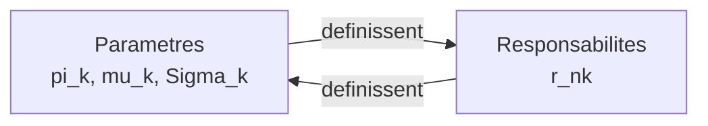
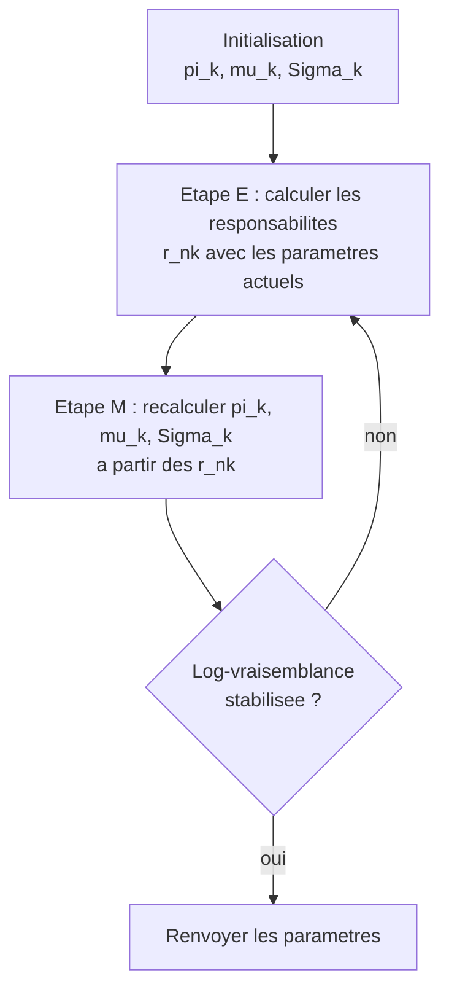
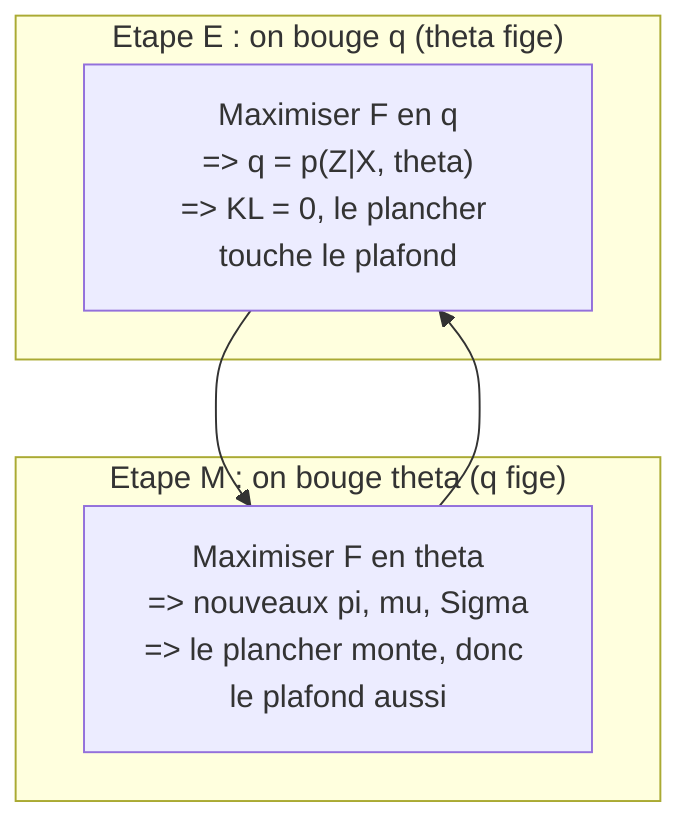
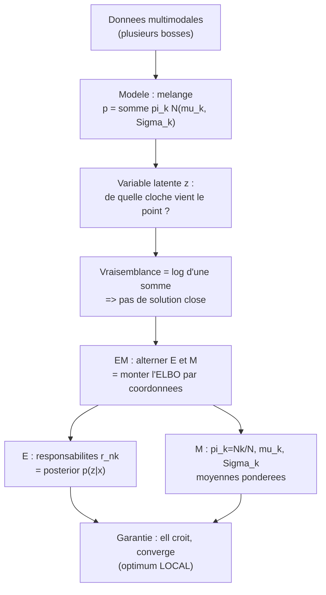

[← Sommaire](../README.md#table-des-matières)

# 11. Estimation de densité par mélanges gaussiens

### Le modèle de mélange gaussien

Imaginez que vous regardez la liste des tailles de tous les eleves d'une grande ecole, du CP a la terminale, melanges dans un meme tableau. Si vous tracez l'histogramme de ces tailles, vous ne verrez **pas** une seule cloche bien nette : vous verrez plutot deux ou trois bosses. Une bosse vers $`1{,}20`$ m (les petits), une bosse vers $`1{,}70`$ m (les grands), et peut-etre une bosse intermediaire. Une seule loi normale (loi gaussienne) ne peut pas decrire ca : elle n'a qu'une seule bosse. Mais si on **additionne plusieurs cloches**, chacune avec sa position, sa largeur et son importance, on peut epouser n'importe quelle forme bosselee. C'est exactement l'idee du **melange gaussien** (Gaussian mixture model, abrege GMM).

Ce chapitre repond a une question tres concrete : *etant donne un nuage de points, comment apprendre la « forme » de la densite de probabilite qui les a engendres, quand cette forme n'est pas une simple gaussienne ?* La reponse — superposer des gaussiennes et ajuster automatiquement leurs parametres — est l'une des techniques les plus utilisees en apprentissage automatique (machine learning) : segmentation de clientele, compression d'images, reconnaissance vocale, detection d'anomalies, initialisation de reseaux de neurones generatifs.

#### Rappel express : une seule gaussienne

On suppose connue (chapitre 6) la **densite gaussienne multivariee** sur $`\mathbb{R}^d`$. Pour un vecteur $`\mathbf{x} \in \mathbb{R}^d`$, de moyenne $`\boldsymbol{\mu} \in \mathbb{R}^d`$ et de matrice de covariance $`\boldsymbol{\Sigma}`$ (symetrique definie positive de taille $`d \times d`$), elle vaut :

```math
\mathcal{N}(\mathbf{x} \mid \boldsymbol{\mu}, \boldsymbol{\Sigma})
= \frac{1}{(2\pi)^{d/2}\,\lvert \boldsymbol{\Sigma}\rvert^{1/2}}
\exp\!\left(-\tfrac{1}{2}(\mathbf{x}-\boldsymbol{\mu})^{\top}\boldsymbol{\Sigma}^{-1}(\mathbf{x}-\boldsymbol{\mu})\right).
```

> **Le symbole $`\mid`$ (barre verticale).** Ce symbole represente l'idee de « sachant que » ou « avec les reglages ». Quand on ecrit $`\mathcal{N}(\mathbf{x} \mid \boldsymbol{\mu}, \boldsymbol{\Sigma})`$, on lit : « la valeur de la cloche au point $`\mathbf{x}`$, **avec** comme reglages le centre $`\boldsymbol{\mu}`$ et l'etalement $`\boldsymbol{\Sigma}`$ ». C'est comme une machine a dessiner des cloches : a gauche de la barre, l'endroit ou on regarde ; a droite, les boutons de reglage de la machine.

Cette unique cloche a un centre unique et une seule region de forte densite. Insuffisant pour des donnees multimodales (a plusieurs bosses).

#### Definition du modele de melange

> **Definition (melange gaussien).** Un melange gaussien a $`K`$ composantes est la densite de probabilite sur $`\mathbb{R}^d`$ definie par
> ```math
> p(\mathbf{x}) = \sum_{k=1}^{K} \pi_k \, \mathcal{N}(\mathbf{x} \mid \boldsymbol{\mu}_k, \boldsymbol{\Sigma}_k),
> ```
> ou les $`\pi_k`$ sont des reels appeles **poids de melange** (mixing coefficients) verifiant
> ```math
> \pi_k \ge 0 \quad \text{pour tout } k, \qquad \sum_{k=1}^{K} \pi_k = 1,
> ```
> et ou chaque $`(\boldsymbol{\mu}_k, \boldsymbol{\Sigma}_k)`$ sont la moyenne et la covariance de la $`k`$-ieme composante (cloche).

Decortiquons chaque symbole nouveau.

> **Le symbole $`K`$.** Ce symbole represente **le nombre de cloches** qu'on empile. Si $`K=3`$, on melange trois gaussiennes. C'est comme decider combien de groupes on pense qu'il y a dans la classe : les petits, les moyens, les grands $`\rightarrow K=3`$.

> **Le symbole $`\pi_k`$ (les poids de melange).** Ce symbole represente **l'importance relative de chaque cloche**. Le petit $`k`$ en bas (l'indice) dit « de quelle cloche on parle » : $`\pi_1`$ est le poids de la cloche n°1, $`\pi_2`$ celui de la cloche n°2, etc. Attention, ce $`\pi`$ ici n'a rien a voir avec le nombre $`3{,}1415\dots`$ : c'est juste la lettre grecque qu'on reutilise pour nommer une proportion. Imaginez un gros gateau coupe en parts : $`\pi_k`$ est la taille de la part de la cloche $`k`$. Toutes les parts mises bout a bout font le gateau entier, donc elles s'additionnent a $`1`$ ($`100\%`$). Et une part ne peut pas etre negative, donc $`\pi_k \ge 0`$. Concretement, si dans l'ecole il y a $`50\%`$ de petits, $`30\%`$ de moyens et $`20\%`$ de grands, alors $`\pi_1=0{,}5`$, $`\pi_2=0{,}3`$, $`\pi_3=0{,}2`$.

> **Le symbole $`\boldsymbol{\mu}_k`$ et $`\boldsymbol{\Sigma}_k`$.** Le $`\boldsymbol{\mu}`$ (lettre grecque « mu », en gras car c'est un vecteur) represente **le centre** de la cloche $`k`$ : l'endroit ou elle culmine. Le $`\boldsymbol{\Sigma}`$ (lettre grecque « sigma » majuscule, une matrice) represente **l'etalement et l'inclinaison** de la cloche $`k`$ : est-elle large ou serree, ronde ou ovale, penchee ou droite ? Ce sont les memes objets qu'au chapitre 6, mais maintenant on en a un jeu **par cloche**, d'ou l'indice $`k`$.

La contrainte $`\sum_k \pi_k = 1`$ avec $`\pi_k \ge 0`$ fait que $`p(\mathbf{x})`$ est bien une densite : elle est positive (somme de termes positifs) et son integrale vaut $`1`$, car

```math
\int_{\mathbb{R}^d} p(\mathbf{x})\,\mathrm{d}\mathbf{x}
= \sum_{k=1}^{K} \pi_k \underbrace{\int_{\mathbb{R}^d}\mathcal{N}(\mathbf{x}\mid\boldsymbol{\mu}_k,\boldsymbol{\Sigma}_k)\,\mathrm{d}\mathbf{x}}_{=\,1}
= \sum_{k=1}^{K}\pi_k = 1.
```

> **Rappel sur le symbole $`\sum`$.** On le suppose connu : c'est « une boucle qui additionne ». $`\sum_{k=1}^{K} a_k`$ veut dire « fais la somme $`a_1 + a_2 + \dots + a_K`$ ». Ici la boucle additionne les $`K`$ cloches ponderees. On a pu sortir chaque $`\pi_k`$ de l'integrale car l'integration porte sur $`\mathbf{x}`$, pas sur $`k`$.

#### Le melange comme densite vraiment universelle

Pourquoi se donner tant de mal ? Parce qu'un melange gaussien est un **approximateur universel de densites**. Intuitivement : en placant beaucoup de petites cloches cote a cote (a la maniere des pixels qui reconstituent une image, ou des briques Lego qui epousent une courbe), on approche d'aussi pres qu'on veut n'importe quelle densite continue raisonnable.

> **Theoreme (densite des melanges gaussiens, version informelle).** Soit $`p^\star`$ une densite de probabilite continue sur $`\mathbb{R}^d`$. Pour tout $`\varepsilon > 0`$, il existe un melange gaussien fini $`p`$ tel que $`\int_{\mathbb{R}^d} \lvert p(\mathbf{x}) - p^\star(\mathbf{x})\rvert\,\mathrm{d}\mathbf{x} < \varepsilon`$.

*Idee de preuve.* On approche $`p^\star`$ par une convolution avec un noyau gaussien d'ecart-type $`\sigma`$ : la fonction $`p_\sigma = p^\star * \mathcal{N}(\cdot \mid \mathbf{0}, \sigma^2 \mathbf{I})`$ converge vers $`p^\star`$ en norme $`L^1`$ quand $`\sigma \to 0`$ (propriete d'approximation de l'identite). Or

```math
p_\sigma(\mathbf{x}) = \int_{\mathbb{R}^d} p^\star(\mathbf{y})\,\mathcal{N}(\mathbf{x}\mid \mathbf{y}, \sigma^2\mathbf{I})\,\mathrm{d}\mathbf{y}
```

est une « somme continue » (integrale) de gaussiennes centrees en chaque $`\mathbf{y}`$, ponderees par $`p^\star(\mathbf{y})`$. On discretise cette integrale par une somme de Riemann finie : on obtient un melange fini de gaussiennes (toutes de covariance $`\sigma^2 \mathbf{I}`$) aussi proche qu'on veut de $`p_\sigma`$, donc de $`p^\star`$. $`\;\blacksquare`$

> **Le symbole $`L^1`$ et la norme $`\|\cdot\|_{L^1}`$.** « Converger en norme $`L^1`$ » veut simplement dire que **l'aire totale de l'ecart** entre les deux courbes, $`\int \lvert p_\sigma - p^\star\rvert`$, devient aussi petite qu'on veut. Image : on superpose les deux dessins de densite et on mesure la surface coloriee qui depasse ; cette surface tend vers $`0`$.

> **Remarque (universel ne veut pas dire facile).** L'universalite est un resultat d'*existence* : elle garantit qu'un bon melange existe, pas qu'on saura le trouver, ni avec combien de composantes. Trouver les bons $`\pi_k, \boldsymbol{\mu}_k, \boldsymbol{\Sigma}_k`$ a partir de donnees est precisement le probleme d'apprentissage des sections suivantes.

#### Variantes de structure de covariance

En pratique on contraint souvent la forme des $`\boldsymbol{\Sigma}_k`$ pour reduire le nombre de parametres (et donc le risque de surapprentissage / overfitting). Pour des donnees en dimension $`d`$ :

| Type de covariance | Forme de $`\boldsymbol{\Sigma}_k`$ | Forme des cloches | Nb total de parametres de covariance |
|---|---|---|---|
| `spherical` | $`\sigma_k^2\,\mathbf{I}`$ | boules de rayon variable | $`K`$ |
| `diag` | $`\mathrm{diag}(\sigma_{k,1}^2,\dots,\sigma_{k,d}^2)`$ | ellipsoides alignes sur les axes | $`K d`$ |
| `full` | matrice SDP quelconque | ellipsoides penches quelconques | $`K\,\dfrac{d(d+1)}{2}`$ |
| `tied` | une seule $`\boldsymbol{\Sigma}`$ commune | meme forme pour toutes | $`\dfrac{d(d+1)}{2}`$ |

> **Le symbole $`\mathbf{I}`$.** Il represente la **matrice identite** : des $`1`$ sur la diagonale, des $`0`$ ailleurs. Multiplier par $`\sigma^2 \mathbf{I}`$, c'est dire « une cloche parfaitement ronde, de meme largeur dans toutes les directions ». C'est le reglage le plus simple.

> **Pourquoi $`\dfrac{d(d+1)}{2}`$ pour une covariance `full` ?** Une matrice $`d\times d`$ a $`d^2`$ cases, mais $`\boldsymbol{\Sigma}`$ est **symetrique** ($`\boldsymbol{\Sigma}=\boldsymbol{\Sigma}^{\top}`$) : la moitie au-dessus de la diagonale repete la moitie en dessous. Il reste donc la diagonale ($`d`$ termes) plus le triangle strictement superieur ($`\tfrac{d(d-1)}{2}`$ termes), soit $`d + \tfrac{d(d-1)}{2} = \tfrac{d(d+1)}{2}`$ nombres libres.

> **Piege (le nombre de parametres explose).** Une covariance `full` coute $`\frac{d(d+1)}{2}`$ nombres **par composante**. En dimension $`d=100`$ avec $`K=10`$, cela fait deja $`10 \times \frac{100\times 101}{2} = 50\,500`$ parametres rien que pour les covariances. Si on a peu de donnees, on prefere `diag` ou `spherical`, ou on regularise (voir plus loin).

#### Generer un point : le mode d'emploi

Un melange n'est pas qu'une formule : c'est une **recette pour fabriquer des donnees**. Pour tirer un point au hasard selon $`p`$ :


Autrement dit : d'abord on lance un de truque (les faces ont les probabilites $`\pi_k`$) pour decider de quel groupe vient le point ; ensuite on tire le point dans la cloche de ce groupe. Cette lecture « en deux temps » est la cle de toute la theorie (section sur la variable latente).

> **Exemple chiffre (genese a la main).** Prenons $`d=1`$, $`K=2`$, avec $`\pi_1=0{,}7`$, $`\pi_2=0{,}3`$, $`\mu_1=0`$, $`\sigma_1=1`$, $`\mu_2=5`$, $`\sigma_2=0{,}5`$.
> 1. Je tire un nombre $`u`$ uniforme dans $`[0,1]`$. Disons $`u=0{,}55`$. Comme $`0{,}55 < 0{,}7 = \pi_1`$, je choisis la cloche 1.
> 2. Je tire $`x`$ dans $`\mathcal{N}(0, 1)`$. Disons $`x = 0{,}82`$. Mon point est $`0{,}82`$.
> Si j'avais obtenu $`u = 0{,}9 > 0{,}7`$, j'aurais choisi la cloche 2 et tire $`x`$ dans $`\mathcal{N}(5, 0{,}25)`$ (rappel : ici $`\sigma_2=0{,}5`$ donc la variance vaut $`\sigma_2^2=0{,}25`$).

Voici le code correspondant, qui genere un jeu de donnees et trace la densite theorique.

```python
import numpy as np

rng = np.random.default_rng(0)

# Parametres du melange (1D, K=2)
pis    = np.array([0.7, 0.3])
mus    = np.array([0.0, 5.0])
sigmas = np.array([1.0, 0.5])          # ecarts-types (pas variances)

def echantillonne_melange(n, pis, mus, sigmas, rng):
    # Etape 1 : choisir la cloche de chaque point (le "de truque")
    k = rng.choice(len(pis), size=n, p=pis)
    # Etape 2 : tirer dans la gaussienne choisie
    return rng.normal(loc=mus[k], scale=sigmas[k])

X = echantillonne_melange(10_000, pis, mus, sigmas, rng)

def densite_melange(x, pis, mus, sigmas):
    # somme_k pi_k * N(x | mu_k, sigma_k^2)
    comp = (pis[None, :]
            * np.exp(-0.5 * ((x[:, None] - mus[None, :]) / sigmas[None, :]) ** 2)
            / (np.sqrt(2 * np.pi) * sigmas[None, :]))
    return comp.sum(axis=1)

grille = np.linspace(-4, 8, 400)
print("Integrale numerique de p :",
      np.trapz(densite_melange(grille, pis, mus, sigmas), grille))
# -> proche de 1.0 : c'est bien une densite
```

> **Application en machine learning.** Ce mecanisme « choisir un groupe puis generer » est le squelette de tout *modele generatif a variable latente* : melanges gaussiens, mais aussi modeles de Markov caches, auto-encodeurs variationnels (VAE). Comprendre le GMM, c'est poser la premiere brique conceptuelle des modeles generatifs profonds modernes.

---

### Apprentissage par maximum de vraisemblance

On dispose maintenant de donnees $`\mathbf{x}_1, \dots, \mathbf{x}_N`$ (le nuage observe) et on **suppose** qu'elles ont ete tirees independamment d'un melange gaussien dont on ignore les parametres. Le but : **retrouver** les meilleurs $`\pi_k, \boldsymbol{\mu}_k, \boldsymbol{\Sigma}_k`$. La methode est celle du chapitre 8 : le **maximum de vraisemblance** (maximum likelihood).

> **Le symbole $`N`$.** Il represente **le nombre de points de donnees** qu'on a observes (la taille de l'echantillon). A ne pas confondre avec $`K`$ (le nombre de cloches) : $`N`$ se compte en milliers (les eleves mesures), $`K`$ en unites (les groupes supposes).

> **Le symbole $`\boldsymbol{\theta}`$.** Il represente **le sac contenant TOUS les reglages a apprendre** : $`\boldsymbol{\theta} = \{\pi_k, \boldsymbol{\mu}_k, \boldsymbol{\Sigma}_k\}_{k=1}^{K}`$. Plutot que d'ecrire la longue liste a chaque fois, on l'emballe dans une seule lettre, comme on rangerait tous ses outils dans une seule boite a outils nommee $`\boldsymbol{\theta}`$ (« theta »).

#### La fonction de vraisemblance

La **vraisemblance** (likelihood) d'un jeu de parametres, c'est « la probabilite que ce modele aurait donnee a nos donnees ». Comme les points sont independants, la probabilite de les voir tous ensemble est le **produit** des probabilites de chacun :

```math
\mathcal{L}(\boldsymbol{\theta}) = p(\mathbf{x}_1,\dots,\mathbf{x}_N \mid \boldsymbol{\theta})
= \prod_{n=1}^{N} p(\mathbf{x}_n \mid \boldsymbol{\theta})
= \prod_{n=1}^{N} \sum_{k=1}^{K} \pi_k\, \mathcal{N}(\mathbf{x}_n \mid \boldsymbol{\mu}_k, \boldsymbol{\Sigma}_k).
```

> **Le symbole $`\prod`$ (produit).** Frere jumeau de $`\sum`$, mais il **multiplie** au lieu d'additionner. $`\prod_{n=1}^{N} a_n`$ veut dire $`a_1 \times a_2 \times \dots \times a_N`$. Pourquoi un produit ? Parce que pour des evenements independants, les probabilites se multiplient (la proba de « pile puis pile » est $`\tfrac12 \times \tfrac12`$). C'est une boucle, mais qui multiplie.

#### Pourquoi on passe au logarithme

Multiplier des milliers de nombres tous compris entre $`0`$ et $`1`$ donne un resultat astronomiquement petit (sous-debordement numerique / underflow : l'ordinateur l'arrondit a $`0`$). Et un produit est penible a deriver. On prend donc le **logarithme**, qui transforme les produits en sommes et est strictement croissant (donc il ne change pas l'emplacement du maximum) :

```math
\ell(\boldsymbol{\theta}) = \ln \mathcal{L}(\boldsymbol{\theta})
= \sum_{n=1}^{N} \ln\!\left( \sum_{k=1}^{K} \pi_k\, \mathcal{N}(\mathbf{x}_n \mid \boldsymbol{\mu}_k, \boldsymbol{\Sigma}_k) \right).
```

> **Le symbole $`\ln`$.** C'est le **logarithme naturel** (logarithme en base $`e`$). Vu comme une « regle a calcul » magique : il transforme une multiplication en addition ($`\ln(ab) = \ln a + \ln b`$) et ecrase les ordres de grandeur. Comme il est strictement croissant, l'endroit ou $`\mathcal{L}`$ est maximale est aussi l'endroit ou $`\ln\mathcal{L}`$ est maximale : passer au log ne deplace pas le sommet. On l'utilise partout en apprentissage car il rend les calculs stables et additifs.

> **Le symbole $`\ell`$ (« l » cursif).** Il represente la **log-vraisemblance** (log-likelihood) : juste le logarithme de la vraisemblance $`\mathcal{L}`$. Maximiser $`\ell`$ revient exactement a maximiser $`\mathcal{L}`$, mais en plus confortable. L'estimateur du maximum de vraisemblance est
> ```math
> \hat{\boldsymbol{\theta}} = \arg\max_{\boldsymbol{\theta}} \ell(\boldsymbol{\theta}).
> ```

> **Piege central (le log d'une somme).** Pour une seule gaussienne, le $`\ln`$ « mange » l'exponentielle et tout se simplifie. Ici, le $`\ln`$ porte sur une **somme** $`\sum_k \pi_k \mathcal{N}(\cdot)`$ : impossible de la casser proprement, car $`\ln(a+b) \ne \ln a + \ln b`$. C'est cette somme **a l'interieur** du logarithme qui rend le probleme difficile et interdit une solution en forme close. Tout l'algorithme EM (section suivante) est ne pour contourner cet obstacle.

#### Les equations de stationnarite

Cherchons les points ou le gradient s'annule. On introduit une quantite qui va devenir centrale.

> **Les responsabilites $`r_{nk}`$.** Ce symbole represente **la part de responsabilite de la cloche $`k`$ dans l'apparition du point $`\mathbf{x}_n`$**. Les deux indices se lisent : $`n`$ = quel point, $`k`$ = quelle cloche. Image : un point de donnee est une « affaire a resoudre », et les $`K`$ cloches sont des suspectes ; $`r_{nk}`$ est la probabilite que ce soit la cloche $`k`$ la coupable pour le point $`n`$. Pour un point donne, les responsabilites de toutes les cloches s'additionnent a $`1`$ ($`\sum_k r_{nk}=1`$) : on est sur qu'**une** des cloches l'a produit. Formellement, c'est la probabilite a posteriori (regle de Bayes) que le point $`n`$ vienne de la cloche $`k`$ :
> ```math
> r_{nk} = \frac{\pi_k\,\mathcal{N}(\mathbf{x}_n \mid \boldsymbol{\mu}_k, \boldsymbol{\Sigma}_k)}{\displaystyle\sum_{j=1}^{K} \pi_j\,\mathcal{N}(\mathbf{x}_n \mid \boldsymbol{\mu}_j, \boldsymbol{\Sigma}_j)}.
> ```
> Le numerateur, c'est « cloche $`k`$ choisie ET point genere par elle » ; le denominateur, c'est la proba totale du point (toutes cloches confondues). On divise pour normaliser, comme on repartirait $`100\%`$ de soupcons entre les suspectes.

Derivons $`\ell`$ par rapport a chaque parametre. Pour $`\boldsymbol{\mu}_k`$, en utilisant
$`\dfrac{\partial}{\partial \boldsymbol{\mu}_k}\mathcal{N}(\mathbf{x}_n\mid\boldsymbol{\mu}_k,\boldsymbol{\Sigma}_k) = \mathcal{N}(\mathbf{x}_n\mid\boldsymbol{\mu}_k,\boldsymbol{\Sigma}_k)\,\boldsymbol{\Sigma}_k^{-1}(\mathbf{x}_n - \boldsymbol{\mu}_k)`$
et la regle de derivation $`\dfrac{\partial}{\partial \boldsymbol{\mu}_k}\ln(\cdot) = \dfrac{1}{(\cdot)}\dfrac{\partial(\cdot)}{\partial \boldsymbol{\mu}_k}`$ :

```math
\frac{\partial \ell}{\partial \boldsymbol{\mu}_k}
= \sum_{n=1}^{N} \underbrace{\frac{\pi_k\,\mathcal{N}(\mathbf{x}_n\mid\boldsymbol{\mu}_k,\boldsymbol{\Sigma}_k)}{\sum_j \pi_j\,\mathcal{N}(\mathbf{x}_n\mid\boldsymbol{\mu}_j,\boldsymbol{\Sigma}_j)}}_{=\,r_{nk}} \boldsymbol{\Sigma}_k^{-1}(\mathbf{x}_n - \boldsymbol{\mu}_k) = \mathbf{0}.
```

Comme par magie, la responsabilite $`r_{nk}`$ **apparait toute seule** dans le gradient : le $`\pi_k\mathcal{N}(\cdot)`$ venant de la derivee se combine avec le $`1/p(\mathbf{x}_n)`$ venant du $`\ln`$. En multipliant a gauche par $`\boldsymbol{\Sigma}_k`$ (inversible) et en isolant $`\boldsymbol{\mu}_k`$ :

```math
\boxed{\;\boldsymbol{\mu}_k = \frac{\sum_{n=1}^{N} r_{nk}\,\mathbf{x}_n}{\sum_{n=1}^{N} r_{nk}} = \frac{1}{N_k}\sum_{n=1}^{N} r_{nk}\,\mathbf{x}_n\;}, \qquad N_k := \sum_{n=1}^{N} r_{nk}.
```

> **Le symbole $`N_k`$ (effectif mou).** Il represente le **nombre « mou » de points attribues a la cloche $`k`$** : on additionne les responsabilites de tous les points pour cette cloche. Si la cloche $`k`$ « possede » fermement $`300`$ points, $`N_k \approx 300`$. Mais comme les responsabilites sont des fractions, $`N_k`$ peut valoir $`287{,}4`$ : c'est un comptage flou, pas entier. Comme $`\sum_k r_{nk}=1`$ pour chaque point, on a toujours $`\sum_k N_k = N`$.

La moyenne optimale est donc la **moyenne des points ponderee par leur responsabilite** : chaque point « vote » pour le centre de la cloche $`k`$ avec un poids egal a sa responsabilite envers elle. De meme, en derivant par rapport a $`\boldsymbol{\Sigma}_k`$ (calcul matriciel sur $`\ln\lvert\boldsymbol{\Sigma}\rvert`$ et $`\boldsymbol{\Sigma}^{-1}`$, chapitre 6) et en annulant le gradient :

```math
\boxed{\;\boldsymbol{\Sigma}_k = \frac{1}{N_k}\sum_{n=1}^{N} r_{nk}\,(\mathbf{x}_n - \boldsymbol{\mu}_k)(\mathbf{x}_n - \boldsymbol{\mu}_k)^{\top}\;}.
```

> **Le symbole $`(\mathbf{x}_n - \boldsymbol{\mu}_k)(\mathbf{x}_n - \boldsymbol{\mu}_k)^{\top}`$ (produit exterieur).** Un vecteur colonne $`\mathbf{v}\in\mathbb{R}^d`$ multiplie par sa propre transposee $`\mathbf{v}^{\top}`$ (ligne) donne une **matrice** $`d\times d`$ : la case $`(i,j)`$ vaut $`v_i v_j`$. C'est l'inverse du produit scalaire $`\mathbf{v}^{\top}\mathbf{v}`$ (qui, lui, donne un seul nombre). Ici cette matrice mesure comment l'ecart d'un point a son centre s'etale dans chaque paire de directions ; en moyennant ces matrices (ponderees par $`r_{nk}`$) on reconstruit la forme de la cloche.

Pour les poids $`\pi_k`$, il faut tenir compte de la contrainte $`\sum_k \pi_k = 1`$. On ajoute un **multiplicateur de Lagrange** $`\lambda`$ (chapitre sur le lagrangien) et on annule la derivee de $`\ell(\boldsymbol{\theta}) + \lambda\big(\sum_k \pi_k - 1\big)`$ par rapport a $`\pi_k`$ :

```math
\frac{\partial}{\partial \pi_k}\left[\ell + \lambda\Big(\textstyle\sum_j \pi_j - 1\Big)\right]
= \sum_{n=1}^{N} \frac{\mathcal{N}(\mathbf{x}_n\mid\boldsymbol{\mu}_k,\boldsymbol{\Sigma}_k)}{\sum_j \pi_j\,\mathcal{N}(\mathbf{x}_n\mid\boldsymbol{\mu}_j,\boldsymbol{\Sigma}_j)} + \lambda = \frac{N_k}{\pi_k} + \lambda = 0.
```

(On a reconnu $`\frac{N_k}{\pi_k}`$ : en multipliant et divisant le terme de gauche par $`\pi_k`$, on fait apparaitre $`r_{nk}`$ au numerateur, dont la somme sur $`n`$ vaut $`N_k`$.) Donc $`\pi_k = -N_k/\lambda`$. En sommant sur $`k`$ et en utilisant $`\sum_k \pi_k = 1`$ et $`\sum_k N_k = N`$, on trouve $`-N/\lambda = 1`$, soit $`\lambda = -N`$, d'ou :

```math
\boxed{\;\pi_k = \frac{N_k}{N}\;}.
```

> **Le symbole $`\lambda`$ (multiplicateur de Lagrange).** C'est une **variable supplementaire** qu'on s'autorise a introduire pour gerer une contrainte d'egalite (ici « les poids somment a $`1`$ »). Image : un ressort qui rappelle la solution vers la zone autorisee ; sa « raideur » $`\lambda`$ s'ajuste toute seule pour que la contrainte soit pile respectee. On le determine en reinjectant la contrainte, comme on vient de le faire pour trouver $`\lambda=-N`$.

> **Lecture intuitive.** Le poids optimal d'une cloche est simplement **sa part du gateau** : le nombre mou de points qu'elle possede, divise par le total. Limpide.

#### Le serpent qui se mord la queue

Regardons bien les trois formules encadrees. Elles donnent $`\boldsymbol{\mu}_k, \boldsymbol{\Sigma}_k, \pi_k`$ **en fonction des responsabilites** $`r_{nk}`$. Mais la definition de $`r_{nk}`$ depend elle-meme de $`\boldsymbol{\mu}_k, \boldsymbol{\Sigma}_k, \pi_k`$ ! C'est un systeme **implicite** : pour calculer les parametres il faut les responsabilites, et pour les responsabilites il faut les parametres.



> **L'idee qui sauve tout.** Quand un systeme s'auto-reference comme ca, une strategie naturelle est le **point fixe** : on devine des parametres, on en deduit les responsabilites, puis on recalcule les parametres a partir de ces responsabilites, et on recommence jusqu'a stabilisation. Cette alternance porte un nom : c'est l'algorithme esperance-maximisation, objet de la section suivante. Les equations encadrees ci-dessus ne sont donc pas une solution close, mais les **regles de mise a jour** d'une boucle.

---

### L'algorithme espérance-maximisation (EM)

L'algorithme **esperance-maximisation** (expectation-maximization, EM) resout le probleme du serpent qui se mord la queue par une alternance simple et elegante. C'est l'un des algorithmes les plus importants de tout l'apprentissage statistique.

#### Le principe en deux temps

> **Intuition (le jeu du professeur et des groupes).** Vous etes professeur face a une classe melangee et vous voulez (a) deviner a quel groupe appartient chaque eleve et (b) decrire chaque groupe (sa taille moyenne, sa dispersion). Probleme : pour assigner les eleves il faut connaitre les groupes, et pour decrire les groupes il faut savoir qui en fait partie. Solution pragmatique :
> - **Etape E :** avec votre description actuelle des groupes, calculez pour chaque eleve sa probabilite d'appartenance a chaque groupe (les responsabilites).
> - **Etape M :** en supposant ces appartenances, **re-decrivez** chaque groupe (recalculez moyenne, dispersion, taille).
> Repetez. A chaque tour, votre description s'ameliore.



#### Algorithme detaille

> **Algorithme (EM pour melange gaussien).**
> **Entree :** donnees $`\{\mathbf{x}_n\}_{n=1}^N`$, nombre de composantes $`K`$.
> **Initialisation :** choisir $`\boldsymbol{\theta}^{(0)} = \{\pi_k, \boldsymbol{\mu}_k, \boldsymbol{\Sigma}_k\}`$ (souvent via $`k`$-moyennes, voir plus bas).
> **Repeter** pour $`t = 0, 1, 2, \dots`$ jusqu'a convergence :
>
> **Etape E (esperance).** Pour tout $`n, k`$, calculer la responsabilite avec les parametres courants $`\boldsymbol{\theta}^{(t)}`$ :
> ```math
> r_{nk}^{(t)} = \frac{\pi_k^{(t)}\,\mathcal{N}(\mathbf{x}_n \mid \boldsymbol{\mu}_k^{(t)}, \boldsymbol{\Sigma}_k^{(t)})}{\sum_{j=1}^{K} \pi_j^{(t)}\,\mathcal{N}(\mathbf{x}_n \mid \boldsymbol{\mu}_j^{(t)}, \boldsymbol{\Sigma}_j^{(t)})}.
> ```
>
> **Etape M (maximisation).** Poser $`N_k = \sum_{n} r_{nk}^{(t)}`$, puis mettre a jour :
> ```math
> \pi_k^{(t+1)} = \frac{N_k}{N}, \quad
> \boldsymbol{\mu}_k^{(t+1)} = \frac{1}{N_k}\sum_{n} r_{nk}^{(t)}\mathbf{x}_n, \quad
> \boldsymbol{\Sigma}_k^{(t+1)} = \frac{1}{N_k}\sum_{n} r_{nk}^{(t)} (\mathbf{x}_n - \boldsymbol{\mu}_k^{(t+1)})(\mathbf{x}_n - \boldsymbol{\mu}_k^{(t+1)})^{\top}.
> ```
>
> **Critere d'arret :** s'arreter quand $`\ell(\boldsymbol{\theta}^{(t+1)}) - \ell(\boldsymbol{\theta}^{(t)}) < \varepsilon`$ (gain de log-vraisemblance negligeable).

> **Le symbole $`t`$ et l'exposant $`^{(t)}`$.** Le $`t`$ represente **le numero du tour de boucle** (l'iteration). L'exposant entre parentheses, comme dans $`\boldsymbol{\mu}_k^{(t)}`$, veut dire « la valeur de ce parametre **au tour $`t`$** ». A ne pas confondre avec une puissance : $`\boldsymbol{\mu}_k^{(3)}`$ n'est pas « mu au cube », c'est « mu apres 3 tours ». La parenthese est justement la pour signaler « ce n'est pas un exposant de puissance ».

#### Lien avec k-moyennes

L'algorithme des **$`k`$-moyennes** (k-means) est un cas limite « dur » d'EM. Au lieu de responsabilites floues $`r_{nk} \in [0,1]`$, on assigne chaque point a sa cloche la plus proche ($`r_{nk} \in \{0,1\}`$). On le retrouve en prenant des covariances $`\boldsymbol{\Sigma}_k = \sigma^2 \mathbf{I}`$ communes et en faisant tendre $`\sigma \to 0`$ : dans la formule des responsabilites, l'ecart le plus petit ecrase exponentiellement tous les autres, et la responsabilite se concentre entierement sur la composante la plus proche.

> **Initialisation en pratique.** On initialise presque toujours EM par **$`k`$-means++** (variante de $`k`$-moyennes a tirage initial intelligent), qui evite les mauvais minima et accelere nettement la convergence. C'est le defaut de `scikit-learn` (`init_params='kmeans'` ou `'k-means++'`). Pour de tres grands jeux de donnees, on utilise des variantes **mini-batch / stochastiques** d'EM, dans l'esprit des optimiseurs par lots du deep learning.

| Aspect | $`k`$-moyennes | EM (GMM) |
|---|---|---|
| Assignation | dure ($`0`$ ou $`1`$) | molle (responsabilites $`\in [0,1]`$) |
| Forme des groupes | spheriques, meme taille | ellipsoides, tailles variables |
| Sortie | etiquettes | densite de probabilite complete |
| Cas particulier de... | — | EM avec $`\boldsymbol{\Sigma}=\sigma^2\mathbf{I}, \sigma\to 0`$ |

#### Garantie de convergence : la log-vraisemblance ne descend jamais

C'est la propriete fondamentale d'EM, demontree en detail dans la section suivante via l'ELBO.

> **Theoreme (monotonie d'EM).** A chaque iteration d'EM, la log-vraisemblance des donnees ne diminue pas :
> ```math
> \ell(\boldsymbol{\theta}^{(t+1)}) \ge \ell(\boldsymbol{\theta}^{(t)}).
> ```
> Comme $`\ell`$ est majoree (une log-vraisemblance de densite ne tend pas vers $`+\infty`$ sur des configurations raisonnables, hors singularites traitees plus bas), la suite croissante $`\ell(\boldsymbol{\theta}^{(t)})`$ converge.

> **Piege (convergence vers un optimum LOCAL).** EM garantit de **monter**, pas d'atteindre le sommet le plus haut. Selon l'initialisation, on peut rester coince sur une colline secondaire (optimum local). Remede standard : lancer EM plusieurs fois avec des initialisations differentes et **garder la solution de plus grande log-vraisemblance**.

> **Piege (singularites / divergence vers $`+\infty`$).** Si une composante se concentre sur un **seul** point ($`\boldsymbol{\mu}_k = \mathbf{x}_n`$) et que sa variance tend vers $`0`$, sa densite en ce point explose et $`\ell \to +\infty`$ : c'est une singularite pathologique du maximum de vraisemblance, pas une vraie solution. Remedes : ajouter une petite **regularisation** $`\boldsymbol{\Sigma}_k \leftarrow \boldsymbol{\Sigma}_k + \epsilon \mathbf{I}`$ (covariance floor), borner les variances, ou re-initialiser une composante qui s'effondre.

#### Exemple chiffre deroule pas a pas

Prenons $`1`$ D, $`N=4`$ points : $`\mathbf{x} = (0,\ 1,\ 8,\ 9)`$, et $`K=2`$. Initialisons grossierement : $`\pi_1=\pi_2=0{,}5`$, $`\mu_1=1`$, $`\mu_2=8`$, $`\sigma_1^2=\sigma_2^2=4`$.

**Etape E (premier tour).** Calculons $`r_{n1}`$ (responsabilite de la cloche 1). Avec $`\mathcal{N}(x\mid\mu,\sigma^2) = \tfrac{1}{\sqrt{2\pi\cdot 4}}\exp\!\big(-(x-\mu)^2/8\big)`$ ici :

| point $`x_n`$ | $`\mathcal{N}(x_n\mid 1,4)`$ | $`\mathcal{N}(x_n\mid 8,4)`$ | $`r_{n1}`$ | $`r_{n2}`$ |
|---|---|---|---|---|
| $`0`$ | $`0{,}1760`$ | $`\approx 0{,}0000`$ | $`\approx 1{,}000`$ | $`\approx 0{,}000`$ |
| $`1`$ | $`0{,}1995`$ | $`\approx 0{,}0000`$ | $`\approx 1{,}000`$ | $`\approx 0{,}000`$ |
| $`8`$ | $`\approx 0{,}0000`$ | $`0{,}1995`$ | $`\approx 0{,}000`$ | $`\approx 1{,}000`$ |
| $`9`$ | $`\approx 0{,}0000`$ | $`0{,}1760`$ | $`\approx 0{,}000`$ | $`\approx 1{,}000`$ |

Les points $`\{0,1\}`$ sont clairement attribues a la cloche 1, les points $`\{8,9\}`$ a la cloche 2.

**Etape M (premier tour).** $`N_1 = 1+1+0+0 = 2`$, $`N_2 = 2`$.
- $`\pi_1 = \pi_2 = 2/4 = 0{,}5`$.
- $`\mu_1 = (1\cdot 0 + 1\cdot 1)/2 = 0{,}5`$ ; $`\mu_2 = (8+9)/2 = 8{,}5`$.
- $`\sigma_1^2 = \tfrac12\big[(0-0{,}5)^2 + (1-0{,}5)^2\big] = 0{,}25`$ ; de meme $`\sigma_2^2 = 0{,}25`$.

En **un seul tour**, les centres sont passes de $`(1, 8)`$ a $`(0{,}5,\ 8{,}5)`$ — les vraies moyennes des deux paquets — et les variances ont chute a $`0{,}25`$. Les tours suivants ne bougent quasiment plus : on a converge. Verifions par le code.

```python
import numpy as np

def em_gmm_1d(X, K, n_iter=50, eps=1e-6, seed=0):
    rng = np.random.default_rng(seed)
    N = len(X)
    # Initialisation
    mu = rng.choice(X, size=K, replace=False).astype(float)
    var = np.full(K, X.var() + 1e-3)
    pi = np.full(K, 1.0 / K)
    log_vrais = []

    def gauss(x, m, v):
        return np.exp(-0.5 * (x - m) ** 2 / v) / np.sqrt(2 * np.pi * v)

    for _ in range(n_iter):
        # ---- Etape E ----
        comp = pi[None, :] * gauss(X[:, None], mu[None, :], var[None, :])  # (N, K)
        total = comp.sum(axis=1, keepdims=True)                            # (N, 1)
        r = comp / total                                                   # responsabilites
        log_vrais.append(np.log(total).sum())
        # ---- Etape M ----
        Nk = r.sum(axis=0)                       # effectifs mous
        pi = Nk / N
        mu = (r * X[:, None]).sum(axis=0) / Nk
        var = (r * (X[:, None] - mu[None, :]) ** 2).sum(axis=0) / Nk
        var = np.maximum(var, 1e-6)              # garde-fou anti-singularite
        if len(log_vrais) > 1 and log_vrais[-1] - log_vrais[-2] < eps:
            break
    return pi, mu, var, log_vrais

X = np.array([0.0, 1.0, 8.0, 9.0])
pi, mu, var, lv = em_gmm_1d(X, K=2)
print("pi  =", np.round(pi, 3))     # ~ [0.5 0.5]
print("mu  =", np.round(mu, 3))     # ~ [0.5 8.5] (a l'ordre des composantes pres)
print("var =", np.round(var, 3))    # ~ [0.25 0.25]
print("log-vraisemblance croissante :",
      all(lv[i+1] >= lv[i] - 1e-9 for i in range(len(lv)-1)))  # True
```

#### Application concrete en machine learning

> **Segmentation et detection d'anomalies.** Apres apprentissage, un GMM donne pour tout nouveau point $`\mathbf{x}`$ : (1) une **etiquette de groupe** $`\arg\max_k r_{k}(\mathbf{x})`$ (segmentation de clientele, regroupement de documents) ; (2) une **densite** $`p(\mathbf{x})`$ — un point ou $`p(\mathbf{x})`$ est tres faible est une **anomalie** (fraude, defaut industriel). La covariance `full` capture des correlations entre variables que $`k`$-moyennes ignore totalement.

> **Compression d'image par quantification.** En modelisant les couleurs (RVB, donc $`d=3`$) des pixels d'une image par un GMM a $`K`$ composantes, on remplace chaque pixel par sa composante dominante : on passe de millions de couleurs a $`K`$ couleurs representatives. Meme idee qu'une palette, mais apprise statistiquement.

---

### Perspective par variable latente

Nous avons jusqu'ici manipule EM comme une recette qui marche. Cette derniere section devoile **pourquoi** elle marche, grace a un changement de point de vue d'une grande portee : voir le melange comme un modele a **variable latente** (latent variable), puis construire la **borne inferieure de l'evidence** (ELBO). C'est la cle theorique qui justifie la monotonie d'EM et qui sous-tend les modeles generatifs profonds modernes.

#### Le tirage en deux temps, formalise

Reprenons la recette de generation (« choisir une cloche, puis tirer dedans »). Introduisons une variable cachee qui dit **de quelle cloche** vient chaque point.

> **La variable latente $`\mathbf{z}_n`$.** Ce symbole represente **l'etiquette cachee** du point $`n`$ : « de quelle cloche viens-tu ? ». On l'encode en *one-hot* : $`\mathbf{z}_n = (z_{n1}, \dots, z_{nK})`$ est un vecteur de $`0`$ avec un seul $`1`$. Si $`z_{nk}=1`$, le point $`n`$ vient de la cloche $`k`$. C'est « latent » (cache) car dans les vraies donnees, on voit la taille de l'eleve mais **pas** son groupe d'origine : cette information existe mais nous est invisible. Image : chaque point porte une etiquette secrete pliee dans sa poche ; EM essaie de deviner ce qui est ecrit dessus.

Le modele generatif s'ecrit alors en deux lois :

```math
p(z_{nk}=1) = \pi_k \quad\Longleftrightarrow\quad p(\mathbf{z}_n) = \prod_{k=1}^{K} \pi_k^{\,z_{nk}},
\qquad
p(\mathbf{x}_n \mid z_{nk}=1) = \mathcal{N}(\mathbf{x}_n \mid \boldsymbol{\mu}_k, \boldsymbol{\Sigma}_k).
```

> **Pourquoi l'ecriture $`\pi_k^{z_{nk}}`$ ?** Astuce d'ecriture tres pratique : comme $`\mathbf{z}_n`$ est one-hot, dans le produit $`\prod_k \pi_k^{z_{nk}}`$ tous les exposants valent $`0`$ (et $`\pi^0=1`$) sauf celui de la vraie cloche, qui vaut $`1`$ (et $`\pi^1=\pi`$). Le produit se reduit donc au seul $`\pi_k`$ de la cloche choisie. C'est une facon compacte d'ecrire « selectionne le bon terme ».

On retrouve le melange en **sommant sur la variable cachee** (marginalisation), c'est-a-dire en envisageant tous les groupes d'origine possibles :

```math
p(\mathbf{x}_n) = \sum_{k=1}^{K} p(z_{nk}=1)\,p(\mathbf{x}_n \mid z_{nk}=1) = \sum_{k=1}^{K} \pi_k\,\mathcal{N}(\mathbf{x}_n \mid \boldsymbol{\mu}_k, \boldsymbol{\Sigma}_k).
```

La densite de melange n'est donc rien d'autre que la **loi marginale** d'un modele a variable latente. Et la responsabilite $`r_{nk}`$ est exactement la **loi a posteriori** de la variable cachee, par la regle de Bayes :

```math
r_{nk} = p(z_{nk}=1 \mid \mathbf{x}_n) = \frac{p(z_{nk}=1)\,p(\mathbf{x}_n\mid z_{nk}=1)}{\sum_j p(z_{nj}=1)\,p(\mathbf{x}_n\mid z_{nj}=1)} = \frac{\pi_k\,\mathcal{N}(\mathbf{x}_n\mid\boldsymbol{\mu}_k,\boldsymbol{\Sigma}_k)}{\sum_j \pi_j\,\mathcal{N}(\mathbf{x}_n\mid\boldsymbol{\mu}_j,\boldsymbol{\Sigma}_j)}.
```

> **Le declic.** L'etape E n'est pas une astuce sortie d'un chapeau : c'est **le calcul de la loi a posteriori de la variable cachee**. « Quelle est la proba que ce point vienne de la cloche $`k`$, maintenant que je l'observe ? » Tout EM decoule de cette lecture probabiliste.

#### La vraisemblance complete

Si on connaissait les etiquettes $`\mathbf{z}_n`$ (donnees completes), la log-vraisemblance serait **facile** — plus de log d'une somme :

```math
\ln p(\mathbf{X}, \mathbf{Z} \mid \boldsymbol{\theta}) = \sum_{n=1}^{N}\sum_{k=1}^{K} z_{nk}\,\big[\ln \pi_k + \ln \mathcal{N}(\mathbf{x}_n \mid \boldsymbol{\mu}_k, \boldsymbol{\Sigma}_k)\big].
```

> **Le symbole $`\mathbf{X}`$ et $`\mathbf{Z}`$.** En majuscules grasses, ils representent **l'ensemble de toutes les donnees** : $`\mathbf{X} = \{\mathbf{x}_1,\dots,\mathbf{x}_N\}`$ (tout ce qu'on voit) et $`\mathbf{Z} = \{\mathbf{z}_1,\dots,\mathbf{z}_N\}`$ (toutes les etiquettes cachees). C'est juste un raccourci pour « le paquet entier ».

Le $`\ln`$ tombe maintenant **directement** sur chaque gaussienne (grace au $`z_{nk}`$ qui selectionne un seul terme, et au $`\ln`$ d'un produit qui devient somme) : c'est ce que l'etape M sait maximiser en forme close. Mais $`\mathbf{Z}`$ est inconnu... On remplace donc, dans cette expression, $`z_{nk}`$ par son **esperance** sous la loi a posteriori courante. Comme $`z_{nk}`$ ne vaut que $`0`$ ou $`1`$, son esperance est $`\mathbb{E}[z_{nk}\mid\mathbf{x}_n] = p(z_{nk}=1\mid\mathbf{x}_n) = r_{nk}`$ : c'est l'**etape E** (on prend l'*esperance* de la vraisemblance complete). D'ou les deux noms : **E** comme esperance, **M** comme maximisation.

#### La borne inferieure de l'evidence (ELBO)

Voici l'outil qui unifie et justifie tout. Pour n'importe quelle distribution $`q(\mathbf{Z})`$ sur les etiquettes cachees, on a une decomposition exacte.

> **La borne inferieure de l'evidence (ELBO).** Cette quantite — notee $`\mathcal{F}(q, \boldsymbol{\theta})`$ ou ELBO (*Evidence Lower BOund*) — represente **un plancher garanti sous la log-vraisemblance** $`\ell(\boldsymbol{\theta}) = \ln p(\mathbf{X}\mid\boldsymbol{\theta})`$ (l'« evidence »). Image : la vraie log-vraisemblance est un plafond qu'on ne sait pas calculer facilement (a cause du log d'une somme) ; l'ELBO est un **plancher** facile a calculer et a pousser vers le haut. En soulevant le plancher, on pousse forcement le plafond. Sa definition :
> ```math
> \mathcal{F}(q, \boldsymbol{\theta}) = \sum_{\mathbf{Z}} q(\mathbf{Z})\,\ln \frac{p(\mathbf{X}, \mathbf{Z}\mid\boldsymbol{\theta})}{q(\mathbf{Z})} = \mathbb{E}_{q}\!\big[\ln p(\mathbf{X},\mathbf{Z}\mid\boldsymbol{\theta})\big] + \mathbb{H}(q).
> ```
> La somme $`\sum_{\mathbf{Z}}`$ parcourt toutes les configurations possibles d'etiquettes cachees.

> **Le symbole $`q`$ (la distribution auxiliaire).** Il represente **notre hypothese provisoire sur les etiquettes cachees** : une distribution de probabilite qu'on choisit librement pour deviner $`\mathbf{Z}`$. C'est un « brouillon » de croyance sur les groupes d'origine, qu'on a le droit d'ajuster. Quand ce brouillon coincide avec la verite a posteriori, la borne devient exacte (voir ci-dessous).

> **Le symbole $`\mathbb{H}(q)`$ (entropie).** Il represente **la quantite d'incertitude** contenue dans la distribution $`q`$ : $`\mathbb{H}(q) = -\sum_{\mathbf{Z}} q(\mathbf{Z})\ln q(\mathbf{Z})`$. Image : si $`q`$ hesite a parts egales entre toutes les cloches, l'entropie est grande (beaucoup de flou) ; si $`q`$ est sure d'elle (tout le poids sur une cloche), l'entropie vaut $`0`$ (aucun flou). L'egalite $`\mathbb{E}_q[\ln p] + \mathbb{H}(q)`$ vient juste de couper le $`\ln`$ du quotient en $`\ln p(\mathbf{X},\mathbf{Z}\mid\boldsymbol{\theta}) - \ln q(\mathbf{Z})`$.

> **Le symbole $`\mathrm{KL}(q\,\|\,p)`$ (divergence de Kullback-Leibler).** Il represente **a quel point deux distributions different** : un « ecart » entre la croyance $`q`$ et la verite $`p(\cdot\mid\mathbf{X})`$. Definie par $`\mathrm{KL}(q\,\|\,p)=\sum_{\mathbf{Z}} q(\mathbf{Z})\ln\frac{q(\mathbf{Z})}{p(\mathbf{Z}\mid\mathbf{X})}`$, elle vaut $`0`$ si et seulement si $`q=p`$, et est strictement positive sinon. Ce n'est pas une distance symetrique, mais une mesure d'« etonnement » : combien on est surpris en croyant $`q`$ alors que la realite est $`p`$. Important : $`\mathrm{KL} \ge 0`$ **toujours** (inegalite de Gibbs).

L'identite cle, valable pour tout $`q`$ et tout $`\boldsymbol{\theta}`$, est :

```math
\boxed{\;\ell(\boldsymbol{\theta}) = \underbrace{\mathcal{F}(q, \boldsymbol{\theta})}_{\text{plancher (ELBO)}} + \underbrace{\mathrm{KL}\big(q(\mathbf{Z})\,\|\,p(\mathbf{Z}\mid\mathbf{X}, \boldsymbol{\theta})\big)}_{\ge\, 0}\;}.
```

*Demonstration.* Partons de l'ELBO et injectons la regle du produit $`p(\mathbf{X},\mathbf{Z}\mid\boldsymbol{\theta}) = p(\mathbf{Z}\mid\mathbf{X},\boldsymbol{\theta})\,p(\mathbf{X}\mid\boldsymbol{\theta})`$ :

```math
\mathcal{F}(q,\boldsymbol{\theta}) = \sum_{\mathbf{Z}} q(\mathbf{Z})\ln\frac{p(\mathbf{Z}\mid\mathbf{X},\boldsymbol{\theta})\,p(\mathbf{X}\mid\boldsymbol{\theta})}{q(\mathbf{Z})}
= \sum_{\mathbf{Z}} q(\mathbf{Z})\ln p(\mathbf{X}\mid\boldsymbol{\theta}) + \sum_{\mathbf{Z}} q(\mathbf{Z})\ln\frac{p(\mathbf{Z}\mid\mathbf{X},\boldsymbol{\theta})}{q(\mathbf{Z})}.
```

Le premier terme vaut $`\ln p(\mathbf{X}\mid\boldsymbol{\theta})\sum_{\mathbf{Z}}q(\mathbf{Z}) = \ell(\boldsymbol{\theta})`$ (car $`\sum_{\mathbf{Z}}q(\mathbf{Z})=1`$ et $`\ln p(\mathbf{X}\mid\boldsymbol{\theta})`$ ne depend pas de $`\mathbf{Z}`$). Le second vaut $`-\mathrm{KL}(q\,\|\,p(\cdot\mid\mathbf{X},\boldsymbol{\theta}))`$ (le signe vient du quotient inverse dans la definition de la KL). D'ou $`\mathcal{F} = \ell - \mathrm{KL}`$, soit $`\ell = \mathcal{F} + \mathrm{KL}`$. Comme $`\mathrm{KL}\ge 0`$, on a $`\ell(\boldsymbol{\theta}) \ge \mathcal{F}(q,\boldsymbol{\theta})`$ : l'ELBO est bien un plancher. $`\;\blacksquare`$

#### EM relu comme une montee de colline a deux pas

Cette decomposition donne la **vraie** definition d'EM : une **maximisation par coordonnees alternees** de l'ELBO $`\mathcal{F}(q,\boldsymbol{\theta})`$, d'abord en $`q`$ (etape E), puis en $`\boldsymbol{\theta}`$ (etape M).



> **Etape E = annuler la KL.** A $`\boldsymbol{\theta}`$ fixe, $`\ell(\boldsymbol{\theta})`$ ne depend pas de $`q`$. Maximiser $`\mathcal{F} = \ell - \mathrm{KL}`$ en $`q`$ revient donc a **minimiser** $`\mathrm{KL}(q\,\|\,p(\cdot\mid\mathbf{X},\boldsymbol{\theta}))`$. Le minimum ($`\mathrm{KL}=0`$) est atteint pour $`q^\star(\mathbf{Z}) = p(\mathbf{Z}\mid\mathbf{X},\boldsymbol{\theta})`$ — c'est-a-dire $`q^\star`$ donne exactement les responsabilites $`r_{nk}`$ ! A cet instant le plancher **touche** le plafond : $`\mathcal{F}(q^\star,\boldsymbol{\theta}) = \ell(\boldsymbol{\theta})`$.

> **Etape M = soulever le plancher.** A $`q^\star`$ fixe, on maximise $`\mathcal{F}(q^\star,\boldsymbol{\theta})`$ en $`\boldsymbol{\theta}`$. Comme l'entropie $`\mathbb{H}(q^\star)`$ ne depend pas de $`\boldsymbol{\theta}`$, cela revient a maximiser $`\mathbb{E}_{q^\star}[\ln p(\mathbf{X},\mathbf{Z}\mid\boldsymbol{\theta})]`$ — exactement la **vraisemblance complete esperee** vue plus haut, dont la solution close donne les formules de mise a jour de $`\pi_k, \boldsymbol{\mu}_k, \boldsymbol{\Sigma}_k`$.

#### Demonstration propre de la monotonie d'EM

On peut maintenant prouver le theoreme de la section precedente proprement.

> **Theoreme (monotonie, version ELBO).** La suite des log-vraisemblances produite par EM est croissante : $`\ell(\boldsymbol{\theta}^{(t+1)}) \ge \ell(\boldsymbol{\theta}^{(t)})`$.

*Demonstration.* Notons $`q^{(t)}`$ le $`q`$ choisi a l'etape E du tour $`t`$, soit $`q^{(t)} = p(\mathbf{Z}\mid\mathbf{X},\boldsymbol{\theta}^{(t)})`$.

1. **Apres l'etape E** : $`\mathrm{KL}\big(q^{(t)}\,\|\,p(\cdot\mid\mathbf{X},\boldsymbol{\theta}^{(t)})\big)=0`$, donc $`\mathcal{F}(q^{(t)}, \boldsymbol{\theta}^{(t)}) = \ell(\boldsymbol{\theta}^{(t)})`$.
2. **Apres l'etape M** : on choisit $`\boldsymbol{\theta}^{(t+1)} = \arg\max_{\boldsymbol{\theta}} \mathcal{F}(q^{(t)}, \boldsymbol{\theta})`$, donc $`\mathcal{F}(q^{(t)}, \boldsymbol{\theta}^{(t+1)}) \ge \mathcal{F}(q^{(t)}, \boldsymbol{\theta}^{(t)})`$.
3. **Borne** : pour tout $`\boldsymbol{\theta}`$, l'identite donne $`\ell(\boldsymbol{\theta}) = \mathcal{F}(q^{(t)},\boldsymbol{\theta}) + \mathrm{KL}(\dots) \ge \mathcal{F}(q^{(t)},\boldsymbol{\theta})`$. En particulier $`\ell(\boldsymbol{\theta}^{(t+1)}) \ge \mathcal{F}(q^{(t)}, \boldsymbol{\theta}^{(t+1)})`$.

En enchainant : $`\ell(\boldsymbol{\theta}^{(t+1)}) \overset{(3)}{\ge} \mathcal{F}(q^{(t)},\boldsymbol{\theta}^{(t+1)}) \overset{(2)}{\ge} \mathcal{F}(q^{(t)},\boldsymbol{\theta}^{(t)}) \overset{(1)}{=} \ell(\boldsymbol{\theta}^{(t)})`$. $`\;\blacksquare`$

> **Image finale.** Pensez a deux planches : le plafond ($`\ell`$, qu'on veut monter) et le plancher mobile ($`\mathcal{F}`$). **E** souleve le plancher jusqu'a toucher le plafond (sous eux, plus aucun espace : KL = 0). **M** pousse alors le plancher vers le haut ; comme le plafond est toujours au-dessus, il monte aussi. On alterne : on ne redescend jamais.

> **Lien avec l'inference variationnelle.** Cette decomposition $`\ell = \mathrm{ELBO} + \mathrm{KL}`$ est **exactement** la fondation des auto-encodeurs variationnels (VAE) et de l'inference variationnelle. La difference : quand la loi a posteriori $`p(\mathbf{Z}\mid\mathbf{X})`$ est trop complexe pour etre calculee exactement (reseaux profonds), on ne peut plus annuler la KL ; on choisit alors une famille parametree $`q_{\boldsymbol\phi}`$ et on **optimise l'ELBO par descente de gradient** (differentiation automatique, optimiseur Adam), avec l'astuce de reparametrisation. EM sur le GMM est le cas « jouet » exactement soluble de ce cadre general : c'est pourquoi le comprendre a fond est un investissement rentable.

#### Vue d'ensemble synthetique



---

### Exercices

Les corriges sont detailles juste apres chaque enonce.

#### Exercice 1 — Verifier qu'un melange est bien une densite

Soit le melange $`1`$ D $`p(x) = 0{,}4\,\mathcal{N}(x\mid -2, 1) + 0{,}6\,\mathcal{N}(x\mid 3, 4)`$ (les seconds arguments sont des **variances**).
**(a)** Verifier que $`p`$ est une densite. **(b)** Calculer l'esperance $`\mathbb{E}[X]`$. **(c)** La variance $`\mathrm{Var}[X]`$.

> **Corrige.**
> **(a)** Les poids $`0{,}4`$ et $`0{,}6`$ sont positifs et somment a $`1`$ ; chaque $`\mathcal{N}`$ integre a $`1`$, donc $`\int p = 0{,}4 + 0{,}6 = 1`$ et $`p\ge 0`$. C'est une densite.
> **(b)** Par linearite de l'esperance, $`\mathbb{E}[X] = \sum_k \pi_k \mu_k = 0{,}4\times(-2) + 0{,}6\times 3 = -0{,}8 + 1{,}8 = 1{,}0`$.
> **(c)** On utilise $`\mathrm{Var}[X] = \mathbb{E}[X^2] - (\mathbb{E}[X])^2`$ avec $`\mathbb{E}[X^2] = \sum_k \pi_k(\sigma_k^2 + \mu_k^2)`$ (car pour chaque composante $`\mathbb{E}[X^2\mid k] = \sigma_k^2+\mu_k^2`$). Donc $`\mathbb{E}[X^2] = 0{,}4(1 + 4) + 0{,}6(4 + 9) = 0{,}4\times 5 + 0{,}6\times 13 = 2 + 7{,}8 = 9{,}8`$. D'ou $`\mathrm{Var}[X] = 9{,}8 - 1{,}0^2 = 8{,}8`$.
> **Lecon :** la variance d'un melange ($`8{,}8`$) depasse la moyenne ponderee des variances ($`0{,}4\times1+0{,}6\times4 = 2{,}8`$) : l'ecart entre les centres ajoute exactement la variance « inter-composantes » $`\sum_k \pi_k(\mu_k-\mathbb{E}[X])^2 = 0{,}4\times 9 + 0{,}6\times 4 = 6{,}0`$, et $`2{,}8 + 6{,}0 = 8{,}8`$.

#### Exercice 2 — Calcul de responsabilites a la main

Melange $`1`$ D : $`\pi_1=0{,}5, \mu_1=0, \sigma_1^2=1`$ et $`\pi_2=0{,}5, \mu_2=2, \sigma_2^2=1`$. Calculer $`r_{1}`$ et $`r_{2}`$ pour le point $`x=1`$.

> **Corrige.** Les deux composantes ont meme $`\pi`$ et meme $`\sigma`$, donc le rapport ne depend que des exponentielles.
> $`\mathcal{N}(1\mid 0,1) \propto \exp(-\tfrac12(1-0)^2) = e^{-0{,}5}`$.
> $`\mathcal{N}(1\mid 2,1) \propto \exp(-\tfrac12(1-2)^2) = e^{-0{,}5}`$.
> Les deux sont egales ! Donc $`r_1 = \frac{0{,}5\,e^{-0{,}5}}{0{,}5\,e^{-0{,}5}+0{,}5\,e^{-0{,}5}} = 0{,}5`$ et $`r_2 = 0{,}5`$.
> **Lecon :** le point $`x=1`$ est pile au milieu des deux centres ; il est partage equitablement (responsabilites $`50/50`$). C'est la frontiere de decision.

#### Exercice 3 — Une iteration complete d'EM

Donnees $`1`$ D : $`x = (-1,\ 0,\ 4,\ 5)`$, $`K=2`$. Initialisation : $`\pi_1=\pi_2=0{,}5`$, $`\mu_1=0, \mu_2=5`$, $`\sigma_1^2=\sigma_2^2=1`$. Effectuer **une** etape E puis **une** etape M (on pourra arrondir les responsabilites a $`0`$ ou $`1`$ vu la separation).

> **Corrige.**
> **Etape E.** Comme $`\sigma_1=\sigma_2`$ et $`\pi_1=\pi_2`$, la responsabilite ne depend que de la distance au carre au centre. Pour $`x=-1`$ : $`(x-\mu_1)^2=1`$ contre $`(x-\mu_2)^2=36 \Rightarrow r_{1,1}\approx 1`$. Pour $`x=0`$ : $`0`$ contre $`25 \Rightarrow r_{1}\approx 1`$. Pour $`x=4`$ : $`16`$ contre $`1 \Rightarrow r_{2}\approx 1`$. Pour $`x=5`$ : $`25`$ contre $`0 \Rightarrow r_{2}\approx 1`$. Donc cloche 1 = $`\{-1,0\}`$, cloche 2 = $`\{4,5\}`$.
> **Etape M.** $`N_1 = 2, N_2 = 2`$.
> - $`\pi_1=\pi_2 = 2/4 = 0{,}5`$.
> - $`\mu_1 = (-1+0)/2 = -0{,}5`$ ; $`\mu_2 = (4+5)/2 = 4{,}5`$.
> - $`\sigma_1^2 = \tfrac12[(-1+0{,}5)^2+(0+0{,}5)^2] = \tfrac12[0{,}25+0{,}25] = 0{,}25`$ ; idem $`\sigma_2^2 = 0{,}25`$.
> **Lecon :** une seule passe place deja les centres sur les vraies moyennes des paquets et resserre les variances. EM converge tres vite quand les groupes sont bien separes.

#### Exercice 4 — Singularite du maximum de vraisemblance

Montrer que pour un GMM $`1`$ D avec $`K\ge 2`$, on peut rendre la log-vraisemblance arbitrairement grande. En deduire un remede.

> **Corrige.** Placons le centre de la composante 1 exactement sur un point de donnee : $`\mu_1 = x_1`$. Sa contribution a la densite en $`x_1`$ est $`\frac{\pi_1}{\sqrt{2\pi}\,\sigma_1}\exp(0) = \frac{\pi_1}{\sqrt{2\pi}\,\sigma_1}`$ (avec $`\pi_1>0`$). Les autres composantes ne contribuent que positivement, donc $`p(x_1) \ge \frac{\pi_1}{\sqrt{2\pi}\,\sigma_1}`$. Quand $`\sigma_1 \to 0^+`$, ce minorant $`\to +\infty`$, donc $`p(x_1)\to +\infty`$ ; comme les autres points gardent une densite strictement positive bornee inferieurement, $`\ell = \sum_n \ln p(x_n) \to +\infty`$. La vraisemblance n'a **pas** de maximum global fini : c'est une singularite. **Remede :** regulariser en ajoutant $`\epsilon\mathbf{I}`$ aux covariances (covariance floor $`\sigma_k^2 \ge \epsilon`$), adopter une vue bayesienne avec un a priori sur $`\boldsymbol{\Sigma}_k`$, ou re-initialiser toute composante qui s'effondre. C'est exactement le garde-fou `var = np.maximum(var, 1e-6)` du code EM.

#### Exercice 5 — L'ELBO est bien un plancher

Sans recopier la demonstration du cours, montrer directement que $`\ell(\boldsymbol{\theta}) \ge \mathcal{F}(q,\boldsymbol{\theta})`$ pour tout $`q`$, en utilisant l'inegalite de Jensen.

> **Corrige.** Par definition $`\ell(\boldsymbol\theta) = \ln p(\mathbf X\mid\boldsymbol\theta) = \ln \sum_{\mathbf Z} p(\mathbf X,\mathbf Z\mid\boldsymbol\theta)`$. Introduisons $`q`$ (suppose strictement positif la ou $`p`$ l'est) par multiplication/division :
> ```math
> \ell = \ln \sum_{\mathbf Z} q(\mathbf Z)\,\frac{p(\mathbf X,\mathbf Z\mid\boldsymbol\theta)}{q(\mathbf Z)} = \ln \mathbb{E}_q\!\left[\frac{p(\mathbf X,\mathbf Z\mid\boldsymbol\theta)}{q(\mathbf Z)}\right].
> ```
> Le logarithme est **concave**, donc par l'inegalite de Jensen ($`\ln \mathbb{E}[Y] \ge \mathbb{E}[\ln Y]`$) :
> ```math
> \ell \ge \mathbb{E}_q\!\left[\ln \frac{p(\mathbf X,\mathbf Z\mid\boldsymbol\theta)}{q(\mathbf Z)}\right] = \mathcal{F}(q,\boldsymbol\theta).
> ```
> **Lecon :** l'ELBO surgit naturellement de Jensen. L'egalite a lieu quand le rapport $`p(\mathbf X,\mathbf Z\mid\boldsymbol\theta)/q(\mathbf Z)`$ est constant en $`\mathbf Z`$, c'est-a-dire quand $`q(\mathbf Z)\propto p(\mathbf X,\mathbf Z\mid\boldsymbol\theta)`$, soit (apres normalisation) $`q(\mathbf Z) = p(\mathbf Z\mid\mathbf X,\boldsymbol\theta)`$ : on retombe sur l'etape E.

#### Exercice 6 — Choisir $`K`$ par critere d'information

On hesite entre $`K=2`$ et $`K=3`$. Expliquer pourquoi maximiser la log-vraisemblance ne suffit pas, et proposer un critere.

> **Corrige.** La log-vraisemblance (au maximum) ne fait que **croitre** avec $`K`$ : plus de composantes = plus de souplesse = meilleur ajustement des donnees d'entrainement, jusqu'au surapprentissage (a l'extreme, une gaussienne par point, cf. exercice 4). Maximiser $`\ell`$ choisirait toujours le $`K`$ le plus grand. Il faut **penaliser la complexite**. Deux criteres classiques, ou $`P`$ est le nombre de parametres libres du modele :
> ```math
> \mathrm{AIC} = -2\ell + 2P, \qquad \mathrm{BIC} = -2\ell + P\ln N.
> ```
> On choisit le $`K`$ qui **minimise** le critere (l'AIC penalise moins ; le BIC est plus parcimonieux car il penalise davantage chaque parametre, via $`\ln N`$). Pour un GMM `full` en dimension $`d`$ : $`P = \underbrace{(K-1)}_{\pi} + \underbrace{Kd}_{\boldsymbol\mu} + \underbrace{K\frac{d(d+1)}{2}}_{\boldsymbol\Sigma}`$ (les poids ne comptent que pour $`K-1`$ a cause de la contrainte $`\sum_k\pi_k=1`$). Autres approches : validation croisee sur la log-vraisemblance de donnees de test, ou melange bayesien a processus de Dirichlet (`BayesianGaussianMixture` de scikit-learn) qui **elague** automatiquement les composantes inutiles en mettant leur poids a zero.

#### Exercice 7 — Implementer EM en dimension quelconque

Ecrire une fonction NumPy `em_gmm(X, K)` pour $`\mathbf{X}\in\mathbb{R}^{N\times d}`$ (covariances `full`), renvoyant $`\pi, \boldsymbol\mu, \boldsymbol\Sigma`$ et la courbe de log-vraisemblance, avec garde-fou anti-singularite.

> **Corrige.**
> ```python
> import numpy as np
>
> def log_gauss(X, mu, Sigma):
>     # log N(x | mu, Sigma) pour chaque ligne de X, calcule de facon stable
>     d = X.shape[1]
>     L = np.linalg.cholesky(Sigma)                   # Sigma = L L^T, L triangulaire inferieure
>     diff = (X - mu).T                               # (d, N)
>     sol = np.linalg.solve(L, diff)                  # resout L sol = diff (L triangulaire)
>     maha = np.sum(sol ** 2, axis=0)                 # distance de Mahalanobis au carre
>     logdet = 2.0 * np.sum(np.log(np.diag(L)))       # log|Sigma| via Cholesky
>     return -0.5 * (d * np.log(2 * np.pi) + logdet + maha)
>
> def em_gmm(X, K, n_iter=200, eps=1e-6, reg=1e-6, seed=0):
>     rng = np.random.default_rng(seed)
>     N, d = X.shape
>     mu = X[rng.choice(N, size=K, replace=False)].astype(float)   # init sur des points
>     Sigma = np.stack([np.cov(X.T) + reg * np.eye(d) for _ in range(K)])
>     pi = np.full(K, 1.0 / K)
>     hist = []
>     for _ in range(n_iter):
>         # ---- Etape E : log-responsabilites stables (log-sum-exp) ----
>         logp = np.stack([np.log(pi[k]) + log_gauss(X, mu[k], Sigma[k])
>                          for k in range(K)], axis=1)              # (N, K)
>         m = logp.max(axis=1, keepdims=True)
>         lse = m[:, 0] + np.log(np.exp(logp - m).sum(axis=1))      # ln p(x_n)
>         hist.append(lse.sum())                                    # log-vraisemblance
>         r = np.exp(logp - lse[:, None])                           # responsabilites
>         # ---- Etape M ----
>         Nk = r.sum(axis=0) + 1e-12
>         pi = Nk / N
>         mu = (r.T @ X) / Nk[:, None]
>         for k in range(K):
>             diff = X - mu[k]
>             Sigma[k] = (r[:, k, None] * diff).T @ diff / Nk[k] + reg * np.eye(d)
>         if len(hist) > 1 and hist[-1] - hist[-2] < eps:
>             break
>     return pi, mu, Sigma, hist
>
> # Demo : deux paquets gaussiens en 2D
> rng = np.random.default_rng(1)
> A = rng.normal([0, 0], 0.5, size=(200, 2))
> B = rng.normal([4, 4], 0.8, size=(300, 2))
> X = np.vstack([A, B])
> pi, mu, Sigma, hist = em_gmm(X, K=2)
> print("pi =", np.round(pi, 3))                 # ~ [0.4 0.6] (a l'ordre des composantes pres)
> print("mu =\n", np.round(mu, 2))               # ~ [[0,0],[4,4]]
> print("log-vrais. croissante :",
>       all(hist[i+1] >= hist[i] - 1e-9 for i in range(len(hist)-1)))
> ```
> **Points cles du corrige :** (1) on travaille en **log** avec l'astuce *log-sum-exp* (soustraire le max avant l'exponentielle) pour eviter les debordements ; (2) on utilise la **factorisation de Cholesky** $`\boldsymbol\Sigma=LL^{\top}`$ : comme $`L`$ est triangulaire, `np.linalg.solve(L, ...)` calcule la distance de Mahalanobis sans inverser $`\boldsymbol\Sigma`$, et $`\ln\lvert\boldsymbol\Sigma\rvert = 2\sum_i \ln L_{ii}`$, ce qui est plus stable qu'une inversion directe ; (3) le terme `reg * I` est le garde-fou anti-singularite de l'exercice 4 ; (4) on verifie que la log-vraisemblance est bien croissante, illustration de la monotonie d'EM.

---

[← Réduction de dimension par ACP](10-reduction-de-dimension-acp.md) · [↑ Sommaire](../README.md#table-des-matières) · [Classification par machines à vecteurs de support →](12-classification-svm.md)
