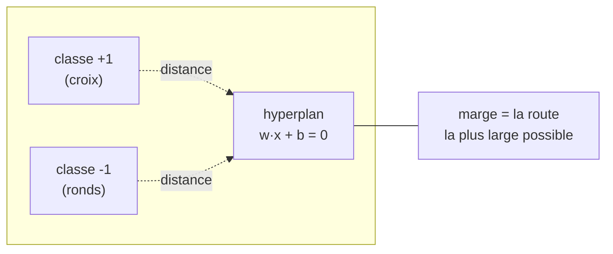
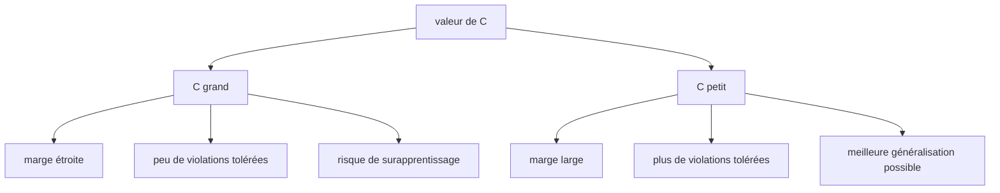
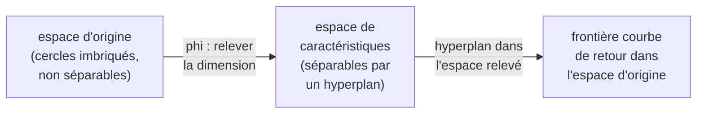
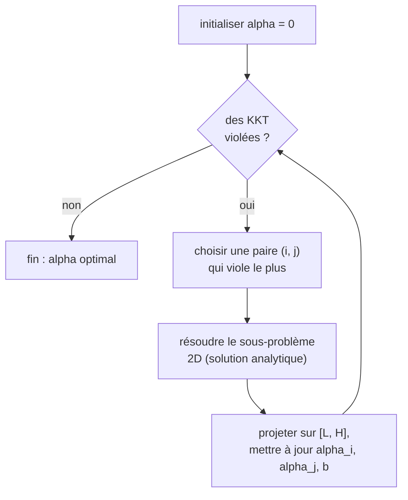

[← Sommaire](../README.md#table-des-matières)

# 12. Classification par machines à vecteurs de support

### Hyperplans séparateurs et marge

Imaginez une feuille de papier sur laquelle vous avez dessiné deux groupes de points : des ronds bleus en bas à gauche, des croix rouges en haut à droite. Votre tâche : tracer une ligne droite qui sépare parfaitement les bleus des rouges. Vous voyez tout de suite qu'il existe une *infinité* de droites possibles. La question centrale des machines à vecteurs de support (support vector machines, abrégées SVM) est : **parmi toutes ces droites, laquelle est la meilleure ?** La réponse, géniale par sa simplicité, est : celle qui laisse le plus de place vide de part et d'autre, comme une route la plus large possible entre les deux camps.

#### Le cadre : données étiquetées et séparation linéaire

On dispose de $`n`$ exemples d'apprentissage. Chaque exemple $`i`$ est un couple $`(\mathbf{x}_i, y_i)`$ où :

- $`\mathbf{x}_i \in \mathbb{R}^d`$ est le **vecteur de caractéristiques** (feature vector) : les mesures qui décrivent l'objet (taille, poids, intensité de pixels...) ;
- $`y_i \in \{-1, +1\}`$ est l'**étiquette** (label) : la classe à laquelle appartient l'objet, codée non pas par $`0/1`$ mais par $`-1`$ et $`+1`$. Ce choix de codage n'est pas un détail ; il rend les formules élégantes, comme on le verra.

> **Le symbole $`\mathbf{x}_i`$.** Ce symbole représente un point de données, le $`i`$-ème de notre collection. Le gras indique que ce n'est pas un seul nombre mais une *liste* de nombres (un vecteur) : par exemple les coordonnées $`(\text{largeur}, \text{hauteur})`$ d'une fleur. Le petit $`i`$ en bas, c'est comme le numéro du dossard d'un coureur : il dit *de quel* exemple on parle. Si on a 100 fleurs, $`i`$ va de 1 à 100.

> **Le symbole $`y_i`$.** Ce symbole représente la "bonne réponse" pour l'exemple numéro $`i`$: à quelle équipe il appartient. On choisit de noter les deux équipes $`+1`$ et $`-1`$ (l'équipe des plus et l'équipe des moins), comme deux pôles d'un aimant. Pourquoi pas $`0`$ et $`1`$ ? Parce qu'avec $`+1`$/$`-1`$, multiplier la prédiction par $`y_i`$ donnera un nombre positif quand on a *bon* et négatif quand on a *faux*: très pratique.

Un **hyperplan** dans $`\mathbb{R}^d`$ est l'ensemble des points $`\mathbf{x}`$ vérifiant

```math
\mathbf{w}^\top \mathbf{x} + b = 0,
```

où $`\mathbf{w} \in \mathbb{R}^d`$ est le **vecteur normal** (orthogonal au plan) et $`b \in \mathbb{R}`$ le **biais** (ou terme constant, *intercept*). En dimension 2, un hyperplan est une droite ; en dimension 3, un plan ; au-delà, on garde le mot "hyperplan" faute de pouvoir le dessiner.

> **Le symbole $`\mathbf{w}`$.** Ce symbole représente la *direction* dans laquelle on coupe l'espace pour séparer les deux camps. Imaginez une flèche plantée perpendiculairement à la ligne de séparation, comme le mât d'un filet de tennis planté à la verticale du filet : la flèche $`\mathbf{w}`$ pointe d'un côté vers l'autre. Sa direction dit "dans quel sens penche la frontière", et on verra que sa longueur contrôle la largeur de la route.

> **Le symbole $`b`$.** Ce symbole représente le *décalage* de la frontière par rapport au centre du repère (l'origine). Sans lui, la ligne de séparation serait obligée de passer par le point $`(0,0)`$. Le biais $`b`$ la fait coulisser : c'est le bouton qui translate la frontière pour la placer au bon endroit, comme on glisse une règle sur une feuille sans changer son inclinaison.

> **Le symbole $`\mathbf{w}^\top \mathbf{x}`$.** C'est le produit scalaire (vu au chapitre 3) entre la direction $`\mathbf{w}`$ et le point $`\mathbf{x}`$. Concrètement, il mesure "à quelle hauteur" se projette le point $`\mathbf{x}`$ le long de la flèche $`\mathbf{w}`$: un grand nombre positif = loin d'un côté, un grand nombre négatif = loin de l'autre côté, zéro = pile sur la frontière.

La **fonction de decision** (decision function) associee est

```math
f(\mathbf{x}) = \mathrm{sign}\!\left(\mathbf{w}^\top \mathbf{x} + b\right),
```

qui renvoie $`+1`$ ou $`-1`$ selon le côté de l'hyperplan où tombe $`\mathbf{x}`$. La quantité $`\mathbf{w}^\top \mathbf{x} + b`$ avant le signe s'appelle le **score**: son amplitude indique la confiance.

#### La marge géométrique

Traçons l'hyperplan séparateur, puis deux hyperplans parallèles qui touchent les points les plus proches de chaque classe. L'espace entre ces deux bords, vide de tout point, est la **marge** (margin). La SVM cherche l'hyperplan de **marge maximale**.



> **La marge.** La marge, c'est la largeur de la "zone tampon" autour de la frontière où l'on n'autorise aucun point. Pensez à deux pays séparés par une zone neutre : plus cette bande neutre est large, moins un petit déplacement de frontière risque de provoquer un incident (une erreur de classement). Maximiser la marge, c'est tracer la frontière la plus prudente, celle qui se trompera le moins sur des données nouvelles.

Calculons la distance d'un point $`\mathbf{x}_0`$ à l'hyperplan $`\mathbf{w}^\top \mathbf{x} + b = 0`$. La distance euclidienne signée vaut

```math
\mathrm{dist}(\mathbf{x}_0) = \frac{\mathbf{w}^\top \mathbf{x}_0 + b}{\lVert \mathbf{w} \rVert}.
```

> **Le symbole $`\lVert \mathbf{w} \rVert`$.** Ce symbole (vu au chapitre 3) représente la *longueur* de la flèche $`\mathbf{w}`$, sa norme euclidienne. Ici il joue le rôle d'une unité de mesure : diviser par $`\lVert \mathbf{w} \rVert`$ transforme un "score" sans unité en une vraie distance en centimètres sur la feuille. C'est comme convertir des pas en mètres en divisant par le nombre de pas par mètre.

**Démonstration de la formule de distance.** Soit $`\mathbf{x}_p`$ la projection orthogonale de $`\mathbf{x}_0`$ sur l'hyperplan. Le vecteur $`\mathbf{x}_0 - \mathbf{x}_p`$ est parallèle à $`\mathbf{w}`$ (la normale), donc $`\mathbf{x}_0 - \mathbf{x}_p = t\,\dfrac{\mathbf{w}}{\lVert \mathbf{w}\rVert}`$ pour un scalaire signé $`t`$ qui est la distance cherchée. Comme $`\mathbf{x}_p`$ est sur l'hyperplan, $`\mathbf{w}^\top \mathbf{x}_p + b = 0`$. Alors

```math
\mathbf{w}^\top \mathbf{x}_0 + b = \mathbf{w}^\top \!\left(\mathbf{x}_p + t\,\tfrac{\mathbf{w}}{\lVert\mathbf{w}\rVert}\right) + b = \underbrace{(\mathbf{w}^\top \mathbf{x}_p + b)}_{=\,0} + t\,\frac{\mathbf{w}^\top\mathbf{w}}{\lVert\mathbf{w}\rVert} = t\,\lVert \mathbf{w}\rVert,
```

où l'on a utilisé $`\mathbf{w}^\top\mathbf{w} = \lVert\mathbf{w}\rVert^2`$. D'où $`t = \dfrac{\mathbf{w}^\top \mathbf{x}_0 + b}{\lVert\mathbf{w}\rVert}`$. $`\blacksquare`$

La distance est *signée*: positive d'un côté, négative de l'autre. Pour un point bien classé, le signe du score $`\mathbf{w}^\top \mathbf{x}_i + b`$ coïncide avec celui de $`y_i`$, donc le produit $`y_i(\mathbf{w}^\top \mathbf{x}_i + b)`$ est positif. On définit la **marge géométrique** de l'exemple $`i`$ comme la distance *toujours positive si le point est bien classé*:

```math
\gamma_i = \frac{y_i\,(\mathbf{w}^\top \mathbf{x}_i + b)}{\lVert \mathbf{w}\rVert}.
```

> **Le symbole $`\gamma_i`$.** La lettre grecque "gamma" représente ici la marge d'un point : sa distance à la frontière, comptée positivement s'il est du bon côté. C'est la largeur du couloir entre ce point précis et la ligne de séparation. La marge de *tout le jeu de données* sera la plus petite de ces distances, $`\gamma = \min_i \gamma_i`$: le maillon faible, le point le plus proche du bord.

#### Invariance d'échelle et normalisation canonique

Remarque cruciale : l'hyperplan $`\mathbf{w}^\top\mathbf{x}+b=0`$ ne change pas si on multiplie $`(\mathbf{w}, b)`$ par une constante positive $`c`$: $`(c\mathbf{w})^\top\mathbf{x} + cb = 0`$ décrit le *même* plan. La paire $`(\mathbf{w}, b)`$ a donc un degré de liberté superflu. On le fixe par la **normalisation canonique**: on impose que le point le plus proche ait un score d'amplitude exactement 1,

```math
\min_{i} \; y_i\,(\mathbf{w}^\top \mathbf{x}_i + b) = 1.
```

Sous cette convention, les deux hyperplans qui bordent la marge sont $`\mathbf{w}^\top\mathbf{x}+b = +1`$ et $`\mathbf{w}^\top\mathbf{x}+b = -1`$, et la **largeur totale de la marge** devient

```math
\text{marge} = \frac{2}{\lVert \mathbf{w}\rVert}.
```

En effet, prenons un point $`\mathbf{x}_+`$ sur le bord positif ($`\mathbf{w}^\top\mathbf{x}_+ + b = 1`$) et $`\mathbf{x}_-`$ sur le bord négatif ($`\mathbf{w}^\top\mathbf{x}_- + b = -1`$). En soustrayant : $`\mathbf{w}^\top(\mathbf{x}_+ - \mathbf{x}_-) = 2`$. La distance entre les deux bords est la projection de $`\mathbf{x}_+ - \mathbf{x}_-`$ sur la direction unitaire $`\mathbf{w}/\lVert\mathbf{w}\rVert`$, soit $`\dfrac{\mathbf{w}^\top(\mathbf{x}_+-\mathbf{x}_-)}{\lVert\mathbf{w}\rVert} = \dfrac{2}{\lVert\mathbf{w}\rVert}`$.

**Conséquence fondamentale.** Maximiser la marge $`\dfrac{2}{\lVert\mathbf{w}\rVert}`$ revient à minimiser $`\lVert\mathbf{w}\rVert`$, donc à minimiser $`\tfrac{1}{2}\lVert\mathbf{w}\rVert^2`$ (le carré et le facteur $`1/2`$ sont là pour rendre la fonction lisse et l'optimisation agréable). Voici le pont entre géométrie et optimisation, que nous formaliserons dans la section suivante.

#### Exemple chiffré minuscule

Prenons en dimension $`d=1`$ (sur une droite) deux points : $`x_1 = 1`$ avec $`y_1 = +1`$, et $`x_2 = -1`$ avec $`y_2 = -1`$. Cherchons l'hyperplan (ici un simple point-frontière) $`w x + b = 0`$ de marge maximale. Par symétrie, la frontière est en $`x=0`$, donc $`b=0`$. La normalisation canonique impose $`y_i(w x_i + b) = 1`$ pour les deux points : $`1\cdot(w\cdot 1) = w = 1`$. On obtient $`w = 1`$, $`b = 0`$, et la marge vaut $`2/\lVert w\rVert = 2/1 = 2`$, ce qui correspond bien à la distance entre $`x_2=-1`$ et $`x_1=+1`$. Les deux points sont à distance $`1`$ de la frontière : ce sont les futurs **vecteurs de support**.

```python
import numpy as np

def marge_geometrique(w, b, X, y):
    scores = X @ w + b
    distances = y * scores / np.linalg.norm(w)
    return distances.min()

X = np.array([[1.0], [-1.0]])
y = np.array([1, -1])
w = np.array([1.0]); b = 0.0
print("marge du jeu :", marge_geometrique(w, b, X, y))
print("largeur 2/||w|| :", 2 / np.linalg.norm(w))
```

> **Application ML.** Les SVM linéaires restent une brique vivante : on les retrouve comme *tête de classification* (probing) posée sur les représentations figées d'un grand modèle (embeddings de transformeurs, de modèles vision-langage). On entraîne alors une SVM linéaire sur des vecteurs de très haute dimension produits par un réseau pré-entraîné ; la maximisation de marge fournit un classifieur robuste et interprétable là où un réglage fin complet serait coûteux. La géométrie de la marge, elle, n'a pas pris une ride.

### SVM primal : marge dure et marge souple

Nous avons traduit "tracer la route la plus large" en "minimiser $`\tfrac12\lVert\mathbf{w}\rVert^2`$". Il reste à écrire les contraintes qui garantissent que chaque point est du bon côté et hors de la route. C'est le **problème primal** (primal problem).

#### Marge dure (hard margin)

Si les données sont **linéairement séparables** (on peut les séparer sans erreur), on exige que chaque point soit du bon côté *et* au-delà du bord de la marge :

```math
\begin{aligned}
\min_{\mathbf{w},\,b}\quad & \tfrac{1}{2}\lVert \mathbf{w}\rVert^2 \\
\text{sous contraintes}\quad & y_i\,(\mathbf{w}^\top \mathbf{x}_i + b) \ge 1, \qquad i = 1,\dots,n.
\end{aligned}
```

Chaque contrainte $`y_i(\mathbf{w}^\top\mathbf{x}_i + b)\ge 1`$ dit : "le point $`i`$, multiplié par son étiquette, doit avoir un score d'au moins 1", c'est-à-dire être du bon côté avec une distance d'au moins $`1/\lVert\mathbf{w}\rVert`$. C'est un **programme quadratique** (quadratic program, QP) : objectif quadratique convexe, contraintes linéaires. La convexité (vue au chapitre 7) garantit l'existence d'un *unique* minimiseur en $`\mathbf{w}`$ (l'objectif $`\tfrac12\lVert\mathbf{w}\rVert^2`$ est strictement convexe en $`\mathbf{w}`$) : pas de piège de minimum local.

> **Définition (SVM à marge dure).** Étant donné un échantillon linéairement séparable $`\{(\mathbf{x}_i,y_i)\}_{i=1}^n`$, l'hyperplan à marge maximale est l'unique solution $`(\mathbf{w}^\star, b^\star)`$ du programme quadratique ci-dessus. Les points pour lesquels la contrainte est *active* (égalité $`y_i(\mathbf{w}^{\star\top}\mathbf{x}_i+b^\star)=1`$) sont les **vecteurs de support** (support vectors) : ils touchent le bord de la route et la déterminent entièrement.

> **Piège.** La marge dure exige une séparation *parfaite*. Un seul point aberrant (outlier) du mauvais côté rend le problème **infaisable** (aucun $`\mathbf{w}, b`$ ne satisfait toutes les contraintes), ou alors déforme dramatiquement la frontière pour englober l'intrus. En pratique, les données réelles sont bruitées : on a presque toujours besoin de la version souple ci-dessous.

#### Marge souple (soft margin) : variables d'écart

Pour tolérer quelques violations, on introduit pour chaque exemple une **variable d'écart** (slack variable) $`\xi_i \ge 0`$ qui mesure de combien le point $`i`$ enfreint sa contrainte :

```math
y_i\,(\mathbf{w}^\top \mathbf{x}_i + b) \ge 1 - \xi_i, \qquad \xi_i \ge 0.
```

> **Le symbole $`\xi_i`$.** La lettre grecque "xi" représente le *montant de la triche* autorisée au point $`i`$. Si $`\xi_i = 0`$, le point respecte la règle (bon côté, hors de la route). Si $`0 < \xi_i \le 1`$, il a empiété sur la route mais reste du bon côté. Si $`\xi_i > 1`$, il est carrément passé de l'autre côté : c'est une erreur de classement. Imaginez un carton de pénalité dont la taille mesure la gravité de la faute.

On veut peu de triche : on *pénalise* la somme des écarts dans l'objectif. Le problème primal à marge souple devient

```math
\begin{aligned}
\min_{\mathbf{w},\,b,\,\boldsymbol{\xi}}\quad & \tfrac{1}{2}\lVert \mathbf{w}\rVert^2 + C\sum_{i=1}^{n}\xi_i \\
\text{s.c.}\quad & y_i\,(\mathbf{w}^\top \mathbf{x}_i + b) \ge 1 - \xi_i, \\
& \xi_i \ge 0, \qquad i = 1,\dots,n.
\end{aligned}
```

> **Le symbole $`\sum_{i=1}^n \xi_i`$.** Le grand sigma additionne ici toutes les pénalités, du premier au dernier exemple : c'est le "total des cartons" distribués. On cherche à le garder petit.

> **Le symbole $`C`$.** Ce symbole représente le *prix de la triche*: un curseur qui dit à quel point on déteste les violations de marge. Grand $`C`$ = "je refuse presque toute erreur" (marge étroite, on colle aux données, risque de surapprentissage). Petit $`C`$ = "je tolère des erreurs pour garder une route large" (marge large, modèle plus simple, plus robuste). C'est le bouton de réglage le plus important d'une SVM, l'arbitre entre fidélité aux données et simplicité.



#### Formulation équivalente sans contraintes : la perte charnière

À l'optimum, chaque $`\xi_i`$ prend la plus petite valeur compatible avec ses deux contraintes $`\xi_i \ge 1 - y_i(\mathbf{w}^\top\mathbf{x}_i+b)`$ et $`\xi_i \ge 0`$. Donc

```math
\xi_i^\star = \max\bigl(0,\; 1 - y_i(\mathbf{w}^\top\mathbf{x}_i + b)\bigr).
```

Cette expression a un nom : la **perte charnière** (hinge loss). En la réinjectant, le primal devient un problème d'**optimisation sans contraintes**:

```math
\min_{\mathbf{w},\,b}\quad \underbrace{\tfrac{1}{2}\lVert \mathbf{w}\rVert^2}_{\text{regularisation}} + \; C\sum_{i=1}^{n}\underbrace{\max\bigl(0,\,1 - y_i(\mathbf{w}^\top\mathbf{x}_i + b)\bigr)}_{\text{perte charniere}}.
```

> **La perte charnière (hinge loss).** Ce symbole $`\max(0,\,1 - y\,s)`$ (où $`s`$ est le score) représente une *amende qui ne se déclenche qu'en cas de faute*. Tant que le point est bien classé et au-delà de la marge ($`y\,s \ge 1`$), l'amende est nulle, comme une charnière de porte qui reste à plat. Dès que le point empiète ($`y\,s < 1`$), l'amende grandit linéairement, comme la porte qui se soulève. Le nom "charnière" vient justement de ce coude : plat puis pente.

Comparons la perte charnière aux pertes voisines pour la classification binaire :

| Perte | Formule (score $`s`$, étiquette $`y`$) | Zéro atteint ? | Lisse ? | Usage |
|---|---|---|---|---|
| 0-1 (idéale) | $`\mathbf{1}[\,y\,s < 0\,]`$ | oui | non (discontinue) | objectif vrai, non optimisable |
| Charnière (hinge) | $`\max(0, 1 - y\,s)`$ | oui (si $`y\,s\ge1`$) | non (coude en 1) | SVM |
| Charnière quadratique | $`\max(0, 1 - y\,s)^2`$ | oui | oui | SVM L2, sensible aux outliers |
| Logistique | $`\log(1 + e^{-y\,s})`$ | jamais ($`>0`$) | oui | régression logistique |

```python
import numpy as np
import matplotlib.pyplot as plt

ys = np.linspace(-1.5, 3, 300)  # produit y*s
hinge = np.maximum(0, 1 - ys)
logistic = np.log1p(np.exp(-ys))
zero_one = (ys < 0).astype(float)

plt.plot(ys, zero_one, label="0-1 (ideale)")
plt.plot(ys, hinge, label="charniere (hinge)")
plt.plot(ys, logistic, label="logistique")
plt.axvline(1, ls=":", c="gray"); plt.xlabel("y · score"); plt.ylabel("perte")
plt.legend(); plt.title("Pertes de classification")
```

Cette écriture révèle la SVM sous un jour moderne : c'est une **minimisation du risque empirique régularisé**, exactement la forme "perte + régularisation" omniprésente en apprentissage. La régularisation $`\tfrac12\lVert\mathbf{w}\rVert^2`$ correspond à une pénalité $`\ell_2`$ (la même que celle de la régression *ridge*), de poids relatif $`1/C`$ par rapport à la perte.

> **Application ML.** Sous cette forme sans contraintes, on entraîne une SVM linéaire par descente de (sous-)gradient, donc avec l'outillage du deep learning : autodifférentiation (JAX, PyTorch) et optimiseurs adaptatifs (Adam, AdamW). La perte charnière reste différentiable presque partout (sauf au coude $`y\,s=1`$, de mesure nulle), et un sous-gradient y suffit. C'est ainsi qu'on intègre une "tête SVM" dans un réseau de neurones, entraînée de bout en bout par rétropropagation.

#### Exemple chiffré déroulé (marge souple, calcul à la main)

Reprenons $`x_1=+1\,(y_1=+1)`$, $`x_2=-1\,(y_2=-1)`$ en dimension 1, et ajoutons un intrus $`x_3 = -0.2`$ étiqueté $`y_3 = +1`$ (un "plus" tombé du côté des "moins"). Avec $`w=1, b=0`$ (la frontière précédente), les pertes charnière valent :

- point 1 : $`\max(0, 1 - 1\cdot(1\cdot 1)) = \max(0,0) = 0`$;
- point 2 : $`\max(0, 1 - (-1)\cdot(1\cdot(-1))) = \max(0, 1 - 1) = 0`$;
- point 3 : $`\max(0, 1 - 1\cdot(1\cdot(-0.2))) = \max(0, 1 + 0.2) = 1.2`$.

Objectif $`= \tfrac12 (1)^2 + C\cdot(0 + 0 + 1.2) = 0.5 + 1.2\,C`$. Si $`C`$ est petit (disons $`0.1`$), on préfère garder $`w`$ modéré et "payer" $`0.12`$ pour l'intrus plutôt que de tordre la frontière. Si $`C`$ est énorme, le solveur déplacera la frontière pour réduire cette perte, au prix d'une marge plus étroite. Ce petit calcul illustre concrètement l'arbitrage piloté par $`C`$.

### SVM dual et vecteurs de support

Le primal se résout directement, mais sa version **duale** (dual problem), obtenue par la théorie de Lagrange (vue au chapitre 7), révèle la structure profonde de la SVM : les vecteurs de support, et surtout la possibilité des noyaux. C'est la clef de voûte du chapitre.

#### Construction du lagrangien

On part du primal à marge souple. On introduit un multiplicateur de Lagrange $`\alpha_i \ge 0`$ par contrainte de marge, et $`\mu_i \ge 0`$ par contrainte $`\xi_i \ge 0`$. Le lagrangien est

```math
\mathcal{L}(\mathbf{w}, b, \boldsymbol{\xi}, \boldsymbol{\alpha}, \boldsymbol{\mu}) = \tfrac{1}{2}\lVert\mathbf{w}\rVert^2 + C\sum_i \xi_i - \sum_i \alpha_i\bigl[y_i(\mathbf{w}^\top\mathbf{x}_i + b) - 1 + \xi_i\bigr] - \sum_i \mu_i\,\xi_i.
```

> **Le symbole $`\alpha_i`$ (multiplicateur de Lagrange).** À chaque contrainte "le point $`i`$ doit rester du bon côté" on attache un nombre $`\alpha_i \ge 0`$: le *prix de l'effort* que coûte cette contrainte. Pensez à la tension dans une corde qui retient un point : si le point ne pousse pas contre la barrière, la corde est molle ($`\alpha_i = 0`$) ; s'il appuie de tout son poids contre le bord de la marge, la corde est tendue ($`\alpha_i > 0`$). Ces $`\alpha_i`$ vont devenir les *vraies inconnues* du problème, et la magie est que la plupart seront nuls.

#### Conditions de stationnarité

À l'optimum, le gradient du lagrangien par rapport aux variables primales s'annule.

Par rapport à $`\mathbf{w}`$:

```math
\nabla_{\mathbf{w}}\mathcal{L} = \mathbf{w} - \sum_i \alpha_i y_i \mathbf{x}_i = \mathbf{0} \quad\Longrightarrow\quad \boxed{\;\mathbf{w} = \sum_i \alpha_i y_i \mathbf{x}_i\;}.
```

> **Le symbole $`\nabla_{\mathbf{w}}`$.** Le "nabla" est le vecteur des dérivées partielles par rapport à chaque composante de $`\mathbf{w}`$: il pointe vers la plus forte montée de $`\mathcal{L}`$. L'annuler, c'est chercher le fond de la vallée, l'endroit plat où plus aucune direction ne fait descendre. Le petit indice $`\mathbf{w}`$ précise qu'on dérive *seulement* par rapport à $`\mathbf{w}`$, en traitant le reste comme constant.

Cette relation est capitale : **le vecteur normal optimal est une combinaison linéaire des points d'apprentissage**, pondérée par $`\alpha_i y_i`$. Les points avec $`\alpha_i = 0`$ ne contribuent pas : seuls les vecteurs de support comptent.

Par rapport à $`b`$:

```math
\frac{\partial \mathcal{L}}{\partial b} = -\sum_i \alpha_i y_i = 0 \quad\Longrightarrow\quad \sum_i \alpha_i y_i = 0.
```

Par rapport à $`\xi_i`$:

```math
\frac{\partial \mathcal{L}}{\partial \xi_i} = C - \alpha_i - \mu_i = 0 \quad\Longrightarrow\quad \alpha_i = C - \mu_i.
```

Comme $`\mu_i \ge 0`$, cette dernière égalité impose la **contrainte de boîte** (box constraint) $`0 \le \alpha_i \le C`$: voilà comment le paramètre $`C`$ du primal réapparaît comme *plafond* sur les multiplicateurs.

#### Le problème dual

En réinjectant $`\mathbf{w} = \sum_i\alpha_i y_i\mathbf{x}_i`$ et les relations ci-dessus dans $`\mathcal{L}`$, tous les termes en $`b`$, $`\xi`$ et $`\mu`$ disparaissent. Détaillons le terme quadratique :

```math
\tfrac12\lVert\mathbf{w}\rVert^2 = \tfrac12\Bigl(\sum_i\alpha_iy_i\mathbf{x}_i\Bigr)^{\!\top}\Bigl(\sum_j\alpha_jy_j\mathbf{x}_j\Bigr) = \tfrac12\sum_i\sum_j\alpha_i\alpha_j y_i y_j\,\mathbf{x}_i^\top\mathbf{x}_j,
```

et le terme linéaire $`\sum_i\alpha_i[\,y_i(\mathbf{w}^\top\mathbf{x}_i+b)-1\,]`$ se simplifie en $`\sum_{i,j}\alpha_i\alpha_j y_iy_j\mathbf{x}_i^\top\mathbf{x}_j - \sum_i\alpha_i`$ (le terme en $`b`$ s'annule grâce à $`\sum_i\alpha_iy_i=0`$). En combinant, on obtient le **dual**:

```math
\begin{aligned}
\max_{\boldsymbol{\alpha}}\quad & W(\boldsymbol\alpha) = \sum_{i=1}^n \alpha_i - \tfrac{1}{2}\sum_{i=1}^n\sum_{j=1}^n \alpha_i \alpha_j\, y_i y_j\, \mathbf{x}_i^\top \mathbf{x}_j \\
\text{s.c.}\quad & 0 \le \alpha_i \le C, \qquad i = 1,\dots,n, \\
& \sum_{i=1}^n \alpha_i y_i = 0.
\end{aligned}
```

> **Le symbole $`\sum_{i}\sum_{j}`$ (double somme).** Deux boucles imbriquées : pour *chaque* paire de points $`(i,j)`$, on calcule un terme et on additionne tout. C'est comme remplir un tableau à double entrée (lignes $`i`$, colonnes $`j`$) puis sommer toutes les cases. Ici chaque case mesure l'interaction entre deux points via leur produit scalaire $`\mathbf{x}_i^\top\mathbf{x}_j`$.

> **Définition (problème dual de la SVM).** Le dual est un programme quadratique *concave* en $`\boldsymbol\alpha`$ (on maximise), de dimension $`n`$ (le nombre d'exemples), dont les seules données sont les étiquettes $`y_i`$ et les **produits scalaires** $`\mathbf{x}_i^\top\mathbf{x}_j`$ entre exemples. C'est cette dernière observation, l'absence des $`\mathbf{x}_i`$ autrement que par leurs produits scalaires, qui ouvrira la porte aux noyaux.

#### Conditions KKT et interprétation des vecteurs de support

La théorie de Karush-Kuhn-Tucker (KKT) fournit les conditions de **complémentarité** liant primal et dual à l'optimum :

```math
\alpha_i\bigl[y_i(\mathbf{w}^\top\mathbf{x}_i+b) - 1 + \xi_i\bigr] = 0, \qquad \mu_i\,\xi_i = 0.
```

En posant $`s_i = \mathbf{w}^\top\mathbf{x}_i + b`$, ces équations classent chaque point en trois catégories, lisibles d'un coup d'œil :

| Cas | Valeur de $`\alpha_i`$ | Position du point | Nom |
|---|---|---|---|
| 1 | $`\alpha_i = 0`$ | strictement au-delà de la marge ($`y_i s_i > 1`$), bien classé | non-support |
| 2 | $`0 < \alpha_i < C`$ | exactement sur le bord ($`y_i s_i = 1`$, $`\xi_i=0`$) | vecteur de support *libre* |
| 3 | $`\alpha_i = C`$ | sur la marge ou au-delà ($`\xi_i > 0`$), éventuellement mal classé | vecteur de support *borné* |

> **Remarque (sparsité).** C'est le cœur de l'élégance SVM : à l'optimum, la *grande majorité* des $`\alpha_i`$ valent zéro. La solution $`\mathbf{w} = \sum_i\alpha_iy_i\mathbf{x}_i`$ ne dépend donc que d'une poignée de points, les vecteurs de support. On peut jeter tous les autres sans changer la frontière. C'est une représentation **parcimonieuse** (sparse) : mémoire et prédiction économes.

**Calcul du biais $`b`$.** Pour tout vecteur de support libre (cas 2, $`0<\alpha_i<C`$), on a $`y_i(\mathbf{w}^\top\mathbf{x}_i+b)=1`$, donc $`b = y_i - \mathbf{w}^\top\mathbf{x}_i`$ (en multipliant par $`y_i`$ et en utilisant $`y_i^2=1`$). En pratique on moyenne sur tous les supports libres pour la stabilité numérique :

```math
b = \frac{1}{|S|}\sum_{i\in S}\Bigl(y_i - \sum_j \alpha_j y_j\,\mathbf{x}_j^\top\mathbf{x}_i\Bigr), \quad S = \{i : 0<\alpha_i<C\}.
```

#### Dualité forte : pourquoi primal et dual coïncident

> **Théorème (dualité forte pour la SVM).** Le primal de la SVM à marge souple est convexe et ses contraintes sont affines ; la condition de Slater est trivialement satisfaite (des contraintes d'inégalité affines suffisent). Par conséquent la dualité est **forte**: la valeur optimale du primal égale celle du dual, $`p^\star = d^\star`$, et toute solution duale $`\boldsymbol\alpha^\star`$ fournit via $`\mathbf{w}^\star=\sum_i\alpha_i^\star y_i\mathbf{x}_i`$ et les conditions KKT une solution primale optimale. Résoudre l'un *est* résoudre l'autre.

Ce théorème justifie qu'on travaille indifféremment sur le primal (efficace en grande dimension $`d`$, petit $`n`$) ou sur le dual (efficace pour $`d`$ énorme voire infini via noyaux, $`n`$ modéré).

#### Prédiction via le dual

En remplaçant $`\mathbf{w}`$ par son expression, la fonction de décision s'écrit **uniquement avec des produits scalaires**:

```math
f(\mathbf{x}) = \mathrm{sign}\!\Bigl(\sum_{i=1}^n \alpha_i y_i\,\mathbf{x}_i^\top\mathbf{x} + b\Bigr) = \mathrm{sign}\!\Bigl(\sum_{i\in\text{SV}} \alpha_i y_i\,\mathbf{x}_i^\top\mathbf{x} + b\Bigr).
```

La somme ne porte en pratique que sur les vecteurs de support (SV). Cette forme, où les données n'apparaissent que par produits scalaires, est *exactement* ce qu'il faut pour la kernelisation.

```python
import numpy as np

def svm_predict_dual(alpha, y, X_train, b, X_test):
    K = X_test @ X_train.T            # produits scalaires test/train
    scores = (alpha * y) @ K.T + b
    return np.sign(scores), scores

# petit exemple : deux classes separables en 2D
X = np.array([[2.,2.],[2.,0.],[0.,0.],[0.,2.],[-1.,-1.]])
y = np.array([ 1,    1,     -1,    1,     -1 ])
# alpha fictifs (issus d'un solveur) pour illustrer la prediction
alpha = np.array([0.5, 0.0, 0.3, 0.0, 0.2])
b = -1.0
pred, sc = svm_predict_dual(alpha, y, X, b, np.array([[1.5,1.5],[-0.5,-0.5]]))
print("predictions :", pred, " scores :", np.round(sc,3))
```

### Noyaux (kernel trick)

Jusqu'ici, la frontière est une droite. Mais que faire si les classes s'enroulent l'une autour de l'autre, comme deux cercles concentriques, impossibles à séparer par une droite ? L'idée, l'une des plus belles de l'apprentissage statistique, est le **truc du noyau** (kernel trick) : *projeter* les données dans un espace de plus grande dimension où elles redeviennent linéairement séparables, sans jamais calculer cette projection explicitement.

#### L'intuition : relever la dimension

Prenons les deux cercles concentriques en 2D : classe $`-1`$ au centre, classe $`+1`$ en couronne. Aucune droite ne marche. Mais ajoutons une troisième coordonnée $`z = x_1^2 + x_2^2`$ (le carré du rayon). Les points du centre ont un petit $`z`$, ceux de la couronne un grand $`z`$: un simple *plan horizontal* $`z = \text{seuil}`$ les sépare ! On a "soulevé" les données dans la 3e dimension pour les rendre séparables.



Formellement, on choisit une application $`\varphi: \mathbb{R}^d \to \mathcal{H}`$ vers un espace $`\mathcal{H}`$ (dit **espace de caractéristiques**, feature space) de dimension possiblement énorme, et on applique la SVM linéaire aux $`\varphi(\mathbf{x}_i)`$. Le dual ne fait alors intervenir que des produits scalaires $`\varphi(\mathbf{x}_i)^\top\varphi(\mathbf{x}_j)`$.

#### Le truc : ne jamais calculer $`\varphi`$

L'observation géniale : on n'a **jamais besoin de $`\varphi`$ lui-même**, seulement de ses produits scalaires. On définit donc directement une **fonction noyau** (kernel function)

```math
k(\mathbf{x}, \mathbf{x}') = \varphi(\mathbf{x})^\top \varphi(\mathbf{x}'),
```

qui calcule ce produit scalaire *sans construire* $`\varphi(\mathbf{x})`$ ni $`\varphi(\mathbf{x}')`$.

> **La fonction noyau $`k(\mathbf{x},\mathbf{x}')`$.** Ce symbole représente une *mesure de ressemblance* entre deux objets $`\mathbf{x}`$ et $`\mathbf{x}'`$: un grand nombre si les deux se ressemblent, un petit (voire zéro) s'ils sont très différents. Le tour de force : ce nombre est *exactement* le produit scalaire des deux objets une fois relevés dans le grand espace par $`\varphi`$, mais on l'obtient par une formule directe et bon marché, sans jamais payer le coût du relevage. C'est comme connaître la distance entre deux villes sans avoir à parcourir la route.

**Exemple fondateur (noyau polynomial de degré 2 en 2D).** Posons $`\varphi(\mathbf{x}) = (x_1^2,\ \sqrt2\,x_1x_2,\ x_2^2)`$. Alors

```math
\varphi(\mathbf{x})^\top\varphi(\mathbf{x}') = x_1^2x_1'^2 + 2x_1x_2x_1'x_2' + x_2^2x_2'^2 = (x_1x_1' + x_2x_2')^2 = (\mathbf{x}^\top\mathbf{x}')^2.
```

Donc $`k(\mathbf{x},\mathbf{x}') = (\mathbf{x}^\top\mathbf{x}')^2`$ calcule un produit scalaire dans un espace à 3 dimensions *en n'effectuant qu'un produit scalaire 2D suivi d'un carré*. Ici l'espace relevé ne contient que les monômes **homogènes** de degré $`2`$, soit $`\binom{d+p-1}{p}=\binom{3}{2}=3`$ dimensions pour $`d=2`$, $`p=2`$: on retrouve bien les trois composantes de $`\varphi`$. Plus généralement, le noyau homogène $`(\mathbf{x}^\top\mathbf{x}')^p`$ vit dans un espace de dimension $`\binom{d+p-1}{p}`$, et le noyau **inhomogène** $`(\mathbf{x}^\top\mathbf{x}'+c)^p`$ (avec $`c>0`$) ajoute tous les monômes de degré inférieur, soit $`\binom{d+p}{p}`$ dimensions. Dans les deux cas, le nombre de dimensions explose avec $`p`$, mais le noyau se calcule toujours en temps $`O(d)`$. **C'est tout le miracle.**

#### Le SVM kernelisé

On remplace partout $`\mathbf{x}_i^\top\mathbf{x}_j`$ par $`k(\mathbf{x}_i,\mathbf{x}_j)`$. Le dual devient

```math
\max_{\boldsymbol\alpha}\ \sum_i\alpha_i - \tfrac12\sum_{i,j}\alpha_i\alpha_j y_iy_j\,k(\mathbf{x}_i,\mathbf{x}_j), \quad 0\le\alpha_i\le C,\ \sum_i\alpha_iy_i=0,
```

et la prédiction

```math
f(\mathbf{x}) = \mathrm{sign}\!\Bigl(\sum_{i\in\text{SV}}\alpha_i y_i\,k(\mathbf{x}_i,\mathbf{x}) + b\Bigr).
```

On n'écrit plus jamais $`\mathbf{w}`$ (il vit dans $`\mathcal{H}`$, potentiellement de dimension infinie) : tout passe par le noyau. C'est pourquoi on travaille sur le **dual** dès qu'on kernelise.

#### Noyaux usuels

| Noyau | Formule $`k(\mathbf{x},\mathbf{x}')`$ | Hyperparamètres | Espace $`\mathcal{H}`$ |
|---|---|---|---|
| Linéaire | $`\mathbf{x}^\top\mathbf{x}'`$ | aucun | $`\mathbb{R}^d`$ (identité) |
| Polynomial | $`(\gamma\,\mathbf{x}^\top\mathbf{x}' + c_0)^p`$ | degré $`p`$, $`\gamma`$, $`c_0`$ | dimension finie $`\binom{d+p}{p}`$ (si $`c_0>0`$) |
| Gaussien (RBF) | $`\exp(-\gamma\lVert\mathbf{x}-\mathbf{x}'\rVert^2)`$ | $`\gamma > 0`$ | **dimension infinie** |
| Laplacien | $`\exp(-\gamma\lVert\mathbf{x}-\mathbf{x}'\rVert)`$ | $`\gamma>0`$ | dimension infinie |
| Sigmoïde | $`\tanh(\gamma\,\mathbf{x}^\top\mathbf{x}' + c_0)`$ | $`\gamma`$, $`c_0`$ | (pas toujours valide) |

Le **noyau gaussien** (radial basis function, RBF) est le cheval de bataille. Le paramètre $`\gamma`$ règle la *portée* de la ressemblance :

> **Le symbole $`\gamma`$ (dans le RBF).** Ici $`\gamma`$ contrôle à quelle vitesse la ressemblance s'évanouit avec la distance. Grand $`\gamma`$ = "je ne ressemble qu'à mes voisins très proches" (chaque point crée une petite bosse autour de lui, frontière très sinueuse, risque de surapprentissage). Petit $`\gamma`$ = "je ressemble à beaucoup de monde" (influence large, frontière lisse). On peut aussi l'écrire $`\gamma = 1/(2\sigma^2)`$ où $`\sigma`$ est la "largeur" de la gaussienne.

**Pourquoi le RBF correspond à une dimension infinie.** En développant $`\lVert\mathbf{x}-\mathbf{x}'\rVert^2 = \lVert\mathbf{x}\rVert^2 + \lVert\mathbf{x}'\rVert^2 - 2\,\mathbf{x}^\top\mathbf{x}'`$, on obtient

```math
\exp(-\gamma\lVert\mathbf{x}-\mathbf{x}'\rVert^2) = e^{-\gamma\lVert\mathbf{x}\rVert^2}\,e^{-\gamma\lVert\mathbf{x}'\rVert^2}\,\exp(2\gamma\,\mathbf{x}^\top\mathbf{x}'),
```

et le facteur central $`\exp(2\gamma\,\mathbf{x}^\top\mathbf{x}')=\sum_{k\ge0}\frac{(2\gamma)^k}{k!}(\mathbf{x}^\top\mathbf{x}')^k`$ est une somme *infinie* de noyaux polynomiaux de tous degrés : l'espace $`\mathcal{H}`$ implicite contient des monômes de degré arbitrairement grand, donc est de dimension infinie. Le truc du noyau permet de travailler dans cet espace infini en temps fini.

#### Quand une fonction est-elle un noyau valide ? Théorème de Mercer

Toute fonction symétrique $`k`$ n'est pas un produit scalaire déguisé. La condition est donnée par un théorème central.

> **Définition (noyau défini positif).** Une fonction symétrique $`k:\mathbb{R}^d\times\mathbb{R}^d\to\mathbb{R}`$ est un **noyau (semi-)défini positif** si, pour tout ensemble fini de points $`\mathbf{x}_1,\dots,\mathbf{x}_n`$, la **matrice de Gram** $`K`$ définie par $`K_{ij}=k(\mathbf{x}_i,\mathbf{x}_j)`$ est symétrique semi-définie positive (toutes ses valeurs propres $`\ge 0`$).

> **Théorème de Mercer.** Une fonction $`k`$ continue, symétrique et définie positive admet une *application de caractéristiques* $`\varphi`$ telle que $`k(\mathbf{x},\mathbf{x}')=\langle\varphi(\mathbf{x}),\varphi(\mathbf{x}')\rangle`$ dans un certain espace de Hilbert $`\mathcal{H}`$. Autrement dit, *être défini positif équivaut à être un vrai produit scalaire dans un espace relevé*. C'est ce qui garantit que le dual SVM reste un programme quadratique **concave** (la matrice de terme général $`y_iy_jK_{ij}`$ est semi-définie positive), donc bien posé.

**Conséquence pratique.** Il suffit de vérifier la définie-positivité. Et l'on dispose de règles de composition qui *fabriquent* de nouveaux noyaux à partir de noyaux connus : si $`k_1, k_2`$ sont des noyaux, alors $`k_1+k_2`$, $`\lambda k_1`$ ($`\lambda\ge0`$), $`k_1 k_2`$, $`f(\mathbf{x})k_1(\mathbf{x},\mathbf{x}')f(\mathbf{x}')`$ et $`\exp(k_1)`$ le sont aussi. On compose ainsi des noyaux sur mesure (texte, graphes, séquences ADN...).

> **Piège.** Le noyau sigmoïde $`\tanh(\gamma\mathbf{x}^\top\mathbf{x}'+c_0)`$ n'est défini positif que pour *certaines* valeurs de $`\gamma, c_0`$. Hors de cette plage, la matrice de Gram a des valeurs propres négatives, le dual n'est plus concave, et le solveur peut diverger ou renvoyer une solution sans garantie. À manier avec prudence.

```python
import numpy as np

def kernel_rbf(X, Z, gamma):
    # ||x - z||^2 = ||x||^2 + ||z||^2 - 2 x·z  (astuce sans double boucle)
    XX = np.sum(X**2, axis=1)[:, None]
    ZZ = np.sum(Z**2, axis=1)[None, :]
    sq = XX + ZZ - 2 * X @ Z.T
    return np.exp(-gamma * np.maximum(sq, 0))

def kernel_poly(X, Z, degree=2, gamma=1.0, coef0=1.0):
    return (gamma * (X @ Z.T) + coef0) ** degree

# verification : la matrice de Gram RBF est symetrique semi-definie positive
rng = np.random.default_rng(0)
X = rng.normal(size=(6, 3))
K = kernel_rbf(X, X, gamma=0.5)
vals = np.linalg.eigvalsh(K)
print("symetrique :", np.allclose(K, K.T))
print("valeurs propres >= 0 :", np.all(vals > -1e-10), np.round(vals, 4))
```

> **Application ML.** À très grande échelle, matérialiser la matrice de Gram $`n\times n`$ devient impossible. On l'approxime : **features aléatoires de Fourier** (random Fourier features) qui construisent un $`\varphi`$ explicite de dimension modérée dont le produit scalaire approche le RBF, ou approximation de **Nyström** (sous-échantillonnage de colonnes, parente des méthodes randomisées pour la SVD). Ces approximations transforment une SVM à noyau en SVM linéaire dans un espace approché, entraînable par descente de gradient sur des millions d'exemples. Par ailleurs, les *kernel machines* connaissent un regain d'intérêt théorique via le **noyau tangent neuronal** (neural tangent kernel, NTK), qui relie l'entraînement des réseaux larges à une régression à noyau.

### Résolution numérique

Le dual est un programme quadratique à $`n`$ variables avec une contrainte d'égalité et des bornes. Comment le résoudre efficacement, surtout quand $`n`$ est grand ? Plusieurs stratégies coexistent, du solveur générique à l'algorithme dédié SMO.

#### Forme matricielle du QP dual

Posons la matrice $`Q\in\mathbb{R}^{n\times n}`$ de terme général $`Q_{ij}=y_iy_j\,k(\mathbf{x}_i,\mathbf{x}_j)`$, et $`\mathbf{1}`$ le vecteur de uns. Le dual s'écrit compactement

```math
\min_{\boldsymbol\alpha}\ \tfrac12\boldsymbol\alpha^\top Q\boldsymbol\alpha - \mathbf{1}^\top\boldsymbol\alpha \quad\text{s.c.}\quad \mathbf{y}^\top\boldsymbol\alpha = 0,\ \ \mathbf{0}\le\boldsymbol\alpha\le C\mathbf{1}.
```

(On a changé le signe pour passer du $`\max`$ au $`\min`$.) $`Q`$ étant semi-définie positive par Mercer, c'est un QP **convexe**: tout solveur QP générique (par points intérieurs) le résout en $`O(n^3)`$ environ. Acceptable pour quelques milliers d'exemples, prohibitif au-delà : $`Q`$ a $`n^2`$ entrées.

#### SMO : optimisation minimale séquentielle

L'algorithme **SMO** (sequential minimal optimization) contourne le stockage de $`Q`$ en optimisant *deux* multiplicateurs à la fois, le minimum imposé par la contrainte $`\sum_i\alpha_iy_i=0`$ (on ne peut pas bouger un seul $`\alpha`$ sans violer l'égalité). C'est l'algorithme historique de la librairie LIBSVM, encore au cœur de scikit-learn.

**Principe.** À chaque itération : choisir une paire $`(\alpha_i,\alpha_j)`$ violant le plus les conditions KKT, fixer tous les autres, et résoudre le sous-problème à deux variables, qui a une **solution analytique** (pas de solveur interne). On itère jusqu'à satisfaction des KKT à une tolérance près.

Pour la paire $`(i,j)`$, la contrainte d'égalité impose $`\alpha_iy_i+\alpha_jy_j=\text{const}`$, donc $`\alpha_j`$ se déduit de $`\alpha_i`$: le sous-problème est *unidimensionnel*. Posons l'erreur sur l'exemple $`i`$ par $`E_i=f(\mathbf{x}_i)-y_i`$ et la courbure

```math
\eta = k(\mathbf{x}_i,\mathbf{x}_i) + k(\mathbf{x}_j,\mathbf{x}_j) - 2k(\mathbf{x}_i,\mathbf{x}_j) \;\ge\; 0.
```

La mise à jour non bornée de $`\alpha_j`$ est alors

```math
\alpha_j^{\text{new}} = \alpha_j^{\text{old}} + \frac{y_j\,(E_i - E_j)}{\eta}.
```

On *projette* ensuite $`\alpha_j^{\text{new}}`$ sur l'intervalle admissible $`[L,H]`$ (bornes dépendant de $`C`$ et des signes $`y_i,y_j`$), puis on met à jour $`\alpha_i`$ par la contrainte d'égalité et on recalcule $`b`$.

> **Le symbole $`\eta`$.** Cette lettre grecque "eta" représente ici la *courbure* du sous-problème à deux variables le long de la direction autorisée (c'est une dérivée seconde). On a $`\eta = \lVert\varphi(\mathbf{x}_i)-\varphi(\mathbf{x}_j)\rVert^2 \ge 0`$: la "vallée" est d'autant plus creusée que $`\eta`$ est grand, et le pas vers le minimum, $`\propto 1/\eta`$, est alors plus court et plus sûr. Si $`\eta=0`$ (fond plat, points identiques dans l'espace relevé), il faut un traitement spécial. C'est l'analogue 1D du dénominateur dans une étape de Newton.

> **Attention au signe.** Selon les références, on rencontre la convention opposée $`\eta' = 2k(\mathbf{x}_i,\mathbf{x}_j) - k(\mathbf{x}_i,\mathbf{x}_i) - k(\mathbf{x}_j,\mathbf{x}_j) = -\eta \le 0`$; la mise à jour s'écrit alors $`\alpha_j^{\text{new}} = \alpha_j^{\text{old}} - y_j(E_i-E_j)/\eta'`$ et la condition de saut devient "passer si $`\eta'\ge 0`$". Les deux conventions donnent **exactement** le même pas ; il faut simplement s'assurer que le signe du dénominateur et celui devant la mise à jour sont cohérents, sous peine de remonter la pente au lieu de la descendre.



Voici une implémentation pédagogique compacte (SMO simplifié, choix aléatoire de la seconde variable) :

```python
import numpy as np

def smo_simplifie(K, y, C=1.0, tol=1e-3, max_passes=50):
    n = len(y)
    alpha = np.zeros(n)
    b = 0.0
    def f(idx):
        return np.sum(alpha * y * K[:, idx]) + b
    passes = 0
    while passes < max_passes:
        changed = 0
        for i in range(n):
            Ei = f(i) - y[i]
            if (y[i]*Ei < -tol and alpha[i] < C) or (y[i]*Ei > tol and alpha[i] > 0):
                j = np.random.choice([k for k in range(n) if k != i])
                Ej = f(j) - y[j]
                ai_old, aj_old = alpha[i], alpha[j]
                if y[i] != y[j]:
                    L, H = max(0, aj_old - ai_old), min(C, C + aj_old - ai_old)
                else:
                    L, H = max(0, ai_old + aj_old - C), min(C, ai_old + aj_old)
                if L == H:
                    continue
                eta = K[i, i] + K[j, j] - 2*K[i, j]   # courbure >= 0
                if eta <= 0:
                    continue
                alpha[j] = aj_old + y[j]*(Ei - Ej)/eta
                alpha[j] = np.clip(alpha[j], L, H)
                if abs(alpha[j] - aj_old) < 1e-7:
                    continue
                alpha[i] = ai_old + y[i]*y[j]*(aj_old - alpha[j])
                b1 = b - Ei - y[i]*(alpha[i]-ai_old)*K[i,i] - y[j]*(alpha[j]-aj_old)*K[i,j]
                b2 = b - Ej - y[i]*(alpha[i]-ai_old)*K[i,j] - y[j]*(alpha[j]-aj_old)*K[j,j]
                if 0 < alpha[i] < C:   b = b1
                elif 0 < alpha[j] < C: b = b2
                else:                  b = (b1 + b2)/2
                changed += 1
        passes = passes + 1 if changed == 0 else 0
    return alpha, b

# jeu jouet lineairement separable
rng = np.random.default_rng(1)
Xp = rng.normal(loc=[2,2], scale=0.4, size=(15,2))
Xn = rng.normal(loc=[-2,-2], scale=0.4, size=(15,2))
X = np.vstack([Xp, Xn]); y = np.array([1]*15 + [-1]*15, dtype=float)
K = X @ X.T
alpha, b = smo_simplifie(K, y, C=1.0)
w = (alpha * y) @ X
print("nb vecteurs de support :", np.sum(alpha > 1e-5))
print("w =", np.round(w,3), " b =", round(b,3))
```

#### Résolution du primal : descente de (sous-)gradient

Pour la SVM *linéaire* en grande dimension (texte, $`d \gg n`$), on résout souvent directement le primal sans contraintes via la perte charnière. En notant $`s_i = \mathbf{w}^\top\mathbf{x}_i + b`$, le (sous-)gradient de l'objectif $`J(\mathbf{w},b)=\tfrac12\lVert\mathbf{w}\rVert^2 + C\sum_i\max(0,1-y_is_i)`$ est

```math
\nabla_{\mathbf{w}}J = \mathbf{w} - C\!\!\sum_{i:\,y_is_i<1}\!\! y_i\mathbf{x}_i, \qquad \frac{\partial J}{\partial b} = -C\!\!\sum_{i:\,y_is_i<1}\!\! y_i,
```

où la somme ne porte que sur les points *à l'intérieur ou du mauvais côté de la marge* ($`y_is_i<1`$). En version stochastique (un point à la fois), on obtient **Pegasos**, dont la mise à jour avec pas décroissant $`\eta_t = 1/(\lambda t)`$ converge en $`O(1/\varepsilon)`$ itérations vers une précision $`\varepsilon`$, indépendamment de $`n`$. C'est ce qui rend la SVM linéaire passable à l'échelle.

```python
import numpy as np

def pegasos(X, y, lam=0.01, epochs=20):
    n, d = X.shape
    w = np.zeros(d); b = 0.0; t = 0
    for _ in range(epochs):
        for i in np.random.permutation(n):
            t += 1
            eta = 1.0 / (lam * t)
            margin = y[i] * (X[i] @ w + b)
            if margin < 1:
                w = (1 - eta*lam)*w + eta*y[i]*X[i]
                b += eta*y[i]
            else:
                w = (1 - eta*lam)*w
    return w, b
```

#### Choix d'algorithme et complexité

| Situation | Méthode recommandée | Complexité indicative |
|---|---|---|
| Noyau, $`n`$ petit/moyen ($`\lesssim 10^4`$) | SMO / LIBSVM (dual) | $`O(n^2)`$ à $`O(n^3)`$ |
| Linéaire, $`n`$ grand, $`d`$ grand | Pegasos / LIBLINEAR (primal) | $`O(\text{nnz})`$ par époque |
| Noyau, $`n`$ très grand | Nyström / random features + linéaire | quasi-linéaire |
| Petit problème exact | solveur QP par points intérieurs | $`O(n^3)`$ |

#### Réglage des hyperparamètres et bonnes pratiques

> **Piège (mise à l'échelle).** La SVM est *très* sensible à l'échelle des variables, car la marge et le noyau RBF reposent sur des distances euclidiennes. **Toujours standardiser** (centrer-réduire) les caractéristiques avant l'entraînement, sinon une variable à grande amplitude écrase les autres. C'est l'erreur de débutant numéro un.

Les deux hyperparamètres clés d'une SVM-RBF sont $`C`$ (pénalité) et $`\gamma`$ (portée du noyau). On les règle par **validation croisée** (cross-validation) sur une grille logarithmique, typiquement $`C, \gamma \in \{10^{-3}, 10^{-2}, \dots, 10^{3}\}`$.

```python
import numpy as np
from sklearn.svm import SVC
from sklearn.pipeline import make_pipeline
from sklearn.preprocessing import StandardScaler
from sklearn.model_selection import GridSearchCV
from sklearn.datasets import make_circles

X, y = make_circles(n_samples=300, noise=0.1, factor=0.4, random_state=0)
pipe = make_pipeline(StandardScaler(), SVC(kernel="rbf"))
grille = {"svc__C": np.logspace(-2, 3, 6), "svc__gamma": np.logspace(-3, 2, 6)}
rech = GridSearchCV(pipe, grille, cv=5).fit(X, y)
print("meilleurs hyperparametres :", rech.best_params_)
print("exactitude validee :", round(rech.best_score_, 3))
print("nb vecteurs de support :", rech.best_estimator_.named_steps["svc"].n_support_)
```

> **Remarque (probabilités et multi-classes).** La SVM renvoie un score, pas une probabilité. Pour obtenir des probabilités, on calibre a posteriori (mise à l'échelle de Platt : une régression logistique sur les scores, ou calibration isotone). Pour plus de deux classes, on combine des SVM binaires en **un-contre-un** (one-vs-one, $`\binom{m}{2}`$ classifieurs, choix par vote, stratégie de LIBSVM/scikit-learn) ou **un-contre-tous** (one-vs-rest, $`m`$ classifieurs).

> **Application ML.** Les solveurs de production (LIBLINEAR pour le linéaire, ThunderSVM/cuML sur GPU pour le noyau) exploitent parallélisme et cache de noyau. Pour les très grands corpus, le schéma gagnant reste : représentations apprises par un réseau pré-entraîné, réduites par random features ou Nyström, puis SVM linéaire entraînée par descente de gradient stochastique, un compromis sobre adapté aux environnements sans GPU permanent.

### Exercices

#### Exercice 1 : Géométrie de la marge (échauffement)

On considère en 2D l'hyperplan $`\mathbf{w}=(3,4)`$, $`b=-10`$.
1. Quelle est la distance du point $`\mathbf{x}_0=(1,1)`$ à l'hyperplan ?
2. De quel côté (signe) se trouve-t-il ?
3. Si l'on remplace $`(\mathbf{w},b)`$ par $`(6,8,-20)`$, la frontière change-t-elle ? Et la distance calculée à la question 1 ?

> **Corrigé.**
> 1. $`\lVert\mathbf{w}\rVert=\sqrt{9+16}=5`$. Score $`=\mathbf{w}^\top\mathbf{x}_0+b=3+4-10=-3`$. Distance signée $`=-3/5=-0.6`$; distance (valeur absolue) $`=0.6`$.
> 2. Le score est négatif : $`\mathbf{x}_0`$ est du côté $`-1`$.
> 3. La frontière est *identique* (on a multiplié par $`c=2>0`$, le plan $`\mathbf{w}^\top\mathbf{x}+b=0`$ est inchangé). Le *score* double ($`-6`$) et la *norme* double ($`10`$), donc la distance $`-6/10=-0.6`$ est **inchangée**: la distance géométrique est invariante d'échelle, contrairement au score brut. C'est exactement pourquoi on normalise.

#### Exercice 2 : SVM à marge dure résolue à la main

Trois points en 2D : $`\mathbf{x}_1=(0,0)\,(y_1=-1)`$, $`\mathbf{x}_2=(2,2)\,(y_2=+1)`$, $`\mathbf{x}_3=(2,0)\,(y_3=+1)`$.
1. Par symétrie/intuition, proposez la direction $`\mathbf{w}`$ de marge maximale.
2. Écrivez les contraintes de normalisation canonique et résolvez pour $`\mathbf{w},b`$.
3. Identifiez les vecteurs de support et calculez la largeur de la marge.

> **Corrigé.**
> 1. La classe $`+1`$ ($`\mathbf{x}_2,\mathbf{x}_3`$) est à droite, la classe $`-1`$ ($`\mathbf{x}_1`$) à l'origine. La séparation la plus large est une droite verticale ; on cherche $`\mathbf{w}=(w_1,0)`$.
> 2. Posons $`\mathbf{w}=(w_1,0)`$, frontière $`w_1x+b=0`$. Vecteurs de support attendus : $`\mathbf{x}_1`$ (classe $`-1`$) et $`\mathbf{x}_3`$ (classe $`+1`$). Normalisation : $`y_1(w_1\cdot0+b)=1\Rightarrow -b=1\Rightarrow b=-1`$. $`y_3(w_1\cdot2+b)=1\Rightarrow 2w_1-1=1\Rightarrow w_1=1`$. Vérifions $`\mathbf{x}_2`$: $`y_2(1\cdot2-1)=+1\cdot1=1\ge1`$, satisfait avec égalité (il est donc lui aussi sur le bord). Donc $`\mathbf{w}=(1,0),\ b=-1`$.
> 3. Vecteurs de support : $`\mathbf{x}_1,\mathbf{x}_2,\mathbf{x}_3`$ (les trois sont sur un bord ici). Largeur de marge $`=2/\lVert\mathbf{w}\rVert=2/1=2`$. La frontière est la droite verticale $`x=1`$.

#### Exercice 3 : Du primal au dual

Écrivez le dual du problème à marge dure (sans variables d'écart) pour deux points $`\mathbf{x}_1\,(y_1=+1)`$ et $`\mathbf{x}_2\,(y_2=-1)`$. Montrez qu'il se réduit à une optimisation à *une seule* variable et résolvez.

> **Corrigé.** Dual général (marge dure : $`0\le\alpha_i`$, pas de plafond $`C`$) : maximiser $`W=\alpha_1+\alpha_2-\tfrac12(\alpha_1^2 k_{11}+\alpha_2^2k_{22}-2\alpha_1\alpha_2 k_{12})`$ avec $`k_{ij}=\mathbf{x}_i^\top\mathbf{x}_j`$, sous $`\alpha_1y_1+\alpha_2y_2=0`$, soit $`\alpha_1-\alpha_2=0\Rightarrow \alpha_1=\alpha_2=\alpha`$ (le terme croisé est négatif car $`y_1y_2=-1`$). Substituons :
> ```math
> W(\alpha)=2\alpha-\tfrac12\alpha^2(k_{11}+k_{22}-2k_{12})=2\alpha-\tfrac12\alpha^2\lVert\mathbf{x}_1-\mathbf{x}_2\rVert^2.
> ```
> Dérivée nulle : $`2-\alpha\lVert\mathbf{x}_1-\mathbf{x}_2\rVert^2=0\Rightarrow \alpha=\dfrac{2}{\lVert\mathbf{x}_1-\mathbf{x}_2\rVert^2}`$. On retrouve $`\mathbf{w}=\alpha(\mathbf{x}_1-\mathbf{x}_2)`$, donc $`\lVert\mathbf{w}\rVert=\alpha\lVert\mathbf{x}_1-\mathbf{x}_2\rVert=\dfrac{2}{\lVert\mathbf{x}_1-\mathbf{x}_2\rVert}`$, et une **largeur totale de marge** $`\dfrac{2}{\lVert\mathbf{w}\rVert}=\lVert\mathbf{x}_1-\mathbf{x}_2\rVert`$: la marge occupe toute la distance entre les deux points, et la frontière passe en leur **milieu** (chaque point se trouve à la distance $`\lVert\mathbf{x}_1-\mathbf{x}_2\rVert/2`$ du séparateur). Intuition géométrique parfaitement cohérente.

#### Exercice 4 : Le truc du noyau à la main

Soit le noyau polynomial $`k(\mathbf{x},\mathbf{x}')=(\mathbf{x}^\top\mathbf{x}')^2`$ en dimension 2.
1. Donnez une application $`\varphi`$ explicite telle que $`k(\mathbf{x},\mathbf{x}')=\varphi(\mathbf{x})^\top\varphi(\mathbf{x}')`$.
2. Vérifiez sur $`\mathbf{x}=(1,2)`$, $`\mathbf{x}'=(3,1)`$ que les deux calculs coïncident.
3. Combien d'opérations économise-t-on en passant par $`k`$ plutôt que par $`\varphi`$ quand on monte au degré $`p`$ et à la dimension $`d`$ ?

> **Corrigé.**
> 1. $`\varphi(\mathbf{x})=(x_1^2,\ \sqrt2\,x_1x_2,\ x_2^2)`$ (vu plus haut).
> 2. Côté noyau : $`\mathbf{x}^\top\mathbf{x}'=1\cdot3+2\cdot1=5`$, donc $`k=5^2=25`$. Côté $`\varphi`$: $`\varphi(\mathbf{x})=(1,\ 2\sqrt2,\ 4)`$, $`\varphi(\mathbf{x}')=(9,\ 3\sqrt2,\ 1)`$. Produit scalaire $`=1\cdot9+2\sqrt2\cdot3\sqrt2+4\cdot1=9+12+4=25`$. Les deux coïncident.
> 3. Via $`\varphi`$, on construit un vecteur de $`\binom{d+p-1}{p}`$ composantes pour le noyau homogène (croissance combinatoire) puis on fait le produit scalaire : irréalisable dès que $`d`$ et $`p`$ grandissent. Via $`k`$, on calcule un produit scalaire en dimension $`d`$ ($`O(d)`$) puis une puissance : coût $`O(d)`$, indépendant de $`p`$ (à part dans l'exposant). Le gain est astronomique : c'est tout l'intérêt du truc du noyau.

#### Exercice 5 : Effet de $`C`$ (raisonnement + code)

Sur un jeu légèrement non séparable, prédisez qualitativement l'évolution du nombre de vecteurs de support et de l'erreur d'apprentissage quand $`C`$ passe de $`0.01`$ à $`100`$, puis vérifiez par simulation.

> **Corrigé.** *Prédiction.* Petit $`C`$: pénalité faible sur les violations, marge large, beaucoup de points dans/au-delà de la marge $`\Rightarrow`$ **beaucoup** de vecteurs de support (surtout bornés à $`\alpha_i=C`$), erreur d'apprentissage plus élevée mais meilleure généralisation. Grand $`C`$: on force le respect des marges, frontière collée aux données, **moins** de vecteurs de support, erreur d'apprentissage faible (voire nulle), risque de surapprentissage.
> ```python
> import numpy as np
> from sklearn.svm import SVC
> from sklearn.preprocessing import StandardScaler
> from sklearn.datasets import make_classification
>
> X, y = make_classification(n_samples=200, n_features=2, n_redundant=0,
>                            n_clusters_per_class=1, class_sep=0.8, random_state=2)
> Xs = StandardScaler().fit_transform(X)
> for C in [0.01, 1, 100]:
>     clf = SVC(kernel="linear", C=C).fit(Xs, y)
>     err = 1 - clf.score(Xs, y)
>     print(f"C={C:6}: #SV={clf.support_.size:3d}  erreur_app={err:.3f}")
> ```
> On observe la décroissance du nombre de vecteurs de support et de l'erreur d'apprentissage quand $`C`$ croît, conformément à la prédiction. (Les valeurs exactes dépendent du tirage, mais la *tendance* est robuste.)

#### Exercice 6 : Sparsité de la solution duale

Montrez, à partir des conditions KKT, que si un point $`\mathbf{x}_i`$ est strictement au-delà de la marge ($`y_i(\mathbf{w}^\top\mathbf{x}_i+b)>1`$), alors nécessairement $`\alpha_i=0`$. En quoi cela explique-t-il que la prédiction ne dépende que des vecteurs de support ?

> **Corrigé.** La condition de complémentarité KKT s'écrit $`\alpha_i[y_i(\mathbf{w}^\top\mathbf{x}_i+b)-1+\xi_i]=0`$. Si $`y_i(\mathbf{w}^\top\mathbf{x}_i+b)>1`$, le point respecte strictement sa contrainte avec $`\xi_i=0`$ (la perte charnière est nulle, donc l'écart optimal est nul) ; le crochet vaut $`y_i(\mathbf{w}^\top\mathbf{x}_i+b)-1>0`$, strictement positif. Le produit ne peut s'annuler que si $`\alpha_i=0`$. Donc tout point strictement hors marge a un multiplicateur nul. Comme $`\mathbf{w}=\sum_i\alpha_iy_i\mathbf{x}_i`$ et $`f(\mathbf{x})=\mathrm{sign}(\sum_i\alpha_iy_ik(\mathbf{x}_i,\mathbf{x})+b)`$, les termes à $`\alpha_i=0`$ disparaissent : **seuls les vecteurs de support** (sur le bord ou en violation) interviennent dans la frontière et la prédiction. D'où la parcimonie et l'efficacité mémoire/calcul de la SVM.

---

[← Estimation de densité par mélanges gaussiens](11-melanges-gaussiens.md) · [↑ Sommaire](../README.md#table-des-matières) · [Sommaire →](../README.md#table-des-matières)
